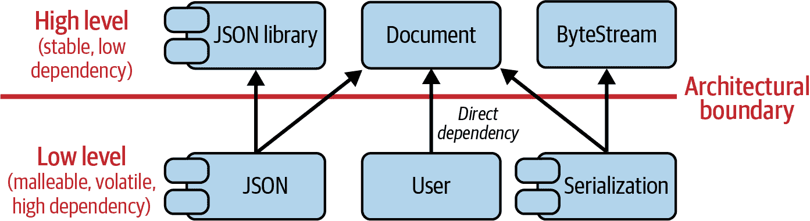
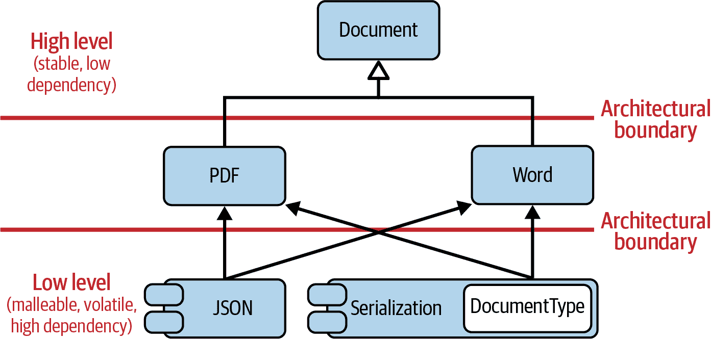

# 第一章：软件设计的艺术

软件设计是什么？为什么你应该关注它？在本章中，我将为本书的软件设计设定舞台。我将总结软件设计的一般概念，帮助你理解它对项目成功的至关重要性，以及为什么这是你应该做到的一件事。但你也会看到，软件设计是复杂的。非常复杂。事实上，它是软件开发中最复杂的部分。因此，我还将解释几个软件设计原则，这些原则将帮助你保持在正确的道路上。

在“指南 1：理解软件设计的重要性”中，我将专注于宏观视角并解释软件的预期变更。因此，软件应能够应对变更。然而，说起来容易做起来难，因为现实中的耦合和依赖使得作为开发者的生活变得更加困难。软件设计正是应对这一问题的方法。我将介绍软件设计作为管理依赖和抽象的艺术——软件工程的一个重要组成部分。

在“指南 2：为变更设计”中，我将明确讨论耦合和依赖，并帮助你理解如何为变更设计，以及如何使软件更具适应性。为此，我将介绍*单一责任原则（SRP）*和*不重复自己原则（DRY）*，这些原则将帮助你实现这一目标。

在“指南 3：避免人为耦合的接口分离”中，我将扩展有关耦合的讨论，并特别讨论通过接口进行的耦合。我还将介绍*接口隔离原则（ISP）*作为减少接口引发的人为耦合的手段。

在“测试性设计指南 4”中，我将专注于由人为耦合导致的测试性问题。特别是，我将提出如何测试私有成员函数的问题，并展示唯一真正的解决方案是关注责任分离的连贯应用。

在“指南 5：为扩展设计”中，我将讨论一种重要的变更类型：扩展。就像代码应该易于更改一样，它也应该易于扩展。我将为你提供如何实现这一目标的想法，并展示*开闭原则（OCP）*的价值。

# 指南 1：理解软件设计的重要性

如果我问你最重要的代码属性是什么，经过一番思考，你可能会说像可读性、测试性、可维护性、可扩展性、可重用性和可伸缩性等。我完全同意。但是，如果现在我问你如何实现这些目标，你很可能会开始列出一些 C++特性：RAII、算法、lambda、模块等等。

## 特性不是软件设计。

是的，C++提供了很多特性。非常多！几乎 2,000 页的印刷 C++标准中大约一半用于解释语言机制和特性。¹ 自 C++11 发布以来，还有一个明确的承诺：每三年，C++标准化委员会会为我们提供一个新的 C++标准，附带全新的特性。知道这一点，不难理解为什么在 C++社区中特性和语言机制的重视如此之高。大多数书籍、讲座和博客都专注于特性、新库和语言细节。²

几乎感觉特性是 C++编程中最重要的事情，对 C++项目的成功至关重要。但老实说，它们并不是。无论是所有特性的知识还是选择 C++标准都不能为项目的成功负责。不，你不应该期望特性来拯救你的项目。相反：即使使用旧的 C++标准，即使只使用可用特性的一个子集，项目也可以非常成功。撇开软件开发的人文因素不谈，对于项目成功或失败的问题，更为重要的是软件的总体*结构*。最终是结构决定了可维护性：修改代码、扩展代码和测试代码有多容易？如果不能轻松修改代码、添加新功能，并且由于测试的正确性而对其有信心，那么项目就接近其生命周期的末尾。结构也决定了项目的可扩展性：在项目的愿景实现之前，项目可以增长到多大程度，以至于它不能支撑自身的重量？多少人能够在项目中工作，而不会互相干扰？

总体结构是项目的设计。设计在项目成功中起到比任何特性更为核心的作用。优秀的软件并不主要是关于正确使用任何特性；相反，它关乎坚实的架构和设计。优秀的软件设计可以容忍一些糟糕的实现决策，但糟糕的软件设计不能仅仅通过英雄般地使用特性（无论是旧的还是新的）来拯救。

## 软件设计：管理依赖和抽象的艺术。

为什么软件设计对项目质量如此重要呢？嗯，假设现在一切都完美无缺，只要你的软件没有任何变化，也没有需要添加的内容，那么一切都好。然而，这种状态可能不会持续太久。可以合理地预期，会有一些变化发生。毕竟，软件开发中唯一不变的是变化。变化是我们所有问题（也是大多数解决方案）的驱动力。这就是为什么软件被称为*软*件：因为与硬件相比，它是柔软和可塑的。是的，*软*件预计应该容易适应不断变化的需求。但正如你可能知道的那样，现实中这种期望可能并不总是成立。

为了说明这一点，让我们假设你从问题追踪系统中选择了一个被团队评估为需要 2 单位的问题。在你自己的项目中，无论 2 单位意味着什么，它肯定听起来不像是一个大任务，所以你相信这将很快完成。怀着善意，你首先花了些时间理解预期的内容，然后开始在某个实体`A`上做出改变。由于测试的即时反馈（你很幸运有测试！），你很快就被提醒还需要解决实体`B`上的问题。这让你感到惊讶！你根本没想到`B`也会牵扯其中。尽管如此，你还是继续适应了`B`。然而，令人意外的是，夜间构建显示这导致`C`和`D`停止工作。在继续之前，你现在深入调查了一下问题，发现问题的根源遍布代码库的大部分区域。这个最初看起来无辜的小任务已经演变成了一个大的、潜在风险的代码修改。³ 你解决问题的信心已经消失。你这周剩下的计划也一样。

这个故事也许对你来说很熟悉。也许你甚至可以贡献一些自己的战斗经历。事实上，大多数开发者都有类似的经历。而且这些经历的大多数都源于同一个麻烦的根源。通常问题可以归结为一个词：*依赖*。正如肯特·贝克在他关于测试驱动开发的书中所表达的那样：⁴

> 在各个层面上，依赖性是软件开发的关键问题。

依赖性是每个软件开发人员的梦魇。你可能会争辩说：“当然会有依赖性。不同的代码片段怎样才能协同工作呢？”当然，你是正确的。不同的代码片段需要协同工作，这种交互总会创建某种形式的耦合。然而，虽然有必要的、不可避免的依赖关系，但也存在我们因为缺乏对底层问题的理解、没有明确的大局观或者没有足够注意而无意中引入的人为依赖关系。不用说，这些人为依赖关系是有害的。它们使我们更难理解软件、改变软件、添加新功能和编写测试。因此，软件开发人员的首要任务，如果不是唯一的任务，就是尽量将人为依赖关系降到最低。

减少依赖性是软件架构和设计的目标。用罗伯特·C·马丁的话来说：⁵

> 软件架构的目标是尽量减少构建和维护所需系统所需的人力资源。

架构和设计是任何项目中减少工作量的必要工具。它们处理依赖关系，并通过抽象降低复杂性。用我的话来说：⁶

> 软件设计是管理软件组件之间相互依赖的艺术。它旨在最小化人为（技术性）依赖关系，并引入必要的抽象和妥协。

是的，软件设计是一门艺术。它不是一门科学，也没有一套简单清晰的答案。⁷ 设计的整体图景往往容易使我们困惑，我们被软件实体的复杂相互依赖所压倒。但我们试图通过引入适当类型的抽象来处理这种复杂性并将其减少。这样一来，我们将详细程度保持在合理的水平。然而，在团队中，个别开发人员对架构和设计可能有不同的理解。我们可能无法实现自己对设计的愿景，不得不妥协以继续前进。

###### 提示

“抽象”这个术语在不同的上下文中使用。它用于将功能和数据项组织成数据类型和函数。但它也用于描述共同行为的建模以及一组需求和期望的表示。在本书中关于软件设计，我主要用这个术语来指代后者（特别是见第二章）。

请注意，在前面的引用中，“架构”和“设计”这两个词可以互换，因为它们非常相似并且具有相同的目标。然而它们并不相同。如果您看看软件开发的三个层次，这些相似之处和差异将变得清晰。

## 软件开发的三个层次

*软件架构* 和 *软件设计* 只是软件开发的三个层次之一。它们还包括 *实施细节* 的层次。图 1-1 概述了这三个层次。

为了让您对这三个层次有所了解，让我们从一个关于架构、设计和实施细节之间关系的现实世界例子开始。想象您是一名建筑师。不，不要想象自己坐在电脑前的舒适椅子上，旁边放着一杯热咖啡，而是想象自己在一个建筑工地外面。是的，我说的是建筑师。⁸ 作为这样的建筑师，您将负责房屋的所有重要属性：它与社区的融合、结构完整性、房间的布置、管道等等。您还将关注它的外观和功能特性——也许是一个大客厅，厨房和餐厅之间的便捷通道等等。换句话说，您将负责整体架构，这些事情稍后难以改变，但您也会处理关于建筑的更小设计方面。然而，很难区分二者：架构和设计之间的边界看起来模糊且不明确分开。


###### 图 1-1\. 软件开发的三个层次：*软件架构*、*软件设计* 和 *实施细节*。*惯用语* 可以是设计或实施模式。

然而，这些决定将是您责任的终点。作为一名架构师，您不必担心冰箱、电视或其他家具的摆放位置。您不会处理所有关于放置图片和其他装饰品的巧妙细节。换句话说，您不会处理细节；您只需确保业主拥有良好生活所需的结构。

在这个隐喻中，家具和其他“巧妙细节”对应于软件开发的最低和最具体的层次，即实现细节。这一层次处理解决方案如何实现。你选择必要的（和可用的）C++标准或其任何子集，以及使用适当的特性、关键字和语言细节，并处理诸如内存获取、异常安全性、性能等方面。这也是*实现模式*的层次，例如`std::make_unique()`作为*工厂函数*，`std::enable_if`作为显式受益于 SFINAE 的经常性解决方案等。⁹

在软件设计中，你开始关注整体图景。关于可维护性、可变性、可扩展性、可测试性和可伸缩性的问题在这个层次上更加突出。软件设计主要涉及软件实体之间的交互，这些实体在前面的隐喻中由房间、门、管道和电缆的布置表示。在这个层次上，你处理组件（类、函数等）的物理和逻辑依赖关系。¹⁰ 这是 Visitor、Strategy 和 Decorator 等设计模式的层次，它们定义了软件实体之间的依赖结构，如第三章中所述。这些通常可以从一种语言转移到另一种语言，帮助你将复杂的事物分解为易于理解的部分。

*软件架构*是三个层次中最模糊、最难以用语言表达的层次。这是因为没有普遍公认的软件架构定义。虽然对于架构的确切定义可能有很多不同看法，但有一点是所有人似乎都同意的：架构通常涉及到你的软件中最难以在未来改变的重要决策：

> 架构是那些你希望在项目早期就能正确选择的决策，但实际上并不比其他决策更容易做对。¹¹
> 
> Ralph Johnson

在软件架构中，你会使用诸如*客户端-服务器架构*、*微服务*等架构模式。¹² 这些模式也涉及到如何设计系统，即你可以修改其中的一部分而不影响软件的其他部分。与*软件设计*模式类似，它们定义并处理软件实体之间的结构和相互依赖关系。然而，与设计模式不同的是，它们通常处理的是软件中的关键角色，即你的软件中的大实体（例如模块和组件），而不是类和函数。

从这个角度来看，软件架构代表了你的软件方法的整体战略，而软件设计则是使战略生效的战术。这个图景的问题在于没有对“大”的定义。特别是随着微服务的出现，越来越难以明确划分小和大的实体。¹³

因此，架构通常被描述为项目中的专家开发者认为的关键决策。

让架构、设计和细节之间的分离变得更加困难的是“惯用语”的概念。惯用语是常用的但与语言相关的解决方案，用于解决重复出现的问题。因此，惯用语也代表一种模式，但可以是实现模式或设计模式中的任何一种。¹⁴ 更宽泛地说，C++惯用语是 C++社区的最佳实践，无论是设计还是实现。在 C++中，大多数惯用语属于实现细节的范畴。例如，有[*拷贝并交换惯用语*](https://oreil.ly/hioCd)，你可能从拷贝赋值操作符的实现中了解到，以及[*RAII 惯用语*](https://oreil.ly/55blq)（资源获取即初始化——如果你还不熟悉，请参阅你的第二喜欢的 C++书籍¹⁵）。这些惯用语都不引入抽象，也不帮助解耦。但它们对于实现良好的 C++代码至关重要。

我听到你问：“能不能再具体一点？RAII 也提供某种形式的解耦吗？它不是将资源管理与业务逻辑分离吗？”你说得对：RAII 将资源管理和业务逻辑分离。但它不是通过解耦（即抽象）来实现这一点，而是通过封装。抽象和封装都有助于使复杂系统更易于理解和修改，但抽象解决的是软件设计层面上出现的问题和问题，而封装则解决实现细节层面上出现的问题和问题。引用[Wikipedia](https://oreil.ly/BeFXr)的话：

> RAII 作为一种资源管理技术的优势在于它提供了封装、异常安全性[...]和局部性[...]。封装是因为资源管理逻辑在类中定义一次，而不是在每个调用点上定义。

虽然大多数惯用语属于实现细节的范畴，但也有属于软件设计范畴的惯用语。两个例子是*非虚拟接口（NVI）惯用语*和*Pimpl 惯用语*。这两个惯用语基于两个经典的设计模式：*模板方法*设计模式和*桥接*设计模式。¹⁶ 它们引入了抽象，并帮助解耦和设计以便变更和扩展。

## 关注功能

如果软件架构和软件设计如此重要，那么为什么我们在 C++ 社区如此强调功能？为什么我们制造了一个假象，即 C++ 标准、语言机制和功能对项目至关重要？我认为有三个很强的理由。首先，因为有如此多的功能，有时候还带有复杂的细节，我们需要花费大量时间讨论如何正确使用它们。我们需要形成一个共识，哪种用法是好的，哪种用法是不好的。作为一个社区，我们需要发展出一种习惯用法的 C++ 的感觉。

第二个原因是我们可能对功能设置了错误的期望。例如，让我们考虑一下 C++20 模块。不详细讨论，这个功能确实可能被认为是自 C++ 开始以来最大的技术革新。模块最终可能会结束将头文件包含到源文件中的可疑和繁琐做法。

由于这种潜力，对该功能的期望是巨大的。有些人甚至期望模块通过修复其结构性问题来拯救他们的项目。不幸的是，模块很难满足这些期望：模块并不改善代码的结构或设计，而只能表示当前的结构和设计。模块不能修复您的设计问题，但它们可能能够显现出缺陷。因此，模块根本不能拯救您的项目。因此，我们可能确实给功能设置了太多或错误的期望。

最后但同样重要的是，尽管功能非常多且复杂，与软件设计的复杂性相比，C++ 功能的复杂性是小的。解释功能的一组规则（无论它们包含多少特殊情况）要容易得多，比解释如何最佳地解耦软件实体要容易得多。

尽管与功能相关的问题通常都有一个很好的答案，但在软件设计中，常见的答案是“这取决于”。这个答案甚至可能不是经验不足的证据，而是意识到使代码更易维护、更易变更、更易扩展、更易测试和更易扩展的最佳方法在很大程度上取决于许多项目特定因素之间复杂的相互作用解耦，可能是人类有史以来最具挑战性的事业之一：

> 设计和编程是人类活动；忘记这一点，一切都将失去。¹⁷

对我来说，这三个原因的结合是为什么我们如此关注功能。但请不要误解。这并不是说功能不重要。相反，功能 *是* 重要的。是的，有必要讨论功能，并学习如何正确使用它们，但再次强调，单靠它们无法拯救您的项目。

## 关注软件设计和设计原则

虽然功能很重要，当然也很好谈论它们，但软件设计更为重要。软件设计是至关重要的。我甚至会认为它是我们项目成功的基础。因此，在本书中，我将尝试真正专注于软件设计和设计原则，而不是功能。当然，我仍会展示良好且最新的 C++代码，但我不会强迫使用最新和最优语言的补充。¹⁸ 当然，当合理且有益时，我会使用一些新功能，例如 C++20 的概念，但我不会在到处使用`noexcept`，或者使用`constexpr`。¹⁹ 相反，我将尝试解决软件的困难问题。我将大部分时间专注于软件设计，设计决策的理由，设计原则，管理依赖关系和处理抽象化。

总之，软件设计是编写软件的关键部分。软件开发人员应该对软件设计有很好的理解，以编写良好、可维护的软件。毕竟，好的软件成本低廉，而糟糕的软件则代价高昂。

# 准则 2：为变更设计

对于良好软件的一个基本期望是它能够轻松变更。这个期望甚至是软件这个词的一部分。与硬件相比，软件预期能够轻松适应不断变化的需求（另见“准则 1：理解软件设计的重要性”）。然而，从你自己的经验中，你可能能够说出，修改代码通常并不容易。相反，有时一个看似简单的变更可能成为一个持续一周的努力。

## 关注分离

减少人为依赖关系并简化变更的最佳且经验证的解决方案之一是关注分离。这个思想的核心是分割、隔离或提取功能的片段。²⁰

> 将系统分解为小而明确命名的可理解部件使工作更快。

关注关注分离背后的意图是更好地理解和管理复杂性，从而设计更模块化的软件。这个思想可能和软件本身一样古老，因此已经被赋予了许多不同的名称。例如，同样的思想被《实用程序员》称为*正交性*。²¹ 他们建议分离软件的正交方面。Tom DeMarco 称之为*内聚性*。²²

> 内聚性是模块内部元素关联强度的度量。高度内聚的模块是由语句和数据项组成的集合，应该作为一个整体来处理，因为它们关系密切。任何试图将它们分开的尝试只会导致耦合增加和可读性降低。

在*SOLID*原则中，²³这是最为成熟的设计原则集之一，这个理念被称为*单一责任原则（SRP）*：

> 一个类应该只有一个变化的理由。²⁴

尽管这个概念很古老，并且以许多名称广为人知，但许多试图解释关注点分离的尝试更多地提出问题而非回答。对于 SRP 来说尤其如此。单单这个设计原则的名字就引发了问题：什么是一个责任？什么是“单一”的责任？为了澄清关于 SRP 的模糊性，一个常见的尝试是以下内容：

> 一切事物应该只做一件事。

不幸的是，这个解释在含糊性方面很难超越。就像“责任”这个词并没有多少含义一样，“只做一件事”并不能更多地阐明它。

不管名字如何，理念始终如一：只把真正应该放在一起的东西放在一起，把不严格属于同一类的东西分开。换句话说：分开那些因不同原因而变化的东西。通过这样做，你可以减少代码不同方面之间的人为耦合，帮助你使软件更能适应变化。在最好的情况下，你可以在精确一个地方改变软件的特定方面。

## 一个人为耦合的例子

让我们通过一个代码示例来阐明关注点分离。我确实有一个很好的例子：我向你展示抽象的`Document`类：

```cpp
//#include <some_json_library.h>  // Potential physical dependency 
class Document
{
 public:
   // ...
   virtual ~Document() = default;

   virtual void exportToJSON( /*...*/ ) const = 0;  
   virtual void serialize( ByteStream&, /*...*/ ) const = 0;  
   // ... };

```

这听起来像是各种文档的一个非常有用的基类，不是吗？首先，有`exportToJSON()`函数（）。所有派生类都必须实现`exportToJSON()`函数，以便从文档生成[JSON 文件](https://oreil.ly/YWrsw)。这将非常有用：不需要了解特定类型的文档（我们可以想象最终会有 PDF 文档、Word 文档等），我们总是可以导出为 JSON 格式。很棒！其次，有一个`serialize()`函数（）。这个函数让你可以通过`ByteStream`把一个`Document`转换成字节。你可以把这些字节存储在一些持久系统中，比如文件或数据库。当然，我们可以期待还有许多其他有用的函数，可以让我们几乎可以为这个文档做任何事情。

然而，我可以看出你脸上的皱眉。不，你看起来并不确信这是一个好的软件设计。这可能是因为你对这个例子非常怀疑（看起来太美好以至于不真实）。或者可能是因为你从艰难的经验中学到，这种设计最终会带来麻烦。你可能已经经历过，使用常见的面向对象设计原则将数据和操作数据的函数捆绑在一起可能会很容易导致不幸的耦合。我同意：尽管这个基类看起来像一个完美的整体包，甚至看起来像它拥有我们可能需要的一切，但这种设计很快就会带来麻烦。

这是糟糕的设计，因为它包含许多依赖关系。当然，存在明显的直接依赖，比如对`ByteStream`类的依赖。然而，这种设计也倾向于引入人为依赖，这会使后续的更改变得更加困难。在这种情况下，存在三种类型的人为依赖。其中两种是由`exportToJSON()`函数引入的，另一种是由`serialize()`函数引入的。

首先，`exportToJSON()`需要在派生类中实现。是的，没有选择，因为它是一个[纯虚函数](https://oreil.ly/1u9at)（用`= 0`序列表示，所谓的*纯指示符*）。由于派生类很可能不想承担手动实现 JSON 导出的负担，它们会依赖于外部的第三方 JSON 库：[*json*](https://oreil.ly/MqB03)、[*rapidjson*](https://oreil.ly/jNMsz)或[*simdjson*](https://oreil.ly/5dBzC)。无论你选择哪个库，由于`exportToJSON()`成员函数的存在，派生文档突然依赖于这个库。很可能，所有派生类由于一致性原因会依赖于同一个库。因此，派生类并不是真正独立的；它们与特定的设计决策人为耦合在一起。²⁵ 另外，对特定 JSON 库的依赖性肯定会限制层次结构的可重用性，因为它将不再是轻量级的。而切换到另一个库将会导致重大变化，因为所有派生类都必须进行适应。²⁶

当然，`serialize()`函数也引入了相同类型的人为依赖。很可能`serialize()`也会基于第三方库来实现，比如[protobuf](https://oreil.ly/z6Kgr)或[Boost.serialization](https://oreil.ly/ySJLk)。这显著恶化了依赖情况，因为它在两个正交、不相关的设计方面（即 JSON 导出和序列化）之间引入了耦合。一个方面的变化可能导致另一个方面的变化。

在最坏的情况下，`exportToJSON()` 函数可能会引入第二个依赖。在 `exportToJSON()` 调用中期望的参数可能会意外地反映出所选 JSON 库的一些实现细节。在这种情况下，最终切换到另一个库可能会导致 `exportToJSON()` 函数签名的变更，随后导致所有调用者的变更。因此，对所选 JSON 库的依赖可能会意外地比预期更广泛。

`serialize()` 函数引入了第三种依赖。由于这个函数，从 `Document` 派生的类依赖于关于如何序列化文档的全局决策。我们使用什么格式？我们使用小端还是大端？我们是否需要添加这些字节表示一个 PDF 文件还是 Word 文件的信息？如果是的话（我认为这很可能），我们如何表示这样的文档？通过一个整数值吗？例如，我们可以为此目的使用一个枚举值：²⁷

```cpp
enum class DocumentType
{
   pdf,
   word,
   // ... Potentially many more document types
};
```

这种方法在序列化中非常常见。然而，如果在 `Document` 类的实现中使用这种低级文档表示，我们会意外地耦合所有不同类型的文档。每个派生类都会隐含地知道所有其他 `Document` 类型。因此，添加新类型的文档将直接影响所有现有的文档类型。这将是一个严重的设计缺陷，因为这会使更改变得更加困难。

不幸的是，`Document` 类促进了许多不同种类的耦合。因此，`Document` 类不是一个良好类设计的好例子，因为它不容易改变。相反，它很难改变，因此是 SRP 的一个违反的很好例子：因为我们已经在几个正交但无关的方面之间创建了强耦合，所以从 `Document` 派生的类和文档的使用者可能因以下任一原因而改变：

+   `exportToJSON()` 函数的实现细节因为直接依赖于所使用的 JSON 库而改变。

+   `exportToJSON()` 函数的签名因底层实现的改变而改变。

+   `Document` 类和 `serialize()` 函数因为直接依赖于 `ByteStream` 类而改变。

+   `serialize()` 函数的实现细节因为直接依赖于实现细节而改变。

+   所有类型的文档都因对 `DocumentType` 枚举的直接依赖而改变。

显然，这种设计促进了更多的变化，每一次变更都会变得更加困难。当然，在一般情况下，还存在着附加的正交方面被人为地耦合在文档内部的风险，这会进一步增加进行更改的复杂性。此外，其中一些更改显然不仅限于代码库中的单一位置。特别是，对 `exportToJSON()` 和 `serialize()` 的实现细节的更改不仅限于单个类，而可能影响所有类型的文档（如 PDF、Word 等）。因此，一次更改将影响代码库中多个地方，这带来了维护风险。

## 逻辑耦合与物理耦合

耦合不仅限于逻辑耦合，还延伸到物理耦合。图 1-2 说明了这种耦合。假设我们的架构低层存在一个需要使用高层文档的 `User` 类。当然，`User` 类直接依赖于 `Document` 类，这是给定问题的必要依赖——一个内在的依赖，因此这不应成为我们的关注点。然而，`Document` 对所选的 JSON 库的（潜在）物理依赖性以及对 `ByteStream` 类的直接依赖性会导致 `User` 对 JSON 库和 `ByteStream` 的间接、传递依赖性，而这些在我们架构的最高层。在最坏的情况下，这意味着对 JSON 库或 `ByteStream` 类的更改会影响到 `User`。希望很容易看出，这是一种人为的、非故意的依赖关系：`User` 不应该依赖于 JSON 或序列化。

###### 注意

我应明确指出，`Document` 可能会对所选的 JSON 库存在*潜在*的物理依赖性。如果 `<Document.h>` 头文件包含来自所选 JSON 库的任何头文件（如在 “人工耦合示例” 中的代码片段中所示），例如因为 `exportToJSON()` 函数期望基于该库的某些参数，则存在对该库的明确依赖关系。然而，如果接口能够适当地抽象这些细节，并且 `<Document.h>` 头文件没有包含任何来自 JSON 库的内容，则可以避免物理依赖性。因此，这取决于依赖关系能够（并且是如何）被抽象化。


###### 图 1-2\. `User` 和 JSON、序列化等正交方面之间强传递的物理耦合。

“高级别、低级别——我现在搞混了”，你抱怨道。是的，我知道这两个术语通常会引起一些混淆。因此，在我们继续之前，让我们就高级别和低级别的术语达成一致。这两个术语的起源与我们在[*统一建模语言（UML）*](https://oreil.ly/s0ID2)中绘制图表的方式有关：我们认为稳定的功能出现在顶部，即高级别。那些更频繁变化，因此被认为是不稳定或可塑性更大的功能出现在底部，即低级别。不幸的是，当我们绘制架构图时，我们通常试图展示事物如何彼此依赖，因此最稳定的部分出现在架构的底部。这当然会造成一些混淆。无论事物如何被绘制，只要记住这些术语：*高级别*指的是你架构中稳定的部分，而*低级别*指的是更频繁变化或更有可能变化的方面。

回到问题本身：SRP 建议我们应该分离关注点和那些不真正属于其中的事物，即非内聚的（粘合的）事物。换句话说，它建议我们将因不同原因而变化的事物分离成*变化点*。图 1-3 显示了如果我们将 JSON 和序列化方面分离出来，则耦合情况如何。



###### 图 1-3\. 遵循*SRP*可以解决`User`与 JSON 和序列化之间的人为耦合。

根据这些建议，`Document`类被按照以下方式重构：

```cpp
class Document
{
 public:
   // ...
   virtual ~Document() = default;

   // No more 'exportToJSON()' and 'serialize()' functions.
   // Only the very basic document operations, that do not
   // cause strong coupling, remain.
   // ...
};
```

JSON 和序列化方面并不是`Document`类基本功能的一部分。`Document`类应该仅仅表示不同种类文档的基本操作。所有正交的方面应该被分离开来。这将使得修改变得更加容易。例如，通过将 JSON 方面隔离为一个独立的变化点并成为新的`JSON`组件，从一个 JSON 库切换到另一个库只会影响到这一个组件。修改可以在一个地方完成，并且与所有其他正交方面隔离开来。同时，通过多个 JSON 库支持 JSON 格式也会更加容易。此外，任何关于文档序列化方式的改变只会影响到代码中的一个组件：新的`Serialization`组件。同样，`Serialization`将作为一个变化点，促使隔离和简单的改变。这将是最优的情况。

在您对 `Document` 示例的初步失望之后，我看到您再次变得更加快乐。也许您的脸上甚至露出了“我知道了！”的微笑。然而，您仍然不完全满意：“是的，我同意分离关注点的一般想法。但我该如何组织我的软件来分离关注点呢？我该做什么才能让它起作用？”这是一个很好的问题，但是有很多答案，我将在接下来的章节中详细讨论。然而，第一个也是最重要的一点是识别变化点，即您的代码中预期变化的某个方面。这些变化点应该被提取、隔离和包装，以便不再依赖于这些变化。这最终将有助于使变更变得更容易。

“但这仍然只是表面的建议！”我听到你说。你说得对。不幸的是，没有单一的答案，也没有简单的答案。这取决于情况。但我承诺在接下来的章节中会提供许多关于如何分离关注点的具体答案。毕竟，这是一本关于软件设计的书，即一本关于管理依赖关系的书。作为一个小小的引子，在第 3 章 中，我将介绍解决这个问题的一个通用而实用的方法：设计模式。在这个总体思路下，我将展示如何使用不同的设计模式来分离关注点。例如，*访问者*、*策略* 和 *外部多态性* 设计模式让人想起。所有这些模式都有不同的优缺点，但它们共享一个特性，即引入某种抽象以帮助您减少依赖关系。此外，我承诺将仔细研究如何在现代 C++ 中实现这些设计模式。

###### 提示

我将在“指南 16：使用访问者扩展操作” 中介绍访问者设计模式，并在“指南 19：使用策略来隔离操作方式” 中介绍策略设计模式。外部多态性设计模式将是“指南 31：使用外部多态性进行非侵入式运行时多态性” 的主题。

## 不要重复自己

另一个重要的变更性方面是有一个第二个方面。为了解释这一点，我将引入另一个例子：项目层次结构。图 1-4 给出了这个层次结构的印象。


###### 图 1-4\. `Item` 类层次结构。

在这个层次结构的顶部是`Item`基类：

```cpp
//---- <Money.h> ----------------

class Money { /*...*/ };

Money operator*( Money money, double factor );
Money operator+( Money lhs, Money rhs );

//---- <Item.h> ----------------

#include <Money.h>

class Item
{
 public:
   virtual ~Item() = default;
   virtual Money price() const = 0;
};
```

`Item` 基类代表具有价格标签（由 `Money` 类表示）的任何类型的项目的抽象。通过 `price()` 函数，您可以查询该价格。当然，有许多可能的项目，但为了说明目的，我们限制在 `CppBook` 和 `ConferenceTicket`：

```cpp
//---- <CppBook.h> ---------------- 
#include <Item.h>
#include <Money.h>
#include <string>

class CppBook : public Item
{
 public:
   explicit CppBook( std::string title, std::string author, Money price )  
      : title_( std::move(title) )
      , author_( std::move(author) )
      , priceWithTax_( price * 1.15 )  // 15% tax rate
   {}

   std::string const& title() const { return title_; }     
   std::string const& author() const { return author_; }   

   Money price() const override { return priceWithTax_; }  

 private:
   std::string title_;
   std::string author_;
   Money priceWithTax_;
};

```

`CppBook` 类的构造函数需要以字符串形式提供书名和作者，并以 `Money` 形式提供价格（)。²⁸ 除此之外，你只能通过 `title()`、`author()` 和 `price()` 函数来访问书名、作者和价格（,  和 )。然而，`price()` 函数有点特殊：显然，书籍是需要交税的。因此，书籍的原价需要根据给定的税率进行调整。在这个例子中，假设一个虚构的税率为 15%。

`ConferenceTicket` 类是 `Item` 的第二个示例：

```cpp
//---- <ConferenceTicket.h> ---------------- 
#include <Item.h>
#include <Money.h>
#include <string>

class ConferenceTicket : public Item
{
 public:
   explicit ConferenceTicket( std::string name, Money price )  
      : name_( std::move(name) )
      , priceWithTax_( price * 1.15 )  // 15% tax rate
   {}

   std::string const& name() const { return name_; }

   Money price() const override { return priceWithTax_; }

 private:
   std::string name_;
   Money priceWithTax_;
};

```

`ConferenceTicket` 类与 `CppBook` 类非常相似，但构造函数只需提供会议名称和价格（)。当然，你可以通过 `name()` 和 `price()` 函数分别访问会议名称和价格。然而，对于 C++ 会议，价格也需要纳税。因此，我们再次根据虚构的税率 15% 调整原始价格。

有了这个功能，我们可以在 `main()` 函数中继续创建一些 `Item`：

```cpp
#include <CppBook.h>
#include <ConferenceTicket.h>
#include <algorithm>
#include <cstdlib>
#include <memory>
#include <vector>

int main()
{
   std::vector<std::unique_ptr<Item>> items{};

   items.emplace_back( std::make_unique<CppBook>("Effective C++", 19.99) );
   items.emplace_back( std::make_unique<CppBook>("C++ Templates", 49.99) );
   items.emplace_back( std::make_unique<ConferenceTicket>("CppCon", 999.0) );
   items.emplace_back( std::make_unique<ConferenceTicket>("Meeting C++", 699.0) );
   items.emplace_back( std::make_unique<ConferenceTicket>("C++ on Sea", 499.0) );

   Money const total_price =
      std::accumulate( begin(items), end(items), Money{},
         []( Money accu, auto const& item ){
            return accu + item->price();
         } );

   // ...

   return EXIT_SUCCESS;
}
```

在 `main()` 中，我们创建了一些物品（两本书和三个会议票），并计算了所有物品的总价格。²⁹ 总价格当然包括虚构的 15% 税率。

听起来是一个不错的设计。我们已经分离了特定种类的物品，并能够在隔离环境中改变每个物品的价格计算方式。看起来我们已经实现了 SRP，并提取和隔离了变化点。当然，还有更多的物品。很多很多。而且所有这些物品都将确保适用的税率被正确考虑。太棒了！然而，尽管这个 `Item` 层次结构将在一段时间内让我们感到满意，但这个设计不幸地有一个显著的缺陷。我们可能今天意识不到，但在软件问题的背后，总有一个潜在的问题在遥远的阴影中：变化。

如果由于某些原因税率发生变化会怎么样？如果 15% 的税率降低到 12% 呢？或者提高到 16% 呢？我仍然能听到当初设计被提交到代码库时的争论声：“不，那绝不会发生！”然而，最意想不到的事情可能会发生。例如，在德国，税率在 2021 年的半年内从 19% 降低到 16%。当然，这意味着我们需要在代码库中改变税率。我们在哪里应用这个改变？在目前的情况下，这个改变几乎会影响到每一个继承自 `Item` 类的类。这个改变会遍布整个代码库！

正如 SRP 建议分离变化点一样，我们应该注意不要在代码库中重复信息。尽管每件事都应该有一个单一责任（一个变更的唯一原因），但每个责任在系统中应该只存在一次。这个思想通常称为“不要重复自己”（DRY）原则。该原则建议我们不要在许多地方重复一些关键信息，而是设计系统使我们只需在一个地方进行更改。在最佳情况下，税率应该在确切的一个地方表示，以便您可以轻松地进行更改。

通常，SRP 和 DRY 原则可以非常好地配合。遵循 SRP 通常也会导致遵循 DRY，反之亦然。然而，有时遵循这两个原则需要额外的步骤。我知道你渴望了解这些额外步骤及如何解决问题，但在这一点上，指出 SRP 和 DRY 的一般思想已足够。我承诺会重新审视这个问题，并向您展示如何解决它（参见“指南 35：使用装饰器分层地添加定制”）。

## 避免过早地分离关注点。

到目前为止，希望我已经说服你遵循 SRP 和 DRY 是非常合理的想法。你甚至可能如此坚定，计划将所有东西——所有类和函数——分离成最微小的功能单元。毕竟，这是目标，对吧？如果你现在正这么想，请停下！深呼吸。再深一口。然后请仔细听凯特里娜·特拉杰夫斯卡的智慧：³⁰

> 不要试图实现 SOLID 原则，而是利用 SOLID 来实现可维护性。

SRP 和 DRY 都是实现更好可维护性和简化变更的工具。它们不是你的目标。虽然长远来看两者都非常重要，但在没有清晰想法的情况下分离实体可能会非常适得其反。为变更而设计通常会偏向于特定类型的变更，但不幸的是可能会使其他类型的变更变得更加困难。这种哲学是众所周知的“你不会需要它”（YAGNI）原则的一部分，该原则警告你不要过度设计（也请参阅“指南 5：设计用于扩展”）。如果有明确的计划，如果你知道可以预期什么样的变化，那么就应用 SRP 和 DRY 使这种变化变得简单。然而，如果你不知道可以预期什么样的变化，那么不要猜测——只需等待。等到你对可以预期什么样的变化有了清晰的想法，然后重构以尽可能地简化变化。

###### 小贴士

别忘了轻松修改事物的一个方面是拥有单元测试，这些测试可以确认修改没有破坏预期的行为。

总之，软件中预期会发生变化，因此设计变更至关重要。分离关注点并尽量减少重复，使您可以轻松地进行变更，而无需担心破坏其他正交方面。

# 指导方针 3：分离接口以避免人为耦合

让我们重新审视来自“指导方针 2：为变更设计”的 `Document` 示例。我知道，到现在为止你可能已经看够了文档，但请相信，我们还没有结束。还有一个重要的耦合方面需要解决。这次我们不专注于 `Document` 类中的各个函数，而是整体接口：

```cpp
class Document
{
 public:
   // ...
   virtual ~Document() = default;

   virtual void exportToJSON( /*...*/ ) const = 0;
   virtual void serialize( ByteStream& bs, /*...*/ ) const = 0;
   // ...
};
```

## 将接口分离以分隔关注点

`Document` 要求派生类处理 JSON 导出和序列化两者。尽管从文档的角度来看，这似乎是合理的（毕竟，*所有* 文档都应该能导出为 JSON 并可序列化），但不幸的是，它引发了另一种耦合。想象一下以下用户代码：

```cpp
void exportDocument( Document const& doc )
{
   // ...
   doc.exportToJSON( /* pass necessary arguments */ );
   // ...
}
```

`exportDocument()` 函数专注于将给定文档导出为 JSON。换句话说，`exportDocument()` 函数并不关心文档的序列化或 `Document` 提供的任何其他方面。然而，由于 `Document` 接口的定义，由于耦合许多正交的方面在一起，`exportDocument()` 函数依赖的不仅仅是 JSON 导出。所有这些依赖关系都是不必要的和人为的。改变其中任何一个，例如 `ByteStream` 类或 `serialize()` 函数的签名，都会影响 *所有* 使用 `Document` 的用户，即使它们并不需要序列化。对于任何更改，包括 `exportDocument()` 函数在内的 *所有* 用户都需要重新编译、重新测试，并且在最坏的情况下重新部署（例如，如果它是在一个单独的库中提供）。如果 `Document` 类通过另一个函数扩展，比如导出到另一种文档类型，也会发生同样的情况。随着在 `Document` 中耦合更多正交功能，任何变化都可能在整个代码库中造成连锁反应。这实在令人沮丧，因为接口应该帮助解耦，而不是引入人为耦合。

这种耦合是由于违反了接口隔离原则（ISP），这是 *SOLID* 缩写中的 *I*：

> 客户端不应被强制依赖于它们不使用的方法³¹

ISP 建议通过隔离（解耦）接口来分离关注点。在我们的情况下，应该有两个独立的接口来表示 JSON 导出和序列化的两个正交方面：

```cpp
class JSONExportable
{
 public:
   // ...
   virtual ~JSONExportable() = default;

   virtual void exportToJSON( /*...*/ ) const = 0;
   // ...
};

class Serializable
{
 public:
   // ...
   virtual ~Serializable() = default;

   virtual void serialize( ByteStream& bs, /*...*/ ) const = 0;
   // ...
};

class Document
   : public JSONExportable
   , public Serializable
{
 public:
   // ...
};
```

这种分离并不使得`Document`类过时。相反，`Document`类仍然代表着对所有文档提出的要求。然而，这种关注点的分离现在使您能够最小化依赖，仅限于实际需要的函数集：

```cpp
void exportDocument( JSONExportable const& exportable )
{
   // ...
   exportable.exportToJSON( /* pass necessary arguments */ );
   // ...
}
```

以这种形式，仅依赖于分离的`JSONExportable`接口，`exportDocument()`函数不再依赖于序列化功能，因此也不再依赖于`ByteStream`类。因此，接口的分离有助于减少耦合。

“但这不仅仅是关注点分离吗？”你问道。“这不仅是 SRP 的另一个例子吗？”是的，确实如此。我同意我们实质上已经确定了两个正交的方面，将它们分开，并因此应用了 SRP 到`Document`接口。因此，我们可以说 ISP 和 SRP 是相同的。或者至少 ISP 是 SRP 的一个特例，因为 ISP 专注于接口。这种态度似乎是社区的共识，我也同意。然而，我仍然认为讨论 ISP 是有价值的。尽管 ISP 可能只是一个特例，但我认为它是一个重要的特例。不幸的是，很容易将不相关的正交方面聚合到一个接口中。甚至可能发生在*你*身上，你将分离的方面耦合到一个接口中。当然，我绝不是在暗示你有意这样做，而是无意地、偶然地。我们经常没有足够的注意这些细节。当然，你可能会争辩说，“我绝不会那样做。”然而，在“Guideline 19: Use Strategy to Isolate How Things Are Done”中，你将看到一个例子，可能会说服你这种情况有多容易发生。由于以后更改接口可能非常困难，我认为引起人们对这个接口问题的注意是值得的。因此，我没有放弃 ISP，而是将其作为 SRP 的一个重要和值得注意的案例包括在内。

## 减少模板参数的要求

尽管看起来 ISP 仅适用于基类，并且 ISP 主要是通过面向对象编程介绍的，但通过接口最小化依赖的一般思想也可以应用于模板。例如考虑`std::copy()`函数：

```cpp
template< typename InputIt, typename OutputIt >
OutputIt copy( InputIt first, InputIt last, OutputIt d_first );
```

在 C++20 中，我们可以应用*概念*来表达这些要求：

```cpp
template< std::input_iterator InputIt, std::output_iterator OutputIt >
OutputIt copy( InputIt first, InputIt last, OutputIt d_first );
```

`std::copy()`期望一对输入迭代器作为复制来源的范围，并且一个输出迭代器作为目标范围。它明确要求输入迭代器和输出迭代器，因为它不需要任何其他操作。因此，它最小化了对传递参数的要求。

假设`std::copy()`需要`std::forward_iterator`而不是`std::input_iterator`和`std::output_iterator`：

```cpp
template< std::forward_iterator ForwardIt, std::forward_iterator ForwardIt >
OutputIt copy( ForwardIt first, ForwardIt last, ForwardIt d_first );
```

这会不幸地限制`std::copy()`算法的有用性。我们将无法再从输入流复制，因为它们通常不提供多遍保证，也不允许我们写入。那将是不幸的。然而，专注于依赖关系，`std::copy()`现在将依赖于它不需要的操作和要求。传递给`std::copy()`的迭代器将被迫提供额外的操作，因此`std::copy()`会强加依赖关系。

这只是一个假设性的例子，但它说明了接口中关注点分离的重要性。显然，解决方案是意识到输入和输出能力是独立的方面。因此，在分离关注点并应用 ISP 之后，依赖关系显著减少了。

# 指南 4：设计可测试性

如“指南 1：理解软件设计的重要性”所讨论的，*软*件会变化。预期会变化。但每次在软件中改变某些东西时，都会存在意外破坏的风险。当然，这并非故意，而是无意之中，尽管你已尽力而为。风险始终存在。但作为一名有经验的开发者，你不会因此失眠。让风险存在吧——你不在乎。你有一些东西保护你免受意外破坏，一些东西将风险降到最低：你的测试。

拥有测试的目的是能够断言你的软件功能仍然正常工作，尽管不断变化。因此，显然，测试是你的保护层，你的救生衣。测试是必不可少的！但首先，你必须编写测试。为了编写测试并设置这个保护层，你的软件必须具备测试性：你的软件必须以一种可以测试的方式编写，最好是*容易*可以添加测试。这就引出了这个指南的核心：软件应设计为可测试性。

## 如何测试私有成员函数

“当然，我有测试”，你辩解道。“每个人都应该有测试。这是常识，不是吗？”我完全同意。我相信你的代码库配备了一个合理的测试套件。³² 但令人惊讶的是，尽管每个人都同意需要测试，但并非所有软件都是在这种意识下编写的。³³ 实际上，很多代码很难进行测试。有时候这只是因为代码本身并没有设计成可测试的。

为了给你一个想法，我有一个挑战给你。看看下面的`Widget`类。`Widget`包含一组`Blob`对象，偶尔需要更新这些对象。为此，`Widget`提供了`updateCollection()`成员函数，我们现在假设这个函数非常重要，我们需要为它编写一个测试。这就是我的挑战：你将如何测试`updateCollection()`成员函数？

```cpp
class Widget
{
   // ...
 private:
   void updateCollection( /* some arguments needed to update the collection */ );

   std::vector<Blob> blobs_;
   /* Potentially other data members */
};
```

我假设你立即看到真正的挑战：`updateCollection()` 成员函数被声明在类的私有部分。这意味着外部无法直接访问，因此也无法直接进行测试。所以，请花几秒钟思考一下……

“它是私有的，是的，但这并不是什么大挑战。有很多方法可以做到这一点，” 你说。我同意，你可以尝试多种方法。所以，请继续。你权衡了你的选择，然后提出了第一个想法：“好吧，最简单的方法是通过其他一些公共成员函数来测试这个函数，而这个公共成员函数内部调用`updateCollection()`函数。” 这听起来是个有趣的第一个想法。让我们假设当向集合添加新的`Blob`时，集合需要更新。调用`addBlob()`成员函数将触发`updateCollection()`函数：

```cpp
class Widget
{
 public:
   // ...
   void addBlob( Blob const& blob, /*...*/ )
   {
      // ...
      updateCollection( /*...*/ );
      // ...
   }

 private:
   void updateCollection( /* some arguments needed to update the collection */ );

   std::vector<Blob> blobs_;
   /* Potentially other data members */
};
```

尽管这听起来是个合理的做法，但如果可能的话，你应该避免这样做。你提出的是所谓的*白盒测试*。白盒测试了解某个函数的内部实现细节，并基于这些知识进行测试。这会使测试代码依赖于生产代码的实现细节。这种方法的问题在于软件是会变的。代码会变。细节会变。例如，将来可能会重写`addBlob()`函数，因此不再需要更新集合。如果发生这种情况，你的测试就不再执行其原本的任务了。你可能甚至都没有意识到，你会失去`updateCollection()`的测试。因此，白盒测试存在风险。就像你在生产代码中应该避免和减少依赖一样（参见“指南 1：理解软件设计的重要性”），你也应该避免测试和生产代码的细节之间的依赖。

我们真正需要的是*黑盒测试*。黑盒测试不对内部实现细节做任何假设，只测试预期行为。当然，这种测试也可能会失败，如果你改变了一些东西，但它不应该因为实现细节的变化而失败——只有当预期行为改变时才应该失败。

“好的，我明白你的意思。”你说。“但是你并不建议将`updateCollection()`函数设为公共的，对吧？”放心，我并不是在建议这样做。当然，有时这可能是一个合理的做法。但在我们的情况下，我怀疑这不是一个明智的举动。`updateCollection()`函数不应该仅仅是为了好玩而调用。它应该在正确的时间、出于良好的理由下调用，可能是为了保持某种不变量。这是我们不应该委托给用户的事情。所以不，我不认为将该函数作为`public`部分的一个好选择。

“好的，好的，我只是确认一下。那么我们就让测试类成为`Widget`类的`friend`，这样它将拥有完全访问权，并且可以无障碍地调用`private`成员函数。”

```cpp
class Widget
{
   // ...
 private:
   friend class TestWidget;

   void updateCollection( /* some arguments needed to update the collection */ );

   std::vector<Blob> blobs_;
   /* Potentially other data members */
};
```

是的，我们可以添加一个`friend`。假设有`TestWidget`测试夹具，包含了`Widget`类的所有测试。我们可以让这个测试夹具成为`Widget`类的`friend`。虽然这听起来像是另一个合理的方法，但我很遗憾再次打扰。是的，从技术上讲，这将解决问题，但从设计的角度来看，我们刚刚又引入了一个人为的依赖关系。通过积极地修改生产代码来引入`friend`声明，生产代码现在知道了测试代码的存在。虽然测试代码当然应该知道生产代码（这就是测试代码的目的），但生产代码不应该知道测试代码。这引入了一个循环依赖，这是一个不幸的人为依赖。

“你听起来好像这是世界上最糟糕的事情。真的那么糟吗？”嗯，有时这确实可能是一个合理的解决方案。它绝对是一个简单而快速的解决方案。然而，既然我们现在有时间讨论所有的选项，肯定有比添加一个`friend`更好的选择。

###### 注意

“我不想把事情弄得更糟，但是在 C++中，我们并没有很多`friend`。”是的，我知道，这听起来有点悲伤和孤单，但我当然是指关键字`friend`：在 C++中，`friend`并不是你的朋友。原因在于`friend`引入了耦合，大多数是人为的耦合，我们应该避免耦合。当然，对于好的`friend`，那些你无法没有的，可以做出一些例外，比如[隐式友元](https://oreil.ly/Lu6rq)，或者`friend`的惯用法，比如[*Passkey idiom*](https://oreil.ly/qEN0m)。测试更像是社交媒体上的朋友，因此将测试声明为`friend`并不像是一个明智的选择。

“好的，那么让我们从`private`改为`protected`，并让测试类从`Widget`类派生，这样测试类将完全访问`updateCollection()`函数：”

```cpp
class Widget
{
   // ...
 protected:
   void updateCollection( /* some arguments needed to update the collection */ );

   std::vector<Blob> blobs_;
   /* Potentially other data members */
};

class TestWidget : private Widget
{
   // ...
};
```

嗯，我必须承认，从技术上讲，这种方法是可行的。然而，你建议使用继承来解决这个问题告诉我，我们确实需要讨论继承的含义以及如何正确使用它。引用两位务实的程序员如下：³⁴

> 继承很少是答案。

由于我们很快就会集中讨论这个话题，让我先说一下，这感觉像是我们在滥用继承，仅仅是为了访问非公开成员函数。我非常确定这不是继承被发明的原因。使用继承来访问一个类的`protected`部分就像是对本应非常简单的事情使用重型武器的方法。毕竟，这几乎等同于将函数设为`public`，因为每个人都可以轻易访问。看起来我们真的没有设计这个类以便轻松测试。

“来吧，我们还能做什么？还是你真的希望我使用预处理器并将所有`private`标签定义为`public`？”：

```cpp
#define private public

class Widget
{
   // ...
 private:
   void updateCollection( /* some arguments needed to update the collection */ );

   std::vector<Blob> blobs_;
   /* Potentially other data members */
};
```

好的，让我们深呼吸一下。虽然这最后一种方法可能看起来有点滑稽，但请记住，我们现在已经超出了合理论据的范围。³⁵ 如果我们认真考虑使用预处理器来入侵`Widget`类的`private`部分，那么一切都完了。

## 真正的解决方案：分离关注

“好的，那么，我应该怎么做来测试`private`成员函数呢？你已经丢弃了所有的选择。” 不，不是所有的选择。我们还没有讨论我在“指导原则 2：为变更设计”中强调的一种设计方法：关注分离。在我们的代码库中，我的方法是将`private`成员函数从类中提取出来，使其成为一个独立的实体。在这种情况下，我倾向于将该成员函数提取为一个自由函数：

```cpp
void updateCollection( std::vector<Blob>& blobs
                     , /* some arguments needed to update the collection */ );

class Widget
{
   // ...
 private:
   std::vector<Blob> blobs_;
   /* Potentially other data members */
};
```

所有对前一个成员函数的调用都可以通过将`blobs_`作为第一个函数参数，仅仅通过调用自由的`updateCollection()`函数来替换。或者，如果函数有一些状态附加，我们可以将其提取成另一个类的形式。无论哪种方式，我们都设计出最终的代码，使得测试变得容易，甚至可能是微不足道的：

```cpp
namespace widgetDetails {

class BlobCollection
{
 public:
   void updateCollection( /* some arguments needed to update the collection */ );

 private:
   std::vector<Blob> blobs_;
};

} // namespace widgetDetails

class Widget
{
   // ...
 private:
   widgetDetails::BlobCollection blobs_;
   /* Other data members */
};
```

“你不是认真的吧！”你惊叹道。“这不是最糟糕的选择吗？我们难道不是在人为地将本应该在一起的两个东西分开吗？单一责任原则（SRP）不是告诉我们应该将属于一起的东西保持在一起吗？”嗯，我不这么认为。相反，我坚信现在我们才真正遵循了 SRP：SRP 规定我们应该隔离不属于一起的东西，即因不同原因可能会发生变化的东西。诚然，乍一看，`Widget`和`updateCollection()`似乎应该放在一起，毕竟，`blob_`数据成员偶尔也需要更新。然而，`updateCollection()`函数无法得到恰当的测试是一个明显的迹象，表明设计尚不完善：如果任何需要显式测试的东西都无法测试，那么肯定出了些问题。为什么要让我们的生活变得更加艰难，把需要测试的函数隐藏在`Widget`类的`private`部分呢？由于测试在变化的存在中起着至关重要的作用，测试只是另一种帮助确定哪些东西应该在一起的方式。如果`updateCollection()`函数足够重要，我们希望单独测试它，那显然是因为它因为某种与`Widget`无关的原因而变化。这表明`Widget`和`updateCollection()`不应该放在一起。根据 SRP，应该从类中提取`updateCollection()`函数。

“这可不违背封装的理念吗？”你问道。“你可别轻视封装。我认为封装非常重要！”我同意，它确实非常重要，从根本上说！然而，封装只是分离关注点的另一个理由。正如 Scott Meyers 在他的书*《Effective C++》*中所述，从类中提取函数是增加封装性的一步。根据 Meyers 的说法，通常应优先选择非成员非`friend`函数而不是成员函数。⁠³⁶ 这是因为每个成员函数都可以完全访问类的每个成员，甚至是`private`成员。然而，在提取的形式中，`updateCollection()`函数仅限于`Widget`类的`public`接口，无法访问`private`成员。因此，这些`private`成员的封装性增强了一点。请注意，对于提取`BlobCollection`类，相同的论点同样适用：`BlobCollection`类无法访问`Widget`类的非公共成员，因此`Widget`也变得更加封装了。

通过分离关注点并提取这一功能块，你现在获得了几个优势。首先，正如刚才讨论的那样，`Widget`类变得更加封装。更少的成员可以访问`private`成员。其次，提取的`update​Col⁠lection()`函数易于测试，甚至是微不足道的。你甚至不需要一个`Widget`对象，而是可以将`std::vector<Blob>`作为第一个参数传递（不是任何成员函数的隐式第一个参数，即`this`指针），或者调用`public`成员函数。第三，你无需改变`Widget`类的任何其他方面：当你需要更新集合时，只需将`blobs_`成员传递给`updateCollection()`函数即可。无需添加任何其他的`public` getter。而且，可能最重要的是，你现在可以在隔离的情况下更改该函数，而无需处理`Widget`。这表明你已经减少了依赖关系。在最初的设置中，`updateCollection()`函数与`Widget`类（是的，`this`指针）紧密耦合，但现在我们已经切断了这些联系。`updateCollection()`函数现在是一个独立的服务，甚至可以被重用。

我可以看出你仍然有疑问。也许你担心这意味着你不应该再有任何成员函数了。不，清楚地说，我并没有建议你从你的类中提取每一个成员函数。我只是建议你仔细查看那些需要测试但放在类的`private`部分的函数。此外，你可能想知道这如何与虚函数一起使用，虚函数无法以自由函数的形式提取。嗯，对此没有快速的答案，但这是我们将在本书中通过多种不同的方式处理的内容。我的目标始终是减少耦合，增加可测试性，甚至是分离虚函数。

总结一下，不要因为人为的耦合和人为的边界限制你的设计和可测试性。要为可测试性进行设计。分离关注点。释放你的函数！

# 指南 5：为扩展性设计

还有一个关于改变软件的重要方面我尚未强调：可扩展性。可扩展性应该是你设计的主要目标之一。因为坦率地说，如果你不能再向你的代码添加新功能，那么你的代码已经到达了它的生命周期的尽头。因此，添加新功能——扩展代码库——是基本兴趣。因此，可扩展性确实应该是你的主要目标之一，也是良好软件设计的驱动因素。

## 开闭原则

不幸的是，设计用于扩展并不是一件掉到你膝盖上或神奇出现的事情。不，当设计软件时，你必须明确考虑可扩展性。我们已经在 “指南 2：面向变更设计” 中看到了一个序列化文档的简单方法的例子。在那种情况下，我们使用了一个带有纯虚 `serialize()` 函数的 `Document` 基类：

```cpp
class Document
{
 public:
   // ...
   virtual ~Document() = default;

   virtual void serialize( ByteStream& bs, /*...*/ ) const = 0;
   // ...
};
```

因为 `serialize()` 是一个纯虚函数，所有派生类，包括 `PDF` 类，都需要实现它：

```cpp
class PDF : public Document
{
 public:
   // ...
   void serialize( ByteStream& bs, /*...*/ ) const override;
   // ...
};
```

目前为止，一切顺利。有趣的问题是：我们如何实现 `serialize()` 成员函数？一个要求是在以后的某个时间点能够将字节转换回 `PDF` 实例（我们希望将字节反序列化为 PDF）。为此，存储字节所代表信息是至关重要的。在 “指南 2：面向变更设计” 中，我们通过一个枚举完成了这一点：

```cpp
enum class DocumentType
{
   pdf,
   word,
   // ... Potentially many more document types
};
```

这个枚举现在可以被所有派生类用来将文档类型放在字节流的开头。这样，在反序列化时，很容易检测存储的是哪种类型的文档。不幸的是，这种设计选择证明是一个不幸的决定。由于这个枚举，我们意外地耦合了所有类型的文档：`PDF` 类知道 Word 格式。当然，相应的 `Word` 类也会知道 PDF 格式。是的，你是对的——它们不知道实现细节，但它们仍然彼此知道。

这种耦合情况在 图 1-5 中有所体现。从架构的角度看，`DocumentType` 枚举与 `PDF` 和 `Word` 类位于同一级别。两种类型的文档都使用（因此依赖于）`DocumentType` 枚举。


###### 图 1-5\. 通过 `DocumentType` 枚举人为耦合不同的文档类型。

这个问题在试图扩展功能时显而易见。现在除了 PDF 和 Word，我们还希望支持纯 XML 格式。理想情况下，我们只需将 `XML` 类添加为 `Document` 类的派生类即可。但不幸的是，我们还必须调整 `DocumentType` 枚举：

```cpp
enum class DocumentType
{
   pdf,
   word,
   xml,   // The new type of document
   // ... Potentially many more document types
};
```

这种变更至少会导致所有其他文档类型（PDF、Word 等）重新编译。现在你可能会耸耸肩，想着，“哦，好吧！它只是需要重新编译。”请注意，我说的是“至少”。在最坏的情况下，这种设计显著限制了其他人扩展代码——即添加新类型的文档——因为并非每个人都能扩展 `DocumentType` 枚举。不，这种耦合感觉就不对：`PDF` 和 `Word` 不应该完全了解新的 `XML` 格式。它们不应该看到或感觉到任何东西，甚至不需要重新编译。

此示例中的问题可以解释为违反了开闭原则（OCP）。OCP 是 SOLID 原则中的第二条。它建议我们设计软件，使得必要的扩展变得容易：^（37）

> 软件构件（类、模块、函数等）应该对扩展开放，但对修改关闭。

OCP 告诉我们，我们应该能够扩展我们的软件（开放性扩展）。然而，扩展应该是简单的，在最好的情况下，只需添加新的代码即可。换句话说，我们不应该修改现有的代码（关闭修改）。

理论上，扩展应该很容易：我们只需添加新的派生类`XML`。这个新类本身不需要在任何其他代码中进行修改。不幸的是，`serialize()`函数人为地耦合了不同类型的文档，并且需要修改`DocumentType`枚举。而这种修改又会对其他类型的`Document`产生影响，这正是 OCP 所反对的。

幸运的是，我们已经看到了如何在`Document`示例中实现这一点的解决方案。在这种情况下，正确的做法是分离关注点（见图 1-6）。

通过分离关注点，通过将真正属于一起的东西进行分组，消除了不同种类文档之间的偶然耦合。所有与序列化相关的代码现在都正确地组合在`Serialization`组件内部，这可以在架构的另一个级别上逻辑地存在。`Serialization`依赖于所有类型的文档（PDF、Word、XML 等），但没有文档类型依赖于`Serialization`。此外，没有一个文档知道任何其他类型的文档（正如应该的那样）。



###### 图 1-6\. 关注点分离解决了 OCP 的违规问题。

“等一下！”你说，“在序列化的代码中，我们仍然需要枚举，对吧？否则我怎么存储存储的字节代表什么信息？”我很高兴你提出这个观察。是的，在`Serialization`组件内，我们仍然（很可能）需要类似`DocumentType`枚举。然而，通过分离关注点，我们已经正确解决了这个依赖问题。现在不再有不同类型的文档依赖于`DocumentType`枚举。所有依赖箭头现在都从低级别（`Serialization`组件）指向高级别（`PDF`和`Word`）。而这个属性对于良好的架构是至关重要的。

“但是添加新类型的文档怎么办？这不是需要修改`Serialization`组件吗？” 同样，你是完全正确的。但这并不违反 OCP，它建议我们不应该在同一架构层或更高层次上修改现有代码。然而，你无法控制或阻止在更低层次上的修改。`Serialization`必须依赖于所有类型的文档，因此必须针对每种新类型的文档进行适配。因此，`Serialization`必须位于我们架构的较低级别（考虑*依赖*级别）。

如同在“指南 2：设计以便变更”中讨论的一样，这个示例中的解决方案是关注点分离。因此，看起来真正的解决方案是遵循 SRP。因此，有些批评声音认为 OCP 不是一个独立的原则，而是与 SRP 相同。我承认我理解这种推理。很多时候，关注点的分离已经导致了所需的可扩展性。在本书的多个地方我们都会多次体验到这一点，特别是当我们讨论设计模式时。因此，可以推断 SRP 和 OCP 是相关的，甚至可以说是相同的。

另一方面，在这个示例中，我们看到在谈论 SRP 时没有考虑到 OCP 的一些具体的架构考虑。同样，正如我们将在“指南 15：设计以便添加类型或操作”中体验到的那样，我们经常需要明确地决定我们想要扩展什么以及我们想要如何扩展它。这种决定可以显著影响我们如何应用 SRP 和我们设计软件的方式。因此，OCP 更多地关乎对扩展的意识以及对扩展的有意识决策，而不仅仅是 SRP 的一个附带思考。或许它取决于具体情况。

无论如何，这个例子无可争议地表明，在软件设计过程中明确考虑可扩展性是很重要的，而希望以特定方式扩展我们软件的愿望是需要分离关注点的一个很好的指示。重要的是要理解软件如何进行扩展，识别这样的*定制点*，并设计以便可以轻松执行这种扩展。

## 编译时扩展性

`Document`示例可能给人的印象是所有这些设计考虑都适用于运行时多态性。不，绝对不是：相同的考虑和相同的论点也适用于编译时问题。为了说明这一点，我现在从标准库中拿出一些例子。当然，您能够扩展标准库是非常重要的。是的，您应该*使用*标准库，但也鼓励您在其基础上构建并添加自己的功能。因此，标准库被设计用于可扩展性。但有趣的是，它并不使用基类来实现这一目的，而主要依赖于函数重载、模板和（类）模板专门化。

函数重载扩展的一个很好的例子是`std::swap()`算法。自 C++11 以来，`std::swap()`已以这种方式定义：

```cpp
namespace std {

template< typename T >
void swap( T& a, T& b )
{
   T tmp( std::move(a) );
   a = std::move(b);
   b = std::move(tmp);
}

} // namespace std
```

由于`std::swap()`被定义为函数模板，您可以对任何类型使用它：像`int`和`double`这样的基本类型，像`std::string`这样的标准库类型，当然也包括您自己的类型。但是，可能存在一些类型需要特别注意，一些类型不能或不应通过`std::swap()`进行交换（例如，因为它们无法有效地移动），但仍然可以通过其他方式有效地交换。但是，预期值类型可以交换，正如[Core Guideline C.83](https://oreil.ly/Peqhm)所表达的那样：³⁹

> 对于类似值类型的情况，考虑提供一个`noexcept`的交换函数。

在这种情况下，您可以为自己的类型重载`std::swap()`：

```cpp
namespace custom {

class CustomType
{
   /* Implementation that requires a special form of swap */
};

void swap( CustomType& a, CustomType& b )
{
   /* Special implementation for swapping two instances of type 'CustomType' */
}

} // namespace custom
```

如果正确使用`swap()`，这个自定义函数将对两个`CustomType`实例执行一种特殊的交换操作：⁴⁰

```cpp
template< typename T >
void some_function( T& value )
{
   // ...
   T tmp( /*...*/ );

   using std::swap;     // Enable the compiler to consider std::swap for the
                        // subsequent call
   swap( tmp, value );  // Swap the two values; thanks to the unqualified call
                        // and thanks to ADL this would call 'custom::swap()'
   // ...               // in case 'T' is 'CustomType'
}
```

显然，`std::swap()`被设计为*定制点*，允许您插入新的自定义类型和行为。标准库中的所有算法也是如此。例如，考虑`std::find()`和`std::find_if()`：

```cpp
template< typename InputIt, typename T >
constexpr InputIt find( InputIt first, InputIt last, T const& value );

template< typename InputIt, typename UnaryPredicate >
constexpr InputIt find_if( InputIt first, InputIt last, UnaryPredicate p );
```

通过模板参数及其隐含的概念，`std::find()`和`std::find_if()`（正如所有其他算法一样）使您能够使用自己的（迭代器）类型执行搜索。此外，`std::find_if()`允许您自定义如何处理元素的比较。因此，这些函数明确设计用于扩展和定制。

最后一种*定制点*是模板专门化。例如，这种方法由`std::hash`类模板使用。假设来自`std::swap()`示例的`CustomType`，我们可以显式地为其专门化`std::hash`：

```cpp
template<>
struct std::hash<CustomType>
{
   std::size_t operator()( CustomType const& v ) const noexcept
   {
      return /*...*/;
   }
};
```

`std::hash`的设计使您能够调整其行为以适应任何自定义类型。最值得注意的是，您无需修改任何现有代码；提供此单独的专门化即可满足特殊需求。

标准库几乎全部设计用于扩展和定制。然而，这并不奇怪，因为标准库应该代表您架构中的最高水平之一。因此，标准库不能依赖于您的任何代码，但您完全依赖于标准库。

## 避免过早地为扩展而设计

C++标准库是为扩展而设计的一个很好的例子。希望这能让您对可扩展性的重要性有所感觉。然而，尽管可扩展性很重要，这并不意味着您应该自动、不加反思地为每个可能的实现细节都使用基类或模板来保证将来的扩展性。就像您不应该过早地分离关注点一样，您也不应该过早地为扩展性而设计。当然，如果您对代码将如何演变有一个良好的想法，那么请按照这个思路来设计它。但是，请记住 YAGNI 原则：如果您不知道代码将如何演变，那么等待可能比预测一个永远不会发生的扩展更明智。也许下一个扩展会让您对将来的扩展有所思考，这样您就可以重构代码，使后续的扩展变得容易。否则，您可能会遇到这样的问题：偏爱某种扩展方式会使其他类型的扩展变得更加困难（例如，请参阅“指南 15：为类型或操作的添加进行设计”）。如果可能的话，您应该尽量避免这种情况。

总结一下，为扩展而设计是设计变更的重要部分。因此，请明确地关注预计会扩展的功能片段，并设计代码，以便扩展变得容易。

¹ 但当然您绝不会试图打印当前的 C++标准。您要么使用[官方 C++标准的 PDF](https://oreil.ly/bZUDd)，要么使用[当前工作草案](https://oreil.ly/r46ta)。然而，在您的日常工作中，您可能想参考[C++参考网站](https://oreil.ly/z0tKS)。

² 不幸的是，我不能提供任何数字，因为我几乎不能说我对 C++的广阔领域有完整的了解。相反，我甚至可能没有对我已知的资源有完整的了解！因此，请把这看作是我的个人印象以及我对 C++社区的感知方式。您可能有不同的看法。

³ 代码修改是否冒险，很大程度上取决于您的测试覆盖率。良好的测试覆盖率实际上可以吸收一些糟糕软件设计可能造成的损害。

⁴ Kent Beck，《通过示例驱动开发：Test-Driven Development》（Addison-Wesley，2002 年）。

⁵ 罗伯特·C·马丁，*干净的架构*（Addison-Wesley，2017）。

⁶ 这确实是我自己的话，因为软件设计没有单一的共同定义。因此，你可能有自己对软件设计内容的定义，这完全可以。然而，请注意，本书，包括对设计模式的讨论，是基于我的定义。

⁷ 明确一点：计算机科学是一门科学（名字就在那）。软件*工程*似乎是一种科学、工艺和艺术的混合形式。后者的一个方面就是软件*设计*。

⁸ 用这个比喻，我并不是在暗示建筑师整天都在建筑工地工作。很可能，这样的建筑师像你我一样，在舒适的椅子前和电脑前花费大量时间。但我想你明白我的意思。

⁹ Substitution Failure Is Not An Error（SFINAE）是一种基本的模板机制，通常用作 C++20 概念的替代品来约束模板。有关 SFINAE 和`std::enable_if`的解释，请参考您喜欢的关于 C++模板的教材。如果没有，请选择《C++模板：完全指南》（Addison-Wesley）是个不错的选择。

¹⁰ 有关物理和逻辑依赖管理的更多信息，请参阅约翰·拉科斯的“dam”书籍，*大规模 C++软件开发：过程与架构*（Addison-Wesley）。

¹¹ 马丁·福勒，“谁需要建筑师？”*IEEE 软件*，20 卷，第 5 期（2003），11–13 页，[*https://doi.org/10.1109/MS.2003.1231144*](https://doi.org/10.1109/MS.2003.1231144)。

¹² 关于微服务的非常好的介绍可以在萨姆·纽曼的书籍[*构建微服务：设计精细化系统*](https://learning.oreilly.com/library/view/building-microservices-2nd/9781492034018/)第二版（O'Reilly）中找到。

¹³ 马克·理查兹和尼尔·福特，《*软件架构基础：一种工程方法*》（O'Reilly，2020）。

¹⁴ 术语*实现模式*最早在肯特·贝克的书籍*实现模式*（Addison-Wesley）中使用。在本书中，我使用这个术语来清晰区分设计级别和实现细节级别的模式，因为术语*习惯用语*可能指软件设计级别或实现细节级别的模式。我将一贯使用这个术语来指代常用的实现细节级别的解决方案。

¹⁵ 当然，这是你的第二本最喜欢的书。如果这是你唯一的书，那么你可能会参考斯科特·迈耶斯（Scott Meyers）的经典著作*Effective C++：改进程序和设计的 55 种具体方法*，第 3 版（Addison-Wesley）。

¹⁶ 模板方法和桥接设计模式是《四人组》（GoF）一书中介绍的 23 种经典设计模式中的两种。我不会在本书中详细介绍模板方法，但你可以在各种教科书中找到很好的解释，包括《四人组》书本本身。然而，我会在“指导原则 28：建立桥梁以消除物理依赖关系”中解释桥接设计模式。

¹⁷ 比雅尼·斯特劳斯特鲁普，*C++程序设计语言*，第 3 版（Addison-Wesley，2000）。

¹⁸ 向约翰·拉科斯致敬，他在他的著作*大规模 C++软件开发：过程与架构*（Addison-Wesley）中提出了类似的观点，并使用了 C++98。

¹⁹ 是的，本和杰森，你们读对了，我不会`constexpr`所有东西。参见本·迪恩和杰森·特纳，[“constexpr ALL the things”](https://oreil.ly/Pazfb)，CppCon 2017。

²⁰ 迈克尔·菲瑟斯，*与遗留代码有效地工作*（Addison-Wesley，2013）。

²¹ 大卫·托马斯和安德鲁·亨特，*务实程序员：通往精通之路*，20 周年纪念版（Addison Wesley，2019）。

²² 汤姆·德马科，*结构化分析与系统规格*（Prentice Hall，1979）。

²³ SOLID 是一个首字母缩略词，是下面几个指导原则中描述的五个原则的缩写：SRP、OCP、LSP、ISP 和 DIP。

²⁴ SOLID 原则的第一本书是罗伯特·C·马丁的*敏捷软件开发：原则、模式和实践*（Pearson）。一个更新且更便宜的选择是罗伯特·C·马丁的*干净架构*（Addison-Wesley）。

²⁵ 不要忘记，外部库所做的设计决策可能会影响你自己的设计，这显然会增加耦合度。

²⁶ 这包括其他人可能编写的类，即你无法控制的类。而且，其他人不会对这种变化感到高兴。因此，这种变化可能会*非常*困难。

²⁷ 枚举看起来是一个显而易见的选择，但当然还有其他选项。最终，我们需要一组经过协商的值，这些值代表字节表示中不同的文档格式。

²⁸ 或许你会对这个构造函数中明确使用`explicit`关键字感到奇怪。然后你可能也知道，[Core Guideline C.46](https://oreil.ly/1DPsA) 建议默认为单参数构造函数使用`explicit`。这是非常好的并且强烈推荐的建议，因为它可以防止意外的、潜在的不良转换。虽然价值不如此高，但对于除了复制和移动构造函数之外的所有其他构造函数，同样的建议也是合理的，这些构造函数并不执行转换。至少这不会有害。

²⁹ 你可能已经意识到我挑选了我经常参加的三个会议的名称：[CppCon](https://cppcon.org)，[Meeting C++](http://meetingcpp.com)，以及[Cpp on Sea](https://cpponsea.uk)。当然还有许多其他的 C++会议。例如：[ACCU](https://accu.org/conf-main/main)，[Core C++](https://corecpp.org)，[pacific++](https://www.pacificplusplus.com)，[CppNorth](https://cppnorth.ca)，[emBO++](https://www.embo.io)，以及[CPPP](https://cppp.fr)。参加会议是了解 C++的一个很棒且有趣的方式。确保查看[Standard C++ Foundation 主页](https://isocpp.org)，了解即将举行的任何会议。

³⁰ Katerina Trajchevska，《“Becoming a Better Developer by Using the SOLID Design Principles”》（https://oreil.ly/cwo8Y），Laracon EU，2018 年 8 月 30 日至 31 日。

³¹ Robert C. Martin，《*Agile Software Development: Principles, Patterns, and Practices*》。

³² 如果你没有一个完整的测试套件，那么你还有很多工作要做。认真的。一个很好的起步参考是 Ben Saks 在 CppCon 2020 上关于单元测试的演讲，《“Back to Basics: Unit Tests”》（https://oreil.ly/VBo9X）。另一个非常好的参考是 Jeff Langr 的书，《*Modern C{plus}{plus} Programming with Test-Driven Development*》（https://learning.oreilly.com/library/view/modern-c-programming/9781941222423/）（O’Reilly）。

³³ 我知道，“每个人都同意”的情况很不幸福。如果你需要证明测试的重要性还未普及到每个项目和每个开发者，可以看看 OpenFOAM 问题跟踪器中的[这个问题](https://oreil.ly/NuEua)。

³⁴ David Thomas 和 Andrew Hunt，《*The Pragmatic Programmer: Your Journey to Mastery*》。

³⁵ 我们甚至可能已经进入了未定义行为的可怕领域。

³⁶ 你可以在 Scott Meyers 的《Effective C++》的第 23 条中找到这个令人信服的论点。

³⁷ Bertrand Meyer 的《面向对象软件构造》，第 2 版（Pearson, 2000）。

³⁸ 当然，“这要看情况！”会满足甚至是最强硬的 OCP 批评者。

³⁹ [C++核心指南](https://oreil.ly/PGze4)是社区努力的结果，旨在制定一套编写良好 C++代码的指南。它们最能代表 C++惯用的常识。你可以在[GitHub](https://oreil.ly/PGze4)找到这些指南。

⁴⁰ ADL（Argument Dependent Lookup）是指参数相关的查找。请参阅[CppReference](https://oreil.ly/lRSZD)或者我的[CppCon 2020 演讲](https://oreil.ly/3f7Zo)了解详情。
