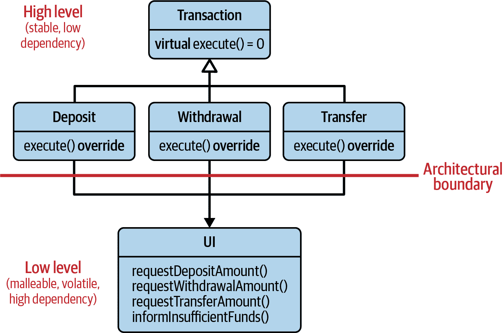
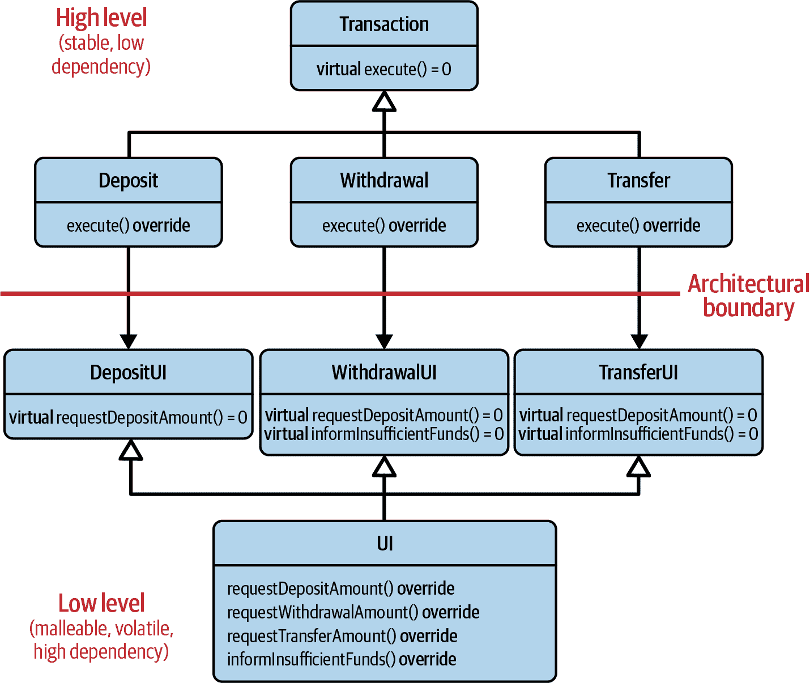
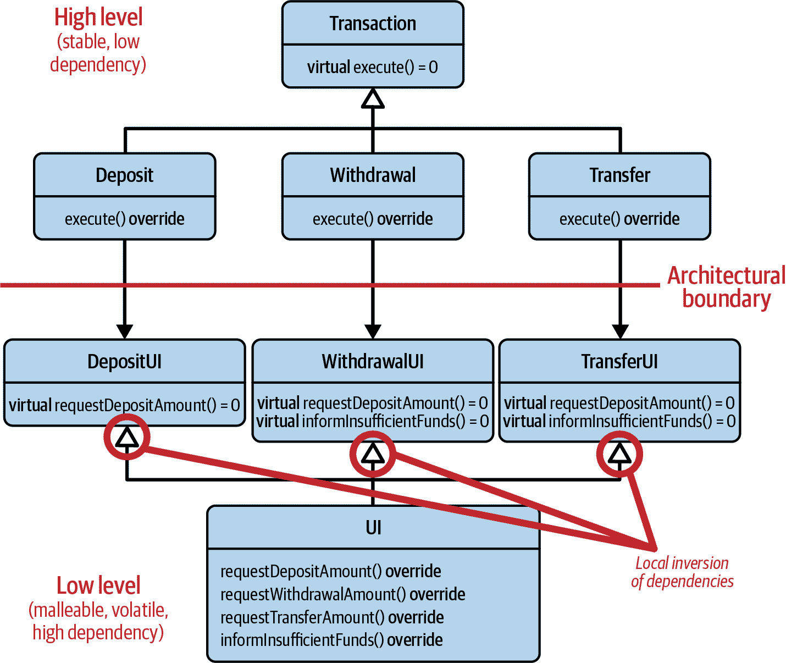
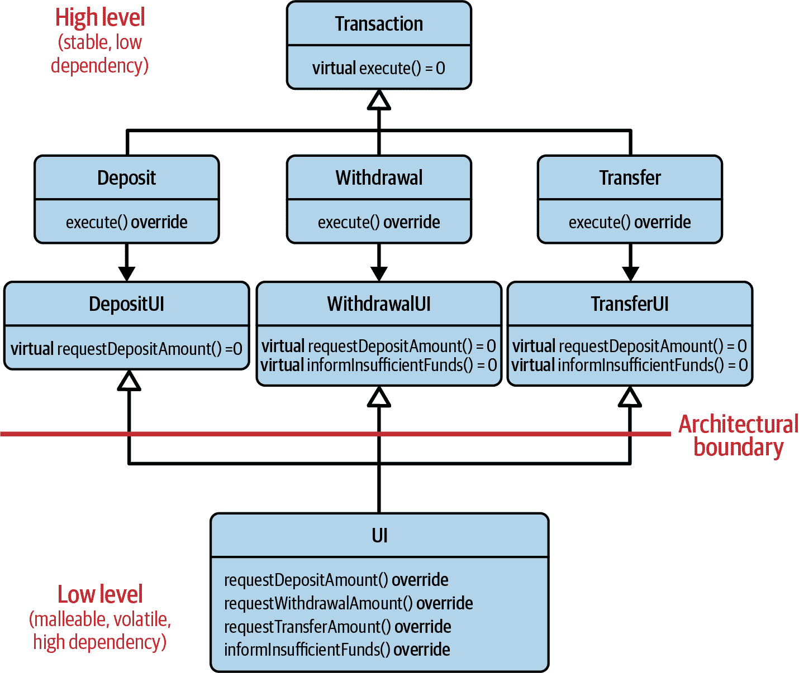
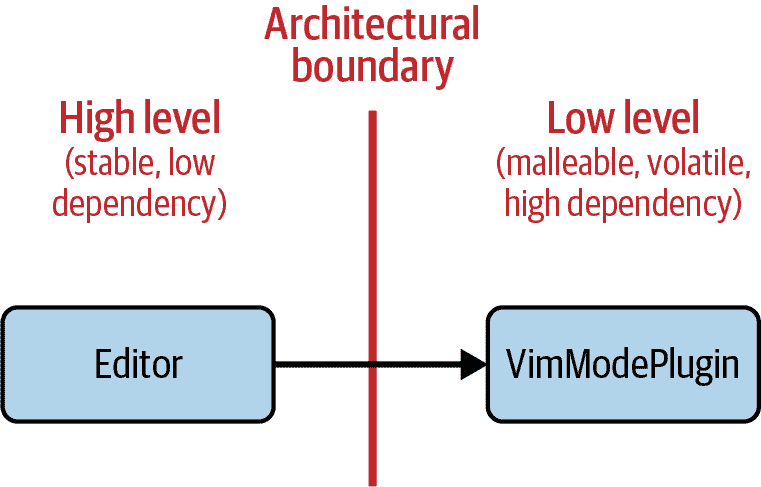
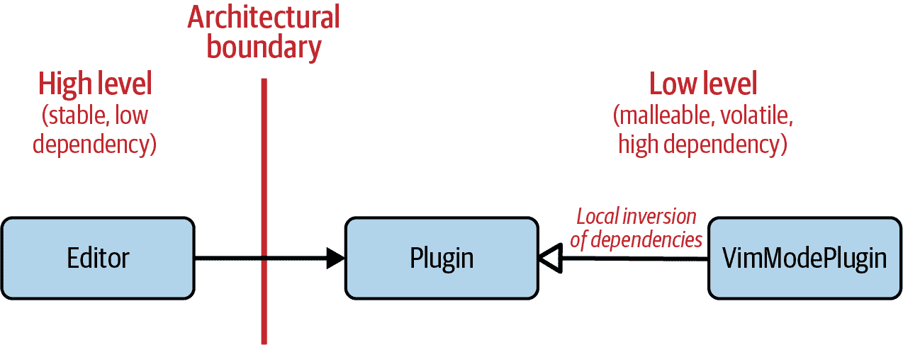
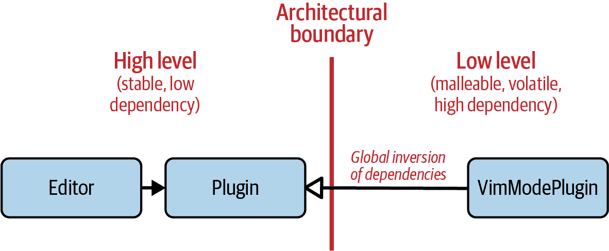
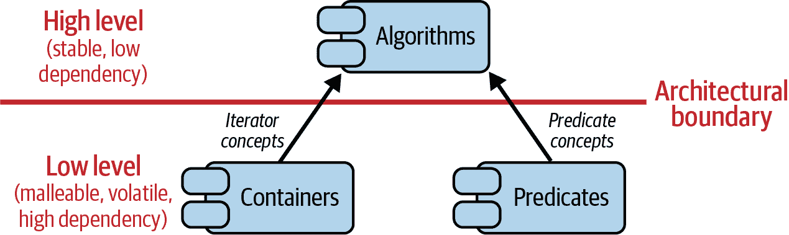

# 第二章：构建抽象的艺术

抽象在软件设计和软件架构中发挥着至关重要的作用。换句话说，良好的抽象是管理复杂性的关键。没有它们，良好的设计和适当的架构是难以想象的。然而，构建良好的抽象并有效使用它们却是令人惊讶地困难。事实证明，构建和使用抽象带来了许多微妙之处，因此更像是一门艺术而非科学。本章详细探讨了抽象的含义和构建抽象的艺术。

在“指南 6：遵循抽象的预期行为”，我们将讨论抽象的目的。我们还将讨论抽象代表一组要求和期望的事实，以及为什么坚持抽象的预期行为如此重要。在这个背景下，我将介绍另一个设计原则，即“里氏替换原则”（LSP）。

在“指南 7：理解基类和概念之间的相似性”，我们将比较两种最常用的抽象：基类和概念。您将了解到，从语义角度来看，这两种方法都非常相似，因为它们都能表达预期的行为。

在“指南 8：理解重载集的语义要求”，我将扩展对语义要求的讨论，并讨论第三种类型的抽象：函数重载。您将了解到，所有函数作为重载集的一部分，也都有预期的行为，因此也必须遵守 LSP。

在“指南 9：关注抽象的所有权”，我将专注于抽象的建筑意义。我将解释什么是架构，以及我们对架构的高低层次的期望。我还将向您展示，从架构的角度来看，仅仅引入抽象以解决依赖关系是不够的。为了解释这一点，我将介绍“依赖反转原则”（DIP），这是通过抽象构建架构的重要建议。

在“指南 10：考虑创建架构文档”，我们将讨论架构文档的好处。希望这将是一个创造一个架构文档的动机，以防这已经不在您的计划中。

# 指南 6：遵循抽象的预期行为

解耦软件的一个关键方面，因此也是软件设计的一个关键方面，是引入抽象。因此，您可能会期望这是一件相对简单、容易的事情。不幸的是，事实证明，构建抽象是困难的。

为了说明我的意思，让我们看一个例子。我选择了*经典*的例子作为例证。你可能已经知道这个例子。如果是这样，请随意跳过它。然而，如果你对这个例子不熟悉，那么这可能会让你眼前一亮。

## 违反期望的一个例子

让我们从一个`Rectangle`基类开始：

```cpp
class Rectangle
{
 public:
   // ...
   virtual ~Rectangle() = default;  

   int getWidth() const;  
   int getHeight() const;

   virtual void setWidth(int);  
   virtual void setHeight(int);

   virtual int getArea() const;  
   // ... 
 private:
   int width;  
   int height;
};

```

首先，这个类被设计为一个基类，因为它提供了一个虚析构函数（）。从语义上讲，`Rectangle`表示不同类型的矩形的抽象。从技术上讲，你可以通过指向`Rectangle`的指针正确销毁派生类型的对象。

其次，`Rectangle`类带有两个数据成员：`width`和`height`（）。这是可以预期的，因为矩形有两个边长，分别由`width`和`height`表示。`getWidth()`和`getHeight()`成员函数可以用来查询这两个边长（），通过`setWidth()`和`setHeight()`成员函数，我们可以设置`width`和`height`（）。重要的是要注意，我可以独立设置这两个值；也就是说，我可以设置`width`而不必修改`height`。

最后，还有一个`getArea()`成员函数（）。`getArea()`计算矩形的面积，当然是通过返回`width`和`height`的乘积来实现的。

当然，可能会有更多的功能，但给定的成员是这个示例中重要的成员。目前看来，这个`Rectangle`类似乎相当不错。显然，我们有了一个良好的开端。但当然还有更多。例如，还有`Square`类：

```cpp
class Square : public Rectangle  
{
 public:
   // ...
   void setWidth(int) override;  
   void setHeight(int) override;  

   int getArea() const override;  
   // ... };

```

`Square`类公开继承自`Rectangle`类（）。从数学的角度来看，这似乎相当合理：一个正方形看起来就是一种特殊的矩形。¹

一个`Square`是特殊的，因为它只有一个边长。但是`Rectangle`基类有两个长度：`width`和`height`。因此，我们必须确保`Square`的不变量始终得到保留。在这个给定的实现中，我们有两个数据成员和两个获取函数，我们必须确保这两个数据成员始终具有相同的值。因此，我们重写`setWidth()`成员函数来同时设置`width`和`height`（）。我们还重写`setHeight()`成员函数来同时设置`width`和`height`（）。

一旦我们完成了这些，一个`Square`将始终具有相等的边长，并且`getArea()`函数将始终返回一个`Square`的正确面积（）。不错！

让我们充分利用这两个类。例如，我们可以考虑一个函数，用于转换不同类型的矩形：

```cpp
void transform( Rectangle& rectangle )  
{
   rectangle.setWidth ( 7 );  
   rectangle.setHeight( 4 );  

   assert( rectangle.getArea() == 28 );  

   // ... }

```

`transform()`函数通过对非`const`引用接收任何类型的`Rectangle`。这是合理的，因为我们希望修改给定的矩形。首先可以通过`setWidth()`成员函数将矩形的`width`设置为`7`（）。然后，我们可以通过`setHeight()`成员函数将矩形的`height`设置为`4`（）。

此时，我会认为你有一个隐含的假设。我相当肯定你假设矩形的面积是`28`，因为当然，`7`乘以`4`等于`28`。这是一个我们可以通过断言进行测试的假设（)。

唯一还缺少的是实际调用`transform()`函数。这就是我们在`main()`函数中所做的：

```cpp
int main()
{
   Square s{};  
   s.setWidth( 6 );

   transform( s );  

   return EXIT_SUCCESS;
}

```

在`main()`函数中，我们创建了一种特殊类型的矩形：一个`Square`（)。² 这个正方形被传递给`transform()`函数，当然可以工作，因为`Square`的引用可以隐式转换为`Rectangle`的引用（)。

如果我问你，“会发生什么？”我非常确定你会回答，“`assert()`失败了！” 是的，确实如此，`assert()`将失败。传递给`assert()`的表达式将求值为`false`，并且`assert()`将使用`SIGKILL`信号使进程崩溃。嗯，这确实很不幸。因此，让我们进行事后分析：为什么`assert()`会失败？我们在`transform()`函数中的期望是可以独立改变矩形的宽度和高度。这个期望明确地通过对`setWidth()`和`setHeight()`的两次函数调用来表达。然而，出乎意料的是，这种特殊类型的矩形却不允许这样做：为了保持其自身的不变性，`Square`类必须始终确保两个边长相等。因此，`Square`类必须违反这个期望。在抽象层面上违反期望是 LSP 的违反。

## 里氏替换原则（Liskov Substitution Principle）

LSP 是 SOLID 原则中的第三条，涉及*行为子类型化*，即抽象的预期行为。这个设计原则以[Barbara Liskov](https://oreil.ly/XkNi4)的名字命名，她于 1988 年首次提出，并在 1994 年与 Jeannette Wing 澄清了它：³

> 子类型要求：设<math alttext="phi left-parenthesis x right-parenthesis"><mrow><mi>φ</mi> <mo>(</mo> <mi>x</mi> <mo>)</mo></mrow></math>是关于类型 T 的对象<math alttext="x"><mi>x</mi></math>可证明的属性。那么对于类型 S 的对象<math alttext="y"><mi>y</mi></math>（其中 S 是 T 的子类型），<math alttext="phi left-parenthesis y right-parenthesis"><mrow><mi>φ</mi> <mo>(</mo> <mi>y</mi> <mo>)</mo></mrow></math>应该为真。

这个原则阐述了我们通常称为[*IS-A*](https://oreil.ly/isoda)关系的概念。这种关系，即抽象中的期望，必须在子类型中遵守。这包括以下属性：

+   前置条件在子类型中不能被加强：子类型不能在函数中期望超类型所表达的更多。这将违反抽象中的期望：

```cpp
struct X
{
   virtual ~X() = default;

   // Precondition: the function accepts all 'i' greater than 0
   virtual void f( int i ) const
   {
      assert( i > 0 );
      // ...
   }
};

struct Y : public X
{
   // Precondition: the function accepts all 'i' greater than 10.
   // This would strengthen the precondition; numbers between 1 and 10
   // would no longer be allowed. This is a LSP violation!
   void f( int i ) const override
   {
      assert( i > 10 );
      // ...
   }
};
```

+   后置条件在子类型中不能被削弱：子类型在离开函数时不能比超类型承诺更少。再次强调，这会违反抽象中的期望。

```cpp
struct X
{
   virtual ~X() = default;

   // Postcondition: the function will only return values larger than 0
   virtual int f() const
   {
      int i;
      // ...
      assert( i > 0 );
      return i;
   }
};

struct Y : public X
{
   // Postcondition: the function may return any value.
   // This would weaken the postcondition; negative numbers and 0 would
   // be allowed. This is a LSP violation!
   int f( int i ) const override
   {
      int i;
      // ...
      return i;
   }
};
```

+   函数子类型中的返回类型必须是*协变*的：子类型的成员函数可以返回一个类型，该类型本身是超类型中对应成员函数返回类型的子类型。这种属性在 C++中有直接的语言支持。然而，子类型不能返回超类型的任何返回类型：

```cpp
struct Base { /*...some virtual functions, including destructor...*/ };
struct Derived : public Base { /*...*/ };

struct X
{
   virtual ~X() = default;
   virtual Base* f();
};

struct Y : public X
{
   Derived* f() override;  // Covariant return type
};
```

+   函数子类型中的参数必须是*逆变*的：在成员函数中，子类型可以接受超类型的函数参数，并在超类型的对应成员函数中使用。这种属性在 C++中没有直接的语言支持：

```cpp
struct Base { /*...some virtual functions, including destructor...*/ };
struct Derived : public Base { /*...*/ };

struct X
{
   virtual ~X() = default;
   virtual void f( Derived* );
};

struct Y : public X
{
   void f( Base* ) override;  // Contravariant function parameter; Not
                              // supported in C++. Therefore the function
                              // does not override, but fails to compile.
};
```

+   超类型的不变量必须在子类型中保留：关于超类型状态的任何期望，在所有成员函数调用之前和之后，包括子类型的成员函数，在子类型中必须始终有效。

```cpp
struct X
{
   explicit X( int v = 1 )
      : value_(v)
   {
      if( v < 1 || v > 10 ) throw std::invalid_argument( /*...*/ );
   }

   virtual ~X() = default;

   int get() const { return value_; }

 protected:
   int value_;  // Invariant: must be within the range [1..10]
};

struct Y : public X
{
 public:
   Y()
      : X()
   {
      value_ = 11;  // Broken invariant: After the constructor, 'value_'
                    // is out of expected range. One good reason to
                    // properly encapsulate invariants and to follow
                    // Core Guideline C.133: Avoid protected data.
   }
};
```

在我们的例子中，在`Rectangle`中的期望是我们可以独立改变两个边长，或者更正式地说，在调用`setHeight()`之后，`getWidth()`的结果不会改变。这种期望对于任何类型的矩形都是直观的。然而，`Square`类本身引入了所有边必须始终相等的不变量，否则`Square`无法正确表达我们对正方形的理解。但通过保护自身的不变量，`Square`不幸地违反了基类中的期望。因此，在这个例子中，`Square`类无法满足`Rectangle`类的期望，并且这个层次结构并不表达一个 IS-A 关系。因此，`Square`不能在所有需要`Rectangle`的地方使用。

“但是一个正方形不是一个矩形吗？”你问道。“这难道不能正确地表达几何关系吗？”⁴ 是的，正方形和矩形之间可能存在几何关系，但在这个例子中，继承关系是破坏的。这个例子表明数学上的 IS-A 关系与 LSP 的 IS-A 关系确实是不同的。在几何学中，正方形总是矩形，但在计算机科学中，这真的取决于实际的接口和期望。只要有两个独立的`setWidth()`和`setHeight()`函数，一个`Square`总是会违反期望。“我明白了，”你说。“没人会声称，在几何上，改变宽度后的正方形仍然是正方形，对吧？”确实如此。

该例子还表明继承不是一种自然或直观的特性，而是一种困难的特性。正如开头所述，构建抽象是困难的。每当使用继承时，*必须*确保基类中的所有期望都得到满足，并且派生类型的行为如预期般。

## 对里斯科夫替换原则的批评

有些人认为，正如早先解释的那样，LSP 实际上并不是由芭芭拉·里斯科夫和会议论文“数据抽象与层次结构”中描述的那样，并且子类型的概念是有缺陷的。这是正确的：我们通常不会用派生对象替代基对象，而是将派生对象用作基对象。然而，这种对里斯科夫声明的字面和严格解释在我们日常构建的抽象类型中并不起任何作用。在她们 1994 年的论文“子类型的行为概念”中，芭芭拉·里斯科夫和 Jeanette Wing 提出了术语*行为子类型*，这是今天对 LSP 的共同理解。

其他人认为，由于可能违反 LSP，基类并不符合抽象的目的。理由是使用代码也将依赖（误）用于派生类型的行为。不幸的是，这种论点颠倒了世界。基类*确实*代表了一种抽象，因为调用代码只能且应仅仅依赖于这种抽象的*预期*行为。正是这种依赖性使得 LSP 违规成为编程错误。不幸的是，有时人们试图通过引入特殊的解决方案来修复 LSP 违规：

```cpp
class Base { /*...*/ };
class Derived : public Base { /*...*/ };
class Special : public Base { /*...*/ };
// ... Potentially more derived classes

void f( Base const& b )
{
   if( dynamic_cast<Special const*>(&b) )
   {
      // ... do something "special," knowing that 'Special' behaves differently
   }
   else
   {
      // ... do the expected thing
   }
}
```

这种解决方法确实会引入派生类型行为的依赖性。而且是非常不幸的依赖性！这应始终被视为 LSP 的违规和非常糟糕的实践。⁵ 它并不能作为反对基类抽象属性的普遍论点。

## 需要良好和有意义的抽象

要正确解耦软件实体，我们能够依赖我们的抽象是非常重要的。如果没有我们作为代码的人类读者*完全*理解的有意义的抽象，我们就无法编写健壮可靠的软件。因此，遵循 LSP 对软件设计至关重要。然而，同样重要的一部分是对抽象期望的清晰明确的传达。在最佳情况下，这通过软件本身实现（*自描述代码*）来实现，但也包括对抽象的适当文档化。作为一个很好的例子，我推荐查看 C++标准中的[迭代器概念文档](https://oreil.ly/OBpAg)，其中清楚地列出了预期的行为，包括前置和后置条件。

# 指导原则 7：理解基类和概念之间的相似之处

在“指导原则 6：遵循抽象的预期行为”，我可能给人造成了 LSP 仅涉及继承层次结构和基类的印象。为了确保这种印象不会固定下来，让我明确声明 LSP*不*仅限于动态（运行时）多态性和继承层次结构。相反，我们同样可以将 LSP 应用于静态（编译时）多态性和模板化代码。

为了说明这一点，让我问你一个问题：下面两个代码片段有什么区别？

```cpp
//==== Code Snippet 1 ====

class Document
{
 public:
   // ...
   virtual ~Document() = default;

   virtual void exportToJSON( /*...*/ ) const = 0;
   virtual void serialize( ByteStream&, /*...*/ ) const = 0;
   // ...
};

void useDocument( Document const& doc )
{
   // ...
   doc.exportToJSON( /*...*/ );
   // ...
}

//==== Code Snippet 2 ====

template< typename T >
concept Document =
   requires( T t, ByteStream b ) {
      t.exportToJSON( /*...*/ );
      t.serialize( b, /*...*/ );
   };

template< Document T >
void useDocument( T const& doc )
{
   // ...
   doc.exportToJSON( /*...*/ );
   // ...
}
```

我很确定你的第一个答案是第一个代码片段展示了使用动态多态性的解决方案，而第二个代码片段展示了静态多态性。是的，很好！还有什么？好的，是的，当然，语法也不同。好的，我明白了，我应该更精确地问我的问题：这两种解决方案在*语义上*有什么不同？

嗯，如果你仔细思考一下，你可能会发现从语义上讲，这两种解决方案确实非常相似。在第一个代码片段中，`useDocument()` 函数只与派生自`Document`基类的类一起工作。因此，我们可以说该函数只与符合`Document`抽象期望的类一起工作。在第二个代码片段中，`use​Docu⁠ment()` 函数只与实现`Document`概念的类一起工作。换句话说，该函数只与符合`Document`抽象期望的类一起工作。

如果你现在有一种似曾相识的感觉，那么我的措辞希望引起共鸣。是的，在这两个代码片段中，`useDocument()` 函数只与符合`Document`抽象期望的类一起工作。因此，尽管第一个代码片段基于运行时抽象，第二个函数代表编译时抽象，从语义上讲，这两个函数非常相似。

基类和概念都代表一组要求（语法要求，但也包括语义要求）。因此，两者都代表了对期望行为的正式描述，因此是表达和传达调用代码期望的手段。因此，概念可以被视为基类的等价物，即静态对应物。从这个角度看，也完全有理由考虑模板代码的 LSP（里氏替换原则）。

“我不买账，” 你说，“我听说 C++20 的概念不能表达语义！”⁶ 嗯，对此我只能肯定地说是和不是。是的，C++20 的概念不能完全表达语义，这是正确的。但另一方面，概念仍然表达了期望的行为。例如，考虑 `std::copy()` 算法的 C++20 形式：⁷

```cpp
template< typename InputIt, typename OutputIt >
constexpr OutputIt copy( InputIt first, InputIt last, OutputIt d_first )
{
   while( first != last ) {
      *d_first++ = *first++;
   }
   return d_first;
}
```

`std::copy()` 算法期望三个参数。前两个参数表示需要复制的元素范围（*输入范围*）。第三个参数表示我们需要复制到的第一个元素（*输出范围*）。一般期望是*输出范围*足够大，可以将所有*输入范围*的元素复制到其中。

迭代器类型的命名隐含表达了更多的期望：`InputIt` 和 `OutputIt`。`InputIt` 表示一种*输入迭代器*类型。C++ 标准规定了所有这类迭代器类型的期望，例如可用性比较（不等比较），通过前缀和后缀递增遍历范围（`operator++()` 和 `operator++(int)`），以及通过解引用操作符访问元素（`operator*()`）。另一方面，`OutputIt` 表示一种*输出迭代器*类型。在这里，C++ 标准也明确规定了所有期望的操作。

`InputIt` 和 `OutputIt` 或许不是 C++20 的概念，但它们代表相同的概念：这些命名的模板参数不仅告诉你需要的类型是什么，还表达了期望的行为。例如，我们期望 `first` 的后续递增最终会产生 `last`。如果任何具体的迭代器类型不能按照这种方式行为，`std::copy()` 将不能按预期工作。这将是对期望行为的违反，因此也是 LSP 的违反。⁸ 因此，`InputIt` 和 `OutputIt` 都代表 LSP 的抽象。

请注意，由于概念代表了 LSP 的抽象，即一组要求和期望，它们也适用于*接口隔离原则*（ISP）（见“指南 3：分离接口以避免人为耦合”）。正如您应该在基类定义要求的定义中分离关注点（比如说，“接口”类），您在定义概念时也应该分离关注点。标准库迭代器通过相互构建来实现这一点，从而允许您选择所需的要求级别：

```cpp
template< typename I >
concept input_or_output_iterator =
  /* ... */;

template< typename I >
concept input_iterator =
   std::input_or_output_iterator<I> &&
   /* ... */;

template< typename I >
concept forward_iterator =
   std::input_iterator<I> &&
   /* ... */;
```

由于命名模板参数和 C++20 概念都用于表示 LSP 抽象，从现在开始，在所有后续的指南中，我将使用术语*概念*来指代它们。因此，用术语*概念*，我将指代任何表达一组要求的方式（在大多数情况下是用于模板参数，但有时甚至更广泛）。如果我想特指其中的任何一个，我会明确表明。

总结来说，任何抽象（动态和静态）都代表了一组期望的行为要求。这些期望需要由具体的实现来满足。因此，LSP 清晰地代表了所有 IS-A 关系的基本指导。

# 指南 8：理解重载集的语义要求

在“指南 6：遵循抽象的预期行为”中，我向您介绍了 LSP，并希望做出了强有力的论证：*每个*抽象都代表了一组语义要求！换句话说，抽象表达了需要满足的预期行为。否则，您（很可能）会遇到问题。在“指南 7：理解基类与概念之间的相似性”中，我扩展了 LSP 的讨论到概念，并展示了 LSP 也可以和*应该*应用于静态抽象。

然而，这并不是故事的结局。正如之前所述：*每一个*抽象都代表一组需求。还有一种抽象我们尚未考虑到，这种抽象经常被忽视，尽管它非常强大，因此在讨论中我们不应忘记它：函数重载。“函数重载？你指的是一个类可以有几个同名函数的事实？” 是的，完全正确。您可能已经体验过，这确实是一个非常强大的特性。例如，请考虑`std::vector`中的两个`begin()`成员函数的重载：根据您是否有一个`const`或非`const`向量，选择相应的重载。甚至无需您注意。非常强大！但说实话，这并不是真正的抽象。虽然重载成员函数很方便和有帮助，但我心中想到的是一种不同类型的函数重载，一种真正代表一种形式的抽象：自由函数。

## 自由函数的力量：一种编译时抽象机制

除了概念外，通过自由函数进行函数重载代表第二种编译时抽象：基于某些给定类型，编译器从一组同名函数中找出应该调用哪一个函数。这就是我们称之为*重载集*的东西。这是一种极其灵活和强大的抽象机制，具有许多出色的设计特性。首先，您可以向任何类型添加自由函数：您可以向`int`、`std::string`和任何其他类型添加自由函数。非侵入式地。尝试使用成员函数这样做，您会意识到这根本行不通。添加成员函数是侵入式的。您无法向不能拥有成员函数的类型或不能修改的类型添加任何东西。因此，自由函数完美地体现了开闭原则（OCP）的精神：您可以通过简单添加代码来扩展功能，而无需修改已存在的代码。

这为您带来了显著的设计优势。例如，考虑以下代码示例：

```cpp
template< typename Range >
void traverseRange( Range const& range )
{
   for( auto pos=range.begin(); pos!=range.end(); ++pos ) {
      // ...
   }
}
```

`traverseRange()` 函数在给定的`range`上执行传统的基于迭代器的循环。为了获取迭代器，它调用了`range`上的`begin()`和`end()`成员函数。尽管这段代码对许多容器类型都有效，但对于内置数组来说是不起作用的：

```cpp
#include <cstdlib>

int main()
{
   int array[6] = { 4, 8, 15, 16, 23, 42 };

   traverseRange( array );  // Compilation error!

   return EXIT_SUCCESS;
}
```

这段代码将无法编译，因为编译器会抱怨给定数组类型缺少`begin()`和`end()`成员函数。“这难道不是我们应该避免使用内置数组而使用`std::array`的原因吗？” 我完全同意：您应该使用`std::array`。这也被[核心指南 SL.con.1](https://oreil.ly/FRrfz)非常好地解释了：

> 建议使用 STL 的`array`或`vector`而不是 C 数组。

然而，虽然这是一个良好的实践，但我们不应忽视`traverseRange()`函数的设计问题：`traverseRange()`通过依赖于`begin()`和`end()`成员函数而限制了自己。因此，它对`Range`类型施加了一个人为的要求，要求支持一个`begin()`和一个`end()`函数，并且由此限制了它自身的适用性。然而，有一个简单的解决方案，一种使该函数更广泛适用的简单方式：利用自由的`begin()`和`end()`函数的重载集合：[⁹]

```cpp
template< typename Range >
void traverseRange( Range const& range )
{
   using std::begin;  // using declarations for the purpose of calling
   using std::end;    //   'begin()' and 'end()' unqualified to enable ADL

   for( auto pos=begin(range); pos!=end(range); ++pos ) {
      // ...
   }
}
```

尽管如此，这个函数仍然在以前做同样的事情，但在这种形式下，它不受任何人为要求的限制。事实上，没有任何限制：*任何*类型都可以拥有自由的`begin()`和`end()`函数，或者如果缺少这些函数，则可以被赋予这些函数。非侵入式地。因此，这个函数可以与任何类型的`Range`一起使用，如果某些类型不满足要求，也无需修改或重载。它的适用范围更广。它真正地通用。[¹⁰]

不过，自由函数还有更多的优势。正如在“指导原则 4：设计可测试性”中已经讨论过的那样，自由函数是一种非常优雅的技术，可以分离关注点，实现单一职责原则（SRP）。通过在类外部实现操作，你自动减少了该类对该操作的依赖。从技术上讲，这变得立即清晰，因为与成员函数相比，自由函数没有隐式的第一个参数，即`this`指针。与此同时，这也促使该函数成为一个独立的、孤立的服务，可以被许多其他类使用。因此，你促进了重用并减少了重复。这非常好地符合不要重复你自己（DRY）原则的思想。

这一点在亚历山大·斯特帕诺夫的杰作、标准模板库（STL）中表现得淋漓尽致。[¹¹] STL 哲学的一部分是通过将不同功能模块松散耦合并通过将关注点分离为自由函数来促进重用。这就是为什么在 STL 中，容器和算法是两个独立的概念：从概念上讲，容器不知道算法，算法也不知道容器。它们之间的抽象是通过迭代器实现的，允许你以看似无限的方式组合这两者。这是一个非常值得注意的设计。或者用斯科特·迈尔斯的话来说：[¹²]

> 标准模板库从未被怀疑过代表了高效和可扩展设计的突破。

“但`std::string`呢？ `std::string`自带几十个成员函数，包括许多算法。” 你提出了一个很好的观点，但更多的是作为一个反例。如今，社区一致认为`std::string`的设计并不理想。它的设计促进了耦合、重复和增长：在每一个新的 C++标准中，都会有一些新的额外成员函数。增长意味着修改，随之而来的是意外更改的风险。这是你在设计中要避免的风险。然而，作为其辩护，`std::string`并不是 STL 的原始部分。它并未与 STL 容器（`std::vector`、`std::list`、`std::set`等）一同设计，并且后来才适应了 STL 的设计。这解释了为什么它与其他 STL 容器不同，并且并不完全分享它们美丽的设计目标。

## 自由函数的问题：对行为的期望

显然，自由函数在通用编程中非常强大且非常重要。它们在 STL 的设计和整个 C++标准库的设计中发挥着至关重要的作用，这建立在这种抽象机制的力量之上。¹³ 然而，所有这些力量只有在一组重载函数遵循一组规则和特定的期望时才能发挥作用。只有它遵循 LSP 时才能发挥作用。

例如，假设你已经为自己编写了一个`Widget`类型，并想为其提供一个定制的`swap()`操作：

```cpp
//---- <Widget.h> ----------------

struct Widget
{
   int i;
   int j;
};

void swap( Widget& w1, Widget& w2 )
{
   using std::swap;
   swap( w1.i, w2.i );
}
```

你的`Widget`只需是一个简单的包装器，用于`int`值，称为`i`和`j`。你提供了相应的`swap()`函数作为一个附带的自由函数。你通过仅交换`i`值而不是`j`值来实现`swap()`。进一步想象一下，你的`Widget`类型被其他开发者使用，也许是一个友好的同事。在某个时刻，这个同事调用了`swap()`函数：

```cpp
#include <Widget.h>
#include <cstdlib>

int main()
{
   Widget w1{ 1, 11 };
   Widget w2{ 2, 22 };

   swap( w1, w2 );

   // Widget w1 contains (2,11)
   // Widget w2 contains (1,22)

   return EXIT_SUCCESS;
}
```

你能想象当`swap()`操作后，`w1`的内容不是`(2,22)`而是`(2,11)`时你同事的惊讶吗？仅交换对象的部分内容是多么意外的事情？你能想象你的同事在一个小时的调试后会有多么沮丧吗？如果这不是一个*友好*的同事会发生什么呢？

显然，`swap()`函数的实现并未满足`swap()`函数的期望。显然，任何人都会期望整个可观察状态的对象被交换。显然，这里有行为期望。因此，如果你接受重载集，你立即且不可避免地要遵循重载集的预期行为。换句话说，你必须遵循 LSP。

“我明白问题，我理解了。我承诺遵守 LSP 规则”，你说道。这非常好，这是一个光荣的意图。问题在于，可能并不总是完全清楚预期的行为是什么，特别是对于散布在庞大代码库中的重载集。你可能不知道所有的期望和所有的细节。因此，有时即使你意识到了这个问题并且关注了它，你可能仍然没有做出“正确”的事情。这就是社区中一些人担心的问题：在重载集中添加可能违反 LSP 的功能的不受限制的能力。¹⁴ 正如之前所述，这是很容易做到的。任何人，在任何地方，都可以添加自由函数。

一如既往，每种方法和每种解决方案都有其优势，也有其缺点。一方面，充分利用重载集的力量是非常有益的，但另一方面，做正确的事情可能非常困难。这两面同一枚硬币的表达也被 [核心指导方针 C.162](https://oreil.ly/IyZwR) 和 [核心指导方针 C.163](https://oreil.ly/8VWH1) 所表达。

> 重载那些大致等效的操作。
> 
> 核心指导方针 C.162
> 
> 只为大致等效的操作进行重载。
> 
> 核心指导方针 C.163

而 C.162 表达了为语义上等效的函数使用相同名称的优势，C.163 则表达了为语义上不同的函数使用相同名称的问题。每个 C++开发者都应该意识到这两个指导方针之间的紧张关系。此外，为了遵守预期的行为，每个 C++开发者都应该了解现有的重载集（如 `std::swap()`、`std::begin()`、`std::cbegin()`、`std::end()`、`std::cend()`、`std::data()`、`std::size()` 等），并了解常见的命名约定。例如，名称 `find()` 应该仅用于执行线性搜索的函数。对于执行二分搜索的任何函数，使用名称 `find()` 将引发错误的期望，并且不会传达范围需要排序的前提条件。当然，名称 `begin()` 和 `end()` 应该始终满足返回可以用于遍历范围的迭代器对的期望。它们不应该开始或结束某种过程。这个任务最好由 `start()` 和 `stop()` 函数来执行。¹⁵

“嗯，我同意所有这些观点，”你说道。“但是，我主要使用虚函数，而由于这些函数无法用自由函数实现，所以我实际上无法完全应用重载集的所有建议，对吧？”也许会让你惊讶，但这些建议仍然适用于你。因为最终目标是减少依赖关系，而虚函数可能导致相当大量的耦合，因此其中一个目标将是“释放”它们。事实上，在许多后续的准则中，也许最显著的是“准则 19：使用策略隔离操作方式”和“准则 31：使用外部多态性进行非侵入式运行时多态性”，我将讲述如何以自由函数的形式提取和分离虚函数，但并不限于此。

总之，函数重载是一个强大的编译时抽象机制，不容小觑。特别是，泛型编程大量利用了这种力量。然而，不要轻视这种力量：要记住，就像基类和概念一样，重载集合代表一组语义要求，因此受到 LSP 的约束。必须遵守重载集的预期行为，否则事情将会变得不尽如人意。

# 准则 9：注意抽象的所有权

如“准则 2：为变更而设计”中所述，变更是软件开发中的唯一常量。你的软件应该为变更做好准备。处理变更的一个基本要素是引入抽象（还请参阅“准则 6：遵循抽象的预期行为”）。抽象有助于减少依赖关系，从而更容易独立地变更细节。然而，引入抽象不仅仅是添加基类或模板这么简单。

## 依赖反转原则

需要抽象的必要性也由 Robert Martin 表达：¹⁶

> 最灵活的系统是那些源代码依赖仅引用抽象而不是具体实现的系统。

这条智慧被称为依赖反转原则（DIP），它是 SOLID 原则中的第五条。简而言之，它建议为了依赖关系，你应该依赖于抽象而不是具体类型或实现细节。请注意，这个声明并未提到继承层次结构，而只是一般提到抽象。

让我们看一下在图 2-1 中所示的情况。想象一下，您正在实现自动取款机（ATM）的逻辑。ATM 提供几种操作：您可以取钱、存钱和转账。由于所有这些操作涉及实际资金，它们应该要么完全成功，要么在任何错误的情况下中止并回滚所有更改。这种行为（要么 100%成功，要么完全回滚）是我们通常称为*事务*的。因此，我们可以引入一个名为`Transaction`的抽象。所有抽象类（`Deposit`、`Withdrawal`和`Transfer`）都继承自`Transaction`类（由 UML 继承箭头表示）。



###### 图 2-1\. 几个交易和 UI 之间的初始强依赖关系

所有交易都需要银行客户通过用户界面输入的输入数据。这个用户界面由`UI`类提供，该类提供许多不同的功能来查询输入的数据：`requestDepositAmount()`、`requestWithdrawalAmount()`、`requestTransferAmount()`、`informInsufficientFunds()`等，可能还有更多的功能。所有三个抽象类在需要信息时直接调用这些函数。这种关系由小实箭头表示，表明这些抽象类依赖于`UI`类。

尽管这种设置可能在一段时间内有效，但您的训练眼睛可能已经发现了一个潜在的问题：如果发生了变化会怎样？例如，如果系统添加了一个新的交易怎么办？

假设我们必须为 VIP 客户添加一个`SpeedTransfer`交易。这可能需要我们改变并扩展`UI`类，添加一些新功能（例如，`requestSpeedTransferAmount()`和`requestVIPNumber()`）。这反过来也会影响所有其他交易，因为它们直接依赖于`UI`类。在最好的情况下，这些交易只需重新编译和重新测试（尽管这需要时间！）；在最坏的情况下，它们可能必须重新部署，因为它们是以单独的共享库交付的。

所有这些额外工作背后的根本原因是一个破碎的架构。所有交易间接地通过对`UI`类的具体依赖而相互依赖。从架构角度来看，这是非常不幸的情况：交易类位于我们架构的高层，而`UI`类位于低层。在这个例子中，高层依赖低层。这是错误的：在一个合适的架构中，这种依赖关系应该被反转。¹⁸

所有交易由于对 UI 类的依赖而间接依赖于彼此。此外，我们的架构高层依赖于低层。这确实是一个非常不幸的情况，一个我们应该正确解决的情况。“但这很简单！”你说。“我们只需引入一个抽象！”这正是 Robert Martin 在他的声明中表达的：我们需要引入一个抽象，以免依赖 UI 类的具体实现。

然而，一个单一的抽象并不能解决问题。三种交易仍然会间接耦合。不，正如图 2-2 所示，我们需要三个抽象：每个交易一个。¹⁹



###### 图 2-2\. 几个交易与 UI 之间放松的依赖关系

通过引入 DepositUI、WithdrawalUI 和 TransferUI 类，我们打破了三个交易之间的依赖关系。这三个交易不再依赖具体的 UI 类，而是依赖一个轻量级的抽象，该抽象仅表示相关交易真正需要的操作。如果我们现在引入 SpeedTransfer 交易，我们也可以引入 SpeedTransferUI 抽象，这样其他交易不会受到 UI 类引入的更改的影响。

“哦，是的，我明白了！这样我们就满足了三个设计原则！” 你听起来很印象深刻。“我们引入了一个抽象来削减对用户界面实现细节的依赖。那一定是 DIP。而且我们遵循了 ISP，并且移除了不同交易之间的依赖。作为奖励，我们还很好地将真正属于一起的东西进行了分组。这就是 SRP，对吧？太棒了！让我们来庆祝一下！”

等等，等等……在你跑去开香槟庆祝解决这个依赖问题之前，让我们仔细看看问题。没错，你是对的，我们通过将 UI 类分离为三个特定于客户端的接口，来遵循 ISP 分离关注点。通过这种方式，我们解决了三个交易之间的依赖情况。这确实是 ISP。非常好！

不幸的是，我们还没有解决我们的架构问题，所以不，我们还没有遵循 DIP（尽管）。但我理解了误解：看起来我们确实反转了依赖关系。图 2-3 显示我们确实引入了依赖关系的反转：现在我们不再依赖具体的 UI 类，而是依赖抽象。



###### 图 2-3\. 通过引入三个抽象 UI 类局部反转依赖关系

然而，我们引入的是一个 *局部* 依赖倒置。是的，仅仅是局部的倒置，而不是全局的倒置。从架构的角度来看，我们仍然有一个从高层次（我们的事务类）到低层次（我们的 UI 功能）的依赖。因此，仅仅引入一个抽象是不够的。还重要的是考虑 *在哪里* 引入这个抽象。Robert Martin 用以下两点表达了这一点：²⁰

> 1.  高层次模块不应依赖于低层次模块。两者都应依赖于抽象。
> 1.  
> 1.  抽象不应依赖于细节。细节应依赖于抽象。

第一个观点清楚地表达了架构的一个关键属性：即高层次，即我们软件的稳定部分，不应依赖于低层次，即实现细节。该依赖关系应该被倒置，意味着低层次应该依赖于高层次。幸运的是，第二个观点给了我们一个实现的思路：我们将三个抽象分配给高层次。图 2-4 描述了当我们将抽象视为高层次的一部分时的依赖关系。



###### 图 2-4\. 通过将抽象分配给高层次实现依赖倒置

通过将抽象分配给高层次，并使高层次成为抽象的所有者，我们真正遵循了 DIP：所有箭头现在都从低层次指向高层次。现在我们确实有了一个合适的架构。

“等一下！”你看起来有些困惑。“就这样？我们所需要的只是进行一次架构边界的思维转变？”嗯，这很可能不仅仅是一次思维转变。这可能导致将 UI 类的依赖头文件从一个模块移动到另一个模块，并完全重新排列依赖的包含语句。这不仅仅是一次思维转变——这是所有权的重新分配。

“但现在我们不再把那些应该放在一起的东西分组了，”你反驳道。“用户界面功能现在分布在两个层次上。这不是违反了单一职责原则吗？”不，不是的。相反，在将抽象分配给高层次之后，我们现在才真正遵循了单一职责原则。应该被分组在一起的不是`UI`类，而是事务类和依赖的`UI`抽象。只有这样，我们才能正确引导依赖关系；只有这样，我们才有了一个架构。因此，为了正确的依赖倒置，抽象 *必须* 属于高层次。

## 依赖倒置在插件架构中

或许，如果我们考虑图 2-5 中描述的情景，这个事实会更加有意义。想象一下，你创建了下一代文本编辑器。这款新文本编辑器的核心在左侧由`Editor`类表示。为了确保这款文本编辑器能够成功，你希望粉丝社区能够参与开发。因此，你成功的关键因素之一是社区能够以插件形式添加新功能。然而，从架构的角度来看，初始设置相当有缺陷，几乎无法满足你的粉丝社区：`Editor`直接依赖于具体的`VimMode​Plu⁠gin`类。由于`Editor`类属于架构的高层，你应该将其视为自己的领域，而`VimMode​Plugin`则属于架构的低层，这是你的粉丝社区的领域。由于`Editor`直接依赖于`VimMode​Plu⁠gin`，这基本上意味着你的社区可以按照他们的意愿定义接口，你必须为每个新的插件更改编辑器。尽管你很乐意为你的心血之作工作，但适应不同类型的插件的时间是有限的。不幸的是，你的粉丝社区很快就会感到失望，转而使用其他文本编辑器。



###### 图 2-5\. 破损的插件架构：高层`Editor`类依赖低层`VimModePlugin`类

当然，这种情况是不应该发生的。在给定的`Editor`示例中，让`Editor`类依赖所有具体插件的做法显然不明智。相反，你应该使用抽象概念，例如`Plugin`基类的形式。现在，`Plugin`类代表了所有类型插件的抽象。然而，在架构的低层引入这种抽象是没有意义的（参见图 2-6）。你的`Editor`仍然依赖于粉丝社区的心血来潮。



###### 图 2-6\. 破损的插件架构：高层`Editor`类依赖低层`Plugin`类

当查看源代码时，这种误导性的依赖关系也变得显而易见：

```cpp
//---- <thirdparty/Plugin.h> ----------------

class Plugin { /*...*/ };  // Defines the requirements for plugins

//---- <thirdparty/VimModePlugin.h> ----------------

#include <thirdparty/Plugin.h>

class VimModePlugin : public Plugin { /*...*/ };

//---- <yourcode/Editor.h> ----------------

#include <thirdparty/Plugin.h> // Wrong direction of dependencies!

class Editor { /*...*/ };
```

建立正确的插件架构的唯一方法是将抽象分配给高层。抽象*必须*属于*你*，而不是属于你的粉丝社区。图 2-7 展示了这样做如何解决架构依赖，并解放了`Editor`类对插件的依赖。这同时解决了 DIP，因为依赖关系被正确地反转了，以及 SRP，因为抽象属于高层。



###### 图 2-7\. 正确的插件架构：低级别的 `VimModePlugin` 类依赖于高级别的 `Plugin` 类

查看源代码发现，依赖方向已经固定：`VimModePlugin` 依赖于你的代码，而不是相反的：

```cpp
//---- <yourcode/Plugin.h> ----------------

class Plugin { /*...*/ };  // Defines the requirements for plugins

//---- <yourcode/Editor.h> ----------------

#include <yourcode/Plugin.h>

class Editor { /*...*/ };

//---- <thirdparty/VimModePlugin.h> ----------------

#include <yourcode/Plugin.h> // Correct direction of dependencies

class VimModePlugin : public Plugin { /*...*/ };
```

再次强调，要实现适当的依赖反转，抽象必须由高层拥有。在这种情况下，`Plugin` 类代表了所有插件需要满足的要求集合（再次参见 “Guideline 6: Adhere to the Expected Behavior of Abstractions”）。`Editor` 定义并拥有这些要求，而不是依赖它们。不同的插件依赖于这些要求。这就是依赖反转。因此，DIP 不仅仅是引入抽象的概念，也涉及对该抽象的所有权问题。

## 通过模板实现依赖反转

到目前为止，我可能给你的印象是 DIP 只涉及继承层次和基类。然而，依赖反转也可以通过模板实现。在这种情况下，所有权问题会自动解决。例如，让我们考虑 `std::copy_if()` 算法：

```cpp
template< typename InputIt, typename OutputIt, typename UnaryPredicate >
OutputIt copy_if( InputIt first, InputIt last, OutputIt d_first,
                  UnaryPredicate pred );
```

`copy_if()` 算法也遵循了 DIP。依赖反转通过概念 `InputIt`、`OutputIt` 和 `UnaryPredicate` 实现。这三个概念代表了传递的迭代器和谓词需要满足调用代码的要求。通过概念指定这些要求，即通过拥有这些概念，`std::copy_if()` 使其他代码依赖于它自身，而不是它自己依赖于其他代码。该依赖结构在 Figure 2-8 中描述：容器和谓词都依赖于对应算法表达的要求。因此，如果我们考虑标准库内部的架构，那么 `std::copy_if()` 就是架构的高层，而容器和谓词（函数对象、lambda 等）则是架构的低层。



###### 图 2-8\. STL 算法的依赖结构

## 通过重载集实现依赖反转

继承层次结构和概念并不是倒置依赖的唯一手段。任何形式的抽象都能实现这一点。因此，应该不会感到意外，过载集也能帮助你遵循 DIP。正如你在“指南 8：理解过载集的语义要求”中看到的那样，过载集代表了一种抽象，因此也代表了一组语义要求和期望。然而，与基类和概念相比，遗憾的是没有明确描述这些要求的代码。但是，如果这些要求由架构的更高层级拥有，你就可以实现依赖反转。例如，考虑以下`Widget`类模板：

```cpp
//---- <Widget.h> ----------------

#include <utility>

template< typename T >
struct Widget
{
   T value;
};

template< typename T >
void swap( Widget<T>& lhs, Widget<T>& rhs )
{
   using std::swap;
   swap( lhs.value, rhs.value );
}
```

`Widget`拥有一个未知类型`T`的数据成员。尽管`T`是未知的，但可以通过依赖于`swap()`函数的语义期望来为`Widget`实现一个自定义的`swap()`函数。只要`T`的`swap()`函数符合所有`swap()`函数的期望并遵循 LSP[²¹]，这个实现就可以工作。

```cpp
#include <Widget.h>
#include <assert>
#include <cstdlib>
#include <string>

int main()
{
   Widget<std::string> w1{ "Hello" };
   Widget<std::string> w2{ "World" };

   swap( w1, w2 );

   assert( w1.value == "World" );
   assert( w2.value == "Hello" );

   return EXIT_SUCCESS;
}
```

结果，`Widget`的`swap()`函数本身符合期望并添加到过载集中，类似于派生类的作用。`swap()`过载集的依赖结构显示在图 2-9 中。由于过载集的要求或期望属于架构的高层级，并且由于`swap()`的任何实现都依赖于这些期望，因此依赖关系从低层级向高层级正确地反转了。


###### 图 2-9：`swap()`过载集的依赖结构

## 依赖反转原则与单一责任原则的对比

根据我们的观察，通过正确分配所有权并正确分组真正属于的东西，便能实现依赖反转原则（DIP）。从这个角度来看，认为 DIP 只是 SRP 的另一种特例听起来似乎是合理的（类似于 ISP）。然而，希望你能看到 DIP 不仅仅是这样。与 SRP 不同，DIP 非常关注架构的视角，我认为它是建立正确的全局依赖结构的重要建议。

总结一下，为了构建具有正确依赖结构的适当架构，关注抽象的所有权至关重要。由于抽象代表了对实现的要求，它们应该成为高层级的一部分，以便将所有依赖关系引导到高层级。

# -   指南 10：考虑创建架构文档

让我们稍微聊一下你们的架构。让我从一个非常简单的问题开始：你们有架构文档吗？任何总结架构的主要要点和基本决策，展示高层次、低层次及它们之间依赖关系的计划或描述？如果你的答案是肯定的，那么你可以跳过这个指南，继续下一个。然而，如果你的答案是否定的，那么让我问几个后续问题。你们有*持续集成*（CI）环境吗？你们使用自动化测试吗？你们使用静态代码分析工具吗？都是肯定的？很好，还有希望。唯一剩下的问题是：为什么你们没有架构文档呢？

“哦，拜托，别小题大做。缺少架构文档并不是世界末日！毕竟，我们是敏捷的，我们可以快速改变事物！” 想象一下我的完全空白的表情，然后是一个长长的叹息。好吧，老实说，我很担心这会是你的解释。不幸的是，这是我经常听到的。可能存在误解：快速改变事物并不是敏捷方法的要点。遗憾的是，我还得告诉你，你的回答毫无意义。你也可以回答“毕竟，我们喜欢巧克力！”或者“毕竟，我们在脖子上戴胡萝卜！”来解释我的意思，我将快速概述敏捷方法的要点，然后解释为什么你应该投资于架构文档。

对于敏捷方法能快速改变事物的期望非常普遍。然而，正如近期几位作者所澄清的那样，敏捷方法的主要，可能也是唯一的目的是快速获取反馈。²² 在敏捷方法中，整个软件开发过程都围绕这一点构建：由于业务实践（如规划、小发布和验收测试）带来的快速反馈，由于团队实践（例如集体所有权、CI 和站会），以及由于技术实践（如测试驱动开发、重构和配对编程）带来的快速反馈。然而，与普遍认为的相反，快速反馈并不意味着你可以快速轻松地改变你的软件。尽管快速反馈当然是迅速知道需要做些什么的关键，但只有良好的软件设计和架构才能使你快速改变软件，这两者可以帮你节省大量的精力去改变事物；快速反馈只是告诉你有什么东西是出了问题的。

“好吧，你说得对。我理解你的观点——关注良好的软件设计和架构是很重要的。但架构文档有什么用？”我很高兴我们达成了共识。这是个很好的问题。看来我们在取得进展。为了解释架构文档的目的，让我给你另一个关于架构的定义：²³

> 在大多数成功的软件项目中，参与项目的专业开发者对系统设计有共同的理解。这种共同的理解称为‘架构’。
> 
> Ralph Johnson

Ralph Johnson 将*架构*描述为对代码库的共同理解——整体视角。让我们假设没有架构文档，没有总结代码库的整体图景——你代码库的整体视角。同时假设你认为自己对代码库的架构有非常清晰的理解。那么这里有几个问题：你团队有多少开发者？你确定所有这些开发者都熟悉你心中的架构吗？你确定他们都分享同样的愿景吗？你确定他们都会帮助你朝*同一个方向*前进吗？

如果你的答案是肯定的，那么你可能还没有理解到重点。几乎可以肯定，每个开发者都有不同的经历和略有不同的术语。同样可以肯定，每个开发者对代码的看法也各不相同，并且对当前架构有略有不同的想法。而这种对当前事务状态略有不同的看法可能会导致对未来略有不同的展望。虽然这在短期内可能不明显，但长远来看，出现意外的可能性很大。误解。误解释。这正是架构文档的要点：一个统一的文档，将思想、愿景和重要决策集中在一起；帮助维护和传达架构的状态；并帮助避免任何误解。

这个文档还保留了想法、愿景和决策。想象一下，你们代码库架构背后的一位主要软件架构师离开了组织。如果没有包含基本决策的文档，这种人力流失也会导致对你代码库的关键信息的丢失。因此，你将失去架构愿景的一致性，更重要的是，失去调整或更改架构决策的信心。任何新员工都无法取代那些知识和经验，也没有人能从代码中提取所有这些信息。因此，代码将变得更加僵化，更加“遗留”。这促使决策重写大部分代码，结果可能成问题，因为新代码最初将缺乏旧代码的许多智慧。²⁴ 因此，没有架构文档，你的长期成功岌岌可危。

如果我们认真看待建筑工地上对架构的认真程度，这种架构文档的价值显而易见。没有计划，建筑甚至无法开始。一个所有人都同意的计划。或者让我们想象一下，如果没有计划会发生什么：“嘿，我说车库应该在房子的左边！” “但我把它建在房子的左边。” “是的，但我指的是我的左边，而不是你的左边！”

这正是通过投资于架构文档可以避免的问题类型。“是的，是的，你是对的”，你承认，“但这样的文档工作量*真的*很大。而且所有这些信息都在代码中。随着代码的变化，文档变得*如此*快速过时！”嗯，如果你做得正确的话，情况就不会这样。架构文档不应该快速过时，因为它应主要反映你代码库的大局。它不应包含确实可能经常变化的细节；相反，它应包含整体结构、关键参与者之间的连接以及主要技术决策。所有这些事情不应该变化（尽管我们都同意，“不应该变化”并不意味着它们不会变化；毕竟，*软*件是预计会变化的）。是的，你说得对：这些细节当然也是代码的一部分。毕竟，代码包含所有细节，因此可以说代表了终极真理。然而，如果信息不易获取，藏匿于视线之外，并需要考古式的努力来提取，这并没有帮助。

起初，我也意识到创建架构文档的努力似乎是一项很大的工作。是一项巨大的工作。我所能做的就是鼓励你设法开始。起初，你不必在文档中展示其全部荣耀，也许你可以从只有最基本的结构决策开始。一些工具已经可以使用这些信息来比较你假设的架构状态及其实际状态。²⁵ 随着时间的推移，可以添加、记录甚至由工具测试更多的架构信息，这将为整个团队提供越来越普遍、已确立的智慧。

“但是我如何保持这个文档的更新？”你问道。当然，你需要维护这个文档，整合新的决策，更新旧的决策等等。然而，由于这个文档应该只包含那些不经常变化的信息，因此没有必要经常触及和重构它。每一两周安排一次高级开发人员的简短会议来讨论架构是否发生了变化，应该足够了。因此，很难想象这个文档会成为开发过程中的瓶颈。在这方面，请将这个文档视为一个银行保险箱：当你需要时，它拥有所有积累的过去决策，保持信息安全，但你不会每天都打开它。

总结来说，拥有架构文档的好处远远超过了风险和努力。架构文档应被视为任何项目的基本组成部分，并且是维护和沟通工作的一部分。它应被视为与 CI 环境或自动化测试同等重要的组成部分。

¹ 在我几年前的培训班上，有人“轻柔地”提醒我，从数学的角度来看，正方形不是长方形而是菱形。每当我想到那堂课时，我的膝盖仍然在颤抖。因此，我特意说“似乎是”而不是“是”，来表示像我这样无知的人可能会有的幼稚印象。

² 虽然不是从数学角度，而是在这种实现中。

³ LSP 最初由 Barbara Liskov 在 1988 年的论文[“数据抽象和层次结构”](https://oreil.ly/Z9lu1)中首次提出。1994 年，Barbara Liskov 和 Jeannette Wing 在论文[“子类型的行为概念”](https://oreil.ly/ic7N3)中对其进行了重新表述。由于她的工作，Barbara Liskov 在 2008 年获得了图灵奖。

⁴ 如果你对正方形是菱形有强烈的看法，请原谅我！

⁵ 然而，在足够大的代码库中，你很有可能会找到至少一个这种类型的错误示例。根据我的经验，这通常是由于时间不足以重新思考和调整抽象而导致的。

⁶ 这确实是一个经常讨论的话题。你可以在[foonathan 的博客](https://oreil.ly/HiJP9)中找到对此的很好总结。

⁷ 在 C++20 中，`std::copy()`终于是`constexpr`的，但尚未使用`std::input_iterator`和`std::output_iterator`的概念。它仍然基于输入和输出迭代器的正式描述；参见[LegacyInputIterator](https://oreil.ly/9vsvC)和[LegacyOutputIterator](https://oreil.ly/ZcJeU)。

⁸ 不，不幸的是，这不会是编译时错误。

⁹ 自由的`begin()`和`end()`函数是*适配器*设计模式的一个例子；详见“Guideline 24: Use Adapters to Standardize Interfaces”以获取更多详情。

¹⁰ 这就是为什么基于范围的`for`循环建立在自由的`begin()`和`end()`函数之上。

¹¹ Alexander Stepanov 和 Meng Lee，《*标准模板库*》（https://oreil.ly/vgm61），1995 年 10 月。

¹² Scott Meyers，《*Effective STL: 50 Specific Ways to Improve Your Use of the Standard Template Library*》（Addison-Wesley Professional，2001 年）。

¹³ 自由函数确实是一种非常宝贵的设计工具。举一个例子来说明，让我来讲一个简短的战争故事。你可能知道马丁·福勒（Martin Fowler）的书籍《*重构：改善已有代码的设计*》（Addison-Wesley），这本书可以被视为专业软件开发的经典之一。该书的第一版于 2012 年出版，并提供了 Java 编程示例。第二版于 2018 年发布，但有趣的是改用了 JavaScript 进行重写。选择 JavaScript 的一个原因是，任何具有类似 C 语法的语言被认为更容易被多数读者接受。然而，另一个重要原因是 JavaScript 与 Java 不同之处在于，它提供了自由函数，马丁·福勒认为这是解耦和分离关注点的重要工具之一。如果没有这个特性，你在达到重构目标时的灵活性将受到限制。

¹⁴ 你可以在*Cpp.Chat*的第 83 集中找到对此的深入讨论（https://cpp.chat/83），Jon Kalb、Phil Nash 和 Dave Abrahams 在此讨论了从 C++中学到的经验，并如何应用于 Swift 编程语言的开发中。

¹⁵ 正如凯特·格雷戈里所说，“命名是困难的：让我们做得更好。”这是她在[CppCon 2019](https://oreil.ly/TLuqb)上非常推荐的演讲的标题。

¹⁶ 罗伯特·C·马丁，《*干净架构*》（Addison-Wesley, 2017）。

¹⁷ 这个例子出自罗伯特·马丁的书籍《*敏捷软件开发：原则、模式和实践*》（Prentice Hall, 2002）。马丁用这个例子来解释接口隔离原则（ISP），因此他没有详细讨论抽象所有权的问题。我将尝试填补这个空白。

¹⁸ 如果你认为`Transaction`基类可以在更高的层次上，那么你是正确的。你赢得了一个奖励点！但在接下来的例子中，我们不需要这个额外的层次，因此我将忽略它。

¹⁹ 如果你对两个`informInsufficientFunds()`函数感到困惑：是的，可以通过在`UI`类中的单个实现来实现*两个*虚函数（即从`WithdrawalUI`和`TransferUI`）。当然，只有在这两个函数代表相同期望并且可以作为一个函数实现时，才能正常工作。然而，如果它们代表不同的期望，那么你将面临*连体双胞胎问题*（见 Herb Sutter 的《*更出色的 C++：40 个新工程谜题、编程问题和解决方案*》（Addison-Wesley），第 26 项）。对于我们的例子，让我们假设我们可以以简单的方式处理这两个虚函数。

²⁰ 马丁，《*干净架构*》。

²¹ 我知道你在想什么。然而，你早晚会遇到一个“Hello World”的例子。

²² 比如，敏捷宣言的签署者之一，罗伯特·C·马丁，在他的书籍《*干净的敏捷：回归基础*》（Pearson）中已经做出了这一点。第二个很好的总结来自贝特兰·梅耶的书《*敏捷！好的、炒作的和丑陋的*》（Springer）。最后，你还可以参考詹姆斯·肖尔的第二版书籍[*《敏捷开发艺术》*](https://learning.oreilly.com/library/view/the-art-of/9781492080688/)（O’Reilly）。关于对“敏捷”术语误用的一个很好的讨论是戴夫·托马斯在 GOTO 2015 年的[“敏捷已死”演讲](https://oreil.ly/LJZN1)。

²³ 引自马丁·福勒，《谁需要架构师？》*IEEE 软件* 20 卷 5 期（2003 年），11-13 页，[*https://doi.org/10.1109/MS.2003.1231144*](https://doi.org/10.1109/MS.2003.1231144)。

²⁴ 你可能知道乔尔·斯波尔斯基（Joel Spolsky）是[*Joel on Software* blog](https://www.joelonsoftware.com)的作者，也是 Stack Overflow 的创始人之一，他称重写大段代码为[“任何公司可以犯的最严重战略错误”](https://oreil.ly/ndLhY)。

²⁵ 用于此目的的一种可能工具是[Axivion Suite](https://oreil.ly/32kue)。你可以开始定义模块之间的架构边界，该工具可用于检查是否保持了架构依赖关系。另一个具有此类功能的工具是[Sparx Systems Enterprise Architect](https://oreil.ly/1oC3Y)。
