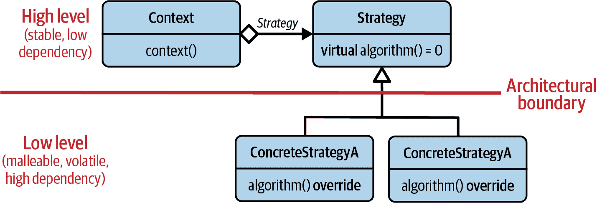
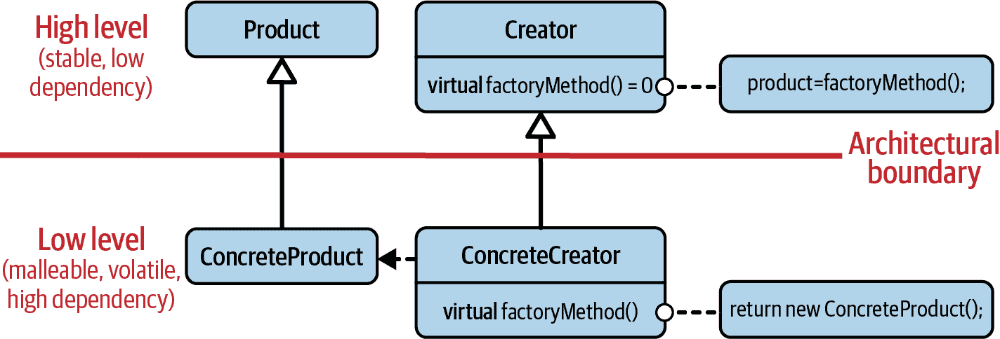
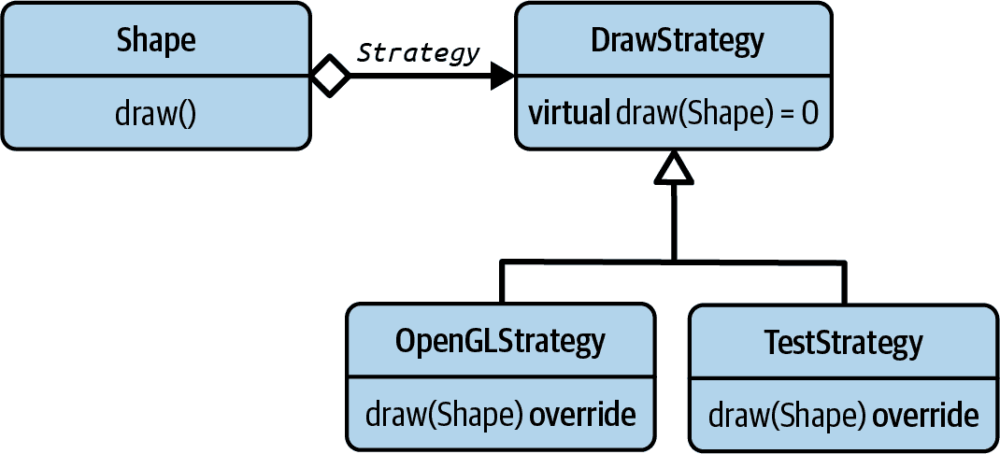

# 第三章：设计模式的目的

*Visitor*, *Strategy*, *Decorator*。这些都是我们将在接下来的章节中涉及的设计模式名称。然而，在详细讨论每种设计模式之前，我应该让你了解一下设计模式的一般目的。因此，在本章中，我们首先会看一下设计模式的基本属性，以及为什么你会想要了解它们并使用它们。

在“指南 1：理解软件设计的重要性”中，我已经使用了术语 *设计模式* 并解释了你在软件开发的哪个层次上使用它们。然而，我还没有详细解释设计模式 *是* 什么。这将是“指南 11：理解设计模式的目的”的主题：你将理解设计模式具有表达意图的名称，引入帮助解耦软件实体的抽象，并在多年来得到验证。

在“指南 12：小心设计模式的误解”，我将集中讨论关于设计模式的几个误解，并解释设计模式 *不是* 什么。我会努力说服你，设计模式不是关于实现细节，也不代表针对常见问题的特定于语言的解决方案。我还将尽力向你展示，它们不仅限于面向对象编程，也不限于动态多态性。

在“指南 13：设计模式无处不在”，我将展示很难避免设计模式。它们无处不在！你将意识到特别是 C++标准库充满了设计模式，并充分利用了它们的优势。

在“指南 14：使用设计模式的名称来传达意图”，我将强调使用设计模式名称来传达意图的重要性。因此，我将向你展示通过使用设计模式的名称，你可以为你的代码添加更多信息和意义。

# 指南 11：理解设计模式的目的

你很可能之前听说过设计模式，并且在你的编程生涯中也很可能使用了其中一些。设计模式并不新鲜：至少自从四人帮（GoF）在 1994 年发布了关于设计模式的书籍以来就存在了。¹ 尽管总有批评者，但它们的特殊价值已经被整个软件行业认可。然而，尽管设计模式长期存在且至关重要，尽管有着丰富的知识和积累的智慧，关于它们仍然存在许多误解，特别是在 C++社区中。

要有效地使用设计模式，首先你需要理解设计模式是什么。一个设计模式：

+   有一个名字

+   具有一个意图

+   引入了一个抽象

+   已被证明

## 设计模式有一个名字

首先，设计模式有一个名字。虽然这听起来非常明显和必要，但这确实是设计模式的一个基本属性。假设我们两个正在一起工作，并被要求找到一个解决问题的方案。想象一下我告诉你，“我会用*Visitor*做这个”。² 这不仅告诉了你我理解的真正问题，而且也让你明确了我提出的解决方案的具体想法。

设计模式的名字使我们能够在非常高的水平上进行交流，并用很少的话交换大量信息：

> ME: 我会用 Visitor 做这个。
> 
> YOU: 我不知道。我考虑过使用一个 Strategy。
> 
> ME: 是的，你可能有一点道理。但由于我们经常需要扩展操作，我们可能应该考虑使用 Decorator。

仅仅使用*Visitor*、*Strategy*和*Decorator*的名字，我们已经讨论了代码库的演变，并描述了我们希望未来几年中事物如何变化和扩展的方式。³ 没有这些名字，我们将更难表达我们的想法：

> ME: 我认为我们应该创建一个系统，使我们能够在不需要一再修改现有类型的情况下扩展操作。
> 
> YOU: 我不知道。与其说是新的操作，我更倾向于经常添加新的类型。所以我更喜欢一个能让我轻松添加类型的解决方案。但为了减少与预期的实现细节的耦合，我建议通过引入一个变化点来从现有类型中提取实现细节。
> 
> ME: 是的，你可能有一点道理。但由于我们经常需要扩展操作，我们可能应该考虑设计系统，使得我们可以轻松地构建和重用给定的实现。

你看到了区别吗？你*感觉*到了区别吗？没有名字，我们必须明确讨论更多细节。显然，这种精确的沟通只有在我们对设计模式有相同的理解时才可能实现。这就是为什么了解设计模式并谈论它们如此重要的原因。

## 设计模式具有一个意图

通过使用设计模式的名字，你可以简洁地表达你的意图并限制可能的误解。这引出了设计模式的第二个属性：一个意图。设计模式的*名字*传达了其*意图*。如果你使用设计模式的名字，你隐含地陈述了你认为的问题以及你认为的解决方案。

希望你意识到，在我们的小谈话中，我们并没有讨论任何具体的实现。我们没有谈论实现细节、任何特定的特性，也没有讨论任何特定的 C++ 标准。请不要认为我通过给出设计模式的名称就隐含告诉了你如何去实现解决方案。这不是设计模式的意图。相反地，这个名称应该告诉你我提出的结构，我计划如何管理依赖，以及我期望系统如何演化。这就是意图。

实际上，许多设计模式都有相似的结构。在 GoF 的书中，许多设计模式看起来非常相似，这当然会引起很多混淆和问题。例如，在结构上，策略模式、*命令*模式和*桥接*模式几乎没有什么区别。⁴ 但是它们的意图非常不同，因此您会用它们来解决不同的问题。正如您将在接下来的章节中的各种示例中看到的那样，几乎总是有许多不同的实现可以选择。

## 设计模式引入一个抽象

设计模式总是通过引入某种形式的抽象来减少依赖。这意味着设计模式始终关注于管理软件实体之间的交互并解耦软件的各个部分。例如，考虑策略设计模式，这是最初的 GoF 设计模式之一，在 图 3-1 中。不详细展开，策略设计模式引入了一个抽象，即 `Strategy` 基类。这个基类将策略使用者（在您架构的高层中的 `Context` 类）与具体策略的实现细节（在您架构的低层中的 `Concrete​StrategyA` 和 `ConcreteStrategyB`）解耦。因此，策略模式具备了设计模式的特性。⁵



###### 图 3-1\. GoF 策略设计模式

一个类似的例子是*工厂方法*设计模式（又是 GoF 设计模式之一；见 图 3-2）。*工厂方法*的意图是解耦具体产品的创建过程。为此，它引入了两个抽象：`Product` 和 `Creator` 基类，这些基类在架构上处于高层。具体的实现细节则通过 `ConcreteProduct` 和 `Concrete​Crea⁠tor` 类在架构的低层给出。有了这种架构结构，*工厂方法*也符合设计模式的定义：它有一个名称、意图是解耦，并且引入了抽象。



###### 图 3-2\. GoF《工厂方法》设计模式

注意，设计模式引入的抽象不一定通过基类引入。正如我将在以下部分和章节中向您展示的那样，这种抽象可以通过许多不同的方式引入，例如通过模板或简单的函数重载。再次强调，设计模式不暗示任何特定的实现方式。

作为反例，让我们考虑`std::make_unique()`函数：

```cpp
namespace std {

template< typename T, typename... Args >
unique_ptr<T> make_unique( Args&&... args );

} // namespace std
```

在 C++社区中，我们经常将`std::make_unique()`函数称为*工厂函数*。重要的是要注意，尽管术语*工厂函数*给人的印象是`std::make_unique()`是*工厂方法*设计模式的一个示例，但这种印象是错误的。设计模式通过引入一个允许定制和推迟实现细节的抽象来帮助您解耦。特别是，《工厂方法》设计模式的意图是引入一个*定制点*用于对象实例化。`std::make_unique()`并未提供这样的*定制点*：如果您使用`std::make_unique()`，您知道您将获得一个指向您请求的类型的`std::unique_ptr`，并且实例将通过`new`创建：

```cpp
// This will create a 'Widget' by means of calling 'new'
auto ptr = std::make_unique<Widget>( /* some Widget arguments */ );
```

由于`std::make_unique()`不提供任何自定义行为的方式，它无法帮助减少实体之间的耦合，因此无法达到设计模式的目的。⁶ 尽管如此，`std::make_unique()`是一个特定问题的常见解决方案。换句话说，它是一种模式。但是，它不是*设计模式*而是*实现模式*。它是一种流行的解决方案，用于封装实现细节（在本例中是`Widget`实例的生成），但它并未抽象出你得到什么或者如何创建它。因此，它属于*实现细节*级别而不是*软件设计*级别（参见图 1-1）。

引入抽象是将软件实体相互解耦并设计以支持变更和扩展的关键。在`std::make_unique()`函数模板中没有抽象，因此无法扩展功能（甚至无法正确重载或特化）。相反，《工厂方法》设计模式确实提供了从*创建什么*以及*如何创建*（包括实例化前后的操作）的抽象。由于这种抽象，您可以在以后编写新的工厂，而无需更改现有代码。因此，该设计模式帮助您解耦和扩展软件，而`std::make_unique()`只是一种*实现模式*。

## 已经证明存在设计模式

最后但并非最不重要的是，设计模式经过多年的验证。四人帮并未收集所有可能的解决方案，而是收集了在不同代码库中常用于解决相同问题的解决方案（尽管可能具有不同的实现）。因此，一个解决方案必须在多次展示其价值后才能成为一个模式。

总结一下：设计模式是经过验证的、命名的解决方案，表达了非常具体的意图。它引入了某种抽象，有助于解耦软件实体，从而有助于管理软件实体之间的交互。就像我们应该使用术语*设计*来表示管理依赖性和解耦的艺术（参见“指南 1：理解软件设计的重要性”），我们应该精确而有目的地使用术语*设计模式*。

# 指南 12：当心设计模式的误解

上一节重点解释了设计模式的目的：将名称、意图和某种形式的抽象结合起来，以解耦软件实体。然而，理解设计模式*是*什么同样重要，理解设计模式*不是*什么也同样重要。不幸的是，关于设计模式存在几种常见的误解：

+   有些人将设计模式视为达成良好软件质量的目标和保证。

+   有人认为设计模式基于特定实现，因此是特定于语言的习语。

+   有人说设计模式仅限于面向对象编程和动态多态性。

+   有些人认为设计模式已过时甚至已经过时。

这些误解并不令人惊讶，因为我们很少谈论设计，而是专注于功能和语言机制（参见“指南 1：理解软件设计的重要性”）。因此，在本指南中，我将揭穿前三个误解，并在下一部分处理第四个。

## 设计模式不是目标

一些开发者热爱设计模式。他们对设计模式如此迷恋，以至于试图通过设计模式解决所有问题，无论是否合理。当然，这种思维方式可能增加代码的复杂性，降低可理解性，这可能会适得其反。因此，对设计模式的过度使用可能导致其他开发者的沮丧，普遍设计模式的坏名声，甚至对模式的一般理念的拒绝。

明言不讳：设计模式并*不*是目标。它们是实现目标的手段。它们可能是解决方案的一部分。但它们并非目标。正如 Venkat Subramaniam 所说的：如果你早上起来就在想“今天我要使用什么设计模式？”，那么这是一个明显的迹象，表明你没有理解设计模式的目的。⁠⁷ 使用尽可能多的设计模式并不会带来奖励或奖牌。设计模式的使用不应该增加复杂性，相反，应该减少复杂性。代码应该变得更简单、更易于理解，更容易修改和维护，因为设计模式应该有助于解决依赖关系并创建更好的结构。如果使用设计模式导致更高的复杂性并给其他开发人员带来问题，显然这不是正确的解决方案。

明确一点：我并不是告诉你不要使用设计模式。我只是告诉你不要过度使用它们，就像我告诉你不要过度使用任何其他工具一样。这总是依赖于问题本身。例如，锤子是一个很好的工具，只要你的问题是钉子。但是，一旦你的问题变成螺丝，锤子就变成了一个有点不太优雅的工具。⁠⁸ 要正确使用设计模式，了解何时使用它们以及何时*不*使用它们非常重要，必须牢固掌握它们，理解它们的意图和结构特性，并明智地应用它们。

## 设计模式不是关于实现细节

关于设计模式最常见的误解之一是它们基于特定的实现。这包括认为设计模式或多或少是特定语言的习语。这种误解很容易理解，因为许多设计模式，特别是 GoF 模式，通常在面向对象的环境中呈现，并通过面向对象的示例来解释。在这样的背景下，很容易把实现细节误认为是特定模式，并假设它们是一样的。

幸运的是，很容易证明设计模式*不*涉及实现细节、任何特定的语言特性或任何 C++ 标准。让我们看看同一设计模式的不同实现。是的，我们将从经典的面向对象版本开始讨论这个设计模式。

考虑以下情景：我们想要绘制给定形状。⁹ 代码片段通过一个圆形来演示这一点，但当然它可以是任何其他形状，比如正方形或三角形。为了绘制，`Circle` 类提供了 `draw()` 成员函数。

```cpp
class Circle
{
 public:
   void draw( /*...*/ );  // Implemented in terms of some graphics library
   // ...
};
```

现在显而易见的是，你需要实现`draw()`函数。毫不犹豫地，你可能会通过使用诸如 OpenGL、Metal、Vulcan 或其他任何图形库来实现这一点。然而，如果`Circle`类本身提供`draw()`功能的实现，这将是一个很大的设计缺陷：通过直接实现`draw()`函数，你会引入对所选图形库的强耦合。这带来了一些弊端：

+   对于每个`Circle`的应用，你都需要图形库可用，即使你可能对图形不感兴趣，只需将其作为几何原语使用。

+   对图形库的每一次更改都可能影响`Circle`类，导致必须进行修改、重新测试、重新部署等。

+   将来切换到另一个库意味着一切除了平稳过渡。

所有这些问题都有一个共同的根源：在`Circle`类内部直接实现`draw()`函数违反了*单一责任原则*（SRP；参见“指南 2：面向变更设计”）。该类不再为单一原因而变化，并且严重依赖于该设计决策。

针对这个问题的经典面向对象解决方案是提取如何绘制圆的决策，并通过基类引入一个抽象概念。引入这样一个*变化点*正是策略设计模式的效果（参见图 3-3）¹⁰。



###### 图 3-3\. *策略*设计模式应用于绘制圆形

策略设计模式的意图是定义一组算法并封装每个算法，从而使它们可以互换使用。策略模式使得算法的变化独立于使用它的客户端。通过引入`DrawStrategy`基类，可以轻松地改变给定`Circle`的`draw()`实现方式。这也使得每个人，而不仅仅是你，可以在不修改现有代码的情况下实现新的绘图行为，并且可以从外部注入到`Circle`中。这就是我们通常称之为*依赖注入*：

```cpp
#include <Circle.h>
#include <OpenGLStrategy.h>
#include <cstdlib>
#include <utility>

int main()
{
   // ...

   // Creating the desired drawing strategy for a circle.
   auto strategy =
      std::make_unique_ptr<OpenGLStrategy>( /* OpenGL-specific arguments */ );

   // Injecting the strategy into the circle; the circle does not have to know
   // about the specific kind of strategy, but can with blissful ignorance use
   // it via the 'DrawStrategy' abstraction.
   Circle circle( 4.2, std::move(strategy) );
   circle.draw( /*...*/ );

   // ...

   return EXIT_SUCCESS;
}
```

这种方法大大增加了对不同绘图行为的灵活性：它消除了对特定库和其他实现细节的所有依赖，从而使代码更易于变更和扩展。例如，现在可以轻松地为测试目的提供一个特殊的实现（即`TestStrategy`）。这表明增强的灵活性对设计的可测试性产生了非常积极的影响。

策略设计模式是 GoF 设计模式之一。因此，它经常被称为面向对象的设计模式，并且通常被认为需要一个基类。然而，策略的意图不仅限于面向对象编程。就像可以使用基类来进行抽象一样，同样可以依赖于模板参数：

```cpp
template< typename DrawStrategy >
class Circle
{
 public:
   void draw( /*...*/ );
};
```

在这种形式下，决定如何绘制圆圈是在编译时发生的：而不是编写一个基类`DrawStrategy`并在运行时传递一个指向`DrawStrategy`的指针，绘制的实现细节是通过`DrawStrategy`模板参数提供的。请注意，虽然模板参数允许您从外部注入实现细节，但`Circle`仍然不依赖于任何实现细节。因此，您仍然将`Circle`类与使用的图形库解耦。但与运行时方法相比，每次`DrawStrategy`更改时都必须重新编译。

虽然基于模板的解决方案确实从根本上改变了示例的属性（即没有基类和虚函数，没有运行时决策，没有单一的`Circle`类，而是每个具体的`DrawStrategy`一个`Circle`类型），但它仍然完美地实现了策略设计模式的意图。因此，这表明设计模式并不局限于特定的实现或特定的抽象形式。

## 设计模式并不局限于面向对象编程或动态多态性

让我们考虑策略设计模式的另一个用例：标准库`<numeric>`头文件中的`accumulate()`函数模板：

```cpp
std::vector<int> v{ 1, 2, 3, 4, 5 };
auto const sum =
   std::accumulate( begin(v), end(v), int{0} );
```

默认情况下，`std::accumulate()`函数对给定范围内的所有元素求和。第三个参数指定了求和的初始值。由于`std::accumulate()`使用该参数的类型作为返回类型，因此该参数的类型显式地标注为`int{0}`，而不仅仅是`0`，以避免微妙的误解。然而，求和元素只是冰山一角：如果需要，您可以通过向`std::accumulate()`提供第四个参数来指定如何累加元素。例如，您可以使用来自`<functional>`头文件的`std::plus`或`std::multiplies`：

```cpp
std::vector<int> v{ 1, 2, 3, 4, 5 };
auto const sum =
   std::accumulate( begin(v), end(v), int{0}, std::plus<>{} );
auto const product =
   std::accumulate( begin(v), end(v), int{1}, std::multiplies<>{} );
```

通过第四个参数，`std::accumulate()`可以用于任何类型的归约操作，因此第四个参数代表了归约操作的实现。因此，它使我们能够通过从外部注入归约的具体工作方式来变化实现。因此，`std::accumulate()`并不依赖于单一的、特定的实现，而是可以被任何人定制为特定目的。这正是策略设计模式的意图。¹¹

`std::accumulate()`从策略设计模式的通用形式中获得其能力。如果不能改变这种行为，它将只在极少数用例中有用。由于策略设计模式，可能的使用方式是无限的。¹²

`std::accumulate()`的例子表明，设计模式，甚至是经典的 GoF 模式，并不局限于一个特定的实现，而且不仅限于面向对象编程。显然，许多这些模式的意图对其他范式（如函数式或通用编程）也非常有用。¹³ 因此，设计模式并不仅限于动态多态性。相反，设计模式同样适用于静态多态性，并且因此可以与 C++模板结合使用。

为了进一步强调这一点，并展示策略设计模式的另一个示例，请考虑`std::vector`和`std::set`类模板的声明：

```cpp
namespace std {

template< class T
        , class Allocator = std::allocator<T> >
class vector;

template< class Key
        , class Compare = std::less<Key>
        , class Allocator = std::allocator<Key> >
class set;

} // namespace std
```

在标准库中的所有容器（除了`std::array`）中，都可以指定自定义的分配器。对于`std::vector`，它是第二个模板参数；对于`std::set`，则是第三个参数。容器中的所有内存请求都通过给定的分配器处理。

通过为分配器暴露一个模板参数，标准库容器为你提供了从外部定制内存分配的机会。它们使你能够定义一系列算法（在这种情况下是内存获取算法），并将每个算法封装起来，从而使它们可以互换。因此，你能够独立地变化这个算法，而不影响使用它的客户端（在这种情况下是容器）。¹⁴

阅读了这个描述后，你应该能够识别出策略设计模式。在这个例子中，策略再次基于静态多态性，并通过模板参数实现。显然，策略不仅限于动态多态性。

显然，设计模式不限于面向对象编程或动态多态性，但我还是要明确地指出，有些设计模式的意图是为了缓解面向对象编程中的常见问题（例如*访问者*和*原型*设计模式）。⁠¹⁵ 当然，还有一些专注于函数式编程或通用编程的设计模式（例如*奇异递归模板模式* [CRTP] 和*表达式模板*）。¹⁶ 大多数设计模式不限于特定范式，并且它们的意图可以用于各种实现，但有些更具体。

在接下来的章节中，您将看到两类示例。您将看到具有非常一般意图并因此具有一般用途的设计模式示例。此外，您还将看到一些更具范式特定性的设计模式，由于这个原因，在其目标领域之外可能无法使用。尽管如此，它们都具有设计模式的主要特征：名称、意图和某种形式的抽象。

总结：设计模式不仅限于面向对象编程，也不仅限于动态多态性。更具体地说，设计模式不是关于特定实现的，也不是语言特定的习语。相反，它们完全专注于以特定方式解耦软件实体的意图。

# 指导原则 13：设计模式无处不在

前面的部分已经证明了设计模式不仅限于面向对象编程或动态多态性，它们也不是语言特定的习语，也不是关于特定实现的。尽管如此，由于这些常见误解以及因为我们不再将 C++视为纯粹的面向对象编程语言，一些人甚至声称设计模式已经过时或过时了。¹⁷

我想你现在可能有些怀疑了。“过时？这不是有些夸张吗？”你问道。嗯，不幸的是并不夸张。让我来讲个小故事，在 2021 年初，我有幸在一个德国的 C++用户组中进行了一场虚拟讲座，主题是设计模式。我的主要目标是解释什么是设计模式，以及它们今天仍然被广泛使用。在讲座期间，我感觉良好，充满了使命感，希望能帮助人们看到设计模式带来的所有好处，我确实尽了最大努力让每个人都看到知识带来的光明。然而，讲座在 YouTube 上发布几天后，有个用户评论道：“真的吗？2021 年还在讲设计模式？”

我非常希望你现在在怀疑地摇摇头。是的，我也不敢相信，特别是在我已经展示出 C++标准库中有数百个设计模式示例后。不，设计模式既不过时也不过时。与事实相去甚远。为了证明设计模式仍然非常活跃和相关，让我们看看 C++标准库中更新的分配器设施。看看以下使用`std::pmr`（*多态内存资源*）命名空间中分配器的示例代码：

```cpp
#include <array>
#include <cstddef>
#include <cstdlib>
#include <memory_resource>
#include <string>
#include <vector>

int main()
{
   std::array<std::byte,1000> raw;  // Note: not initialized! 

   std::pmr::monotonic_buffer_resource
      buffer{ raw.data(), raw.size(), std::pmr::null_memory_resource() };  

   std::pmr::vector<std::pmr::string> strings{ &buffer };  

   strings.emplace_back( "String longer than what SSO can handle" );
   strings.emplace_back( "Another long string that goes beyond SSO" );
   strings.emplace_back( "A third long string that cannot be handled by SSO" );

   // ... 
   return EXIT_SUCCESS;
}

```

这个示例演示了如何使用[`std::pmr::monotonic_buffer_resource`](https://oreil.ly/E40Dn)作为分配器，将所有内存分配重定向到预定义的字节缓冲区。最初，我们创建了一个大小为 1,000 字节的缓冲区，其形式为`std::array` ()。通过将指向第一个元素的指针（通过`raw.data()`）和缓冲区的大小（通过`raw.size()`）传递给`std::pmr::monotonic_buffer_resource`，将此缓冲区提供为内存来源 ()。

`monotonic_buffer_resource`的第三个参数表示备用分配器，用于在`monotonic_buffer_resource`耗尽内存时使用。由于在这种情况下我们不需要额外的内存，因此我们使用`std::pmr::null_memory_resource()`函数，它会给我们一个指向始终无法分配的标准分配器的指针。这意味着，无论你多么礼貌地请求，由`std::pmr::null_memory_resource()`返回的分配器在请求内存时总是会抛出异常。

创建的缓冲区作为分配器传递给`strings`向量，该向量现在将从初始字节缓冲区获取其所有内存 ()。此外，由于向量将其分配器传递给其元素，甚至通过`emplace_back()`函数添加的三个字符串，它们都太长而不能依赖*Small String Optimization (SSO)*，将从字节缓冲区获取其所有内存。因此，整个示例中不使用动态内存；所有内存将来自字节数组。¹⁸

乍一看，这个示例似乎不需要任何设计模式来运行。然而，此示例中使用的分配器功能至少使用了四种不同的设计模式：模板方法设计模式、装饰者设计模式、适配器设计模式以及（再次）策略设计模式。

即使你考虑*Singleton*模式，这里甚至有五种设计模式：`null_memory_resource()` 函数 () 是基于*Singleton*模式实现的:¹⁹ 它返回一个静态存储期对象的指针，用于确保此分配器最多只有一个实例。

所有来自`pmr`命名空间的 C++分配器，包括由`null_memory_resource()`返回的分配器和`monotonic_buffer_resource`，都派生自`std::pmr::memory_resource`基类。如果查看`memory_resource`类的定义，就能看到第一个设计模式的显现：

```cpp
namespace std::pmr {

class memory_resource
{
 public:
   // ... a virtual destructor, some constructors and assignment operators

   [[nodiscard]] void* allocate(size_t bytes, size_t alignment);
   void deallocate(void* p, size_t bytes, size_t alignment);
   bool is_equal(memory_resource const& other) const noexcept;

 private:
   virtual void* do_allocate(size_t bytes, size_t alignment) = 0;
   virtual void do_deallocate(void* p, size_t bytes, size_t alignment) = 0;
   virtual bool do_is_equal(memory_resource const& other) const noexcept = 0;
};

} // namespace std::pmr
```

你可能注意到类的`public`部分有三个函数，在类的`private`部分有对应的虚拟函数。公共的`allocate()`、`deallocate()`和`is_equal()`函数代表了类的用户接口，而`do_allocate()`、`do_deallocate()`和`do_is_equal()`函数则代表了派生类的接口。这种关注点分离是*非虚拟接口（NVI）*模式的一个示例，它本身是*模板方法*设计模式的一个示例。²⁰

我们隐式使用的第二种设计模式是装饰者设计模式。²¹ 装饰者模式帮助您构建分层的分配器，并将一个分配器的功能包装和扩展到另一个分配器。这个想法在这一行变得更加清晰：

```cpp
std::pmr::monotonic_buffer_resource
   buffer{ raw.data(), raw.size(), std::pmr::null_memory_resource() };
```

通过将`null_memory_resource()`函数返回的分配器传递给`monotonic_buffer_resource`，我们装饰了它的功能。每当我们通过`allocate()`函数向`monotonic_buffer_resource`请求内存时，它可能会将调用转发给其备用分配器。这样，我们可以实现许多不同类型的分配器，这些分配器可以轻松组装成具有不同层次分配策略的完整内存子系统。这种结合和重用功能片段的能力是装饰者设计模式的优势。

你可能已经注意到，在示例代码中我们使用了`std::pmr::vector`和`std::pmr::string`。我假设你记得`std::string`只是`std::basic_string<char>`的一个类型别名。了解到这一点，也许不会让你惊讶`pmr`命名空间中的这两种类型也只是类型别名：

```cpp
namespace std::pmr {

template< class CharT, class Traits = std::char_traits<CharT> >
using basic_string =
   std::basic_string< CharT, Traits,
                      std::pmr::polymorphic_allocator<CharT> >;

template <class T>
using vector =
   std::vector< T, std::pmr::polymorphic_allocator<T> >;

} // namespace std::pmr
```

这些类型别名仍然指向常规的`std::vector`和`std::basic_string`类，但不再公开分配器的模板参数。相反，它们使用`std::pmr::polymorphic_allocator`作为分配器。这是*适配器*设计模式的一个示例。²² 适配器的目的是帮助您将两个不匹配的接口粘合在一起。在这种情况下，`polymorphic_allocator`有助于在经典的静态接口（经典 C++分配器所需的接口）与新的动态分配器接口（`std::pmr::memory_resource`所需的接口）之间进行传递。

我们示例中使用的第四种也是最后一种设计模式，再次是策略设计模式。通过向分配器公开模板参数，标准库容器如`std::vector`和`std::string`为您提供了从外部定制内存分配的机会。这是策略设计模式的静态形式，并且与定制算法具有相同的意图（也请参阅“指南 12：设计模式误解”）。

这个例子令人印象深刻地展示了，设计模式远非过时。仔细观察后，我们会发现它们无处不在：任何抽象和任何试图解耦软件实体并引入灵活性和可扩展性的尝试，很可能都基于某种设计模式。因此，了解不同的设计模式并理解它们的意图，无论何时何地都有助于识别并在合适时应用它们。

# 指南 14：使用设计模式的名称传达意图

在最后两节中，您学到了什么是设计模式，它们不是什么，以及设计模式无处不在。您还了解到每个设计模式都有一个名称，这个名称表达了清晰、简洁和明确的意图。因此，名称具有意义。²³通过使用设计模式的名称，您可以表达问题是什么，以及您选择了哪种解决方案来解决问题，并描述代码预期如何演变。

例如，标准库的`accumulate()`函数：

```cpp
template< class InputIt, class T, class BinaryOperation >
constexpr T accumulate( InputIt first, InputIt last, T init,
                        BinaryOperation op );
```

第三个模板参数被命名为`BinaryOperation`。虽然这表明传递的可调用对象需要接受两个参数，但名称并未传达参数的意图。为了更清晰地表达意图，考虑将其命名为`BinaryReductionStrategy`：

```cpp
template< class InputIt, class T, class BinaryReductionStrategy >
constexpr T accumulate( InputIt first, InputIt last, T init,
                        BinaryReductionStrategy op );
```

*Reduction*这个术语和*Strategy*这个名称对每位 C++程序员都有意义。因此，您现在更清楚地捕捉并表达了您的意图：该参数允许*依赖注入*一个二元操作，从而允许您指定减少操作的方式。因此，该参数解决了定制化的问题。尽管如此，正如您将在第五章中看到的那样，策略设计模式表明了对操作有一定的期望。您只能指定减少操作的方式；您不能重新定义`accumulate()`的功能。如果这是您想要表达的内容，您应该使用*Command*设计模式的名称：²⁴

```cpp
template< class InputIt, class UnaryCommand >
constexpr UnaryCommand
   for_each( InputIt first, InputIt last, UnaryCommand f );
```

`std::for_each()`算法允许您对元素范围应用任何类型的一元操作。为了表达这个意图，第二个模板参数可以命名为`UnaryCommand`，这明确表明对操作几乎没有期望。

标准库的另一个示例展示了设计模式的名称能为代码带来多少价值：

```cpp
#include <cstdlib>
#include <iostream>
#include <string>
#include <variant>

struct Print
{
   void operator()(int i) const {
      std::cout << "int: " << i << '\n';
   }
   void operator()(double d) const {
      std::cout << "double: " << d << '\n';
   }
   void operator()(std::string const& s) const {
      std::cout << "string: " << s << '\n';
   }
};

int main()
{
   std::variant<int,double,std::string> v{};  

   v = "C++ Variant example";  

   std::visit(Print{}, v);  

   return EXIT_SUCCESS;
}

```

在`main()`函数中，我们为三种不同的选项`int`、`double`和`std::string`创建了一个`std::variant`（）。接下来的一行，我们分配了一个 C 风格的字符串字面量，它将在变体内转换为`std::string`（）。然后，我们通过`std::visit()`函数和`Print`函数对象打印了变体的内容（）。

注意`std::visit()`函数的名称。该名称直接指涉*访问者*设计模式，因此清晰地表达了其意图：您可以对包含在变体实例中的封闭类型集合应用任何操作。²⁵ 此外，您可以非侵入式地扩展操作集。

你会发现，使用设计模式的名称比使用任意名称包含更多信息。但这并不意味着命名是容易的。²⁶ 名称应该主要帮助你理解特定上下文中的代码。如果设计模式的名称可以帮助到这一点，那么考虑包含设计模式名称以表达你的意图。

¹ "四人帮"，或简称 GoF，通常指的是四位作者埃里希·伽马、理查德·赫尔姆、拉尔夫·约翰逊和约翰·弗利西德斯以及他们的设计模式书籍：*《设计模式：可复用面向对象软件的基础》*（Prentice Hall）。数十年后，GoF 书仍然是设计模式的 *权威* 参考。本书的其余部分，我会用到 GoF 书、GoF 模式或特征显著的面向对象的 GoF 风格。

² 如果你还不了解*访问者*设计模式，不要担心。我会在第四章中介绍这个模式。

³ 策略设计模式将在第五章中详细解释，装饰者设计模式将在第九章中详细解释。

⁴ 我只提到将在后续章节中解释的设计模式（参见第五章的策略和*命令*设计模式以及第七章“指导原则 28：建立桥梁以消除物理依赖性”的*桥接*设计模式）。还有几种设计模式共享相同的结构。

⁵ 如果你对策略设计模式不熟悉，放心，第五章会提供更多信息，包括几个代码示例。

⁶ 这可能是一个有争议的例子。因为我了解 C++社区，知道你可能有不同的看法。然而，我坚持我的观点：由于其定义，`std::make_unique()`无法解耦软件实体，因此在软件设计层面上并不起作用。它仅仅是一个实现细节（但却是一个宝贵和有用的细节）。

⁷ Venkat Subramaniam 和 Andrew Hunt，《敏捷开发者的实践》（The Pragmatic Programmers, LLC, 2017）。

⁸ 好吧，它确实“运行”了，在某种“运行”的定义下。

⁹ 我知道你在想什么：“你不可能是认真的！书中有这么多有趣的例子，但你选择了最古老和最无聊的例子！”好吧，我承认这可能不是选择的最令人兴奋的例子。但是，我有两个好理由选择这个例子。首先，这个场景是如此广为人知，以至于我可以假设没有人会对此感到困惑。这意味着每个人都应该能够理解我关于软件设计的论点。其次，我们可以同意，在计算机科学中以形状或动物的例子开始是一种传统。当然，我不想让传统主义者失望。

¹⁰ 第五章将全面详细地介绍*策略*设计模式。

¹¹ 你可能（正确地）观察到，即使没有第四个参数，通过为给定类型提供自定义的加法操作符（即`operator+()`），也可以改变累加的工作方式。然而，这只能用于有限的情况。虽然你可以为用户定义的类型提供自定义的加法操作符，但你不能为基本类型（例如示例中的`int`）提供自定义的加法操作符。此外，定义除加法操作（或类似于字符串连接的操作）之外的`operator+()`是非常值得怀疑的。因此，依赖加法操作符在技术和语义上是有限制的。

¹² 在他 2016 年的 CppCon 演讲中，[“std::accumulate: 探索一个算法帝国”](https://oreil.ly/P8qpA)，Ben Deane 生动展示了由于第四个参数的存在，`std::accumulate()`有多么强大。

¹³ 欲了解更多关于 STL 算法及其函数式编程遗产的信息，请参阅伊万·库基奇（Ivan Cukic）在《C++函数式编程》（Manning）中的精彩介绍。

¹⁴ 对于策略设计模式的这种形式，另一个常用的名称是*基于策略的设计*；请参阅“指南 19：使用策略隔离做事的方式”。

¹⁵ 我将在第四章解释*Visitor*设计模式，并在“Guideline 30: Apply Prototype for Abstract Copy Operations”中介绍*Prototype*设计模式。

¹⁶ 再次推荐 Ivan Cukic 的*C++函数式编程*。*CRTP*设计模式将是“Guideline 26: Use CRTP to Introduce Static Type Categories”的主题。关于*Expression Templates*，一个基于模板的模式，请参考*C++ Templates: The Complete Guide*（Addison-Wesley）中的 C++模板参考：David Vandevoorde，Nicolai Josuttis 和 Douglas Gregor。

¹⁷ 我认为自 1989 年语言中首次添加模板实现以来，C++就成为了一种多范式编程语言。模板对语言的影响在 1994 年将标准模板库（STL）的部分添加到标准库中后变得明显。从那时起，C++提供了面向对象、函数式和泛型能力。

¹⁸ *Small String Optimization (SSO)* 是小字符串的常见优化方式。字符串不再通过提供的分配器在堆上分配动态内存，而是直接将少量字符存储在字符串的栈部分。由于字符串通常在栈上占据 24 到 32 字节（这不是 C++标准要求而是常见实现的特性），超过 32 字节的字符串将需要堆分配。这是三个给定字符串的情况。

¹⁹ *Singleton* 是原始的 23 个 GoF 设计模式之一。但是在“Guideline 37: Treat Singleton as an Implementation Pattern, Not a Design Pattern”中，我将尽力说服你，*Singleton* 实际上并不是设计模式，而是一种实现细节。因此，我将*Singleton*称为实现模式而非设计模式。

²⁰ 不幸的是，本书不会涵盖*Template Method*设计模式。这并不是因为它不重要，而仅仅是因为页数不足。请参考 GoF 书籍获取更多细节。

²¹ 我将在第九章全面介绍装饰器设计模式。

²² 适配器设计模式将在“Guideline 24: Use Adapters to Standardize Interfaces”中讨论。

²³ 好的命名总是有意义的。这就是为什么它们如此基本重要的原因。

²⁴ 我将在 第五章 中解释 *Command* 设计模式以及策略设计模式。

²⁵ *Visitor* 设计模式，包括现代实现方式 `std::variant`，将是我们在 第四章 中的重点。

²⁶ 命名很难，正如 Kate Gregory 在她高度推荐的演讲 [“Naming Is Hard: Let’s Do Better”](https://oreil.ly/nyeOv) 中在 CppCon 2019 上所言。
