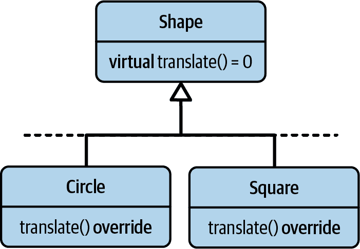
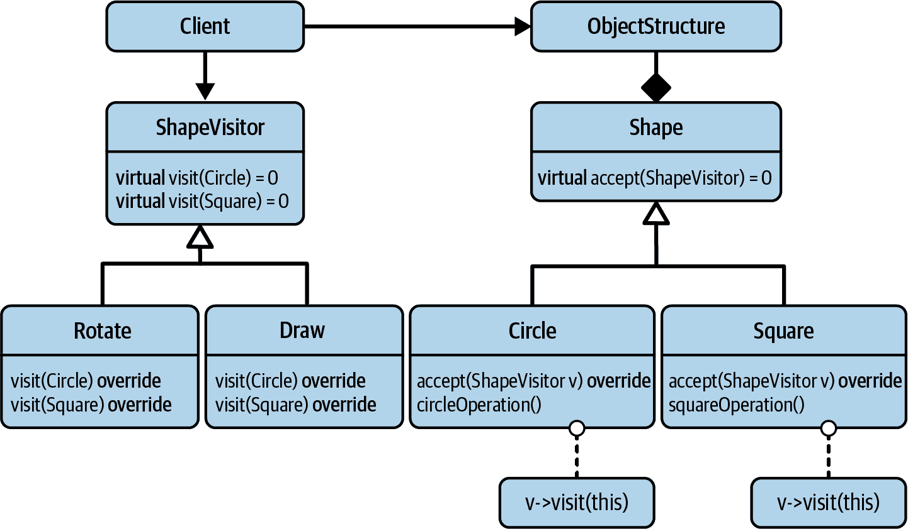
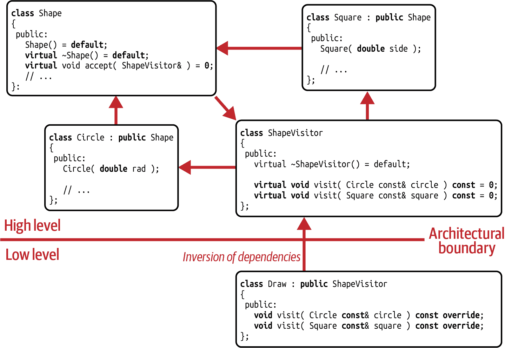
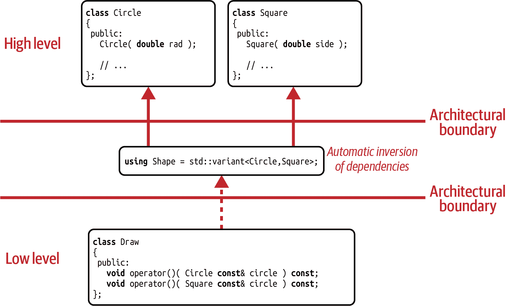
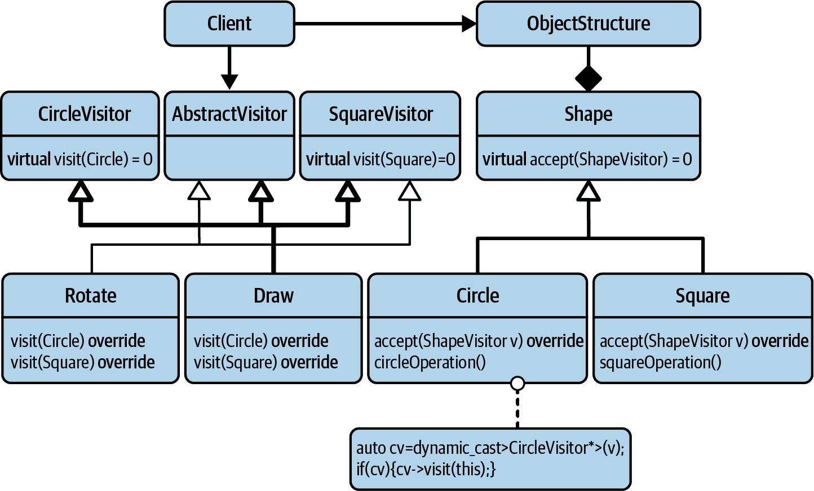
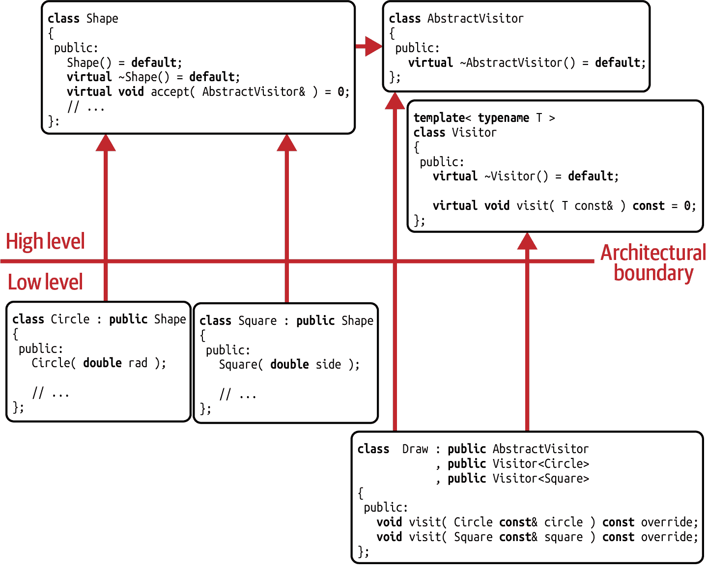

# 第四章 访问者设计模式

整个章节都集中讨论*访问者*设计模式。如果您已经听说过访问者设计模式，甚至在自己的设计中使用过它，您可能会想知道为什么我选择访问者作为首个详细解释的设计模式。是的，访问者绝对不是最引人注目的设计模式之一。但是，它确实将作为一个很好的例子，展示您在实现设计模式时有多少选择，以及这些实现有多么不同。它还将作为一个有效的示例，宣传现代 C++的优势。

在“第 15 条指南：为类型或操作的添加进行设计”，我们首先讨论您在动态多态性领域中需要做出的基本设计决策：专注于类型还是操作。在该指南中，我们还将讨论编程范式的固有优势和劣势。

在“第 16 条指南：使用访问者扩展操作”，我将向您介绍访问者设计模式。我将解释其意图是扩展操作而不是类型，并向您展示经典访问者模式的优势和缺点。

在“第 17 条指南：考虑使用 std::variant 来实现访问者”，您将会认识到访问者设计模式的现代实现。我将向您介绍`std::variant`，并解释该特定实现的诸多优势。

在“第 18 条指南：警惕无环访问器的性能”，我将向您介绍*无环访问器*。乍一看，这种方法似乎解决了访问者模式的一些根本问题，但仔细检查后，我们会发现运行时开销可能会使此实现失效。

# 指南 15：为类型或操作的添加进行设计

对您来说，术语*动态多态性*可能听起来像是很大的自由。这可能感觉像当你还是个孩子时一样：无限的可能性，没有限制！然而，您已经长大并面对现实：您不能拥有一切，总是需要做出选择。不幸的是，动态多态性也是如此。尽管听起来像是完全的自由，但实际上有一个限制性选择：您想扩展类型还是操作？

要了解我的意思，让我们回到第三章的场景：我们想要绘制一个给定的形状。¹我们坚持动态多态性，并且在我们的初次尝试中，我们使用了古老的过程化编程来解决这个问题。

## 过程化解决方案

第一个头文件`Point.h`提供了一个非常简单的`Point`类。这主要是为了使代码完整，但也让我们明白我们在处理二维形状：

```cpp
//---- <Point.h> ----------------

struct Point
{
   double x;
   double y;
};
```

第二个概念性头文件`Shape.h`证明更加有趣：

```cpp
//---- <Shape.h> ---------------- 
enum ShapeType  
{
   circle,
   square
};

class Shape  
{
 protected:
   explicit Shape( ShapeType type )
      : type_( type )  
   {}

 public:
   virtual ~Shape() = default;  

   ShapeType getType() const { return type_; }  

 private:
   ShapeType type_;  
};

```

首先，我们引入了枚举`ShapeType`，目前列出了两个枚举器，`circle`和`square`（）。显然，我们最初只处理圆形和正方形。其次，我们引入了`Shape`类（）。考虑到受保护的构造函数和虚析构函数（），您可以预期`Shape`应该作为基类工作。但这并不是关于`Shape`的令人惊讶的细节：`Shape`有一个类型为`ShapeType`的数据成员（）。这个数据成员通过构造函数初始化（），并且可以通过`getType()`成员函数查询（）。显然，一个`Shape`以`ShapeType`枚举的形式存储其类型。

`Shape`基类的使用示例之一是`Circle`类：

```cpp
//---- <Circle.h> ---------------- 
#include <Point.h>
#include <Shape.h>

class Circle : public Shape  
{
 public:
   explicit Circle( double radius )
      : Shape( circle )  
      , radius_( radius )
   {
      /* Checking that the given radius is valid */
   }

   double radius() const { return radius_; }
   Point  center() const { return center_; }

 private:
   double radius_;
   Point center_{};
};

```

`Circle`公开继承自`Shape`（），因此，由于`Shape`中没有默认构造函数，需要初始化基类（）。由于它是一个圆，它使用`circle`枚举器作为基类构造函数的参数。

如前所述，我们希望绘制形状。因此，我们引入了`draw()`函数用于圆形。由于我们不想过于依赖任何绘图的具体实现细节，`draw()`函数在概念性头文件`DrawCircle.h`中声明，并在相应的源文件中定义：

```cpp
//---- <DrawCircle.h> ----------------

class Circle;

void draw( Circle const& );

//---- <DrawCircle.cpp> ----------------

#include <DrawCircle.h>
#include <Circle.h>
#include /* some graphics library */

void draw( Circle const& c )
{
   // ... Implementing the logic for drawing a circle
}
```

当然，并不只有圆形。如`square`枚举器所示，还有一个`Square`类：

```cpp
//---- <Square.h> ---------------- 
#include <Point.h>
#include <Shape.h>

class Square : public Shape  
{
 public:
   explicit Square( double side )
      : Shape( square )  
      , side_( side )
   {
      /* Checking that the given side length is valid */
   }

   double side  () const { return side_; }
   Point  center() const { return center_; }

 private:
   double side_;
   Point center_{};  // Or any corner, if you prefer };

//---- <DrawSquare.h> ---------------- 
class Square;

void draw( Square const& );

//---- <DrawSquare.cpp> ---------------- 
#include <DrawSquare.h>
#include <Square.h>
#include /* some graphics library */

void draw( Square const& s )
{
   // ... Implementing the logic for drawing a square }

```

`Square`类看起来非常类似于`Circle`类（）。主要区别在于`Square`使用`square`枚举器初始化其基类（）。

现在有了圆形和正方形，我们现在想要绘制一个完整的不同形状的向量。因此，我们引入了`drawAllShapes()`函数：

```cpp
//---- <DrawAllShapes.h> ---------------- 
#include <memory>
#include <vector>
class Shape;

void drawAllShapes( std::vector<std::unique_ptr<Shape>> const& shapes );  

//---- <DrawAllShapes.cpp> ---------------- 
#include <DrawAllShapes.h>
#include <Circle.h>
#include <Square.h>

void drawAllShapes( std::vector<std::unique_ptr<Shape>> const& shapes )
{
   for( auto const& shape : shapes )
   {
      switch( shape->getType() )  
      {
         case circle:
            draw( static_cast<Circle const&>( *shape ) );
            break;
         case square:
            draw( static_cast<Square const&>( *shape ) );
            break;
      }
   }
}

```

`drawAllShapes()`接受一个形状向量，形式为`std::unique_ptr<Shape>`（）。必须使用基类指针来保存不同类型的具体形状，特别是使用`std::unique_ptr`自动管理形状，通过*RAII 习惯用法*。在函数内部，我们首先遍历向量以绘制每个形状。不幸的是，此时我们只有`Shape`指针。因此，我们必须通过`getType()`函数（）礼貌地询问每个形状：你是什么类型的？如果形状回答`circle`，我们知道必须将其作为`Circle`绘制并执行相应的`static_cast`。如果形状回答`square`，我们将其作为`Square`绘制。

我感觉到你对这个解决方案并不是特别满意。但在讨论缺点之前，让我们先考虑`main()`函数：

```cpp
//---- <Main.cpp> ----------------

#include <Circle.h>
#include <Square.h>
#include <DrawAllShapes.h>
#include <memory>
#include <vector>

int main()
{
   using Shapes = std::vector<std::unique_ptr<Shape>>;

   // Creating some shapes
   Shapes shapes;
   shapes.emplace_back( std::make_unique<Circle>( 2.3 ) );
   shapes.emplace_back( std::make_unique<Square>( 1.2 ) );
   shapes.emplace_back( std::make_unique<Circle>( 4.1 ) );

   // Drawing all shapes
   drawAllShapes( shapes );

   return EXIT_SUCCESS;
}
```

它有效！使用这个`main()`函数，代码编译并绘制了三个形状（两个圆和一个正方形）。是不是很棒？但是，这并不能阻止你发泄：“多么原始的解决方案！`switch`语句不仅是区分不同形状的糟糕选择，而且还没有默认情况！谁有这么疯狂的想法，通过无作用域枚举来编码形状的类型？”² 你怀疑地看着我……

嗯，我能理解你的反应。但让我们更详细地分析一下问题。让我猜猜：你记得“指南 5：设计以便扩展”。现在想象一下，要添加第三种形状你将要做什么。首先，你必须扩展枚举。例如，我们将不得不添加新的枚举值`triangle`（）：

```cpp
enum ShapeType
{
   circle,
   square,
   triangle  
};

```

请注意，这种添加不仅会影响`drawAllShapes()`函数中的`switch`语句（现在它确实不完整了），还会影响所有派生自`Shape`的类（`Circle`和`Square`）。这些类依赖于枚举，因为它们依赖于`Shape`基类，并直接使用枚举。因此，更改枚举将导致*所有*源文件重新编译。

这应该让你感到严重。而且确实如此。问题的核心是所有形状类和函数对枚举的直接依赖性。对枚举的任何更改都会产生连锁反应，需要重新编译依赖文件。显然，这直接违反了开闭原则（OCP）（参见“指南 5：设计以便扩展”）。这似乎不对：添加一个`Triangle`不应该导致`Circle`和`Square`类重新编译。

不过，除此之外还有更多。除了实际编写一个`Triangle`类（这部分留给你的想象力），你还得更新`switch`语句来处理三角形（）：

```cpp
void drawAllShapes( std::vector<std::unique_ptr<Shape>> const& shapes )
{
   for( auto const& shape : shapes )
   {
      switch( shape->getType() )
      {
         case circle:
            draw( static_cast<Circle const&>( *shape ) );
            break;
         case square:
            draw( static_cast<Square const&>( *shape ) );
            break;
         case triangle:  
            draw( static_cast<Triangle const&>( *shape ) );
            break;
      }
   }
}

```

我能想象你会惊呼：“复制粘贴！重复！”是的，在这种情况下，开发者很可能会使用复制粘贴来实现新逻辑。因为新情况与之前的两种情况如此相似，所以这样做非常方便。实际上，这表明设计可以改进。然而，我看到一个更为严重的缺陷：我认为在更大的代码库中，这并不是唯一的`switch`语句。相反，还会有其他需要更新的。有多少个？十几个？五十个？一百多个？那么，你怎么找到所有这些？好吧，你可能会争辩说编译器会帮助你完成这项任务。也许对于`switch`语句来说是这样，但如果还有 if-else-if 级联呢？然后，在这次更新马拉松之后，当你认为自己已经完成时，你如何保证你确实更新了所有必要的部分？

是的，我能理解你的反应，以及为什么你不喜欢这种代码：这种明确处理类型的方式是维护的噩梦。引用 Scott Meyers 的话：³

> 这种基于类型的编程在 C 语言中有着悠久的历史，其中我们知道的一件事是，它产生的程序基本上是难以维护的。

## 面向对象的解决方案

所以让我问问：你会怎么做？你会如何实现形状的绘制？好吧，我可以想象你会采用面向对象的方法。这意味着你会放弃枚举，并向`Shape`基类添加一个纯虚拟的`draw()`函数。这样一来，`Shape`就不必再记住它的类型了：

```cpp
//---- <Shape.h> ----------------

class Shape
{
 public:
   Shape() = default;

   virtual ~Shape() = default;

   virtual void draw() const = 0;
};
```

给定这个基类，派生类现在只需实现`draw()`成员函数（）：

```cpp
//---- <Circle.h> ---------------- 
#include <Point.h>
#include <Shape.h>

class Circle : public Shape
{
 public:
   explicit Circle( double radius )
      : radius_( radius )
   {
      /* Checking that the given radius is valid */
   }

   double radius() const { return radius_; }
   Point  center() const { return center_; }

   void draw() const override;  

 private:
   double radius_;
   Point center_{};
};

//---- <Circle.cpp> ---------------- 
#include <Circle.h>
#include /* some graphics library */

void Circle::draw() const
{
   // ... Implementing the logic for drawing a circle }

//---- <Square.h> ---------------- 
#include <Point.h>
#include <Shape.h>

class Square : public Shape
{
 public:
   explicit Square( double side )
      : side_( side )
   {
      /* Checking that the given side length is valid */
   }

   double side  () const { return side_; }
   Point  center() const { return center_; }

   void draw() const override;  

 private:
   double side_;
   Point center_{};
};

//---- <Square.cpp> ---------------- 
#include <Square.h>
#include /* some graphics library */

void Square::draw() const
{
   // ... Implementing the logic for drawing a square }

```

一旦虚拟的`draw()`函数被所有派生类放置并实现，它可以被用来重构`drawAllShapes()`函数：

```cpp
//---- <DrawAllShapes.h> ----------------

#include <memory>
#include <vector>
class Shape;

void drawAllShapes( std::vector< std::unique_ptr<Shape> > const& shapes );

//---- <DrawAllShapes.cpp> ----------------

#include <DrawAllShapes.h>
#include <Shape.h>

void drawAllShapes( std::vector< std::unique_ptr<Shape> > const& shapes )
{
   for( auto const& shape : shapes )
   {
      shape->draw();
   }
}
```

我可以看到你放松下来，重新露出笑容。这样要好得多，干净得多。虽然我理解你更喜欢这种解决方案，而且你想在这个舒适区停留更长时间，但我不得不指出一个缺陷。是的，这种解决方案可能也会带来一个缺点。

正如本节开头所示，通过面向对象的方法，我们现在能够非常轻松地添加新类型。我们只需编写一个新的派生类即可。我们不需要修改或重新编译任何现有代码（除了`main()`函数）。这完全符合 OCP。但是，你注意到我们现在无法轻松地再添加操作了吗？例如，假设我们需要一个虚拟的`serialize()`函数将`Shape`转换为字节。我们如何在不修改现有代码的情况下添加这个功能？任何人如何能够轻松地添加这个操作而不必触及`Shape`基类呢？

不幸的是，这不再可能了。我们现在处理的是*封闭集*的操作，这意味着我们在添加操作方面违反了 OCP。要添加一个虚函数，需要修改基类，并且所有派生类（如圆形、正方形等）都需要实现新函数，即使这个函数可能永远不会被调用。总结一下，面向对象解决方案在添加类型方面满足了 OCP，但在操作方面却违反了它。

我知道你以为我们已经彻底放弃了过程化解决方案，但让我们再来看一眼。在过程化方法中，添加新操作实际上非常简单。新操作可以以自由函数或单独的类的形式添加，例如。不需要修改`Shape`基类或任何派生类。因此，在过程化解决方案中，我们在添加操作方面实现了 OCP。但正如我们所见，过程化解决方案在添加类型方面违反了 OCP。因此，它似乎是面向对象解决方案的倒置。

## 要注意动态多态性中的设计选择

这个例子的要点是，在使用动态多态性时存在一个设计选择：你可以通过固定操作数量来轻松添加类型，或者通过固定类型数量来轻松添加操作。因此，OCP 有两个方面：在设计软件时，你必须对你期望的扩展类型做出明智的决策。

面向对象编程的优势是容易添加新类型，但其弱点是添加操作变得更加困难。过程化编程的优势是轻松添加操作，但添加类型则是真正的痛点（表 4-1）。这取决于您的项目：如果您预计会频繁添加新类型而不是操作，则应该努力寻求 OCP 解决方案，将操作视为*封闭集*，类型视为*开放集*。如果您预计会添加操作，则应该努力寻求过程化解决方案，将类型视为*封闭集*，操作视为*开放集*。如果您做出正确选择，将节省您和同事的时间，扩展将感觉自然而容易。⁴

表 4-1\. 不同编程范式的优势和弱点

| 编程范式 | 优势 | 弱点 |
| --- | --- | --- |
| 过程化编程 | 添加操作 | 添加（多态）类型 |
| --- | --- | --- |
| 面向对象编程 | 添加（多态）类型 | 添加操作 |

要注意这些优势：根据您对代码库演变的期望，选择适合扩展设计的正确方法。不要忽略弱点，并且不要让自己陷入不幸的维护地狱。

此时你可能在想，是否可能有两个*开放集*。据我所知，这并非不可能，但通常是不切实际的。例如，在“指南 18：警惕无环访问者的性能”中，我将向你展示性能可能会受到显著影响。

由于您可能是基于模板的编程和类似的编译时努力的粉丝，我应该明确指出，静态多态性并不具有相同的限制。在动态多态性中，设计轴（类型和操作）中的一个需要固定，而在静态多态性中，这两个信息在编译时都是可用的。因此，如果你做得正确，这两个方面都可以很容易地扩展。⁵

# 指南 16：使用访问者扩展操作

在前一节中，您看到面向对象编程（OOP）的优势是添加类型，其弱点是添加操作。当然，OOP 对这一弱点有解决方案：访问者设计模式。

访问者设计模式是由四人组（GoF）描述的经典设计模式之一。它的重点是允许您频繁添加操作而不是类型。请允许我使用之前的玩具例子来解释访问者设计模式：形状的绘制。

在 Figure 4-1 中，您可以看到 `Shape` 层次结构。`Shape` 类再次是某些具体形状的基类。在本例中，只有两个类，`Circle` 和 `Square`，但当然也可能有更多形状。此外，您可能会想象到 `Triangle`、`Rectangle` 或 `Ellipse` 类。



###### 图 4-1\. 形状层次结构的 UML 表示，具有两个派生类 (`Circle` 和 `Square`)

## 分析设计问题

假设您确定您已经拥有所有您将来可能需要的形状。也就是说，您认为形状集合是一个*封闭集*。但您确实缺少额外的操作。例如，您缺少一个旋转形状的操作。此外，您希望序列化形状，即您希望将形状实例转换为字节。当然，您还希望绘制形状。此外，您希望任何人都能添加新操作。因此，您期望有一个*开放集*的操作。⁶

现在每个新操作都要求您向基类中插入一个新的虚函数。不幸的是，这可能以不同的方式带来麻烦。最明显的是，并非每个人都能够向 `Shape` 基类添加虚函数。例如，我就不能随意更改您的代码。因此，这种方法不符合每个人都能够添加操作的期望。尽管您现在可能认为这是最终的消极结论，让我们仍然更详细地分析虚函数的问题。

如果您决定使用纯虚函数，那么您将不得不在每个派生类中实现该函数。对于您自己的派生类型，您可能认为这只是额外的一点点努力。但您也可能给其他通过从 `Shape` 基类继承创建形状的人带来额外的工作量。⁷ 这是完全可以预料的，因为这正是面向对象编程的优势：任何人都可以轻松添加新类型。鉴于这一点，这可能是不使用纯虚函数的一个理由。

作为替代方案，您可以引入一个普通虚函数，即带有默认实现的虚函数。虽然为 `rotate()` 函数提供默认行为听起来是一个非常合理的主意，但为 `serialize()` 函数提供默认实现听起来并不容易。我承认我必须认真思考如何实现这样一个函数。您现在可能建议简单地抛出异常作为默认行为。但是，这意味着派生类必须再次实现缺失的行为，这实际上是一个伪装的纯虚函数，或者是对里氏替换原则的明显违反（参见 “Guideline 6: Adhere to the Expected Behavior of Abstractions”）。

无论如何，向`Shape`基类添加新操作都很困难，甚至根本不可能。其根本原因在于添加虚函数违反了 OCP。如果确实需要经常添加新操作，那么应该设计以便轻松扩展操作。这就是访问者设计模式试图实现的目标。

## 解析访问者设计模式

访问者设计模式的目的是使添加操作变得容易。

# 访问者设计模式

意图：“表示对对象结构的元素执行的操作。访问者模式使您能够定义新的操作，而无需更改它所操作的元素的类。”⁸

除了`Shape`层次结构外，我现在在图 4-2 的左侧引入了`ShapeVisitor`层次结构。`ShapeVisitor`基类代表了形状操作的抽象。因此，你可以说`ShapeOperation`可能是该类的更好名称。然而，应用“指南 14：使用设计模式的名称来传达意图”是有益的。Visitor 这个名称将帮助他人理解设计。



###### 图 4-2\. 访问者设计模式的 UML 表示

`ShapeVisitor`基类为`Shape`层次结构中的每个具体形状提供了一个纯虚拟的`visit()`函数：

```cpp
class ShapeVisitor
{
 public:
   virtual ~ShapeVisitor() = default;

   virtual void visit( Circle const&, /*...*/ ) const = 0;  
   virtual void visit( Square const&, /*...*/ ) const = 0;  
   // Possibly more visit() functions, one for each concrete shape };

```

在这个例子中，为`Circle`（）和`Square`（）各有一个`visit()`函数。当然，还可以有更多的`visit()`函数，例如一个用于`Triangle`，一个用于`Rectangle`，一个用于`Ellipse`，因为这些也是从`Shape`基类派生的类。

使用了`ShapeVisitor`基类后，现在可以轻松添加新的操作。要添加一个操作，只需添加一个新的派生类即可。例如，为了实现旋转形状，可以引入`Rotate`类并实现所有的`visit()`函数。要启用绘制形状，只需引入一个`Draw`类：

```cpp
class Draw : public ShapeVisitor
{
 public:
   void visit( Circle const& c, /*...*/ ) const override;
   void visit( Square const& s, /*...*/ ) const override;
   // Possibly more visit() functions, one for each concrete shape
};
```

你可以考虑引入多个`Draw`类，每个类对应一个需要支持的图形库。你可以轻松地做到这一点，因为你不必修改任何*现有代码*。只需通过添加*新代码*来扩展`ShapeVisitor`层次结构。因此，这种设计在添加操作方面符合 OCP 原则。

要完全理解访问者的软件设计特性，重要的是理解访问者设计模式能够如何满足开放封闭原则。最初的问题在于每个新操作都需要更改`Shape`基类。访问者将添加操作识别为*变化点*。通过提取这个变化点，即通过将其作为单独的类，您遵循单一职责原则（SRP）：`Shape`不需要为每个新操作而更改。这避免了频繁修改`Shape`层次结构，并使得轻松添加新操作成为可能。因此，SRP 充当了 OCP 的促进者。

要在形状上使用访问者（从`ShapeVisitor`基类派生的类），您现在必须向`Shape`层次结构添加最后一个函数：`accept()`函数（）：⁠⁹

```cpp
class Shape
{
 public:
   virtual ~Shape() = default;
   virtual void accept( ShapeVisitor const& v ) = 0;  
   // ... };

```

`accept()` 函数在基类中被引入为纯虚函数，因此必须在每个派生类中实现（ 和 ）：

```cpp
class Circle : public Shape
{
 public:
   explicit Circle( double radius )
      : radius_( radius )
   {
      /* Checking that the given radius is valid */
   }

   void accept( ShapeVisitor const& v ) override { v.visit( *this ); }  

   double radius() const { return radius_; }

 private:
   double radius_;
};

class Square : public Shape
{
 public:
   explicit Square( double side )
      : side_( side )
   {
      /* Checking that the given side length is valid */
   }

   void accept( ShapeVisitor const& v ) override { v.visit( *this ); }  

   double side() const { return side_; }

 private:
   double side_;
};

```

`accept()`的实现很简单；然而，它仅需要调用给定访问者上的相应`visit()`函数，基于具体`Shape`类型传递`this`指针作为参数。因此，每个派生类中`accept()`的实现是相同的，但由于`this`指针的不同类型，它将触发给定访问者的不同重载`visit()`函数。因此，`Shape`基类无法提供默认实现。

现在可以在需要执行操作的地方使用`accept()`函数。例如，`drawAllShapes()`函数使用`accept()`来绘制给定形状向量中的所有形状：

```cpp
void drawAllShapes( std::vector<std::unique_ptr<Shape>> const& shapes )
{
   for( auto const& shape : shapes )
   {
      shape->accept( Draw{} );
   }
}
```

添加了`accept()`函数后，您现在可以轻松扩展操作的`Shape`层次结构。您现在设计了一个*开放集*的操作。太棒了！然而，没有银弹，也没有一种设计能够始终奏效。每种设计都有其优势，但也有其劣势。因此，在您开始庆祝之前，我应该告诉您访问者设计模式的缺点，以便您全面了解。

## 分析访问者设计模式的缺点

访问者设计模式遗憾地远非完美。考虑到访问者是一种对面向对象编程弱点的变通方法，而不是建立在面向对象编程优势基础上的。

第一个缺点是低灵活性的实现。如果考虑实现`Translate`访问者，这一点就变得显而易见。`Translate`访问者需要将每个形状的中心点按给定偏移量移动。为此，`Translate`需要为每个具体的`Shape`实现一个`visit()`函数。特别是对于`Translate`来说，可以想象这些`visit()`函数的实现会非常相似，如果不是完全相同的话：从翻译`Circle`到翻译`Square`并没有什么不同。尽管如此，你仍然需要编写所有的`visit()`函数。当然，你可以从`visit()`函数中提取逻辑，并根据 DRY 原则实现到第三个单独的函数中以最小化重复。¹⁰ 但不幸的是，基类施加的严格要求不允许你将这些`visit()`函数实现为一个函数。结果就是一些样板代码：

```cpp
class Translate : public ShapeVisitor
{
 public:
   // Where is the difference between translating a circle and translating
   // a square? Still you have to implement all virtual functions...
   void visit( Circle const& c, /*...*/ ) const override;
   void visit( Square const& s, /*...*/ ) const override;
   // Possibly more visit() functions, one for each concrete shape
};
```

类似的实现不灵活之处在于`visit()`函数的返回类型。决定函数返回内容的是`ShapeVisitor`基类。派生类无法改变这一点。通常的做法是将结果存储在访问者中，并稍后访问它。

第二个缺点是使用访问者设计模式后，添加新类型变得困难。先前我们假设你确定已经拥有了所有可能需要的形状。这一假设现在已成为一种限制。在`Shape`层次结构中添加新形状将需要更新整个`ShapeVisitor`层次结构：你必须向`ShapeVisitor`基类添加一个新的纯虚函数，并且所有派生类都必须实现这个虚函数。当然，这带来了我们之前讨论过的所有缺点。特别是，你将强制其他开发人员更新他们的操作。¹¹ 因此，访问者设计模式要求*类型集合为封闭*，而提供*操作集合为开放*。

该限制的根本原因是`ShapeVisitor`基类、具体形状（如`Circle`、`Square`等）和`Shape`基类之间存在循环依赖（参见图 4-3）。



###### 图 4-3\. 访问者设计模式的依赖图

`ShapeVisitor`基类依赖于具体的形状，因为它为每个形状提供了一个`visit()`函数。具体形状依赖于`Shape`基类，因为它们必须满足基类的所有期望和要求。而`Shape`基类由于`accept()`函数的存在，依赖于`ShapeVisitor`基类。因此，由于这种循环依赖，我们现在能够在我们架构的较低层轻松添加新的操作（由于依赖反转），但我们不再能够轻松地添加类型（因为那必须发生在我们架构的高层）。因此，我们将经典的访问者设计模式称为*循环访问者*。

第三个缺点是访问者的侵入性。要将访问者添加到现有的层次结构中，您需要将虚拟的`accept()`函数添加到该层次结构的基类中。虽然这通常是可能的，但仍然会遭受向现有层次结构添加纯虚拟函数的通常问题（参见“指南 15：为类型或操作的添加进行设计”）。然而，如果无法添加`accept()`函数，这种形式的访问者就不是一个选项。如果是这种情况，不要担心：我们将在“指南 17：考虑使用 std::variant 实现访问者”中看到另一种非侵入性的访问者设计模式。

第四个，尽管较为隐晦的缺点是`accept()`函数被派生类继承。如果稍后有人（也可能是您）添加另一层派生类并忘记重写`accept()`函数，访问者将应用于错误的类型。不幸的是，您将得不到任何有关此问题的警告。这只是更多证据表明，添加新类型变得更加困难。对此的一个可能解决方案是将`Circle`和`Square`类声明为`final`，然而这将限制未来的扩展。

“哇，这有很多缺点。还有其他的吗？”是的，不幸的是还有两个。第五个缺点很明显，因为我们现在对每个操作都需要调用两个虚函数。最初，我们既不知道操作的类型，也不知道形状的类型。第一个虚函数是`accept()`函数，它接受一个抽象的`ShapeVisitor`。`accept()`函数现在解析形状的具体类型。第二个虚函数是`visit()`函数，它接受一个具体类型的`Shape`。`visit()`函数现在解析操作的具体类型。这种所谓的*双重分派*是不可避免的。相反，在性能方面，你应该将访问者设计模式视为相当慢的一种模式。我将在下一个指南中提供一些性能数据。

谈到性能时，我还应该提到另外两个对性能有负面影响的方面。首先，我们通常会单独为每个形状和访问者分配内存。考虑下面的`main()`函数：

```cpp
int main()
{
   using Shapes = std::vector< std::unique_ptr<Shape> >;

   Shapes shapes;

   shapes.emplace_back( std::make_unique<Circle>( 2.3 ) );  
   shapes.emplace_back( std::make_unique<Square>( 1.2 ) );  
   shapes.emplace_back( std::make_unique<Circle>( 4.1 ) );  

   drawAllShapes( shapes );

   // ... 
   return EXIT_SUCCESS;
}

```

在这个`main()`函数中，所有的分配都是通过`std::make_unique()`来完成的（，和）。这些大量的小内存分配会消耗运行时，并且最终会导致内存碎片化。¹²此外，内存可能以一种不利于缓存的方式布局。因此，我们通常使用指针来处理生成的形状和访问者。这些额外的间接引用会大大增加编译器进行任何优化的难度，并且会在性能基准测试中显现出来。但是，老实说，这并不是访问者模式特有的问题，但这两个方面在面向对象编程中却很常见。

访问者设计模式的最后一个缺点是，实践经验表明这种设计模式相对难以完全理解和维护。这是一个相当主观的缺点，但这两个层次结构的错综复杂互动往往更像是一种负担，而不是真正的解决方案。

总结一下，访问者设计模式是面向对象编程中允许轻松扩展操作而不是类型的解决方案。这通过引入`ShapeVisitor`基类的抽象实现，使您能够在另一组类型上添加操作来实现。虽然这是访问者的独特优势，但不幸的是，它也伴随着几个不足之处：由于与基类要求的强耦合，实现上的不灵活性在两个继承层次结构中，性能较差以及访问者的内在复杂性使其成为一个相对不受欢迎的设计模式。

如果你现在还在犹豫是否要使用经典的访问者模式，请花点时间阅读下一节。我将向你展示一种实现访问者模式的不同方式——一种更有可能让你满意的解决方案。

# 准则 17：考虑使用 std::variant 实现访问者

在“准则 16：使用访问者扩展操作”中，我向您介绍了访问者设计模式。我想你并不立刻喜欢它：虽然访问者确实有一些独特的特性，但它也是一种相当复杂的设计模式，内部耦合度高且性能有缺陷。不，绝对不是一见钟情！但是，不要担心，经典形式并不是您实现访问者设计模式的唯一方式。在这一节中，我想向您介绍一种不同的实现访问者的方法。我确信这种方法会更符合您的口味。

## 引入 std::variant

在本章开头，我们讨论了不同范式（面向对象编程与过程化编程）的优劣。特别是，我们谈到过程化编程特别擅长向现有类型集合添加新操作。因此，与其在面向对象编程中寻找变通方法，不如我们利用过程化编程的优势如何？不，别担心；当然我不是建议回到我们最初的解决方案。那种方法实在太容易出错了。相反，我谈论的是`std::variant`：

```cpp
#include <cstdlib>
#include <iostream>
#include <string>
#include <variant>

struct Print  
{
   void operator()( int value ) const
      { std::cout << "int: " << value << '\n'; }
   void operator()( double value ) const
      { std::cout << "double: " << value << '\n'; }
   void operator()( std::string const& value ) const
      { std::cout << "string: " << value << '\n'; }
};

int main()
{
   // Creates a default variant that contains an 'int' initialized to 0
   std::variant<int,double,std::string> v{};  

   v = 42;        // Assigns the 'int' 42 to the variant 
   v = 3.14;      // Assigns the 'double' 3.14 to the variant 
   v = 2.71F;     // Assigns a 'float', which is promoted to 'double' 
   v = "Bjarne";  // Assigns the string literal 'Bjarne' to the variant 
   v = 43;        // Assigns the 'int' 43 to the variant 

   int const i = std::get<int>(v);  // Direct access to the value 

   int* const pi = std::get_if<int>(&v);  // Direct access to the value 

   std::visit( Print{}, v );  // Applying the Print visitor 

   return EXIT_SUCCESS;
}

```

既然您可能还没有享受过介绍 C++17 `std::variant`的乐趣，让我简要地给您介绍一下，以防万一。变体表示几个备选项中的一个。在代码示例的`main()`函数开始时，变体可以包含一个`int`、一个`double`或一个`std::string`（）。请注意，我说的是*或*：变体只能包含这三个备选项中的一个。它不可能同时包含它们，且在通常情况下，不应为空。因此，我们称变体为*和类型*：可能状态的集合是备选项可能状态的总和。

默认变体也不是空的。它被初始化为第一个备选项的默认值。在例子中，一个默认变体包含值为 0 的整数。更改变体的值很简单：您只需分配新值。例如，我们可以分配值 42，这意味着变体现在存储了一个值为 42 的整数（）。如果随后分配`double` 3.14，那么变体将存储值为 3.14 的`double`（）。如果您希望分配的类型不是可能的备选项之一，则适用通常的转换规则。例如，如果您想分配一个`float`，基于常规转换规则，它将被提升为`double`（）。

为了存储这些备选项，变体提供了足够的内部缓冲区来容纳最大的备选项之一。在我们的情况下，最大的备选项是`std::string`，通常在 24 到 32 字节之间（取决于标准库的实现）。因此，当您分配字符串字面量`"Bjarne"`时，变体将首先清除先前的值（没有太多工作；它只是一个`double`），然后，因为它是唯一有效的备选项，将在其自身缓冲区内直接构造`std::string`（）。当您改变主意并分配整数 43 时（），变体将通过其析构函数适当地销毁`std::string`并重用内部缓冲区以存储整数。不可思议，不是吗？变体是类型安全的，并且始终正确初始化。我们还能要求什么呢？

当然，你肯定希望对 variant 内部的值进行一些操作。如果我们只是存储值而不做任何处理，那是没有用处的。不幸的是，你不能简单地将 variant 分配给其他任何值（例如`int`），以获取你想要的值。访问这个值更为复杂一些。有几种方式可以访问存储的值，最直接的方法是`std::get()`（）。使用`std::get()`可以查询特定类型的值。如果 variant 包含该类型的值，则返回对其的引用。如果不包含，则抛出`std::bad_variant_exception`异常。这似乎是一个相当粗鲁的响应，考虑到你已经礼貌地询问。但我们应该庆幸 variant 在确实不包含值时并不会假装拥有一些值。至少它是诚实的。还有一种更好的方式，即`std::get_if()`（）。与`std::get()`相比，`std::get_if()`不返回引用，而是返回一个指针。如果请求 variant 当前不包含的类型，则它不会抛出异常，而是返回`nullptr`。然而，还有第三种方式，这种方式对我们的目的尤为有趣：`std::visit()`（）。`std::visit()`允许您对存储的值执行任何操作。或者更确切地说，它允许您传递自定义访问者来对*封闭类型集*中存储的值执行任何操作。听起来耳熟能详吗？

我们传递的`Print`访问者（）必须为每种可能的替代方案提供一个函数调用操作符（`operator()`）。在这个例子中，通过提供三个`operator()`来实现：一个用于`int`，一个用于`double`，一个用于`std::string`。特别值得注意的是，`Print`不必继承任何基类，也没有任何虚函数。因此，与任何要求的强耦合不存在。如果愿意的话，我们也可以将`int`和`double`的函数调用操作符合并为一个，因为`int`可以转换为`double`：

```cpp
struct Print
{
   void operator()( double value ) const
      { std::cout << "int or double: " << value << '\n'; }
   void operator()( std::string const& value ) const
      { std::cout << "string: " << value << '\n'; }
};
```

虽然关于我们应该偏好哪个版本的问题对我们来说并不是特别重要，但你会注意到我们有很多实现灵活性。只有根据每个备选项都需要有一个`operator()`的约定，存在非常松散的耦合。我们不再有强制我们以非常特定方式做事情的`Visitor`基类。我们也没有任何备选项的基类：我们可以自由使用基本类型如`int`和`double`，以及任意的类类型如`std::string`。而且也许最重要的是，任何人都可以轻松添加新操作。不需要修改任何现有代码。因此，我们可以说这是一个过程化解决方案，只是比最初基于枚举的方法更加优雅，而那种方法使用基类来保存鉴别器。

## 将形状的绘制重构为基于值的、非侵入式解决方案

凭借这些特性，`std::variant`非常适合我们的绘图示例。让我们使用`std::variant`重新实现形状的绘制。首先，我们重构`Circle`和`Square`类：

```cpp
//---- <Circle.h> ----------------

#include <Point.h>

class Circle
{
 public:
   explicit Circle( double radius )
      : radius_( radius )
   {
      /* Checking that the given radius is valid */
   }

   double radius() const { return radius_; }
   Point  center() const { return center_; }

 private:
   double radius_;
   Point center_{};
};

//---- <Square.h> ----------------

#include <Point.h>

class Square
{
 public:
   explicit Square( double side )
      : side_( side )
   {
      /* Checking that the given side length is valid */
   }

   double side  () const { return side_; }
   Point  center() const { return center_; }

 private:
   double side_;
   Point center_{};
};
```

`Circle`和`Square`都显著简化了：不再有`Shape`基类，也不再需要实现任何虚函数，特别是`accept()`函数。因此，这种访问者（Visitor）方法是非侵入式的：这种形式的访问者可以轻松添加到现有类型中！而且无需为这些类准备任何即将进行的操作。我们可以完全专注于实现这两个类作为它们本身：几何原语。

重构中最美的部分，然而，是实际使用`std::variant`：

```cpp
//---- <Shape.h> ---------------- 
#include <variant>
#include <Circle.h>
#include <Square.h>

using Shape = std::variant<Circle,Square>;  

//---- <Shapes.h> ---------------- 
#include <vector>
#include <Shape.h>

using Shapes = std::vector<Shape>;  

```

由于我们*封闭的类型集合*是一组形状，variant 现在将包含`Circle`或`Square`。那么，什么是一个代表形状类型集合的抽象良好名称？嗯...`Shape` ()。现在，`std::variant`承担起了这个任务，而不是一个从实际形状类型抽象出来的基类。如果这是你第一次看到这个，你可能完全惊讶了。但等等，还有更多：这也意味着我们现在可以抛弃`std::unique_ptr`。记住：我们使用（智能）指针的唯一原因是使我们能够在同一个向量中存储不同类型的形状。但是现在，由于`std::variant`使我们能够做同样的事情，我们可以简单地将 variant 对象存储在单个向量中 ()。

有了这个功能，我们可以对形状编写自定义操作。我们仍然对绘制形状感兴趣。为此，我们现在实现`Draw`访问者：

```cpp
//---- <Draw.h> ----------------

#include <Shape.h>
#include /* some graphics library */

struct Draw
{
   void operator()( Circle const& c ) const
      { /* ... Implementing the logic for drawing a circle ... */ }
   void operator()( Square const& s ) const
      { /* ... Implementing the logic for drawing a square ... */ }
};
```

再次，我们遵循为每个备选实现一个`operator()`的预期：一个用于`Circle`，一个用于`Square`。但是这次我们有选择。没有必要实现任何基类，因此也没有必要覆盖任何虚函数。因此，也没有必要为每个备选实现一个`operator()`。虽然在这个例子中有两个函数感觉是合理的，但我们可以选择将两个`operator()`合并成一个函数。在操作的返回类型方面，我们也有选择。我们可以在本地决定应该返回什么，而不是一个基类在不考虑特定操作的情况下做出全局决定。实现的灵活性。松散的耦合。太棒了！

这个谜题的最后一部分是`drawAllShapes()`函数：

```cpp
//---- <DrawAllShapes.h> ----------------

#include <Shapes.h>

void drawAllShapes( Shapes const& shapes );

//---- <DrawAllShapes.cpp> ----------------

#include <DrawAllShapes.h>

void drawAllShapes( Shapes const& shapes )
{
   for( auto const& shape : shapes )
   {
      std::visit( Draw{}, shape );
   }
}
```

函数`drawAllShapes()`被重构，以利用`std::visit()`。在这个函数中，我们现在将`Draw`访问器应用于存储在向量中的所有变体。

`std::visit()`的工作是为您执行必要的类型分派。如果给定的`std::variant`包含一个`Circle`，它将调用圆形的`Draw::operator()`。否则，它将调用正方形的`Draw::operator()`。如果你愿意，你可以使用`std::get_if()`手动实现相同的分派：

```cpp
void drawAllShapes( Shapes const& shapes )
{
   for( auto const& shape : shapes )
   {
      if( Circle* circle = std::get_if<Circle>(&shape) ) {
         // ... Drawing a circle
      }
      else if( Square* square = std::get_if<Square>(&shape) ) {
         // ... Drawing a square
      }
   }
}
```

我知道你在想什么：“胡说八道！为什么我要那样做？那会导致与基于枚举的解决方案一样的维护噩梦。” 我完全同意你的观点：从软件设计的角度来看，这将是一个糟糕的主意。但是，我不得不承认，在这本书的背景下，有时可能有一个很好的理由做这样的事情：性能。我知道，现在我引起了你的兴趣，但既然我们几乎已经准备好讨论性能了，让我稍微推迟一下这个讨论，只需要几段话。我会回到这个话题的，我保证！

有了所有这些细节，我们最终可以重构`main()`函数。但要做的工作并不多：不再通过`std::make_unique()`创建圆和正方形，而是直接创建圆和正方形，并将它们添加到向量中。这得益于 variant 的非显式构造函数，它允许任何备选的隐式转换：

```cpp
//---- <Main.cpp> ----------------

#include <Circle.h>
#include <Square.h>
#include <Shapes.h>
#include <DrawAllShapes.h>

int main()
{
   Shapes shapes;

   shapes.emplace_back( Circle{ 2.3 } );
   shapes.emplace_back( Square{ 1.2 } );
   shapes.emplace_back( Circle{ 4.1 } );

   drawAllShapes( shapes );

   return EXIT_SUCCESS;
}
```

这种基于值的解决方案的最终结果非常迷人：任何地方都没有基类。没有虚函数。没有指针。没有手动内存分配。一切都如此直接，而且几乎没有样板代码。此外，尽管代码看起来与以前的解决方案非常不同，但架构属性是相同的：每个人都能够添加新的操作，而无需修改现有的代码（见图 4-4）。因此，我们仍然遵守 OCP 原则，可以添加操作。



###### 图 4-4\. `std::variant`解决方案的依赖图

如前所述，这种 Visitor 方法是非侵入式的。从架构的角度来看，与经典 Visitor 相比，这给你带来了另一个显著的优势。如果你将经典 Visitor 的依赖图（见图 4-3）与`std::variant`解决方案的依赖图（见图 4-4）进行比较，你会发现`std::variant`解决方案的依赖图具有第二个架构边界。这意味着`std::variant`和其备选方案之间不存在循环依赖。我应该重复一下以强调其重要性：`std::variant`和其备选方案之间*没有*循环依赖！看起来可能是个小细节，实际上是一个巨大的架构优势。巨大的！例如，你可以根据`std::variant`即时创建一个抽象化：

```cpp
//---- <Shape.h> ---------------- 
#include <variant>
#include <Circle.h>
#include <Square.h>

using Shape = std::variant<Circle,Square>;  

//---- <SomeHeader.h> ---------------- 
#include <Circle.h>
#include <Ellipse.h>
#include <variant>

using RoundShapes = std::variant<Circle,Ellipse>;  

//---- <SomeOtherHeader.h> ---------------- 
#include <Square.h>
#include <Rectangle.h>
#include <variant>

using AngularShapes = std::variant<Square,Rectangle>;  

```

除了我们已经创建的`Shape`抽象化（）之外，你可以为所有圆形创建`std::variant`（），也可以为所有角形创建`std::variant`（），这两者可能远离`Shape`抽象化。你可以轻松做到这一点，因为不需要从多个 Visitor 基类派生。相反，形状类将不受影响。因此，`std::variant`解决方案非侵入性的事实具有最高的架构价值！

## 性能基准

我知道你现在的感受。是的，这就是一见钟情的感觉。但信不信由你，还有更多。还有一个我们尚未讨论的话题，这个话题对每个 C++开发者来说都很重要，那就是性能。虽然这并不是一本关于性能的书，但还是值得一提的是，你不必担心`std::variant`的性能。我可以向你保证，它很快。

然而，在我展示给你基准结果之前，请允许我对基准进行几点评论。性能——*叹气*。不幸的是，性能总是一个棘手的话题。总会有人抱怨性能。因此，我很愿意完全跳过这个话题。但是还有其他人抱怨缺少性能数字。*叹气*。好吧，看起来总会有人抱怨，而且由于结果实在是太好了，我将向你展示一些基准结果。但有两个条件：首先，你不会把它们视为代表绝对真理的定量值，而只是指向正确方向的定性值。其次，你不会因为我没有使用你最喜欢的编译器、编译标志或 IDE 而在我家门前抗议。保证？

你：点头并发誓不抱怨琐事！

好的，太好了，那么表 4-2 给出了基准结果。

表 4-2\. 不同访问者实现的基准结果

| 访问者实现 | GCC 11.1 | Clang 11.1 |
| --- | --- | --- |
| 经典访问者设计模式 | 1.6161 s | 1.8015 s |
| 面向对象的解决方案 | 1.5205 s | 1.1480 s |
| 枚举解决方案 | 1.2179 s | 1.1200 s |
| `std::variant`（使用`std::visit()`） | 1.1992 s | 1.2279 s |
| `std::variant`（使用`std::get_if()`） | 1.0252 s | 0.6998 s |

要理解这些数字，我应该给您更多背景信息。为了使场景更真实，我不仅使用了圆和正方形，还使用了矩形和椭圆。然后我对 10,000 个随机创建的形状运行了 25,000 次操作。我没有绘制这些形状，而是用随机向量更新了它们的中心点。¹³这是因为这种平移操作非常便宜，可以更好地显示所有这些解决方案的固有开销（如间接引用和虚函数调用的开销）。一个昂贵的操作，比如`draw()`，会掩盖这些细节，并可能给出所有方法几乎相似的印象。我同时使用了 GCC 11.1 和 Clang 11.1，并且对于这两个编译器，我只添加了`-O3`和`-DNDEBUG`编译标志。我使用的平台是 macOS Big Sur（版本 11.4），配备了 8 核 Intel Core i7 处理器，主频 3.8 GHz 和 64 GB 主内存。

从基准结果中最明显的收获是，变体解决方案比经典的访问者模式解决方案效率要高得多。这并不奇怪：由于双重调度，经典的访问者模式实现包含了大量的间接引用，因此也很难优化。此外，形状对象的内存布局非常完美：与包括基于枚举的解决方案在内的所有其他解决方案相比，所有形状都是以连续的方式存储在内存中，这是你可以选择的最友好缓存的布局。第二个收获是，如果不出奇的话，`std::variant`确实非常高效。然而，令人惊讶的是，效率很大程度上取决于我们使用`std::get_if()`还是`std::visit()`（我答应会回到这一点）。当使用`std::visit()`时，无论是 GCC 还是 Clang 都会生成更慢的代码。我认为`std::visit()`在那时可能没有被完美实现和优化。但正如我之前所说，性能总是很难把握的，我不打算深入探讨这个谜团。¹⁴

最重要的是，`std::variant`的美丽并没有被糟糕的性能数字所混淆。相反，性能结果帮助加深您与`std::variant`的新发现关系。

## 分析`std::variant`解决方案的缺陷

虽然我不想危及这种关系，但我认为也是我的职责指出使用基于`std::variant`的解决方案时您将不得不处理的一些缺点。

首先，我应该再次指出显而易见的事实：作为类似于访问者设计模式并基于过程化编程的解决方案，`std::variant`也专注于提供一组*开放的*操作。缺点是你必须处理一组*封闭的*类型。添加新类型将导致类似于我们在“指南 15：为类型或操作的添加设计”中枚举解决方案中遇到的问题。首先，你必须更新变体本身，这可能会触发使用变体类型的所有代码的重新编译（还记得更新枚举吗？）。此外，你还必须更新所有操作，并为新的备选类型添加可能缺少的`operator()`。好的一面是，如果缺少其中一个操作符，编译器会抱怨。坏的一面是，编译器不会生成漂亮、易读的错误消息，而是更接近于所有与模板相关的错误消息的母版。总的来说，这确实感觉非常类似于我们以前使用枚举解决方案的经验。

第二个潜在的问题是，你应该避免在变体中放置非常不同大小的类型。如果至少一个备选类型比其他类型大得多，你可能会浪费大量空间来存储许多小的备选类型。这将对性能产生负面影响。解决方案是不直接存储大型备选类型，而是通过指针、*代理*对象或使用*桥接*设计模式[¹⁵]进行存储。当然，这会引入一种间接性，这也会消耗性能。关于这是否在性能方面与存储不同大小的值相比具有不利因素，这是你需要进行基准测试的问题。

最后但并非最不重要的是，你应该始终意识到一个变体可以揭示大量信息的事实。虽然它代表了一个运行时的抽象，但包含的类型仍然是明显可见的。这可能会在变体上创建物理依赖性，即当修改其中一个备选类型时，可能需要重新编译任何依赖的代码。解决方案再次是存储指针或*代理*对象，这样可以隐藏实现细节。不幸的是，这也会影响性能，因为很多性能优势来自于编译器了解这些细节并进行相应的优化。因此，在性能和封装性之间总是需要权衡。

尽管存在这些缺点，总结来说，`std::variant` 确实是面向对象编程 Visitor 设计模式的一个很好的替代品。它大大简化了代码，几乎消除了所有样板代码和封装了丑陋且维护成本高的部分，并且具有优越的性能。此外，`std::variant` 也证明了设计模式是意图而非实现细节的又一个极好例子。

# 指南 18：注意 Acyclic Visitor 的性能

正如你在“指南 15：为类型或操作的添加设计”中所看到的，当使用动态多态性时，你必须做出决策：你可以支持开放的*类型*集合或开放的*操作*集合，但不能两者兼得。嗯，我特意说过，据我所知，同时拥有两者实际上并不不可能，但通常是不切实际的。为了演示，让我向你介绍访问者设计模式的又一变体：*Acyclic Visitor*。¹⁶

在“指南 16：使用访问者扩展操作”中，你看到访问者设计模式的关键参与者之间存在循环依赖：`Visitor` 基类依赖于形状的具体类型（`Circle`、`Square` 等），形状的具体类型依赖于`Shape` 基类，而`Shape` 基类又依赖于`Visitor` 基类。由于这种循环依赖，将所有这些关键参与者锁定在架构的一个层次上，难以向访问者添加新类型。Acyclic Visitor 的理念就是打破这种依赖。

图 4-5 展示了 Acyclic Visitor 的 UML 图。与 GoF Visitor 相比，虽然图片右侧只有小幅差异，但左侧却有一些根本性变化。最重要的是，`Visitor` 基类被拆分为几个基类：`AbstractVisitor` 基类和每个形状具体类型的基类（在这个示例中，`CircleVisitor` 和 `SquareVisitor`）。所有访问者都必须继承自 `AbstractVisitor` 基类，但现在还可以选择继承特定形状的访问者基类。如果一个操作需要支持圆形，它就继承自 `CircleVisitor` 基类，并为 `Circle` 实现 `visit()` 函数。如果不需要支持圆形，它就简单地不继承 `CircleVisitor`。



###### 图 4-5\. Acyclic Visitor 的 UML 表示

下面的代码片段展示了 `Visitor` 基类的一个可能实现：

```cpp
//---- <AbstractVisitor.h> ---------------- 
class AbstractVisitor  
{
 public:
   virtual ~AbstractVisitor() = default;
};

//---- <Visitor.h> ---------------- 
template< typename T >
class Visitor  
{
 protected:
   ~Visitor() = default;

 public:
   virtual void visit( T const& ) const = 0;
};

```

`AbstractVisitor` 基类只是一个空的基类，具有虚析构函数（）。不需要其他函数。正如您将看到的，`AbstractVisitor` 只作为一个通用标签来标识访问者，不必自身提供任何操作。在 C++ 中，我们倾向于以类模板的形式实现特定形状访问者基类（）。`Visitor` 类模板是基于特定形状类型参数化的，并为该特定形状引入纯虚拟的 `visit()` 函数。

在我们的 `Draw` 访问者的实现中，我们现在会从三个基类继承：`AbstractVisitor`，`Visitor<Circle>` 和 `Visitor<Square>`，因为我们希望支持 `Circle` 和 `Square` 两者：

```cpp
class Draw : public AbstractVisitor
           , public Visitor<Circle>
           , public Visitor<Square>
{
 public:
   void visit( Circle const& c ) const override
      { /* ... Implementing the logic for drawing a circle ... */ }
   void visit( Square const& s ) const override
      { /* ... Implementing the logic for drawing a square ... */ }
};
```

这种实现选择打破了循环依赖。如图 4-6 所示，架构的高层不再依赖于具体的形状类型。现在，形状（`Circle` 和 `Square`）和操作都位于架构边界的低层。我们现在可以添加两种类型和操作。

此时，你看起来非常怀疑，几乎在指责我的方向看。我不是说过同时拥有两者是不可能的吗？显然，这是可能的，对吧？嗯，再说一遍，我并没有声称这是不可能的。我更多的是说这可能是不实际的。既然你已经看到了无环访问者的优势，那就让我展示一下这种方法的缺点吧。



###### 图 4-6\. 无环访问者的依赖图

首先，让我们来看一下 `Circle` 中 `accept()` 函数的实现：

```cpp
//---- <Circle.h> ---------------- 
class Circle : public Shape
{
 public:
   explicit Circle( double radius )
      : radius_( radius )
   {
      /* Checking that the given radius is valid */
   }

   void accept( AbstractVisitor const& v ) override {  
      if( auto const* cv = dynamic_cast<Visitor<Circle> const*>(&v) ) {  
         cv->visit( *this );  
      }
   }

   double radius() const { return radius_; }
   Point  center() const { return center_; }

 private:
   double radius_;
   Point center_{};
};

```

您可能已经注意到`Shape` 层次结构中的一个小改变：虚拟的 `accept()` 函数现在接受 `AbstractVisitor`（）。您还记得 `AbstractVisitor` 并不实现任何自己的操作。因此，不再在 `AbstractVisitor` 上调用 `visit()` 函数，而是 `Circle` 通过执行 `dynamic_cast` 到 `Visitor<Circle>` 来确定给定的访问者是否支持圆形（）。请注意，它执行的是指针转换，这意味着 `dynamic_cast` 返回一个有效的 `Visitor<Circle>` 指针或 `nullptr`。如果返回一个有效的 `Visitor<Circle>` 指针，则调用相应的 `visit()` 函数（）。

尽管这种方法肯定有效，并且是打破访问者设计模式循环依赖的一部分，`dynamic_cast` 总是让人感觉不好。`dynamic_cast` 应该总是让人感到有些怀疑，因为如果使用不当，它可能会破坏架构。如果我们在架构的高层中执行从高层架构到低层架构的转换，那么这种情况就会发生⁠¹⁷。在我们的情况下，实际上可以使用它，因为使用发生在我们架构的低层。因此，我们不会通过将关于低层的知识插入到高层来破坏架构。

真正的不足在于运行时惩罚。当在“指导原则 17：考虑使用 std::variant 实现访问者”中运行与循环访问者相同的基准测试时，你会意识到运行时几乎比循环访问者的运行时高一个数量级（见表 4-3）。原因是 `dynamic_cast` 很慢。非常慢。而且对于这个应用程序来说特别慢。我们在这里做的是一个交叉转换。我们不仅仅是向下转型到一个特定的派生类，而是转换到继承层次结构的另一个分支。这种交叉转换，接着是一个虚函数调用，比简单的向下转型显著昂贵。

表 4-3\. 不同访问者实现的性能结果

| 访问者实现 | GCC 11.1 | Clang 11.1 |
| --- | --- | --- |
| 非循环访问者 | 14.3423 s | 7.3445 s |
| 循环访问者 | 1.6161 s | 1.8015 s |
| 面向对象的解决方案 | 1.5205 s | 1.1480 s |
| 枚举解决方案 | 1.2179 s | 1.1200 s |
| `std::variant`（使用 `std::visit()`） | 1.1992 s | 1.2279 s |
| `std::variant`（使用 `std::get()`） | 1.0252 s | 0.6998 s |

虽然从架构上看，非循环访问者是一个非常有趣的替代方案，但从实际的角度来看，这些性能结果可能会使它失去资格。这并不意味着你不应该使用它，但至少要意识到糟糕的性能可能是选择其他解决方案的一个很强的论据。

¹ 我看到你在翻白眼！“哦，那个无聊的例子又来了！” 但请考虑那些跳过了第三章的读者。他们现在很高兴可以阅读这一节，而不需要关于场景的冗长解释。

² 自从 C++11 开始，我们有了[作用域枚举](https://oreil.ly/EP4eR)，有时也称为*类枚举*，因为它们的语法是 `enum class`。例如，这将帮助编译器更好地警告不完整的 `switch` 语句。如果你发现了这个缺陷，那么你就赚到了一个额外的分数！

³ Scott Meyers，《更有效的 C++：改进程序和设计的 35 种新方法》，第 31 项（Addison-Wesley，1995 年）。

⁴ 注意，数学上的[开放和闭合集合](https://oreil.ly/nt4f4)是完全不同的概念。

⁵ 作为静态多态设计的一个例子，请考虑标准模板库（STL）中的算法。你可以轻松添加新操作，即算法，也可以轻松添加可以复制、排序等的新类型。

⁶ 做预测总是很困难的。但我们通常对我们的代码库将如何发展有一个很好的想法。如果你完全不知道事情将如何发展，你应该等待第一个变化或扩展，从中学习，然后做出更明智的决策。这一哲学思想是众所周知的[YAGNI 原则](https://oreil.ly/stXoI)，它警告你不要过度设计；还请参阅“指导方针 2：为变更设计”。

⁷ 对此我可能不会感到高兴——甚至可能会非常不开心——但我可能不会生气。但你的其他同事呢？最糟糕的情况是，你可能会被排除在下次团队烧烤会上。

⁸ Erich Gamma 等，《设计模式：可复用面向对象软件的元素》。

⁹ `accept()`是 GoF 书中使用的名称。在访问者设计模式的上下文中，这是传统名称。当然，你可以自由地使用任何其他名称，比如`apply()`。但在重命名之前，请考虑来自“指导方针 14：使用设计模式名称传达意图”的建议。

¹⁰ 确实建议将逻辑提取到单个函数中。原因在于变更：如果以后必须更新实现，你不希望多次执行更改。这就是 DRY（不要重复自己）原则的理念。因此，请记住“指导方针 2：为变更设计”。

¹¹ 请考虑风险：这可能会使你终身被排除在团队烧烤之外！

¹² 使用`std::make_unique()`而不是一些特定用途的分配方案时，内存碎片化更有可能发生，因为它封装了对`new`的调用。

¹³ 我确实使用了随机向量，通过 `std::mt19937` 和 `std::uniform_real_distribution` 创建，但在验证了对于 GCC 11.1 没有性能变化，对于 Clang 11.1 只有轻微变化之后才使用。显然，创建随机数本身并不特别昂贵（至少在我的机器上是这样）。既然你答应将其视为定性结果，那我们应该没问题了。

¹⁴ 还有其他开源的 `variant` 替代实现。[Boost 库](https://www.boost.org) 提供了两种实现：[Abseil](https://oreil.ly/FTtxY) 提供了一种 variant 实现，值得看看 [Michael Park](https://oreil.ly/EXCYj) 的实现。

¹⁵ *代理* 模式是 GoF 设计模式之一，可惜本书由于页面限制未能详细涵盖。不过我会详细讲解 *桥接* 设计模式；详见“准则 28：建立桥接以消除物理依赖”。

¹⁶ 欲了解 Acyclic Visitor 模式及其发明者的更多信息，请参阅 Robert C. Martin 的 *Agile Software Development: Principles, Patterns, and Practices*（Pearson）。

¹⁷ 请参考“准则 9：关注抽象层次的所有权”以了解 *高级* 和 *低级* 这两个术语的定义。
