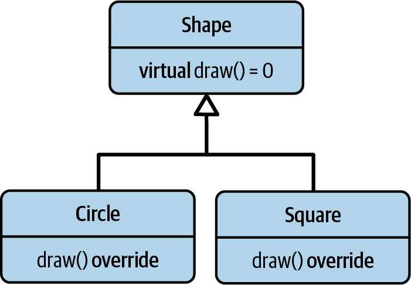
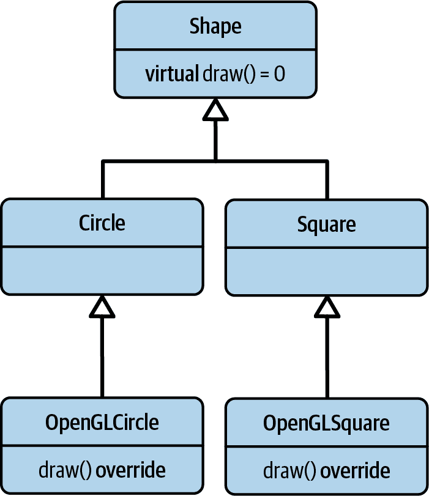
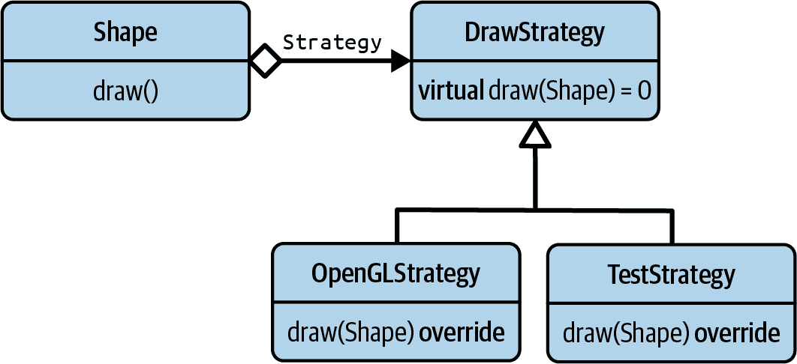
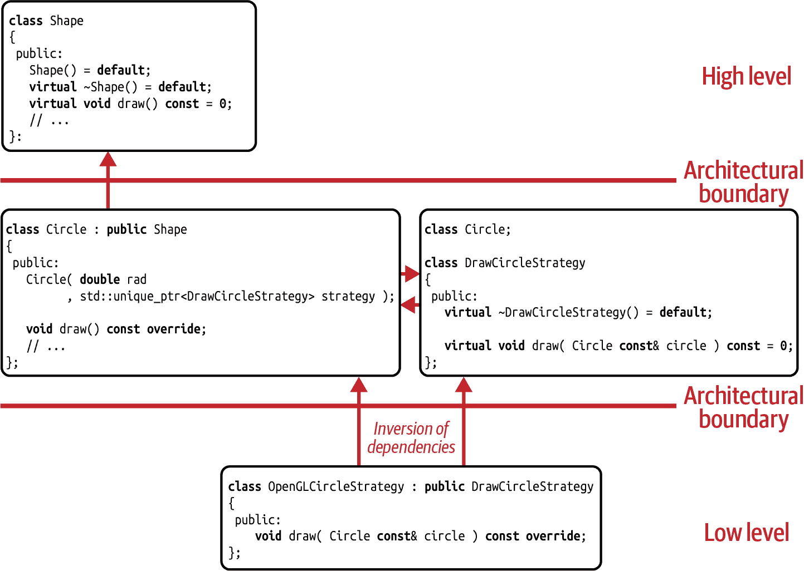
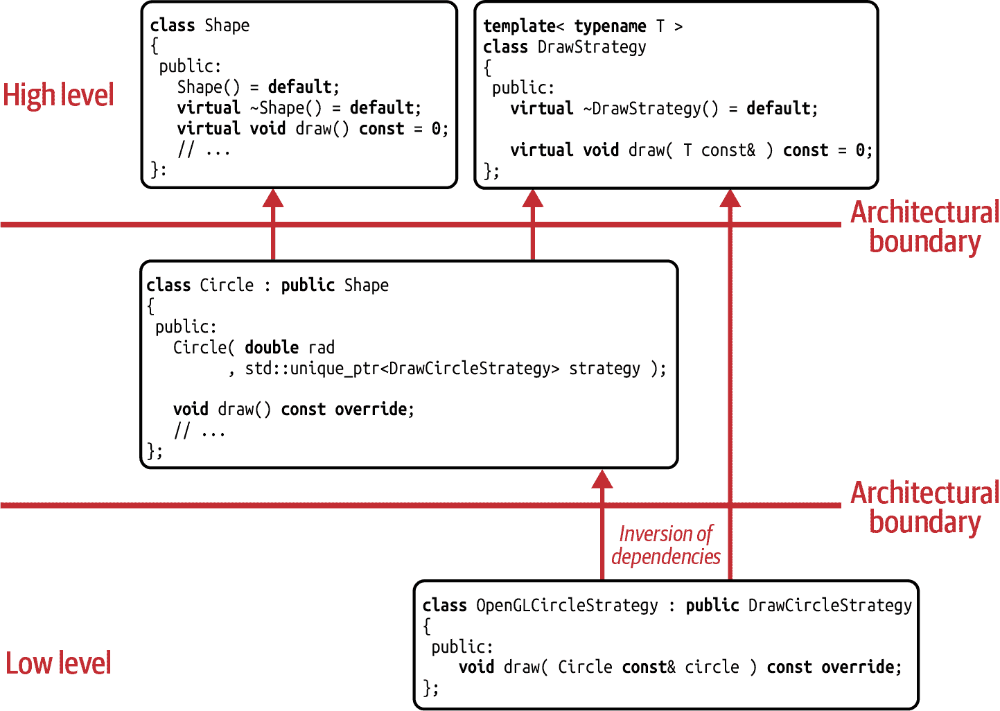
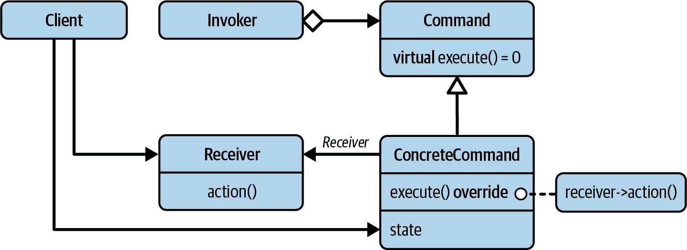
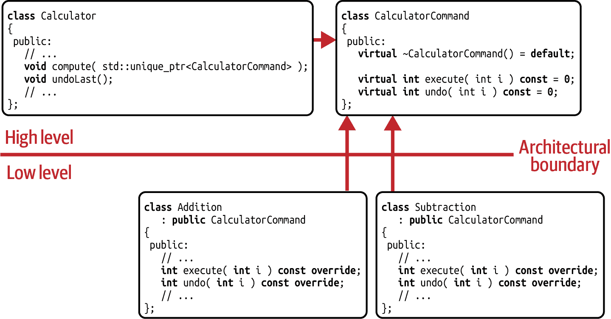

# 第五章：策略和命令设计模式

本章专注于两种最常用的设计模式：策略设计模式和*命令*设计模式。确实是最常用的：C++标准库本身多次使用它们，很可能您自己也使用过许多次。这两者都可以被视为每位开发者的基本工具。

在“指南 19：使用策略隔离如何做事情”中，我将向您介绍策略设计模式。我将展示为什么这是最有用和最重要的设计模式之一，以及您将在许多情况下发现它非常有用。

在“指南 20：更喜欢组合而不是继承”中，我们将研究继承及其为何让许多人抱怨。您将看到它本质上并不糟糕，但像其他一切一样，它既有优势也有局限性。然而，最重要的是，我将解释许多经典设计模式并不是因为继承而获得其力量，而是因为组合。

在“指南 21：使用命令隔离所做的事情”中，我将向您介绍命令设计模式。我将展示如何有效地使用该设计模式，并且还会让您了解命令和策略的比较。

在“指南 22：偏爱值语义而不是引用语义”中，我们将踏入*引用语义*的领域。然而，我们会发现这个领域并不特别友好和好客，使我们担心我们代码的质量。因此，我们将重新定居到*值语义*的领域，它将为我们的代码库带来许多好处。

在“指南 23：偏爱基于值的策略和命令的实现”中，我们将重新审视策略和命令模式。我将展示我们如何应用在值语义领域获得的洞见，并基于`std::function`实现这两种设计模式。

# 指南 19：使用策略隔离如何做事情

让我们假设您和您的团队即将实施一个新的 2D 图形工具。在其他要求中，它需要处理简单的几何基元，比如圆形、正方形等，这些需要被绘制（参见图 5-1）。



###### 图 5-1。初始的`Shape`继承层次结构

已经实现了几个类，例如`Shape`基类，`Circle`类和`Square`类：

```cpp
//---- <Shape.h> ---------------- 
class Shape
{
 public:
   virtual ~Shape() = default;

   virtual void draw( /*some arguments*/ ) const = 0;  
};

//---- <Circle.h> ---------------- 
#include <Point.h>
#include <Shape.h>

class Circle : public Shape
{
 public:
   explicit Circle( double radius )
      : radius_( radius )
   {
      /* Checking that the given radius is valid */
   }

   double radius() const { return radius_; }
   Point  center() const { return center_; }

   void draw( /*some arguments*/ ) const override;  

 private:
   double radius_;
   Point center_{};
};

//---- <Circle.cpp> ---------------- 
#include <Circle.h>
#include /* some graphics library */

void Circle::draw( /*some arguments*/ ) const
{
   // ... Implementing the logic for drawing a circle }

//---- <Square.h> ---------------- 
#include <Point.h>
#include <Shape.h>

class Square : public Shape
{
 public:
   explicit Square( double side )
      : side_( side )
   {
      /* Checking that the given side length is valid */
   }

   double side  () const { return side_; }
   Point  center() const { return center_; }

   void draw( /*some arguments*/ ) const override;  

 private:
   double side_;
   Point center_{};
};

//---- <Square.cpp> ---------------- 
#include <Square.h>
#include /* some graphics library */

void Square::draw( /*some arguments*/ ) const
{
   // ... Implementing the logic for drawing a square }

```

最重要的是`Shape`基类的纯虚拟`draw()`成员函数（）。在你度假期间，你的一个团队成员已经使用 OpenGL 为`Circle`和`Square`类实现了这个`draw()`成员函数（分别是和）。这个工具已经能够绘制圆形和正方形，整个团队都认为生成的图形看起来非常整洁。大家都很开心！

## 分析设计问题

除了你之外，所有人都是如此。从度假归来，你立即意识到实现的解决方案违反了单一职责原则（SRP）。¹ 目前，`Shape`层次结构并非为变更而设计。首先，改变形状的绘制方式并不容易。在当前实现中，只有一种固定的形状绘制方式，而且不能非侵入式地更改这些细节。因为你已经预测到这个工具将需要支持多个图形库，这绝对是一个问题。² 其次，如果最终执行更改，则需要在多个不相关的地方更改行为。

但还有更多。由于绘图功能实现在`Circle`和`Square`内部，所以`Circle`和`Square`类依赖于`draw()`的实现细节，这意味着它们依赖于 OpenGL。尽管圆形和正方形应该主要是一些简单的几何原语，但这两个类现在在它们被使用时必须到处使用 OpenGL。

当向同事指出这一点时，起初他们有些目瞪口呆。而且也有些恼火，因为他们没料到你会指出他们美妙解决方案中的任何缺陷。不过，你有一种非常好的方式来解释问题，最终他们同意了你的观点，并开始思考一个更好的解决方案。

他们很快就想出了一个更好的方法。几天后的下次团队会议上，他们展示了他们的新想法：在继承层次结构中增加了另一层（见图 5-2）。



###### 图 5-2\. 扩展的`Shape`继承层次结构

为了演示这个想法，他们已经实现了`OpenGLCircle`和`OpenGLSquare`类：

```cpp
//---- <Circle.h> ----------------

#include <Shape.h>

class Circle : public Shape
{
 public:
   // ... No implementation of the draw() member function anymore
};

//---- <OpenGLCircle.h> ----------------

#include <Circle.h>

class OpenGLCircle : public Circle
{
 public:
   explicit OpenGLCircle( double radius )
      : Circle( radius )
   {}

   void draw( /*some arguments*/ ) const override;
};

//---- <OpenGLCircle.cpp> ----------------

#include <OpenGLCircle.h>
#include /* OpenGL graphics library headers */

void OpenGLCircle::draw( /*some arguments*/ ) const
{
   // ... Implementing the logic for drawing a circle by means of OpenGL
}

//---- <Square.h> ----------------

#include <Shape.h>

class Square : public Shape
{
 public:
   // ... No implementation of the draw() member function anymore
};

//---- <OpenGLSquare.h> ----------------

#include <Square.h>

class OpenGLSquare : public Square
{
 public:
   explicit OpenGLSquare( double side )
      : Square( side )
   {}

   void draw( /*some arguments*/ ) const override;
};

//---- <OpenGLSquare.cpp> ----------------

#include <OpenGLSquare.h>
#include /* OpenGL graphics library headers */

void OpenGLSquare::draw( /*some arguments*/ ) const
{
   // ... Implementing the logic for drawing a square by means of OpenGL
}
```

继承！当然！通过简单地从`Circle`和`Square`派生，并通过将`draw()`函数的实现推到继承层次结构的更低层，很容易实现不同的绘制方式。例如，可能会有`MetalCircle`和`VulkanCircle`，假设需要支持[Metal](https://developer.apple.com/metal)和[Vulkan](https://www.vulkan.org)库。突然之间，变更变得容易了，对吧？

虽然你的同事们对他们的新解决方案感到非常自豪，但你已经意识到这种方法长期来看不会很好。而且很容易证明其缺点：你只需要考虑另一个需求，例如，一个 `serialize()` 成员函数：

```cpp
class Shape
{
 public:
   virtual ~Shape() = default;

   virtual void draw( /*some arguments*/ ) const = 0;
   virtual void serialize( /*some arguments*/ ) const = 0;  
};

```

`serialize()` 成员函数（）被设计用来将形状转换为字节序列，这个序列可以被存储在文件或数据库中。从那里，可以反序列化字节序列以重新创建完全相同的形状。就像 `draw()` 成员函数一样，`serialize()` 成员函数可以以各种方式实现。例如，你可以使用 [protobuf](https://oreil.ly/Q71oF) 或 [Boost.serialization](https://oreil.ly/1m84h) 库。

使用相同的策略将实现细节移到继承层次结构的下层，这将很快导致一个相当复杂且相当人为的层次结构（参见 图 5-3）。考虑类名：`OpenGLProtobufCircle`、`MetalBoostSerialSquare` 等等。荒谬，对吧？我们应该如何构建这个结构：应该在层次结构中添加另一层（参见 `Square` 分支）吗？这种方法很快会导致一个深层且复杂的层次结构。还是我们应该展平层次结构（就像层次结构的 `Circle` 分支一样）？那么如何重用实现细节呢？例如，如何在 `OpenGLProtobufCircle` 和 `OpenGLBoostSerialCircle` 类之间重用 OpenGL 代码？


###### 图 5-3\. 添加 `serialize()` 成员函数导致一个深层且复杂的继承层次结构

## 解释策略设计模式

你意识到你的同事们对继承过于迷恋，而且需要你来拯救局面。他们似乎需要有人向他们展示如何正确地设计这种变化，并向他们提出问题的正确解决方案。正如两位务实的程序员所说的那样：³

> 继承很少是答案。

问题仍然是违反了 SRP。由于你必须计划如何改变不同形状的绘制方式，所以你应该将绘制方面标识为 *变化点*。有了这个认识，正确的方法是为变化进行设计，遵循 SRP，并因此提取出变化点。这就是 Strategy 设计模式的目的，是 GoF 设计模式中的经典之一。

# 策略设计模式

意图：“定义一组算法，将每个算法封装起来，并使它们可以互换。策略模式使得算法可以独立于使用它的客户端而变化。”⁴

不是在派生类中实现虚`draw()`函数，而是引入另一个目的是绘制形状的类。在经典的面向对象形式的策略设计模式中，通过引入`DrawStrategy`基类来实现这一点（参见图 5-4）。



###### 图 5-4\. 策略设计模式的 UML 表示

现在隔离绘图方面使得我们能够在不修改形状类的情况下更改绘制实现。这符合 SRP 的理念。现在，您还能够引入新的`draw()`实现而无需修改任何其他代码。这符合开闭原则（OCP）。在这个 OO 设置中，再次强调，SRP 是 OCP 的实现者。

以下代码片段展示了`DrawStrategy`基类的简单实现：⁵

```cpp
//---- <DrawStrategy.h> ---------------- 
class Circle;
class Square;

class DrawStrategy
{
 public:
   virtual ~DrawStrategy() = default;

   virtual void draw( Circle const& circle, /*some arguments*/ ) const = 0;  
   virtual void draw( Square const& square, /*some arguments*/ ) const = 0;  
};

```

`DrawStrategy`类带有虚析构函数和两个纯虚`draw()`函数，一个用于圆形（）和一个用于正方形（）。为了使这个基类编译通过，你需要提前声明`Circle`和`Square`类。

由于策略设计模式，`Shape`基类没有变化。它仍然代表所有形状的抽象，并因此提供了一个纯虚的`draw()`成员函数。策略旨在提取实现细节，因此仅影响派生类：⁶

```cpp
//---- <Shape.h> ----------------

class Shape
{
 public:
   virtual ~Shape() = default;

   virtual void draw( /*some arguments*/ ) const = 0;
   // ... Potentially other functions, e.g. a 'serialize()' member function
};
```

虽然由于策略模式，`Shape`基类没有变化，但`Circle`和`Square`类受到影响：

```cpp
//---- <Circle.h> ---------------- 
#include <Shape.h>
#include <DrawStrategy.h>
#include <memory>
#include <utility>

class Circle : public Shape
{
 public:
   explicit Circle( double radius, std::unique_ptr<DrawStrategy> drawer )  
      : radius_( radius )
      , drawer_( std::move(drawer) )  
   {
      /* Checking that the given radius is valid and that
         the given std::unique_ptr instance is not nullptr */
   }

   void draw( /*some arguments*/ ) const override
   {
      drawer_->draw( *this, /*some arguments*/ );  
   }

   double radius() const { return radius_; }

 private:
   double radius_;
   std::unique_ptr<DrawStrategy> drawer_;  
};

//---- <Square.h> ---------------- 
#include <Shape.h>
#include <DrawStrategy.h>
#include <memory>
#include <utility>

class Square : public Shape
{
 public:
   explicit Square( double side, std::unique_ptr<DrawStrategy> drawer )  
      : side_( side )
      , drawer_( std::move(drawer) )  
   {
      /* Checking that the given side length is valid and that
         the given std::unique_ptr instance is not nullptr */
   }

   void draw( /*some arguments*/ ) const override
   {
      drawer_->draw( *this, /*some arguments*/ );  
   }

   double side() const { return side_; }

 private:
   double side_;
   std::unique_ptr<DrawStrategy> drawer_;  
};

```

`Circle`和`Square`现在在它们的构造函数中期望一个`unique_ptr`指向一个`DrawStrategy`（）。这使得我们可以从外部配置绘图行为，通常称为*依赖注入*。`unique_ptr`被移动到同类型的新数据成员中（）。还可以提供相应的设置函数，允许稍后更改绘图行为。现在，`draw()`成员函数不必自己实现绘图，而只需调用给定`DrawStrategy`的`draw()`函数（）。⁷

## 分析简单解决方案的缺点

太棒了！通过这个实现，你现在能够在本地、孤立地改变形状绘制的行为，并使每个人都能实现新的绘制行为。然而，就目前而言，我们的策略实现存在严重的设计缺陷。为了分析这个缺陷，假设你不得不添加一个新类型的形状，也许是一个`Triangle`。这本应该很容易，因为正如我们在“指导原则 15：为类型或操作的添加设计”中讨论的那样，面向对象编程的强大之处在于可以添加新类型。

当你开始引入这个`Triangle`时，你会意识到，添加新类型的形状并不像预期的那么简单。首先，你需要编写新的类。这是可以预料的，完全没有问题。但是然后你还需要更新`DrawStrategy`基类，以便也能够绘制三角形。这反过来会对圆形和正方形产生不良影响：`Circle`和`Square`类都需要重新编译、重新测试，并有可能重新部署。更一般地说，*所有*形状都会受到这种影响。这应该让你觉得有问题。为什么要在添加`Triangle`类时，圆形和正方形都需要重新编译呢？

技术原因是，通过`DrawStrategy`基类，所有形状都隐式地了解彼此。因此，添加新形状会影响所有其他形状。底层设计原因是违反了接口隔离原则（ISP）（参见“指导原则 3：分离接口以避免人为耦合”）。通过定义单一的`DrawStrategy`基类，你人为地将圆形、正方形和三角形耦合在一起。由于这种耦合，增加新类型变得更加困难，从而限制了面向对象编程的强大性。相比之下，这与我们讨论过的为形状绘制提供过程化解决方案非常相似（参见“指导原则 15：为类型或操作的添加设计”）。

“我们无意中重新实现了访问者设计模式吗？”你在想。我理解你的意思：`DrawStrategy`看起来确实很像访问者。但不幸的是，它并不满足访问者的意图，因为你不能轻松地添加其他操作。要这样做，你必须在`Shape`层次结构中侵入性地添加虚成员函数。“而且它也不是一个策略，因为我们不能添加类型，对吧？”是的，正确。你看，从设计的角度来看，这是最糟糕的情况。

要正确实现策略设计模式，你必须分别提取每种形状的实现细节。你必须为每种形状引入一个`DrawStrategy`类：

```cpp
//---- <DrawCircleStrategy.h> ---------------- 
class Circle;

class DrawCircleStrategy  
{
 public:
   virtual ~DrawCircleStrategy() = default;

   virtual void draw( Circle const& circle, /*some arguments*/ ) const = 0;
};

//---- <Circle.h> ---------------- 
#include <Shape.h>
#include <DrawCircleStrategy.h>
#include <memory>
#include <utility>

class Circle : public Shape
{
 public:
   explicit Circle( double radius, std::unique_ptr<DrawCircleStrategy> drawer )
      : radius_( radius )
      , drawer_( std::move(drawer) )
   {
      /* Checking that the given radius is valid and that
         the given 'std::unique_ptr' is not a nullptr */
   }

   void draw( /*some arguments*/ ) const override
   {
      drawer_->draw( *this, /*some arguments*/ );
   }

   double radius() const { return radius_; }

 private:
   double radius_;
   std::unique_ptr<DrawCircleStrategy> drawer_;
};

//---- <DrawSquareStrategy.h> ---------------- 
class Square;

class DrawSquareStrategy  
{
 public:
   virtual ~DrawSquareStrategy() = default;

   virtual void draw( Square const& square, /*some arguments*/ ) const = 0;
};

//---- <Square.h> ---------------- 
#include <Shape.h>
#include <DrawSquareStrategy.h>
#include <memory>
#include <utility>

class Square : public Shape
{
 public:
   explicit Square( double side, std::unique_ptr<DrawSquareStrategy> drawer )
      : side_( side )
      , drawer_( std::move(drawer) )
   {
      /* Checking that the given side length is valid and that
         the given 'std::unique_ptr' is not a nullptr */
   }

   void draw( /*some arguments*/ ) const override
   {
      drawer_->draw( *this, /*some arguments*/ );
   }

   double side() const { return side_; }

 private:
   double side_;
   std::unique_ptr<DrawSquareStrategy> drawer_;
};

```

对于`Circle`类，您必须引入`DrawCircleStrategy`基类（），对于`Square`类，则是`DrawSquareStrategy`基类（）。随着`Triangle`类的添加，您还必须添加`DrawTriangleStrategy`基类。只有这样，您才能正确地分离关注点，并仍然允许每个人为形状的绘制添加新类型和新实现。

有了这个功能，您可以轻松实现新的策略类来绘制圆形、正方形，以及最终三角形。例如，考虑实现`DrawCircleStrategy`接口的`OpenGLCircleStrategy`：

```cpp
//---- <OpenGLCircleStrategy.h> ----------------

#include <Circle.h>
#include <DrawCircleStrategy.h>
#include /* OpenGL graphics library */

class OpenGLCircleStrategy : public DrawCircleStrategy
{
 public:
   explicit OpenGLCircleStrategy( /* Drawing related arguments */ );

   void draw( Circle const& circle, /*...*/ ) const override;

 private:
   /* Drawing related data members, e.g. colors, textures, ... */
};
```

在图 5-5 中，您可以看到`Circle`类的依赖图。请注意，`Circle`和`DrawCircleStrategy`类位于相同的架构层级上。更值得注意的是它们之间的循环依赖：`Circle`依赖于`DrawCircleStrategy`，但`DrawCircleStrategy`也依赖于`Circle`。但不要担心：尽管乍看起来可能会有问题，但事实并非如此。这是一种必要的关系，显示了`Circle`确实拥有`DrawCircleStrategy`，从而创建了所需的依赖倒置，正如在“准则 9：注意抽象的所有权”中讨论的那样。

“是否可能使用类模板来实现不同的绘制策略类？我想象中的情况类似于非循环访问者使用的访问者类”:⁸

```cpp
//---- <DrawStrategy.h> ----------------

template< typename T >
class DrawStrategy
{
 public:
   virtual ~DrawStrategy() = default;
   virtual void draw( T const& ) const = 0;
};
```



###### 图 5-5\. *策略*设计模式的依赖图

这是一个很好的想法，也是您应该采取的方法。通过这个类模板，您可以将`DrawStrategy`提升到更高的架构层级，重用代码，并遵循 DRY 原则（参见图 5-6）。此外，如果从一开始就采用了这种方法，我们就不会陷入人为耦合不同形状类型的陷阱。是的，我真的很喜欢这个！

尽管这是我们实现此类策略类的方式，但您仍不应期望这将减少基类的数量（仍然是相同的数量，只是生成的）或者它会为您节省大量工作。`DrawStrategy`的实现，如`OpenGLCircleStrategy`类，代表了大部分工作，并且几乎不会改变：

```cpp
//---- <OpenGLCircleStrategy.h> ----------------

#include <Circle.h>
#include <DrawStrategy.h>
#include /* OpenGL graphics library */

class OpenGLCircleStrategy : public DrawStrategy<Circle>
{
   // ...
};
```



###### 图 5-6\. *策略*设计模式的更新依赖图

假设对于`OpenGLSquareStrategy`的类似实现，现在我们可以将所有内容整合在一起，并再次绘制形状，但这次使用了策略设计模式进行适当解耦：

```cpp
#include <Circle.h>
#include <Square.h>
#include <OpenGLCircleStrategy.h>
#include <OpenGLSquareStrategy.h>
#include <memory>
#include <vector>

int main()
{
   using Shapes = std::vector<std::unique_ptr<Shape>>;

   Shapes shapes{};

   // Creating some shapes, each one
   //   equipped with the corresponding OpenGL drawing strategy
   shapes.emplace_back(
      std::make_unique<Circle>(
         2.3, std::make_unique<OpenGLCircleStrategy>(/*...red...*/) ) );
   shapes.emplace_back(
      std::make_unique<Square>(
         1.2, std::make_unique<OpenGLSquareStrategy>(/*...green...*/) ) );
   shapes.emplace_back(
      std::make_unique<Circle>(
         4.1, std::make_unique<OpenGLCircleStrategy>(/*...blue...*/) ) );

   // Drawing all shapes
   for( auto const& shape : shapes )
   {
      shape->draw( /*some arguments*/ );
   }

   return EXIT_SUCCESS;
}
```

## 访问者和策略的比较

现在您已经了解了访问者设计模式和策略设计模式的差异，您可能会想知道这两者之间的区别。毕竟，实现看起来非常相似。但是，尽管在实现上存在类似之处，这两种设计模式的特性却大不相同。通过访问者设计模式，我们已经将*通用*操作的添加标识为*变化点*。因此，我们创建了一个通用操作的抽象，这反过来又使每个人都能添加操作。不幸的副作用是，添加新的形状类型变得不再容易。

使用策略设计模式时，我们已经将*单个*函数的实现细节标识为*变化点*。在引入这些实现细节的抽象后，我们仍然能够轻松地添加新类型的形状，但无法轻松地添加新操作。添加操作仍然需要您侵入性地添加虚成员函数。因此，策略设计模式的意图与访问者设计模式的意图相反。

结合这两种设计模式听起来可能很有前途，以获得这两种思想的优势（使添加类型和操作都变得容易）。不幸的是，这并不奏效：不管您先应用哪种设计模式，都将固定两个自由度中的一个⁹。因此，您应该牢记这两种设计模式的优势和劣势，并根据您对代码库演进预期的期望来应用它们。

## 分析策略设计模式的缺陷

我已经向您展示了策略设计模式的优势：通过引入这些细节的抽象，它使您能够减少对特定实现细节的依赖。然而，在软件设计中并没有银弹，每种设计都有一些缺点。策略设计模式也不例外，因此，还要考虑潜在的缺点。

首先，尽管某个操作的实现细节已被提取和隔离，但操作本身仍然是具体类型的一部分。这个事实证明了我们仍然不能轻松地添加操作的前述限制。相比之下，策略模式保留了面向对象编程的优势，使您能够轻松地添加新类型。

其次，及早识别这种变化点是值得的。否则将需要进行大规模重构。当然，这并不意味着您应该提前使用策略模式实现所有功能，以防止重构。这可能很快导致过度设计。但是，在第一次表明实现细节可能会发生变化或者希望有多个实现时，您应该迅速实现必要的修改。最好的建议，尽管有点虚无，是尽可能保持简单（*KISS*原则）。

第三，如果通过基类实现策略，性能肯定会受到额外运行时间接的影响。性能还受到许多手动分配（`std::make_unique()`调用）、由于多个指针导致的结果内存碎片化以及各种间接访问的影响。这是可以预期的，然而您的实现的灵活性以及每个人都能添加新实现的机会，可能会超过这种性能损失。当然，这取决于情况，您将需要逐案决定。如果使用模板实现策略（参见关于“基于策略的设计”的讨论），这种缺点就不成问题了。

最后但并非最不重要的是，策略设计模式的主要缺点是，单个策略应该处理单个操作或者一小组相关的函数。否则，您将再次违反单一责任原则（SRP）。如果需要提取多个操作的实现细节，就必须有多个策略基类和多个数据成员，可以通过*依赖注入*来设置。例如，考虑具有额外`serialize()`成员函数的情况：

```cpp
//---- <DrawCircleStrategy.h> ----------------

class Circle;

class DrawCircleStrategy
{
 public:
   virtual ~DrawCircleStrategy() = default;

   virtual void draw( Circle const& circle, /*some arguments*/ ) const = 0;
};

//---- <SerializeCircleStrategy.h> ----------------

class Circle;

class SerializeCircleStrategy
{
 public:
   virtual ~SerializeCircleStrategy() = default;

   virtual void serialize( Circle const& circle, /*some arguments*/ ) const = 0;
};

//---- <Circle.h> ----------------

#include <Shape.h>
#include <DrawCircleStrategy.h>
#include <SerializeCircleStrategy.h>
#include <memory>
#include <utility>

class Circle : public Shape
{
 public:
   explicit Circle( double radius
                  , std::unique_ptr<DrawCircleStrategy> drawer
                  , std::unique_ptr<SerializeCircleStrategy> serializer
                  /* potentially more strategy-related arguments */ )
      : radius_( radius )
      , drawer_( std::move(drawer) )
      , serializer_( std::move(serializer) )
      // ...
   {
      /* Checking that the given radius is valid and that
 the given std::unique_ptrs are not nullptrs */
   }

   void draw( /*some arguments*/ ) const override
   {
      drawer_->draw( *this, /*some arguments*/ );
   }

   void serialize( /*some arguments*/ ) const override
   {
      serializer_->serialize( *this, /*some arguments*/ );
   }

   double radius() const { return radius_; }

 private:
   double radius_;
   std::unique_ptr<DrawCircleStrategy> drawer_;
   std::unique_ptr<SerializeCircleStrategy> serializer_;
   // ... Potentially more strategy-related data members
};
```

尽管这导致基类的数量大量增加和由于多个指针导致的更大实例，但这也引发了如何设计类的问题，以便方便地分配多个不同的策略。因此，策略设计模式在需要隔离少量实现细节的情况下表现得最为强大。如果遇到需要提取许多操作的细节的情况，可能更好考虑其他方法（例如，第七章中的外部多态设计模式或第八章中的类型擦除设计模式）。

## 基于策略的设计

正如前几章已经展示的，策略设计模式并不局限于动态多态性。相反，可以使用模板在静态多态性中完美实现策略的意图。例如，考虑标准库中的以下两个算法：

```cpp
namespace std {

template< typename ForwardIt, typename UnaryPredicate >
constexpr ForwardIt
   partition( ForwardIt first, ForwardIt last, UnaryPredicate p );  

template< typename RandomIt, typename Compare >
constexpr void
   sort( RandomIt first, RandomIt last, Compare comp );  

} // namespace std 
```

`std::partition()` 和 `std::sort()` 算法均利用了策略设计模式。`std::partition()` 的 `UnaryPredicate` 参数（）和 `std::sort()` 的 `Compare` 参数（）代表了从外部注入部分行为的一种方式。更具体地说，这两个参数允许您指定元素的排序方式。因此，这两种算法都提取了其行为的特定部分，并以概念的形式提供了抽象（见 “Guideline 7: Understand the Similarities Between Base Classes and Concepts”）。与策略的面向对象形式相比，这种方式不会产生任何运行时性能损失。

在 `std::unique_ptr` 类模板中也可以看到类似的方法：

```cpp
namespace std {

template< typename T, typename Deleter = std::default_delete<T> >  
class unique_ptr;

template< typename T, typename Deleter >  
class unique_ptr<T[], Deleter>;

} // namespace std 
```

对于基本模板（）及其数组特化版本（），可以指定显式的 `Deleter` 作为第二个模板参数。通过这个参数，您可以决定是否要通过 `delete`、`free()` 或任何其他释放函数来释放资源。甚至可以“滥用” `std::unique_ptr` 来执行完全不同类型的清理。

这种灵活性也证明了策略设计模式的存在。模板参数允许您将一些清理行为注入类中。这种策略形式也被称为 *基于策略的设计*，这是由安德烈·亚历山德雷斯库在 2001 年引入的设计哲学。（¹⁰）思想是相同的：提取和隔离类模板的特定行为，以改进可变性、可扩展性、可测试性和可重用性。因此，基于策略的设计可以被认为是策略设计模式的静态多态形式。显然，这种设计非常有效，因为标准库中许多应用程序都展示了这个思想的应用。

您还可以将基于策略的设计应用于形状绘制示例。考虑以下 `Circle` 类的实现：

```cpp
//---- <Circle.h> ---------------- 
#include <Shape.h>
#include <DrawCircleStrategy.h>
#include <memory>
#include <utility>

template< typename DrawCircleStrategy >  
class Circle : public Shape
{
 public:
   explicit Circle( double radius, DrawCircleStrategy drawer )
      : radius_( radius )
      , drawer_( std::move(drawer) )
   {
      /* Checking that the given radius is valid */
   }

   void draw( /*some arguments*/ ) const override
   {
      drawer_( *this, /*some arguments*/ );  
   }

   double radius() const { return radius_; }

 private:
   double radius_;
   DrawCircleStrategy drawer_;  // Could possibly be omitted, if the given
                                // strategy is presumed to be stateless. };

```

而不是在构造函数中向`DrawCircleStrategy`基类传递`std::unique_ptr`，您可以通过模板参数指定策略（）。最大的优势在于由于减少了指针间接性能的提升：您可以直接调用由`DrawCircleStrategy`提供的具体实现，而不是通过`std::unique_ptr`调用。但缺点是，您将失去在运行时调整特定`Circle`实例的绘制策略的灵活性。此外，您将不再拥有单一的`Circle`类，而是每个绘制策略都会有一个`Circle`的实例化。最后但同样重要的是，类模板通常完全驻留在头文件中，因此您可能会失去在源文件中隐藏实现细节的机会。如常，没有完美的解决方案，“正确”解决方案的选择取决于实际的上下文。

总之，策略设计模式是设计模式目录中最通用的示例之一。您会发现在动态和静态多态的领域中，它在许多情况下都非常有用。然而，并非每个问题都适合它——请注意其潜在的缺点。

# 指南 20：偏爱组合而非继承

在 90 年代和 21 世纪初期对面向对象编程（OOP）的巨大热情澎湃之后，今天的 OOP 处于防御状态。反对 OOP 并突出其缺点的声音越来越强烈和响亮。这不仅限于 C++社区，也存在于其他编程语言社区中。尽管整个 OOP 确实有一些局限性，让我们专注于似乎引起大多数争议的一个特性：继承。正如 Sean Parent 所言：¹¹

> 继承是邪恶的基类。

虽然继承被宣传为建模现实世界关系的一种非常自然和直观的方式，但事实证明它比承诺的要困难得多。当我们讨论了关于里氏替换原则（LSP）的细微失败时，您已经看到了使用继承的微妙缺陷“指南 6：遵循抽象的预期行为”。但继承还有其他常被误解的方面。

首先，继承总是被描述为简化可重用性。这似乎很直观，因为如果你只是从另一个类继承，你可以轻松地重用代码。不幸的是，这不是继承为您带来的重用类型。继承不是关于在基类中重用代码；相反，它是关于其他使用基类多态性的代码重用。例如，假设一个稍微扩展的`Shape`基类，以下函数适用于所有类型的形状，因此可以被`Shape`基类的所有实现重用：

```cpp
class Shape
{
 public:
   virtual ~Shape() = default;

   virtual void translate( /*some arguments*/ ) = 0;
   virtual void rotate( /*some arguments*/ ) = 0;

   virtual void draw( /*some arguments*/ ) const = 0;
   virtual void serialize( /*some arguments*/ ) const = 0;

   // ... Potentially other member functions ... };

void rotateAroundPoint( Shape& shape );  
void mergeShapes( Shape& s1, Shape& s2 );  
void writeToFile( Shape const& shape );  
void sendViaRPC( Shape const& shape );  
// ... 
```

所有四个功能（, , , 和 ）都基于`Shape`抽象构建。所有这些功能仅与所有形状的共同接口耦合，而不是任何特定形状。所有类型的形状都可以围绕一个点旋转，合并，写入文件并通过 RPC 发送。每种形状都“重用”这些功能。

通过抽象表达功能的能力创造了通过类型的多态使用重用代码的机会。预计这种功能将创建大量代码，与基类包含的少量代码相比。因此，真正的可重用性是通过类型的多态使用来创建的，而不是通过多态类型来创建。¹²

其次，继承据说有助于解耦软件实体。虽然这确实是正确的（记住，例如在“指南 9：注意抽象的所有权”中讨论依赖反转原则（DIP）），但通常没有解释继承也会创建耦合。您之前已经见过这种证据。在实现访问者设计模式时，您体验到继承强制您执行某些实现细节。在经典的访问者模式中，您必须实现`Visitor`基类的纯虚函数，即使这对您的应用程序不是最佳选择。您还在函数参数或返回类型方面没有很多选择。这些事情是固定的。¹³

您还在讨论策略设计模式时经历了这种耦合。在这种情况下，继承强制了结构耦合，导致了更深的继承层次结构，结果是类的命名令人质疑，并且影响了重用性。

到了这一点，你可能会有这样的印象，即我试图完全贬低继承。嗯，老实说，我确实试图让它看起来有点不好，但只要有必要。明确地说：继承不是坏事，使用它也不是错的。相反，继承是一个非常强大的特性，如果正确使用，你可以做出令人难以置信的事情。然而，当然，你记得彼得·帕克原则：

> 伴随强大的力量而来的是巨大的责任。
> 
> 彼得·帕克，又名蜘蛛侠

问题在于“如果正确使用”部分。继承已被证明很难正确使用（绝对比我们被引导相信的要难；见我的先前推理），因此不经意地被误用。它也被过度使用，因为许多开发人员有将其用于各种问题的习惯。

> [差异化编程](https://wiki.example.org/programming_by_difference)在 20 世纪 90 年代失宠了，当时 OO 社区的许多人注意到，如果过度使用继承，可能会带来很多问题。

在许多情况下，继承既不是正确的方法，也不是正确的工具。大多数时候，最好使用组合而不是继承。尽管如此，你不应该对此感到惊讶，因为你已经看到它是正确的。组合是 OO 形式的策略设计模式如此成功的原因，而不是继承。策略设计模式之所以如此强大，是因为引入了抽象和相关数据成员的聚合，而不是基于继承的实现不同策略。实际上，你会发现许多设计模式都坚定地基于组合，而不是继承。所有这些都通过继承实现扩展，但它们本身是通过组合实现的。

> 委托给服务：拥有-优于-是。
> 
> Andrew Hunt 和 David Thomas，《实用程序员》

这是许多设计模式的普遍启示。我建议你紧握这一洞察力，因为它将在理解本书其余部分中所见的设计模式时非常有用，并且将提高你的实现质量。

# 指导原则 21：使用命令隔离所做的事情

在我们开始这个指南之前，让我们试一个实验。打开你喜欢的电子邮件客户端给我写封电子邮件。添加以下内容：“我喜欢你的书！它让我整晚都精神抖擞，让我忘记所有的烦恼。”好的，现在点击发送。干得好！稍等一下让我检查我的邮件...不，还没有收到...不，还是没有收到...让我们再试一次：点击重新发送。不，什么也没有。嗯，我猜一些服务器可能宕机了。或者所有的我的命令都失败了：`WriteCommand`，`SendCommand`，`ResendCommand`，等等。多么不幸。但尽管这个失败的实验，你现在对另一个 GoF 设计模式有了相当好的了解：命令设计模式。

## 命令设计模式解释

命令设计模式关注的是抽象和隔离工作包，这些工作包（通常）一次执行（通常是立即执行）。为此，它识别了不同类型的工作包存在作为*变化点*，并引入了相应的抽象，以便轻松实现新类型的工作包。

# 命令设计模式

意图：“将请求封装为对象，从而让您可以使用不同的请求参数化客户端，排队或记录请求，并支持可撤销的操作。”¹⁸

图 5-7 显示了原始的 UML 构想，摘自 GoF 书籍。



###### 图 5-7\. 命令设计模式的 UML 表示

在这种基于 OO 的形式中，命令模式通过 `Command` 基类引入了一种抽象。这使得任何人都可以实现一个新类型的 `ConcreteCommand`。这个 `ConcreteCommand` 可以执行任何操作，甚至对某种 `Receiver` 执行操作。通过特定类型的 `Invoker` 触发命令的效果。

作为命令设计模式的具体例子，让我们考虑一个计算器的以下实现。第一段代码片段展示了 `CalculatorCommand` 基类的实现，它表示对给定整数的数学操作的抽象：

```cpp
//---- <CalculatorCommand.h> ---------------- 
class CalculatorCommand
{
 public:
   virtual ~CalculatorCommand() = default;

   virtual int execute( int i ) const = 0;  
   virtual int undo( int i ) const = 0;  
};

```

`CalculatorCommand` 类期望派生类实现纯虚拟的 `execute()` 函数（）和纯虚拟的 `undo()` 函数（）。`undo()` 的期望是实现必要的操作来撤销 `execute()` 函数的效果。

`Add` 和 `Subtract` 类都代表计算器可能的命令，因此它们实现了 `CalculatorCommand` 基类：

```cpp
//---- <Add.h> ---------------- 
#include <CalculatorCommand.h>

class Add : public CalculatorCommand
{
 public:
   explicit Add( int operand ) : operand_(operand) {}

   int execute( int i ) const override  
   {
      return i + operand_;
   }
   int undo( int i ) const override  
   {
      return i - operand_;
   }

 private:
   int operand_{};
};

//---- <Subtract.h> ---------------- 
#include <CalculatorCommand.h>

class Subtract : public CalculatorCommand
{
 public:
   explicit Subtract( int operand ) : operand_(operand) {}

   int execute( int i ) const override  
   {
      return i - operand_;
   }
   int undo( int i ) const override  
   {
      return i + operand_;
   }

 private:
   int operand_{};
};

```

`Add` 使用加法运算实现了 `execute()` 函数（），并使用减法运算实现了 `undo()` 函数（）。`Subtract` 实现了其逆操作（ 和 ）。

多亏了 `CalculatorCommand` 的层次结构，`Calculator` 类本身可以保持相当简单：

```cpp
//---- <Calculator.h> ---------------- 
#include <CalculatorCommand.h>
#include <stack>

class Calculator
{
 public:
   void compute( std::unique_ptr<CalculatorCommand> command );  
   void undoLast();  

   int result() const;
   void clear();

 private:
   using CommandStack = std::stack<std::unique_ptr<CalculatorCommand>>;

   int current_{};  
   CommandStack stack_;  
};

//---- <Calculator.cpp> ---------------- 
#include <Calculator.h>

void Calculator::compute( std::unique_ptr<CalculatorCommand> command )  
{
   current_ = command->execute( current_ );
   stack_.push( std::move(command) );
}

void Calculator::undoLast()  
{
   if( stack_.empty() ) return;

   auto command = std::move(stack_.top());
   stack_.pop();

   current_ = command->undo(current_);
}

int Calculator::result() const
{
   return current_;
}

void Calculator::clear()
{
   current_ = 0;
   CommandStack{}.swap( stack_ );  // Clearing the stack }

```

我们需要的唯一函数用于计算活动是 `compute()`（）和 `undoLast()`（）。 `compute()` 函数传递给 `CalculatorCommand` 实例，立即执行它以更新当前值（），并将其存储在堆栈上（）。 `undoLast()` 函数通过从堆栈中弹出它并调用 `undo()` 恢复最后执行的命令。

`main()` 函数将所有部分结合起来：

```cpp
//---- <Main.cpp> ---------------- 
#include <Calculator.h>
#include <Add.h>
#include <Subtract.h>
#include <cstdlib>

int main()
{
   Calculator calculator{};  

   auto op1 = std::make_unique<Add>( 3 );  
   auto op2 = std::make_unique<Add>( 7 );  
   auto op3 = std::make_unique<Subtract>( 4 );  
   auto op4 = std::make_unique<Subtract>( 2 );  

   calculator.compute( std::move(op1) );  // Computes 0 + 3, stores and returns 3
   calculator.compute( std::move(op2) );  // Computes 3 + 7, stores and returns 10
   calculator.compute( std::move(op3) );  // Computes 10 - 4, stores and returns 6
   calculator.compute( std::move(op4) );  // Computes 6 - 2, stores and returns 4 
   calculator.undoLast();  // Reverts the last operation,
                           // stores and returns 6 
   int const res = calculator.result();  // Get the final result: 6 
   // ... 
   return EXIT_SUCCESS;
}

```

我们首先创建一个 `calculator`（）和一系列运算（、、 和 ），然后依次应用。之后，我们通过 `undo()` 操作撤销 `op4`，然后查询最终结果。

这一设计非常符合 SOLID 原则。它遵循 SRP，因为通过命令设计模式，*变化点* 已经被提取出来了。因此，`compute()` 和 `undo()` 不必是虚函数。SRP 也作为 OCP 的启用者，使我们能够添加新操作而无需修改任何现有代码。最后，如果将 `Command` 基类的所有权正确分配给高级别，则该设计还遵循 DIP（见 图 5-8）。



###### 图 5-8。 命令设计模式的依赖图

还有一个属于经典示例的命令设计模式的第二个例子：线程池([`oreil.ly/jGZd5`](https://oreil.ly/jGZd5))。线程池的目的是保持多个线程等待任务以并行执行。这个想法通过以下 `ThreadPool` 类实现：它提供了一些成员函数，用于将某些任务卸载到特定数量的可用线程中：⁠²⁰

```cpp
class Command  
{ /* Abstract interface to perform and undo any kind of action. */ };

class ThreadPool
{
 public:
   explicit ThreadPool( size_t numThreads );

   inline bool   isEmpty() const;
   inline size_t size()    const;
   inline size_t active()  const;
   inline size_t ready()   const;

   void schedule( std::unique_ptr<Command> command );  

   void wait();

   // ... };

```

最重   最重要的是，`ThreadPool` 允许你通过 `schedule()` 函数调度任务()。这可以是*任何*任务：`ThreadPool` 并不关心其线程必须执行什么样的工作。通过 `Command` 基类，它完全脱离了你调度的实际任务类型()。

通过简单地派生自`Command`，你可以制定任意任务：

```cpp
class FormattingCommand : public Command  
{ /* Implementation of formatting a disk */ };

class PrintCommand : public Command  
{ /* Implementation of performing a printer job */ }

int main()
{
   // Creating a thread pool with initially two working threads
   ThreadPool threadpool( 2 );

   // Scheduling two concurrent tasks
   threadpool.schedule(
      std::make_unique<FormattingCommand>( /*some arguments*/ ) );
   threadpool.schedule(
      std::make_unique<PrintCommand>( /*some arguments*/ ) );

   // Waiting for the thread pool to complete both commands
   threadpool.wait();

   return EXIT_SUCCESS;
}

```

这样一个任务的一个可能示例是`FormattingCommand`（）。这个任务将获取触发通过操作系统格式化磁盘所需的信息。或者，你可以想象一个`PrintCommand`，它接收触发打印作业所需的所有数据（）。

同样在这个`ThreadPool`示例中，你可以看到命令设计模式的影响：不同类型的任务被识别为*变化点*并被提取出来（这再次遵循 SRP），这使你能够在不修改现有代码的情况下实现不同类型的任务（OCP 的遵循）。

当然，标准库中也有一些示例。例如，你将在`std::for_each()`（）算法中看到命令设计模式的应用：

```cpp
namespace std {

template< typename InputIt, typename UnaryFunction >
constexpr UnaryFunction
   for_each( InputIt first, InputIt last, UnaryFunction f );  

} // namespace std 
```

使用第三个参数，你可以指定算法应在所有给定元素上执行*什么*任务。这可以是任何操作，从操作元素到打印元素，可以通过简单的函数指针或强大的 lambda 表达式指定：

```cpp
#include <algorithms>
#include <cstdlib>

void multBy10( int& i )
{
   i *= 10;
}

int main()
{
   std::vector<int> v{ 1, 2, 3, 4, 5 };

   // Multiplying all integers with 10
   std::for_each( begin(v), end(v), multBy10 );

   // Printing all integers
   std::for_each( begin(v), end(v), []( int& i ){
      std::cout << i << '\n';
   } );

   return EXIT_SUCCESS;
}
```

## 命令设计模式与策略设计模式的比较

“等等！”我听到你们喊道。“你不是刚解释过标准库的算法是通过策略设计模式实现的吗？这不是对之前声明的完全矛盾吗？” 是的，你说得对。就在几页前，我确实解释了`std::partition()`和`std::sort()`算法是通过策略设计模式实现的。因此，我承认这似乎是我自相矛盾了。然而，我并没有声称*所有*算法都基于策略。所以让我解释一下。

从结构上看，策略（Strategy）和命令（Command）设计模式是相同的：无论是使用动态还是静态多态性，从实现的角度来看，策略和命令之间没有区别²¹。两者的区别完全在于设计模式的意图。策略设计模式指定了*如何*执行某些操作，而命令设计模式指定了*什么*操作应该执行。例如，考虑`std::partition()`和`std::for_each()`算法：

```cpp
namespace std {

template< typename ForwardIt, typename UnaryPredicate >
constexpr ForwardIt
   partition( ForwardIt first, ForwardIt last, UnaryPredicate p );  

template< typename InputIt, typename UnaryFunction >
constexpr UnaryFunction
   for_each( InputIt first, InputIt last, UnaryFunction f );  

} // namespace std 
```

在`std::partition()`算法中，你只能控制*如何*选择元素（），而在`std::for_each()`算法中，你可以控制*对给定范围内每个元素应用什么*操作（）。在形状示例中，你只能指定*如何*绘制某种形状，而在`ThreadPool`示例中，你完全可以决定*什么*操作被安排²²。

有两个指标可用于应用的两种设计模式。首先，如果你有一个对象并使用一个动作来配置它（你进行*依赖注入*），那么你（很可能）在使用策略设计模式。如果你不使用动作来配置对象，而是直接执行动作，那么你（很可能）在使用命令设计模式。在我们的`Calculator`示例中，我们没有传递一个动作来配置`Calculator`，而是立即执行了动作。因此，我们基于命令模式构建。

另外，我们也可以通过策略来实现`Calculator`：

```cpp
//---- <CalculatorStrategy.h> ---------------- 
class CalculatorStrategy
{
 public:
   virtual ~CalculatorStrategy() = default;

   virtual int compute( int i ) const = 0;
};

//---- <Calculator.h> ---------------- 
#include <CalculatorStrategy.h>

class Calculator
{
 public:
   void set( std::unique_ptr<CalculatorStrategy> operation );  
   void compute( int value );  

   // ... 
 private:
   int current_{};
   std::unique_ptr<CalculatorStrategy> operation_;  // Requires a default! };

//---- <Calculator.cpp> ---------------- 
#include <Calculator.h>

void set( std::unique_ptr<CalculatorStrategy> operation )  
{
   operation_ = std::move(operation);
}

void Calculator::compute( int value )  
{
   current_ = operation_.compute( value );
}

```

在这个`Calculator`的实现中，策略是通过一个`set()`函数注入的（）。`compute()`函数使用注入的策略执行计算（）。然而，请注意，这种方法更难以实现合理的撤销机制。

第二个指标用于判断是否使用命令或策略的是`undo()`操作。如果你的动作提供了一个`undo()`操作来撤销*已执行的操作*，并封装了执行`undo()`所需的一切，那么你很可能在处理命令设计模式。如果你的动作没有提供`undo()`操作，因为它专注于*如何*执行某事或者因为它缺少撤销操作所需的信息，那么你很可能在处理策略设计模式。然而，我应该明确指出，缺少`undo()`操作并不是策略模式的确凿证据。如果意图是指定*应该*做什么，那么它仍然可以是命令的实现。例如，`std::for_each()`算法仍然期望一个`Command`，尽管不需要`undo()`操作。`undo()`操作应被视为命令设计模式的可选功能，而非定义性功能。在我看来，`undo()`并不是命令设计模式的优势，而是纯粹的必要性：如果一个动作完全自由地做任何它想做的事情，那么只有这个动作本身才能撤销操作（当然，假设你不想为每次调用命令存储一份完整的副本）。

我承认这两种模式之间没有明确的分隔，存在一些灰色地带。然而，争论某事是命令还是策略并因此失去几个朋友是毫无意义的。比起同意你使用的是哪一种模式，更重要的是利用它们提取实现细节并分离关注点的能力。这两种设计模式都帮助你隔离变化和扩展，从而帮助你遵循单一责任原则和开闭原则。毕竟，正是这种能力可能是为什么 C++标准库中有这两种设计模式的许多示例的原因。

## 分析命令设计模式的缺点

命令设计模式的优势与策略设计模式类似：通过引入某种形式的抽象（例如基类或概念），命令帮助您解耦具体任务的实现细节。这种抽象使您能够轻松添加新任务。因此，命令既满足 SRP 又满足 OCP。

然而，命令设计模式也有其缺点。与策略设计模式相比，缺点列表确实相对较短。唯一真正的缺点是，如果您通过基类（即经典的 GoF 风格）来实现命令，会因为额外的间接引用而增加运行时性能开销。再次强调，您需要自己决定，增加的灵活性是否超过了运行时性能的损失。

总结一下，就像策略设计模式一样，命令设计模式是设计模式目录中最基本和最有用的之一。您将在许多不同的情况下遇到命令的实现，包括静态和动态的。因此，理解命令的意图、优势和劣势将在很多时候证明是有用的。

# Guideline 22: 更倾向于值语义而非引用语义

在"Guideline 19: Use Strategy to Isolate How Things Are Done"和"Guideline 21: Use Command to Isolate What Things Are Done"中，我分别向您介绍了策略和命令设计模式。在这两种情况下，示例都坚定地建立在经典的 GoF 风格上：它们使用继承层次结构进行动态多态性。由于这种经典的面向对象风格缺乏现代感，我想现在所有你的焦虑可能已经让你的美甲师为你担忧了。您可能会想：“难道实现策略和命令没有另一种更好的方式吗？一种更‘现代化’的方法？” 是的，请放心；有的。这种方法对于我们通常称之为“现代 C ++”哲学如此重要，以至于它绝对值得一个单独的指南来解释其优势。我相信您的美甲师会理解这个小偏离的原因。

## GoF 风格的缺点：引用语义

由四人组收集并在其书中介绍的设计模式是作为面向对象设计模式引入的。书中描述的几乎所有 23 种设计模式都至少使用了一个继承层次结构，因此牢固植根于面向对象编程的领域。模板作为明显的第二选择，在 GoF 的书中没有起到任何作用。这种纯粹的面向对象风格就是我所称的 *GoF 风格*。从今天的角度来看，这种风格可能看起来是 C++ 中一种古老而过时的做法，但我们当然要记住，该书发布于 1994 年 10 月。当时，模板可能已经成为语言的一部分（至少它们已经在 *注释参考手册（ARM）* 中得到正式描述），但我们没有模板相关的习惯用法，而且 C++ 仍然普遍被视为面向对象编程语言。²³

今天，我们知道 GoF 风格带来了许多不利因素。其中最重要的，通常也是最常被提及的一个，就是性能：²⁴

+   虚函数增加了运行时开销，并减少了编译器优化的机会。

+   多次分配小型多态对象会增加额外的运行时开销，导致内存碎片化，并且会导致子优化的缓存使用。

+   数据排列方式常常与数据访问方案相对立而显得低效。²⁵

性能确实不是 GoF 风格的强项之一。不过，我们不打算完全讨论 GoF 风格可能存在的所有缺陷，而是专注于我认为特别值得关注的另一种缺点：GoF 风格属于我们今天所谓的 *引用语义*（有时也称为 *指针语义*）。这种风格因其主要使用指针和引用而得名。为了演示引用语义这一术语的含义以及为什么它通常带有相当负面的内涵，让我们来看看以下使用 C++20 `std::span` 类模板的代码示例：

```cpp
#include <cstdlib>
#include <iostream>
#include <span>
#include <vector>

void print( std::span<int> s )  
{
   std::cout << " (";
   for( int i : s ) {
      std::cout << ' ' << i;
   }
   std::cout << " )\n";
}

int main()
{
   std::vector<int> v{ 1, 2, 3, 4 };  

   std::vector<int> const w{ v };  
   std::span<int> const s{ v };  

   w[2] = 99;  // Compilation error! 
   s[2] = 99;  // Works! 

   // Prints ( 1 2 99 4 );
   print( s );  

   v = { 5, 6, 7, 8, 9 };  
   s[2] = 99;  // Works! 

   // Prints ?
   print( s );  

   return EXIT_SUCCESS;
}

```

`print()` 函数（）展示了 `std::span` 的用途。`std::span` 类模板表示数组的抽象。`print()` 函数可以与任何类型的数组（内建数组、`std::array`、`std::vector` 等）一起使用，而不耦合到任何特定类型的数组上。在展示的 `std::span` 动态尺寸示例中（没有第二个模板参数表示数组的大小），`std::span` 的典型实现包含两个数据成员：指向数组第一个元素的指针以及数组的大小。因此，`std::span` 被认为易于复制并且通常按值传递。此外，`print()` 简单遍历 `std::span` 的元素（在我们的案例中是整数），并通过 `std::cout` 打印它们。

在`main()`函数中，我们首先创建了`std::vector<int>` `v`，并立即用整数`1`、`2`、`3`和`4`填充它（）。然后我们创建另一个`std::vector` `w`作为`v`的副本（），以及`std::span` `s`（）。`w`和`s`都带有`const`限定词。接着，我们试图修改`w`和`s`的第`2`个索引处的元素。尝试修改`w`失败并导致编译错误：`w`被声明为`const`，因此无法修改其包含的元素（）。然而，尝试修改`s`却顺利进行，尽管`s`也被声明为`const`（）。

这种情况的原因在于，`s`不是`v`的副本，也不代表一个值。相反，它表示对`v`的引用。实质上，它的行为类似于指向`v`第一个元素的指针。因此，`const`限定词在语义上与声明指针为`const`具有相同的效果：

```cpp
std::span<int> const s{ v };  // s acts as pointer to the first element of v
int* const ptr{ v.data() };   // Equivalent semantical meaning
```

尽管指针`ptr`在其生命周期内无法更改，并将始终引用`v`的第一个元素，但引用的整数可以轻松修改。要防止对整数的赋值，你需要为`int`添加额外的`const`限定词：

```cpp
std::span<int const> const s{v};   // s represents a const pointer to a const int
int const* const ptr{ v.data() };  // Equivalent semantical meaning
```

由于指针和`std::span`的语义等效，显然`std::span`属于引用语义的范畴。这带来了许多额外的风险，正如`main()`函数的其余部分所展示的那样。作为下一步，我们打印由`s`引用的元素（）。请注意，你也可以直接传递向量`v`，因为`std::span`提供了必要的转换构造函数来接受`std::vector`。`print()`函数将正确地产生以下输出：

```cpp
( 1 2 99 4 )
```

由于我们可以（而且因为现在，数字 1 到 4 可能开始显得有点无聊），我们现在将一组新的数字分配给向量`v`（）。诚然，选择`5`、`6`、`7`、`8`和`9`既不特别创意，也不有趣，但它会达到预期的效果。紧接着，我们再次通过`s`的方式写入第二个索引（），并再次打印由`s`引用的元素（）。当然，我们期望的输出是`( 5 6 99 8 9 )`，但遗憾的是实际情况并非如此。我们可能会得到以下输出：²⁶

```cpp
( 1 2 99 4 )
```

或许这完全让你震惊，你可能会多长几根白发。²⁷ 也许你只是感到惊讶。或者你会知情地微笑并点头：是的，当然，未定义行为！当向 `std::vector` `v` 分配新值时，我们不仅改变了值，还改变了向量的大小。现在它需要存储五个元素，而不是四个。因此，向量可能进行了重新分配，并更改了其第一个元素的地址。不幸的是，`std::span` `s` 没有注意到这一点，仍然坚定地持有先前第一个元素的地址。因此，当我们尝试通过 `s` 写入 `v` 时，我们并没有写入当前 `v` 的数组，而是写入了一个已经丢弃的内存块，它曾经是 `v` 的内部数组。经典的未定义行为，以及引用语义的经典问题。

“嘿，你是在试图贬低 `std::span` 吗？”你问道。不，我并不是在暗示 `std::span`，也包括 `std::string_view`，不好用。相反，我实际上很喜欢这两者，因为它们分别提供了非常简单和便宜的从各种数组和字符串抽象出来的工具。然而，请记住，每种工具都有其优点和缺点。当我使用它们时，我会有意识地使用，充分意识到任何非拥有引用类型都需要注意所引用值的生命周期。例如，虽然我认为它们对于函数参数非常有用，但我倾向于不将它们用作数据成员。生命周期问题的风险实在是太高了。

## 引用语义：第二个例子

“好吧，当然我知道这一点，”你辩解道。“我也不会长时间存储 `std::span`。但是，我仍然不确定引用和指针是否会有问题。”好吧，如果第一个例子还不够震撼，我还有第二个例子。这次我使用 STL 算法之一 `std::remove()`。`std::remove()` 算法接受三个参数：一个迭代器对，用于遍历以删除特定值的所有元素的范围，以及表示要删除的值的第三个参数。特别要注意第三个参数是通过引用传递的 `const`：

```cpp
template< typename ForwardIt, typename T >
constexpr ForwardIt remove( ForwardIt first, ForwardIt last, T const& value );
```

让我们看一下以下代码示例：

```cpp
std::vector<int> vec{ 1, -3, 27, 42, 4, -8, 22, 42, 37, 4, 18, 9 };  

auto const pos = std::max_element( begin(vec), end(vec) );  

vec.erase( std::remove( begin(vec), end(vec), *pos ), end(vec) );  

```

我们从 `std::vector` `v` 开始，它被初始化为一些随机数（）。现在我们有兴趣移除所有代表向量中最大值的元素。在我们的例子中，这个值是 `42`，在向量中存储了两次。执行移除的第一步是使用 `std::max_element()` 算法确定最大值。`std::max_element()` 返回一个指向最大值的迭代器。如果范围内有多个等于最大元素的元素，则返回指向第一个这样的元素的迭代器（）。

移除最大值的第二步是调用`std::remove()`算法（）。我们通过解引用`pos`迭代器传递元素范围（使用`begin(vec)`和`end(vec)`）和最大值。最后但同样重要的是，我们通过调用`erase()`成员函数完成操作：我们删除`std::remove()`算法返回的位置到向量末尾之间的所有值。这些操作序列通常被称为[*擦除-移除习语*](https://oreil.ly/fc50R)。

我们期望向量中的两个 `42` 值都被移除，因此我们期望得到以下结果：

```cpp
( 1 -3 27 4 -8 22 37 4 18 9 )
```

不幸的是，这种期望没有实现。相反，向量现在包含以下值：

```cpp
( 1 -3 27 4 -8 22 42 37 18 9 )
```

请注意，向量仍然包含 `42`，但现在缺少 `4`。这种行为异常的根本原因再次是引用语义：通过将解引用的迭代器传递给`remove()`算法，我们隐含地表明该位置存储的值应该被移除。然而，在移除第一个 `42` 后，该位置保存的值是 `4`。`remove()`算法会移除所有值为 `4` 的元素。因此，接下来被移除的不是下一个 `42` 而是下一个 `4`，依此类推。²⁸

“好的，我明白了！但那个问题已经是历史了！今天我们不再使用擦除-移除习语了。C++20 最终为我们提供了免费的`std::erase()`函数！”我很想同意这个说法，但不幸的是我只能承认`std::erase()`函数的存在：

```cpp
template< typename T, typename Alloc, typename U >
constexpr typename std::vector<T,Alloc>::size_type
   erase( std::vector<T,Alloc>& c, U const& value );
```

`std::erase()`函数也通过引用-to-`const`方式接受其第二个参数，即要移除的值。因此，我刚描述的问题依然存在。解决这个问题的唯一方法是明确确定最大元素并将其传递给`std::remove()`算法（)：

```cpp
std::vector<int> vec{ 1, -3, 27, 42, 4, -8, 22, 42, 37, 4, 18, 9 };

auto const pos = std::max_element( begin(vec), end(vec) );
auto const greatest = *pos;  

vec.erase( std::remove( begin(vec), end(vec), greatest ), end(vec) );

```

“你是认真建议我们不再使用引用参数了吗？”不，绝对不是！当然你应该使用引用参数，例如出于性能考虑。但是，我希望引起一定的注意。希望你现在理解问题了：引用，尤其是指针，使我们的生活变得更加困难。理解代码变得更加困难，因此更容易在代码中引入 bug。特别是指针会引发更多问题：它是有效指针还是`nullptr`？谁拥有指针后面的资源并管理生命周期？当然，由于我们扩展了工具箱并有智能指针可供使用，生命周期问题并不是什么大问题。正如[核心指导方针 R.3](https://oreil.ly/keyuZ)清楚地指出：

> 一个原始指针（a T*）是非拥有的。

结合智能指针负责所有权的概念，这极大地清理了指针语义的含义。但尽管智能指针当然是一个非常宝贵的工具，有充分的理由被誉为“现代 C++”的一大成就，但最终它们只是修补了引用语义在我们理解代码方面造成的漏洞。是的，引用语义使理解代码和推理重要细节变得更加困难，因此我们希望避免使用它。

## 现代 C++ 哲学：值语义

“但等等，”我能听到你的反对声，“我们还有什么选择？我们该怎么办？以及我们如何处理继承层次结构？我们无法避免在那里使用指针，对吧？”如果你在思考类似的问题，那么我有一个非常好的消息告诉你：是的，有一个更好的解决方案。一个可以使你的代码更易于理解、更易于推理的解决方案，甚至可能对其性能产生积极影响（记住我们也谈到了引用语义的负面性能影响）。这个解决方案就是值语义。

在 C++ 中，值语义并非什么新鲜事物。这个概念早已成为原始 STL 的一部分。让我们来考虑 STL 中最著名的容器之一，`std::vector`：

```cpp
std::vector<int> v1{ 1, 2, 3, 4, 5 };

auto v2{ v1 };  

assert( v1 == v2 );  
assert( v1.data() != v2.data() );  

v2[2] = 99;  

assert( v1 != v2 );  

auto const v3{ v1 };  

v3[2] = 99;  // Compilation error! 
```

我们从一个名为 `v1` 的 `std::vector` 开始，其中装有五个整数。在接下来的一行中，我们创建了 `v1` 的一个副本，称为 `v2`（）。向量 `v2` 是一个真正的副本，有时也被称为*深拷贝*，它现在包含了自己的一块内存和自己的整数，并且不引用 `v1` 中的整数。²⁹ 我们可以通过比较这两个向量来确认（它们证明是相等的；参见 ），但第一个元素的地址是不同的（）。改变 `v2` 中的一个元素（）导致这两个向量不再相等（）。是的，这两个向量都有自己的数组。它们不共享内容，也就是说，它们不尝试“优化”复制操作。你可能听说过这样的技术，比如[写时复制](https://oreil.ly/lZae0)技术。而且，你可能已经知道，在 C++11 之前，`std::string` 通常使用这种常见的实现。然而，自从 C++11 开始，由于 C++ 标准中规定的要求，`std::string` [不再允许使用写时复制](https://oreil.ly/hYbsO)。原因是这种“优化”在多线程世界中很容易变成一种逆优化。因此，我们可以确信，复制构造确实创建了一个真正的副本。

最后但同样重要的是，我们创建了另一个名为`v3`的副本，我们声明为`const`（）。如果我们现在试图改变`v3`的值，我们将会得到编译错误。这表明`const`向量不仅防止添加和删除元素，而且所有元素也被视为`const`。

从语义角度来看，这意味着`std::vector`，就像 STL 中的任何容器一样，被视为一个值。是的，一个值，就像一个`int`一样。如果我们复制一个值，我们不是复制值的一部分，而是整个值。如果我们将一个值设为`const`，它不仅部分`const`，而是完全`const`。这就是值语义的原理。而且我们已经看到了几个优点：值比指针和引用更容易推理。例如，改变一个值不会影响到其他值。变化发生在本地，而不是其他地方。这是编译器在优化工作中大量利用的优势。此外，值不让我们考虑所有权问题。一个值负责其自身的内容。值也使得思考线程问题变得（更）容易。这并不意味着问题就完全没有了（你希望！），但代码确实更容易理解。值不会给我们留下很多问题。

“好吧，我明白代码清晰性的观点了，”你反驳道，“但性能呢？处理复制操作会不会特别昂贵？”嗯，你说得对；复制操作可能很昂贵。然而，只有在真正发生时它们才昂贵。在实际代码中，我们通常可以依赖于[拷贝省略](https://oreil.ly/Bc4jM)，移动语义，以及呃……按引用传递。³⁰ 此外，从性能角度来看，我们已经看到值语义可能会给我们带来性能提升。是的，我当然是指在“指导原则 17：考虑使用 std::variant 来实现访问者”中的`std::variant`示例。在那个例子中，使用类型为`std::variant`的值由于较少的指针间接引用和更好的内存布局和访问模式显著提高了性能。

## 值语义：第二个例子

让我们看一个第二个例子。这次我们考虑以下`to_int()`函数：³¹

```cpp
int to_int( std::string_view );
```

此函数解析给定的字符串（是的，我正在使用`std::string_view`来提高性能），并将其转换为`int`。现在对我们来说最有趣的问题是，如果函数无法将字符串转换为`int`，该函数应该如何处理错误，或者换句话说，函数在这种情况下应该怎么做。第一种选择是返回`0`。然而，这种方法是值得怀疑的，因为`0`是`to_int()`函数的有效返回值。我们将无法区分成功和失败。³² 另一种可能的方法是抛出异常。尽管异常可能是用于信号错误情况的 C++本地工具，但对于这个特定问题来说，根据个人风格和偏好，这可能会显得有些过度。此外，知道异常在 C++社区的大部分情况下不能使用，这种选择可能会限制函数的可用性。³³

第三种可能性是稍微改变签名：

```cpp
bool to_int( std::string_view s, int& );
```

现在，该函数的第二个参数是对可变`int`的引用，并返回一个`bool`。如果成功，函数返回`true`并设置传递的整数；如果失败，则返回`false`并保持`int`不变。虽然这对你来说可能是一个合理的折中，但我认为我们现在已经偏离了引用语义的领域（包括所有潜在的误用）。与此同时，代码的清晰度已经减弱：返回结果的最自然方式是通过返回值，但现在结果却是通过输出值产生的。例如，这阻止了我们将结果赋给`const`值。因此，到目前为止，我认为这是最不理想的方法。

第四种方法是通过指针返回：

```cpp
std::unique_ptr<int> to_int( std::string_view );
```

从语义上讲，这种方法非常吸引人：如果成功，函数返回一个指向`int`的有效指针；如果失败，则返回`nullptr`。因此，代码的清晰度得到了改善，因为我们可以清楚地区分这两种情况。然而，我们是以动态内存分配、需要使用`std::unique_ptr`来管理生命周期的代价来换取这一优势，同时我们仍然停留在引用语义的领域。因此，问题是：我们如何利用语义优势，但又坚持值语义？解决方案以`std::optional`的形式呈现：³⁴

```cpp
std::optional<int> to_int( std::string_view );
```

[`std::optional`](https://oreil.ly/6p55b) 是一个值类型，代表任何其他值，在我们的例子中是一个`int`。因此，`std::optional`可以取得所有`int`可以取得的值。然而，`std::optional`的特殊之处在于它为包装值添加了一个额外的状态，表示没有值。因此，我们的`std::optional`是一个可能存在也可能不存在的`int`：

```cpp
#include <charconv>
#include <cstdlib>
#include <optional>
#include <sstream>
#include <string>
#include <string_view>

std::optional<int> to_int( std::string_view sv )
{
   std::optional<int> oi{};
   int i{};

   auto const result = std::from_chars( sv.data(), sv.data() + sv.size(), i );
   if( result.ec != std::errc::invalid_argument ) {
      oi = i;
   }

   return oi;
}

int main()
{
   std::string value = "42";

   if( auto optional_int = to_int( value ) )
   {
      // ... Success: the returned std::optional contains an integer value
   }
   else
   {
      // ... Failure: the returned std::optional does not contain a value
   }
}
```

在语义上，这相当于指针方法，但我们不付出动态内存分配的代价，也不必处理生命周期管理。³⁵ 这种解决方案在语义上清晰、易理解且高效。

## 偏爱使用值语义来实现设计模式。

“那设计模式呢？”你问道。“几乎所有 GoF 模式都基于继承层次结构，因此使用引用语义。我们应该如何处理这个问题？”这是一个很好的问题。它为我们提供了一个完美的过渡到下一个指南。简短地回答：您应该优先使用值语义解决方案来实现设计模式。是的，认真的！这些解决方案通常会导致更全面、可维护的代码，而且（通常）性能更好。

# 指南 23：偏爱基于值的策略和命令实现。

在“指南 19：使用策略隔离操作的方式”中，我向您介绍了策略设计模式，在“指南 21：使用命令隔离所做的操作”中，我向您介绍了命令设计模式。我展示了这两种设计模式是您日常工具箱中必不可少的解耦工具。然而，在“指南 22：偏爱值语义而非引用语义”中，我向您提出了使用值语义而非引用语义的建议。当然，这引发了一个问题：您如何将这一智慧应用于策略和命令设计模式？好吧，这里有一个可能的值语义解决方案：利用`std::function`的抽象能力。

## std::function 简介

如果你还没有听说过`std::function`，请允许我向您介绍。`std::function`代表了一个可调用对象（例如函数指针、函数对象或 lambda 表达式）的抽象。唯一的要求是可调用对象满足特定的函数类型，这个函数类型作为唯一的模板参数传递给`std::function`。以下代码给出了一个印象：

```cpp
#include <cstdlib>
#include <functional>

void foo( int i )
{
   std::cout << "foo: " << i << '\n';
}

int main()
{
   // Create a default std::function instance. Calling it results
   // in a std::bad_function_call exception
   std::function<void(int)> f{};  

   f = []( int i ){  // Assigning a callable to 'f' 
      std::cout << "lambda: " << i << '\n';
   };

   f(1);  // Calling 'f' with the integer '1' 

   auto g = f;  // Copying 'f' into 'g' 

   f = foo;  // Assigning a different callable to 'f' 

   f(2);  // Calling 'f' with the integer '2' 
   g(3);  // Calling 'g' with the integer '3' 

   return EXIT_SUCCESS;
}

```

在`main()`函数中，我们创建了一个`std::function`的实例，称为`f` ()。模板参数指定所需的函数类型。在我们的例子中，这是`void(int)`。“函数类型……”你说。“你难道不是指函数 *指针* 类型吗？”嗯，因为这确实是你可能很少见到的东西，让我解释一下函数类型是什么，与你可能更常见的函数指针进行对比。以下示例同时使用了函数类型和函数指针类型：

```cpp
using FunctionType        = double(double);
using FunctionPointerType = double(*)(double);
// Alternatively:
// using FunctionPointerType = FunctionType*;
```

第一行显示一个函数类型。这种类型表示*任何*接受`double`并返回`double`的函数。这种函数类型的例子包括对应的 [`std::sin`](https://oreil.ly/1n7fa)，[`std::cos`](https://oreil.ly/LuGeK)，[`std::log`](https://oreil.ly/ZBNt3)，或 [`std::sqrt`](https://oreil.ly/V1XOS) 的重载。第二行显示一个函数指针类型。注意括号中的小星号—它使它成为指针类型。这种类型表示函数类型 `FunctionType` 的一个函数的地址。因此，函数类型和函数指针类型之间的关系非常类似于 `int` 和指向 `int` 的指针之间的关系：虽然有很多 `int` 值，但指向 `int` 的指针存储的是确切一个 `int` 的地址。

回到`std::function`的例子：最初，实例是空的，因此无法调用它。如果你仍然尝试调用，`std::function`实例将抛出`std::bad_function_call`异常。最好不要挑衅它。让我们更好地为其分配一些满足函数类型要求的可调用对象，例如一个（可能是有状态的）lambda（）。该 lambda 接受一个`int`，不返回任何东西。相反，它通过描述性输出消息打印出已被调用的信息（）：

```cpp
lambda: 1
```

好的，这个工作得很好。让我们尝试其他事情：现在我们通过`f`创建另一个`std::function`实例`g`（）。然后我们将另一个可调用对象分配给`f`（）。这次，我们分配一个指向函数`foo()`的指针。再次，这个可调用对象满足`std::function`实例的要求：它接受一个`int`并返回空。在赋值后，直接调用`f`并传入整数`2`，触发预期的输出（）。

```cpp
foo: 2
```

这可能是一个容易的例子。然而，下一个函数调用就有趣多了。如果你使用整数`3`调用`g`（），输出表明`std::function`坚定地基于值语义：

```cpp
lambda: 3
```

在初始化`g`时，实例`f`被复制了。它被复制为应当复制的值：并不执行“浅复制”，即在后续更改`f`时影响`g`，而是执行完全复制（深复制），包括 lambda 的复制。³⁶ 因此，更改`f`不会影响`g`。这就是值语义的好处：代码简单直观，你不必担心无意中在其他地方破坏了什么。

此时，`std::function`的功能可能感觉有点像魔法：`std::function`实例如何能接受任何类型的可调用对象，包括像 lambda 这样的东西？它如何存储任何可能的类型，即使它不能知道这些类型，而这些类型显然没有任何共同之处？别担心：在第八章中，我将为你介绍一种称为*类型擦除*的技术，这是`std::function`背后的魔法。

## 重构形状的绘制

`std::function` 提供了重构我们的形状绘制示例的一切需要，来自于“指导原则 19：使用策略隔离事务的执行方式”：它表示单个可调用对象的抽象，这正是我们需要替换`DrawCircleStrategy`和`DrawSquareStrategy`层次结构的东西，每个都包含一个虚函数。因此，我们依赖于`std::function`的抽象能力：

```cpp
//---- <Shape.h> ---------------- 
class Shape
{
 public:
   virtual ~Shape() = default;
   virtual void draw( /*some arguments*/ ) const = 0;
};

//---- <Circle.h> ---------------- 
#include <Shape.h>
#include <functional>
#include <utility>

class Circle : public Shape
{
 public:
   using DrawStrategy = std::function<void(Circle const&, /*...*/)>;  

   explicit Circle( double radius, DrawStrategy drawer )  
      : radius_( radius )
      , drawer_( std::move(drawer) )  
   {
      /* Checking that the given radius is valid and that
         the given 'std::function' instance is not empty */
   }

   void draw( /*some arguments*/ ) const override
   {
      drawer_( *this, /*some arguments*/ );
   }

   double radius() const { return radius_; }

 private:
   double radius_;
   DrawStrategy drawer_;  
};

//---- <Square.h> ---------------- 
#include <Shape.h>
#include <functional>
#include <utility>

class Square : public Shape
{
 public:
   using DrawStrategy = std::function<void(Square const&, /*...*/)>;  

   explicit Square( double side, DrawStrategy drawer )  
      : side_( side )
      , drawer_( std::move(drawer) )  
   {
      /* Checking that the given side length is valid and that
         the given 'std::function' instance is not empty */
   }

   void draw( /*some arguments*/ ) const override
   {
      drawer_( *this, /*some arguments*/ );
   }

   double side() const { return side_; }

 private:
   double side_;
   DrawStrategy drawer_;  
};

```

首先，在`Circle`类中，我们为`std::function`的预期类型添加了一个类型别名()。这个`std::function`类型代表任何可调用对象，它可以接受一个`Circle`以及可能还有其他几个与绘图相关的参数，并且不返回任何内容。当然，在`Square`类中我们也添加了相应的类型别名()。在`Circle`和`Square`的构造函数中，我们现在接受一个`std::function`类型的实例()，作为替换指向策略基类的指针（`DrawCircleStrategy`或`DrawSquareStrategy`）。这个实例立即被移动()到`drawer_`数据成员中，它也是`DrawStrategy`类型的()。

“嘿，为什么你通过值来接受`std::function`实例？这不是非常低效吗？我们难道不应该优先通过引用传递到`const`吗？”简而言之：不，通过值传递并不低效，而是一种优雅的折中方案。尽管我承认，这可能令人惊讶。由于这绝对是值得注意的实现细节，让我们更仔细地看一看。

如果我们使用了对`const`的引用，我们将会遇到*rvalues*不必要被复制的缺点。如果我们传递的是右值，该右值将绑定到对`const`的引用。然而，当将这个对`const`的引用传递给数据成员时，它将被复制。这并不是我们的意图：我们自然希望它被移动。简单的原因是，我们无法从`const`对象中移动（即使使用`std::move`）。因此，为了有效处理右值，我们需要为`Circle`和`Square`的构造函数提供接受`DrawStrategy`的右值引用（`DrawStrategy&&`）的重载。出于性能考虑，我们将为`Circle`和`Square`都提供两个构造函数。³⁷

提供两个构造函数的方法（一个用于左值，一个用于右值）确实有效且高效，但我不一定会称其为优雅。此外，我们可能应该避免同事们必须处理这个问题。³⁸ 因此，我们利用了`std::function`的实现。`std::function`提供了复制构造函数和移动构造函数，因此我们知道它可以高效地移动。当我们按值传递`std::function`时，将调用复制构造函数或移动构造函数。如果我们传递的是左值，则调用复制构造函数，复制该左值。然后我们将该副本移动到数据成员中。总之，我们将执行一次复制和一次移动来初始化`drawer_`数据成员。如果我们传递的是右值，则调用移动构造函数，移动该右值。然后将结果参数`strategy`移动到数据成员`drawer_`中。总之，我们将执行两次移动操作来初始化`drawer_`数据成员。因此，这种形式代表了一个很好的折衷：它既优雅，又在效率上几乎没有区别。

一旦我们重构了`Circle`和`Square`类，我们可以以任何形式实现不同的绘制策略（函数、函数对象或 lambda 表达式）。例如，我们可以将以下`OpenGLCircleStrategy`实现为函数对象：

```cpp
//---- <OpenGLCircleStrategy.h> ---------------- 
#include <Circle.h>

class OpenGLCircleStrategy
{
 public:
   explicit OpenGLCircleStrategy( /* Drawing related arguments */ );

   void operator()( Circle const& circle, /*...*/ ) const;  

 private:
   /* Drawing related data members, e.g. colors, textures, ... */
};

```

我们唯一需要遵循的约定是，我们需要提供一个调用运算符，该运算符接受一个`Circle`和可能还有几个与绘制相关的参数，并且不返回任何内容（满足函数类型`void(Circle const&, /*…*/)`）()。

假设我们为`OpenGLSquareStrategy`实现了类似的方法，现在我们可以创建不同类型的形状，配置它们所需的绘制行为，最终绘制它们：

```cpp
#include <Circle.h>
#include <Square.h>
#include <OpenGLCircleStrategy.h>
#include <OpenGLSquareStrategy.h>
#include <memory>
#include <vector>

int main()
{
   using Shapes = std::vector<std::unique_ptr<Shape>>;

   Shapes shapes{};

   // Creating some shapes, each one
   //   equipped with the corresponding OpenGL drawing strategy
   shapes.emplace_back(
      std::make_unique<Circle>( 2.3, OpenGLCircleStrategy(/*...red...*/) ) );
   shapes.emplace_back(
      std::make_unique<Square>( 1.2, OpenGLSquareStrategy(/*...green...*/) ) );
   shapes.emplace_back(
      std::make_unique<Circle>( 4.1, OpenGLCircleStrategy(/*...blue...*/) ) );

   // Drawing all shapes
   for( auto const& shape : shapes )
   {
      shape->draw();
   }

   return EXIT_SUCCESS;
}
```

`main()` 函数与使用经典策略实现的原始实现非常相似（参见“指导原则 19：使用策略隔离如何完成事情”）。然而，这种非侵入式、无基类的 `std::function` 方法进一步减少了耦合。这在该解决方案的依赖图中变得明显（参见图 5-9）：我们可以以任何形式实现绘图功能（作为自由函数、函数对象或 lambda），而不必遵守基类的要求。此外，通过 `std::function`，我们自动反转了依赖关系（参见“指导原则 9：注意抽象的所有权”）。


###### 图 5-9\. `std::function` 解决方案的依赖图

## 性能基准

“我喜欢这种灵活性，这种自由。这太棒了！但性能如何？” 是的，说得像一个真正的 C++ 开发者。当然性能很重要。在展示性能结果之前，让我提醒你一下我们用来获取 表 4-2 中数字的基准场景，这也是我们用来获取“指导原则 16：使用访问者扩展操作”中的数字的基准场景。对于基准测试，我实现了四种不同类型的形状（圆形、正方形、椭圆和矩形）。再次运行 25,000 次转换操作，对 10,000 个随机创建的形状进行操作。我同时使用 GCC 11.1 和 Clang 11.1，对于两个编译器，我只添加了 `-O3` 和 `-DNDEBUG` 编译标志。我使用的平台是 macOS Big Sur（版本 11.4），配备 8 核 Intel Core i7 处理器，主频 3.8 GHz，64 GB 主内存。

有了这些信息，你就准备好看性能结果了。表 5-1 展示了基于策略的绘图示例实现和使用 `std::function` 的结果解决方案的性能数据。

表 5-1\. 不同*策略*实现的性能结果

| 策略实现 | GCC 11.1 | Clang 11.1 |
| --- | --- | --- |
| 面向对象的解决方案 | 1.5205 秒 | 1.1480 秒 |
| `std::function` | 2.1782 秒 | 1.4884 秒 |
| 手动实现 `std::function` | 1.6354 秒 | 1.4465 秒 |
| 经典策略 | 1.6372 秒 | 1.4046 秒 |

供参考，第一行显示了来自“指导原则 15：为类型或操作的添加设计”中的面向对象解决方案的性能。正如你所见，这个解决方案提供了最佳性能。然而，这并不意外：由于策略设计模式，无论实际实现如何，都会引入额外的开销，因此性能预计会降低。

然而，让人意外的是，`std::function` 实现会产生性能开销（即使在 GCC 中可能相当大）。但在您将这种方法抛弃之前，请先考虑第三行。它展示了使用类型擦除手动实现 `std::function` 的技术，在第八章中我将详细解释这一技术。事实上，这种实现的性能要好得多，事实上与经典的策略设计模式实现相当（对于 Clang 来说几乎一样好，参见第四行）。这个结果表明问题不在于值语义，而是在于 `std::function` 的具体实现细节。³⁹ 总之，就性能而言，值语义方法不比经典方法差，反而如前所述，它改善了代码的许多重要方面。

## 分析 `std::function` 解决方案的缺点

总体而言，`std::function` 实现的策略设计模式提供了许多好处。首先，您的代码变得更清晰、更易读，因为您不必处理指针及其相关的生命周期管理（例如，使用 `std::unique_ptr`），也不会遇到与引用语义相关的常见问题（参见“指南 22：优先选择值语义而不是引用语义”）。其次，它促进了松散耦合。实际上是非常松散的耦合。在这种情况下，`std::function` 就像一个编译防火墙，保护您免受不同策略实现的具体细节影响，同时为开发人员提供了在如何实现不同策略解决方案方面的巨大灵活性。

尽管有这些优点，没有一种解决方案是没有缺点的 —— 即使 `std::function` 方法也有其劣势。我已经指出了如果依赖标准实现可能存在的性能劣势。虽然有方法可以最小化这种影响（参见第八章），但这仍然是您在代码库中需要考虑的问题。

还有一个与设计相关的问题。`std::function`只能替换一个虚函数。如果你需要抽象多个虚函数，比如你想使用策略设计模式配置多个方面，或者在命令设计模式中需要一个`undo()`函数，你将需要使用多个`std::function`实例。这不仅会因为多个数据成员而增加类的大小，还会因为如何优雅地处理传递多个`std::function`实例的问题而带来接口负担。因此，对于替换单个或非常少量虚函数，`std::function`方法是最佳选择。但这并不意味着你不能为多个虚函数使用值语义方法：如果遇到这种情况，请考虑通过将直接应用于你的类型的`std::function`技术来泛化该方法。我将在第八章中解释如何做到这一点。

尽管存在这些缺点，值语义方法仍然是策略设计模式的一个绝佳选择。命令设计模式也是如此。因此，请将这个准则牢记，作为迈向现代 C++的重要步骤。

¹ 参见“准则 2：为变更设计”。

² 你可能会正确地认为，对于这个问题有多种解决方案：你可以为每个图形库有一个源文件，你可以在代码中加入一些`#ifdef`来依赖预处理器，或者你可以在图形库周围实现一个抽象层。前两个选项感觉像是对有缺陷设计的技术性变通。然而，后一种选择是我将提出的一个合理的替代解决方案。这是一个基于*Facade*设计模式的解决方案，不幸的是，我在本书中没有涵盖这个模式。

³ 大卫·托马斯和安德鲁·亨特，《实用程序员》。

⁴ 埃里希·伽马等，《设计模式：可复用面向对象软件的元素》。

⁵ 请明确注意，我说的是*天真的*。虽然这个代码示例在教学上可能有些问题，但我会展示一个常见误解，然后展示一个正确的实现。我希望通过这种方式，你永远不会陷入这个常见的陷阱。

⁶ 虽然这不是一本关于实现细节的书籍，但请允许我强调一个我在培训课程中发现是许多问题源头的实现细节。我确信你已经听说过五则法则——如果没有，请参阅[C++核心指南](https://oreil.ly/fzS3f)。因此，你会意识到声明虚析构函数会禁用移动操作。严格来说，这违反了五则法则。然而，正如[核心指南 C.21](https://oreil.ly/fzS3f)解释的那样，对于基类而言，这并不被认为是一个问题，只要基类不包含任何数据成员。

⁷ 正如我之前引用过的核心指南 C.21，同样值得一提的是`Circle`和`Square`类都符合*零号法则*；参见[核心指南 C.20](https://oreil.ly/Gt5Sz)。通过不习惯性地添加析构函数，编译器本身为两个类生成所有特殊成员函数。是的，不用担心——析构函数仍然是虚的，因为基类的析构函数是虚的。

⁸ 请参阅“指南 18：警惕非循环访问者的性能问题”讨论非循环访问者设计模式。

⁹ 我应明确说明它在动态多态性中不起作用。它在静态多态性中确实起作用，而且效果相当好。例如，模板和函数重载。

¹⁰ Andrei Alexandrescu，《现代 C++设计：泛型编程与设计模式实践》（Addison-Wesley，2001 年）。

¹¹ Sean Parent，《继承是邪恶的基类》（[链接](https://oreil.ly/F8FDL)），GoingNative，2013 年。

¹² 根据 Sean Parent 的说法，没有多态类型，只有类似类型的多态用法；参见 2017 年 NDC 伦敦会议上的[“更好的代码：运行时多态性”](https://oreil.ly/5HwgM)。我的声明支持这种观点。

¹³ 另一个继承导致耦合的例子在 Herb Sutter 的《卓越 C++：47 个工程难题、编程问题和异常安全解决方案》（Pearson Education）中有所讨论。

¹⁴ 他们真的要因这个习惯受到指责吗？因为他们几十年来一直被教导这是正确的方法，谁能因他们这样思考而责备他们呢？

¹⁵ Michael C. Feathers，《与遗留代码有效工作》。

¹⁶ 通过差异编程是一种基于继承的极端形式，甚至小的差异都通过引入新的派生类来表达。详见 Michael 的书籍了解更多详情。

¹⁷ 例如，查看策略设计模式在“指导原则 19：使用策略隔离操作方式”，观察者设计模式在“指导原则 25：将观察者应用为抽象通知机制”，适配器设计模式在“指导原则 24：使用适配器标准化接口”，装饰器设计模式在“指导原则 35：使用装饰器以分级方式添加定制化”，或桥接设计模式在“指导原则 28：建立桥接以消除物理依赖”。

¹⁸ Erich Gamma 等人，《设计模式：可复用面向对象软件的基本元素》。

¹⁹ 是的，它遵循 SOLID 原则，尽管当然是通过经典形式的命令设计模式。如果你现在在为这些问题感到沮丧或者只是想知道是否有更好的解决方法，请耐心等待。我将在“指导原则 22：更喜欢值语义而不是引用语义”中展示一个更加优美、更加“现代”的解决方案。

²⁰ 所提供的 `ThreadPool` 类远非完整，主要作为命令设计模式的示例。如需工作中的专业线程池实现，请参考 Anthony William 的书籍，《C++并发实战》，第二版 (Manning)。

²¹ 这是我关于设计模式不涉及实现细节的另一个例子；参见“指导原则 12：警惕设计模式的误解”。

²² 完整的形状示例，请参见“指导原则 19：使用策略隔离操作方式”。

²³ Margaret A. Ellis 和 Bjarne Stroustrup，《C++注释参考手册》(Addison-Wesley, 1990)。

²⁴ 要全面了解 C++ 性能方面的概述，特别是关于继承层次结构的性能相关问题，请参阅 Kurt Guntheroth 的书籍，《*优化的 C{plus}{plus}*》(O’Reilly)。

²⁵ 解决方案之一是采用数据导向设计技术；参见 Richard Fabian，《数据导向设计：面向有限资源和紧张进度的软件工程》。

²⁶ 记住我的措辞：“我们可能会得到以下输出。”确实，我们可能会得到这个输出，但也可能得到其他输出。这取决于我们不经意地进入了未定义行为的领域。因此，这个输出是我的最佳猜测，而不是保证。

²⁷ 现在不仅你的美甲师，还有你的理发师也有工作要做了…

²⁸ 多了几根白发，理发师要多做些工作了。

²⁹ 我应该明确指出，“深拷贝”的概念取决于向量中元素类型`T`：如果`T`执行深拷贝，那么`std::vector`也会执行深拷贝，但如果`T`执行浅拷贝，那么语义上`std::vector`也会执行浅拷贝。

³⁰ 关于移动语义的最佳和最完整的介绍是 Nicolai Josuttis 的书籍《C++ Move Semantics - The Complete Guide》（NicoJosuttis, 2020）。

³¹ 查看 Patrice Roy 在 CppCon 2016 年的演讲[“异常情况”](https://oreil.ly/REqOG)，有类似的例子和讨论。

³² 然而，这正是[`std::atoi()`函数](https://oreil.ly/fByFB)采取的方法。

³³ 在他的标准提案[P0709](https://oreil.ly/E6Qd7)中，Herb Sutter 解释了 52%的 C++开发人员没有或只有有限的异常访问权限。

³⁴ 有经验的 C++开发人员也知道，C++23 将为我们带来一个非常类似的类型，称为`std::expected`。在未来几年内，这可能是编写`to_int()`函数的适当方式。

³⁵ 从函数式编程的角度来看，`std::optional`代表一个[*monad*](https://oreil.ly/IowBp)。在 Ivan Čukić的书籍《C++中的函数式编程》中，你会找到更多有价值的信息关于*monad*和函数式编程的一般知识。

³⁶ 在这个例子中，`std::function`对象执行深拷贝，但一般来说，`std::function`根据其拷贝语义（“深”或“浅”）复制包含的可调用对象。`std::function`没有强制执行深拷贝的方法。

³⁷ 这个实现细节在 Nicolai Josuttis 在 CppCon 2017 年的演讲[“Move 语义对于平凡类的噩梦”](https://oreil.ly/IbZHb)中有详细解释。

³⁸ 另一个[*KISS*原则](https://oreil.ly/N7c3B)的例子。

³⁹ 关于一些`std::function`实现性能缺陷的讨论超出了本书的范围和目的。但是，请记住这个细节，尤其是代码性能关键部分。
