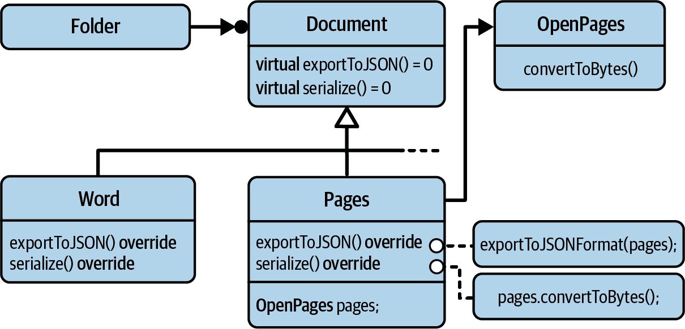
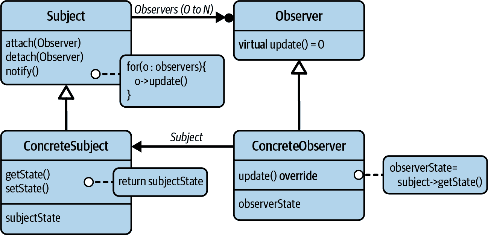
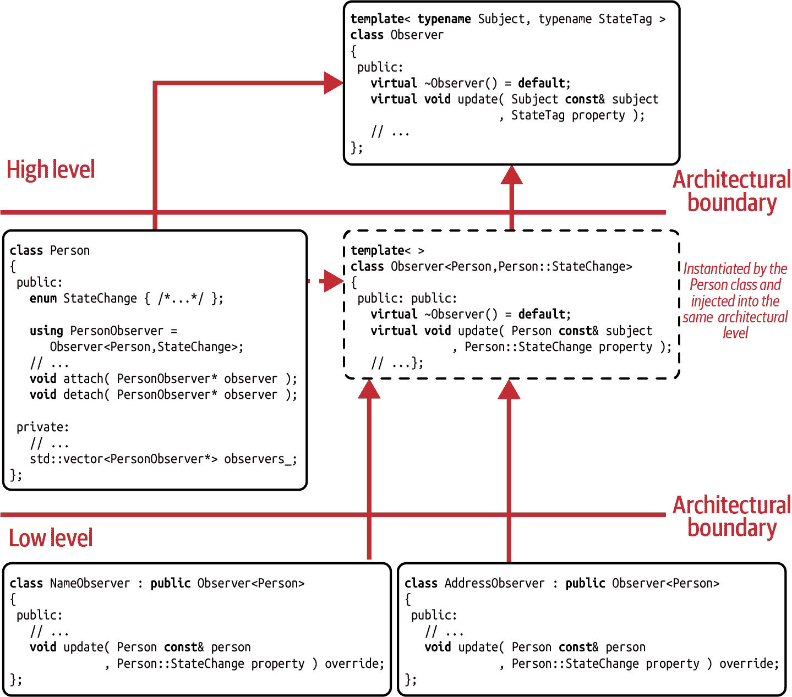
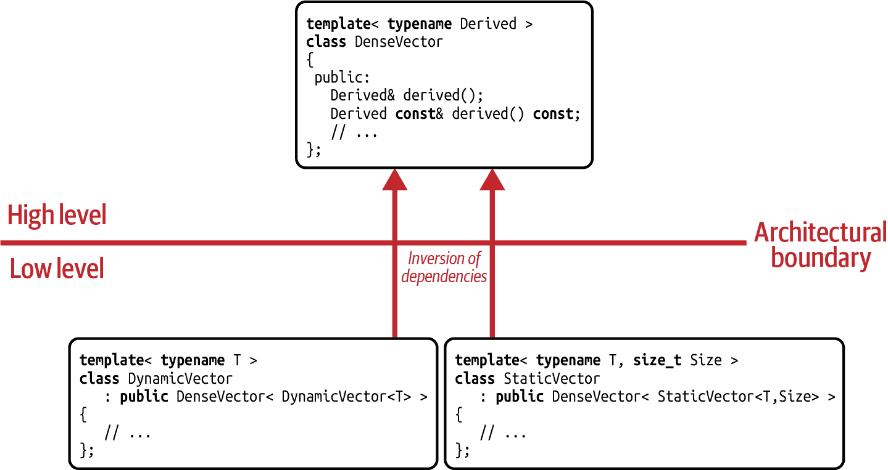

# 第六章：适配器、观察者和 CRTP 设计模式

在本章中，我们关注三种必须了解的设计模式：两种 GoF 设计模式，适配器和*观察者*，以及*奇异递归模板模式（CRTP）*设计模式。

在 “指南 24：使用适配器标准化接口” 中，我们讨论通过适配器将不兼容的事物整合在一起的方法。为了实现这一点，我将向您展示适配器设计模式及其在继承层次结构和泛型编程中的应用。您还将获得各种适配器的概述，包括对象适配器、类适配器和函数适配器。

在 “指南 25：将观察者应用作抽象通知机制” 中，我们将讨论如何观察状态变化以及如何收到通知。在这个背景下，我将向您介绍观察者设计模式，这是最著名和最常用的设计模式之一。我们将讨论经典的 GoF 风格的观察者，以及如何在现代 C++ 中实现观察者模式。

在 “指南 26：使用 CRTP 引入静态类型类别” 中，我们将转向 CRTP。我将向您展示如何使用 CRTP 定义一组相关类型之间的编译时关系，以及如何正确实现 CRTP 基类。

在 “指南 27：使用 CRTP 创建静态混合类” 中，我将继续讲解 CRTP，向您展示如何使用 CRTP 创建编译时混合类。我们还将看到语义继承与技术继承的区别，语义继承用于创建抽象，而技术继承仅用于技术上的优雅和便利性的实现细节。

# 指南 24：使用适配器标准化接口

假设您已经根据 “指南 3：分离接口以避免人为耦合” 实现了 `Document` 示例，并且因为您正确遵循了接口隔离原则（ISP），您对其工作方式感到满意：

```cpp
class JSONExportable
{
 public:
   // ...
   virtual ~JSONExportable() = default;

   virtual void exportToJSON( /*...*/ ) const = 0;
   // ...
};

class Serializable
{
 public:
   // ...
   virtual ~Serializable() = default;

   virtual void serialize( ByteStream& bs, /*...*/ ) const = 0;
   // ...
};

class Document
   : public JSONExportable
   , public Serializable
{
 public:
   // ...
};
```

然而，有一天，您需要介绍 Pages 文档格式。¹ 当然，它类似于您已经使用的 Word 文档，但不幸的是，您并不熟悉 Pages 格式的细节。更糟糕的是，您没有太多时间去熟悉这种格式，因为您有太多其他事情要做。幸运的是，您了解到有一个相当合理的开源实现：`OpenPages` 类：

```cpp
class OpenPages
{
 public:
   // ...
   void convertToBytes( /*...*/ );
};

void exportToJSONFormat( OpenPages const& pages, /*...*/ );
```

光明面是，这个类提供了您所需的几乎所有内容：一个 `convertToBytes()` 成员函数来序列化文档的内容，以及一个免费的 `exportToJSONFormat()` 函数来将 Pages 文档转换为 JSON 格式。不幸的是，它不符合您的接口期望：您期望一个 `serialize()` 成员函数而不是 `convertToBytes()` 成员函数。而且您期望一个 `exportToJSON()` 成员函数而不是免费的 `exportToJSONFormat()` 函数。当然，最终，第三方类没有从您的 `Document` 基类继承，这意味着您无法轻松地将该类整合到您现有的层次结构中。然而，这个问题是有解决方案的：使用适配器设计模式进行无缝集成。

## 解释适配器设计模式

适配器设计模式是另一个经典 GoF 设计模式之一。它专注于标准化接口，帮助在现有的继承层次结构中非侵入地添加功能。

# 适配器设计模式

意图：“将一个类的接口转换成客户期望的另一个接口。适配器模式使得因接口不兼容而不能在一起工作的类能够在一起工作。”²

图 6-1 展示了适配器场景的 UML 图：您已经准备好了 `Document` 基类（我们暂时忽略 `JSONExportable` 和 `Serializable` 接口），并且已经实现了几种不同类型的文档（例如使用 `Word` 类）。这个层次结构的新添加是 `Pages` 类。



###### 图 6-1\. 适配器设计模式的 UML 表示

`Pages` 类作为第三方 `OpenPages` 类的包装器：

```cpp
class Pages : public Document
{
 public:
   // ...
   void exportToJSON( /*...*/ ) const override
   {
      exportToJSONFormat(pages, /*...*/);  
   }

   void serialize( ByteStream& bs, /*...*/ ) const override
   {
      pages.convertToBytes(/*...*/);  
   }
   // ... 
 private:
   OpenPages pages;  // Example of an object adapter };

```

`Pages` 通过将调用转发到相应的 `OpenPages` 函数来实现 `Document` 接口：调用 `exportToJSON()` 被转发到自由的 `exportToJSONFormat()` 函数（），而调用 `serialize()` 被转发到 `convertToBytes()` 成员函数（）。

使用 `Pages` 类，您可以轻松地将第三方实现集成到您现有的层次结构中。非常容易：您可以在不修改任何内容的情况下进行集成。适配器设计模式的这种非侵入性本质是您应该考虑的适配器设计模式的最大优势之一：任何人都可以添加一个适配器来将一个接口适配到另一个现有的接口。

在这种情境下，`Pages` 类作为 `OpenPages` 类中实际实现细节的一个抽象。因此，适配器设计模式将接口的关注点与实现细节分离开来。这样做很好地满足了单一责任原则（SRP），并且与开闭原则（OCP）的意图融合得很好（参见“指南 2：设计以便改变” 和 “指南 5：设计以便扩展”）。

从某种角度来说，`Pages` 适配器作为一种间接方式工作，并将一组函数映射到另一组函数。请注意，并不严格要求将一个函数映射到确切的另一个函数。相反，你完全可以灵活地将预期的函数集映射到可用的函数集上。因此，适配器不一定代表一对一的关系，而是可以支持一对多的关系。³

## 对象适配器与类适配器的比较。

`Pages` 类是所谓的*对象适配器*的一个例子。这个术语指的是你存储包装类型的一个实例。或者，考虑到包装类型是继承层次结构的一部分，你可以存储该层次结构的基类指针。这将允许你对层次结构中的所有类型使用对象适配器，从而显著提升对象适配器的灵活性。

相反，还有实现所谓的*类适配器*的选项：

```cpp
class Pages : public Document
            , private OpenPages  // Example of a class adapter 
{
 public:
   // ...
   void exportToJSON( /*...*/ ) const override
   {
      exportToJSONFormat(*this, /*...*/);
   }

   void serialize( ByteStream& bs, /*...*/ ) const override
   {
      this->convertToBytes(/*...*/);
   }
   // ... };

```

而不是存储适配类型的实例，你可以继承它（如果可能的话，非公开地）并相应地实现预期的接口（）。然而，正如在“指南 20：更喜欢组合而非继承”中讨论的那样，最好建立在组合之上。一般来说，对象适配器比类适配器更为灵活，因此应该是你的首选。只有少数情况下，你会更倾向于选择类适配器：

+   如果你必须覆盖一个虚函数。

+   如果你需要访问一个`protected`成员函数。

+   如果你要求适配类型在另一个基类之前构造。

+   如果你需要共享一个共同的虚基类或者覆盖虚基类的构造。

+   如果你可以从[*空基类优化 (EBO)*](https://oreil.ly/7wLyW)中获得显著优势。⁴

否则，对大多数情况而言，你应该优先选择对象适配器。

“我喜欢这个设计模式——它很强大。然而，我刚想起你推荐在代码中使用设计模式的名称来传达意图。难道这个类不应该叫做 `PagesAdapter` 吗？” 你提出了一个很好的观点。我很高兴你记得“Guideline 14: Use a Design Pattern’s Name to Communicate Intent”，在这里我确实主张设计模式的名称有助于理解代码。我承认在这种情况下，我对两种命名约定都持开放态度。虽然我确实看到了 `PagesAdapter` 这个名称的优点，因为它立即传达了你基于适配器设计模式的构建，但我不认为在这种情况下传达这个类代表一个适配器是必要的。对我来说，适配器在这种情况下感觉像是一个实现细节：我不需要知道 `Pages` 类并没有自己实现所有细节，而是使用 `OpenPages` 类来实现。这就是为什么我建议“考虑使用名称”。你应该根据具体情况来决定。

## 标准库中的例子

适配器设计模式的一个有用应用是标准化不同类型容器的接口。假设有以下 `Stack` 基类：

```cpp
//---- <Stack.h> ---------------- 
template< typename T >
class Stack
{
 public:
   virtual ~Stack() = default;
   virtual T& top() = 0;  
   virtual bool empty() const = 0;  
   virtual size_t size() const = 0;  
   virtual void push( T const& value ) = 0;  
   virtual void pop() = 0;  
};

```

这个 `Stack` 类提供了访问堆栈顶部元素的必要接口 (), 检查堆栈是否为空 (), 查询堆栈大小 (), 将元素推入堆栈 (), 以及移除堆栈顶部元素 ()。现在可以使用这个基类来实现不同的适配器，用于各种数据结构，比如 `std::vector`：

```cpp
//---- <VectorStack.h> ----------------

#include <Stack.h>

template< typename T >
class VectorStack : public Stack<T>
{
 public:
   T& top() override { return vec_.back(); }
   bool empty() const override { return vec_.empty(); }
   size_t size() const override { return vec_.size(); }
   void push( T const& value ) override { vec_.push_back(value); }
   void pop() override { vec_.pop_back(); }

 private:
   std::vector<T> vec_;
};
```

你可能会担心，“你真的建议通过抽象基类来实现堆栈吗？你不担心性能问题吗？每次使用成员函数都要付出虚函数调用的代价！” 当然，我并不建议这样做。显然，你是正确的，我完全同意你的观点：从 C++ 的角度来看，这种容器的设计感觉很奇怪，而且效率非常低下。出于效率考虑，我们通常会通过类模板来实现相同的想法。这也是 C++ 标准库采用的方法，例如三个 STL 类称为[容器适配器](https://oreil.ly/RMYzu)：[`std::stack`](https://oreil.ly/y4cr6), [`std::queue`](https://oreil.ly/LvVNn), 和 [`std::priority_queue`](https://oreil.ly/nTBM8)：

```cpp
template< typename T
        , typename Container = std::deque<T> >
class stack;

template< typename T
        , typename Container = std::deque<T> >
class queue;

template< typename T
        , typename Container = std::vector<T>
        , typename Compare = std::less<typename Container::value_type> >
class priority_queue;
```

这三个类模板将给定的 `Container` 类型的接口适配到特定目的。例如，`std::stack` 类模板的目的是将容器的接口适配到栈操作 `top()`、`empty()`、`size()`、`push()`、`emplace()`、`pop()` 和 `swap()`。⁵ 默认情况下，您可以使用三种可用的序列容器：`std::vector`、`std::list` 和 `std::deque`。对于任何其他容器类型，您可以专门化 `std::stack` 类模板。

“这感觉*非常*熟悉”，你说道，显然松了一口气。我完全同意。我认为标准库的方法更适合容器的目的。但是比较这两种方法仍然很有趣。虽然 `Stack` 基类和 `std::stack` 类模板之间有许多技术上的不同，但这两种方法的目的和语义非常相似：两者都提供了将任何数据结构适配到给定栈接口的能力。而且两者都作为变异点，允许您在不必修改现有代码的情况下非侵入式地添加新的适配器。

## 适配器与策略的比较

“STL 的这三个类似乎实现了适配器的意图，但这不是和策略设计模式中配置行为的方式相同吗？这和 `std::unique_ptr` 及其删除器有相似之处？” 你问道。是的，你说得对。从结构上看，策略模式和适配器设计模式非常相似。然而，正如在 “指南 11: 理解设计模式的目的” 中所解释的，设计模式的结构可能相似甚至相同，但其意图是不同的。在这种情况下，`Container` 参数不仅仅指定行为的单个方面，而是大多数甚至全部行为。类模板主要充当给定类型功能的包装器——它们主要是适配接口。因此，适配器的主要焦点是标准化接口并将不兼容的功能集成到现有的约定集中；而另一方面，策略设计模式的主要焦点是允许从外部配置行为，构建并提供预期的接口。此外，适配器不需要在任何时候重新配置行为。

## 函数适配器

适配器设计模式的另一个示例是标准库的自由函数[`begin()`](https://oreil.ly/ZP74K)和[`end()`](https://oreil.ly/qFeMX)。“你是认真的吗？”你问道，感到惊讶。“你说自由函数作为适配器设计模式的一个例子？这不是类的工作吗？”嗯，并非完全如此。自由函数`begin()`和`end()`的目的是将任何类型的迭代器接口适配到预期的 STL 迭代器接口。因此，它将可用函数集映射到预期函数集，并起到与任何其他适配器相同的作用。其主要区别在于，与基于继承（运行时多态性）或模板（编译时多态性）的对象适配器或类适配器不同，`begin()`和`end()`依靠函数重载获得其能力，这是 C++中第二个主要的编译时多态机制。尽管如此，某种形式的抽象仍在发挥作用。

###### 注意

记住，所有种类的抽象都代表一组要求，因此必须遵守里氏替换原则（LSP）。这对于重载集合也是如此；参见“指导原则 8：理解重载集的语义要求”。

考虑以下函数模板：

```cpp
template< typename Range >
void traverseRange( Range const& range )
{
   for( auto&& element : range ) {
      // ...
   }
}
```

在`traverseRange()`函数中，我们通过基于范围的`for`循环遍历给定范围内包含的所有元素。遍历通过编译器使用的自由函数`begin()`和`end()`获取的迭代器进行。因此，前述的`for`循环等同于以下形式的`for`：

```cpp
template< typename Range >
void traverseRange( Range const& range )
{
   {
      using std::begin;
      using std::end;

      auto first( begin(range) );
      auto last ( end(range) );
      for( ; first!=last; ++first ) {
         auto&& element = *first;
         // ...
      }
   }
}
```

显然，基于范围的`for`循环更加方便使用。但在表面下，编译器生成基于自由函数`begin()`和`end()`的代码。请注意它们开头的两个`using`声明：其目的是为了为给定范围的类型启用[*Argument-Dependent Lookup (ADL)*](https://oreil.ly/VKcsl)。ADL 是一种机制，确保调用“正确”的`begin()`和`end()`函数，即使它们是存在于用户特定命名空间中的重载。这意味着您有机会为任何类型重载`begin()`和`end()`，并将预期接口映射到不同的特定函数集。

这种*函数适配器*在 2004 年被 Matthew Wilson 称为*shim*⁶。这种技术的一个宝贵特性是它完全不侵入：可以向任何类型添加自由函数，甚至是无法适配的类型，例如第三方库提供的类型。因此，任何以 shims 或函数适配器为术语编写的通用代码都为您提供了适应几乎任何类型到预期接口的巨大能力。因此，您可以想象 shims 或函数适配器是通用编程的支柱。

## 分析适配器设计模式的缺点

尽管**适配器设计模式**的价值很高，但有一个问题我必须明确指出。考虑以下例子，我从埃里克·弗里曼和伊丽莎白·罗布森那里采用的：⁷

```cpp
//---- <Duck.h> ----------------

class Duck
{
 public:
   virtual ~Duck() = default;
   virtual void quack() = 0;
   virtual void fly() = 0;
};

//---- <MallardDuck.h> ----------------

#include <Duck.h>

class MallardDuck : public Duck
{
 public:
   void quack() override { /*...*/ }
   void fly() override { /*...*/ }
};
```

我们从抽象的`Duck`（鸭子）类开始，引入了两个纯虚函数`quack()`和`fly()`。事实上，这看起来是一个非常预期和自然的`Duck`类接口，并且当然会引发一些期望：鸭子发出非常特征性的声音并且能够飞得很好。这个接口被许多可能的`Duck`类实现，比如`MallardDuck`（绿头鸭）类。现在，出于某种原因，我们也不得不处理火鸡：

```cpp
//---- <Turkey.h> ----------------

class Turkey
{
 public:
   virtual ~Turkey() = default;
   virtual void gobble() = 0;  // Turkeys don't quack, they gobble!
   virtual void fly() = 0;     // Turkeys can fly (a short distance)
};

//---- <WildTurkey.h> ----------------

class WildTurkey : public Turkey
{
 public:
   void gobble() override { /*...*/ }
   void fly() override { /*...*/ }
};
```

火鸡由抽象的`Turkey`类表示，当然，这个类被许多不同种类的具体`Turkey`（火鸡）实现，比如`WildTurkey`（野火鸡）。更糟糕的是，出于某种原因，鸭子和火鸡被期望一起使用。一个可能的解决方案是假装火鸡是鸭子。毕竟，火鸡与鸭子非常相似。好吧，它不会嘎嘎叫，但它可以咯咯叫（典型的火鸡声音），而且它也能飞（虽然飞行距离不远，但确实可以飞）。因此，你可以用`TurkeyAdapter`（火鸡适配器）来适配火鸡到鸭子：

```cpp
//---- <TurkeyAdapter.h> ----------------

#include <memory>

class TurkeyAdapter : public Duck
{
 public:
   explicit TurkeyAdapter( std::unique_ptr<Turkey> turkey )
      : turkey_{ std::move(turkey) }
   {}

   void quack() override { turkey_->gobble(); }
   void fly() override { turkey_->fly(); }

 private:
   std::unique_ptr<Turkey> turkey_;  // This is an example for an object adapter
};
```

虽然这是对[鸭子类型](https://oreil.ly/3rGpx)的一个有趣解释，这个例子很好地展示了将外来事物集成到现有层次结构中的过于简单。一只`Turkey`（火鸡）根本不是`Duck`（鸭子），即使我们希望它是。我认为`quack()`和`fly()`函数可能都违反了 LSP。这两个函数都不是我期望的（至少我相当确定我想要的是呱呱叫而不是咯咯叫的生物，以及我想要的是真正像鸭子一样能飞的东西）。当然，这取决于具体的上下文，但不可否认的是，适配器设计模式确实使得将不相容的事物组合在一起变得非常容易。因此，在应用此设计模式时，考虑期望的行为并检查 LSP 违规非常重要：

```cpp
#include <MallardDuck.h>
#include <WildTurkey.h>
#include <TurkeyAdapter.h>
#include <memory>
#include <vector>

using DuckChoir = std::vector<std::unique_ptr<Duck>>;

void give_concert( DuckChoir const& duck_choir )
{
   for( auto const& duck : duck_choir ) {
      duck->quack();
   }
}

int main()
{
   DuckChoir duck_choir{};

   // Let's hire the world's best ducks for the choir
   duck_choir.push_back( std::make_unique<MallardDuck>() );
   duck_choir.push_back( std::make_unique<MallardDuck>() );
   duck_choir.push_back( std::make_unique<MallardDuck>() );

   // Unfortunately we also hire a turkey in disguise
   auto turkey = std::make_unique<WildTurkey>();
   auto turkey_in_disguise = std::make_unique<TurkeyAdapter>( std::move(turkey) );
   duck_choir.push_back( std::move(turkey_in_disguise) );

   // The concert is going to be a musical disaster...
   give_concert( duck_choir );

   return EXIT_SUCCESS;
}
```

总之，适配器设计模式可以被认为是结合不同功能片段并使它们协同工作的最有价值的设计模式之一。我保证它将在你的日常工作中证明是一个宝贵的工具。但是，请不要滥用适配器的力量，试图将苹果和橙子（甚至橙子和葡萄柚）结合在一起。始终注意 LSP 的期望。

# 准则 25：将观察者应用为抽象通知机制

你很有可能之前就听说过观察者了。“哦，是的，当然听过——这不就是所谓的社交媒体平台对我们所做的事情吗？”你问道。嗯，并不完全是我想要的，但是是的，我相信我们可以称这些平台为观察者。而且，确实有它们所做的事情的模式，尽管不是设计模式。但我实际上是在谈论一个最流行的 GoF 设计模式之一，观察者设计模式。即使你对这个想法不熟悉，你很可能在现实生活中有一些有用的观察者的经验。例如，你可能注意到，在一些即时通讯应用程序中，当你阅读新消息时，消息的发送者会立即收到通知。这意味着消息显示为“已读”，而不仅仅是“已发送”。这项小服务本质上就是现实生活中观察者的工作：一旦新消息的状态发生变化，发送者就会收到通知，从而有机会对状态变化作出响应。

## 观察者设计模式解析

在许多软件情况下，当某些状态发生变化时，及时获得反馈是非常可取的：例如，将作业添加到任务队列中，更改配置对象中的设置，准备好可以获取结果等等。但与此同时，引入主题（变化的观察实体）与其观察者（基于状态变化通知的回调）之间的显式依赖是非常不可取的。相反，主题应该对潜在的许多不同类型的观察者毫不知情。这样做的简单原因是任何直接的依赖关系都会使软件更难以改变和扩展。这种主题与其潜在的许多观察者之间的解耦是观察者设计模式的意图。

# 观察者设计模式

意图：“定义对象之间的一对多依赖关系，以便当一个对象改变状态时，所有依赖它的对象都会自动收到通知并更新。”⁹

与所有设计模式一样，观察者设计模式将一个*变化点*（即变化或预期变化的方面）标识出来，并以抽象形式提取出来。因此，它有助于解耦软件实体。在观察者的情况下，识别到需要引入新观察者——需要扩展一对多的依赖——被认为是变化点。正如图 6-2 所示，这个变化点在`Observer`基类的形式下得以实现。



###### 图 6-2\. 观察者设计模式的 UML 表示

`Observer`类代表了所有可能的观察者实现的抽象。这些观察者附加到特定的主题，由`ConcreteSubject`类表示。为了减少观察者与其主题之间的耦合，或者简单地通过为不同的观察者提供所有共同服务来减少代码重复，可以使用`Subject`抽象。这个`Subject`也可能通知所有附加的观察者关于状态变化，并触发它们相应的`update()`功能。

`Observer`基类的引入是 SRP 的另一个例子，你可能会问。是的，你完全正确：抽取`Observer`类，提取一个变化点，就是 SRP 的实践（参见“指导原则 2：为变化设计”）。再次强调，SRP 作为 OCP 的一个推动因素（参见“指导原则 5：为扩展设计”）：通过引入`Observer`抽象，任何人都能够添加新类型的观察者（例如`ConcreteObserver`），而无需修改现有代码。如果你关注`Observer`基类的所有权，并确保`Observer`类存在于架构的高层级，则也符合依赖反转原则（DIP）。

## 经典 Observer 模式实现

“太好了，我明白了！再次看到这些设计原则在实践中的应用真是太棒了，但我想看一个具体的 Observer 示例。”我理解。那么让我们来看一个具体的实现。不过，在我们开始查看代码之前，我应该明确说明以下示例的局限性。你可能已经熟悉了`Observer`，因此你可能正在寻求帮助，并希望深入了解许多 Observer 的棘手实现细节：如何处理附加和分离观察者的顺序，多次附加观察者，特别是在并发环境中使用观察者。我应该诚实地提前声明，我并不打算提供这些问题的答案。那样的讨论会像打开潘多拉盒子，迅速把我们吸引到实现细节的领域。不，尽管你可能会感到失望，但我的意图大部分是留在软件设计的层面上。¹⁰

就像之前的设计模式一样，我们从 Observer 设计模式的经典实现开始。其核心元素是`Observer`基类：

```cpp
//---- <Observer.h> ---------------- 
class Observer
{
 public:
   virtual ~Observer() = default;

   virtual void update( /*...*/ ) = 0;  
};

```

这个类的最重要的实现细节是纯虚拟的`update()`函数（），每当观察者被通知到某个状态变化时就会调用它。有三种定义`update()`函数的替代方法，它们提供了合理的实现和设计灵活性。第一种替代方法是通过一个或多个`update()`函数推送更新的状态：

```cpp
class Observer
{
 public:
   // ...
   virtual void update1( /*arguments representing the updated state*/ ) = 0;
   virtual void update2( /*arguments representing the updated state*/ ) = 0;
   // ...
};
```

这种观察者形式通常被称为*推送观察者*。在这种形式中，观察者由主体提供所有必要的信息，因此不需要自行从主体拉取任何信息。这可以显著减少与主体的耦合，并创造重用`Observer`类的机会。此外，还可以选择为每种状态变化使用单独的重载。在前面的代码片段中，有两个`update()`函数，分别用于两种可能的状态变化。由于状态变化始终明确，因此观察者无需“搜索”任何状态变化，这证明是高效的。

“对不起”，你说，“但这不是违反 ISP 吗？我们不应该通过将`update()`函数分成几个基类来分离关注点吗？” 这是一个很好的问题！显然，您正在关注人为耦合。非常好！而且您是正确的：我们可以将具有多个`update()`函数的观察者分离成较小的`Observer`类：

```cpp
class Observer1
{
 public:
   // ...
   virtual void update1( /*arguments representing the updated state*/ ) = 0;
   // ...
};

class Observer2
{
 public:
   // ...
   virtual void update2( /*arguments representing the updated state*/ ) = 0;
   // ...
};
```

理论上，这种方法可以帮助减少对特定主题的耦合，并更容易地为不同的主题重用观察者。它可能还有助于不同的观察者可能对不同的状态变化感兴趣，因此人为耦合所有可能的状态变化可能会违反 ISP。当然，如果能够避免大量不必要的状态变化通知，这可能会带来效率提升。

不幸的是，特定的主题不太可能区分不同类型的观察者。首先，这需要它存储不同类型的指针（对于主题来说是不方便的），其次，不同的状态变化可能以某种方式相互关联。在这种情况下，主题将期望观察者对*所有*可能的状态变化感兴趣。从这个角度来看，将几个`update()`函数合并到一个基类中可能是合理的。无论如何，很可能一个具体的观察者将不得不处理所有类型的状态变化。我知道，即使只有很少一部分是有趣的，也必须处理几个`update()`函数，这可能会让人感到困扰。但是，请确保您不会因为不遵守某些预期行为（如果有的话）而意外违反里氏替换原则。

推送观察者还有几个潜在的缺点。首先，观察者*总是*被*所有*信息传递，无论他们是否需要。因此，如果观察者大部分时间都需要信息，这种推送样式才有效。否则，大量的工作会浪费在不必要的通知上。其次，推送会创建对传递给观察者的参数数量和种类的依赖性。对这些参数的任何更改都需要在派生观察者类中进行大量的后续更改。

一些这些缺点通过第二个`Observer`的替代方案得以解决。只需将主题的引用传递给观察者即可：¹²

```cpp
class Observer
{
 public:
   // ...
   virtual void update( Subject const& subject ) = 0;
   // ...
};
```

由于观察者未传递特定信息，派生自`Observer`基类的类必须自行从主题拉取新信息。因此，这种形式的观察者通常被称为“拉取观察者”。优点是对参数数量和类型的依赖性减少。派生观察者可以自由查询任何信息，而不仅限于已更改的状态。另一方面，此设计在`Observer`派生类与主题之间创建了强烈直接的依赖性。因此，对主题的任何更改都很容易反映在观察者身上。此外，如果多个细节发生了变化，观察者可能需要“搜索”状态变化，这可能会被证明是不必要的低效率。

如果你只将单个信息片段视为变化状态，性能劣势可能不会对你构成限制。但请记住软件会变化：主题可能增长，因此希望通知不同类型的变化。在此过程中调整观察者将导致大量额外工作。从这个角度来看，“推送观察者”似乎是一个更好的选择。

幸运的是，还有第三种选择，消除了许多先前的缺点，因此成为我们的首选方法：除了传递主题的引用外，还传递一个标签，提供有关主题哪个属性已更改的信息：

```cpp
//---- <Observer.h> ----------------

class Observer
{
 public:
   virtual ~Observer() = default;

   virtual void update( Subject const& subject
                      , /*Subject-specific type*/ property ) = 0;
};
```

该标签可能帮助观察者自行决定某些状态变化是否有趣。通常由特定于主题的枚举类型表示，列出所有可能的状态变化。不幸的是，这会增加`Observer`类与特定主题之间的耦合。

“通过将`Observer`基类实现为一个类模板，能否删除对特定`Subject`的依赖？看一下以下代码片段：”

```cpp
//---- <Observer.h> ---------------- 
template< typename Subject, typename StateTag >  
class Observer
{
 public:
   virtual ~Observer() = default;

   virtual void update( Subject const& subject, StateTag property ) = 0;
};

```

这是一个很好的建议。通过将`Observer`类定义为一个类模板的形式（），我们可以轻松地将`Observer`提升到更高的架构层次。在这种形式下，该类不依赖于任何特定的主题，因此可以被许多不同希望定义一对多关系的主题重复使用。然而，你不应期望这种改进能起到太大作用：效果仅限于`Observer`类。具体的主题将期望具体的这个观察者类的实例化，因此`Observer`的具体实现仍然会强烈依赖于主题。

要更好地理解其中的原因，让我们看一下可能的主题实现。在您对社交媒体的初步评论之后，我建议我们为人员实现一个观察者。好吧，好吧，这个例子可能在道德上有问题，但它会达到它的目的，所以让我们这么做吧。至少我们知道谁该为此负责。

下面的`Person`类表示一个被观察的人：

```cpp
//---- <Person.h> ---------------- 
#include <Observer.h>
#include <string>
#include <set>

class Person
{
 public:
   enum StateChange
   {
      forenameChanged,
      surnameChanged,
      addressChanged
   };

   using PersonObserver = Observer<Person,StateChange>;  

   explicit Person( std::string forename, std::string surname )
      : forename_{ std::move(forename) }
      , surname_{ std::move(surname) }
   {}

   bool attach( PersonObserver* observer );  
   bool detach( PersonObserver* observer );  

   void notify( StateChange property );  

   void forename( std::string newForename );  
   void surname ( std::string newSurname );
   void address ( std::string newAddress );

   std::string const& forename() const { return forename_; }
   std::string const& surname () const { return surname_; }
   std::string const& address () const { return address_; }

 private:
   std::string forename_;  
   std::string surname_;
   std::string address_;

   std::set<PersonObserver*> observers_;  
};

```

在这个例子中，`Person`仅仅是三个数据成员的聚合：`forename_`、`surname_`和`address_`（)（我知道，这只是一个人的一个相当简单的表示）。此外，一个人持有已注册观察者的`std::set`（)。请注意，观察者是通过指向`PersonObserver`实例的指针来注册的（)。出于两个原因这是有趣的：首先，这展示了模板化`Observer`类的目的：`Person`类从类模板实例化其自己的观察者类型。其次，指针在这种情况下证明非常有用，因为对象的地址是唯一的。因此，常见的做法是使用地址作为观察者的唯一标识符。

“这里应该用`std::unique_ptr`还是`std::shared_ptr`？”你问道。不，在这种情况下不需要。这些指针仅仅作为已注册观察者的句柄；它们不应该拥有这些观察者。因此，在这种情况下，任何拥有性智能指针都是错误的选择。唯一合理的选择将是`std::weak_ptr`，它允许您检查悬空指针。然而，`std::weak_ptr`并不是`std::set`的一个好选择（即使使用自定义比较器）。尽管仍有方法可以使用`std::weak_ptr`，我将坚持使用裸指针。但不要担心，这并不意味着我们放弃了现代 C++的好处。不，在这种情况下使用裸指针是完全有效的。这也在 C++ [核心指南 F.7](https://oreil.ly/xS6w6)中表达了：

> 对于一般使用，取`T*`或`T&`作为参数，而不是智能指针。

每当您对获取人的状态变化通知感兴趣时，您可以通过`attach()`成员函数注册一个观察者（)。每当您不再对获取通知感兴趣时，您可以通过`detach()`成员函数注销一个观察者（)。这两个函数是观察者设计模式的一个重要组成部分，也清楚地表明了设计模式的应用：

```cpp
bool Person::attach( PersonObserver* observer )
{
   auto [pos,success] = observers_.insert( observer );
   return success;
}

bool Person::detach( PersonObserver* observer )
{
   return ( observers_.erase( observer ) > 0U );
}
```

你完全可以自由地实现`attach()`和`detach()`函数。在这个例子中，我们允许一个观察者在`std::set`中只注册一次。如果尝试第二次注册观察者，函数会返回`false`。如果尝试取消注册一个未注册的观察者也会发生同样的事情。请注意，不允许多次注册的决定是我在这个例子中的选择。在其他情况下，允许重复注册可能是可取的，甚至是必要的。无论如何，主题的行为和接口在所有情况下都应该是一致的。

观察者设计模式的另一个核心功能是`notify()`成员函数（）。每当发生状态变化时，此函数被调用以通知所有注册的观察者。

```cpp
void Person::notify( StateChange property )
{
   for( auto iter=begin(observers_); iter!=end(observers_); )
   {
      auto const pos = iter++;
      (*pos)->update(*this,property);
   }
}
```

“为什么`notify()`函数的实现这么复杂？难道使用基于范围的`for`循环就不够吗？”你说得对；我应该解释一下这里发生了什么。给定的表述确保在迭代期间可以检测到`detach()`操作。例如，在调用`update()`函数期间，观察者决定分离时就会发生这种情况。但我并不认为这种表述是完美的：不幸的是，它无法处理`attach()`操作。至于并发问题，更是不能接触！因此，这只是说明为什么观察者模式的实现细节会如此棘手的一个例子。

`notify()`函数在所有三个 setter 函数中被调用（）。请注意，在所有三个函数中，我们始终传递不同的标签来指示发生了哪种属性的更改。派生自`Observer`基类的类可以使用此标签来确定变化的性质。

```cpp
void Person::forename( std::string newForename )
{
   forename_ = std::move(newForename);
   notify( forenameChanged );
}

void Person::surname( std::string newSurname )
{
   surname_ = std::move(newSurname);
   notify( surnameChanged );
}

void Person::address( std::string newAddress )
{
   address_ = std::move(newAddress);
   notify( addressChanged );
}
```

有了这些机制，你现在可以编写符合完全 OCP 的新型观察者了。例如，你可以决定实现`NameObserver`和`AddressObserver`：

```cpp
//---- <NameObserver.h> ----------------

#include <Observer.h>
#include <Person.h>

class NameObserver : public Observer<Person,Person::StateChange>
{
 public:
   void update( Person const& person, Person::StateChange property ) override;
};

//---- <NameObserver.cpp> ----------------

#include <NameObserver.h>

void NameObserver::update( Person const& person, Person::StateChange property )
{
   if( property == Person::forenameChanged ||
       property == Person::surnameChanged )
   {
      // ... Respond to changed name
   }
}

//---- <AddressObserver.h> ----------------

#include <Observer.h>
#include <Person.h>

class AddressObserver : public Observer<Person,Person::StateChange>
{
 public:
   void update( Person const& person, Person::StateChange property ) override;
};

//---- <AddressObserver.cpp> ----------------

#include <AddressObserver.h>

void AddressObserver::update( Person const& person, Person::StateChange property )
{
   if( property == Person::addressChanged ) {
      // ... Respond to changed address
   }
}
```

有了这两个观察者，现在无论人的姓名还是地址发生变化时，您都会收到通知了。

```cpp
#include <AddressObserver.h>
#include <NameObserver.h>
#include <Person.h>
#include <cstdlib>

int main()
{
   NameObserver nameObserver;
   AddressObserver addressObserver;

   Person homer( "Homer"     , "Simpson" );
   Person marge( "Marge"     , "Simpson" );
   Person monty( "Montgomery", "Burns"   );

   // Attaching observers
   homer.attach( &nameObserver );
   marge.attach( &addressObserver );
   monty.attach( &addressObserver );

   // Updating information on Homer Simpson
   homer.forename( "Homer Jay" );  // Adding his middle name

   // Updating information on Marge Simpson
   marge.address( "712 Red Bark Lane, Henderson, Clark County, Nevada 89011" );

   // Updating information on Montgomery Burns
   monty.address( "Springfield Nuclear Power Plant" );

   // Detaching observers
   homer.detach( &nameObserver );

   return EXIT_SUCCESS;
}
```

在这么多实现细节之后，让我们再退一步，再次审视更大的图景。图 6-3 展示了这个观察者示例的依赖图。



###### 图 6-3。观察者设计模式的依赖图

由于决定以类模板形式实现`Observer`类，所以`Observer`类位于我们架构的最高层。这使得你可以为多个目的重用`Observer`类，例如`Person`类。`Person`类声明了自己的`Observer<Person, Person::StateChange>`类型，并通过这种方式将代码注入到自己的架构层次中。具体的人员观察者，例如`NameObserver`和`AddressObserver`，随后可以基于这个声明进行构建。

## 基于值语义的观察者实现

“我理解你为什么从经典实现开始，但是既然你提到了偏爱值语义，那么在值语义世界中观察者会是什么样子呢？” 这是一个很好的问题，因为这是一个非常合理的下一步。正如在 “指南 22：偏爱值语义而非引用语义” 中解释的那样，有很多充分的理由避免引用语义的领域。然而，我们不会完全偏离经典实现：为了注册和注销观察者，我们始终需要一些唯一的标识符来标识观察者，而观察者的唯一地址只是解决这个问题最简单和最方便的方法。因此，我们将继续使用指针来引用注册的观察者。然而，`std::function` 是避免继承层次结构的一种优雅方式 — `std::function`：

```cpp
//---- <Observer.h> ---------------- 
#include <functional>

template< typename Subject, typename StateTag >
class Observer
{
 public:
   using OnUpdate = std::function<void(Subject const&,StateTag)>;  

   // No virtual destructor necessary 
   explicit Observer( OnUpdate onUpdate )  
      : onUpdate_{ std::move(onUpdate) }
   {
      // Possibly respond on an invalid/empty std::function instance
   }

   // Non-virtual update function
   void update( Subject const& subject, StateTag property )
   {
      onUpdate_( subject, property );  
   }

 private:
   OnUpdate onUpdate_;  
};

```

与其将 `Observer` 类实现为基类，从而要求派生类以非常特定的方式继承并实现 `update()` 函数，我们将关注点分离，而是建立在组合之上（参见 “指南 20：偏爱组合而非继承”）。`Observer` 类首先为我们 `update()` 函数期望签名的 `std::function` 类型提供了一个类型别名称为 `OnUpdate`（）。通过构造函数，您将得到一个 `std::function` 实例（），并将其移动到您的数据成员 `onUpdate_` 中（）。现在，`update()` 函数的工作是将调用转发到 `onUpdate_`，包括参数在内（）。

使用 `std::function` 获得的灵活性可以很容易地通过更新后的 `main()` 函数来演示：

```cpp
#include <Observer.h>
#include <Person.h>
#include <cstdlib>

void propertyChanged( Person const& person, Person::StateChange property )
{
   if( property == Person::forenameChanged ||
       property == Person::surnameChanged )
   {
      // ... Respond to changed name
   }
}

int main()
{
   using PersonObserver = Observer<Person,Person::StateChange>;

   PersonObserver nameObserver( propertyChanged );

   PersonObserver addressObserver(
      /*captured state*/{
         if( property == Person::addressChanged )
         {
            // ... Respond to changed address
         }
      } );

   Person homer( "Homer"     , "Simpson" );
   Person marge( "Marge"     , "Simpson" );
   Person monty( "Montgomery", "Burns"   );

   // Attaching observers
   homer.attach( &nameObserver );
   marge.attach( &addressObserver );
   monty.attach( &addressObserver );

   // ...

   return EXIT_SUCCESS;
}
```

由于选择了较少侵入性的方法，并与 `std::function` 解耦，如何实现 `update()` 函数完全由观察者的实现者决定（无状态的、有状态的等）。对于 `nameObserver`，我们依赖于自由函数 `propertyChanged()`，它本身解耦性强，因为它不绑定到一个类，并且可以在多个场合重复使用。另一方面，`addressObserver` 选择了一个可能捕获一些状态的 lambda 表达式。无论哪种方式，这两者唯一需要遵循的约定是满足所需 `std::function` 类型的必要签名。

“为什么我们仍然需要`Observer`类？我们不能直接使用`std::function`吗？” 是的，看起来确实是这样。从功能角度来看，`Observer`类本身并没有增加任何东西。然而，由于`std::function`是值语义的真正子集，我们倾向于复制或移动`std::function`对象。但在这种情况下这是不可取的：特别是如果您使用有状态的观察者，您不希望调用观察者的副本。虽然技术上可能，但通常不会传递指向`std::function`的指针。因此，在`std::function`的适配器形式下，`Observer`类仍可能具有价值（参见“指南 24：使用适配器标准化接口”）。

## 分析观察者设计模式的缺陷

“这并不完全是我期望的值语义解决方案，但我仍然喜欢它！” 嗯，我很高兴你有这种感觉。实际上，值语义的优势与观察者设计模式的好处（即，将事件与执行该事件的操作分离，以及轻松添加新类型的观察者的能力）结合起来，效果非常好。不幸的是，没有完美的设计，每种设计也都伴随着缺点。

首先，我应明确说明，演示的`std::function`方法仅适用于具有单个`update()`函数的*拉模式观察者*。由于`std::function`只能处理单个可调用对象，任何需要多个`update()`函数的方法都无法通过单个`std::function`处理。因此，`std::function`通常不适用于具有多个`update()`函数或可能增加`update()`函数数量的*推模式观察者*（请记住，代码倾向于变化！）。但可以推广`std::function`的方法。如果需要，首选的设计模式是类型擦除（参见第八章）。

第二个（较小的）缺点，如您所见，是没有纯粹基于值的实现。尽管我们可能能够通过`std::function`实现`update()`功能以获得灵活性，但我们仍然使用原始指针来附加和分离观察者。这很容易解释：使用指针作为唯一标识符的优点实在是太好了，不容忽视。此外，对于有状态的观察者，我们不希望处理实体的副本。当然，这需要我们检查`nullptr`（这需要额外的工作量），而且我们始终需要支付指针所代表的间接引用的开销。¹³ 我个人认为这只是一个小问题，因为这种方法有许多优点。

另一个更大的缺点是 *观察者* 的潜在实现问题：注册和注销的顺序可能非常重要，特别是如果允许一个观察者多次注册。此外，在多线程环境中，观察者的线程安全注册和注销以及事件处理是非常不平凡的问题。例如，如果一个不受信任的观察者在回调期间表现不当，它可能会冻结服务器，而为任意计算实现超时则是非常非平凡的。然而，这个主题远远超出了本书的范围。

然而，本书所涉及的范围是观察者的过度使用可能很容易导致复杂的互联网网络。事实上，如果你不小心，你可能会意外地引入回调的无限循环！因此，开发者有时会对使用观察者感到担忧，并担心单个通知可能会由于这些互联网连接而导致巨大的全局响应。当然，如果你有一个适当的架构，并且正确地实现了你的观察者，那么任何通知序列应始终沿着你的架构向下运行一个有向无环图（DAG）。当然，这正是良好软件设计的美丽所在。

简而言之，观察者设计模式的目的是提供一种解决状态变化通知的方案，它被证明是最著名和最常用的设计模式之一。除了可能棘手的实现细节外，它绝对是每个开发者工具箱中应该有的设计模式之一。

# 指南 26：使用 CRTP 引入静态类型类别

C++ 真的有很多东西要提供。它带来了许多功能，许多句法上的奇特之处，以及大量令人惊讶、完全无法发音和（对于未经过初始化的人）明显神秘的首字母缩写：RAII、ADL、CTAD、SFINAE、NTTP、IFNDR 和 SIOF。哦，这多有趣啊！其中一个神秘的首字母缩写就是 CRTP，即 *Curiously Recurring Template Pattern*。¹⁴ 如果你因为名字对你来说毫无意义而摸不着头脑，不要担心：就像在 C++ 中经常发生的那样，这个名字是随意选择的，但却被固守并从未被重新考虑或更改过。这个模式是由詹姆斯·科普利恩在 *C++ Report* 1995 年 2 月号上命名的，他意识到，奇怪的是，这个模式在许多不同的 C++ 代码库中反复出现。¹⁵ 令人好奇的是，尽管这种模式建立在继承之上（潜在地）作为一种抽象，但它并不表现出许多其他经典设计模式通常具有的性能缺陷。因此，CRTP 绝对值得一看，因为它可能成为你设计模式工具箱中一个有价值的，或者说是 *奇特* 的补充。

## CRTP 的动机

性能在 C++中非常重要。事实上，在几种情境中，使用虚函数的性能开销被认为是完全不能接受的。因此，在对性能要求极高的情境下，比如某些电脑游戏或高频交易的部分场景中，不使用虚函数。同样适用于高性能计算（HPC）。在 HPC 中，任何形式的条件判断或间接引用，包括虚函数，在性能最关键的部分，如计算核心的最内层循环中，都是被禁止的。使用它们会带来过多的性能开销。

为了举例说明这个问题的重要性和原因，让我们考虑来自线性代数（LA）库的以下`DynamicVector`类模板：

```cpp
//---- <DynamicVector.h> ---------------- 
#include <numeric>
#include <iosfwd>
#include <iterator>
#include <vector>
// ... 
template< typename T >
class DynamicVector
{
 public:
   using value_type     = T;  
   using iterator       = typename std::vector<T>::iterator;
   using const_iterator = typename std::vector<T>::const_iterator;

   // ... Constructors and special member functions 
   size_t size() const;  

   T&       operator[]( size_t index );  
   T const& operator[]( size_t index ) const;

   iterator       begin();  
   const_iterator begin() const;
   iterator       end();
   const_iterator end() const;

   // ... Many numeric functions 
 private:
   std::vector<T> values_;  
   // ... };

template< typename T >
std::ostream& operator<<( std::ostream& os, DynamicVector const<T>& vector )  
{
   os << "(";
   for( auto const& element : vector ) {
      os << " " << element;
   }
   os << " )";

   return os;
}

template< typename T >
auto l2norm( DynamicVector const<T>& vector )  
{
   using std::begin, std::end;
   return std::sqrt( std::inner_product( begin(vector), end(vector)
                                       , begin(vector), T{} ) );
}

// ... Many more 
```

尽管名字是`DynamicVector`，但它并不表示一个容器，而是用于 LA 计算的数值向量。名字中的`Dynamic`部分暗示它以动态方式分配其类型为`T`的元素，例如在这个例子中，以`std::vector`的形式（）。因此，它适用于大型 LA 问题（绝对是数百万个元素的范围）。尽管这个类可能加载了许多数值操作，从接口的角度来看，您确实可能会倾向于将其称为容器：它提供了常见的嵌套类型（`value_type`、`iterator`和`const_iterator`）（），一个`size()`函数来查询当前元素的数量（），通过索引访问单个元素的下标操作符（一个用于非`const`向量，一个用于`const`向量）（），以及`begin()`和`end()`函数来迭代元素（）。除了成员函数外，它还提供了一个输出运算符（），并且，为了展示至少一个 LA 操作，提供了一个计算向量的[欧几里得范数](https://oreil.ly/x2a47)的函数（通常也称为*L2 范数*，因为它近似于离散向量的 L2 范数）（）。

然而，`DynamicVector`并不是唯一的向量类。在我们的线性代数库中，您还会找到以下`StaticVector`类：

```cpp
//---- <StaticVector.h> ---------------- 
#include <array>
#include <numeric>
#include <iosfwd>
#include <iterator>
// ... 
template< typename T, size_t Size >
class StaticVector
{
 public:
   using value_type     = T;  
   using iterator       = typename std::array<T,Size>::iterator;
   using const_iterator = typename std::array<T,Size>::const_iterator;

   // ... Constructors and special member functions 
   size_t size() const;  

   T&       operator[]( size_t index );  
   T const& operator[]( size_t index ) const;

   iterator       begin();  
   const_iterator begin() const;
   iterator       end();
   const_iterator end() const;

   // ... Many numeric functions 
 private:
   std::array<T,Size> values_;  
   // ... };

template< typename T, size_t Size >
std::ostream& operator<<( std::ostream& os,    
                          StaticVector<T,Size> const& vector )
{
   os << "(";
   for( auto const& element : vector ) {
      os << " " << element;
   }
   os << " )";

   return os;
}

template< typename T, size_t Size >
auto l2norm( StaticVector<T,Size> const& vector )  
{
   using std::begin, std::end;
   return std::sqrt( std::inner_product( begin(vector), end(vector)
                                       , begin(vector), T{} ) );
}

```

“这与`DynamicVector`类几乎相同，不是吗？”你想知道。是的，这两个类确实非常相似。`StaticVector`类提供与`DynamicVector`相同的接口，例如嵌套类型`value_type`、`iterator`和`const_iterator`（)；`size()`成员函数（)；下标运算符（)；以及`begin()`和`end()`函数（)。它还带有一个输出运算符（)和一个自由的`l2norm()`函数（)。然而，这两个向量类之间有一个重要的性能差异：正如名称中的`Static`所示，`StaticVector`不会动态分配其元素。相反，它使用一个内部缓冲区来存储其元素，例如，使用`std::array`（)。因此，与`DynamicVector`相比，`StaticVector`的整个功能都针对少量固定数量的元素进行了优化，比如二维或三维向量。

“好的，我明白这对性能很重要，但还是有很多代码重复，对吧？”再次，你是正确的。如果你仔细查看这两个向量类的相关输出运算符，你会发现这两个函数的实现是相同的。这是非常不可取的：如果有任何变化，例如向量格式的改变（记住：变化是软件开发中唯一的常量，并且需要预料到；参见“指南 2：为变更设计”），那么你将不得不在许多地方进行更改，而不仅仅是一个地方。这是违反了“不要重复自己”（DRY）原则：很容易忘记或者遗漏更新其中一个地方，从而引入不一致性甚至错误。

“但是通过稍微更通用的函数模板难道不可以轻松解决这种重复吗？例如，我可以想象为各种密集向量编写以下输出运算符：”

```cpp
template< typename DenseVector >
std::ostream& operator<<( std::ostream& os, DenseVector const& vector )
{
   // ... as before
}
```

尽管这似乎是一个足够的解决方案，但我不会在拉取请求中接受这段代码。这个函数模板确实更加通用，但我绝对不会称其为“稍微”更通用；你建议的是可能写出的最通用的输出运算符。是的，函数模板的名称可能表明它仅适用于密集向量（包括`DynamicVector`和`StaticVector`），但实际上这个函数模板将接受任何类型：`DynamicVector`、`StaticVector`、`std::vector`、`std::string`，以及诸如`int`和`double`等基本类型。它只是未能指定任何要求或任何类型的约束。因此，它违反了[核心指南 T.10](https://oreil.ly/bVjjh)：¹⁶

> 为所有模板参数指定概念。

虽然这个输出运算符将适用于所有密集向量和序列容器，但对于不提供预期接口的所有类型，您将获得编译错误。或者更糟糕的是，您可能会微妙地违反隐含的要求和期望，从而违反 LSP（见“Guideline 6: Adhere to the Expected Behavior of Abstractions”）。当然，这不是有意的，而是可能是意外的：这个输出运算符对任何类型都是完美匹配，可能会在您不期望的情况下使用。因此，这个函数模板将是输出运算符重载集合中非常不幸的一个补充。我们需要的是一组全新的类型，一个新的类型类别。

“这不是基类的用途吗？我们难道不能简单地制定一个`DenseVector`基类，为所有密集向量定义预期接口吗？考虑下面的`DenseVector`基类草图：”

```cpp
template< typename T >  // Type of the elements
class DenseVector
{
 public:
   virtual ~DenseVector() = default;

   virtual size_t size() const = 0;

   virtual T&       operator[]( size_t index ) = 0;
   virtual T const& operator[]( size_t index ) const = 0;

   // ...
};

template< typename T >
std::ostream& operator<<( std::ostream& os, DenseVector<T> const& vector )
{
   // ... as before
}
```

“这应该可行，对吧？我只是不确定如何声明`begin()`和`end()`函数，因为我不知道如何从不同的迭代器类型（例如`std::vector<T>::iterator`和`std::array<T>::iterator`）抽象出来。” 我也有种感觉这可能是个问题，我承认我对此也没有快速解决方案。但有一件事更令人担忧：使用这个基类，我们会把所有成员函数都变成虚成员函数。这将包括`begin()`和`end()`函数，但更重要的是两个下标运算符。后果将是显著的：现在每次访问向量的元素时，我们都必须调用一个虚函数。每次访问都是如此！因此，使用这个基类，我们可以告别高性能。

总体上，使用基类建立抽象的想法是好的。我们只需要以不同的方式做。这就是我们应该更仔细研究 CRTP 的地方。

## 解释 CRTP 设计模式

CRTP 设计模式建立在使用基类创建抽象的常见思想之上。但它不是通过虚函数在基类和派生类之间建立运行时关系，而是创建编译时关系。

# CRTP 设计模式

意图：“为一系列相关类型定义编译时抽象。”

将`DenseVector`基类升级为类模板，创建了与`DynamicVector`派生类之间的编译时关系：

```cpp
//---- <DenseVector.h> ---------------- 
template< typename Derived >  
struct DenseVector
{
   // ...
   size_t size() const { return static_cast<Derived const&>(*this).size(); }  
   // ... };

//---- <DynamicVector.h> ---------------- 
template< typename T >
class DynamicVector : public DenseVector<DynamicVector<T>>  
{
 public:
   // ...
   size_t size() const;  
   // ... };

```

有关 CRTP 的有趣细节是，`DenseVector`基类的新模板参数代表了关联派生类的类型（）。例如，派生类如`DynamicVector`期望提供其自己的类型来实例化基类（）。

“哇，等等，这真的可能吗？” 你问道。是的。要实例化一个模板，你并不需要完整的类型定义。使用不完整类型就足够了。这样的不完整类型在编译器看到`class DynamicVector`声明之后就可用了。从本质上讲，这段语法像是前向声明一样起作用。因此，`DynamicVector`类确实可以将自身用作`DenseVector`基类的模板参数。

当然，你可以随意命名基类的模板参数（例如，简单地`T`），但正如在“Guideline 14: Use a Design Pattern’s Name to Communicate Intent”中讨论的那样，使用设计模式的名称或通常用于模式的名称有助于传达意图。因此，你可以将参数命名为`CRTP`，这样很好地传达了模式，但遗憾的是只有理解的人才能明白。其他人会对这个缩写感到困惑。因此，模板参数通常被称为`Derived`，这完美地表达了它的目的并传达了它的意图：它代表了派生类的类型。

通过这个模板参数，基类现在可以意识到派生类型的实际类型。虽然它仍然代表一种抽象和所有稠密向量的共同接口，但它现在能够访问并调用派生类型中的具体实现。例如，在`size()`成员函数中（）：`DenseVector`使用`static_cast`将自身转换为派生类的引用，并在其上调用`size()`函数。乍一看可能像是递归函数调用（在`size()`函数内部调用`size()`函数），实际上是在派生类中调用`size()`成员函数（）。

“这就是你所说的编译时关系吗？基类代表具体派生类型和实现细节的抽象，但仍然清楚地知道实现细节在哪里。所以我们确实不需要任何虚函数。” 正确。通过 CRTP，我们现在能够实现一个共同的接口，并通过简单的`static_cast`将每个调用转发到派生类。这样做没有性能惩罚。事实上，基类函数很可能被内联，如果`DenseVector`是唯一或第一个基类，`static_cast`甚至不会导致单个汇编指令。它仅仅告诉编译器将对象视为派生类型的对象。

要提供一个干净的 CRTP 基类，我们应该更新一些细节，尽管如此：

```cpp
//---- <DenseVector.h> ---------------- 
template< typename Derived >
struct DenseVector
{
 protected:
   ~DenseVector() = default;  

 public:
   Derived&       derived()       { return static_cast<Derived&>( *this ); }  
   Derived const& derived() const { return static_cast<Derived const&>( *this ); }

   size_t size() const { return derived().size(); }

   // ... };

```

由于我们希望避免任何虚函数，我们对虚析构函数也不感兴趣。因此，我们在类的`protected`部分实现了非虚析构函数 ()。这完全符合[Core Guideline C.35](https://oreil.ly/RxGfR)的要求：

> 基类的析构函数应该是公共的且虚拟的，或者是受保护的且非虚拟的。

但是请记住，这个析构函数的定义阻止编译器生成两个移动操作。由于 CRTP 基类通常为空且没有任何内容可移动，这不是问题；但仍然要始终注意[Rule of 5](https://oreil.ly/fzS3f)。

我们也应该避免在基类的每一个成员函数中使用`static_cast`。虽然这样做是正确的，但是任何强制转换都应该被视为可疑的，而且应该尽量减少强制转换。¹⁷ 因此，我们添加了两个`derived()`成员函数，用于执行转换并可以在其他成员函数中使用 ()。这样一来，生成的代码不仅更清晰，符合*DRY*原则，而且看起来更不可疑。

借助于`derived()`函数，我们现在可以继续定义下标操作符和`begin()`以及`end()`函数：

```cpp
template< typename Derived >
struct DenseVector
{
   // ...

   ??? operator[]( size_t index )       { return derived()[index]; }
   ??? operator[]( size_t index ) const { return derived()[index]; }

   ??? begin()       { return derived().begin(); }
   ??? begin() const { return derived().begin(); }
   ??? end()         { return derived().end(); }
   ??? end()   const { return derived().end(); }

   // ...
};
```

然而，这些函数并不像`size()`成员函数那样直截了当。特别是，返回类型的确定稍微复杂一些，因为这些类型依赖于`Derived`类的实现。“好吧，这应该不会太难，”你说道。“这就是为什么派生类型提供了一些嵌套类型，比如`value_type`、`iterator`和`const_iterator`，对吧？”确实，看起来很直观，只需友好地询问：

```cpp
template< typename Derived >
struct DenseVector
{
   // ... 
   using value_type     = typename Derived::value_type;  
   using iterator       = typename Derived::iterator;
   using const_iterator = typename Derived::const_iterator;

   value_type&       operator[]( size_t index )       { return derived()[index]; }
   value_type const& operator[]( size_t index ) const { return derived()[index]; }

   iterator       begin()       { return derived().begin(); }
   const_iterator begin() const { return derived().begin(); }
   iterator       end()         { return derived().end(); }
   const_iterator end()   const { return derived().end(); }

   // ... };

```

在派生类中查询`value_type`、`iterator`和`const_iterator`类型（别忘了`typename`关键字），并使用它们来指定我们的返回类型 ()。简单，对吧？你几乎可以打赌，事情并没有那么简单。如果你尝试这样做，Clang 编译器将会投诉一个非常奇怪和令人困惑的错误信息：

```cpp
CRTP.cpp:29:41: error: no type named 'value_type' in 'DynamicVector<int>'
using value_type = typename Derived::value_type;
                      ~~~~~~~~~~~~~~~~~~^~~~~~~~~~
```

“`DynamicVector<int>`中没有`value_type`——奇怪。”你脑海中闪过的第一个想法是你搞砸了。肯定是打字错误。当然！于是你回到代码，检查拼写。然而，事实证明一切似乎都没问题。没有拼写错误。你再次检查`DynamicVector`类：嵌套的`value_type`成员在那里。而且一切都是`public`的。这个错误信息简直毫无意义。你重新审视一切，再次，半个小时后你得出结论，“编译器有 bug！”

不，这不是编译器的错误。不是 Clang 或任何其他编译器的错误。GCC 提供了一个不同的，稍微更具启发性但可能仍然有点令人费解的错误信息:¹⁸

```cpp
CRTP.cpp:29:10: error: invalid use of incomplete type 'class DynamicVector<int>'
   29 |    using value_type = typename Derived::value_type;
      |          ^~~~~~~~~~
```

Clang 编译器是正确的：在`DynamicVector`类中不存在`value_type`。还没有！当你查询嵌套类型时，`DynamicVector`类的定义还没有被看到，而`DynamicVector`仍然是一个不完整的类型。这是因为编译器会在`DynamicVector`类的定义之前实例化`DenseVector`基类。毕竟，从语法上来说，基类是在类的主体之前指定的：

```cpp
template< typename T >
class DynamicVector : public DenseVector<DynamicVector<T>>
// ...
```

因此，你无法使用派生类的嵌套类型作为 CRTP 类的返回类型。实际上，在派生类是不完整类型的情况下，你不能使用任何东西。“但为什么我可以调用派生类的成员函数？这不应该导致相同的问题吗？”幸运的是，这是有效的（否则 CRTP 模式根本无法工作）。但它之所以有效，仅因为类模板的一个特殊属性：成员函数只有在需要时才会被实例化，也就是在实际调用它们时。由于实际调用通常发生在派生类定义可用之后，因此缺少定义时并不存在问题。在那时，派生类就不再是不完整类型了。

“好的，我明白了。但是我们如何指定下标运算符、`begin()`和`end()`函数的返回类型？”处理这个问题最方便的方法是使用返回类型推导。这是使用`decltype(auto)`返回类型的一个绝佳机会：

```cpp
template< typename Derived >
struct DenseVector
{
   // ...

   decltype(auto) operator[]( size_t index )       { return derived()[index]; }
   decltype(auto) operator[]( size_t index ) const { return derived()[index]; }

   decltype(auto) begin()       { return derived().begin(); }
   decltype(auto) begin() const { return derived().begin(); }
   decltype(auto) end()         { return derived().end(); }
   decltype(auto) end()   const { return derived().end(); }
};
```

“只使用`auto`不就足够了吗？例如，我们可以像这样定义返回类型：”

```cpp
template< typename Derived >
struct DenseVector
{
   // ... Note: this doesn't always work, whereas decltype(auto) always works

   auto&       operator[]( size_t index )       { return derived()[index]; }
   auto const& operator[]( size_t index ) const { return derived()[index]; }

   auto begin()       { return derived().begin(); }
   auto begin() const { return derived().begin(); }
   auto end()         { return derived().end(); }
   auto end()   const { return derived().end(); }
};
```

对于这个例子来说，这是足够的，是的。然而，正如我一直强调的，代码会变化。最终，可能会有另一个派生的向量类，它不存储其值并返回其值的引用，而是生成值并通过值返回。是的，这很容易想象：比如考虑一个`ZeroVector`类，它代表向量的[零元素](https://oreil.ly/DS9FB)。这样的向量不会存储所有元素，因为这样做很浪费，而可能被实现为一个空类，每次访问元素时都通过值返回零。在这种情况下，使用`auto&`返回类型将是不正确的。是的，编译器会（希望）警告你这个问题。但是你可以通过返回*确切*与派生类返回相同的内容来避免整个问题。这种返回类型正是`decltype(auto)`返回类型所表示的。

## 分析 CRTP 设计模式的缺点

“哇，这个 CRTP 设计模式听起来太棒了。所以说，除了这些比通常稍微复杂的实现细节外，这难道不是解决所有虚函数性能问题的方案吗？这不是所有继承相关问题的圣杯吗？” 我能理解这种热情！乍一看，CRTP 确实看起来像是所有继承层次结构问题的终极解决方案。不幸的是，这是一种幻觉。请记住：每种设计模式都有其好处，但不幸的是也有其局限性。而 CRTP 设计模式有几个相当限制性的缺点。

第一个，也是最为限制的缺点之一是缺乏一个公共基类。我会重复这一点以强调其重要性：*没有* 共同的基类！实际上，每个派生类都有一个不同的基类。例如，`DynamicVector<T>` 类具有 `DenseVector<Dynamic​Vector<T>>` 基类。`StaticVector<T,Size>` 类具有 `Dense​Vector​<StaticVector<T,Size>>` 基类（参见 图 6-4）。因此，每当需要一个公共基类时，例如用于存储集合中的不同类型的公共抽象，CRTP 设计模式 *不* 是正确的选择。



###### 图 6-4\. CRTP 设计模式的依赖图

“哦，哇，我看到这可能是一个真正的限制。但我们难道不可以让 CRTP 基类从一个公共基类继承吗？” 你提出了反驳。不行，不行，因为这将要求我们再次引入虚函数。“好的，我明白了。那用 `std::variant` 模拟一个公共基类怎么样？” 是的，这是一个选择。但请记住，`std::variant` 是 *Visitor* 设计模式的一种表示（参见 “准则 16: 使用 Visitor 扩展操作”）。而且由于 `std::variant` 需要知道其所有潜在的替代方案，这将限制您添加新类型的自由。所以你看，尽管你可能不喜欢，CRTP 真的 *不* 是每个继承层次结构的替代品。

第二个，同样可能非常限制的缺点是，一旦与 CRTP 基类接触的一切都变成了模板本身。这对所有与这样的基类一起工作的函数特别适用。例如，考虑升级后的输出运算符和 `l2norm()` 函数：

```cpp
template< typename Derived >
std::ostream& operator<<( std::ostream& os, DenseVector<Derived> const& vector );

template< typename Derived >
auto l2norm( DenseVector<Derived> const& vector );
```

这两个函数应该适用于所有从 `DenseVector` CRTP 类派生的类。当然，它们不应依赖于派生类的具体类型。因此，这两个函数必须是函数模板：必须推导出 `Derived` 类型。虽然在线性代数库的上下文中，这通常不是问题，因为几乎所有功能都以模板实现，但在其他上下文中可能会有很大的缺点。大量将代码转换为模板并将定义移动到头文件中，实际上是牺牲了源文件的封装性。是的，这可能确实是一个严重的缺点！

第三，CRTP 是一种侵入式的设计模式。派生类必须明确选择通过继承 CRTP 基类来参与其中。虽然在我们自己的代码中可能不是问题，但在外部代码中，你不能轻易地添加一个基类。在这种情况下，你将不得不使用适配器设计模式（参见 “Guideline 24: Use Adapters to Standardize Interfaces”）。因此，CRTP 不具备非侵入式设计模式的灵活性（例如，使用 `std::variant` 实现的访问者设计模式，适配器设计模式等）。

最后但同样重要的是，CRTP 不提供运行时多态性，只提供编译时多态性。因此，该模式仅在需要某种静态类型抽象时才有意义。如果不需要，它再次不能替代所有继承层次结构。

## CRTP 的未来：CRTP 与 C++20 概念的比较

“我明白了，你说得对。CRTP 是纯粹的编译时多态性。然而，这让我想知道：我们是否可以依赖 C++20 概念而不是 CRTP？考虑以下代码。我们可以使用概念来定义一组类型的要求，并将函数和操作符限定为仅接受提供所期望接口的类型：”¹⁹

```cpp
template< typename T >
concept DenseVector =
   requires ( T t, size_t index ) {
      t.size();
      t[index];
      { t.begin() } -> std::same_as<typename T::iterator>;
      { t.end() } -> std::same_as<typename T::iterator>;
   } &&
   requires ( T const t, size_t index ) {
      t[index];
      { t.begin() } -> std::same_as<typename T::const_iterator>;
      { t.end() } -> std::same_as<typename T::const_iterator>;
   };

template< DenseVector VectorT >
std::ostream& operator<<( std::ostream& os, VectorT const& vector )
{
   // ... as before
}
```

你完全正确。我同意，这是一个非常合理的替代方案。确实，C++20 概念与 CRTP 非常相似，但代表了一种更简单、非侵入式的选择。特别是通过非侵入性，如果你可以使用 C++20 概念并且可以通过概念定义静态类型集合，你应该优先选择概念而非 CRTP。

尽管如此，我对这个解决方案并不完全满意。虽然这种输出操作符的表述有效地限制了函数模板仅接受那些提供所期望接口的类型，但它并未完全将函数模板限定为我们的稠密向量类型集合。仍然可以传递 `std::vector` 和 `std::string`（`std::string` 在 `std` 命名空间中已经有了输出操作符）。因此，这个概念还不够具体。但如果你遇到这种情况，不要担心：使用标签类有解决方案：

```cpp
struct DenseVectorTag {};  

template< typename T >
concept DenseVector =
   // ... Definition of all requirements on a dense vector (as before)
   && std::is_base_of_v<DenseVectorTag,T>;

template< typename T >
class DynamicVector : private DenseVectorTag  
{
   // ... };

```

通过从 `DenseVectorTag` 类（最好是非公开方式）继承，像 `DynamicVector` 这样的类可以识别为某一类类型的一部分（）。因此，函数和操作符模板可以有效地限制为仅接受那些明确选择加入类型集合的类型。不幸的是，这种方法不再是非侵入式的。为了克服这一限制，我们引入了通过可定制的类型特性类进行编译时间接的方法。换句话说，我们应用 SRP 原则并分离关注点：

```cpp
struct DenseVectorTag {};

template< typename T >
struct IsDenseVector  
   : public std::is_base_of<DenseVectorTag,T>
{};

template< typename T >
constexpr bool IsDenseVector_v = IsDenseVector<T>::value;  

template< typename T >
concept DenseVector =
   // ... Definition of all requirements on a dense vector (as before)
   && IsDenseVector_v<T>;  

template< typename T >
class DynamicVector : private DenseVectorTag  
{
   // ... };

template< typename T, size_t Size >
class StaticVector
{
   // ... };

template< typename T, size_t Size >
struct IsDenseVector< StaticVector<T,Size> >  
   : public std::true_type
{};

```

`IsDenseVector` 类模板及其对应的变量模板，指示给定类型是否属于稠密向量类型集合（ 和 ）。而不是直接查询给定类型，`DenseVector` 概念会通过 `IsDenseVector` 类型特性间接询问（）。这为类提供了两种选择：要么通过侵入式继承自 `DenseVectorTag`（），要么通过非侵入式方式专门化 `IsDenseVector` 类型特性（）。这种形式下，概念方法真正超越了经典的 CRTP 方法。

总结一下，CRTP 是一个了不起的设计模式，用于定义一组相关类型之间的编译时关系。最有趣的是，它解决了继承层次结构可能带来的所有性能问题。然而，CRTP 也带来了一些潜在的限制性缺点，例如缺乏共同的基类、模板代码的快速传播以及限制于编译时多态性。使用 C++20，考虑将 CRTP 替换为概念，这提供了一个更简单且非侵入式的替代方案。但是，如果你没有使用 C++20 概念的机会，并且 CRTP 适合你的情况，它将为你证明其极大的价值。

# 指南 27：使用 CRTP 实现静态 Mixin 类

在 “指南 26：使用 CRTP 引入静态类型类别” 中，我向你介绍了 CRTP 设计模式。我可能也给你留下了一个印象，即 CRTP 是老掉牙的，已经被 C++20 概念取代。然而有趣的是，并非完全如此。这是因为我还没有完全告诉你全部情况。CRTP 仍然可能有价值：只是不再作为设计模式，而是作为*实现模式*。因此，让我们先进入实现模式的领域，让我解释一下。

## 强类型的动机

考虑下面的 `StrongType` 类模板，它代表了任何其他类型的包装，用于创建一个独特的、命名的类型：²⁰

```cpp
//---- <StrongType.h> ----------------

#include <utility>

template< typename T, typename Tag >
struct StrongType
{
 public:
   using value_type = T;

   explicit StrongType( T const& value ) : value_( value ) {}

   T&       get()       { return value_; }
   T const& get() const { return value_; }

 private:
   T value_;
};
```

例如，这个类可以用来定义 `Meter`、`Kilometer` 和 `Surname` 类型：²¹

```cpp
//---- <Distances.h> ----------------

#include <StrongType.h>

template< typename T >
using Meter = StrongType<T,struct MeterTag>;

template< typename T >
using Kilometer = StrongType<T,struct KilometerTag>;

// ...

//---- <Person.h> ----------------

#include <StrongType.h>

using Surname = StrongType<std::string,struct SurnameTag>;

// ...
```

使用别名模板来表示`Meter`和`Kilometer`可以使您选择`long`或`double`来表示距离。然而，尽管这些类型建立在基本类型或标准库类型上（例如`Surname`的情况下是`std::string`），它们代表具有语义意义的不同类型（强类型），不会（意外地）在算术操作中结合，例如加法：

```cpp
//---- <Main.cpp> ---------------- 
#include <Distances.h>
#include <cstdlib>

int main()
{
   auto const m1 = Meter<long>{ 120L };
   auto const m2 = Meter<long>{  50L };
   auto const km = Kilometer<long>{ 30L };
   auto const surname1 = Surname{ "Stroustrup" };
   auto const surname2 = Surname{ "Iglberger" };
   // ... 
   m1 + km;              // Correctly does not compile! 
   surname1 + surname2;  // Also correctly does not compile! 
   m1 + m2;              // Inconveniently this does not compile either. 

   return EXIT_SUCCESS;
}

```

虽然`Meter`和`Kilometer`都用`long`表示，但不能直接将它们加在一起（）。这很好：它不留下任何意外错误的可能。对于字符串连接，虽然`std::string`提供了加法操作符，但两个`Surname`也不能相加（）。但这也是好事：强类型有效地限制了底层类型的不必要操作。不幸的是，这种“特性”也阻止了两个`Meter`实例的相加（）。尽管如此，这个操作是可取的：它直观自然，并且由于操作的结果再次是`Meter`类型，因此在物理上是准确的。为了使其工作，我们可以为`Meter`类型实现加法操作符。然而显然，这不会是唯一的加法操作符。我们还需要为所有其他强类型实现一个加法操作符，如`Kilometer`、`Mile`、`Foot`等。由于所有这些实现看起来都一样，这违反了 DRY 原则。因此，将`StrongType`类模板扩展为加法操作符似乎是合理的：

```cpp
template< typename T, typename Tag >
StrongType<T,Tag>
   operator+( StrongType<T,Tag> const& a, StrongType<T,Tag> const& b )
{
   return StrongType<T,Tag>( a.get() + b.get() );
}
```

由于这个加法操作符的制定，不能将两个不同实例化的`StrongType`（例如`Meter`和`Kilometer`）相加，但可以对相同实例化的两个实例进行加法。"哦，但我看到一个问题：虽然现在可以添加两个`Meter`或两个`Kilometer`，但也可以添加两个`Surname`。我们不希望这样！” 您是正确的：这是不可取的。我们需要的是对特定实例化的`StrongType`进行有意义的操作添加。这就是 CRTP 发挥作用的地方。

## 使用 CRTP 作为实现模式

相比直接在`StrongType`类模板中添加操作，我们通过*mixin*类来提供操作：这些基类“注入”所需的操作。这些 mixin 类是通过 CRTP 实现的。例如，考虑`Addable`类模板，它表示加法操作：

```cpp
//---- <Addable.h> ---------------- 
template< typename Derived >
struct Addable
{
   friend Derived& operator+=( Derived& lhs, Derived const& rhs ) {  
      lhs.get() += rhs.get();
      return lhs;
   }

   friend Derived operator+( Derived const& lhs, Derived const& rhs ) {  
      return Derived{ lhs.get() + rhs.get() };
   }
};

```

模板参数的名称揭示了它的作用：`Addable`是一个 CRTP 基类。`Addable`仅提供两个函数，作为[hidden friends](https://oreil.ly/QmrTG)实现：一个加法赋值运算符（参见）和一个加法运算符（参见）。这两个运算符都为指定的`Derived`类型定义，并注入到周围的命名空间中。²²

```cpp
//---- <StrongType.h> ----------------

#include <stdlib>
#include <utility>

template< typename T, typename Tag >
struct StrongType : private Addable< StrongType<T,Tag> >
{ /* ... */ };

//---- <Distances.h> ----------------

#include <StrongType.h>

template< typename T >
using Meter = StrongType<T,struct MeterTag>;

// ...

//---- <Main.cpp> ----------------

#include <Distances.h>
#include <cstdlib>

int main()
{
   auto const m1 = Meter<long>{ 100 };
   auto const m2 = Meter<long>{  50 };

   auto const m3 = m1 + m2;  // Compiles and results in 150 meters
   // ...

   return EXIT_SUCCESS;
}
```

“我理解混合类的用途，但在这种形式下，*所有*`StrongType`的实例化都会继承加法运算符，即使在不需要加法的情况下也是如此，对吧？” 是的，确实如此。因此，我们还没有完成。我们想要的是仅向那些需要该操作的`StrongType`实例化中选择性地添加混合类。我们的选择解决方案是提供可选的模板参数形式的混合类。为此，我们通过一组可变模板模板参数扩展了`StrongType`类模板：²³

```cpp
//---- <StrongType.h> ---------------- 
#include <utility>

template< typename T, typename Tag, template<typename> class... Skills >
struct StrongType
   : private Skills< StrongType<T,Tag,Skills...> >...  
{ /* ... */ };

```

此扩展使我们能够为每个单独的强类型单独指定所需的技能。例如，考虑两个额外的技能`Printable`和`Swappable`：

```cpp
//---- <Printable.h> ----------------

template< typename Derived >
struct Printable
{
   friend std::ostream& operator<<( std::ostream& os, const Derived& d )
   {
      os << d.get();
      return os;
   }
};

//---- <Swappable.h> ----------------

template< typename Derived >
struct Swappable
{
   friend void swap( Derived& lhs, Derived& rhs )
   {
      using std::swap;  // Enable ADL
      swap( lhs.get(), rhs.get() );
   }
};
```

与`Addable`技能一起，我们现在可以组装具备所需和期望技能的强类型：

```cpp
//---- <Distances.h> ---------------- 
#include <StrongType.h>

template< typename T >
using Meter =
   StrongType<T,struct MeterTag,Addable,Printable,Swappable>;  

template< typename T >
using Kilometer =
   StrongType<T,struct KilometerTag,Addable,Printable,Swappable>;  

// ... 

//---- <Person.h> ---------------- 
#include <StrongType.h>
#include <string>

using Surname =
   StrongType<std::string,struct SurnameTag,Printable,Swappable>;  

// ... 
```

`Meter`和`Kilometer`都可以相加、打印和交换（参见和），而`Surname`可以打印和交换，但不能相加（即不接收`Addable`混合，因此不继承自它）（参见）。

“太好了。我理解了在这种上下文中 CRTP 混合类的目的。但是这个 CRTP 示例与先前的示例有何不同？” 非常好的问题。你说得对，实现细节非常相似。但是有几个显著的区别。请注意，CRTP 基类不提供虚拟或受保护的析构函数。因此，与先前的示例相比，在这个例子中将 CRTP 基类用作私有基类足以甚至更可取。 （参见）

因此，在这种情况下，CRTP 基类并不代表一种抽象，而仅仅是一种实现细节。因此，CRTP 不满足设计模式的属性，也不起到设计模式的作用。它仍然是一种模式，毫无疑问，但在这种情况下仅充当实现模式。

在 CRTP 示例的实现中，主要差异在于我们使用继承的方式。对于 CRTP 设计模式，我们根据 LSP 使用继承作为抽象：基类代表了要求以及派生类可用和预期的行为。用户代码直接通过指针或引用访问操作，这反过来要求我们提供`virtual`或`protected`析构函数。以这种方式实现时，CRTP 成为软件设计的真正元素——一种设计模式。

相比之下，对于 CRTP 实现模式，我们使用继承来实现技术上的优雅和方便。基类成为实现细节，不需要被调用代码知道或使用。因此，它不需要`virtual`或`protected`析构函数。当以这种方式实现时，CRTP 保持在实现细节的层面上，因此是一种实现模式。然而，以这种形式实现的 CRTP 不与 C++20 概念竞争。相反，在这种形式下，CRTP 无可匹敌，因为它代表了提供静态 mixin 功能的独特技术。因此，CRTP 至今仍然被使用，并且是每个 C++开发者工具箱中的宝贵补充。

总之，CRTP 并非过时，但其价值已经发生了变化。在 C++20 中，CRTP 被概念取代，因此作为一种设计模式逐渐退出。然而，它继续作为 mixin 类的实现模式非常有价值。

¹ Pages 格式是苹果公司对应微软 Word 格式的等效产品。

² Erich Gamma 等人，《设计模式：可复用面向对象软件的基础》。

³ 如果你是设计模式的专家，你可能会意识到 1 对*N*适配器与 Facade 设计模式有一定的相似性。详细信息请参阅 GoF 书籍。

⁴ 在 C++20 中，通过将[`[[no_unique_address]]`](https://oreil.ly/H41V8)属性应用于数据成员，可以实现类似的效果。如果数据成员为空，它可能不会单独占用任何存储空间。

⁵ 在这种情况下，特别有趣的是注意到`std::stack`不允许通过迭代器遍历元素。与堆栈一样，你只能访问顶部元素。

⁶ Matthew Wilson，《Imperfect C++: Practical Solutions for Real-Life Programming》（Addison-Wesley，2004 年）。

⁷ Eric Freeman 和 Elisabeth Robson，《Head First Design Patterns: Building Extensible and Maintainable Object-Oriented Software》（O’Reilly，2021 年）。

⁸ 当然，你知道不能在家里尝试这个，但让我们假设这是一种那些奇怪的、星期一早晨的管理决策之一。

⁹ Erich Gamma 等人，《设计模式：可复用面向对象软件的元素》。

¹⁰ 尽管我不深入研究观察者模式的实现细节，但我仍然可以为你提供一些关于如何实现观察者的参考资料。关于许多实现方面的良好概述可以在 Victor Ciura 的 CppCon 2021 演讲[“Spooky Action at a Distance”](https://oreil.ly/9TcK6)中找到。关于如何处理`Observer`模式的并发问题的非常详细的讨论可以在 Tony Van Eerd 的 C++Now 2016 演讲[“Thread-Safe Observer Pattern—You’re Doing It Wrong”](https://oreil.ly/KKU47)中找到。

¹¹ 如果你熟悉[非虚拟接口（NVI）](https://oreil.ly/mqwgp)惯用语或模板方法设计模式，那么请随意将这个虚函数移动到类的`private`部分，并为它提供一个公共的、非虚拟的包装函数。你可以在 Herb Sutter 的[Guru of the Week blog](http://www.gotw.ca)中或者*C++ Users Journal*第 19 卷第 9 期（2001 年 9 月）的文章["Virtuality"](https://oreil.ly/GSdnB)中找到关于 NVI 的更多信息。

¹² 或者，观察者也可以自己记住主题。

¹³ 您还可以选择使用来自[指南支持库（GSL）](https://oreil.ly/cx0Jd)的`gsl::not_null<T>`。

¹⁴ 如果你想知道这些缩写代表什么：RAII：资源获取即初始化（被认为是 C++中最有价值的理念，但同时也是官方最糟糕的首字母缩略词；它实际上毫无意义）；ADL：参数相关查找；CTAD：类模板参数推断；SFINAE：替换失败不是错误；NTTP：非类型模板参数；IFNDR：格式错误，无需诊断；SIOF：静态初始化顺序混乱。有关（几乎）所有 C++缩写的概述，请参见[Arthur O’Dwyer 的博客](https://oreil.ly/36Gnd)。

¹⁵ 啊，[*C++ Report*](https://oreil.ly/HJIKc)——那些辉煌的岁月！然而，你可能是那些从未有机会阅读原始*C++ Report*的可怜人之一。如果是这样的话，你应该知道，它是由 SIGS Publications Group 在 1989 年至 2002 年间出版的一个双月刊计算机杂志。原始的*C++ Report*如今很难找到，但其中许多文章已经被收录在由 Stanley Lippmann 编辑的书籍*C++ Gems: Programming Pearls from the C++ Report*（剑桥大学出版社）中。这本书包括了 James Coplien 的文章“Curiously Recurring Template Patterns”。

¹⁶ 如果你还不能使用 C++20 概念，`std::enable_if` 提供了一个替代方案。请参阅[核心指南 T.48](https://oreil.ly/K2ljM)：“如果你的编译器不支持概念，请用 `enable_if` 模拟它们。”同时也查阅你喜欢的 C++ 模板参考资料。

¹⁷ 将任何类型的转换（`static_cast`、`reinterpret_cast`、`const_cast`、`dynamic_cast`，特别是旧式的 C 风格转换）视为成年特性：你需对自己的行为负全责，而编译器则会遵循。因此，强烈建议减少对转换操作符的调用（另请参阅[核心指南 ES.48](https://oreil.ly/ZEE0P)：“避免使用转换”）。

¹⁸ 这是一个很好的例子，展示了能够在几个主要编译器（如 Clang、GCC、MSVC 等）上编译代码库是值得的。不同的错误消息可能帮助你找到问题的源头。只使用一个编译器应被视为一种风险！

¹⁹ 如果你对 C++20 概念的思想或语法不熟悉，你可以在 Sándor Dargó 的*C++ Concepts*中快速无痛地入门，该书由[Leanpub](https://leanpub.com/cppconcepts)出版。

²⁰ 这种`StrongType`的实现灵感来源于 Jonathan Boccara 的[Fluent C++ 博客](https://oreil.ly/Tqafn)和相关的[NamedType 库](https://oreil.ly/F5JO6)。还有几个更多的强类型库可供选择：你也可以使用 Jonathan Müller 的[*type_safe* 库](https://oreil.ly/Bju8Z)、Björn Fahller 的[*strong_type* 库](https://oreil.ly/bxJrf)，或者 Anthony William 的[*strong_typedef* 库](https://oreil.ly/q58u6)。

²¹ 技术上唯一的奇特之处是在模板参数列表中声明标签类。是的，这样做是有效的，并且绝对有助于为实例化不同强类型创建独特的类型。

²² 多年前，更具体地说是在 90 年代末，这种命名空间注入被称为*Barton-Nackman 技巧*，以 John J. Barton 和 Lee R. Nackman 的名字命名。在 1995 年 3 月的*C++ Report*期刊中，他们使用命名空间注入作为当时无法重载函数模板的一种解决方法。令人惊讶的是，今天这种技术已经复兴，成为*隐藏友元惯用法*。

²³ 在[Jonathan Bocarra 的博客](https://oreil.ly/jefQD)中，这些可选的、可变参数被恰当地称为*技能*。我非常喜欢这个说法，因此我采纳了这个命名约定。
