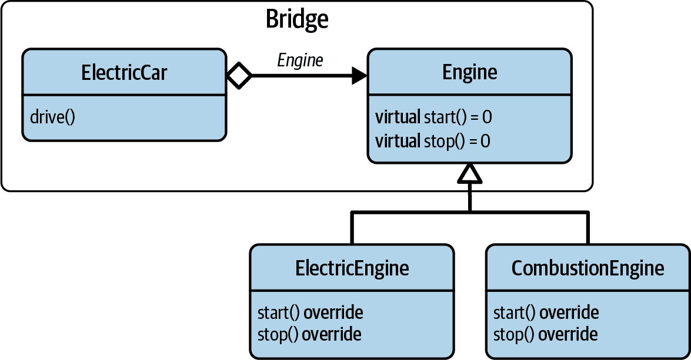
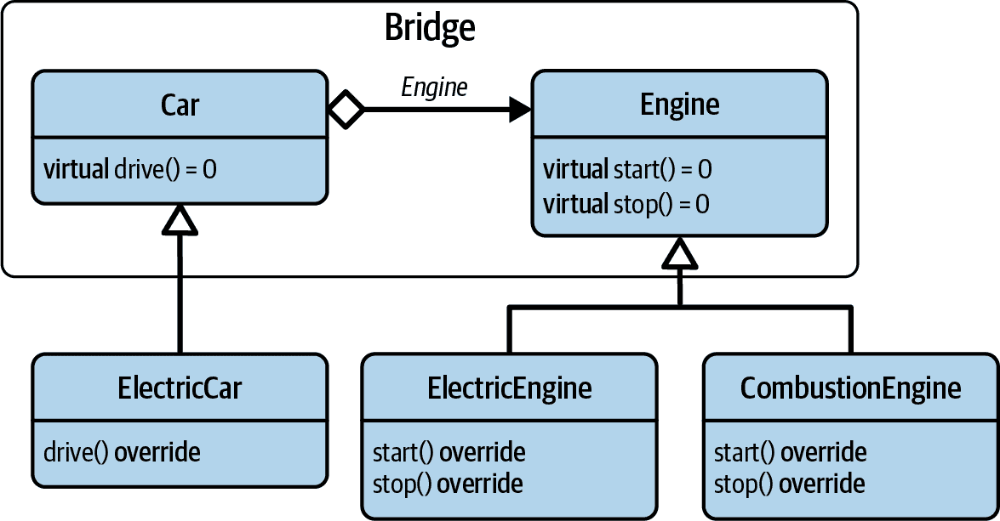
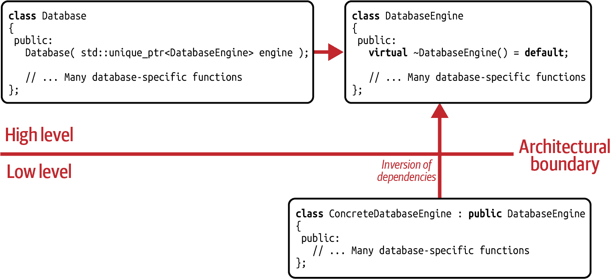
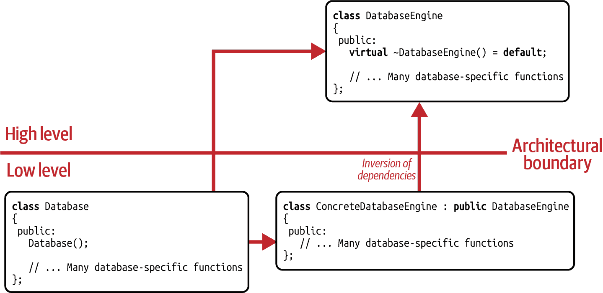
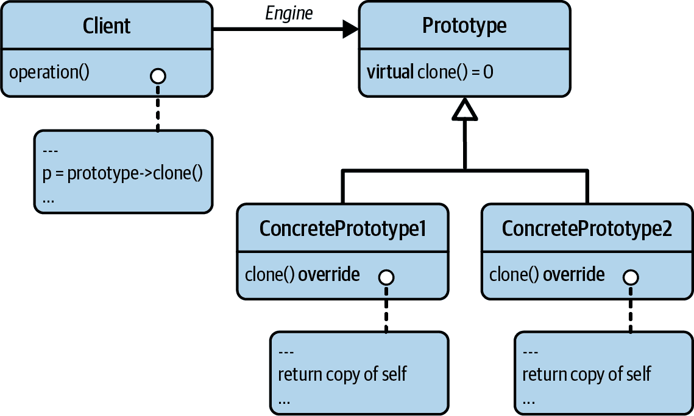
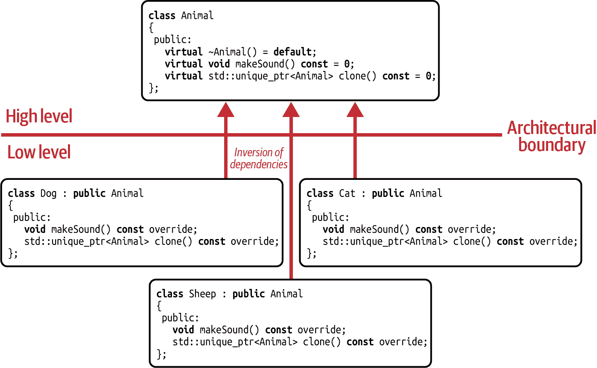
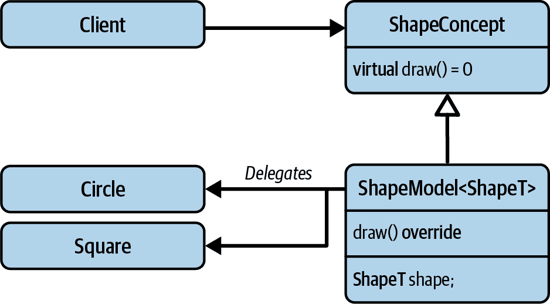
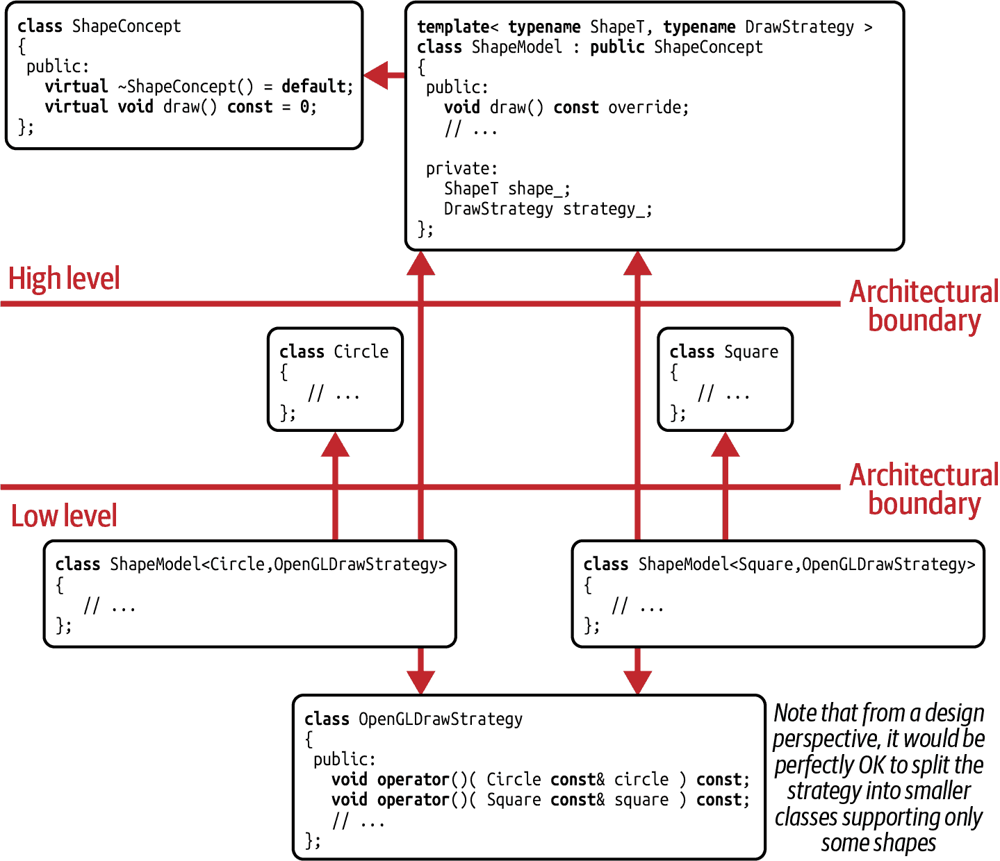

# 第七章 桥梁、原型和外部多态性设计模式

在本章中，我们将重点研究两个经典的 GoF 设计模式：桥梁设计模式和原型设计模式。此外，我们还将研究*外部多态性*设计模式。乍一看，这个选择可能看起来是一个名声显赫、几乎随机选择的设计模式。然而，我选择这些模式有两个原因：首先，在我的经验中，这三种模式在设计模式目录中是最有用的。因此，您应该对它们的意图、优点和缺点有一个相当好的理解。其次，同样重要的是：它们都将在第八章中发挥至关重要的作用。

在“Guideline 28: 构建桥梁以消除物理依赖”中，我将向您介绍桥接设计模式及其最简形式，*Pimpl idiom*。更重要的是，我将演示如何通过桥梁来减少物理耦合，将接口与实现细节解耦。

在“Guideline 29: 注意桥梁的性能优劣”中，我们将明确看一下桥梁的性能影响。我们将为没有桥梁的实现、基于桥梁的实现和“部分”桥梁运行基准测试。

在“Guideline 30: 用于抽象复制操作的原型模式”中，我将介绍克隆的艺术。换句话说，我们将讨论复制操作，特别是抽象复制操作。这个意图的模式选择将是原型设计模式。

在“Guideline 31: 使用外部多态性进行非侵入式运行时多态性”中，我们继续通过将函数的实现细节从类中提取来分离关注点的旅程。为了进一步减少依赖，我们将把这种关注点分离提升到一个全新的层次：我们不仅将提取虚函数的实现细节，还将使用外部多态性设计模式提取完整的函数本身。

# Guideline 28: 构建桥梁以消除物理依赖

根据词典的定义，术语 *bridge* 表示时间、地点或连接或过渡的手段。如果我问你 *bridge* 这个词对你意味着什么，我相信你会有类似的定义。你可能会心里想着连接两个东西，从而使它们更加接近。例如，你可能会想到一座被河流分隔的城市。一座桥将连接城市的两岸，使它们更加接近，并节省人们大量的时间。你也可能想到电子学中，桥连接电路的两个独立部分。在音乐中也有桥梁，还有许多来自现实世界的例子，桥梁帮助连接事物。是的，直观地看，*bridge* 这个词暗示着增加接近和亲近感。因此，桥梁设计模式恰恰相反：它支持你减少物理依赖关系，并帮助解耦，即保持需要共同工作但不应了解彼此太多细节的两个功能部件保持一定距离。

## 一个激励的例子

为了说明我的想法，请考虑以下 `ElectricCar` 类：

```cpp
//---- <ElectricEngine.h> ---------------- 
class ElectricEngine
{
 public:
   void start();
   void stop();

 private:
   // ... };

//---- <ElectricCar.h> ---------------- 
#include <ElectricEngine.h>
// ... 
class ElectricCar
{
 public:
   ElectricCar( /*maybe some engine arguments*/ );

   void drive();
   // ...
 private:
   ElectricEngine engine_;  

   // ... more car-specific data members (wheels, drivetrain, ...) };

//---- <ElectricCar.cpp> ---------------- 
#include <ElectricCar.h>

ElectricCar::ElectricCar( /*maybe some engine arguments*/ )
   : engine_{ /*engine arguments*/ }
   // ... Initialization of the other data members {}

// ... 
```

正如其名称所示，`ElectricCar` 类配备了一个 `ElectricEngine` ()。然而，尽管在现实中这样的汽车可能非常吸引人，当前的实现细节令人担忧：因为 `engine_` 数据成员的存在，`<ElectricCar.h>` 头文件需要包含 `<ElectricEngine.h>` 头文件。编译器需要看到 `ElectricEngine` 类的定义，否则将无法确定 `ElectricCar` 实例的大小。然而，包含 `<ElectricEngine.h>` 头文件很容易导致传递性的物理耦合：每个包含 `<ElectricCar.h>` 头文件的文件都将直接依赖 `<ElectricEngine.h>` 头文件。因此，每当头文件发生变化时，`ElectricCar` 类及可能还有其他许多类都会受到影响。它们可能需要重新编译、重新测试，甚至在最坏的情况下重新部署……*叹气*。

除此之外，这种设计向所有人揭示了所有的实现细节。“你是什么意思？`private` 部分不是用来隐藏和封装实现细节的吗？” 是的，它可能是 `private` 的，但 `private` 标签仅仅是一个访问标签。它不是一个可见性标签。因此，你类定义中的一切（我是说*一切*）对所有看到 `ElectricCar` 类定义的人都是可见的。这意味着你不能在没有任何人注意的情况下更改此类的实现细节。特别是在需要提供 ABI 稳定性时可能会有问题，即如果你的类的内存表示不能改变的话。¹

一个稍微好一点的方法是仅存储到 `ElectricEngine` 的指针 ()：²

```cpp
//---- <ElectricCar.h> ---------------- 
#include <memory>
// ... struct ElectricEngine;  // Forward declaration 
class ElectricCar
{
 public:
   ElectricCar( /*maybe some engine arguments*/ );

   void drive();
   // ...
 private:
   std::unique_ptr<ElectricEngine> engine_;  

   // ... more car-specific data members (wheels, drivetrain, ...) };

//---- <ElectricCar.cpp> ---------------- 
#include <ElectricCar.h>
#include <ElectricEngine.h>  

ElectricCar::ElectricCar( /*maybe some engine arguments*/ )
   : engine_{ std::make_unique<ElectricEngine>( /*engine arguments*/ ) }
   // ... Initialization of the other data members {}

// ... Other 'ElectricCar' member functions, using the pointer to an //     'ElectricEngine'. 
```

在这种情况下，只需为`ElectricEngine`类提供前向声明即可，因为编译器不需要知道类定义就能确定`ElectricCar`实例的大小。此外，物理依赖已经消失，因为`<ElectricEngine.h>`头文件已经移动到源文件中（）。因此，从依赖性的角度来看，这种解决方案要好得多。仍然存在的是实现细节的可见性。每个人仍然能看到`ElectricCar`依赖于`ElectricEngine`，因此每个人仍然隐式依赖于这些实现细节。因此，对这些细节的任何更改，比如升级到新的`PowerEngine`，都会影响与`<ElectricCar.h>`头文件一起工作的任何类。“这不好，对吧？”确实如此，因为预计会发生变化（见“指导原则 2：为变化设计”）。为了摆脱这种依赖性并获得在任何时候轻松更改实现细节的便利性而不被任何人察觉，我们必须引入一个抽象层。抽象的经典形式是引入抽象类：

```cpp
//---- <Engine.h> ---------------- 
class Engine  
{
 public:
   virtual ~Engine() = default;
   virtual void start() = 0;
   virtual void stop() = 0;
   // ... more engine-specific functions 
 private:
   // ... };

//---- <ElectricCar.h> ---------------- 
#include <Engine.h>
#include <memory>

class ElectricCar
{
 public:
   void drive();
   // ...
 private:
   std::unique_ptr<Engine> engine_;  

   // ... more car-specific data members (wheels, drivetrain, ...) };

//---- <ElectricEngine.h> ---------------- 
#include <Engine.h>

class ElectricEngine : public Engine
{
 public:
   void start() override;
   void stop() override;

 private:
   // ... };

//---- <ElectricCar.cpp> ---------------- 
#include <ElectricCar.h>
#include <ElectricEngine.h>

ElectricCar::ElectricCar( /*maybe some engine arguments*/ )
   : engine_{ std::make_unique<ElectricEngine>( /*engine arguments*/ ) }  
   // ... Initialization of the other data members {}

// ... Other 'ElectricCar' member functions, primarily using the 'Engine' //     abstraction, but potentially also explicitly dealing with an //     'ElectricEngine'. 
```

有了`Engine`基类的基础（），我们可以使用这个抽象来实现我们的`ElectricCar`类（）。没有人需要知道我们使用的引擎的实际类型。也没有人需要知道我们何时升级我们的引擎。通过这种实现，我们可以随时只通过修改源文件（）轻松更改实现细节。因此，采用这种方法，我们真正减少了对`ElectricEngine`实现的依赖。我们已经使得这个细节的知识成为我们自己的、秘密的实现细节。通过这样做，我们建立了一个桥梁。

###### 注意

正如介绍中所述，与其说这个桥梁是为了让`ElectricCar`和`Engine`类更接近，不如说它是关于分离关注点和松耦合。另一个显示出[naming is hard](https://oreil.ly/YfDpP)的例子来自 Kate Gregory 在 CppCon 的演讲。

## 解释桥梁设计模式

桥接设计模式是 1994 年引入的另一个经典 GoF 设计模式。桥梁的目的是通过封装某些实现细节在抽象后最小化物理依赖。在 C++中，它充当编译防火墙，便于变更：

# 桥梁设计模式

意图：“将抽象与其实现分离，使得它们可以独立变化。”³

在这个意图的表述中，四人组谈到了“抽象”和“实现”。在我们的例子中，`ElectricCar` 类表示“抽象”，而 `Engine` 类表示“实现”（见图 7-1）。这两者应该能够独立变化；即对任何一个的修改不应影响另一个。造成易于修改的障碍是 `ElectricCar` 类与其引擎之间的物理依赖。因此，理念是提取并隔离这些依赖关系。通过在 `Engine` 抽象中隔离它们，分离关注点，并满足 SRP，你获得了改变、调整或升级引擎的灵活性（见“准则 2：设计用于变更”）。现在在 `ElectricCar` 类中不再显露这种改变。因此，现在很容易添加新类型的引擎而不被“抽象”察觉。这符合 OCP 的理念（见“准则 5：设计用于扩展”）。



###### 图 7-1\. 基本桥接设计模式的 UML 表示

虽然这使我们能够轻松应用更改，并实现桥接的概念，但我们还可以进一步解耦和减少重复。假设我们不仅对电动车感兴趣，还对燃烧引擎车感兴趣。因此，对于我们计划实现的每种车辆，我们都有兴趣引入与引擎详细信息的相同解耦，即相同类型的桥接。为了减少重复并遵循 DRY 原则，我们可以将与桥接相关的实现细节提取到 `Car` 基类中（见图 7-2）。



###### 图 7-2\. 完整桥接设计模式的 UML 表示

`Car` 基类封装了与关联引擎的桥接。

```cpp
//---- <Car.h> ---------------- 
#include <Engine.h>
#include <memory>
#include <utility>

class Car
{
 protected:
   explicit Car( std::unique_ptr<Engine> engine )  
      : pimpl_( std::move(engine) )
   {}

 public:
   virtual ~Car() = default;
   virtual void drive() = 0;
   // ... more car-specific functions 
 protected:
   Engine*       getEngine()       { return pimpl_.get(); }  
   Engine const* getEngine() const { return pimpl_.get(); }

 private:
   std::unique_ptr<Engine> pimpl_;  // Pointer-to-implementation (pimpl) 

   // ... more car-specific data members (wheels, drivetrain, ...) };

```

加入 `Car` 类之后，“抽象”和“实现”都能轻松扩展并可以独立变化。虽然在这种桥接关系中，`Engine` 基类仍代表“实现”，但 `Car` 类现在扮演“抽象”的角色。`Car` 类的第一个值得注意的细节是其 `protected` 构造函数（）。这个选择确保只有派生类能够指定引擎的类型。构造函数接受 `std::unique_ptr` 到一个 `Engine`，并将其移动到其 `pimpl_` 数据成员中（）。这个指针数据成员是所有 `Car` 类型的 *p*ointer-to-*impl*ementation，并且通常称为 *pimpl*。这个 *opaque pointer* 代表了封装实现细节的桥接，并且本质上代表了整个桥接设计模式。因此，在代码中使用 *pimpl* 作为您意图的指示名称是个好主意（请参考 “Guideline 14: Use a Design Pattern’s Name to Communicate Intent”）。

注意，尽管派生类将会使用它，但 `pimpl_` 被声明在类的 `private` 部分。这个选择是由 [Core Guideline C.133](https://oreil.ly/99sIG) 驱使的：

> 避免使用 `protected` 数据。

实际上，经验表明，`protected` 数据成员几乎不比 `public` 数据成员更好。因此，为了授予对 *pimpl* 的访问权限，`Car` 类改为提供 `protected` 的 `getEngine()` 成员函数（）。

`ElectricCar` 类相应进行了调整：

```cpp
//---- <ElectricCar.h> ---------------- 
#include <Engine.h>
#include <memory>

class ElectricCar : public Car  
{
 public:
   explicit ElectricCar( /*maybe some engine arguments*/ );

   void drive() override;
   // ... };

//---- <ElectricCar.cpp> ---------------- 
#include <ElectricCar.h>
#include <ElectricEngine.h>

ElectricCar::ElectricCar( /*maybe some engine arguments*/ )
   : Car( std::make_unique<ElectricEngine>( /*engine arguments*/ ) )  
{}

// ... 
```

而非实现桥接本身，`ElectricCar` 类现在从 `Car` 基类继承（）。这种继承关系引入了通过指定引擎来初始化 `Car` 基类的要求。这个任务在 `ElectricCar` 构造函数中完成（）。

## Pimpl 惯用法

有一种更简单的桥接设计模式形式在 C 和 C++ 中已经被广泛使用成功数十年。为了看一个例子，让我们考虑以下 `Person` 类：

```cpp
class Person
{
 public:
   // ...
   int year_of_birth() const;
   // ... Many more access functions

 private:
   std::string forename_;
   std::string surname_;
   std::string address_;
   std::string city_;
   std::string country_;
   std::string zip_;
   int year_of_birth_;
   // ... Potentially many more data members
};
```

一个人由许多数据成员组成：`forename`、`surname`、完整的邮政地址、`year_of_birth`，可能还有更多。未来可能需要添加更多数据成员：一个手机号码、一个 Twitter 账号，或者下一个社交媒体热潮的账户信息。换句话说，`Person` 类很可能需要随时间推移而扩展或更改，甚至可能经常这样。对于这个类的用户来说，这可能会带来许多不便：每当 `Person` 更改时，`Person` 的用户都必须重新编译他们的代码。更不用说 ABI 的稳定性：`Person` 实例的大小将会变化！

为了隐藏`Person`实现细节的所有更改并获得 ABI 稳定性，您可以使用桥接设计模式。然而，在这种特定情况下，并不需要提供一个基类的抽象：存在且仅存在一个`Person`的实现。因此，我们只需引入一个称为`Impl`的`private`嵌套类 ()：

```cpp
//---- <Person.h> ---------------- 
#include <memory>

class Person
{
 public:
   // ... 
 private:
   struct Impl;  
   std::unique_ptr<Impl> const pimpl_;  
};

//---- <Person.cpp> ---------------- 
#include <Person.h>
#include <string>

struct Person::Impl  
{
   std::string forename;
   std::string surname;
   std::string address;
   std::string city;
   std::string country;
   std::string zip;
   int year_of_birth;
   // ... Potentially many more data members };

```

嵌套的`Impl`类的唯一任务是封装`Person`的实现细节。因此，`Person`类中仅剩的数据成员是指向`Impl`实例的`std::unique_ptr` ()。所有其他数据成员以及可能的一些非虚拟辅助函数都被移动到`Impl`类中。请注意，`Impl`类仅在`Person`类中声明但未定义。相反，它在相应的源文件中定义 ()。仅仅因为这个原因，您对细节的所有更改，如添加或删除数据成员、更改数据成员类型等，都对`Person`的用户隐藏起来。

这个`Person`的实现使用了桥接设计模式的最简形式：这种本地的、非多态的桥接形式称为[*Pimpl idiom*](https://oreil.ly/7QULb)。它具有桥接模式的所有解耦优势，但尽管简单，仍导致`Person`类的实现稍微复杂一些：

```cpp
//---- <Person.h> ---------------- 
//#include <memory> 
class Person
{
 public:
   // ...
   Person();   
   ~Person();  

   Person( Person const& other );  
   Person& operator=( Person const& other );  

   Person( Person&& other );  
   Person& operator=( Person&& other );  

   int year_of_birth() const;  
   // ... Many more access functions 
 private:
   struct Impl;
   std::unique_ptr<Impl> const pimpl_;
};

//---- <Person.cpp> ---------------- 
//#include <Person.h> //#include <string> 
struct Person::Impl
{
   // ... };

Person::Person()  
   : pimpl_{ std::make_unique<Impl>() }
{}

Person::~Person() = default;  

Person::Person( Person const& other )  
   : pimpl_{ std::make_unique<Impl>(*other.pimpl_) }
{}

Person& Person::operator=( Person const& other )  
{
   *pimpl_ = *other.pimpl_;
   return *this;
}

Person::Person( Person&& other )  
   : pimpl_{ std::make_unique<Impl>(std::move(*other.pimpl_)) }
{}

Person& Person::operator=( Person&& other )  
{
   *pimpl_ = std::move(*other.pimpl_);
   return *this;
}

int Person::year_of_birth() const  
{
   return pimpl_->year_of_birth;
}

// ... Many more Person member functions 
```

`Person`构造函数通过`std::make_unique()`初始化了`pimpl_`数据成员 ()。当然，这涉及动态内存分配，这意味着需要再次清理动态内存。“这就是为什么我们使用`std::unique_ptr`”，你说道。正确。但或许令人惊讶的是，尽管我们为此目的使用了`std::unique_ptr`，仍然需要手动处理析构函数 ()。

“我们到底为什么要这么做？`std::unique_ptr` 的目的不是避免处理清理吗？”事实上，我们还是需要处理清理工作。让我来解释一下：如果你不写析构函数，编译器会觉得有义务为你生成析构函数。不幸的是，它会在 `<Person.h>` 头文件中生成析构函数。`Person` 类的析构函数会触发 `std::unique_ptr` 数据成员的析构函数实例化，这又需要 `Impl` 类的析构函数定义。然而，`Impl` 的定义在头文件中是不可用的。相反，它需要在源文件中定义，否则会违背桥接的初衷。因此，编译器会报告关于不完整类型 `Impl` 的错误。幸运的是，你不必放弃 `std::unique_ptr` 来解决这个问题（事实上，你*不应该*放弃它）。问题解决起来相当简单。你只需将 `Person` 的析构函数定义移到源文件中：在类定义中声明析构函数，然后在源文件中通过 `=default` 进行定义。

由于 `std::unique_ptr` 不能被复制，你需要实现复制构造函数以保持 `Person` 类的复制语义（）。对于复制赋值运算符也是如此（）。请注意，该运算符的实现基于这样一个假设：每个 `Person` 实例始终有一个有效的 `pimpl_`。这一假设解释了移动构造函数的实现方式：它不仅仅是移动 `std::unique_ptr`，而是使用 `std::make_unique()` 进行可能失败或抛出异常的动态内存分配。因此，它*不*声明为 `noexcept`（）。这一假设也解释了为什么 `pimpl_` 数据成员被声明为 `const`。一旦初始化，指针将不再更改，即使在移动赋值运算符中也是如此（）。

最后值得注意的细节是，`year_of_birth()` 成员函数的定义位于源文件中（）。尽管这个简单的获取函数是一个很好的 `inline` 候选，但是定义必须移到源文件中。原因在于，在头文件中，`Impl` 是一个[不完整类型](https://oreil.ly/wg10k)。这意味着在头文件中，你无法访问任何成员（包括数据和函数）。这只能在源文件中实现，或者一般来说，只要编译器知道 `Impl` 的定义。

## 桥接与策略的比较

“我有一个问题，”你说，“我看到桥接（Bridge）和策略（Strategy）设计模式之间有很强的相似之处。我知道你说设计模式有时在结构上非常相似，唯一的区别在于它们的意图。但是这两者之间究竟有什么区别？”⁵ 我理解你的问题。这两者之间的相似性确实有点令人困惑。然而，有一点可以帮助你区分它们：如何初始化相应的数据成员是区分它们的一个强有力的指标。

如果一个类不想知道某些实现细节，因此提供了通过外部传入细节来配置行为的机会（例如通过构造函数或设置函数），那么你很可能在处理策略设计模式。因为灵活配置行为，即减少*逻辑*依赖，是其主要关注点，策略模式属于*行为设计模式*的类别。例如，在下面的代码片段中，`Database` 类的构造函数就是一个显著的标志：

```cpp
class DatabaseEngine
{
 public:
   virtual ~DatabaseEngine() = default;
   // ... Many database-specific functions };

class Database
{
 public:
   explicit Database( std::unique_ptr<DatabaseEngine> engine );
   // ... Many database-specific functions 
 private:
   std::unique_ptr<DatabaseEngine> engine_;
};

// The database is unaware of any implementation details and requests them //   via its constructor from outside -> Strategy design pattern Database::Database( std::unique_ptr<DatabaseEngine> engine )  
   : engine_{ std::move(engine) }
{}

```

实际上，`DatabaseEngine` 的实际类型是从外部传入的（），这使得这个示例成为策略设计模式的一个很好的例子。

图 7-3 展示了这个例子的依赖图。最重要的是，`Database` 类与 `DatabaseEngine` 抽象处于同一架构层次，从而为其他人提供了实现行为的机会（例如通过 `ConcreteDatabaseEngine` 的形式）。由于 `Database` 仅依赖于抽象，因此没有依赖于任何具体的实现。



###### 图 7-3\. 策略设计模式的依赖图

然而，如果一个类了解实现细节但主要希望减少对这些细节的*物理*依赖，那么你很可能在处理桥接设计模式。在这种情况下，类不提供任何从外部设置指针的机会，即指针是一个实现细节并在内部设置。由于桥接设计模式主要关注实现细节的物理依赖而不是逻辑依赖，桥接模式属于*结构设计模式*的类别。例如，考虑以下代码片段：

```cpp
class Database
{
 public:
   explicit Database();
   // ...
 private:
   std::unique_ptr<DatabaseEngine> pimpl_;
};

// The database knows about the required implementation details, but does //   not want to depend too strongly on it -> Bridge design pattern Database::Database()
   : pimpl_{ std::make_unique<ConcreteDatabaseEngine>( /*some arguments*/ ) }  
{}

```

再次，应用桥接设计模式的一个显著标志是：而不是接受外部的引擎，`Database` 类的构造函数知道 `ConcreteDatabaseEngine` 并在内部设置它（）。

图 7-4 展示了 `Database` 示例的桥接实现的依赖图。尤其是，`Database` 类与 `ConcreteDatabaseEngine` 类处于相同的架构级别，并且不留下为其他提供不同实现的机会。这表明，与策略设计模式相比，桥接在逻辑上与特定实现耦合，但通过 `DatabaseEngine` 抽象在物理上是解耦的。



###### 图 7-4\. 桥接设计模式的依赖图

## 分析桥接设计模式的缺点

“我完全理解为什么桥接设计模式在社区中如此流行。它的解耦属性确实非常棒！” 你欣喜地说道。“然而，你一直告诉我每种设计都有其优缺点。我想这里肯定存在性能损耗？” 很好，你记得总会有一些不足之处。当然，桥接设计模式也不例外，尽管它被证明非常有用。是的，你的想法是对的，使用它确实会带来一些性能开销。

桥接模式的第一种开销类型源于桥接引入了额外的间接性：pimpl 指针增加了对实现细节的访问成本。然而，这个指针导致的性能损耗有多大，我将在单独讨论中详细说明，见 “指南 29：注意桥接的性能收益和损失”。然而，这并非性能开销的唯一来源；还有更多。取决于您是否使用抽象层，您可能还需要为虚函数调用开销付出代价。此外，即使是访问数据成员的最简单函数也会因为无法进行内联而增加开销。当然，每次创建基于桥接实现的类的新实例时，还需支付额外的动态内存分配开销。⁶ 最后但并非最不重要的是，您还应考虑引入 pimpl 指针所导致的内存开销。所以，是的，隔离物理依赖并隐藏实现细节并非免费，而是会导致相当大的开销。但这并不应该是通常丢弃桥接方案的理由：一切都是具体问题具体分析。例如，如果底层实现执行缓慢、昂贵的任务（例如系统调用），那么这种开销可能根本无法测量。换句话说，是否使用桥接模式应根据具体情况和性能基准来决定。

此外，您已经看到了实现细节并意识到代码复杂性增加了。由于代码的简洁性和可读性是一种美德，这应该被视为一个缺点。这确实只影响类的内部而不是用户代码。但是，某些细节（例如在源文件中定义析构函数的必要性）可能会让经验不足的开发人员感到困惑。

总之，桥接设计模式是减少物理依赖最有价值和最常用的解决方案之一。但是，您应该意识到桥接引入了开销和复杂性。

# 指南 29：了解桥接的性能优劣

在“指南 28：构建桥梁以消除物理依赖”中，我们详细讨论了桥接设计模式。虽然我想桥接模式的设计和解耦方面给您留下了积极的印象，但我必须提醒您，使用这种模式可能会引入性能损耗。“是的，这让我担忧。性能对我很重要，听起来桥接会带来巨大的性能开销，”您说道。这是一个相当普遍的期待。由于性能至关重要，我确实应该让您了解在使用桥接时需要预期多大的开销。然而，我也应该展示如何明智地使用桥接来改善代码性能。听起来不可思议？好吧，让我向您展示一下。

## 桥接的性能影响

正如在“指南 28：构建桥梁以消除物理依赖”中所讨论的，桥接实现的性能受许多因素影响：通过间接访问、虚拟函数调用、内联、动态内存分配等。由于这些因素以及大量可能的组合，对于桥接会带来多少性能开销，没有确定的答案。简而言之，没有捷径，也没有替代方法，可以为您自己的代码组装一些基准测试并运行它们以评估一个确定的答案。不过，我想要证明的是，通过间接访问确实会有性能损耗，但您仍然可以使用桥接来实际提升性能。

现在让我们开始讨论一下基准测试的概念。为了对指针间接访问的成本有所了解，让我们比较下面两个`Person`类的实现：

```cpp
#include <string>

//---- <Person1.h> ----------------

class Person1
{
 public:
   // ...
 private
   std::string forename_;
   std::string surname_;
   std::string address_;
   std::string city_;
   std::string country_;
   std::string zip_;
   int year_of_birth_;
};
```

`Person1` 结构体表示一种*不*是以桥接方式实现的类型。所有七个数据成员（六个`std::string`和一个`int`）直接是结构体的一部分。总的来说，在 64 位机器上，假设使用 Clang 11.1，则一个`Person1`实例的总大小为 152 字节，而使用 GCC 11.1 则为 200 字节。⁷

另一方面，`Person2` 结构体则采用了 Pimpl 惯用法：

```cpp
//---- <Person2.h> ----------------

#include <memory>

class Person2
{
 public:
   explicit Person2( /*...various person arguments...*/ );
   ~Person2();
   // ...

 private:
   struct Impl;
   std::unique_ptr<Impl> pimpl_;
};

//---- <Person2.cpp> ----------------

#include <Person2.h>
#include <string>

struct Person2::Impl
{
   std::string forename;
   std::string surname;
   std::string address;
   std::string city;
   std::string country;
   std::string zip;
   int year_of_birth;
};

Person2::Person2( /*...various person arguments...*/ )
   : pimpl{ std::make_unique<Impl>( /*...various person arguments...*/ ) }
{}

Person2::~Person2() = default;
```

所有七个数据成员都已移至嵌套的 `Impl` 结构中，并且只能通过 `pimpl` 指针访问。虽然嵌套 `Impl` 结构的总大小与 `Person1` 的大小相同，但 `Person2` 结构的大小仅为 8 字节（假设是 64 位机器）。

###### 注意

通过桥接设计，您可以减少一种类型的大小，有时甚至可以显著减少。例如，如果您想在 `std::variant` 中作为替代使用该类型，这可能非常有价值（参见 “Guideline 17: Consider std::variant for Implementing Visitor”）。

所以让我来概述一下基准测试：我将创建两个包含 25,000 人的 `std::vector`，每个 `std::vector` 对应两种 `Person` 实现中的一种。这个元素数量确保我们超出了底层 CPU 内部缓存的大小（例如，使用 Clang 11.1 是 3.2 MB，使用 GCC 11.1 是 4.2 MB）。所有这些人都被赋予任意的姓名、地址和出生年份，年份范围在 1957 年至 2004 年之间（在写作时，这代表了一个组织中雇员年龄的合理范围）。然后，我们将遍历这两个人的向量各五千次，并每次使用 `std::min_element()` 确定最老的人。由于基准测试的重复性质，结果会显得相当无聊。经过一百次迭代，你会觉得太无聊而不想再看。唯一重要的是看到直接访问数据成员（`Person1`）和间接访问数据成员（`Person2`）之间的性能差异。表 7-1 展示了性能结果，以 `Person1` 实现的性能为标准化结果。

表 7-1\. 不同 `Person` 实现的性能结果（标准化性能）

| Person 实现 | GCC 11.1 | Clang 11.1 |
| --- | --- | --- |
| Person1（无 pimpl） | 1.0 | 1.0 |
| Person2（完整的 Pimpl 习惯用法） | 1.1099 | 1.1312 |

在这个特定的基准测试中，桥接实现导致性能显著下降：对于 GCC 是 11.0%，对于 Clang 是 13.1%。听起来很多！然而，不要对这些数字过于认真：显然，结果严重依赖于实际元素数量、数据成员的实际数量和类型、我们运行的系统，以及基准测试中执行的实际计算。如果更改任何这些细节，数字也会相应更改。因此，这些数字仅表明，由于对数据成员的间接访问，存在一些甚至更多的额外开销。

## 通过部分桥接改善性能

“好吧，但这是一个预期的结果，对吧？我应该从中学到什么？”你问道。嗯，我承认这个基准测试相当具体，不能回答所有问题。但它确实为我们提供了使用桥接来提高性能的机会。如果你仔细看`Person1`的实现，你可能会意识到对于给定的基准测试，可达到的性能是非常有限的：尽管`Person1`的总大小为 152 字节（Clang 11.1）或 200 字节（GCC 11.1），我们只使用了 4 字节，即一个`int`。这被证明是相当浪费和低效的：因为在基于缓存的体系结构中，内存总是以缓存行加载，实际上我们加载的大部分数据根本没有被使用。事实上，几乎*所有*从内存加载的数据都没有被使用：假设缓存行长度为 64 字节，我们只使用了加载数据的约 6%。因此，尽管我们根据所有人的出生年份确定最老的人，这听起来像一个计算密集型操作，实际上我们完全受限于内存：机器根本无法快速传送数据，整数单元大部分时间都会处于空闲状态。

此设置使我们有机会通过桥接来提高性能。假设我们可以区分经常使用的数据（如`forename`、`surname`和`year_of_birth`）和很少使用的数据（例如邮政地址）。基于这一区分，我们现在按照以下方式排列数据成员：所有经常使用的数据成员直接存储在`Person`类中。所有很少使用的数据成员存储在`Impl`结构体内。这导致了`Person3`的实现：

```cpp
//---- <Person3.h> ----------------

#include <memory>
#include <string>

class Person3
{
 public:
   explicit Person3( /*...various person arguments...*/ );
   ~Person3();
   // ...

 private:
   std::string forename_;
   std::string surname_;
   int year_of_birth_;

   struct Impl;
   std::unique_ptr<Pimpl> pimpl_;
};

//---- <Person3.cpp> ----------------

#include <Person3.h>

struct Person3::Impl
{
   std::string address;
   std::string city;
   std::string country;
   std::string zip;
};

Person3::Person3( /*...various person arguments...*/ )
   : forename_{ /*...*/ }
   , surname_{ /*...*/ }
   , year_of_birth_{ /*...*/ }
   , pimpl_{ std::make_unique<Impl>( /*...address-related arguments...*/ ) }
{}

Person3::~Person3() = default;
```

在 Clang 11.1 下，一个`Person3`实例的总大小为 64 字节（两个 24 字节的`std::string`，一个整数，一个指针和由于对齐限制而产生的四个填充字节），在 GCC 11.1 下为 80 字节（两个 32 字节的`std::string`，一个整数，一个指针和一些填充）。因此，`Person3`实例的大小仅为`Person1`实例的约一半。这种大小差异是可测量的：表 7-2 显示了包括`Person3`在内的所有`Person`实现的性能结果，再次对性能进行了标准化。

表 7-2\. 不同`Person`实现的性能结果（性能标准化）

| 人员实现 | GCC 10.3 | Clang 12.0 |
| --- | --- | --- |
| Person1（无 pimpl） | 1.0 | 1.0 |
| Person2（完全 Pimpl 习惯用法） | 1.1099 | 1.1312 |
| Person3（部分 Pimpl 习惯用法） | 0.8597 | 0.9353 |

与`Person1`实现相比，对于`Person3`来说，GCC 11.1 的性能提高了 14.0%，Clang 11.1 提高了 6.5%。而且，正如之前所述，这仅仅是因为我们减少了`Person3`的实现大小。“哇，这真是出乎意料。我明白了，桥梁并不一定对性能完全有害，”你说道。是的，确实如此。当然，这始终取决于具体的设置，但是区分频繁使用的数据成员和不经常使用的数据成员，并通过实现“部分”桥梁来减少数据结构的大小，可能会对性能产生非常积极的影响。⁸

“性能提升非常大，这太棒了，但这是否与桥梁的初衷相悖？”你问道。确实，你意识到隐藏实现细节与为了性能而“内联”数据成员之间存在着一种二元对立。一如既往，这取决于情况：你将不得不在每种情况下决定偏向哪一方面。你希望也意识到，存在两个极端之间的整个解决方案范围：没有必要将*所有*数据成员都隐藏在桥梁后面。最终，你将是为特定问题找到最佳解决方案的那个人。

总之，虽然一般来说桥梁很可能会造成性能损失，但在适当的情况下，实现部分桥梁可能会对性能产生非常积极的影响。然而，这只是影响性能的许多方面之一。因此，你应该始终检查桥梁是否导致性能瓶颈，或者部分桥梁是否正在解决性能问题。确认这一点的最佳方式是通过代表性基准测试，尽可能基于实际代码和实际数据。

# 指导原则 30：应用原型进行抽象复制操作

想象一下自己坐在一个高档意大利餐厅里研究菜单。哦，天啊，他们提供了这么多美味的东西；千层面听起来很不错。但是，他们提供的披萨选择也是令人惊叹的。真难选啊……然而，你的思绪被打断了，因为服务员走过来端着这道看起来令人难以置信的菜肴。不幸的是，这不是为你准备的，而是为另一张桌子上的人。哦哇，那个香味……在这一刻，你知道自己不再需要考虑要吃什么：不管是什么，你都想要一样。所以你点了：“啊，服务员，我要和他们一样的。”

在您的代码中可能会遇到相同的问题。从 C++ 的角度来看，您要求服务员复制另一个人的菜肴。复制对象，即创建一个实例的精确副本，在 C++ 中是一个非常重要的操作。如此重要，以至于类默认配备了复制构造函数和复制赋值运算符——这两个所谓的*特殊成员函数*。⁹ 然而，当要求复制菜肴时，您不幸地不知道是什么菜肴。从 C++ 的角度来看，您只有一个指向基类的指针（比如 `Dish*`）。不幸的是，尝试通过 `Dish*` 使用复制构造函数或复制赋值运算符通常不起作用。但是，您确实希望获得一个精确的副本。这个问题的解决方案是另一个经典的《GoF》设计模式：原型设计模式。

## 一个羊的例子：复制动物

举个例子，让我们考虑下面的 `Animal` 基类：

```cpp
//---- <Animal.h> ----------------

class Animal
{
 public:
   virtual ~Animal() = default;
   virtual void makeSound() const = 0;
   // ... more animal-specific functions
};
```

除了虚析构函数表明 `Animal` 应该是一个基类外，该类仅提供了 `makeSound()` 函数，用于打印可爱的动物声音。其中一个动物的示例是 `Sheep` 类：

```cpp
//---- <Sheep.h> ----------------

#include <Animal.h>
#include <string>

class Sheep : public Animal
{
 public:
   explicit Sheep( std::string name ) : name_{ std::move(name) } {}

   void makeSound() const override;
   // ... more animal-specific functions

 private:
   std::string name_;
};

//---- <Sheep.cpp> ----------------

#include <Sheep.h>
#include <iostream>

void Sheep::makeSound() const
{
   std::cout << "baa\n";
}
```

在 `main()` 函数中，我们现在可以创建一只羊，并让它发出声音：

```cpp
#include <Sheep.h>
#include <cstdlib>
#include <memory>

int main()
{
   // Creating the one and only Dolly
   std::unique_ptr<Animal> const dolly = std::make_unique<Sheep>( "Dolly" );

   // Triggers Dolly's beastly sound
   dolly->makeSound();

   return EXIT_SUCCESS;
}
```

多拉很棒，对吧？而且超级可爱！事实上，她太有趣了，我们想要另一个多拉。然而，我们只有一个指向基类的指针——`Animal*`。我们不能通过 `Sheep` 的复制构造函数或复制赋值运算符进行复制，因为（从技术上讲）我们甚至不知道我们正在处理的是 `Sheep`。它可能是任何类型的动物（例如狗、猫、羊等）。我们不想仅复制 `Sheep` 的 `Animal` 部分，因为这就是我们所说的*切片*。

哦，我刚意识到这可能是一个特别糟糕的例子来解释原型设计模式。切片动物。听起来不好。所以让我们迅速过渡吧。我们在哪儿？啊，是的，我们想要多拉的一个副本，但我们只有一个 `Animal*`。这就是原型设计模式发挥作用的地方。

## 解释原型设计模式

原型设计模式是《四人组》收集的五种创建型设计模式之一。它专注于提供创建某个抽象实体副本的抽象方式。

# 原型设计模式

意图：“使用原型实例指定要创建的对象类型，并通过复制该原型创建新对象。”¹⁰

图 7-5 显示了原始的 UML 表示，摘自《GoF》书籍。



###### 图 7-5\. 原型设计模式的 UML 表示

原型设计模式通常通过基类中的虚拟 `clone()` 函数来实现。考虑更新后的 `Animal` 基类：

```cpp
//---- <Animal.h> ----------------

class Animal
{
 public:
   virtual ~Animal() = default;
   virtual void makeSound() const = 0;
   virtual std::unique_ptr<Animal> clone() const = 0; // Prototype design pattern
};
```

通过这个`clone()`函数，任何人都可以请求给定（原型）动物的抽象副本，而不必知道任何特定类型的动物（`Dog`、`Cat`或`Sheep`）。当`Animal`基类被适当分配到您的架构的高层时，它遵循 DIP（参见图 7-6）。



###### 图 7-6。原型设计模式的依赖图

`clone()`函数声明为纯虚函数，这意味着派生类需要实现它。但是，派生类不能随意实现该函数，而是期望返回自己的精确副本（任何其他结果都将违反 LSP；参见“指南 6：遵循抽象的预期行为”）。此副本通常动态创建并通过指向基类的指针返回。当然，这不仅导致指针，还需要显式`delete`副本。由于在现代 C++中，手动清理被认为是非常糟糕的做法，因此将指针返回为`std::unique_ptr`到`Animal`。¹¹

`Sheep` 类据此进行更新：

```cpp
//---- <Sheep.h> ----------------

#include <Animal.h>

class Sheep : public Animal
{
 public:
   explicit Sheep( std::string name ) : name_{ std::move(name) } {}

   void makeSound() const override;
   std::unique_ptr<Animal> clone() const override;  // Prototype design pattern

 private:
   std::string name_;
};

//---- <Sheep.cpp> ----------------

#include <Sheep.h>
#include <iostream>

void Sheep::makeSound() const
{
   std::cout << "baa\n";
}

std::unique_ptr<Animal> Sheep::clone() const
{
   return std::make_unique<Sheep>(*this);  // Copy-construct a sheep
}
```

现在要求`Sheep` 类实现`clone()`函数并返回`Sheep`的精确副本：在其自己的`clone()`函数内部，它利用了`std::make_unique()`函数和自己的复制构造函数，即使`Sheep` 类未来发生更改，也始终假定会执行正确的操作。这种方法有助于避免不必要的重复，因此遵循 DRY 原则（参见“指南 2：设计变更”）。

请注意，`Sheep` 类既不删除也不隐藏其复制构造函数和复制赋值运算符。因此，如果你有一只羊，仍然可以使用特殊成员函数复制羊。这是完全可以的：`clone()` 仅仅添加了一种创建副本的方法——一种执行`virtual`复制的方法。

有了`clone()`函数，我们现在可以创建多莉的精确副本。我们可以比 1996 年克隆第一只多莉时更轻松地完成这个任务：

```cpp
#include <Sheep.h>
#include <cstdlib>
#include <memory>

int main()
{
   std::unique_ptr<Animal> dolly = std::make_unique<Sheep>( "Dolly" );
   std::unique_ptr<Animal> dollyClone = dolly->clone();

   dolly->makeSound();       // Triggers the first Dolly's beastly sound
   dollyClone->makeSound();  // The clone sounds just like Dolly

   return EXIT_SUCCESS;
}
```

## 比较原型模式和`std::variant`

原型设计模式确实是一个经典的、非常面向对象的设计模式，自 1994 年发布以来，它是提供`virtual`复制的首选解决方案。正因如此，函数名`clone()`几乎可以视为识别原型设计模式的关键字。

由于特定的用例，没有“现代化”的实现（除非稍微更新，使用`std::unique_ptr`替代原始指针）。与其他设计模式相比，也没有值语义的解决方案：一旦我们有一个值，最自然和直观的解决方案将是基于两个复制操作（复制构造函数和复制赋值运算符）进行构建。

“你确定没有值语义的解决方案吗？考虑以下使用`std::variant`的例子：”

```cpp
#include <cstdlib>
#include <variant>

class Dog {};
class Cat {};
class Sheep {};

int main()
{
   std::variant<Dog,Cat,Sheep> animal1{ /* ... */ };

   auto animal2 = animal1;  // Creating a copy of the animal

   return EXIT_SUCCESS;
}
```

“在这种情况下，我们难道不是执行抽象复制操作吗？这个复制操作难道不是由复制构造函数执行的吗？那么这不是原型设计模式的例子，而没有`clone()`函数？” 不，尽管听起来你有一个令人信服的论点，但这不是原型设计模式的例子。我们两个例子之间有一个非常重要的区别：在你的例子中，你有一个封闭的类型集合（典型的访问者设计模式）。`std::variant` `animal1` 包含狗、猫或羊，但没有其他内容。因此，可以使用复制构造函数执行显式复制。在我的例子中，我有一个开放的类型集合。换句话说，我不知道我要复制什么样的动物。它可能是狗、猫或羊，但也可能是大象、斑马或树懒。一切皆有可能。因此，我不能依赖复制构造函数，而只能使用虚拟的`clone()`函数进行复制。

## 分析原型设计模式的缺点

是的，原型设计模式没有值语义的解决方案，但它是引用语义领域的一种典型代表。因此，每当需要应用原型设计模式时，我们必须接受它所带来的一些缺点。

可以说，第一个缺点是由于指针引起的间接性带来的负面性能影响。然而，由于我们只在存在继承层次结构时才需要克隆，认为这是原型模式本身的缺点是不公平的。这更是问题基本设置的结果。由于很难想象另一种没有指针和相关间接性的实现，这似乎是原型设计模式的固有属性。

第二个潜在的缺点是，很多时候，该模式通过动态内存来实现。分配本身以及可能导致的内存碎片化会导致进一步的性能问题。然而，并非要求使用动态内存，您将在“指导方针 33：注意类型擦除的优化潜力”中看到，在某些情况下，您也可以建立在类内存上。不过，这种优化仅适用于少数特殊情况，在大多数情况下，该模式仍然依赖于动态内存。

与执行抽象复制操作的能力相比，少数缺点是很容易接受的。然而，正如在“第 22 条指南：更倾向于值语义而非引用语义”中讨论的那样，如果能用值语义方法替换我们的`Animal`层次结构，这将更简单且更易理解，因此可以避免应用基于引用语义的原型设计模式。但是，每当你遇到需要创建抽象副本的情况时，具有相应`clone()`函数的原型设计模式是正确的选择。

# 指南 31：使用外部多态性进行非侵入式运行时多态性

在“第 2 条指南：面向变更的设计”中，我们看到了关注分离设计原则的巨大好处。在“第 19 条指南：使用策略来隔离事务如何执行”中，我们利用了这一力量，从一组形状中提取了绘图实现细节，采用了策略设计模式。然而，尽管这显著减少了依赖性，并且我们在“第 23 条指南：更倾向于基于值的策略和命令实现”中借助`std::function`现代化了解决方案，但仍然存在一些缺点。特别是，形状类仍然被迫处理`draw()`操作，尽管出于耦合原因，处理实现细节是不可取的。此外，更重要的是，策略方法在提取多个多态操作方面被证明有些不实际。为了进一步减少耦合并从形状中提取多态操作，我们现在继续这一旅程，并将关注分离原则推向一个全新、可能陌生的水平：我们将整体多态行为分离出来。为此，我们将应用外部多态设计模式。

## 外部多态设计模式解释

让我们回到绘制形状的示例以及我们从“第 23 条指南：更倾向于基于值的策略和命令实现”得到的`Circle`类的最新版本：

```cpp
//---- <Shape.h> ---------------- 
class Shape
{
 public:
   virtual ~Shape() = default;

   virtual void draw( /*some arguments*/ ) const = 0;  
};

//---- <Circle.h> ---------------- 
#include <Shape.h>
#include <memory>
#include <functional>
#include <utility>

class Circle : public Shape
{
 public:
   using DrawStrategy = std::function<void(Circle const&, /*...*/)>;  

   explicit Circle( double radius, DrawStrategy drawer )
      : radius_( radius )
      , drawer_( std::move(drawer) )
   {
      /* Checking that the given radius is valid and that
         the given 'std::function' instance is not empty */
   }

   void draw( /*some arguments*/ ) const override  
   {
      drawer_( *this, /*some arguments*/ );
   }

   double radius() const { return radius_; }

 private:
   double radius_;
   DrawStrategy drawer_;
};

```

通过策略设计模式，我们已经克服了对`draw()`成员函数实现细节的初始强耦合（）。我们还基于`std::function`找到了值语义的解决方案（）。然而，`draw()`成员函数仍然是所有从`Shape`基类派生的类的公共接口的一部分，并且所有形状都继承了实现它的义务（）。这是一个明显的不完美：可以说，绘图功能应该是独立的，形状通常不应该知道它们可以被绘制。¹² 事实上，我们已经提取了实现细节，这一论点已经得到了相当的加强。

“好吧，那么，我们就提取`draw()`成员函数，对吗？”你争辩道。你是对的。不过，这乍一看似乎是一件困难的事情。希望你还记得“指南 15：为类型或操作的添加设计”，在那里我们得出结论，当你主要想要添加类型时，应该首选面向对象的解决方案。从这个角度来看，似乎我们被虚拟的`draw()`函数和`Shape`基类所束缚，后者代表所有形状可用操作的集合，即需求列表。

不过，问题有解决方案。一个相当惊人的解决方案：我们可以使用外部多态设计模式提取完整的多态行为。该模式在 1996 年由 Chris Cleeland、Douglas C. Schmidt 和 Timothy H. Harrison 的论文中首次提出。¹³ 它的目的是使非多态类型（没有单一虚函数的类型）能够进行多态处理。

# 外部多态设计模式

意图：“允许 C++中不通过继承关系和/或没有虚方法的类以多态方式对待。这些无关的类可以被使用它们的软件以一种常见的方式处理。”

图 7-7 首次展示了设计模式如何实现这一目标的第一印象。最引人注目的细节之一是不再有`Shape`基类。在外部多态设计模式中，不同类型的形状（`Circle`、`Square`等）被假定为简单的非多态类型。此外，形状不需要了解绘图的任何信息。设计模式并未要求形状继承自`Shape`基类，而是引入了`ShapeConcept`和`ShapeModel`类的独立继承层次结构。该外部层次结构通过引入所有预期形状的操作和要求，引入了形状的多态行为。



###### 图 7-7\. 外部多态设计模式的 UML 表示

在我们简单的示例中，多态行为仅由`draw()`函数组成。当然，要求集合可能更大（例如`rotate()`、`serialize()`等）。这组虚函数已移至抽象的`ShapeConcept`类中，现在取代了以前的`Shape`基类。主要区别在于具体形状不需要了解`ShapeConcept`，特别是不需要继承它。因此，形状与虚函数集完全解耦。唯一从`ShapeConcept`继承的类是`ShapeModel`类模板。此类为特定类型的形状（如`Circle`、`Square`等）实例化，并充当其包装器。但是，`ShapeModel`本身不实现虚函数的逻辑，而是将请求委托给所需的实现。

“哇，太棒了！我明白了：这个外部层次结构提取了形状的整套虚函数行为。” 是的，完全正确。再次强调，这是关注点分离和 SRP 的一个示例。在这种情况下，完整的多态行为被识别为一个*变化点*，并从形状中提取出来。再次强调，SRP 作为 OCP 的一种促进因素：通过`ShapeModel`类模板，您可以轻松地将任何新的非多态形状类型添加到`ShapeConcept`层次结构中。只要新类型满足所有必需操作即可。

“我真的很印象深刻。不过，我不确定您所说的满足所有必需操作的含义。您能详细说明一下吗？” 当然！我认为当我展示一个具体的代码示例时，其好处将变得清晰起来。因此，让我们使用外部多态设计模式重构形状示例的完整绘制。

## 重新审视形状的绘制

让我们从`Circle`和`Square`类开始：

```cpp
//---- <Circle.h> ----------------

class Circle
{
 public:
   explicit Circle( double radius )
      : radius_( radius )
   {
      /* Checking that the given radius is valid */
   }

   double radius() const { return radius_; }
   /* Several more getters and circle-specific utility functions */

 private:
   double radius_;
   /* Several more data members */
};

//---- <Square.h> ----------------

class Square
{
 public:
   explicit Square( double side )
      : side_( side )
   {
      /* Checking that the given side length is valid */
   }

   double side() const { return side_; }
   /* Several more getters and square-specific utility functions */

 private:
   double side_;
   /* Several more data members */
};
```

这两个类都被简化为基本几何实体。它们完全不具有多态性，即不再有基类，也没有一个虚函数。然而，最重要的是，这两个类完全不知道任何可能引入人为依赖的操作，如绘制、旋转、序列化等。

反而，所有这些功能都是通过`ShapeConcept`基类引入并由`ShapeModel`类模板实现的：¹⁴

```cpp
//---- <Shape.h> ---------------- 
#include <functional>
#include <stdexcept>
#include <utility>

class ShapeConcept
{
 public:
   virtual ~ShapeConcept() = default;

   virtual void draw() const = 0;  

   // ... Potentially more polymorphic operations };

template< typename ShapeT >
class ShapeModel : public ShapeConcept  
{
 public:
   using DrawStrategy = std::function<void(ShapeT const&)>;  

   explicit ShapeModel( ShapeT shape, DrawStrategy drawer )
      : shape_{ std::move(shape) }
      , drawer_{ std::move(drawer) }
   {
      /* Checking that the given 'std::function' is not empty */
   }

   void draw() const override { drawer_(shape_); }  

   // ... Potentially more polymorphic operations 
 private:
   ShapeT shape_;  
   DrawStrategy drawer_;  
};

```

`ShapeConcept`类引入了一个纯虚拟的`draw()`成员函数（参见#code_g31_4）。在我们的示例中，这个虚拟函数代表了形状的整套要求。尽管要求集合很小，但`ShapeConcept`类代表了 LSP 中的经典抽象概念（见“Guideline 6: Adhere to the Expected Behavior of Abstractions”）。这种抽象在`ShapeModel`类模板内部实现（参见#code_g31_5）。值得注意的是，只有`ShapeModel`的实例化类可以继承自`ShapeConcept`；不会有其他类进入这种关系。`ShapeModel`类模板将为每种所需形状实例化，即`ShapeT`模板参数是像`Circle`、`Square`等类型的占位符。请注意，`ShapeModel`存储了相应形状的一个实例（参见#code_g31_6)（组合而非继承；请记住“Guideline 20: Favor Composition over Inheritance”）。它作为一个包装器，为特定形状类型增加了所需的多态行为（在我们的情况下，即`draw()`函数）。

由于`ShapeModel`实现了`ShapeConcept`抽象，它需要为`draw()`函数提供实现。但是，`ShapeModel`本身不需要实现`draw()`的详细内容。相反，它应将绘制请求转发给实际的实现。为此，我们可以再次使用策略设计模式和`std::function`的抽象能力（参见#code_g31_7）。这种选择很好地解耦了绘制的实现细节以及所有必要的绘制数据（颜色、纹理、透明度等），这些数据可以存储在可调用对象内部。因此，`ShapeModel`存储了`DrawStrategy`的一个实例（参见#code_g31_8），并在触发`draw()`函数时使用该策略（参见#code_g31_9）。

策略设计模式和`std::function`并非你唯一的选择。在`ShapeModel`类模板中，你完全可以根据自己的需求实现绘制功能。换句话说，在`ShapeModel::draw()`函数内，你定义了特定形状类型的实际需求。例如，你可以选择转发到`ShapeT`形状的成员函数（不一定要命名为`draw()`！），或者转发到形状的自由函数。你只需确保不对`ShapeModel`或`ShapeConcept`抽象施加人为的要求。无论如何，用于实例化`ShapeModel`的任何类型都必须满足这些要求，以使代码编译通过。

###### 注意

从设计角度来看，基于成员函数构建会对给定类型引入更严格的要求，因此会引入更强的耦合。然而，基于自由函数构建将使您能够反转依赖关系，类似于使用策略设计模式（参见“指南 9：注意抽象拥有权”）。如果您更喜欢自由函数的方法，只需记住“指南 8：理解重载集的语义要求”。

“`ShapeModel`不是初始`Circle`和`Square`类的泛化形式吗？这些类也持有`std::function`实例？”是的，这是一个很好的认识。确实，您可以说`ShapeModel`在某种程度上是初始形状类的模板化版本。因此，它有助于减少引入策略行为所需的样板代码，并且在设计变更方面改善了实现（参见“指南 2：面向变更设计”）。然而，您获得的远不止这些：例如，由于`ShapeModel`已经是一个类模板，您可以轻松地从当前的运行时策略实现切换到编译时策略实现（即基于策略的设计；参见“指南 19：使用策略隔离事物如何完成”）。

```cpp
template< typename ShapeT
        , typename DrawStrategy >  
class ShapeModel : public ShapeConcept
{
 public:
   explicit ShapeModel( ShapeT shape, DrawStrategy drawer )
      : shape_{ std::move(shape) }
      , drawer_{ std::move(drawer) }
   {}

   void draw() const override { drawer_(shape_); }

 private:
   ShapeT shape_;
   DrawStrategy drawer_;
};

```

而不是依赖于`std::function`，您可以向`ShapeModel`类模板传递一个额外的模板参数，该参数表示绘图策略（参见））。这个模板参数甚至可以有一个默认值：

```cpp
struct DefaultDrawer
{
   template< typename T >
   void operator()( T const& obj ) const {
      draw(obj);
   }
};

template< typename ShapeT
        , typename DrawStrategy = DefaultDrawer >
class ShapeModel : public ShapeConcept
{
 public:
   explicit ShapeModel( ShapeT shape, DrawStrategy drawer = DefaultDrawer{} )
   // ... as before
};
```

与直接应用策略设计模式到`Circle`和`Square`类相比，在这种情况下的编译时方法只有好处，没有任何不利之处。首先，由于减少了运行时间接性（`std::function`的预期性能劣势），您可以获得更好的性能。其次，您不会通过为每个形状类人工增加模板参数来配置绘图行为。现在，您只需为包装器增加绘图行为，并且只需在一个地方完成此操作（这非常好地遵循了 DRY 原则）。第三，您不会通过将常规类转换为类模板来强制额外的代码进入头文件。只有已经是类模板的精简的`ShapeModel`类需要存放在头文件中。因此，您避免了创建额外的依赖关系。

“哇，这个设计模式越来越棒了。这确实是继承和模板的非常引人注目的结合！” 是的，我完全同意。这是结合运行时和编译时多态的典范：`ShapeConcept` 基类提供了所有可能类型的抽象，而派生的 `ShapeModel` 类模板则为特定形状的代码生成提供支持。然而，最令人印象深刻的是，这种组合对于减少依赖关系有着巨大的好处。

查看 图 7-8，显示了我们对外部多态设计模式实现的依赖图。在我们架构的最高级别上是 `ShapeConcept` 和 `ShapeModel` 类，它们共同表示形状的抽象。`Circle` 和 `Square` 是这一抽象的可能实现，但它们完全独立：没有继承关系，没有组合，什么都没有。只有针对特定类型的形状和特定 `DrawStrategy` 实现的 `ShapeModel` 类模板的实例化将所有方面整合在一起。但特别注意，所有这些都发生在我们架构的最低级别上：模板代码在所有依赖关系已知并且“注入”到我们架构的正确级别的点上生成。因此，我们真正拥有合适的架构：所有依赖连接向更高级别运行，几乎自动遵守 DIP 原则。



###### 图 7-8\. *外部多态* 设计模式的依赖图

有了这个功能，我们现在可以自由实现任何所需的绘图行为。例如，我们可以再次使用 OpenGL：

```cpp
//---- <OpenGLDrawStrategy.h> ---------------- 
#include <Circle>
#include <Square>
#include /* OpenGL graphics library headers */

class OpenGLDrawStrategy
{
 public:
   explicit OpenGLDrawStrategy( /* Drawing related arguments */ );

   void operator()( Circle const& circle ) const;  
   void operator()( Square const& square ) const;  

 private:
   /* Drawing related data members, e.g. colors, textures, ... */
};

```

由于 `OpenGLDrawStrategy` 不必继承任何基类，您可以根据需要自由实现它。如果愿意，可以将画圆和画正方形的实现合并到一个类中。这不会创建任何人为的依赖，类似于我们在 “第 19 条指导原则：使用策略隔离操作的执行方式” 中遇到的情况，我们将这些功能合并到了基类中。

###### 注意

注意，将画圆和画正方形结合在一个类中代表与从两个策略基类继承的同一事物。在架构的这个级别上，它不会创建任何人为的依赖，仅仅是一个实现细节。

您唯一需要遵循的约定是为 `Circle`（）和 `Square`（）提供函数调用运算符，因为这是 `ShapeModel` 类模板中定义的调用约定。

在 `main()` 函数中，我们将所有细节整合在一起：

```cpp
#include <Circle.h>
#include <Square.h>
#include <Shape.h>
#include <OpenGLDrawStrategy.h>
#include <memory>
#include <vector>

int main()
{
   using Shapes = std::vector<std::unique_ptr<ShapeConcept>>;  

   using CircleModel = ShapeModel<Circle,OpenGLDrawStrategy>;  
   using SquareModel = ShapeModel<Square,OpenGLDrawStrategy>;  

   Shapes shapes{};

   // Creating some shapes, each one
   //   equipped with an OpenGL drawing strategy
   shapes.emplace_back(
      std::make_unique<CircleModel>(
         Circle{2.3}, OpenGLDrawStrategy(/*...red...*/) ) );
   shapes.emplace_back(
      std::make_unique<SquareModel>(
         Square{1.2}, OpenGLDrawStrategy(/*...green...*/) ) );
   shapes.emplace_back(
      std::make_unique<CircleModel>(
         Circle{4.1}, OpenGLDrawStrategy(/*...blue...*/) ) );

   // Drawing all shapes
   for( auto const& shape : shapes )
   {
      shape->draw();
   }

   return EXIT_SUCCESS;
}

```

再次，我们首先创建一个空的形状向量（这次是 `std::unique_ptr` 的形状向量，类型为 `ShapeConcept`）（），然后添加三种形状。在调用 `std::make_unique()` 时，我们为 `Circle` 和 `Square` 实例化 `ShapeModel` 类（称为 `CircleModel`（）和 `SquareModel`（），以提高可读性），并传递必要的细节（具体形状和相应的 `OpenGLDrawStrategy`）。之后，我们可以以所需的方式绘制所有形状。

总之，这种方法给您带来了许多令人惊叹的优势：

+   通过分离关注点并从形状类型中提取多态行为，您消除了对图形库等的所有依赖。这样做会创建非常松散的耦合，并且非常符合 *SRP* 原则。

+   形状类型变得更简单且非多态。

+   您可以轻松地添加新的形状种类。这些甚至可能是第三方类型，因为您不再需要侵入性地从 `Shape` 基类继承或创建适配器（参见 “指南 24：使用适配器标准化接口”）。因此，您完全符合 OCP 原则。

+   您显著减少了通常与继承相关的样板代码，并且在一个地方实现它，非常好地遵循了 DRY 原则。

+   由于 `ShapeConcept` 和 `ShapeModel` 类彼此关联，并且共同形成抽象概念，因此更容易遵循 DIP 原则。

+   通过利用可用的类模板，减少间接引用的数量，可以提高性能。

还有一个优点，我认为是外部多态设计模式最令人印象深刻的好处：您可以非侵入地为任何类型赋予多态行为。真的，*任何* 类型，甚至是像 `int` 这样简单的类型。为了演示这一点，让我们看一下以下代码片段，假设 `ShapeModel` 装配了一个 `DefaultDrawer`，期望包装类型提供一个自由的 `draw()` 函数：

```cpp
int draw( int i )  
{
   // ... drawing an int, for instance by printing it to the command line }

int main()
{
   auto shape = std::make_unique<ShapeModel<int>>( 42 );  

   shape->draw();  // Drawing the integer 

   return EXIT_SUCCESS;
}

```

我们首先为 `int` 提供一个自由的 `draw()` 函数（）。在 `main()` 函数中，我们现在为 `int` 实例化一个 `ShapeModel`（）。这一行将编译通过，因为 `int` 满足所有要求：它提供了一个自由的 `draw()` 函数。因此，在下一行我们可以“绘制”这个整数（）。

“你真的希望我做这样的事情吗？”你皱着眉头问道。不，我不希望你在家里这样做。请把这看作是技术演示，而不是建议。但尽管如此，这仍然令人印象深刻：我们刚刚非侵入地赋予了一个 `int` 多态行为。确实令人印象深刻！

## 外部多态与适配器之间的比较

“你刚才提到了适配器设计模式，我觉得它与外部多态设计模式非常相似。它们两者有什么区别？” 很好的观点！你提出了克利兰、施密特和哈里森原始论文中也涉及的问题。是的，这两种设计模式确实非常相似，但它们有一个非常明显的区别：适配器设计模式侧重于标准化接口，并将类型或函数适配到现有接口，而外部多态设计模式则创建一个新的外部层次结构，以抽象出一组相关的非多态类型。因此，如果你将某物件适配到现有接口，你（很可能）应用的是适配器设计模式。然而，如果你为了将一组现有类型多态地对待而创建新的抽象，则（很可能）应用的是外部多态设计模式。

## 分析外部多态设计模式的缺点

“我感觉你非常喜欢外部多态设计模式，我猜对了吗？” 你想知道。哦是的，确实如此，我对这种设计模式非常着迷。从我的角度来看，这种设计模式对于松耦合非常关键，令人惋惜的是它并不被更广泛地知晓。也许这是因为许多开发者没有完全接受关注点分离，倾向于将所有东西都放在几个类中。尽管我对此兴奋，但我并不希望给人留下外部多态设计模式完美无缺的印象。不，正如之前多次声明的那样，每种设计都有其优点和缺点。对于外部多态设计模式也是如此。

然而，只有一个主要的缺点：外部多态设计模式确实无法实现一个清晰简单的解决方案，绝对不能满足基于值语义的期望。它无法帮助减少指针，无法减少手动分配的数量，也无法降低继承层次的数量，更无法简化用户代码。相反，由于需要显式实例化`ShapeModel`类，用户代码可能会稍微复杂一些。然而，如果你认为这是一个严重的缺点，或者如果你在考虑“这应该以某种方式自动化”，那么我有一个非常好的消息：在“指南 32：考虑用类型擦除替代继承层次”中，我们将看一看现代 C++解决方案，它会优雅地解决这个问题。

除此之外，我只有两个提醒，作为警告的话语。首先要记住的是，外部多态的应用并不能免除你思考适当抽象的必要性。`ShapeConcept` 基类与任何其他基类一样受到接口隔离原则的影响。例如，我们可以轻松地将外部多态应用到来自“指导原则 3：分离接口以避免人为耦合”的 `Document` 示例中：

```cpp
class DocumentConcept
{
 public:
   // ...
   virtual ~Document() = default;

   virtual void exportToJSON( /*...*/ ) const = 0;
   virtual void serialize( ByteStream& bs, /*...*/ ) const = 0;
   // ...
};

template< typename DocumentT >
class DocumentModel
{
 public:
   // ...
   void exportToJSON( /*...*/ ) const override;
   void serialize( ByteStream& bs, /*...*/ ) const override;
   // ...

 private:
   DocumentT document_;
};
```

`DocumentConcept` 类扮演 `ShapeConcept` 基类的角色，而 `DocumentModel` 类模板则扮演 `ShapeModel` 类模板的角色。然而，这种外部化的层次结构展示了与原始层次结构相同的问题：对于仅需要 `exportToJSON()` 功能的所有代码，它引入了对 `ByteStream` 的人为依赖：

```cpp
void exportDocument( DocumentConcept const& doc )
{
   // ...
   doc.exportToJSON( /* pass necessary arguments */ );
   // ...
}
```

正确的方法应该通过将接口分离为 JSON 导出和序列化的两个正交方面来分离关注点：

```cpp
class JSONExportable
{
 public:
   // ...
   virtual ~JSONExportable() = default;

   virtual void exportToJSON( /*...*/ ) const = 0;
   // ...
};

class Serializable
{
 public:
   // ...
   virtual ~Serializable() = default;

   virtual void serialize( ByteStream& bs, /*...*/ ) const = 0;
   // ...
};

template< typename DocumentT >
class DocumentModel
   : public JSONExportable
   , public Serializable
{
 public:
   // ...
   void exportToJSON( /*...*/ ) const override;
   void serialize( ByteStream& bs, /*...*/ ) const override;
   // ...

 private:
   DocumentT document_;
};
```

任何仅对 JSON 导出感兴趣的函数现在可以专门要求该功能：

```cpp
void exportDocument( JSONExportable const& exportable )
{
   // ...
   exportable.exportToJSON( /* pass necessary arguments */ );
   // ...
}
```

第二点要注意的是，外部多态和适配器设计模式一样，使得包装不符合语义期望的类型变得非常容易。类似于在“指导原则 24：使用适配器标准化接口”中的鸭子类型示例，我们假装一只火鸡是一只鸭子，同样假装一个 `int` 是一个形状。我们只需要提供一个自由的 `draw()` 函数来满足需求。简单。也许太简单了。因此，请记住，用于实例化 `ShapeModel` 类模板（例如 `Circle`、`Square` 等）的类 *必须* 遵循 LSP。毕竟，`ShapeModel` 类只是一个包装器，将 `ShapeConcept` 类定义的要求传递给具体的形状。因此，具体的形状负责正确实现预期的行为（参见“指导原则 6：遵循抽象的预期行为”）。任何未能完全满足期望的行为可能会导致（潜在的微妙）不正确行为。不幸的是，由于这些要求已被外部化，因此更难传达预期的行为。

然而，在`int`示例中，说实话，也许是我们自己的错。也许`ShapeConcept`基类并不真正代表形状的抽象。可以合理地争论说形状不仅仅是绘制。也许我们应该将这种抽象命名为`Drawable`，这样 LSP 就会得到满足。也许不会。因此，最终一切都取决于抽象的选择。这又让我们回到了第二章的标题：“构建抽象的艺术”。不，这并不容易，但也许这些例子表明这是重要的。非常重要。这可能是软件设计的本质。

总结一下，尽管外部多态设计模式可能无法满足你对简单或基于值的解决方案的期望，但必须考虑它作为解耦软件实体的重要一步。从减少依赖性的角度来看，这种设计模式似乎是松耦合的关键组成部分，并且是分离关注点能力的一个奇妙例子。它还给我们一个关键的洞察力：使用这种设计模式，你可以非侵入式地为任何类型提供多态行为，例如虚函数，因此*任何*类型都可以表现出多态性，即使是简单的值类型如`int`。这种认识打开了一个全新而激动人心的设计空间，我们将在下一章继续探索。

¹ ABI 稳定性是 C++社区中一个重要且经常争论的话题，特别是在 C++20 发布前。如果你对此感兴趣，我推荐听一下 CppCast 采访[Titus Winters](https://oreil.ly/8rgkm)和[Marshall Clow](https://oreil.ly/R1XYJ)，以了解双方的看法。

² 请记住，`std::unique_ptr`不能被复制。因此，从`ElectricEngine`切换到`std::unique_ptr<ElectricEngine>`会使你的类成为不可复制的。为了保持复制语义，你必须手动实现复制操作。在这样做时，请记住复制操作会禁用移动操作。换句话说，请坚持遵循[五法则](https://oreil.ly/fzS3f)。

³ Erich Gamma 等人，《设计模式：可复用面向对象软件的元素》。

⁴ 通常，移动操作预期是`noexcept`的。这由[核心指导方针 C.66](https://oreil.ly/luKRb)解释。然而，有时这可能不可能，例如，假设某些`std::unique_ptr`数据成员从不是`nullptr`。

⁵ 请参阅“指导方针 11：理解设计模式的目的”，了解我关于设计模式结构相似性的看法。

⁶ 如果动态分配证明是一个严重的障碍或不使用桥梁的原因，您可以考虑快速 Pimpl 模式，它基于类内存。为此，您可以参考 Herb Sutter 的第一本书：《Exceptional C++: 47 Engineering Puzzles, Programming Problems, and Exception-Safety Solutions》（Pearson）。

⁷ `Person1` 的大小差异可以轻松地解释为不同编译器中 `std::string` 实现的大小不同。因为编译器供应商针对不同的用例优化 `std::string`，在 Clang 11.1 上，单个 `std::string` 占用 24 字节，在 GCC 11.1 上则占用 32 字节。因此，在 Clang 11.1 下，一个 `Person1` 实例的总大小为 152 字节（六个 24 字节的 `std::string`，加上一个 4 字节的 `int`，再加上 4 字节的填充），而在 GCC 11.1 下为 200 字节（六个 32 字节的 `std::string`，加上一个 4 字节的 `int`，再加上 4 字节的填充）。

⁸ 您可能已经意识到我们仍然 *远* 未达到最佳性能。为了朝着最佳性能的方向发展，我们可以根据数据使用情况来安排数据。对于此基准测试，这意味着将所有人的`year_of_birth`值存储在一个大的静态整数向量中。这种数据排列方式将使我们朝向 *面向数据的设计* 的方向前进。有关此范式的更多信息，请参阅 Richard Fabian 关于此主题的书籍，《Data-Oriented Design: Software Engineering for Limited Resources and Short Schedules》。

⁹ 当编译器生成这两个复制操作的规则超出了本书的范围，但是这里有一个简短的总结：*每个*类都有这两个操作，这意味着它们总是存在。它们由编译器生成，或者您已经显式声明或甚至定义了它们（可能位于类的`private`部分或通过`=delete`），或者它们被隐式删除。请注意，删除这些函数并不意味着它们不存在，但`=delete`作为一种定义。由于这两个函数 *总是* 是类的一部分，它们将 *始终* 参与重载决议。

¹⁰ Erich Gamma 等人，《设计模式：可复用面向对象软件的基本元素》。

¹¹ [核心指南 R.3](https://oreil.ly/YeCHE) 明确指出，原始指针（`T*`）是非拥有的。从这个角度来看，甚至返回一个指向基类的原始指针都是不正确的。然而，这意味着你不能再直接利用协变返回类型的语言特性了。如果这是可取或必需的，一个常见的解决方案是遵循模板方法设计模式，将 `clone()` 函数拆分为一个返回原始指针的 `private virtual` 函数，以及一个调用私有函数并返回 `std::unique_ptr` 的 `public` 非 `virtual` 函数。

¹² 参见“指南 2：面向变化的设计”，其中包含一个不同类型文档的类似示例。

¹³ Chris Cleeland, Douglas C. Schmidt 和 Timothy H. Harrison，《外部多态性——一种透明扩展 C++ 具体数据类型的对象结构模式》，第三届编程语言模式会议论文集，伊利诺伊州奥勒顿公园，1996 年 9 月 4-6 日。

¹⁴ 名称 `Concept` 和 `Model` 是基于类型擦除设计模式中的常见术语选择的，外部多态性在其中起到重要作用；详见第八章。
