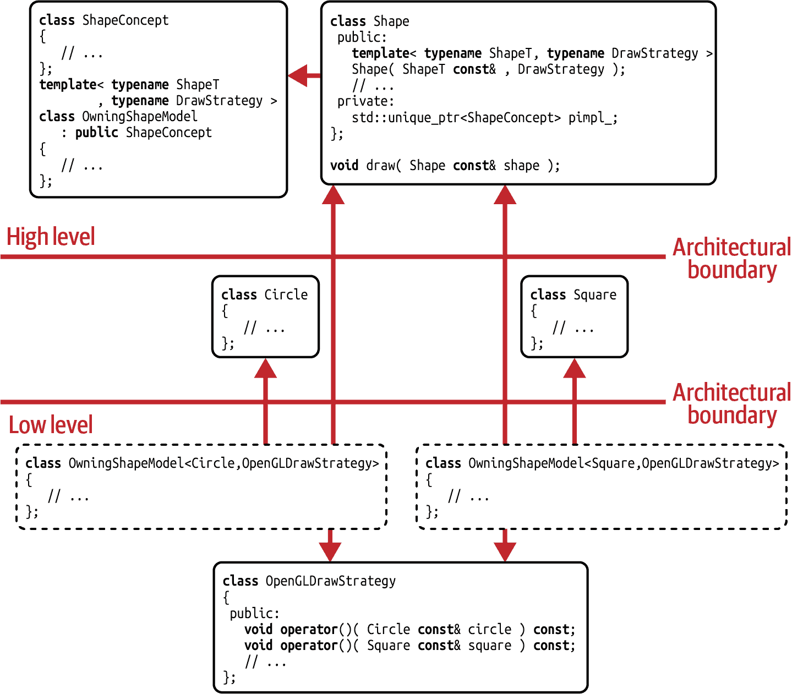
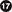

# 第八章：类型擦除设计模式

分离关注点和值语义是本书的两个重要收获，我已经多次提到过。在本章中，这两者被美妙地结合成为现代 C++设计模式中最有趣的之一：类型擦除。由于这种模式可以被认为是最热门的选项之一，本章将非常详细地介绍类型擦除的各个方面。当然，这包括所有与设计相关的方面以及大量的实现细节。

在“指南 32：考虑使用类型擦除替代继承层次结构”，我将向您介绍类型擦除，并让您了解为何这种设计模式如此出色地结合了依赖项减少和值语义。我还将带您走过一个基本的拥有型类型擦除实现。

“指南 33：了解类型擦除的优化潜力”是一个例外：尽管在本书中我主要关注依赖和设计方面，但在这一指南中我将完全专注于与性能相关的实现细节。我将向您展示如何应用*小缓冲区优化（SBO）*以及如何实现手动虚分派来加速您的类型擦除实现。

在“指南 34：了解拥有型类型擦除包装器的设置成本”，我们将调查拥有型类型擦除实现的设置成本。我们将发现，与值语义相关联的成本有时可能是我们不愿支付的。因此，我们敢于踏入引用语义的领域，并实现一种非拥有型类型擦除形式。

# 指南 32：考虑使用类型擦除替代继承层次结构

在本书中有几个反复出现的建议：

+   最小化依赖。

+   分离关注点。

+   更倾向于组合而非继承。

+   倾向于非侵入性的解决方案。

+   更倾向于值语义而非引用语义。

单独使用，所有这些对您的代码质量都有非常积极的影响。然而，这些指南的组合证明要好得多。这就是我们在关于“第 31 条指南：使用外部多态性进行非侵入式运行时多态性”的讨论中所经历的。提取多态行为被证明是极其强大的，并解锁了前所未有的松散耦合水平。然而，可能令人失望的是，外部多态性的演示实现并没有让你觉得是解决问题的现代方式。与其遵循更倾向于值语义的建议，该实现坚定地建立在引用语义上：许多指针、许多手动分配和手动生命周期管理。¹因此，你等待的缺失细节是基于值语义的外部多态性设计模式实现。我不会再让你等待了：得到的解决方案通常被称为*类型擦除*。²

## 类型擦除的历史

在我详细介绍之前，让我们快速谈谈类型擦除的历史。“来吧”，你反驳道。“这真的有必要吗？我渴望最终看到这些东西如何工作。”好吧，我承诺简短地介绍一下。但是是的，我认为这对于我们讨论的这个问题是必要的细节，有两个原因。首先，要证明我们作为一个社区，除了最有经验的 C++专家圈子之外，可能已经忽视和忽略了这种技术太久了。其次，要给这项技术的发明者一些应得的赞赏。

类型擦除设计模式通常归功于最早的、因此也是最著名的这种技术的演示之一。在 2013 年的 GoingNative 会议上，Sean Parent 做了一个名为“继承是邪恶的基类”的演讲³，回顾了他在开发 Photoshop 过程中的经验，并讨论了基于继承的实现的危险和缺点。然而，他还提出了解决继承问题的方法，后来被称为类型擦除。

尽管肖恩的讲话是第一个被记录下来的关于类型擦除的讲话，因此可能是最著名的资源之一，但这种技术早在那之前就已经被使用了。例如，类型擦除在[*Boost*库](https://www.boost.org)中的几个地方都有使用，例如，Douglas Gregor 为[`boost::function`](https://oreil.ly/XslzJ)使用了它。尽管据我所知，该技术首次在*Kevlin Henney*于 2000 年 7-8 月刊登在*C++ Report*上的一篇文章中进行了讨论。⁴ 在这篇文章中，Kevlin 用一个代码示例演示了类型擦除，后来演变为我们今天所知的 C++17 的`std::any`。最重要的是，他是第一个巧妙地结合多个设计模式来形成基于值语义的实现，围绕一组不相关的非多态类型。

从那时起，许多常见类型已经采用了该技术，为各种应用程序提供值类型。其中一些类型甚至已经进入了标准库。例如，我们已经见过`std::function`，它代表了一个可调用对象的基于值的抽象。⁵ 我已经提到过`std::any`，它表示几乎任何东西的抽象容器状值（因此得名），但不暴露任何功能：

```cpp
#include <any>
#include <cstdlib>
#include <string>
using namespace std::string_literals;

int main()
{
   std::any a;          // Creating an empty 'any'
   a = 1;               // Storing an 'int' inside the 'any';
   a = "some string"s;  // Replacing the 'int' with a 'std::string'

   // There is nothing we can do with the 'any' except for getting the value back
   std::string s = std::any_cast<std::string>( a );

   return EXIT_SUCCESS;
}
```

还有`std::shared_ptr`，它使用类型擦除来存储分配的删除器：

```cpp
#include <cstdlib>
#include <memory>

int main()
{
   {
      // Creating a 'std::shared_ptr' with a custom deleter
      //   Note that the deleter is not part of the type!
      std::shared_ptr<int> s{ new int{42}, [](int* ptr){ delete ptr; } };
   }
   // The 'std::shared_ptr' is destroyed at the end of the scope,
   //   deleting the 'int' by means of the custom deleter.

   return EXIT_SUCCESS;
}
```

“看起来简单的方法就是像`std::unique_ptr`那样为删除器提供第二个模板参数。为什么`std::shared_ptr`不是用同样的方式实现？”你询问道。嗯，`std::shared_ptr`和`std::unique_ptr`的设计出于非常充分的理由是不同的。`std::unique_ptr`的哲学是仅代表最简单的可能是原始指针的包装：它应该像原始指针一样快速，并且应该具有与原始指针相同的大小。因此，不希望将删除器与托管指针一起存储。因此，`std::unique_ptr`设计成这样，对于无状态的删除器，可以避免任何大小的开销。但是，不幸的是，这第二个模板参数很容易被忽视，并引起人为的限制：

```cpp
// This function takes only unique_ptrs that use the default deleter,
//   and thus is artificially restricted
template< typename T >
void func1( std::unique_ptr<T> ptr );

// This function does not care about the way the resource is cleaned up,
//   and thus is truly generic
template< typename T, typename D >
void func2( std::unique_ptr<T,D> ptr );
```

这种耦合在`std::shared_ptr`的设计中是避免的。由于`std::shared_ptr`必须在其所谓的控制块中存储许多数据项（包括引用计数、弱引用计数等），因此它有机会使用类型擦除字面上擦除删除器的类型，消除任何可能的依赖关系。

## **类型擦除设计模式的解释**

“哇，这听起来真是令人兴奋。这让我更加期待了解类型擦除。” 好吧，我们开始吧。不过，请不要期望有任何魔法或革命性的新想法。类型擦除只是一个复合设计模式，意味着它是三种其他设计模式非常聪明和优雅的组合。选择的三种设计模式是外部多态（实现解耦效果和类型擦除的非侵入性本质的关键因素；参见“准则 31：使用外部多态实现非侵入式运行时多态”）、桥接（创建基于值语义的实现的关键；参见“准则 28：构建桥梁以消除物理依赖”）和（可选的）原型（处理结果值的复制语义所必需；参见“准则 30：应用原型进行抽象复制操作”）。这三种设计模式构成了类型擦除的核心，但当然要记住，存在不同的解释和实现，主要是为了适应特定的上下文。结合这三种设计模式的目的是创建一个包装类型，该类型代表一个松散耦合的、非侵入性的抽象。

# [类型擦除复合设计模式](https://oreil.ly/aLbCD)

意图：“为一组不相关的、潜在非多态类型提供基于值的、非侵入性抽象。”

这种表述的目的是尽可能简短，同时又足够精确。然而，这种意图的每个细节都有其含义。因此，详细说明可能会有所帮助：

基于值

类型擦除的目的是创建可以复制、可移动，最重要的是易于推理的值类型。然而，这样的值类型与[常规](https://oreil.ly/aLbCD)值类型不同质量上有一些限制。特别是，类型擦除在一元操作中表现最佳，但在二元操作中存在限制。

非侵入性

类型擦除的目的是创建一个基于外部非侵入式抽象的设计模式，这种抽象受到外部多态设计模式的影响。所有提供所期望行为的类型都会自动支持，无需对它们进行任何修改。

可扩展的、不相关的类型集合

类型擦除牢固地基于面向对象的原则，即它使您能够轻松添加类型。但这些类型不应以任何方式相连。它们不必通过某个基类共享常见行为。相反，应该可以添加任何适合的类型，而不需要任何侵入性措施。

可能非多态的

正如外部多态设计模式所示，类型不应该通过继承购买集合。它们也不必自行提供虚拟功能，但它们应该与它们的多态行为解耦。但是，具有基类或虚拟函数的类型并不被排除在外。

具有相同的语义行为

目标不是为所有可能的类型提供抽象，而是为一组提供相同操作（包括相同语法）并遵循某些预期行为的类型提供语义抽象，根据 LSP（参见“Guideline 6: Adhere to the Expected Behavior of Abstractions”）。如果可能，对于任何不提供期望功能的类型，应该创建编译时错误。

有了这个意图的表述，让我们来看看 Type Erasure 的依赖图（参见图 8-1）。该图应该看起来非常熟悉，因为模式的结构主要由外部多态设计模式的固有结构主导（参见图 7-8）。最重要的区别和补充是架构的最高级别上的`Shape`类。这个类作为外部多态引入的外部层次结构的包装器。主要是因为这个外部层次结构将不再直接使用，但也反映了`ShapeModel`存储或“拥有”具体类型的事实，类模板的名称已经调整为`OwningShapeModel`。



###### 图 8-1\. Type Erasure 设计模式的依赖图

## 拥有型 Type Erasure 实现

好的，现在，有了 Type Erasure 的结构，让我们来看看它的实现细节。尽管你之前已经看过所有的组成部分在实际中的应用，但实现细节并不特别适合初学者，并非易懂。这是因为我选择了我所知道的最简单的 Type Erasure 实现。因此，我会尽量保持在一个合理的水平上，不过多涉及实现细节的领域。这意味着我不会试图挤出每一个微小的性能提升。例如，我不会使用*转发引用*或避免动态内存分配。同时，我会倾向于可读性和代码清晰度。虽然这可能会让你失望，但我相信这将避免我们许多头疼的问题。然而，如果你想深入了解实现细节和优化选项，我建议参考“Guideline 33: Be Aware of the Optimization Potential of Type Erasure”。

我们再次从`Circle`和`Square`类开始：

```cpp
//---- <Circle.h> ----------------

class Circle
{
 public:
   explicit Circle( double radius )
      : radius_( radius )
   {}

   double radius() const { return radius_; }
   /* Several more getters and circle-specific utility functions */

 private:
   double radius_;
   /* Several more data members */
};

//---- <Square.h> ----------------

class Square
{
 public:
   explicit Square( double side )
      : side_( side )
   {}

   double side() const { return side_; }
   /* Several more getters and square-specific utility functions */

 private:
   double side_;
   /* Several more data members */
};
```

自从我们在外部多态性讨论中遇到它们以来，这两个类并未发生变化。但是再次强调，这两个类完全没有关联，彼此不知道，最重要的是它们是非多态的，这意味着它们不继承任何基类，也不引入自己的虚函数。

我们之前也见过 `ShapeConcept` 和 `OwningShapeModel` 类，后者以 `ShapeModel` 的名义出现：

```cpp
//---- <Shape.h> ---------------- 
#include <memory>
#include <utility>

namespace detail {

class ShapeConcept  
{
 public:
   virtual ~ShapeConcept() = default;
   virtual void draw() const = 0;  
   virtual std::unique_ptr<ShapeConcept> clone() const = 0;  
};

template< typename ShapeT
        , typename DrawStrategy >
class OwningShapeModel : public ShapeConcept  
{
 public:
   explicit OwningShapeModel( ShapeT shape, DrawStrategy drawer )  
      : shape_{ std::move(shape) }
      , drawer_{ std::move(drawer) }
   {}

   void draw() const override { drawer_(shape_); }  

   std::unique_ptr<ShapeConcept> clone() const override
   {
      return std::make_unique<OwningShapeModel>( *this );  
   }

 private:
   ShapeT shape_;  
   DrawStrategy drawer_;  
};

} // namespace detail 
```

名称更改之外，还有几个重要的不同之处。例如，这两个类都已移至`detail`命名空间。命名空间的名称表明，这两个类现在正在成为实现细节，即它们不再用于直接使用。⁶ `ShapeConcept`类 () 仍然引入了纯虚函数 `draw()` 来表示绘制形状的要求 ()。此外，`ShapeConcept` 现在还引入了一个纯虚的 `clone()` 函数 ()。"我知道这是什么了，这是原型设计模式！" 你大声说道。是的，正确。`clone()` 的命名与原型设计模式紧密相关，并且是这种设计模式的一个强烈指示（但不是保证）。然而，尽管函数名的选择非常合理和经典，但让我明确指出，`clone()` 和 `draw()` 的函数名选择是我们自己的：这些名称现在是实现细节，并且与我们从 `ShapeT` 类型中所需的名称没有任何关系。我们也可以将它们命名为 `do_draw()` 和 `do_clone()`，这对 `ShapeT` 类型没有任何影响。对 `ShapeT` 类型的真正要求是由 `draw()` 和 `clone()` 函数的*实现*定义的。

由于 `ShapeConcept` 再次成为外部层次结构的基类，因此 `draw()` 函数、`clone()` 函数和析构函数代表了所有形状的一组要求。这意味着所有形状必须提供某种绘制行为 — 它们必须是可复制和可销毁的。请注意，这三个函数仅是此示例的要求选择。特别是，复制性不是类型擦除所有实现的通用要求。

`OwningShapeModel` 类（）再次代表了 `ShapeConcept` 类的唯一实现。与之前一样，`OwningShapeModel` 在其构造函数中接受一个具体的形状类型和一个绘制策略（），并使用它们来初始化其两个数据成员（ 和 ）。由于 `OwningShapeModel` 继承自 `ShapeConcept`，因此必须实现这两个纯虚函数。`draw()` 函数通过应用给定的绘制策略来实现（），而 `clone()` 函数则实现为返回对应的 `OwningShapeModel` 的精确副本（)。

###### 注意

如果你现在在想，“哦不，`std::make_unique()`。那意味着动态内存。那么我不能在我的代码中使用！” ——不用担心。`std::make_unique()` 只是一个实现细节，选择它只是为了保持示例的简洁。在 “指南 33：了解类型擦除的优化潜力”，你将看到如何使用 SBO 避免动态内存。

“到目前为止，我对此并不感到特别印象深刻。我们几乎没有超越外部多态设计模式的实现。” 我完全理解这种批评。然而，我们距离将外部多态转换为类型擦除只有一步之遥，距离从引用语义转换为值语义也只有一步之遥。我们所需要的只是一个值类型，一个围绕 `ShapeConcept` 和 `OwningShapeModel` 引入的外部层次结构的包装器，处理我们不希望手动执行的所有细节：`OwningShapeModel` 类模板的实例化、管理指针、执行分配以及处理生命周期。这个包装器以 `Shape` 类的形式给出：

```cpp
//---- <Shape.h> ---------------- 
// ... 
class Shape
{
 public:
   template< typename ShapeT
           , typename DrawStrategy >
   Shape( ShapeT shape, DrawStrategy drawer )  
   {
      using Model = detail::OwningShapeModel<ShapeT,DrawStrategy>;  
      pimpl_ = std::make_unique<Model>( std::move(shape)  
                                      , std::move(drawer) );
   }

   // ... 
 private:
   // ... 
   std::unique_ptr<detail::ShapeConcept> pimpl_;  
};

```

`Shape` 类的第一个，也许是最重要的细节是模板化的构造函数（）。作为第一个参数，这个构造函数接受任何类型的形状（称为 `ShapeT`），作为第二个参数，接受期望的 `DrawStrategy`。为了简化对应的 `detail::OwningShapeModel` 类模板的实例化，使用一个便捷的类型别名（）是有帮助的。这个别名用于通过 `std::make_unique()` 实例化所需的模型（）。形状和绘制策略都传递给新模型。

新创建的模型用于初始化`Shape`类的一个数据成员：`pimpl_`（）。“我也认识这个；这是桥接模式！”你高兴地宣布道。是的，再次正确。这是桥接设计模式的应用。在构造中，我们基于实际给定的类型`ShapeT`和`DrawStrategy`创建一个具体的`OwningShapeModel`，但我们将其存储为指向`ShapeConcept`的指针。通过这样做，你创建了一个到实现细节的桥梁，一个到真实形状类型的桥梁。然而，在初始化`pimpl_`之后，构造函数完成之后，`Shape`不记得实际类型了。`Shape`没有模板参数或任何会显示其存储的具体类型的成员函数，也没有记住给定类型的数据成员。它仅仅持有指向`ShapeConcept`基类的指针。因此，它对真实形状类型的记忆已经被抹去。这就是设计模式名称的由来：类型擦除。

在我们的`Shape`类中唯一缺少的功能是真正值类型所需的功能：复制和移动操作。幸运的是，由于应用了`std::unique_ptr`，我们的工作相当有限。由于编译器生成的析构函数和两个移动操作将起作用，我们只需要处理两个复制操作：

```cpp
//---- <Shape.h> ---------------- 
// ... 
class Shape
{
 public:
   // ... 
   Shape( Shape const& other )  
      : pimpl_( other.pimpl_->clone() )
   {}

   Shape& operator=( Shape const& other )  
   {
      // Copy-and-Swap Idiom
      Shape copy( other );
      pimpl_.swap( copy.pimpl_ );
      return *this;
   }

   ~Shape() = default;
   Shape( Shape&& ) = default;
   Shape& operator=( Shape&& ) = default;

 private:
   friend void draw( Shape const& shape )  
   {
      shape.pimpl_->draw();
   }

   // ... };

```

复制构造函数（）可能是一个非常难以实现的函数，因为我们不知道存储在`other` `Shape`中的具体类型。然而，通过在`ShapeConcept`基类中提供`clone()`函数，我们可以请求一个精确的副本，而无需知道任何具体类型的信息。实现复制赋值运算符（）最简短、最无痛、最方便的方法是建立在*复制-交换惯用法*之上。

此外，`Shape`类提供了一个所谓的 [隐藏的`friend`](https://oreil.ly/ylXGZ) ，称为`draw()`（）。这个`friend`函数被称为*隐藏的友元*，因为虽然它是一个自由函数，但它定义在`Shape`类的主体内。作为`friend`，它被授予对`private`数据成员的完全访问权限，并将被注入到周围的命名空间中。

“你不是说`friend`s 很糟糕吗？”你问道。我承认，在“Guideline 4: Design for Testability”中确实是这样说的。然而，我也明确表示隐藏的`friend`s 是可以接受的。在这种情况下，`draw()`函数是`Shape`类的一个组成部分，绝对是一个真正的`friend`（几乎是家庭的一部分）。“但那它不应该是成员函数吗？”你反驳道。确实，那也是一个有效的替代方案。如果你更喜欢这样，就这么做吧。在这种情况下，我更倾向于使用自由函数，因为我们的目标之一是通过提取`draw()`操作来减少依赖关系。这个目标也应该在`Shape`的实现中体现出来。然而，由于这个函数需要访问`pimpl_`数据成员，并且为了不增加`draw()`函数的重载集合，我将其实现为一个隐藏的`friend`。

就是这样。所有的一切。让我们看看新功能的美妙之处：

```cpp
//---- <Main.cpp> ---------------- 
#include <Circle.h>
#include <Square.h>
#include <Shape.h>
#include <cstdlib>

int main()
{
   // Create a circle as one representative of a concrete shape type
   Circle circle{ 3.14 };

   // Create a drawing strategy in the form of a lambda
   auto drawer = []( Circle const& c ){ /*...*/ };

   // Combine the shape and the drawing strategy in a 'Shape' abstraction
   // This constructor call will instantiate a 'detail::OwningShapeModel' for
   // the given 'Circle' and lambda types
   Shape shape1( circle, drawer );

   // Draw the shape
   draw( shape1 );  

   // Create a copy of the shape by means of the copy constructor
   Shape shape2( shape1 );

   // Drawing the copy will result in the same output
   draw( shape2 );  

   return EXIT_SUCCESS;
}

```

我们首先创建`shape1`作为一个抽象的`Circle`和相关的绘制策略。这感觉很简单，对吧？无需手动分配，也无需处理指针。通过`draw()`函数，我们能够绘制这个`Shape`（）。紧接着，我们创建形状的一个副本。一个真正的副本——一个“深复制”，不只是指针的复制。使用`draw()`函数绘制副本将得到相同的输出（）。再次，这感觉很好：你可以依赖值类型的复制操作（在这种情况下是复制构造函数），而不必手动`clone()`。

相当惊人，对吧？绝对比手动使用外部多态性要好得多。我承认，在所有这些实现细节之后，也许一下子看起来有点困难，但是如果你跨越了实现细节的丛林，希望你能意识到这种方法的美丽：你不再需要处理指针，没有手动分配，也不再需要处理继承层次结构。所有这些细节都在那里，是的，但所有的证据都很好地封装在`Shape`类内部。然而，你没有失去任何解耦的好处：你仍然能够轻松地添加新类型，并且具体的形状类型对绘制行为仍然是毫不知情的。它们只通过`Shape`构造函数连接到所需的功能。

“我在想”，你开始问道，“我们难道不能让这个变得更简单吗？我设想一个像这样的`main()`函数”：

```cpp
//---- <YourMain.cpp> ----------------

int main()
{
   // Create a circle as one representative of a concrete shape type
   Circle circle{ 3.14 };

   // Bind the circle to some drawing functionality
   auto drawingCircle = [=]() { myCircleDrawer(circle); };

   // Type-erase the circle equipped with drawing behavior
   Shape shape( drawingCircle );

   // Drawing the shape
   draw( shape );

   // ...

   return EXIT_SUCCESS;
}
```

那是一个很好的想法。记住，你要负责类型擦除包装器的所有实现细节，以及如何将类型和它们的操作实现结合在一起。如果你更喜欢这种形式，就去做吧！然而，请不要忘记，在我们的`Shape`示例中，为了简洁和代码的简短性，我故意仅使用了一个具有外部依赖项（绘图）的功能。可能会有更多引入依赖的功能，比如形状的序列化。在这种情况下，Lambda 方法将不起作用，因为你需要多个命名函数（例如`draw()`和`serialize()`）。所以，最终，这取决于具体情况。这取决于你的类型擦除包装器代表的抽象类型。但无论你更喜欢哪种实现方式，都要确保不要在不同功能和/或代码之间引入人为依赖和/或代码重复。换句话说，请记住“指导原则 2：设计用于变更”！这就是我偏爱基于策略设计模式的解决方案的原因，但你不应该认为这是唯一的解决方案。相反，你应该努力充分利用类型擦除的松耦合潜力。

## 分析类型擦除设计模式的缺点

尽管类型擦除的美丽以及从设计角度获得的大量好处，我并不认为这种设计模式没有任何缺点。不，隐瞒潜在的缺点对你也不公平。

对你来说，可能最明显的第一个缺点就是这种模式的实现复杂性。如前所述，我明确地保持了实现细节在一个合理的水平上，希望这能帮助你理解这个概念。我希望你也有这样的印象，即毕竟这并不是*那么*难：Type Erasure 的基本实现可以在大约 30 行代码内实现。然而，你可能觉得它太复杂了。而且，一旦你开始超越基本实现并考虑性能、异常安全性等，实现细节确实很快变得非常棘手。在这些情况下，你最安全、最方便的选择是使用第三方库，而不是自己处理所有这些细节。可能的库包括 Louis Dionne 的[*dyno* 库](https://oreil.ly/PvVFI)，Eduardo Madrid 的[*zoo* 库](https://oreil.ly/rB8uj)，Gašper Ažman 的[*erasure* 库](https://oreil.ly/zKwXF)，以及 Steven Watanabe 的[*Boost Type Erasure*](https://oreil.ly/IGNoq) 库。

在解释类型擦除意图时，我提到了第二个缺点，这个缺点更加重要和限制性：尽管我们现在处理的是可以复制和移动的值，但在二进制操作中使用类型擦除并不简单。例如，对这些值进行等式比较并不容易，就像对常规值所期望的那样。

```cpp
int main()
{
   // ...

   if( shape1 == shape2 ) { /*...*/ }  // Does not compile!

   return EXIT_SUCCESS;
}
```

原因是，毕竟，`Shape`只是从具体形状类型中抽象出来，并且只存储一个指向基类的指针。如果你直接使用外部多态性，你会面对完全相同的问题，所以这绝对不是类型擦除中的一个新问题，你甚至可能不把它算作一个真正的缺点。尽管当你处理指向基类的指针时，等式比较不是一个预期的操作，但在值上通常是一个预期的操作。

## 比较两个类型擦除封装器

“这只是在`Shape`接口中公开必要功能的问题，对吗？”你想知道。“例如，我们可以简单地在形状的`public`接口中添加一个`area()`函数，并用它来比较两个项目”：

```cpp
bool operator==( Shape const& lhs, Shape const& rhs )
{
   return lhs.area() == rhs.area();
}
```

“这很容易做到。那我错过了什么？”我同意这可能是你所需要的一切：如果两个对象在某些公共属性相等时是相等的，那么这个运算符将适用于你。总的来说，答案将是“取决于情况”。在这种特殊情况下，这取决于`Shape`类所代表的抽象的语义。问题是：什么时候两个`Shape`是相等的？考虑以下`Circle`和`Square`的例子：

```cpp
#include <Circle.h>
#include <Square.h>
#include <cstdlib>

int main()
{
   Shape shape1( Circle{3.14} );
   Shape shape2( Square{2.71} );

   if( shape1 == shape2 ) { /*...*/ }

   return EXIT_SUCCESS;
}
```

这两个`Shape`何时相等？如果它们的面积相等，它们就相等吗？或者如果抽象背后的实例相等，即这两个`Shape`是相同类型并且具有相同属性，它们就相等吗？这取决于情况。同样地，我可以问，两个`Person`何时相等？如果他们的名字相等，它们就相等吗？还是如果他们的所有特征都相等，它们就相等？这取决于所需的语义。虽然第一个比较很容易完成，但第二个不是。在一般情况下，我认为第二种情况更有可能是所需的语义，因此我认为在等式比较和更普遍地在二进制操作中使用类型擦除不是一件简单的事情。

请注意，我并没有说等式比较是不可能的。从技术上讲，你可以让它工作，尽管它会变成一个相当丑陋的解决方案。因此，你必须承诺不告诉任何人你是从我这里得到这个想法的。“你刚刚让我更加好奇了，”你笑着耐心等待。好吧，这就是它：

```cpp
//---- <Shape.h> ---------------- 
// ... 
namespace detail {

class ShapeConcept
{
 public:
   // ...
   virtual bool isEqual( ShapeConcept const* c ) const = 0;
};

template< typename ShapeT
        , typename DrawStrategy >
class OwningShapeModel : public ShapeConcept
{
 public:
   // ... 
   bool isEqual( ShapeConcept const* c ) const override
   {
      using Model = OwningShapeModel<ShapeT,DrawStrategy>;
      auto const* model = dynamic_cast<Model const*>( c );  
      return ( model && shape_ == model->shape_ );
   }

 private:
   // ... };

} // namespace detail 

class Shape
{
   // ... 
 private:
   friend bool operator==( Shape const& lhs, Shape const& rhs )
   {
      return lhs.pimpl_->isEqual( rhs.pimpl_.get() );
   }

   friend bool operator!=( Shape const& lhs, Shape const& rhs )
   {
      return !( lhs == rhs );
   }

   // ... };

//---- <Circle.h> ---------------- 
class Circle
{
   // ... };

bool operator==( Circle const& lhs, Circle const& rhs )
{
   return lhs.radius() == rhs.radius();
}

//---- <Square.h> ---------------- 
class Square
{
   // ... };

bool operator==( Square const& lhs, Square const& rhs )
{
   return lhs.side() == rhs.side();
}

```

要使相等比较工作，你可以使用`dynamic_cast`（）。然而，这种相等比较的实现有两个严重的缺点。首先，正如你在“第 18 条准则：注意无环访问者的性能”中看到的那样，`dynamic_cast`绝对不能算是一种快速的操作。因此，每次比较都会产生相当大的运行时开销。其次，在这种实现中，只有在两个`Shape`具有相同的`DrawStrategy`时才能成功比较。虽然这在某些情境下可能是合理的，但在另一些情境下可能被视为一个不幸的限制。我唯一知道的解决方案是返回到使用`std::function`来存储绘制策略，然而这会导致另一种性能惩罚。⁷ 总结来说，根据具体情境，相等比较可能是可能的，但通常并不容易或便宜。这证明了我之前的论点，即类型擦除不支持二元操作。

## **接口分离的类型擦除包装器**

“接口分离原则（ISP）呢？”你问道。“在使用外部多态性时，很容易在基类中分离关注点。看起来我们失去了这种能力，对吧？”好问题。所以你还记得我在“第 31 条准则：使用外部多态性进行非侵入式运行时多态性”中的例子，使用了`JSONExportable`和`Serializable`基类。确实，使用类型擦除后，我们不再能够使用隐藏的基类，只能使用抽象的值类型。因此，看起来 ISP 是难以实现的：

```cpp
class Document  // Type-erased 'Document'
{
 public:
   // ...
   void exportToJSON( /*...*/ ) const;
   void serialize( ByteStream& bs, /*...*/ ) const;
   // ...
};

// Artificial coupling to 'ByteStream', although only the JSON export is needed
void exportDocument( Document const& doc )
{
   // ...
   doc.exportToJSON( /* pass necessary arguments */ );
   // ...
}
```

幸运的是，这种印象是不正确的。你可以通过提供多个类型擦除的抽象轻松遵循 ISP：⁸

```cpp
Document doc = /*...*/;  // Type-erased 'Document'
doc.exportToJSON( /* pass necessary arguments */ );
doc.serialize( /* pass necessary arguments */ );

JSONExportable jdoc = doc;  // Type-erased 'JSONExportable'
jdoc.exportToJSON( /* pass necessary arguments */ );

Serializable sdoc = doc;  // Type-erased 'Serializable'
sdoc.serialize( /* pass necessary arguments */ );
```

在考虑这点之前，请看“第 34 条准则：注意拥有类型擦除包装器的设置成本”。

“除了实现复杂性和限制于一元操作之外，似乎没有其他缺点了。好吧，那么，我必须说这确实是令人惊奇的东西！其好处显然超过了缺点。” 当然，这总是取决于具体的情境，这意味着在某些情况下，这些问题可能会引起一些困扰。但我同意，总的来说，类型擦除证明是一种非常有价值的设计模式。从设计的角度来看，你已经获得了可观的解耦程度，这肯定会在更改或扩展软件时减少痛苦。然而，尽管这已经很迷人，还有更多内容。我多次提到性能，但还没有展示任何性能数据。所以让我们看看性能结果。

## **性能基准测试**

在展示类型擦除的性能结果之前，让我提醒您一下我们用来测试访问者和策略解决方案性能的基准场景（参见 表 4-2 中的“指南 16：使用访问者扩展操作”和 表 5-1 中的“指南 23：偏好基于值的策略和命令实现”）。这次，我使用了基于 `OwningShapeModel` 实现的类型擦除解决方案扩展了基准测试。在此基准测试中，我们仍然使用四种不同类型的形状（圆形、正方形、椭圆和矩形）。而且，我对 10,000 个随机创建的形状执行了 25,000 次转换操作。我同时使用了 GCC 11.1 和 Clang 11.1，并为这两个编译器添加了 `-O3` 和 `-DNDEBUG` 编译标志。我使用的平台是 macOS Big Sur（版本 11.4），配备有 8 核 Intel Core i7 处理器，主频为 3.8 GHz，64 GB 主存。

表 8-1 展示了性能数据。为了您的方便，我重新制作了策略基准测试的性能结果。毕竟，策略设计模式是针对相同设计空间的解决方案。尽管如此，最有趣的一行是最后一行。它展示了类型擦除设计模式的性能结果。

表 8-1\. 类型擦除实现的性能结果

| 类型擦除实现 | GCC 11.1 | Clang 11.1 |
| --- | --- | --- |
| 面向对象解决方案 | 1.5205 秒 | 1.1480 秒 |
| `std::function` 手动实现 | 2.1782 秒 | 1.4884 秒 |
| `std::function` 的手动实现 | 1.6354 秒 | 1.4465 秒 |
| 经典策略 | 1.6372 秒 | 1.4046 秒 |
| 类型擦除 | 1.5298 秒 | 1.1561 秒 |

“看起来非常有趣。类型擦除似乎非常快。显然，只有面向对象的解决方案更快。” 是的。对于 Clang 而言，面向对象的解决方案略好一些。但只是略好一些。然而，请记住，面向对象的解决方案并未解耦任何东西：`draw()` 函数在 `Shape` 层次结构中作为虚成员函数实现，因此您会经历与绘图功能的密切耦合。虽然这可能带来一些性能开销，但从设计的角度来看，这是最糟糕的情况。考虑到这一点，类型擦除的性能数据确实令人惊叹：它的性能比任何策略实现都要好，提升了 6%到 20%。因此，类型擦除不仅提供最强的解耦，而且比所有其他减少耦合尝试的性能都更好。⁹

## 关于术语的说明

总结一下，类型擦除是一种实现高效且松散耦合代码的惊人方法。虽然它可能有一些局限性和缺点，但您很可能无法轻易忽略的是其复杂的实现细节。因此，包括我和 Eric Niebler 在内的许多人认为，类型擦除应该成为一种语言特性：¹⁰

> 如果我能穿越时空并有权改变 C++，而不是添加虚函数，我会为类型擦除和概念（concepts）添加语言支持。定义一个单一类型概念，自动生成其类型擦除包装器。

然而，要将类型擦除确立为真正的设计模式还有更多工作要做。我已将类型擦除作为由外部多态性、桥接（Bridge）和原型（Prototype）构建的复合设计模式引入。我将其介绍为一种基于值的技术，用于强大地将一组类型与其关联操作解耦。然而，不幸的是，您可能会看到其他“形式”的类型擦除：随着时间的推移，术语*Type Erasure*已被误用和滥用于各种技术和概念。例如，有时人们将`void*`称为类型擦除。偶尔，您还会在继承层次结构或更具体地说是指向基类的指针的上下文中听到关于类型擦除的提及。最后，您还可能会在`std::variant`的上下文中听到关于类型擦除的提及。¹¹

特别是`std::variant`示例展示了过度使用术语*Type Erasure*的严重缺陷。虽然外部多态性（External Polymorphism）作为类型擦除背后的主要设计模式是关于允许您添加新类型的，但访问者（Visitor）设计模式及其现代实现作为`std::variant`是关于添加新操作的（参见“指南 15：设计以添加类型或操作”）。从软件设计的角度来看，这两种解决方案完全是正交的：尽管类型擦除真正地解耦了具体类型并擦除了类型信息，但`std::variant`的模板参数揭示了所有可能的替代方案，因此使您依赖这些类型。对这两者使用相同的术语导致在使用术语*Type Erasure*时传达的信息完全为空，并引发这些类型的评论：“我建议我们使用类型擦除来解决这个问题。”“请您更具体一些好吗？您是想添加类型还是操作？”因此，该术语将无法满足设计模式的特性；它不会携带任何意图。因此，它将毫无用处。

要让类型擦除（Type Erasure）在设计模式的殿堂中占据其应得的位置，并赋予其任何意义，请考虑仅在本指南讨论的意图中使用此术语。

# 指南 33：了解类型擦除的优化潜力

本书的主要重点是软件设计。因此，关于软件结构、设计原则、管理依赖和抽象的工具，当然还有设计模式的所有信息都是焦点所在。但我已经多次提到性能的重要性。*非常* 重要！毕竟，C++ 是一个以性能为中心的编程语言。因此，我现在要例外了：这个指导原则是专门讨论性能的。是的，我很认真：不谈论依赖，(几乎) 不举例说明关注点分离，也不谈价值语义。就只有性能。"终于，一些性能内容——太棒了！" 你会欢呼。然而，请注意后果：这个指导原则在实现细节上非常重。而且因为涉及到 C++，一提到一个细节，你就需要处理另外两个细节，所以你很快就会深陷于实现细节的领域。为了避免这种情况（并让我的出版商满意），我不会详细说明每一个实现细节或展示所有的替代方案。但是，我会提供额外的参考资料，这应该帮助你深入挖掘。¹²

在 “指导原则 32：考虑用类型擦除替换继承层次结构” 中，你看到了我们基本、未优化的类型擦除实现的出色性能数字。然而，由于我们现在拥有值类型和包装类，而不仅仅是一个指针，我们获得了许多提高性能的机会。这就是为什么我们将看看两个提高性能的选项：SBO 和手动虚拟分发。

## 小缓冲优化

让我们开始加速我们的类型擦除实现的性能之旅。在谈论性能时，通常首先想到的是优化内存分配。这是因为获取和释放动态内存可能非常 *缓慢* 和不确定。而且确实如此：优化内存分配可以决定程序是慢还是飞快。

然而，研究内存的第二个原因在于 “指南 32：考虑用类型擦除替换继承层次结构”，我可能让你误以为我们需要动态内存来实现类型擦除。事实上，在我们第一个 `Shape` 类的初始实现细节中，构造函数和 `clone()` 函数中无条件地进行动态内存分配，独立于给定对象的大小，因此无论对象大小如何，我们总是使用 `std::make_unique()` 进行动态内存分配。这种选择是有限的，不仅仅是因为性能问题，特别是对于小对象，而且因为在某些环境中动态内存是不可用的。因此，我应该向你展示，在内存方面你可以做很多事情。事实上，你完全可以控制内存管理！因为你正在使用值类型，一个包装器，你可以按照自己的意愿处理内存。其中的一个选择是完全依赖于类内存，并在对象过大时发出编译时错误。或者，你可以根据存储对象的大小在类内存和动态内存之间切换。这两种方式都是由 SBO 可能实现的。

为了让你了解 SBO 的工作原理，让我们看一个 `Shape` 的实现，它从不动态分配，而是仅使用类内存：

```cpp
#include <array>
#include <cstdlib>
#include <memory>

template< size_t Capacity = 32U, size_t Alignment = alignof(void*) >  
class Shape
{
 public:
   // ... 
 private:
   // ... 
   Concept* pimpl()  
   {
      return reinterpret_cast<Concept*>( buffer_.data() );
   }

   Concept const* pimpl() const  
   {
      return reinterpret_cast<Concept const*>( buffer_.data() );
   }

   alignas(Alignment) std::array<std::byte,Capacity> buffer_;  
};

```

这个 `Shape` 类不再存储 `std::unique_ptr`，而是拥有一个正确对齐的字节数组 ()¹³。为了让 `Shape` 的用户能够调整数组的容量和对齐方式，你可以向 `Shape` 类提供两个非类型模板参数，`Capacity` 和 `Alignment` ()¹⁴。虽然这提高了适应不同情况的灵活性，但这种方法的缺点是将 `Shape` 类变成了一个类模板。因此，所有使用这种抽象的函数可能都会变成函数模板。这可能是不希望的，例如，因为你可能不得不将代码从源文件移到头文件中。但是，请注意，这只是众多可能性之一。正如前面所述，你完全可以控制。

为了方便地处理`std::byte`数组，我们添加了一对`pimpl()`函数（基于这个事实命名，这仍然实现了桥接设计模式，只是使用了类内存）（ 和 ）。“哦不，一个`reinterpret_cast`！”你说。“这不是超级危险吗？”你是正确的；一般来说，`reinterpret_cast`应被视为潜在的危险操作。然而，在这种特定情况下，我们有[C++标准](https://oreil.ly/HKWCv)的支持，解释了我们在这里所做的是完全安全的。

如您现在可能期望的那样，我们还需要基于外部多态设计模式引入一个外部继承层次结构。这一次，我们将在`Shape`类的`private`部分实现这个层次结构。并不是因为这样做更好或更适合这个`Shape`的实现，而只是为了向您展示另一种选择：

```cpp
template< size_t Capacity = 32U, size_t Alignment = alignof(void*) >
class Shape
{
 public:
   // ... 
 private:
   struct Concept
   {
      virtual ~Concept() = default;
      virtual void draw() const = 0;
      virtual void clone( Concept* memory ) const = 0;  
      virtual void move( Concept* memory ) = 0;  
   };

   template< typename ShapeT, typename DrawStrategy >
   struct OwningModel : public Concept
   {
      OwningModel( ShapeT shape, DrawStrategy drawer )
         : shape_( std::move(shape) )
         , drawer_( std::move(drawer) )
      {}

      void draw() const override
      {
         drawer_( shape_ );
      }

      void clone( Concept* memory ) const override  
      {
         std::construct_at( static_cast<OwningModel*>(memory), *this );

         // or:
         // auto* ptr =
         //    const_cast<void*>(static_cast<void const volatile*>(memory));
         // ::new (ptr) OwningModel( *this );
      }

      void move( Concept* memory ) override  
      {
         std::construct_at( static_cast<OwningModel*>(memory), std::move(*this) );

         // or:
         // auto* ptr =
         //    const_cast<void*>(static_cast<void const volatile*>(memory));
         // ::new (ptr) OwningModel( std::move(*this) );
      }

      ShapeT shape_;
      DrawStrategy drawer_;
   };

   // ... 
   alignas(Alignment) std::array<std::byte,Capacity> buffer_;
};

```

在这个背景下，第一个有趣的细节是`clone()`函数（）。由于`clone()`负责创建一个副本，它需要适应类内存。因此，与其通过`std::make_unique()`创建一个新的`Model`，它通过`std::construct_at()`在原地创建一个新的`Model`。或者，您可以使用[放置`new`](https://oreil.ly/6G3bn)在给定的内存位置创建副本。¹⁵

“哇，等等！这段代码有点难理解。所有这些强制转换是怎么回事？它们真的必要吗？”我承认，这些代码有点具有挑战性。因此，我应该详细解释一下。在原地创建实例的传统方法是通过放置`new`。然而，使用`new`总是存在一个危险，即有人（无意或恶意）可能提供一个替换类特定`new`操作符的实现。为了避免任何问题并可靠地在原地构造对象，给定的地址首先通过`static_cast`转换为`void const volatile*`，然后通过`const_cast`转换为`void*`。得到的地址被传递给全局的放置`new`操作符。确实，这不是最明显的代码片段。因此，建议使用 C++20 算法`std::construct_at()`：它为您提供完全相同的功能，但具有明显更友好的语法。

然而，我们需要另外一个函数：`clone()`仅涉及复制操作。它不适用于移动操作。因此，我们在`Concept`中扩展了一个纯虚拟的`move()`函数，并在`OwningModel`类模板中实现了它（）。

“这真的有必要吗？我们使用的是类内存，不能将其*移动*到另一个`Shape`实例中。那`move()`的意义何在？” 嗯，你是对的，我们不能将内存本身从一个对象移动到另一个对象，但我们仍然可以移动存储在内部的形状。因此，`move()`函数将`OwningModel`从一个缓冲区移动到另一个缓冲区，而不是复制它。

`clone()`和`move()`函数用于`Shape`的复制构造函数（）、复制赋值运算符（）、移动构造函数（）以及移动赋值运算符。`Shape`（）：

```cpp
template< size_t Capacity = 32U, size_t Alignment = alignof(void*) >
class Shape
{
 public:
   // ... 
   Shape( Shape const& other )
   {
      other.pimpl()->clone( pimpl() );  
   }

   Shape& operator=( Shape const& other )
   {
      // Copy-and-Swap Idiom
      Shape copy( other );  
      buffer_.swap( copy.buffer_ );
      return *this;
   }

   Shape( Shape&& other ) noexcept
   {
      other.pimpl()->move( pimpl() );  
   }

   Shape& operator=( Shape&& other ) noexcept
   {
      // Copy-and-Swap Idiom
      Shape copy( std::move(other) );  
      buffer_.swap( copy.buffer_ );
      return *this;
   }

   ~Shape()  
   {
      std::destroy_at( pimpl() );
      // or: pimpl()->~Concept();
   }

 private:
   // ... 
   alignas(Alignment) std::array<std::byte,Capacity> buffer_;
};

```

值得一提的是`Shape`的析构函数（）。由于我们通过`std::construct_at()`或者放置`new`在字节缓冲区内手动创建了一个`OwningModel`，因此我们也要负责显式调用析构函数。最简单和最优雅的方法是使用 C++17 算法[`std::destroy_at()`](https://oreil.ly/2FNtm)。或者，你也可以显式调用`Concept`的析构函数。

`Shape`的最后但至关重要的细节是模板化构造函数：

```cpp
template< size_t Capacity = 32U, size_t Alignment = alignof(void*) >
class Shape
{
 public:
   template< typename ShapeT, typename DrawStrategy >
   Shape( ShapeT shape, DrawStrategy drawer )
   {
      using Model = OwningModel<ShapeT,DrawStrategy>;

      static_assert( sizeof(Model) <= Capacity, "Given type is too large" );
      static_assert( alignof(Model) <= Alignment, "Given type is misaligned" );

      std::construct_at( static_cast<Model*>(pimpl())
                       , std::move(shape), std::move(drawer) );
      // or:
      // auto* ptr =
      //    const_cast<void*>(static_cast<void const volatile*>(pimpl()));
      // ::new (ptr) Model( std::move(shape), std::move(drawer) );
   }

   // ...

 private:
   // ...
};
```

在一对编译时检查确保所需的`OwningModel`适合于类内缓冲区并遵守对齐限制之后，通过`std::construct_at()`在类内缓冲区实例化了一个`OwningModel`。

拿到这个实现后，我们现在适应并重新运行来自“指导原则 32：考虑用类型擦除替换继承层次结构”的性能基准测试。我们完全运行相同的基准测试，这次不在`Shape`内分配动态内存，也不通过许多小的分配来碎片化内存。正如预期的那样，性能结果令人印象深刻（见表 8-2）。

表 8-2\. 带 SBO 的类型擦除实现的性能结果

| 类型擦除实现 | GCC 11.1 | Clang 11.1 |
| --- | --- | --- |
| 面向对象的解决方案 | 1.5205 秒 | 1.1480 秒 |
| `std::function` | 2.1782 秒 | 1.4884 秒 |
| 手动实现`std::function` | 1.6354 秒 | 1.4465 秒 |
| 经典策略 | 1.6372 秒 | 1.4046 秒 |
| 类型擦除 | 1.5298 秒 | 1.1561 秒 |
| 类型擦除（SBO） | 1.3591 秒 | 1.0348 秒 |

“哇，这速度真快。这…嗯，让我算一下…真是惊人，比最快的策略实现快大约 20%，甚至比面向对象的解决方案还快。” 的确如此。非常令人印象深刻，对吧？不过请记住，这些是我在我的系统上得到的数字。你的数字肯定会不同。但即使你的数字可能不同，总的来说，通过处理内存分配，有很大的性能优化潜力。

然而，尽管性能非常出色，我们失去了很多灵活性：只有小于或等于指定 `Capacity` 的 `OwningModel` 实例可以存储在 `Shape` 内。更大的模型被排除在外。这让我回到了我们可以根据给定形状的大小在类内缓冲区和动态内存之间进行切换的想法。现在您可以继续更新 `Shape` 的实现，以使用两种类型的内存。但是，在这一点上，指出我们最重要的设计原则之一可能是个好主意：关注点分离。与其将所有逻辑和功能挤入 `Shape` 类中，不如使用基于策略的设计更容易和（更）灵活，详见 “指南 19：使用策略隔离实现方式”。

```cpp
template< typename StoragePolicy >
class Shape;
```

`Shape` 类模板被重写以接受 `StoragePolicy`。通过此策略，您可以从外部指定类应如何获取内存。当然，您将完全遵循 SRP 和 OCP 原则。其中一种存储策略可以是 `DynamicStorage` 策略类：

```cpp
#include <utility>

struct DynamicStorage
{
   template< typename T, typename... Args >
   T* create( Args&&... args ) const
   {
      return new T( std::forward<Args>( args )... );
   }

   template< typename T >
   void destroy( T* ptr ) const noexcept
   {
      delete ptr;
   }
};
```

如其名称所示，`DynamicPolicy` 将动态获取内存，例如通过 `new`。或者，如果您有更强的要求，可以构建在 [`std::aligned_alloc()`](https://oreil.ly/oIP3K) 或类似功能之上，以提供具有指定对齐方式的动态内存。与 `DynamicStorage` 类似，您可以提供一个 `InClass​Stor⁠age` 策略：

```cpp
#include <array>
#include <cstddef>
#include <memory>
#include <utility>

template< size_t Capacity, size_t Alignment >
struct InClassStorage
{
   template< typename T, typename... Args >
   T* create( Args&&... args ) const
   {
      static_assert( sizeof(T) <= Capacity, "The given type is too large" );
      static_assert( alignof(T) <= Alignment, "The given type is misaligned" );

      T* memory = const_cast<T*>(reinterpret_cast<T const*>(buffer_.data()));
      return std::construct_at( memory, std::forward<Args>( args )... );

      // or:
      // void* const memory = static_cast<void*>(buffer_.data());
      // return ::new (memory) T( std::forward<Args>( args )... );
   }

   template< typename T >
   void destroy( T* ptr ) const noexcept
   {
      std::destroy_at(ptr);
      // or: ptr->~T();
   }

   alignas(Alignment) std::array<std::byte,Capacity> buffer_;
};
```

所有这些策略类都提供相同的接口：一个 `create()` 函数用于实例化类型 `T` 的对象，以及一个 `destroy()` 函数用于执行必要的清理。`Shape` 类使用此接口触发构造和销毁，例如，在其模板化构造函数中（)¹⁶ 和析构函数中（)：

```cpp
template< typename StoragePolicy >
class Shape
{
 public:
   template< typename ShapeT >
   Shape( ShapeT shape )
   {
      using Model = OwningModel<ShapeT>;
      pimpl_ = policy_.template create<Model>( std::move(shape) )  
   }

   ~Shape() { policy_.destroy( pimpl_ ); }  

   // ... All other member functions, in particular the
   //     special members functions, are not shown 
 private:
   // ...
   [[no_unique_address]] StoragePolicy policy_{};  
   Concept* pimpl_{};
};

```

最后一个不应被忽视的细节是数据成员（）：`Shape` 类现在存储给定 `StoragePolicy` 的实例，并且，请不要惊慌，它的 `Concept` 的*原始*指针。事实上，再次在我们自己的析构函数中手动销毁对象后，就不再需要存储 `std::unique_ptr`。您还可能注意到存储策略上的 [`[[no_unique_address]]` 属性](https://oreil.ly/5gF5n)。这是 C++20 的特性，允许您节省存储策略的内存。如果策略为空，编译器现在可以不为数据成员保留任何内存。没有这个属性，必须至少为 `policy_` 保留一个字节，但可能由于对齐限制而需要更多字节。

总结来说，SBO 是类型擦除实现中有效且最有趣的优化之一。因此，许多标准类型，如`std::function`和`std::any`，使用某种形式的 SBO。不幸的是，C++标准库规范并不*要求*使用 SBO。这就是为什么你只能希望使用 SBO；你不能依赖它。然而，由于性能如此重要，而 SBO 又扮演如此决定性的角色，已经有提案建议标准化`inplace_function`和`inplace_any`类型。时间将告诉我们这些是否会进入标准库。

## 函数调度的手动实现

“哇，这将会很有用。还有什么我可以做来改进我的类型擦除实现的性能吗？”你问道。哦，是的，你可以做更多的事情。这里还有第二个潜在的性能优化。这次我们尝试改进虚函数的性能。是的，我说的是由外部继承层次引入的虚函数。也就是外部多态设计模式。

“我们应该如何优化虚函数的性能？这难道不完全取决于编译器吗？”当然，你是对的。然而，我说的并不是调整后端、特定于编译器的实现细节，而是用更高效的方法替换虚函数。这确实是可能的。请记住，虚函数只是存储在虚函数表中的函数指针。每个至少有一个虚函数的类型都有一个这样的虚函数表。然而，每种类型只有一个虚函数表。换句话说，这个表不是存储在每个实例中的。因此，为了将虚函数表与该类型的每个实例连接起来，该类存储一个额外的隐藏数据成员，我们通常称之为`vptr`，它是指向虚函数表的原始指针。

当你调用虚函数时，首先通过`vptr`访问虚函数表。一旦进入，你可以从虚函数表中获取相应的函数指针并调用它。因此，总体而言，虚函数调用涉及两次间接引用：`vptr`和实际函数的指针。因此，粗略地说，虚函数调用比常规的非内联函数调用昂贵大约两倍。

这两次间接引用为我们提供了优化的机会：事实上，我们可以将间接引用的数量减少到一次。为了实现这一点，我们将采用一种通常很有效的优化策略：我们将通过在`Shape`类中存储虚函数指针来手动实现虚分发。下面的代码片段已经让你对细节有了相当好的了解：

```cpp
//---- <Shape.h> ---------------- 
#include <cstddef>
#include <memory>

class Shape
{
 public:
   // ... 
 private:
   // ... 
   template< typename ShapeT
           , typename DrawStrategy >
   struct OwningModel  
   {
      OwningModel( ShapeT value, DrawStrategy drawer )
         : shape_( std::move(value) )
         , drawer_( std::move(drawer) )
      {}

      ShapeT shape_;
      DrawStrategy drawer_;
   };

   using DestroyOperation = void(void*);   
   using DrawOperation    = void(void*);   
   using CloneOperation   = void*(void*);  

   std::unique_ptr<void,DestroyOperation*> pimpl_;  
   DrawOperation*  draw_ { nullptr };               
   CloneOperation* clone_{ nullptr };               
};

```

由于我们替换了*所有*虚函数，甚至包括虚析构函数，因此不再需要`Concept`基类。因此，外部层次结构仅减少到`OwningModel`类模板（），它仍然充当特定类型形状（`ShapeT`）和`DrawStrategy`的存储。不过，它们命运相同：所有虚函数都被移除。唯一剩下的细节是构造函数和数据成员。

虚函数被手动函数指针替代。由于函数指针的语法不是最令人愉悦的，我们为了方便添加了一些函数类型别名：¹⁷ `DestroyOperation`代表原来的虚析构函数（），`DrawOperation`代表原来的虚`draw()`函数（），`CloneOperation`代表原来的虚`clone()`函数（)。`DestroyOperation`用于配置`pimpl_`数据成员的`Deleter`（）（是的，作为策略）。后两者，`DrawOperation`和`CloneOperation`，用于两个额外的函数指针数据成员，`draw_`和`clone_`（和）。

“哦不，`void*`！这不是一种过时和超级危险的做法吗？” 你惊呼道。好吧，我承认没有解释的情况下看起来*非常*可疑。不过，请跟我走，我保证一切都会完全没问题并且类型安全。现在使这一切生效的关键在于这些函数指针的初始化。它们在`Shape`类的模板化构造函数中初始化：

```cpp
//---- <Shape.h> ---------------- 
// ... 
class Shape
{
 public:
   template< typename ShapeT
           , typename DrawStrategy >
   Shape( ShapeT shape, DrawStrategy drawer )
      : pimpl_(   
            new OwningModel<ShapeT,DrawStrategy>( std::move(shape)
                                                , std::move(drawer) )
          , []( void* shapeBytes ){  
               using Model = OwningModel<ShapeT,DrawStrategy>;
               auto* const model = static_cast<Model*>(shapeBytes);  
               delete model;  
            } )
      , draw_(  
            []( void* shapeBytes ){
               using Model = OwningModel<ShapeT,DrawStrategy>;
               auto* const model = static_cast<Model*>(shapeBytes);
               (*model->drawer_)( model->shape_ );
            } )
      , clone_(  
            []( void* shapeBytes ) -> void* {
               using Model = OwningModel<ShapeT,DrawStrategy>;
               auto* const model = static_cast<Model*>(shapeBytes);
               return new Model( *model );
            } )
   {}

   // ... 
 private:
   // ... };

```

让我们专注于`pimpl_`数据成员。它通过指向新实例化的`OwningModel`的指针（）和一个无状态 lambda 表达式（）进行初始化。你可能记得无状态 lambda 可以隐式转换为函数指针。这个语言保证是我们利用的优势：我们直接将 lambda 作为`unique_ptr`构造函数的删除器传递，强制编译器将其隐式转换为`DestroyOperation*`，从而将 lambda 函数绑定到`std::unique_ptr`。

“好的，我明白了：lambda 可以用来初始化函数指针。但是它是如何工作的？它做了什么？”请记住，我们也要记得我们是在模板化构造函数内创建此 lambda。这意味着在这一点上，我们完全了解传递的`ShapeT`和`DrawStrategy`的实际类型。因此，lambda 是使用对`OwningModel`的实际类型已经知晓并存储在`pimpl_`中的知识生成的。最终它将通过`void*`即某个`OwningModel`的地址来调用。但是，基于它对`OwningModel`实际类型的知识，它首先可以执行从`void*`到`OwningModel<ShapeT,DrawStrategy>*`的`static_cast`（）。虽然在大多数其他上下文中，这种转换可能会被怀疑，很可能是一次野猜测，但在这个上下文中它是完全类型安全的：我们可以确定`OwningModel`的正确类型。因此，我们可以使用生成的指针来触发正确的清理行为（）。

初始化`draw_`和`clone_`数据成员非常类似（和）。唯一的区别当然是，由 lambda 执行的动作不同：它们分别执行绘制形状和创建模型副本的正确操作。

我知道，这可能需要一些时间来消化。但我们几乎完成了；唯一缺少的细节是特殊成员函数。对于析构函数和两个移动操作，我们可以再次请求编译器生成默认的。然而，我们必须自己处理复制构造函数和复制赋值运算符：

```cpp
//---- <Shape.h> ----------------

// ...

class Shape
{
 public:
   // ...

   Shape( Shape const& other )
      : pimpl_( clone_( other.pimpl_.get() ), other.pimpl_.get_deleter() )
      , draw_ ( other.draw_ )
      , clone_( other.clone_ )
   {}

   Shape& operator=( Shape const& other )
   {
      // Copy-and-Swap Idiom
      using std::swap;
      Shape copy( other );
      swap( pimpl_, copy.pimpl_ );
      swap( draw_, copy.draw_ );
      swap( clone_, copy.clone_ );
      return *this;
   }

   ~Shape() = default;
   Shape( Shape&& ) = default;
   Shape& operator=( Shape&& ) = default;

 private:
   // ...
};
```

这是我们需要做的一切，我们已经准备好尝试这个实现。所以让我们将这个实现放到测试中去。我们再次更新来自“指南 32：考虑用类型擦除替换继承层次结构”的基准，并用我们手动实现的虚函数运行它。我甚至将手动虚函数分发与先前讨论的 SBO 结合起来。表 8-3 显示了性能结果。

表 8-3。使用手动虚函数分发的类型擦除实现的性能结果

| 类型擦除实现 | GCC 11.1 | Clang 11.1 |
| --- | --- | --- |
| 面向对象的解决方案 | 1.5205 s | 1.1480 s |
| `std::function` | 2.1782 s | 1.4884 s |
| `std::function`的手动实现 | 1.6354 s | 1.4465 s |
| 经典策略 | 1.6372 s | 1.4046 s |
| 类型擦除 | 1.5298 s | 1.1561 s |
| 类型擦除（SBO） | 1.3591 s | 1.0348 s |
| 类型擦除（手动虚函数分发） | 1.1476 s | 1.1599 s |
| 类型擦除（SBO + 手动虚函数分发） | 1.2538 s | 1.2212 s |

对于 GCC，手动虚拟调度的性能提升是非常显著的。在我的系统上，我将运行时间降低到了 1.1476 秒，这相比于基本的未优化的类型擦除实现提升了 25%。然而，Clang 并没有显示出与基本未优化实现相比的任何改进。虽然这可能有点令人失望，但运行时当然仍然是显著的。

不幸的是，SBO 和手动虚拟调度的组合并没有带来更好的性能。虽然在 GCC 中与纯 SBO 方法相比略有改进（这可能对于没有动态内存的环境来说很有趣），但在 Clang 中，这种组合并不如你希望的那样有效。

总结来说，优化类型擦除实现的性能潜力很大。如果你之前对类型擦除持怀疑态度，这种性能提升应该会激励你自行调查。虽然这很神奇，无疑非常令人兴奋，但重要的是要记住这是从哪里来的：只有将虚拟行为的关注点分离，并将行为封装到值类型中，我们才能获得这些优化机会。如果我们只有指向基类的指针，是无法实现这一点的。

# 指导原则 34：注意拥有类型擦除包装的设置成本

在 “指导原则 32：考虑用类型擦除替换继承层次结构” 和 “指导原则 33：了解类型擦除的优化潜力” 中，我指导您穿越了基本类型擦除实现的实现细节的丛林。是的，那很艰难，但绝对值得：您以更强大、更明智的方式脱颖而出，并在您的工具箱中得到了一个新的、高效且强耦合的设计模式。太棒了！

然而，我们必须回到复杂的问题中。我看到你在翻白眼，但还有更多内容。我必须承认：我撒了谎。至少有点。不是因为给你讲了错误的事情，而是因为有所遗漏。有一个关于类型擦除的缺点你应该知道。一个很大的缺点。可能你一点也不喜欢。*叹气*。

## 拥有类型擦除包装的设置成本

假设 `Shape` 再次是一个基类，而 `Circle` 是许多派生类之一。那么将 `Circle` 传递给期望 `Shape const&` 的函数将会很容易且廉价（）：

```cpp
#include <cstdlib>

class Shape { /*...*/ };  // Classic base class 
class Circle : public Shape { /*...*/ };  // Deriving class 
void useShape( Shape const& shape )
{
   shape.draw( /*...*/ );
}

int main()
{
   Circle circle{ 3.14 };

   // Automatic and cheap conversion from 'Circle const&' to 'Shape const&'
   useShape( circle );  

   return EXIT_SUCCESS;
}

```

尽管类型擦除 `Shape` 抽象有点不同（例如，它总是需要一个绘图策略），但这种转换仍然是可能的：

```cpp
#include <cstdlib>

class Circle { /*...*/ };  // Nonpolymorphic geometric primitive 
class Shape { /*...*/ };  // Type erasure wrapper class as shown before 
void useShape( Shape const& shape )
{
   draw(shape);
}

int main()
{
   Circle circle{ 3.14 };
   auto drawStrategy = []( Circle const& c ){ /*...*/ };

   // Creates a temporary 'Shape' object, involving
   //   a copy operation and a memory allocation
   useShape( { circle, drawStrategy } );  

   return EXIT_SUCCESS;
}

```

不幸的是，它现在不再廉价。相反，根据我们之前的实现，包括基本实现和优化实现，调用`useShape()`函数将涉及几个可能昂贵的操作（)。

+   要将`Circle`转换为`Shape`，编译器使用非`explicit`的模板化`Shape`构造函数创建一个临时`Shape`。

+   构造函数的调用导致给定形状的复制操作（对于`Circle`而言不昂贵，但对于其他形状可能昂贵），以及给定的绘制策略（如果策略是无状态的，基本上是免费的，但根据对象内部存储的内容可能昂贵）。

+   在`Shape`构造函数内部，创建一个新的形状模型，涉及内存分配（隐藏在`Shape`构造函数中的`std::make_unique()`调用中，绝对昂贵）。

+   临时（rvalue）`Shape`以对`useShape()`函数的`const`引用传递。

需要指出的重要一点是，这不是我们`Shape`实现的特定问题。例如，如果您将`std::function`用作函数参数，也会遇到同样的问题：

```cpp
#include <cstdlib>
#include <functional>

int compute( int i, int j, std::function<int(int,int)> op )
{
   return op( i, j );
}

int main()
{
   int const i = 17;
   int const j = 10;

   int const sum = compute( i, j, offset=15 {
      return x + y + offset;
   } );

   return EXIT_SUCCESS;
}
```

在这个例子中，给定的 lambda 被转换为`std::function`实例。这种转换涉及复制操作，并可能涉及内存分配。这完全取决于给定可调用对象的大小以及`std::function`的实现。因此，`std::function`是一种不同类型的抽象，与`std::string_view`和`std::span`不同。`std::string_view`和`std::span`是非拥有的抽象，由于它们仅由指向第一个元素的指针和大小组成，因此复制起来很廉价。由于这两种类型执行浅复制，它们非常适合作为函数参数。另一方面，`std::function`是一种拥有抽象，执行深复制。因此，它不是作为函数参数使用的完美类型。不幸的是，我们的`Shape`实现也是如此。¹⁸

“哦，我不喜欢这个。一点也不。太糟糕了！我要退钱！” 你大声说道。我不得不同意，这可能是你的代码库中一个严重的问题。然而，你理解到底层问题在于`Shape`类的拥有语义：基于其值语义背景，我们当前的`Shape`实现总是会创建给定形状的副本并始终拥有该副本。虽然这完全符合“Guideline 22: Prefer Value Semantics over Reference Semantics”中讨论的所有好处，但在这种情况下，它导致了一个非常不幸的性能惩罚。然而，请保持冷静——我们可以做些什么：针对这样的情况，我们可以提供一个非拥有类型擦除实现。

## 简单的非拥有类型擦除实现

一般来说，基于值语义的类型擦除实现非常优雅，完全符合现代 C++ 的精神。然而，性能也很重要。有时性能如此重要，以至于你可能不关心值语义的部分，而只关心类型擦除提供的抽象。在这种情况下，你可能想要使用一个非拥有的类型擦除实现，尽管这会将你带回引用语义的领域。

这里有一个好消息，如果你只需要一个简单的类型擦除包装器，一个代表基类引用的包装器，它是非拥有的并且可以简单地复制，那么所需的代码就非常简单。这一点特别明显，因为你已经看到了如何在 “第 33 条指南：了解类型擦除的优化潜力” 中手动实现虚拟调度。使用这种技术，一个简单的、非拥有的类型擦除实现只是几行代码的事情：

```cpp
//---- <Shape.h> ---------------- 
#include <memory>

class ShapeConstRef
{
 public:
   template< typename ShapeT, typename DrawStrategy >
   ShapeConstRef( ShapeT& shape, DrawStrategy& drawer )  
      : shape_{ std::addressof(shape) }
      , drawer_{ std::addressof(drawer) }
      , draw_{ []( void const* shapeBytes, void const* drawerBytes ){
           auto const* shape = static_cast<ShapeT const*>(shapeBytes);
           auto const* drawer = static_cast<DrawStrategy const*>(drawerBytes);
           (*drawer)( *shape );
        } }
   {}

 private:
   friend void draw( ShapeConstRef const& shape )
   {
      shape.draw_( shape.shape_, shape.drawer_ );
   }

   using DrawOperation = void( void const*,void const* );

   void const* shape_{ nullptr };    
   void const* drawer_{ nullptr };   
   DrawOperation* draw_{ nullptr };  
};

```

如其名，`ShapeConstRef` 类表示对 `const` 形状类型的引用。它不是存储给定形状的副本，而是以 `void*` 的形式仅保存一个指向它的指针（）。此外，它还保存了一个指向关联的 `DrawStrategy` 的 `void*`（），作为第三个数据成员，还保存了手动实现的虚拟 `draw()` 函数的函数指针（）（见 “第 33 条指南：了解类型擦除的优化潜力”）。

`ShapeConstRef` 接受它的两个参数，形状和绘制策略，两者可能是 cv 限定的，通过引用到非 `const` （）。¹⁹ 在这种形式下，不可能将右值传递给构造函数，这可以防止任何与临时值有关的生命周期问题。不幸的是，这并不能保护你免受所有可能的左值生命周期问题的影响，但仍然提供了一个非常合理的保护。²⁰ 如果你想允许右值，你应该重新考虑。如果你真的、*真的* 愿意冒着与临时值生命周期问题的风险，那么你可以简单地通过引用到 `const` 来接受参数。只是记住，这个建议不是我给的！

就是这样。这是完整的非拥有实现。它高效、简短、简单，如果您不需要存储任何相关数据或策略对象，甚至可以更加简短和简单。有了这个功能，您现在可以创建廉价的形状抽象。这在下面的代码示例中通过`useShapeConstRef()`函数进行了演示。这个函数使您能够使用`ShapeConstRef`作为函数参数，以便简单地使用任何可能的形状（`Circle`、`Square`等）和任何可能的绘制实现。在`main()`函数中，我们通过具体的形状和具体的绘制策略（在本例中是 lambda）调用了`useShapeConstRef()` ()：

```cpp
//---- <Main.cpp> ---------------- 
#include <Circle.h>
#include <Shape.h>
#include <cstdlib>

void useShapeConstRef( ShapeConstRef shape )
{
   draw( shape );
}

int main()
{
   // Create a circle as one representative of a concrete shape type
   Circle circle{ 3.14 };

   // Create a drawing strategy in the form of a lambda
   auto drawer = []( Circle const& c ){ /*...*/ };

   // Draw the circle directly via the 'ShapeConstRef' abstraction
   useShapeConstRef( { circle, drawer } );  

   return EXIT_SUCCESS;
}

```

这个调用触发了期望的效果，特别是在没有任何内存分配或昂贵的复制操作的情况下，只是通过将多态行为包装在给定形状的指针集合和绘制策略周围来实现。

## 更强大的非拥有类型擦除实现

大多数情况下，这个简单的非拥有类型擦除实现应该足够并满足所有您的需求。然而，有时，可能不够。有时，您可能对稍微不同形式的`Shape`引用感兴趣：

```cpp
#include <Cirlce.h>
#include <Shape.h>
#include <cstdlib>

int main()
{
   // Create a circle as one representative of a concrete shape type
   Circle circle{ 3.14 };

   // Create a drawing strategy in the form of a lambda
   auto drawer = []( Circle const& c ){ /*...*/ };

   // Combine the shape and the drawing strategy in a 'Shape' abstraction
   Shape shape1( circle, drawer );

   // Draw the shape
   draw( shape1 );

   // Create a reference to the shape
   // Works already, but the shape reference will store a pointer
   // to the 'shape1' instance instead of a pointer to the 'circle'.
   ShapeConstRef shaperef( shape1 );  

   // Draw via the shape reference, resulting in the same output
   // This works, but only by means of two indirections!
   draw( shaperef );  

   // Create a deep copy of the shape via the shape reference
   // This is _not_ possible with the simple nonowning implementation!
   // With the simple implementation, this creates a copy of the 'shaperef'
   // instance. 'shape2' itself would act as a reference and there would be
   // three indirections... sigh.
   Shape shape2( shaperef );  

   // Drawing the copy will again result in the same output
   draw( shape2 );

   return EXIT_SUCCESS;
}

```

假设您有一个类型擦除的`circle`称为`shape1`，您可能希望将此`Shape`实例转换为`ShapeConstRef` ()。通过当前的实现，这是可以的，但`shaperef`实例将会持有指向`shape1`实例的指针，而不是指向`circle`的指针。因此，任何对`shaperef`的使用都会导致两次间接引用（一次通过`ShapeConstRef`，一次通过`Shape`抽象） ()。此外，您可能还希望将`ShapeConstRef`实例转换为`Shape`实例 ()。在这种情况下，您可能期望创建基础`Circle`的完整副本，并且生成的`Shape`抽象包含和表示此副本。然而，通过当前的实现，`Shape`将创建`ShapeConstRef`实例的副本，从而引入第三次间接引用。*哎*。

如果你需要在拥有和非拥有的类型擦除包装器之间进行更高效的交互，并且在将非拥有的包装器复制到拥有的包装器时需要真正的复制，那么我可以为你提供一个可行的解决方案。不幸的是，这比之前的实现更为复杂，但幸运的是它并不过于复杂。该解决方案基于“指导原则 32: 考虑用类型擦除替换继承层次结构”中的基本类型擦除实现，其中包括`ShapeConcept`和`OnwingShapeModel`类在`detail`命名空间中，以及`Shape`类型擦除包装器。您会看到，它只需要进行一些添加，这些添加您之前都已经看过了。

第一个添加发生在`ShapeConcept`基类中：

```cpp
//---- <Shape.h> ---------------- 
#include <memory>
#include <utility>

namespace detail {

class ShapeConcept
{
 public:
   // ...
   virtual void clone( ShapeConcept* memory ) const = 0;  
};

// ... 
} // namespace detail 
```

`ShapeConcept`类扩展了第二个`clone()`函数（）。该函数不是返回相应模型的新实例化副本，而是传递需要创建新模型的内存位置的地址。

第二个添加是一个新的模型类，`NonOwningShapeModel`：

```cpp
//---- <Shape.h> ---------------- 
// ... 
namespace detail {

// ... 
template< typename ShapeT
        , typename DrawStrategy >
class NonOwningShapeModel : public ShapeConcept
{
 public:
   NonOwningShapeModel( ShapeT& shape, DrawStrategy& drawer )
      : shape_{ std::addressof(shape) }
      , drawer_{ std::addressof(drawer) }
   {}

   void draw() const override { (*drawer_)(*shape_); }  

   std::unique_ptr<ShapeConcept> clone() const override  
   {
      using Model = OwningShapeModel<ShapeT,DrawStrategy>;
      return std::make_unique<Model>( *shape_, *drawer_ );
   }

   void clone( ShapeConcept* memory ) const override  
   {
      std::construct_at( static_cast<NonOwningShapeModel*>(memory), *this );

      // or:
      // auto* ptr =
      //    const_cast<void*>(static_cast<void const volatile*>(memory));
      // ::new (ptr) NonOwningShapeModel( *this );
   }

 private:
   ShapeT* shape_{ nullptr };  
   DrawStrategy* drawer_{ nullptr };  
};

// ... 
} // namespace detail 
```

`NonOwningShapeModel`与`OwningShapeModel`实现非常相似，但正如其名称所示，它不存储给定形状和策略的副本。相反，它仅存储指针（ 和 ）。因此，该类表示`OwningShapeModel`类的引用语义版本。此外，`NonOwningShapeModel`需要重写`ShapeConcept`类的纯虚函数：`draw()`再次将绘图请求转发给给定的绘图策略（），而`clone()`函数执行复制。第一个`clone()`函数通过创建一个新的`OwningShapeModel`并复制存储的形状和绘图策略来实现（）。第二个`clone()`函数通过`std::construct_at()`在指定地址创建一个新的`NonOwningShapeModel`（）。

此外，`OwningShapeModel`类需要提供新`clone()`函数的实现：

```cpp
//---- <Shape.h> ---------------- 
// ... 
namespace detail {

template< typename ShapeT
        , typename DrawStrategy >
class OwningShapeModel : public ShapeConcept
{
 public:
   // ... 
   void clone( ShapeConcept* memory ) const  
   {
      using Model = NonOwningShapeModel<ShapeT const,DrawStrategy const>;

      std::construct_at( static_cast<Model*>(memory), shape_, drawer_ );

      // or:
      // auto* ptr =
      //    const_cast<void*>(static_cast<void const volatile*>(memory));
      // ::new (ptr) Model( shape_, drawer_ );
   }
};

// ... 
} // namespace detail 
```

`OwningShapeModel`中的`clone()`函数的实现与`NonOwningShapeModel`类中的实现类似，通过`std::construct_at()`创建一个`NonOwningShapeModel`的新实例（）。

下一个添加是相应的包装类，充当外部层次结构 `ShapeConcept` 和 `NonOwningShapeModel` 的包装器。该包装器应承担与 `Shape` 类相同的职责（即 `NonOwningShapeModel` 类模板的实例化和所有指针处理的封装），但仅应表示对 `const` 具体形状的引用，而不是副本。这个包装器再次以 `ShapeConstRef` 类的形式给出：

```cpp
//---- <Shape.h> ---------------- 
#include <array>
#include <cstddef>
#include <memory>

// ... 
class ShapeConstRef
{
 public:
   // ... 
 private:
   // ... 
   // Expected size of a model instantiation:
   //     sizeof(ShapeT*) + sizeof(DrawStrategy*) + sizeof(vptr)
   static constexpr size_t MODEL_SIZE = 3U*sizeof(void*);  

   alignas(void*) std::array<std::byte,MODEL_SIZE> raw_;  
};

```

正如您将看到的，`ShapeConstRef` 类与 `Shape` 类非常相似，但存在一些重要的区别。第一个值得注意的细节是以正确对齐的 `std::byte` 数组形式使用 `raw_` 存储（）。这表明 `ShapeConstRef` 不会动态分配内存，而是牢固地依赖于类内存。然而，在这种情况下，这是很容易实现的，因为我们可以预测所需的 `NonOwningShapeModel` 的大小等于三个指针的大小（假设虚函数表指针 `vptr` 与其他任何指针具有相同的大小）（）。

`ShapeConstRef` 的 `private` 部分还包含一些成员函数：

```cpp
//---- <Shape.h> ---------------- 
// ... 
class ShapeConstRef
{
 public:
   // ... 
 private:
   friend void draw( ShapeConstRef const& shape )
   {
      shape.pimpl()->draw();
   }

   ShapeConcept* pimpl()  
   {
      return reinterpret_cast<ShapeConcept*>( raw_.data() );
   }

   ShapeConcept const* pimpl() const  
   {
      return reinterpret_cast<ShapeConcept const*>( raw_.data() );
   }

   // ... };

```

我们还添加了一个作为隐藏 `friend` 的 `draw()` 函数，并且就像在 “指南 33：了解类型擦除的优化潜力” 中的 SBO 实现一样，我们添加了一对 `pimpl()` 函数（ 和 ）。这将使我们能够方便地使用类内 `std::byte` 数组。

每个类型擦除实现的签名函数的第二个值得注意的细节是模板化构造函数：

```cpp
//---- <Shape.h> ---------------- 
// ... 
class ShapeConstRef
{
 public:
   // Type 'ShapeT' and 'DrawStrategy' are possibly cv qualified;
   // lvalue references prevent references to rvalues
   template< typename ShapeT
           , typename DrawStrategy >
   ShapeConstRef( ShapeT& shape
                , DrawStrategy& drawer )  
   {
      using Model =
         detail::NonOwningShapeModel<ShapeT const,DrawStrategy const>;  
      static_assert( sizeof(Model) == MODEL_SIZE, "Invalid size detected" );  
      static_assert( alignof(Model) == alignof(void*), "Misaligned detected" );

      std::construct_at( static_cast<Model*>(pimpl()), shape_, drawer_ );  

      // or:
      // auto* ptr =
      //    const_cast<void*>(static_cast<void const volatile*>(pimpl()));
      // ::new (ptr) Model( shape_, drawer_ );
   }

   // ... 
 private:
   // ... };

```

再次，您可以选择接受非`const`引用参数以防止临时对象的生命周期问题（非常推荐！）（）。或者，您可以接受`const`引用参数，这样可以传递右值，但会面临临时对象的生命周期问题风险。在构造函数内部，我们再次首先使用所需模型的便捷类型别名（），然后检查模型的实际大小和对齐方式（）。如果它不符合预期的 `MODEL_SIZE` 或指针对齐要求，我们将创建编译时错误。然后，我们通过 `std::construct_at()` 在类内存中构造新模型（）：

```cpp
//---- <Shape.h> ---------------- 
// ... 
class ShapeConstRef
{
 public:
   // ... 
   ShapeConstRef( Shape& other )       { other.pimpl_->clone( pimpl() ); }  
   ShapeConstRef( Shape const& other ) { other.pimpl_->clone( pimpl() ); }

   ShapeConstRef( ShapeConstRef const& other )
   {
      other.pimpl()->clone( pimpl() );
   }

   ShapeConstRef& operator=( ShapeConstRef const& other )
   {
      // Copy-and-swap idiom
      ShapeConstRef copy( other );
      raw_.swap( copy.raw_ );
      return *this;
   }

   ~ShapeConstRef()
   {
      std::destroy_at( pimpl() );
      // or: pimpl()->~ShapeConcept();
   }

   // Move operations explicitly not declared 

 private:
   // ... };

```

除了模板化的`ShapeConstRef`构造函数之外，`ShapeConstRef`还提供了两个构造函数，以便从`Shape`实例转换为`Shape`实例（）。虽然这些并非严格要求，因为我们也可以为`Shape`创建一个`NonOwningShapeModel`的实例，但这些构造函数直接为相应的底层形状类型创建了一个`NonOwningShapeModel`，从而减少了一个间接性，这有助于提高性能。请注意，要使这些构造函数起作用，`ShapeConstRef`需要成为`Shape`类的`friend`。不过，不用担心，这是友谊的一个很好的例子：`Shape`和`ShapeConstRef`真正是一对，共同工作，甚至在同一个头文件中提供。

最后一个值得注意的细节是，这两个移动操作既没有显式声明也没有删除（）。由于我们已经显式定义了这两个复制操作，编译器既不创建也不删除这两个移动操作，因此它们不存在。完全不存在的意思是这两个函数在重载解析中从不参与。是的，这与显式删除它们是不同的：如果它们被删除，它们将参与重载解析，如果被选择，将导致编译错误。但是这两个函数不存在时，当您尝试移动`ShapeConstRef`时，将使用复制操作而不是移动操作，因为后者是廉价和高效的，由于`ShapeConstRef`只表示一个引用。因此，这个类有意实现了[三法则](https://oreil.ly/hYYiq)。

我们即将结束。最后一个细节是`Shape`类中的另一个构造函数的添加：

```cpp
//---- <Shape.h> ----------------

// ...

class Shape
{
 public:
   // ...

   Shape( ShapeConstRef const& other )
      : pimpl_{ other.pimpl()->clone() }
   {}

 private:
   // ...
}
```

通过这个构造函数，`Shape`的一个实例创建了传递的`ShapeConstRef`实例中存储的形状的深拷贝。如果没有这个构造函数，`Shape`将存储`ShapeConstRef`实例的副本，因此本质上也充当一个引用。

总结一下，无论是简单的非所有权实现还是更复杂的实现，都能够为您提供类型擦除设计模式的所有设计优势，但同时将您拉回到引用语义的领域，伴随着所有其缺陷。因此，要利用这种非所有权形式的类型擦除的优势，但也要注意通常的生命周期问题。将其视为`std::string_view`和`std::span`的同等级别。所有这些都是非常有用的函数参数工具，但不要用它们来长期存储任何东西，比如作为数据成员的形式。生命周期相关问题的危险性实在是太高了。

¹ 是的，我认为手动使用`std::unique_ptr`是手动管理生命周期。但当然，如果我们不利用 RAII 的力量，情况可能会更糟。

² “类型擦除”这个术语的意义非常多样化，在不同的编程语言中用于许多不同的事情。即使在 C++社区内部，此术语也被用于多种目的：您可能听说过它被用来表示`void*`、指向基类的指针和`std::variant`。在软件设计的背景下，我认为这是一个非常不幸的问题。我将在本指南的末尾解决这个问题。

³ Sean Parent，《Inheritance Is the Base Class of Evil》，GoingNative 2013，[YouTube](https://oreil.ly/COYs2)。

⁴ Kevlin Henney，《Valued Conversions》，*C++ Report*，2000 年 7-8 月，[CiteSeer](https://oreil.ly/BPCjV)。

⁵ 欲了解`std::function`的简介，请参阅“指南 23：偏好基于值的策略和命令实现”。

⁶ 在这个示例实现中，`ShapeConcept`和`OwningShapeModel`的命名空间放置纯粹是一个实现细节。然而，正如您将在“指南 34：注意拥有类型擦除包装器的设置成本”中看到的，这个选择非常方便。或者，这两个类可以作为嵌套类实现。您将在“指南 33：了解类型擦除的优化潜力”中看到这方面的示例。

⁷ 有关基于`std::function`实现的非侵入式运行时多态的详细内容，请参阅“指南 31：使用外部多态实现非侵入式运行时多态”。

⁸ 非常感谢 Arthur O’Dwyer 提供此示例。

⁹ 再次强调，请不要认为这些性能数字是绝对的真相。这些是在我的机器和我的实现上的性能结果。您的结果肯定会有所不同。然而，重要的是，类型擦除的性能表现非常出色，如果我们考虑到许多优化选项，它可能会表现得更好（参见“指南 33：了解类型擦除的优化潜力”）。

¹⁰ Eric Niebler 在[推特](https://oreil.ly/SXeni)，2020 年 6 月 19 日。

¹¹ 欲了解`std::variant`的简介，请参阅“指南 17：考虑使用 std::variant 实现访问者”。

¹² 不过，您应该避免过度深入，就像摩利亚的矮人挖得太深时发生的事情一样……

¹³ 或者，您可以使用字节数组，例如，`std::byte[Capacity]`或[`std::aligned_storage`](https://oreil.ly/nE5SK)。`std::array`的优点在于它使您能够复制缓冲区（如果适用的话！）。

¹⁴ 请注意，默认参数`Capacity`和`Alignment`的选择是合理的，但仍然是任意的。当然，您可以使用最适合预期实际类型属性的不同默认值。

¹⁵ 您可能以前没有见过放置`new`。如果是这样，请放心，这种形式的`new`不执行任何内存分配，而仅调用构造函数以在指定地址创建对象。唯一的语法区别是您提供了一个额外的指针参数给`new`。

¹⁶ 作为提醒，由于您可能不经常看到这种语法：构造函数中的`template`关键字是必需的，因为我们试图在一个依赖名称（其含义依赖于模板参数的名称）上调用一个函数模板。因此，您必须向编译器明确表明以下内容是模板参数列表的开始，而不是小于比较。

¹⁷ 有些人认为函数指针是 C++的最佳功能。在他的闪电演讲中，[“C++的最佳功能”](https://oreil.ly/hq15H)，James McNellis 展示了它们的语法美感和巨大的灵活性。但请不要过于认真，而是把它作为 C++缺陷的一种幽默演示。

¹⁸ 在撰写本文时，有一个关于`std::function_ref`类型的活跃[提案](https://oreil.ly/p3cFD)，这是`std::function`的非拥有版本。

¹⁹ 术语[*cv qualified*](https://oreil.ly/TGlBO)指的是`const`和`volatile`限定符。

²⁰ 关于左值和右值的提醒，请参阅 Nicolai Josuttis 的关于移动语义的书籍：*C++ Move Semantics - The Complete Guide*。
