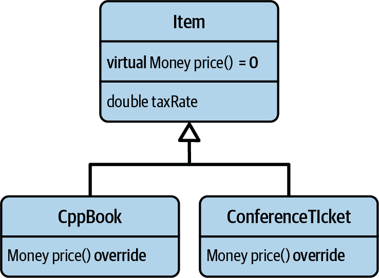
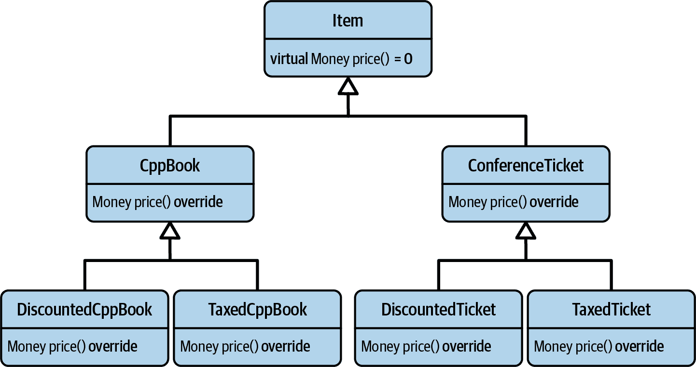
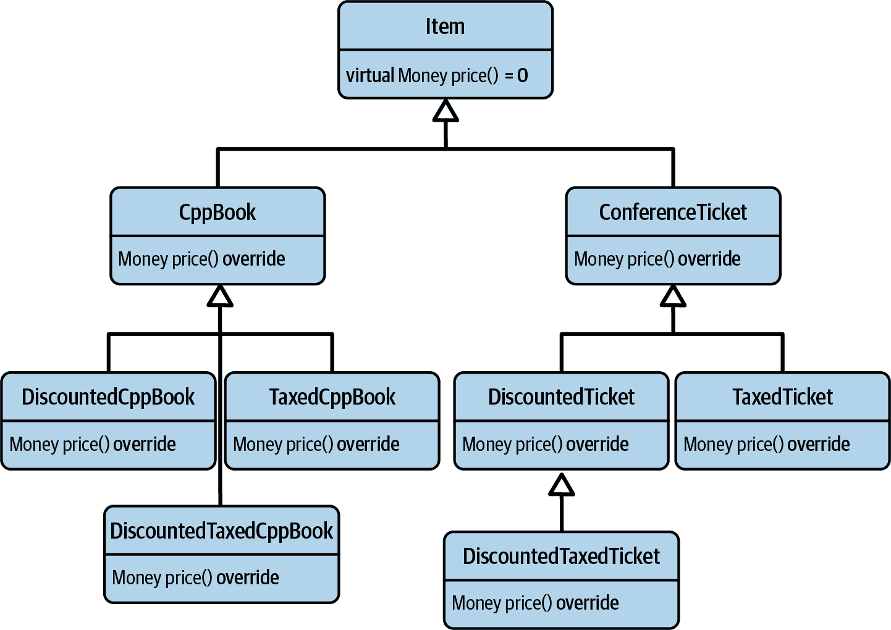
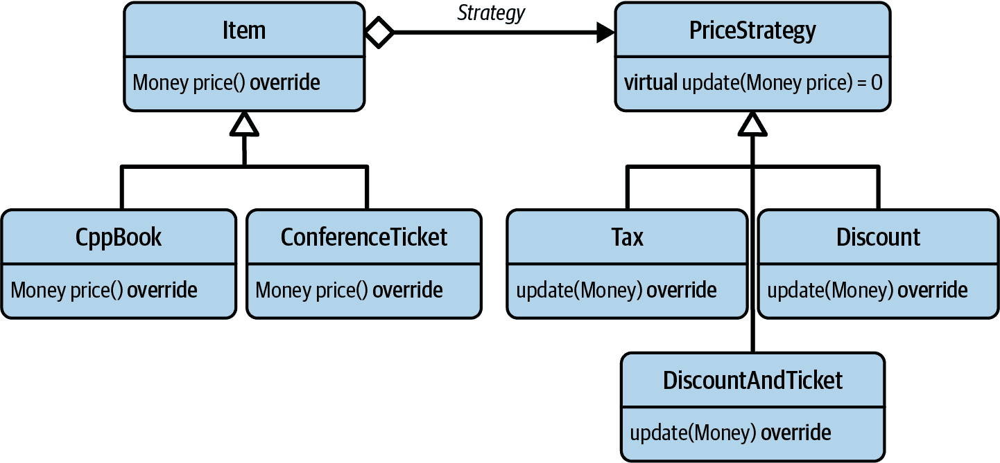
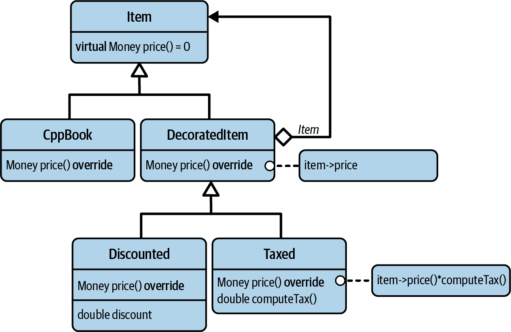
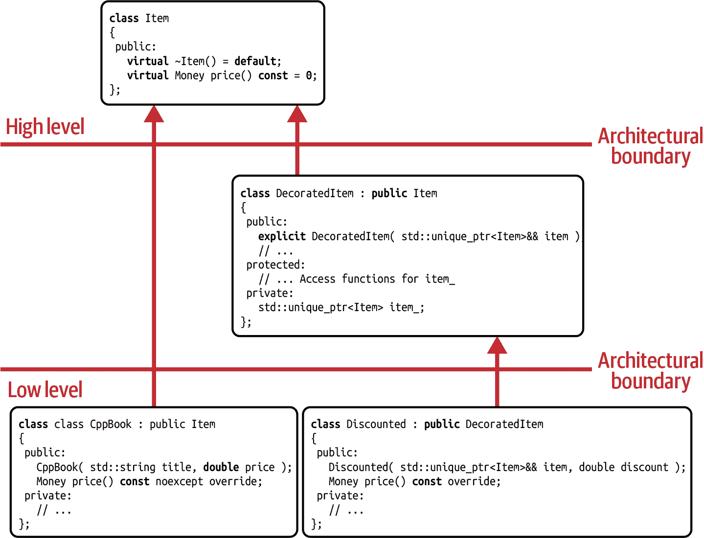
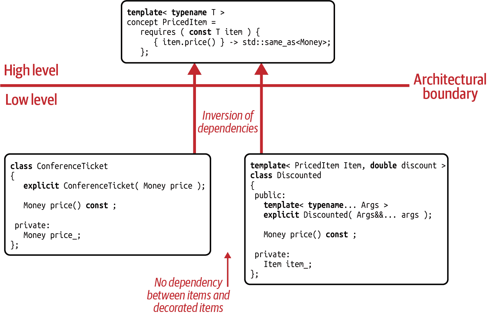

# 第九章：装饰器设计模式

本章专注于另一个经典设计模式：装饰器设计模式。多年来，装饰器已被证明是在组合和重用不同实现时最有用的设计模式之一。因此，它被广泛使用，甚至用于 C++ 标准库功能的最令人印象深刻的重塑之一也不足为奇。本章的主要目标是让你对为什么以及何时装饰器是设计软件的明智选择有一个很好的理解。此外，我还将向你展示现代化、更基于价值的装饰器形式。

在“指南 35：使用装饰器以分层方式添加定制化”中，我们将深入探讨装饰器设计模式的设计方面。你将看到它何时是正确的设计选择，以及通过使用它可以获得哪些好处。此外，你还将了解与其他设计模式的区别以及它的潜在缺点。

在“指南 36：理解运行时和编译时抽象之间的权衡”中，我们将查看装饰器设计模式的另外两个实现。虽然这两个实现都牢固地根植于值语义的领域，但第一个基于静态多态性，而第二个基于动态多态性。尽管它们都有相同的意图并因此实现了装饰器，但这两者的对比将让你感受到设计模式空间的广阔。

# 指南 35：使用装饰器以分层方式添加定制化

自从你通过基于策略设计模式的解决方案解决了团队 2D 图形工具的设计问题（记得“指南 19：使用策略来隔离事务处理的方式”），你作为设计模式专家的声誉已经传遍了公司。因此，其他团队寻求你的指导并不令人意外。一天，公司商品管理系统的两位开发者来到你的办公室寻求帮助。

## 你的同事们的设计问题

两位开发者团队正处理许多不同的`Item`（参见 Figure 9-1）。所有这些项目都有一个共同点：它们都有一个`price()`标签。两位开发者试图通过 C++ 商品商店中的两个项目来解释他们的问题：代表 C++ 书籍的类（`CppBook` 类）和代表 C++ 会议票的类（`ConferenceTicket` 类）。



###### 图 9-1\. 初始`Item`继承层次结构

当开发者们勾勒出他们的问题时，你开始理解到，他们的问题似乎是修改价格的多种不同方式。最初，他们告诉你，他们只需考虑税费。因此，`Item`基类配备了一个`protected`数据成员来表示税率：

```cpp
//---- <Money.h> ----------------

class Money { /*...*/ };

Money operator*( Money money, double factor );
Money operator+( Money lhs, Money rhs );

//---- <Item.h> ----------------

#include <Money.h>

class Item
{
 public:
   virtual ~Item() = default;

   virtual Money price() const = 0;
   // ...

 protected:
   double taxRate_;
};
```

这似乎在一段时间内运行良好，直到有一天，他们被要求同时考虑不同的折扣率。显然，为了重构现有大量的类和它们的多种不同项目，这需要很多努力。你很容易想象到，这是必要的，因为所有的派生类都在访问`protected`数据成员。“是的，你应该总是为变化而设计……” 你心里想着。¹

他们继续承认他们不幸的错误设计。当然，他们本应更好地封装`Item`基类中的税率。然而，随着这一认识的到来，他们理解到通过在基类中使用数据成员来表示价格修饰符时，任何新的价格修饰符总是会是一种侵入性操作，并且总是会直接影响`Item`类。因此，他们开始思考如何避免未来的重构，并如何实现轻松添加新修饰符。“这才是正确的方式！” 你暗自想着。不幸的是，他们首先想到的方法是通过继承层次结构来分离不同类型的价格修饰符（见图 9-2）。



###### 图 9-2\. 扩展的`Item`继承层次结构

而不是封装税费和折扣值在基类内部，这些修饰符被分解到派生类中，执行所需的价格调整。“哦哦……” 你开始思考。显然，你的表情已经透露出你对这个想法并不特别喜欢，所以他们很快告诉你，他们已经放弃了这个想法。显然，他们已经意识到这会导致更多问题：这种解决方案将快速导致类型的爆炸，并且功能的复用性很差。不幸的是，大量代码会重复，因为对于每个具体的`Item`，税费和折扣的代码都必须重复。然而，最麻烦的是处理既受税费影响又受某种折扣影响的`Item`：他们既不喜欢提供处理两者的类的方法，也不想在继承层次中引入另一层（见图 9-3）。



###### 图 9-3\. 问题的`Item`继承层次结构

显然，令他们惊讶的是，他们无法通过直接继承的方式在基类或派生类中处理价格调整器。然而，在你有机会评论关注分离之前，他们解释说他们最近听说了你的策略解决方案。最终给了他们一个正确重构问题的想法（见图 9-4）。

通过将价格调整器提取到一个单独的层次结构中，并通过构造时配置`Items`来使用`PriceStrategy`，他们最终找到了一个有效的解决方案，可以非侵入性地添加新的价格调整器，这将节省大量的重构工作。“好吧，这就是关注分离和优先组合而不是继承的好处”，你心里想着。² 然后你问道：“这太棒了，我真的为你感到高兴。一切似乎都运行正常，你自己找到了解决方案！你到底为什么在这里？”



###### 图 9-4\. 基于策略的`Item`继承层次结构

他们告诉你，你的策略解决方案迄今为止是他们所知道的最佳方法（包括感激的表情）。然而，他们承认他们对这种方法并不完全满意。从他们的角度来看，仍然存在两个问题，当然，他们希望你有办法解决。他们看到的第一个问题是，即使没有价格调整器，每个`Item`实例仍然需要一个策略类。虽然他们同意这可以通过某种形式的[*null object*](https://oreil.ly/9RX5N)来解决，但他们觉得应该有一个更简单的解决方案:³

```cpp
class PriceStrategy
{
 public:
   virtual ~PriceStrategy() = default;
   virtual Money update( Money price ) const = 0;
   // ...
};

class NullPriceStrategy : public PriceStrategy
{
 public:
   Money update( Money price ) const override { return price; }
};
```

他们面临的第二个问题似乎更难解决一些。显然，他们有兴趣将不同类型的调整器（例如，`Discount`和`Tax`）组合到`DiscountAndTax`中。不幸的是，他们在当前实现中存在一些代码重复。例如，`Tax`和`DiscountAndTax`类都包含与税收相关的计算。目前，只有两种调整器，可以采用合理的解决方案来处理重复，但他们预计在添加更多调整器和任意组合时会遇到问题。因此，他们想知道是否有另一种更好的解决方案来处理不同类型的价格调整器。

这确实是一个有趣的问题，你很高兴抽出时间帮助他们。他们绝对是正确的：策略设计模式并不适合这个问题。虽然策略是一个很好的解决方案，可以消除对函数完整实现细节的依赖，并优雅地处理不同的实现，但它并不容易组合和重用不同的实现。试图这样做很快会导致一个不可取的复杂策略继承层次结构。

他们对于他们的问题所需的东西看起来更像是一种层次形式的策略，这种形式解耦了不同的价格修饰符，同时也允许非常灵活的组合。因此，成功的关键之一是一致地应用关注点分离原则：在像 `DiscountAndTax` 类这样的刚性手工编码组合将是禁止的。然而，解决方案还应该是非侵入性的，以使他们能够随时实施新的想法，而无需修改现有的代码。最后，也不应该通过某种人为的*空对象*来处理默认情况。相反，更合理的方法是坚持采用组合而非继承，并通过包装器的形式实现价格修饰符。有了这个认识，你开始微笑。是的，正是为这个目的设计的合适设计模式：你的两位客人所需的是装饰者设计模式的实现。

## 装饰者设计模式解析

装饰者设计模式也源自 GoF 的书籍。其主要关注点是通过组合灵活地组合不同功能的能力：

# 装饰者设计模式

意图：“动态地为对象附加额外的责任。装饰者提供了一种灵活的替代方案，用于通过组合扩展功能，而不是通过子类化。”⁴

图 9-5 显示了给定 `Item` 问题的 UML 图。与以往一样，`Item` 基类代表了所有可能的物品的抽象。另一方面，派生的 `CppBook` 类则充当了 `Item` 不同实现的代表。在这个层次结构中，存在的问题是难以为现有的 `price()` 函数添加新的修饰符。在装饰者设计模式中，将这种添加新“责任”的行为识别为*变化点*，并以 `DecoratedItem` 类的形式提取出来。这个类是 `Item` 基类的一个单独特殊实现，表示对任何给定物品的增加责任。一方面，`DecoratedItem` 派生自 `Item`，因此必须遵循 `Item` 抽象的所有期望行为（参见“指导方针 6：遵循抽象的预期行为”）。另一方面，它也包含一个 `Item`（通过组合或聚合方式）。由于这个原因，`DecoratedItem` 充当了每个物品的包装器，可能是自身扩展功能的包装器。因此，它为修饰符的分层应用提供了基础。`Discounted` 类和 `Taxed` 类代表了两种可能的修饰符，分别表示特定物品的折扣和某种税收。⁵



###### 图 9-5\. 装饰者设计模式的 UML 表示

通过引入`DecoratedItem`类并分离需要更改的方面，您遵循 SRP 原则。通过分离这个关注点，从而允许轻松添加新的价格修改器，您也遵循*开闭原则（OCP）*。由于`DecoratedItem`类的层次递归性质以及轻松重用和组合不同修改器的能力，您还遵循*不要重复自己（DRY）*原则的建议。最后但同样重要的是，由于装饰者的包装方法，无需以*空对象*的形式定义任何默认行为。任何不需要修改器的`Item`都可以直接使用。

图 9-6 展示了装饰者设计模式的依赖图。在此图中，`Item`类位于架构的最高层。所有其他类都依赖于它，包括位于下一级的`DecoratedItem`类。当然，这不是必须的：如果`Item`和`DecoratedItem`都在同一架构级别引入，那也是完全可以接受的。然而，这个示例表明，随时随地都可以引入新的装饰者，而无需修改现有代码。`Item`的具体类型实现在架构的最低级别。请注意，这些项之间没有依赖关系：包括`Discounted`在内的所有项可以独立地随时引入，并且由于装饰者的结构，可以灵活和任意地组合。



###### 图 9-6\. 装饰者设计模式的依赖图

## 经典的装饰者设计模式实现

让我们通过给定的`Item`示例来看一下完整的 GoF 风格装饰者设计模式的实现：

```cpp
//---- <Item.h> ----------------

#include <Money.h>

class Item
{
 public:
   virtual ~Item() = default;
   virtual Money price() const = 0;
};
```

`Item`基类代表所有可能的物品的抽象。唯一的要求由纯虚拟`price()`函数定义，可用于查询给定物品的价格。`DecoratedItem`类代表`Item`类的一种可能的实现（）：

```cpp
//---- <DecoratedItem.h> ---------------- 
#include <Item.h>
#include <memory>
#include <stdexcept>
#include <utility>

class DecoratedItem : public Item  
{
 public:
   explicit DecoratedItem( std::unique_ptr<Item> item )  
      : item_( std::move(item) )
   {
      if( !item_ ) {
         throw std::invalid_argument( "Invalid item" );
      }
   }

 protected:
   Item&       item()       { return *item_; }  
   Item const& item() const { return *item_; }

 private:
   std::unique_ptr<Item> item_;  
};

```

`DecoratedItem`从`Item`类派生，但也包含一个`item_`（）。这个`item_`是通过构造函数指定的，该构造函数接受任何非空的`std::unique_ptr`指向另一个`Item`（）。请注意，这个`DecoratedItem`类仍然是抽象的，因为纯虚拟`price()`函数尚未定义。`DecoratedItem`仅提供必要的功能来存储一个`Item`并通过`protected`成员函数访问该`Item`（）。

使用这两个类，可以实现具体的`Item`：

```cpp
//---- <CppBook.h> ---------------- 
#include <Item.h>
#include <string>
#include <utility>

class CppBook : public Item  
{
 public:
   CppBook( std::string title, Money price )
      : title_{ std::move(title) }
      , price_{ price }
   {}

   std::string const& title() const { return title_; }
   Money price() const override { return price_; }

 private:
   std::string title_{};
   Money price_{};
};

//---- <ConferenceTicket.h> ---------------- 
#include <Item.h>
#include <string>
#include <utility>

class ConferenceTicket : public Item  
{
 public:
   ConferenceTicket( std::string name, Money price )
      : name_{ std::move(name) }
      , price_{ price }
   {}

   std::string const& name() const { return name_; }
   Money price() const override { return price_; }

 private:
   std::string name_{};
   Money price_{};
};

```

`CppBook` 和 `ConferenceTicket` 类表示可能的具体 `Item` 实现 ( 和 )。C++ 书籍由书籍标题表示，而 C++ 大会则由会议名称表示。最重要的是，这两个类都重写了 `price()` 函数，返回指定的 `price_`。

`CppBook` 和 `ConferenceTicket` 都不考虑任何形式的税收或折扣。但显然，这两种 `Item` 都可能受到这两者的影响。这些价格修饰器通过 `Discounted` 和 `Taxed` 类来实现：

```cpp
//---- <Discounted.h> ---------------- 
#include <DecoratedItem.h>

class Discounted : public DecoratedItem
{
 public:
   Discounted( double discount, std::unique_ptr<Item> item )  
      : DecoratedItem( std::move(item) )
      , factor_( 1.0 - discount )
   {
      if( !std::isfinite(discount) || discount < 0.0 || discount > 1.0 ) {
         throw std::invalid_argument( "Invalid discount" );
      }
   }

   Money price() const override
   {
      return item().price() * factor_;  
   }

 private:
   double factor_;
};

```

`Discounted` 类 () 通过向 `Item` 的 `std::unique_ptr` 和折扣值传递初始化。该折扣值由范围为 0.0 到 1.0 的双精度值表示。虽然给定的 `Item` 立即传递给 `DecoratedItem` 基类，但给定的折扣值用于计算折扣 `factor_`。此因素用于在 `price()` 函数的实现中修改给定项目的价格 ()。这可以是像 `CppBook` 或 `ConferenceTicket` 这样的特定项，也可以是任何像 `Discounted` 这样的装饰器，其再次修改另一个 `Item` 的价格。因此，`price()` 函数是完全利用装饰器的层次结构的关键点。

```cpp
//---- <Taxed.h> ---------------- 
#include <DecoratedItem.h>

class Taxed : public DecoratedItem
{
 public:
   Taxed( double taxRate, std::unique_ptr<Item> item )  
      : DecoratedItem( std::move(item) )
      , factor_( 1.0 + taxRate )
   {
      if( !std::isfinite(taxRate) || taxRate < 0.0 ) {
         throw std::invalid_argument( "Invalid tax" );
      }
   }

   Money price() const override
   {
      return item().price() * factor_;
   }

 private:
   double factor_;
};

```

`Taxed` 类与 `Discounted` 类非常相似。主要区别在于构造函数中对与税相关的因素的评估 ()。同样，这个因素在 `price()` 函数中用于修改包装的 `Item` 的价格。

所有这些功能都集成在 `main()` 函数中：

```cpp
#include <ConferenceTicket.h>
#include <CppBook.h>
#include <Discounted.h>
#include <Taxed.h>
#include <cstdlib>
#include <memory>

int main()
{
   // 7% tax: 19*1.07 = 20.33
   std::unique_ptr<Item> item1(  
      std::make_unique<Taxed>( 0.07,
         std::make_unique<CppBook>( "Effective C++", 19.0 ) ) );

   // 20% discount, 19% tax: (999*0.8)*1.19 = 951.05
   std::unique_ptr<Item> item2(  
      std::make_unique<Taxed>( 0.19,
         std::make_unique<Discounted>( 0.2,
            std::make_unique<ConferenceTicket>( "CppCon", 999.0 ) ) ) );

   Money const totalPrice1 = item1->price();  // Results in 20.33
   Money const totalPrice2 = item2->price();  // Results in 951.05 
   // ... 
   return EXIT_SUCCESS;
}

```

作为第一个 `Item`，我们创建了一个 `CppBook`。假设这本书需要缴纳 7% 的税款，这是通过在该项目周围包装一个 `Taxed` 装饰器来应用的。因此，结果的 `item1` 表示一个征税的 C++ 书籍 ()。作为第二个 `Item`，我们创建了一个 `ConferenceTicket` 实例，代表 [CppCon](https://cppcon.org)。我们很幸运地获得了早鸟票，这意味着我们享有 20% 的折扣。这个折扣通过 `Discounted` 类包装在 `ConferenceTicket` 实例周围。门票也需缴纳 19% 的税款，这与之前一样，通过 `Taxed` 装饰器应用。因此，结果的 `item2` 表示一个打折和征税的 C++ 大会门票 ()。

## 第二个装饰器示例

另一个展示装饰器设计模式优势的令人印象深刻的例子可以在 STL 分配器的 C++17 重制版中找到。由于分配器的实现基于装饰器，可以创建任意复杂的分配器层次结构，以满足甚至最特殊的内存需求。例如，考虑以下使用 [`std::pmr::monotonic_buffer_resource`](https://oreil.ly/UPPxK) 的例子（）。

```cpp
#include <array>
#include <cstddef>
#include <cstdlib>
#include <memory_resource>
#include <string>
#include <vector>

int main()
{
   std::array<std::byte,1000> raw;  // Note: not initialized! 
   std::pmr::monotonic_buffer_resource
      buffer{ raw.data(), raw.size(), std::pmr::null_memory_resource() }; 

   std::pmr::vector<std::pmr::string> strings{ &buffer };

   strings.emplace_back( "String longer than what SSO can handle" );
   strings.emplace_back( "Another long string that goes beyond SSO" );
   strings.emplace_back( "A third long string that cannot be handled by SSO" );

   // ... 
   return EXIT_SUCCESS;
}

```

`std::pmr::monotonic_buffer_resource` 是 `std::pmr` 命名空间中几种可用分配器之一。在本例中，它配置为当 `strings` 向量请求内存时，仅分发给定字节数组 `raw` 的块。无法处理的内存请求（例如 `buffer` 内存不足）将通过抛出 `std::bad_alloc` 异常来处理。这种行为是在构造过程中通过传递 [`std::pmr::null_memory_resource`](https://oreil.ly/E1t7V) 指定的。然而，`std::pmr::monotonic_buffer_resource` 还有许多其他可能的应用场景。例如，还可以基于动态内存构建，并通过 [`std::pmr::new_delete_resource()`](https://oreil.ly/0oSzS) 使用 `new` 和 `delete` 重新分配额外的内存块（）。

```cpp
// ... 
int main()
{
   std::pmr::monotonic_buffer_resource
      buffer{ std::pmr::new_delete_resource() };  

   // ... }

```

这种分配器的灵活性和分层配置是通过装饰器设计模式实现的。`std::pmr::monotonic_buffer_resource` 派生自 [`std::pmr::memory_resource`](https://oreil.ly/8A1sk) 基类，同时还充当另一个派生自 `std::pmr::memory_resource` 的分配器的包装器。在 `std::pmr::monotonic_buffer_resource` 的构造过程中指定了用于在 `buffer` 内存不足时使用的上游分配器。

然而，最令人印象深刻的是，你可以轻松而非侵入式地定制分配策略。例如，这可能会让你能够以不同于对小块内存请求的方式处理大块内存的请求。你所需做的就是提供你自己的定制分配器。考虑以下 `CustomAllocator` 的草图：

```cpp
//---- <CustomAllocator.h> ---------------- 
#include <cstdlib>
#include <memory_resource>

class CustomAllocator : public std::pmr::memory_resource  
{
 public:
   CustomAllocator( std::pmr::memory_resource* upstream )  
      : upstream_{ upstream }
   {}

 private:
   void* do_allocate( size_t bytes, size_t alignment ) override;  

   void do_deallocate( void* ptr, [[maybe_unused]] size_t bytes,  
                       [[maybe_unused]] size_t alignment ) override;

   bool do_is_equal(
      std::pmr::memory_resource const& other ) const noexcept override;  

   std::pmr::memory_resource* upstream_{};  
};

```

要被认定为 C++17 分配器，`CustomAllocator` 类需要继承自 `std::pmr::memory_resource` 类，该类代表了所有 C++17 分配器的要求（）。巧合的是，`CustomAllocator` 还拥有一个指向 `std::pmr::memory_resource` 的指针（），这个指针是通过其构造函数初始化的（）。

C++17 分配器的要求集包括虚拟函数 `do_allocate()`、`do_deallocate()` 和 `do_is_equal()`。`do_allocate()` 函数负责获取内存，可能通过其上游分配器（）实现，而 `do_deallocate()` 函数在需要归还内存时调用（）。最后，`do_is_equal()` 函数在需要检查两个分配器是否相等时调用（）。⁶

只需引入 `CustomAllocator` 而无需更改任何其他代码，特别是标准库中的代码，新的分配器类型就可以轻松地插入到 `std::pmr::monotonic_buffer_resource` 和 `std::pmr::new_delete_resource()` 之间（），从而允许您非侵入性地扩展分配行为。

```cpp
// ... #include <CustomAllocator.h>

int main()
{
   CustomAllocator custom_allocator{ std::pmr::new_delete_resource() };

   std::pmr::monotonic_buffer_resource buffer{ &custom_allocator };  

   // ... }

```

## 装饰者、适配器和策略之间的比较

在名称为 *Decorator* 和 *Adapter* 的两种设计模式中，它们听起来似乎有相似的目的。然而，仔细检查后，这两种模式非常不同，几乎没有任何关联。适配器设计模式的意图是将给定接口适应并转换为预期接口。它不关心添加任何功能，而只关心将一组函数映射到另一组函数（另见 “指南 24：使用适配器来标准化接口”）。另一方面，装饰者设计模式保留了给定接口，并且根本不关心改变它。相反，它提供了添加职责、扩展和定制现有函数集的能力。

策略设计模式更类似于装饰者模式。这两种模式都提供了定制功能的能力。然而，它们各自适用于不同的应用场景，因此提供了不同的优势。策略设计模式专注于消除对特定功能实现细节的依赖，并使您能够从外部定义这些细节。因此，从这个角度来看，它代表了这个功能的核心——“内核”。这种形式使其特别适合表示不同的实现并在它们之间切换（参见 “指南 19：使用策略来隔离做事的方式”）。相比之下，装饰者设计模式专注于消除可附加实现之间的依赖关系。由于其包装形式，装饰者表示功能的“皮肤”。⁷ 在这种形式下，它特别适合组合不同的实现，从而增强和扩展功能，而不是替换或在实现之间切换。

显然，策略模式和装饰器模式各有其独特的优势，应根据具体情况选择。然而，也可以结合这两种设计模式，以获得双赢。例如，可以实现`Item`，使用策略设计模式，并通过装饰器提供更精细化的策略配置：

```cpp
class PriceStrategy
{
 public:
   virtual ~PriceStrategy() = default;
   virtual Money update( Money price ) const = 0;
   // ...
};

class DecoratedPriceStrategy : public PriceStrategy
{
 public:
   // ...
 private:
   std::unique_ptr<PriceStrategy> priceModifier_;
};

class DiscountedPriceStrategy : public DecoratedPriceStrategy
{
 public:
   Money update( Money price ) const override;
   // ...
};
```

如果已经有了策略的实现，这种设计模式的组合尤其有趣：虽然策略是侵入性的，并且需要修改类，但非侵入性地添加类似`DecoratedPriceStrategy`的装饰器是完全可能的。当然，是否选择这种解决方案取决于具体情况。

## 分析装饰器设计模式的不足之处

装饰器设计模式以其能够层次化地扩展和定制行为的能力，显然是设计模式目录中最有价值和灵活的模式之一。然而，尽管它有利之处，但也存在一些缺点。首先且最重要的是，装饰器的灵活性是有代价的：在给定层次结构中的每一级都会增加一级间接性。作为具体例子，在`Item`层次结构的面向对象实现中，这种间接性以每个装饰器的虚函数调用形式呈现。因此，广泛使用装饰器可能会带来潜在的显著性能开销。是否这种潜在的性能损失构成问题，取决于具体情况。您将需要使用基准测试来决定，装饰器的灵活性和结构方面的优势是否超过了性能问题。

另一个缺点是可能以荒谬的方式组合装饰器的潜在危险。例如，很容易在一个`Taxed`装饰器外围再包裹一个`Taxed`装饰器，或者在已经被税的`Item`上应用`Discounted`。这两种情况都会让政府开心，但实际上不应该发生，因此应该通过设计避免。Scott Meyers 的通用设计原则很好地表达了这一理念：⁸

> 使接口易于正确使用，难以错误使用。

因此，装饰器的巨大灵活性非凡，但也可能具有危险性（当然取决于具体场景）。由于在这种场景中，税收似乎扮演了一个特殊角色，因此不将其视为装饰器处理，而是通过策略设计模式进行分离显得非常合理：

```cpp
//---- <TaxStrategy.h> ---------------- 
#include <Money.h>

class TaxStrategy  
{
 public:
   virtual ~TaxStrategy() = default;
   virtual Money applyTax( Money price ) const = 0;
   // ... };

//---- <TaxedItem.h> ---------------- 
#include <Money.h>
#include <TaxStrategy.h>
#include <memory>

class TaxedItem
{
 public:
   explicit TaxedItem( std::unique_ptr<Item> item
                     , std::unique_ptr<TaxStrategy> taxer )  
      : item_( std::move(item) )
      , taxer_( std::move(taxer) )
   {
      // Check for a valid item and tax strategy
   }

   Money netPrice() const  // Price without taxes 
   {
      return price();
   }

   Money grossPrice() const  // Price including taxes 
   {
      return taxer_.applyTax( item_.price() );
   }

 private:
   std::unique_ptr<Item> item_;
   std::unique_ptr<TaxStrategy> taxer_;
};

```

`TaxStrategy` 类表示将税收应用于 `Item` 的多种不同方式（）。这样的 `TaxStrategy` 与 `TaxedItem` 类中的 `Item` 结合在一起（）。请注意，`TaxedItem` 本身并不是 `Item`，因此不能通过另一个 `Item` 进行装饰。因此，它充当一种终止装饰器，只能作为最后一个装饰器应用。它也不提供 `price()` 函数，而是提供 `netPrice()`（）和 `grossPrice()`（）函数，以便查询包括税费在内的价格和包装 `Item` 的原始价格。⁹

另一个可能出现的问题是基于引用语义的装饰器设计模式实现：包括大量指针，包括 `nullptr` 检查和悬空指针的危险，通过 `std::unique_ptr` 和 `std::make_unique()` 进行显式生命周期管理，以及许多小的手动内存分配。然而，幸运的是，你还有一招在手，可以展示如何基于值语义实现装饰器（请参阅下面的指南）。

总结一下，装饰器设计模式是基本设计模式之一，尽管存在一些缺点，但将证明是你工具箱中非常有价值的补充。只需确保你不要对装饰器过于激动并开始将其用于一切。毕竟，对于每种模式，合理使用和过度使用之间有一条细微的界限。

# 指南 36：理解运行时和编译时抽象之间的权衡

在 “指导原则 35：使用装饰器分层添加定制” 中，我向您介绍了装饰器设计模式，并希望您能够将此设计模式添加到您的工具箱中。然而，到目前为止，我仅通过经典的面向对象实现来说明装饰器，并且再次未遵循 “指导原则 22：更喜欢值语义而不是引用语义” 的建议。因此，我假设您迫不及待地想要看到如何基于值语义实现装饰器，现在是展示两种可能方法的时候了。是的，*两种* 方法：我将通过展示两种非常不同的实现来弥补之前的推迟。两者都坚定地基于值语义，但在比较中，它们几乎处于设计空间的对立面。第一种方法将是基于静态多态性的实现，这使您能够利用您可能拥有的所有编译时信息，而第二种方法则更倾向于利用动态多态性的运行时优势。这两种方法各有其优点，当然也有其特有的缺点。因此，这些示例将很好地展示给您可供选择的设计选择的广泛性。

## 一种基于值的编译时装饰器

让我们从基于静态多态性的装饰器实现开始。"我假设这将再次非常依赖于模板，对吗？" 你问道。是的，我将使用模板作为主要的抽象机制，是的，我将使用 C++20 的概念甚至是转发引用。但不，我会尽量避免过度使用模板。相反，主要的焦点仍然在装饰器设计模式的设计方面以及使其易于添加新种类的装饰器和新种类的常规项目。其中一种项目是 `ConferenceTicket` 类：

```cpp
//---- <ConferenceTicket.h> ----------------

#include <Money.h>
#include <string>
#include <utility>

class ConferenceTicket
{
 public:
   ConferenceTicket( std::string name, Money price )
      : name_{ std::move(name) }
      , price_{ price }
   {}

   std::string const& name() const { return name_; }
   Money price() const { return price_; }

 private:
   std::string name_;
   Money price_;
};
```

`ConferenceTicket` 完美地实现了值类型的期望：没有涉及基类，也没有虚函数。这表明项目不再通过指向基类的指针进行装饰，而是通过组合或者直接的非`public`继承。两个示例是`Discounted`和`Taxed`类的以下实现：

```cpp
//---- <PricedItem.h> ---------------- 
#include <Money.h>

template< typename T >
concept PricedItem =  
   requires ( T item ) {
      { item.price() } -> std::same_as<Money>;
   };

//---- <Discounted.h> ---------------- 
#include <Money.h>
#include <PricedItem.h>
#include <utility>

template< double discount, PricedItem Item >
class Discounted  // Using composition 
{
 public:
   template< typename... Args >
   explicit Discounted( Args&&... args )
      : item_{ std::forward<Args>(args)... }
   {}

   Money price() const {
      return item_.price() * ( 1.0 - discount );
   }

 private:
   Item item_;
};

//---- <Taxed.h> ---------------- 
#include <Money.h>
#include <PricedItem.h>
#include <utility>

template< double taxRate, PricedItem Item >
class Taxed : private Item  // Using inheritance 
{
 public:
   template< typename... Args >
   explicit Taxed( Args&&... args )
      : Item{ std::forward<Args>(args)... }
   {}

   Money price() const {
      return Item::price() * ( 1.0 + taxRate );
   }
};

```

`Discounted` () 和 `Taxed` () 都是其他类型的`Item`的装饰器：`Discounted` 类代表给定物品的某种折扣，而 `Taxed` 类代表某种类型的税。然而，这次它们都以类模板的形式实现。第一个模板参数分别指定折扣和税率，第二个模板参数指定被装饰的 `Item` 的类型。¹⁰

尤为重要的是，第二个模板参数的`PricedItem`约束（）。该约束表示语义要求集，即期望的行为。由于此约束，您只能提供具有`price()`成员函数的类型。使用任何其他类型将立即导致编译错误。因此，`PricedItem`在经典 Decorator 实现中与`Item`基类的作用相同，如“Guideline 35: Use Decorators to Add Customization Hierarchically”所示。出于同样的原因，它还代表基于*单一职责原则 (SRP)* 的关注点分离。此外，如果此约束由架构中的某个高级别拥有，则您以及其他任何人都能在任何较低级别上添加新类型的项目*和*新类型的 Decorators。此功能完美地满足*开闭原则 (OCP)*，并且由于抽象的适当拥有，还满足*依赖反转原则 (DIP)*（参见图 9-7）。¹¹



###### 图 9-7\. 编译时 Decorator 的依赖图

`Discounted`和`Taxed`类模板非常相似，除了它们处理装饰的`Item`的方式不同：`Discounted`类模板将`Item`存储为数据成员，因此遵循“Guideline 20: Favor Composition over Inheritance”，而`Taxed`类模板私有继承给定的`Item`类。这两种方法都是可行的，并且各有其优势，但应考虑采用`Discounted`类模板的组合方式，因为这是更常见的方式。如“Guideline 24: Use Adapters to Standardize Interfaces”所述，只有五个理由支持非`public`继承而不是组合（其中一些非常罕见）：

+   如果您必须重写虚函数

+   如果您需要访问`protected`成员函数

+   如果你需要调整类型以在另一个基类*之前*构建

+   如果你需要共享一个通用的虚基类或重写虚基类的构造函数

+   如果你能从[*空基类优化 (EBO)*](https://oreil.ly/nvqMn)中获得*显著*优势

可能是，对于大量适配器，*EBO*可能是倾向于继承的一个理由，但您应确保您的选择有数值支持（例如通过代表性基准）。

有了这三个类，您就能够指定一个打八折的`ConferenceTicket`，并且税率为 15%：

```cpp
#include <ConferenceTicket.h>
#include <Discounted.h>
#include <Taxed.h>
#include <cstdlib>

int main()
{
   // 20% discount, 15% tax: (499*0.8)*1.15 = 459.08
   Taxed<0.15,Discounted<0.2,ConferenceTicket>> item{ "Core C++", 499.0 };

   Money const totalPrice = item.price();  // Results in 459.08

   // ...

   return EXIT_SUCCESS;
}
```

这种编译时方法的最大优势在于显著的性能提升：由于没有指针间接性，并且由于内联的可能性，编译器能够全力优化生成的代码。此外，生成的代码可能要短得多，没有任何样板代码臃肿，因此更易读。

“你能具体一点描述性能结果吗？在 C++中，开发者们常常争论 1%的性能差异并称其为*显著*。所以严肃地说：编译时方法到底快了多少？” 我明白了，你似乎很了解 C++社区对性能的热情。好吧，只要你再次保证不认为我的结果是最终答案，而只是一个例子，我们也不将此比较演变成一项性能研究，我可以给你展示一些数字。但在我这样做之前，请让我简要概述一下我将使用的基准测试：我将经典面向对象实现与“指导方针 35：使用装饰器进行分层自定义”中描述的编译时版本进行比较。当然，有任意数量的装饰器组合，但我将限制在以下四种物品类型：¹²

```cpp
using DiscountedConferenceTicket = Discounted<0.2,ConferenceTicket>;
using TaxedConferenceTicket = Taxed<0.19,ConferenceTicket>;
using TaxedDiscountedConferenceTicket =
   Taxed<0.19,Discounted<0.2,ConferenceTicket>>;
using DiscountedTaxedConferenceTicket =
   Discounted<0.2,Taxed<0.19,ConferenceTicket>>;
```

由于在编译时解决方案中，这四种类型没有一个共同的基类，我用具体的`std::vector`填充这四种类型。相比之下，在经典运行时解决方案中，我使用一个包含`std::unique_ptr<Item>`的单个`std::vector`。总体上，我为这两种解决方案分别创建了 10,000 个具有随机价格的物品，并调用`std::accumulate()`函数 5,000 次来计算所有物品的总价格。

在了解了这些背景信息后，让我们来看看性能结果（表 9-1）。同样地，我将结果归一化到运行时实现的性能。

表 9-1\. 编译时装饰器实现的性能结果（归一化性能）

|  | GCC 11.1 | Clang 11.1 |
| --- | --- | --- |
| 经典装饰器 | 1.0 | 1.0 |
| 编译时装饰器 | 0.078067 | 0.080313 |

如前所述，编译时解决方案的性能显著快于运行时解决方案：对于 GCC 和 Clang，仅需大约运行解决方案的 8% 的时间，因此比运行解决方案快一个数量级。我知道，这听起来很惊人。然而，虽然编译时解决方案的性能非凡，但它带来了几个潜在的严重限制：由于完全依赖于模板，没有剩余的运行时灵活性。由于即使折扣和税率也是通过模板参数实现的，因此每个不同的税率都需要创建一个新类型。这可能导致较长的编译时间和生成的代码（即更大的可执行文件）。此外，所有类模板很可能驻留在头文件中，这再次增加了编译时间，并可能透露出更多的实现细节。更重要的是，实现细节的更改是广泛可见的，可能导致大规模的重新编译。然而，最具限制性的因素似乎是，只有在所有信息在编译时都是可用的情况下，才能以这种形式使用解决方案。因此，您可能只能为少数特殊情况达到这种性能水平。

## 基于值的运行时装饰器

由于编译时装饰器可能快但在运行时非常不灵活，让我们将注意力转向第二个基于值的装饰器实现。通过这种实现，我们将回到动态多态的领域，以其所有的运行时灵活性。

现在你已经了解了装饰者设计模式，你意识到我们需要能够轻松添加新的类型：新的 `Item` 种类以及新的价格修改器。因此，选择将装饰器实现从“Guideline 35: Use Decorators to Add Customization Hierarchically”转换为基于值语义的实现的设计模式是类型擦除。¹³ 下面的 `Item` 类实现了一个拥有类型擦除包装器的价格项目示例：

```cpp
//---- <Item.h> ---------------- 
#include <Money.h>
#include <memory>
#include <utility>

class Item
{
 public:
   // ... 
 private:
   struct Concept  
   {
      virtual ~Concept() = default;
      virtual Money price() const = 0;
      virtual std::unique_ptr<Concept> clone() const = 0;
   };

   template< typename T >
   struct Model : public Concept  
   {
      explicit Model( T const& item ) : item_( item ) {}
      explicit Model( T&& item ) : item_( std::move(item) ) {}

      Money price() const override
      {
         return item_.price();
      }

      std::unique_ptr<Concept> clone() const override
      {
         return std::make_unique<Model<T>>(*this);
      }

      T item_;
   };

   std::unique_ptr<Concept> pimpl_;
};

```

在这个实现中，`Item` 类在其 `private` 部分定义了一个嵌套的 `Concept` 基类（）。如往常一样，`Concept` 基类代表了被包装类型的要求集合（即期望的行为），这些要求由 `price()` 和 `clone()` 成员函数来表达。这些要求由嵌套的 `Model` 类模板来实现（）。`Model` 通过将调用转发到存储的 `item_` 数据成员的 `price()` 成员函数来实现 `price()` 函数，并通过创建存储项目的副本来实现 `clone()` 函数。

`Item` 类的 `public` 部分应该看起来很熟悉：

```cpp
//---- <Item.h> ---------------- 
// ... 
class Item
{
 public:
   template< typename T >
   Item( T item )  
      : pimpl_( std::make_unique<Model<T>>( std::move(item) ) )
   {}

   Item( Item const& item ) : pimpl_( item.pimpl_->clone() ) {}

   Item& operator=( Item const& item )
   {
      pimpl_ = item.pimpl_->clone();
      return *this;
   }

   ~Item() = default;
   Item( Item&& ) = default;
   Item& operator=( Item&& item ) = default;

   Money price() const { return pimpl_->price(); }  

 private:
   // ... };

```

除了常规的[5 法则](https://oreil.ly/fzS3f)实现外，该类再次配备了一个模板构造函数，接受各种项（）。最后但同样重要的是，该类提供了一个`price()`成员函数，模仿了所有项的预期接口（）。

有了这个包装器类，您可以轻松地添加新的项：不需要对现有代码进行任何侵入性修改，也不需要使用基类。任何提供`price()`成员函数且可复制的类都可以工作。幸运的是，这包括我们编译时装饰器实现中的`ConferenceTicket`类，它提供了我们需要的一切，并且坚定地基于值语义。不幸的是，对于`Discounted`和`Taxed`类来说并非如此，因为它们期望装饰的项以模板参数的形式提供。因此，我们为类型擦除上下文重新实现了`Discounted`和`Taxed`：

```cpp
//---- <Discounted.h> ----------------

#include <Item.h>
#include <utility>

class Discounted
{
 public:
   Discounted( double discount, Item item )
      : item_( std::move(item) )
      , factor_( 1.0 - discount )
   {}

   Money price() const
   {
      return item_.price() * factor_;
   }

 private:
   Item item_;
   double factor_;
};

//---- <Taxed.h> ----------------

#include <Item.h>
#include <utility>

class Taxed
{
 public:
   Taxed( double taxRate, Item item )
      : item_( std::move(item) )
      , factor_( 1.0 + taxRate )
   {}

   Money price() const
   {
      return item_.price() * factor_;
   }

 private:
   Item item_;
   double factor_;
};
```

特别有趣的是，这两个类都没有从任何基类派生，但却完美实现了装饰器设计模式。一方面，它们实现了`Item`包装器所需的操作，以使其计算为一个项（特别是`price()`成员函数和复制构造函数），但另一方面，它们拥有一个`Item`。因此，它们都能让您任意组合装饰器，正如下面的`main()`函数所示：

```cpp
#include <ConferenceTicket.h>
#include <Discounted.h>
#include <Taxed.h>

int main()
{
   // 20% discount, 15% tax: (499*0.8)*1.15 = 459.08
   Item item(Taxed(0.19, Discounted(0.2, ConferenceTicket{"Core C++",499.0})));

   Money const totalPrice = item.price();

   // ...

   return EXIT_SUCCESS;
}
```

“哇，这太美妙了：没有指针，没有手动分配，感觉非常自然和直观。但与此同时，它又极其灵活。这也太美好了吧，一定有问题。性能如何？”你说。好吧，你听起来像是期待性能彻底崩溃。那么让我们对这个解决方案进行基准测试。当然，我使用的是与装饰器编译时版本相同的基准测试，只是增加了基于类型擦除的第三种解决方案。性能数字显示在表 9-2 中。

表 9-2\. 类型擦除装饰器实现的性能结果（性能标准化）

|  | GCC 11.1 | Clang 11.1 |
| --- | --- | --- |
| 经典装饰器 | 1.0 | 1.0 |
| 编译时装饰器 | 0.078067 | 0.080313 |
| 类型擦除装饰器 | 0.997510 | 0.971875 |

如您所见，性能不比经典运行时解决方案差。实际上，性能甚至似乎略好一些，尽管这是多次运行的平均值，但不要过分强调这一点。然而，请记住，有多种选项可以改进类型擦除解决方案的性能，正如在“指南 33：注意类型擦除的优化潜力”中展示的那样。

虽然性能可能不是运行时解决方案的主要优势（至少与编译时解决方案相比），但在运行时灵活性方面确实表现出色。例如，可以在运行时决定将任何`Item`用另一个装饰器包装起来（基于用户输入，基于计算结果等）。当然，这将再次产生一个`Item`，它与许多其他`Item`一起可以存储在单个容器中。这确实给你带来了巨大的运行时灵活性。

另一个优势是更容易在源文件中隐藏实现细节。虽然这可能导致运行时性能损失，但可能会带来更好的编译时间。最重要的是：对隐藏代码的任何修改不会影响任何其他代码，因此可以节省大量重新编译的时间，因为实现细节更加封装。

总结一下，编译时和运行时解决方案都是基于价值的，并导致更简单、更可理解的用户代码。然而，它们也各有优缺点：运行时方法提供了更多的灵活性，而编译时方法在性能方面占据主导地位。实际情况中，你很少会使用纯编译时或运行时方法，但你经常会发现自己处于这两个极端之间。确保了解你的选择：权衡它们并找到一个完美结合两者优势的折中方案，以及符合你特定情况的解决方案。

¹ 请记住“指南 2：为变更而设计”和[核心指南 C.133](https://oreil.ly/SrAkz)：“避免使用`protected`数据。”

² 参见“指南 20：优先选择组合而非继承”，讨论为什么许多设计模式更倾向于组合而不是继承。

³ *空对象*代表一个具有中性（空）行为的对象。因此，它可以被视为策略实现的默认对象。

⁴ Erich Gamma 等人，《设计模式：可复用面向对象软件的元素》。

⁵ 你可能会想知道这是否是处理税务问题的最合理方法。不，不幸的是，这不是。首先，像往常一样，现实比这个简单的教育示例复杂得多，其次，因为这种形式很容易错误地应用税收。关于第一点我无能为力（我只是一个普通人），但我将在本指南末尾详细讨论第二点。

⁶ 如果你对不完整的实现感到困惑：这里的重点完全在于如何*设计*分配器，而不是如何*实现*分配器。想要深入了解如何实现一个 C++17 分配器，请参阅尼古拉·约苏提斯的《C++17 - 完全指南》。

⁷ 策略作为对象的核心，装饰器作为皮肤的隐喻源自《设计模式》一书。

⁸ 斯科特·迈尔斯，《Effective C++》，第三版（Addison-Wesley，2005 年）。

⁹ 如果你认为原始的`price()`函数应该重命名为`netPrice()`以反映其真实目的，那么我同意。

¹⁰ 请注意，自 C++20 起，只能使用浮点值作为[非类型模板参数（NTTPs）](https://oreil.ly/peHM2)。或者，您可以将折扣和税率存储为数据成员的形式。

¹¹ 或者，特别是如果你还不能使用 C++20 概念，这是使用*奇异递归模板模式（CRTP）*的一个机会；参见“指南 26：使用 CRTP 引入静态类型类别”。

¹² 为了避免税务局的拜访，我应明确声明，我意识到`Discounted<0.2,Taxed<0.19,ConferenceTicket>>`类的可疑性质（另请参阅“指南 35：使用装饰器以分层方式添加定制”末尾的潜在问题列表）。为自己辩护：这是装饰器的一个明显排列组合，非常适合这个基准测试。

¹³ 想要全面了解类型擦除，请参阅第八章，特别是“指南 32：考虑用类型擦除替换继承层次结构”。
