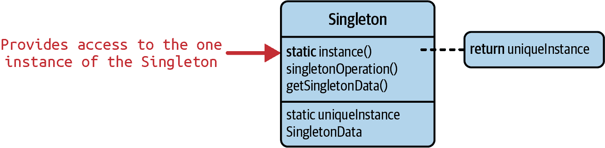
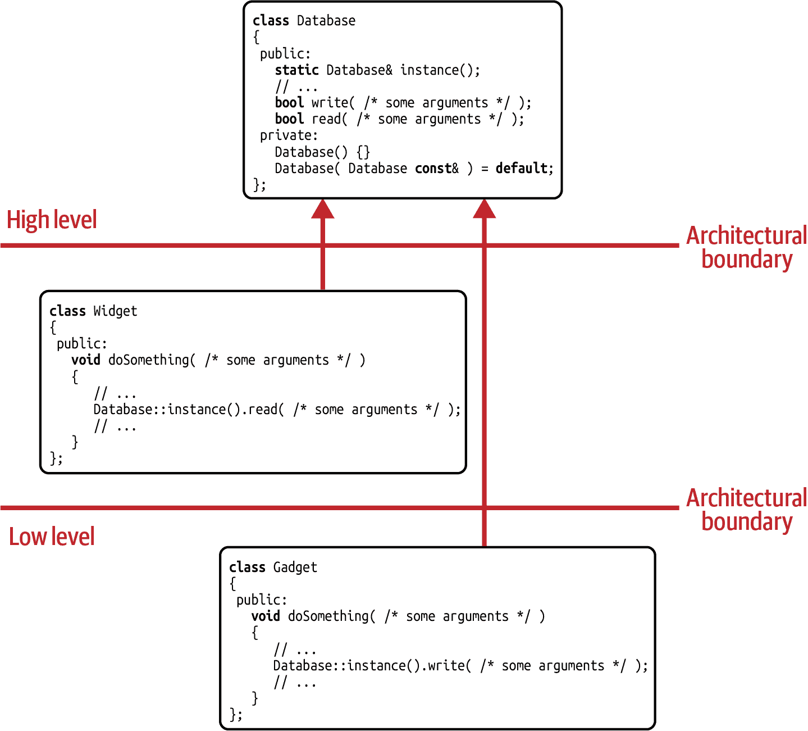
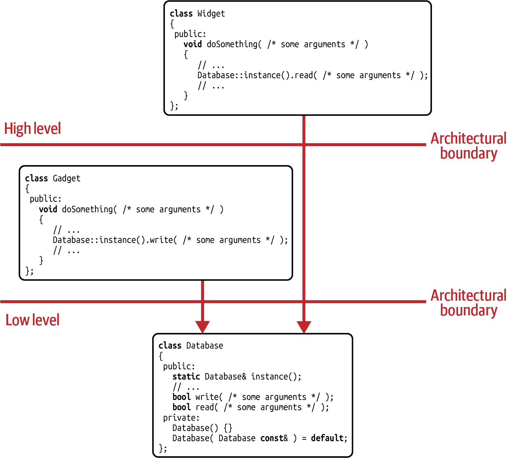
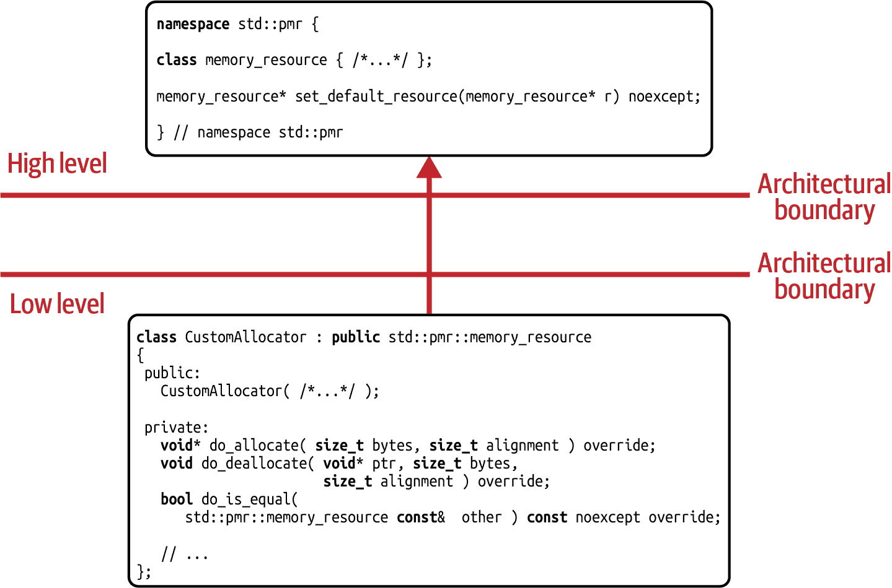
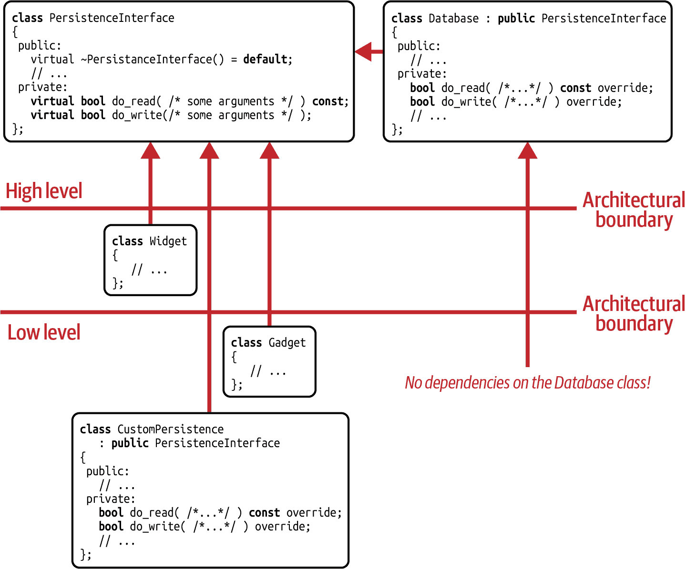

# 第十章：单例模式

在本章中，我们将看一下臭名昭著的*Singleton*模式。我知道，你可能已经对 Singleton 有所了解，并且可能已经对它有很强的看法。甚至可能认为 Singleton 是反模式，因此你可能会想我是如何鼓起勇气将它包含在这本书中的。嗯，我知道 Singleton 并不特别受欢迎，在许多圈子里它的声誉相当不好，特别是因为 Singleton 的全局特性。然而，从这个角度来看，了解到 C++标准库中有几个类似“Singleton”的实例可能会令人非常惊讶。真的！而且，老实说，它们的工作效果非常好！因此，我们应该认真讨论*什么是*Singleton，*什么时候*Singleton 适用，以及*如何*正确处理 Singleton。

在“Guideline 37: Treat Singleton as an Implementation Pattern, Not a Design Pattern”中，我将解释 Singleton 模式，并通过一个非常常用的实现方式，即所谓的*Meyers' Singleton*，来演示它的工作原理。然而，我也会强烈主张*不*将 Singleton 视为设计模式，而是作为*实现模式*。

在“Guideline 38: Design Singletons for Change and Testability”中，我们接受事实，有时我们需要一个解决方案来表示代码中的少数全局方面。这正是 Singleton 模式经常用于的地方。这也意味着我们面对 Singleton 的常见问题：全局状态；许多强的人为依赖关系；以及受到限制的可变性和可测试性。虽然这些听起来都是避免 Singleton 的极好理由，但我将向你展示，通过合理的软件设计，你可以将 Singleton 的好处与出色的可变性和可测试性结合起来。

# Guideline 37: 将 Singleton 视为实现模式，而不是设计模式

让我首先解决问题的关键点：

> Singleton 并*不*是一个设计模式。

如果你之前没有听说过 Singleton，那么这可能完全没有任何意义，但请跟着我。我承诺很快会解释 Singleton。如果你之前*听说过*Singleton，那么我假设你要么在赞同中点头，脸上露出同情的表情，“我知道”的样子，要么是完全震惊，一开始不知道该说什么。“但为什么不是呢？”你最终敢于问。“它不是《设计模式》一书中的原始设计模式之一吗？”是的，你是对的：Singleton 是《设计模式》一书中记录的 23 种原始模式之一。截至撰写本文时，[维基百科](https://oreil.ly/jzuFw)将其称为设计模式，甚至在史蒂夫·麦康奈尔的畅销书*《代码大全》*中也列为设计模式。¹尽管如此，它仍然不是设计模式，因为它没有设计模式的特性。让我解释一下。

## 解释了单例模式

有时候，您可能希望确保某个特定类只有一个，*确切地*只有一个实例。换句话说，您面临的是一种高地兰德（Highlander）情况：“只能有一个。”² 这在系统范围的数据库、唯一的记录器、系统时钟、系统配置或者简而言之任何不应该多次实例化的类中都是合理的，因为它们代表的是仅存在一次的东西。这就是单例模式的意图。

# 单例模式

意图：“确保一个类只有一个实例，并提供一个全局访问点。”³

Gang of Four 通过图 10-1 中的 UML 图表现了这一意图，其中引入了 `instance()` 函数作为访问唯一实例的全局访问点。



###### 图 10-1\. *单例* 模式的 UML 表示

有多种方法可以将实例化的数量限制为恰好一个。其中最有用且因此最常用的单例形式之一是梅耶斯单例。⁴ 下面的 `Database` 类是作为梅耶斯单例实现的：

```cpp
//---- <Database.h> ---------------- 
class Database final
{
 public:
   static Database& instance()  
   {
      static Database db;  // The one, unique instance
      return db;
   }

   bool write( /*some arguments*/ );
   bool read( /*some arguments*/ ) const;
   // ... More database-specific functionality 
   // ... Potentially access to data members 
 private:
   Database() {}  
   Database( Database const& ) = delete;
   Database& operator=( Database const& ) = delete;
   Database( Database&& ) = delete;
   Database& operator=( Database&& ) = delete;

   // ... Potentially some data members };

```

梅耶斯单例围绕着只能通过 `public`、`static` 的 `instance()` 函数来访问 `Database` 类的单个实例这一事实进行。

```cpp
#include <Database.h>
#include <cstdlib>

int main()
{
   // First access, database object is created
   Database& db1 = Database::instance();
   // ...

   // Second access, returns a reference to the same object
   Database& db2 = Database::instance();
   assert( &db1 == &db2 );

   return EXIT_SUCCESS;
}
```

实际上，这个函数是获取 `Database` 的唯一方法：所有可能用于创建、复制或移动实例的功能都要么在 `private` 部分声明，要么显式地 `delete` 掉。⁵ 尽管这看起来相当直接，但一个实现细节特别有趣：注意默认构造函数是显式定义的，而不是 `default`ed ()。原因在于，如果它是 `default`ed，在 C++17 之前，可以通过空大括号创建一个空的 `Database` 实例，即通过[*值初始化*](https://oreil.ly/9h4IB)：

```cpp
#include <cstdlib>

class Database
{
 public:
   // ... As before

 private:
   Database() = default;  // Compiler generated default constructor

   // ... As before
};

int main()
{
   Database db;    // Does not compile: Default initialization
   Database db{};  // Works, since value initialization results in aggregate
                   //   initialization, because Database is an aggregate type

   return EXIT_SUCCESS;
}
```

到 C++17，`Database` 类被视为一种*聚合类型*，这意味着可以通过[*聚合初始化*](https://oreil.ly/HSuYl)来执行*值初始化*。*聚合初始化*忽略了默认构造函数，包括它是`private`的事实，并简单地执行对象的*零初始化*。因此，值初始化使您仍然可以创建一个实例。然而，如果您提供了默认构造函数，则该类不再被视为聚合类型，这会阻止聚合初始化。⁶

`instance()`函数是基于[*静态局部变量*](https://oreil.ly/mqUoK)实现的。这意味着第一次控制通过声明时，变量以线程安全的方式初始化，并且在所有后续调用中跳过初始化。⁷ 在每次调用时，第一次和所有后续调用中，函数都会返回静态局部变量的引用。

已被证明

## 单例模式不管理或减少依赖关系

现在，想象一种可能的单例模式实现，让我们回到我声称单例模式不是设计模式的论断上。首先，让我们回顾一下设计模式的属性，我在“指南 11：理解设计模式的目的”中定义过：

引入一个抽象

+   有一个名称

+   `Database` 类的其余部分基本上就是你从代表数据库的类所期望的：有一些与数据库相关的`public`函数（例如`write()`和`read()`），可能会有一些数据成员，包括访问函数。换句话说，除了`instance()`成员函数和特殊成员之外，`Database`只是一个普通的类。

+   具有一个意图

+   一个设计模式：

单例模式绝对有一个名称，并且它确实有一个意图。毫无疑问。我还会声称多年来已经证明了它的有效性（尽管可能会有怀疑的声音指出单例模式相当臭名昭著）。但是，单例模式没有任何形式的抽象：没有基类，没有模板参数，什么都没有。单例模式本身不代表抽象，也不引入抽象。事实上，它不关心代码的结构或实体之间的互动和依赖关系，因此它不旨在管理或减少依赖关系。⁸ 然而，这正是我定义的软件设计的一个组成部分。相反，单例模式专注于将实例化次数限制为一次。因此，单例模式不是设计模式，而仅仅是一种实现模式。

“那么为什么它在许多重要来源中被列为设计模式呢？”你问道。这是一个公平而好的问题。可能有三个答案。首先，在其他编程语言中，特别是在每个类都可以自动表示抽象的语言中，情况可能会有所不同。虽然我承认这一点，但我仍然相信单例模式的意图主要针对实现细节，而不是依赖关系和解耦。

其次，单例模式是非常常见的（尽管经常被*误*用），因此它绝对算得上是一种模式。由于单例模式存在于许多不同的编程语言中，看起来它并不只是 C++编程语言的一种习语。因此，把它称为设计模式似乎是合理的。这一系列论据可能对你来说听起来有道理，但我觉得它没有区分软件设计和实现细节的能力。这就是为什么在“Guideline 11: Understand the Purpose of Design Patterns”中，我引入了术语*实现模式*，以区分不同种类的与语言无关的模式，如单例模式。⁹

而且第三，我相信我们仍在理解软件设计和设计模式的过程中。对软件设计没有共同的定义。因此，我在“Guideline 1: Understand the Importance of Software Design”中提出了一个定义。设计模式也没有共同的定义。这就是为什么我在“Guideline 11: Understand the Purpose of Design Patterns”中提出了一个定义。我坚信我们必须更多地讨论软件设计和模式，以达成对必要术语的共识，尤其是在 C++中。

总之，你不应该使用单例模式来解耦软件实体。因此，尽管它在著名的 GoF 书籍中有描述，或者在*Code Complete*中，甚至在[Wikipedia](https://oreil.ly/i8lyX)上列为设计模式，但它并不起到设计模式的作用。单例模式仅仅处理实现细节，因此你应该将其视为一种实现模式。

# Guideline 38: 设计单例模式以便于变更和可测试性

单例模式确实是一个相当臭名昭著的模式：有很多声音认为单例模式是代码中的一般问题，是一种反模式，是危险的，甚至是邪恶的。因此，有很多建议避免使用这种模式，其中包括[Core Guideline I.3](https://oreil.ly/Mai2n):¹⁰

> 避免使用单例模式。

人们对单例模式不喜欢的一个主要原因是，它经常导致人为的依赖性并阻碍可测试性。因此，它与本书中两条最重要且最一般的指导原则相抵触：“指导原则 2：为变更设计”和“指导原则 4：为可测试性设计”。从这个角度来看，单例确实在代码中表现为一个问题，应该避免使用。然而，尽管有各种各样的善意警告，该模式仍然被许多开发人员坚持使用。这其中的原因是多方面的，但主要与两个事实有关：首先，有时候（我们可以认同*有时候*），表达某些东西只存在一次并且应该在代码中为许多实体提供服务是可取的。其次，有时候单例似乎是正确的解决方案，因为确实存在全局性方面需要表示。

因此，让我们做以下事情：与其争论单例模式总是不好和邪恶的，不如专注于那些我们需要在程序中表示全局方面的少数情况，并讨论如何正确表示这一方面，同时设计以支持变更和可测试性。

## 单例表示全局状态

单例通常用于表示程序中逻辑上和/或物理上仅存在一次且应该被许多其他类和函数使用的实体。¹¹ 常见的例子包括系统范围的数据库、日志记录器、时钟或配置。这些例子，包括术语*系统范围*，说明了这些实体的性质：它们通常代表全局可用的功能或数据，即全局状态。从这个角度来看，单例模式似乎是有道理的：通过防止所有人创建新实例，并强制所有人使用*唯一的*实例，您可以保证在所有使用实体中对这个全局状态的统一和一致访问。

然而，这种对全局状态的表述和引入解释了为什么单例通常被认为是一个问题。正如迈克尔·费瑟斯所表达的：¹²

> 单例模式是人们用来创建全局变量的机制之一。总的来说，全局变量是一个坏主意，原因有几个。其中一个原因是不透明性。

全局变量确实是一个坏主意，尤其是因为一个重要原因：术语*变量*表明我们正在讨论*可变*的全局状态。这种类型的状态确实可能会导致很多麻烦。明确地说，可变的全局状态是不被赞同的（总体上，特别是在多线程环境中），因为它难以控制访问，成本高昂，且可能难以保证正确性。此外，全局（可变）状态的阅读和写入访问通常在某些函数内部发生，这些函数根据其接口不会透露它使用全局状态的事实。最后但同样重要的是，如果您有几个全局变量，它们的生命周期彼此依赖，并且分布在几个编译单元中，您可能会面临*静态初始化顺序混乱*（*SIOF*）的问题。¹³ 显然，尽可能避免全局状态是有益的。¹⁴

然而，全局状态的问题是一个我们不能通过避免单例模式来解决的问题。这是一个普遍存在的问题，与任何特定的模式无关。例如，单例模式的相同问题也存在于单态模式，它强制执行单一的全局状态，但允许任意数量的实例化。¹⁵ 因此，相反地，单例模式可以通过限制对全局状态的访问来帮助处理全局状态。例如，正如 Miško Hevery 在他 2008 年的文章中解释的那样，提供单向数据流到或从某个全局状态的单例是可接受的：¹⁶ 实现记录器的单例只允许您写入数据，而不允许读取。代表系统范围配置或时钟的单例只允许您读取数据，而不允许写入，从而表示全局的常量。限制为单向数据流有助于避免许多与全局状态相关的常见问题。或者用 Miško Hevery 的话来说（我强调）：¹⁷

> *适当*使用“全局”或半全局状态可以极大地简化应用程序的设计[...]。

## 单例阻碍了可变性和可测试性

全局状态是单例的固有问题。然而，即使我们感到用单例来表示全局状态是合理的，也会有严重的后果：使用单例的函数依赖于表示的全局数据，因此变得更难更改和测试。为了更好地理解这一点，让我们重新审视来自“指南 37：将单例视为实现模式而非设计模式”的`Database`单例，它现在被一些任意类，即`Widget`和`Gadget`，积极使用：

```cpp
//---- <Widget.h> ----------------

#include <Database.h>

class Widget
{
 public:
   void doSomething( /*some arguments*/ )
   {
      // ...
      Database::instance().read( /*some arguments*/ );
      // ...
   }
};

//---- <Gadget.h> ----------------

#include <Database.h>

class Gadget
{
 public:
   void doSomething( /*some arguments*/ )
   {
      // ...
      Database::instance().write( /*some arguments*/ );
      // ...
   }
};
```

`Widget`和`Gadget`都需要访问系统范围的`Database`。因此，它们调用`Database::instance()`函数，随后调用`read()`和`write()`函数。

由于它们使用`Database`并且依赖它，我们希望它们位于`Database`单例的下层架构水平*以下*。这是因为，正如你从“准则 2：为变更而设计”中记得的那样，只有当所有的依赖箭头都指向高层次时，我们才能称之为一个适当的架构（参见图 10-2）。



###### 图 10-2\. 作为*Singleton*实现的`Database`的*期望*依赖图

尽管这种依赖结构可能是可取的，不幸的是，它只是一个幻觉：`Database`类并不是一个抽象，而是一个具体的实现，代表着对一个非常具体数据库的依赖！因此，*真实*的依赖结构是倒置的，类似于图 10-3。

实际的依赖结构完全不符合依赖倒置原则（DIP）（参见“准则 9：注意抽象物的所有权”）：所有的依赖箭头都指向了更低层次。换句话说，当前没有软件架构！



###### 图 10-3\. 作为*Singleton*实现的`Database`的*实际*依赖图

由于`Database`是一个具体类而不是抽象，从所有代码到`Database`类的具体实现细节和设计选择都存在强烈甚至是不可见的依赖。这可能——在最坏的情况下——包括对供应商特定细节的依赖，在整个代码中都变得可见，并且后续的更改变得极其困难甚至不可能。由于这个原因，代码变得更加难以改变。

同样要考虑这种依赖性对测试的严重影响。所有使用依赖于`Database`单例的函数的测试都会依赖于这个单例。这意味着，例如，对于每一个使用`Widget::doSomething()`函数的测试，你都必须提供唯一的`Database`类。不幸的是，但也很简单的原因是，这些函数都没有提供替换`Database`为其他内容的方法：无论是存根、模拟还是伪造都不行。¹⁸ 它们都把`Database`单例当成了它们的闪亮宝贝。因此，可测试性受到严重影响，编写测试变得如此之难，以至于你可能会干脆不写测试。¹⁹

这个例子确实展示了单例模式的常见问题，以及它们引入的不幸人工依赖。这些依赖使系统更加僵化和刻板，从而更难以更改和测试。当然，这是不应该的。相反，应该轻松地用另一个数据库实现替换数据库实现，并且应该轻松地测试使用数据库的功能。正因为这些原因，我们必须确保`Database`成为真正的实现细节，在适当架构的低级别上。²⁰

“但请稍等一下，您刚才说如果`Database`只是一个实现细节，那就没有架构了，对吗？”是的，我说过。但现在我们无能为力：`Database`单例并不代表任何抽象，也不能让我们完全处理依赖关系。单例模式并不是一个设计模式。因此，为了消除对`Database`类的依赖并使架构正常工作，我们必须通过引入抽象并使用真正的设计模式来设计以便于变更和可测试性。为了实现这一点，让我们看一个例子，展示一个处理全局方面的良好方式，使用 C++标准库中的单例。

## 反转单例上的依赖关系

我回到了设计模式的真正埃尔多拉多，我曾多次用它来展示不同的设计模式：C++17 多态内存资源。

```cpp
#include <array>
#include <cstddef>
#include <cstdlib>
#include <memory_resource>
#include <string>
#include <vector>
// ... 
int main()
{
   std::array<std::byte,1000> raw;  // Note: not initialized! 
   std::pmr::monotonic_buffer_resource
      buffer{ raw.data(), raw.size(), std::pmr::null_memory_resource() };  

   std::pmr::vector<std::pmr::string> strings{ &buffer };

   // ... 
   return EXIT_SUCCESS;
}

```

在这个例子中，我们配置了[`std::pmr::monotonic_buffer_resource`](https://oreil.ly/uVQoS)，称为`buffer`，只能使用给定的`std::array` `raw`中包含的静态内存（）。如果这段内存用完，`buffer`将尝试通过其上游分配器获取新的内存，我们指定的是[`std::pmr::null​_memory_resource()`](https://oreil.ly/p0V3c)。通过这个分配器分配将永远不会返回任何内存，而总是失败并抛出`std::bad_alloc()`异常。因此，`buffer`被限制在`raw`提供的 1,000 字节内。

当你应该立即记住并认识到这是装饰器设计模式的一个例子时，它也充当了单例模式的一个例子：`std::pmr::null_memory_resource()`函数每次调用时返回指向相同分配器的指针，因此作为`std::pmr::null_memory_resource`的唯一实例的单一访问点。因此，返回的分配器充当单例。尽管这个单例不提供单向数据流（毕竟，我们既可以分配内存，也可以将其归还），但单例仍然感觉像一个合理的选择，因为它代表了一种全局状态：内存。

特别重要的是要注意，这个单例模式并不使您依赖于分配器的具体实现细节。恰恰相反：`std::pmr::null_memory_resource()`函数返回一个指向[`std::pmr::memory_resource`](https://oreil.ly/9wYhs)的指针。这个类代表了所有种类分配器的基类（至少在 C++17 领域内），因此它充当了一个抽象。然而，`std::pmr::null_memory_resource()`代表了一个具体的分配器选择，这是我们现在依赖的。虽然这个功能在标准库中，我们倾向于不认为它是一个依赖，但一般来说，它确实是：我们没有提供一个替换特定实现的机会。

如果我们将对`std::pmr::null_memory_resource()`的调用替换为对[`std::pmr::get_default_resource()`](https://oreil.ly/chMJ7)的调用（），情况就会改变：

```cpp
#include <memory_resource>
// ... 
int main()
{
   // ... 
   std::pmr::monotonic_buffer_resource
      buffer{ raw.data(), raw.size(), std::pmr::get_default_resource() };  

   // ... 
   return EXIT_SUCCESS;
}

```

`std::pmr::get_default_resource()`函数同样返回指向`std::pmr::memory_resource`的指针，它代表了系统默认分配器的抽象。默认情况下，返回的分配器由[`std::new_delete_resource()`](https://oreil.ly/w4lHB)函数返回。但令人惊讶的是，可以通过[`std::pmr::set_default_resource()`](https://oreil.ly/wQBy6)函数自定义此默认行为：

```cpp
namespace std::pmr {

memory_resource* set_default_resource(memory_resource* r) noexcept;

} // namespace std::pmr
```

利用此函数，我们可以将`std::pmr::null_memory_resource()`定义为新的系统默认分配器（）：

```cpp
// ... 
int main()
{
   // ... 
   std::pmr::set_default_resource( std::pmr::null_memory_resource() );  

   std::pmr::monotonic_buffer_resource
      buffer{ raw.data(), raw.size(), std::pmr::get_default_resource() };

   // ... 
   return EXIT_SUCCESS;
}

```

使用`std::pmr::set_default_resource()`，您可以定制系统范围的分配器。换句话说，此函数使您能够注入对这个分配器的依赖。这让您想起了什么吗？这听起来很熟悉吗？我非常希望这让您思考到另一个重要的设计模式……*鼓声*……没错：策略设计模式。²¹

实际上，这是一种策略。使用这种设计模式是一个很好的选择，因为它对架构有着惊人的影响。虽然`std::pmr::memory_resource`代表了所有可能的分配器的抽象，因此可以位于架构的高层，但任何具体的分配器实现，包括所有（供应商）特定的实现细节，可以位于架构的最低层。作为演示，考虑`CustomAllocator`类的草图：

```cpp
//---- <CustomAllocator.h> ----------------

#include <memory_resource>

class CustomAllocator : public std::pmr::memory_resource
{
 public:
   // There is no need to enforce a single instance
   CustomAllocator( /*...*/ );
   // No explicitly declared copy or move operations

 private:
   void* do_allocate( size_t bytes, size_t alignment ) override;

   void do_deallocate( void* ptr, size_t bytes,
                       size_t alignment ) override;

   bool do_is_equal(
      std::pmr::memory_resource const& other ) const noexcept override;

   // ...
};
```

注意，`CustomAllocator`是公开继承自`std::pmr::memory_resource`，以符合 C++17 的分配器要求。因此，您可以使用`std::pmr::set_default_resource()`函数将`CustomAllocator`实例设为新的系统默认分配器（）：

```cpp
#include <CustomAllocator.h>

int main()
{
   // ...
   CustomAllocator custom_allocator{ /*...*/ };

   std::pmr::set_default_resource( &custom_allocator );  
   // ... }

```

虽然`std::pmr::memory_resource`基类位于架构的最高级别，但`CustomAllocator`在最低级别逻辑引入（见 Figure 10-4）。因此，策略模式导致依赖反转（参见“指南 9：注意抽象所有权”）：尽管分配器是单例，尽管表示全局状态，但你依赖的是抽象而不是具体实现细节。



###### 图 10-4\. 通过`std::pmr::memory_resource`抽象实现的依赖反转

顺便说一句，值得一提的是，通过这种方法，你可以轻松地避免对全局初始化顺序的任何依赖（即 SIOF），因为你可以通过在单个编译单元中在堆栈上创建所有单例来明确管理初始化顺序：

```cpp
int main()
{
   // The one and only system-wide clock has no lifetime dependencies.
   // Thus it is created first
   SystemClock clock{ /*...*/ };

   // The one and only system-wide configuration depends on the clock.
   SystemConfiguration config{ &clock, /*...*/ };

   // ...
}
```

## 应用策略设计模式

根据之前的例子，你现在应该有一个修复我们`Database`示例的想法了。作为提醒，目标是保持`Database`类作为默认的数据库实现，但将其作为实现细节，即删除对具体实现的所有依赖。你所需要做的就是应用策略设计模式，引入一个抽象，以及一个全局访问点和*依赖注入*的高级架构。这将使任何人（我真的是指任何人，因为你还要遵循开闭原则（OCP）；参见“指南 5：设计以便扩展”）能够在最低级别引入自定义数据库实现（包括具体实现以及测试桩、模拟或伪造）。

因此，让我们引入以下`PersistenceInterface`抽象（）：

```cpp
//---- <PersistenceInterface.h> ---------------- 
class PersistenceInterface  
{
 public:
   virtual ~PersistenceInterface() = default;

   bool read( /*some arguments*/ ) const  
   {
      return do_read( /*...*/ );
   }
   bool write( /*some arguments*/ )  
   {
      return do_write( /*...*/ );
   }

   // ... More database specific functionality 
 private:
   virtual bool do_read( /*some arguments*/ ) const = 0;  
   virtual bool do_write( /*some arguments*/ ) = 0;  
};

PersistenceInterface* get_persistence_interface();  
void set_persistence_interface( PersistenceInterface* persistence );  

// Declaration of the one 'instance' variable extern PersistenceInterface* instance;  

```

`PersistenceInterface`基类为所有可能的数据库实现提供接口。例如，它引入了`read()`和`write()`函数，根据`std::pmr::memory_resource`类的示例分为`public`接口部分和`private`实现部分（和)。²² 当然，实际情况下，它可能会引入几个更多的特定于数据库的函数，但让`read()`和`write()`在本示例中足够了。

除了`PersistenceInterface`，还将引入一个名为`get_persistence_interface()`的全局访问点（），以及一个用于*依赖注入*的函数`set_persistence_interface()`（）。这两个函数允许访问和设置全局持久性系统（）。

`Database`类现在从`PersistenceInterface`基类继承，并实现了所需的接口（希望遵守里斯科夫替换原则（LSP）；见“Guideline 6: Adhere to the Expected Behavior of Abstractions”）：

```cpp
//---- <Database.h> ----------------

class Database : public PersistenceInterface
{
 public:
   // ... Potentially access to data members

   // Make the class immobile by deleting the copy and move operations
   Database( Database const& ) = delete;
   Database& operator=( Database const& ) = delete;
   Database( Database&& ) = delete;
   Database& operator=( Database&& ) = delete;

 private:
   bool do_read( /*some arguments*/ ) const override;
   bool do_write( /*some arguments*/ ) override;
   // ... More database-specific functionality

   // ... Potentially some data members
};
```

在我们的特定设置中，`Database`类代表默认的数据库实现。我们需要在未通过`set_persistence_interface()`函数指定其他持久性系统时创建数据库的默认实例。然而，若在创建`Database`之前已将任何其他持久性系统建立为全系统数据库，则不得创建实例，因为这会导致不必要和不幸的开销。通过实现具有两个*静态局部变量*和*立即调用的 Lambda 表达式（IILE）*的`get_persistence_interface()`函数，实现了此行为（）：

```cpp
//---- <PersistenceInterface.cpp> ---------------- 
#include <Database.h>

// Definition of the one 'instance' variable PersistenceInterface* instance = nullptr;

PersistenceInterface* get_persistence_interface()
{
   // Local object, initialized by an
   //   'Immediately Invoked Lambda Expression (IILE)'
   static bool init = [](){  
      if( !instance ) {
         static Database db;
         instance = &db;
      }
      return true;  // or false, as the actual value does not matter.
   }();  // Note the '()' after the lambda expression. This invokes the lambda. 
   return instance;
}

void set_persistence_interface( PersistenceInterface* persistence )
{
   instance = persistence;
}

```

当执行流程第一次进入`get_persistence_interface()`函数时，静态局部变量`init`被初始化。若此时`instance`已被设置，则不会创建`Database`。然而，若未设置，`Database`实例将作为另一个静态局部变量在 lambda 内创建，并绑定到`instance`变量：

```cpp
#include <PersistenceInterface.h>
#include <cstdlib>

int main()
{
   // First access, database object is created
   PersistenceInterface* persistence = get_persistence_interface();

   // ...

   return EXIT_SUCCESS;
}
```

此实现实现了期望的效果：`Database`成为实现细节，其他代码不依赖它，可以随时通过自定义数据库实现进行更改（参见图 10-5）。因此，尽管`Database`是单例，但它不引入依赖关系，并且可以轻松更改和替换以进行测试目的。



###### 图 10-5. 重构后的非*Singleton* `Database`的依赖图

“哇，这是一个很棒的解决方案。我打赌我可以在自己的代码库中的几个地方使用它！”你说道，面带印象深刻和感激的表情。“但我看到一个潜在的问题：由于我必须从一个接口类继承，这是一个侵入性的解决方案。如果我不能更改给定的单例类，我该怎么办？”嗯，在这种情况下，你有两个非侵入式的设计模式可供选择。要么你已经有一个继承层次结构，那么你可以引入一个适配器来包装给定的单例（参见“指导原则 24：使用适配器标准化接口”），要么你还没有现成的继承层次结构，那么你可以将外部多态设计模式充分利用（参见“指导原则 31：使用外部多态实现非侵入式运行时多态”）。

“好的，但我看到另一个更严重的问题：这段代码真的是线程安全的吗？”老实说，不，它不是。举个可能出现问题的例子：可能会发生在第一次调用`get_persistence_interface()`时（由于设置`Database`实例而可能需要一些时间），此时调用了`set_persistence_interface()`。在这种情况下，要么`Database`被徒劳地创建，要么`set_persistence_interface()`的调用被丢失。然而，或许令人惊讶的是，我们不需要解决这个问题。原因在于：记住`instance`代表全局状态。如果我们假设`set_persistence_interface()`可以从代码的任何地方随时调用，通常我们不能期望在调用`set_persistence_interface()`之后，调用`get_persistence_interface()`会返回已设置的值。因此，在代码的任何地方调用`set_persistence_interface()`函数就像是在某人脚下掀地毯一样。这可以与对任何 lvalue 调用`std::move()`相比较：

```cpp
template< typename T >
void f( T& value )
{
   // ...
   T other = std::move(value);  // Very bad move (literally)!
   // ...
}
```

从这个角度来看，`set_persistence_interface()`函数应该在程序的最开始或单个测试的开始时使用，而不是任意使用。

“我们不应该确保`set_persistence_interface()`函数只能调用一次吗？”你问道。我们当然可以这样做，但这会人为地限制其用于测试目的：我们将无法在每次测试的开始重置持久化系统。

## 向本地依赖注入迈进

“好的，我明白了。最后一个问题：由于这个解决方案涉及可以更改的全局状态，是否使用更直接和更本地的依赖注入到低级类会更好呢？考虑一下对`Widget`类的以下修改，它在构造时就获得了其依赖项：”

```cpp
//---- <Widget.h> ----------------

#include <PersistenceInterface.h>

class Widget
{
 public:
   Widget( PersistenceInterface* persistence )  // Dependency injection
      : persistence_(persistence)
   {}

   void doSomething( /*some arguments*/ )
   {
      // ...
      persistence_->read( /*some arguments*/ );
      // ...
   }

 private:
   PersistenceInterface* persistence_{};
};
```

我完全同意你的观点。这可能是解决全局状态问题的下一步。然而，在分析这种方法之前，请记住，这个想法只是一个选择，因为我们已经反转了依赖关系。通过在我们架构的高层引入抽象，我们突然有了选择，并且可以讨论替代方案。因此，第一步，也是最重要的一步，是正确管理依赖关系。但回到你的建议：我真的很喜欢这种方法。`Widget`类的接口变得更加“诚实”，清楚地显示出其所有依赖项。由于依赖关系通过构造函数参数传递，依赖注入变得更加直观和自然。

或者，你可以直接将依赖项传递给`Widget::doSomething()`函数：

```cpp
//---- <Widget.h> ----------------

#include <PersistenceInterface.h>

class Widget
{
 public:
   void doSomething( PersistenceInterface* persistence, /*some arguments*/ )
   {
      // ...
      persistence->read( /*some arguments*/ );
      // ...
   }
};
```

虽然这种方法对于成员函数可能不是最佳选择，但对于自由函数而言，这可能是唯一的选择。此外，通过明确声明其依赖项，函数变得更加“诚实”。

然而，直接依赖注入也有其缺点：在大型调用堆栈中，这种方法可能很快变得笨拙。通过多层软件堆栈传递依赖项，以便在需要它们的地方使用它们，既不方便也不直观。此外，特别是在存在多个单例模式的情况下，这种解决方案很快变得复杂：通过多层函数调用传递`PersistenceInterface`、`Allocator`和系统级`Configuration`，只是为了能够在最低级别上使用它们，确实不是最优雅的方法。因此，您可能希望结合提供全局访问点和局部依赖注入的思想，例如通过引入包装器函数：

```cpp
//---- <Widget.h> ---------------- 
#include <PersistenceInterface.h>

class Widget
{
 public:
   void doSomething( /*some arguments*/ )  
   {
      doSomething( get_persistence_interface(), /*some arguments*/ );
   }

   void doSomething( PersistenceInterface* persistence, /*some arguments*/ )  
   {
      // ...
      persistence->read( /*some arguments*/ );
      // ...
   }
};

```

虽然我们仍然提供之前的`doSomething()`函数（），但现在我们额外提供了一个重载版本，它接受一个`PersistenceInterface`作为函数参数（）。第二个函数完成所有工作，而第一个函数现在仅充当一个包装器，注入了全局设置的`PersistenceInterface`。在这种组合中，可以进行本地决策并局部注入所需的依赖，但同时不必通过多层函数调用传递依赖项。

但是，说实话，虽然这些解决方案在这个数据库示例以及内存管理的上下文中可能非常有效，但它可能并不是每一个单例问题的正确方法。因此，不要认为这是唯一可能的解决方案。毕竟，这取决于具体情况。然而，它是软件设计的一般过程的一个很好的例子：识别引起变化或依赖关系的方面，然后通过提取合适的抽象来分离关注点。根据您的意图，您只需应用一个设计模式。因此，请考虑相应地命名您的解决方案，并留下您的推理痕迹供其他人参考。

总之，单例模式确实不是那些光彩夺目的设计模式之一。它带来了太多的缺点，尤其是全局状态的通常缺陷。但是，尽管有许多负面因素，如果明智使用，单例模式在某些情况下仍然可以成为代表代码中少数全局方面的正确解决方案。如果确实如此，请优先选择具有单向数据流的单例，并通过反转依赖关系和使用策略设计模式实现依赖注入，设计您的单例以实现可更改性和可测试性。

¹ Steve McConnell，《代码大全：软件构建实用手册》，第 2 版（Microsoft Press，2004）。

² “There can be only one” 是 1986 年电影《高地人》（[链接](https://oreil.ly/XT6uF)），由克里斯托弗·兰伯特主演的标语。

³ Erich Gamma 等人，《设计模式：可复用面向对象软件的基础》。

⁴ Meyers 的单例模式详见 Scott Meyers 的《Effective C++》第 4 条。

⁵ 我知道显式处理复制和移动赋值运算符似乎有些过度，但这让我有机会提醒您关于[五则法则](https://oreil.ly/fzS3f)。

⁶ 在 C++20 中，此行为已更改，因为任何用户声明的构造函数现在足以使类型非聚合。

⁷ 精确地说，为了避免投诉，如果静态局部变量是零或常量初始化的，则可以在进入函数之前进行初始化。在我们的示例中，该变量确实是在第一次通过时创建的。

⁸ 实际上，单例的天真实现本身就创建了大量的人为依赖关系；参见“指导方针 38：为变更和可测试性设计单例”。

⁹ 不详细展开，我认为还有几个所谓的“设计模式”属于实现模式类别，例如*Monostate*模式、*Memento*模式和*RAII idiom*，维基百科将其列为设计模式。虽然在 C++之外的语言中可能有意义，但 RAII 的目的绝对不是减少依赖关系，而是自动化清理并封装责任。

¹⁰ Peter Muldoon 的 CppCon 2020 演讲[“退休单例模式：替代方案具体建议”](https://oreil.ly/su4Xb)也给出了许多在代码库中处理单例模式的有用技术。

¹¹ 如果单例模式用于其他任何目的，你应该非常怀疑，并认为这是对单例模式的误用。

¹² Michael Feathers，《与遗留代码的有效工作》。

¹³ 我知道的 SIOF 的最佳总结由 Jonathan Müller 在他名为[“Meeting C++ 2020”](https://oreil.ly/nvkHT)的演讲中给出。

¹⁴ “全局变量是坏事，明白了吗？”如 Guy Davidson 和 Kate Gregory 在*Beautiful C++: 30 Core Guidelines for Writing Clean, Safe, and Fast Code*（Addison-Wesley）中所述。

¹⁵ 至我所知，单态模式首次出现在 1996 年 9 月号的*C++ Report*的文章“单态类：一个的力量”中，由 Steve Ball 和 John Crawford 提到（参见 Stanley B. Lippmann 编辑的*More C++ Gems*（Cambridge University Press））。Martin Reddy 的*API Design for C++*（Morgan Kaufmann）中也有描述。与 Singleton 不同，Monostate 允许类型的任意数量实例，但确保所有实例只有一个状态。因此，该模式不应与`std::monostate`混淆，后者用作`std::variant`中的行为良好的空替代品。

¹⁶ Miško Hevery 在 2008 年 8 月的博客[“单例模式的根本原因”](https://oreil.ly/wQgJC)，*The Testability Explorer*中提到。

¹⁷ 同上。

¹⁸ 关于不同类型的测试替身的解释，请参阅 Martin Fowler 的文章[“Mocks Aren’t Stubs”](https://oreil.ly/K4vR3)。如何在 C++中使用这些示例，请参阅 Jeff Langr 的*Modern C++ Programming with Test-Driven Development*。

¹⁹ 但我确信，即使很难，你也不会被阻止写测试。

²⁰ 这也是 Robert C. Martin 在*Clean Architecture*中的一个强有力论据。

²¹ 对于设计模式专家，我应明确指出，`std::pmr::get_default_resource()` 函数本身实现了另一种设计模式的意图：*Facade* 设计模式。不幸的是，在本书中我未详细讨论 Facade。

²² 将公共接口和私有实现分离是模板方法设计模式的一个例子。不幸的是，在本书中我无法详细介绍这种设计模式的许多好处。
