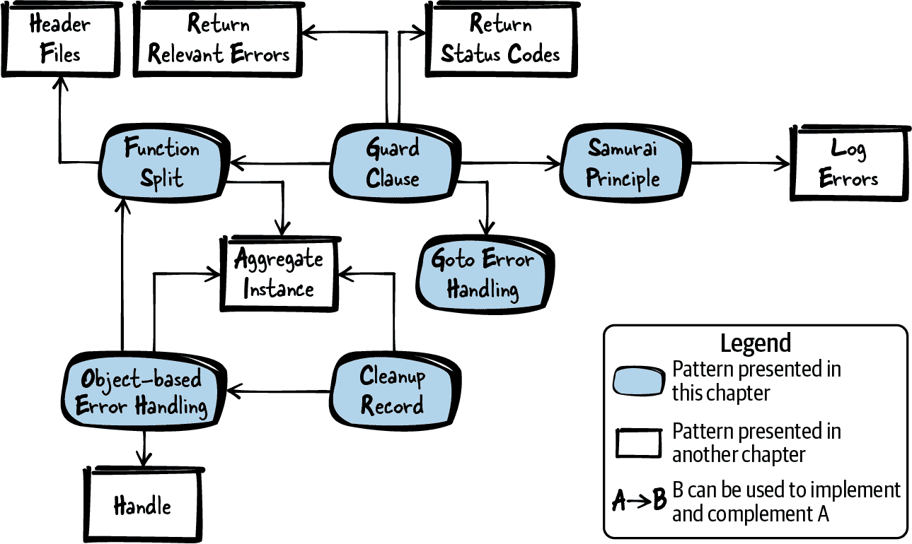

# 第一章 错误处理

错误处理是编写软件的重要部分，如果处理不当，软件将变得难以扩展和维护。像 C++ 或 Java 这样的编程语言提供了“异常”和“析构函数”，使错误处理变得更加容易。这些机制在 C 语言中并非原生支持，而关于在 C 中良好错误处理的文献则广泛分布在互联网上。

本章提供了关于良好错误处理的汇总知识，以 C 错误处理模式的形式和一个运行示例来应用这些模式。这些模式提供了良好的实践设计决策，并详细说明了何时应用它们及其带来的后果。对于程序员来说，这些模式消除了做出许多细粒度决策的负担。相反，程序员可以依赖这些模式中呈现的知识，并将它们作为编写良好代码的起点。

图 1-1 展示了本章涵盖的模式概述及其关系，而表 1-1 提供了模式的摘要。



###### 图 1-1\. 错误处理模式概述

表 1-1\. 错误处理模式

|  | 模式名称 | 摘要 |
| --- | --- | --- |
|  | 分割函数 | 函数具有多个责任，这使得函数难以阅读和维护。因此，将其拆分。从函数中找出一个看似独立有用的部分，创建一个新函数，并调用该函数。 |
|  | 卫语句 | 如果函数将前置条件检查与函数的主要程序逻辑混合在一起，那么这个函数将变得难以阅读和维护。因此，检查是否存在强制前置条件，并在不满足这些前置条件时立即返回函数。 |
|  | 武士道原则 | 在返回错误信息时，你假设调用者会检查这些信息。然而，调用者可以简单地忽略此检查，错误可能会被忽略。因此，要么成功返回，要么一败涂地。如果存在无法处理错误的情况，则终止程序。 |
|  | Goto 错误处理 | 如果在函数内部获取并清理多个资源，代码会变得难以阅读和维护。因此，将所有资源清理和错误处理放在函数末尾。如果无法获取资源，则使用`goto`语句跳转到资源清理代码。 |
|  | 清理记录 | 如果代码获取并清理多个资源，特别是这些资源彼此依赖，那么很难使代码易于阅读和维护。因此，调用资源获取函数，只要它们成功，存储需要清理的函数。根据这些存储的值调用清理函数。 |
|  | 基于对象的错误处理 | 在一个函数中具有多个责任，如资源获取、资源清理和使用该资源，使得该代码难以实现、阅读、维护和测试。因此，将初始化和清理分别放入不同的函数中，类似于面向对象编程中构造函数和析构函数的概念。 |

# 运行示例

你想实现一个函数，它能解析文件以查找特定关键词，并返回关键词被找到的信息。

在 C 语言中，指示错误情况的标准方法是通过函数的返回值提供这些信息。为了提供额外的错误信息，传统的 C 函数通常会设置`errno`变量（见*errno.h*）为特定的错误代码。调用者可以检查`errno`以获取有关错误的信息。

然而，在下面的代码中，你只需使用返回值而不是`errno`，因为你不需要非常详细的错误信息。你提出了以下初始代码片段：

```cpp
int parseFile(char* file_name)
{
  int return_value = ERROR;
  FILE* file_pointer = 0;
  char* buffer = 0;

  if(file_name!=NULL)
  {
    if(file_pointer=fopen(file_name, "r"))
    {
      if(buffer=malloc(BUFFER_SIZE))
      {
        /* parse file content*/
        return_value = NO_KEYWORD_FOUND;
        while(fgets(buffer, BUFFER_SIZE, file_pointer)!=NULL)
        {
          if(strcmp("KEYWORD_ONE\n", buffer)==0)
          {
            return_value = KEYWORD_ONE_FOUND_FIRST;
            break;
          }
          if(strcmp("KEYWORD_TWO\n", buffer)==0)
          {
            return_value = KEYWORD_TWO_FOUND_FIRST;
            break;
          }
        }
        free(buffer);
      }
      fclose(file_pointer);
    }
  }
  return return_value;
}
```

在代码中，你必须检查函数调用的返回值以了解是否发生错误，因此你的代码最终会出现深层嵌套的`if`语句。这导致以下问题：

+   函数过长且混合了错误处理、初始化、清理和功能性代码。这使得维护代码变得困难。

+   主要读取和解释文件数据的代码深层嵌套在`if`子句中，这使得跟踪程序逻辑变得困难。

+   清理函数与其初始化函数相隔甚远，这使得容易忘记某些清理工作。特别是如果函数包含多个返回语句。

要改进事情，你首先执行一个功能分割。

# 功能分割

## 上下文

你有一个执行多个操作的函数。例如，它分配资源（如动态内存或某个文件句柄），使用这些资源，并清理它们。

## 问题

**该函数具有多个责任，这使得函数难以阅读和维护。**

这样的函数可能负责分配资源、对这些资源进行操作并清理这些资源。也许清理甚至散布在函数中，并在某些地方重复。特别是在处理资源分配失败的错误处理时，这种函数很难阅读，因为很多情况下会导致嵌套的`if`语句。

在一个函数中处理多个资源的分配、清理和使用会容易忘记清理资源，特别是如果稍后更改代码。例如，如果在代码中间添加了返回语句，则很容易忘记清理在函数的那一点上已经分配的资源。

## 解决方案

**将其拆分开来。拿出似乎可以独立使用的函数部分，创建一个新函数，并调用该函数。**

要找出函数中要隔离的部分，只需检查是否可以给它一个有意义的名称，并且是否将责任分离。例如，这可能导致一个函数仅包含功能代码，另一个函数仅包含错误处理代码。

函数是否应该分割的一个很好的指标是，如果它包含对同一资源的清理多次出现在函数中。在这种情况下，最好将代码拆分为一个函数来分配和清理资源，以及一个函数来使用这些资源。使用资源的被调函数可以轻松地具有多个返回语句，而无需在每个返回语句之前清理资源，因为这在另一个函数中已经完成了。以下是示例代码：

```cpp
void someFunction()
{
  char* buffer = malloc(LARGE_SIZE);
  if(buffer)
  {
    mainFunctionality(buffer);
  }
  free(buffer);
}

void mainFunctionality()
{
  // implementation goes here
}
```

现在，你有两个函数而不是一个。当然，调用函数不再是自包含的，而是依赖于另一个函数。你必须确定将另一个函数放在哪里。第一步是将它放在与调用函数相同的文件中，但如果这两个函数没有紧密耦合，可以考虑将被调函数放入单独的实现文件，并包含该函数的头文件声明。

## 结果

你改进了代码，因为两个短函数比一个长函数更容易阅读和维护。例如，代码更易于阅读，因为清理函数与需要清理的函数更接近，并且资源分配和清理不会与主程序逻辑混合。这使得主程序逻辑更易于维护，并在以后扩展其功能时更易于扩展。

现在，由于调用函数在单个点上进行了清理，因此被调函数现在可以轻松包含多个返回语句。

如果被调函数使用了许多资源，则还必须将所有这些资源传递给该函数。有很多函数参数会使代码难以阅读，并且在调用函数时意外更改参数的顺序可能导致编程错误。为了避免这种情况，你可以在这种情况下使用聚合实例。

## 已知用途

下面的示例展示了这种模式的应用：

+   几乎所有的 C 代码都包含应用这种模式的部分和不适用这种模式的部分，因此很难维护。根据 Robert C. Martin（Prentice Hall，2008）的书籍《Clean Code: A Handbook of Agile Software Craftsmanship》，每个函数应该只有一个责任（单一责任原则），因此资源处理和其他程序逻辑应始终拆分为不同的函数。

+   这种模式在 Portland Pattern Repository 中称为函数包装器。

+   对于面向对象编程，模板方法模式还描述了一种通过拆分代码来结构化代码的方式。

+   函数何时以及何地拆分的标准在马丁·福勒（Martin Fowler）的《重构：改善既有代码的设计》（Addison-Wesley, 1999）中有详细描述，被称为提取方法模式。

+   游戏 NetHack 在其函数 `read_config_file` 中应用了这种模式，该函数处理资源，并调用函数 `parse_conf_file`，后者再对这些资源进行操作。

+   OpenWrt 代码在多个地方使用此模式进行缓冲区处理。例如，负责 MD5 计算的代码分配了一个缓冲区，将此缓冲区传递给另一个函数，该函数对该缓冲区进行操作，然后清理该缓冲区。

## 应用于运行示例

您的代码看起来已经好多了。现在不再是一个巨大的函数，而是拥有两个具有明确职责的大型函数。一个函数负责获取和释放资源，另一个函数负责搜索关键字，如下面的代码所示：

```cpp
int searchFileForKeywords(char* buffer, FILE* file_pointer)
{
  while(fgets(buffer, BUFFER_SIZE, file_pointer)!=NULL)
  {
    if(strcmp("KEYWORD_ONE\n", buffer)==0)
    {
      return KEYWORD_ONE_FOUND_FIRST;
    }
    if(strcmp("KEYWORD_TWO\n", buffer)==0)
    {
      return KEYWORD_TWO_FOUND_FIRST;
    }
  }
  return NO_KEYWORD_FOUND;
}

int parseFile(char* file_name)
{
  int return_value = ERROR;
  FILE* file_pointer = 0;
  char* buffer = 0;

  if(file_name!=NULL)
  {
    if(file_pointer=fopen(file_name, "r"))
    {
      if(buffer=malloc(BUFFER_SIZE))
      {
        return_value = searchFileForKeywords(buffer, file_pointer);
        free(buffer);
      }
      fclose(file_pointer);
    }
  }
  return return_value;
}
```

`if` 嵌套的深度减少了，但函数 `parseFile` 仍包含三个检查资源分配错误的 `if` 语句，这实在太多了。您可以通过实现守卫条款来使该函数更加清晰。

# 守卫条款

## 上下文

您有一个函数执行一个仅在某些条件（如有效输入参数）下才能成功完成的任务。

## 问题

**由于将前置条件检查与函数的主程序逻辑混合在一起，使得函数难以阅读和维护。**

分配资源总是需要进行清理。如果分配了一个资源，然后后来发现函数的另一个前置条件未满足，那么这个资源也必须清理掉。

如果函数中分散存在多个前置条件检查（特别是这些检查实现在嵌套的 `if` 语句中），那么很难跟踪程序流程。当存在许多此类检查时，函数本身会变得非常长，这本身就是一个代码发臭的迹象。

# 代码发臭

如果代码结构混乱或以难以维护的方式编程，那么代码就会“发臭”。代码发臭的例子包括非常长的函数或重复的代码。更多代码发臭的例子和对策可以在马丁·福勒的《重构：改善既有代码的设计》（Addison-Wesley, 1999）中找到。

## 解决方案

**检查是否具有强制性前置条件，如果不满足这些前置条件，则立即从函数返回。**

例如，检查输入参数的有效性，或者检查程序是否处于允许执行函数其余部分的状态。仔细考虑您希望设置的调用函数前置条件的类型。一方面，对于允许作为函数输入的内容非常严格会让您的生活更加轻松，但另一方面，如果对可能的输入更加宽容（如 Postel 法则所述：“在你的行为上要保守，在你接受他人的输入时要宽容”），这会让调用者的生活更轻松。

如果有很多前置条件检查，可以调用一个单独的函数来执行这些检查。无论如何，在分配任何资源之前执行这些检查非常重要，因为这样在函数中返回时不需要清理资源。

在函数接口中清楚地描述函数的前置条件。最好的文档位置是在声明函数的头文件中描述这种行为。

如果调用者重视未满足的前置条件，您可以向调用者提供错误信息。例如，您可以返回状态码，但请确保仅返回相关错误。以下代码显示了一个不返回错误信息的示例：

*someFile.h*

```cpp
/* This function operates on the 'user_input', which must not be NULL */
void someFunction(char* user_input);
```

*someFile.c*

```cpp
void someFunction(char* user_input)
{
  if(user_input == NULL)
  {
    return;
  }
  operateOnData(user_input);
}
```

## 影响

当未满足前置条件时立即返回，使代码比嵌套的`if`结构更易读。在代码中非常清楚地表明，如果未满足前置条件，则函数执行不会继续。这使得前置条件非常清晰地与代码的其余部分分离开来。

然而，某些编码指南禁止在函数中间返回。例如，对于必须正式证明的代码，通常只允许在函数的最末尾使用返回语句。在这种情况下，可以保留一个清理记录，这也是如果希望有一个集中的错误处理位置的更好选择。

## 已知使用情况

以下示例展示了这种模式的应用：

+   《Portland Pattern Repository》中描述了守卫条款。

+   Klaus Renzel 的文章“Error Detection”（1997 年第二届 EuroPLoP 会议论文集）描述了非常相似的错误检测模式，建议引入前置条件和后置条件检查。

+   游戏 NetHack 在其代码中的多处使用了这种模式，例如在`placebc`函数中。该函数给 NetHack 英雄戴上一条链，作为惩罚，减慢英雄的移动速度。如果没有链条对象可用，函数将立即返回。

+   OpenSSL 代码也采用了这种模式。例如，在`SSL_new`函数中，如果输入参数无效，函数将立即返回。

+   Wireshark 代码中的`capture_stats`负责在侦听网络数据包时收集统计信息，首先检查其输入参数的有效性，如果参数无效，则立即返回。

## 应用到运行示例

以下代码展示了 `parseFile` 函数如何应用守卫条款来检查函数的前置条件：

```cpp
int parseFile(char* file_name)
{
  int return_value = ERROR;
  FILE* file_pointer = 0;
  char* buffer = 0;

  if(file_name==NULL) 
  {
    return ERROR;
  }
  if(file_pointer=fopen(file_name, "r"))
  {
    if(buffer=malloc(BUFFER_SIZE))
    {
      return_value = searchFileForKeywords(buffer, file_pointer);
      free(buffer);
    }
    fclose(file_pointer);
  }
  return return_value;
}
```


如果提供了无效的参数，我们立即返回，因为尚未获取任何资源，所以不需要清理工作。

该代码使用返回状态码来实现守卫条款。在特定情况下，比如空参数，它返回常量 `ERROR`。调用者现在可以检查返回值，以知道是否提供了无效的 `NULL` 参数。但这样的无效参数通常表示编程错误，检查编程错误并在代码内传播此信息并不是一个好主意。在这种情况下，简单地应用武士道原则更为简单。

# 武士道原则

## 上下文

你的代码中有一些复杂的错误处理，而且有些错误非常严重。你的系统不执行安全关键的操作，高可用性并不十分重要。

## 问题

**当返回错误信息时，你假设调用者会检查这些信息。然而，调用者可以简单地省略此检查，错误可能会被忽略。**

在 C 语言中，不强制检查调用函数的返回值，你的调用者可以简单地忽略函数的返回值。如果在你的函数中发生的错误非常严重，而且调用者无法优雅地处理，你不希望调用者决定是否以及如何处理错误。相反，你希望确保一定会采取某种行动。

即使调用者处理了错误情况，程序往往仍然会崩溃或出现一些错误。错误可能会简单地显示在其他地方——也许是调用者的调用者代码中，可能不正确地处理错误情况。在这种情况下，处理错误会掩盖错误，这使得调试错误以找出根本原因变得更加困难。

你的代码中可能会很少发生一些错误。为了这些情况返回状态码并在调用者的代码中处理它们，会使代码变得不够清晰，因为它会分散注意力，远离主程序逻辑和调用者代码的实际目的。调用者可能需要编写许多行代码来处理很少发生的情况。

返回这种错误信息还带来了如何实际返回信息的问题。使用返回值或输出参数来返回错误信息会使函数的签名变得更复杂，使代码更难理解。因此，你不希望为函数添加仅用于返回错误信息的额外参数。

## 解决方案

**要么函数成功返回，要么不返回（武士道原则）。如果有一种情况，你知道错误无法处理，那么就中止程序。**

不要使用输出参数或返回值返回错误信息。您已经掌握了所有的错误信息，所以立即处理错误。如果发生错误，只需让程序崩溃。通过使用`assert`语句以结构化的方式中止程序。此外，您可以像下面的代码中所示使用`assert`语句提供调试信息：

```cpp
void someFunction()
{
  assert(checkPreconditions() && "Preconditions are not met");
  mainFunctionality();
}
```

这段代码检查`assert`语句中的条件，如果条件不为真，则会打印`assert`语句及右侧的字符串到`stderr`，并且程序会中止。在不检查`NULL`指针并访问这类指针的情况下，以较少结构的方式中止程序也是可以的。确保程序在发生错误的地方崩溃即可。

通常情况下，守卫条款是在发生错误时中止程序的良好选择。例如，如果您知道发生了编码错误（如果调用者提供了`NULL`指针），则应中止程序并记录调试信息，而不是向调用者返回错误信息。但是，并不是每种错误都应该中止程序。例如，像无效的用户输入这样的运行时错误绝对不应导致程序中止。

调用者必须充分了解函数的行为，因此您必须在函数的 API 文档中记录函数在哪些情况下会导致程序崩溃。例如，函数文档必须说明如果函数的参数是`NULL`指针时程序是否会崩溃。

当然，并非所有错误或所有应用程序领域都适合采用武士原则。在某些意外用户输入的情况下，您不希望让程序崩溃。但是，在编程错误的情况下，迅速失败并让程序崩溃是合适的。这使得程序员更容易找到错误。

然而，这种崩溃并不一定要显示给用户。如果您的程序只是较大应用程序的一部分而且不是关键部分，则您可能仍希望程序崩溃。但是在整个应用程序的上下文中，您的程序可能会悄悄地失败，以免干扰其余的应用程序或用户。

# 发行版可执行文件中的断言

当使用`assert`语句时，会讨论是否仅在调试可执行文件中激活它们，或者是否还应在发布可执行文件中激活它们。可以通过在包含*assert.h*之前在您的代码中定义宏`NDEBUG`或直接在工具链中定义宏来停用`assert`语句。停用发布可执行文件中的`assert`语句的主要论据是，当测试调试可执行文件时，您已经捕获了使用`assert`的编程错误，因此在发布可执行文件中不需要因为`assert`而导致程序中止的风险。在发布可执行文件中也激活`assert`语句的主要论据是，您无论如何都会为不能优雅处理的关键错误使用它们，这些错误甚至在由您的客户使用的发布可执行文件中也不应被忽视。

## 后果

错误因为它在出现的地方被处理了，所以不能被忽视。调用者不必担心必须检查此错误，因此调用者代码变得更简单。然而，现在调用者无法选择如何对错误做出反应。

在某些情况下，中止应用程序是可以接受的，因为快速崩溃比后续的不可预测行为更好。但是，您必须考虑如何向用户呈现此类错误。也许用户会在屏幕上看到中止语句。然而，对于使用传感器和执行器与环境进行交互的嵌入式应用程序，您必须更加小心，并考虑中止程序对环境的影响以及这是否可以接受。在许多这种情况下，应用程序可能需要更强大，简单地中止应用程序将是不可接受的。

在程序中止并在错误显示的地方记录错误可以更容易地找到和修复错误，因为错误没有伪装。因此，长期以来，通过应用这种模式，您最终会得到更强大和无缺陷的软件。

## 已知的用途

以下示例显示了此模式的应用：

+   建议将调试信息字符串添加到`assert`语句的类似模式称为断言上下文，并在《C 语言模式》（Adam Tornhill 著，Leanpub，2014）中进行了描述。

+   Wireshark 网络嗅探器在其代码中应用了这种模式。例如，函数`register_capture_dissector`使用`assert`来检查解析器的注册是否唯一。

+   Git 项目的源代码使用`assert`语句。例如，用于存储 SHA1 哈希值的函数使用`assert`来检查文件路径是否正确。

+   OpenWrt 代码负责处理大数字，在其函数中使用`assert`语句来检查前置条件。

+   Pekka Alho 和 Jari Rauhamäki 在文章[“分布式控制系统中的轻量级容错和解耦设计模式”](https://oreil.ly/x0tQW)中提出了名为“让它崩溃”的类似模式。该模式针对分布式控制系统，建议让单个故障安全进程崩溃，然后快速重启。

+   C 标准库函数`strcpy`不会检查有效的用户输入。如果向函数提供`NULL`指针，它会崩溃。

## 应用于运行示例

`parseFile`函数现在看起来好多了。现在不再返回错误代码，而是使用了简单的`assert`语句。这使得以下代码更简洁，调用代码的调用者不必再检查返回值：

```cpp
int parseFile(char* file_name)
{
  int return_value = ERROR;
  FILE* file_pointer = 0;
  char* buffer = 0;

  assert(file_name!=NULL && "Invalid filename");
  if(file_pointer=fopen(file_name, "r"))
  {
    if(buffer=malloc(BUFFER_SIZE))
    {
      return_value = searchFileForKeywords(buffer, file_pointer);
      free(buffer);
    }
    fclose(file_pointer);
  }
  return return_value;
}
```

虽然消除了不需要资源清理的`if`语句，但代码仍然包含需要清理的嵌套`if`语句。此外，如果`malloc`调用失败，您尚未处理错误情况。通过使用 Goto 错误处理可以改善所有这些情况。

# 使用 Goto 错误处理

## 上下文

您有一个获取和清理多个资源的函数。也许您已经尝试通过应用守护条款、函数拆分或武士原则来减少复杂性，但由于资源获取，代码中仍然存在深度嵌套的`if`结构。您甚至可能为资源清理编写了重复的代码。

## 问题

**如果在函数内的不同位置获取并清理多个资源，则代码变得难以阅读和维护。**

这样的代码变得困难，因为通常每个资源获取都可能失败，并且每个资源清理只有在成功获取资源时才能调用。要实现这一点，需要大量的`if`语句，当实现不良时，在单个函数中嵌套的`if`语句使代码难以阅读和维护。

由于必须清理资源，所以当出现问题时在函数中间返回并不是一个好选择。这是因为必须在每个返回语句之前清理已获取的所有资源。因此，您将在代码中多个点上清理同一资源，但不希望有重复的错误处理和清理代码。

## 解决方案

**请在函数末尾进行所有资源清理和错误处理。如果无法获取资源，请使用`goto`语句跳转到资源清理代码。**

按照需要的顺序获取资源，并在函数末尾按相反顺序清理资源。对于资源清理，为每个清理函数设置单独的标签，可以在发生错误或无法获取资源时跳转到该标签，但不要多次跳转，并且只像以下代码中所示那样向前跳转：

```cpp
void someFunction()
{
  if(!allocateResource1())
  {
    goto cleanup1;
  }
  if(!allocateResource2())
  {
    goto cleanup2;
  }
  mainFunctionality();
cleanup2:
  cleanupResource2();
cleanup1:
  cleanupResource1();
}
```

如果您的编码标准禁止使用 `goto` 语句，则可以在您的代码周围使用 `do{ ... }while(0);` 循环来模拟它。发生错误时，使用 `break` 跳转到循环的末尾，在那里放置您的错误处理。然而，通常这种解决方法是一个坏主意，因为如果您的编码标准不允许使用 `goto`，那么您也不应该模拟它，以便继续按照自己的风格编程。您可以使用清理记录作为 `goto` 的替代方案。

无论如何，使用 `goto` 的情况可能仅仅是您的函数已经太复杂的一个指标，例如使用基于对象的错误处理分割函数可能是一个更好的想法。

# goto：好还是坏？

关于使用 `goto` 是否好还是坏有很多讨论。最著名的反对使用 `goto` 的文章是由 [Edsger W. Dijkstra](https://oreil.ly/yXkyq) 撰写的，他认为它会模糊程序流程。如果 `goto` 用于在程序中来回跳转，那么这是正确的，但在 C 语言中，`goto` 不能像 Dijkstra 所写的编程语言那样被滥用。（在 C 语言中，您只能在函数内部使用 `goto`。）

## 后果

函数是单一返回点，主程序流程与错误处理和资源清理分离良好。不再需要嵌套的 `if` 语句来实现此功能，但并非所有人都习惯和喜欢阅读 `goto` 语句。

如果使用 `goto` 语句，必须小心，因为很容易用于除错误处理和清理之外的其他事情，这肯定会使代码难以阅读。此外，必须特别小心确保在正确的标签上有正确的清理函数。将清理函数放错标签是一个常见的陷阱。

## 已知用途

下面的示例展示了这种模式的应用：

+   Linux 内核代码主要使用基于 `goto` 的错误处理。例如，[*Linux 设备驱动程序*](https://oreil.ly/linux-device-drivers) 由 Alessandro Rubini 和 Jonathan Corbet（O’Reilly，2001）描述了用于编程 Linux 设备驱动程序的基于 `goto` 的错误处理。

+   *The CERT C 编码标准* 由 Robert C. Seacord（Addison-Wesley Professional，2014）建议在错误处理中使用 `goto`。

+   使用 `do-while` 循环来模拟 `goto` 的方法在 Portland Pattern Repository 中描述为 Trivial Do-While-Loop 模式。

+   OpenSSL 代码使用 `goto` 语句。例如，处理 X509 证书的函数使用 `goto` 跳转到中央错误处理器。

+   Wireshark 代码使用 `goto` 语句从其 `main` 函数跳转到该函数末尾的中央错误处理器。

## 应用于运行示例

尽管很多人强烈反对使用 `goto` 语句，但与之前的代码示例相比，错误处理要好得多。在下面的代码中，没有嵌套的 `if` 语句，并且清理代码与主程序流程分离良好：

```cpp
int parseFile(char* file_name)
{
  int return_value = ERROR;
  FILE* file_pointer = 0;
  char* buffer = 0;

  assert(file_name!=NULL && "Invalid filename");
  if(!(file_pointer=fopen(file_name, "r")))
  {
    goto error_fileopen;
  }
  if(!(buffer=malloc(BUFFER_SIZE)))
  {
    goto error_malloc;
  }
  return_value = searchFileForKeywords(buffer, file_pointer);
  free(buffer);
error_malloc:
  fclose(file_pointer);
error_fileopen:
  return return_value;
}
```

现在，假设您不喜欢`goto`语句，或者您的编码指南禁止使用它们，但仍然需要清理您的资源。还有其他替代方案。例如，您可以简单地使用清理记录。

# 清理记录

## 上下文

您有一个函数用于获取和清理多个资源。也许您已经尝试通过应用守护条款、函数分割或武士原则来减少复杂性，但由于资源获取，您的代码仍然具有深度嵌套的`if`结构。您甚至可能为资源清理使用了重复的代码。您的编码标准不允许您实现 Goto 错误处理，或者您不想使用`goto`。

## 问题

**如果该代码获取和清理多个资源（特别是这些资源彼此依赖），那么要使代码易于阅读和维护就很困难。**

这很困难，因为通常每个资源获取都可能失败，并且只有在成功获取资源时才能调用每个资源清理。要实现这一点，需要大量的`if`语句，而且如果实现不当，在单个函数中嵌套`if`语句会使代码难以阅读和维护。

因为您必须清理资源，所以在函数执行过程中出现问题时立即返回并不是一个好选择。这是因为在每个返回语句之前都必须清理已获取的所有资源。因此，代码中会出现多个地方需要清理相同的资源，但您不希望重复处理错误和清理代码。

## 解决方案

**只要成功调用资源获取函数，并存储需要清理的函数。根据这些存储的值调用清理函数。**

在 C 语言中，可以使用`if`语句的惰性求值来实现这一点。只需在单个`if`语句内调用一系列函数，只要这些函数成功执行即可。对于每个函数调用，将获取的资源存储在变量中。在`if`语句的主体中对资源进行操作，并且仅当成功获取资源时，才在`if`语句后进行所有资源清理。以下代码展示了这样的一个例子：

```cpp
void someFunction()
{
  if((r1=allocateResource1()) && (r2=allocateResource2()))
  {
    mainFunctionality();
  }
  if(r1) 
  {
    cleanupResource1();
  }
  if(r2) 
  {
    cleanupResource2();
  }
}
```


为了使代码更易于阅读，您可以选择将这些检查放在清理函数内部。如果您必须向清理函数提供资源变量，这是一个不错的方法。

## 结果

现在，您不再有嵌套的`if`语句，但仍然在函数末尾有一个中心点进行资源清理。这使得代码更易于阅读，因为主程序流不再被错误处理所遮蔽。

此外，该函数易于阅读，因为它具有单一的退出点。然而，需要许多变量来跟踪哪些资源成功分配，使得代码变得更加复杂。也许聚合实例可以帮助结构化资源变量。

如果正在获取许多资源，则在单个`if`语句中调用许多函数。这使得`if`语句非常难以阅读，甚至更难调试。因此，如果正在获取许多资源，则基于对象的错误处理是一个更好的解决方案。

采用基于对象的错误处理的另一个原因是，先前的代码仍然很复杂，因为它包含了主功能以及资源分配和清理的单个函数。因此，一个函数具有多个责任。

## 已知用途

以下示例展示了该模式的应用：

+   在波特兰模式库中，介绍了一个类似的解决方案，其中每个被调用的函数向回调列表注册一个清理处理程序。在清理时，调用回调列表中的所有函数。

+   OpenSSL 函数`dh_key2buf`使用延迟评估的`if`语句来跟踪分配的字节，然后稍后进行清理。

+   Wireshark 网络嗅探器的函数`cap_open_socket`使用延迟评估`if`语句并将在此`if`语句中分配的资源存储在变量中。在清理时，这些变量会被检查，如果资源分配成功，则清理资源。

+   OpenWrt 源代码的`nvram_commit`函数在`if`语句中分配其资源，并将这些资源存储在该`if`语句的变量中。

## 应用于运行示例

现在，不再使用`goto`语句和嵌套的`if`语句，而是使用单个`if`语句。不使用`goto`语句的优势在于，错误处理与主程序流程很好地分离：

```cpp
int parseFile(char* file_name)
{
  int return_value = ERROR;
  FILE* file_pointer = 0;
  char* buffer = 0;

  assert(file_name!=NULL && "Invalid filename");
  if((file_pointer=fopen(file_name, "r")) &&
     (buffer=malloc(BUFFER_SIZE)))
  {
    return_value = searchFileForKeywords(buffer, file_pointer);
  }
  if(file_pointer)
  {
    fclose(file_pointer);
  }
  if(buffer)
  {
    free(buffer);
  }
  return return_value;
}
```

尽管如此，代码看起来仍然不太好。这个函数具有太多的责任：资源分配、资源释放、文件处理和错误处理。这些责任应该分为不同的函数，并采用基于对象的错误处理。

# 基于对象的错误处理

## 上下文

您有一个函数负责获取和清理多个资源。也许您已经尝试通过应用守护条款、函数拆分或武士原则来减少复杂性，但由于资源获取而仍然存在深层嵌套的`if`结构。您甚至可能因资源清理而重复使用代码。但是，也许您已经通过使用 Goto 错误处理或清理记录摆脱了嵌套的`if`语句。

## 问题

**在一个函数中具有多个责任，如资源获取、资源清理和资源使用，使得该代码难以实现、阅读、维护和测试。**

所有这些变得困难是因为通常每个资源获取都可能失败，并且每个资源清理只能在成功获取资源时调用。为了实现这一点，需要大量的`if`语句，而且实现不当时，在单个函数中嵌套的`if`语句使得代码难以阅读和维护。

因为您必须清理资源，所以在函数中间发生错误时返回并不是一个好选择。这是因为在每个返回语句之前都必须清理已经获取的所有资源。因此，您会在代码中的多个点上清理相同的资源，但是您不希望有重复的错误处理和清理代码。

即使您已经有了清理记录或跳转到错误处理，该函数仍然很难阅读，因为它混合了不同的责任。该函数负责获取多个资源、错误处理和清理多个资源。然而，一个函数应该只有一个责任。

## 解决方案

**将初始化和清理分开成单独的函数，类似于面向对象编程中构造函数和析构函数的概念。**

在您的主函数中，只需调用一个函数来获取所有资源，一个函数来对这些资源进行操作，以及一个函数来清理这些资源。

如果获取的资源不是全局的，那么您必须将资源沿函数传递。当您拥有多个资源时，可以通过传递一个包含所有资源的聚合实例来进行传递。如果您想要隐藏来自调用者的实际资源，则可以使用句柄来在函数之间传递资源信息。

如果资源分配失败，将此信息存储在一个变量中（例如，如果内存分配失败，则为`NULL`指针）。在使用或清理资源时，首先检查资源是否有效。将此检查放在被调用的函数中，而不是在您的主函数中，因为这样可以使您的主函数更易读：

```cpp
void someFunction()
{
  allocateResources();
  mainFunctionality();
  cleanupResources();
}
```

## 后果

现在该函数很容易阅读。虽然它需要分配和清理多个资源以及对这些资源的操作，但这些不同的任务仍然被很好地分离到不同的函数中。

拥有像对象一样的实例，将它们沿函数传递被称为“基于对象”的编程风格。这种风格使得过程式编程更类似于面向对象编程，因此用这种风格编写的代码对于习惯于面向对象的程序员来说也更加熟悉。

在主函数中，不再有多个返回语句的理由，因为不再有嵌套的`if`语句来处理资源分配和清理的逻辑。当然，你并没有消除关于资源分配和清理的逻辑。所有这些逻辑仍然存在于分离的函数中，但不再与资源操作混合在一起。

现在不再有单一的函数，而是多个函数。虽然这可能对性能产生负面影响，但通常影响不大。性能影响很小，对大多数应用程序来说并不重要。

## 已知用途

以下示例展示了这种模式的应用：

+   这种清理形式被应用于面向对象编程中，其中构造函数和析构函数被隐式调用。

+   OpenSSL 代码使用了这种模式。例如，使用函数`BUF_MEM_new`和`BUF_MEM_free`来实现缓冲区的分配和清理，在整个代码中调用这些函数来处理缓冲区。

+   OpenWrt 源代码的`show_help`函数在上下文菜单中显示帮助信息。该函数调用一个初始化函数来创建一个`struct`，然后操作该`struct`并调用一个函数来清理该`struct`。

+   Git 项目的`cmd__windows_named_pipe`函数使用句柄创建管道，然后操作该管道，并调用一个单独的函数清理管道。

## 应用于运行示例

最终你得到以下代码，其中`parseFile`函数调用其他函数来创建和清理解析器实例：

```cpp
typedef struct
{
  FILE* file_pointer;
  char* buffer;
}FileParser;

int parseFile(char* file_name)
{
  int return_value;
  FileParser* parser = createParser(file_name);
  return_value = searchFileForKeywords(parser);
  cleanupParser(parser);
  return return_value;
}

int searchFileForKeywords(FileParser* parser)
{
  if(parser == NULL)
  {
    return ERROR;
  }
  while(fgets(parser->buffer, BUFFER_SIZE, parser->file_pointer)!=NULL)
  {
    if(strcmp("KEYWORD_ONE\n", parser->buffer)==0)
    {
      return KEYWORD_ONE_FOUND_FIRST;
    }
    if(strcmp("KEYWORD_TWO\n", parser->buffer)==0)
    {
      return KEYWORD_TWO_FOUND_FIRST;
    }
  }
  return NO_KEYWORD_FOUND;
}

FileParser* createParser(char* file_name)
{
  assert(file_name!=NULL && "Invalid filename");
  FileParser* parser = malloc(sizeof(FileParser));
  if(parser)
  {
    parser->file_pointer=fopen(file_name, "r");
    parser->buffer = malloc(BUFFER_SIZE);
    if(!parser->file_pointer || !parser->buffer)
    {
      cleanupParser(parser);
      return NULL;
    }
  }
  return parser;
}

void cleanupParser(FileParser* parser)
{
  if(parser)
  {
    if(parser->buffer)
    {
      free(parser->buffer);
    }
    if(parser->file_pointer)
    {
      fclose(parser->file_pointer);
    }
    free(parser);
  }
}
```

在代码中，主程序流程中不再有`if`级联。这使得`parseFile`函数更易于阅读、调试和维护。主函数不再处理资源分配、资源释放或错误处理的细节。相反，这些细节都放在单独的函数中，使得每个函数只负责一项职责。

比较最终代码示例与第一个代码示例的美观之处。逐步应用的模式有助于使代码更易于阅读和维护。在每一步中，嵌套的`if`级联被移除，错误处理方法也得到了改进。

# 概要

本章向您展示了如何在 C 中执行错误处理。函数分割建议您将函数分割为更小的部分，以便更轻松地处理这些部分的错误。函数的守卫条款检查函数的前置条件，如果不满足则立即返回。这样做可以减少函数其余部分的错误处理义务。除了从函数返回之外，您还可以中止程序，遵循武士原则。在处理更复杂的错误处理时，特别是与获取和释放资源结合时，您有几个选择。使用 Goto 错误处理可以在函数中向前跳转到错误处理部分。而不是跳转，清理记录存储信息，哪些资源需要清理，并在函数结束时执行它。一种更接近面向对象编程的资源获取方法是基于对象的错误处理，它使用类似构造函数和析构函数的独立初始化和清理函数的概念。

有了这些错误处理模式，您现在具备了编写处理错误情况的小程序的技能，确保代码易于维护。

# 进一步阅读

如果您已经准备好进一步了解，以下是一些资源，可以帮助您深入了解错误处理的知识。

+   [波特兰模式库](https://oreil.ly/qFLdA)提供了许多关于错误处理以及其他主题的模式和讨论。大多数错误处理模式针对异常处理或如何使用断言，但也介绍了一些 C 模式。

+   总结了错误处理的全面概述，在 Thomas Aglassinger（1999 年，奥卢大学）的硕士论文“结构化和面向对象编程语言中的错误处理”中有详细描述。该论文阐述了不同类型的错误如何产生；讨论了 C、Basic、Java 和 Eiffel 编程语言的错误处理机制；并提供了这些语言中的错误处理最佳实践，例如资源清理顺序与其分配顺序相反。论文还提到了几个第三方解决方案，例如使用`setjmp`和`longjmp`命令进行异常处理的 C 库。

+   展示了针对商业信息系统定制的 15 种面向对象的错误处理模式，文章名为[“面向商业信息系统的错误处理”](https://oreil.ly/bQnfx)，由 Klaus Renzel 撰写，大多数模式也可以应用于非面向对象的领域。介绍的模式涵盖了错误检测、错误日志记录和错误处理。

+   在 Adam Tornhill 的书《C 中的模式》（Leanpub，2014）中，展示了一些 Gang of Four 设计模式的实现，包括 C 代码片段。该书进一步以 C 模式的形式提供了最佳实践，其中一些涵盖了错误处理。

+   [Andy Longshaw 和 Eoin Woods](https://oreil.ly/7Yj8h)的文章《错误生成、处理和管理的模式》和《更多关于错误生成、处理和管理的模式》中呈现了一系列用于错误日志记录和错误处理的模式。大多数模式针对基于异常的错误处理。

# Outlook

下一章将向您展示如何处理查看返回错误信息的较大程序，这些错误信息跨接口返回给其他函数。这些模式告诉您应该返回哪种类型的错误信息以及如何返回它。
