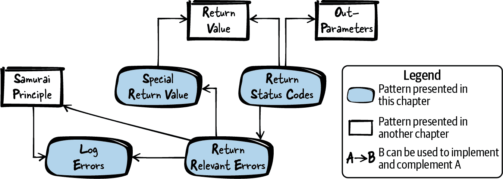

# 第二章 返回错误信息

前一章重点讨论了错误处理。本章继续讨论这个问题，但侧重于如何通知代码用户检测到的错误。

对于每个较大的程序，程序员必须决定如何处理自己代码中出现的错误，如何处理第三方代码中出现的错误，如何在代码中传递这些错误信息，以及如何向用户呈现这些错误信息。

大多数面向对象的编程语言都提供了异常的便捷机制，为程序员提供了额外的返回错误信息通道，但 C 语言并不本地提供这样的机制。有办法在 C 语言中模拟异常处理，甚至在异常之间实现继承，例如在 Axel-Tobias Schreiner（2011）的书籍[*Object-Oriented Programming with ANSI-C*](https://oreil.ly/YK7x1)中所描述的方式。但对于在传统 C 代码上工作的 C 程序员或者想要坚持他们习惯的本地 C 风格的 C 程序员来说，引入这样的异常机制并不是正确的方法。相反，这些 C 程序员需要指导如何使用 C 语言本地已经存在的错误处理机制。

本章提供了关于如何在函数之间和跨接口传输错误信息的指导。图 2-1 显示了本章涵盖的模式概述及其关系，表 2-1 提供了模式摘要。



###### 图 2-1\. 返回错误信息模式概览

表 2-1\. 返回错误信息的模式

|  | 模式名称 | 摘要 |
| --- | --- | --- |
|  | 返回状态码 | 您希望有一种机制将状态信息返回给调用者，以便调用者可以对其做出反应。您希望该机制易于使用，并且调用者应能够清楚地区分可能发生的不同错误情况。因此，使用函数的返回值来返回状态信息。返回代表特定状态的值。作为调用方和被调用方，您都必须对该值的含义有共同的理解。 |
|  | 返回相关错误 | 一方面，调用者应能够对错误做出反应；另一方面，您返回的错误信息越多，您和调用者的代码就必须处理错误处理，这使得代码变得更长。更长的代码更难阅读和维护，并带来额外错误的风险。因此，只有当信息对调用者有关联时，才将错误信息返回给调用者。只有当调用者能够对信息做出反应时，错误信息才与调用者相关。 |
|  | 特殊返回值 | 你想要返回错误信息，但又不想显式返回状态码，因为这会使得函数难以返回其他数据。你可以向函数添加输出参数，但这会使调用函数更加困难。因此，使用函数的返回值来返回函数计算的数据。为错误发生时保留一个或多个特殊值来返回。 |
|  | 记录错误 | 你希望确保在出现错误时能够轻松找出其原因。但是，你不希望因此使你的错误处理代码变得复杂。因此，使用不同的渠道返回对调用代码重要的错误信息和对开发人员重要的错误信息。例如，将调试错误信息写入日志文件，并且不将详细的调试错误信息返回给调用者。 |

# 运行示例

你希望实现一个软件模块，该模块提供存储由字符串标识的键对应的字符串值的功能。换句话说，你想要实现类似于 Windows 注册表的功能。为了保持简单，以下代码不包含键之间的层次关系，并且只讨论创建注册表元素的功能：

*注册表 API*

```cpp
/* Handle for registry keys */
typedef struct Key* RegKey;

/* Create a new registry key identified via the provided 'key_name' */
RegKey createKey(char* key_name);

/* Store the provided 'value' to the provided 'key' */
void storeValue(RegKey key, char* value);

/* Make the key available for being read (by other
 functions that are not part of this code example) */
void publishKey(RegKey key);
```

*注册表实现*

```cpp
#define STRING_SIZE 100
#define MAX_KEYS 40

struct Key
{
  char key_name[STRING_SIZE];
  char key_value[STRING_SIZE];
};

/* file-global array holding all registry keys */
static struct Key* key_list[MAX_KEYS];

RegKey createKey(char* key_name)
{
  RegKey newKey = calloc(1, sizeof(struct Key));
  strcpy(newKey->key_name, key_name);
  return newKey;
}

void storeValue(RegKey key, char* value)
{
  strcpy(key->key_value, value);
}

void publishKey(RegKey key)
{
  int i;
  for(i=0; i<MAX_KEYS; i++)
  {
    if(key_list[i] == NULL)
    {
      key_list[i] = key;
      return;
    }
  }
}
```

针对上述代码，你不确定在内部错误或例如无效的函数输入参数值的情况下应该如何向调用者提供错误信息。你的调用者不确定调用是否成功或是否失败，最终使用以下代码：

```cpp
RegKey my_key = createKey("myKey");
storeValue(my_key, "A");
publishKey(my_key);
```

调用者的代码非常简短且易于阅读，但调用者不知道是否发生了任何错误，也无法对错误做出反应。为了给调用者这种可能性，你希望在你的代码中引入错误处理，并为调用者提供错误信息。你首先想到的一个想法是让调用者了解软件模块中出现的任何错误。为此，你使用返回状态码。

# 返回状态码

## 上下文

你正在实现一个进行一些错误处理的软件模块，并且希望向调用者返回错误和其他状态信息。

## 问题

**你希望有一种机制来向调用者返回状态信息，以便调用者可以对其做出反应。你希望这种机制使用简单，并且调用者能够清楚地区分可能发生的不同错误情况。**

在早期的 C 语言中，错误信息通过全局变量 `errno` 的错误码传递。调用者必须重置全局变量 `errno`，然后调用函数，并且函数通过设置全局变量 `errno` 来指示错误，调用者在函数调用后必须检查此变量。

然而，与使用 `errno` 相比，你需要一种返回状态信息的方法，使调用者更容易检查错误。调用者应从函数签名中看到将返回的状态信息以及期望的状态信息类型。

此外，返回状态信息的机制应该在多线程环境中安全使用，只有被调用的函数应该有能力影响返回的状态信息。换句话说，应该可以使用该机制并仍然具有可重入函数。

## 解决方案

**使用函数的返回值来返回状态信息。返回一个代表特定状态的值。作为调用者和被调用者，必须互相理解该值的含义。**

通常，返回的值是一个数字标识符。调用者可以根据该标识符检查函数返回值，并据此做出反应。如果函数必须返回其他函数结果，则以输出参数的形式提供给调用者。

在你的 API 中定义数字状态标识符，可以使用 `enum` 或者使用 `#define`。如果有许多状态码或者你的软件模块包含多个头文件，则可以有一个单独的头文件，仅包含状态码，并由其他头文件包含。

将状态标识符命名为有意义的名称，并使用注释说明其含义。确保在整个 API 中一致地命名你的状态码。

以下代码展示了使用状态码的示例：

*调用者使用状态码的代码*

```cpp
ErrorCode status = func();
if(status == MAJOR_ERROR)
{
  /* abort program */
}
else if(status == MINOR_ERROR)
{
  /* handle error */
}
else if(status == OK)
{
  /* continue normal execution */
}
```

*调用者 API 提供状态码*

```cpp
typedef enum
{
  MINOR_ERROR,
  MAJOR_ERROR,
  OK
}ErrorCode;

ErrorCode func();
```

*调用者实现提供状态码*

```cpp
ErrorCode func()
{
  if(minorErrorOccurs())
  {
    return MINOR_ERROR;
  }
  else if(majorErrorOccurs())
  {
    return MAJOR_ERROR;
  }
  else
  {
    return OK;
  }
}
```

## 结果

现在你有了一种返回状态信息的方法，使调用者非常容易检查发生的错误。与 `errno` 相比，调用者不必在函数调用的步骤中设置和检查错误信息。相反，调用者可以直接根据函数调用的返回值检查信息。

返回状态码可以安全地在多线程环境中使用。调用者可以确保只有被调用的函数会影响返回的状态，而没有其他侧信道。

函数签名非常清楚地说明了如何返回状态信息。这对调用者、编译器或静态代码分析工具都很清楚，它们可以检查调用者是否检查了函数返回值及其可能发生的所有状态。

由于函数现在在不同的错误情况下提供不同的结果，这些结果必须进行测试。与没有任何错误处理的函数相比，必须进行更广泛的测试。此外，调用者需要负担检查这些错误情况的责任，这可能会增加调用者代码的大小。

任何 C 函数只能返回函数签名中指定类型的一个对象，且该函数现在返回状态码。因此，你必须使用更复杂的技术来返回其他函数结果。你可以使用输出参数来做到这一点，但这种方法的缺点是需要额外的参数，或者你可以返回包含状态信息和其他函数结果的聚合实例。

## 已知的使用情况

以下示例展示了该模式的应用：

+   Microsoft 使用 `HRESULT` 返回状态信息。`HRESULT` 是一个唯一的状态码。使状态码唯一的优势是可以在许多函数间传递状态信息，同时仍然可以找出该状态的来源。但使状态码唯一需要额外的努力来分配状态号并跟踪允许谁使用哪些状态号。`HRESULT` 的另一个特殊之处在于，它通过使用一些专用于返回此信息的位来编码特定信息，如错误的严重性。

+   Apache 可移植运行时代码定义了类型 `apr_status_t` 以返回错误信息。以此方式返回错误信息的任何函数在成功时返回 `APR_SUCCESS`，或通过 `#define` 语句指定的唯一定义的错误代码返回其他值。

+   OpenSSL 代码在多个头文件（*dsaerr.h*、*kdferr.h*，……）中定义了状态码。例如，状态码 `KDF_R_MISSING_PARAMETER` 或 `KDF_R_MISSING_SALT` 详细通知调用者有关缺少或错误输入参数的情况。每个文件中的状态码仅为属于该文件的特定一组函数定义，并且状态码值在整个 OpenSSL 代码中不是唯一的。

+   错误代码模式在 Portland 模式库中有描述。它描述了通过显式使用函数的返回值返回错误信息的想法。

## 应用于运行示例

现在，在你的代码中提供错误信息给调用者。在下面的代码中，你检查可能出错的情况并将该信息提供给调用者：

*Registry API*

```cpp
/* Error codes returned by this registry */
typedef enum
{
  OK,
  OUT_OF_MEMORY,
  INVALID_KEY,
  INVALID_STRING,
  STRING_TOO_LONG,
  CANNOT_ADD_KEY
}RegError;

/* Handle for registry keys */
typedef struct Key* RegKey;

/* Create a new registry key identified via the provided 'key_name'.
 Returns OK if no problem occurs, INVALID_KEY if the 'key'
 parameter is NULL, INVALID_STRING if 'key_name' is NULL,
 STRING_TOO_LONG if 'key_name' is too long, or OUT_OF_MEMORY
 if no memory resources are available. */
RegError createKey(char* key_name, RegKey* key);

/* Store the provided 'value' to the provided 'key'.
 Returns OK if no problem occurs, INVALID_KEY if the 'key'
 parameter is NULL, INVALID_STRING if 'value' is NULL, or
 STRING_TOO_LONG if 'value' is too long. */
RegError storeValue(RegKey key, char* value);

/* Make the key available for being read. Returns OK if no
 problem occurs, INVALID_KEY if 'key' is NULL, or CANNOT_ADD_KEY
 if the registry is full and no more keys can be published. */
RegError publishKey(RegKey key);
```

*Registry implementation*

```cpp
#define STRING_SIZE 100
#define MAX_KEYS 40

struct Key
{
  char key_name[STRING_SIZE];
  char key_value[STRING_SIZE];
};

/* file-global array holding all registry keys */
static struct Key* key_list[MAX_KEYS];

RegError createKey(char* key_name, RegKey* key)
{
  if(key == NULL)
  {
    return INVALID_KEY;
  }

  if(key_name == NULL)
  {
    return INVALID_STRING;
  }

  if(STRING_SIZE <= strlen(key_name))
  {
    return STRING_TOO_LONG;
  }

  RegKey newKey = calloc(1, sizeof(struct Key));
  if(newKey == NULL)
  {
    return OUT_OF_MEMORY;
  }

  strcpy(newKey->key_name, key_name);
  *key = newKey;
  return OK;
}

RegError storeValue(RegKey key, char* value)
{
  if(key == NULL)
  {
    return INVALID_KEY;
  }

  if(value == NULL)
  {
    return INVALID_STRING;
  }

  if(STRING_SIZE <= strlen(value))
  {
    return STRING_TOO_LONG;
  }

  strcpy(key->key_value, value);
  return OK;
}

RegError publishKey(RegKey key)
{
  int i;
  if(key == NULL)
  {
    return INVALID_KEY;
  }

  for(i=0; i<MAX_KEYS; i++)
  {
    if(key_list[i] == NULL)
    {
      key_list[i] = key;
      return OK;
    }
  }

  return CANNOT_ADD_KEY;
}
```

现在调用者可以对提供的错误信息做出反应，例如，可以向应用程序的用户提供有关出错原因的详细信息：

*Caller’s code*

```cpp
  RegError err;
  RegKey my_key;

  err = createKey("myKey", &my_key);
  if(err == INVALID_KEY || err == INVALID_STRING)
  {
    printf("Internal application error\n");
  }
  if(err == STRING_TOO_LONG)
  {
    printf("Provided registry key name too long\n");
  }
  if(err == OUT_OF_MEMORY)
  {
    printf("Insufficient resources to create key\n");
  }

  err = storeValue(my_key, "A");
  if(err == INVALID_KEY || err == INVALID_STRING)
  {
    printf("Internal application error\n");
  }
  if(err == STRING_TOO_LONG)
  {
    printf("Provided registry value to long to be stored to this key\n");
  }

  err = publishKey(my_key);
  if(err == INVALID_KEY)
  {
    printf("Internal application error\n");
  }
  if(err == CANNOT_ADD_KEY)
  {
    printf("Key cannot be published, because the registry is full\n");
  }
```

现在调用者可以对错误做出反应，但是注册表软件模块的代码以及调用者的代码大小都增加了一倍多。通过为错误代码映射到错误文本的功能提供单独的函数，可以稍微简化调用者代码，但大部分代码仍需处理错误处理。

可以看出，错误处理并非没有代价。在实现错误处理时投入了大量的工作。这也可以从注册表 API 中看出来。函数的注释变得更长，因为它们必须描述可能发生的错误情况。调用者还必须花费大量精力考虑如果出现特定错误应该怎么办。

当向调用者提供如此详细的错误信息时，你会使调用者负担得要对这些错误做出反应，并考虑哪些错误是需要处理的，哪些是无关紧要的。因此，必须特别小心，一方面提供调用者必要的错误信息，另一方面不要向调用者提供过多不必要的信息。

接下来，在你的代码中，你希望考虑这些因素，并且只提供对调用者实际有用的错误信息。因此，你只返回相关的错误。

# 返回相关的错误

## 背景

你正在实现一个软件模块来执行一些错误处理，并且你希望向调用者返回错误信息。

## 问题

**一方面，调用者应能够对错误做出反应；另一方面，返回的错误信息越多，你和你的调用者的代码就越多地涉及错误处理，这会使代码变得更长。代码越长，阅读和维护起来就越困难，并且会带来额外的错误风险。**

为了向调用者返回错误信息，检测错误并返回信息并不是你的唯一任务。你还必须在 API 文档中记录返回的错误。如果不这样做，调用者将不知道可以期望和处理哪些错误。文档化错误行为是必须要做的工作。错误类型越多，需要做的文档工作就越多。

如果实现发生变化，向调用者提供非常详细的、与实现相关的错误信息，并在你的代码中稍后添加额外的错误信息，这意味着随着实现变化，你必须语义上改变文档化的接口，以记录返回的错误信息。对于现有的调用者来说，这样的变化可能是不可取的，因为他们将不得不调整其代码以对新引入的错误信息做出反应。

为调用者提供详细的错误信息也并非总是件好事。每返回一个错误信息都意味着调用者要做额外的工作。调用者必须决定错误信息是否相关，以及如何处理它。

## 解决方案

**只有当错误信息对调用者有意义时，才将其返回给调用者。如果调用者可以对该信息做出反应，那么错误信息才对调用者有意义。**

如果调用者无法对错误信息做出反应，那么为其提供这种机会（或负担）就是不必要的。

有几种方法可以只返回相关的错误信息。一种极端的方式是根本不返回任何错误信息。例如，当你有一个函数`cleanupMemory (void* handle)`来清理内存时，如果清理成功，则无需返回信息，因为调用者无法在代码中对这样的清理错误做出反应（大多数情况下重新调用清理函数并不是解决方案）。因此，该函数根本不返回任何错误信息。为了确保函数内部的错误不会被忽视，甚至可以在错误发生时中止程序（侍者原则）。

或者想象一下，你将错误返回给调用者的唯一原因是让调用者能够记录此错误。在这种情况下，不要将错误返回给调用者，而是自己简单地记录错误，以便为调用者简化生活。

如果已经返回状态码，则应仅返回对调用者有关的错误信息。调用的函数中产生的其他错误可以总结为一个内部错误代码。此外，无需必须将调用的函数的详细错误代码全部返回。它们可以总结为一个内部错误代码，如下面的代码所示：

*调用者的代码*

```cpp
ErrorCode status = func();
if(status == MAJOR_ERROR || status == UNKNOWN_ERROR)
{
  /* abort program */
}
else if(status == MINOR_ERROR)
{
  /* handle error */
}
else if(status == OK)
{
  /* continue normal execution*/
}
```

*API*

```cpp
typedef enum
{
  MINOR_ERROR,
  MAJOR_ERROR,
  UNKNOWN_ERROR,
  OK
}ErrorCode;

ErrorCode func();
```

*实施*

```cpp
ErrorCode func()
{
  if(minorErrorOccurs())
  {
    return MINOR_ERROR;
  }
  else if(majorErrorOccurs())
  {
    return MAJOR_ERROR;
  }
  else if(internalError1Occurs() || internalError2Occurs())
  {
    return UNKNOWN_ERROR; 
  }
  else
  {
    return OK;
  }
}
```


如果`internalError1Occurs`或`internal​Er⁠ror2Occurs`，你返回相同的错误信息，因为对于调用者来说，发生哪种实现特定的错误是无关紧要的。调用者将以相同的方式对两种错误做出反应（在前面的例子中，反应是中止程序）。

如果需要更详细的错误信息以进行调试，可以记录错误。如果意识到只返回相关错误后，错误情况并不多，那么与其使用错误代码，不如使用特殊的返回值来返回错误信息可能是一个更好的解决方案。

## 后果

不返回有关内部错误种类的详细信息对于调用者来说是一种解脱。调用者不必费心考虑如何处理所有可能发生的内部错误，因此更有可能对返回的所有错误做出反应。此外，测试人员也会感到高兴，因为现在函数返回的错误信息更少，需要测试的错误情况也更少。

如果调用者使用非常严格的编译器或静态代码分析工具来验证调用者是否检查了所有可能的返回值，调用者就不需要显式处理无关的错误（例如，一个带有许多贯穿情况和一个中心错误处理代码用于所有内部错误的开关语句）。相反，调用者只处理一个内部错误代码，或者如果在错误发生时中止程序，调用者就不需要处理任何错误。

不返回详细的错误信息会使调用者无法将此错误信息显示给用户或保存此错误信息以便开发者进行调试。然而，为了调试目的，最好直接在发生错误的软件模块中记录错误信息，而不是让调用者来处理。

如果在函数中不返回关于发生的错误的所有信息，而是只返回你认为对调用者相关的信息，那么可能会出现错误。你可能会忘记一些对调用者来说必要的信息，也许这会导致一个更改请求来添加这些信息。但是如果返回状态码，则可以轻松地添加额外的错误代码而无需更改函数签名。

## 已知用途

以下示例展示了此模式的应用：

+   对于安全相关的代码，在错误情况下只返回相关信息非常常见。例如，如果一个用于验证用户的函数返回详细信息说明为什么验证不起作用，因为用户名或密码无效，那么调用者可以使用该函数来检查哪些用户名已被使用。为了避免通过这些信息打开侧信道，通常只返回关于验证是否成功的二进制信息。例如，用于在 B&R Automation Runtime 操作系统中验证用户的函数`rbacAuthenticateUserPassword`返回类型为`bool`，如果验证成功则返回`true`，否则返回`false`。不返回关于为何验证未能成功的详细信息。

+   游戏 NetHack 的函数`FlushWinFile`将文件刷新到磁盘，并调用 Macintosh 函数`FSWrite`，该函数会返回错误代码。然而，NetHack 的包装器明确忽略了错误代码，而`FlushWinFile`的返回类型是`void`，因为使用该函数的代码无法根据错误情况作出相应反应。因此，错误信息没有传递。

+   OpenSSL 函数`EVP_CIPHER_do_all`使用内部函数`OPENSSL_init_crypto`初始化密码套件，并返回状态码。然而，`EVP_CIPHER_do_all`函数忽略了这些详细的错误信息，因为其返回类型为`void`。因此，通过包装函数将返回详细错误信息的策略更改为仅返回相关错误，这种情况下即为不返回任何错误信息。

## 应用于运行示例

当你只返回相关的错误信息时，你的注册码看起来像下面这样。为了简化，这里只显示了`createKey`函数：

*实现函数* `*createKey*`

```cpp
RegError createKey(char* key_name, RegKey* key)
{
  if(key == NULL || key_name == NULL)
  {
    return INVALID_PARAMETER; 
  }

  if(STRING_SIZE <= strlen(key_name))
  {
    return STRING_TOO_LONG;
  }

  RegKey newKey = calloc(1, sizeof(struct Key));
  if(newKey == NULL)
  {
    return OUT_OF_MEMORY;
  }

  strcpy(newKey->key_name, key_name);
  *key = newKey;
  return OK;
}
```


现在不再返回`INVALID_KEY`或`INVALID_STRING`，而是对所有这些错误情况返回`INVALID_PARAMETER`。

现在调用方无法处理特定的无效参数，这也意味着调用方不必考虑如何单独处理这些错误情况。现在调用方的代码变得更简单，因为现在少了一个需要处理的错误情况。

这很好，因为如果函数返回`INVALID_KEY`或`INVALID_STRING`，调用方该怎么办呢？对调用方来说，再次调用函数没有任何意义。在这两种情况下，调用方可以接受调用函数未能成功，并向用户报告或中止程序。由于调用方没有理由对这两种错误做出不同的反应，您已经解除了调用方思考两种不同错误情况的负担。现在调用方只需考虑一种错误情况，然后相应地做出反应。

为了使事情更加简单，您接下来应用了武士原则。与其返回所有这些错误码，不如通过中止程序处理其中一些错误：

*函数`createKey`的声明*

```cpp
/* Create a new registry key identified via the provided 'key_name'
 (must not be NULL, max. STRING_SIZE characters). Stores a handle
 to the key in the provided 'key' parameter (must not be NULL).
 Returns OK on success, or OUT_OF_MEMORY in case of insufficient memory. */
RegError createKey(char* key_name, RegKey* key);
```

*函数`createKey`的实现*

```cpp
RegError createKey(char* key_name, RegKey* key)
{
  assert(key != NULL && key_name != NULL); 
  assert(STRING_SIZE > strlen(key_name)); 

  RegKey newKey = calloc(1, sizeof(struct Key));
  if(newKey == NULL)
  {
    return OUT_OF_MEMORY;
  }

  strcpy(newKey->key_name, key_name);
  *key = newKey;
  return OK;
}
```


而不是返回`INVALID_PARAMETER`或`STRING_TOO_LONG`，如果提供的参数之一不符合您的预期，则现在中止程序。

在字符串过长的情况下中止看起来有些过激。但是，类似于`NULL`指针，对于您的函数来说，过长的字符串是无效的输入。如果您的注册表不是通过 GUI 从用户那里获取其字符串输入，而是从调用方代码获取固定输入，那么对于过长的字符串，此代码仅在编程错误的情况下中止，这是完全合理的行为。

接下来，您意识到`createKey`函数仅返回两种不同的错误码：`OUT_OF_MEMORY`和`OK`。通过简单地提供这种类型的错误信息，您的代码可以变得更加优美。

# 特殊返回值

## 背景

您有一个计算某些结果的函数，如果执行函数时发生错误，您希望向调用方提供错误信息。您只想返回相关的错误。

## 问题

**您想返回错误信息，但又不想显式地返回状态码，因为这会使您的函数难以返回其他数据。您可以向函数添加输出参数，但这会使调用函数变得更加困难。**

对于您来说，根本不提供任何错误信息也不是一个选项。您希望向调用方提供一些错误信息，并希望调用方能够对这些错误做出反应。您希望向调用方提供的错误信息并不多。它可能只是关于函数调用是否成功的二进制信息。为这样简单的信息返回状态码会显得有些过度。

你不能应用武士原则并中止程序，因为在你的函数中发生的错误并不严重。或者也许你想让调用者决定如何处理错误，因为调用者可以优雅地处理错误。

## 解决方案

**使用函数的返回值返回函数计算的数据。保留一个或多个特殊值以便在发生错误时返回。**

例如，如果你的函数返回一个指针，那么可以使用`NULL`指针作为保留的特殊值来指示发生了某些错误。根据定义，`NULL`指针是一个无效指针，所以你可以确保这个特殊值不会与函数计算出的有效指针混淆。以下代码展示了在使用指针时如何返回错误信息：

*被调用者的实现*

```cpp
void* func()
{
  if(somethingGoesWrong())
  {
    return NULL;
  }
  else
  {
    return some_pointer;
  }
}
```

*调用者的代码*

```cpp
pointer = func();
if(pointer != NULL)
{
  /* operate on the pointer */
}
else
{
  /* handle error */
}
```

你必须确保在 API 中记录返回的特殊值的含义。在某些情况下，常见的约定规定了哪些特殊值表示错误。例如，通常使用负整数值来表示错误。但即使在这种情况下，特定返回值的含义也必须记录。

你必须确保指示错误信息的特殊值是在没有错误时不会发生的值。例如，如果一个函数以摄氏度为整数值返回温度值，那么沿用 UNIX 惯例，任何负值表示错误并不是一个好主意。相反，使用例如-300 来表示错误会更好，因为温度不可能低于-273 摄氏度。

## 结果

即使返回值用于返回函数的计算结果，函数现在也可以通过返回值返回错误信息。不需要使用额外的输出参数来提供错误信息。

有时候你没有很多特殊值来编码错误信息。例如，对于指针来说，只有`NULL`指针用于指示错误信息。这导致了只能告知调用者一切是否顺利或是否出现问题的情况。这种做法的缺点是你不能返回详细的错误信息。但好处是你不会诱使返回不必要的错误信息。在许多情况下，只提供出现错误的信息是足够的，因为调用者无法对更详细的信息做出反应。

如果在稍后的时间点意识到需要提供更详细的错误信息，则可能不再可能，因为已经没有未使用的特殊值了。您将不得不更改整个函数签名，而不是返回状态码以提供额外的错误信息。更改函数签名可能并非总是一个选择，因为您的 API 可能必须保持兼容性以供现有调用者使用。如果预期将来会有这样的更改，请不要立即使用特殊返回值，而是立即返回状态码。

有时程序员假设清楚哪些返回值表示错误。例如，对于一些程序员来说，`NULL`指针表示错误是显而易见的。对于其他程序员来说，−1 表示错误是显而易见的。这带来了一个危险的情况，即程序员假设所有人都清楚哪些值表示错误。然而，这些只是假设。在任何情况下，API 中应该详细记录哪些值表示错误，但有时程序员会忘记这样做，错误地假设这一点是绝对清楚的。

## 已知用途

下面的示例展示了此模式的应用场景：

+   NetHack 游戏的`getobj`函数如果没有错误会返回某个对象的指针，如果有错误会返回`NULL`。为了指示没有对象返回的特殊情况，该函数返回指向一个名为`zeroobj`的全局对象的指针，该对象是函数定义返回类型的一个对象，且已知给调用者。调用者可以检查返回的指针是否与指向全局对象`zeroobj`的指针相同，从而区分指向任何有效对象和携带某些特殊含义的`zeroobj`指针。

+   C 标准库函数`getchar`从`stdin`读取一个字符。该函数的返回类型是`int`，允许返回比简单字符更多的信息。如果没有更多字符可用，该函数返回`EOF`，通常定义为−1。由于字符不能接受负整数表示，`EOF`可以清楚地区分于常规函数结果，并因此用于指示无更多字符可用的特殊情况。

+   大多数 UNIX 或 POSIX 函数使用负数来指示错误信息。例如，POSIX 函数`write`在错误时返回写入的字节数或−1。

## 应用于运行示例

使用特殊返回值，你的代码看起来像下面这样。为了简单起见，只显示了`createKey`函数：

*函数的声明* `*createKey*`

```cpp
/* Create a new registry key identified via the provided 'key_name'
 (must not be NULL, max. STRING_SIZE characters).
 Returns a handle to the key or NULL on error. */
RegKey createKey(char* key_name);
```

*函数的实现* `*createKey*`

```cpp
RegKey createKey(char* key_name)
{
  assert(key_name != NULL);
  assert(STRING_SIZE > strlen(key_name));

  RegKey newKey = calloc(1, sizeof(struct Key));
  if(newKey == NULL)
  {
    return NULL;
  }

  strcpy(newKey->key_name, key_name);
  return newKey;
}
```

现在，`createKey`函数简单得多了。它不再返回状态码，而是直接返回句柄，不需要输出参数来返回这些信息。函数的 API 文档也变得简单得多，因为不需要描述额外的参数，也不需要详细描述函数结果将如何返回给调用者。

对于你的调用者而言，情况也简单得多了。调用者不再需要将句柄作为输出参数提供，而是直接通过返回值检索这个句柄，这使得调用者的代码更加可读，从而更易于维护。

但是，现在你面临的问题是，与你可以在**返回状态码**时提供的详细错误信息相比，函数输出的唯一错误信息是它是否成功运行。关于错误的内部详细信息被丢弃了，如果以后需要这些详细信息，例如作为调试信息，那么就无法获取。为了解决这个问题，你可以**记录错误**。

# **记录错误**

## **背景**

你有一个处理错误的函数。你只想向你的调用者**返回相关的错误**，以便在代码中对其做出反应，但你希望保留详细的错误信息以供以后调试使用。

## **问题**

**你希望确保在出现错误时能够轻松找出其原因。但是，你不希望由于这个原因使得你的错误处理代码变得复杂。**

一种做法是向调用者返回非常详细的错误信息，比如直接向调用者返回表示编程错误的错误信息。为此，你可以向调用者**返回状态码**，然后调用者向用户显示详细的错误代码。用户可能会通过某种服务热线与你联系，询问错误代码的含义以及如何解决问题。然后你会得到详细的错误信息来调试代码，找出问题出在哪里。

然而，这种方法的主要缺点是，那些完全不关心错误信息的调用者，仅为了向你提供这些错误信息而必须向用户提供错误信息。用户也实际上并不关心这样详细的错误信息。

此外，**返回状态码**的缺点是，你必须使用函数的返回值来返回错误信息，并且必须使用额外的输出参数来提供实际的函数结果。在某些情况下，你可以通过**特殊的返回值**提供错误信息，但这并不总是可行。你不希望为你的函数添加额外的参数，仅仅是为了提供错误信息，因为这会使调用者的代码更加复杂。

## **解决方案**

**使用不同的通道提供与调用代码相关的错误信息和与开发人员相关的错误信息。例如，将调试错误信息写入日志文件，而不将详细的调试错误信息返回给调用者。**

如果发生错误，程序的用户必须提供已记录的调试信息，以便你能轻松找出错误的原因。例如，用户必须通过电子邮件发送给你一个日志文件。

或者，你可以在你和调用者之间的接口处记录错误，并且还向调用者返回相关的错误。例如，调用者可以被告知发生了某种内部错误，但是调用者看不到具体发生了什么样的错误。因此，调用者仍然可以在代码中处理错误，而不需要知道如何处理非常详细的错误，而你也不会丢失有价值的调试信息。

为了不丢失有价值的调试信息，你应该记录有关编程错误和意外错误的信息。对于这些错误，存储其严重性和错误发生位置的信息非常有价值，例如源代码文件名和行号，或者回溯信息。C 语言提供了特殊的宏来获取当前行号（`__LINE__`）、当前函数（`__func__`）或当前文件（`__FILE__`）的信息。以下代码使用了`__func__`宏进行日志记录：

```cpp
void someFunction()
{
  if(something_goes_wrong)
  {
     logInFile("something went wrong", ERROR_CODE, __func__);
  }
}
```

为了获得更详细的日志记录，甚至可以追踪函数调用并记录它们的返回信息。这样做可以更容易地通过这些日志反向工程化错误情况，但当然，这种日志记录也会引入计算开销。要追踪函数调用的返回值，可以使用以下代码：

```cpp
#define RETURN(x)          \
do {                       \
 logInFile(__func__, x);  \
 return x;                \
} while (0)

int soneFunction()
{
  RETURN(-1);
}
```

日志信息可以存储在文件中，就像前面的代码所示。你必须处理诸如内存不足以存储文件或程序在写入文件时崩溃等特殊情况。处理这些情况并不是一件容易的事情，但对于你的日志记录机制来说，拥有健壮的代码非常重要，因为以后你将依赖日志文件进行调试。如果这些文件中的数据不正确，那么在追踪编码错误时可能会被误导。

## 结果

你可以获取调试信息，而不需要调用者处理或传输这些信息。这样可以大大简化调用者的生活，因为调用者不必处理或传输详细的错误信息。相反，你可以自己提供详细的错误信息。

在某些情况下，你可能只想记录发生的某些错误或情况，但这对调用者完全无关。因此，你甚至不需要将任何错误信息返回给调用者。例如，如果发生错误时中止程序，调用者根本不需要对错误做出反应，而且你仍然可以确保不会丢失宝贵的调试信息，如果你记录错误的话。因此，在返回错误信息时，函数不需要额外的必填参数，这样调用函数会更容易，帮助调用者保持代码的整洁。

你不会丢失这些宝贵的错误信息，仍然可以用于调试目的来追踪编程错误。为了不丢失这些调试信息，你可以通过不同的渠道提供它，例如通过日志文件。但是，你必须考虑如何获取这些日志文件。你可以要求用户通过电子邮件发送日志文件，或者更高级的方法是实施一些自动错误报告机制。然而，无论采用哪种方法，都不能百分之百确保日志信息真的会传回给你。如果用户不想这样，他们可以阻止它。

## 已知用途

下面的示例展示了此模式的应用：

+   Apache Web 服务器代码使用函数`ap_log_error`来写入与请求或连接相关的错误到错误日志中。这样的日志条目包含错误发生的文件名和代码行，以及由调用者提供给函数的自定义字符串。日志信息存储在服务器上的`error_log`文件中。

+   B&R Automation Runtime 操作系统使用一个日志系统，允许程序员在代码的任何位置通过调用函数`eventLogWrite`向用户提供日志信息。这样就可以在不需要将此信息返回到整个调用堆栈直到某个中央日志组件的情况下向用户提供信息。

+   书籍《C 中的模式》（Leanpub，2014）中的断言上下文模式建议在出现错误时中止程序，并通过在`assert`调用中添加字符串语句来记录崩溃原因或位置的信息。如果`assert`失败，则将打印包含`assert`语句的代码行，其中包括添加的字符串。

## 应用于运行示例

应用模式后，你将获得注册表软件模块的最终代码。这段代码向调用者提供相关的错误信息，但不需要调用者处理任何内部错误情况：

*注册表 API*

```cpp
/* max. size of string parameters (including NULL-termination) */
#define STRING_SIZE 100

/* Error codes returned by this registry */
typedef enum
{
  OK,
  CANNOT_ADD_KEY
}RegError;

/* Handle for registry keys */
typedef struct Key* RegKey;

/* Create a new registry key identified via the provided 'key_name'
 (must not be NULL, max. STRING_SIZE characters).  Returns a handle
 to the key or NULL on error. */
RegKey createKey(char* key_name);

/* Store the provided 'value' (must not be NULL, max. STRING_SIZE characters)
 to the 'key' (MUST NOT BE NULL) */
void storeValue(RegKey key, char* value);

/* Make the 'key' (must not be NULL) available for being read.
 Returns OK if no problem occurs or CANNOT_ADD_KEY if the
 registry is full and no more keys can be published. */
RegError publishKey(RegKey key);
```

*注册表实现*

```cpp
#define MAX_KEYS 40

struct Key
{
  char key_name[STRING_SIZE];
  char key_value[STRING_SIZE];
};

/* macro to log debug info and to assert */
#define logAssert(X)                        \
if(!(X))                                    \
{                                           \
 printf("Error at line %i", __LINE__);     \
 assert(false);                            \
}

/* file-global array holding all registry keys */
static struct Key* key_list[MAX_KEYS];

RegKey createKey(char* key_name)
{
  logAssert(key_name != NULL)
  logAssert(STRING_SIZE > strlen(key_name))

  RegKey newKey = calloc(1, sizeof(struct Key));
  if(newKey == NULL)
  {
    return NULL;
  }

  strcpy(newKey->key_name, key_name);
  return newKey;
}

void storeValue(RegKey key, char* value)
{
  logAssert(key != NULL && value != NULL)
  logAssert(STRING_SIZE > strlen(value))

  strcpy(key->key_value, value);
}

RegError publishKey(RegKey key)
{
  logAssert(key != NULL)

  int i;
  for(i=0; i<MAX_KEYS; i++)
  {
    if(key_list[i] == NULL)
    {
      key_list[i] = key;
      return OK;
    }
  }

  return CANNOT_ADD_KEY;
}
```

与先前示例中的运行代码相比，这段代码更短，原因如下：

+   代码不再检查编程错误，而是在发生编程错误时中止程序。代码中不再优雅地处理无效参数如`NULL`指针；相反，API 文档指出句柄不能为`NULL`。

+   代码仅返回对调用者相关的错误。例如，`createKey`函数不返回状态码，而是在错误时简单地返回一个句柄和`NULL`，因为调用者不需要更详细的错误信息。

尽管代码更短，但 API 注释增加了。现在的注释更清楚地指明了在发生错误时函数的行为。除了您的代码外，调用者的代码也变得更简单，因为现在调用者不必为如何应对不同种类错误信息而做出多种决策：

*调用者的代码*

```cpp
RegKey my_key = createKey("myKey");
if(my_key == NULL)
{
  printf("Cannot create key\n");
}

storeValue(my_key, "A");

RegError err = publishKey(my_key);
if(err == CANNOT_ADD_KEY)
{
  printf("Key cannot be published, because the registry is full\n");
}
```

与运行示例中的早期代码相比，这更短，因为：

+   在发生错误时中止函数的返回值不需要被检查。

+   不需要直接返回详细错误信息的函数直接返回请求的项。例如，`createKey()`现在返回一个句柄，调用者不再需要提供输出参数。

+   表示编程错误的错误代码，例如提供的参数无效，不再返回，因此不必由调用者检查。

最终的运行示例代码显示了重要的是考虑在代码中应该处理哪些类型的错误以及如何处理这些错误。仅仅返回所有类型的错误并要求调用者应对所有这些错误并不总是最佳解决方案。调用者可能对详细的错误信息不感兴趣，或者可能不希望在应用程序中对错误做出反应。也许错误足够严重，以至于在发生错误的地方可以决定中止程序。在设计软件组件的 API 时必须考虑这些措施，使代码更简单。

# 总结

本章展示了如何处理软件中不同函数和不同部分的错误。返回状态码模式为调用者提供了表示发生错误的数值代码。仅返回相关错误仅在调用者能够在代码中对这些错误作出反应时向调用者返回错误信息，并且特殊返回值是实现这一目的的一种方式。记录错误提供了一个额外的通道，用于提供不打算传递给调用者的错误信息，而是用于用户或调试目的。

这些模式为您提供了更多处理错误情况的工具，并可以指导您在实现更大代码片段时的初步步骤。

# 进一步阅读

如果您已准备好获取更多信息，请参阅以下资源，以帮助您进一步了解返回错误信息的知识：

+   托马斯·阿格拉辛格（芬兰奥卢大学，1999 年）的硕士论文*结构化和面向对象编程语言中的错误处理*全面概述了一般的错误处理，并描述了错误处理的最佳实践，其中包括多种编程语言的代码示例。

+   [波特兰模式存储库](https://oreil.ly/bs9FX)提供了许多关于错误处理以及其他主题的模式和讨论。大多数错误处理模式都针对异常处理，但也介绍了一些 C 语言的习惯用法。

+   文章“生成、处理和管理错误的模式”和“更多生成、处理和管理错误的模式”由[安迪·朗肖和伊恩·伍兹](https://oreil.ly/7Yj8h)提供，重点介绍了基于异常的错误记录和错误处理的模式。

# 研究展望

接下来的章节提供了关于如何处理动态内存的指导。为了在函数间返回更复杂的数据并在应用程序中组织更大的数据及其生命周期，您需要处理动态内存，并需要关于如何执行此操作的建议。
