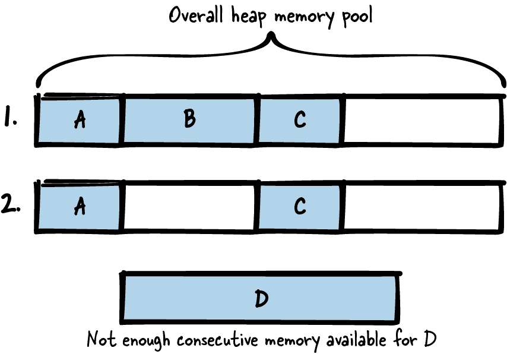

# 第三章：内存管理

每个程序都会将一些值存储在内存中以在程序后面使用它们。这种功能对于现代编程语言来说是如此普遍，以至于现代编程语言使其尽可能简单。C++ 编程语言以及其他面向对象的编程语言提供了构造函数和析构函数，这使得分配和清理内存非常简单。Java 编程语言甚至配备了垃圾回收器，确保程序不再使用的内存可以释放给其他程序使用。

相比之下，C 编程在程序员需要手动管理内存的方式上是特殊的。程序员必须决定是将变量放在栈上、堆上还是静态内存中。此外，程序员必须确保堆变量在使用后手动清理，而没有像析构函数或本地垃圾回收器等机制，这会使这些任务中的一些变得更容易。

有关如何执行这些任务的指导广泛分布在互联网上，这使得回答以下问题变得非常困难：“该变量应该放在栈上还是堆上？”为了回答这个问题以及其他问题，本章节介绍了如何在 C 程序中处理内存的模式。这些模式指导何时使用栈、何时使用堆以及何时如何清理堆内存。为了更容易理解模式的核心思想，本章在整个章节中应用了一个运行中的代码示例。

图 3-1 显示了本章讨论的模式及其关系概述，而 表 3-1 则提供了这些模式的摘要。


###### 图 3-1\. 内存管理模式概览

表 3-1\. 内存管理模式

|  | 模式名称 | 摘要 |
| --- | --- | --- |
|  | 先栈后堆 | 对于变量来说，决定存储类别和内存区段（栈、堆等）是每个程序员经常要做的决定。如果每个变量都要详细考虑所有可能替代方案的利弊，那会很累人。因此，默认情况下将变量放在栈上，以便从自动清理栈变量中获益。 |
|  | 永久内存 | 在函数调用之间传输大量数据并持久保存是困难的，因为您必须确保数据的内存足够大且生命周期跨越函数调用。因此，将您的数据放入整个程序生命周期内都可用的内存中。 |
|  | 惰性清理 | 如果需要大量内存或者预先不知道所需大小的内存，则需要动态内存。然而，处理动态内存的清理是一件麻烦事，并且是许多编程错误的根源。因此，分配动态内存，并且让操作系统在程序结束时处理清理。 |
|  | 专属所有权 | 使用动态内存的强大力量伴随着正确清理该内存的责任。在较大的程序中，确保所有动态内存正确清理变得困难。因此，在实现内存分配时，明确定义和记录何时以及由谁来清理它非常重要。 |
|  | 分配包装器 | 每次动态内存分配可能失败，因此您应该在代码中检查分配情况以做出相应反应。这很繁琐，因为您的代码中有许多这样的检查点。因此，封装分配和释放调用，并在这些包装函数中实现错误处理或附加的内存管理组织。 |
|  | 指针检查 | 导致访问无效指针的编程错误会导致不受控制的程序行为，这些错误很难调试。然而，因为您的代码频繁使用指针，很可能引入这类编程错误。因此，显式地使未初始化或释放的指针无效，并且在访问之前始终检查指针的有效性。 |
|  | 内存池 | 频繁从堆中分配和释放对象会导致内存碎片化。因此，在整个程序生命周期中持有一个大块内存。在运行时，从该内存池中检索固定大小的块，而不是直接从堆中分配新内存。 |

# 数据存储及动态内存问题

在 C 语言中，您有多种选项可以存放数据：

+   在堆栈中存放数据。堆栈是为每个线程保留的固定大小内存（在线程创建时分配）。调用线程中的函数时，堆栈顶部的块会被保留用于函数参数和函数中使用的自动变量。函数调用后，该内存会自动清理。要将数据放入堆栈中，只需在使用它们的函数中声明变量。只要这些变量不超出范围（函数块结束时），就可以访问这些变量：

    ```cpp
    void main()
    {
      int my_data;
    }
    ```

+   可以将数据放入静态内存。静态内存是一个固定大小的内存，其分配逻辑在编译时确定。要使用静态内存，只需在变量声明前加上 `static` 关键字。这些变量在整个程序生命周期内都可用。即使没有 `static` 关键字，全局变量也是如此：

    ```cpp
    int my_global_data;
    static int my_fileglobal_data;
    void main()
    {
      static int my_local_data;
    }
    ```

+   如果你的数据是固定大小且不可变的，你可以直接将其存储在代码所在的静态内存中。经常情况下，固定的字符串值就是这样存储的。这些数据在整个程序的生命周期内都是可用的（即使在下面的例子中，指向这些数据的指针超出了作用域）：

    ```cpp
    void main()
    {
      char* my_string = "Hello World";
    }
    ```

+   你可以在堆上分配动态内存来存储数据。堆是系统上所有进程可用的全局内存池，程序员可以随时从中分配和释放内存：

    ```cpp
    void main()
    {
      void* my_data = malloc(1000);
      /* work with the allocated 1000 byte memory */
      free(my_data);
    }
    ```

分配动态内存是事情可能出错的起点，并解决可能出现的问题是本章的重点。在 C 程序中使用动态内存会带来许多必须解决或至少考虑的问题。以下是动态内存的主要问题概述：

+   分配的内存必须在稍后某个时间点释放。如果没有为你分配的所有内存这样做，你将消耗比需要更多的内存，并且会产生所谓的内存泄漏。如果这种情况经常发生，并且你的应用程序运行时间很长，最终可能导致没有额外的内存可用。

+   释放内存超过一次是一个问题，可能导致未定义的程序行为，这是非常糟糕的。最糟糕的情况是，在你犯错的实际代码行中可能没有任何问题，但在随机时间后，你的程序可能会崩溃。这些错误是调试时的一个麻烦。

+   尝试访问已释放的内存也是一个问题。很容易释放一些内存，然后在稍后错误地引用指向该内存的指针（即所谓的悬空指针）。同样，这会导致难以调试的错误情况。最好的情况是，程序会简单地崩溃。最糟糕的情况是，它不会崩溃，并且该内存已经属于其他人。与使用该内存相关的错误是安全风险，并可能在程序执行后的某个时候显示为某种难以理解的错误。

+   你必须处理分配数据的生命周期和所有权。你必须知道谁在何时清理哪些数据，在 C 语言中尤其棘手。在 C++中，可以简单地在构造函数中为对象分配数据，在析构函数中释放它们。结合 C++的智能指针，甚至可以在对象超出作用域时自动清理它们。然而，在 C 中这是不可能的，因为我们没有析构函数。我们不会在指针超出作用域时收到通知，并且应清理内存。

+   与堆内存工作相比，与堆栈或静态内存工作需要更多时间。堆内存的分配必须受到竞争条件的保护，因为其他进程使用同一内存池。这使得分配变慢。访问堆内存也更慢，因为与之相比，堆栈内存被更频繁地访问，因此更可能已经驻留在缓存或 CPU 寄存器中。

+   堆内存的一个巨大问题是它会变得碎片化，这在图 3-2 中有所描述。 如果你分配了内存块 A、B 和 C，然后释放了内存块 B，你的整体空闲堆内存就不再是连续的。 如果你想要分配一个大的内存块 D，你将无法获得那块内存，尽管总内存是足够的。 然而，由于可用内存不是连续的，你的`malloc`调用将失败。 在长时间运行的内存受限系统中（如嵌入式实时系统），碎片化是一个巨大的问题。



###### 图 3-2\. 内存碎片化

处理这些问题并不容易。 以下各节中的模式逐步描述了如何避免动态分配或以可接受的方式使用它。

# 运行示例

你想要实现一个简单的程序，用凯撒密码加密一些文本。 凯撒密码用另一个字母替换每个字母，这个字母在字母表中向下移动了一定数量的位置。 例如，如果固定的位置数为 3，那么字母 A 将被字母 D 替换。 你开始实现一个执行凯撒加密的函数：

```cpp
/* Performs a Caesar encryption with the fixed key 3.
   The parameter 'text' must contain a text with only capital letters.
   The parameter 'length' must contain the length of the text excluding
   NULL termination. */
void caesar(char* text, int length)
{
  for(int i=0; i<length; i++)
  {
    text[i] = text[i]+3; 
    if(text[i] > 'Z')
    {
      text[i] = text[i] - 'Z' + 'A' - 1; 
    }
  }
}
```


在 C 中，字符以数值形式存储，你可以通过向字符添加数值来将字符向字母表下移。


如果我们超出字母*Z*，我们将重新从字母表的开头开始。

现在你只是想检查你的函数是否有效，并且你需要提供一些文本来做到这一点。 你的函数接受一个指向字符串的指针。 但是你应该把那个字符串存储在哪里呢？ 应该动态分配还是使用栈内存？ 你意识到最简单的解决方案是首先使用栈来存储字符串。

# 先用栈

## 背景

你想在程序中存储数据并在以后的某个时间点访问它。 你事先知道它的最大大小，并且数据大小不是很大（只有几个字节）。

## 问题

**决定变量的存储类和内存段（栈、堆等）是每个程序员经常必须做出的决定。 如果对于每个变量都必须详细考虑所有可能替代方案的利弊，那么这将变得很繁琐。**

在你的 C 程序中存储数据，你有很多可能性，其中最常见的是在栈上、静态内存中或动态内存中存储。 每种可能性都有其特定的优点和缺点，决定变量存储在哪里非常重要。 它影响变量的生命周期，并确定变量是否会自动清理或者你是否必须手动清理。

这个决定还影响了作为程序员的所需的努力和纪律。你希望尽可能地简化生活，因此如果对存储数据没有特殊要求，你希望使用需要最少的分配、释放和由于潜在编程错误导致的错误修复的内存类型。

## 解决方案

**默认将变量放在堆栈上，以从堆栈变量的自动清理中获益。**

所有在代码块内声明的变量默认为所谓的*自动变量*，这些变量被放置在堆栈上，并在代码块结束时（变量超出作用域时）自动清理。可以通过在变量前加上`auto`存储类说明符来明确声明变量为自动变量，但这很少这样做，因为这已经是默认行为。

你可以将来自堆栈的内存传递给其他函数（例如，调用者拥有缓冲区），但请确保不要返回此类变量的地址。变量在函数结束时超出作用域并自动清理。返回这样一个变量的地址将导致悬空指针，并且访问它将导致未定义的程序行为，可能导致程序崩溃。

下面的代码展示了一个非常简单的例子，其中包含堆栈上的变量：

```cpp
void someCode()
{
  /* This variable is an automatic variable that is put on the stack and
 that will run out of scope at the end of the function */
  int my_variable;

  {
    /* This variable is an automatic variable that is put on the stack and
 that will run out of scope right after this code block, which is
 after the first '}' */
    int my_array[10];
  }
}
```

# 变长数组

前面代码中的数组大小是固定的。在编译时只将固定大小的数据放在堆栈上是非常常见的，但也可以在运行时决定堆栈变量的大小。这可以通过使用`alloca()`等函数（它不是 C 标准的一部分，并且如果分配太多可能会导致堆栈溢出），或者使用变长数组（其大小由变量指定的常规数组）来实现，这在 C99 标准中引入。

## 影响

将数据存储在堆栈上使得访问数据变得容易。与动态分配的内存相比，无需使用指针。这可以消除与悬空指针相关的程序错误的风险。此外，没有堆碎片化，内存清理更容易。这些变量是自动变量，这意味着它们会自动清理。无需手动释放内存，这消除了内存泄漏或意外多次释放内存的风险。通常，通过简单地将变量放在堆栈上，可以消除大多数与不正确的内存使用相关的难以调试的错误。

与动态内存相比，堆栈上的数据可以快速分配和访问。在分配时无需通过复杂的数据结构管理可用内存。也无需确保与其他线程的互斥，因为每个线程都有自己的堆栈。此外，堆栈数据通常可以快速访问，因为该内存经常被使用，并且通常在高速缓存中。

然而，使用堆栈的一个缺点是它的限制性。与堆内存相比，堆栈内存非常有限（取决于堆栈大小的构建设置，可能只有几 KB）。如果你在堆栈上放置了太多数据，就会导致堆栈溢出，通常会导致程序崩溃。问题在于你无法知道剩余的堆栈内存有多少。根据已调用的函数已使用的堆栈内存量，你可能只剩下很少的内存。你必须确保放置在堆栈上的数据不要太大，并且必须提前知道其大小。

与堆栈上缓冲区相关的编程错误可能会导致重大安全问题。如果在堆栈上产生缓冲区溢出，攻击者可以轻松利用它来覆盖堆栈上的其他数据。如果攻击者成功覆盖了函数处理后返回的地址，那么攻击者可以执行任何他们想要的代码。

此外，在堆栈上存储数据并不适合满足所有需求。如果你需要返回大量数据，比如文件内容或缓冲区的网络消息给调用者，那么你不能简单地返回堆栈上某个数组的地址，因为一旦从函数返回，该变量就会被清除。为了返回大量数据，必须使用其他方法。

## 已知的用途

以下示例展示了此模式的应用：

+   几乎每个 C 程序都会在堆栈上存储一些东西。在大多数程序中，默认情况下会使用堆栈存储，因为这是最简单的解决方案。

+   C 语言的`auto`存储类说明符指定变量是自动变量并放在堆栈上，是默认的存储类说明符（通常在代码中省略，因为它默认为这种方式）。

+   《小内存软件：有限内存系统的模式》（Addison-Wesley，2000）一书中由 James Noble 和 Charles Weir 描述了其内存分配模式，对于内存放置的选择，应该选择最简单的方式，也就是对于 C 程序员来说使用堆栈。

## 应用于运行示例

好了，这很简单。你现在将需要用于存储文本的内存放在堆栈上，并将该内存提供给你的凯撒密码函数：

```cpp
#define MAX_TEXT_SIZE 64

void encryptCaesarText()
{
  char text[MAX_TEXT_SIZE];
  strlcpy(text, "PLAINTEXT", MAX_TEXT_SIZE);
  caesar(text, strnlen(text, MAX_TEXT_SIZE));
  printf("Encrypted text: %s\n", text);
}
```

这是一个非常简单的解决方案。你不必处理动态内存分配。也不需要清理内存，因为一旦`text`超出作用域，它就会自动清理。

接下来，你想加密一个较大的文本。使用当前解决方案并不容易，因为内存存储在堆栈上，而且通常堆栈内存不多。根据你的平台，可能只有几 KB。尽管如此，你仍然希望能够加密更大的文本。为了避免处理动态内存，你决定尝试使用永久内存。

# 永久内存

## 上下文

如果你的程序中需要长时间使用固定大小的大量数据，那么堆栈存储是一个合适的选择。

## 问题

**持有大量数据并在函数调用之间传输数据是困难的，因为您必须确保数据的内存足够大且生命周期跨越函数调用。**

使用堆栈会很方便，因为它会为您处理所有内存清理工作。但将数据放入堆栈上并不适合您，因为这不允许您在函数之间传递大数据。这也是一种低效的方式，因为将数据传递给函数意味着复制数据。在程序的每个需要它的地方手动分配内存并在不再需要时释放它的替代方法是可行的，但这很繁琐且容易出错。特别是要掌握所有数据的生命周期并知道何时以及何处释放数据是一项复杂的任务。

如果您在像安全关键应用这样的环境中操作，那么既不使用堆栈中的内存，也不使用动态内存是一个好选择，因为两者都可能耗尽内存，并且您无法事先轻松知道。但在其他应用程序中，您可能也有代码部分，您希望确保不会耗尽内存。例如，对于错误日志代码，您肯定希望确保所需的内存可用，否则您无法依赖于您的日志信息，这使得查找错误变得困难。

## 解决方案

**将您的数据放入在整个程序生命周期内可用的内存中。**

最常见的方法是使用静态内存。要么用`static`存储类说明符标记您的变量，要么如果您希望变量具有更大的作用域，则将其声明在任何函数之外（但只有在确实需要更大的作用域时才这样做）。静态内存在程序启动时分配，并在整个程序生命周期内可用。以下代码提供了一个示例：

```cpp
#define ARRAY_SIZE 1024

int global_array[ARRAY_SIZE]; /* variable in static memory, global scope */
static int file_global_array[ARRAY_SIZE]; /* variable in static memory with
 scope limited to this file */

void someCode()
{
  static int local_array[ARRAY_SIZE]; /* variable in static memory with
 scope limited to this function */
}
```

作为使用静态变量的替代方法，在程序启动时，您可以调用一个初始化函数来分配内存，并在程序结束时调用一个去初始化函数来释放该内存。这样，您在整个程序的生命周期内都可以使用这些内存，但您必须自己处理分配和释放的问题。

无论您是在程序启动时自己分配内存还是使用静态内存，访问此内存时都必须小心。因为它不在堆栈上，所以在每个线程中没有单独的内存副本。在多线程情况下，访问该内存时必须使用同步机制。

您的数据具有固定大小。与运行时动态分配的内存相比，您的永久内存的大小在运行时不能更改。

## 后果

你不必担心内存的生命周期和手动释放内存的位置。规则很简单：让内存在整个程序生命周期内保持活动状态。甚至使用静态内存可以完全摆脱你的分配和释放负担。

现在你可以在那段内存中存储大量数据，甚至将其传递给其他函数。与首次使用堆栈相比，你现在甚至可以向函数的调用者提供数据。

但是，你必须在编译时或最迟在启动时知道需要多少内存，因为你在程序启动时分配它。对于大小未知的内存或在运行时将扩展的内存，永久内存并不是最好的选择，应该使用堆内存。

使用永久内存，启动程序会花费更长的时间，因为所有的内存都必须在那时分配。但一旦你拥有了那段内存，就会有所回报，因为在运行时不再需要分配内存。

分配和访问静态内存不需要由操作系统或运行时环境维护的复杂数据结构来管理堆。因此，内存使用效率更高。永久内存的另一个巨大优势是你不会使堆碎片化，因为你不会一直分配和释放内存。但是不这样做的缺点是阻塞内存，这取决于你的应用程序，可能并不总是需要。一个更灵活的避免内存碎片化的解决方案将是使用内存池。

永久内存的一个问题是你的每个线程没有其自己的副本（如果你使用静态变量）。因此，你必须确保内存不会同时被多个线程访问。尽管在不可变实例的特殊情况下，这并不是一个大问题。

## 已知的应用

以下示例展示了这种模式的应用：

+   游戏 NetHack 使用静态变量来存储在游戏整个生命周期中所需的数据。例如，游戏中发现的神器信息存储在静态数组`artifact_names`中。

+   Wireshark 网络嗅探器的代码在其函数`cf_open_error_message`中使用静态缓冲区来存储错误消息信息。一般来说，许多程序在其错误记录功能中使用静态内存或在程序启动时分配的内存。这是因为在发生错误时，你希望至少该部分工作正常，并且不会耗尽内存。

+   OpenSSL 代码使用静态数组`OSSL_STORE_str_reasons`来保存有关在处理证书时可能发生的错误情况的错误信息。

## 应用于运行示例

你的代码基本上保持不变。唯一改变的是，在变量`text`的声明前加入了`static`关键字，并增加了文本的大小：

```cpp
#define MAX_TEXT_SIZE 1024

void encryptCaesarText()
{
  static char text[MAX_TEXT_SIZE];
  strlcpy(text, "LARGETEXTTHATCOULDBETHOUSANDCHARACTERSLONG", MAX_TEXT_SIZE);
  caesar(text, strnlen(text, MAX_TEXT_SIZE));
  printf("Encrypted text: %s\n", text);
}
```

现在，您的文本不存储在堆栈上，而是驻留在静态内存中。在执行此操作时，您应记住这意味着变量只存在一次并保留其值（即使在多次进入函数时也是如此）。对于多线程系统来说，这可能是一个问题，因为在访问该变量时必须确保互斥。

您目前没有多线程系统。但是，您的系统需求发生了变化：现在您希望能够从文件中读取文本，对其进行加密并显示加密后的文本。您不知道文本的长度可能有多长。因此，您决定使用动态分配：

```cpp
void encryptCaesarText()
{
  /* open file (omit error handling to keep the code simple) */
  FILE* f = fopen("my-file.txt", "r");

  /* get file length */
  fseek(f, 0, SEEK_END);
  int size = ftell(f);

  /* allocate buffer */
  char* text = malloc(size);

  ...
}
```

但是，该如何继续编写代码呢？您在堆上分配了文本。但是如何清理这些内存？作为第一步，您意识到完全可以由其他人来清理该内存：操作系统。因此，您选择了懒惰的清理。

# 懒惰的清理

## 上下文

您希望在程序中存储一些数据，这些数据很大（也许您甚至事先不知道其大小）。数据的大小在运行时很少改变，并且在程序的几乎整个生命周期中都需要这些数据。您的程序是短暂的（不会长时间运行而不重新启动）。

## 问题

**如果需要大量内存和预先不知道所需大小的内存，则需要动态内存。然而，处理动态内存的清理是一件麻烦事，并且是许多编程错误的根源。**

在许多情况下——例如，如果您有未知大小的大数据——您不能将数据放在堆栈或静态内存中。因此，您必须使用动态内存并处理其分配。现在问题是如何清理这些数据。清理这些数据是程序错误的主要来源。您可能会意外地过早释放内存，导致悬空指针。您可能会意外地两次释放相同的内存。这些编程错误都可能导致未定义的程序行为，例如在以后的某个时间点程序崩溃。这些错误非常难以调试，C 程序员花费了太多时间来解决这些情况。

幸运的是，大多数类型的内存都带有某种自动清理机制。返回函数时，堆栈内存会自动清理。静态内存和堆内存在程序终止时会自动清理。

## 解决方案

**分配动态内存并让操作系统在程序结束时处理清理。**

当您的程序结束并且操作系统清理您的进程时，大多数现代操作系统还会清理您分配但未释放的任何内存。利用这一点，让操作系统完全负责跟踪哪些内存仍然需要清理，然后实际清理它，如下面的代码所示：

```cpp
void someCode()
{
  char* memory = malloc(size);
  ...
  /* do something with the memory */
  ...
  /* don't care about freeing the memory */
}
```

这种方法乍一看似乎很粗暴。你故意制造内存泄漏。然而，这种编码风格在其他具有垃圾回收器的编程语言中也是常用的。你甚至可以在 C 语言中包含一些垃圾收集库，以便在自动内存清理的同时使用这种编码风格（尽管会导致时间行为不太可预测）。

故意制造内存泄漏可能是一些应用的选择，尤其是那些不运行很长时间且不经常分配内存的应用。但对于其他应用程序来说，这将不是一个选择，你需要专门的内存所有权并处理其释放。如果你之前使用了懒惰的清理，一种简单的方法来清理内存就是使用分配包装器，并且在程序结束时有一个函数来清理所有分配的内存。

## 后果

显而易见的优势在于，你可以享受动态内存的好处，而无需处理内存释放。这对程序员来说使生活变得轻松得多。此外，你不会浪费任何处理时间在释放内存上，这可以加快程序关闭过程的速度。

然而，这是以其他运行进程的代价为代价的，它们可能需要你没有释放的内存。也许你甚至无法再分配任何新的内存，因为没有剩下多少了，而你却没有释放本应该释放的内存。特别是如果你经常分配内存，这将成为一个主要问题，不清理内存将不是一个好的解决方案。相反，你应该专注于所有权，并释放内存。

通过这种模式，你接受你故意制造内存泄漏并且接受它。虽然这可能对你来说没问题，但对其他人调用你的函数可能不可接受。如果你编写的库可以供他人使用，那么在其中存在内存泄漏是不可接受的。此外，如果你希望在代码的其他部分保持非常干净，并且例如使用类似于*valgrind*的内存调试工具来检测内存泄漏，那么如果程序的其他部分混乱并且不释放其内存，你将难以解释工具的结果。

这种模式很容易被用作不实现正确内存清理的借口，即使在应该这样做的情况下也是如此。因此，你应该仔细检查你是否真的处于一个不需要释放内存的上下文中。如果未来你的程序代码可能会发展并且需要清理内存，那么最好不要从懒惰的清理开始，而是从一开始就正确地进行内存的专门所有权。

## 已知的用途

以下示例展示了此模式的应用：

+   Wireshark 函数 `pcap_free_datalinks` 在某些情况下故意不释放所有内存。原因是 Wireshark 代码的一部分可能是使用不同编译器和不同的 C 运行时库构建的。释放由这样的代码分配的内存可能导致崩溃。因此，该内存明确地不被释放。

+   公司 B&R 的 Automation Runtime 操作系统的设备驱动程序通常没有卸载功能。它们分配的所有内存永远不会被释放，因为这些驱动程序在运行时不会被卸载。如果应该使用不同的驱动程序，则整个系统将重新启动。这使得显式释放内存变得不必要。

+   用于存储太阳图像进行科学处理的 NetDRMS 数据管理系统的代码，在错误情况下并没有显式释放所有内存。例如，如果发生错误，则函数 `EmptyDir` 不会清理所有与访问文件相关的内存或其他资源，因为这样的错误会导致更严重的错误和程序中止。

+   使用垃圾回收库的任何 C 代码都应用了这种模式，并通过显式垃圾回收克服了内存泄漏的缺点。

## 应用于运行示例

在您的代码中，您简单地省略了使用任何 `free` 函数调用。此外，您重构了代码，使文件访问功能分开到不同的函数中：

```cpp
/* Returns the length of the file with the provided 'filename' */
int getFileLength(char* filename)
{
  FILE* f = fopen(filename, "r");
  fseek(f, 0, SEEK_END);
  int file_length = ftell(f);
  fclose(f);
  return file_length;
}

/* Stores the content of the file with the provided 'filename' into the
 provided  'buffer' (which has to be least of size 'file_length'). The
 file must only contain capital letters with no newline in between
 (that's what our caesar function accepts as input). */
void readFileContent(char* filename, char* buffer, int file_length)
{
  FILE* f = fopen(filename, "r");
  fseek(f, 0, SEEK_SET);
  int read_elements = fread(buffer, 1, file_length, f);
  buffer[read_elements] = '\0';
  fclose(f);
}

void encryptCaesarFile()
{
  char* text;
  int size = getFileLength("my-file.txt");
  if(size>0)
  {
    text = malloc(size);
    readFileContent("my-file.txt", text, size);
    caesar(text, strnlen(text, size));
    printf("Encrypted text: %s\n", text);
    /* you don't free the memory here */
  }
}
```

您分配了内存，但是没有调用 `free` 来释放它。相反，您让指向内存的指针超出作用域，并且有一个内存泄漏。然而，这不是问题，因为您的程序在之后立即结束，并且操作系统会清理内存。

那种方法似乎相当粗糙，但在一些情况下完全可以接受。如果您需要在程序的整个生命周期内保持内存，或者如果您的程序生命周期很短，并且您确信您的代码不会在其他地方进化或被重用，那么简单地不必处理内存清理可能是一种能极大简化您生活的解决方案。但是，您必须非常小心，确保您的程序不会发展并变得长寿。在这种情况下，您肯定需要找到另一种方法。

这正是您接下来要做的。您希望加密多个文件。您希望加密当前目录中的所有文件。您很快意识到，您必须更频繁地分配内存，并且在此期间不释放任何内存不再是一个选项，因为这可能成为您的程序或其他程序的问题。

问题出现在代码中内存应该在哪里被释放。谁负责做这件事？您肯定需要专用所有权。

# 专用所有权

## 上下文

在你的程序中有大量未知大小的数据，并且你使用动态内存来存储它。你不需要整个程序的生命周期都使用该内存，并且你经常需要分配不同大小的内存，因此不能使用惰性清理。

## 问题

**使用动态内存的巨大力量伴随着必须妥善清理内存的巨大责任。在较大的程序中，确保所有动态内存得到正确清理变得困难。**

清理动态内存时存在许多陷阱。你可能会太早清理它，而之后其他人仍然希望访问该内存（悬空指针）。或者你可能意外地频繁释放内存。这些编程错误都会导致意外的程序行为，比如在以后某个时间点程序崩溃，并且这些错误是安全问题，可能会被攻击者利用。此外，这些错误非常难以调试。

然而，你确实需要清理内存，因为随着时间推移，如果分配新的内存而不释放它，你会使用太多内存。然后你的程序或其他进程会因为内存不足而运行失败。

## 解决方案

**在实现内存分配时，立即定义并记录它将在何处进行清理，并记录谁将执行清理。**

在代码中明确记录谁拥有内存以及它将有效多长时间是非常重要的。最好的情况是，在写下你的第一个`malloc`之前，你应该问自己那些内存将会被释放。你还应该在函数声明中写一些注释，明确表明如果内存缓冲区由该函数传递，那么谁负责清理它。

在其他编程语言（如 C++）中，你可以使用代码结构来记录这一点。指针结构如`unique_ptr`或`shared_ptr`使得可以从函数声明中看到谁负责清理内存。由于 C 语言中没有这样的结构，必须格外小心地在代码注释中记录这一责任。

如果可能，同一个函数负责分配和释放，就像在基于对象的错误处理中一样，代码中有一个确切的调用点用于调用类似构造函数和析构函数的分配和释放：

```cpp
#define DATA_SIZE 1024
void function()
{
  char* memory = malloc(DATA_SIZE);
  /* work with memory */
  free(memory);
}
```

如果分配和释放的责任分散在代码中，如果内存的所有权被转移，情况就变得复杂。在某些情况下，这是必要的，例如，如果只有分配函数知道数据的大小，并且其他函数需要该数据：

```cpp
/* Allocates and returns a buffer that has to be freed by the caller */
char* functionA()
{
  char* memory = malloc(data_size); 
  /* fill memory */
  return memory;
}

void functionB()
{
  char* memory = functionA();
  /* work with the memory */
  free(memory); 
}
```


调用者分配一些内存。


调用者负责清理内存。

如果可能，请避免将分配和释放内存的责任放在不同的函数中。但无论如何，请记录谁负责清理工作，以便明确。

描述与内存所有权相关的更具体情况的其他模式是调用者拥有缓冲区或调用者拥有实例，在这些模式中，调用者负责分配和释放内存。

## 结果

最后，您可以分配内存并正确处理其清理。这使您具有灵活性。您可以临时从堆中使用大量内存，稍后再让其他人使用该内存。

但当然，这种好处伴随着额外的成本。您必须处理内存的清理工作，这使得您的编程工作更加困难。即使具有专用所有权，也可能出现与内存相关的编程错误，并导致难以调试的情况。此外，释放内存需要一些时间。明确记录内存将被清理的位置有助于防止其中一些错误，并且通常使代码更易于理解和维护。为了进一步避免与内存相关的编程错误，您还可以使用分配包装器和指针检查。

随着动态内存的分配和释放，堆碎片化和分配和访问内存所需的时间增加的问题浮出水面。对于某些应用程序，这可能根本不是问题，但对于其他应用程序，这些话题非常严重。在这种情况下，内存池可以提供帮助。

## 已知用途

以下示例展示了此模式的应用：

+   Kamran Amini（Packt，2019）的书《Extreme C》建议，分配内存的函数也应负责释放它，并且应将拥有内存的函数或对象作为注释进行文档化。当然，如果您有包装函数，则调用分配包装器的函数应该调用清理包装器。

+   数值计算环境 MATLAB 的函数`mexFunction`的实现清楚地记录了它拥有并将释放的内存。

+   NetHack 游戏明确为函数的调用者文档化了是否必须释放某些内存。例如，函数`nh_compose_ascii_screenshot`分配并返回一个字符串，调用者必须释放它。

+   用于“Community ID 流哈希”Wireshark 解析器的功能清楚地记录了谁负责释放内存。例如，函数`communityid_calc`分配了一些内存，并要求调用者释放它。

## 应用于运行示例

`encryptCaesarFile`函数的功能没有改变。您唯一改变的是现在也调用`free`来释放内存，并且您现在在代码注释中清楚地记录了谁负责清理哪些内存。此外，您还实现了`encryptDirectoryContent`函数，该函数加密当前工作目录中的所有文件：

```cpp
/* For the provided 'filename', this function reads text from the file and
 prints the Caesar-encrypted text. This function is responsible for
 allocating and deallocating the required buffers for storing the
 file content */
void encryptCaesarFile(char* filename)
{
  char* text;
  int size = getFileLength(filename);
  if(size>0)
  {
    text = malloc(size);
    readFileContent(filename, text, size);
    caesar(text, strnlen(text, size));
    printf("Encrypted text: %s\n", text);
    free(text);
  }
}

/* For all files in the current directory, this function reads text
 from the file and prints the Caesar-encrypted text. */
void encryptDirectoryContent()
{
  struct dirent *directory_entry;
  DIR *directory = opendir(".");
  while ((directory_entry = readdir(directory)) != NULL)
  {
    encryptCaesarFile(directory_entry->d_name);
  }
  closedir(directory);
}
```

此代码打印当前目录所有文件的凯撒加密内容。请注意，该代码仅适用于 UNIX 系统，并且由于简化起见，如果目录中的文件没有预期的内容，则未实现特定的错误处理。

当不再需要内存时，现在也清理内存。请注意，程序在运行时期间所需的所有内存并非同时分配。在程序中运行时任何时候分配的最大内存是文件中所需的内存之一。这使得程序的内存占用明显较小，尤其是如果目录包含许多文件。

前述代码未处理错误处理。例如，如果没有更多可用内存会发生什么？代码将会崩溃。您希望对此类情况进行某种形式的错误处理，但在每个分配内存的点上检查`malloc`返回的指针可能会很麻烦。您需要的是一个分配包装器。

# 分配包装器

## 上下文

您在代码中的多个地方分配动态内存，并且希望在内存耗尽等错误情况下作出反应。

## 问题

**每次动态内存分配都可能失败，因此您应该在代码中检查分配情况以做出相应反应。这很麻烦，因为您的代码中有许多地方需要进行这样的检查。**

如果请求的内存不可用，`malloc`函数会返回`NULL`。一方面，如果不检查`malloc`的返回值，如果没有可用内存并且访问了`NULL`指针，您的程序将崩溃。另一方面，在每个分配位置检查返回值会使您的代码更复杂，因此更难阅读和维护。

如果您将这些检查分布到代码库中的各个位置，稍后想要在分配错误的情况下更改行为，则必须在许多不同的地方触及代码。此外，简单地向现有函数添加错误检查违反了单一责任原则，该原则规定一个函数应该只负责一件事情（而不是多个事情，如分配和程序逻辑）。

另外，如果以后想要更改分配方法，也许是显式初始化所有分配的内存，则在代码中广泛调用分配函数会使这一过程变得非常困难。

## 解决方案

**封装分配和释放调用，并在这些包装函数中实现错误处理或额外的内存管理组织。**

为`malloc`和`free`调用实现一个包装函数，并且仅在这些包装函数中调用内存分配和释放。在包装函数中，您可以在一个中心点实现错误处理。例如，您可以检查分配的指针（参见指针检查），并在错误情况下中止程序，如下面的代码所示：

```cpp
void* checkedMalloc(size_t size)
{
  void* pointer = malloc(size);
  assert(pointer);
  return pointer;
}

#define DATA_SIZE 1024
void someFunction()
{
  char* memory = checkedMalloc(DATA_SIZE);
  /* work with the memory */
  free(memory);
}
```

作为中止程序的替代方法，你可以**记录错误**。对于记录调试信息，使用宏而不是包装函数可以更加方便。这样一来，你可以毫不费力地记录文件名、函数名或错误发生的代码行号。有了这些信息，程序员可以很容易地确定代码中出现错误的部分。此外，使用宏而不是包装函数还可以避免额外的函数调用（不过在大多数情况下这不重要，或者编译器会内联该函数）。使用分配和释放的宏甚至可以构建类似构造函数的语法：

```cpp
#define NEW(object, type)                   \
do {                                        \
 object = malloc(sizeof(type));            \
 if(!object)                               \
 {                                         \
 printf("Malloc Error: %s\n", __func__); \
 assert(false);                          \
 }                                         \
} while (0)

#define DELETE(object) free(object)

typedef struct{
  int x;
  int y;
}MyStruct;

void someFunction()
{
  MyStruct* myObject;
  NEW(myObject, MyStruct);
  /* work with the object */
  DELETE(myObject);
}
```

除了在包装器函数中处理错误情况之外，您还可以做其他事情。例如，您可以跟踪程序分配的内存，并将其信息存储在列表中，连同代码文件和代码行号一起（为此，您还需要像前面的示例中那样的`free`包装器）。这样，如果您想查看当前分配的内存（以及您可能忘记释放的部分），则可以轻松地打印调试信息。但如果您需要此信息，您也可以简单地使用像 valgrind 这样的内存调试工具。此外，通过跟踪分配的内存，您还可以实现一个释放所有内存的函数——如果您以前使用惰性清理，这可能是使程序更清洁的选项。

将所有内容放在一个地方并不总是解决方案。也许您的应用程序有一些非关键部分，您不希望整个应用程序在发生分配错误时中止。在这种情况下，拥有多个分配包装器可能适合您。一个包装器仍然可以在错误发生时断言，并且可以用于应用程序必须正常工作的关键分配。另一个用于应用程序的非关键部分的包装器，在错误发生时可能会返回状态码，以便优雅地处理该错误情况。

## 后果

错误处理和其他内存处理现在集中在一个地方。在需要分配内存的代码处，现在只需调用包装函数，无需在代码中显式处理错误。但这仅适用于某些类型的错误处理。如果在错误发生时中止程序效果很好，但如果您对错误做出反应并继续以降低的功能继续运行程序，则仍需从包装器返回一些错误信息，并对其做出反应。对于这种情况，分配包装器不能让生活更轻松。但是，在这种情况下，包装器中仍然可以实现一些日志功能以改善您的情况。

这个包装函数对于测试带来了优势，因为你可以有一个中心点来改变你的内存分配函数的行为。此外，你可以模拟这个包装器（用其他测试函数替换包装器调用），同时仍然保留对`malloc`（可能来自第三方代码）的其他调用。

使用包装函数将错误处理部分与调用代码分离是一个好的实践，因为这样调用者就不会诱惑在处理其他程序逻辑的代码中直接实现错误处理。在一个函数中做几件事情（程序逻辑和广泛的错误处理）将违反单一责任原则。

有一个分配包装器允许你一致地处理分配错误，并且如果以后你想要改变错误处理行为或内存分配行为，这将更容易。如果你决定想要记录额外的信息，那么只需在代码中的一个地方进行修改。如果以后决定不直接调用`malloc`而是使用内存池，那么有了包装器就容易得多。

## 已知用途

以下示例展示了该模式的应用：

+   由 David R. Hanson（Addison-Wesley，1996）著作的*C 接口与实现*一书，在内存池的实现中使用了一个用于分配内存的包装函数。包装函数简单地调用`assert`来在出现错误时终止程序。

+   GLib 提供了`g_malloc`和`g_free`等内存相关函数。使用`g_malloc`的好处在于，在出现错误时终止程序（武士原则）。因此，调用者不需要检查每个函数调用的返回值来分配内存。

+   GoAccess 实时 Web 日志分析器实现了函数`xmalloc`来包装带有一些错误处理的`malloc`调用。

+   分配包装器是装饰器模式的一个应用，该模式在*设计模式：可复用面向对象软件的元素*一书中由 Erich Gamma、Richard Helm、Ralph Johnson 和 John Vlissides（Prentice Hall，1997）描述。

## 应用于运行示例

现在，在代码中不是直接调用到处的`malloc`和`free`，而是使用包装函数：

```cpp
/* Allocates memory and asserts if no memory is available */
void* safeMalloc(size_t size)
{
  void* pointer = malloc(size);
  assert(pointer); 
  return pointer;
}

/* Deallocates the memory of the provided 'pointer' */
void safeFree(void *pointer)
{
  free(pointer);
}

/* For the provided file 'filename', this function reads text from the file
   and prints the Caesar-encrypted text. This function is responsible for
   allocating and deallocating the required buffers for storing the
   file content */
void encryptCaesarFile(char* filename)
{
  char* text;
  int size = getFileLength(filename);
  if(size>0)
  {
    text = safeMalloc(size);
    readFileContent(filename, text, size);
    caesar(text, strnlen(text, size));
    printf("Encrypted text: %s\n", text);
    safeFree(text);
  }
}
```


如果分配失败，你要坚持武士原则并终止程序。对于像你的应用程序这样的应用，这是一个有效的选择。如果没有办法优雅地处理错误，那么直接终止程序是正确和合适的选择。

使用分配包装器的好处是，现在您有一个集中处理分配错误的中心点。您无需在代码中的每个分配后写检查指针的代码行。您还有一个用于释放代码的包装器，在将来可能会派上用场，例如，如果您决定跟踪应用程序当前分配的内存。

分配后，现在您检查检索到的指针是否有效。之后，您不再检查指针的有效性，并且还相信穿越函数边界时收到的指针是有效的。只要没有编程错误潜入，这是可以接受的，但如果意外访问无效指针，则情况变得难以调试。为了改进您的代码并确保安全，您决定使用指针检查。

# 指针检查

## 上下文

您的程序包含许多地方用于分配和释放内存，以及许多地方用于使用指针访问该内存或其他资源。

## 问题

**导致访问无效指针的编程错误会导致不受控制的程序行为，这类错误很难调试。但是，由于您的代码经常使用指针，很有可能引入这类编程错误。**

C 编程需要大量与指针的斗争，代码中使用指针的地方越多，引入编程错误的可能性就越多。使用已释放的指针或使用未初始化的指针将导致难以调试的错误情况。

任何这类错误情况都非常严重。它导致不受控制的程序行为，（如果您幸运的话）可能导致程序崩溃。如果不够幸运，您将在程序执行期间的后续时间点遇到错误，并且需要花费一周的时间来准确定位和调试。您希望您的程序对这类错误更加健壮。您希望减轻这类错误的严重性，并且希望如果这类错误在运行中发生，能更容易找到其原因。

## 解决方案

**明确地使未初始化或已释放的指针失效，并且在访问它们之前始终检查指针的有效性。**

在变量声明时，将指针变量显式设置为`NULL`。同样，在调用`free`后立即将其显式设置为`NULL`。如果您使用的分配包装器使用宏来包装`free`函数，则可以直接在宏内部将指针设置为`NULL`，以避免在每次释放时为使指针失效而添加额外的代码行。

使用包装函数或宏来检查指针是否为`NULL`，并在遇到`NULL`指针时中止程序并记录错误信息，以便进行调试。如果中止程序不适合你，那么在遇到`NULL`指针时，你可以选择不访问指针并尝试优雅地处理错误。这将允许你的程序以降低的功能继续执行，如下面的代码所示：

```cpp
void someFunction()
{
  char* pointer = NULL; /* explicitly invalidate the uninitialized pointer */
  pointer = malloc(1024);

  if (pointer != NULL) /* check pointer validity before accessing it */
  {
    /* work with pointer*/
  }

  free(pointer);
  pointer = NULL; /* explicitly invalidate the pointer to freed memory */
}
```

## 结果

你的代码对于与指针相关的编程错误有了更多的保护。每一个能够被识别且不会导致未定义程序行为的这类错误，都可能为你节省数小时甚至数天的调试工作。

然而，这并不是无偿的。你的代码变得更长、更复杂。你在这里应用的策略就像是同时系上腰带和吊裤带。你做了一些额外的工作来更安全。你对每个指针访问都增加了额外的检查。这使得代码更难阅读。在访问指针之前检查其有效性，你至少需要增加一行代码。如果你不中止程序，而是选择以降低的功能继续执行，那么你的程序将变得更加难以阅读、维护和测试。

如果你意外地对同一个指针多次调用`free`，那么第二次调用将不会导致错误情况，因为在第一次调用后你使指针无效，随后在`NULL`指针上调用`free`不会造成任何伤害。尽管如此，你仍然可以像这样记录错误信息，以便能够准确定位错误的根本原因。

但即使这样，你也不能完全防止所有与指针相关的错误。例如，你可能会忘记释放一些内存，导致内存泄漏。或者你可能会访问一个没有正确初始化的指针，但至少你会检测到这一点，并且可以相应地做出反应。这里可能存在的一个缺点是，如果你决定优雅地降低程序的执行，并继续执行，那么你可能会掩盖一些难以在后期找到的错误情况。

## 已知用途

下面的例子展示了这种模式的应用：

+   C++智能指针的实现在释放智能指针时使封装的原始指针失效。

+   Cloudy 是一个用于物理计算（光谱综合）的程序。它包含一些数据插值的代码（Gaunt 因子）。该程序在访问指针之前会检查它们的有效性，并在调用`free`后显式将指针设置为`NULL`。

+   GNU 编译器集合（GCC）的 libcpp 在释放指针后使其失效。例如，实现文件*macro.c*中的指针就是这样做的。

+   MySQL 数据库管理系统的函数`HB_GARBAGE_FUNC`将指针`ph`设置为`NULL`，以避免在后续的多次访问或释放中意外访问它。

## 应用于运行示例

现在你有了以下代码：

```cpp
/* For the provided file 'filename', this function reads text from the file
   and prints the Caesar-encrypted text. This function is responsible for
   allocating and deallocating the required buffers for storing the
   file content */
void encryptCaesarFile(char* filename)
{
  char* text = NULL; 
  int size = getFileLength(filename);
  if(size>0)
  {
    text = safeMalloc(size);
    if(text != NULL) 
    {
      readFileContent(filename, text, size);
      caesar(text, strnlen(text, size));
      printf("Encrypted text: %s\n", text);
    }
    safeFree(text);
    text = NULL; 
  }
}
```


在指针无效的地方，你需要将其显式设置为`NULL`，以防万一。


在访问指针`text`之前，你检查它是否有效。如果它无效，你不使用该指针（不对其进行解引用）。

# Linux 超配

请注意，拥有有效的内存指针并不总是意味着可以安全地访问该内存。现代 Linux 系统采用了*超配*原则。这个原则为分配内存的程序提供虚拟内存，但这种虚拟内存与物理内存没有直接对应关系。只有当你访问该内存时，才会检查所需的物理内存是否可用。如果可用的物理内存不足，Linux 内核会关闭消耗大量内存的应用程序（可能是你的应用程序）。超配的好处在于，不太需要检查分配是否成功（因为通常不会失败），你可以为了安全起见分配大量内存，即使你只需要一点。但超配的缺点是，即使有一个有效的指针，你也不能确定你的内存访问是否有效，并且不会导致崩溃。另一个缺点是，你可能会懒得检查分配返回值，以及弄清楚和分配实际需要的内存量。

接下来，你还希望显示凯撒加密后的文件名以及加密后的文本。你决定不直接从堆中分配所需的内存，因为你担心重复分配小内存块（用于文件名）和大内存块（用于文件内容）会导致内存碎片化。为了避免直接分配动态内存，你实现了一个内存池。

# 内存池

## 上下文

在你的程序中，你经常需要从堆中分配和释放动态内存，用于大致相同大小的元素。你在编译时或启动时并不知道这些元素在程序中的具体位置和使用时间。

## 问题

**频繁从堆中分配和释放对象会导致内存碎片化。**

在分配对象时，特别是那些大小差异很大的对象，同时又释放其中一些时，堆内存会变得碎片化。即使你的代码中的分配大致相同大小，它们可能与并行运行的其他程序的分配混合在一起，导致分配大小差异很大且碎片化。

`malloc`函数只有在有足够的连续空闲内存可用时才能成功。这意味着，即使有足够的空闲内存可用，如果内存碎片化，并且没有足够大小的连续内存块可用，`malloc`函数也可能失败。内存碎片化意味着内存使用效率不高。

对于长时间运行的系统（如大多数嵌入式系统），碎片化是一个严重问题。如果系统运行了几年并分配和释放了许多小块，那么将不再能够分配更大的内存块。这意味着对于这样的系统，您一定要解决碎片化问题，如果不接受系统不时需要重启的话。

在使用动态内存时（尤其是与嵌入式系统结合使用时），另一个问题是从堆中分配内存需要一些时间。其他进程也尝试使用同一堆，因此分配必须进行互锁，并且其所需的时间变得非常难以预测。

## 解决方案

**在整个程序生命周期中持有大块内存。在运行时，从该内存池检索固定大小的块，而不是直接从堆中分配新内存。**

内存池可以放置在静态内存中，或者可以在程序启动时从堆中分配并在程序结束时释放。从堆中分配的优势在于，如果需要，可以分配额外的内存以增加内存池的大小。

实现函数以从该池中检索和释放预配置的固定大小的内存块。所有需要该大小内存的代码都可以使用这些函数（而不是 `malloc` 和 `free`）来获取和释放动态内存：

```cpp
#define MAX_ELEMENTS 20;
#define ELEMENT_SIZE 255;

typedef struct
{
  bool occupied;
  char memory[ELEMENT_SIZE];
}PoolElement;

static PoolElement memory_pool[MAX_ELEMENTS];

/* Returns memory of at least the provided 'size' or NULL
 if no memory chunk from the pool is available */
void* poolTake(size_t size)
{
  if(size <= ELEMENT_SIZE)
  {
    for(int i=0; i<MAX_ELEMENTS; i++)
    {
      if(memory_pool[i].occupied == false)
      {
        memory_pool[i].occupied = true;
        return &(memory_pool[i].memory);
      }
    }
  }
  return NULL;
}

/* Gives the memory chunk ('pointer') back to the pool */
void poolRelease(void* pointer)
{
  for(int i=0; i<MAX_ELEMENTS; i++)
  {
    if(&(memory_pool[i].memory) == pointer)
    {
      memory_pool[i].occupied = false;
      return;
    }
  }
}
```

上述代码展示了内存池的简单实现，当然还有许多改进的方法。例如，可以将空闲内存槽存储在列表中以加快获取此类槽的速度。此外，可以使用互斥锁或信号量确保其在多线程环境中工作。

关于内存池，您必须知道将存储哪种类型的数据，因为您必须在运行时知道内存块的大小。您也可以使用这些块来存储较小的数据，但这样会浪费一些内存。

作为具有固定大小内存块的替代方案，您甚至可以实现一个内存池，允许检索可变大小的内存块。通过这种替代方案，尽管可以更好地利用内存，但最终仍会遇到与堆内存相同的碎片化问题。

## 后果

您解决了碎片化问题。使用固定大小内存块池，您可以确保一旦释放一个块，另一个块将可用。但是，您必须事先知道要在池中存储哪些类型的元素及其大小。如果决定在池中存储较小的元素，那么会浪费内存。

当使用可变大小的池时，你不会为较小的元素浪费内存，但是池中的内存会被碎片化。与直接使用堆相比，这种碎片化情况仍稍微好一些，因为你是该内存的唯一使用者（其他进程不使用相同的内存）。此外，你不会使其他进程使用的内存碎片化。然而，碎片化问题仍然存在。

无论你在池中使用可变大小还是固定大小的块，都会带来性能上的好处。从池中获取内存比从堆中分配更快，因为不需要与其他进程竞争获取内存。此外，访问池中的内存可能会更快，因为你的程序使用的池中所有内存都紧密相连，这减少了由于操作系统的分页机制而产生的时间开销。然而，初始创建池需要一些时间，并且会增加程序的启动时间。

在你的池内，释放内存以便在程序的其他地方重用它。但是，你的程序始终持有整个池的内存，并且这些内存对其他程序不可用。如果你不需要所有这些内存，从整体系统的角度来看，你就浪费了它。

如果池最初是固定大小的，则在运行时可能无法再获取更多的池内存块，即使堆中可能有足够的内存。如果池在运行时可以增加其大小，则检索内存块时，如果需要增加池的大小，则可能会意外增加检索内存的时间。

在安全或安全关键领域要注意内存池。池使得你的代码更难以测试，并且使得代码分析工具更难以发现与访问该内存相关的错误。例如，工具难以检测到你是否错误地访问了池的获取内存块边界之外的内存。你的进程还拥有池中那些你打算访问的内存块之前和之后直接位于边界的其他内存块，这使得代码分析工具难以意识到跨越内存池块边界访问数据是无意的。实际上，如果受影响的代码没有使用内存池，OpenSSL Heartbleed 漏洞可能已通过代码分析进行预防（参见 David A. Wheeler，“如何防止下一个 Heartbleed”，2020 年 7 月 18 日[最初发布于 2014 年 4 月 29 日]，[*https://dwheeler.com/essays/heartbleed.xhtml*](https://dwheeler.com/essays/heartbleed.xhtml)）。

## 已知用途

以下示例展示了此模式的应用：

+   UNIX 系统为其进程对象使用固定大小的池。

+   由 David R. Hanson 编写的书籍*C Interfaces and Implementations*（Addison-Wesley, 1996）展示了一个内存池实现的示例。

+   内存池模式也在 Bruce P. Douglass（Addison-Wesley，2002）的书籍《实时设计模式：面向实时系统的稳健可扩展架构》和 James Noble 和 Charles Weir（Addison-Wesley，2000）的书籍《小内存软件：限制内存系统的模式》中有描述。

+   Android ION 内存管理器在其文件*ion_system_heap.c*中实现了内存池。在释放内存部分时，调用者可以选择实际释放该部分内存，如果这部分内存对安全至关重要。

+   H. M. MacDougall（MIT Press，1987）的书籍《模拟计算机系统：技术和工具》中描述的 smpl 离散事件模拟系统使用事件的内存池。这比为每个事件分配和释放内存更有效，因为处理每个事件只需要很短的时间，并且在模拟中有大量事件。

## 应用于运行示例

为了保持简单，您决定实现一个具有固定最大内存块大小的内存池。您不必处理多线程和从多个线程同时访问该池的情况，因此您可以简单地使用内存池模式的确切实现。

您最终得到了以下凯撒加密的最终代码：

```cpp
#define ELEMENT_SIZE 255
#define MAX_ELEMENTS 10

typedef struct
{
  bool occupied;
  char memory[ELEMENT_SIZE];
}PoolElement;

static PoolElement memory_pool[MAX_ELEMENTS];

void* poolTake(size_t size)
{
  if(size <= ELEMENT_SIZE)
  {
    for(int i=0; i<MAX_ELEMENTS; i++)
    {
      if(memory_pool[i].occupied == false)
      {
        memory_pool[i].occupied = true;
        return &(memory_pool[i].memory);
      }
    }
  }
  return NULL;
}

void poolRelease(void* pointer)
{
  for(int i=0; i<MAX_ELEMENTS; i++)
  {
    if(&(memory_pool[i].memory) == pointer)
    {
      memory_pool[i].occupied = false;
      return;
    }
  }
}

#define MAX_FILENAME_SIZE ELEMENT_SIZE

/* Prints the Caesar-encrypted 'filename'.This function is responsible for
 allocating and deallocating the required buffers for storing the
 file content.
 Notes: The filename must be all capital letters and we accept that the
 '.' of the filename will also be shifted by the Caesar encryption. */
void encryptCaesarFilename(char* filename)
{
  char* buffer = poolTake(MAX_FILENAME_SIZE);
  if(buffer != NULL)
  {
    strlcpy(buffer, filename, MAX_FILENAME_SIZE);
    caesar(buffer, strnlen(buffer, MAX_FILENAME_SIZE));
    printf("\nEncrypted filename: %s ", buffer);
    poolRelease(buffer);
  }
}

/* For all files in the current directory, this function reads text from the
 file and prints the Caesar-encrypted text. */
void encryptDirectoryContent()
{
  struct dirent *directory_entry;
  DIR *directory = opendir(".");
  while((directory_entry = readdir(directory)) != NULL)
  {
    encryptCaesarFilename(directory_entry->d_name);
    encryptCaesarFile(directory_entry->d_name);
  }
  closedir(directory);
}
```

使用您的代码的最终版本，您现在可以执行凯撒加密，而无需遇到 C 语言中动态内存处理的常见陷阱。您确保您使用的内存指针是有效的，如果没有可用内存，您会断言，并且甚至避免在预定义内存区域之外出现碎片化。

查看代码，您会意识到它变得非常复杂。您只是想使用一些动态内存，并且不得不实现几十行代码来做到这一点。请记住，您的大部分代码可以在代码库中为任何其他分配重复使用。然而，一个接一个地应用模式并不是免费的。每添加一个模式都会增加一些额外的复杂性。然而，目的并不是应用尽可能多的模式。目的是只应用解决您问题的那些模式。例如，如果碎片化对您来说不是一个大问题，请不要使用自定义内存池。如果可以保持事情简单，那么请直接使用`malloc`或`free`直接分配和释放内存。或者更好的是，如果有选择的话，根本不要使用动态内存。

# 摘要

本章介绍了处理 C 程序中内存的模式。首选模式建议尽可能将变量放在堆栈上。永久内存是关于使用与程序生命周期相同的内存，以避免复杂的动态分配和释放。惰性清理还通过建议简单地不处理它来使程序员更轻松地释放内存。专属所有权则定义了内存何时以及由谁释放。分配包装提供了一个处理分配错误和使指针失效的中心点，从而使实现指针检查成为可能。如果碎片化或长时间分配成为问题，内存池则提供了帮助。

使用这些模式，程序员不再需要在内存使用和清理的详细设计决策上花费大量精力。相反，程序员可以简单依赖这些模式的指导，轻松处理 C 程序中的内存管理。

# 进一步阅读

与其他高级 C 编程主题相比，关于内存管理的文献非常丰富。大多数文献集中于分配和释放内存的语法基础，但以下几本书也提供了一些高级指导：

+   James Noble 和 Charles Weir 的书 *小内存软件：有限内存系统的模式*（Addison-Wesley, 2000）包含了许多精心制作的关于内存管理的模式。例如，这些模式描述了不同的内存分配策略（在启动时或运行时）以及诸如内存池或垃圾收集器等策略。所有模式还为多种编程语言提供了代码示例。

+   Fedor G. Pikus 的书 *C++实用设计模式*（Packt, 2019）并非专门为 C 编写，但 C 和 C++中使用的内存管理概念相似，因此也提供了相关指导，说明如何在 C 中管理内存。书中包含了一章专注于内存所有权，并解释如何使用 C++机制（如智能指针）明确谁拥有哪些内存。

+   Kamran Amini 的书 *Extreme C*（Packt, 2019）涵盖了许多 C 编程主题，如编译过程、工具链、单元测试、并发、进程内通信以及基本的 C 语法。书中还有一章讲述堆和栈内存，并描述了这些内存在代码段、数据段、堆栈段或堆段中的特定细节。

+   Bruce P. Douglass 的书 *实时设计模式：稳健可扩展的实时系统架构*（Addison-Wesley, 2002）包含了针对实时系统的模式。其中一些模式涉及内存的分配和清理。

# 展望

下一章将指导如何在一般情况下跨接口边界传输信息。该章节介绍了各种模式，详细阐述了 C 语言为函数之间传输信息提供的机制类型，以及应该使用哪些机制。
