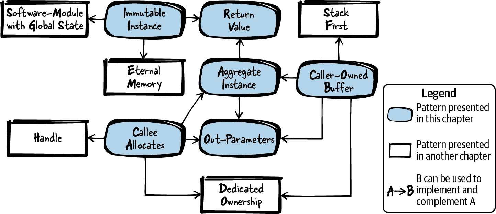
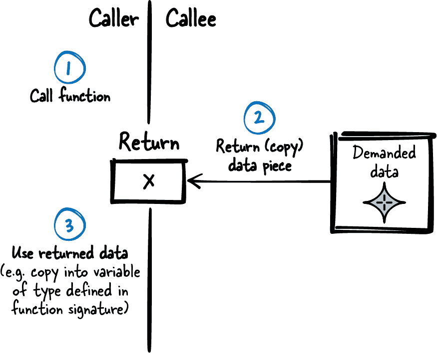
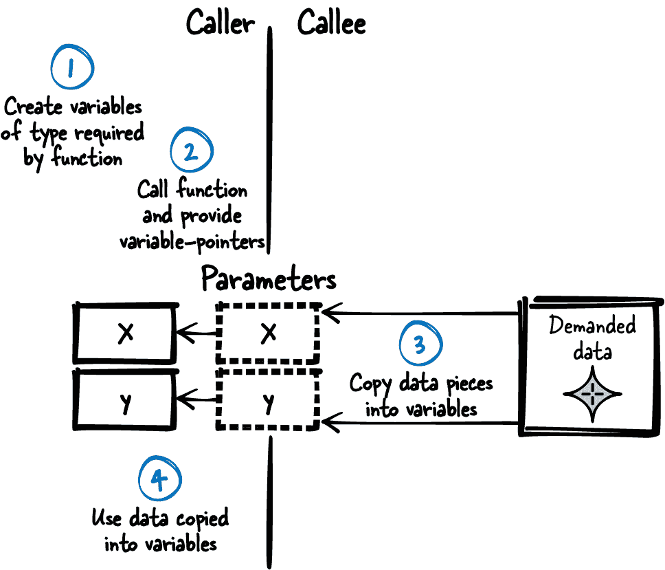
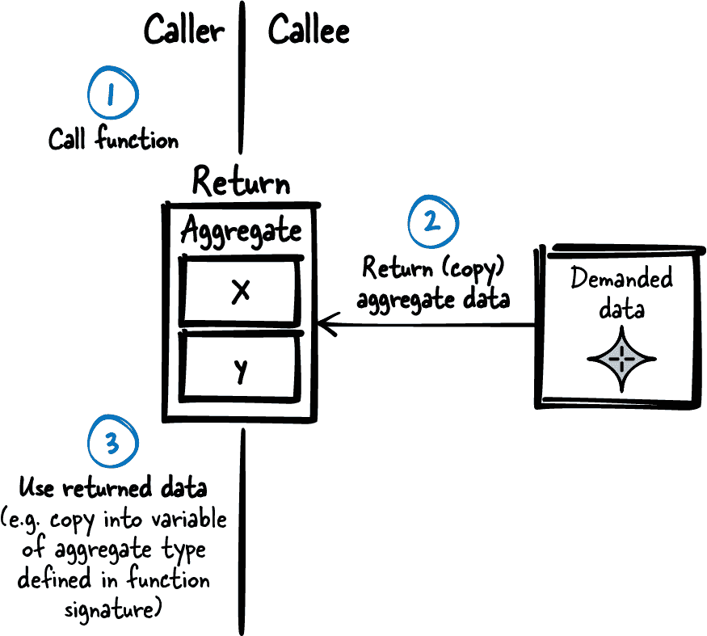
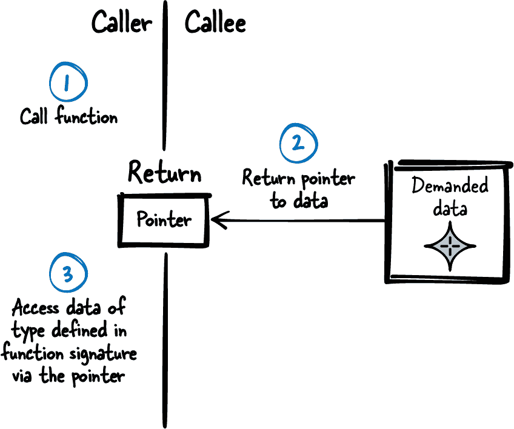
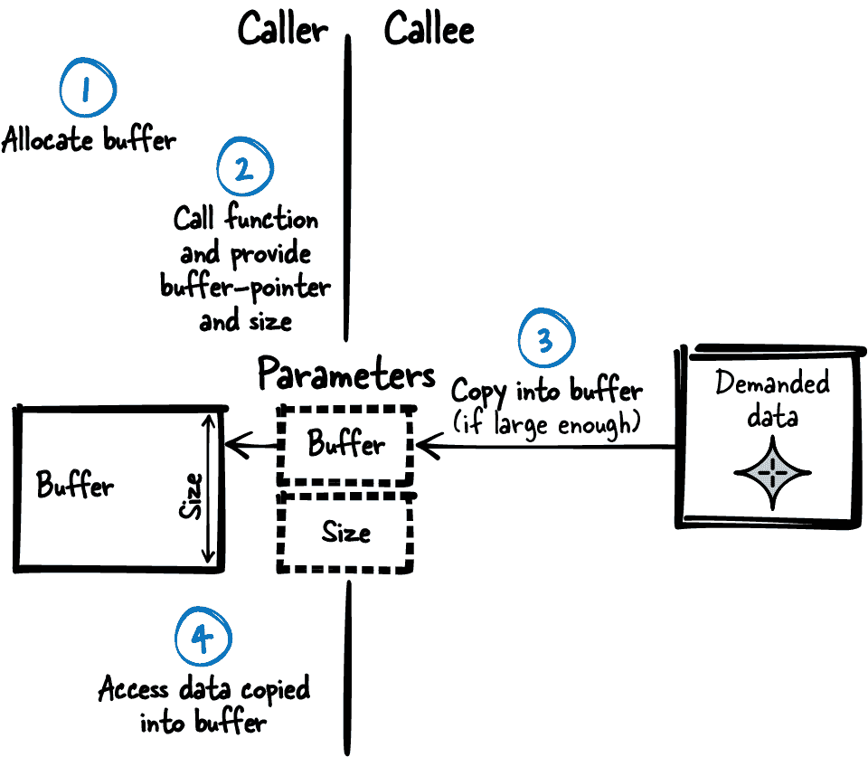
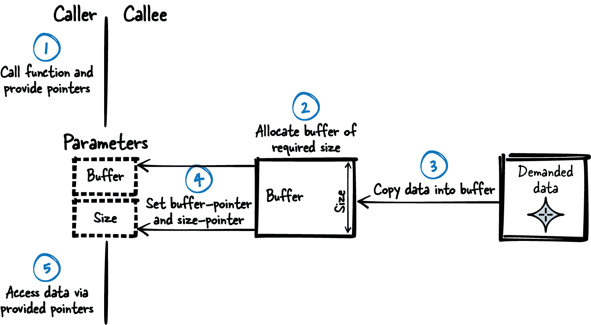

# 第四章 返回 C 函数的数据

返回函数调用的数据是在编写超过 10 行且需要可维护的任何类型的代码时所面临的任务。返回数据是一个简单的任务——你只需传递你想要在两个函数之间共享的数据——而在 C 语言中，你只有直接返回一个值或者通过模拟的“按引用传递”参数来返回数据的选项。选择不多，指导也不多，对吧？错！即使是从 C 函数返回数据的简单任务已经很棘手了，你可以采用多种方式来构造你的程序和函数参数。

特别是在 C 语言中，你必须自行管理内存分配和释放，将复杂数据在函数之间传递变得棘手，因为没有析构函数或垃圾收集器来帮助你清理数据。你必须问自己：数据应该放在堆栈上，还是应该分配？是调用者分配还是被调用者分配？

本章提供了如何在函数之间共享数据的最佳实践。这些模式帮助 C 编程初学者了解在 C 语言中返回数据的技术，也帮助高级 C 程序员更好地理解为什么要应用这些不同的技术。

图 4-1 展示了本章讨论的模式及其关系的概述，而 表 4-1 提供了这些模式的摘要。



###### 图 4-1\. 返回信息的模式概述

表 4-1\. 返回信息的模式

|  | 模式名称 | 摘要 |
| --- | --- | --- |
|  | 返回值 | 你想要拆分的函数部分彼此并不独立。通常在过程化编程中，某些部分生成一个结果，然后另一部分需要这个结果。你想要拆分的函数部分需要共享一些数据。因此，简单地使用一个 C 机制来获取函数调用结果的信息：返回值。在 C 语言中返回数据的机制会复制函数结果，并允许调用者访问这个副本。 |
|  | 输出参数 | C 只支持从函数调用中返回单一类型，这使得返回多个信息片段变得复杂。因此，通过使用指针模拟按引用参数，通过单个函数调用返回所有数据。 |
|  | 聚合实例 | C 只支持从函数调用中返回单一类型，这使得返回多个信息片段变得复杂。因此，将所有相关数据放入一个新定义的类型中。定义这个聚合实例以包含你想要共享的所有相关数据。在你组件的接口中定义它，让调用者直接访问存储在实例中的所有数据。 |
|  | 不可变实例 | 您想从您的组件向调用者提供大块不可变数据中保存的信息。因此，有一个实例（例如一个`struct`），其中包含要共享的数据在静态内存中。向希望访问它的用户提供此数据，并确保他们不能修改它。 |
|  | 调用者拥有的缓冲区 | 您想向调用者提供已知大小的复杂或大数据，并且该数据不是不可变的（在运行时更改）。因此，要求调用者提供一个缓冲区及其大小给返回大型复杂数据的函数。在函数实现中，如果缓冲区大小足够大，则将所需数据复制到缓冲区中。 |
|  | 被调函数分配 | 您想向调用者提供未知大小的复杂或大数据，并且该数据不是不可变的（在运行时更改）。因此，在提供大型复杂数据的函数内部分配一个具有所需大小的缓冲区。将所需数据复制到缓冲区中，并返回指向该缓冲区的指针。 |

# 运行示例

您希望为用户实现以太网驱动程序的诊断信息显示功能。首先，您直接将此功能添加到包含以太网驱动程序实现的文件中，并直接访问包含所需信息的变量：

```cpp
void ethShow()
{
  printf("%i packets received\n", driver.internal_data.rec);
  printf("%i packets sent\n", driver.internal_data.snd);
}
```

后来，您意识到显示以太网驱动程序诊断信息的功能很可能会增长，因此决定将其放入单独的实现文件中，以保持代码整洁。现在，您需要一些简单的方法来将信息从您的以太网驱动组件传输到诊断组件。

一个解决方案是使用全局变量来传输这些信息，但如果使用全局变量，则分割实现文件的努力将是无用的。您将文件分割，因为您希望显示这些代码部分不是紧密耦合的——使用全局变量会重新引入紧密耦合。

一个更好的且非常简单的解决方案如下：让您的以太网组件具有 getter 函数，以返回所需信息作为返回值。

# 返回值

## 上下文

您希望将代码拆分为单独的函数，因为将所有内容放在一个函数和一个实现文件中是不良实践，因为这样会使代码难以阅读和调试。

## 问题

**您希望拆分的函数部分并非彼此独立。与面向过程编程一样，某些部分提供一个结果，然后其他部分需要这个结果。您希望拆分的函数部分需要共享某些数据。**

您希望有一个共享数据的机制，使您的代码易于理解。您希望在代码中明确表示数据在函数之间共享，并确保函数不通过代码中未清晰可见的边路渠道进行通信。因此，对于将信息返回给调用方而言，使用全局变量不是您的良好解决方案，因为全局变量可以从代码的任何其他部分访问和修改。而且，从函数签名中也不清楚使用哪个确切的全局变量来返回数据。

全局变量还有一个缺点，即它们可以用于存储状态信息，这可能导致相同函数调用的不同结果。这使得代码更难理解。除此之外，使用全局变量返回信息的代码也不具备可重入性，并且在多线程环境中使用也不安全。

## 解决方案

**只需使用 C 语言中用于检索函数调用结果信息的机制：返回值。在 C 中返回数据的机制复制函数结果并为调用方提供对此副本的访问。**

图 4-2 和以下代码展示了如何实现返回值。



###### 图 4-2\. 返回值

*调用方代码*

```cpp
int my_data = getData();
/* use my_data */
```

*被调用方代码*

```cpp
int getData()
{
  int requested_data;
  /* .... */
  return requested_data;
}
```

## 结果

返回值允许调用方获取函数结果的副本。除了函数实现外，没有其他代码可以修改此值，并且由于它是一个副本，此值仅由调用函数使用。与使用全局变量相比，更清晰地定义了哪些代码影响从函数调用中检索到的数据。

此外，通过不使用全局变量而使用函数结果的副本，函数可以是可重入的，并且可以在多线程环境中安全使用。

但是，对于内置的 C 类型，函数只能返回函数签名中指定类型的单个对象。不可能定义返回三个不同 `int` 对象的函数，例如。如果您希望返回的信息比仅包含一个简单的标量 C 类型更多，则必须使用聚合实例或输出参数。

此外，如果您希望从数组返回数据，则返回值不是您想要的，因为它不会复制数组的内容，而只会复制到数组的指针。调用方可能会得到一个指向超出作用域的数据的指针。对于返回数组，您必须使用其他机制，如调用方拥有的缓冲区或被调用方分配。

请记住，每当简单的返回值机制足够时，您应始终选择这种最简单的选项来返回数据。您不应选择更强大但也更复杂的模式，例如输出参数、聚合实例、调用方拥有的缓冲区或被调用方分配。

## 已知的使用情况

以下示例显示了此模式的应用：

+   您可以在任何非`void`函数中找到此模式。以此方式返回数据。

+   每个 C 程序都有一个`main`函数，它已经为其调用者（如操作系统）提供了返回值。

## 应用于正在运行的示例

应用返回值很简单。现在，在一个与以太网驱动程序分离的实现文件中，您有一个新的诊断组件，该组件从以太网驱动程序获取诊断信息，如下面的代码所示：

*以太网驱动 API*

```cpp
/* Returns the number of total received packets*/
int ethernetDriverGetTotalReceivedPackets();

/* Returns the number of total sent packets*/
int ethernetDriverGetTotalSentPackets();
```

*调用者的代码*

```cpp
void ethShow()
{
  int received_packets = ethernetDriverGetTotalReceivedPackets();
  int sent_packets = ethernetDriverGetTotalSentPackets();
  printf("%i packets received\n", received_packets);
  printf("%i packets sent\n", sent_packets);
}
```

这段代码易于阅读，如果您想添加额外信息，可以简单地添加额外的函数来获取这些信息。这正是您接下来要做的事情。您希望显示有关发送的数据包的更多信息。您希望向用户显示成功发送了多少数据包以及失败了多少。您的第一次尝试是编写以下代码：

```cpp
void ethShow()
{
  int received_packets = ethernetDriverGetTotalReceivedPackets();
  int total_sent_packets = ethernetDriverGetTotalSentPackets();
  int successfully_sent_packets = ethernetDriverGetSuccesscullySentPackets();
  int failed_sent_packets = ethernetDriverGetFailedPackets();
  printf("%i packets received\n", received_packets);
  printf("%i packets sent\n", total_sent_packets);
  printf("%i packets successfully sent\n", successfully_sent_packets);
  printf("%i packets failed to send\n", failed_sent_packets);
}
```

使用这段代码，您最终意识到，有时与您预期的不同，`successfully_sent_packets`加上`failed_sent_packets`的结果会高于`total_sent_packets`。这是因为您的以太网驱动程序在一个单独的线程中运行，在您调用获取信息的函数之间，以太网驱动程序继续工作并更新其数据包信息。因此，例如，如果以太网驱动程序在您调用`ethernetDriverGet​To⁠tal​SentPackets`和`ethernetDriverGetSuccesscullySentPackets`之间成功发送一个数据包，则显示给用户的信息不一致。

一个可能的解决方案是确保在调用函数获取数据包信息时，以太网驱动程序不在工作中。例如，您可以使用互斥锁或信号量来确保这一点，但是对于获取数据包统计信息这样简单的任务，您希望不是您来解决这个问题。

作为一个更简单的替代方法，您可以使用输出参数在一个函数调用中返回多个信息片段。

# 输出参数

## 上下文

您希望将来自您组件的相关信息数据提供给调用者，这些信息数据可能在不同的函数调用之间发生变化。

## 问题

**C 仅支持从函数调用返回单一类型，这使得返回多个信息片段变得复杂。**

使用全局变量传递表示信息的数据也不是一个好的解决方案，因为使用全局变量返回信息的代码不可重入，并且在多线程环境中使用是不安全的。此外，全局变量可以从代码的任何其他部分访问和修改，并且在使用全局变量时，从函数签名中不清楚哪些确切的全局变量用于返回数据。因此，全局变量会使您的代码难以理解和维护。此外，使用多个函数的返回值也不是一个好的选择，因为要返回的数据是相关联的，因此将其分割到多个函数调用中会使代码变得不可读。

因为数据片段相关联，调用者希望检索所有这些数据的一致快照。在多线程环境中使用多个返回值时会出现问题，因为数据可以在运行时更改。在这种情况下，您必须确保数据在调用者多次函数调用之间不会更改。但是，您无法知道调用者是否已经完成了所有数据的读取，或者调用者是否会使用另一个函数调用检索另一条信息。因此，您无法确保数据在调用者的函数调用之间不会修改。如果使用多个函数提供相关信息，则不知道数据不得更改的时间跨度。因此，通过这种方法，您无法保证调用者将检索到信息的一致快照。

如果需要大量准备工作来计算相关数据片段，则使用多个具有返回值的函数也可能不是一个好的解决方案。例如，如果要从地址簿返回指定人员的家庭和移动电话号码，并且有单独的函数来检索这些号码，则必须分别搜索此人员的地址簿条目以进行每个函数调用。这需要不必要的计算时间和资源。

## 解决方案

**通过使用指针模拟按引用传递的参数，在一个函数调用中返回所有数据。**

C 不支持使用返回值返回多个类型，也不原生支持按引用传递的参数，但可以通过模拟按引用传递的参数来实现，如图 4-3 和以下代码所示。



###### 图 4-3\. 输出参数

*调用者的代码*

```cpp
int x,y;
getData(&x,&y);
/* use x,y */
```

*被调用者的代码*

```cpp
void getData(int* x, int* y)
{
  *x = 42;
  *y = 78;
}
```

一个单一功能，具有许多指针参数。在函数实现中，解引用指针并将要返回给调用者的数据复制到指向的实例中。在函数实现中，确保在复制时数据不会更改。这可以通过互斥来实现。

## 后果

现在，所有表示相关信息的数据都在一个单一的函数调用中返回，并且可以保持一致（例如通过 Mutex 或信号量保护数据）。该函数是可重入的，可以安全地在多线程环境中使用。

对于每个额外的数据项，都将额外的指针传递给函数。这样做的缺点是，如果要返回大量数据，函数的参数列表会变得越来越长。一个函数有许多参数是一种代码味道，因为它使得代码难以阅读。这就是为什么很少使用多个 Out-Parameters 来返回一个函数的原因，而是通过聚合实例返回相关的信息来清理代码。

此外，对于每个数据片段，调用者必须将指针传递给函数。这意味着对于每个数据片段，都必须在堆栈上放置一个额外的指针。如果调用者的堆栈内存非常有限，这可能会成为一个问题。

Out-Parameters 的缺点在于，当仅查看函数签名时，无法明确识别它们作为 Out-Parameters。从函数签名中，调用者只能猜测当他们看到一个指针时，它可能是一个 Out-Parameter。但是这样的指针参数也可能是函数的输入。因此，必须在 API 文档中明确描述哪些参数是输入，哪些是输出。

对于简单的标量 C 类型，调用者可以简单地将变量的指针作为函数参数传递。由于指定的指针类型，函数实现中提供了解释指针的所有信息。要返回复杂类型（如数组）的数据，必须提供 Caller-Owned Buffer，或者 Callee Allocates 并传达有关数据的额外信息，例如其大小。

## 已知的使用情况

以下示例展示了此模式的应用：

+   Windows 的`RegQueryInfoKey`函数通过函数的 Out-Parameters 返回有关注册表键的信息。调用者提供`unsigned long`指针，函数将键的子键数和键值的大小等信息写入指向的`unsigned long`变量中。

+   Apple 的 C 程序的 Cocoa API 使用额外的`NSError`参数来存储在函数调用期间发生的错误。

+   实时操作系统 VxWorks 的函数`userAuthenticate`使用 Return Values 来返回信息，例如提供的登录名的密码是否正确。此外，该函数采用 Out-Parameter 来返回与提供的登录名关联的用户 ID。

## 应用于运行示例

通过应用 Out-Parameters，您将获得以下代码：

*以太网驱动程序 API*

```cpp
/* Returns driver status information via out-parameters.
   total_sent_packets   --> number of packets tried to send (success and fail)
   successfully_sent_packets --> number of packets successfully sent
   failed_sent_packets  --> number of packets failed to send */
void ethernetDriverGetStatistics(int* total_sent_packets,
      int* successfully_sent_packets, int* failed_sent_packets); 
```


要获取关于发送数据包的信息，你只需调用以太网驱动程序的一个函数，并且以太网驱动程序可以确保在此调用中传递的数据是一致的。

*调用者的代码*

```cpp
void ethShow()
{
  int total_sent_packets, successfully_sent_packets, failed_sent_packets;
  ethernetDriverGetStatistics(&total_sent_packets, &successfully_sent_packets,
                              &failed_sent_packets);
  printf("%i packets sent\n", total_sent_packets);
  printf("%i packets successfully sent\n", successfully_sent_packets);
  printf("%i packets failed to send\n", failed_sent_packets);

  int received_packets = ethernetDriverGetTotalReceivedPackets();
  printf("%i packets received\n", received_packets);
}
```

你还考虑在同一个函数调用中检索`received_packets`和发送的数据包，但是你意识到一个函数调用变得越来越复杂。一个带有三个输出参数的函数调用已经很复杂了，写起来和读起来都不容易。在调用函数时，参数的顺序很容易混淆。增加第四个参数并不能使代码变得更好。

为了使代码更易读，可以使用一个聚合实例。

# 聚合实例

## 上下文

你希望向调用者提供从你的组件到调用者的相关信息片段。这些信息片段在不同的函数调用之间可能会发生变化。

## 问题

**C 只支持从函数调用中返回单一类型，这使得返回多个信息片段变得复杂。**

使用全局变量传递表示你的信息片段的数据也不是一个好的解决方案，因为使用全局变量返回信息的代码不具备可重入性，并且在多线程环境中使用起来也不安全。除此之外，全局变量可以从代码的任何其他部分访问和修改，在使用全局变量时，从函数签名中无法清楚地知道哪些具体的全局变量用于返回数据。因此，全局变量会使你的代码难以理解和维护。同时，使用多个函数的返回值也不是一个好选择，因为你要返回的数据是相关的，所以将其分散在多个函数调用中会使代码变得不太可读。

使用多个输出参数的单个函数也不是一个好主意，因为如果有多个这样的输出参数，很容易混淆，你的代码会变得难以阅读。此外，你想表明这些参数是密切相关的，甚至可能需要将同一组参数提供给或由其他函数返回。如果使用函数参数显式执行此操作，那么在稍后添加额外参数时，必须修改每个这样的函数。

因为数据片段相关联，调用者希望在多线程环境中检索到所有这些数据的一致快照。当使用多返回值时，这就成为一个问题，因为数据可能在运行时更改。在这种情况下，您必须确保数据在调用者的多个函数调用之间不会更改。但您无法知道调用者是否已完成读取所有数据，或者调用者是否会在另一个函数调用中检索另一条信息。因此，您无法确保数据在调用者的函数调用之间不被修改。如果使用多个函数提供相关信息，则不知道数据不得更改的时间跨度。因此，通过这种方法，您无法保证调用者将检索到信息的一致快照。

如果需要大量准备工作来计算相关数据片段，则使用具有返回值的多个函数也可能不是一个好的解决方案。例如，如果您希望从通讯录中为指定的人返回家庭电话和移动电话号码，并且您有单独的函数来检索这些号码，则必须分别搜索该人的通讯录条目。这需要不必要的计算时间和资源。

## 解决方案

**将所有相关数据放入新定义的类型中。定义此聚合实例以包含您希望共享的所有相关数据。在您组件的接口中定义它，让调用者直接访问实例中存储的所有数据。**

要实现此操作，请在您的头文件中定义一个`struct`，并将从被调用函数返回的所有类型定义为此`struct`的成员。在函数实现中，像在图 4-4 中展示的那样，将要返回的数据复制到`struct`成员中。在函数实现中，确保在复制数据时数据不会更改。可以通过互斥锁或信号量来实现这一点。



###### 图 4-4\. 聚合实例

要将`struct`实际返回给调用者，有两个主要选项：

+   将整个`struct`作为返回值传递。C 不仅允许将内置类型作为函数的返回值传递，还允许像`struct`这样的用户定义类型。

+   使用 Out-Parameter 传递`struct`的指针。但是，当仅传递指针时，会出现谁提供和拥有所指向内存的问题。这个问题在“调用者拥有缓冲区”和“被调用者分配”中得到了解决。与直接让调用者访问聚合实例的指针相比，您可以考虑通过使用句柄来隐藏`struct`，从而避免这个问题。

下面的代码显示了通过传递整个`struct`的变体：

*调用者的代码*

```cpp
struct AggregateInstance my_instance;
my_instance = getData();
/* use my_instance.x
 use my_instance.y, ... */
```

*被调用者的代码*

```cpp
struct AggregateInstance
{
  int x;
  int y;
};

struct AggregateInstance getData()
{
  struct AggregateInstance inst;
  /* fill inst.x and inst.y */
  return inst; 
}
```


返回时，即使 `inst` 是一个 `struct`，其内容也会被复制，调用者可以在 `inst` 超出范围后访问复制的内容。

## 结果

现在，调用者可以通过单个函数调用通过聚合实例检索多个表示相关信息的数据。该函数是可重入的，在多线程环境中可以安全使用。

这为调用者提供了相关信息的一致快照。这也使调用者的代码更清晰，因为他们不必调用多个函数或一个带有多个输出参数的函数。

通过使用返回值在函数之间传递数据时，所有这些数据都放在堆栈上。将一个 `struct` 传递给 10 个嵌套函数时，这个 `struct` 在堆栈上会出现 10 次。在某些情况下这不是问题，但在其他情况下是—特别是如果 `struct` 太大，并且您不希望通过每次复制整个 `struct` 来浪费堆栈内存。因此，通常不直接传递或返回 `struct`，而是传递或返回指向该 `struct` 的指针。

当将指向 `struct` 的指针传递给函数时，或者如果 `struct` 包含指针，则必须记住 C 不会为您执行深拷贝的工作。C 只复制指针值，而不复制它们指向的实例。这可能不是您想要的，因此一旦涉及指针，您必须处理提供和清理指向的内存。这个问题在“调用者拥有缓冲区”和“被调用者分配”中得到解决。

## 已知用途

下面的示例展示了此模式的应用：

+   文章 [“Argument Passing Patterns”](https://oreil.ly/VlCgm) 由 Uwe Zdun 描述了这种模式，包括 C++ 示例，称为上下文对象，以及书籍 *Refactoring: Improving the Design of Existing Code* 由 Martin Fowler (Addison-Wesley, 1999) 描述为参数对象。

+   游戏 NetHack 的代码将怪物属性存储在聚合实例中，并提供一个函数来检索此信息。

+   文本编辑器 sam 的实现在将 `structs` 传递给函数和从函数返回它们时进行复制，以保持代码简洁。

## 应用于运行示例

使用聚合实例，您将获得以下代码：

*以太网驱动程序 API*

```cpp
struct EthernetDriverStat{
  int received_packets;         /* Number of received packets */
  int total_sent_packets;       /* Number of sent packets (success and fail)*/
  int successfully_sent_packets;/* Number of successfully sent packets */
  int failed_sent_packets;      /* Number of packets failed to send */
};

/* Returns statistics information of the Ethernet driver */
struct EthernetDriverStat ethernetDriverGetStatistics();
```

*调用者的代码*

```cpp
void ethShow()
{
  struct EthernetDriverStat eth_stat = ethernetDriverGetStatistics();
  printf("%i packets received\n", eth_stat.received_packets);
  printf("%i packets sent\n", eth_stat.total_sent_packets);
  printf("%i packets successfully sent\n",eth_stat.successfully_sent_packets);
  printf("%i packets failed to send\n", eth_stat.failed_sent_packets);
}
```

现在您只需调用以太网驱动程序一次，以太网驱动程序可以确保在此调用中交付的数据是一致的。此外，您的代码看起来更整洁，因为属于一起的数据现在集中在一个单独的 `struct` 中。

接下来，你想向用户显示更多有关以太网驱动程序的信息。你想要向用户展示数据包统计信息所属的以太网接口，因此你想要显示包括驱动程序的文本描述在内的驱动程序名称。这两者都包含在存储在以太网驱动程序组件中的字符串中。该字符串相当长，你并不确切知道它的长度。幸运的是，在运行时该字符串不会更改，因此你可以访问一个不可变实例。

# 不可变实例

## 背景

你的组件包含大量数据，另一个组件想要访问这些数据。

## 问题

**你想要将组件中大块不可变数据的信息提供给调用者。**

对每个调用者复制数据将会浪费内存，因此通过返回聚合实例或将所有数据复制到输出参数中提供所有数据，由于堆栈内存限制而不可行。

通常，仅返回指向此类数据的指针是棘手的。你会面临这样的问题：使用指针，可以修改这些数据，并且当多个调用者读取和写入相同数据时，你必须想出机制来确保你要访问的数据是一致的和最新的。幸运的是，在你的情况下，要提供给调用者的数据在编译时或启动时是固定的，并且在运行时不会改变。

## 解决方案

**有一个实例（例如一个`struct`），其中包含要共享的数据放在静态内存中。将这些数据提供给想要访问它们的用户，并确保他们不能修改它。**

在编译时或启动时编写要包含在实例中的数据，并且不再在运行时更改它。你可以直接在程序中硬编码写入数据，或者在程序启动时初始化它（参见“具有全局状态的软件模块”以获取初始化变体和“永久内存”以获取存储变体）。如图 4-5 所示（#fig_immutable），即使多个调用者（和多个线程）同时访问该实例，它们也不必担心对方，因为实例不会更改，因此始终处于一致状态并包含所需信息。

实现一个返回数据指针的函数。或者，你甚至可以直接将包含数据的变量作为全局变量放入你的 API 中，因为数据在运行时不会改变。但是，与全局变量相比，获取函数更好，因为它使编写单元测试更容易，并且在未来代码行为更改的情况下（如果你的数据不再是不可变的），你不必更改接口。



###### 图 4-5\. 不可变实例

为确保调用者不修改数据，在返回数据指针时，使指向的数据为`const`，如下面的代码所示：

*调用者的代码*

```cpp
const struct ImmutableInstance* my_instance;
my_instance = getData(); 
/* use my_instance->x,
   use my_instance->y, ... */
```


调用者获得引用但不拥有内存。

*被调用者 API*

```cpp
struct ImmutableInstance
{
  int x;
  int y;
};
```

*被调用者的实现*

```cpp
static struct ImmutableInstance inst = {12, 42};
const struct ImmutableInstance* getData()
{
   return &inst;
}
```

## 结果

调用者可以调用一个简单的函数来访问甚至复杂或大型的数据，而无需关心此数据存储在何处。 调用者不必提供用于存储此数据的缓冲区，不必清理内存，并且不必关心数据的生命周期——它始终存在。

调用者可以通过检索到的指针读取所有数据。 用于检索指针的简单函数是可重入的，并且可以安全地用于多线程环境中。 此外，由于数据在运行时不会更改，并且只读取数据的多个线程没有问题，因此还可以安全地访问数据。

但是，在不采取进一步措施的情况下，不能在运行时更改数据。 如果调用者需要能够更改数据，则可以实施类似写时复制的方法。 如果一般情况下数据可以在运行时更改，则不可变实例不是一个选择，而是必须使用调用者拥有的缓冲区或被调用者分配的复杂和大型数据共享。

## 已知用途

以下示例展示了此模式的应用：

+   在他的文章[“Java 中的模式：值模式”](https://oreil.ly/cVY9N)，Kevlin Henney 详细描述了类似的不可变对象模式，并提供了 C++代码示例。

+   游戏 NetHack 的代码将不可变的怪物属性存储在不可变实例中，并提供一个用于检索这些信息的函数。

## 应用于运行示例

通常，返回指向组件内存储数据的指针是棘手的。 这是因为如果多个调用者访问（甚至可能写入）此数据，则普通指针不是您的解决方案，因为您永远不知道您拥有的指针是否仍然有效以及此指针中包含的数据是否一致。 但在这种情况下，我们很幸运，因为我们有一个不可变的实例。 驱动程序名称和描述都是在编译时确定的信息，并且之后不会更改。 因此，我们可以简单地检索指向此数据的常量指针：

*以太网驱动程序 API*

```cpp
struct EthernetDriverInfo{
  char name[64];
  char description[1024];
};

/* Returns the driver name and description */
const struct EthernetDriverInfo* ethernetDriverGetInfo();
```

*调用者的代码*

```cpp
void ethShow()
{
  struct EthernetDriverStat eth_stat = ethernetDriverGetStatistics();
  printf("%i packets received\n", eth_stat.received_packets);
  printf("%i packets sent\n", eth_stat.total_sent_packets);
  printf("%i packets successfully sent\n",eth_stat.successfully_sent_packets);
  printf("%i packets failed to send\n", eth_stat.failed_sent_packets);

  const struct EthernetDriverInfo* eth_info = ethernetDriverGetInfo();
  printf("Driver name: %s\n", eth_info->name);
  printf("Driver description: %s\n", eth_info->description);
}
```

作为下一步，除了以太网接口的名称和描述外，您还希望向用户显示当前配置的 IP 地址和子网掩码。 这些地址作为字符串存储在以太网驱动程序中。 这两个地址都是在运行时可能会更改的信息，因此您不能简单地返回一个指向不可变实例的指针。

尽管以太网驱动程序将这些字符串打包到聚合实例中并简单返回此实例（在返回结构体时，结构体中的数组会被复制），但对于大量数据来说，这种解决方案并不常见，因为它会消耗大量堆栈内存。通常使用指针代替。

使用指针是您寻找的确切解决方案：使用**Caller-Owned Buffer**。

# Caller-Owned Buffer

## 上下文

您有一些大数据想要在不同组件之间共享。

## 问题

**您想要向调用方提供复杂或大型的已知大小数据，并且该数据不是不可变的（在运行时会发生变化）。**

因为数据在运行时发生变化（也许是因为您为调用方提供了写入数据的函数），所以您不能简单地向调用方提供指向静态数据的指针（就像不可变实例的情况）。如果您仅向调用方提供这样的指针，那么您可能会遇到问题，因为在多线程环境中，另一个调用者可能同时写入该数据，导致读取的数据不一致（部分被覆写）。

将所有数据简单地复制到聚合实例中，并通过返回值传递给调用方并不可行，因为数据量大，无法通过堆栈传递，堆栈内存非常有限。

如果仅返回指向聚合实例的指针，则不再有堆栈内存限制的问题，但您必须记住，C 语言不会为您执行深度复制的工作。C 仅返回指针。您必须确保函数调用后，指向的数据（存储在聚合实例或数组中）仍然有效。例如，您不能将数据存储在函数内的自动变量中，并提供指向这些变量的指针，因为函数调用后，这些变量会超出作用域。

现在出现了一个问题，即数据应该存储在何处。必须澄清调用方或被调用方应提供所需的内存，并由哪一个负责管理和清理内存。

## 解决方案

**要求调用方为函数提供缓冲区及其大小，以便将所需数据复制到缓冲区（如果缓冲区大小足够大）。**

确保在复制时数据不会更改。可以通过互斥锁或信号量来实现互斥。这样，调用方就拥有了缓冲区中数据的快照，并且是该快照的唯一所有者，因此即使原始数据在此期间发生更改，也可以一致地访问此快照。

调用方可以分别将缓冲区及其大小作为单独的函数参数提供，或者调用方可以将缓冲区及其大小打包到聚合实例中，并将聚合实例的指针传递给函数。

由于调用者必须向函数提供缓冲区及其大小，所以调用者必须事先知道大小。为了让调用者知道缓冲区应有的大小，API 中必须包含大小需求。可以通过将大小定义为宏或在 API 中定义包含所需大小缓冲区的`struct`来实现此目的。

图 4-6 和下面的代码展示了调用者拥有缓冲区的概念。



###### 图 4-6\. 调用者拥有的缓冲区

*调用者的代码*

```cpp
struct Buffer buffer;

getData(&buffer);
/* use buffer.data */
```

*被调用者的 API*

```cpp
#define BUFFER_SIZE 256
struct Buffer
{
  char data[BUFFER_SIZE];
};

void getData(struct Buffer* buffer);
```

*被调用者的实现*

```cpp
void getData(struct Buffer* buffer)
{
  memcpy(buffer->data, some_data, BUFFER_SIZE);
}
```

## 结果

可以通过单个函数调用向调用者提供大型复杂数据。该函数是可重入的，并且可以安全地在多线程环境中使用。此外，由于调用者是缓冲区的唯一所有者，所以调用者可以在多线程环境中安全地访问数据。

调用者提供了一个期望大小的缓冲区，并且甚至可以决定缓冲区的内存类型。调用者可以将缓冲区放在堆栈上（参见“先入栈”），并从堆栈内存的优势中受益，变量超出作用域后，堆栈内存将被清理。或者，调用者可以将内存放在堆上，以确定变量的生命周期或避免浪费堆栈内存。此外，调用函数可能仅具有由其调用函数获取的缓冲区的引用。在这种情况下，可以简单地传递此缓冲区，而无需拥有多个缓冲区。

在函数调用期间不执行分配和释放内存的耗时操作。调用者可以确定这些操作何时发生，因此函数调用变得更快更可预测。

从 API 中可以清楚地看出，调用者专有缓冲区的所有权。调用者必须提供缓冲区并在使用后进行清理。如果调用者分配了缓冲区，则调用者负责在使用后释放它。

调用者必须事先知道缓冲区的大小，并且因为已知这个大小，函数可以安全地在缓冲区中操作。但在某些情况下，调用者可能不知道需要的确切大小，如果被调用者分配，则会更好。

## 已知的使用情况

下面的例子展示了此模式的应用：

+   NetHack 代码使用此模式将保存游戏进度的信息提供给实际将游戏进度存储在磁盘上的组件。

+   B&R 自动化运行时操作系统在函数中使用此模式来检索 IP 地址。

+   C 标准库函数`fgets`从流中读取输入并将其存储在提供的缓冲区中。

## 应用于运行示例

现在你向以太网驱动函数提供一个由调用者拥有的缓冲区，并且函数将其数据复制到这个缓冲区中。你必须事先知道缓冲区的大小。在获取 IP 地址字符串的情况下，这不是问题，因为字符串有固定大小。所以你可以简单地将 IP 地址的缓冲区放在堆栈上，并将这个堆栈变量提供给以太网驱动程序。或者，也可以在堆上分配缓冲区，但在这种情况下并不需要，因为 IP 地址的大小是已知的，并且数据的大小足够小，可以适应堆栈：

*以太网驱动程序 API*

```cpp
struct IpAddress{
  char address[16];
  char subnet[16];
};

/* Stores the IP information into 'ip', which has to be provided
 by the caller*/
void ethernetDriverGetIp(struct IpAddress* ip);
```

*调用者的代码*

```cpp
void ethShow()
{
  struct EthernetDriverStat eth_stat = ethernetDriverGetStatistics();
  printf("%i packets received\n", eth_stat.received_packets);
  printf("%i packets sent\n", eth_stat.total_sent_packets);
  printf("%i packets successfully sent\n",eth_stat.successfully_sent_packets);
  printf("%i packets failed to send\n", eth_stat.failed_sent_packets);

  const struct EthernetDriverInfo* eth_info = ethernetDriverGetInfo();
  printf("Driver name: %s\n", eth_info->name);
  printf("Driver description: %s\n", eth_info->description);

  struct IpAddress ip;
  ethernetDriverGetIp(&ip);
  printf("IP address: %s\n", ip.address);
}
```

接下来，你想要扩展你的诊断组件，以便打印最后接收到的数据包的转储。现在，这是一条信息，太大了不能放在堆栈上，因为以太网数据包大小可变，你事先不知道数据包的缓冲区大小。因此，对于你来说，调用者拥有的缓冲区不是一个选择。

当然，你可以简单地有函数 `EthernetDriverGetPacketSize()` 和 `EthernetDriverGetPacket(buffer)`，但在这里，你将会遇到一个问题，即在两个函数调用之间，以太网驱动程序可能会接收到另一个数据包，这会使你的数据不一致。此外，这种解决方案并不太优雅，因为你需要调用两个不同的函数来实现一个目的。相反，如果被调用者分配会更容易。

# 被调用者分配

## 上下文

你有大量数据希望在不同的组件之间共享。

## 问题

**你希望向调用者提供复杂或大量数据的大小未知，并且这些数据在运行时不是不可变的。**

数据在运行时会发生变化（也许是因为你提供给调用者写数据的函数），因此你不能简单地提供一个指向静态数据的指针给调用者（这就是不可变实例的情况）。如果你简单地向调用者提供这样一个指针，你会遇到一个问题，即一个调用者读取的数据可能是不一致的（部分被覆盖），因为在多线程环境下，另一个调用者可能同时写入该数据。

简单地将所有数据复制到聚合实例中，并通过返回值传递给调用者不是一个选择。通过返回值，你只能传递已知大小的数据，并且因为数据很大，不能通过堆栈传递，堆栈的内存非常有限。

如果仅返回指向聚合实例的指针，则不再存在堆栈内存限制的问题，但必须记住 C 不会为您执行深度复制的工作。C 只返回指针。您必须确保在函数调用后，指向的数据（存储在聚合实例或数组中）仍然有效。例如，您不能将数据存储在函数内的自动变量中，并提供指向这些变量的指针，因为在函数调用后，这些变量会超出作用域并被清理。

现在出现了数据应存储在何处的问题。必须澄清是调用者还是被调用者应提供所需的内存，以及哪个部分负责管理和清理内存。

您要提供的数据量在编译时不是固定的。例如，您希望返回先前未知大小的字符串。这使得使用调用者拥有的缓冲区变得不切实际，因为调用者事先不知道缓冲区的大小。调用者可以事先询问所需的缓冲区大小（例如，使用 `getRequiredBufferSize()` 函数），但这也是不切实际的，因为为了检索一个数据片段，调用者必须进行多次函数调用。此外，在这些函数调用之间，您要提供的数据可能会发生变化，然后调用者再次提供错误大小的缓冲区。

## 解决方案

**在提供大型复杂数据的函数内部分配所需大小的缓冲区。将所需数据复制到缓冲区中并返回指向该缓冲区的指针。**

将缓冲区的指针和大小作为输出参数提供给调用者。在函数调用后，调用者可以操作缓冲区，知道其大小，并独占缓冲区所有权。调用者决定其生命周期，因此负责清理，如 图 4-7 和接下来的代码所示。



###### 图 4-7\. 被调用者分配

*调用者的代码*

```cpp
char* buffer;
int size;
getData(&buffer, &size);
/* use buffer */
free(buffer);
```

*被调用者的代码*

```cpp
void getData(char** buffer, int* size)
{
  *size = data_size;
  *buffer = malloc(data_size);
  /* write data to buffer */ 
}
```


在将数据复制到该缓冲区时，请确保其在此期间不会更改。这可以通过互斥锁或信号量来实现。

或者，将缓冲区的指针和大小放入作为返回值提供的聚合实例中。为了让调用者更清楚地知道在聚合实例中有一个需要释放的指针，API 可以提供一个额外的清理函数。同时提供清理函数时，API 看起来已经非常类似于具有句柄的 API，这样既保持了 API 的兼容性，又带来了灵活性的额外好处。

无论被调用函数是通过聚合实例还是通过输出参数提供缓冲区，都必须向调用者明确表明，调用者拥有缓冲区并负责释放它。这种专有所有权必须在 API 中得到很好的文档记录。

## 后果

调用者可以通过单个函数调用检索以前未知大小的缓冲区。该函数是可重入的，可以安全地在多线程环境中使用，并为调用者提供有关缓冲区及其大小的一致信息。知道大小后，调用者可以安全地操作数据。例如，调用者甚至可以处理通过这些缓冲区传输的未终止字符串。

调用者拥有缓冲区，确定其生命周期，并负责释放它（就像使用句柄一样）。从接口上看，必须非常明确地指出调用者必须这样做。使这一点变得清晰的一种方法是在 API 中记录它。另一种方法是有一个显式的清理函数，以使需要清理的内容更加明显。这样的清理函数还有额外的优势，即分配内存的组件也负责释放它。如果两个相关组件使用不同的编译器或在不同平台上运行，这一点非常重要——在这种情况下，分配和释放内存的函数可能在组件之间不同，这使得分配和释放的组件必须是同一个。

调用者无法确定缓冲区应使用哪种类型的内存——这在拥有调用者缓冲区时是可能的。现在调用者必须使用在函数调用内部分配的内存类型。

分配需要时间，这意味着与拥有调用者缓冲区相比，函数调用变得更慢且不太可预测。

## 已知用途

以下示例显示了此模式的应用：

+   `malloc`函数正是如此。它分配一些内存并将其提供给调用者。

+   `strdup`函数接受字符串作为输入，分配重复的字符串并返回它。

+   `getifaddrs` Linux 函数提供有关配置的 IP 地址信息。存储此信息的数据存储在函数分配的缓冲区中。

+   NetHack 代码使用此模式来检索缓冲区。

## 应用于运行示例

您的诊断组件的最终代码检索由被调用方分配的缓冲区中的数据包数据：

*以太网驱动程序 API*

```cpp
struct Packet
{
  char data[1500]; /* maximum 1500 byte per packet */
  int size;        /* actual size of data in the packet */
};

/* Returns a pointer to a packet that has to be freed by the caller */
struct Packet* ethernetDriverGetPacket();
```

*调用者的代码*

```cpp
void ethShow()
{
  struct EthernetDriverStat eth_stat = ethernetDriverGetStatistics();
  printf("%i packets received\n", eth_stat.received_packets);
  printf("%i packets sent\n", eth_stat.total_sent_packets);
  printf("%i packets successfully sent\n",eth_stat.successfully_sent_packets);
  printf("%i packets failed to send\n", eth_stat.failed_sent_packets);

  const struct EthernetDriverInfo* eth_info = ethernetDriverGetInfo();
  printf("Driver name: %s\n", eth_info->name);
  printf("Driver description: %s\n", eth_info->description);

  struct IpAddress ip;
  ethernetDriverGetIp(&ip);
  printf("IP address: %s\n", ip.address);

  struct Packet* packet = ethernetDriverGetPacket();
  printf("Packet Dump:");
  fwrite(packet->data, 1, packet->size, stdout);
  free(packet);
}
```

通过这个最终版本的诊断组件，我们可以看到如何从另一个函数中获取信息的所有展示方式。将所有这些方式混合在一段代码中可能不是您实际想做的，因为在栈上有一个数据片段，而在堆上有另一个数据片段会让人有些困惑。一旦分配了缓冲区，您不希望混合不同的方法，因此在单个函数中同时使用**调用方拥有缓冲区**和**被调用者分配**可能不是您想要的。相反，选择一个适合所有需求的方法，并在一个函数或组件中坚持使用它。这样可以使您的代码更统一且更易于理解。

然而，如果您只需从另一个组件获取单个数据片段，并且可以选择使用本章早期介绍的更简单的替代方法来检索数据，那么请始终这样做，以保持代码简洁。例如，如果可以选择将缓冲区放在栈上，请这样做，因为这样可以省去释放缓冲区的工作。

# 总结

本章展示了在 C 语言中如何从函数返回数据以及如何处理缓冲区的不同方法。最简单的方式是使用**返回值**返回单个数据片段，但如果需要返回多个相关数据片段，那么应该使用**输出参数**或者更好的**聚合实例**。如果返回的数据在运行时不会改变，可以使用**不可变实例**。在返回缓冲区中的数据时，如果缓冲区的大小事先已知，可以使用**调用方拥有缓冲区**；如果大小事先不知道，则可以使用**被调用者分配**。

通过本章的模式，C 程序员可以掌握一些基本工具和指导，用于在函数之间传输数据以及处理返回、分配和释放缓冲区。

# 展望

下一章将介绍如何将较大的程序组织成软件模块，并且讨论这些软件模块如何处理数据的生命周期和所有权。这些模式概述了用于构建较大 C 代码片段的基本组成部分。
