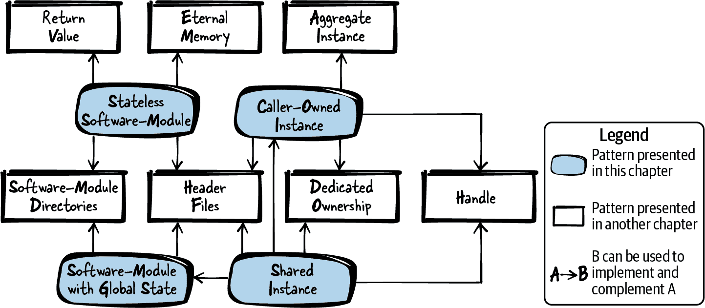
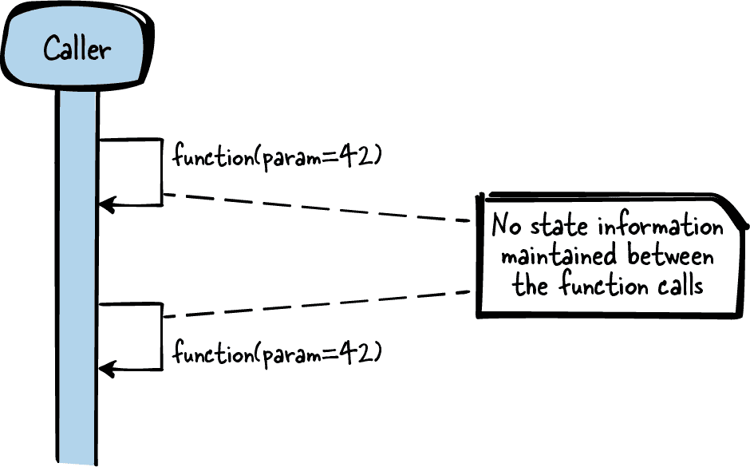
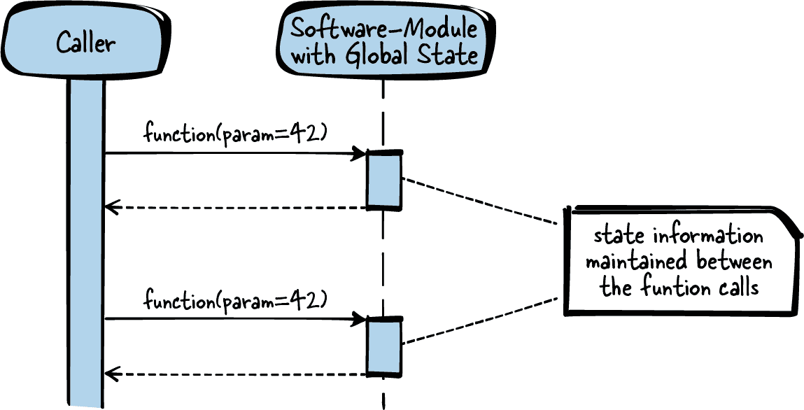
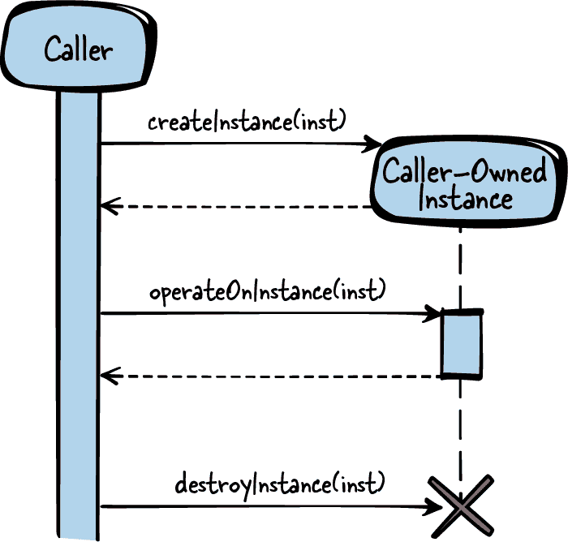
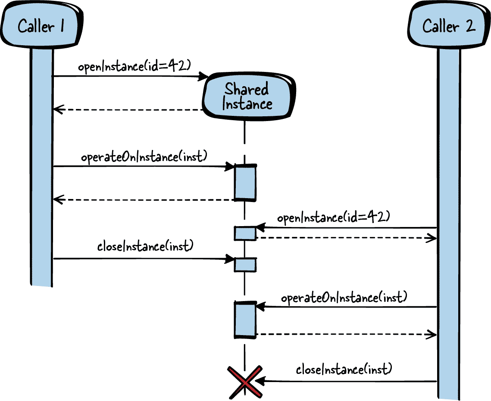

# 第五章 数据生命周期和所有权

如果我们看看像 C 这样的过程式编程语言，那么其中没有原生的面向对象机制。这在某种程度上增加了编程的难度，因为大多数设计指导都是针对面向对象软件（例如四人帮设计模式）。

本章讨论了如何在 C 程序中结构化包含对象样元素的模式。对于这些对象样元素，模式特别关注谁负责创建和销毁它们——换句话说，它们特别关注生命周期和所有权。这个主题对于 C 语言尤为重要，因为 C 语言没有自动析构函数和垃圾回收机制，因此需要特别注意资源的清理。

但是，“对象样元素”究竟是什么意思，对于 C 语言来说有什么含义呢？术语*对象*在面向对象编程语言中有明确定义，但对于非面向对象编程语言来说，并不清楚对象一词的含义。对于 C 语言，对象的简单定义如下：

> “一个对象是一个命名的存储区域。”
> 
> Kernighan 和 Ritchie

通常这样的对象描述了具有标识和属性的相关数据集，用于存储现实世界中找到的事物的表示。在面向对象编程中，对象还具有多态性和继承能力。本书描述的对象样元素不涉及多态性或继承，因此我们将不再使用对象一词。相反，我们将简单地将这样的对象样元素视为数据结构的一个实例，并进一步称其为*实例*。

这些实例通常不能独立存在，而通常伴随相关的代码片段，使得操作这些实例成为可能。此代码通常组合到一组头文件以供其接口使用，并且一组实现文件用于其实现。在本章中，与面向对象类似的所有这些相关代码的总和，通常定义了可以在实例上执行的操作，将被称为*软件模块*。

在编写 C 语言程序时，数据的描述实例通常被实现为抽象数据类型（例如，通过具有访问`struct`成员函数的`struct`实例）。这样一个实例的例子是 C 标准库`FILE` `struct`，它存储诸如文件指针或文件中位置的信息。相应的软件模块是*stdio.h* API 及其实现的函数（如`fopen`和`fclose`），它们提供对`FILE`实例的访问。

图 5-1 展示了本章讨论的模式及其关系的概述，而表 5-1 则提供了这些模式的总结。



###### 图 5-1\. 生命周期和所有权模式概述

表 5-1\. 生存期和所有权的模式

|  | 模式名称 | 摘要 |
| --- | --- | --- |
|  | 无状态软件模块 | 你希望为你的调用者提供逻辑相关的功能，并尽可能地让调用者使用这些功能变得简单。因此，在你的实现中保持函数简单，并且不在实现中建立状态信息。将所有相关函数放入一个头文件中，并向调用者提供这个接口到你的软件模块。 |
|  | 具有全局状态的软件模块 | 你希望结构化你的逻辑相关代码，需要共享状态信息，并尽可能地简化调用者使用这些功能的方式。因此，拥有一个全局实例来让你的相关函数共享公共资源。将所有操作该实例的函数放入一个头文件中，并向调用者提供这个接口到你的软件模块。 |
|  | 调用者拥有的实例 | 你希望为多个调用者或线程提供访问功能，这些功能依赖于彼此，并且调用者与你的函数的交互会建立起状态信息。因此，要求调用者传递一个实例，该实例用于存储资源和状态信息，并将其传递给你的函数。提供显式函数来创建和销毁这些实例，以便调用者可以确定它们的生命周期。 |
|  | 共享实例 | 你希望为多个调用者或线程提供访问功能，这些功能依赖于彼此，并且调用者与你的函数的交互会建立起状态信息，你的调用者希望共享这些信息。因此，要求调用者传递一个实例，该实例用于存储资源和状态信息，并将其传递给你的函数。使用同一个实例来为多个调用者服务，并在你的软件模块中保持该实例的所有权。 |

作为一个运行的例子，在这一章中，你想要为你的以太网网络接口卡实现一个设备驱动程序。以太网网络接口卡安装在操作系统上，因此你可以使用 POSIX 套接字函数来发送和接收网络数据。你想要为用户构建一些抽象，因为你想要提供一个比套接字函数更简单的方式来发送和接收数据，并且因为你想要为你的以太网驱动程序添加一些额外的功能。因此，你想要实现一个封装所有套接字细节的东西。为了实现这一点，从一个简单的无状态软件模块开始。

# 无状态软件模块

## 背景

你想要为调用者提供相关功能的函数。这些函数不操作在函数之间共享的常规数据，并且它们不需要准备像必须在函数调用之前初始化的内存之类的资源。

## 问题

**你希望为你的调用者提供逻辑相关的功能，并尽可能地让调用者使用这些功能变得简单。**

你希望调用者可以简单地访问你的功能。调用者不应该处理提供的函数的初始化和清理方面，并且调用者不应该面对实现细节。

你不一定需要函数在保持向后兼容性的同时非常灵活，相反，这些函数应该提供一个易于使用的抽象，用于访问实现的功能。

组织头文件和实现文件有许多选项，如果你必须为每个实现的功能都这样做，那么这个过程将变得非常繁琐。

## 解决方案

**保持函数简单，不要在实现中累积状态信息。将所有相关函数放入一个头文件中，并为调用者提供软件模块的接口。**

函数之间不会进行内部或外部状态信息的通信或共享，并且状态信息不会在函数调用之间存储。这意味着函数计算结果或执行操作，不依赖于 API（头文件）中的其他函数调用或之前的函数调用。唯一的通信发生在调用者和被调用函数之间（例如，以返回值的形式）。

如果函数需要任何资源，比如堆内存，那么这些资源必须对调用者透明地处理。它们必须在使用之前被获取、隐式初始化，并在函数调用内释放。这使得可以完全独立地调用这些函数。

尽管函数是相关的，因此它们被放在一个 API 中。相关意味着这些函数通常由调用者一起使用（接口隔离原则），并且如果它们变化，它们是因为相同的原因变化（公共闭合原则）。这些原则在 Robert C. Martin 的书《*Clean Architecture*》（Prentice Hall，2018）中有所描述。

将相关函数的声明放入一个头文件中，并将函数的实现放入一个或多个实现文件，但放入同一个软件模块目录中。这些函数之间是相关的，因为它们在逻辑上属于同一组，但它们不共享公共状态，也不影响彼此的状态，因此不需要通过全局变量在函数之间共享信息，也不需要通过传递实例来封装这些信息。这就是为什么每个单独的函数实现可以放入单独的实现文件中。

下面的代码展示了一个简单的无状态软件模块的示例：

*调用者的代码*

```cpp
int result = sum(10, 20);
```

*API（头文件）*

```cpp
/* Returns the sum of the two parameters */
int sum(int summand1, int summand2);
```

*实现*

```cpp
int sum(int summand1, int summand2)
{
  /* calculate result only depending on parameters and
 not requiring any state information */
  return summand1 + summand2;
}
```

调用方调用 `sum` 并检索函数结果的副本。如果您使用相同的输入参数两次调用该函数，函数会提供完全相同的结果，因为无状态软件模块中没有维护状态信息。在这种特殊情况下，也不会调用保存状态信息的其他函数。

图 5-2 展示了无状态软件模块的概述。



###### 图 5-2\. 无状态软件模块

## 影响

您拥有一个非常简单的接口，调用方无需处理软件模块的初始化或清理任何内容。调用方可以独立调用其中的一个函数，无需考虑先前的函数调用或程序的其他部分，例如同时访问软件模块的其他线程。没有状态信息使得理解函数的操作变得更加简单。

调用方无需关心所有权问题，因为没有任何东西可以拥有——这些函数没有状态。函数调用中所需的资源在函数调用内部分配和清理，对调用方来说是透明的。

但并非所有功能都能通过这样简单的接口提供。如果 API 中的函数共享状态信息或数据（例如一个函数必须为另一个函数分配所需的资源），那么必须采用不同的方法，例如带有全局状态的软件模块或调用方拥有的实例，以便共享此信息。

## 已知用途

这类相关函数被集成到一个 API 中，这种情况通常出现在 API 内的函数不需要共享信息或状态信息时。以下示例展示了这种模式的应用：

+   从 *math.h* 中提供的 `sin` 和 `cos` 函数都包含在同一个头文件中，并且仅根据函数输入计算它们的结果。它们不维护状态信息，每次使用相同的输入调用时都会产生相同的输出。

+   *string.h* 中的 `strcpy` 或 `strcat` 函数不依赖于彼此。它们不共享信息，但它们彼此之间是相关的，因此它们是单个 API 的一部分。

+   Windows 头文件 *VersionHelpers.h* 提供了有关当前运行的 Microsoft Windows 版本的信息。例如 `IsWindows7OrGreater` 或 `IsWindowsServer` 函数提供相关信息，但这些函数仍然不共享信息，彼此独立。

+   Linux 头文件 *parser.h* 提供了诸如 `match_int` 或 `match_hex` 的函数。这些函数尝试从子串中解析整数或十六进制值。这些函数相互独立，但它们仍然属于同一个 API。

+   NetHack 游戏的源代码也多次应用了这种模式。例如，*vision.h*头文件包含函数来计算玩家是否能看到游戏地图上的特定物品。函数`couldsee(x,y)`和`cansee(x,y)`计算玩家是否能清楚看到该物品，并且玩家是否朝向该物品。这两个函数彼此独立，不共享状态信息。

+   头文件模式展示了这种模式的变体，更侧重于 API 的灵活性。

+   由 Markus Voelter 等人（Wiley，2007 年）的书籍*Remoting Patterns*中称为 Per-Request Instance 的模式解释了分布式对象中间件中服务器应为每次调用激活新的 servant，并且在 servant 处理请求后，返回结果并且停用 servant。此类对服务器的调用不维护状态信息，类似于无状态软件模块的调用，但区别在于无状态软件模块不涉及远程实体。

## 应用于运行示例

您的第一个设备驱动程序具有以下代码：

*API（头文件）*

```cpp
void sendByte(char data, char* destination_ip);
char receiveByte();
```

*实现*

```cpp
void sendByte(char data, char* destination_ip)
{
  /* open socket to destination_ip, send data via this socket and close
 the socket */
}

char receiveByte()
{
  /* open socket for receiving data, wait some time and return
 the received data */
}
```

您的以太网驱动程序的用户无需处理如何访问套接字等实现细节，可以简单地使用提供的 API。该 API 中的两个函数可以在任何时候独立调用，调用方可以获取函数提供的数据，而无需处理资源的所有权和释放。使用该 API 简单但也非常有限。

接下来，您希望为驱动程序提供额外的功能。您希望用户能够查看以太网通信是否正常工作，因此您希望提供显示发送或接收字节数的统计信息。使用简单的无状态软件模块，您无法实现这一点，因为您没有保留内存来存储从一个函数调用到另一个函数调用的状态信息。

要实现这一点，您需要一个具有全局状态的软件模块。

# 具有全局状态的软件模块

## 上下文

您希望为调用方提供相关功能的函数。这些函数操作之间共享的公共数据，并且它们可能需要准备资源（如必须在使用功能之前初始化的内存），但这些函数不需要任何依赖于调用方的状态信息。

## 问题

**您希望将需要共享状态信息的逻辑相关代码进行结构化，并使调用方尽可能轻松地使用该功能。**

您希望让调用方能够轻松访问您的功能。调用方不应处理函数的初始化和清理方面，并且不应直接面对实现细节。调用方不一定要意识到这些函数访问公共数据。

您不一定需要使函数在保持向后兼容性的同时对未来更改非常灵活——相反，函数应该提供易于使用的抽象，以访问实现的功能。

## 解决方案

**有一个全局实例，让您的相关函数实现共享共同资源。将所有操作该实例的函数放入一个头文件中，并向调用者提供您的软件模块的此接口。**

将函数声明放在一个头文件中，并将所有软件模块的实现放入一个实现文件中的软件模块目录中。在此实现文件中，有一个全局实例（文件全局静态`struct`或几个文件全局静态变量——参见永恒内存），用于保存应为函数实现提供的公共共享资源。然后，您的函数实现可以访问这些共享资源，类似于面向对象编程语言中的私有变量的工作方式。

软件模块的初始化和资源的生命周期由软件模块透明地管理，并且独立于其调用者的生命周期。如果需要初始化资源，那么可以在启动时初始化它们，或者可以使用延迟获取，在需要资源之前初始化资源。

调用者从函数调用语法中并不意识到这些函数操作于共享资源上，因此您应该为调用者记录这一点。在您的软件模块内部，对这些文件全局资源的访问可能需要通过同步原语（如互斥体）来保护，以便能够从不同线程的多个调用者进行调用。在您的函数实现中进行这种同步，这样调用者就不必处理同步方面的问题。

以下代码显示了一个简单的具有全局状态的软件模块示例：

*调用者的代码*

```cpp
int result;
result = addNext(10);
result = addNext(20);
```

*API（头文件）*

```cpp
/* Adds the parameter 'value' to the values accumulated
 with previous calls of this function. */
int addNext(int value);
```

*实现*

```cpp
static int sum = 0;

int addNext(int value)
{
  /* calculation of the result depending on the parameter
 and on state information from previous function calls */
  sum = sum + value;
  return sum;
}
```

调用者调用`addNext`并获取结果的副本。当使用相同的输入参数两次调用函数时，由于函数维护状态信息，可能会产生不同的结果。

图 5-3 显示了具有全局状态的软件模块的概述。



###### 图 5-3\. 具有全局状态的软件模块

## 后果

现在，您的函数可以共享信息或资源，即使调用者无需传递包含此共享信息的参数，并且调用者无需负责分配和清理资源。为了在您的软件模块中实现此信息共享，您实现了 C 语言版本的单例模式。请注意单例模式——许多人评论了此模式的缺点，并且通常被称为反模式。

在 C 语言中，这样的具有全局状态的软件模块非常普遍，因为在变量前加上关键字 `static` 很容易，一旦这样做了，就得到了单例模式。在某些情况下这是可以接受的。如果您的实现文件很短，具有文件全局变量与面向对象编程中的私有变量相当相似。如果您的函数不需要状态信息或不在多线程环境中操作，则可能完全没问题。但是，如果多线程和状态信息变成问题，并且您的实现文件变得越来越长，那么您就有麻烦了，具有全局状态的软件模块就不再是一个好的解决方案了。

如果您的具有全局状态的软件模块需要初始化，则必须在系统启动时或在资源的第一次使用之前使用延迟获取来初始化。但是，这样做的缺点是函数调用的持续时间会有所变化，因为在第一次调用时会隐式调用额外的初始化代码。无论如何，资源获取对调用者来说是透明的。资源由您的软件模块拥有，因此调用者不需要负担资源的所有权，也不需要显式获取或释放资源。

然而，并非所有功能都能通过这样简单的接口提供。如果 API 内的函数共享调用者特定的状态信息，则必须采取不同的方法，例如调用者拥有的实例。

## 已知应用

以下示例展示了此模式的应用：

+   *string.h* 函数 `strtok` 将字符串分割成标记。每次调用该函数时，都会提供字符串的下一个标记。为了保存关于下一个要提供的标记的状态信息，该函数使用静态变量。

+   使用可信平台模块（TPM），可以累积已加载软件的哈希值。TPM-Emulator v0.7 代码中相应的函数使用静态变量存储这些累积的哈希值。

+   `math` 库使用状态来生成随机数。每次调用 `rand` 都会基于前一次 `rand` 调用计算新的伪随机数。首先必须调用 `srand` 来设置种子（伪随机数生成器的初始静态信息），然后再调用 `rand`。

+   不可变实例可以看作是具有全局状态的软件模块的一部分，特殊情况是实例在运行时不被修改。

+   NetHack 游戏的源代码在编译时定义了一个静态列表，存储关于物品（剑、盾）的信息，并提供访问此共享信息的函数。

+   《远程模式》一书（Markus Voelter 等人著，Wiley，2007 年）中称为静态实例的模式建议，提供具有与调用者生命周期解耦的远程对象。例如，可以在启动时初始化远程对象，然后在请求时提供给调用者。具有全局状态的软件模块提出了相同的静态数据概念，但不适合为不同的调用者提供多个实例。

## 应用于运行示例

现在你有以下代码用于你的以太网驱动程序：

*API（头文件）*

```cpp
void sendByte(char data, char* destination_ip);
char receiveByte();
int getNumberOfSentBytes();
int getNumberOfReceivedBytes();
```

*实现*

```cpp
static int number_of_sent_bytes = 0;
static int number_of_received_bytes = 0;

void sendByte(char data, char* destination_ip)
{
  number_of_sent_bytes++;
  /* socket stuff */
}

char receiveByte()
{
  number_of_received_bytes++;
  /* socket stuff */
}

int getNumberOfSentBytes()
{
  return number_of_sent_bytes;
}

int getNumberOfReceivedBytes()
{
  return number_of_received_bytes;
}
```

API 看起来与无状态软件模块的 API 非常相似，但在这个 API 背后现在存在着保持信息的功能，这些信息是在函数调用之间需要的，用于发送和接收字节的计数器。只要只有一个用户（一个线程）使用这个 API，一切都很好。然而，如果有多个线程，那么使用静态变量总是会遇到竞态条件的问题，如果不为对静态变量的访问实现互斥，则可能会出现问题。

现在你想要以更高效的方式来实现以太网驱动程序，并且你希望发送更多的数据。你可以简单地频繁调用你的`sendByte`函数来实现，但在你的以太网驱动实现中，这意味着每次调用`sendByte`时都会建立套接字连接，发送数据，然后再关闭套接字连接。建立和关闭套接字连接占据了大部分通信时间。

这样做效率低下，你更希望只打开一次套接字连接，然后通过多次调用你的`sendByte`函数来发送所有数据，然后再关闭套接字连接。但现在你的`sendByte`函数需要准备和拆除阶段。这种状态不能存储在具有全局状态的软件模块中，因为一旦你有多个调用者（即多个线程），你可能会遇到多个调用者同时想要发送数据的问题，甚至可能是发送到不同的目的地。

为了实现这一点，为每个调用者提供一个调用者拥有的实例。

# 调用者拥有的实例

## 上下文

你希望为调用者提供具有相关功能的函数。这些函数在它们之间共享的公共数据上运行，它们可能需要资源的准备，比如必须在使用你的功能之前初始化的内存，并且它们在彼此之间共享调用者特定的状态信息。

## 问题

**你希望提供多个调用者或线程访问依赖于彼此的功能，调用者与你的函数的交互构建起状态信息。**

也许一个函数必须在另一个函数之前调用，因为它会影响存储在软件模块中的状态，而后者需要另一个函数。这可以通过具有全局状态的软件模块来实现，但仅在只有一个调用方时才有效。在具有多个调用方的多线程环境中，无法有一个集中的软件模块来持有所有调用方相关的状态信息。

尽管如此，你仍然希望隐藏调用方的实现细节，并且希望让调用方尽可能简单地访问你的功能。必须明确定义调用方是否负责分配和清理资源。

## 解决方案

**要求调用方传递一个实例，用于存储资源和状态信息，并传递给你的函数。提供显式函数来创建和销毁这些实例，以便调用方可以确定它们的生命周期。**

要实现一个可以从多个函数访问的实例，可以在所有需要共享资源或状态信息的函数中传递一个 `struct` 指针。现在函数可以使用 `struct` 成员，类似于面向对象语言中的私有变量，来存储和读取资源和状态信息。

可以在 API 中声明 `struct`，以便调用方可以方便地直接访问其成员。或者，可以在实现中声明 `struct`，并且只能在 API 中声明 `struct` 的指针（如 Handle 建议的方式）。调用方不知道 `struct` 的成员（它们就像是私有变量），只能通过函数对 `struct` 进行操作。

因为实例必须由多个函数操作，而你无法知道调用方何时完成函数调用，所以实例的生命周期必须由调用方确定。因此，将所有权委托给调用方，并提供用于创建和销毁实例的显式函数。调用方与实例之间存在聚合关系。

# 聚合与关联

如果一个实例在语义上与另一个实例相关联，则这些实例是关联的。更强的关联类型是聚合，其中一个实例拥有另一个实例。

以下代码显示了一个简单调用方拥有的实例的示例：

*Caller’s code*

```cpp
struct INSTANCE* inst;
inst = createInstance();
operateOnInstance(inst);
/* access inst->x or inst->y */
destroyInstance(inst);
```

*API（头文件）*

```cpp
struct INSTANCE
{
  int x;
  int y;
};

/* Creates an instance which is required for working
 with the function 'operateOnInstance' */
struct INSTANCE* createInstance();

/* Operates on the data stored in the instance */
void operateOnInstance(struct INSTANCE* inst);

/* Cleans up an instance created with 'createInstance' */
void destroyInstance(struct INSTANCE* inst);
```

*实现*

```cpp
struct INSTANCE* createInstance()
{
  struct INSTANCE* inst;
  inst = malloc(sizeof(struct INSTANCE));
  return inst;
}

void operateOnInstance(struct INSTANCE* inst)
{
  /* work with inst->x and inst->y */
}

void destroyInstance(struct INSTANCE* inst)
{
  free(inst);
}
```

函数 `operateOnInstance` 处理由前一个函数调用 `createInstance` 创建的资源。这两个函数调用之间的资源或状态信息由调用方传输，调用方必须为每个函数调用提供 `INSTANCE`，并且还必须通过调用 `destroy​In⁠stance` 清理所有资源。

图 5-4 显示了调用方拥有的实例的概述。



###### 图 5-4\. 调用方拥有的实例

## 后果

现在你的 API 函数更加强大，因为它们可以共享状态信息并操作共享数据，同时仍然可用于多个调用者（即多个线程）。每个创建的调用者拥有实例都有其自己的私有变量，即使在多线程环境中由多个调用者创建了多个这样的调用者拥有实例，也不会出现问题。

然而，要实现这一点，你的 API 变得更加复杂。你必须显式调用`create()`和`destroy()`来管理实例的生命周期，因为 C 语言不支持构造函数和析构函数。这使得处理实例变得更加困难，因为调用者获取所有权并负责清理实例。由于必须手动使用`destroy()`调用来完成此操作，而不是像面向对象编程语言中那样通过自动析构函数，这很容易导致内存泄漏的常见陷阱。对象基础错误处理解决了这个问题，建议调用者还应该有一个专门的清理函数来使这个任务更加明确。

此外，与无状态软件模块相比，调用每个函数变得稍微复杂一些。每个函数都需要一个引用实例的附加参数，并且函数不能以任意顺序调用——调用者必须知道首先调用哪个函数。这通过函数签名明确表示出来。

## 已知应用

下面的例子展示了此模式的应用：

+   调用者拥有实例的一个示例是`glibc`库提供的双向链表。调用者使用`g_list_alloc`创建列表，然后可以使用`g_list_insert`向此列表插入项目。完成列表操作后，调用者需使用`g_list_free`清理列表。

+   这种模式由 Robert Strandh 在文章[《Modular C》](https://oreil.ly/UVodl)中描述。它描述了如何编写模块化的 C 程序。文章强调了在应用程序中识别抽象数据类型的重要性，这些类型可以通过函数进行操作或访问。

+   Windows API 在菜单栏中创建菜单有一个创建菜单实例的函数 (`CreateMenu`)，操作菜单的函数（如 `InsertMenu​Item`），以及销毁菜单实例的函数 (`DestroyMenu`)。所有这些函数都有一个参数传递菜单实例的句柄。

+   Apache 的处理 HTTP 请求的软件模块提供了创建所有必需的请求信息 (`ap_sub_req_lookup_uri`)、处理它 (`ap_run_sub_req`) 和销毁它 (`ap_destroy_sub_req`) 的函数。这些函数接受一个指向请求实例的 `struct` 指针，以便共享请求信息。

+   NetHack 游戏的源代码使用`struct`实例来表示怪物，并提供了用于创建和销毁怪物的函数。NetHack 代码还提供了从怪物获取信息的函数（`is_starting_pet`，`is_vampshifter`）。

+   从《Remoting Patterns》（马库斯·沃尔特等人，Wiley，2007）的模式中称为客户端相关实例，建议为分布式对象中间件提供由客户端控制生命周期的远程对象。服务器为客户端创建新实例，客户端可以使用这些实例、传递它们或销毁它们。

## 应用于运行示例

现在您的以太网驱动程序有以下代码：

*API（头文件）*

```cpp
  struct Sender
  {
    char destination_ip[16];
    int socket;
  };

  struct Sender* createSender(char* destination_ip);
  void sendByte(struct Sender* s, char data);
  void destroySender(struct Sender* s);
```

*实施*

```cpp
struct Sender* createSender(char* destination_ip)
{
  struct Sender* s = malloc(sizeof(struct Sender));
  /* create socket to destination_ip and store it in Sender s*/
  return s;
}

void sendByte(struct Sender* s, char data)
{
  number_of_sent_bytes++;
  /* send data via socket stored in Sender s */
}

void destroySender(struct Sender* s)
{
  /* close socket stored in Sender s */
  free(s);
}
```

调用者可以首先创建一个发送方，然后发送所有数据，最后销毁发送方。因此，调用者可以确保每次`sendByte()`调用时不必重新建立套接字连接。调用者拥有所创建的发送方的所有权，完全控制发送方的生存期，并负责清理它：

*Caller’s code*

```cpp
struct Sender* s = createSender("192.168.0.1");
char* dataToSend = "Hello World!";
char* pointer = dataToSend;
while(*pointer != '\0')
{
  sendByte(s, *pointer);
  pointer++;
}
destroySender(s);
```

接下来，假设您不是此 API 的唯一用户。可能有多个线程使用您的 API。只要一个线程为发送到 IP 地址 X 创建发送方，另一个线程为发送到 Y 创建发送方，我们就没问题了，以太网驱动程序为这两个线程创建独立的套接字。

但是，假设两个线程希望向同一接收方发送数据。现在以太网驱动程序出现了问题，因为在特定端口上，每个目标 IP 只能打开一个套接字。解决此问题的方法是不允许两个不同的线程向同一目标发送数据 —— 第二个线程创建发送方可能会收到错误。但也可以允许两个线程使用同一个发送方发送数据。

为了实现这一点，只需构建一个共享实例。

# 共享实例

## 上下文

您希望为调用者提供与调用者相关功能的函数。这些函数操作共享的公共数据，并且可能需要准备资源（如必须在使用功能之前初始化的内存）。功能可以在多个调用者之间共享的多个上下文中调用。

## 问题

**您希望为多个调用者或线程提供访问功能的函数，这些函数相互依赖，并且调用者与您的函数的交互会建立起调用者希望共享的状态信息。**

在软件模块中存储状态信息的全局状态不是一个选项，因为有多个调用者想要建立不同的状态信息。在调用者拥有的实例中存储状态信息也不是一个选项，因为要么您的某些调用者想要访问和操作同一实例，要么您不想为每个调用者创建新实例以保持资源成本低。

但是，您希望隐藏来自调用者的实现细节，并希望使调用者尽可能简单地访问您的功能。必须明确定义调用者是否负责分配和清理资源。

## 解决方案

**要求调用者传递一个实例，用于存储资源和状态信息，并将该实例的所有权保留在您的软件模块中。**

就像具有调用者所有权的实例一样，现在提供一个`struct`指针或句柄，然后调用者可以将其传递给函数调用。创建实例时，调用者现在还必须提供标识符（例如，唯一名称）以指定要创建的实例类型。通过此标识符，您可以知道是否已存在这样的实例。如果存在，则不创建新实例，而是返回已创建并返回给其他调用者的实例的`struct`指针或句柄。

要知道一个实例是否已经存在，您必须在软件模块中维护一个已创建实例的列表。这可以通过实现具有全局状态的软件模块来实现。除了是否已创建实例之外，还可以存储当前访问哪些实例的信息，或者至少可以存储当前访问实例的调用者数量。这些额外的信息是必需的，因为当每个人都完成对实例的访问时，您有责任清理它，因为您是其专用所有者。

您还必须检查您的函数是否可以同时由不同调用者在同一实例上调用。在一些更简单的情况下，可能没有需要通过不同调用者互斥访问的数据，因为它只是读取。在这种情况下，可以实现一个不可变实例，它不允许调用者更改实例。但在其他情况下，您必须为通过实例共享的资源在函数中实现互斥排除。

以下代码显示了一个简单共享实例的示例：

*Caller1 的代码*

```cpp
struct INSTANCE* inst = openInstance(INSTANCE_TYPE_B);
/* operate on the same instance as caller2 */
operateOnInstance(inst);
closeInstance(inst);
```

*Caller2 的代码*

```cpp
struct INSTANCE* inst = openInstance(INSTANCE_TYPE_B);
/* operate on the same instance as caller1 */
operateOnInstance(inst);
closeInstance(inst);
```

*API（头文件）*

```cpp
struct INSTANCE
{
  int x;
  int y;
};

/* to be used as IDs for the function openInstance */
#define INSTANCE_TYPE_A 1
#define INSTANCE_TYPE_B 2
#define INSTANCE_TYPE_C 3

/* Retrieve an instance identified by the parameter 'id'. That instance is
 created if no instance of that 'id' was yet retrieved from any
 other caller. */
struct INSTANCE* openInstance(int id);

/* Operates on the data stored in the instance. */
void operateOnInstance(struct INSTANCE* inst);

/* Releases an instance which was retrieved with 'openInstance'.
 If all callers release an instance, it gets destroyed. */
void closeInstance(struct INSTANCE* inst);
```

*实现*

```cpp
#define MAX_INSTANCES 4

struct INSTANCELIST
{
  struct INSTANCE* inst;
  int count;
};

static struct INSTANCELIST list[MAX_INSTANCES];

struct INSTANCE* openInstance(int id)
{
  if(list[id].count == 0)
  {
    list[id].inst =  malloc(sizeof(struct INSTANCE));
  }
  list[id].count++;
  return list[id].inst;
}

void operateOnInstance(struct INSTANCE* inst)
{
  /* work with inst->x and inst->y */
}

static int getInstanceId(struct INSTANCE* inst)
{
  int i;
  for(i=0; i<MAX_INSTANCES; i++)
  {
    if(inst == list[i].inst)
    {
      break;
    }
  }
  return i;
}

void closeInstance(struct INSTANCE* inst)
{
  int id = getInstanceId(inst);
  list[id].count--;
  if(list[id].count == 0)
  {
    free(inst);
  }
}
```

调用者通过调用`openInstance`来检索`INSTANCE`。此函数调用可能会创建`INSTANCE`，也可能已经通过先前的函数调用创建，并且可能也被另一个调用者使用。然后，调用者可以将`INSTANCE`传递给`operateOnInstance`函数调用，以提供该函数所需的资源或状态信息。完成后，调用者必须调用`closeInstance`，以便在没有其他调用者操作`INSTANCE`时清理资源。

图 5-5 显示了共享实例的概述。



###### 图 5-5\. 共享实例

## 后果

多个调用者现在可以同时访问单个实例。这往往意味着您必须在实现中处理互斥，以免为用户带来此类问题。这意味着函数调用的持续时间会有所变化，因为调用者永远不知道另一个调用者当前是否正在使用相同的资源并阻塞它们。

您的软件模块，而不是调用者，拥有实例的所有权，并且您的软件模块负责清理资源。调用者仍然负责释放资源，以便您的软件模块知道何时清理一切——就像拥有者拥有的实例一样，这是内存泄漏的一个陷阱。

因为软件模块拥有这些实例的所有权，它可以在无需调用者启动清理的情况下清理这些实例。例如，如果软件模块从操作系统接收到关闭信号，它可以清理所有实例，因为它拥有它们的所有权。

## 已知的用途

以下示例展示了此模式的应用：

+   使用共享实例的一个示例是*stdio.h*文件函数。文件可以通过函数`fopen`被多个调用者打开。调用者获取文件的句柄并可以从中读取或写入（`fread`，`fprintf`）。文件是一个共享资源。例如，所有调用者都共享文件中的一个全局光标位置。当调用者完成对文件的操作时，必须使用`fclose`关闭它。

+   此模式及其面向对象编程语言的实现细节在 Kevlin Henney 的文章["C++ Patterns: Reference Accounting"](https://oreil.ly/inThj)中被称为计数句柄。它描述了如何访问堆上的共享对象以及如何透明地处理其生命周期。

+   Windows 注册表可以通过函数`RegCreateKey`（如果已存在则打开键）同时由多个线程访问。该函数提供一个句柄，其他函数可以使用它来操作注册表键。完成注册表操作后，必须由所有打开该键的人调用`RegCloseKey`函数关闭它。

+   Windows 功能`CreateMutex`用于从多个线程访问共享资源（Mutex）。使用 Mutex，可以实现进程间同步。完成 Mutex 操作后，每个调用者必须使用`CloseHandle`函数关闭它。

+   B&R Automation Runtime 操作系统允许多个调用者同时访问设备驱动程序。调用者使用函数`DmDeviceOpen`来选择可用设备之一。设备驱动程序框架检查所选驱动程序是否可用，然后为调用者提供一个句柄。如果多个调用者操作同一驱动程序，则它们共享句柄。然后，调用者可以同时与驱动程序交互（发送或读取数据，通过 IO 控制进行交互等），并在此交互后通过调用`DmDeviceClose`告知设备驱动程序框架已完成操作。

## 应用于运行示例

现在，驱动程序还额外实现了以下功能：

*API（头文件）*

```cpp
struct Sender* openSender(char* destination_ip);
void sendByte(struct Sender* s, char data);
void closeSender(struct Sender* s);
```

*实现*

```cpp
struct Sender* openSender(char* destination_ip)
{
  struct Sender* s;
  if(isInSenderList(destination_ip))
  {
    s = getSenderFromList(destination_ip);
  }
  else
  {
    s = createSender(destination_ip);
  }
  increaseNumberOfCallers(s);
  return s;
}

void sendByte(struct Sender* s, char data)
{
  number_of_sent_bytes++;
  /* send data via socket stored in Sender s */
}

void closeSender(struct Sender* s)
{
  decreaseNumberOfCallers(s);
  if(numberOfCallers(s) == 0)
  {
    /* close socket stored in Sender s */
    free(s);
  }
}
```

运行示例的 API 并没有发生太大变化——现在驱动程序提供打开/关闭函数而不是创建/销毁函数。通过调用这样的函数，调用者检索发送者的句柄，并指示驱动程序此时操作发送者，但驱动程序不一定在那时创建此发送者。可能早些时候由驱动程序的其他调用（可能由不同的线程执行）执行过这个操作。同样，关闭调用实际上可能不会销毁发送者。该发送者的所有权仍在驱动程序实现中，它可以决定何时销毁发送者（例如，当所有调用者关闭发送者时，或者接收到某些终止信号时）。

现在有一个共享实例而不是一个调用者拥有的实例，这对调用者来说基本上是透明的。但是驱动程序的实现发生了变化——它必须记住是否已经创建了特定的发送者，并提供此共享实例，而不是创建一个新的。在打开发送者时，调用者不知道这个发送者是新创建的还是检索到的现有发送者。根据这一点，函数调用的持续时间可能会有所不同。

在所示的运行驱动程序示例中展示了单个示例中不同类型的所有权和数据生命周期。我们看到一个简单的以太网驱动程序通过添加功能而发展。首先，一个无状态软件模块就足够了，因为驱动程序不需要任何状态信息。接下来，需要这样的状态信息，并且通过在驱动程序中具有全局状态的软件模块来实现。然后，需要更高效的发送功能以及多个调用者为这些发送功能服务，并首先通过调用者拥有的实例实现，然后通过共享实例实现。

# 摘要

本章中的模式展示了不同的结构化 C 程序的方式以及程序中不同实例的生命周期。Table 5-2 提供了模式的概述并比较了它们的后果。

表 5-2\. 比较生命周期和所有权的模式

|  | 无状态软件模块 | 具有全局状态的软件模块 | 调用者拥有的实例 | 共享实例 |
| --- | --- | --- | --- | --- |
| 函数间资源共享 | 不可能 | 单一资源集合 | 每个实例的资源集合（即每个调用者） | 多个调用者共享的每个实例的资源集合 |
| 资源所有权 | 无需拥有 | 软件模块拥有静态数据 | 调用者拥有实例 | 软件模块拥有实例并提供引用 |
| 资源生命周期 | 没有资源比函数调用更长 | 静态数据永远存在于软件模块中 | 实例存在直到调用者销毁它们 | 实例存在直到软件模块销毁它们 |
| 资源初始化 | 无需初始化 | 在编译时或启动时 | 创建实例时由调用者 | 第一个调用者打开实例时由软件模块 |

有了这些模式，C 程序员就能对将程序组织成软件模块的设计选项和在构建实例时关于所有权和生命周期的设计选项有一些基本指导。

# 进一步阅读

本章中的模式涵盖了如何提供对实例的访问以及谁拥有这些实例的问题。Markus Voelter 等人的书籍 *Remoting Patterns*（Wiley, 2007）中的一些模式子集也涵盖了类似的主题。该书介绍了构建分布式对象中间件的模式，其中三种模式专注于远程服务器创建的对象的生命周期和所有权。与此相比，本章介绍的模式关注的是不同的上下文。它们不是远程系统的模式，而是用于本地过程化程序的模式。它们专注于 C 编程，但也适用于其他过程化编程语言。尽管如此，这些模式的一些基本思想与 *Remoting Patterns* 中的思想非常相似。

# 展望

本章介绍了软件模块的不同接口类型，特别关注如何使接口灵活。这些模式详细阐述了简单性和灵活性之间的权衡。
