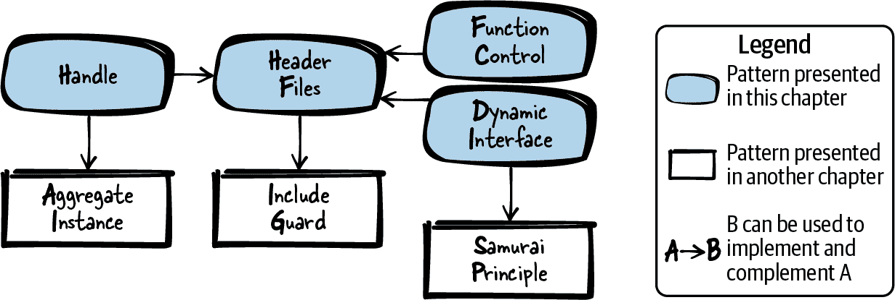
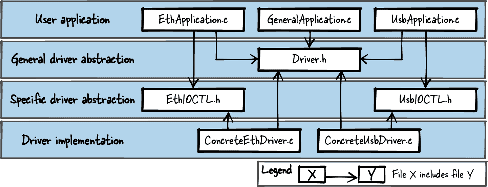

# 第六章\. 灵活 API

在编写软件时，设计具有适当灵活性和适当抽象级别的接口是最重要的事情之一，因为接口代表了一个合同，一旦系统开始运行往往就无法更改。因此，将稳定的声明放入接口中并抽象实现细节非常重要，这些细节在以后可能需要更改的情况下应具有灵活性。

对于面向对象的编程语言，你会发现有很多关于如何设计接口的指导（例如，设计模式形式上的）。但对于像 C 这样的过程化编程语言，关于如何设计接口的详细指导却很难找到。在这里，本章的模式就有了用武之地。

图 6-1 展示了本章涵盖的四种模式及相关模式，表 6-1 包含了这四种模式的简要描述。请注意，并非所有模式在所有可能的情境下都应该应用。通常建议设计一个系统，使其不比必要复杂。这意味着只有在你的 API 已经需要或将来可能需要的情况下，才应该应用一些提出的模式。如果不太可能需要，那么为了尽可能保持 API 的简单性，可能就不应该应用这些模式。



###### 图 6-1\. 灵活 API 模式概述

表 6-1\. 灵活 API 的模式

|  | 模式名称 | 摘要 |
| --- | --- | --- |
|  | 头文件 | 你希望你实现的功能可以被其他实现文件中的代码访问，但你希望隐藏实现细节不让调用者看到。因此，在你的 API 中为任何你想要提供给用户的功能提供函数声明。将任何内部函数、内部数据和函数定义（实现）隐藏在你的实现文件中，不将这些实现文件提供给用户。 |
|  | 处理 | 在你的函数实现中需要共享状态信息或操作共享资源，但你不希望调用者看到或甚至访问所有这些状态信息和共享资源。因此，设计一个函数来创建调用者操作的上下文，并返回该上下文的内部数据的抽象指针。要求调用者将该指针传递给所有你的函数，这样函数可以使用内部数据来存储状态信息和资源。 |
|  | 动态接口 | 应该可以调用具有稍有不同行为的实现，但不应该需要复制任何代码，甚至不包括控制逻辑实现和接口声明。因此，在你的 API 中为这些不同的功能定义一个通用接口，并要求调用者提供一个回调函数来处理这些功能，然后在你的函数实现中调用这个回调函数。 |
|  | 函数控制 | 你想调用具有稍有不同行为的实现，但不想复制任何代码，甚至不包括控制逻辑实现或接口声明。因此，在你的函数中添加一个参数，传递有关函数调用的元信息，并指定要执行的实际功能。 |

作为一个运行的例子，在本章中，你想为你的以太网网络接口卡实现一个设备驱动程序。该卡的固件提供了几个寄存器，你可以用它们发送或接收数据，并且你可以配置该卡。你想建立一些关于这些硬件细节的抽象，并且你想确保 API 的用户不会受到影响，即使你更改了实现的某些部分。为了实现这一点，你构建了一个由头文件组成的 API。

# 头文件

## 背景

你在 C 语言中编写了一个较大的软件程序。你将这个软件程序拆分为多个函数，并在多个文件中实现这些函数，因为你希望使你的程序模块化且易于维护。

## 问题

**你希望实现的功能可以被其他实现文件中的代码访问，但你希望隐藏来自调用者的实现细节。**

与许多面向对象的语言不同，C 语言不提供任何内置支持来定义 API、抽象功能或强制调用者只能访问这种抽象。C 语言只提供了一种机制，即将文件包含到其他文件中。

调用你的代码的人可以使用这种机制简单地包含你的实现文件。但是调用者可以访问该文件中的所有内部数据，例如你仅打算在内部使用的具有文件范围的变量或函数。一旦调用者使用这些内部功能，稍后更改它可能就不容易了，因此在你可能不希望发生的地方，代码变得紧密耦合。如果调用者包含了实现文件，内部变量和函数的名称可能会与调用者使用的名称冲突。

## 解决方案

**为你的 API 提供功能声明，以便向用户提供任何想要提供的功能。隐藏任何内部函数、内部数据和函数定义（实现）在你的实现文件中，并且不要将此实现文件提供给用户。**

在 C 语言中，通常约定任何使用你软件函数的人仅使用头文件中定义的函数（**.h* 文件），而不使用实现中的其他函数（你的 **.c* 文件）。在某些情况下，可以部分强制执行此抽象（例如，无法使用来自另一个文件的 `static` 函数），但 C 语言不完全支持这种强制执行。因此，不访问其他实现文件的约定比强制执行机制更为重要。

在头文件中，确保包含所有函数所需的相关构件。调用者使用头文件功能时不需要包含其他头文件。如果有常用声明（如数据类型或 `#define`），这些声明需放入单独的头文件中，并在需要的其他头文件中包含它。为确保头文件在编译单元中不被多次包含，使用包含保护。

仅在相关时将函数放入同一头文件中。如果函数操作相同句柄或在相同领域中执行操作（如数学计算），则应将它们放入同一头文件中。总体而言，如果能想到相关的使用情况需要所有函数，则应将它们放入同一头文件中。

在头文件中清晰地记录 API 的行为。用户不需要查看实现即可理解 API 提供的函数如何工作。

下面的代码展示了头文件的示例：

*API（h 文件）*

```cpp
/* Sorts the numbers of the 'array' in ascending order.
 'length' defines the number of elements in the 'array'. */
void sort(int* array, int length);
```

*实现（c 文件）*

```cpp
void sort(int* array, int length)
{
  /* here goes the implementation*/
}
```

## 影响

对于调用者相关的内容（**.h* 文件），与调用者无需关心的实现细节（**.c* 文件）之间有非常明确的分离。因此，你为调用者抽象了一些功能。

拥有多个头文件将影响构建时间。一方面，这使得你可以将实现分割到单独的文件中，且工具链可以进行增量构建，仅重新构建已更改的文件。另一方面，与将所有代码放入一个文件相比，完全重建将稍微增加构建时间，因为需要打开和读取所有文件。

如果发现你的函数需要更多相互交互或者需要在不同上下文中调用需要不同内部状态信息的情况，那么需要考虑如何通过 API 实现。句柄在这种情况下可以提供帮助。

您的函数的调用者现在依赖于抽象层，并可能依赖于这些函数的行为不会改变的事实。API 可能必须保持稳定。要添加新功能，您可以始终向 API 添加新函数。但在某些情况下，您可能希望扩展现有函数，为了能够应对这样的未来变化，您必须考虑如何使函数灵活，同时保持它们的稳定性。句柄、动态接口或功能控制可以在这种情况下有所帮助。

## 已知用途

以下示例展示了此模式的应用：

+   几乎所有比简单的“Hello World”程序更大的 C 程序都包含头文件。

+   在 C 中使用头文件类似于在 Java 中使用接口或在 C++ 中使用抽象类。

+   Pimpl 惯用法描述了如何隐藏私有实现细节并将它们不放入头文件中。您可以在 Portland Pattern Repository 中找到该惯用法的描述。

## 应用于运行示例

您的第一个设备驱动程序 API 如下所示：

```cpp
void sendByte(char byte);
char receiveByte();
void setIpAddress(char* ip);
void setMacAddress(char* mac);
```

您的 API 的用户不必应对诸如如何访问以太网寄存器之类的实现细节，您可以自由更改这些细节而不影响用户。

现在您对驱动程序的需求发生了变化。您的系统有第二个相同的以太网网络接口卡，并且应该可以操作这两个接口。以下是两种实现此目标的直接选项：

+   您复制您的代码，并为每个网络接口卡编写一段代码。在复制的代码中，您只修改要访问的确切接口的地址。然而，这种代码复制从来不是一个好主意，并且使您的代码维护困难得多。

+   您向每个函数添加一个参数来解析网络接口卡（例如，设备名称字符串）。但很可能不止一个参数需要在函数之间共享，而将每个参数传递给每个函数使得您的 API 使用起来很麻烦。

支持多个以太网网络接口卡的更好想法是向您的 API 引入句柄。

# 句柄

## 上下文

您希望向您的调用者提供一组函数，并且这些函数操作共享资源或它们共享状态信息。

## 问题

**在您的函数实现中，您必须共享状态信息或操作共享资源，但您不希望您的调用者看到或甚至访问所有这些状态信息和共享资源。**

那些状态信息和共享资源应该对您的调用者保持不可见，因为以后您可能想要更改它或添加到它，而无需更改调用者的代码。

在面向对象的编程语言中，函数可以操作的数据是通过类成员变量来实现的。如果不希望调用者能够访问这些数据，则可以将这些类成员变量设为私有。然而，C 并不本地支持类和私有成员变量。

在你的实现文件中仅具有保持静态全局变量的全局状态的软件模块对你来说不是一个选项，因为应该能够在多个上下文中调用你的函数。每个调用者的函数调用应该能够建立它们的状态信息。尽管这些信息对你的调用者应该保持不可见，但你需要一种方法来识别哪些信息属于哪个特定的调用者，以及如何在你的函数实现中访问这些信息。

## 解决方案

**有一个函数用于创建调用者操作的上下文，并返回指向该上下文内部数据的抽象指针。要求调用者将该指针传递给所有你的函数，然后这些函数可以使用内部数据来存储状态信息和资源。**

你的函数知道如何解释这个抽象指针，这是一种不透明数据类型，也称为处理。然而，你指向的数据结构不应成为应用程序接口的一部分。应用程序接口仅提供将隐藏数据传递到函数的功能。

处理可以实现为指向聚合实例的指针，如一个`struct`。该`struct`应包含所有必需的状态信息或其他变量——通常它保存与面向对象编程中对象的成员变量类似的变量。该`struct`应在你的实现中隐藏起来。应用程序接口仅包含指向`struct`的指针的定义，如下面的代码所示：

*应用程序接口*

```cpp
typedef struct SORT_STRUCT* SORT_HANDLE;

SORT_HANDLE prepareSort(int* array, int length);
void sort(SORT_HANDLE context);
```

*实施*

```cpp
struct SORT_STRUCT
{
  int* array;
  int length;
  /* other parameters like sort order */
};

SORT_HANDLE prepareSort(int* array, int length)
{
  struct SORT_STRUCT* context = malloc(sizeof(struct SORT_STRUCT));
  context->array = array;
  context->length = length;

  /* fill context with required data or state information */

  return context;
}

void sort(SORT_HANDLE context)
{
  /* operate on context data */
}
```

在你的应用程序接口中有一个函数用于创建一个处理。该函数将处理返回给调用者。然后调用者可以调用你的应用程序接口中需要处理的其他函数。在大多数情况下，你还需要一个函数来删除处理，清理所有分配的资源。

## 结果

现在可以在你的函数之间共享状态信息和资源，而无需让调用者担心它，也不会让调用者有机会让代码依赖于这些内部。

支持多个数据实例。你可以多次调用创建处理的函数以获取多个上下文，然后你可以独立地使用这些上下文进行工作。

如果稍后更改对处理操作的函数，并且必须共享不同或额外的数据，那么可以简单地更改`struct`的成员，而无需更改调用者的代码。

你的函数声明明确显示它们紧密耦合，因为它们都需要处理。这一方面可以很容易地看出哪些函数应该放在同一个头文件中，另一方面，也让调用者非常容易地发现哪些函数应该一起应用。

现在，通过 Handle，你需要调用方为所有函数调用提供一个额外的参数，而每个额外的参数会使代码变得更难阅读。

## 已知的用途

以下示例展示了该模式的应用：

+   C 标准库在 *stdio.h* 中包含了 `FILE` 的定义。这个 `FILE` 在大多数实现中被定义为指向一个 `struct` 的指针，而这个 `struct` 不是头文件的一部分。`FILE` 句柄由函数 `fopen` 创建，并且打开的文件可以调用多个其他函数（`fwrite`、`fread` 等）。

+   OpenSSL 代码中的 `struct AES_KEY` 用于在几个与 AES 加密相关的函数之间交换上下文（`AES_set_decrypt_key`、`AES_set_encrypt_key`）。这个 `struct` 及其成员并没有在实现中隐藏，而是作为头文件的一部分，因为 OpenSSL 的其他部分需要知道这个 `struct` 的大小。

+   Subversion 项目的日志功能代码操作的是一个 Handle。`logger_t` 结构在日志功能的实现文件中定义，而该结构的指针则在相应的头文件中定义。

+   这种模式在 David R. Hanson 的《C 接口与实现》（Addison-Wesley, 1996）中被描述为不透明指针类型，在 Adam Tornhill 的《C 中的模式》（Leanpub, 2014）中被描述为“第一类抽象数据类型模式”。

## 应用于正在运行的示例

现在，你可以支持任意数量的以太网接口卡。每个创建的驱动程序实例都会产生自己的数据上下文，然后通过 Handle 传递给函数。现在，你的设备驱动程序 API 如下所示：

```cpp
/* the INTERNAL_DRIVER_STRUCT contains data shared by the functions (like
 how to select the interface card the driver is responsible for) */
typedef struct INTERNAL_DRIVER_STRUCT* DRIVER_HANDLE;

/* 'initArg' contains information for the implementation to identify
 the exact interface for the driver instance */
DRIVER_HANDLE driverCreate(void* initArg);
void driverDestroy(DRIVER_HANDLE h);
void sendByte(DRIVER_HANDLE h, char byte);
char receiveByte(DRIVER_HANDLE h);
void setIpAddress(DRIVER_HANDLE h, char* ip);
void setMacAddress(DRIVER_HANDLE h, char* mac);
```

你的需求再次发生了变化。现在你需要支持多个不同供应商的以太网网络接口卡，例如来自不同供应商的卡。这些卡提供类似的功能，但在访问寄存器的细节上有所不同，因此需要针对驱动程序进行不同的实现。支持这一点的两个直接选项如下：

+   你有两个单独的驱动程序 API。这种方法的缺点在于，用户在运行时构建选择驱动程序的机制会很麻烦。此外，拥有两个单独的 API 会导致代码重复，因为至少两个设备驱动程序共享一个通用控制流程（例如，用于创建或销毁驱动程序）。

+   你在 API 中添加了像 `sendByteDriverA` 和 `sendByteDriverB` 这样的函数。然而，通常你希望你的 API 尽可能精简，因为在单个 API 中拥有所有驱动函数可能会让 API 用户感到困惑。此外，用户的代码依赖于通过你的 API 包含的所有函数签名，如果代码依赖于某些东西，那么这些东西应该尽可能精简（正如接口隔离原则所述）。

支持不同以太网网络接口卡的更好方法是提供一个动态接口。

# 动态接口

## 上下文

你或你的调用者希望实现多个遵循相似控制逻辑但在行为上有所不同的功能。

## 问题

**应该可以调用具有略有不同行为的实现，但不应该需要复制任何代码，甚至不是控制逻辑实现和接口声明。**

你希望能够在以后为已声明的接口添加额外的实现行为，而无需要求使用现有实现行为的调用者更改其代码。

也许你不仅希望为调用者提供不同的行为而不复制自己的代码，还希望为调用者提供一种机制来引入他们自己的实现行为。

## 解决方案

**在你的 API 中为不同的功能定义一个共同的接口，并要求调用者为该功能提供一个回调函数，然后在你的函数实现中调用它。**

要在 C 中实现这样的接口，需要在你的 API 中定义函数签名。然后调用者根据这些签名实现函数，并通过函数指针将它们附加。它们可以被永久附加和存储在你的软件模块内，或者可以在每次函数调用时附加，如下面的代码所示：

*API*

```cpp
/* The compare function should return true if x is smaller than y, else false */
typedef bool (*COMPARE_FP)(int x, int y);

void sort(COMPARE_FP compare, int* array, int length);
```

*实现*

```cpp
void sort(COMPARE_FP compare, int* array, int length)
{
  int i, j;
  for(i=0; i<length; i++)
  {
    for(j=i; j<length; j++)
    {
      /* call provided user function */
      if(compare(array[i], array[j]))
      {
        swap(&array[i], &array[j]);
      }
    }
  }
}
```

*调用者*

```cpp
#define ARRAY_SIZE 4

bool compareFunction(int x, int y)
{
  return x<y;
}

void sortData()
{
  int array[ARRAY_SIZE] = {3, 5, 6, 1};
  sort(compareFunction, array, ARRAY_SIZE);
}
```

一定要清楚地记录函数签名的定义旁边，函数实现应该具有什么行为。还要记录如果没有附加这样的函数实现到你的函数调用中会发生什么行为。也许你会中止程序（武士原则），或者你会提供一些默认功能作为后备。

## 结果

调用者可以使用不同的实现，而且仍然没有代码重复。控制逻辑、接口和接口文档都没有重复。

实现可以在以后由调用者添加而无需更改 API。这意味着 API 设计者和实现提供者的角色可以完全分开。

在你的代码中，你现在执行调用者的代码。因此，你必须相信调用者知道函数该做什么。如果调用者的代码中存在错误，你的代码可能会被怀疑，毕竟错误行为发生在你的代码上下文中。

使用函数指针意味着你有一个特定于平台和编程语言的接口。只有当调用者的代码也是用 C 编写时，才能使用这种模式。你不能向使用 Java 代码编写应用程序的调用者添加编组功能并提供给他们这个接口。

## 已知用途

以下示例展示了这种模式的应用场景

+   詹姆斯·格伦宁在文章[“嵌入式 C 的 SOLID 设计”](https://oreil.ly/kGZVG)中描述了这种模式及其变体，称为动态接口和每种类型的动态接口。

+   提供的解决方案是策略设计模式的 C 版本。您可以在 Adam Tornhill 的书籍 *Patterns in C*（Leanpub, 2014）和 David R. Hanson 的书籍 *C Interfaces and Implementations*（Addison-Wesley, 1996）中找到该模式的替代 C 实现。

+   设备驱动框架通常使用函数指针，在驱动程序启动时驱动程序将其函数插入其中。Linux 内核中的设备驱动程序通常工作方式如此。

+   Subversion 项目源代码中的函数 `svn_sort__hash` 根据某些键值对列表进行排序。该函数以函数指针 `comparison_func` 作为参数。`comparison_func` 必须返回信息，即两个提供的键值中哪个大于另一个。

+   OpenSSL 函数 `OPENSSL_LH_new` 创建哈希表。调用者必须提供一个指向哈希函数的函数指针，用作在哈希表上操作时的回调。

+   Wireshark 代码包含函数指针 `proto_tree_foreach_func`，在遍历树结构时作为函数参数提供。该函数指针用于决定在树元素上执行哪些操作。

## 应用于运行示例

您的驱动程序 API 现在支持多个不同的以太网网络接口卡。这些网络接口卡的具体驱动程序必须实现发送和接收功能，并在单独的头文件中提供它们。API 用户可以将这些特定的发送和接收功能包含并附加到 API 中。

您的 API 的用户可以带入他们自己的驱动程序实现，这是一个优点。因此，作为 API 设计者，您独立于驱动程序实现的提供者。集成新驱动程序不需要任何 API 更改，这意味着您作为 API 设计者不需要做任何工作。这一切都可以通过以下 API 实现：

```cpp
typedef struct INTERNAL_DRIVER_STRUCT* DRIVER_HANDLE;
typedef void (*DriverSend_FP)(char byte);      /* this is the           */
typedef char (*DriverReceive_FP)();            /* interface definition */

struct DriverFunctions
{
  DriverSend_FP fpSend;
  DriverReceive_FP fpReceive;
};

DRIVER_HANDLE driverCreate(void* initArg, struct DriverFunctions f);
void driverDestroy(DRIVER_HANDLE h);
void sendByte(DRIVER_HANDLE h, char byte);   /* internally calls fpSend    */
char receiveByte(DRIVER_HANDLE h);           /* internally calls fpReceive */
void setIpAddress(DRIVER_HANDLE h, char* ip);
void setMacAddress(DRIVER_HANDLE h, char* mac);
```

再次，需求发生了变化。现在不仅要支持以太网网络接口卡，还要支持其他接口卡（如 USB 接口卡）。从 API 的角度来看，这些接口具有一些相似的功能（发送和接收数据函数），但也有一些完全不同的功能（例如，USB 接口没有 IP 地址需要设置，但可能需要其他配置）。

对此的一个简单解决方案是为不同的驱动程序类型提供两个不同的 API。但这将复制发送/接收和创建/销毁功能的代码。

在一个抽象的单一 API 中支持不同类型的设备驱动的更好解决方案是引入功能控制。

# 功能控制

## 上下文

您希望实现多个功能，这些功能遵循类似的控制逻辑，但在行为上有所不同。

## 问题

**您希望调用具有稍有不同行为的实现，但您不希望复制任何代码，甚至不是控制逻辑实现或接口声明。**

调用者应该能够使用您实现的特定现有行为。甚至可以在以后添加新行为而无需触及现有实现或需要修改现有调用者代码。

对于您而言，拥有动态接口并不是一个选项，因为您不希望为调用者提供附加其自己实现的灵活性。这可能是因为接口应更易于调用者使用。或者这可能是因为您不能轻松地附加调用者的实现，例如，如果您的调用者使用另一种编程语言访问您的功能。

## 解决方案

**向您的函数添加一个参数，该参数传递有关函数调用的元信息，并指定要执行的实际功能。**

与动态接口相比，您不需要调用者提供实现，而是调用者从现有实现中进行选择。

要实现此模式，您通过添加额外的参数（例如，一个`enum`或`#define`整数值）来应用基于数据的抽象，该参数指定函数的行为。然后在实现中对参数进行评估，并根据参数值调用不同的实现。

*API*

```cpp
#define QUICK_SORT 1
#define MERGE_SORT 2
#define RADIX_SORT 3

void sort(int algo, int* array, int length);
```

*实现*

```cpp
void sort(int algo, int* array, int length)
{
  switch(algo)
  {
    case QUICK_SORT: 
      quicksort(array, length);
    break;
    case MERGE_SORT:
      mergesort(array, length);
    break;
    case RADIX_SORT:
      radixsort(array, length);
    break;
  }
}
```


在以后添加新功能时，您只需添加一个新的`enum`或`#define`值，并选择相应的新实现即可。

## 结果

调用者可以使用不同的实现方式，并且没有代码重复。控制逻辑、接口或接口文档都不会重复。

很容易在以后添加新功能。无需触及现有实现，现有调用者的代码也不会受到更改的影响。

与动态接口相比，此模式更易于在不同程序或平台（例如远程过程调用）之间选择功能，因为 API 未通过程序特定的指针传递。

在一个函数中提供不同实现行为的选择时，您可能会被诱惑将不太相关的多个功能打包到单个函数中。这违反了单一责任原则。

## 已知用途

以下示例展示了此模式的应用：

+   设备驱动程序通常使用功能控制来传递不适合于常见初始化/读写功能的特定功能。对于设备驱动程序，这种模式通常称为 I/O-Control。该概念在 Elecia White 的书《Making Embedded Systems: Design Patterns for Great Software》（O’Reilly, 2011）中有所描述。

+   某些 Linux 系统调用已扩展以具有标志，这些标志根据标志的值扩展系统调用的功能，而不会破坏旧代码。

+   Martin Reddy（Morgan Kaufmann，2011）在书籍《API Design for *C++** 中描述了通用数据驱动 API 的概念。

+   OpenSSL 代码使用函数 `CTerr` 记录错误。此函数接受一个 `enum` 参数，用于指定错误应如何以及在哪里记录。

+   POSIX 套接字函数 `ioctl` 接受一个数值参数 `cmd`，该参数决定套接字上将执行哪些实际操作。参数的允许值在头文件中定义和记录，自头文件首次发布以来，已添加了许多额外的值和函数行为。

+   Subversion 项目的函数 `svn_fs_ioctl` 执行一些特定于文件系统的输入或输出操作。该函数将 `struct svn_fs_ioctl_code_t` 作为参数。此 `struct` 包含一个数值，该数值决定应执行哪种类型的操作。

## 应用于运行示例

下面的代码展示了您的设备驱动程序 API 的最终版本：

*Driver.h*

```cpp
typedef struct INTERNAL_DRIVER_STRUCT* DRIVER_HANDLE;
typedef void (*DriverSend_FP)(char byte);
typedef char (*DriverReceive_FP)();
typedef void (*DriverIOCTL_FP)(int ioctl, void* context);

struct DriverFunctions
{
  DriverSend_FP fpSend;
  DriverReceive_FP fpReceive;
  DriverIOCTL_FP fpIOCTL;
};

DRIVER_HANDLE driverCreate(void* initArg, struct DriverFunctions f);
void driverDestroy(DRIVER_HANDLE h);
void sendByte(DRIVER_HANDLE h, char byte);
char receiveByte(DRIVER_HANDLE h);
void driverIOCTL(DRIVER_HANDLE h, int ioctl, void* context);
/* the parameter "context" is required to pass information like the
 value of the IP address to configure to the implementation */
```

*EthIOCTL.h*

```cpp
#define SET_IP_ADDRESS  1
#define SET_MAC_ADDRESS 2
```

*UsbIOCTL.h*

```cpp
#define SET_USB_PROTOCOL_TYPE   3
```

想要使用以太网或 USB 特定功能（例如，实际通过接口发送或接收数据的应用程序）的用户必须知道他们操作的驱动程序类型，以便调用正确的 I/O 控制，还必须包含 *EthIOCTL.h* 或 *UsbIOCTL.h* 文件。

图 6-2 显示了我们设备驱动程序 API 最终版本的源代码文件的包含关系。请注意，*EthApplication.c* 代码不依赖于 USB 特定的头文件。例如，如果添加了额外的 USB-IOCTL，所示代码中的 *EthApplication.c* 甚至不需要重新编译，因为它所依赖的文件都未更改。



###### 图 6-2\. 函数控制的文件关系

请记住，在本章中呈现的所有代码片段中，这些设备驱动程序的最后、最灵活的代码片段可能并非始终适合您的需求。您通过增加接口的复杂性来获得更大的灵活性，尽管您必须使代码尽可能灵活，但也应尽量保持简单。

# 总结

本章讨论了 C 语言的四种 API 模式，并展示了它们在设备驱动程序设计中的应用示例。头文件告诉您在 c 文件中隐藏实现细节的基本概念，同时在您的 h 文件中提供了一个明确定义的接口。Handle 模式涉及将不透明数据类型在函数之间传递以共享状态信息的广为人知的概念。动态接口通过允许通过回调函数注入调用特定代码来避免重复程序逻辑成为可能。函数控制使用额外的函数参数来指定函数调用中应执行的实际操作。这些模式展示了通过引入抽象使接口更灵活的基本 C 设计选项。

# 进一步阅读

如果您准备进一步学习，以下是一些资源，可以帮助您进一步了解设计 API 的知识。

+   文章 [“SOLID Design for Embedded C”](https://oreil.ly/07SUX)，作者 James Grenning，介绍了五个 SOLID 设计原则的一般概念，并展示了如何为 C 接口实现灵活性。这篇文章的独特之处在于它是唯一一篇专门讨论 C 接口主题的文章，同时还包含了详细的代码片段。

+   书籍 *Patterns in C*，作者 Adam Tornhill（Leanpub，2014），介绍了几种包含 C 代码片段的设计模式。这些模式包括 Gang of Four 模式（如策略或观察者）的 C 版本，以及特定于 C 的模式和习惯用法。该书并未专门关注接口，但部分模式描述了接口层面的交互。

+   书籍 *API Design for *C++**，作者 Martin Reddy（Morgan Kaufmann，2011），涵盖了接口设计原则，带有 C++示例的面向对象接口模式，以及像测试和文档等接口质量问题。该书主要讨论了 C++设计，但部分内容也适用于 C。

+   书籍 *C Interfaces and Implementations*，作者 David R. Hanson（Addison-Wesley，1996），介绍了接口设计，包括在 C 中实现特定组件的 C 代码。

# 展望

下一章详细介绍了如何找到特定类型应用程序的正确抽象级别和正确接口：它描述了如何设计和实现迭代器。
