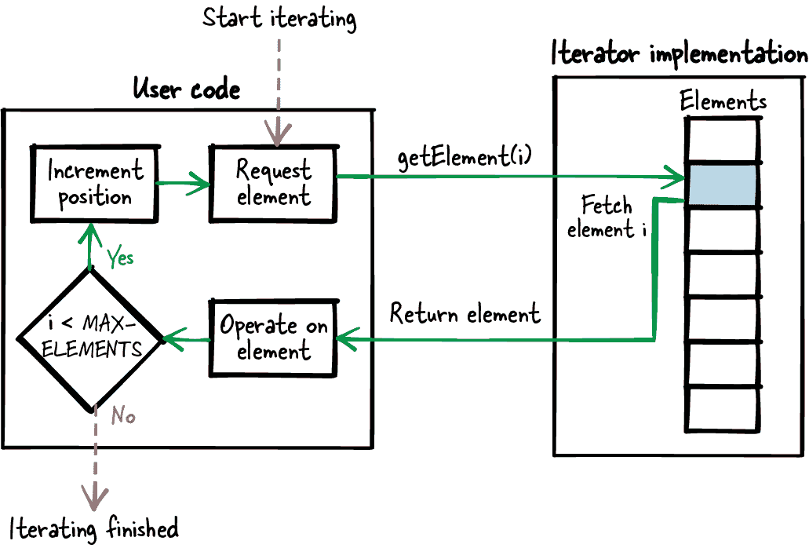

# 第七章：灵活的迭代器接口

在任何程序中，对一组元素进行迭代是一个常见操作。一些编程语言提供原生构造来迭代元素，而面向对象的编程语言则通过设计模式的形式提供有关如何实现通用迭代功能的指导。然而，对于像 C 这样的过程式编程语言，很少有这种类型的指导。

动词“迭代”意味着多次执行相同的操作。在编程中，它通常表示在多个数据元素上运行相同的程序代码。这种操作经常是必需的，这就是为什么在 C 语言中对数组进行迭代得到原生支持的原因，如下面的代码所示：

```cpp
for (i=0; i<MAX_ARRAY_SIZE; i++)
{
  doSomethingWith(my_array[i]);
}
```

如果您想要迭代不同的数据结构，例如红黑树，那么您必须实现自己的迭代函数。您可以为这个函数配备数据结构特定的迭代选项，例如遍历树的深度优先或广度优先。关于如何实现这些特定数据结构以及这些数据结构的迭代接口的文献是可用的。如果您使用这样一个特定于数据结构的接口进行迭代，并且您的底层数据结构发生变化，那么您必须调整您的迭代函数以及调用此函数的所有代码。在某些情况下，这样做是可以接受的，甚至是必需的，因为您希望执行特定于底层数据结构的某种特殊迭代，也许是为了优化代码的性能。

在其他情况下，如果您必须在组件边界之间提供迭代接口，那么泄露实现细节的抽象不是一个选择，因为这可能需要将来更改接口。例如，如果您向客户出售提供迭代功能的组件，并且客户使用这些功能编写代码，那么他们很可能期望，如果您为他们提供使用不同数据结构的新版本组件，他们的代码可以不经修改地正常工作。在这种情况下，您甚至会在实现中投入额外的工作，以确保与客户的接口保持兼容，使他们无需更改（甚至可能无需重新编译）其代码。

这就是我们在本章开始的地方。我将向您展示三种模式，说明您作为迭代器实现者如何向用户（客户）提供稳定的迭代接口。这些模式不描述特定类型数据结构的特定迭代器。相反，这些模式假定在您的实现中，您已经有从底层数据结构检索元素的函数。这些模式展示了您可以如何抽象这些函数，以提供稳定的迭代接口的选项。

Figure 7-1 展示了本章涵盖的模式概述及其关系，Table 7-1 提供了这些模式的摘要。


###### Figure 7-1\. 迭代器接口模式概述

Table 7-1\. 迭代器接口模式

|  | 模式名称 | 摘要 |
| --- | --- | --- |
|  | 索引访问 | 您希望使用户能够以便捷的方式迭代您数据结构中的元素，并且可以更改数据结构的内部而不导致用户代码的变化。因此，提供一个函数，该函数接受一个索引来访问底层数据结构中的元素，并返回此元素的内容。用户在循环中调用此函数以迭代所有元素。 |
|  | 游标迭代器 | 您希望为用户提供一个迭代接口，即使在迭代过程中元素发生变化，也能保持稳健，并且允许您稍后更改底层数据结构而无需更改用户的代码。因此，创建一个迭代器实例，该实例指向底层数据结构中的一个元素。迭代函数以此迭代器实例作为参数，检索迭代器当前指向的元素，并修改迭代器实例以指向下一个元素。然后用户通过迭代调用此函数以逐个检索元素。 |
|  | 回调迭代器 | 您希望提供一个稳健的迭代接口，不需要用户在代码中实现循环来迭代所有元素，并且允许您稍后更改底层数据结构而无需更改用户的代码。因此，使用您现有的数据结构特定操作在您的实现中迭代所有元素，并在此迭代期间调用一些提供的用户函数来处理每个元素。这个用户函数以元素内容作为参数，可以对此元素执行其操作。用户只需调用一个函数来触发迭代，整个迭代过程在您的实现内部完成。 |

# 运行示例

您实现了应用程序的访问控制组件，具有一个可以随机访问任何元素的底层数据结构。具体而言，在以下代码中，您有一个包含帐户信息（如登录名和密码）的结构体数组：

```cpp
struct ACCOUNT
{
  char loginname[MAX_NAME_LENGTH];
  char password[MAX_PWD_LENGTH];
};
struct ACCOUNT accountData[MAX_USERS];
```

下一个代码示例展示了用户如何访问此结构体以读取特定信息，例如登录名：

```cpp
void accessData()
{
  char* loginname;

  loginname = accountData[0].loginname;
  /* do something with loginname */

  loginname = accountData[1].loginname;
  /* do something with loginname */
}
```

当然，您可以简单地不担心抽象访问您的数据结构，并允许其他程序员直接检索指向此`struct`的指针以循环遍历`struct`元素并访问`struct`中的任何信息。但是，这是一个坏主意，因为您的数据结构中可能存在您不希望向客户提供的信息。如果您必须随时间保持与客户的接口稳定，那么您将无法删除一旦向客户透露的信息，因为您的客户可能使用该信息，而您不希望破坏客户的代码。

为了避免这个问题，一个更好的主意是让用户只能访问所需的信息。一个简单的解决方案是提供索引访问。

# 索引访问

## 上下文

您有一组存储在可以随机访问的数据结构中的元素。例如，您有一个数组或数据库，其中包含随机检索单个元素的函数。用户想要迭代这些元素。

## 问题

**您希望使用户能够方便地迭代您数据结构中的元素，并且应该可以在不影响用户代码的情况下更改数据结构的内部。**

用户可能是编写代码的人，其代码未与您的代码库版本化和发布，因此您必须确保将来的实现版本也能与用户根据当前版本编写的代码配合使用。因此，用户不应能访问任何内部实现细节，例如您用于保存元素的底层数据结构，因为您可能希望稍后更改它。

## 解决方案

**提供一个函数，该函数接受索引以访问底层数据结构中的元素，并返回该元素的内容。用户在循环中调用此函数以迭代所有元素，如图 7-2 所示。**



###### 图 7-2\. 索引访问迭代

这种方法的等效物是，在数组中，用户只需使用索引来检索一个数组元素的值或迭代所有元素。但是，当您有一个接受这样的索引的函数时，也可能迭代更复杂的底层数据结构，而无需用户了解。

为了实现这一点，仅向用户提供他们感兴趣的数据，不要透露底层数据结构的所有元素。例如，不要返回指向整个`struct`元素的指针，而是仅返回用户感兴趣的`struct`成员的指针：

*调用者的代码*

```cpp
void* element;

element = getElement(1);
/* operate on element 1 */

element = getElement(2);
/* operate on element 2 */
```

*迭代器 API*

```cpp
#define MAX_ELEMENTS 42

/* Retrieve one single element identified by the provided 'index' */
void* getElement(int index);
```

## 后果

用户可以通过使用索引检索元素，方便地在其代码中循环遍历元素。他们不必处理从中获取数据的内部数据结构。如果实现中发生了更改（例如，检索的 `struct` 成员被重命名），用户无需重新编译其代码。

对底层数据结构的其他更改可能会变得更加困难。例如，如果底层数据结构从数组（随机访问）更改为链表（顺序访问），那么每次都必须迭代列表直到到达请求的索引位置。这样做根本不高效，为了确保还允许底层数据结构的这些更改，最好使用游标迭代器或回调迭代器。

如果用户仅检索可以作为 C 函数返回值的基本数据类型，则用户隐式地检索该元素的副本。如果底层数据结构中的相应元素在此期间发生更改，则这不会影响用户。但是，如果用户检索更复杂的数据类型（如字符串），则与直接提供对底层数据结构的访问相比，使用索引访问具有优势，即您可以以线程安全的方式复制当前数据元素并提供给用户，例如使用调用者拥有的缓冲区。如果您不在多线程环境中操作，则可以简单地为复杂数据类型返回指针。

在访问一组元素时，用户通常希望遍历所有元素。如果其他人在此期间向底层数据添加或删除元素，则用户对访问元素的索引的理解可能会变得无效，并且在迭代过程中可能会无意中检索元素两次。解决此问题的一种简单方法是将用户感兴趣的所有元素简单复制到数组中，并将此独占数组提供给用户，用户可以方便地在此数组上进行循环。用户将拥有该副本的专有所有权，甚至可以修改元素。但如果不明确要求这样做，则复制所有元素可能不值得。一个更方便的解决方案，用户在迭代过程中不必担心底层数据顺序的更改，是提供一个回调迭代器。

## 已知用途

以下示例展示了此模式的应用：

+   James Noble 在他的文章 [“迭代器与封装”](https://oreil.ly/fganK) 中描述了外部迭代器模式。这是该模式中描述的概念的面向对象版本。

+   Mark Allen Weiss 的书籍《Java 数据结构与问题解决》（Addison-Wesley, 2006）描述了这种方法，并称其为具有类似数组接口的访问方式。

+   Wireshark 代码的函数`service_response_time_get_column_name`返回统计表的列名。用户提供的索引参数用于寻址要返回的列名。列名在运行时不能更改，因此即使在多线程环境中，访问数据或迭代列名的方式也是安全的。

+   Subversion 项目包含用于建立字符串表的代码。可以使用函数`svn_fs_x__string_table_get`访问这些字符串。此函数接受一个索引作为参数，用于定位要检索的字符串。检索到的字符串被复制到提供的缓冲区中。

+   OpenSSL 函数`TXT_DB_get_by_index`从文本数据库中检索选择的字符串，并将其存储在提供的缓冲区中。

## 应用于运行示例

现在你有了一个清晰的抽象来读取登录名，并且不向用户透露内部实现细节：

```cpp
char* getLoginName(int index)
{
  return accountData[index].loginname;
}
```

用户不必处理访问底层`struct`数组。这有利于他们更容易访问所需数据，并且他们不能使用未经授权的任何信息。例如，他们不能访问您将来可能想要更改的`struct`的子元素，并且只有在没有人访问这些数据时才能更改，因为您不希望破坏用户的代码。

有人使用此接口，比如想要编写一个检查是否有以字母“X”开头的登录名的函数，编写以下代码：

```cpp
bool anyoneWithX()
{
  int i;
  for(i=0; i<MAX_USERS; i++)
  {
    char* loginName = getLoginName(i);
    if(loginName[0] == 'X')
    {
      return true;
    }
  }
  return false;
}
```

在使用普通数组存储数据结构变更后，你对自己的实现感到满意，因为你需要一个更方便的方法来插入和删除账户数据，而在普通数组中存储数据时这相当困难。现在登录名不再存储在单个普通数组中，而是存储在一个底层数据结构中，该数据结构提供了一个从一个元素到下一个元素的操作，而不提供随机访问元素的操作。更具体地说，你有一个可以访问的链表，如下面的代码所示：

```cpp
struct ACCOUNT_NODE
{
  char loginname[MAX_NAME_LENGTH];
  char password[MAX_PWD_LENGTH];
  struct ACCOUNT_NODE* next;
};

struct ACCOUNT_NODE* accountList;

struct ACCOUNT_NODE* getFirst()
{
  return accountList;
}

struct ACCOUNT_NODE* getNext(struct ACCOUNT_NODE* current)
{
  return current->next;
}

void accessData()
{
  struct ACCOUNT_NODE* account = getFirst();
  char* loginname = account->loginname;
  account = getNext(account);
  loginname = account->loginname;
  ...
}
```

这使得在当前接口中情况变得困难，该接口每次提供一个可以随机索引访问的登录名。要进一步支持这一点，你必须通过调用`getNext`函数来模拟索引，并计算直到达到索引元素为止。这是非常低效的。所有这些麻烦只是因为你设计的接口方式不够灵活而必要。

为了简化操作，提供一个游标迭代器来访问登录名。

# 游标迭代器

## 上下文

你有一组存储在可以随机或顺序访问的数据结构中的元素。例如，你有一个数组、一个链表、一个哈希映射或一个树形数据结构。用户想要迭代这些元素。

## 问题

**你希望为用户提供一个迭代接口，即使在迭代过程中元素发生变化，也能保持稳定，并且能够在以后改变底层数据结构而无需修改用户的代码。**

用户可能是那些编写代码但不会与您的代码库版本化和发布的人，因此您必须确保您的实现的将来版本也能与用户针对当前版本编写的代码兼容。因此，用户不应该能够访问任何内部实现细节，例如您用来保存元素的底层数据结构，因为您可能希望稍后更改它。

此外，在多线程环境下操作时，您希望为用户提供稳健且明确定义的行为，以防止用户在迭代过程中元素内容发生更改。即使是像字符串这样的复杂数据，用户也不应该担心其他线程在用户想要读取数据时更改它。

即使您需要额外的实现工作来实现所有这些，您也不会介意，因为许多用户将使用您的代码，如果您可以通过在您的代码中实现来减少用户的实现工作，那么总体工作量将会减少。

## 解决方案

**创建一个指向底层数据结构中元素的迭代器实例。迭代函数将此迭代器实例作为参数，检索迭代器当前指向的元素，并修改迭代实例以指向下一个元素。然后用户迭代调用此函数以逐个检索元素，如图 7-3 所示。**


###### 图 7-3\. 使用光标迭代器进行迭代

迭代器接口需要两个函数来创建和销毁迭代器实例，以及一个函数来执行实际的迭代并检索当前元素。显式创建/销毁函数使得您可以拥有一个实例，在其中存储内部迭代数据（位置、当前元素的数据）。然后用户需要将此实例传递给所有迭代函数调用，如下面的代码所示：

*调用者的代码*

```cpp
void* element;
ITERATOR* it = createIterator();

while(element = getNext(it))
{
  /* operate on element */
}

destroyIterator(it);
```

*迭代器 API*

```cpp
/* Creates an iterator and moves it to the first element */
ITERATOR* createIterator();

/* Returns the element currently pointed to and sets the iterator to the
 next element. Returns NULL if the element does not exist. */
void* getNext(ITERATOR* iterator);

/* Cleans up an iterator created with the function createIterator() */
void destroyIterator(ITERATOR* iterator),
```

如果您不希望用户能够访问此内部数据，则可以隐藏它并为用户提供一个句柄。这样即使更改迭代实例的内部数据，也不会影响用户。

在检索当前元素时，可以直接提供基本数据类型作为返回值。复杂数据类型可以作为引用返回，也可以复制到迭代器实例中。将它们复制到迭代器实例中使您可以获得数据的一致性，即使在底层数据结构在此期间发生变化（例如，因为在多线程环境中被其他人修改）。

## 结果

只需调用`getNext`方法，用户就可以简单地迭代数据，只要检索到有效元素即可。他们无需处理从中获取这些数据的内部数据结构，也无需担心元素索引或元素的最大数量。但是，无法索引元素也意味着用户无法随机访问元素（这可以通过索引访问来完成）。

即使底层数据结构发生变化，例如从链表变为像数组这样的随机访问数据结构，那么这种变化可以隐藏在迭代器的实现中，用户无需更改或重新编译代码。

无论用户检索哪种类型的数据——简单的或复杂的数据类型——他们无需担心，如果在此期间更改或删除底层元素，检索的元素将变为无效。为了实现这一点，用户现在必须显式调用函数来创建和销毁迭代器实例。与索引访问相比，需要更多的函数调用。

当访问一组元素时，用户通常希望迭代所有元素。如果其他人在此期间向底层数据添加元素，则用户在迭代期间可能会错过此元素。如果这对您来说是一个问题，并且您希望确保元素在迭代期间根本不会更改，则更容易使用回调迭代器。

## 已知用途

以下示例展示了该模式的应用：

+   James Noble 在他的文章["迭代器和封装"](https://oreil.ly/NVnbw)中将这种迭代器的面向对象版本描述为魔术饼干模式。

+   Jed Liu 等人在文章["可中断迭代器"](https://oreil.ly/BzFJJ)中将所述的概念描述为*游标对象*。

+   此类迭代用于文件访问。例如，`getline` C 函数迭代文件中的行，并将迭代器位置存储在`FILE`指针中。

+   OpenSSL 代码提供了函数`ENGINE_get_first`和`ENGINE_get_next`来迭代加密引擎列表。每个调用都将`ENGINE struct`的指针作为参数。此`struct`存储了迭代中的当前位置。

+   Wireshark 代码包含函数 `proto_get_first_protocol` 和 `proto_get_next_protocol`。这些函数使用户能够遍历网络协议列表。函数接受一个 `void` 指针作为输出参数，用于存储和传递状态信息。

+   Subversion 项目中的生成文件之间差异的代码包含函数 `datasource_get_next_token`。此函数需要在循环中调用，以从提供的数据源对象中获取下一个差异标记，数据源对象存储迭代位置。

## 应用于运行示例

你现在有以下函数来检索登录名：

```cpp
struct ITERATOR
{
  char buffer[MAX_NAME_LENGTH];
  struct ACCOUNT_NODE* element;
};

struct ITERATOR* createIterator()
{
  struct ITERATOR* iterator = malloc(sizeof(struct ITERATOR));
  iterator->element = getFirst();
  return iterator;
}

char* getNextLoginName(struct ITERATOR* iterator)
{
  if(iterator->element != NULL)
  {
    strcpy(iterator->buffer, iterator->element->loginname);
    iterator->element = getNext(iterator->element);
    return iterator->buffer;
  }
  else
  {
    return NULL;
  }
}

void destroyIterator(struct ITERATOR* iterator)
{
  free(iterator);
}
```

以下代码展示了如何使用此接口：

```cpp
bool anyoneWithX()
{
  char* loginName;
  struct ITERATOR* iterator = createIterator();
  while(loginName = getNextLoginName(iterator)) 
  {
    if(loginName[0] == 'X')
    {
      destroyIterator(iterator); 
      return true;
    }
  }
  destroyIterator(iterator); 
  return false;
}
```


应用程序不再需要处理索引和元素的最大数量。


在这   在这种情况下，销毁迭代器所需的清理代码导致了代码重复。

接下来，你不仅想要实现 `anyoneWithX` 函数，还想实现一个额外的函数，例如，告诉你有多少个登录名以字母“Y”开头。你可以简单地复制代码，修改 `while` 循环的主体，并统计“Y”的出现次数，但这种方法会导致代码重复，因为你的两个函数都包含创建和销毁迭代器以及执行循环操作的相同代码。为了避免这种代码重复，可以使用回调迭代器。

# 回调迭代器

## 背景

你有一组存储在数据结构中的元素，可以随机或顺序访问。例如，你有一个数组、一个链表、一个哈希映射或一个树数据结构。用户希望遍历这些元素。

## 问题

**你希望提供一个强健的迭代接口，不需要用户在代码中实现遍历所有元素的循环，同时能够在以后更改底层数据结构而无需更改用户的代码。**

用户可能是编写不版本化且与您的代码库一起发布的代码的人，因此必须确保您的实现的未来版本也能与用户针对当前版本编写的代码兼容。因此，用户不应该能够访问任何内部实现细节，例如用于存储元素的底层数据结构，因为你可能在以后想要更改它。

此外，在多线程环境中操作时，您希望为用户提供稳健且明确定义的行为，以便在用户迭代过程中元素内容发生变化时。即使是像字符串这样的复杂数据，用户也不应该担心其他线程在用户想要读取它时更改该数据。此外，您希望确保用户只对每个元素进行一次迭代。即使其他线程试图在迭代期间创建新元素或删除现有元素，这一点也应该保持不变。

你并不在乎是否需要额外的实现工作来实现所有这些，因为许多用户将使用您的代码，如果您可以通过在您的代码中实现它来减少用户的实现工作，那么总体工作量将会减少。

您希望尽可能地简化用户访问元素的方式。特别是，用户不应该处理诸如索引与元素之间的映射或可用元素数量等迭代细节。此外，他们不应该在其代码中实现循环，因为这会导致用户代码中的重复，因此对于您来说，索引访问或游标迭代器都不是选项。

## 解决方案

**利用您现有的数据结构特定操作，在您的实现中迭代遍历所有元素，并在此迭代期间调用一些提供的用户函数处理每个元素。此用户函数以元素内容作为参数，可以对该元素执行其操作。用户只需调用一个函数来触发迭代，整个迭代过程都发生在您的实现中，如图 7-4 所示。**


###### 图 7-4\. 使用回调迭代器进行迭代

要实现这一点，您必须在您的接口中声明一个函数指针。声明的函数接受应作为参数进行迭代的元素。用户实现这样的函数并将其传递给您的迭代函数。在您的实现中，您遍历所有元素，并且对于每个元素，您将调用用户的函数，参数为当前元素。

您可以向您的迭代函数和函数指针声明添加一个额外的`void*`参数。在您的迭代函数实现中，您简单地将该参数传递给用户的函数。这使得用户可以向函数传递一些上下文信息：

*调用者的代码*

```cpp
void myCallback(void* element, void* arg)
{
  /* operate on element */
}

void doIteration()
{
  iterate(myCallback, NULL);
}
```

*迭代器 API*

```cpp
/* Callback for the iteration to be implemented by the caller. */
typedef void (*FP_CALLBACK)(void* element, void* arg);

/* Iterates over all elements and calls callback(element, arg)
 on each element. */
void iterate(FP_CALLBACK callback, void* arg);
```

有时用户并不想迭代所有元素，而是想找到一个特定的元素。为了使这种用例更有效率，你可以在迭代函数中添加一个中断条件。例如，你可以声明用户函数的函数指针，该函数操作返回类型为`bool`的元素，并且如果用户函数返回值为`true`，则停止迭代。然后用户可以在找到所需元素时发出信号，并节省迭代其余元素所需的时间。

当在多线程环境中实现迭代函数时，请确保覆盖以下情况：在迭代期间，当前元素被改变、新增元素被添加或其他线程删除元素。在这种情况下，你可以向当前迭代的用户返回状态码，或者在迭代期间通过锁定写访问来防止这些变化。

因为实现可以确保在迭代过程中数据不会改变，所以不需要复制用户操作的元素。用户只需获取指向这些数据的指针，并且使用原始数据进行操作。

## 结果

现在，用户用于迭代所有元素的代码只有一行。所有实现细节，如元素索引和元素的最大数量，都被隐藏在迭代器实现内部。用户甚至不必实现一个循环来迭代元素。他们也不必创建或销毁迭代器实例，也无需处理从中收集元素的内部数据结构。即使在实现中更改底层数据结构的类型，他们也不必重新编译代码。

如果在迭代过程中底层元素发生变化，则迭代器实现可以相应地做出反应，从而确保用户在迭代时访问一致的数据集，而无需在用户代码中处理锁定功能。所有这些都是因为控制流不会在用户代码和迭代器代码之间跳转。控制流保持在迭代器实现内部，因此迭代器实现可以检测到迭代过程中元素的变化并做出相应的反应。

用户可以迭代所有元素，但迭代循环是在迭代器实现内部实现的，因此用户不能像索引访问一样随机访问元素。

在回调函数中，你的实现会在每个元素上运行用户代码。在某种程度上，这意味着你必须相信用户的代码能够正确执行。例如，如果你的迭代器实现在迭代期间锁定所有元素，那么你期望用户代码能够快速处理检索到的元素，并且不执行耗时的操作，因为在此期间，所有访问该数据的调用都将被锁定。

使用回调意味着你必须有一个特定于平台和编程语言的接口，因为你调用由调用者实现的代码，并且只有在该代码使用相同的调用约定（即提供函数参数和返回数据的相同方式）时才能这样做。这意味着，在 C 语言中实现迭代器时，只有当用户代码也是用 C 语言编写时，才能使用此模式。例如，你不能将一个 C 回调迭代器提供给使用 Java 编写代码的用户（尽管可以通过其他迭代器模式之一努力做到这一点）。

当使用回调阅读代码时，程序流程更难以跟踪。例如，与直接在代码中有一个简单的 `while` 循环相比，仅看到一个带有回调参数的用户代码行时，可能更难找出程序在迭代元素时的情况。因此，关键是给迭代函数命名，以清楚表明该函数执行迭代操作。

## 已知的用途

以下示例展示了此模式的应用：

+   James Noble 在他的文章 [“迭代器与封装”](https://oreil.ly/u8B7I) 中描述了这个迭代器的面向对象版本为内部迭代器模式。

+   Subversion 项目的函数 `svn_iter_apr_hash` 遍历作为参数提供给函数的哈希表中的所有元素。对于哈希表的每个元素，会调用一个由调用者提供的函数指针，如果该调用返回 `SVN_ERR_ITER_BREAK`，则停止迭代。

+   OpenSSL 函数 `ossl_provider_forall_loaded` 遍历一组 OpenSSL 提供者对象。该函数接受一个函数指针作为参数，并且对每个提供者对象调用该函数指针。可以为迭代调用提供一个 `void*` 参数，然后为迭代中的每个调用提供该参数，以便用户可以传递自己的上下文。

+   Wireshark 函数 `conversation_table_iterate_tables` 遍历“会话”对象列表。每个这样的对象存储关于嗅探网络数据的信息。该函数接受一个函数指针和一个 `void*` 作为参数。对于每个会话对象，使用该 `void*` 作为上下文调用函数指针。

## 应用于运行示例

现在提供以下函数来访问登录名：

```cpp
typedef void (*FP_CALLBACK)(char* loginName, void* arg);

void iterateLoginNames(FP_CALLBACK callback, void* arg)
{
  struct ACCOUNT_NODE* account = getFirst(accountList);
  while(account != NULL)
  {
    callback(account->loginname, arg);
    account = getNext(account);
  }
}
```

以下代码展示了如何使用此接口：

```cpp
void findX(char* loginName, void* arg)
{
  bool* found = (bool*) arg;
  if(loginName[0] == 'X')
  {
    *found = true;
  }
}

void countY(char* loginName, void* arg)
{
  int* count = (int*) arg;
  if(loginName[0] == 'Y')
  {
    (*count)++;
  }
}

bool anyoneWithX()
{
  bool found=false;
  iterateLoginNames(findX, &found); 
  return found;
}

int numberOfUsersWithY()
{
  int count=0;
  iterateLoginNames(countY, &count); 
  return count;
}
```


应用程序不再包含显式的循环语句。

作为可能的增强，回调函数可以具有确定迭代是否继续或停止的返回值。有了这样的返回值，例如，可以在 `findX` 函数遍历以“X”开头的第一个用户后停止迭代。

# 总结

本章展示了实现提供迭代功能的接口的三种不同方法。表 7-2 提供了这三种模式的概述，并比较了它们的后果。

表 7-2\. 迭代器模式比较

|  | 索引访问 | 光标迭代器 | 回调迭代器 |
| --- | --- | --- | --- |
| 元素访问 | 允许随机访问 | 仅允许顺序访问 | 仅允许顺序访问 |
| 数据结构更改 | 底层数据结构只能轻松更改为另一个随机访问数据结构 | 底层数据结构可以轻松更改 | 底层数据结构可以轻松更改 |
| 通过接口泄露的信息 | 元素数量；随机访问数据结构的使用 | 迭代器位置（用户可以在稍后的某个时刻停止并继续迭代） | - |
| 代码重复 | 用户代码中的循环；用户代码中的索引增量 | 用户代码中的循环 | - |
| 鲁棒性 | 实现健壮的迭代行为较困难 | 实现健壮的迭代行为较困难 | 由于控制流仅停留在迭代代码中，插入/删除/修改操作可以在迭代期间简单地被锁定（但会在此期间阻塞其他迭代） |
| 平台 | 接口可用于不同的语言和平台 | 接口可用于不同的语言和平台 | 只能与实现具有相同调用约定的相同语言和平台一起使用 |

# 进一步阅读

如果你准备深入了解，这里有一些资源可以帮助你进一步了解迭代器接口设计。

+   关于 C 中迭代器的最相关工作是 James Aspnes 的在线版本的[大学课堂笔记](https://oreil.ly/2fuPK)。这些课堂笔记描述了不同的 C 迭代器设计，讨论了它们的优缺点，并提供了源代码示例。

+   对于其他编程语言的迭代器有更多的指导，但许多概念也可以应用于 C。例如，James Noble 的文章["迭代器和封装"](https://oreil.ly/GWR0F)描述了如何设计面向对象迭代器的八种模式，Mark Allen Weiss（Addison-Wesley，2006 年）的书《Java 数据结构与问题解决》描述了 Java 的不同迭代器设计，Mark Jason Dominus（Morgan Kaufmann，2005 年）的书《高阶 Perl》描述了 Perl 的不同迭代器设计。

+   文章["循环模式"](https://oreil.ly/JsEKb)由 Owen Astrachan 和 Eugene Wallingford 包含描述实现循环的最佳实践模式，包括 C++和 Java 代码片段。大部分想法也适用于 C。

+   书籍*C 接口与实现*（David R. Hanson 著，Addison-Wesley，1996 年）描述了 C 语言中常见数据结构（如链表或哈希表）的实现及其接口。当然，这些接口也包含遍历这些数据结构的函数。

# Outlook

下一章重点讨论如何在大型程序中组织代码文件。一旦您应用了前几章的模式来定义接口并编写其实现，您就会得到许多文件。它们的文件组织必须得到解决，以实现模块化、大规模的程序。
