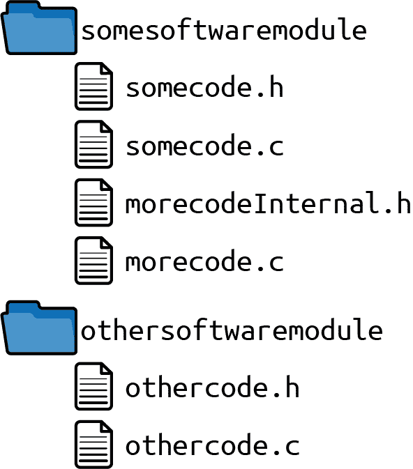
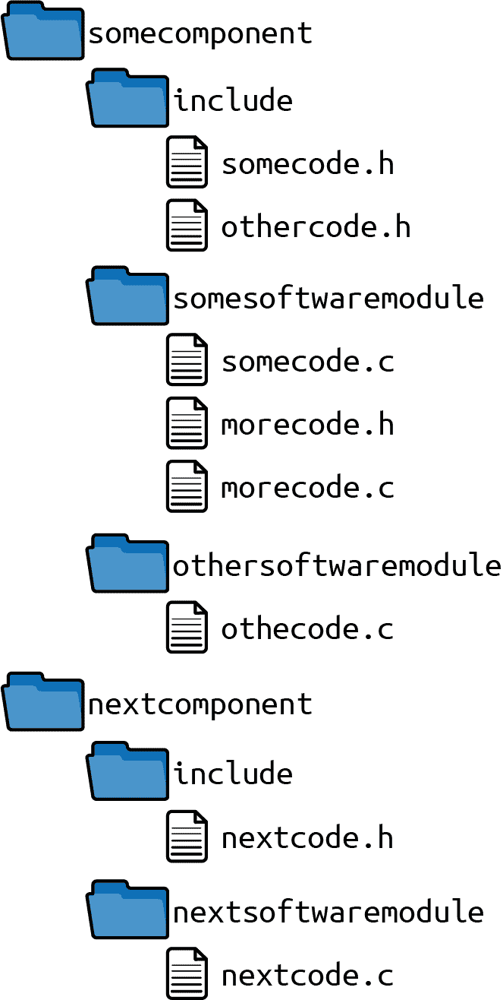

# 第八章：模块化程序中的文件组织

任何实现较大软件并希望使该软件易于维护的程序员都会面临如何使软件模块化的问题。这个问题的最重要部分与软件模块之间的依赖关系有关，例如，由 Robert C. Martin 在《Clean Code: A Handbook of Agile Software Craftsmanship》（Prentice Hall，2008）中描述的 SOLID 设计原则或由 Gang of Four 在《Design Patterns: Elements of Reusable Object-Oriented Software》（Prentice Hall，1997）中描述的设计模式提供了相关答案。

然而，使软件模块化也引发了如何组织源文件的问题，使得某人能够使软件模块化的问题尚未得到很好的解答，这导致代码库中存在糟糕的文件结构。稍后将这样的代码库变得模块化是很困难的，因为您不知道应该将哪些文件分隔成不同的软件模块或不同的代码库。此外，作为程序员，找到包含您应该使用的 API 的文件也很困难，因此您可能会引入不应使用的 API 的依赖关系。这对于 C 语言来说尤为严重，因为 C 语言不支持标记仅供内部使用的 API 并限制对其的访问的任何机制。

其他编程语言中有这样的机制，并且有关如何结构化文件的建议。例如，Java 编程语言提供了*包*的概念。Java 为开发人员提供了一种默认的方式来组织这些包的类以及包内的文件。对于其他编程语言，如 C 语言，没有关于如何结构化文件的这样的建议。开发人员必须自行决定如何结构化包含 C 函数声明的头文件以及包含 C 函数定义的实现文件。

本章展示了如何通过为 C 程序员提供指导来解决这个问题，特别是如何结构化实现文件，特别是如何结构化头文件（API），以便允许开发大型、模块化的 C 程序。

图 8-1 显示了本章涵盖的模式概述，而 表 8-1 提供了这些模式的简短描述。


###### 图 8-1\. 如何组织您的代码文件的模式概述

表 8-1\. 如何组织您的代码文件的模式

|  | 模式名称 | 摘要 |
| --- | --- | --- |
|  | 包含保护 | 多次包含头文件很容易，但如果包含同一个头文件，则会导致编译错误，因为其中的类型或某些宏在编译过程中会被重新定义。因此，请保护您的头文件内容，防止多次包含，这样使用头文件的开发人员就无需担心是否多次包含。使用互锁的`#ifdef`语句或`#pragma once`语句来实现此功能。 |
|  | 软件模块目录 | 将代码拆分为不同的文件会增加代码库中的文件数量。将所有文件放在一个目录中将使得难以对所有文件进行概览，特别是对于大型代码库而言。因此，将属于紧密耦合功能的头文件和实现文件放在一个目录中。将该目录命名为提供通过头文件提供的功能的名称。 |
|  | 全局包含目录 | 要包含来自其他软件模块的文件，您必须使用类似*../othersoftwaremodule/file.h*的相对路径。您必须知道其他头文件的确切位置。因此，在您的代码库中有一个全局目录，包含所有软件模块的 API。将此目录添加到工具链中的全局包含路径中。 |
|  | 自包含组件 | 从目录结构中无法看出代码的依赖关系。任何软件模块都可以简单地包含来自任何其他软件模块的头文件，因此无法通过编译器检查代码中的依赖关系。因此，请识别包含类似功能并应一起部署的软件模块。将这些软件模块放入共同目录，并为调用者相关的头文件设立一个指定的子目录。 |
|  | API 复制 | 您希望独立开发、版本化和部署代码库的各个部分。然而，为了实现这一点，您需要在代码部分之间有清晰定义的接口，并能够将该代码分开到不同的存储库中。因此，要使用另一个组件的功能，请复制其 API。单独构建该其他组件并复制构建产物及其公共头文件。将这些文件放入组件内的一个目录，并将该目录配置为全局包含路径。 |

# 运行示例

想象一下，您希望实现一个打印某些文件内容哈希值的软件片段。您可以从以下简单哈希函数的代码开始：

*main.c*

```cpp
#include <stdio.h>

static unsigned int adler32hash(const char* buffer, int length)
{
  unsigned int s1=1;
  unsigned int s2=0;
  int i=0;

  for(i=0; i<length; i++)
  {
    s1=(s1+buffer[i]) % 65521;
    s2=(s1+s2) % 65521;
  }
  return (s2<<16) | s1;
}

int main(int argc, char* argv[])
{
  char* buffer = "Some Text";
  unsigned int hash = adler32hash(buffer, 100);
  printf("Hash value: %u", hash);
  return 0;
}
```

前面的代码简单地将固定字符串的哈希输出打印到控制台输出。接下来，您希望扩展该代码。您希望读取文件的内容并打印文件内容的哈希值。您可以简单地将所有这些代码添加到*main.c*文件中，但这将使文件变得非常长，并且随着代码的增长，它将使代码更加难以维护。

相反，最好拥有单独的实现文件，并使用头文件访问它们的功能。现在，您可以通过以下代码读取文件内容并打印文件内容的哈希值。为了更容易看到哪些代码部分发生了变化，跳过未更改的实现：

*main.c*

```cpp
#include <stdio.h>
#include <stdlib.h>
#include "hash.h"
#include "filereader.h"

int main(int argc, char* argv[])
{
  char* buffer = malloc(100);
  getFileContent(buffer, 100);
  unsigned int hash = adler32hash(buffer, 100);
  printf("Hash value: %u", hash);
  return 0;
}
```

*hash.h*

```cpp
/* Returns the hash value of the provided "buffer" of size "length".
 The hash is calculated according to the Adler32 algorithm. */
unsigned int adler32hash(const char* buffer, int length);
```

*hash.c*

```cpp
#include "hash.h"

unsigned int adler32hash(const char* buffer,  int length)
{
  /* no changes here */
}
```

*filereader.h*

```cpp
/* Reads the content of a file and stores it in the  provided "buffer"
 if is is long enough according to its provided "length" */
void getFileContent(char* buffer, int length);
```

*filereader.c*

```cpp
#include <stdio.h>
#include "filereader.h"

void getFileContent(char* buffer, int length)
{
  FILE* file = fopen("SomeFile", "rb");
  fread(buffer, length, 1, file);
  fclose(file);
}
```

将代码组织成单独的文件使代码更加模块化，因为代码中的依赖关系现在可以显式地放入同一文件中。您的代码库文件当前都存储在同一个目录中，如图 8-2 所示。


###### 图 8-2\. 文件概述

现在您有了单独的头文件，可以在实现文件中包含这些头文件。但是，如果多次包含头文件，则可能会遇到构建错误。为了解决此问题，可以安装包含保护。

# 包含保护

## 上下文

您将实现分割为多个文件。在实现中，包含头文件以获取其他要调用或使用的代码的前向声明。

## 问题

**很容易多次包含头文件，但如果类型或特定宏是其中的一部分，则包含相同头文件会导致编译错误，因为在编译过程中它们会被重新定义。**

在 C 语言中，在编译期间，`#include` 指令允许 C 预处理器完全复制包含的文件到您的编译单元中。例如，如果在头文件中定义了一个 `struct` 并且该头文件多次包含，则该 `struct` 定义将被多次复制并且在编译单元中出现多次，这将导致编译错误。

为了避免这种情况，您可以尝试不多次包含文件。但是，在包含头文件时，通常不清楚该头文件内是否包含其他额外的头文件。因此，很容易多次包含文件。

## 解决方案

**保护头文件的内容免受多次包含，以便使用头文件的开发人员无需关心其是否被多次包含。使用互锁的 `#ifdef` 语句或 `#pragma once` 语句可以实现此目的。**

以下代码展示了如何使用包含保护：

*somecode.h*

```cpp
#ifndef SOMECODE_H
#define SOMECODE_H
 /* put the content of your headerfile here */
#endif
```

*othercode.h*

```cpp
#pragma once
 /* put the content of your headerfile here */
```

在构建过程中，互锁的 `#ifdef` 语句或 `#pragma once` 语句保护头文件内容，防止在编译单元中多次编译。

`#pragma once` 语句在 C 标准中未定义，但大多数 C 预处理器都支持。但请注意，如果切换到具有不同 C 预处理器的不同工具链，可能会出现该语句的问题。

虽然嵌套的`#ifdef`语句适用于所有 C 预处理器，但它带来了一个难题，即你必须为定义的宏使用一个唯一的名称。通常会使用与头文件名称相关的命名方案，但如果重命名文件并忘记更改包含保护的名称，可能会导致名称过时。此外，在使用第三方代码时可能会遇到问题，因为你的包含保护名称可能会冲突。避免这些问题的方法是不使用头文件的名称，而是使用一些其他唯一的名称，例如当前时间戳或 UUID。

## 后果

作为一个包含头文件的开发者，你现在无需关心文件是否会被多次包含。这让生活变得更加轻松，特别是在有嵌套`#include`语句的情况下，因为很难准确知道哪些文件已经被包含。

现在你必须使用非标准的`#pragma once`语句，或者你必须为你的嵌套`#ifdef`语句提出一个独特的命名方案。虽然文件名在大多数情况下作为唯一名称有效，但是在使用第三方代码时仍可能出现类似名称的问题。此外，当重命名自己的文件时，`#define`语句的名称可能不一致，但某些集成开发环境会在此时提供帮助。它们在创建新的头文件时已经创建了一个包含保护，或在重命名头文件时会自动调整`#define`的名称。

`#ifdef`语句的嵌套防止了当同一个文件多次包含时的编译错误，但并未阻止多次打开和复制被包含的文件到编译单元中。这是编译时间中不必要的部分，可以进行优化。优化的一种方法是在每个`#include`语句周围添加额外的包含保护，但这样会使得文件的包含更加繁琐。对于大多数现代编译器来说，这是不必要的，因为它们会自行优化编译过程（例如，通过缓存头文件内容或记住已经包含的文件）。

## 已知的应用

下面的示例展示了此模式的应用：

+   几乎所有由多个文件组成的 C 代码都应用了这种模式。

+   《大规模 C++软件设计》（John Lakos 著，Addison-Wesley 出版，1996 年）一书描述了通过在每个`#include`语句周围添加额外的保护来优化包含保护的性能。

+   Portland 模式库描述了包含保护模式，并描述了通过在每个`#include`语句周围添加额外的保护来优化编译时间的模式。

## 应用于运行示例

下面代码中的包含保护确保即使头文件被多次包含，也不会出现构建错误：

*hash.h*

```cpp
#ifndef HASH_H
#define HASH_H
/* Returns the hash value of the provided "buffer" of size "length".
 The hash is calculated according to the Adler32 algorithm. */
unsigned int adler32hash(const char* buffer, int length);
#endif
```

*filereader.h*

```cpp
#ifndef FILEREADER_H
#define FILEREADER_H
/* Reads the content of a file and stores it in the provided "buffer"
 if is is long enough according to its provided "length" */
void getFileContent(char* buffer, int length);
#endif
```

作为代码的下一个特性，您希望还打印由另一种哈希函数计算的哈希值。仅仅添加另一个*hash.c*文件来实现另一种哈希函数是不可能的，因为文件名必须是唯一的。给新文件取另一个名字是一个选项。然而，即使这样做了，您对情况仍然不满意，因为现在一个目录中有越来越多的文件，这使得难以获得文件的概览并查看哪些文件是相关的。为了改善情况，您可以使用软件模块目录。

# 软件模块目录

## 背景

您将源代码分割为不同的实现文件，并利用头文件从其他实现文件中使用功能。越来越多的文件被添加到您的代码库中。

## 问题

**将代码分割成不同文件会增加代码库中文件的数量。将所有文件放在一个目录中会使得在大型代码库中保持所有文件的概览变得困难。**

将文件放入不同的目录中会引发一个问题，即您想将哪些文件放入哪个目录。应该很容易找到属于一起的文件，并且应该知道如果需要添加更多文件，则应将文件放在哪里。

## 解决方案

**将属于紧密耦合功能的头文件和实现文件放入一个目录中。将该目录命名为通过头文件提供的功能。**

此目录及其内容进一步称为*软件模块*。经常，软件模块包含所有在使用句柄操作实例的代码。在这种情况下，软件模块是面向对象类的非面向对象等效物。将软件模块的所有文件放入一个目录中相当于将类的所有文件放入一个目录中。

软件模块可以包含一个单独的头文件和一个单独的实现文件或多个这样的文件。将文件放入一个目录的主要标准是目录内文件的高内聚性和与其他软件模块目录的低耦合性。

当您只在软件模块内使用头文件和在软件模块外使用头文件时，通过命名文件可以清楚地表明哪些头文件不应在软件模块外部使用（例如，通过给它们添加后缀*internal*，如图 8-3 和以下代码所示）：



###### 图 8-3 文件概览

*somecode.c*

```cpp
#include "somecode.h"
#include "morecode.h"
#include "../othersoftwaremodule/othercode.h"
...
```

*morecode.c*

```cpp
#include "morecode.h"
...
```

*othercode.c*

```cpp
#include "othercode.h"
...
```

前面的代码摘录显示了如何包含文件，但未显示实现。请注意，可以轻松地包含来自同一软件模块的头文件。为了包含其他软件模块的头文件，需要知道这些软件模块的路径。

当您的文件分布在不同的目录中时，您必须确保您的工具链配置为编译所有这些文件。也许您的集成开发环境自动编译代码库子目录中的所有文件，但您可能需要调整构建设置或操作 Makefile 来编译新目录中的文件。

# 配置包含目录和编译文件

现代 C 编程 IDE 通常提供了一个无忧的环境，让 C 程序员可以专注于编程，不一定需要涉及构建过程。这些 IDE 提供了构建设置，允许您轻松配置包含实现文件和包含文件的目录。这使得 C 程序员可以专注于编程，而不是编写 Makefile 和编译器命令。本章假设您有这样的 IDE，并且不关注 Makefile 及其语法。

## 影响

将代码文件分割到不同的目录中，可以让不同目录中具有相同文件名。在使用第三方代码时特别方便，否则这些文件名可能会与您自己代码库中的文件名冲突。

然而，不建议在不同目录中使用类似的文件名。特别是对于头文件，建议使用唯一的文件名，以确保要包含的文件不依赖于包含路径的搜索顺序。为了使文件名唯一，您可以为软件模块的所有文件使用一个短且唯一的前缀。

将所有与软件模块相关的文件放入一个目录中，可以更容易地找到相关文件，因为您只需知道软件模块的名称即可。软件模块内的文件数量通常足够少，可以快速定位该目录中的文件。

大多数代码依赖都局限于每个软件模块，因此现在高度依赖的文件都在同一个目录中。这使得试图理解代码某一部分的程序员更容易看到哪些其他文件也相关。软件模块目录外的任何实现文件通常与理解该软件模块的功能无关。

## 已知用途

下面的示例展示了这种模式的应用：

+   Git 源代码在其目录中结构化了一些代码，然后其他代码使用相对路径包含这些头文件。例如，*kwset.c* 包含 *compat/obstack.h*。

+   Netdata 实时性能监控和可视化系统将其代码文件组织到诸如 *database* 或 *registry* 等目录中，每个目录包含少量文件。要包含来自另一个目录的文件，使用相对包含路径。

+   网络映射工具 Nmap 将其软件模块组织成目录，例如 *ncat* 或 *ndiff*。使用相对路径包含来自其他软件模块的头文件。

## 应用于运行示例

代码基本上保持不变。只是为新哈希函数添加了一个新的头文件和一个新的实现文件。文件的位置已经改变，从包含路径可以看出。除了将文件放入单独的目录中外，它们的名称也更改为使文件名唯一：

*main.c*

```cpp
#include <stdio.h>
#include <stdlib.h>
#include "adler/adlerhash.h"
#include "bernstein/bernsteinhash.h"
#include "filereader/filereader.h"

int main(int argc, char* argv[])
{
  char* buffer = malloc(100);
  getFileContent(buffer, 100);

  unsigned int hash = adler32hash(buffer, 100);
  printf("Adler32 hash value: %u", hash);

  unsigned int hash = bernsteinHash(buffer, 100);
  printf("Bernstein hash value: %u", hash);

  return 0;
}
```

*bernstein/bernsteinhash.h*

```cpp
#ifndef BERNSTEINHASH_H
#define BERNSTEINHASH_H
/* Returns the hash value of the provided "buffer" of size "length".
 The hash is calculated according to the D.J. Bernstein algorithm. */
unsigned int bernsteinHash(const char* buffer, int length);
#endif
```

*bernstein/bernsteinhash.c*

```cpp
#include "bernsteinhash.h"

unsigned int bernsteinHash(const char* buffer, int length)
{
  unsigned int hash = 5381;
  int i;
  for(i=0; i<length; i++)
  {
    hash = 33 * hash ^ buffer[i];
  }
  return hash;
}
```

将代码文件分割成单独的目录非常常见。这样做可以更容易地找到文件，并且可以拥有具有相似文件名的文件。但是，与其具有相似的文件名，甚至将文件名前缀与软件模块每个文件名唯一化可能更好。如果没有这些前缀，您最终将得到图 8-4 中显示的目录结构和文件名。


###### 图 8-4\. 文件概述

所有属于一起的文件现在都在同一个目录中。这些文件按目录结构良好组织，并且可以使用相对路径访问其他目录中的头文件。

然而，相对路径带来了一个问题，即如果您想要重命名其中一个目录，您还必须修改其他源文件以修复其包含路径。这是您不希望的依赖性，通过拥有全局包含目录可以摆脱这种依赖性。

# 全局包含目录

## 上下文

您有头文件，并且将代码结构化为软件模块目录。

## 问题

**要包含来自其他软件模块的文件，您必须使用像 *../othersoftwaremodule/file.h* 这样的相对路径。您必须知道其他头文件的确切位置。**

如果其他头文件的路径发生变化，您必须更改包含该头文件的代码。例如，如果其他软件模块被重命名，您也必须更改代码。因此，您对其他软件模块的名称和位置有依赖性。

作为开发者，您希望清楚地看到哪些头文件属于您应该使用的软件模块的 API，哪些头文件是内部头文件，外部人员不应该使用。

## 解决方案

**在代码库中有一个全局目录，包含所有软件模块的 API。将此目录添加到您的工具链的全局包含路径中。**

将所有只由一个软件模块使用的实现文件和所有头文件放在该软件模块的目录中。如果一个头文件也被其他代码使用，那么将其放在通用目录 */include* 中，如图 8-5 和下面的代码所示。


###### 图 8-5\. 文件概述

配置的全局包含路径为 */include*。

*somecode.c*

```cpp
#include <somecode.h>
#include <othercode.h>
#include "morecode.h"
...
```

*morecode.c*

```cpp
#include "morecode.h"
...
```

*othercode.c*

```cpp
#include <othercode.h>
...
```

上述代码摘录显示了如何包含文件。请注意，不再使用相对路径。为了在这段代码中更清晰地表明从全局包含路径包含哪些文件，所有这些文件在`#include`语句中都使用尖括号包含。

# #include 语法

对于所有包含的文件，也可以使用带引号的语法（`#include "stdio.h"`）。大多数 C 预处理器首先通过相对路径查找这些包含文件，如果找不到，则在系统配置的全局目录中查找并被工具链使用。在 C 中，通常使用尖括号的语法（`#include <stdio.h>`），仅在从代码库外部包含文件时搜索全局目录。但如果它们没有通过相对路径包含，则该语法也可以用于您自己的代码库中的文件。

全局包含路径必须在工具链的构建设置中配置，或者如果您手动编写 Makefile 和编译器命令，则必须在那里添加包含路径。

如果此目录中的头文件数量增加，或者有仅被少数软件模块使用的非常特定的头文件，您应考虑将代码库拆分为自包含组件。

## 结果

很明确哪些头文件应由其他软件模块使用，哪些头文件是内部的，仅应在此软件模块内部使用。

现在不再需要使用相对目录来包含来自其他软件模块的文件。但是其他软件模块的代码不再位于单个目录中，而是分散在您的代码库中。

将所有 API 放入一个目录中可能会导致此目录中有许多文件，这将使查找属于一起的文件变得困难。您必须小心，不要让整个代码库的所有头文件都放在一个包含目录中。这将削弱具有软件模块目录的好处。如果软件模块 A 是唯一需要软件模块 B 接口的模块，那该怎么办？使用建议的解决方案，您将把软件模块 B 的接口放入全局包含目录中。然而，如果没有其他人需要这些接口，则可能不希望它们对代码库中的每个人都可用。为了避免这个问题，请使用自包含组件。

## 已知用途

以下示例展示了此模式的应用：

+   OpenSSL 的代码有一个*/include*目录，其中包含多个软件模块中使用的所有头文件。

+   游戏 NetHack 的代码将所有的头文件放在目录*/include*中。实现部分未按软件模块组织，而是放在一个单独的*/src*目录中。

+   Linux 的 OpenZFS 代码有一个名为*/include*的全局目录，其中包含所有头文件。此目录在实现文件所在的目录中的 Makefile 中配置为包含路径。

## 应用于运行示例

您的代码库中头文件的位置发生了变化。您将它们移动到了配置在工具链中的全局包含目录。现在您可以简单地包含文件，而无需搜索相对文件路径。请注意，由于此原因，现在使用尖括号而不是引号来进行`#include`语句：

*main.c*

```cpp
#include <stdio.h>
#include <stdlib.h>
#include <adlerhash.h>
#include <bernsteinhash.h>
#include <filereader.h>

int main(int argc, char* argv[])
{
  char* buffer = malloc(100);
  getFileContent(buffer, 100);

  unsigned int hash = adler32hash(buffer, 100);
  printf("Adler32 hash value: %u", hash);

  hash = bernsteinHash(buffer, 100);
  printf("Bernstein hash value: %u", hash);

  return 0;
}
```

在您的代码中，您现在使用文件组织和全局包含路径*/include*在您的工具链中进行配置，如图 8-6 所示。


###### 图 8-6\. 文件概览

现在，即使您重命名其中一个目录，也无需触及实现文件。因此，您将实现进一步解耦。

接下来，您希望扩展代码。您希望使用哈希函数不仅对文件内容进行哈希处理，而且在另一个应用程序上下文中使用，基于哈希函数计算伪随机数。您希望能够独立开发这两个应用程序，两者都使用哈希函数，甚至可能由独立的开发团队进行开发。

与另一个开发团队共享一个全局包含目录是不可行的选择，因为您不希望在不同团队之间混合代码文件。您希望尽可能地将这两个应用程序分开。为此，请将它们组织为自包含组件。

# 自包含组件

## 上下文

您有软件模块目录，可能还有一个全局包含目录。软件模块的数量不断增加，您的代码变得越来越大。

## 问题

**从目录结构中无法看出代码的依赖关系。任何软件模块都可以简单地包含来自任何其他软件模块的头文件，因此无法通过编译器检查代码的依赖关系。**

通过使用相对路径可以包含头文件，这意味着任何软件模块都可以包含来自任何其他软件模块的头文件。

随着软件模块数量的增长，保持对其的概述变得困难。就像之前使用软件模块目录一样，在一个单一目录中有太多文件时，现在您有太多软件模块目录。

与依赖项类似，无法从代码结构中看出代码的责任。如果多个开发团队共同开发代码，您可能希望定义谁负责哪个软件模块。

## 解决方案

**识别包含类似功能的软件模块，并应共同部署。将这些软件模块放入一个共同的目录中，并为调用者相关的头文件指定一个子目录。**

此外，这样一个包含所有头文件的软件模块组将被称为*组件*。与软件模块相比，组件通常更大，并且可以独立于代码库的其余部分部署。

在对软件模块进行分组时，请检查您的代码中哪些部分可以独立于代码库的其余部分部署。查看由单独团队开发的代码的哪些部分，因此这些部分可能以只对代码库的其余部分松散耦合的方式开发。这样的软件模块组是组件的候选者。

如果你有一个全局包含目录，请将你的组件中所有的头文件从那个目录移动到你的组件指定目录中（例如，*myComponent/include*）。使用该组件的开发人员可以将此路径添加到其工具链中的全局包含路径中，或者可以相应地修改 Makefile 和编译器命令。

您可以使用工具链检查一个组件中的代码是否只使用允许使用的功能。例如，如果您有一个抽象操作系统的组件，您可能希望所有其他代码都使用该抽象，并且不使用特定于操作系统的功能。您可以配置您的工具链，将操作系统特定函数的包含路径仅设置为抽象操作系统接口的目录。然后，一个不熟悉的开发人员，不知道有一个操作系统抽象层，并尝试直接使用操作系统特定功能的开发人员，将不得不使用这些函数声明的相对包含路径来使代码编译通过（这将希望能够阻止开发人员这样做）。

图 8-7 和下面的代码展示了文件结构和包含文件路径。



###### 图 8-7\. 文件概览

配置的全局包含路径：

+   */somecomponent/include*

+   */nextcomponent/include*

*somecode.c*

```cpp
#include <somecode.h>
#include <othercode.h>
#include "morecode.h"
...
```

*morecode.c*

```cpp
#include "morecode.h"
...
```

*othercode.c*

```cpp
#include <othercode.h>
...
```

*nextcode.c*

```cpp
#include <nextcode.h>
#include <othercode.h> // use API of other component
...
```

## 结果

软件模块组织良好，易于找到彼此相关的软件模块。如果组件分离得当，那么应该清楚每个组件应该添加哪种新代码。

将所有归属于同一目录的内容放在单个目录中，这样在工具链中配置该组件的特定内容会更加容易。例如，您可以为代码库中创建的新组件设置更严格的编译器警告，并且可以自动检查组件之间的代码依赖关系。

在多团队开发代码时，组件目录使得在团队之间设置责任更加容易，因为这些组件通常彼此之间的耦合度非常低。即使整体产品的功能可能不依赖于这些组件，也比在软件模块级别上分割责任更容易。

## 已知用途

以下示例展示了此模式的应用：

+   GCC 代码具有独立的组件，每个组件都有自己的目录，收集其头文件。例如，*/libffi/include*或*libcpp/include*。

+   操作系统 RIOT 将其驱动程序组织到良好分离的目录中。例如，目录*/drivers/xbee*和*/drivers/soft_spi*中的每个都包含一个*include*子目录，其中包含该软件模块的所有接口。

+   Radare 反向工程框架具有良好分离的组件，每个组件都有自己的*include*目录，其中包含其所有接口。

## 应用于运行示例

您添加了使用其中一个哈希函数的伪随机数实现。除此之外，您还分离了代码的三个不同部分：

+   哈希函数

+   文件内容的哈希计算

+   伪随机数计算

现在代码的所有三个部分都已经很好地分离开来，可以很容易地由不同的团队开发，甚至可以独立部署：

*main.c*

```cpp
#include <stdio.h>
#include <stdlib.h>
#include <adlerhash.h>
#include <bernsteinhash.h>
#include <filereader.h>
#include <pseudorandom.h>

int main(int argc, char* argv[])
{
  char* buffer = malloc(100);
  getFileContent(buffer, 100);

  unsigned int hash = adler32hash(buffer, 100);
  printf("Adler32 hash value: %u", hash);

  hash = bernsteinHash(buffer, 100);
  printf("Bernstein hash value: %u", hash);

  unsigned int random = getRandomNumber(50);
  printf("Random value: %u", random);

  return 0;
}
```

*randrandomapplication/include/pseudorandom.h*

```cpp
#ifndef PSEUDORANDOM_H
#define PSEUDORANDOM_H
/* Returns a pseudo random number lower than the
 provided maximum number (parameter `max')*/
unsigned int getRandomNumber(int max);
#endif
```

*randomapplication/pseudorandom/pseudorandom.c*

```cpp
#include <pseudorandom.h>
#include <adlerhash.h>

unsigned int getRandomNumber(int max)
{
  char* seed = "seed-text";
  unsigned int random = adler32hash(seed, 10);
  return random % max;
}
```

现在您的代码具有以下目录结构。请注意，代码文件的每个部分都与其他部分很好地分离开来。例如，所有与哈希相关的代码都在一个目录中。对于使用这些函数的开发人员来说，很容易找到这些函数的 API，这些 API 在*include*目录中，如图 8-8 所示。


###### 图 8-8\. 文件概述

对于此代码，在工具链中配置了以下全局包含目录：

+   */hashlibrary/include*

+   */fileapplication/include*

+   */randomapplication/include*

现在代码已经很好地分离到不同的目录中，但仍然存在可以移除的依赖关系。查看包含路径。您有一个代码库，所有包含路径都用于所有代码。然而，对于哈希函数的代码，没有必要使用文件处理的包含路径。

此外，您编译所有代码并简单地将所有对象链接到一个可执行文件中。但是，您可能希望将该代码拆分并独立部署。您可能希望有一个打印哈希输出的应用程序，以及一个打印伪随机数的应用程序。这两个应用程序应该独立开发，但两者都应该使用例如相同的哈希函数代码，您不希望重复。

为了解耦应用程序，并以一种定义良好的方式访问来自其他部分的功能，而无需共享私有信息（例如这些部分的包含路径），您应该有一个 API 复制。

# API 复制

## 上下文

您有一个大型的代码库，由不同团队开发。在代码库中，功能通过组织在软件模块目录中的头文件抽象出来。最好的情况是您有组织良好的自包含组件，并且这些接口已经存在一段时间，因此您相当确信它们是稳定的。

## 问题

**您希望能够独立开发、版本化和部署代码库中的各个部分。然而，要做到这一点，您需要在代码部分之间具有明确定义的接口，并能够将该代码分隔到不同的存储库中。**

如果您有自包含的组件，那么您已经接近成功。这些组件具有明确定义的接口，并且所有这些组件的代码已经在单独的目录中，因此它们可以轻松地检入到单独的存储库中。

但是组件之间仍然存在目录结构依赖：配置的包含路径。该路径仍然包括另一个组件代码的完整路径，例如，如果该组件的名称发生更改，您必须更改配置的包含路径。这是您不希望存在的依赖关系。

## 解决方案

**为了使用另一个组件的功能，请复制其 API。单独构建另一个组件并复制生成的文件和其公共头文件。将这些文件放入您组件内的一个目录，并将该目录配置为全局包含路径。**

复制代码似乎是一个坏主意。通常情况下确实如此，但在这里，您只复制另一个组件的接口。您复制头文件的函数声明，因此没有多个实现。想想当您安装第三方库时会发生什么：您也会复制其接口以访问其功能。

除了复制的头文件外，在构建组件时，您还必须使用其他构建生成物件。您可以将另一个组件版本化并部署为一个单独的库，您需要将其链接到您的组件中。图 8-9 和下面的代码展示了所涉文件的概览。


###### 图 8-9\. 文件概览

`somecomponent`的配置全局包含路径：

+   */include*

+   */include-from-nextcomponent*

*somecode.c*

```cpp
#include <somecode.h>
#include <othercode.h>
#include "morecode.h"
...
```

*morecode.c*

```cpp
#include "morecode.h"
...
```

*othercode.c*

```cpp
#include <othercode.h>
...
```

`nextcomponent`的配置全局包含路径：

+   */include*

*nextcode.c*

```cpp
#include <nextcode.h>
...
```

请注意，上述代码现在分成了两个不同的代码块。现在可以将代码拆分并放入单独的代码库，或者换句话说：拥有单独的代码库。组件之间不再涉及目录结构的依赖关系。然而，现在你面临的情况是，即使实现发生变化，不同版本的组件也必须确保它们的接口保持兼容。根据你的部署策略，你必须定义你想要提供哪种类型的接口兼容性（API 兼容或 ABI 兼容）。为了在保持兼容性的同时保持接口的灵活性，可以使用句柄、动态接口或函数控制。

# 接口兼容性

如果不需要在调用方的代码中做任何更改，则*应用程序编程接口*（API）保持兼容。如果例如向现有函数添加另一个参数，或者更改返回值或参数的类型，则会破坏 API 兼容性。

如果不需要重新编译调用方的代码，则*应用程序二进制接口*（ABI）保持兼容。如果例如更改编译代码的平台，或者将编译器更新到具有与先前编译器版本不同的函数调用约定的新版本，那么就会破坏 ABI 兼容性。

## 后果

现在，组件之间不再涉及目录结构的依赖关系。可以重命名其中一个组件，而无需更改其他组件代码的包含指令（或者现在称之为其他代码库）。

现在代码可以检入不同的代码库，完全不需要知道其他组件的路径以包含它们的头文件。要获取另一个组件的头文件，只需复制它。因此，最初你必须知道从哪里获取头文件和构建产物。也许其他组件提供了某种设置安装程序，或者只是提供了所有所需文件的版本列表。

为了利用拆分的代码库的主要优势：独立开发和版本控制，你需要达成接口兼容的协议。对于提供这些接口的组件的开发有一定限制，因为一旦一个函数可以被其他人使用，它就不能再自由修改了。即使是兼容性的更改，比如向现有头文件添加新函数，也可能变得更加困难。这是因为你会在不同版本的头文件中提供不同功能集，这使得你的调用方更难知道应该使用哪个版本的头文件。同时，这也使得编写可以与任何版本头文件一起使用的代码变得困难。

你购买了分离代码库的灵活性，但必须应对 API 兼容性要求以及构建过程中的更多复杂性（复制头文件、保持同步、链接其他组件、版本化接口）。

# 版本号

版本接口的方式应指定新版本是否带来不兼容的更改。通常使用 [*语义化版本*](https://semver.org) 来指示版本号中是否存在主要更改。使用语义化版本，您的接口有一个三位数的版本号（例如，1.0.7），只有第一个数字的更改表示有不兼容的更改。

## 已知应用

以下示例展示了这种模式的应用：

+   Wireshark 复制独立部署的 Kazlib 的 API，以使用其异常仿真功能。

+   B&R Visual Components 软件从底层的 Automation Runtime 操作系统中访问功能。Visual Components 软件是独立部署和版本化的，与 Automation Runtime 分开。为了访问 Automation Runtime 的功能，其公共头文件被复制到 Visual Components 代码库中。

+   Education First 公司开发数字学习产品。在他们的 C 代码中，构建软件时将包含文件复制到全局包含目录，以解耦其代码库中的组件。

## 应用于运行示例

现在代码的不同部分已经很好地分离。哈希实现具有明确定义的接口，用于打印文件哈希和生成伪随机数的代码。此外，这些代码部分已经分离到不同的目录中。甚至其他组件的 API 也被复制，以便所有需要被一个组件访问的代码都位于自己的目录中。每个组件的代码甚至可以存储在自己的代码库中，并且可以独立部署和版本化，与其他组件分开。

实现本身没有改变。只是其他组件的 API 被复制了，代码库的包含路径也改变了。哈希代码现在甚至与主应用程序隔离开来。哈希代码被视为独立部署的组件，只与应用程序的其余部分链接。示例 8-1 展示了您的主应用程序的代码，现在已从哈希库中分离出来。

##### 示例 8-1\. 主应用程序的代码

*main.c*

```cpp
#include <stdio.h>
#include <stdlib.h>
#include <adlerhash.h>
#include <bernsteinhash.h>
#include <filereader.h>
#include <pseudorandom.h>

int main(int argc, char* argv[])
{
  char* buffer = malloc(100);
  getFileContent(buffer, 100);

  unsigned int hash = adler32hash(buffer, 100);
  printf("Adler32 hash value: %u\n", hash);

  hash = bernsteinHash(buffer, 100);
  printf("Bernstein hash value: %u\n", hash);

  unsigned int random = getRandomNumber(50);
  printf("Random value: %u\n", random);

  return 0;
}
```

*randomapplication/include/pseudorandom.h*

```cpp
#ifndef PSEUDORANDOM_H
#define PSEUDORANDOM_H
/* Returns a pseudorandom number lower than the provided maximum number
 (parameter `max')*/
unsigned int getRandomNumber(int max);
#endif
```

*randomapplication/pseudorandom/pseudorandom.c*

```cpp
#include <pseudorandom.h>
#include <adlerhash.h>

unsigned int getRandomNumber(int max)
{
  char* seed = "seed-text";
  unsigned int random = adler32hash(seed, 10);
  return random % max;
}
```

*fileapplication/include/filereader.h*

```cpp
#ifndef FILEREADER_H
#define FILEREADER_H
/* Reads the content of a file and stores it in the provided "buffer"
 if is is long enough according to its provided "length" */
void getFileContent(char* buffer, int length);
#endif
```

```cpp
_fileapplication/filereader/filereader.c_
```

```cpp
#include <stdio.h>
#include "filereader.h"

void getFileContent(char* buffer, int length)
{
  FILE* file = fopen("SomeFile", "rb");
  fread(buffer, length, 1, file);
  fclose(file);
}
```

此代码具有图 8-10 中显示的目录结构和包含路径以及以下代码示例。请注意，此代码库不再包含关于哈希实现的源代码。通过包含复制的头文件访问哈希功能，然后在构建过程中将 *.a* 文件链接到代码中。


###### 图 8-10\. 文件概述

配置包含路径：

+   */hashlibrary*

+   */fileapplication/include*

+   */randomapplication/include*

示例 8-2 中的哈希实现现在由其自己的存储库管理。每当代码更改时，都可以发布哈希库的新版本。这意味着必须将编译为该库的对象文件复制到其他代码中，只要哈希库的 API 不改变，就不需要做更多事情。

##### 示例 8-2\. 哈希库的代码

*inc/adlerhash.h*

```cpp
#ifndef ADLERHASH_H
#define ADLERHASH_H
/* Returns the hash value of the provided "buffer" of size "length".
 The hash is calculated according to the Adler32 algorithm. */
unsigned int adler32hash(const char* buffer, int length);
#endif
```

*adler/adlerhash.c*

```cpp
#include "adlerhash.h"

unsigned int adler32hash(const char* buffer, int length)
{
  unsigned int s1=1;
  unsigned int s2=0;
  int i=0;

  for(i=0; i<length; i++)
  {
    s1=(s1+buffer[i]) % 65521;
    s2=(s1+s2) % 65521;
  }
  return (s2<<16) | s1;
}
```

*inc/bernsteinhash.h*

```cpp
#ifndef BERSTEINHASH_H
#define BERNSTEINHASH_H
/* Returns the hash value of the provided "buffer" of size "length".
 The hash is calculated according to the D.J. Bernstein algorithm. */
unsigned int bernsteinHash(const char* buffer, int length);
#endif
```

*bernstein/bernsteinhash.c*

```cpp
#include "bernsteinhash.h"

unsigned int bernsteinHash(const char* buffer, int length)
{
  unsigned int hash = 5381;
  int i;
  for(i=0; i<length; i++)
  {
    hash = 33 * hash ^ buffer[i];
  }
  return hash;
}
```

此代码具有图 8-11 所示的目录结构和包含路径。请注意，关于文件处理或伪随机数计算的源代码不再是此代码库的一部分。这里的代码库是通用的，也可以在其他上下文中使用。


###### 图 8-11\. 文件概述

配置包含路径：

+   */include*

从简单的哈希应用程序开始，我们最终得到了这段代码，可以让您分开开发和部署哈希代码，与其应用程序分开。更进一步，这两个应用程序甚至可以分成独立的部分，可以分别部署。

按照本示例建议的目录结构组织并不是使代码模块化的最重要问题。本章和本示例中未明确解决的许多更重要问题，例如代码依赖性，可以通过应用 SOLID 原则来解决。但是，一旦设置了使代码模块化的依赖关系，如本示例所示的目录结构将使得更容易分割代码的所有权，并使其能够独立于代码库的其他部分进行版本控制和部署。

# 概述

本章介绍了如何结构化源代码和头文件，以构建大型模块化的 C 程序的模式。

包含保护模式确保头文件不会被多次包含。软件模块目录建议将一个软件模块的所有文件放入一个目录。全局包含目录建议将所有被多个软件模块使用的头文件放入一个全局目录。对于更大的程序，自包含组件建议为每个组件使用一个全局头文件目录。为了解耦这些组件，API 复制建议复制头文件和从其他组件使用的构建工件。

所提出的模式在某种程度上是相互构建的。如果先前的模式已经应用，那么本章后面的模式可以更容易地应用。在将所有模式应用到代码库后，代码库达到了一个高度的灵活性，可以分开开发和部署其部分内容。然而，这种灵活性并非总是需要的，并且它并非免费的：每个模式都会向您的代码库增加复杂性。特别是对于非常小的代码库，可能不需要分开部署其部分内容，因此可能不需要应用 API Copy。甚至只应用 Header Files 和 Include Guard 就可能已经足够了。不要盲目地应用所有模式。相反，只有在面对模式描述的问题并且解决这些问题值得增加复杂性时，才应用它们。

将这些模式作为编程词汇的一部分，C 程序员拥有一个工具箱，并逐步指导如何构建模块化的 C 程序并组织它们的文件。

# 展望

下一章涵盖了许多大型程序的一个方面：处理多平台代码。本章介绍了如何实现代码的模式，使得在多处理器架构或多操作系统中有一个单一的代码库更容易。
