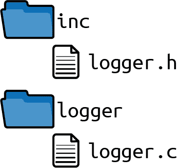
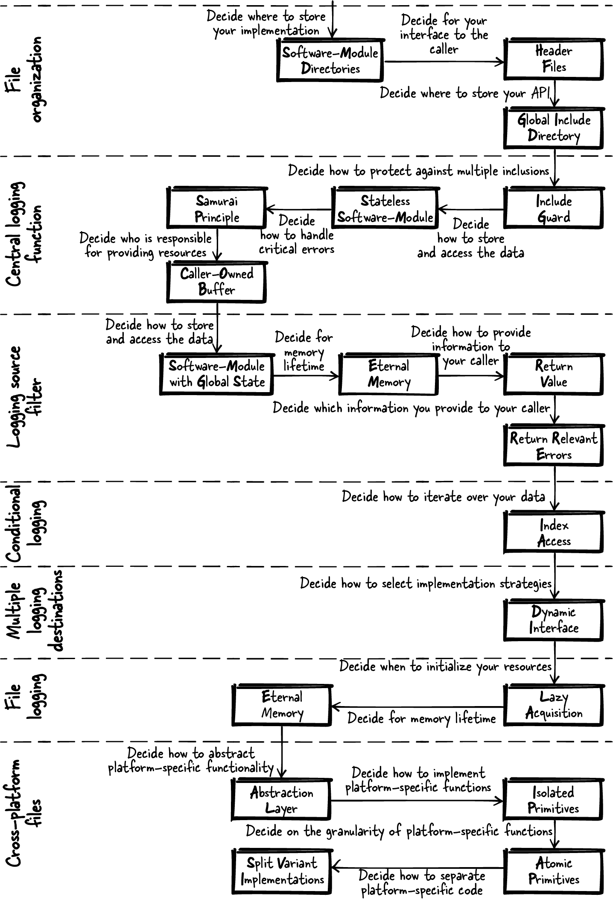

# 第十章：实现日志功能

在设计软件时，选择适当的模式在适当的情况下帮助很大。但有时很难找到正确的模式并决定何时应用它。您可以在本书的第 I 部分中的上下文和问题部分找到相关指导。但通常通过查看具体示例来理解如何做某事要容易得多。

本章讲述了将本书第 I 部分的模式应用于一个抽象自工业强度实现的日志系统的运行示例的故事。为了使示例代码易于理解，没有涵盖原始工业强度代码的所有方面。例如，代码设计不关注性能或可测试性方面。尽管如此，示例很好地展示了如何逐步构建一个日志系统，通过应用模式。

# 模式故事

想象一下，您在现场有一个需要维护的 C 程序。如果发生错误，您开车前往客户那里进行调试。这在客户还在同一城市时效果很好。现在客户搬到另一个城市，开车需要几个小时，这完全不能令人满意。

您更喜欢从您的办公桌解决问题，以节省时间和神经。在某些情况下，您可以利用远程调试。在其他情况下，您需要详细的关于发生错误的确切软件状态的数据，这在 sporadic 错误的情况下尤为困难。

也许您已经猜到了避免长时间车程的解决方案。您的解决方案是实现日志功能，并在发生错误时要求客户发送包含调试信息的日志文件。换句话说，您想实现日志错误模式，以便能够分析错误发生后的 bug，这使您更容易修复这些 bug 而无需重现它们。尽管听起来很简单，但要实现日志功能，您需要做出许多关键的设计决策。

## 文件组织

要开始，请组织您预计需要的头文件和实现文件。您已经有一个庞大的代码库，因此希望将这些文件清晰地与其余代码分开。您应该如何组织这些文件？您应该将所有与日志相关的文件放入同一个目录中吗？您应该将所有代码的头文件放入单个目录中吗？

为了回答这些问题，您搜索了关于组织文件的模式，并在第六章和第八章找到了它们。您阅读了这些模式的问题陈述，并信任所描述解决方案中提供的知识。最终，您得到了以下三个很好地解决了您问题的模式：

| 模式名称 | 摘要 |
| --- | --- |
| 软件模块目录 | 将属于紧密耦合功能的头文件和实现文件放入一个目录中。以提供给用户的头文件功能命名该目录。 |
| 头文件 | 在您的 API 中提供功能声明，以提供给用户您想要提供的任何功能。隐藏任何内部函数、内部数据和您的函数定义（实现）在您的实现文件中，不要将此实现文件提供给用户。 |
| 全局包含目录 | 在您的代码库中有一个全局目录，其中包含所有软件模块的 API。将此目录添加到您工具链中的全局包含路径中。 |

为您的实现文件创建一个软件模块目录，并将您的日志软件模块的头文件放入已存在的全局包含目录中。将此头文件放入全局包含目录中的好处是调用者一定知道他们应该使用哪个头文件。

您的文件结构应如图 10-1 所示。



###### 图 10-1\. 文件结构

有了这个文件结构，您可以将任何仅涉及您的日志软件模块的实现文件放入*logger*目录中。您可以将可以从程序的其他部分使用的接口放入*inc*目录中。

## 中心化日志函数

作为起步，实现一个中心化的错误日志记录函数，该函数接受自定义的错误文本，在文本中添加当前时间戳，并将其打印到标准输出。时间戳信息将使您稍后分析错误文本更加容易。

将函数声明放入*logger.h*文件中。为了保护您的头文件免受多次包含的影响，请添加一个包含保护。在该代码中不需要存储任何信息或进行初始化；只需实现一个无状态的软件模块。拥有无状态的日志记录器带来很多好处：您的日志记录代码保持简单，并且在多线程环境中调用代码变得更加容易。

| 模式名称 | 摘要 |
| --- | --- |
| 包含保护 | 保护您的头文件内容免受多次包含的影响，以便使用头文件的开发人员不必关心它是否被多次包含。使用交错的`#ifdef`语句或`#pragma once`语句来实现这一点。 |
| 无状态的软件模块 | 保持函数简单，在您的实现中不积累状态信息。将所有相关函数放入一个头文件中，并为调用者提供您软件模块的接口。 |

*logger.h*

```cpp
#ifndef LOGGER_H
#define LOGGER_H
void logging(const char* text);
#endif
```

*调用者的代码*

```cpp
logging("Some text to log");
```

要在*logger.h*文件中实现该函数，在其中调用`printf`来将时间戳和文本写入`stdout`。但是，如果您的函数的调用者提供了无效的日志输入，比如`NULL`指针，该怎么办？您应该检查这样的无效输入并向调用者提供错误信息吗？遵循武士原则，根据该原则，您不应返回关于编程错误的错误信息。

| 模式名称 | 摘要 |
| --- | --- |
| 武士原则 | 从函数中返回，要么胜利，要么不返回。如果有一种情况，你知道错误无法处理，那么终止程序。 |

将提供的文本转发给`printf`函数，如果输入无效，您的程序将简单地崩溃，这使得调用者可以找出关于无效输入的编程错误：

*logger.c*

```cpp
void logging(const char* text)
{
  time_t mytime = time(NULL);
  printf("%s %s\n", ctime(&mytime), text);
}
```

如果您在多线程程序的上下文中调用该函数会怎样？调用函数的字符串是否可以被其他线程更改，或者在日志函数完成之前字符串是否需要保持不变？在上述代码示例中，调用者必须将`text`作为`logging`函数的输入，并负责确保该字符串在函数返回之前是有效的。因此，这里有一个调用者拥有的缓冲区。该行为必须在函数接口中进行文档化。

| 模式名称 | 摘要 |
| --- | --- |
| 调用者拥有的缓冲区 | 要求调用者为返回大型复杂数据的函数提供缓冲区及其大小。在函数实现中，如果缓冲区大小足够大，则将所需数据复制到缓冲区中。 |

*logger.h*

```cpp
/* Prints the current timestamp followed by the provided string to stdout.
 The string must be valid until this function returns. */
void logging(const char* text);
```

## 日志源过滤器

现在想象每个软件模块都调用日志函数以记录一些信息。输出可能会变得非常混乱，特别是在多线程程序中。

为了更容易获取您正在寻找的信息，您希望能够配置代码，使其仅打印已配置软件模块的日志信息。为此，请向您的函数添加一个额外的参数，用于标识当前的软件模块。添加一个函数以启用打印软件模块的输出。如果调用该函数，将来该软件模块的所有日志输出都将被打印：

*logger.h*

```cpp
/* Prints the current timestamp followed by the provided string to stdout.
 The string must be valid until this function returns. The provided module
 identifies the software-module that calles this function. */
void logging(const char* module, const char* text);

/* Enables printing output for the provided module. */
bool enableModule(const char* module);
```

*Caller’s code*

```cpp
logging("MY-SOFTWARE-MODULE", "Some text to log");
```

您将如何跟踪应该打印哪些软件模块的日志信息？您应该将该状态信息存储在全局变量中，还是每个全局变量都是一种代码异味？或者为了避免全局变量，应该向所有函数传递一个额外的参数来存储这些状态信息？在整个程序生命周期内是否应分配所需的内存？这些问题的答案涉及使用永久内存实现具有全局状态的软件模块。

| 模式名称 | 摘要 |
| --- | --- |
| 具有全局状态的软件模块 | 有一个全局实例，让您的相关函数共享公共资源。将所有操作此实例的函数放入一个头文件中，并向调用者提供此接口以访问您的软件模块。 |
| 永久内存 | 将数据放入整个程序生命周期可用的内存中。 |

*logger.c*

```cpp
#define MODULE_SIZE 20
#define LIST_SIZE 10
typedef struct
{
  char module[MODULE_SIZE];
}LIST;
static LIST list[LIST_SIZE];
```

前面示例中的列表由以下功能启用软件模块来填充：

*logger.c*

```cpp
bool enableModule(const char* module)
{
  for(int i=0; i<LIST_SIZE; i++)
  {
    if(strcmp(list[i].module, "") == 0)
    {
      strcpy(list[i].module, module);
      return true;
    }
    if(strcmp(list[i].module, module) == 0)
    {
      return false;
    }
  }
  return false;
}
```

前面的代码如果列表中的某个槽为空并且该名称尚未在列表中，则将软件模块名称添加到列表中。调用者通过返回值看到是否发生错误，但看不到发生了哪些错误。不返回状态码；只返回相关的错误，因为调用者在描述的错误情况下没有不同的反应场景。您还应该在函数定义中记录此行为。

| 模式名称 | 摘要 |
| --- | --- |
| 返回值 | 只需使用用于检索函数调用结果信息的 C 机制之一：返回值。在 C 中返回数据的机制是复制函数结果并提供调用者对此副本的访问。 |
| 只返回相关的错误 | 只有当错误信息对调用者有关时，才将错误信息返回给调用者。只有当调用者能够对此信息做出反应时，错误信息才对调用者有关。 |

*logger.h*

```cpp
/* Enables printing output for the provided module. Returns true on success
 and false on error (no more modules can be enabled or module was already
 enabled). */
bool enableModule(const char* module);
```

## 条件记录

现在，在列表中激活了软件模块后，您可以根据激活的模块条件性地记录信息，如下代码所示：

*logger.c*

```cpp
void logging(const char* module, const char* text)
{
  time_t mytime = time(NULL);
  if(isInList(module))
  {
    printf("%s %s\n", ctime(&mytime), text);
  }
}
```

但是您如何实现 `isInList` 函数呢？有多种方法可以迭代列表。您可以使用游标迭代器，提供 `getNext` 方法来抽象底层数据结构。但是这里是否有必要呢？毕竟，在您自己的软件模块中，只需遍历一个数组。因为迭代的数据未跨 API 边界传递，这里可以应用一个更简单的解决方案。索引访问直接使用索引访问您希望迭代的元素：

| 模式名称 | 摘要 |
| --- | --- |
| 索引访问 | 提供一个函数，接受索引来访问底层数据结构中的元素，并返回此元素的内容。用户在循环中调用此函数以遍历所有元素。 |

*logger.c*

```cpp
bool isInList(const char* module)
{
  for(int i=0; i<LIST_SIZE; i++)
  {
    if(strcmp(list[i].module, module) == 0)
    {
      return true;
    }
  }
  return false;
}
```

现在，您所有的软件模块特定记录代码都已编写完成。该代码简单地通过增加索引来迭代数据结构。与您的 `enableModule` 函数中已经使用的相同类型的迭代。 

## 多个记录目的地

接下来，您希望为日志条目提供不同的目标位置。到目前为止，所有输出都记录在`stdout`上，但您希望调用者能够配置您的代码直接记录到文件中。这样的配置通常在开始记录要执行的操作之前完成。从一个允许您为所有未来的日志记录配置日志目标的函数开始：

*logger.h*

```cpp
/* All future log messages will be logged to stdout */
void logToStdout();

/* All future log messages will be logged to a file */
void logToFile();
```

要实现此日志目标选择，您可以简单地使用`if`或`switch`语句调用正确的函数，具体取决于配置的日志目标。但是每次添加另一个日志目标时，您都必须修改该代码片段。这不符合开闭原则的良好解决方案。更好的解决方案是实现一个动态接口。

| 模式名称 | 概要 |
| --- | --- |
| 动态接口 | 为 API 中不同功能定义一个通用接口，并要求调用者提供该功能的回调函数，然后在您的函数实现中调用该函数。 |

*logger.c*

```cpp
typedef void (*logDestination)(const char*);
static logDestination fp = stdoutLogging;

void stdoutLogging(const char* buffer)
{
  printf("%s", buffer);
}

void fileLogging(const char* buffer)
{
  /* not yet implemented */
}

void logToStdout()
{
  fp = stdoutLogging;
}

void logToFile()
{
  fp = fileLogging;
}

#define BUFFER_SIZE 100
void logging(const char* module, const char* text)
{
  char buffer[BUFFER_SIZE];
  time_t mytime = time(NULL);
  if(isInList(module))
  {
    sprintf(buffer, "%s %s\n", ctime(&mytime), text);
    fp(buffer);
  }
}
```

现有代码发生了很多变化，但现在可以添加额外的日志目标而无需更改`logging`函数。在前面的代码中，`stdoutLogging`函数已经实现，但`fileLogging`函数还未完成。

## 文件记录

要记录到文件，您可以每次记录消息时简单地打开和关闭文件。但这并不是很高效，如果要记录大量信息，这种方法会花费大量时间。那么您有什么替代方案呢？您可以打开文件一次，然后保持打开状态。但是您如何知道何时打开文件？何时关闭它呢？

在查看本书中的模式后，您找不到解决您问题的模式。然而，通过快速的谷歌搜索，您会找到解决您问题的模式：延迟获取。在首次调用您的`fileLogging`函数时，打开文件一次，然后保持打开状态。您可以将文件描述符存储在永久存储中。

| 模式名称 | 概要 |
| --- | --- |
| 延迟获取 | 首次使用时隐式初始化对象或数据（见《面向模式的软件架构：第 3 卷：资源管理模式》Michael Kirchner 和 Prashant Jain [Wiley, 2004]） |
| 永久存储 | 将数据放入整个程序生命周期内可用的内存中。 |

*logger.c*

```cpp
void fileLogging(const char* buffer)
{
  static int fd = 0; 
  if(fd == 0)
  {
    fd = open("log.txt", O_RDWR | O_CREAT, 0666);
  }
  write(fd, buffer, strlen(buffer));
}
```


这些`static`变量只初始化一次，而不是每次调用函数时都初始化。

为了使示例代码保持简单，它并不针对线程安全性。为了线程安全，代码必须使用互斥锁保护延迟获取，以确保获取只发生一次。

那么关闭文件怎么样？对于某些应用程序（比如本章中的应用程序），不关闭文件是一个有效的选择。想象一下，你希望在应用程序运行时记录，当你关闭应用程序时，你依赖操作系统清理你留下的文件。如果你担心在系统崩溃时信息没有被存储，你甚至可以定期刷新文件内容。

## 跨平台文件

到目前为止的代码在 Linux 系统上实现了向文件的日志记录，但你还想在 Windows 平台上使用你的代码，而当前的代码尚不能工作。

为了支持多个平台，你首先考虑避免变体，这样你只有所有平台的通用代码。这对于通过简单使用在 Linux 和 Windows 系统上都可用的`fopen`、`fwrite`和`fclose`函数来编写文件是可能的。

| 模式名称 | 摘要 |
| --- | --- |
| 避免变体 | 使用所有平台上都可用的标准化函数。如果没有标准化函数，考虑不实现这个功能。 |

然而，你希望使文件日志记录代码尽可能高效，并且使用特定于平台的函数来访问文件更有效。但是如何实现特定于平台的代码呢？复制你的代码库以获得一个完整的 Windows 版本和一个完整的 Linux 版本不是一个选择，因为未来的更改和维护可能会变成一场噩梦。

你决定在你的代码中使用`#ifdef`语句来区分平台。但这难道不也是代码复制吗？毕竟，当你的代码中有大量的`#ifdef`块时，这些语句中的所有程序逻辑都是重复的。如何在支持多个平台的同时避免代码重复呢？

再次，这些模式为你指明了方向。首先，为需要依赖于特定平台函数的功能定义平台无关的接口。换句话说，定义一个抽象层。

| 模式名称 | 摘要 |
| --- | --- |
| Abstraction Layer | 为每个需要特定于平台代码的功能提供一个 API。在头文件中只定义平台无关的函数，并将所有特定于平台的`#ifdef`代码放入实现文件中。调用者只需要包含你的头文件，而不需要包含任何特定于平台的文件。 |

*logger.c*

```cpp
void fileLogging(const char* buffer)
{
  void* fileDescriptor = initiallyOpenLogFile();
  writeLogFile(fileDescriptor, buffer);
}

/* Opens the logfile at the first call.
 Works on Linux and on Windows systems */
void* initiallyOpenLogFile()
{
  ...
}

/* Writes the provided buffer to the logfile.
 Works on Linux and on Windows systems */
void writeLogFile(void* fileDescriptor, const char* buffer)
{
  ...
}
```

在这个抽象层后面，你有你代码变体的隔离原语。这意味着你不在几个函数中使用`#ifdef`语句，而是为一个函数坚持使用一个`#ifdef`。你是否应该在整个函数实现中使用`#ifdef`语句，还是仅在特定于平台的部分中使用？

解决方案是两者都有。你应该有原子原语。函数应该以一种粒度存在，使其仅包含特定于平台的代码。如果不是这样，那么你可以进一步拆分这些函数。这是保持平台相关代码可管理性的最佳方式。

| 模式名称 | 概要 |
| --- | --- |
| 独立原语 | 隔离您的代码变体。在您的实现文件中，将处理变体的代码放入单独的函数中，并从主程序逻辑中调用这些函数，这样主程序逻辑中只包含平台无关的代码。 |
| 原子原语 | 使您的原语变成原子的。每个函数只处理一种变体。如果您处理多种变体，例如操作系统变体和硬件变体，则应分别为其创建函数。 |

下面的代码展示了原子原语的实现：

*logger.c*

```cpp
void* initiallyOpenLogFile()
{
#ifdef __unix__
  static int fd = 0;
  if(fd == 0)
  {
    fd = open("log.txt", O_RDWR | O_CREAT, 0666);
  }
  return fd;
#elif defined _WIN32
  static HANDLE hFile = NULL;
  if(hFile == NULL)
  {
    hFile = CreateFile("log.txt", GENERIC_WRITE, 0, NULL,
                       CREATE_NEW, FILE_ATTRIBUTE_NORMAL, NULL);
  }
  return hFile;
#endif
}

void writeLogFile(void* fileDescriptor, const char* buffer)
{
#ifdef __unix__
  write((int)fileDescriptor, buffer, strlen(buffer));
#elif defined _WIN32
  WriteFile((HANDLE)fileDescriptor, buffer, strlen(buffer), NULL, NULL);
#endif
}
```

上述代码看起来并不美观。但再怎么说，任何依赖于平台的代码很少看起来好看。有什么其他方法可以使该代码更易于阅读和维护吗？改进的一种可能方法是将变体实现分割为单独的文件。

| 模式名称 | 概要 |
| --- | --- |
| 分割变体实现 | 将每个变体实现放入单独的实现文件中，并根据需要选择为哪个平台编译。 |

*fileLinux.c*

```cpp
#ifdef __unix__
void* initiallyOpenLogFile()
{
  static int fd = 0;
  if(fd == 0)
  {
    fd = open("log.txt", O_RDWR | O_CREAT, 0666);
  }
  return fd;
}

void writeLogFile(void* fileDescriptor, const char* buffer)
{
  write((int)fileDescriptor, buffer, strlen(buffer));
}
#endif
```

*fileWindows.c*

```cpp
#ifdef _WIN32
void* initiallyOpenLogFile()
{
  static HANDLE hFile = NULL;
  if(hFile == NULL)
  {
    hFile = CreateFile("log.txt", GENERIC_WRITE, 0, NULL,
                       CREATE_NEW, FILE_ATTRIBUTE_NORMAL, NULL);
  }
  return hFile;
}

void writeLogFile(void* fileDescriptor, const char* buffer)
{
  WriteFile((HANDLE)fileDescriptor, buffer, strlen(buffer), NULL, NULL);
}
#endif
```

这两个显示的代码文件与将 Linux 和 Windows 代码混合在单个函数内的代码相比，要容易得多。而且，与通过`#ifdef`语句在平台上有条件地编译代码相比，现在可以消除所有`#ifdef`语句，并使用 Makefile 选择要编译的文件。

## 使用记录器

在你的日志功能做出最后更改后，你的代码现在可以将消息记录到配置的软件模块，可以输出到`stdout`或跨平台文件中。以下代码展示了如何使用日志功能：

```cpp
enableModule("MYMODULE");
logging("MYMODULE", "Log to stdout");
logToFile();
logging("MYMODULE", "Log to file");
logging("MYMODULE", "Log to file some more");
```

在完成所有这些编码决策并实施它们之后，您感到非常宽慰。您从键盘上抬起双手，欣赏着代码。您对一些最初似乎困扰您的问题如何轻松解决感到惊讶。利用这些模式的好处在于，它们消除了您自己做出数百个决策的负担。

以前的长途汽车驾驶修复错误已成为过去。现在，您只需通过日志文件获取所需的调试信息。这让您的客户感到高兴，因为他们可以更快地修复错误。更重要的是，它让您的生活更加美好。您可以提供更专业的软件，并且现在有时间早点下班。

# 概要

你通过逐步应用第一部分中提出的模式来构建此日志功能的代码，以便逐一解决各种问题。刚开始时，你对如何组织文件或如何处理错误处理有很多问题。这些模式指引了你的方向。它们为你提供了指导，并使得构建这段代码变得更加容易。它们还帮助你理解代码看起来和表现出来的原因。图 10-2 显示了模式帮助你做出的决策概述。

当然，你的代码仍有许多潜在的功能改进空间。例如，该代码不处理文件的最大大小或日志文件的轮换，并且不支持配置日志级别以跳过非常详细的日志记录。为了保持简单和易于理解，这些功能没有涵盖在内，但可以添加到代码示例中。

下一章将讲述如何将这些模式应用于构建另一个更大的工业级代码片段的另一个故事。



###### 图 10-2\. 故事中应用的模式
