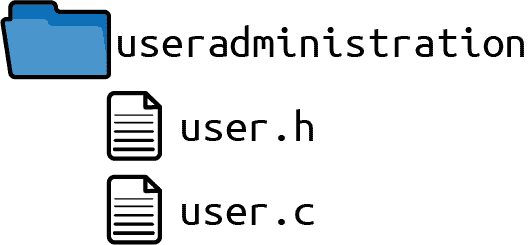
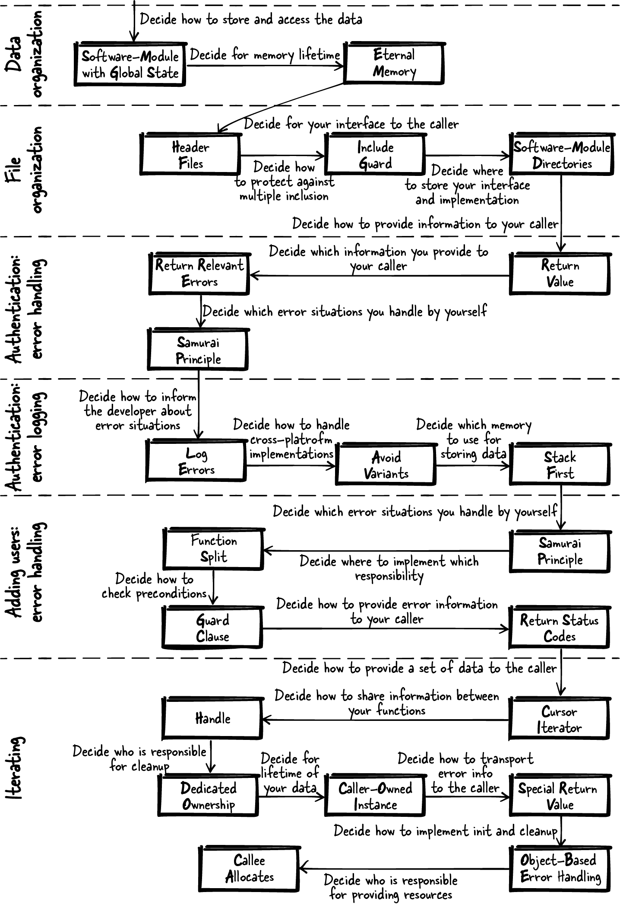

# 第十一章。构建用户管理系统

本章讲述了将本书第一部分的模式应用于运行示例的故事。通过该示例，它说明了如何通过模式做出设计选择能够为程序员提供好处和支持。本章的运行示例是从一个工业级别的用户管理系统的实现中抽象出来的。

# 模式故事

想象一下，你刚从大学毕业，开始为一家软件开发公司工作。你的老板交给你一个软件规范，用于存储用户名和密码，并告诉你要实现它。该软件应该提供检查用户提供的密码是否正确以及创建、删除和查看现有用户的功能。

你渴望向老板展示你是一位优秀的程序员，但在你开始之前，脑海中充满了问题。你应该把所有的代码都写到一个文件中吗？你从学习中知道这是不好的实践，但是什么是一个好的文件数量？你将代码的哪些部分放到同一个文件中？你应该检查每个函数的输入参数吗？你的函数是否应该返回详细的错误信息？在大学里，你学会了如何构建一个能运行的软件程序，但你没有学会如何编写可维护的优秀代码。那么你该怎么做？你如何开始呢？

## 数据组织

要回答你的问题，首先通过查阅本书中的模式来获取如何构建良好的 C 程序的指导。从系统中存储用户名和密码的部分开始。你现在的问题应该集中在如何在程序中存储数据上。你应该将它存储在全局变量中吗？还是应该将数据保存在函数内的局部变量中？还是应该分配动态内存？

首先，考虑您的应用程序中要解决的确切问题：您不确定如何存储用户名数据。目前不需要使这些数据持久化；您只是想在运行时能够构建和访问这些数据。此外，您不希望函数的调用者必须处理数据的显式分配和初始化。

接下来，寻找解决你特定问题的模式。查阅第五章关于数据生命周期和所有权的 C 模式，该章节讨论了谁负责持有哪些数据的问题，其中包括所有模式的问题部分，并找到一个非常匹配你问题并描述的后果对你可接受的模式。这个模式是具有全局状态的软件模块模式，建议使用全局变量的永久内存形式，作用域限制在文件内，以便从该文件内访问该数据。

| 模式名称 | 概要 |
| --- | --- |
| 具有全局状态的软件模块 | 使用一个全局实例来让相关函数共享公共资源。将所有操作此实例的函数放入一个头文件中，并为调用者提供你的软件模块的此接口。 |
| 永久内存 | 将数据放入整个程序生命周期内可用的内存中。 |

```cpp
#define MAX_SIZE 50
#define MAX_USERS 50

typedef struct
{
  char name[MAX_SIZE];
  char pwd[MAX_SIZE];
}USER;

static USER userList[MAX_USERS]; 
```


`userList`包含用户数据。它在实现文件中可访问。因为它保留在静态内存中，所以不需要手动分配它（这会使代码更灵活，但也更复杂）。

# 存储密码

在这个简化的示例中，我们将密码保留为明文。在实际应用中绝对不能这样做。存储密码时，应该存储明文密码的[加盐哈希值](https://oreil.ly/5y7yO)。

## 文件组织

接下来，为你的调用方定义一个接口。确保以后可以轻松更改你的实现而不需要调用方更改任何代码。现在你必须决定程序的哪一部分应该在接口中定义，哪一部分应该在你的实现文件中定义。

使用头文件解决这个问题。只将对调用方有用的东西放入接口（*.h*文件）中。其余的都放入你的实现文件（*.c*文件）中。为了防止头文件被多次包含，实现一个包含保护。

| 模式名称 | 概述 |
| --- | --- |
| 头文件 | 在你的 API 中提供函数声明，以提供给用户所需的任何功能。将任何内部函数、内部数据和函数定义（实现）隐藏在你的实现文件中，并且不向用户提供此实现文件。 |
| 包含保护 | 保护头文件内容，防止多次包含，使得使用头文件的开发人员不必关心它是否被多次包含。使用一个交互锁定的`#ifdef`语句或`#pragma once`语句来实现这一点。 |

*user.h*

```cpp
#ifndef USER_H
#define USER_H

#define MAX_SIZE 50

#endif
```

*user.c*

```cpp
#include "user.h"

#define MAX_USERS 50

typedef struct
{
  char name[MAX_SIZE];
  char pwd[MAX_SIZE];
}USER;

static USER userList[MAX_USERS];
```

现在调用方可以使用定义的`MAX_SIZE`来知道提供给软件模块的字符串可以有多长。按照惯例，调用方知道*.h*文件中的所有内容都可以使用，但*.c*文件中的内容则不应使用。

接下来，确保你的代码文件与调用者的代码良好分离，以避免名称冲突。你是否应该将所有文件放入一个目录中，或者例如将所有*.h*文件放在整个代码库中的一个目录中，以便更容易地包含它们？

创建一个软件模块目录，将所有与软件模块相关的文件（接口和实现）放入一个目录中。

| 模式名称 | 概述 |
| --- | --- |
| 软件模块目录 | 将属于紧密耦合功能的头文件和实现文件放入一个目录中。将该目录命名为通过头文件提供的功能。 |

有了图 11-1 所示的目录结构，现在可以轻松地找到所有与你的代码相关的文件。现在你不必担心你的实现文件名与其他文件名冲突的问题了。



###### 图 11-1\. 文件结构

## 认证：错误处理

现在是实现首个访问数据功能的时候了。首先实现一个函数，检查提供的密码是否与先前保存的用户密码匹配。通过在头文件中声明函数并在函数声明旁边用代码注释文档化函数的行为来定义函数的行为。

函数应告诉调用者提供的密码是否正确。通过函数的返回值告知调用者。但是应该返回哪些信息呢？是否应该向调用者提供任何发生的错误信息？

只返回相关的错误，因为对于任何与安全相关的功能，通常只提供必须提供的信息，不多提供。不要让调用者知道提供的用户不存在还是提供的密码错误。相反，只需告诉调用者认证是否成功。

| 模式名称 | 概要 |
| --- | --- |
| 返回值 | 简单地使用 C 语言中用于获取函数调用结果信息的机制：返回值。C 语言中返回数据的机制复制函数结果并提供调用者访问这个副本的方式。 |
| 返回相关的错误 | 只有当错误信息对调用者有意义时才将错误信息返回给调用者。如果调用者能够对信息做出反应，则错误信息对调用者有意义。 |

*user.h*

```cpp
/* Returns true if the provided username exists and
 if the provided password is correct for that user. */
bool authenticateUser(char* username, char* pwd);
```

这段代码非常清楚地定义了函数返回的值，但是没有指定在输入无效的情况下的行为。应该如何处理像`NULL`指针这样的无效输入？你应该检查`NULL`指针，还是应该简单地忽略无效输入？

要求用户提供有效的输入，因为无效的输入将是用户的编程错误，这样的错误不应被忽视。根据武士原则，在遇到无效输入时应中止程序，并在头文件中记录这种行为。

| 模式名称 | 概要 |
| --- | --- |
| 武士原则 | 要么成功返回函数，要么根本不返回。如果有一个情况是你知道无法处理错误的情况，那么就中止程序。 |

*user.h*

```cpp
/* Returns true if the provided username exists and
 if the provided password is correct for that user,
 returns false otherwise. Asserts in case of invalid
 input (NULL string) */
bool authenticateUser(char* username, char* pwd);
```

*user.c*

```cpp
bool authenticateUser(char* username, char* pwd)
{
  assert(username);
  assert(pwd);

  for(int i=0; i<MAX_USERS; i++)
  {
    if(strcmp(username, userList[i].name) == 0 &&
       strcmp(pwd, userList[i].pwd) == 0)
    {
      return true;
    }
  }
  return false;
}
```

使用武士原则，你从调用者身上卸下检查特定返回值指示无效输入的负担。相反，对于无效输入，程序崩溃。你选择使用显式的`assert`语句，而不是让程序以不受控制的方式崩溃（例如将无效输入传递给`strcmp`函数）。在安全关键应用的上下文中，你希望程序在错误情况下也能有定义的行为。

乍一看，让程序崩溃似乎是一个残酷的解决方案，但这种行为下，带有无效参数的调用不会被忽视。长期来看，这种策略使代码更加可靠。它不会让诸如无效参数之类的微妙错误在调用者的代码中显现出来。

## 认证：错误日志记录

接下来，跟踪那些提供了错误密码的调用者。如果你的`authenticateUser`函数失败，记录错误信息，以便稍后进行安全审计。关于日志记录，可以使用第十章中的代码，或者实现一个更简单的日志记录版本如下所示。

| 模式名称 | 概述 |
| --- | --- |
| 记录错误 | 使用不同的通道提供对调用代码相关和开发者相关的错误信息。例如，将调试错误信息写入日志文件，不要将详细的调试错误信息返回给调用者。 |

在不同平台（例如 Linux 和 Windows）上提供这种日志机制是困难的，因为不同的操作系统提供了不同的文件访问函数。此外，跨平台代码的实现和维护也很困难。那么，如何尽可能简单地实现您的日志功能呢？确保避免使用变体，并使用所有平台都可用的标准化函数。

| 模式名称 | 概述 |
| --- | --- |
| 避免使用变体 | 使用所有平台都可用的标准化函数。如果没有标准化函数，则考虑不实现该功能。 |

幸运的是，C 标准定义了访问文件的函数，可以在 Windows 和 Linux 系统上使用。虽然各操作系统提供了访问文件的特定函数，可能更高效或提供特定于操作系统的功能，但这里并不需要。只需使用 C 标准定义的文件访问函数即可。

要实现您的日志功能，请在提供错误密码时调用以下函数：

*user.c*

```cpp
static void logError(char* username)
{
  char logString[200];
  sprintf(logString, "Failed login. User:%s\n", username);
  FILE* f = fopen("logfile", "a+"); 
  fwrite(logString, 1, strlen(logString), f);
  fclose(f);
}
```


使用跨平台的函数`fopen`、`fwrite`和`fclose`。这些代码可以在 Windows 和 Linux 平台上工作，而且没有复杂的`#ifdef`语句来处理不同的平台变体。

用于存储日志信息时，代码使用堆栈优先，因为日志消息足够小，可以放在堆栈上。对于您来说，这也是最简单的选择，因为您不必处理内存清理。

| 模式名称 | 概述 |
| --- | --- |
| 堆栈优先 | 默认情况下将变量放在堆栈上，以便从自动清理堆栈变量中获益。 |

## 添加用户：错误处理

查看整个代码后，您现在有一个函数可以检查密码是否正确匹配用户名列表中的用户名，但是您的用户列表仍然为空。为了填充用户列表，实现一个允许调用者添加新用户的函数。

确保用户名是唯一的，并让调用者知道是否成功添加了新用户，无论是因为用户名已经存在还是因为用户列表中没有更多空间。

现在您需要决定如何通知调用者有关这些错误情况。您应该使用返回值返回此信息，还是应该设置`errno`变量？此外，您将向调用者提供什么类型的信息，并使用什么数据类型返回该信息？

在这种情况下，返回状态码，因为您有不同的错误情况，希望通知调用者这些不同的情况。此外，在参数无效的情况下，中止程序（武士原则）。在接口中定义错误代码，以便您和调用者了解这些错误代码如何映射到不同的错误情况，以便调用者可以相应地做出反应。

| 模式名称 | 概述 |
| --- | --- |
| 返回状态码 | 使用函数的返回值来返回状态信息。返回一个代表特定状态的值。调用者和被调用者都必须彼此理解这个值的含义。 |

*user.h*

```cpp
typedef enum{
  USER_SUCCESSFULLY_ADDED,
  USER_ALREADY_EXISTS,
  USER_ADMINISTRATION_FULL
}USER_ERROR_CODE;

/* Adds a new user with the provided `username' and the provided password
 `pwd' (asserts on NULL). Returns USER_SUCCESSFULLY_ADDED on success,
 USER_ALREADY_EXISTS if a user with the provided username already exists
 and USER_ADMINISTRATION_FULL if no more users can be added. */
USER_ERROR_CODE addUser(char* username, char* pwd);
```

接下来，实现`addUser`函数。检查是否已经存在这样的用户，然后添加用户。为了分离这些任务，执行函数分割，将不同的任务和责任分为不同的函数。首先，实现一个函数来检查用户是否已经存在。

| 模式名称 | 概述 |
| --- | --- |
| 函数分割 | 将函数分割为几部分。从看起来单独有用的函数部分开始，创建一个新函数并调用该函数。 |

*user.c*

```cpp
static bool userExists(char* username)
{
  for(int i=0; i<MAX_USERS; i++)
  {
    if(strcmp(username, userList[i].name) == 0)
    {
      return true;
    }
  }
  return false;
}
```

现在可以在添加新用户的函数内调用此函数，以便仅在用户尚不存在时添加新用户。您应该在函数的开始处还是在添加用户到列表之前检查现有用户？这两种选择中哪一种会使您的函数更易于阅读和维护？

在函数的开头实现守卫条款，如果由于用户已存在而无法执行操作，则立即返回。在函数开头进行检查可以更容易地跟踪程序流程。

| 模式名称 | 概述 |
| --- | --- |
| 守护条款 | 检查是否存在前置条件，如果这些前置条件未满足，则立即从函数中返回。 |

*user.c*

```cpp
USER_ERROR_CODE addUser(char* username, char* pwd)
{
  assert(username);
  assert(pwd);

  if(userExists(username))
  {
    return USER_ALREADY_EXISTS;
  }

  for(int i=0; i<MAX_USERS; i++)
  {
    if(strcmp(userList[i].name, "") == 0)
    {
      strcpy(userList[i].name, username);
      strcpy(userList[i].pwd, pwd);
      return USER_SUCCESSFULLY_ADDED;
    }
  }

  return USER_ADMINISTRATION_FULL;
}
```

到目前为止，已实现的代码片段使您能够在用户管理中填充用户，并检查所提供的密码是否正确。

## 迭代

接下来，通过实现一个迭代器，提供一些功能以读取所有用户名。虽然你可能只想提供一个接口，让调用者通过索引访问`userList`数组，但如果底层数据结构发生变化（例如改为链表），或者调用者想在另一个调用者修改数组时访问数组，那么你将会遇到麻烦。

为了为调用者提供解决上述问题的迭代器接口，请实现一个光标迭代器，它使用一个句柄来隐藏调用者对底层数据结构的访问。

| 模式名称 | 摘要 |
| --- | --- |
| 光标迭代器 | 创建一个指向底层数据结构中元素的迭代器实例。迭代函数以此迭代器实例作为参数，获取迭代器当前指向的元素，并修改迭代器实例以指向下一个元素。用户随后通过反复调用此函数来逐个获取元素。 |
| 句柄 | 有一个函数来创建上下文，在该上下文上进行操作，并返回对内部数据的抽象指针。要求调用者将该指针传递给所有函数，这些函数可以使用内部数据来存储状态信息和资源。 |

*user.h*

```cpp
typedef struct ITERATOR* ITERATOR;

/* Create an iterator instance. Returns NULL on error. */
ITERATOR createIterator();

/* Retrieves the next element from an iterator instance. */
char* getNextElement(ITERATOR iterator);

/* Destroys an iterator instance. */
void destroyIterator(ITERATOR iterator);
```

调用者完全控制何时创建和销毁迭代器。因此，您拥有调用者拥有实例的专有所有权。调用者只需创建迭代器句柄并使用它来访问用户名列表。如果创建失败，则特殊返回值`NULL`指示此情况。使用此特殊返回值而不是显式错误代码使函数使用更加简便，因为不需要额外的函数参数来返回错误信息。当调用者完成迭代时，可以销毁句柄。

| 模式名称 | 摘要 |
| --- | --- |
| 专有所有权 | 在实现内存分配时，明确定义何时进行清理以及谁会执行清理。 |
| 调用者拥有实例 | 要求调用者传递一个实例，该实例用于存储资源和状态信息，并将其传递给您的函数。提供显式函数来创建和销毁这些实例，以便调用者可以确定它们的生命周期。 |
| 特殊返回值 | 使用函数的返回值来返回函数计算的数据。保留一个或多个特殊值，以便在发生错误时返回。 |

因为接口为调用者提供了显式函数来创建和销毁迭代器，这自然地导致在实现中为初始化和清理迭代器资源编写单独的函数。基于对象的错误处理带来的优势是在函数中良好地分离了职责，如果将来需要扩展，这将使得函数更易于扩展。您可以在以下代码中看到此分离，其中所有初始化代码都在一个函数中，所有清理代码都在另一个函数中。

| 模式名称 | 概述 |
| --- | --- |
| 基于对象的错误处理 | 将初始化和清理分开放入单独的函数中，类似于面向对象编程中构造函数和析构函数的概念。 |

*user.c*

```cpp
struct ITERATOR
{
  int currentPosition;
  char currentElement[MAX_SIZE];
};

ITERATOR createIterator()
{
  ITERATOR iterator = (ITERATOR) calloc(sizeof(struct ITERATOR),1);
  return iterator;
}

char* getNextElement(ITERATOR iterator)
{
  if(iterator->currentPosition < MAX_USERS)
  {
    strcpy(iterator->currentElement,userList[iterator->currentPosition].name);
    iterator->currentPosition++;
  }
  else
  {
    strcpy(iterator->currentElement, "");
  }
  return iterator->currentElement;
}

void destroyIterator(ITERATOR iterator)
{
  free(iterator);
}
```

在实现上述代码时，您应如何向调用者提供用户名数据？您应该简单地向调用者提供指向该数据的指针吗？如果将数据复制到缓冲区中，谁应该分配它？

在这种情况下，被调用者分配字符串缓冲区。这使得调用者可以完全访问该字符串，而无需担心`userList`中的数据可能被其他调用者同时更改。此外，调用者避免了访问可能被其他调用者同时更改的数据。

| 模式名称 | 概述 |
| --- | --- |
| 被调用者分配 | 在提供大型复杂数据的函数内分配一个具有所需大小的缓冲区。将所需的数据复制到缓冲区中，并返回指向该缓冲区的指针。 |

## 使用用户管理系统

您现在已完成用户管理代码。以下代码展示了如何使用该用户管理系统：

```cpp
char* element;
addUser("A", "pass");
addUser("B", "pass");
addUser("C", "pass");

ITERATOR it = createIterator();

while(true)
{
  element = getNextElement(it);
  if(strcmp(element, "") == 0)
  {
    break;
  }

  printf("User: %s ", element);
  printf("Authentication success? %d\n", authenticateUser(element, "pass"));
}

destroyIterator(it);
```

在本章中，这些模式帮助您设计了这个最终代码片段。现在您可以告诉老板，您已完成了实现存储用户名和密码请求系统的任务。通过利用基于模式的设计来设计该系统，您依赖于已被证明在使用中的文档化解决方案。

# 概述

您通过应用第一部分中展示的模式一步一步地构建了本章的代码。一开始，您对如何组织文件和如何处理错误有很多问题。模式向您展示了解决问题的途径。它们为您提供了指导，并使得构建这段代码变得更加容易。它们还解释了代码看起来和行为方式的原因。在本章中，您应用了图 11-2 中展示的模式。在图中，您可以看到您需要做出多少决策，以及这些决策受模式指导的情况。

构建的用户管理系统包含基本功能，如添加、查找和验证用户。再次强调，该系统可以添加许多其他功能，比如更改密码功能，避免明文存储密码，或检查密码是否符合某些安全标准。本章节未涉及高级功能，以便更容易理解模式应用。



###### 图 11-2\. 故事中应用的模式
