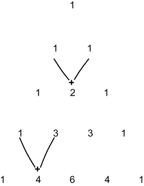
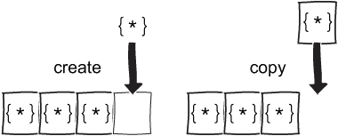
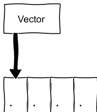
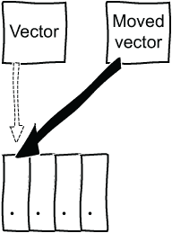
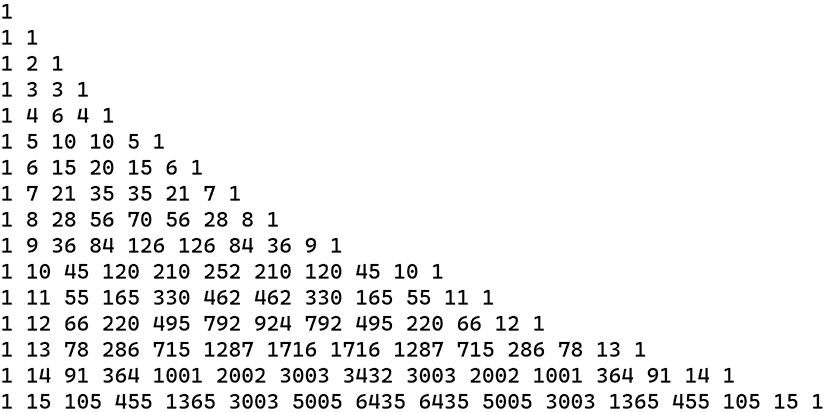
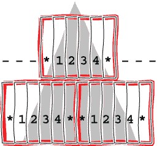
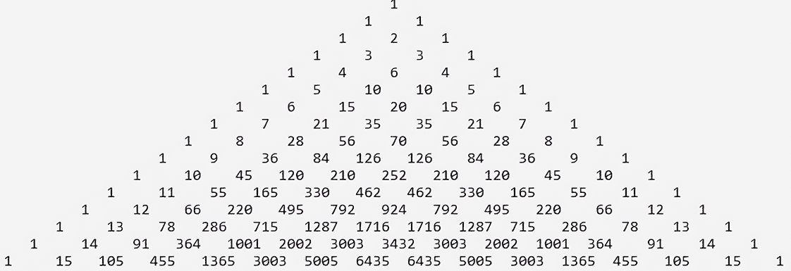
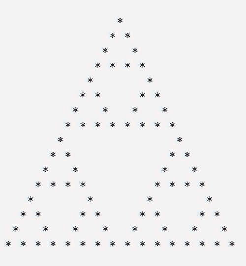

# 2 容器、迭代器和范围

本章涵盖

+   填充和使用容器，重点关注数字向量

+   基于范围的 `for` 循环和 `auto`

+   使用标准算法的容器

+   使用 `format` 显示输出

+   范围、视图和 lambda 表达式

容器和算法长期以来一直是 C++ 的基本组成部分。容器包括序列（例如，`vector`），关联容器（例如，`map`），以及自 C++ 11 以来，无序关联容器（例如，`unordered_map`）。容器管理其元素的存储。数据结构和算法的分离提供了极大的灵活性，允许一个算法应用于各种容器。将范围添加到核心语言提供了简化访问和操作容器的方法。为了探索这些特性，在本章中，我们将构建帕斯卡三角形，它通过从前一行相邻数字相加得到，第一行从单个 1 开始。这些条目可以用来计算事件组合的数量等等。我们将使用向量来存储值，从第一行开始，以练习使用向量和将内容输出到屏幕。然后我们将生成并显示更多行，学习如何以不同的方式使用向量。最后，我们将讨论三角形的一些属性。这将帮助我们思考稍后对代码进行测试。

如果您想跟随操作，则需要编译器和编辑器或 IDE。免费资源的列表可在 [`isocpp.org/get-started`](https://isocpp.org/get-started) 找到。我使用 Vim 与 GNU 编译器集合（GCC）在 Windows 子系统（WSL）中的组合，以及 Visual Studio 2022 社区版，在 C++ 命令行属性中使用 `/std:c++latest`。

## 2.1 创建和显示向量

首先，我们将创建一个包含单个数字的向量并显示它。这将构成三角形的第一行。向量是最常用的容器，因此从它们开始是方便的。然后我们可以练习将不同的元素放入向量中，包括其他向量，并使用算法处理它们。在编码过程中，我们还将使用几个其他 C++ 功能。

将代码放在 `main` 入口点函数之外是一个好主意，这样您可以轻松添加测试或构建库以简化代码的重用。话虽如此，我们将把所有内容放在一个名为 `main.cpp` 的文件中，以保持简单，并创建一个从 `main` 中调用的函数。我们首先创建一个包含一个数字的向量，并显示其内容如下。

列表 2.1 填充和显示容器

```
#include <iostream>                 ❶
#include <vector>                   ❶

void generate_triangle()
{
    std::vector<int> data{ 1 };     ❷
    for (auto number : data)        ❸
    {
        std::cout << number << ' ';
    }
    std::cout << '\n';
}

int main()
{
    generate_triangle();
}
```

❶ 包含输出和向量本身的头文件

❷ 定义一个向量，初始化为单个数字 1

❸ 使用基于范围的 for 循环遍历向量

如果您正在参与，请编译并运行您的代码。对于 GCC 工具，编译方式如下：

```
g++ -Wall --std=c++2a -o main.out main.cpp
```

我们在这里不需要说明使用的是哪个`std`，只要编译器支持至少 C++11 标准，并且我们正在检查任何警告，使用`all`到警告标志`-W`。`-o`标志指定了输出文件名，一旦构建了单个`main.cpp`文件，我们可以通过输入`./main.out`来运行它。如果你使用的是 IDE，找到你的构建按钮，然后找到运行按钮。你应该在屏幕上看到一个数字。

代码包含一些新的 C++特性。在顶部，我们包含了两个头文件：`iostream`用于输入和输出流以及`vector`。这应该是熟悉的。然后有一个函数用于生成和显示三角形的第一行，使用`vector`进行存储。`vector`被初始化为单个数字 1：

```
std::vector<int> data{ 1 };
```

注意我们使用的是花括号，称为*统一初始化语法*。如果我们说

```
std::vector<int> data( 1 );
```

相反，我们得到一个只有一个值的向量，这个值是 0。向量有各种构造函数。第二个版本使用`(1)`将数字 1 视为元素的数量。第一个版本，使用花括号`{1}`，是使用*初始化列表*。列表可以包含多个项目，向量是用初始化列表的内容创建的。尝试使用初始化列表`{1,` `2.3}`将生成编译器错误。这需要一个*narrowing conversion*，因为`2.3`是一个双精度浮点数，而我们想要一个`int`类型的`vector`。我们甚至可以使用`{}`来初始化一个单个数字：`int x{` `42` `}`。由于花括号初始化可以在许多地方使用，因此它被称为*统一初始化*。ISOCpp 建议优先使用花括号初始化([`mng.bz/n1m5`](http://mng.bz/n1m5))，因为它避免了缩窄并允许一致性。初始化是一个很大的主题，可能会变得复杂。例如，Nicolai Josuttis 谈到了“C++初始化的噩梦”([`www.youtube.com/watch?v=7DTlWPgX6zs`](https://www.youtube.com/watch?v=7DTlWPgX6zs))。这里要注意的重要一点是我们可以使用初始化列表来构造一个向量。

有了我们的数据容器，我们可以在标准输出流(`cout`)上显示其内容。我们使用基于范围的`for`循环来遍历容器，使用插入操作符`<<`将容器中的元素流式传输出来。通常，基于范围的`for`循环有`for`、括号和冒号，就像我们在列表 2.1 中看到的那样：

```
for (auto number : data) 
```

这是一个比传统的`for`循环更简洁的语法。在冒号的左侧有一个类型和一个变量名。我们可以偷懒，让编译器通过使用`auto`来自动确定类型。在冒号的右侧有一个容器、数组或类似的东西。我们可以将基于范围的`for`循环视为一种语法糖，使我们的生活更轻松。我们不需要明确说明停止条件或如何遍历项目。基于范围的`for`循环为我们做了这些。

如果我们在 C++ Insights([`cppinsights.io/`](https://cppinsights.io/))中尝试这段代码，我们会看到循环被转换为一个传统的 C 风格`for`循环，包含三个部分：一个开始，一个停止条件，和一个增量。每个容器都有一个开始和一个结束，基于范围的`for`循环使用这些来遍历元素。C++ Insights 显示了所有细节，但给出的代码与

```
for (auto position = data.begin(); position!=data.end(); ++position)
```

使用 C 风格的`for`循环时，我们使用一个指向向量的迭代器位置，当我们想要打印值时，需要使用`operator*`来解引用：

```
std::cout << *position << ' ';
```

基于范围的`for`循环更容易使用，这意味着我们可以以更高的层次进行编码，而不必考虑迭代器。

让我们更详细地看看`auto`。这个关键字告诉编译器推断类型。如果你在使用 IDE，将鼠标悬停在`auto`这个词上可能会告诉你推断出的类型。Visual Studio 说它使用`std::vector<int>>::iterator::value_`类型，即`int`。在我们的情况下，用`int`代替`auto`几乎没有明显的区别，但几乎总是使用`auto`（AAA）有一些优点。这个短语是由 Herb Sutter 在他的 Guru of the Week 博客([`mng.bz/vPpp`](http://mng.bz/vPpp))上提出的。在更复杂的情况下，`auto`将节省很多打字，同时倾向于保持代码类型安全。如果我们将容器的类型更改为使用`double`，我们就不需要更改循环，因此当使用`auto`时，代码更不容易出错。使用`auto`还可以捕捉到容易忽略的细微差别。如果我们使数据成为常量

```
const std::vector<int> data{ 1 };
```

循环变量的类型会自动更改为`const_iterator`，所以我们不需要记住在那里进行更改。实际上，我们甚至可以使用`auto`来声明我们的容器：

```
auto data = std::vector<int>{ 1 };
```

因为`data`是一个包含`int`的初始化列表构造的`int`向量，所以它被推断为`vector<int>`。

更重要的是，`auto`可以帮助我们避免隐式转换，包括缩窄转换，并强制我们初始化变量。我们可以说`auto variable = init`，或者如果我们想要一个特定的类型，我们可以说`auto variable = type{init}`。在两种情况下，我们都被迫明确地说明如何初始化变量。我们不能说`auto variable;`，因为这将导致编译器错误。如果我们尝试像`auto x = int{1.5}`这样的操作，我们也会得到编译器错误，因为我们正在尝试使用缩窄转换。如果我们说`int x = 1.5`代替，我们可能会得到一个警告，但有些人会忽略警告。这不是一个好主意，但这种情况确实会发生。使用`auto`可以阻止潜在的错误。

回到我们的向量。我们可以对创建向量的方式进行一个小改动。我们告诉编译器在向量中放置一个整数，所以它当然可以推断出向量中元素的类型。是的，它现在可以了。自从 C++17 以来，我们可以说`std:: vector` `data{` `1` `}`。注意我们没有指定模板类型。相反，我们依赖于*类模板参数推导*（CTAD）。如果我们决定在几乎每个地方都使用`auto`，我们甚至可以将我们的声明改为`auto` `data` `=` `std::vector{` `1` `}`。现在，如果我们想要一个空向量，类型无法推断，因为`auto` `data` `=` `std:: vector{}`没有一种方法可以推断出元素类型，所以它无法编译。CTAD 是另一个新特性，它可以节省我们一些打字。

现在，我们可以显示帕斯卡三角形的第一个行。这看起来可能是一个小步骤，但我们已经看到了一些 C++特性，并且可以在此基础上构建。接下来，我们将向三角形添加更多行，并在过程中学习更多 C++。

## 2.2 创建和显示帕斯卡三角形

我们现在有了第一行，并将用它来制作接下来的几行，展示我们得到的结果。我们将使用 C++20 的 range 库来打印结果。Ranges 是 C++20 中引入的几个较大特性之一，它超越了更短的语法。一旦我们有了几行，我们就会考虑一些帕斯卡三角形的性质，这将帮助我们测试我们的代码并练习使用我们的向量。让我们先回顾一下如何构建帕斯卡三角形。

### 2.2.1 帕斯卡三角形的提醒

帕斯卡三角形包含几个有用的数字序列。一个常见的用途是找出事件组合的方式。如果你掷一次硬币，你可以得到正面或反面。如果你掷两次，你可以得到两次正面，两次反面，或者一次正面一次反面，有两种方式：先正面后反面或先反面后正面。对于三次掷币，你可能得到全部正面，两次正面，一次正面，或者一个也没有，但对于给定数量的正面，有多少种组合呢？帕斯卡三角形会告诉我们。

三角形从定义上开始于一个数字 1。如果我们正在寻找掷硬币时可能组合的数量，那么对于零次掷币有一个结果。每一行随后从定义上开始和结束于 1。这对应于事件的组合。对于一次掷币，我们可以以一种方式得到一个单一的正面，或者以一种方式得到一个单一的反面。因此，第二行是两个 1。对于第三行，同样，我们开始和结束于 1，因为我们可以以一种方式得到全部正面，或者以一种方式得到全部反面。下一个数字是前一行中两个数字的和，按照图 2.1 所示排列行。



图 2.1 该图显示了帕斯卡三角形的几行。

要生成第四行，我们从 1 开始，然后从上一行中求和前两个数字，得到 1 + 2 = 3；接下来，我们求和第二个和第三个数字，得到 2 + 1 = 3。我们已经用完了上一行，所以最后我们加一个 1。对于三次抛硬币，第四行告诉我们可以有多少种组合：1, 3, 3, 1。换句话说，有一种方法可以得到全部正面；三种方法可以得到两个正面（HHT, HTH, THH）；三种方法可以得到一个正面（HTT, THT, TTH）；最后，有一种方法可以得到没有正面（TTT）。

我们继续下一行，从 1 开始，在上一行中添加相邻的数字对，并以最后的 1 结束。我们可以在纸上无限期地这样做，但代码是另一回事。整数有一个最大值，这将在不同的机器和编译器之间有所不同。如果我们包含数值头文件，我们可以通过调用`std::numeric_limits<int>::max()`来找出平台给出的值。我得到 2,147,483,647，这是 2 的 31 次方减 1，即 2³¹ - 1。这足够存放几行。

### 2.2.2 编码帕斯卡三角形

有几种等效的方法可以生成三角形；然而，让我们根据我们刚刚看到的定义来编写代码。我们看到了如何使用上一行的数字构建一个新行，所以让我们构建一个函数，它接受最后一行并返回下一行。在上一个部分中，我们直接将数据发送到屏幕上，但这使得代码难以测试，所以返回数据并编写一个单独的显示函数是有意义的。毕竟，单一职责函数是合理的。我们为第一行创建了一个整数`vector`，所以我们将继续使用`vector<int>`为每一行。下一个列表显示了我们的函数，在下一行的开始和结束处添加一个 1，并在中间进行一些求和。

列表 2.2 使用上一行构建帕斯卡三角形的下一行

```
std::vector<int> get_next_row(const std::vector<int> & last_row)
{
    std::vector next_row{ 1 };                                      ❶
    if (last_row.empty())
    {
        return next_row;
    }
    for (size_t idx = 0; idx+1 < last_row.size(); ++idx)
    {
        next_row.emplace_back(last_row[idx] + last_row[idx + 1]);   ❷
    }
    next_row.emplace_back(1);
    return next_row;
}
```

❶ 使用 CTAD 推导出我们的模板包含整数

❷ 存储上一行中两个数字的和

我们使用花括号初始化第一行，因为有一个特定的值。现在我们想要计算值并将它们添加到一个`vector`中。有多种方法可以做到这一点。要将值添加到向量的末尾，我们可以使用`push_back`或`emplace_back`。要在其他地方添加项目，我们可以使用`insert`或`emplace`。`emplace`版本发送数据以在原地创建项目，而`push_back`或`insert`则接受一个完全形成的项目，并将它们复制到向量中，如图 2.2 所示。



图 2.2 `emplace`（左侧）接受参数以在原地构建一个项目，而`push_back`则接受一个已完全构建的项目并将其复制到向量中。

对于我们的整数，这两种方法都达到相同的效果。有时，`emplace`版本会更快，因为它直接在向量中构造元素；然而，有时`push_back`可能更安全。`emplace`版本会为我们找到一个构造函数，这可能与我们自己选择的并不一样。贾森·特纳在 C++ Weekly 上讨论了其优缺点（[`www.youtube.com/watch?v=jKS9dSHkAZY`](https://www.youtube.com/watch?v=jKS9dSHkAZY)）。总之，我们可能会看到两者都被使用。

我们现在可以计算每一行的值，但我们需要将它们存储在某个地方。向量是一个明智的选择，它给我们一个`std::vector<std::vector<int>>`。这听起来有点复杂，编译器可以为我们解决这个问题。这意味着当我们编写一个创建三角形的函数时，我们可以使用`auto`作为返回类型，以避免完全写出`std::vector<std::vector<int>>`。对于更复杂的函数，我们可能需要帮助编译器确定返回的类型，但在这个例子中，编译器可以应对。我们想要多少行？如果我们接受所需的数字作为参数，我们可以推迟这个决定。我们只需要调用我们的`get_next_row`函数来填充我们返回的向量，从空的数据行开始。

列表 2.3 生成帕斯卡三角形的几行

```
auto generate_triangle(int rows)             ❶
{
    std::vector<int> data;
    std::vector<std::vector<int>> triangle;
    for (int row = 0; row < rows; ++row)
    {
        data = get_next_row(data);           ❷
        triangle.push_back(data);            ❸
    }
    return triangle;
}
```

❶ 推导返回类型的自动简写

❷ 从前一行生成下一行

❸ 将其添加到三角形中

我们可以在这里停止，显示我们的三角形，并进入新的一章。然而，这种方法并不特别高效。我们可以做得更好。

### 2.2.3 移动语义和完美转发

向量有许多不同的构造函数。我们在列表 2.1 中创建三角形的第一行时使用了接受初始化列表的版本：

```
std::vector<int> data{ 1 };
```

为了生成三角形，我们默认构造每个数据行作为

```
std::vector<int> data;
```

并在函数调用后分配它：

```
data = get_next_row(data);
```

然后我们将数据推送到三角形的末尾：

```
triangle.push_back(data);    
```

这并不像它本可以做到的那样高效。我们创建了行数据，并将其复制推回到向量中。如果我们进行一些小的更改，实际上是通过使用不同的构造函数，我们可以避免复制。让我们看看如何使用所谓的*完美转发*来实现这一点。

我们之前看到`vector`支持`push_back`和`emplace_back`。前者接受一个完整的项，这是我们在这里所拥有的，而后者在原地构造一个对象。`push_back`有两种版本。第一个通过引用接受一个项：

```
void push_back( const T& value );
```

这个版本将由我们的代码调用。它接受我们的`data`并在三角形的末尾创建一个副本。如果我们使用`push_back`的第二个重载，我们可以避免这个复制。该签名使用`&&`来表示*rvalue reference*：

```
void push_back( T&& value ); 
```

什么是右值引用？任何表达式都有一个 *值类别*，例如右值或左值。还有其他类别，但在这里我们不会详细介绍它们。相反，我们将专注于避免复制。如果你想要深入了解，CppReference 提供了完整细节（[`mng.bz/468R`](http://mng.bz/468R)）。

C 使用了左值和右值的概念。如果我们说

```
int x = 42;
```

变量 `x` 位于表达式的左侧，因此被称为左值（lvalue），而 `42` 位于右侧，被称为右值（rvalue）。左值有一个名称，而右值没有。当我们调用 `get_next_row` 时，我们得到一个右值。这是一个之前复制到左值 `data` 中的临时未命名向量。这是浪费的。与其保留数据的副本，我们可以使用 `back` 方法来获取三角形的最后一行。因此，我们需要用第一行初始化三角形，以便在后面有一个元素。现在我们可以像下面列表中所示的那样编写我们的函数。

列表 2.4 移动临时对象

```
auto generate_triangle(int rows)
{
    std::vector<std::vector<int>> triangle{ {1} };    ❶
    for (int row = 1; row < rows; ++row)              ❷
    {
        triangle.push_back(get_next_row(triangle.back()));
    }
    return triangle;
}
```

❶ 添加第一行，以便我们可以调用 back

❷ 从 1 开始，因为我们已经有一行

我们不再有数据的副本。`push_back( const T& value )` 版本使用值的副本初始化新元素，但接受右值引用的版本 `push_back( T&& value )` 可以为我们将临时对象移动到三角形中，避免复制。向量有各种构造函数，包括一个接受右值引用的构造函数，称为 *移动构造函数*。它的签名有我们之前看到的 `&&`：

```
vector( vector&& other );
```

接受 `T` `&&` 值的 `push_back` 方法可以通过调用 `std::move` 来利用这个构造函数，这被称为 *移动语义*。`push_back` `&&` 重载可以，并且通常可以，实现为

```
void push_back( T&& value ) {
    emplace_back(std::move(value));
}
```

在 `push_back` 方法内部，右值有一个名称（`value`），因此它变成了左值。通过调用 `std::move(value)`，值被转换回右值，以便选择右值构造函数。实际上，C++ 的 `move` 操作并没有真正移动任何东西。它将一个值转换为右值。这允许调用接受右值的重载，这被称为 *完美转发*。一旦调用 `move` 并将右值传递给函数，值就处于有效但未指定的状态。由于它已经被移动，对我们来说就不再有用。如果没有移动，其他向量将作为左值传递，并且会调用复制构造函数。这涉及到不必要的复制，因此它将值转发得不够完美。

移动语义和完美转发是很大的主题，我们只是触及了表面。托马斯·贝克尔（Thomas Becker）在 2013 年写了一篇优秀的博客文章，详细介绍了这些细节（[`mng.bz/QRE6`](http://mng.bz/QRE6)）。一个右值引用 `&&` 可能是一个左值

或者一个右值。如果它有一个名称，它是一个左值，但调用 `std::move` 会将其转换为右值，从而允许完美转发。实际上，我们可以直接使用右值或临时对象调用 `emplace_back`：

```
triangle.emplace_back(get_next_row(triangle.back()));
```

移动构造函数是如何避免复制的？向量连续存储项目，因此我们可以使用迭代器以及索引来访问元素。我们不需要在编译时知道元素的数量，因为向量可以动态调整大小。当向量空间不足时，它会分配更多的内存。我们可以将其视为一个指向某些项目的容器，如图 2.3 所示。



图 2.3 一个向量指向其元素。

向量不仅仅是一个指向其元素的指针，关注这一点将揭示移动构造函数如何避免复制。复制构造函数或赋值操作需要复制每个元素，因此我们将有一个原始的向量，比如四个元素，如图 2.3 所示，以及一个相同的副本，也指向四个元素。移动构造函数可以通过指向 rvalue 的项而不是分配副本来有效地从 rvalue 中窃取元素，如图 2.4 所示。



图 2.4 移动构造的向量可以窃取 rvalue 的元素。

此后没有任何其他东西可以尝试使用无名的临时元素，所以这是可以的。此外，实际上没有任何东西移动过，而是移动构造函数接管了临时数据的所有权，并且不需要复制任何元素。

我们已经看到了两种生成向量的方法。第二种方法更高效，因为它不会进行不必要的复制。我们现在需要一种方法来显示我们的三角形。

### 2.2.4 使用范围来显示向量

之前，我们直接将包含单个元素的向量发送到屏幕上，但如果我们写得更通用一些，我们可以将其发送到文件或任何其他流。我们通过为我们的三角形重载`operator <<`来实现这一点。我们有一行，它是一个`vector`，包含一个整数的`vector`。我们不需要在`for`循环内部再写一个`for`循环来写出每个元素，我们可以使用`ranges`库将元素复制到提供的流中。如果你的编译器还不支持`ranges::copy`，你可以使用`std::copy`代替。我们可以使用输出流迭代器（`std::ostream_iterator`）来复制并指示我们希望在数字之间留有空格；否则，它们将不可读。包含`<algorithm>`以使用`std::copy`和包含`<iterator>`头文件以使用`std::ostream_iterator`。然后按照以下列表添加一个新函数。

列表 2.5 将内容发送到流

```
#include <algorithm>                                                ❶
#include <iterator>
template<typename T>
std::ostream& operator << (std::ostream & s,                        ❷
    const std::vector<std::vector<T>>& triangle)
{
    for (const auto& row : triangle)                                ❸
    {
        std::ranges::copy(row, std::ostream_iterator<T>(s, " "));   ❹
        s << '\n';
    }
    return s;
}
```

❶ 包含算法以使用 ranges::copy

❷ 允许选择流

❸ 使用常量引用以避免复制

❹ 将行发送到输出流

注意我们现在通过在 `for` 循环中使用 `const auto& row` 来对三角形的每一行使用常量引用。这应该是熟悉的。如果我们使用 `auto row:` `v`，我们将把整行内容复制到 `data` 中。引用避免了复制，而 `const` 表示我们无法更改内容。C++ 核心指南（[`mng.bz/Xqn9`](http://mng.bz/Xqn9)）鼓励我们不要在基于范围的 `for` 循环中创建循环变量的昂贵副本，正如在表达式和语句（ES）部分所指出的，“ES.71：当有选择时，优先使用范围-for 语句而不是 for 语句。” 这些指南由 Bjarne Stroustrup 和 Herb Sutter 以及许多其他贡献者编纂，包含大量合理的建议。您将在本书中不时看到更多这样的建议。

`for` 循环为我们提供了每一行的引用。我们使用范围算法将这个引用发送到流中。与我们在列表 2.1 中使用的基于范围的 `for` 循环一样，范围的复制会确定从我们的数据向量开始和结束的位置。在概念上，任何通过提供 `start` 迭代器和 `end` 标志提供迭代的对象都是范围。较老算法使用相同类型的 `begin` 和 `end`。标志是一个最近添加的通用概念，它泛化了 `end` 迭代器的想法，类似于使用空字符来指示 `char` 数组的结束。我们可以编写自己的标志来在遇到负数时停止或任何其他自定义逻辑。然而，我们的向量有一个 `begin` 和 `end`，这是我们在这里需要的所有内容。我们可以使用同一头文件中的非范围复制算法，但我们需要自己指定 `begin` 和 `end`：

```
std::copy(data.begin(), data.end(), std::ostream_iterator<T>(s, " "));
```

两种版本的 `copy` 都可以，但范围版本稍微简洁一些。这是标准算法的许多范围版本之一。范围提供了比简洁语法更多的功能。我们还可以对范围进行视图操作，允许在不复制数据的情况下进行组合和过滤。视图按需评估；换句话说，它们支持惰性求值。在本章的后面部分，我们将使用更多范围。

现在我们可以调用我们的代码来生成三角形并查看我们得到的结果。如果我们请求大量的行数，它将无法适应屏幕，并且我们可能会溢出 `int`，所以让我们尝试 16。

列表 2.6 生成和显示三角形的主体代码

```
int main()
{
    auto triangle = generate_triangle(16);
    std::cout << triangle;
}
```

`<<` 运算符找到我们的新函数并生成一个左对齐的三角形，如图 2.5 所示。



图 2.5 帕斯卡三角形的最初几行

警告 为常见类型（如 `vector<vector<int>>`）定义 `operator <<` 通常是一个坏主意，因为如果两个不同的库或组件尝试做同样的事情，大型系统最终可能会发生冲突。对于你自己的类来说是可以的。编写一个命名函数更好。我们很快就会这么做。

如果我们尝试生成许多行，比如说 36 行，最后几行将不会适应屏幕，我们将开始看到整数溢出并变成负数。从左侧开始打印每一行是足够的简单，但它给出了非传统的输出。如果我们居中对齐输出，我们可以做得更好。这也给了我们学习新`format`库的机会。

### 2.2.5 使用格式显示输出

当我们看到如何生成三角形时，图 2.1 显示了居中对齐的行，这是显示三角形的传统方式。坚持使用 16 行可以显示最多四位的数字，因此如果我们将每个数字居中对齐在六个空间内，并在每行的开头添加足够的空间，我们就会得到我们想要的结果。我们可以通过包含`format`头文件来使用`std::format`工具来完成这项工作。`format`最初是 Victor Zverovich 的开源`fmt`库([`fmt.dev/latest/index.html`](https://fmt.dev/latest/index.html))。一些编译器目前还没有完全支持`format`，因此您可能需要使用这个库。安装库有多种方法，但最简单的是从主页下载并解压下载的文件。在随后的代码中，不要包含标准的`format`头文件，而是使用`fmt/core.h`；只使用头文件是最简单的：

```
#define FMT_HEADER_ONLY
#include <fmt/core.h>
```

在代码中，您还需要使用`fmt::format`而不是`std::format`，并且您需要通过使用`-I`开关告诉编译器额外的`include`路径：

```
-I/[path_to_unzipped_fmt_download]/include 
```

在撰写本文时，开源库包含的功能比当前标准 C++支持的功能更多，但在这里我们将坚持使用常见支持的功能。

提示：如果您的编译器目前不支持`format`，您可以使用开源的`fmt`库([`fmt.dev/latest/index.html`](https://fmt.dev/latest/index.html))。或者，`fmt`库包含一个指向 Godbolt([`godbolt.org/z/Eq5763`](https://godbolt.org/z/Eq5763))的链接，其中包含`fmt`库，您可以在编译器探索器中尝试代码。

`format`库类似于 C 的`printf`函数，但通常更快、更简单、更安全。语法在字符串内部使用花括号作为占位符。占位符可以是空的，也可以是一个格式说明符（例如`d`表示十进制），或者给出一个从值中获取的参数的索引。如果我们不通过索引指定在哪里使用哪个值，它们将按顺序放置。格式说明符与 Python 的非常相似。如果我们请求一个使用`d`格式说明符的数字，但传递了一个字符串

```
auto does_not_compile = std::format("I am not a number {:d}", "ten");
```

如果我们使用错误的格式，将会得到编译器错误，这使得`format`比`printf`更安全使用。对于数字，我们可能希望显示正负号，因此可以通过使用`{:+d}`在冒号后表示。如果我们不指定，默认情况下负数将显示负号，而正数则不显示符号。冒号之后，我们可以说我们想要十进制`(d)`、二进制`(b)`等等。

回顾图 2.5，最后一行的最大数字是 6435。因为我们的数字因此不会超过四位数长，所以我们可以将每个元素放在一个六位的块中，每边至少留一个空格。居中对齐的指定符是 `^`，左对齐是 `<`，右对齐是 `>`，所以我们使用以下方式格式化元素

```
std::format("{: ⁶}", element);
```

注意冒号后面的占位符 `{}`。我们不使用索引，所以在冒号前面不要放任何内容。然后我们有 " `⁶`"，这意味着用空格填充到长度为 6，并居中对齐值。实际上，我们可以在占位符内部添加更多的花括号来改变长度，将 6 传递到占位符内部，如下所示：

```
std::format("{: ^{}}", element, 6);
```

这给我们一个 *嵌套替换字段*。这样，我们可以计算每个数字需要多少空间。我们在这里不会做这件事，但花时间实验 `format`。

我们还需要在每行的开头留空格以获得对称的三角形。如果我们计算出最后一行的长度，我们可以将其长度减半以确定放置第一行 1 的位置。让我们先思考几行。我们注意到最后一行的最大数字是 6435，它有四个数字。如果我们每边都加一个空格，我们需要为每个数字一个六位的块。第二行将需要两个六位块，共十二个字符。为了将我们的第一个数字放在中间，我们需要在开头留三个空格，使第一个块位于下一行的两个数字上。因为我们告诉 `format` 居中对齐值，第一个值将位于该块中间。图 2.6 使用 `1234` 来表示任何四位数，展示了这一点。



图 2.6 如果我们在第一行的开头添加三个空格（如虚线所示），我们可以使三角形更加对称。

在行向量上调用 `back().size()` 告诉我们最终行将使用多少个六位块。为了将第一行放在中间，我们需要为每行添加三个空格；因此，我们最初需要 `back().size()` 的三倍填充。对于每一行，我们也在每一步中将填充减少三个，以形成三角形形状。

将我们的格式和空格计算结合起来，我们可以编写以下函数来显示我们的三角形。

列表 2.7 居中对齐输出

```
void show_vectors(std::ostream& s,
    const std::vector<std::vector<int>>& v)
{
    size_t final_row_size = v.back().size();
    std::string spaces(final_row_size * 3, ' ');     ❶
    for (const auto& row : v)
    {
        s << spaces;
        if (spaces.size() > 3)
            spaces.resize(spaces.size()-3);          ❷
        for (const auto& data : row)
        {
            s << std::format("{: ^{}}", data, 6);    ❸
        }
        s << '\n';
    }
}
```

❶ 每行三个空格

❷ 每行减少三个空格

❸ 在六个数字的块中居中对齐每个数字

我们可以在 `main` 函数中调用我们的新函数而不是之前的操作符。

列表 2.8 生成和显示三角形的 `main` 函数

```
int main()
{
    auto triangle = generate_triangle(16);
    show_vectors(std::cout, triangle);      ❶
}
```

❶ 将列表 2.6 中的操作符 << 替换为 show_vectors

这生成并显示我们的居中对齐三角形，如图 2.7 所示。输出看起来大致正确，但我们需要考虑如何测试我们的结果。我们将在这个过程中学习更多 C++。 



图 2.7 一个居中对齐的三角形

## 2.3 三角形的性质

我们已经看到了三角形的一些模式。我们知道每一行都以 1 开始和结束，所以我们可以先添加一个检查这个属性的检查。然后，我们将考虑每行期望的元素数量以及元素的总和。最后，我们将看到在数字太大而无法放入整数之前，我们可以安全生成多少行。我们将把这些属性构建成一系列测试。

不幸的是，C++ 并没有自带测试框架。我们不会花时间设置和学习这样的框架，而是将使用在 `cassert` 头文件中定义的 `assert` 函数。开头的字母 `c` 告诉我们我们正在从 C 标准库中引入代码。`assert` 是一个宏，因此预处理器会逐字复制其内容。如果断言中的表达式为假，它将终止我们的程序。某些设置只在使用 `NDEBUG` 宏定义的情况下在调试构建中使用 `assert`。如果没有它，断言会做些事情，但如果 `NDEBUG` 被定义，它们就什么都不做。检查你的设置。最简单的方法是检查 `assert(0)` 是否会终止程序。

列表 2.9 从失败的测试开始

```
#include <cassert>
#include <vector>
void check_properties(const std::vector<std::vector<int>> & triangle)
{
    assert(0);              ❶
}

int main()
{
    check_properties({});   ❷
}
```

❶ 在第 5 行强制断言失败

❷ 调用带有空向量的函数

在 Ubuntu 的 WSL 上使用 g++，我们看到消息 `Aborted` 以及行号、函数名和消息

```
test.out: main_assert.cpp:5: void check_properties(const std::vector<std::vector<int> >&): Assertion `0' failed.
Aborted
```

如果我们从 Visual Studio 运行它，我们会得到一个对话框，其中包含包括断言失败的行号在内的详细信息。从失败的测试开始是开始测试代码的好方法。至少，它证明了如果断言失败，我们会得到一些反馈。这意味着我们已经准备好测试我们的三角形生成。

注意：使用 `assert` 和从 `main` 中检查属性是一种实用的开始测试的方法；然而，花时间学习一个合适的单元测试框架是值得的。有几个 C++ 测试框架可用，包括 Catch2、Google Test 和 Boost。

现在我们有一个可以添加属性的函数。移除 `assert(0)`，我们就可以添加属性来检查我们的三角形中是否有正确的数字了。

### 2.3.1 检查每行的第一个和最后一个元素

我们知道每行的第一个和最后一个数字必须是 1，所以我们将首先测试这一点。我们需要向我们的 `properties` 函数添加两个断言来测试我们的预期，如下所示。

列表 2.10 确保第一个和最后一个元素是 1

```
#include <cassert>                                   ❶
void check_properties(
    const std::vector<std::vector<int>>& triangle    ❷
)
{
    for (const auto & row : triangle)                ❸
    {
        assert(row.front() == 1);                    ❹
        assert(row.back() == 1);                     ❺
    }
}
```

❶ 包含 assert 宏

❷ 一个接受三角形作为常量引用的新函数

❸ 使用基于范围的 for 循环来检查每一行

❹ 检查第一个元素是否为 1

❺ 检查最后一个元素是否为 1

我们可以在生成三角形后从 `main` 中调用这个函数。我们的单个测试是成功的，所以我们准备添加更多。警告：因为失败的 `assert` 会调用 `abort`，如果有一件事失败，我们将不会检查其他属性。你可以通过堆叠失败消息并断言错误消息为空来避免这种情况。尝试一下，或者更好的是，尝试在一个合适的框架中编写测试。 

### 2.3.2 检查每行的元素数量

帕斯卡三角形的其他属性。第 *n* 行有 *n* 个数字。为什么？我们知道第一行是一个单独的 1。第二行是两个 1。第三行以 1 开始，然后从上一行累加 1 来得到数字 2，然后行尾再有一个 1，这样我们就有了三个数字。第四行有四个数字，这个模式继续。如果你还不确定，请回顾图 2.5 中的三角形。如果我们跟踪行号，我们可以添加另一个 `assert` 来检查这个属性。

列表 2.11 确保每行具有预期的元素数量

```
size_t row_number = 1;                    ❶
for (const auto & row : triangle)
{
    assert(row.front() == 1);
    assert(row.back() == 1);
    assert(row.size() == row_number++);   ❷
}
```

❶ 使用变量跟踪行号

❷ 检查每行是否具有预期的尺寸

我们现在应该检查内容。如果我们检查每个条目，我们需要找到另一种方法来生成行中的每个数字；否则，我们将重复我们试图测试的代码。这个陷阱很容易陷入，而尝试从属性的角度思考可以帮助我们避免这样的问题。

### 2.3.3 检查行中元素的总和

每行数字的总和也遵循一个模式。表 2.1 展示了这些是 2 的幂，从 0 开始。记住，任何数的 0 次幂都是 1。这给我们提供了另一个要检查的属性。

表 2.1 三角形每行数字之和是 2 的幂。

| 行号 | 和 | 2 的幂 |
| --- | --- | --- |
| 1 | 1 | 0 |
| 1+1 | 2 | 1 |
| 1+2+1 | 4 | 2 |
| 1+3+3+1 | 8 | 3 |
| 1+4+6+4+1 | 16 | 4 |

我们需要找到每行数字的总和来检查这个属性。而不是编写一个 `for` 循环，我们可以使用 *标准模板库* (STL)。Herb Sutter 和 Andrei Alexandrescu 在他们的书 *C++ 编程标准：101 条规则、指南和最佳实践*（Addison-Wesley Professional，2004 年）中建议优先使用算法调用而不是手写循环。STL 还包含许多用于泛型容器的算法，包括位于 `numeric` 头文件中的 `accumulate` 方法，这正是我们所需要的。我们之前提到，一些算法支持范围，但一些，包括 `accumulate`，则不支持。因此，我们需要显式地找到 `begin` 和 `end`。

`accumulate`函数有两个版本。它们都接受某个范围或容器的第一个和最后一个迭代器，以及一个初始值。第一个版本将`operator+`应用于每个元素和当前的累积值，从提供的初始值开始。如果我们使用初始值 0，我们将获得所有元素的总和，这正是我们所需要的。第二个版本允许我们提供自己的*二元*运算符。这可以是任何接受两个参数的函数。第一个参数从给定的初始值开始，因此它必须是相同类型，或者初始值必须可以转换为该参数的类型。第二个参数接受迭代器的值；因此，它也需要是合适的类型。CppReference ([`mng.bz/yZGp`](http://mng.bz/yZGp))提供了完整的详细信息，包括签名。对于我们将使用的第一个版本，我们有

```
template< class InputIt, class T >
T accumulate( InputIt first, InputIt last, T init);
```

注意初始值`init`的类型为 T。返回值也是。如果我们使用`int`，即使是双精度容器的返回值也将是`int`。我们的容器有`ints`，所以我们没问题，但如果我们使用双精度，我们需要使用`0.0`。`accumulate`函数非常灵活。第二个版本接受一个二元运算符：

```
template< class InputIt, class T, class BinaryOperation >
T accumulate( InputIt first, InputIt last, T init, BinaryOperation op );
```

我们可以使用`operator*`来找到所有数字的乘积，前提是我们从初始值 1 开始。更通用的第二种形式有时被称为*左折叠*。如果你想复习算法，查看`algorithm`和`numeric`头文件是一个好的起点。

现在我们可以将检查行总和的检查包含到我们的属性测试函数中。从预期的总起始值 1 开始，每次翻倍，我们可以检查行的总和是否是我们预期的 2 的幂。将预期的总数添加到我们的属性函数中，并使用`accumulate`函数以及`numeric`头文件，我们得到以下新的检查。

列表 2.12 确保每一行都有预期的元素总和

```
int expected_total = 1;                          ❶
for (const auto & row : triangle)
{
    assert(std::accumulate(row.begin(),
                       row.end(),
                       0) == expected_total);    ❷
    expected_total *= 2;                         ❸
}
```

❶ 我们预期的总起始值为 1。

❷ 检查总数

❸ 随着每次迭代，预期的总数翻倍。

如果我们运行我们的代码，所有的断言都通过了。这些属性并不能证明我们是正确的，但它们确实给了我们对生成代码的一些信心。现在我们将看看三角形的一个最终属性，然后以另一个模式结束，只是为了好玩。同样，我们将在路上练习更多的 C++。

### 2.3.4 我们可以正确生成多少行？

由于每个数字都是两个前一个数字的和，并且我们开始时使用的是正数，所以我们永远不会得到负数。对于初学者和数学家来说，添加正数应该总是得到正数。然而，数字在计算机上有时会做一些令人惊讶的，有时令人烦恼的事情，比如溢出。我们将先设置一个测试，然后看看我们是否能破坏它。如果我们继续添加`ints`，我们最终会超出可能的最大大小。标准告诉我们这是未定义的行为：

如果在表达式的评估过程中，结果在数学上未定义或不在其类型的可表示值范围内，则行为是未定义的。（[`eel.is/c++draft/expr`](https://eel.is/c++draft/expr)）

我们可以通过一些数学计算来找出我们选择的数值类型能够容纳的最大行数。然而，如果我们观察当我们尝试不断添加行时会发生什么，我们可以在路上学习更多关于 C++的知识。尽管我们依赖于未定义的行为，但在 Visual Studio 中，整数会环绕，这样我们就可以找到我们可以安全生成的最大行数。

有多种方法可以检查值不是负数。我们可以检查每个数字是否为正，或者尝试找到任何负数。我们可以将检查写入`for`循环中，但我们将遵循在可能的情况下使用算法的建议。实际上，我们将尝试几种方法，以获得更多关于算法的实践，并且我们将更多地了解范围。

`algorithm`头文件提供了几个*非修改序列*操作。其中许多用于查找或搜索元素。我们可以使用`all_of`来检查所有元素都是正数。我们也可以使用`none_of`或`any_of`，它们做我们可能期望的事情。所有三个都接受一个*一元谓词*，这是一个接受一个值并返回`bool`的函数。值来自容器或范围。

我们想要检查所有的数字都大于零。这比说它们都不是负数更积极。我们可以编写一个函数，但我们也可以使用匿名函数，也就是所谓的*lambda*。其语法看起来非常像正常函数，但它没有名字，并且在开头有一个由方括号`[]`表示的*捕获列表*。这允许我们通过引用或作为副本捕获局部变量。我们会说`[&]`来通过引用捕获 lambda 表达式体中使用的任何内容，而`[=]`来捕获通过值使用的任何内容。我们也可以通过指定特定的变量来说明`[=,` `&x]`，这样`x`就被捕获为引用，而其他任何内容都是通过值捕获。我们也可以显式地将`y`命名为通过值捕获，在这种情况下，我们不需要等号：`[y,` `&x]`。在我们的情况下，我们不需要捕获任何内容。我们只需要检查是否有任何整数大于或等于零：

```
[](int x) { return x >= 0; }
```

命名函数看起来会是这样：

```
bool non_negative(int x){ return x >= 0; }
```

每个的语法都很相似，都有一个参数列表和花括号中的主体。命名函数必须指定一个返回类型。lambda 可以使用尾随返回类型，这在第一章中我们已经看到，但如果未提供，则返回类型会被推导。lambda 表达式构建*闭包*，这是一个从函数式编程中借用的术语。我们将在下一章中更详细地探讨这一点。

我们像这样在`std::all_of`中使用我们的 lambda：

```
std::all_of(row.begin(), row.end(), [](int x) { return x >= 0; })
```

使用命名函数绝对没问题，但对于小型函数，如果所有内容都在一个地方，可能会更容易看到正在发生的事情。现在，我们明确声明了 `int` 作为参数类型。我们知道我们的 `vector` 包含整数。然而，我们之前被告知几乎总是使用 `auto`，我们也可以在这里这样做：

```
std::all_of(row.begin(), row.end(), [](auto x) { return x >= 0; })
```

如果我们要更改向量中包含的类型，我们也不需要更改此代码。实际上，我们还可以使用一个范围来检查所有行，如下所示：

```
assert(std::ranges::all_of(row, [](auto x) { return x >= 0; }));
```

我们已经多次使用基于范围的 `for` 循环，并在列表 2.5 中使用 `ranges::copy` 将一行发送到屏幕。我们知道一些标准算法，如 `all_of`，有一个 `ranges` 等价物，尽管并非所有算法都有等价物。当它们存在时，它们可以节省我们输入 `begin` 和 `end`。范围提供了更多。容器和算法是 STL 的一部分。这两个抽象很有用，但依赖于迭代器。编写自己的可能会很麻烦，如果你想要组合算法，你需要跟踪每次调用后的结束位置。臭名昭著的，`remove_if` 算法不会移除任何东西。相反，它将你不想移除的元素推送到集合的开始处，并返回一个指向第一个不需要的元素的迭代器，如果你想在没有这些元素的情况下做进一步的操作，你可以使用这个迭代器代替 `end`。以下代码显示了如果我们忘记跟踪新的结束点会发生什么。

列表 2.13 使用 `remove_if`

```
auto v = std::vector{ 0, 1, 2, 3, 4, 5 };
auto new_end = std::remove_if(v.begin(), v.end(),
    [](int i) { return i < 3; });                  ❶
std::cout << '\n';
for (int n : v) {                                  ❷
    std::cout << n << ' ';
}
for (auto it = v.begin(); it != new_end; ++it) {   ❸
    std::cout << *it << ' ';                       ❹
}
```

❶ 移除小于 3 的元素

❷ 显示整个容器

❸ 使用新的结束点

❹ 使用 * 解引用迭代器以获取每个元素

第一个循环在 Visual Studio 中打印出 `3,` `4,` `5,` `3,` `4,` `5`，因为小于 3 的元素已经被移除。其他编译器可能会给出不同的结果。然而，我们现在有三个元素超过了新的结束点。第二个循环按要求显示了 `3,` `4,` `5`。如果你需要多次过滤和转换，事情会很快变得失控。

范围避免了这个问题。它们允许我们获取容器的只读 `视图` 并在视图中过滤或转换元素，而无需跟踪迭代器。我们可以使用 `std::view` 访问 `ranges` 视图。这是一个方便的缩写，表示 `std::ranges::views`，它在 `ranges` 头文件中定义。如果我们想跳过小于 3 的初始元素，我们可以使用 `drop_while`，这在各种其他编程语言中可能很熟悉：

```
for (int n : std::views::drop_while(v, [](int i) { return i < 3; })) {
    std::cout << n << ' ';
}
```

如果您的编译器还不支持范围，请在编译器探索器([`godbolt.org/z/YrnsTGbfx`](https://godbolt.org/z/YrnsTGbfx))上尝试。我们还可以使用管道字符`'|'`将`drop_while`应用于我们的容器。管道字符是一个运算符，允许我们将多个算法链接在一起，这既方便又强大。如果我们想组合几个视图，第一种方法最终会在括号内嵌套多个调用，而使用管道运算符分隔步骤会使代码更容易阅读。你可能熟悉 Unix 中用于将一个命令的输出发送到另一个命令的管道字符。我们只想为这个例子设置一个过滤器。我们可以使用管道运算符重写将向量发送到`drop_while`函数的版本，如下所示：

```
for (int n : v | std::views::drop_while([](int i) { return i < 3; })) {
    std::cout << n << ' ';
}
```

如果我们运行它，我们会看到`3,` `4,` `5`，而无需集中精力记住哪个迭代器指向哪里。

我们可以使用视图确保我们的三角形行中没有负数。而不是使用`drop_while`跳过初始元素，我们想要过滤掉任何负数，所以我们使用`filter`函数。

列表 2.14 通过使用视图确保没有负数

```
auto negative = [](int x) { return x < 0; };           ❶
auto negatives = row | std::views::filter(negative);   ❷
assert(negatives.empty());                             ❸
```

❶ 一个谓词，用于确定一个数字是否为负

❷ 过滤行以获取负数

❸ 检查负数是否为空

与`drop_while`示例一样，我们有以下形式

```
v | function(lambda) 
```

这使我们能够看到我们的容器视图。

我们可以将此检查添加到我们的负数测试中。如果我们坚持生成 16 行，一切都会正常。然而，如果我们尝试 35 行，断言就会失败。当我们学习如何生成三角形的行时，我们注意到我们最终会耗尽数字。我们使用`std::numeric_limits<int>::max()`找到了可能的最大条目，这可能是 2,147,483,647，具体取决于您的编译器。第 34 行的最大值是 1,166,803,110。然后我们在下一行得到双倍的数量，因为我们添加了相邻的值，这将给出 2,333,606,220。这个数字超出了`int`的范围，并且按照标准，其行为是未定义的，正如我们所看到的。在某些系统上，这个值会回绕到最小值-2147483648，然后再次计数。这就是为什么我们的测试失败的原因。无符号整数会给我们更多的空间：它会在 4,294,967,295 之后再次回绕，但回绕到 0。这将使错误更难被发现。

核心指南告诉我们，我们不应该通过使用`unsigned`来尝试避免负值([`mng.bz/M9VQ`](http://mng.bz/M9VQ))。例如，我们可以将一个负值赋给一个`unsigned`，比如`unsigned int u1 = -2`。令人烦恼的是，这会编译并给我们一个很大的正数。对于有符号整数，我们可以检查该值是否不是负数。对于无符号整数，我们不能再进行检查了。我们知道我们可以安全生成多少行。让我们测试三角形的最后一个属性。

### 2.3.5 检查每一行是否对称

每一行都是对称的。第一个和最后一个数字都是 1，这是对称的，我们已经检查了这一点。我们可以进一步检查所有条目是否对称。这就像检查一个单词是否是回文一样，意味着它读起来前后一样。CppReference 将检查回文作为 ranges 的`equal`方法的示例([`mng.bz/amej`](http://mng.bz/amej))。我们可以重新利用这个来检查我们的向量。我们需要确保行的前半部分与后半部分反转后匹配。Ranges 提供了一个容器的视图。视图有一个`take`方法，它遍历我们请求的元素数量。我们需要前半部分，即`v.size()/2`。我们使用`ranges`::`equal`方法将这个与反转的后半部分进行比较。

列表 2.15 检查对称性

```
bool is_palindrome(const std::vector<int>& v)
{
    auto forward = v | std::views::take(v.size() / 2);     ❶
    auto backward = v | std::views::reverse                ❷
                      | std::views::take(v.size() / 2);    ❸
    return std::ranges::equal(forward, backward);          ❹
}
```

❶ 前半部分的正向视图

❷ 反转视图

❸ 使用后半部分，通过|连接

❹ 检查这些是否相等

注意，我们已经使用管道操作符将视图连接在一起，不需要关注哪些迭代器在哪里需要。我们可以使用回文函数添加一个最终的断言到我们的测试中：

```
assert(is_palindrome(row));
```

现在我们有一套有用的测试，并使用了`ranges`库中的一系列方法。三角形中还有许多其他模式，但由于本章即将结束，我们只会再查看一个模式来总结我们所学的内容。

### 2.3.6 在一行中突出显示奇数

如果我们在三角形中突出显示奇数，我们会看到另一种模式。回顾我们的代码，在列表 2.7 中显示三角形，我们可以在打印之前使用`ranges`库中的另一个工具来转换每一行。每个奇数都是两个的倍数加一，因此我们可以通过检查`x` `%` `2`来找到奇数。我们将用星号显示它们以查看模式。否则，我们显示一个空格。我们将使用视图的转换方法来对每一行应用操作：

```
auto odds = row |
    std::views::transform([](int x) { return x % 2 ? '*' : ' '; });
```

我们可以使用我们的转换代码来给出类似于列表 2.7 的内容，其中我们显示了三角形中的实际值。图 2.8 展示了产生的模式。



图 2.8 通过打印奇数个*和偶数个空白空间得到的 Sierpinski 三角形的近似

列表 2.16 显示奇数用星号表示

```
void show_view(std::ostream& s,
    const std::vector<std::vector<int>>& v)
{
    std::string spaces(v.back().size(), ' ');
    for (const auto& row : v)
    {
        s << spaces;
        if (spaces.size())
            spaces.resize(spaces.size() - 1);
        auto odds = row | std::views::transform([](int x)
                            { return x % 2 ? '*' : ' '; });
        for (const auto& data : odds)
        {
            s << data << ' ';
        }
        s << '\n';
    }
}
```

我们预期会有对称性。重复的三角形可能是一个令人惊喜的发现。这近似于 Sierpinski 三角形，它是一个递归地分成更小三角形的三角形形状。如果我们画一个等边三角形，将角折叠在一起，并在折叠处画线，我们就会得到图 2.6 中间的空白三角形，以及顶部的三角形，左下角的三角形和右下角的三角形。然后我们可以对角落上的三个三角形做同样的处理。这个三角形是分形的，因为当你放大时它会重复。理论上我们可以永远地分割三角形，展示这种分形特性。我们也可以尝试使用偶数或者不同的模数，我们会看到其他模式。

在本章中，我们学到了很多关于如何使用向量的知识。我们没有涵盖所有内容，但我们已经做了足够的练习，以识别各种 C++特性和测试我们的代码。

## 摘要

+   容器是 STL 的一部分，编译器有时可以为我们推导表达式的类型。

+   当我们想直接提供值时，可以使用初始化列表`{value1, value2, ...}`来初始化对象。

+   当我们想在容器中直接创建对象时，可以使用`emplace_back`或`emplace`，或者当我们已经有一个对象时，可以使用`push_back`或`insert`。

+   基于范围的`for`循环是遍历容器的一种常见方式，避免了迭代器或索引的使用。

+   几乎总是使用`auto`，包括在容器中使用时依赖类模板参数推导。

+   `std::move`将值转换为右值，允许完美转发。

+   一些标准算法的版本接受`begin`和`end`，而`std::ranges`命名空间中的其他版本现在支持范围。

+   可以使用管道操作符将视图和过滤器链式连接。

+   Lambda 是未命名的函数，可以捕获变量并形成闭包。

+   使用`format`对齐文本或设置数字的宽度或精度，以提高速度和类型安全。
