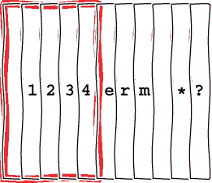
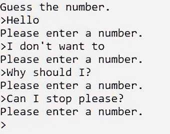
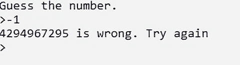
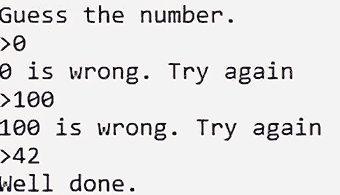
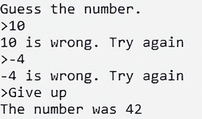
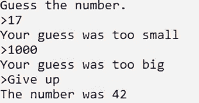
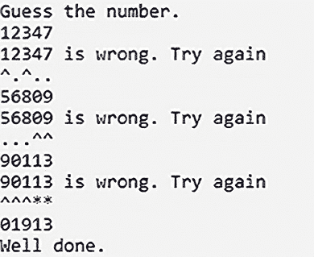

# 3 输入字符串和数字

本章涵盖

+   输入数字和字符串

+   当我们可能没有值时使用`optional`

+   处理随机数

+   进一步练习使用 lambda 和`std::function`

在本章中，我们将编写一个猜数字游戏来练习使用字符串和数字进行输入。我们需要生成一个随机数字来猜测，接受玩家的输入，并报告玩家的猜测是否正确。我们将确保猜测实际上是一个数字，因此我们将学习如何处理字符串和数字。如果猜测错误，我们将给出提示，从“太大”或“太小”开始，然后添加更多提示，例如有多少位是正确的。对随机数的简要介绍将为后续章节奠定基础，并且我们将在过程中学习更多 C++特性。

## 3.1 猜测一个预定的数字

我们将从猜测一个固定数字开始。猜测一个永远不会改变的数字并不是一个很有趣的游戏，但这意味着我们可以专注于处理用户输入。如果我们把预定的数字放入一个函数中，我们以后可以改变它。

列表 3.1 一个要猜测的数字

```
unsigned some_const_number()
{
    return 42;
}
```

随意选择另一个数字。我们不需要一个完整的函数来做这件事，但这可能比发送硬编码或*魔法*数字的猜测游戏代码更清晰。我们稍后会用随机数替换它。现在，我们只需要做一些用户输入，看看它是否匹配。

### 3.1.1 以困难的方式接受用户输入

在上一章中，我们使用了流插入`operator` `<<`将值发送到屏幕上。`iostream`头文件还通过流提取`operator` `>>`提供输入。我们可以使用此运算符将输入发送到变量中，如下所示：

```
unsigned number;
std::cin >> number;
```

它为所有标准 C++类型定义，就像`operator<<`一样。我们正在尝试将任何键入的内容流式传输到`unsigned`，因为我们的猜测数字是`unsigned`。如果用户输入数字后按 Enter 键，变量可能包含一个数字。在上一章中，我们看到了我们可以将一个负数赋给一个`unsigned`。对于一个有符号数，最高位表示数字的符号，而一个无符号数使用这个位作为值的一部分，所以我们可以说`unsigned int number = -2`，它将编译，但数字在 Visual Studio 2022 中将具有很大的正值，`4294967294`。此外，输入可能不是一个数字，甚至可能太大而无法适合我们选择的数值类型。这表明直接将流式传输到`unsigned`是一个坏主意，但我们可以通过一些额外的工作来说服它相对良好地表现。我们将在下一节尝试替代方法。

让我们看看如果我们坚持直接将输入到 `unsigned` 中，我们能走多远。操作符会跳过任何初始空白，然后消费字符直到按下 Enter，如图 3.1 所示。如果只有初始空白和一些数字，一切正常。空白被忽略，数字被转换成一个存储在 `unsigned` 变量中的值。然而，如果输入不适合 `unsigned`，会发生两件事：输入流处于错误状态，并且它有未使用的字符需要清除。



图 3.1 将流输入到 `unsigned` 中会跳过初始空白，接受尽可能多的数字，然后忽略其他任何内容，留下流中的未使用字符。

一旦遇到不合适的字符，就会设置一个标志，我们可以通过调用 `std::cin .fail()` 直接检查这个标志。我们也可以通过检查 `(std::cin >> number)` 是否为真来使用操作符的显式转换为 `bool`。流的转换是通过一个 `explicit operator bool` 进行的，这意味着它可以被*显式地*转换为 `bool`。CppReference ([`mng.bz/W164`](http://mng.bz/W164)) 将这种检查描述为惯用法。操作符被标记为 `explicit`，这意味着我们需要在一个期望 `bool` 的上下文中，例如 `if` 或 `while`，这意味着我们不会意外地将流转换为 `bool`。如果发生错误，我们需要清除失败标志并使用 `ignore` 函数清除坏字符。该函数接受两个参数：要提取的字符数和一个停止的定界字符，因此我们希望提取尽可能多的字符，并在换行符 `'\n'` 处停止。然后我们可以循环直到用户输入合理的内容。将这一切组合起来并包括 `limits` 和 `iostream` 头文件，我们得到以下内容。

列表 3.2 从标准输入读取数字

```
unsigned input()
{
    unsigned number;
    while (!(std::cin >> number))                                  ❶
    {
        std::cin.clear();                                          ❷
        std::cin.ignore(
            std::numeric_limits<std::streamsize>::max(), '\n');    ❸
        std::cout << "Please enter a number.\n>";
    }
    return number;                                                 ❹
}
```

❶ 流入字符并检查是否没有失败

❷ 清除失败标志

❸ 清除无效输入

❹ 如果我们退出循环，则返回一个数字

带着从列表 3.1 中预定的初始数字，我们可以使用列表 3.2 中的输入函数创建一个猜谜游戏。

列表 3.3 尝试编写一个数字猜谜游戏

```
void guess_number(unsigned number)
{
    std::cout << "Guess the number.\n>";
    unsigned guess = input();
    while (guess != number)                 ❶
    {
        std::cout << guess << " is wrong. Try again\n>";
        guess = input();
    }
    std::cout << "Well done.\n";            ❷
}
int main() 
{
    guess_ number(some_const_number());     ❸
}
```

❶ 当猜测错误时循环

❷ 只有在猜测正确时才退出循环

❸ 使用预定的数字调用我们的猜测函数

我们可以玩游戏，但也可以进行一些改进。我们确保输入了一个数字。如果我们尝试一些乱码，我们会一次又一次地被告知，直到我们输入一个数字，如图 3.2 所示。



图 3.2 如果我们不输入数字，我们会陷入循环。

现在尝试一个负数，例如 `-1`。图 3.3 显示了发生了什么。



图 3.3 猜测一个负数并不像预期的那样工作。

我们知道为什么会发生这种情况；当我们将`-1`赋值给一个`unsigned`时，它会回绕。我们可以通过将类型更改为`int`来修复这个问题。如图 3.4 所示，如果我们尝试一些其他非负数，并以我们不太随机的数字`42`结束，我们就赢了。



图 3.4 假设我们避免不良输入，我们可以玩一个相当可预测的游戏。

我们有一个类似数字猜谜游戏的样子，但最好给用户一个表明他们放弃的方式。通过改变输入函数，我们可以使数字输入成为*可选的*，这样用户就可以更容易地停止游戏。

### 3.1.2 接受可选的数字输入

`cin`中的`c`代表字符。我们不是直接将字符流输入到数值类型中，而是将字符流输入到一个字符串中。如果我们包含`string`头文件，我们可以这样接受输入：

```
std::string in;
std::cin >> in;
```

`string`将包含用户输入，但`cin`会在空白处停止。如果我们输入“Hello, World!”，字符串将只包含“Hello，”剩下的输入将留给我们，以便流到另一个`string`或忽略。我们可以这样获取整行：

```
std::string in;
std::getline(std::cin, in);
```

这将收集每一行中的每个字符，包括空白，直到行尾，将行尾之前的字符留给我们放入`std::string in`中。然后我们可以选择如何处理整行。

因为我们想将输入与一个数字进行比较，我们需要做些事情来转换输入。如果我们编写一个适当的函数，称为`read_number`，它接受一个流，我们处理包含`sstream`头文件后从`getline`得到的字符串：

```
std::istringstream in_stream(in);
auto number = read_number(in_stream);
```

我们如何实现这个`read_number`函数？有各种方法尝试从字符串或流中解析整数。与`IOStreams`一起工作可能会很快变得非常复杂。Angelika Langer 和 Klaus Kreft 写了一本名为《标准 C++ IOStreams 和 Locales：高级程序员指南和参考》（Addison-Wesley Professional；2000）的书，对这一主题进行了深入探讨。这是一本很大的书，反映了这一主题的复杂性。为了使事情简单，我们将在这里使用`std::optional`，这将使我们的生活更容易。

`optional`类型是在 C++17 中引入的，它位于`optional`头文件中。它有时被描述为一种*词汇类型*，与`std::any`和`std::variant`一起。它们是模板，所以需要传入一个类型作为参数。在图 3.3 中看到响应之后，我们知道我们应该使用整数而不是无符号整数，因此我们将使用有符号整数作为模板类型：

```
std::optional<int> value;
```

这没有值。我们可以通过显式检查`has_value()`成员函数或使用`explicit`运算符`bool`来查看`optional`是否有值；换句话说，在`if`或`while`表达式或类似表达式中使用`optional`。这与之前使用的流具有类似的语义。值得注意的是 C++语言和库中的模式。它们可以通过向我们展示合理的途径来告知我们的代码。没有值可能是合法的，但我们可以用整数初始化值

```
std::optional<int> value = 101;

```

或者更改值：

```
value = -2;
```

这允许`optional`可能包含一个值。一些函数式编程语言有`maybe`类型的概念。如果我们使用可选类型，我们不需要为表示变量未设置而保留值。`operator bool`将返回`true`如果值已设置。如果我们想使用这个值，我们调用`value`函数：

```
int actual_value = value.value();
```

如果`optional`不包含值，我们将得到一个异常。如果它包含值，我们将得到一个数字。

我们现在可以编写一个函数来从流中读取数字。我们可以在函数外部使用`getline`来形成一个流，读取整个输入行，或者在`read_number`函数中整理非数字输入。如果我们这样做，我们就不需要在调用函数时记住做这件事。我们新的函数看起来像这样。

列表 3.4 获取可选输入

```
std::optional<int> read_number(std::istream& in)
{
    int result{};                                                   ❶
    if (in >> result) {                                             ❷
        return result;                                              ❸
    }
    in.clear();                                                     ❹
    in.ignore(std::numeric_limits<std::streamsize>::max(), '\n');   ❹
    return {};                                                      ❺
}  
```

❶ 将 int 初始化为零。

❷ 尝试读取一个数字

❸ 返回一个 int（作为可选）

❹ 整理

❺ 否则返回一个空的可选

注意我们在倒数第二行返回了一个空的可选。如果我们返回`result`，我们返回的是一个`int`，因此`optional`将有一个值，这样就违背了使用`optional`来表示用户想要停止猜测的目的。

通过将流发送到读取函数而不是将其固定到标准输入，我们给自己提供了选择。例如，我们可以在函数外部使用`std::stringstream in_stream(in)`来获取整个输入行，并将其发送进来。这意味着我们仍然知道用户输入了什么。我们决定如果流不包含数字就清除它，所以如果直接发送`cin`，我们就失去了输入。这对我们的游戏来说已经足够好了，但我们可以看到我们在这里有选择。

如果用户输入一个数字，我们的新函数将返回一个带有值的`optional`；否则，返回一个空的`optional`。我们可以在`while`循环中检查空的可选：

```
while (guess = read_number(std::cin))    
```

这样我们就可以在玩家没有输入数字时跳出循环并停止请求猜测。注意，一些编译器在我们将赋值的结果用作条件时可能会发出警告，尤其是在使用带有警告标志 `-Wparentheses` 的 clang 或 GCC 时。使用第二组括号表示我们确实打算检查所赋的值，从而停止警告：

```
while ((guess = read_number(std::cin)))    
```

如果玩家放弃，我们甚至可以说出这个数字。将这些放在一起，我们就有了一个稍微更好的游戏代码。

列表 3.5 允许放弃

```
void guess_number_or_give_up(int number)
{
    std::cout << "Guess the number.\n>";
    std::optional<int> guess;
    while (guess = read_number(std::cin))                ❶
    {
        if (guess.value() == number)
        {
            std::cout << "Well done.";
            return;                                      ❷
        }
        std::cout << guess.value() << " is wrong. Try again\n>";
    }
    std::cout << "The number was " << number << "\n";    ❸
}

int main()
{
    guess_number_or_give_up(some_const_number());
}
```

❶ 如果输入不是数字，则退出循环

❷ 如果猜测正确，则停止

❸ 告诉玩家数字

如果我们现在玩游戏，我们可以通过输入“放弃”或任何非数字输入来放弃（图 3.5）。



图 3.5 玩家现在可以选择放弃并找出数字。

我们的游戏可以工作，但如果在玩家猜错时给出提示会更好。一旦我们有了这个，我们就可以准备深入研究使用随机数了。

### 3.1.3 使用 std::function 和 lambda 进行验证和反馈

如果猜测错误，它要么太大要么太小。我们可以在原地检查这一点，但使用验证函数给我们更多的灵活性。虽然我们在这里只会报告数字太大或太小，但当我们创建质数猜测游戏时，我们将在最后一节添加各种其他反馈。我们再次使用 lambda，并看看如何将其发送到我们的猜测游戏。

我们想改变我们的函数签名，使其看起来像这样：

```
void guess_number_or_give_up(int number, *lambda message*)
```

然而，没有 lambda 关键字。每个 lambda 都有一个独特的类型，因此我们需要另一种方式来表达我们可以调用某些内容，比如一个函数或 lambda，这被称为*可调用*，作为我们的第二个参数。我们可以使用模板：

```
template<typename T>
void guess_number_or_give_up(int number, T message)
```

然而，这并没有表达出消息是可调用的。我们可以使用*概念*来约束模板类型，提供一种替代方法，我们将在下一章中探讨。现在，我们将使用`std::function`。这将帮助我们更好地理解 lambda。

`std::function`是一个模板，提供对 lambda、命名函数或任何可调用对象的通用包装器。我们需要在模板中指定返回和参数类型。对于我们的游戏，我们有一个数字和一个猜测，它们是消息函数的输入，我们想要返回一个要显示的消息，它可以是`string`。对于命名函数，签名看起来像这样：

```
std::string message(int, int);
```

返回类型首先，然后是函数名和参数（在我们的例子中是两个`int`）。要创建`std::function`，我们需要包含`functional`头文件并声明一个具有相同签名的函数包装器：

```
std::function<std::string(int, int)> callable;
```

模板参数`std::string(int, int)`看起来像命名函数，但没有名称。我们像调用任何函数一样调用`callable`：

```
auto message = callable(1, 2); 
```

因为我们没有指定`callable`应该做什么，所以它是一个*空*函数，因此会抛出异常。这反映了`optional`的行为。我们可以用 lambda 初始化`callable`：

```
std::function<std::string(int, int)> callable = [](int number, int guess) { 
    return std::format("Your guess was too {}\n",
        (guess < number ? "small" : "big")); 
};
```

函数不再为空，我们可以安全地调用它。注意我们再次使用了 `std::format`。第 2.2.5 节提供了关于如果您的编译器还不支持 `std::format`，如何使用 `fmt` 库的说明。别忘了您需要将 `std::format` 改为 `fmt::format`，并包含 `fmt/core.h` 头文件而不是标准的 `format` 头文件。现在我们可以为我们的游戏添加一个额外的参数，以便在玩家的猜测错误时提供线索。

列表 3.6 如果猜测错误则提供线索

```
void guess_number_with_clues(unsigned number, 
        std::function<std::string(int, int)> message)
{
    std::cout << "Guess the number.\n>";
    std::optional<int> guess;
    while (guess = read_number(std::cin))
    {
        if (guess.value() == number)
        {
             std::cout << "Well done.";
             return;
        }
        std::cout << message(number, guess.value());       ❶
        std::cout << '>';                                  ❷
    }
    std::cout << std::format("The number was {}\n", number);
}
```

❶ 如果猜测错误则显示消息

❷ 在消息后添加提示

我们还需要更改我们的 `main` 函数，通过一个 lambda 函数提供消息。我们可以直接发送它，或者使用 `auto` 在单独的一行上声明 lambda。

列表 3.7 改进的数字猜测游戏

```
int main()
{
    auto make_message = [](int number, int guess) { 
        return std::format("Your guess was too {}\n",
            (guess < number ? "small" : "big")); 
    };
    guess_number_with_clues(some_const_number(), make_message);
}
```

为什么我们声明 `message` 为 `auto` 而不是指定 `std::function<std:: string(int, int)>`？尽管这减少了输入量，但这里也有一个重要的观点需要注意。lambda 或 *闭包* 的类型是我们无法命名的，但 `auto` 会为我们推断出确切的类型。两个具有相同参数和相同返回类型的 lambda 实际上具有不同的类型。然而，两个 lambda 都可以赋值给同一个 `std::function`。这对我们的目的很有用，但也有缺点。lambda 可以内联，避免函数调用的开销。如果我们把 lambda 复制到 `std::function` 中，它就不再可以内联，所以调用它可能会更慢。将我们的 lambda 复制到 `std::function` 也可能涉及动态内存分配。Scott Meyers 在他的书 *Effective Modern C++*（O’Reilly Media，2014）中的“项目 5：优先使用 auto 而不是显式类型声明”中提供了全部细节，我们已经知道我们几乎总是应该使用 `auto`。如果我们将 lambda 声明为 `auto`，我们可以避免开销，尽管它将在方法调用中复制到 `std::function`。实际上，我们可以将列表 3.6 中的函数签名更改为使用 `auto`：

```
void guess_number_with_clues(unsigned number, auto message);
```

我们现在几乎总是使用 `auto` 的另一个原因。虽然我们已经失去了消息生成器是一个可调用函数的想法，但一旦我们对概念有所了解，我们就可以解决这个问题。对于急于求成的人来说，我们可以包含概念头文件，并说

```
void guess_number_with_clues(unsigned number,
    std::invocable<int, int> auto message)
```

以获得如果传递无法用两个整数调用的东西时的有用编译器错误。我们将在下一章中看到更多概念。对于有耐心的人，有一个提议要引入 `std::function_ref` 作为 `std::function` 的替代方案，以克服性能问题 ([`mng.bz/wjgg`](http://mng.bz/wjgg))。C++ 正在继续发展，使我们的生活变得更简单。然而，我们如何制作消息，现在当我们尝试猜测数字时（图 3.6）我们会得到线索。



图 3.6 游戏现在提供线索并允许玩家放弃。

现在我们有一个功能正常、但有些无聊的猜数字游戏。我们可以通过选择一个随机数来猜测来改进它。

## 3.2 猜测一个随机数

C++11 引入了一个随机数库。与 C 的 `rand` 函数相比，使用它需要更多一些努力，但它提供了许多不同的方式来生成具有各种有用特性的随机数。本节将展示如何从众多分布中获取一个随机数。我们需要选择一个种子，选择一个引擎，并决定使用哪种分布。我们将在第六章中更详细地研究分布。本节为这些内容奠定了基础。

### 3.2.1 设置随机数生成器

对于我们的猜数字游戏，我们想要一个随机整数。从区间中选取随机数会很方便，并且任何数字都应该有相同的可能性，因此我们将使用 *均匀* 整数分布，称为 `uniform_int_distribution`。这种分布适合模拟掷骰子，每次掷骰子需要一个介于 1 和 6 之间的数字，且不偏向任何结果。它在需要等可能整数的任何情况下都很有用，例如在我们的游戏中选择一个数字让我们猜测。

每个分布都是一个模板，用于生成特定类型的数字。`uniform_int_distribution` 限制为整数类型。还有一个类似的 `uniform_real_distribution` 用于浮点数或双精度浮点数。我们将使用整数并请求介于 `1` 和 `100`（包括）之间的数字：

```
std::uniform_int_distribution<int> dist(1, 100);
```

C 的 `rand` 函数不支持区间，而我们通常希望使用随机数。例如，掷骰子需要一个介于 1 和 6 之间的数字，或者从一副牌中抽牌需要一个介于 1 和 52 之间的数字。C++在这里帮了我们，允许我们明确指定。

为了提供数字，分布需要一个引擎或生成器。引擎提供随机数。是的，为了生成随机数，分布需要提供随机数。分布使用概率函数来确保数字是均匀的或遵循请求的任何分布。对于范围内的均匀数，分布会将引擎提供的数字压缩或转换到请求的区间。如果我们使用 C 的 `rand`，我们就必须自己将数字压缩到区间。

我们不能从函数中生成真正的随机数，因为每次调用返回不同值的函数通常会被视为一个错误。那么随机数引擎是如何工作的呢？我们可以通过编写一个以种子开始并执行一些算术以生成新数字的函数来生成 *伪随机数*，同时记住这个新数字以便下一次调用。最终，如果数字与原始种子匹配，数字将开始重复。许多伪随机数生成器使用多项式函数结合一些模运算。我们自己可以编写一个生成器。

列表 3.8 一个糟糕的随机数生成器

```
int random_number(int seed = 0)
{
    static int x = 0;   ❶
    if (seed)
        x = seed;

    x = ++x % 2;        ❷
    return x;
}
```

❶ 静态存储，用于保存下一次调用的数字

❷ 从最后一个值生成新值

这是一个糟糕的随机数生成器，因为它只会返回 `0` 或 `1`，这些值交替出现。我们可能会得到 `0,` `1,` `0,` `1, ...` 或 `1,` `0,` `1,` `0,` ... 取决于种子。由于它每两个数字重复一次，它有一个 *周期* 为两个。幸运的是，C++ 提供了几个做得更好的引擎，包括简短命名的 `mt19937` 引擎。`mt` 代表 Mersenne Twister。这些生成器在它们的模数部分使用 Mersenne 基数，这些基数是 2 的幂次方减一，并且它们的计算步骤比我们的增量 `++x` 要好得多。这个引擎提供了一个 2¹⁹⁹³⁷ - 1 的周期。我们也可以使用 `std::default_random_engine`，这可能是 `mt19937` 引擎。

有多种方式来设置随机数引擎的种子。如果我们坚持使用特定的数字，那么每次运行都会得到相同的随机数序列。通过提供相同的种子来重新生成伪随机数序列的能力对于模拟和测试很有用，因为每次运行的结果都是相同的。我们可以使用当前时间来在每次运行中获得不同的数字，但我们还没有学习 C++ 中的时间。我们将在下一章中学习。`random` 头文件提供了一个 `random_device`，它本身就是一个随机数生成器，产生 *非确定性* 随机数。CppReference 指出，它每次被调用时可能会生成相同的数字序列（[`mng.bz/84RZ`](http://mng.bz/84RZ)）。一些较旧的实现总是返回 `0`，所以如果你多次调用它，检查你是否得到了不同的数字是值得的。随机设备可能会使用你的硬盘状态或类似的物理组件来生成数字。CppReference 也警告我们，尽管它生成随机数，但它被设计为生成种子，因为重复调用它可能会反复生成相同的数字。

在包含 `random` 头文件后，我们使用随机设备来为我们的随机数生成器设置种子：

```
std::random_device rd;
std::mt19937 engine(rd());
```

这为我们提供了所需的引擎或生成器，以便使用分布。

### 3.2.2 使用随机数生成器

拥有种子和引擎后，我们现在可以从分布中抽取一个数字。我们通过调用分布的 `operator()` 来完成此操作。

列表 3.9 生成单个随机数

```
int some_random_number()
{
    std::random_device rd;                              ❶
    std::mt19937 engine(rd());                          ❷
    std::uniform_int_distribution<int> dist(1, 100);    ❸
    return dist(engine);                                ❹
}
```

❶ 获取随机数的设备

❷ 使用设备种子引擎

❸ 选择数字的分布

❹ 我们实际的随机数

生成一个数字需要相当多的代码，但在我们能够请求一个随机数之前，我们需要一个种子、一个引擎和一个分布。在这里我们不能用更少的代码来解决问题。在未来的章节中我们也会使用随机数，所以我们将得到更多的实践机会。现在，如果我们想要几个随机数，我们可以在构造函数中创建一个类，并设置种子和分布，每次我们需要一个新的数字时，从成员函数中调用`dist(engine)`。我们将在第五章创建一个类，这里只需要一个数字，所以这个函数符合我们的需求。

注意到 C++给了我们比 C 函数更多的控制。我们可以将引擎切换为另一个重复频率较低的引擎，尽管`mt19937`在这里是合适的，因为我们只需要一个数字。我们还指定了随机数应该来自的范围。前三行是设置，我们只需要做一次。如果我们想要另一个随机数，我们再次调用`dist(engine)`而不需要设置。如果我们多次调用这个函数并记录结果，我们会看到 0 到 100 之间的数字以大约相等或均匀的比例生成。

我们现在可以通过在`main`函数中调用新函数而不是`some_const_number`来使我们的游戏稍微更具挑战性，同时保持其他一切不变。

列表 3.10 一个随机数猜测游戏

```
int main()
{
    auto message = [](int number, int guess) {
        return std::format("Your guess was too {}\n",
            (guess < number ? "small" : "big")); 
    };
    guess_number_with_clues(some_random_number(), message);    ❶
}
```

❶ 可能这次不是 42

我们可以更改消息以提供不同的线索（例如，数字是奇数还是偶数，或者我们可以跟踪猜测次数，以提醒用户他们是否已经尝试了一个数字）。我们在这里不会这样做，但我们可以看到传递消息如何使代码相对灵活。我们将要做的是生成一个素数来猜测。因此，我们将学习如何生成具有所需属性的随机数，在这种情况下，是一个素数，并且如果数字错误，我们将提供线索。

## 3.3 猜测一个素数

为了更多地练习随机数，我们将生成一个素数来猜测。如果玩家猜错了，我们将说明哪些数字是正确的。这将给我们更多的机会练习我们的消息 lambda。

### 3.3.1 检查数字是否为素数

我们需要调整生成数字的函数，以便猜测我们是否想要一个素数。我们不能再像在 3.9 列表中那样立即返回`dist(engine)`，而是首先检查这个数字是否是素数。如果是，我们就返回它；否则，我们尝试另一个随机数，直到我们得到一个合适的数字。我们如何检查一个数字是否是素数？

素数有两个因子。只有一个因子，所以我们可以特别处理这种情况并返回 false。2 是 1×2（或 2×1），所以它恰好有两个因子。这是第一个素数。3 是下一个素数，所以我们可以立即为这两个数字返回 true。之后的任何 2 或 3 的倍数都不是素数。例如，6 可以被 2 和 3 整除，也可以被 1 和 6 整除。因此，我们可以使用`operator%`来检查这些。

数字 4 在检查 2 的倍数时被捕获。因此，我们只需要检查这个数是否是 5 以上的任何数的倍数，因为我们已经涵盖了 2、3 和 4。我们可以跟踪我们找到的素数，而不仅仅是考虑 2 或 3 的倍数，并构建所谓的埃拉托斯特尼筛法。这将更有效率，但这意味着我们需要跟踪素数。我们可以检查到我们的数字的平方根来节省一点时间。检查超过这个范围是没有意义的。例如，数字 35 是 5 乘以 7。从 5 开始检查，我们立即找到一个因子，所以我们可以说 35 不是素数。我们在 35 的平方根之前就找到了这个因子，略小于 6。找到第一个因子后，我们不需要检查 7，因为我们已经找到了 5 并返回了。如果一个因子大于平方根，那么总会有一个小于平方根的因子，我们首先会找到它。我们将对因子的检查组合到一个函数中，如下所示。

列表 3.11 检查一个数是否为素数的函数

```
bool is_prime(int n)
{
    if (n == 2 || n == 3)                      ❶
        return true;

    if (n <= 1 || n % 2 == 0 || n % 3 == 0)    ❷
        return false;

    for (int i = 5; i * i <= n; ++i)           ❸
    {
        if (n % i == 0)
            return false;                      ❹
    }

    return true;                               ❺
}
```

❶ 2 和 3 是素数。

❷ 1 和任何 2 或 3 的倍数都不是素数。

❸ 检查 5 及以上是否是因子

❹ 我们找到了一个因子，所以这个数不是素数。

❺ 如果我们到达这里，我们有一个素数。

我们可以对函数进行其他优化以使其更快，但对于我们的游戏来说这已经足够快了。我们有一种方法来检查一个数是否为素数，但在使用它之前，我们将为这个函数添加一些测试。

### 3.3.2 使用`static_assert`检查属性

我们将添加一个函数来测试我们的`is_prime`函数是否工作。我们可以为测试硬编码一些数字。这意味着我们不是使用任何运行时输入，因此我们可以在编译时运行我们的检查。我们通过在函数签名开头添加关键字`constexpr`（常量表达式）来表示这一点：

```
constexpr bool is_prime(int n)
```

说到一个函数或变量是`constexpr`，意味着它可以在编译时进行评估，从理论上讲。但这可能并不总是如此。一个`constexpr`变量是`const`的，这意味着我们无法改变它的值。对于一个`constexpr`函数，其参数也必须是常量表达式。例如，如果它们直到运行时才被设置，比如通过用户输入，那么评估就不能在编译时发生。因此，`constexpr`表示一个值，或返回值，在可能的情况下既是常量又在编译时计算。因此，使用`constexpr`可以让我们在编译时评估变量或函数。让我们看看如何做。

我们仍然可以在运行时调用我们的函数，但现在我们也可以在编译时检查代码。与我们在上一章中使用 C 的`assert`函数不同，我们可以在测试函数中使用`static_assert`：

```
void check_properties()
{
    static_assert(is_prime(2)); 
}
```

`static_assert`也可以用在其他地方，例如在命名空间中（见[`mng.bz/E97o`](http://mng.bz/E97o)），但为我们的测试创建一个函数可以使它们更容易找到。`static_assert`需要一个常量表达式，例如我们的`constexpr`函数，如果表达式为假，则生成编译器错误。我们可以在`main`函数的开始处添加对`check_properties`函数的调用，并且我们的单个断言在编译时通过，运行时不需要做任何事情。如果我们用非素数，如 4，而不是 2，我们会得到一个编译错误：

```
main.cpp(108,24): error C2607: static assertion failed
```

早期发现和捕获错误始终是一件好事。此外，编译时的评估可以加快运行时。`static_assert`和`constexpr`都是在 C++11 中引入的。后者随着时间的推移变得更加灵活，允许局部变量和循环。在那之前，我们需要使用递归。C++20 随后引入了`consteval`和`constinit`指定符。`consteval`应用于函数，以确保它们在编译时被评估，而`constexpr`可能或可能不在编译时评估。`constinit`应用于变量，确保在编译时初始化。`consteval`函数也被称为*即时函数*，如果它不能在编译时评估，我们会得到一个编译错误。

我们还可以看到声明为`constexpr`的变量：

```
constexpr int x = 41 + 1;
constexpr bool x_prime = is_prime(42);
```

这使得变量在编译时既是常量也是计算的，所以我们不能改变它们。如果我们说`x` `=` `43`来尝试这样做，结果会得到一个编译错误。编译时评估是一个强大的工具。现在的重要点是`constexpr`函数可以在编译时或运行时运行。

现在我们知道了如何测试一个数是否为素数，我们可以使用这个检查来生成一个素数来猜测我们的游戏。

### 3.3.3 生成随机素数

我们在列表 3.9 中看到了如何生成随机数。我们使用`random_device`来初始化一个引擎和一个分布来从范围内选择一个随机数。在 1 到 100 之间，素数并不多，所以我们将范围增加到 99,999，给我们更多的可能素数，最多有五位数。我们不需要返回生成的第一个数，我们需要检查它是否满足我们的要求。我们使用我们的`is_prime`函数，并在一个空的`while`循环中不断尝试，直到我们得到一个合适的数。让我们使用`{}`来初始化一切，以提醒自己关于统一初始化。

列表 3.12 生成素数

```
int some_prime_number()
{
    std::random_device rd;
    std::mt19937 engine{ rd() };
    std::uniform_int_distribution<int> dist{1, 99999};    ❶
    int n{};                                              ❷
    while (!is_prime(n))                                  ❸
    {
        n = dist(engine);                                 ❸
    }
    return n;
}
```

❶ 使用更大的区间

❷ 使用{}默认初始化 n。

❸ 继续直到我们得到一个素数

过滤掉不符合标准的随机数被称为*拒绝抽样*。这是一种生成满足特定属性的随机数的方法。许多分布提供了用于模拟和游戏的随机数，但当一个分布难以用数学公式表示时，拒绝抽样效果很好。

我们现在可以修改我们的猜测游戏，使用随机生成的素数，并适当地调整列表 3.10 中的猜测游戏调用：

```
guess_number_with_clues(some_prime_number(), message);
```

这很好，但我们可以生成更好的提示。我们可以通过一点思考来报告是否有任何数字是正确的。只有 10 个数字，所以我们可以用不同的数字做两次猜测。如果一个新的提示告诉我们哪些数字在数字中，我们就知道要使用哪些数字。我们可能会把它们放在错误的位置，而且可能会有重复，但应该更容易猜出数字。

### 3.3.4 决定哪些数字是正确的

我们将使用字符`^`来表示位置错误的数字，`*`表示位置正确的数字，点表示不存在的数字。如果数字是 12347，而我们猜测的是 23471，我们猜对了所有数字，但它们的位置是错误的。我们会通过显示"`^^^^^`"来表示这一点。如果数字是 78737，而我们猜测的是 87739，我们会显示"^^**"。在猜测下方显示这将给出

```
87739
^^**.
```

第二个 7 和第三个 3 在正确的位置，所以它们得到一个`*`。开头的 7 和 8 位置错误，所以每个都得到一个`^`。最后一个数字，9，是错误的，所以它得到一个点。

要创建提示，我们需要一个函数，该函数接受数字和猜测值，并返回一个字符串。如果我们将数字转换为字符串，我们可以逐个检查数字。有各种方法可以做到这一点，我们将使用`format`。我们想要添加前导零，所以数字和猜测值都是五位数长。我们在上一章中使用了格式说明符`"{: ⁶}"`来用空格填充数字，确保它有六个字符长。`^`表示居中对齐。这次，我们想要右对齐，所以使用`>,`，我们想要 0 而不是空格，给出`"{:0>5}"`。如果我们设置一个由五个点组成的字符串，`std::string matches(5, '.')`，并在正确的数字位置放置星号，我们就走了一半的路。

列表 3.13 函数开始指示哪些数字是正确的

```
std::string check_which_digits_correct(int number, int guess)
{
    auto ns = std::format("{:0>5}", (number));            ❶
    auto gs = std::format("{:0>5}", (guess));             ❶
    std::string matches(5, '.');                          ❷
    for (size_t i = 0, stop = gs.length(); i < stop; ++i)
    {
        char guess_char = gs[i];
        if (i < ns.length() && guess_char == ns[i])
        {
            matches[i] = '*';                             ❸
        }
    }
    return matches;
}
```

❶ 将数字转换为字符串

❷ 以五个点开始

❸ 用星号表示正确的数字

现在我们需要找出是否有任何数字位置错误。如果数字是 78737，而我们猜测的是 87739，我们有两个 7。一个是正确的，所以它得到了一个`*`，另一个是错误的。如果我们把数字中间的 7 改为`*`，我们不会在检查位置错误的数字时使用它。我们可以在第一个循环中做到这一点；然后我们通过第二个循环找到位置错误的数字，用`^`来表示这一点。一旦我们计算出一个数字是位置错误的，我们将它也改为`^`，这样我们就不报告只有一个数字在数字中时有两个位置错误的数字。例如，如果数字是 12347，猜测是 11779，两个 7 都是错误的，但我们要表示我们有一个位置错误的 7，而不是两个：

```
11779
*.^..
```

如果两个 7 都得到`^`，表示它们位置错误，这表明数字中包含两个 7。我们的反馈清楚地表明数字中只有一个 7。

`std::string`有一个`find`方法，如果没有找到匹配的位置，则返回`npos`。一些编译器现在也支持`contains`函数，它更简洁，但我们需要找到数字的位置以避免再次使用它，所以我们需要使用`find`。`find`函数接受要查找的字符和一个起始位置，并返回一个索引。因为我们想从开始搜索，所以我们需要使用起始位置`0`。如果我们得到`npos`，这意味着字符不在那里。我们可以使用具有初始化器的`if`语句在一个`if`语句中完成这个操作：

```
if (size_t idx = ns.find(guess_char, 0); idx != std::string::npos)
```

这是在 C++17 中引入的。它看起来像是一个普通的`if`语句，但有一个初始化语句，后面跟着一个分号，然后是一个条件：`if` `(init;` `condition)`。如果没有这个，我们就必须找到索引，然后检查单独语句中的值。两种方式都行，但具有初始化器的`if`语句可以使代码更紧凑，尤其是通过保持变量的作用域更小，因为变量仅在`if`块内部有效。将查找放置错误的数字的检查添加到前面的列表中，我们得到以下内容。

列表 3.14 显示放置错误的数字

```
std::string check_which_digits_correct(int number, int guess)
{
    auto ns = std::format("{:0>5}", (number));
    auto gs = std::format("{:0>5}", (guess));
    std::string matches(5, '.');
    for (size_t i = 0, stop = gs.length(); i < stop; ++i)
    {
        char guess_char = gs[i];
        if (i < ns.length() && guess_char == ns[i])
        {
            matches[i] = '*';
            ns[i] = '*';                                     ❶
        }
    }
    for (size_t i = 0, stop = gs.length(); i < stop; ++i)    ❷
    {
        char guess_char = gs[i];
        if (i < ns.length() && matches[i] != '*')
        {
            if (size_t idx = ns.find(guess_char, 0);
                idx != std::string::npos)                    ❸
            {
                matches[i] = '^';
                ns[idx] = '^';                               ❹
            }                                                ❺
        }
    }
    return matches;
} 
```

❶ 不要重复计算这个数字。

❷ 现在检查不匹配的猜测

❸ 查找猜测字符

❹ 也不要重复使用这个数字。

❺ `idx`现在已经超出作用域。

我们可以也应该为属性函数添加测试。例如，在包含`cassert`头文件后，我们可以添加一个检查：

```
assert(check_which_digits_correct(12347, 23471) == "^^^^^");
```

本书提供的代码在属性函数中包含几个测试，涵盖了重复和缺失的数字，这里为了简洁省略。

我们现在可以使用我们的函数在猜测游戏中创建线索，并从`main`中调用属性测试。当我们进行这个更改时，我们将返回格式化为五位数的数字。这样，较短的数字会有前导零，所以`^`看起来像是在指向任何放置错误的数字。例如，如果数字是 17231，而我们猜测 1723，我们会看到

```
01723
.^^^^
```

这不是必需的，但它会提醒玩家他们可以使用零。以下列表显示了我们将事物组合在一起时的结果。

列表 3.15 一个更好的数字猜测游戏

```
void guess_number_with_clues(int number, auto message)
{
    std::cout << "Guess the number.\n";
    std::optional<int> guess;
    while (guess = read_number(std::cin))
    {
        if (guess.value() == number)
        {
            std::cout << "Well done.";
            return;
        }
        std::cout << guess.value() << " is wrong. Try again\n";
        std::cout << message(number, guess.value());          ❶
    }
    std::cout <<
        std::format("The number was {:0>5}\n", (number));     ❷
}

int main()
{
    check_properties();                                       ❸
    auto message = [](int number, int guess) {
        return std::format("{}\n",
            check_which_digits_correct(number, guess));
    };                                                        ❹
    guess_number_with_clues(some_prime_number(), message);    ❺
}
```

❶ 显示线索

❷ 以五位数字显示正确的数字

❸ 调用测试

❹ 显示哪些数字是正确的信息

❺ 玩游戏

如果我们玩游戏，我们可以从两个具有不同数字的质数开始，以缩小可能的数字范围。12347 和 56809 涵盖了所有数字，所以它们是好的起始猜测（图 3.7）。



图 3.7 从两个具有不同数字的质数开始，以缩小可能的数字范围。

### 3.3.5 使用 std::function 提供不同的线索

现在，90113，如图 3.7 所示，不是一个质数。我们可以轻松地将这个检查添加到我们的信息中。

列表 3.16 一条较长的信息

```
auto get_message = [](int number, int guess) {
    return std::format("{}\n{}\n",
        is_prime(guess) ? "Prime" : "Not prime",      ❶
        check_which_digits_correct(number, guess));   ❷
};

guess_number_with_clues(some_prime_number(), get_message);
```

❶ 猜测的数是质数吗？

❷ 哪些数字是正确的？

我们可以进一步扩展，但是将许多单独的检查添加到单个 lambda 中是一个坏主意。当我们需要一个小函数时，lambda 是好的，但我们不应该让它们变得难以控制。我们需要不同的方法。由于数字不会超过五位数，我们可以添加一个长度检查。因此，我们正在尝试检查三件事，并在每种情况下返回一条消息。我们可以使用两个单独的 lambda 来检查长度和数字是否为质数，一个用于猜测并返回一个字符串。

列表 3.17 检查长度以及数字是否为质数

```
auto check_prime = [](int guess) {
    return std::string((is_prime(guess)) ? "" : "Not prime\n");
};

auto check_length = [](int guess) {
    return std::string((guess < 100000) ? "" : "Too long\n");
};
```

列表 3.14 提供了有关哪些数字是正确的线索，但它需要数字以及猜测。如果我们捕获要猜测的数字，我们可以使用 lambda 的闭包特性来创建一个接受单个整数的匿名函数。我们在 2.3 节首次遇到 lambda 时看到了 `[=]` 和 `[&]` 用于按值和按引用捕获。我们可以说 `[number]` 来表示按值捕获变量 `number`，因为我们捕获特定变量时没有使用 `=` 符号。我们可以使用 `[&number]` 来表示按引用捕获 `number`。无论如何，我们都有 *封装* 了我们的函数，接受两个数字，包括要猜测的数字来创建一个新的函数。

列表 3.18 捕获数字

```
int number = some_prime_number();
auto check_digits = number {     ❶
    return std::format("{}\n", 
        check_which_digits_correct(number, guess));
};
```

❶ 通过复制捕获数字

现在我们有三个 lambda，它们接受一个整数并返回一个字符串。将它们放入容器中，如 `vector`，将很好，这样游戏可以遍历线索，并可能添加更多检查。但是，`vector` 将包含什么类型呢？我们知道每个 lambda 都有不同的类型，但如果我们包含 `functional` 和 `vector` 头文件，我们可以将它们强制转换为 `std::function` 并放入容器中。猜谜游戏可以检查线索并只显示第一个。如果我们首先检查数字是否为质数，我们可以强制猜测是质数，并在另一次猜测之前避免提供更多线索。因此，我们需要对我们的猜测函数进行轻微的修改，以调用消息。

列表 3.19 使用所有线索

```
void guess_number_with_more_clues(int number, auto messages)
{
    std::cout << "Guess the number.\n>";
    std::optional<int> guess;
    while (guess = read_number(std::cin))
    {
        if (guess.value() == number)
        {
            std::cout << "Well done.";
            return;
        }
        std::cout << std::format("{:0>5} is wrong. Try again\n",
                                 guess.value());
        for (auto message : messages)            ❶
        {
            auto clue = message(guess.value());
            if (clue.length())                   ❷
            {                                    ❷
                std::cout << clue;               ❷
                break;                           ❷
            }
        }
    }
    std::cout << std::format("The number was {:0>5}\n", (number));
}
```

❶ 获取消息

❷ 仅显示第一个线索

现在我们可以调用我们的游戏，在 `main` 函数中调用我们的测试代码之后。

列表 3.20 整合所有内容

```
int main()
{
    check_properties();
    auto check_prime = [](int guess) {
        return std::string((is_prime(guess)) ? "" : "Not prime\n");
    };

    auto check_length = [](int guess) {
        return std::string((guess < 100000) ? "" : "Too long\n");
    };

    const int number = some_prime_number();
    auto check_digits = number {
        return std::format("{}\n",
             check_which_digits_correct(number, guess));    
    };
    std::vector<
        std::function<std::string(int)>
    > messages                                         ❶
    {
        check_length,
        check_prime,
        check_digits 
    };
    guess_number_with_more_clues(number, messages);    ❷
}
```

❶ 对齐检查和线索

❷ 玩游戏

有一些质数开始玩会更容易。尝试 12347 和 56809，因为它们使用了所有数字。我们可以自由地忽略任何线索，所以我们可以尝试找出我们首先需要哪些五个数字。

将 lambda 强制转换为 `std::function` 并非理想选择，正如我们在 3.1.3 节中看到的，因为它不能再内联。当我们学习到最后一章的模板参数包时，我们将看到另一种方法。现在，我们已经了解了输入和输出，以及字符串、整数和向量。我们还可以生成随机数。我们将学习如何处理时间，并继续构建我们的 C++ 知识。

## 摘要

+   字符输入来自 `std::cin`，可以被流式传输到特定类型，但我们需要检查错误并清理未使用的输入。

+   使用 `std::getline` 来获取整行文本，包括空白字符。

+   `std::optional` 可以用于可能未设置的值。

+   `std::cin` 和 `std::optional` 都有一个 `explicit operator bool`，这使得我们能够轻松地检查错误或缺失的值。

+   在语言和库中寻找常见模式，以指导自己的代码。

+   C++中的随机数需要同时有一个引擎和一个分布。

+   可以用 `std::random_device` 来初始化随机数生成器。

+   接受采样是一种快速选择满足特定属性随机数的方法，如果不可用合适的分布。

+   一些表达式可以在编译时计算，因此用 `constexpr` 标记它们是个好主意。

+   使用 `static_assert` 在编译时检查表达式。

+   可以将 lambda 存储在 `std::function` 中，但这可能会使代码更大、更慢。
