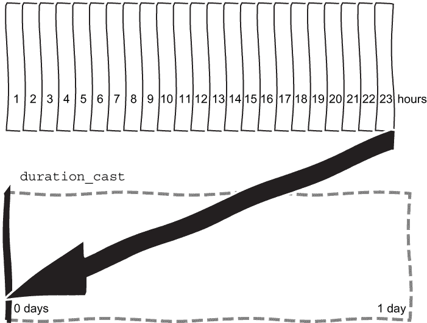
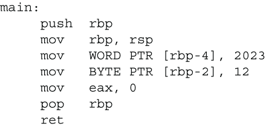

# 4 时间点、持续时间和文字

本章涵盖

+   使用`std::chrono`时间点和持续时间

+   使用比率

+   使用文字后缀

+   使用重载的`operator/`创建日期

+   时间点和持续时间的输入和输出

+   使用不同的时区

在本章中，我们将编写一个简短的程序来创建一个事件倒计时。为此，我们将使用`chrono`头文件中的时间点和持续时间。这个特性是在 C++11 中引入的，尽管本质保持不变，但随着时间的推移，已经添加了几个有用的功能。霍华德·欣南特是这个特性的主要作者和设计师。在 2019 年的 Meeting C++演讲中，他提供了很多关于其设计的背景信息（[`www.youtube.com/watch?v=adSAN282YIw`](https://www.youtube.com/watch?v=adSAN282YIw)）。随着我们使用`chrono`，我们将学习到许多适用于许多其他情况的重要惯用和途径。

在第一部分，我们将构建一个简单的倒计时，然后更深入地探讨我们所使用的类型。我们将发现如何使用比率模板来理解持续时间。然后我们将学习如何读取日期，以便我们可以为任何事件倒计时并打印出各种单位的倒计时。我们将了解用于指定天数、月份等的文字后缀及其用途。我们还将遇到*需求*的概念，并触及相关概念。在涵盖了这些新的 C++特性之后，我们将使用时区时间完成一个倒计时。

## 4.1 一年最后一天还有多久？

我们将首先找出距离特定年份结束还有多久，以获得基本的倒计时。我们只需要少量代码，所以本章的项目在代码行数上很小。然而，随着我们编写代码，我们将扩展我们的知识。

要找出日期距离某个事件有多远，例如除夕夜，我们需要知道当前时间。`chrono`头文件为我们提供了这样做的方法，提供了日期和时间：

```
std::chrono::time_point now = std::chrono::system_clock::now();
```

其中隐藏着几个细节，我们将在本章中进一步展开。`time_point`是一个类模板，使用时钟和持续时间。我们有选择时钟的选项，每个选项都能为我们计算出时间和日期。我们将在下一节中查看持续时间细节，但就高层次而言，它指定了时间单位，例如秒或天。我们已应用类模板参数推导（CTAD）来避免指定这些模板参数，因此我们需要至少使用 C++17。如果没有它，我们就需要写出完整的类型，`std::chrono::time_point<std::chrono::system_clock>`，或者直接使用`auto`。

什么是时钟？我们正在使用的`system_clock`是基于操作系统的时钟。现在，管理员可以更改系统的时钟，如果系统时间被更改，调用`now`可能会看起来像是回到了过去。这不是问题，但这是值得知道的。每个时钟都有一个名为`is_steady`的成员变量，它告诉我们这种情况是否可能发生。我们可以使用`steady_clock`代替，尽管它更适合计时间隔。还有其他时钟，例如，`high_resolution_clock`提供了最细粒度的滴答声。警告：尽管名字如此，这个时钟可能是一个`system_clock`或`steady_clock`，而不是具有超级小滴答大小的时钟。还有一个`file_clock`用于文件的戳记。不同的文件系统支持不同的分辨率，因此这提供了一种一致的方式来访问此类信息，无论文件系统使用的分辨率如何。在本章中，我们将坚持使用`system_clock`。它提供了一个基于协调世界时（UTC）的全局实时墙钟，并且很容易映射到 C 的`time_t`，允许我们在需要时与 C 库交互。

拥有另一个时间点，我们可以找到它们之间的差异，从而得到一个时间间隔或*持续时间*。例如，如果我们创建一个在年底最后一天的时间点，我们可以找到距离年底最后一天还有多长时间。除夕夜总是在 12 月 31 日，因此我们可以使用 C++20 的`std::chrono::year_month_day`指定一个特定的年份、月份和日期。

列表 4.1 创建特定日期

```
auto new_years_eve = std::chrono::year_month_day(
    std::chrono::year(2022),
    std::chrono::month(12),
    std::chrono::day(31)
);
```

我们很快就会看到如何从`time_point` `now`获取年份，这样我们就可以编写一个更通用和有用的倒计时。首先，我们将找到列表 4.1 中的固定日期和当前`time_point`之间的差异。在我们找到两个日期之间的差异之前，请注意`year_month_day`使用的是*整值习语*。整值习语起源于 Ward Cunningham 的 CHECKS 模式语言([`c2.com/ppr/checks.html`](http://c2.com/ppr/checks.html))，其中提到整值来表示有意义的数量，并由 Martin Fowler 的量模式([`martinfowler.com/eaaDev/Quantity.html`](https://martinfowler.com/eaaDev/Quantity.html))进一步探索，该模式用数量和单位来表示有尺寸的值。我们不是为每个参数使用整数并试图记住构造函数参数的顺序，尽管名字中有一个很大的提示，我们必须显式地将`std::chrono::year`传递给年份参数等等。整值习语创建轻量级类型以确保参数正确传递。如果我们尝试传递一个需要日期的月份，将会产生编译器错误，这可以早期和精确地定位问题。

要比较 `new_years_eve` 与当前日期时间，我们需要将日期转换为另一个 `time_point`。我们只有没有时间的日期，因此我们指定天数作为转换的 `time_point` 的持续时间：

```
auto event = std::chrono::time_point<std::chrono::system_clock, 
                          std::chrono::days>(new_years_eve);
```

我们可以使用 `chrono` 中的两个类型别名之一来使我们的 `event` 定义更简洁。首先，每当我们需要基于系统时钟的时间点时，我们可以使用 `sys_time` 并指定持续时间。因此，我们可以说

```
auto event = std::chrono::sys_time<std::chrono::days>(new_years_eve);
```

第二，如果我们需要具体的日期，我们可以使用 `sys_days` 作为缩写：

```
auto event = std::chrono::sys_days(new_years_eve);
```

无论哪种方式，我们现在都有两个 `time_point`，因此我们可以从中减去以找到差异，并使用 `chrono` 的 `operator<<` 将值流出，该操作符是在 C++20 中引入的。

列表 4.2 两个时间点之间的持续时间

```
#include <chrono>
#include <iostream>

void duration_to_end_of_year()
{
    std::chrono::time_point now = std::chrono::system_clock::now();
    constexpr auto year = 2022;                           ❶
    auto new_years_eve = std::chrono::year_month_day(
        std::chrono::year(year),
        std::chrono::month(12),
        std::chrono::day(31)
    );
    auto event = std::chrono::sys_days(new_years_eve);    ❷
    std::chrono::duration dur = event - now;              ❸
    std::cout << dur << " until event\n";                 ❹
}

int main()
{
    duration_to_end_of_year();
}
```

❶ 现在硬编码一个年份

❷ 转换为时间点

❸ 查找差异

❹ 查找持续时间的 `operator<<`

如果你有一个不支持持续时间 `operator<<` 的旧编译器，你可以在函数的最后一行使用 `count` 方法将值发送到 `cout`：

```
std::cout << dur.count() << " until event\n";
```

或者，你可以在一个合理的位置克隆 Howard Hinnant 的日期库 ([`github.com/HowardHinnant/date`](https://github.com/HowardHinnant/date))：

```
git clone https://github.com/HowardHinnant/date.git
```

从库中包含 "`date/date.h"` 并添加

```
using date::operator<<;
```

当你需要使用流插入操作符时。当你构建代码时，别忘了使用 `-I` 开关指向 `date/include` 目录。

实际输出将取决于我们何时运行列表 4.2，但我们会得到一个数字和一些单位。使用 Visual Studio 2022 给出

```
69579189669221[1/10000000]s until event 
```

数字表示秒的分数，输出中用 `[1/10000000]s` 表示。使用 Compiler Explorer 和 GCC 12.2 ([`godbolt.org/z/8Gj345e3d`](https://godbolt.org/z/8Gj345e3d)) 或 Clang 15.0 ([`godbolt.org/z/9zGvqfhPs`](https://godbolt.org/z/9zGvqfhPs))，我们得到

```
-1508892372000803ns until event
```

自己决定粒度并使用实际的年份，而不是硬编码 2022 年，会更好。我们将在下一节更深入地探讨持续时间以实现这一点。

让我们花点时间来提醒自己我们已经使用了什么。如果我们尝试在第一章中提到的 C++ Insights 上运行代码 ([`cppinsights.io/s/7a85b40e`](https://cppinsights.io/s/7a85b40e))，我们可以看到完整的类型展开。你的编译器可能使用稍微不同的类型和值，但洞察力给出了代码中发生的事情的大致想法。对于这两行

```
auto event = std::chrono::sys_days(new_years_eve);
std::chrono::duration dur = event - now;
```

在列表 4.2 的末尾是以下内容。

列表 4.3 C++ Insights 显示完整类型

```
std::chrono::time_point<std::chrono::system_clock,                    ❶
    std::chrono::duration<long, std::ratio<86400, 1> > >              ❷
        event = std::chrono::time_point<std::chrono::system_clock,
            std::chrono::duration<long, std::ratio<86400, 1> > >
                (new_years_eve.operator time_point());                ❸
std::chrono::duration<long, std::ratio<1, 1000000000> > dur =         ❹
        std::chrono::operator-(event, now);                           ❺
```

❶ 使用系统时钟的时间点

❷ 60*60*24 秒的持续时间

❸ 转换为 sys_days 即天的时间点

❹ Insight 使用长秒和纳秒。

❺ 对时间点进行操作符重载

从 C++ Insights 的输出中我们可以看到，持续时间正在使用比率，因此我们需要从比率开始；然后我们可以更详细地展开持续时间。

## 4.2 详细理解持续时间

当我们从两个时间点中减去时，我们得到了一个时间间隔或`duration`，并显示了其值。`duration`计算一个单位中的*滴*，无论是整数还是浮点数。因此，`duration`被定义为模板，它接受两个类型，每个部分一个：

```
template<class Rep,class Period = std::ratio<1> > class duration;
```

表示，`Rep`，将是一个数值类型，例如`integer`或`float`。`Period`是一个`ratio`，告诉我们如何将滴转换为秒。花点时间详细了解`ratio`类型是值得的；然后我们将更好地准备处理各种持续时间。

### 4.2.1 比率

一分钟有 60 秒。当我们需要分钟时，我们可以将秒数除以 60，但代码中充斥着魔法数字会带来麻烦。如果我们决定想要小时而不是分钟，我们可能找不到它们被使用的所有地方。我们可以编写一个实用函数来完成转换，或者我们可以依赖更通用的东西。60:1 的比率将非常有用。幸运的是，C++在`ratio`头文件中正好提供了我们所需的功能。`ratio`可以用来表示任何有理数，因此它需要两个数字：分子和分母。C++使用这两个数字定义了一个`template`：

```
template<std::intmax_t Num, std::intmax_t Denom = 1> class ratio;
```

`intmax_t`是最大的有符号整数类型，它在不同的实现中可能有所不同。使用`template`允许在编译时进行比率的算术运算。注意，分子和分母都是*非类型模板参数*；在这种情况下，是数字而不是类型。我们可以使用`std::ratio<3, 6>`创建一个 3:6 的比率。如果我们查看分子和分母

```
std::cout << std::ratio<3, 6>::num << '/' << std::ratio<3, 6>::den << '\n';
```

我们会发现比率已经被简化为最简形式，1/2。事实上，辅助方法`ratio_equal`告诉我们两个比率是等价的：

```
bool same = std::ratio_equal<std::ratio<3, 6>, std::ratio<1, 2>>::value;
```

`ratio`头文件还提供了算术函数，例如`ratio_add`，允许我们使用分数等在编译时进行算术运算，例如

```
using fract = std::ratio_add< std::ratio<3, 6>, std::ratio<1, 2>>;
std::cout << fract::num << '/' << fract::den << '\n';
```

这给出了 1/1。

本节开头我们看到的默认持续时间使用 1:1 的比率，`Period` `=` `std::ratio<1>`，相当于每滴 1 秒。`chrono`头文件提供了各种周期，从纳秒到年，每个周期都基于`ratio`头文件中的定义。纳秒是 1/1,000,000,000 秒。计算这样一个数字中有多少个零是容易出错的。幸运的是，`ratio`头文件为我们定义了`std::nano`：

```
std::ratio<1, 1000000000>
```

我们可以使用这个而不是创建我们自己的常量。`ratio`头文件还定义了毫、千以及其他国际单位制（SI）比率。

在 4.3 列表中，我们看到了 C++ Insights 使用`long`表示持续时间和`std::ratio<1, 1000000000>`的周期。对于`system_clock`使用的表示和周期可能因编译器而异，但这并不重要。无论使用什么，我们都可以要求在时间点之间或任何其他持续时间中提供秒数。现在我们可以更改我们的倒计时，以提供我们选择的任何单位。

### 4.2.2 持续时间

我们的倒计时是以秒为单位的分数，但我们可能希望以天或分钟为单位报告。那么我们如何转换持续时间？要获取分钟的持续时间，我们使用 `std::chrono::minutes`，它使用 60:1 的比例。有各种周期可供选择。小时使用 3,600:1，毫秒使用 1:1,000，微秒使用 1:1,000,000。C++20 还引入了天、周、月和年。天和周相对简单，但一个月或一年有多少天？这取决于。C++20 使用 365.2425 天作为一年，30.436875 天作为一个月，正好是 1/12 年。*公历*模型太阳系大约，而 `chrono` 模型公历精确。我们甚至可以编写自己的日历，这些日历可以与 `chrono` 交互操作。霍华德·欣南特在他的 GitHub 页面上提供了示例，包括儒略历和伊斯兰历（[`mng.bz/A89Q`](http://mng.bz/A89Q)）。

我们可以隐式或显式地在持续时间之间切换。从粗粒度到细粒度的时间间隔赋值不会四舍五入，所以隐式转换是有效的：

```
std::chrono::milliseconds ms = std::chrono::hours(2);
```

回到更细粒度的毫秒可能涉及四舍五入，因此我们需要使用命名转换：

```
auto two_hours_from_ms = duration_cast<hours>(ms);
```

这个例子将返回原始的 2 小时。在大多数情况下，从毫秒到小时可能会丢失一些精度。两小时是 7,200,000 毫秒。如果我们只有 7,199,999 毫秒，我们就会低于两小时一个毫秒，所以我们会得到 1 小时而不是 2。同样，23 小时几乎是一个整天，但将其转换为天会四舍五入到零，所以如果我们来回转换，我们会得到 0 小时。

让我们试试这个。我们将添加一个 `using` 指令，这样我们就不需要完全限定 `std::chrono` 中的类型和函数了。然而，不要无意识地这样做，并且永远不要在头文件中这样做。ISOCpp 的核心指南 SF.7 告诉我们不要在头文件的全局作用域中写入 `using namespace`（见 [`mng.bz/xjR6`](http://mng.bz/xjR6)）。这样做可能会将两个名称引入作用域，并导致歧义。在我们的情况下，我们有一个小的函数，所以我们不会引入命名冲突。

那么 23 小时是多少天？我们需要一个 `duration_cast` 来找出。

列表 4.4 使用 `duration` 进行更粗粒度的表示

```
void durations()
{
    using namespace std::chrono;
    auto nearly_a_day = hours{23};                      ❶
    days a_day = duration_cast<days>(nearly_a_day);     ❷
    hours round_trip = a_day;                           ❸
    std::cout << nearly_a_day << " cast to " << a_day 
        << " and cast back to " << round_trip << '\n';
}
```

❶ 几乎是一个整天

❷ 转换为天

❸ 回退 0 小时

从 `main` 中调用 `durations` 来查看

```
23h cast to 0d and cast back 0h
```

`operator<<` 报告 `0d`，表示 0 天，也就是 `0h`，或 0 小时。别忘了你可以使用持续时间的 `count` 方法，或者如果你需要，可以使用 `using date::operator<<`。由于我们不会丢失精度，所以可以直接将天数赋值给小时。所以给定一个整天 `a_day{1}`，我们可以赋值

```
hours n_hours = a_day;
```

并检查它们是否相同：

```
assert(a_day == n_hours); 
```

我们可以使用显式的`duration_cast`而不是直接赋值，但将`duration_cast`的使用仅限于那些会丢失精度的转换是一种很好的方法。这使得如果我们怀疑丢失精度的转换是错误的来源，我们很容易在我们的代码中找到这样的丢失精度转换。当我们可能丢失精度时需要使用`duration_cast`是好事，因为转换使潜在的丢失变得明确，如图 4.1 所示。



图 4.1 将 23 小时转换为天数会丢失精度，因此需要使用`duration_cast`。

我们甚至可以编写自己的`duration`；例如，一个世纪。我们需要提供一个周期类型。一个世纪比一年多 100 倍秒，所以我们需要 1:100 的比例，或者`std::hecto`。然后我们可以使用`ratio`头文件中的`ratio_multiply`来获取所需的类型。`multiply`函数为我们计算适当的分子和分母，因此我们可以使用*类型别名*，即`using`关键字来定义世纪：

```
using centuries = std::chrono::duration<long long, 
     std::ratio_multiply<std::chrono::years::period, std::hecto>>;
```

`using`语句类似于`typedef`的泛化，我们将在第八章中看到更多细节。我们可以像使用任何`chrono`持续时间一样使用我们的世纪持续时间；例如，将世纪转换为秒、小时或天数。秒和小时可以不进行转换直接转换，但要得到天数，我们需要使用`duration_cast`。这可能会令人惊讶，因为一世纪是 100 年，而一年有 365 或 366 个完整的日。然而，C++将一年定义为 365.2425 天，所以一世纪是 36524.25 天，这包含了一部分天数。因此，我们需要显式地使用`duration_cast`。

列表 4.5 定义一个持续时间

```
void defining_a_duration()
{
    using namespace std::chrono;
    using centuries = duration<long long, 
        std::ratio_multiply<years::period, std::hecto>>;        ❶
    centuries two_hundred_years = centuries(2);                 ❶
    seconds sec = two_hundred_years;                            ❷
    hours hrs = two_hundred_years;                              ❷
    days day_count = duration_cast<days>(two_hundred_years);    ❸
    std::cout << "Two centuries is approximately " << day_count << '\n'; 
}
```

❶ 定义和使用一个持续时间

❷ 转换为秒或小时

❸ 持续数日

如果我们运行这段代码，我们会看到

```
Two centuries is approximately 73048d
```

预定义的便利持续时间足以用于倒计时到某个事件，但这个库的精心设计给了我们很大的灵活性。实际上，这个库中还有更多功能可以使我们的生活更轻松。我们不需要完全拼写`std::chrono::month(12)`，因为持续时间和其他类型支持*字面后缀*。让我们更详细地看看字面后缀。

### 4.2.3 字面后缀和运算符/使代码更易读

我们注意到尝试读取包含许多零的数字，如 1000000000，可能会出错，但添加一个数字分隔符，如 1,000,000,000，有助于。C++现在支持数字分隔符，但逗号是一个运算符，所以我们使用单引号：

```
int readable_nano = 1'000'000'000;
```

这是对语言的一个小但有用的补充。在列表 4.4 中，我们使用了

```
auto nearly_a_day = hours{23};
```

这非常易于阅读，但`chrono`也支持字面后缀。通过添加`h`表示小时，我们也可以这样写

```
auto nearly_a_day = 23h;
```

小时字面后缀`'h'`非常直观。两种方法都行。这是怎么工作的？看似神奇的`'h'`是使用了`chrono`中的`operator""h`。这个运算符接受一个数字并返回小时类型的更强类型，实现方式如下：

```
hours operator""h(long long _Val) {
    return hours(_Val);
}
```

当遇到 `23h` 时，这个函数会被调用，给出我们想要的小时数。我们需要使用一个合适的命名空间才能使这个操作生效。我们在这里有选择。我们可以使用以下命名空间之一

+   `std::literals`,

+   `std::chrono_literals`,

+   `std::literals::chrono_literals`,

或者，更简单地说，使用 `std::chrono`，它通过指令使 `chrono_literals` 可见：

```
using namespace std::literals::chrono_literals 
```

`operator""h` 是一个 *用户定义的文法* 的例子，当我们使用 `'h'` 作为数字后缀时，它提供了转换为小时的转换。其他文法也受到支持，包括带有 `'min'` 的分钟和带有 `'s'` 的秒。这些是在 C++11 中引入的，而 C++14 添加了毫秒、微秒和纳秒。这给了我们两种定义持续时间的方法，如表 4.1 所示。

表 4.1 定义特定持续时间的两种方法

| 持续时间 | 文法示例 |
| --- | --- |
| `hours{12}` | `12h` |
| `minutes{34}` | `34min` |
| `seconds{1}` | `1s` |
| `millisecond{1}` | `1ms` |
| `microsecond{1}` | `1us` |
| `nanosecond{1}` | `1ns` |

没有文法可以帮助构建天数、月数或年数。然而，日历中有天、月或年的文法。注意，所有预定义的 `chrono::duration` 类型都是复数形式，而日历类型是单数形式。它们的行为不同。我们可以添加月份，但不能添加一月和十二月。要指定月份，我们可以完整地拼写月份的名称；例如，使用命名常量 `December`。从数值类型进行转换意味着争论是否从 `0` 开始。实际上，C++20 使用 `1` 作为一月的值，但如果我们完整地键入 `January`，我们就不需要记住从哪里开始。日、月和年是 *日历指定符*，它们也可以以两种方式定义，如表 4.2 所示。

表 4.2 定义特定日、月或年的两种方法

| 公历 | 文法示例 |
| --- | --- |
| `year{2023}` | `2023y` |
| `month{1}` | `January` |
| `day{23}` | `23d` |

用户定义的文法扩展了将 `1u` 写作无符号或 `1.0f` 写作浮点数的概念。C++ 标准库提供了时间文法，我们刚刚看到了。我们还有 `'i'` 用于复数；例如，`2` `+` `3i`，或者 `'s'` 用于 `std::string`。是的，还有一个 `operator""s`，它在 `string_literals` 命名空间中，但它接受一个 `const char*`，而 `chrono` 的秒文法接受一个数值类型，所以它们是不含糊的。字符串文法很有用。如果我们用 `"Hello"` 初始化一个变量，我们正在使用一个 `char` 数组。如果我们使用 `"Hello"s` 代替，我们就有了一个直接的 `std::string`。我们也可以通过提供适当的操作符来定义自己的文法；然而，我们必须以下划线开始我们的后缀，以避免与标准文法操作符可能发生的冲突。

在本章的开头，在列表 4.1 中，我们创建了一个日期，明确地指出了年、月和日，而没有使用这些文法：

```
year_month_day(year(2022), month(12), day(31));
```

我们可以将它重写为

```
year_month_day{2022y, December, 31d};
```

事实上，我们还有一个更进一步的选项。`chrono` 库为了使代码可读，使用了一个技巧，那就是重载了 `operator /` 来创建年、月和日。CppReference ([`mng.bz/rjRj`](http://mng.bz/rjRj)) 列出了大约 40 种重载方式来创建各种不同的日期。我们想要一个完整的年、月和日，因此我们可以用英文拼写月份，使用 `'y'` 后缀来指定年份，并用 `'/'` 来分隔日期。例如：

```
auto new_years_eve = 2022y / December / 31;
```

`31`^(st) 在指定了年和月之后不需要 `'d'` 后缀，因为它必须是那一天。`year_month_day` 可以用无数种方式构建，但以下三种顺序适用于完整的日期：

+   年/月/日

+   月/日/年

+   日/月/年

我们将很快使用它来找出距离当前年结束还有多少天。在我们这样做之前，我们将回顾一下章节开头使用的 `time_point`。我们知道 `time_point` 是由 `clock` 和 `duration` 定义的。我们看到了几种不同的时钟，现在我们也知道了 `duration` 的工作方式。尽管我们已经有足够的知识来完成我们的小型倒计时项目，但 `chrono` 的文档使用了 C++ 在许多地方都会出现的特性。特别是，提到了需求，并且使用了看似无害的短语 *as if*。它们是什么意思？

### 4.2.4 需求和概念

我们从使用

```
std::chrono::time_point now = std::chrono::system_clock::now();
```

`time_point` 是一个包含两种类型的类模板，一个是 `clock`，另一个是 `duration`：

```
template<
    class Clock,
    class Duration = typename Clock::duration
> class time_point;
```

当我们找到当前时间时，我们使用了 `system_clock`，而 `duration` 默认为该时钟的 `duration`。

CppReference ([`en.cppreference.com/w/cpp/chrono/time_point`](https://en.cppreference.com/w/cpp/chrono/time_point)) 表示 `time_point` 是 *仿佛* 存储了一个 `duration` 类型的值，表示从 `Clock` 的纪元开始的时间间隔。我们还没有见过 *纪元* 这个词。如果你之前使用过 C 的 `time_t`，你将熟悉从给定时刻（或纪元）开始计数滴答的想法，比如 1970 年 1 月的开始。其他系统从不同的时刻开始。例如，Windows 上的 Excel 使用 1900 年 1 月的开始（[`mng.bz/ddl1`](http://mng.bz/ddl1)）。更重要的是，注意 *仿佛* 这个短语，它在 C++ 中经常出现。仿佛 *规则* 允许编译器在某些情况下重新排序指令或完全删除它们，只要程序的观察行为不会改变。对于一个时钟，实际的实现可以存储任何它喜欢的东西，只要它表现得仿佛存储了一个持续时间。编译器也可以在其他情况下重新排序或删除指令。如果一个程序读取了一个未初始化的变量，编译器也可以做任何事情，因为这通常是未定义的行为，通常简称为 UB。Ovle Maudel 之前写了一篇名为“Demons may fly out of your nose”的短文（[`mng.bz/BAjl`](http://mng.bz/BAjl)），引用了“nasal demons”（来自 Usenet 群组 `comp.std.c`）这个短语，用来表示“C 编译器在遇到未定义构造时的意外行为。”没有人报告过因为未定义行为而鼻子里的鬼飞出来，但奇怪的事情确实发生了。有时仿佛规则意味着编译器可以优化我们的代码，这是好事，而有时它意味着我们有未定义的行为，这是坏事。在两种情况下，注意文档中的“仿佛”。

`time_point` 也使用了一个 `Clock` 类，根据 CppReference 的说明，这必须满足 `Clock` 的 *要求*。现在，确保我们使用的时钟满足这些要求的责任就落在了我们身上；否则，我们可能会遇到鼻涕鬼。如果使用一个“不太像时钟”的东西，一些操作可能仍然可以工作，因此这个要求将在 C++23 中被取消（[`mng.bz/lVBR`](http://mng.bz/lVBR)）。

词语 *要求* 也经常出现，并构成了 *概念* 语言特性的一个部分。我们在第二章中看到了容器，如 `vector` 和算法之间的分离。这种分离是通过模板实现的。算法是通用的，因此可以用于不同类型，在一系列元素上操作。模板允许一种形式的 *鸭子类型*，这是一个经常应用于动态语言的短语，但在我们使用 C++ 中的编译时模板时也同样适用。Stack Overflow ([`mng.bz/D95g`](http://mng.bz/D95g)) 提供了一个精彩的例子。

```
template <typename T> void f(T x) { x.Quack(); } 
```

来说明“如果它看起来像鸭子，叫声像鸭子，那么它就是鸭子”的短语，因此得名鸭子类型。如果我们尝试传递一个没有 `Quack` 函数的对象，我们会得到编译器错误，这可能是有用的，也可能不是。如果我们有方法来指定对象需要 `Quack` 函数，类似于

```
template <typename T> 
T must have a Quack function
void f(T x) { x.Quack(); } 
```

如果使用的对象没有 `Quack` 方法，编译器可以立即停止并通知我们。

使用比 `f` 更清晰的函数名，如果我们有

```
template<typename T> 
void might_be_a_duck(T x) { x.Quack(); }
```

并这样调用它

```
might_be_a_duck(42); 
```

我们将得到错误。根据 Visual Studio 2022，错误信息是 "`left` `of` `'.Quack'` `must` `have` `class/struct/union"`。在这种情况下，找到问题并不那么困难，但使用 `requires` 子句指定的要求会使问题更清晰。为了指定 `Quack` 函数必须存在，我们可以在函数签名中写一个 *概念*，为我们的 *要求* 命名并将其添加到函数签名中。

列表 4.6 编写和使用概念

```
template<typename T>
concept Quacks = requires(T t)    ❶
{
    t.Quack();                    ❷
};

template<typename T>
requires Quacks<T>                ❸
void must_be_a_duck(T x)
{
    x.Quack();
}
```

❶ 命名我们的要求

❷ 指定我们所需的内容

❸ 声明 T 必须实现 Quack

概念命名了我们想要的想法“`T` 必须有一个 `Quack` 函数”。当我们使用它时，我们不需要明确

```
template<typename T> requires Quacks<t> 
```

完整地。如果我们使用 `auto`，我们可以更简洁地表达：

```
void also_must_be_a_duck(Quacks auto x)
{
    x.Quack();
}
```

在任何情况下，`must_be_a_duck(42)` 和 `also_must_be_a_duck(42)` 仍然会导致错误，但这次，Visual Studio 2022 会说

```
no matching overloaded function found, could be 'void must_be_a_duck(T)',  
the associated constraints are not satisfied
```

消息会更加有用。让我们回到时间和倒计时。

C++20 在 `concepts` 头文件中引入了几个命名要求。为了满足时钟要求，必须定义以下四种类型

+   `rep`

+   `period`

+   `duration`

+   `time_point`

时钟还必须支持 `is_steady` 和 `now()`。`chrono` 提供了一个名为 `is_clock` 的类型特性，用于检查是否满足要求。特性描述了类型的属性，我们将在第六章中重新讨论它们。`is_clock` 特性有一个名为 `value` 的布尔成员，它报告类型是否满足要求。如果我们将其应用于一个 `int`

```
std::chrono::is_clock<int>::value
```

`value` 是错误的，因为 `int` 不是一个时钟。尽管 `time_point` 本身并不强制要求，但使用 `time_points` 的其他函数可能会强制要求。当使用这些要求时，编译器可以通过类似 `'Clock` `type` `required'` 这样的消息来指出错误类型的使用位置。因此，时钟要求可以提供更清晰的编译器错误信息。

更普遍地，要求和概念有助于在模板代码无法编译时提供更好的诊断。在上一章中，我们在列表 3.15 中使用了 `auto` 来传递消息提供者：

```
void guess_number_with_clues(int number, auto message)
```

我们从 `std::function` 开始，但需要更通用的东西。函数尝试调用或 *调用* `message` 参数。如果我们传递了一个不可调用的东西，当使用消息时，我们会得到错误，错误发生在我们传递不适当的东西的地方。例如，调用

```
guess_number_with_clues(number, "Help!");
```

在`main`函数内部会报错。Visual Studio 2022 会说，“`term does not evaluate to a function taking two arguments`”；这里的术语是“Help！”我们可以从`concept`头文件中添加`invocable`到函数签名中，表示消息应该可以用两个`int`调用：

```
void guess_number_with_clues(int number,
         std::invocable<int, int> auto message) 
```

通过这个添加，编译器可以更精确地定位问题。Visual Studio 2022 会说，“`message`：`guess_number_with_clues`：`the associated constraints are not satisfied`”。它不仅告诉我们一个术语是错误的，而且还指出了哪个参数是错误的以及原因。

我们在这里只是触及了表面。注意要求，尝试一些其他的概念，并尝试编写自己的代码。现在我们更好地理解了时钟和持续时间，我们将通过报告各种单位的时间来改进到年底的最后一天的倒计时。

### 4.2.5 到年底的最后一天还有多少天？

在 4.2 列表中，我们找到了当前时间并使用`year_month_day`，包括年份在内的每个值都进行了硬编码，来计算

```
std::chrono::duration dur = event - now;
```

我们打印出了这个值，但得到了一个以秒为单位的巨大数字。

现在我们可以将这个时间转换为天数，并且可以使用当前年份而不是硬编码 2022 年。从`system_clock`的`now`方法开始的当前`time_point`给我们一个日期和时间。我们不能直接将其分配给`year_month_day`，因为这会丢失时间部分。我们可以通过先对`now`进行下取整来显式截断时间部分；然后我们可以创建另一个`year_month_day`对象并找出当前年份。将这些组合起来，我们可以找出一年中最后一天还有多少天。

列表 4.7 查找到年底的最后一天还有多少天

```
void countdown()
{
    using namespace std::chrono;
    time_point now = system_clock::now();

    const auto ymd = year_month_day{
        floor<days>(now)                              ❶
    };

    auto this_year = ymd.year();                      ❷
    auto new_years_eve = this_year / December / 31;   ❷

    auto event = sys_days(new_years_eve);
    duration dur = event - now;
    std::cout << duration_cast<days>(dur)             ❸
               << " until event \n ";
}

int main()
{
    countdown();
}
```

❶ 将`now`下取整到天数

❷ 使用当前年份

❸ 转换为天数

运行这段代码会告诉我们离年底的最后一天还有多少天：

```
343d until event
```

调用流插入`operator<<`会给数字添加一个`'d'`后缀。正如我们之前在 4.2 列表之后所提到的，一些较旧的编译器不支持`operator <<`，所以我们可能需要使用`date`库或者调用`count`并自己拼写单位：

```
std::cout << std::chrono::duration_cast<std::chrono::days>(dur).count()
          << " days\n";
```

我们有了到年底的最后一天的倒计时，但还有更多东西要学习。现在我们可以使用`chrono`中的`last`运算符来编写不同的倒计时，以找到一个月中的最后一天星期五。也许你那时会收到工资，所以找出离发工资还有多少天可能很有用。

### 4.2.6 使用`last`来查找到发工资还有多少天

12 月总是有 31 天，但我们可以使用`last`来代替：

```
auto new_years_eve = 2023y / std::chrono::December / std::chrono::last;
```

如果我们想找到 2 月的最后一天，这可能是 28 号或 29 号。我们可以尝试自己解决这个问题，但`chrono`会为我们完成这项工作。`last`是在 C++20 中引入的。它是一个非常简单的`struct`实例，称为*标签类型* ([`mng.bz/NVax`](http://mng.bz/NVax))：

```
struct last_spec
{
    explicit last_spec() = default;
};
inline constexpr last_spec last{};
```

标签类型用于帮助选择函数的重载。运算符斜杠—`operator/`—有多个重载，包括几个接受`last_spec`的。例如：

```
constexpr year_month_day_last operator/( const year_month& ym, last_spec);
```

每个`operator/`接受两个参数。我们有一个年份、月份和`last`，所以

```
this_year / std::chrono::December / std::chrono::last;
```

使用运算符两次：

```
(this_year / std::chrono::December) / std::chrono::last;
```

首先，我们将年份和月份组合起来得到`year_month`，然后这个值与`last`结构一起用于创建`year_month_day_last`。我们可以再次使用 C++ Insights 来提示当我们使用

```
auto new_years_eve = 2023y / std::chrono::December / std::chrono::last;
```

生成的洞察是

```
std::chrono::year_month_day_last new_years_eve =
 operator/
    (operator/(std::operator""y(2023ULL), std::chrono::December),
    std::chrono::last_spec(std::chrono::last));
```

（见[`cppinsights.io/s/84b34f6d`](https://cppinsights.io/s/84b34f6d)。）两个`operator/`调用是明显的，并且它们给我们一个`year_month_day_last`类型。C++ Insights 有一个链接到编译器探索器，它将显示更多（[`godbolt.org/z/qroM6xoT1`](https://godbolt.org/z/qroM6xoT1)）。在图 4.2 中，我们可以看到日期的值尚未计算。



图 4.2 GCC 12.2 在编译器探索器上的输出

我们可以在左侧看到指令，在右侧看到操作数。实际的指令在不同方言之间有所不同。在图 4.2 中，`mov`（移动）指令在寄存器和内存之间移动数据，所以`mov rbp, rsp`将`rbp`中推入的数据移动到`rsp`。`eax`是另一个寄存器，用于返回值。`push`将操作数推入堆栈。`pop`弹出它们。指令`ret`从函数返回。Jason Turner 的 C++ Weekly 第 34 集介绍了阅读汇编语言，如果您想了解更多细节（见[`www.youtube.com/watch?v=my39Gpt6bvY`](https://www.youtube.com/watch?v=my39Gpt6bvY)）。您不需要能够阅读汇编代码就能看出我们有一个 2023 和一个 12，但没有 31。当创建`year_month_day_last`时，31 这个值是不需要的。除非我们试图找出这一天或将其流出，否则我们并不关心。`chrono`库做出了巨大的努力，以尽可能高效。

在简要查看内部细节以获取更多关于如何创建日期的详细信息后，我们现在将使用`last`进行更多练习。`last struct`将告诉我们二月的最后一天，正如我们之前所提到的：

```
auto end_of_feb = 2023y / std::chrono::February / std::chrono::last;
```

28^(th)或 29^(th)除非使用，否则不会计算。我们也可以以其他方式使用`last`。Chrono 还提供了一个`weekday_last`，它可以与`weekday_indexed`一起使用。我们可以直接使用这些，或者使用`operator[]` ([`mng.bz/E96D`](http://mng.bz/E96D))来找到一年的第一个星期一或一个月的最后一天星期五。要找到最后一天星期五，或者确实任何一个月的特定一天，我们可以说

```
auto last_friday_in_year = this_year / December / Friday[last];
```

如果我们将其流出，我们得到

```
2023/Dec/Fri[last]
```

再次，`last`用于选择合适的重载，并不进行计算。我们仍然需要说出月份，因为`last`适用于天数或星期。我们也可以说`Friday[1]`来找到第一个星期五。`weekday_indexed`接受一个在`range[1,` `5]`中的值，表示某个月份的第一、第二、第三、第四或第五个工作日，因此它是基于 1 而不是 0。

让我们再写一个倒计时。假设你每月的最后一天周五领取工资。距离发工资还有多少天？我们已经有了所有需要的部分。有了当前时间和本月的最后一个周五，我们可以像之前一样使用 `sys_days` 来创建一个日期，然后找到持续时间。

列表 4.8 发工资前的天数

```
void pay_day()
{
    using namespace std::chrono;

    time_point now = system_clock::now();
    const auto ymd = year_month_day{
        floor<days>(now)
    };                                                         ❶

    auto pay_day = ymd.year() / ymd.month() / Friday[last];    ❷
    auto event = sys_days(pay_day);
    duration dur = event - now;                                ❸
    std::cout << duration_cast<days>(dur)                      ❸
        << " until pay_day \n";
}

int main()
{
    pay_day();
}
```

❶ 当前年份、月份、日期

❷ 当前月份的最后一个周五

❸ 减去以找到发工资的天数。

写作时还有五天，可能还有几个小时，但我们使用 `duration_cast` 进行了向下取整。我们有两个倒计时，已经覆盖了很多内容。尽管如此，我们还没有编写任何测试。让我们停下来思考如何使用时间和日期来测试代码。

### 4.2.7 编写可测试的代码

我们可以在这里停止，因为我们已经得到了我们想要制作的倒计时以及更多。然而，这段代码直接将输出写入屏幕，这使得测试变得困难。它还直接使用当前日期和时间，这在测试中经常引起问题。我们可以做得更好。一旦我们改进了代码，我们将在循环中调用它，以观察时间倒计时到年底。

如果我们返回持续时间，调用代码可以使用该值做任何它想做的事情，这使得测试代码更容易。如果我们还传入 `now` 的值，我们可以改变测试的时间。在函数内部调用 `now` 是众所周知地难以测试的。在极端情况下，我见过有人写了一个他们声称需要 24 小时才能运行的测试，因为他们想在金融计算中检查一天内结果之间的差异。我建议传入所需的时间，而不是调用 `now` 并等待一天。你可能也有类似的故事。

我们的可测试倒计时将返回持续时间。此外，如果我们将函数标记为 `constexpr`，我们可以在某些测试中使用静态断言。这次我们用 `last` 代替 31 来练习。除了发送当前日期和时间之外，代码与列表 4.7 中的代码类似，但更加灵活。

列表 4.9 一个可测试的倒计时

```
constexpr                                                     ❶
std::chrono::system_clock::duration countdown(std::chrono::system_clock::time_point start)   ❷
{
    using namespace std::chrono;

    auto days_only = floor<days>(start);

    const auto ymd = year_month_day{days_only};

    auto this_year = ymd.year();
    auto new_years_eve = this_year / December / last;

    auto event = sys_days(new_years_eve);
    return event - start;                                     ❸
}

int main()
{
    std::cout << countdown(std::chrono::system_clock::now())
              << " until event \n";
}
```

❶ 在编译时可能

❷ 传入一个时间点

❸ 返回一个持续时间

我们现在可以更容易地测试我们的函数，甚至可以使用 `static_assert` 来引发编译时错误，就像我们之前做的那样。

列表 4.10 检查倒计时函数

```
void check_properties()
{
    using namespace std::chrono;
    constexpr auto new_years_eve = 2022y / December / last;          ❶
    constexpr auto one_day_away = sys_days{ new_years_eve } - 24h;   ❶
    constexpr auto result = countdown(one_day_away);                 ❶
    static_assert(duration_cast< days>(result) == days{ 1 });        ❷
}
int main()
{
    check_properties();
}
```

❶ 使用 constexpr 进行编译时表达式

❷ 使用 static_assert 在编译时进行测试

我们已经涵盖了几个核心的 C++ 概念。如果我们在一个循环中调用我们的倒计时并显示秒而不是天数，我们可以坐下来观看时间的流逝。如果我们包含 `thread` 头文件，我们可以在每次调用之间 `sleep` 一段时间，使用 `chrono` 文字面量来指定多长时间（例如，`5000ms`）。这相当不错，不是吗？试试看！

列表 4.11 在循环中调用倒计时

```
#include <thread>
int main()
{
    using namespace std::chrono;                        ❶
    for (int i = 0; i < 5; ++i)
    {
        std::this_thread::sleep_for(5000ms);            ❶
        auto dur = countdown(system_clock::now());
        std::cout << duration_cast<seconds>(dur) <<     ❷
          " until event\n";
    }
}
```

❶ 使用 std::chrono 中的 ms

❷ 显示多少秒

如果我们运行这个程序，我们会看到距离年底的秒数逐渐减少：

```
4343635s until event
4343630s until event
4343625s until event
4343620s until event
4343615s until event
```

我们最初使用固定的年份硬编码了新年除夕，然后学习了如何将其泛化到当前年份。我们还看到了如何找到到一个月最后一个星期五的时间。尽管如此，我们还没有读取日期。

## 4.3 输入、输出和格式化

如果我们输入一个事件日期，我们可以使倒计时更加通用。我们如何从流中读取日期？

### 4.3.1 解析日期

我们可以使用来自 `chrono` 的 `parse` 方法来读取日期。这在 Visual Studio 2022 中受支持，但最新的 Clang 和 GCC 不支持此方法，因此您需要使用 4.1 节末提到的日期库。再次提醒，包含库中的 "`date/date.h"` 并将接下来的 `std::chrono::parse` 改为 `date::parse`。别忘了使用 `-I` 开关指向您克隆的 `date/include` 目录。

我们可以选择所需的格式；例如，使用 `%Y-%m-%d` 格式来表示用连字符分隔的四位年份、月份和日期：

```
std::chrono::year_month_day date;
std::cin >> std::chrono::parse("%Y-%m-%d", date);
```

如果输入的格式与预期格式不匹配，则流处于错误状态，我们可以检查这一点。

我们也可以使用 `from_stream` 方法，该方法接受流作为参数，如下所示：

```
std::chrono::from_stream(std::cin, "%Y-%m-%d", date);
```

`parse` 和 `from_stream` 函数有几个重载，用于处理时间，包括 `sys_time` 以及年、月、日等。本质上，每个 `parse` 重载都映射到相应的 `from_stream`，因此您可以使用适合您的方法。

我们可以添加一个使用 `parse` 方法的函数，允许用户输入事件日期并报告还有多长时间发生。输入可能无效，因此我们需要一种处理这种情况的方法。在列表 3.4 中，我们编写了一个名为 `read_number` 的函数，它接受一个 `std::istream` 并返回一个 `std::optional<int>` 来处理无效输入。我们可以在这里使用类似的模式，如果出现问题，清除无效输入。当我们在脑海中保留字面量时，我们将使用 `operator""s` 来使格式成为一个 `std::string`。我们并不 *需要* 做这件事，因为 `"%Y-%m-%d"` 格式指定符就可以工作，但了解如何直接创建字符串是有价值的。此操作符位于 `string` 头文件中的 `std::string_literals` 命名空间中，因此我们需要包含此头文件。我们还需要包含 `optional` 头文件，以便我们可以编写以下函数来读取日期。

列表 4.12 读取日期

```
#include <optional>
#include <string>
std::optional<std::chrono::year_month_day> read_date(std::istream& in)
{
    using namespace std::string_literals;              ❶
    auto format_str = "%Y-%m-%d"s;                     ❶
    std::chrono::year_month_day date;
    if (in >> std::chrono::parse(format_str, date))    ❷
    {
        return date;                                   ❸
    }
    in.clear();                                        ❹
    std::cout << "Invalid format. Expected " << 
            format_str  << '\n';
    return {};                                         ❺
}
```

❶ 使用 ""s 创建字符串

❷ 输入是否有效？

❸ 返回有效日期

❹ 清除无效输入

❺ 返回无值的可选类型

在列表 4.9 中，我们在 `countdown` 函数中使用了硬编码的事件日期，因此我们需要一个新函数来接受用户提供的日期。如果您正在使用 `date` 库而不是 `chrono`，则在下一个列表中将 `using` 命名空间切换为

```
using namespace date;
```

而不是。将选定的日期作为第二个参数传递。

列表 4.13 到任何事件的倒计时

```
constexpr std::chrono::system_clock::duration 
countdown_to(std::chrono::system_clock::time_point now,
    std::chrono::year_month_day date)
{
    using namespace std::chrono;
    auto event = sys_days(date);
    return event - now;
}
```

通过读取日期，我们可以创建一个通用的倒计时。我们应该考虑我们想要如何显示输出，因为这给我们另一个使用 `format` 的机会。

### 4.3.2 格式化时间点和持续时间

在我们读取了所选事件日期后，我们可以从`main`中调用列表 4.13 中的倒计时。如果我们把输入读入一个字符串，我们不需要清理任何无效字符，因为它们已经被读入字符串中。因为我们返回的是一个可选值，我们在调用我们的倒计时之前检查这个值是否正确。如果我们想要以天为单位输出，我们需要将持续时间转换为天数。

列表 4.14 一个通用倒计时

```
int main()
{
    using namespace std::chrono;
    std::cout << "Enter a date\n>";
    std::string str;
    std::cin >> str;                                                       ❶
    std::istringstream in(str);
    std::optional<std::chrono::year_month_day> event_date = read_date(in);
    if (event_date)                                                        ❷
    {
        auto dur = countdown_to(system_clock::now(),event_date.value());
        std::cout << duration_cast<days>(dur) <<                           ❸
            " until " <<  event_date.value() << "\n";   
    }
}
```

❶ 将所有输入读入一个字符串

❷ 检查我们是否得到了一个有效的日期

❸ 转换为天数

当然，我们也可以使用任何其他时间段。此外，我们可以使用`std::format`而不是`duration`或`time_point`。这让我们可以选择如何报告持续时间，以及如何显示日期。如果我们想要以秒为单位报告持续时间，我们使用`:%S`，而对于四位数的年份，然后是月份，然后是日期，我们可以使用`:%Y-%m-%d`或快捷方式`:%F`：

```
std::cout << std::format("{:%S} until {:%F}\n", dur, date);
```

可用于持续时间和时间点的格式字符串有很多（见[`mng.bz/84gW)）。`](http://mng.bz/84gW) 如果找不到所需的内容，可以退回到最初使用的持续时间转换，或者从时间点中提取所需的日期部分。`chrono`库功能强大且灵活，通常有多种方法可以实现所需的功能。

我们有一个倒计时；实际上，我们有几个倒计时。现在，报告事件还有多少秒是非常好的；然而，如果在这之间发生夏令时，我们的输出将是不正确的。系统时钟使用协调世界时（UTC），因此我们需要使用时区来考虑本地时间。

## 4.4 时区

2022 年 3 月 27 日凌晨 2 点开始实行英国夏令时（BST）。如果我们调用我们的通用`countdown_to`方法来找出从 27 日凌晨 3 点到第二天之间有多少小时

```
auto got = countdown_to(sys_days{ 2022y / March / 27 } + 3h,
                                    { 2022y / March / 28 });
auto got_hours_bst = duration_cast<hours>(got);
```

我们得到 21 小时，比一个完整的 24 小时少 3 小时。表面上看起来这是可以的；然而，我们的倒计时正在使用 UTC 的当前时间。在 BST（英国夏令时）中，这将是在凌晨 4 点，因此只剩下 20 小时。C++20 引入了时区，但它们并不被广泛支持。Visual Studio 2022 和 GCC 13.2.0 支持它们，但在撰写本文时，Clang 还没有支持。如果您之前克隆了日期库，您需要使用库中的`tz.cpp`文件来使用时区。到目前为止，我们只使用了头文件中的功能，但时区也需要这个源文件。Rainer Grimm 的网站上有编译和使用库的说明([`mng.bz/9Qe0`](http://mng.bz/9Qe0))，同样，Howard Hinnant 的 GitHub 页面也有([`mng.bz/K9XE`](http://mng.bz/K9XE))。您还需要使用`date`命名空间而不是`chrono`。

我们可以使用时区将系统时间转换为`zoned_time`，通过调用`get_local_time`来实现。我们可以通过名称选择时区，并将其与一个时间点配对来创建一个时区时间：

```
zoned_time("Europe/London", when).get_local_time();
```

这些名称来自互联网名称与数字地址分配机构（IANA）的时间区域（tz）数据库（[`www.iana.org/time-zones`](https://www.iana.org/time-zones)）。如果位置不存在，我们将得到一个异常。或者，我们可以使用 `current_zone()` 来获取当前时区的本地时间。如果我们坚持使用一个接受系统时间和事件日期的函数，并返回一个类似于列表 4.13 中的持续时间的函数，我们需要将事件转换为 `zoned_time` 并在 `sys_time` 中找到差异。使用 `local_time` 的算术忽略了时间变化。例如，如果我们每天在当地时间上午 9 点有一个会议，那么在 `local_time` 中添加一天将给出第二天上午 9 点的当地时间，即使存在中间的 UTC 偏移变化。我们想知道时间的物理差异，所以使用 `sys_time`。返回类型具有 `event` 和 `now` 之间差异的精度，这是 `system_clock::duration`：

列表 4.15 本地时间倒计时

```
std::chrono::system_clock::duration
countdown_in_local_time(std::chrono::system_clock::time_point now,
    std::chrono::year_month_day date) 
{
    using namespace std::chrono;
    auto sys_event = zoned_time(current_zone(),
                      local_days{ date }).get_sys_time();    ❶
    return sys_event - now;                                  ❷
}
```

❶ 将本地时间事件转换为 sys_time

❷ 物理时间的差异

这个倒计时考虑了夏令时。

我们只是刚刚触及了 `chrono` 的表面。如果需要了解如何完成这里未涵盖的内容，霍华德·欣南特（Howard Hinnant）已经编写了一个示例列表（[`mng.bz/0lnW`](http://mng.bz/0lnW)）。

我们练习了读取 `input` 和使用 `format` 进行输出。我们还使用了字面量后缀。我们还没有做过的事情是编写我们自己的类，所以我们将在下一章中这样做，创建一副扑克牌来制作另一个游戏。

## 概述

+   有各种时钟，每个都支持一个 `now` 方法，该方法返回一个 `time_point`。

+   系统时钟是不稳定的，所以如果系统时间发生变化，它可能会倒退。

+   使用 `year_month_day` 来访问 `year`、`month` 或 `date` 字段，并使用 `sys_days` 将其转换为 `time_point`。

+   持续时间由一个数值类型和一个 `ratio` 定义，告诉我们它们在哪个单位中。`std::ratio<1>` 表示秒，而 `std::ratio<60>` 表示分钟。

+   如果转换不会丢失精度，持续时间可以隐式转换；否则，我们必须使用 `duration_cast`。

+   我们可以定义我们自己的持续时间。

+   `chrono` 提供了字面量后缀，例如 `operator""s` 用于秒。

+   我们可以使用 `operator/` 通过字面量创建 `year_month_day` 来形成日期，例如 `2022y / December / last`。

+   时间点由一个时钟和一个持续时间组成。

+   可以使用需求来为模板提供帮助，以便在模板代码无法编译时提供更清晰的诊断信息。

+   概念是一组命名的需求。

+   我们可以使用 `operator<<` 将日期和持续时间写入流。持续时间附加其单位的字面量；例如，`'d'` 表示天数。

+   使用 `parse` 或 `from_stream` 读取日期或时间。

+   `format` 库还支持 `time_point` 和 `duration`。

+   可以使用 `current_zone()` 或一个命名时区将系统时间转换为本地时区，并考虑夏令时。
