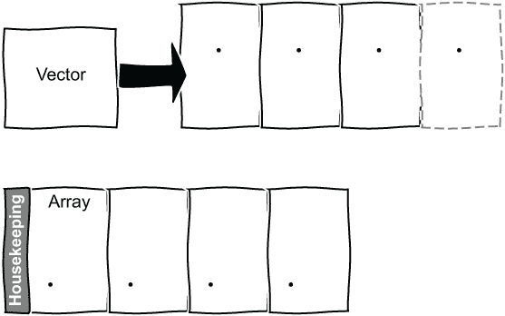
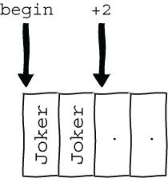

# 5 创建和使用对象和数组

本章涵盖

+   编写类或结构

+   作用域枚举

+   当我们知道需要多少元素时，使用`array`而不是`vector`

+   编写比较运算符

+   默认函数

+   使用`std::variant`

在本章中，我们将创建一副牌并编写一个高低牌游戏，用于猜测牌堆中下一张牌是更高还是更低。我们将创建一个代表牌的类，并将一副牌存储在一个`array`中。我们需要考虑如何为我们的牌定义比较运算符，以及如何编写构造函数和其他成员函数。我们还需要使用随机洗牌。然后我们将扩展游戏以包括小丑牌，并学习如何使用`std::variant`。到本章结束时，我们将有一个可工作的牌游戏，并准备好使用类做更多的事情。

## 5.1 创建一副扑克牌

我们将首先定义一个卡片类。我们可以使用关键字`class`或`struct`来声明一个卡片。如果我们使用`struct`，则默认所有内容都是公开的，这是一个简单的起点。一张卡片有一个花色和一个数值。有四种花色，每种花色有 13 个可能的数值：1，或王牌；2 到 10；以及三种宫廷牌。我们还需要显示和比较卡片，以及创建一整副牌的方法。我们将从卡片本身开始。

到目前为止，我们所有的代码都放在了`main.cpp`文件中。对于本章，我们将创建一个头文件，命名为`playing_cards.h`，并将其包含在`main.cpp`中。随着我们添加函数，大多数函数都将放入一个`playing_cards.cpp`源文件中。让我们花点时间提醒一下使用源文件和头文件的基本知识。当我们使用头文件时，我们总是需要一个*包含保护*。这阻止了头文件在同一个源文件中被包含多次，这可能导致问题，包括违反*单一定义规则*。如果没有保护，包含相同的头文件两次，这很容易间接发生，如果头文件包含另一个头文件，意味着枚举、结构体等将被定义两次，这是不允许的。这不是什么新鲜事。C++Reference 提供了更多关于这个主题的详细信息([`mng.bz/z0Rg`](http://mng.bz/z0Rg))。有些人仍然使用宏来包含或作为头文件保护，选择一个独特的名称。

列表 5.1 宏样式的包含保护

```
#ifndef PLAYING_CARDS_HEADER 
#define PLAYING_CARDS_HEADER 
...
#endif
```

然而，`pragma`指令`once`现在得到了广泛的支持。如果这个指令在您的编译器上不起作用，使用宏版本是可以的。让我们为我们的牌创建一个命名空间，将结构和函数保持在`namespace`作用域内。

列表 5.2 `playing_cards`头文件

```
#pragma once       ❶

namespace cards    ❷
{
}
```

❶ 包含保护

❷ 为后续声明命名空间

最后，我们在`main.cpp`中包含这个头文件，使用引号`""`而不是尖括号`<>`，这表示它是我们的而不是库头文件。搜索包含的头文件的具体位置是实现定义的，但引号版本会在尖括号版本初始搜索失败时搜索。人们通常使用尖括号来表示标准库头文件，使用引号来表示自己的头文件。我们的主函数目前还没有做什么，但现在我们有地方放置我们的代码了。

列表 5.3 包含头文件

```
#include "playing_cards.h"     ❶

int main()
{
}
```

❶ 包含我们的头文件

我们现在可以为我们的游戏创建一些牌了。

### 5.1.1 使用范围枚举定义牌类型

我们知道我们需要为每一张牌指定一个花色和一个数值。最初我们可以使用整数来表示数值，尽管我们也可以用整数来表示花色，但使用`enum`会更清晰。C++11 引入了**范围枚举**，它们看起来与旧的未范围`enum`非常相似，但在`enum`关键字和名称之间有一个`class`，或者等价地，`struct`。在`playing_cards.h`文件中添加一个`enum`，每个花色对应一个枚举值，在命名空间内。

列表 5.4 范围`enum`用于花色

```
#pragma once            ❶

namespace cards         ❷
{
    enum class Suit {   ❸
        Hearts,
        Diamonds,
        Clubs,
        Spades
    };
}
```

❶ 包含保护

❷ 命名空间

❸ 注意到单词`class`。

单词`class`的添加带来了很大的不同。没有它，我们有一个旧式的`enum`，可以无限制地使用`Hearts`或其他任何值，或者枚举值。这意味着我们可能会错误地比较来自不同枚举的值。如果使用两个不同的枚举来指示函数是否成功，它们可能会都使用`OK`表示成功，使用许多值之一表示失败。然后，检查结果是否为`OK`时，可能会混淆这两个不同的枚举。要使用我们的花色，我们需要说`Suit::Hearts`，这样就可以避免潜在的意外比较。

范围枚举的值到整型的隐式转换是不存在的，这在旧的枚举中是可能的。如果我们想将值用作数字，我们需要显式使用类型转换。范围枚举更安全。

我们在头文件中的命名空间内开始使用一个`struct`来保存初始牌类型的数值和花色。

列表 5.5 牌结构

```
struct Card
{
    int value;
    Suit suit;
};
```

然后，在`main`中，我们可以创建一个带有数值和花色的牌，前提是我们包含我们的头文件并使用`cards`命名空间。我们将使用**聚合初始化**，它看起来非常像使用初始化列表的统一初始化。我们在第二章中使用它来制作帕斯卡三角形的第一行：`std::vector<int> data{1}`。聚合初始化是不同的。初始化列表是相同类型的值的列表，但我们的聚合初始化使用不同类型的列表。我们的`Card`结构体有一个`int`数据成员，后面跟着一个`Suit`，所以我们按照这个顺序提供这些值来实例化一个`Card`。

列表 5.6 使用`Card`结构体

```
#include "playing_cards.h"        ❶
using namespace cards;            ❷

int main()
{
    Card card{2, Suit::Clubs};    ❸
}
```

❶ 包含我们的头文件

❷ 使用命名空间

❸ 创建一个带有数值和花色的卡片

我们可以只指定值，`Card` `card{2}`，而花色将默认初始化为第一个 `enum` 值。然而，我们不能说 `Card card{Suit::Clubs}`。我们可以在末尾省略初始化器，但不能在开头省略。

如果我们没有使用作用域 `enum` 来表示花色，我们将使用两个 `int` 来制作卡片，并且必须记住哪个是哪个。使用 `card{2,` `Suit::Clubs}` 比使用 `card{2,` `3}` 更清晰且更不容易出错。然而，目前，我们可以使用 0 或 14 作为卡片的数值。我们在上一章学习整值习语时了解了 `year_month_day`。现在我们可以通过为卡片的数值创建一个类型，并确保只使用 1 到 13 的数值来应用同样的想法。除了验证使用的值外，我们还将看到如何使用该类型来轻松显示卡片。

### 5.1.2 使用数值的强类型定义卡片类型

面值需要接受一个 `int` 并将其存储起来，提供获取函数，以便代码在需要时可以使用该值。在上一章中，我们考虑了整值习语来创建轻量级类型，以确保参数被正确传递。如果我们创建一个具有 `explicit` 构造函数的 `FaceValue` 类，我们无法在需要面值的地方传递一个 `int`。例如，如果我们有一个函数，其签名是

```
void do_something_with_face_value(const cards::FaceValue & value);
```

我们不能使用 `int` 来调用它。相反，我们需要创建一个面值：

```
do_something_with_face_value(cards::FaceValue{ 5 });
```

由于构造函数是显式的，`int` 不能隐式转换为我们的新类型。

如果我们使用的值无效，我们将抛出一个异常。来自 `stdexcept` 头文件的 `std::invalid_argument` 异常是有意义的。

列表 5.7 一个数值类型

```
#include <stdexcept>
namespace cards
{    
    class FaceValue
    {
    public:
        explicit FaceValue(int value) : value_(value)    ❶
        {
            if (value_ < 1 || value_ > 13)
            {
                throw std::invalid_argument(
                         "Face value invalid"
                      );                                 ❷
            }
        }
        int value() const
        {
            return value_;
        }
    private:
        int value_;
    };
    ...
}
```

❶ 显式构造函数

❷ 验证数值

我们可以将 `Card` 定义中的 `int value` 类型更改为 `FaceValue value`。要创建类似于列表 5.6 中的卡片，我们必须显式地创建一个 `FaceValue`，然后创建一个 `Card` `card{` `FaceValue(2),` `Suit::Clubs}`，而不是能够说 `Card card{2,` `Suit::Clubs}`。在构建卡片时，我们需要付出一点更多的努力，但如果我们正确构建，我们将得到一个花色和一个有效的卡片数值。在我们开始使用 `FaceValue` 之前，我们应该稍微更多地考虑我们如何制作卡片。事情仍然可能会出错。让我们回顾我们的卡片类型，确保我们只制作有用的扑克牌。

### 5.1.3 构造函数和默认值

在我们使用 `FaceValue` 之前，考虑一下列表 5.5 中定义的 `Card` 类型。我们的结构有两个成员，一个 `int` 值和一个 `Suit`。我们可以创建一个没有值或花色的卡片：

```
Card dangerous_card;
```

然而，这两个成员字段将不会被初始化。如果我们尝试读取这些字段，我们将遇到未定义的行为。在 Visual Studio 2022 的调试构建中，我偶然得到 `-858993460` 的值和 `-858993460` 的花色。在发布构建中，我可能会得到不同的垃圾值。编译器可以随意处理此类代码，因此你可能会用另一个编译器得到不同的行为。如果我们使用花括号初始化

```
Card less_dangerous_card{};
```

成员将被默认初始化。我们之前已经见过花括号或统一初始化，记住初始化变量是一个好习惯。我们可以尝试非常小心地不使用未初始化的值，但更安全的方法是确保我们首先不能创建危险的玩牌。我们可以采用各种方法来避免未初始化的成员变量。

最简单的方法是使用默认值来初始化值和花色。自 C++11 以来，我们可以使用 *默认成员初始化器*，直接为任何我们想要初始化的成员提供默认值。整数默认初始化为 0，枚举初始化为第一个值。

列表 5.8 一个卡片结构

```
struct Card
{
    int value{};    ❶
    Suit suit{};    ❶
};
```

❶ 使用默认值初始化成员

我们之前危险卡片现在有了值，我们可以安全地读取，得到 0 的红桃：一个非常不可能的玩牌，但没有未定义的行为。如果我们现在使用 `FaceValue`，我们无法创建一个值为 0 的卡片，因此我们需要选择一个可接受的价值，比如说，1。

列表 5.9 一个卡片结构

```
struct Card
{
    FaceValue value{1};    ❶
    Suit suit{};
};
```

❶ 使用有效默认值初始化 FaceValue

我们可以使用这个定义来为我们的游戏，但让我们先考虑一种替代方法，因为我们仍然有可能遇到问题。`struct` 的成员默认是公有的，这意味着我们可以直接使用它们。因此，我们可以轻松地更改它们的值，这可能不是一个好主意。我们可以将它们标记为私有，或者使用 `class` 而不是 `struct`，因为 `class` 的成员默认是私有的。在任何情况下，我们都需要一种设置值的方法；否则，每张卡片都将具有相同的值。我们可以添加一个公共构造函数，接受一个值和一个花色，并将它们存储起来。如果我们需要从 `class` 或 `struct` 外部获取这些值，我们还需要添加获取器。这些应该被标记为 `const`，因为它们不会更改 `Card` 成员值。这允许它们被一个卡片变量调用，无论它是否是 `const`。我们可以更改原始结构的名称，或者将其删除并在命名空间中的头文件中创建一个新的、改进的类型。

列表 5.10 一个卡片类

```
class Card
{
public:
    Card(FaceValue value, Suit suit):            ❶
        value_(value),                           ❷
        suit_(suit)                              ❷
    {
    }
    FaceValue value() const { return value_; }   ❸
    Suit suit() const { return suit_; }          ❸
private:
    FaceValue value_;                            ❹
    Suit suit_;                                  ❹
};
```

❶ 带有值和花色的构造函数

❷ 存储值和花色

❸ 标记为 const 的获取器

❹ 私有成员

我们不能再使用默认构造函数创建一个卡片。既然我们已经编写了自己的带参数的构造函数，我们就不会再自动生成默认构造函数。之前创建的危险卡片现在是不可能的。尝试

```
Card impossible_card;
```

将无法编译。如果你之前使用过 C++，这也应该很熟悉。

当我们使用 `std::array` 构建一副牌时，我们需要默认构造牌。C++11 引入了一种创建 *默认* 默认构造函数的方法。如果我们添加

```
Card() = default;
```

到列表 5.10 中的类，我们的 `impossible_card` 就变成了可能的。即使我们写了另一个构造函数，编译器也会定义一个默认构造函数。我们仍然应该像之前那样添加默认成员初始化器，以便默认构造函数可以初始化这些值。

列表 5.11 一个可默认构造的牌

```
class Card
{
public:
    Card() = default;                  ❶
    Card(FaceValue value, Suit suit):
        value_(value),
        suit_(suit)
    {
    }
    FaceValue value() const { return value_; }
    Suit suit() const { return suit_; }
private:
    FaceValue value_{1};               ❷
    Suit suit_{};                      ❷
};
```

❶ 默认构造函数

❷ 成员初始化器

我们也可以使用 `=` `delete` 标记一个构造函数为已删除。这将阻止生成该构造函数。我们可以为任何特殊成员函数这样做，例如 `copy` 或 `move` 构造函数、赋值运算符或析构函数。在 C++11 之前，我们经常将想要隐藏的函数设置为私有，以避免它们被使用。能够说一个函数是已删除的更简单，并且使我们的意图更明确。我们将在下一章中更详细地研究特殊成员函数。现在，我们有一个健壮的牌类型。我们需要一种显示牌的方法；然后我们可以继续创建一副牌并编写我们的游戏。

### 5.1.4 显示扑克牌

为了显示一张牌，我们想要能够写出

```
std::cout << card << '\n';
```

因此，我们需要为我们的 `Card` 类型提供一个流插入运算符。我们在列表 2.5 中编写了一个流插入运算符。我们需要一个重载，它接受 `std::ostream` 的引用作为第一个参数，以及一个常量引用 `Card` 作为第二个参数：

```
std::ostream& operator<<(std::ostream & os, const Card & card);
```

我们返回流的一个引用，以便可以链式调用：

```
std::cout << card << ', ' another_card << '\n';
```

`std::ostream` 位于 `iostream` 头文件中，因此我们包含该头文件，并将我们的操作符声明添加到头文件中的命名空间。

列表 5.12 声明牌的 `operator<<`

```
#pragma once
#include <iostream>                                                   ❶

namespace cards
{
    ...
    std::ostream& operator<<(std::ostream & os, const Card & card);   ❷
}
```

❶ 包含我们使用的头文件

❷ 声明我们的函数

我们有两个数据成员需要输出。`FaceValue` 成员有一个名为 `value` 的获取器，我们可以用它来输出底层的 `int`。一张牌的值将显示为一个数字，即使它是 A 牌或宫廷牌。我们稍后会改进这一点。花色是一个范围 `enum`，我们目前也可以将其作为 `int` 输出。默认情况下，范围枚举使用 `int` 作为枚举值，因此我们可以使用 `static_cast` 将花色转换为 `int` 并输出。我们的头文件承诺在命名空间中定义一个函数，所以我们定义该函数在源文件 `playing_cards.cpp` 中的 `namespace` `cards` 内。

列表 5.13 定义牌的 `operator <<`

```
#include "playing_cards.h"                                          ❶

namespace cards                                                     ❷
{
    std::ostream& operator<<(std::ostream& os, const Card& card)    ❸
    {
        os << card.value().value()                                  ❹
           << " of " << static_cast<int>(card.suit());              ❺
        return os;
    }
} 
```

❶ 包含我们的头文件

❷ 在命名空间内添加代码

❸ 定义函数

❹ 获取 `FaceValue` 的值

❺ 将枚举转换为 `int`

如果你从提示符构建，你需要在你构建命令中指定两个 `cpp` 文件：

```
clang++ --std=c++20 main.cpp playing_cards.cpp -o ./main.out -Wall
```

带着使用 `Card card{FaceValue(2), Suit::Clubs}` 构造的 `Card`，我们现在可以写出

```
std::cout << card << '\n';
```

并得到 `2` `of` `2`。梅花是 `enum` 的第三个元素，所以使用基于 `0` 的索引确实给我们 `2` 代表梅花，但看到 `2` `of` `梅花` 会更美观。

我们可以更新卡片的流操作符，但可能存在我们只想显示面值或花色的情况。我们可以为每个写一个流操作符，或者我们可以写一个 `to_string` 方法。C++11 为数值类型添加了 `to_string` 方法。这些函数位于 `string` 头文件中。

我们可以编写自己的 `to_string` 重载，一个用于 `Suit`，一个用于 `FaceValue`。`Suit` 的声明接受一个 `Suit` 并返回一个 `string`：

```
std::string to_string(Suit suit);
```

与其他声明一样，它属于头文件。我们还包含 `string` 头文件在我们的头文件中，因为我们正在使用 `std::string`。关于声明的部分就到这里。我们如何定义函数呢？在上一章中，我们提到我们可以使用 `std::literals` 中的 `operator ""s` 来创建一个 `std::string`。`"Hearts"s` 创建了一个 `std::string`，而 `"Hearts"` 是一个字符数组。这不是什么大问题，但我们是返回一个字符串，所以让我们创建一个字符串。对于我们的 `to_string` 函数，最简单的方法是使用 `switch` 语句，将枚举符和花色配对。我们添加一个默认值来抑制关于没有返回语句的代码路径的潜在警告。

列表 5.14 将枚举值转换为字符串

```
std::string to_string(const Suit & suit)
{
    using namespace std::literals;   ❶
    switch (suit)
    {
    case Suit::Hearts:
        return "Hearts"s;            ❷
    case Suit::Diamonds:
        return "Diamonds"s;          ❷
    case Suit::Clubs:
        return "Clubs"s;             ❷
    case Suit::Spades:
        return "Spades"s;            ❷
    default:
        return "?"s;
    }
   }
```

❶ 用于操作符 ""s

❷ 直接创建 std::strings

我们可以在末尾抛出一个异常而不是返回一个问号。有选择，但这个简单的方法已经足够好。

注意 Java 和 C# 枚举支持一个 `ToString` 方法，但 C++ 不支持。如果 C++ 有反射，我们可以将枚举值转换为字符串。然而，C++ 还不支持反射，但有一个技术规范（简称 TS；见 [`www.iso.org/deliverables-all.html`](https://www.iso.org/deliverables-all.html)）用于编译时或静态反射 ([`mng.bz/G9n8`](http://mng.bz/G9n8))。潜在的 C++ 功能有时有示例实现，一些编译器也提供实验性头文件，例如 `<experimental/reflect>`（见 [`mng.bz/YRMQ`](http://mng.bz/YRMQ)）。有多个反射建议 ([`mng.bz/OPjO`](http://mng.bz/OPjO))，所以时间会告诉我们 C++ 最终会采取哪种方法。

现在当我们显示我们创建的卡片时，我们可以得到 `2` `of` `Clubs`。然而，由于目前的状态，宫廷卡片和 A 牌将显示为数字。因为我们创建了一个 `FaceValue` 类型，我们可以写另一个 `to_string` 重载，为宫廷卡片和 A 牌提供特殊案例。任何其他值将使用 `std::to_string` 方法为 `int`。像往常一样，我们在头文件中声明函数，并在玩牌源文件中的命名空间内定义它。

列表 5.15 将卡片值转换为字符串

```
std::string to_string(const FaceValue & value)
{
    using namespace std::literals;               ❶
    switch (value.value())
    {
    case 1:
        return "Ace"s;                           ❷
    case 11:
        return "Jack"s;                          ❷
    case 12:
        return "Queen"s;                         ❷
    case 13:
        return "King"s;                          ❷
    default:
        return std::to_string(value.value());    ❸
    }
}
```

❶ 用于操作符 ""s

❷ 直接创建 std::strings

❸ 2 到 9 作为字符串

我们现在可以更新我们的流插入操作符以使用我们的重载 `to_string` 函数

列表 5.16 显示 A 牌、杰克、王后、国王或数字

```
std::ostream& operator<<(std::ostream& os, const Card& card)
{
    os << to_string(card.value())               ❶
        << " of " << to_string(card.suit());    ❶
    return os;
}
```

❶ 使用我们的新函数

如果我们流出一个特殊值卡片

```
std::cout << Card{ FaceValue(1), Suit::Hearts } << '\n';
```

我们看到“红桃 A”。我们可以制作单独的牌，所以现在我们需要制作一副牌。

### 5.1.5 使用数组创建一副牌

我们之前使用`vector`时想要一个元素集合。当元素数量未知但我们需要 52 张牌来组成一副完整的牌时，`vector`非常棒。C++11 引入了数组类型([`en.cppreference.com/w/cpp/container/array`](https://en.cppreference.com/w/cpp/container/array))，用于固定大小的数组。它位于`array`头文件中，并使用类型和大小定义：

```
template<class T, std::size_t N> struct array;
```

`vector`取了元素类型`T`，但`array`也需要一个编译时的大小`N`。向量可以动态调整大小，但数组的大小在编译时固定为所选大小。数组在维护方面有非常小的开销，并且可以放在栈上而不是堆上。这如图 5.1 所示。



图 5.1 向量有更多的开销，将元素放置在堆上，并且可以动态改变大小，而数组有较小的开销和固定的大小。

因此，我们可以声明一副牌

```
std::array<Card, 52> deck;
```

我们可以使用 C 风格的数组`Card` `deck[52]`，但`std::array`使我们更安全，因为我们总是知道数组的大小。在这两种情况下，我们都会得到 52 个默认构造的牌。使用`vector`，我们会`push_back`或`emplace`任何我们需要的新的牌，并且`vector`会增长。我们可以使用聚合初始化来初始化一些或所有牌。因此

```
std::array<Card, 52> deck{Card{FaceValue(2), Suit::Hearts}};
```

在开始处放置一张红桃 2，并使用默认构造函数为剩余的 51 张牌。我们可以像在`vector`或 C 风格数组中一样访问特定元素，使用`operator[]`，所以`deck[0]`是第一张牌。如果我们需要将我们的`array`传递给需要一个指向数组类型的指针的函数（例如，在 C 库函数中），我们可以调用`data`成员函数来获取对底层数据的指针。

让我们编写一个函数来创建一副牌。我们需要包含`array`头文件，在我们的头文件中声明函数，然后在源文件中定义它。对于四种花色中的每一种，我们需要 13 个值。不幸的是，我们无法简单地遍历`Suit`枚举。即使在这种情况下，值也不一定是连续的。因此，在一般情况下，使用`operator++`可能会使用一个无效的枚举值。我们可以做的是将这些值放入一个`initializer_list`中。我们在第二章讨论统一初始化语法时使用了花括号初始化。通过创建一个花色的初始化列表

```
{Suit::Hearts, Suit::Diamonds, Suit::Clubs, Suit::Spades}
```

我们有一个类似数组的对象可以在循环中使用。我们需要遍历每个花色的 13 个面值。从`array`的开始位置使用迭代器，我们可以使用`*card`设置其内容，并在每次循环中通过使用`++card`移动到下一张牌。

列表 5.17 构建一副牌

```
std::array<Card, 52> create_deck()
{
    std::array<Card, 52> deck;
    auto card = deck.begin();                                         ❶
    for (auto suit : 
        {Suit::Hearts, Suit::Diamonds, Suit::Clubs, Suit::Spades})    ❷
    {    
        for (int value = 1; value <= 13; value++)                     ❸
        {
            *card = Card{ FaceValue(value), suit };                   ❹
            ++card;                                                   ❺
        }
    }
    return deck;
}
```

❶ 从第一张牌开始的迭代器

❷ 花色的初始化列表

❸ 循环值

❹ 设置牌的值

❺ 移动到下一张牌

我们可以使用到目前为止所拥有的内容来制作一副牌，但我们注意到在第二章中鼓励避免使用原始循环并优先考虑算法。我们可以重构列表 5.17 中的函数，使用算法来创建一副牌。在本章中我们没有看到任何测试，但 GitHub 代码中包含一个`check_properties`函数，类似于我们在前几章中编写的测试函数。在重构代码之前，我们应该考虑测试什么。对于面值为 0 的牌，我们会得到一个异常吗？我们真的有 52 张不同的牌吗？

### 5.1.6 使用 generate 填充数组

`algorithm`头文件中包含一个名为`generate`的方法，该方法将函数对象生成的连续值分配给范围`[first, last)`。C++20 引入了新的版本，包括适用于范围的重载，因此我们可以直接使用`std::array<Card, 52> deck`，而无需自己找到`begin`和`end`。我们可以使用 lambda 作为函数对象来生成值：

```
std::ranges::generate(deck, []() { return Card{value, suit}; });
```

我们希望循环遍历 1 到 13 的值，每个花色中有一个相同的值。我们注意到枚举没有`operator++`操作符，因为这可能会使用一个无效的枚举值；因此，我们在列表 5.17 中使用初始化列表来遍历每个枚举器。让我们考虑一个替代方案，并了解一些关于作用域枚举的更多信息。在我们的情况下，枚举值是连续的，实际上，当我们到达最后一副牌时，我们可以从开始处重新开始，这样我们就可以使用 104 张牌的数组来得到两副牌，如果我们想的话。我们可以使用`static_cast`将枚举值转换为`int`，因为我们注意到作用域枚举有一个底层类型，默认情况下将是`int`。我们这样声明我们的`enum`：

```
enum class Suit
```

在列表 5.4 中。我们也可以指定一个类型；例如：

```
enum class Suit: short
```

如果我们不需要整数，这可能会节省一点空间，如果我们有非常少的值，我们甚至可以使用`char`。或者，如果我们需要一个非常长的枚举值列表，我们可以使用`long long`。而不是将类型强制转换为`int`，在一般情况下，我们可以使用`underlying_type`来决定转换为什么类型。然后我们可以选择下一个花色，并在达到末尾时回到起点。

列表 5.18 递增我们的枚举

```
Suit& operator++(Suit & suit)
{
    using IntType = typename std::underlying_type<Suit>::type;       ❶
    if (suit == Suit::Spades)
        suit = Suit::Hearts;                                         ❷
    else
        suit = static_cast<Suit>(static_cast<IntType>(suit) + 1);    ❸
    return suit;
}
```

❶ 底层枚举类型

❷ 返回第一副牌

❸ 使用强制转换进行递增

这段代码依赖于连续的枚举值，改变枚举值的顺序会破坏代码。然而，了解作用域枚举的`underlying_type`是值得注意的。

与我们所有牌的代码一样，我们将函数放在扑克牌源文件中，并在头文件中声明它。我们现在可以生成我们 `array` 所需的值。无论我们使用 `generate` 的范围版本还是 `begin`/`end` 版本，我们都需要包含 `algorithm` 头文件。我们从一张牌的值为一开始，为每张生成的牌递增。如果值大于 13，我们将回到一，并递增花色。所有这些都在 lambda 中发生，所以我们通过引用捕获值和花色，使用 `[&value, &suit]`。`generate` 函数对牌堆中的每个项目调用 lambda 一次，将生成的牌分配给每个元素。

列表 5.19 生成牌组

```
#include <algorithm>
std::array<Card, 52> create_deck()
{
    std::array<Card, 52> deck;
    int value = 1;                                     ❶
    Suit suit = Suit::Hearts;                          ❶
    std::ranges::generate(deck, [&value, &suit]() {    ❷
        if (value > 13)
        {
           value = 1;                                  ❸
            ++suit;                                    ❸
        }
        return Card{FaceValue(value++), suit};         ❹
    });
    return deck;
}
```

❶ 以红桃 A 开始

❷ 通过引用捕获

❸ 重置值并递增花色

❹ Lambda 返回一个 Card 并递增值

我们有一副完整的扑克牌，所以我们几乎准备好构建我们的游戏。首先，我们需要能够比较两张牌，以决定一张牌是否比另一张牌高或低。

### 5.1.7 比较运算符和默认值

对于一个类型，有六种可能的比较：

+   *等于* (`==`)

+   *不等* (`!=` )

+   *小于* (`<`)

+   *大于* (`>`)

+   *小于或等于* (`<=`)

+   *大于或等于* (`>=`)

C++ 已经允许我们长时间编写自己的比较运算符。例如，我们可以在类定义中内联实现一个小于运算符。

列表 5.20 `Card` 的小于运算符

```
bool operator<(const Card& other) const
{
    return value < other.value.value() && suit < other.suit;
}
```

然后，我们可以比较两张牌：

```
Card{FaceValue(2), Hearts} < Card{FaceValue(3), Hearts}
```

是否将花色包含在比较中可能是一个讨论点，因为一些纸牌游戏将一个花色视为比另一个花色更有价值。更重要的是，我们预计大于或等于 (`operator >=`) 将返回相反的结果。然而

```
Card{FaceValue(2), Hearts} >= Card{FaceValue(3), Hearts}
```

无法编译。如果我们编写一个小于运算符，其他比较就不会为我们生成。我们可以自己编写所有比较运算符，但这既繁琐又容易出错。C++20 引入了 `operator<=>`，有时称为 *spaceship operator*，因为它看起来有点像一艘宇宙飞船，这使得我们的工作更简单。这个宇宙飞船运算符给出三种可能值之一，因此也被称为 *三路比较运算符*：

+   *x* <=> *y* < 0 如果 *x* 小于 *y*

+   *x* <=> *y* > 0 如果 *x* 大于 *y*

+   *x* <=> *y* == 0 如果 *x* 等于 *y*

返回类型是一个*顺序类别类型*。详细内容涉及较多，但对于整型，例如`int`或我们的`Suit`枚举，我们会得到一个`std::strong_ordering`返回值，它在`compare`头文件中定义（见[`mng.bz/p1D0`](http://mng.bz/p1D0)）。我们可以使用关键字`auto`，而不是查找我们需要使用哪个特定的返回类型。这个结果可以自动转换成六个双向比较运算符之一。现在，我们既可以自己实现飞船运算符，也可以用关键字`default`来标记它。如果我们这样做，编译器会为我们生成所有的比较。默认比较运算符将使用类中按顺序定义的字段，因此值和花色都会被比较。因此，字段需要是可比较的，所以我们的`FaceValue`也需要一个飞船运算符。默认版本将能够比较两个`FaceValue`的值，使用的是`value_`成员，这正是我们所需要的。

我们首先需要添加`compare`头文件，它会计算出返回类型并为我们合成比较运算符。然后我们在`FaceValue`和`Card`的定义中添加一行，最后我们就有了所需的内容。

列表 5.21 默认的三向比较运算符

```
#include <compare>

namespace cards
{
    ...
    class FaceValue
    {
    public:
        ...
        auto operator<=>(const FaceValue&) const = default;   ❶
    private:
        int value_;                                           ❷
    };

    class Card
    {
    public:
        ....
        auto operator<=>(const Card&) = default;              ❸
    private:
        FaceValue value_{1};                                  ❹
        Suit suit_{};                                         ❹
    };
};
```

❶ 生成默认比较

❷ 用于比较的值

❸ 生成默认比较

❹ 用于比较的值和花色

为我们的两种类型添加六个比较运算符几乎不费吹灰之力。因为我们把 1 用作 A，这个默认运算符意味着 A 是最小的牌。我们也可以自己编写比较，或者使用 2 到 14 的值，使 14 为 A，因此是价值最高的牌。你可以自由地这样做以进行额外的练习。有了牌堆和比较牌的方法，我们现在可以创建一个高或低牌局游戏。

## 5.2 高或低牌局游戏

当我们创建我们的牌堆时，牌是按顺序排列的，因此我们可以计算出下一张是什么。随机化顺序会使游戏更有趣，因此我们需要一种洗牌的方法。

### 5.2.1 洗牌

我们之前已经使用过随机数；然而，我们现在需要一个随机洗牌，而不是随机数的序列。`algorithm` 头文件中有我们需要的函数。如果我们查看 CppReference ([`mng.bz/eEjZ`](http://mng.bz/eEjZ))，我们会看到 `random_shuffle` 和 `shuffle` 方法。每个 `random_shuffle` 版本都已弃用或删除。一个版本使用了 C 的 `rand` 函数，这可能在某个时候被弃用。我们已经看到 C++ 随机数生成器有多好。使用 `rand` 可能依赖于全局状态，这会导致多线程代码出现问题。一些简单的 `random_shuffle` 实现也使用了 `rand()` `% i` 来为索引 `i` 交换元素。每次我们使用随机数的模运算时，我们都有偏斜分布的风险。Stephan Lavavej 在 2013 年发表了一个名为“rand() Considered Harmful”的演讲（见 [`mng.bz/g7Dn`](http://mng.bz/g7Dn)），解释了为什么我们应该避免与 `%` 一起使用 `rand`。如果我们想模拟掷骰子，使用 `rand()` `% 6` 不会给我们一个均匀分布，因为 `MAX_INT` 不是六的倍数。因此，较小的骰子点数将稍微更有可能。试试看。

避免弃用的洗牌方法，我们只剩下 `std::shuffle`。这需要一个要洗的元素和一个随机数生成器。我们可以将 `begin` 和 `end` 传递给 `std::shuffle`，或者直接在我们的牌组上使用范围变体，`std::ranges::shuffle`。我们将使用 `random_device` 来初始化一个 `mt19937` 生成器，就像我们之前做的那样。我们需要包含 `algorithm` 和 `random` 头文件，分别用于 `shuffle` 和随机生成器。我们需要通过引用传递牌组，这样我们就可以改变它。

列表 5.22 洗牌卡片

```
#include <algorithm>
#include <random>
void shuffle_deck(std::array<Card, 52> & deck)    ❶
{
    std::random_device rd;
    std::mt19937 gen{ rd() };                     ❷
    std::ranges::shuffle(deck, gen);              ❸
}
```

❶ 通过引用传递牌组

❷ 初始化随机数生成器

❸ 洗牌

对于需要多次洗牌的纸牌游戏，有一个具有洗牌方法、在构造函数中设置生成器的类是有意义的。尽管如此，列表 5.22 中的简单方法对于我们的高低牌游戏来说是足够的。我们现在有了一种洗牌的方法，所以我们可以构建我们的游戏。

### 5.2.2 构建游戏

我们将展示牌组中的第一张牌，并询问玩家下一张牌将是更高还是更低，我们将继续进行，直到牌用完或玩家猜错。我们可以使用单个字符，`'h'` 表示更高或 `'l'` 表示更低，这样玩家就不需要输入太多：

```
char c;
std::cin >> c;
```

我们比较当前牌和下一张牌，依赖于列表 5.21 中给出的默认的三向比较自动生成的 `operator<` 和 `operator>` 来判断猜测是否正确。

列表 5.23 检查猜测是否正确

```
bool is_guess_correct(char guess, const Card & current, const Card & next)
{
    return (guess == 'h' && next > current) 
            || (guess == 'l' && next < current);
}
```

游戏从牌组中的第一张牌开始。我们可以用各种方式找到数组中的第一张牌，但跟踪正确猜测的数量并在游戏结束时报告这个数字可能是个好主意。我们可以使用这个计数来索引数组，就像使用 C 风格数组一样，索引将告诉我们我们已通过牌组的程度。我们将遍历牌组中的所有牌，但如果猜错则停止。将这些组合在一起就得到了我们的高低牌游戏函数。

列表 5.24 高低牌游戏

```
void higher_lower()
{
    auto deck = create_deck();
    shuffle_deck(deck);

    size_t index = 0;
    while (index + 1 < deck.size())                                   ❶
    {
        std::cout << deck[index]                                      ❷
            << ": Next card higher (h) or lower (l)?\n>";
        char c;
        std::cin >> c;                                                ❸
        bool ok = guess_correct(c, deck[index], deck[index + 1]);     ❹
        if (!ok)
        {
            std::cout << "Next card was " << deck[index + 1] << '\n';
            break;                                                    ❺
        }
        ++index;
    }
    std::cout << "You got " << index << " correct\n";                 ❻
}
```

❶ 在剩余的 51 张牌周围循环

❷ 显示当前牌

❸ 高或低

❹ 检查猜测

❺ 如果猜错则退出循环

❻ 显示正确数量

再次，我们将在扑克牌源文件中定义它，并在我们的头文件中声明它。然后我们从`main`函数中调用它。

列表 5.25 我们的游戏

```
#include "playing_cards.h"
int main()
{
    cards::higher_lower();
}
```

不要忘记，A 牌是最低的牌面，花色也有顺序。正确地拿到一手牌是困难的。一场典型的游戏可能如下进行：

```
9 of Spades: Next card higher (h) or lower (l)?
>l
4 of Hearts: Next card higher (h) or lower (l)?
>h
Next card was Ace of Hearts
You got 1 correct
```

我们有一个工作的牌局。我们创建了一个简单的结构并在数组中使用它。我们让 C++为我们做大部分工作，生成我们需要的比较来确定一张牌是高还是低。我们可以在这里停止，但一些牌局也使用`Joker`。`Joker`没有花色或牌面值，所以我们如何将`Joker`添加到我们的牌组中？

### 5.2.3 使用`std::variant`支持卡片或`Joker`

定义一个`Joker`的最简单方法是一个空的`struct`。

列表 5.26 一个`Joker`

```
struct Joker
{
};
```

那就是我们所需要的。

我们知道如何制作一副 52 张的扑克牌：

```
std::array<Card, 52> cards = create_deck();
```

我们如何添加两个`Joker`？我们不能将`Joker`添加到这张牌组中，因为它们是不同类型。我们可以创建一个公共基类型并使用指针来实现动态多态，但这似乎过于复杂。一个更简单的方法是使用一个包含两种类型之一（卡片或`Joker`）的数组。C++17 中引入的`std::variant`使得这成为可能。它位于`variant`头文件中，其行为类似于`union`，但更安全。C 的`union`类型有一系列可能的成员。

列表 5.27 一个联合体

```
union CardOrJoker
{ 
    Card card;
    Joker joker;
};
```

联合体足够大，可以容纳使用的最大类型。要从这个联合体中访问一个`Card`，你使用`card`成员，对于`Joker`，使用`joker`成员，但你需要跟踪正在使用哪种类型。相比之下，`variant`知道它当前持有哪种类型，因此`variant`通常被描述为一种*类型安全的联合体*。

我们通过声明它可以持有的类型来声明一个`variant`：

```
std::variant<Card, Joker>
```

`variant`是一个定义为*可变参数模板*的类模板。我们将在最后一章更详细地探讨这些内容，但就现在而言，请注意定义中的三个点：

```
template <class... Types>
class variant;
```

这些点被称为*参数包*，允许我们使用零个或多个模板参数。这使我们能够定义一个包含所需两种类型的`variant`。我们在第三章使用了`std::optional`来处理输入，它只需要一种类型。声明一个未赋值的`optional`

```
std::optional<Card> card; 
```

没有值。如果我们在这个布尔上下文中使用这张牌，它将评估为 false，所以我们可以使一个 `optional` 工作，但代码可能难以理解。我们需要记住 `if(!card)` 意味着我们有一个 Jokers。那么我们如何使用 `variant` 呢？

一个 `variant` 被初始化为第一个可选类型，前提是这个类型可以被默认构造。如果它不能，我们会得到一个编译错误。我们的两种类型都可以被默认构造，所以这里不会发生这种情况。所以使用

```
std::variant<Card, Joker> card;
```

默认构造了一个 `Card`，因为那是第一个类型。我们也可以创建一个 `Joker`：

```
std::variant<Card, Joker> joker{ Joker{} };
```

实际上，有各种创建 variant 的方法。我们可以避免使用临时 `Joker{}` 来构造 variant，使用 `std::in_place_index` 函数。对于一个 `Joker`，我们想要索引 1，并且没有为 joker 的构造函数提供任何参数，所以我们将使用 `std::in_place_index` 并设置值为 1：

```
std::variant<Card, Joker> joker2(std::in_place_index<1>);
```

对于 `Card`，我们使用零索引并将值和花色传递给 `Card` 构造函数：

```
std::variant<Card, Joker> two_of_clubs(std::in_place_index<0>,
                                       FaceValue(2), Suit::Clubs); 
```

更多细节请见 [`mng.bz/amzY`](http://mng.bz/amzY)。

我们可以通过检查 variant 的类型来确定我们是否有 Jokers：

```
bool is_joker = std::holds_alternative<Joker>(two_of_clubs);
```

有各种方法可以检索值。例如，我们可以使用带索引的 `get`：

```
Card from_variant = std::get<0>(two_of_clubs);
```

如果我们尝试获取一个 `Joker`

```
Joker from_variant = std::get<1>(two_of_clubs);
```

会抛出 `std::bad_variant_access`。或者，我们可以使用 `get_if` 来避免异常。而不是索引，我们可以使用类型，`std::get<Card>(two_of_clubs)`，这样可以节省记住类型顺序的麻烦。CppReference 提供了所有细节([`en.cppreference.com/w/cpp/utility/variant`](https://en.cppreference.com/w/cpp/utility/variant))，但我们现在已经足够了解如何制作带有 Jokers 的牌组。

我们已经使用了 `optional` 并遇到了 `variant`。还有一种类型，称为 `std::any`，它位于 `any` 头文件中。这三种类型都是在 C++17 中引入的，为类似问题提供了一些不同的替代方案。正如其名所示，我们可以几乎用 `any` 做任何事情，特别是任何可复制的类型。`any` 变量可以根据需要转换为其他类型：

```
std::any some_card = Joker();
some_card = Card{ 2, Suit::Club };
```

我们需要使用 `any_cast` 方法来获取值。如果我们有一个 `Card` 而不是 `Joker`，调用

```
std::any_cast<Joker>(some_card);
```

将抛出 `std::bad_any_cast`。

因此，我们可以使用 `any`；然而，使用 `variant` 更清晰，因为我们要么有一个 `Card`，要么有一个 `Joker`。我们甚至可以使用 `optional`，用一个没有值的变量来表示 `Joker`，但使用 `variant` 的意图更清晰。

### 5.2.4 使用扩展牌组构建游戏

让我们制作一个扩展牌组。首先，我们需要向牌组中添加 Jokers。我们可以用很多种方法来做这件事。我们遇到了 `array` 并注意到我们可以使用聚合初始化来初始化一些或所有元素。因此，我们可以这样制作前两个元素为 `Joker`：

```
std::array<std::variant<Card, Joker>, 54> deck{ Joker{} , Joker{} };
```

我们也可以制作像之前一样的 52 张普通牌：

```
std::array<Card, 52> cards = create_deck(); 
```

如果我们复制这 52 张牌，我们将得到一张带有两张小丑牌的牌组。我们在第二章中已经使用了`copy`。`copy`有几个变体，它们都位于`algorithm`头文件中。在第二章中，我们遇到了`ranges::copy`版本。牌组开始处有两张小丑牌，因此我们想要复制两张小丑牌之后的牌。因此，我们需要从`begin` + 2 开始复制，如图 5.2 所示。



图 5.2 在我们的数组开始处有两张小丑牌，我们将牌复制到`begin` `+` `2`。

在代码中，我们编写

```
std::ranges::copy(cards, deck.begin() + 2);
```

我们可以使用`std::copy`代替，使用`begin`和`end`成员函数：

```
std::copy(cards.begin(), cards.end(),deck.begin() + 2);
```

我们甚至可以使用`begin`和`end`自由函数：

```
std::copy(std::begin(cards), std::end(cards), std::begin(new_deck)+2);
```

一些东西，比如 C 风格的数组，可以迭代但没有`begin`或`end`方法，在这种情况下可以使用这些自由函数。如果我们使用自由函数而成员函数可用，它们会为我们调用成员函数，所以在这种情况下对我们没有影响。

我们需要在我们的头文件中包含`variant`头并声明该函数。使用`ranges`版本，我们可以在玩牌源文件中创建一个扩展牌组。

列表 5.28 创建扩展牌组

```
std::array<std::variant<Card, Joker>, 54> create_extended_deck()
{
    std::array<std::variant<Card, Joker>, 54> deck{Joker{}, Joker{}};    ❶
    std::array<Card, 52> cards = create_deck();
    std::ranges::copy(cards, deck.begin() + 2);                          ❷
    return deck;
}
```

❶ 从两张小丑牌开始

❷ 在两张小丑牌之后复制一张普通牌

我们需要洗扩展牌组的牌。我们的原始函数适用于 52 张牌的数组。我们现在有一个包含`Joker`或牌的变体数组的数组，因此我们可以在我们的头文件中声明一个重载函数：

```
void shuffle_deck(std::array<std::variant<Card, Joker>, 54>& deck);
```

然后，我们可以定义新的函数。

列表 5.29 洗扩展牌组

```
void shuffle_deck(std::array<std::variant<Card, Joker>, 54>& deck)
{
    std::random_device rd;
    std::mt19937 gen{ rd() };
    std::ranges::shuffle(deck, gen);
}
```

与列表 5.22 中的上一个版本相比，这个洗牌的唯一区别是牌组的类型。我们可以编写一个函数模板来避免重复。试试看！

为了使我们的更高或更低牌游戏与扩展牌组一起工作，我们需要进行两个补充。首先，我们需要决定是否包含`Joker`的猜测是正确的。如果我们说如果任一牌是小丑牌，猜测就是正确的，那么玩家实际上得到了一个免费回合。我们将使用`std::holds_alternative<Joker>`函数来查看我们是否有小丑牌，并在那种情况下返回`true`。否则，我们有两张非小丑牌，因此我们可以调用我们的原始函数，使用`std::get<Card>`从变体中获取牌。

列表 5.30 检查扩展牌组的猜测是否正确

```
bool is_guess_correct(char c,
    const std::variant<Card, Joker>& current,
    const std::variant<Card, Joker>& next)
{
    if (std::holds_alternative<Joker>(current) ||
        std::holds_alternative<Joker>(next))
        return true;                                       ❶
    Card current_card = std::get<Card>(current);           ❷
    Card next_card = std::get<Card>(next);                 ❷
    return is_guess_correct(c, current_card, next_card);   ❸
}
```

❶ 如果任一牌是小丑牌则返回 true

❷ 从变体中获取牌

❸ 否则调用原始函数

我们可能需要显示小丑牌，因此我们需要为我们的变体重载流插入运算符。同样，我们使用`holds_alternative`来查看我们是否有小丑牌，在这种情况下，我们将`"JOKER"`发送到流；否则，我们调用我们的原始函数。

列表 5.31 流式输出牌和小丑牌

```
std::ostream& operator<<(std::ostream& os, const std::variant<Card, Joker>& card)
{
    if (std::holds_alternative<Joker>(card))    ❶
        os << "JOKER";
    else
        os << std::get<Card>(card);             ❷
    return os;
}
```

❶ 一张小丑牌

❷ 流式传输牌

现在我们可以使用扩展牌组编写一个新的游戏。代码与列表 5.24 中的原始游戏相同，只是扩展牌组的创建不同。

列表 5.32 带有鬼牌的高低牌游戏

```
void higher_lower_with_jokers()
{
    auto deck = create_extended_deck();    ❶
    shuffle_deck(deck);

    size_t index = 0;
    while (index + 1 < deck.size())
    {
        std::cout << deck[index]
            << ": Next card higher (h) or lower (l)?\n>";
        char c;
        std::cin >> c;
        bool ok = is_guess_correct(c, deck[index], deck[index + 1]);
        if (!ok)
        {
           std::cout << "Next card was " << deck[index + 1] << '\n';
           break;
        }
        ++index;
    }
    std::cout << "You got " << index << " correct\n";
}
```

❶ 创建一个带有鬼牌的牌组

我们相对不太可能得到鬼牌，但它可能发生。一个典型的游戏可能看起来像这样：

```
8 of Hearts: Next card higher (h) or lower (l)?
>l
3 of Hearts: Next card higher (h) or lower (l)?
>h
5 of Hearts: Next card higher (h) or lower (l)?
>h
5 of Diamonds: Next card higher (h) or lower (l)?
>h
Next card was Ace of Clubs
You got 3 correct
```

我们已经构建了自己的类型等等。然而，我们还没有尝试面向对象编程。在下一章中，我们将编写另一个类并提供虚函数来学习更多关于类的内容。

## 摘要

+   头文件需要一个包含保护，并且 `pragma` 指令 `once` 现在得到了广泛的支持。

+   优先使用作用域枚举而不是 C 风格枚举。

+   某些函数可以被标记为默认或删除。

+   `string` 头文件为数值提供了 `to_string` 方法。

+   当大小在编译时已知时，使用 `std::array` 作为容器。

+   三元比较运算符（`operator` `<=>`）在 C++20 中被引入，并可以标记为 `default`，为我们生成比较。

+   使用 `std::shuffle` 来洗牌一个集合，传递一个适当种子的随机数生成器。

+   如果一个对象是有限数量的不相关类型之一，请使用 `std::variant`。

+   如果需要任何可能的可复制构造类型，请使用 `std::any`。

+   许多容器都有 `begin` 和 `end` 成员函数，但它们也可以作为自由函数提供，以供更广泛的使用。
