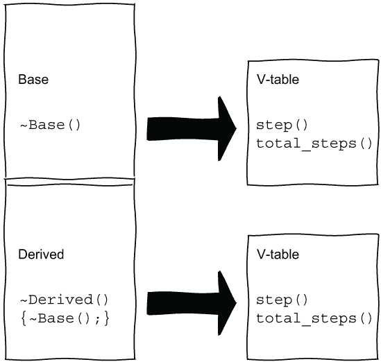
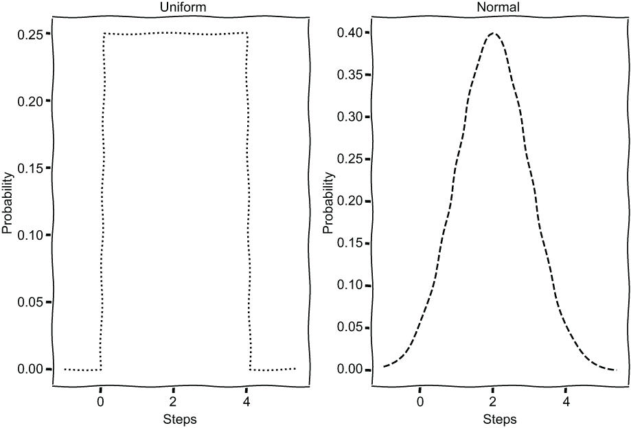
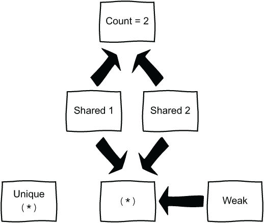

# 6 智能指针和多态

本章涵盖

+   使用继承实现动态多态

+   特殊成员函数

+   类型特性

+   使用智能指针

+   随机数分布

在本章中，我们将再次使用类，但这次使用继承。我们将创建各种`"Blob"`类。我们的粘液块将能够向前和向后移动。如果我们把粘液块排成一行在虚拟纸袋的底部，我们可以让它们开始赛跑，看看哪个粘液块首先逃离纸袋。除了在类上进行练习之外，我们还可以声称并进一步证明我们可以通过编码从纸袋中逃脱，这是所有程序员都应该追求的技能。

我们将从简单的类层次结构开始，创建一个一次迈一步的粘液块。我们将考虑在继承时需要哪些特殊成员函数，并使用类型特性来查询各种成员函数。我们将再次使用随机数，使用各种分布来决定粘液块迈多大的一步。这种随机性将使比赛更加刺激。通过将粘液块存储在*智能指针*中，我们可以在`vector`中保持各种类型的粘液块。它们的行为将根据粘液块类型而变化，给我们提供*动态多态性*。然后它们可以赛跑，我们可以坐下来观看，并为我们通过编码从纸袋中逃脱而自我祝贺。

## 6.1 类层次结构

我们将使用星号`*`来表示粘液块，并留下星号轨迹以显示路径。我们可以用`|`字符表示袋子的侧面，用`-`字符表示底部。所有粘液块都将从袋子的底部开始，然后一次移动一步或更多。我们可能会看到类似这样的情况：

```
  *        
| *     * |
| *   * * |
| * * * * |
-----------
```

为了将纸袋中的粘液块赛跑，我们需要定义一个`Blob`类型。我们可以给每个粘液块一个`x`和`y`坐标，但我们将不改变`x`，因此只需要跟踪`y`。如果我们将粘液块存储在`vector`中，我们可以使用向量的索引来指示`x`坐标。对于我们的第一次赛跑，我们将有一种类型的粘液块，它总是以相同的量向前移动。稍后，我们可以添加第二种类型的`Blob`，它将采取随机的一步以增加一些变化。

### 6.1.1 抽象基类

我们将为我们的 blob 创建一个基类，稍后创建派生类。我们知道每个 blob 都需要移动一步，所以我们需要一个 `step` 函数。我们还想知道总共移动了多少步，这样我们就可以显示正确的星号数量。`step` 函数会改变实例，增加总步数，但 `total_steps` 函数不会改变实例，所以后者可以被标记为 `const`。因此，我们需要两个成员函数，但保持它们为抽象的，通过在声明后使用 `= 0` 来表示。派生类可以实现它们自己的这些函数版本，从而给我们提供所需的多态性。这两个抽象函数都需要标记为 `virtual`。虚方法通过一个称为 *v-table* 的虚函数指针表来实现。当我们通过指针或引用调用虚方法时，v-table 被用来查找要调用的重写的虚函数。因此，虚方法允许我们创建具有不同 `step` 函数的不同派生类。*抽象基类* (ABC) 可以存在于一个名为 `Race.h` 的头文件中，位于一个名为 `Race` 的命名空间内。这个类不需要太多的代码。

列表 6.1 基类的一个初步尝试

```
namespace Race
{
    class Blob
    {
    public:
        virtual void step() = 0;               ❶
        virtual int total_steps() const = 0;   ❷
    };
}
```

❶ 执行一步的抽象函数

❷ 返回总步数的抽象函数

我们不能创建这个 `Blob` 的实例，因为它有抽象函数。如果我们编写一些派生类，实现这两个抽象函数，我们可以创建各种 blob 并进行比赛。然而，我们没有为我们的基类声明析构函数。实际上，我们还没有添加任何特殊成员函数：

+   *默认构造函数*—`X()`

+   *拷贝构造函数*—`X(const X&)`

+   *拷贝赋值运算符*—`operator = (const X&)`

+   *移动构造函数*—`X(X&&)`

+   *移动赋值运算符*—`operator = (X&&)`

+   *析构函数*—`~X()`

这意味着所有六个函数都被默认定义，因为我们没有定义任何一个。不写代码并因此接受六个默认值通常被称为 *零规则*。这在许多情况下都是完美的。核心指南甚至告诉我们，如果可能的话，避免定义默认值 ([`mng.bz/M9Km`](http://mng.bz/M9Km))；毕竟，代码越少通常意味着错误越少。尽管如此，有时我们确实需要编写一些代码。如果我们正在管理内存或资源句柄，我们需要确保发生正确的事情；否则，我们可能会得到内存泄漏。在我们的类中，我们并没有管理内存或句柄，但我们需要 *多态性*，因此，我们确实有一个问题。考虑当我们有一个派生类时会发生什么。

我们的 `Blob` 包含所有六个特殊成员函数的默认实现，包括析构函数。任何派生类都会自动调用基类的析构函数。这始终是 C++ 的情况。我们需要派生类，填充两个抽象函数的实现，这样我们就可以进行 blob 竞赛。如果我们使用各种 blob 类型的指针或引用，我们可以调用虚拟方法，并且派生类的重写将被使用，允许不同的 `step` 实现。我们可以定义一个 *派生* 类并将派生实例赋值给 *基* 类的指针：

```
Blob * blob = new DerivedBlob();
```

我们可以称之为

```
blob->step();
```

所采取的步骤将取决于 blob 的类型，因为 `step` 函数是 *虚拟* 的。然而，当我们完成时，如果我们调用

```
delete blob;
```

只有 `Blob` 的析构函数被调用，而不是 `DerivedBlob` 的。这是在找麻烦。如果我们没有虚拟析构函数就进行多态删除，会有未定义的行为。我们需要每个析构函数都被调用。如果我们创建了一个 `DerivedBlob` 指针而不是

```
DerivedBlob * blob = new DerivedBlob();
```

这两个析构函数都会被调用。这次，`blob` 是 `DerivedBlob`，所以调用的是 `DerivedBlob` 的析构函数，然后是基类的析构函数。默认的析构函数不是虚拟的，所以它不在虚函数表中，如图 6.1 所示。



图 6.1 虚函数在虚函数表中，但不是析构函数：`Base` 指针调用 `Base` 析构函数，而 `Derived` 指针调用 `Derived` 析构函数，但 `Base` 指向 `Derived` 类的指针做了错误的事情。

我们希望能够使用指向基类 `Blob` 的指针，这样我们就可以有各种派生类来制造一个有趣的竞争。实际上，我们不会使用原始指针；我们将找出如何变得更聪明。无论如何，我们需要一个小改动来解决问题。如果我们把析构函数标记为 `virtual`，它就会进入虚函数表，并且对于 `Base` 指针会调用正确的析构函数。当我们进行这个改动时，我们可以将拷贝构造函数和赋值操作标记为已删除，因为我们不需要复制 blob，我们还将添加一个默认构造函数，因为基类需要一个合适的构造函数。

列表 6.2 一个更好的基类

```
#pragma once

namespace Race
{
    class Blob
    {
    public:
        virtual ~Blob() = default;                ❶
        Blob() = default;                         ❷
        Blob(Blob const&) = delete;               ❸
        Blob& operator=(Blob const&) = delete;    ❸

        virtual void step() = 0;
        virtual int total_steps() const = 0;
    };
}
```

❶ 虚拟默认析构函数

❷ 默认构造函数

❸ 删除不必要的拷贝

我们现在可以安全地创建一个从 `Blob` 派生的具体类。

### 6.1.2 一个具体类

让我们创建一种新的 `Blob` 类型，每次移动时都会前进两步。这种新类型可以从 `Blob` 公开派生，因此基类的公共方法仍然是公共的，受保护的成员仍然是受保护的，但基类中的任何私有成员对派生类都是不可访问的。为了提醒如何使用公共、受保护和私有访问修饰符，请参阅 CppReference ([`en.cppreference.com/w/cpp/language/access`](https://en.cppreference.com/w/cpp/language/access))。我们有三个公共方法，所以这些仍然是公共的，我们没有其他需要考虑的。

我们需要实现抽象函数来创建一个具体类。由于这两个函数都只需要一行代码，我们可以在类中内定义这些函数。对于更大的函数，我们会使用单独的源文件并将定义放在那里。

要实现函数，我们通过编写一个与确切签名完全相同的函数来*重写*它们。基类的成员函数必须是虚拟的；否则，我们是在*隐藏*而不是重写一个函数。这在 C++中始终如此。如果你忘记了细节，请参阅斯科特·梅耶斯（Scott Meyers）的书籍《Effective C++》（Addison-Wesley Professional，2005；第 3 版）中的项目 33：避免在 Scott Meyers 的《Effective C++》中隐藏继承的名称。C++11 引入了`override`指定符，我们可以将其添加到成员函数声明的末尾，以明确表示我们正在重写一个函数。这意味着编译器可以告诉我们是否未能正确编写签名。例如，很容易忘记单词`const`并最终得到两个不同的函数。如果我们不希望任何进一步的派生类重写虚拟方法，我们还可以使用关键字`final`。

`step`和`total_steps`函数都使用到目前为止的步数。前者将添加到总步数，后者将报告总步数。我们的新类型 blob 每次需要走两步，因此它需要将总步数增加两步。我们可以在一个名为`y`的`int`中记住到目前为止所走的步数，表示 blob 的`y`坐标。其他任何东西都不应该使用这个变量，所以我们将其设置为私有。我们的步进类放在命名空间内的`Race`头文件中，并内联实现两个虚拟函数。

列表 6.3 一个走固定大小步长的 blob

```
class StepperBlob : public Blob 
{ 
    int y = 0;                         ❶
public: 
    void step() override               ❷
    { 
        y += 2; 
    }
    int total_steps() const override   ❸
    {
        return y;
    } 
}; 
```

❶ 用于跟踪步骤的私有整型变量

❷ 向前两步

❸ 到目前为止的总步数

现在我们可以创建一个步进 blob：

```
Race::StepperBlob blob;
```

实际上，我们可以添加一个类似于我们之前所做过的`check_properties`函数，并使用`asserts`来检查我们的代码做了什么。如果我们将其放在`main.cpp`中，我们可以检查一步是否使我们向前移动两步。

列表 6.4 检查步数是否使 blob 向前移动

```
#include <cassert>
#include "Race.h"

void check_properties()
{
    Race::StepperBlob blob;
    blob.step();
    assert(blob.total_steps() == 2);
}

int main()
{
    check_properties();
}
```

现在我们可以构建一场赛跑。我们只有一个具体的 blob 类型，因此我们事先知道不会有赢家或输家，但这给我们提供了一个简单的热身赛跑。我们需要决定如何表示 blob 以及如何绘制袋子。

### 6.1.3 为赛跑做准备

我们可以在一个虚拟的纸袋中放几个`StepperBlobs`并让它们在屏幕上行走。我们将在介绍新类型的 blob 时使用抽象基类。对于本节，我们将专注于在赛跑中表示`StepperBlobs`。如果我们使用合适的图形库，我们可以构建一个壮观的显示；然而，我们还有更多关于 C++要学习。如果你想尝试，SFML（Simple and Fast Multimedia Library；见[`www.sfml-dev.org/index.php`](https://www.sfml-dev.org/index.php)）相对容易上手。在这里，我们将坚持使用控制台。

首先，我们需要一个纸袋。我们决定使用`|`和`'-'`来表示边缘，并用`*`的轨迹来表示块。

```
  *        
| *     * |
| *   * * |
| * * * * |
-----------
```

我们将使袋子高度为三行，并使用每行的字符串来构建显示。每行以一个`'|'`和一个空格开始，如果我们位于袋子之上，则为两个空格，然后是每个块两个空格或`" *"`，最后是一个`'|'`。最后一行由表示袋子底部的`'-'`字符组成。

让我们编写一个绘图函数，接受`StepperBlobs`的`vector`，这样我们就可以绘制块和纸袋。我们可以在一个向量中放置四个这样的块

```
std::vector<Race::StepperBlob> blobs(4); 
```

并将此传递给函数，使我们能够改变块的数量。如果我们想的话，可以使用`std::array`，但`std::vector`意味着我们可以在运行时改变数量。当我们遍历每一行时，我们可以将当前的`y`坐标与每个块的总步数进行比较。如果`y`位置高于一个块，我们显示两个空格；否则，我们使用一个空格然后是一个`*`。我们使`steps`函数为常量，因为它不会改变块，所以我们可以将`vector`的常量引用传递给绘图函数。我们将新函数放在`Race.cpp`文件中，并记得在头文件中添加声明。我们还需要`iostream`和`string`头文件。

列表 6.5 绘制每个块当前的位置

```
#include <iostream>
#include <string>

#include "Race.h"

void Race::draw_blobs(const
    std::vector<Race::StepperBlob> & blobs)
{
    const int bag_height = 3;
    const int race_height = 8;
    for (int y = race_height; y >= 0; --y)
    {
        std::string output =
            y >= bag_height ? "  " : "| ";          ❶
        for (const auto& blob : blobs)
        {
            if (blob.total_steps() >= y)
            {
                output += "* ";                     ❷
            }
            else
            {
                output += "  ";                     ❸
            }
        }        
        output += y >= bag_height ? ' ' : '|';      ❹
        std::cout << output << '\n';
    }
    const int edges = 3;
    std::cout <<
        std::string(blobs.size() * 2 + edges, '-')
        << '\n';                                    ❺
}
```

❶ 袋子的左侧

❷ 带有轨迹的块

❸ 这里没有块

❹ 袋子的右侧

❺ 袋子的底部

我们想让块移动，所以我们需要另一个函数，`move_blobs`。因为块在移动时改变状态，所以我们通过非常量引用传递我们的向量。同样，我们在这里将使用`StepperBlob`并构建到下一节中使用不同类型的`Blob`。我们需要将签名添加到头文件中，并包含`vector`头文件。

列表 6.6 头文件中的声明

```
#include <vector>

namespace Race
{
...                                                           ❶

    void move_blobs(std::vector<Race::StepperBlob>& blobs);   ❷
    void draw_blobs(
        const std::vector<Race::StepperBlob>& blobs
    );                                                        ❷
}
```

❶ 块和步进器与之前相同

❷ 函数签名

然后，我们在`Race.cpp`文件中定义该函数。我们可以使用基于范围的`for`循环让每个块迈一步。

列表 6.7 移动所有块

```
void Race::move_blobs(
    std::vector<Race::StepperBlob> & blobs
)                               ❶
{
    for (auto& blob : blobs)    ❷
    {
        blob.step();            ❸
    }
}
```

❶ 通过引用传递

❷ 对每个块的引用

❸ 使块移动

如果我们在循环中调用这些函数，我们将有一个比赛。我们可以在更新之间清除屏幕并稍微暂停一下。我们之前在列表 4.11 的倒计时中使用了线程的`sleep_for`，所以暂停是直接的。如果我们包含`thread`头文件，我们可以使用`chrono`文字（如`1000ms`）来暂停：

```
using namespace std::chrono;
std::this_thread::sleep_for(1000ms);
```

现在，在 C++中没有一种平台无关的方法来清除屏幕。有时 C++用于没有屏幕的嵌入式设备，这很有意义。然而，使用特定的控制字符通常在 Linux、Windows 或 macOS 上有效：

```
std::cout << "\x1B[2J\x1B[H";
```

`\x1B`引入了一个控制字符，`[2J`清除屏幕，`[H`将光标移动到左上角。如果它在您的设置上不起作用，只需打印一个换行符`'\n'`，您将得到屏幕上显示的每一帧。同样，我们添加了签名

```
void race(std::vector<Race::StepperBlob>& blobs);
```

将实现放入源文件。比赛会调用我们的 `draw_blobs` 和 `move_blobs` 函数一段时间，并在每次调用之间暂停和清屏。

列表 6.8 一个有点可预测的比赛

```
#include <thread>
... 
void Race::race(std::vector<Race::StepperBlob>& blobs)
{
    using namespace std::chrono;
    const int max = 3;
    std::cout << "\x1B[2J\x1B[H";              ❶
    for (int i = 0; i < max; ++i)
    {
        draw_blobs(blobs);
        move_blobs(blobs);
        std::this_thread::sleep_for(1000ms);   ❷
        std::cout << "\x1B[2J\x1B[H";          ❶
    }
    draw_blobs(blobs);
}
```

❶ 如果需要，清除屏幕或更改到 '\n'

❷ 暂停

我们需要从 `main` 函数中调用这个操作，并使用 Blob 的 `vector`。别忘了在你的构建中包含 `Race.cpp`。

列表 6.9 一个热身比赛

```
#include "Race.h"
int main()
{
    check_properties();
    std::vector<Race::StepperBlob> blobs(4);
    Race::race(blobs);
}
```

当我们运行这个程序时，Blob 会同步移动，因此它们会一起逃逸。

|

```

               &#124;         &#124;
               &#124;         &#124;
               &#124; * * * * &#124;
               -----------
```

|

```

               &#124; * * * * &#124;
               &#124; * * * * &#124;
               &#124; * * * * &#124;
               -----------
```

|

```

                 * * * *
                 * * * *
               &#124; * * * * &#124;
               &#124; * * * * &#124;
               &#124; * * * * &#124;
               -----------
```

|

```

                 * * * *
                 * * * *
                 * * * *
                 * * * *
               &#124; * * * * &#124;
               &#124; * * * * &#124;
               &#124; * * * * &#124;
               -----------
```

|

这不是一个真正的比赛，而是一个简单的演示，说明如何用代码从纸袋中走出来。我们几乎准备好制作不同类型的 Blob。在我们这样做之前，让我们再思考一下类可能拥有的六个特殊成员函数。暂停以检查哪些函数存在和不存在将有助于在我们的脑海中巩固这六个特殊函数。

### 6.1.4 使用类型特性检查特殊成员函数

在 C++11 之前，我们有“三法则”：为一个类定义析构函数、拷贝构造函数或拷贝赋值运算符几乎肯定需要定义所有三个。如果这些函数中的任何一个需要执行特殊操作，比如克隆资源，其他函数也需要执行适当的操作。自 C++11 以来，我们必须考虑移动构造和移动赋值，这导致了所谓的“五法则”。实际上，我们注意到一个类可以有六个可能的特殊成员函数。如果我们没有定义任何一个，编译器将生成所有六个操作。我们在基类中添加了一个虚析构函数，以允许多态使用。那么，我们是否知道其他哪些函数仍然为我们隐式定义了？我们是否关心？也许吧。如果一个类型不支持移动操作，可能会错过优化机会。记住，我们在第二章中考虑了 `vector` 的两个 `push_back` 版本：

```
constexpr void push_back( const T& value );
constexpr void push_back( T&& value ); 
```

第一个版本在向量的末尾复制值，而第二个版本通过移动值避免了复制。如果类型不支持移动，将使用第一个版本。

我们的 `Blob` 类是抽象的，所以我们不能创建一个实例并尝试复制或移动它。我们如何测试这样的类？至少，我们需要基类是虚拟析构的并且不能被构造。如果我们使用 *类型特性*，我们可以尝试找出 `Blob` 有哪些函数。它们位于 C++11 中引入的 `type_traits` 头文件中。特性通过模板结构体提供各种操作的可发现性，这些结构体接受一个类型并填充一个名为 `value` 的布尔成员，告诉我们操作或特性是否受支持（见 http://mng.bz/yZDE）。我们可以查询

```
std::is_constructible<Blob>::value
```

并发现 Blob 是不可构造的。我们不必明确写出 `value`，我们可以使用 `_v` 代替：

```
std::is_constructible_v<Blob>
```

在 C++17 中引入了各种以 `_v` 结尾的辅助模板，这些模板与 `value` 成员相等。在任一情况下，我们将我们关心的类型提供给模板，并接收一个布尔值。令人放心的是，`Blob` 是不可构造的。

事实上，`is_constructible` 特性可以检查构建对象的各种方式。CppReference（见 [`mng.bz/XqyM`](http://mng.bz/XqyM)）向我们展示了声明

```
template<class T, class... Args >
struct is_constructible;
```

在我们使用 `std::variant` 的上一章中，我们遇到了三个点或 *参数包*。我们可以尝试其他类型，看看我们能否从它们中创建一个 `Blob`。例如，我们可以通过检查是否无法使用 `int` 构造 `Blob` 来验证这一点。

```
std::is_constructible_v<Blob, int>
```

是错误的。我们还可以使用 `is_default_constructible_v` 来专门检查默认构造函数。

类型特性不仅涵盖构造。我们在第四章中简要介绍了概念，并考虑使用来自 `concepts` 头文件的 `invocable` 来确保模板参数是可调用的或可调用的。`type_traits` 头文件有一个 `is_invocable` 特性，用于确定概念是否适用于类型。我们还可以检查其他各种特性。请查看 `type_traits` 头文件。特性在编译时对类型进行操作，因此它们是 *元编程* 库的一部分，包括我们在第四章中遇到的 `ratio` 头文件，以及我们尚未查看的整数序列。

让我们看看我们能否检查基类具有哪些六个成员函数，并确保析构函数也是虚拟的。特性是 `constexpr`，因此我们可以在我们为列表 6.4 制作的 `check_properties` 函数中使用 `static_assert`。

列表 6.10 检查特殊成员函数的类型特性

```
#include <type_traits>
void check_properties()
{
    ...                                               ❶
    static_assert(
        !std::is_default_constructible_v<Race::Blob>
    );                                                ❷
    static_assert(
         std::is_destructible_v<Race::Blob>
    );                                                ❷
    static_assert(
        !std::is_copy_constructible_v<Race::Blob>
    );                                                ❷
    static_assert(
        !std::is_copy_assignable_v<Race::Blob>
    );                                                ❷
    static_assert(
        !std::is_move_constructible_v<Race::Blob>
    );                                                ❷
    static_assert(
        !std::is_move_assignable_v<Race::Blob>
    );                                                ❷
    static_assert(
         std::has_virtual_destructor_v<Race::Blob>
    );                                                ❸
}
```

❶ 之前的检查

❷ 检查六个成员函数

❸ 检查析构函数是虚拟的

一些值是真实的，而另一些是错误的。我们根本无法通过复制或移动来构建一个 blob，因为 `Blob` 是一个具有纯虚成员函数的抽象类，但我们确实有一个虚析构函数。然而，移动构造和移动赋值检查可能具有误导性。`is_move_constructible` 特性告诉我们一个类型是否可以从右值引用中构造。我们的 blob 不可构造，因此根本不能进行移动构造。移动构造特性 *不是检查移动构造函数的存在*；而是检查类型是否可以从相同类型的右值中构造。`is_move_assignable` 告诉我们一个类型是否可以从右值中赋值，这可能意味着一个接受 `const` 指向左值的函数，因为 `const` 指向左值引用可以绑定到右值。特性 *不是检查移动赋值运算符的存在*。我们是否有移动特殊函数？

事实上，添加我们自己的析构函数阻止了隐式移动（见[`mng.bz/QR6e`](http://mng.bz/QR6e)）。类型特性告诉我们是否可以从临时对象或右值赋值，但我们很可能会得到副本而不是移动。因为我们禁用了副本，所以我们不能移动或复制一个 blob。未能提供移动构造函数和移动赋值运算符不是错误，但正如我们在考虑`vector`的`push_back`的两个版本时所指出的，我们错过了一个优化机会。在《有效现代 C++》的第 17 项（O'Reilly Media, Incorporated, 2014）中，Scott Meyers 指出，移动是请求。如果一个类型不是移动启用，任何“移动”实际上都是复制。此外，他告诉我们*C++不会为具有用户声明的析构函数的类生成移动操作*。最简单的解决方案是使用`=default`声明移动特殊函数。当我们这样做时，`copy`函数将被禁用！我们删除了它们，因为我们不需要它们。如果我们认为需要，我们可以声明它们。这通常被称为*5 条规则*。要么坚持零规则，接受默认值，要么根据您的需求声明或删除所有五个特殊成员以及构造函数。

现在，如果我们删除一个特殊的成员函数，移动赋值和所有其他特殊成员函数都将隐式删除。Peter Sommerlad 建议如果定义了析构函数，则删除移动赋值。他称这种模式为*DesDeMovA: 析构 => 删除 移动 赋值*（概述见[`mng.bz/46Eg`](http://mng.bz/46Eg)）。禁用多态类的副本可能是合理的。我们将在本章末尾与其他设计考虑因素一起探讨这一点。请记住，添加`析构函数`或其他特殊成员函数可能会禁用其他函数，因此如果您需要，可能需要显式添加一个函数。可以使用`type_traits`来检查您有哪些函数。

这是一个很大的主题。Howard Hinnant 在“你一直想知道的关于移动语义的一切”中讨论了这一点，如果您想了解更多（见[`www.youtube.com/watch?v=vLinb2fgkHk`](https://www.youtube.com/watch?v=vLinb2fgkHk)）。他还说过，“我不遵循‘5 条规则’。毕竟，有 6 个特殊成员。”（见[`howardhinnant.github.io/classdecl.html`](http://howardhinnant.github.io/classdecl.html)。）这篇文章提供了一个整洁的表格，显示了当我们定义其他函数之一时，哪些特殊成员是默认的或被阻止的。他建议在您的类中明确指出您想要和不需要的内容。

我们从 6.2 列表中的`Blob`类在我们的比赛中工作得很好。我们从一个`Blob`派生了一个具体的类。我们甚至进行了一次热身赛。让我们再创建一种类型的 blob，这样我们就可以进行一场真正的比赛。

## 6.2 在向量中使用派生类进行编写和运用

让我们再做一个步进器，每次都采取不同的步数，使用随机数。`StepperBlob`总是采取两个步骤。创建一个新的`Blob`类型，平均每步两个步骤，但可能更多或更少，似乎是一个合适的对手。任何一种都有可能获胜。我们可以使用均匀分布来生成一个从`0`到`4`的整数步数，使用

```
std::uniform_int_distribution distribution{0, 4};
```

我们需要一个带种子的引擎，我们之前已经见过。我们可以使用`random_device`作为种子

```
std::random_device rd;
std::default_random_engine engine{ rd() };
```

并将引擎传递给分布以获取一个数字：

```
int step = distribution(engine);
```

没有种子，引擎将使用默认值，并在每次运行代码时给出相同的序列。`default_random_engine`通常是 Mersenne Twister，即`mt19937`。这个类有两个构造函数，我们可以使用它们来给引擎设置种子。我们已经使用了接受单个数字的版本。第二个版本接受一个种子序列，`seed_seq`：

```
std::random_device rd;
std::seed_seq seeder{rd()};
std::default_random_engine engine{ seeder };
```

在理论上，`seed_seq`可以在每次运行程序时提供更多样化的结果，并且它确实允许我们在序列中提供几个种子。如果种子本身也是随机的，我们就能得到更多的多样性。这两种方法在只需要几十、几百或几千个随机结果时都适用，而对于我们编写的简单游戏，使用单个数字的最简单方法也足够好。如果我们需要数百万或数十亿种不同的数字序列，我们就需要更多思考。有一个提议要扩展 C++11 的随机数生成器（见[`wg21.link/P1932`](https://wg21.link/P1932)），它提供了关于当前引擎限制的更多详细信息。C++11 的随机库对于我们在本书中制作的游戏来说完全足够。只有在你想运行巨大的蒙特卡洛模拟或需要加密随机数时，才会出现问题。

### 6.2.1 一个随机移动的 blob

我们可以构建一个新的类，包含一个`uniform_int_distribution`和一个生成器，给我们一个新的 blob 类型。我们将在`step`函数中使用这些，将获得的随机数加到当前的步骤中：

```
y += distribution(generator);
```

如果我们想在 C++中使用每个分布，我们最终会编写 20 个不同的类。这感觉有些重复。

分布没有共同的基类，但它们都有一个接受生成器的`operator()`，它们使用它来创建符合分布的下一个随机数。因此，我们可以编写一个模板类，它接受生成器和分布作为类型。我们需要一个生成器和分布成员，其类型由模板指定。我们将它们都传递给构造函数，这意味着我们可以传递任何东西，包括一些用于测试的模拟生成器，只要它们有`step`函数所需的操作符。

新的类 `RandomBlob` 需要像 `StepperBlob` 一样公开继承自 `Blob`。`total_steps` 函数仍然返回总步数 *y*。`step` 函数使用生成器和分布来获取一个随机步骤。一些分布返回的是双精度浮点数或浮点数而不是整数，因此我们可以使用 `static_cast` 来获取整数。

列表 6.11 一个通用随机 blob

```
template <typename T, typename U>                          ❶
class RandomBlob : public Blob
{
    int y = 0;
    T generator;                                           ❶
    U distribution;                                        ❶
public:
    RandomBlob(T gen, U dis)                               ❶
        : generator(gen), distribution(dis)
    {
    }
    void step() override
    {
        y += static_cast<int>(distribution(generator));    ❷
    }
    int total_steps() const override
    {
        return y;
    }
};
```

❶ 生成器和分布类型

❷ 添加一个随机步骤

我们使用引擎和分布来创建一个 `RandomBlob`。我们可以使用一个在零到四个步骤之间的均匀分布：

```
    std::random_device rd;
    Race::RandomBlob rnd_blob{ 
        std::default_random_engine{ rd() },
        std::uniform_int_distribution{ 0, 4 }
    };
```

我们可以更改分布参数以获得行为不同的 blob。我们可以使用一个均值为 2.0 和标准差为 1.0 的正态分布，这表明数字偏离平均值的可能性。更大的值意味着更极端的值更有可能：

```
    Race::RandomBlob another_rnd_blob{
        std::default_random_engine{ rd() },
        std::normal_distribution{2.0, 1.0}
    };
```

参数 `2.0` 和 `1.0` 对于这个分布来说意义大不相同。它们不再告诉我们最小值和最大值。每个分布都有针对底层分布函数的特定参数。

C++11 的 `random` 库支持各种分布（见[`en.cppreference.com/w/cpp/header/random`](https://en.cppreference.com/w/cpp/header/random)）：

+   *均匀整数和实数*—适合在范围内以相等可能性选择一个数字。

+   *伯努利和相关二项分布*—用于模拟成功或失败的数量。

+   *泊松分布*—模拟在一段时间内事件可能发生的次数；例如，在接下来的几分钟内可能会有多少公交车到达。

+   *与正态分布相关的分布*—产生实数（而不是整数）值。这一组有六个分布：正态分布、对数正态分布、卡方分布、柯西分布、费舍尔分布和 t 分布。这些可以用于大量不同的模型，但正态分布通常用于人们的身高和其他大多数值趋向于接近平均值或平均的情况，但极端值是可能的。

+   *抽样分布*—类似于均匀分布，但通过提供权重，可以使特定的值或值范围更有可能。

在每种情况下，分布使用一个 *概率函数* 将引擎提供的数字平滑化，以给出分布所需的各种属性。对于均匀分布，每个数字必须具有相等的可能性。对于正态分布，接近平均值的值比极端值更有可能。许多有趣的数学原理隐藏在这背后，但生成概率函数的图表可以让我们了解可能有多少步骤。CppReference 提供了每个分布使用的函数。比较我们考虑的 `uniform_int_distribution` 和 `normal_distribution`，我们得到如图 6.2 所示的图表。



图 6.2 [0, 4] 上的随机均匀步骤和均值为 2.0、标准差为 1.0 的正态分布步骤

平均而言，我们期望从这两个分布中任选其一有两次步骤。正态分布可能需要更多步骤，甚至可能倒退，而均匀分布的步骤永远不会是负数。我们可以使用我们想要的任何其他分布。我们甚至可以使用一个假的来测试。我们使用的模板头

```
template <typename T, typename U>
```

没有任何约束，所以`T`和`U`可以是任何东西。我们在第四章中学习了要求和概念，注意到我们可以使用概念约束参数，例如`invocable`。

```
void guess_number_with_clues(int number,
         std::invocable<int, int> auto message) 
```

确保只有接受两个整数作为消息参数的函数被传递到我们的数字猜谜游戏中。我们的`RandomBlob`需要一个接受无参数的`invocable`生成器，写作`std::invocable<>`。命名要求位于`concepts`头文件中，因此如果我们包含该头文件，我们可以将`typename`关键字替换为约束

```
    template <std::invocable<> T, typename U>
    class RandomBlob : public Blob
```

要更具体，如果使用不合适的数据类型，我们可以得到更好的错误信息。实际上，CppReference 为随机数提供了命名要求（见[`en.cppreference.com/w/cpp/named_req`](https://en.cppreference.com/w/cpp/named_req)），包括`RandomNumberEngine`和`RandomNumberDistribution`。这些命名要求可以让我们更加精确；然而，只有列出的要求中的一些在 C++20 概念库中得到了形式化。将生成器约束为`invocable`对于我们的简单游戏来说已经足够好了。

我们还可以做的一件重要的事情是为我们的代码添加测试，使用 lambda 表达式作为生成器和引擎，几乎不需要任何努力。返回`0`而不是随机数通常有助于找到错误，因为用零进行的数学运算通常很容易在脑海中完成。我们可以创建一个总是返回`0`的“生成器”，并在“分布”lambda 中调用它，以传递那个`0`。

列表 6.12 使用随机生成器和分布进行测试

```
void check_properties()
{
    Race::RandomBlob random_blob(
        []() { return 0; },                   ❶
        [](auto gen) { return gen(); });      ❷
    random_blob.step();                       ❸
    assert(random_blob.total_steps() == 0);   ❹
}
```

❶ 每次都生成 0

❷ 传递 0

❸ 取一个随机步骤

❹ 总步骤数为 0

我们现在可以制作各种不同的随机 blob。预热赛使用了一个`StepperBlobs`的`vector`。我们可以制作一个`RandomBlobs`的`vector`，但如何让步进器和随机 blob 竞争呢？它们是不同的类型，但它们确实共享一个公共基类型。我们可以将原始指针放入一个`vector`中：

```
std::vector<Blob*>  
```

我们的方法支持我们需要的多态性，前提是我们使用指向`Blob`的指针或引用。确保引用在我们还需要它们的时候不会超出作用域是一项艰巨的工作，因此指针更好。然而，当我们完成时或发生异常时，我们必须手动删除 blob 指针。C++11 引入了*智能指针*来解决这些挑战，这使得我们的生活更加容易。

### 6.2.2 智能指针

我们编写的析构函数不做任何事情。它们不需要这样做。然而，C++在允许我们在构造函数中进行设置并在析构函数中进行清理方面表现出色。这被称为*资源获取即初始化*（RAII）。STL 经常使用 RAII。例如，我们知道`vector`在堆上为我们创建对象。当`vector`超出作用域时，分配的对象会被删除。我们不需要记住清理，因为`vector`是一个 RAII 类。如果我们将原始指针放入`vector`中，指针将被清理，而不是它们所指向的内容。

智能指针是另一种`RAII`类，用于管理原始指针。我们可以将智能指针放入`vector`中。当向量超出作用域时，每个包含元素的析构函数都会被调用。反过来，智能指针的析构函数会清理原始指针。智能指针有多种类型，但所有类型都允许我们编写如下所示代码。

列表 6.13 在`vector`中使用智能指针

```
void very_smart()
{
    std::vector<SmartPointer<Blob>> blobs;
    blobs.emplace_back(make_smart_pointer<StepperBlob>());   ❶
}                                                            ❷
```

❶ 将一些数据块放入向量中

❷ 范围结束，因此向量调用智能指针的析构函数

`memory`头文件列出了四个智能指针：

+   `unique_ptr`

+   `shared_ptr`

+   `weak_ptr`

+   `auto_ptr`

最后一个智能指针具有不寻常的复制语义（参见[`en.cppreference.com/w/cpp/memory/auto_ptr`](https://en.cppreference.com/w/cpp/memory/auto_ptr)）。复制会窃取指针，这意味着这些智能指针不能用于向量或其他容器。如果向量进行大小调整，元素需要被复制或移动，因此具有不寻常复制语义的东西会引起问题。`auto_ptr`在 C++11 中被弃用，并在 C++17 中被移除。剩下的三种类型更容易使用。

`unique_ptr`管理一个原始指针。`unique_ptr`拥有底层的指针，因此复制是被禁用的，但移动是允许的。毕竟，如果某物是唯一的，你不应该能够复制它。相比之下，`shared_ptr`也管理一个原始指针，但多个`shared_ptr`可以拥有同一个对象。当所有拥有底层对象的`shared_ptr`超出作用域或重置为指向其他对象时，拥有的对象将被销毁，其内存将被释放。因此，共享指针有一个共享计数，存储在所谓的控制块中。我们可以指定当唯一或共享指针超出作用域时会发生什么，但它们默认都会调用`delete`。此信息也存储在控制块中。现在，共享意味着你可能会遇到循环依赖和潜在的资源泄露，因此还有一个`weak_ptr`。`weak_ptr`就像一个`shared_ptr`，但更像是一个被动的观察者，监控控制块。被观察的`shared_ptr`可以删除底层资源，因此`weak_ptr`需要在尝试使用底层指针之前检查底层资源是否已被删除。有关更多详细信息，请参阅[`www.modernescpp.com/index.php/std-weak-ptr`](https://www.modernescpp.com/index.php/std-weak-ptr)。这些三种智能指针之间的关系如图 6.3 所示。



图 6.3 一个唯一指针拥有一个指针，共享指针共享一个指针和一个引用计数，而弱指针监控共享指针的控制块。

这三种类型的指针涵盖了各种使用场景；然而，对于我们的需求来说，`unique_ptr`就足够了。不需要共享或观察底层的原始指针。此外，Herb Sutter 建议默认使用`unique_ptr`（参见[`mng.bz/n1D8`](http://mng.bz/n1D8)）。`shared_ptr`更复杂，因为它需要控制块，这使得它更重。从`unique_ptr`切换到`shared_ptr`很简单，所以从`unique_ptr`开始是有意义的。

因此，我们需要创建一个`std::unique_ptr<Blob>`的`vector`。然后我们可以用从基类派生的任何类填充`vector`并使它们竞争。我们可以通过几种方式创建一个`unique_ptr`，要么是显式使用`new`：

```
std::unique_ptr<Blob> blob(new StepperBlob);
```

或者使用`make_unique`方法：

```
std::unique_ptr<Blob> blob = std::make_unique<StepperBlob>();
```

后者方法更好。首先，Herb Sutter 的文章告诉我们避免使用`new`。使用`new`意味着我们可能需要直接处理原始指针，这需要很多小心。当我们把`new StepperBlob`传递给智能指针时，内存被分配，构造函数被调用。如果构造函数抛出异常，`unique_ptr`本身就不会被构造，因此它的析构函数不会被调用，`StepperBlob`内存就会泄漏。如果分配和构造发生在`make_unique`调用内部，所有的事情都会为我们处理。出于类似的原因，有一个`make_shared`函数。

### 6.2.3 比赛！

我们现在能够创建一个包含各种类型`blob`的向量并将它们设置为比赛。我们需要一个新的比赛函数，它接受一个`std::vector<std::unique_ptr<Blob>>`，还需要新的`move_blobs`和`draw_blobs`函数，它们也接受一个智能指针的`vector`。声明在头文件中，在命名空间内，我们需要包含`memory`头文件以使用`unique_ptr`。

列表 6.14 向头文件添加重载方法

```
#include <memory>

namespace Race
{
...                                                         ❶
    void race(std::vector<std::unique_ptr<Blob>>& blob);    ❷
    void move_blobs(
        std::vector<std::unique_ptr<Blob>>& blobs           ❷
    );    
    void draw_blobs(
        const std::vector<std::unique_ptr<Blob>>& blobs     ❷
    );    
}
```

❶ 一切照旧

❷ 多态`blob`的重载

我们现在需要定义函数。比赛函数与列表 6.8 相同，除了`blobs`参数的类型。在列表 6.8 中，我们有一个`StepperBlobs`的`vector`。现在我们可以在`vector`中有各种`blob`。

列表 6.15 一个不太可预测的比赛

```
void Race::race(std::vector<std::unique_ptr<Blob>>& blobs)
{
    using namespace std::chrono;
    const int max = 3;
    std::cout << "\x1B[2J\x1B[H";
    for (int i = 0; i < max; ++i)
    {
        draw_blobs(blobs);
        move_blobs(blobs);
        std::this_thread::sleep_for(1000ms);
        std::cout << "\x1B[2J\x1B[H";
    }
    draw_blobs(blobs);
}
```

我们还需要实现移动和绘制函数。当我们移动列表 6.7 中的`blob`时，我们调用

```
blob.step();
```

对于每个`blob`。现在`blob`是`blob`的唯一指针，所以我们需要使用`operator->`来在底层指针上调用成员函数。除此之外，函数非常相似。

列表 6.16 移动所有`blob`

```
void Race::move_blobs(std::vector<std::unique_ptr<Race::Blob>>& blobs)
{
    for (auto& blob : blobs)
    {
        blob->step();    ❶
    }
}
```

❶ -> 调用一个底层指针的方法

最后，我们需要实现重载的`draw_blobs`方法。同样，这与列表 6.5 中的先前绘制方法非常相似，但我们使用`operator->`来找到`blob`的当前步数。

列表 6.17 绘制每个`blob`的当前位置

```
void Race::draw_blobs(const std::vector<std::unique_ptr<Race::Blob>>& blobs)
{
    const int bag_height = 3;
    for (int y = 8; y >= 0; --y)
    {
        std::string output = y > 2 ? "  " : "| ";
        for (const auto& blob : blobs)
        {
            if (blob->total_steps() >= y)    ❶
                output += "* ";
            else
                output += "  ";
        }
        output += y >= bag_height ? ' ' : '|';
        std::cout << output << '\n';
    }
    std::cout << std::string(blobs.size() * 2 + 3, '-') << '\n';
}
```

❶ -> 调用一个底层指针的方法

有了新的方法，我们终于可以进行一场真正的比赛了。我们需要一些`blob`，一些赛步器与一些随机的`blob`比赛会很好。由于赛步器每次移动两步，使用介于`0`和`4`之间的整数均匀分布可以给出平均两步的随机`blob`。我们意识到这给了两种类型公平的机会。我们可以在一个循环中创建一个指向`StepperBlob`的`unique_ptr`和一个指向`RandomBlob`的`unique_ptr`，所以运行一半请求的数量，每次添加两个`Blob`。每个`RandomBlob`需要一个引擎和一个分布。引擎需要播种，所以我们通常使用`random_device`。最后，我们将分布范围设置为`0`到`4`，使用`uniform_int_distribution{0, 4}`。

列表 6.18 创建用于比赛的`blob`

```
std::vector<std::unique_ptr<Race::Blob>>
create_blobs(int number)                                        ❶
{
    using namespace Race;
    std::vector<std::unique_ptr<Blob>> blobs;
    std::random_device rd;
    for (int i = 0; i < number/2; ++i)                          ❷
    {
        blobs.emplace_back(std::make_unique<StepperBlob>());    ❸
        blobs.emplace_back(
            std::make_unique<
                RandomBlob<std::default_random_engine,
                std::uniform_int_distribution<int>>
                >                                               ❹
            (
                std::default_random_engine{ rd() },             ❹
                std::uniform_int_distribution{ 0, 4 }           ❹
            )
        );
    }
    return blobs;
}
```

❶ 选择每种`blob`类型有多少个

❷ 循环到一半的数量，每次添加两个`blob`

❸ `Stepper`是默认构造的。

❹ `RandomBlob`需要一个引擎和一个分布。

我们现在可以在 `main` 中创建我们的 blob 并让它们赛跑。让我们尝试每种类型的四个 blob，总共八个来赛跑。

列表 6.19 正确的赛跑

```
int main()
{
    auto blobs = create_blobs(8);
    Race::race(blobs);
}
```

随机的 blob 可能会赢，但步进器可以打败它们。一开始，blob 在袋子的底部，准备出发。

```

|                 |
|                 |
| * * * * * * * * |
-------------------
```

它们移动，一些随机的 blob 可能会领先。

```
                *
        *   *   *
| * * * * * * * * |
| * * * * * * * * |
| * * * * * * * * |
-------------------
```

在下一次移动时，步进器可能会追上一点。

```
    *       *
  * * * * * * * *
  * * * * * * * *
| * * * * * * * * |
| * * * * * * * * |
| * * * * * * * * |
-------------------
```

最后，一些随机的 blob 赢了，但有一个在这个运行中被留在了后面。

```
    *           *
    *       *   *
  * * *   * * * *
  * * * * * * * *
  * * * * * * * *
  * * * * * * * *
| * * * * * * * * |
| * * * * * * * * |
| * * * * * * * * |
-------------------
```

第二次运行可能会得到不同的结果。我们已经通过赛跑的方式从纸袋中出来了。别忘了，我们也考虑了其他分布。尝试使用正态分布，看看是否有任何向后的情况。

### 6.2.4 一些设计考虑

我们在基类中禁用了移动和复制。如果我们留下了复制，我们可以创建一个新的派生类型：

```
class DerivedStepper : public StepperBlob { };
```

虽然派生类型没有做什么，但也许我们需要它为虚拟成员函数做其他事情。没有什么阻止我们使用 `StepperBlob` 编写一个函数：

```
void bogus(StepperBlob blob)
{
// ... 
}
```

在这个函数内部，我们有一个 `StepperBlob`，即使我们用派生类型调用它：

```
bogus(DerivedStepper());
```

在 `bogus` 函数内部，blob 是一个 `StepperBlob`，因为我们通过值传递了它，并且它被复制了。这被称为 *切片*。我们将派生类切片到了 `StepperBlob` 类，错误的虚函数被调用了。核心指南 ([`mng.bz/orDj`](http://mng.bz/orDj)) 建议使用 `=delete` 来删除复制和移动操作以避免切片 ([`mng.bz/6nr5`](http://mng.bz/6nr5))。DesDeMovA 方法也会有相同的效果。如果所有这些操作都去掉了，我们就可以添加一个克隆方法，如果我们需要启用复制的话。或者，只需在基类 `Blob` 中将复制标记为已删除，那么使用派生类调用 `bogus` 函数将不再编译。幸运的是，我们在基类中已经这样做了。我们甚至可以使用我们之前遇到的 `final` 关键字来阻止派生类的编写。我们可以将函数标记为 `override` 或 `final`，但我们也可以将整个类标记为 `final`：

```
class StepperBlob final : public Blob
```

一个 `final` 类不能用作基类，所以派生类本身无法编译。

面向对象编程（OOP）可能会变得非常复杂。当我们展示赛跑时，我们真正需要的是每个 blob 的总步数。使用 `std::vector <int>` 来收集步数是可行的。我们可以为每个 blob 累积总步数，而不需要任何面向对象编程。我们一开始就可以这样做，但那样就会错过学习很多 C++ 的机会。实际上，记得我们在列表 6.12 中测试 `RandomStepper` 的时候吗？我们使用了 `0` 步

```
Race::RandomBlob random_blob(
    []() { return 0; },
    [](auto gen) { return gen(); });    
```

`StepperBlob` 需要 `2` 步，所以我们可以使用返回 `2` 而不是 `0` 的假生成器

```
Race::RandomBlob random_blob(
    []() { return 2; },
    [](auto gen) { return gen(); });    
```

通过 `2` 步来创建一个 blob。再次强调，我们不需要面向对象编程（OOP）。模板为我们提供了编译时或 *静态多态性*。OOP 有其位置，但 C++ 允许我们在各种范式下工作。

我们现在已经多次使用了`vector`，并在编译时知道需要多少项时，将其视为`array`的替代品。我们还没有构建需要查找表的任何东西。在下一章中，我们将使用一些关联容器来制作字典。

## 摘要

+   总是在`base`类中声明一个虚析构函数，并用`=0`标记纯虚函数。

+   零法则意味着如果我们没有声明任何一个特殊成员函数，将提供六个特殊成员函数。如果只声明了构造函数，则提供剩余的五个特殊成员函数。

+   在重写的方法中添加关键字`override`以确保你有正确的签名，并使用关键字`final`来阻止进一步的覆盖。

+   使用`type_traits`来查找类型的特性；例如，`std::is_constructible_v`。

+   添加析构函数会阻止编译器隐式提供移动特殊成员函数。

+   五法则意味着任何需要移动语义的类都需要声明所有五个特殊成员函数，如果存在用户声明的析构函数、拷贝构造函数或拷贝赋值运算符，可能还需要构造函数。

+   使用`std::seed_seq`可以生成更多种类的随机数，但仅使用`std::random_device`对于简单的游戏通常就足够了。

+   相比于原始指针，使用智能指针，并默认首选更简单的`unique_ptr`。

+   使用智能指针的`operator->`来调用引用对象的成员函数。
