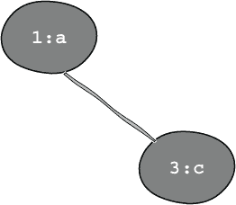
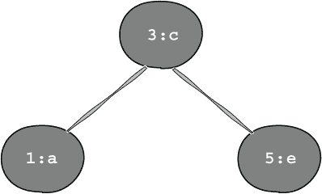
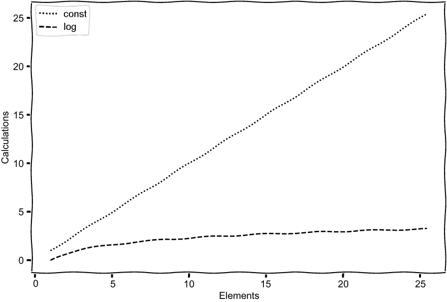
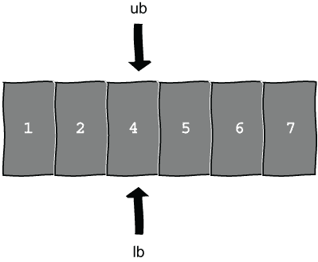
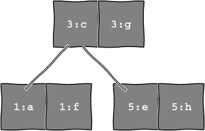

# 7 关联容器和文件

本章涵盖

+   填充和使用关联容器

+   对和元组

+   从文件中读取

+   随机样本

我们已经多次使用过向量，但还没有使用过关联容器。关联容器持有键值对，为我们提供了一个查找表或字典。在这一章中，我们将使用字典来创建一个答案破坏游戏。我们将提供两个提示，每个都是一个单词的定义。第一个单词的结尾将与下一个单词的开始重叠，给出答案。例如，一个*vector*是一个“支持动态调整大小的顺序容器”，一个*torch*可以定义为“用手携带的点燃的棍子”，所以将单词 vector 和 torch 结合起来给出答案*vectorch*。

我们将首先在`map`头中定义的`std::map`中存储一个字典，这个`std::map`在 C++11 之前就存在了，然后考虑其他类型的关联容器。我们将在下一章中使用更新的`std::unordered_map`，因此在这一章中使用`std::map`将是一个有用的复习，我们还将了解`std::pair`和更通用的`std::tuple`。我们将从硬编码的字典开始，之后使用随机样本从文件中读取数据，以在玩游戏时增加多样性。

## 7.1 硬编码答案破坏

我们将首先通过硬编码单词和定义来开始。我们可以直接将这些内容放入一个字典或`map`中。一个`map`允许我们根据`keys`存储`values`。如果键已存在，我们可以替换现有条目，但不能有两个具有相同键的条目。现在，语言字典可以为同一个单词提供多个定义，因此当我们使用合适的字典时，我们需要一个允许每个键有多个值的数结构。我们将从每个单词一个定义开始，但`map`头也提供了一个`multimap`，它支持多个条目，因此我们可以在以后有多个定义。让我们从使用每个键一个值的传统`std::map`开始。

### 7.1.1 创建和使用 std::map

与所有容器一样，`map`是一个类模板，因此我们需要声明键和值的类型。两者都将使用字符串，因此我们需要一个`string`到`string`的`map`：

```
std::map<std::string, std::string> dictionary;
```

我们可以使用`operator[]`来查询和插入键值对。要添加或覆盖条目，我们可以说

```
dictionary["assume"] = "take for granted, take to be the case";
```

然后，我们在`dictionary`中有一个条目，键为`"assume"`，值为`"take for granted, take to be the case"`。我们可以使用相同的操作符来查找字符串；例如：

```
std::string new_value = dictionary["fictional"];  
```

当我们这样做时，`new_value`是一个默认的字符串，因为`"fictional"`不在字典中。在调用`operator[]`之后，新的键`"fictional"`和默认的字符串值最终出现在字典中，这可能不是我们的意图。让我们创建一个`map`并证明这一点。

我们将创建一个 `string` 键到 `string` 值的 `map`，并将内容流出到 `std::cout`，因此我们需要包含 `map`、`string` 和 `iostream` 头文件`.` 当我们流出一个 `vector` 时，我们使用了类似于以下范围的 `for` 循环

```
for(auto item: my_vector)
```

我们可以用同样的方式处理 `map`，并且我们将使用 `const` 引用来避免复制。每个 `map` 元素由两个捆绑在一起作为 `std::pair` 的字符串组成，它有 `first` 和 `second` 方法来访问每个元素。我们将在稍后更详细地探讨这个问题。现在，我们可以尝试查询一个不存在的元素并看看会发生什么。

列表 7.1 创建和显示 `map`

```
#include <iostream>
#include <map>
#include <string>

void warm_up()
{
    std::map<std::string, std::string> dictionary;                     ❶
    dictionary["assume"] = "take for granted, take to be the case";    ❷
    std::string new_value = dictionary["fictional"];                   ❸
    for (const auto & item : dictionary)                               ❹
    {
        std::cout << item.first << " : " << item.second << '\n';       ❺
    }
}

int main()
{
    warm_up();
}
```

❶ 声明字典

❷ 添加项目

❸ 查询不存在的项目

❹ 使用 `const auto &` 来避免复制

❺ 显示对

当我们运行这段代码时，我们可以看到对 `"fictional"` 的查询向字典中添加了一个空字符串：

```
assume : take for granted, take to be the case
fictional :
```

这种行为不符合直觉，可能会引起问题。当我们将容器作为参数传递给函数时，我们故意使用了 `const` 引用。我们想要引用，所以我们不复制整个容器，但通常我们只想查询而不是更改元素，因此将参数标记为 `const`。如果我们尝试用 `map` 做同样的事情

```
void unexpected(const std::map<std::string, std::string> & lookup)
{
     auto value = lookup["cheese"];
}
```

我们得到一个编译错误，告诉我们没有接受 `const` `map` 的 `operator[]`。相反，我们可以调用 `at` 方法，它是一个 `const` 成员函数：

```
auto value = lookup.at("cheese");
```

如果键不存在，将抛出 `std::out_of_range` 异常。使用这种替代方法允许我们通过 `const` 引用传递 `map`，这将很有用。

`operator[]` 也会替换现有条目，因为 `map` 对每个键只有一个值。如果我们说

```
dictionary["fictional"] = "made up";
```

那个虚构条目现在具有值 `"made up"`。如果我们使用 `insert` 方法，我们可以避免覆盖现有条目。`insert` 有多种重载（见 [`mng.bz/5oEq`](http://mng.bz/5oEq)），但最简单的版本返回两个东西，一个迭代器和 `bool`，也捆绑为 `std::pair`。当我们尝试插入一个新项目时，我们可以传递一个键和值的初始化列表：

```
auto result = dictionary.insert({ "insert", "place inside" });
```

`result` 的第二个项目是真实的，因为新条目已被添加。第一个项目包含指向新添加项目的迭代器。如果我们尝试覆盖现有项目

```
auto next_result = dictionary.insert({ "fictional", "not factual" });
```

`next_result` 的第二个项目是假的，第一个项目包含一个指向现有项目的迭代器，这允许我们看到现有值。

我们现在可以创建一个字典，这是一个有用的起点。在我们构建答案砸游戏之前，让我们暂停一下，更详细地考虑一下 `std::pair`，它现在已经出现好几次了。

### 7.1.2 对，元组，和结构化绑定

`std::pair` 存在于 `utility` 头文件中，它是由一个类模板定义的，基于两种类型：

```
template<typename T1, typename T2> struct pair;
```

我们已经使用了 `first` 和 `second` 成员变量。`utility` 头文件还提供了一个名为 `make_pair` 的辅助函数，它为我们创建所需的 `pair` 并推断类型。如果我们说

```
auto two_words = std::make_pair("Hello,", "world!");
```

我们得到一对 `const char *s`。我们可以使用字符串字面量 `operator ""s` 来获取一对 `std::string`s：

```
using namespace std::string_literals;
auto two_words = std::make_pair("Hello,"s, "world!"s);
```

而不是使用 `auto`，我们可以直接说 `std::pair` 并使用初始化列表：

```
std::pair two_words{"Hello,"s, "world!"s};
```

我们不需要明确指定这对元素的类型，因为 CTAD 会为每个元素推导出 `std::string`。类型不需要相同，所以如果我们想的话，我们可以有一个包含两种不同类型的对。例如

```
std::pair two_numbers{1, 1.23};
```

是 `std::pair` 持有一个 `int` 和一个 `double`。

现在，一个对（pair）包含两个元素，但 C++11 引入了一种泛化，称为 `tuple`，它可以包含任意数量的项。没有人同意如何发音 `tuple`，所以你可以选择“two-pel”、“tupp-ell”或“chewple”。`tuple` 位于 `tuple` 头文件中，并使用我们之前遇到的参数包（三个点）定义：

```
template<typename... Types> class tuple;
```

有一个 `make_tuple` 函数可以创建元组，所以我们可以创建一个包含三个字符串的元组，如下所示：

```
auto three_words = std::make_tuple("Hello "s, "again, "s, "World!"s); 
```

然而，我们也可以这样表达

```
std::tuple three_words = {"Hello "s, "again, "s, "World!"s};
```

并且 CTAD 会启动，推导出我们有一个包含三个 `std::string`s 的元组。与 `std::pair` 一样，元组中可以包含各种类型，所以

```
std::tuple three_numbers{ 1, 1.23, 4.5f };
```

是一个 `std::tuple`，包含 `int`、`double` 和 `float`。

现在，`std::pair` 有 `first` 和 `second` 成员来访问任意元素，但 `std::tuple` 可能不包含两个元素。我们在第五章中使用 `variant` 时有一个牌或小丑，并使用 `std::get` 来访问元素。`tuple` 头文件有一个 `std::get` 的重载，我们可以用它来检索 `tuple` 元素，指定我们想要的项的索引。例如，调用

```
auto first = std::get<0>(three_words);
```

将返回第一个字符串。

在 7.1 列表中，当我们显示字典时使用了 `std::pair`，隐藏在 `auto` 后面

```
for (const auto & item : dictionary) 
```

`item` 实际上是一对字符串，所以我们需要调用 `first` 和 `second` 来显示字典条目。我们可以做得更整洁。C++17 引入了 *结构化绑定*，允许我们将名称绑定到对、元组和更多（见 [`mng.bz/g7De`](http://mng.bz/g7De)）上。如果我们想将三个数字

```
std::tuple three_numbers{ 1, 1.23, 4.5f };
```

解包到三个变量中，我们可以自己获取每个元素：

```
int x = std::get<0>(three_numbers);
double y = std::get<1>(three_numbers);
float z = std::get<2>(three_numbers);
```

结构化绑定允许我们在一行中获取所有三个项目：

```
auto [x, y, z] = three_numbers;
```

我们必须使用 `auto`，然后是我们在 `[]` 中想要的变量名。实际上，结构化绑定是手动解包的语法糖，但它会复制一个隐藏的元组或对。使用 C++ Insights（见 [`cppinsights.io/s/0579bdbb`](https://cppinsights.io/s/0579bdbb)）查看我们的三个数字，我们看到一个 `tuple` 的副本，有一个虚构的名字 `__three_numbers6` 和三个命名变量，分别指向三个元素：

```
std::tuple<int, double, float> three_numbers = 
                 std::tuple<int, double, float>{1, 1.23, 4.5F};
std::tuple<int, double, float> __three_numbers6 =
                 std::tuple<int, double, float>(three_numbers);
int && x =
    std::get<0UL>(static_cast<std::tuple<int, double, float> &&>(__three_numbers6));
double && y =
    std::get<1UL>(static_cast<std::tuple<int, double, float> &&>(__three_numbers6));
float && z =
    std::get<2UL>(static_cast<std::tuple<int, double, float> &&>(__three_numbers6));
```

我们在第二章中已经遇到过右值引用 `&&`。如果我们使用引用而不是复制，就可以避免复制：

```
auto &[x, y, z] = three_numbers;
```

隐藏的 `__three_numbers6` 就是一个引用，因为它遵循 *引用折叠* 规则，所以它愉快地绑定到引用上。

我们可以绑定到数组，甚至结构的非静态成员。例如，给定

```
struct DataObject { int x{ 0 }; double y{ 1.23 }; };
```

我们可以写成

```
DataObject data {};
auto [x, y] = data;
```

在每种情况下，我们使用`auto`并将其绑定到现有对象。本书的技术编辑 Tim van Deurzen 在 2019 年 Meeting C++上就结构化绑定进行了精彩的闪电演讲，如果您想了解更多信息（见[`www.youtube.com/watch?v=YC_TMAbHyQU`](https://www.youtube.com/watch?v=YC_TMAbHyQU)）。

我们在考虑如何在列表 7.1 中显示`dictionary`时使用了`std::pair`。我们现在可以将`dictionary`的键值对绑定到两个名称，编写

```
for (const auto & [key, value] : dictionary)
```

因此，我们可以直接使用`key`和`value`，而无需在键值对上调用`first`和`second`。

列表 7.2 使用结构绑定访问`map`项

```
#include <iostream>
#include <map>
#include <string>

void structure_bindings()
{
    std::map<std::string, std::string> dictionary;
    dictionary["assume"] = "presume, take for granted";
    std::string new_word = dictionary["fictional"];
    for (const auto & [key, value] : dictionary)       ❶
    {
        std::cout << key << " : " << value << '\n';    ❷
    }
}
```

❶ 将结构绑定到键和值

❷ 显示键和值

类似地，如果我们使用`insert`，我们也可以使用结构绑定来保存结果：

```
auto [it, result] = dictionary.insert({ "insert", "place inside" })
```

然后，我们可以直接使用迭代器`it`和布尔值`result`，而无需使用`first`来获取迭代器，使用`second`来获取`result`。

`pair`和`tuple`可以在各种情况下使用，包括从函数中返回多个值，正如我们在考虑`map`的`insert`函数时所见。结构化绑定还允许我们在使用返回值时编写更清晰的代码。掌握了`map`和`pair`的基础知识后，我们现在可以制作一个简单的答案砸游戏。

### 7.1.3 一个简单的答案砸游戏

我们将创建两个字典来玩答案砸游戏。一个将包含 C++关键字和它们的定义，这样我们就可以在玩游戏时稍作复习。第二个将包含英文单词及其定义。我们可以使用`operator[]`来创建关键字字典。

列表 7.3 使用`operator[]`填充`map`

```
std::map<std::string, std::string> keywords;                             ❶
keywords["char"] = "type for character representation which can be"
    " most efficiently processed on the target system";                  ❷
keywords["class"] = "user defined type with private members by default";
keywords["struct"] = "user defined type with public members by default";
keywords["vector"] = "sequential container supporting dynamic resizing";
keywords["template"] = "family of classes or functions parameterized"
                       " by one or more parameters";
```

❶ 构建字典

❷ 填充字典

要使用`operator[]`，我们需要一个可变的而不是`const`的`map`，但一旦我们设置了字典，我们就不需要更改它们。现在，我们注意到我们可以在`insert`之前传递键和值的初始化列表：

```
dictionary.insert({ "insert", "place inside" });
```

同样，我们可以使用一对初始化列表，或者甚至是一个包含两个字符串的初始化列表的初始化列表来构建我们的字典。

列表 7.4 使用初始化列表填充`map`

```
const std::map<std::string, std::string> dictionary{           ❶
    {"assume", "take for granted, take to be the case"},       ❷
    {"harsh", "coarse, large-grained or rough to the touch"},
    {"table", "piece of furniture"},
    {"tease", "mock, make fun of"},
    {"torch", "lit stick carried in one's hand"},
};
```

❶ 构建字典

❷ 用初始化列表的键值对填充它

第二种方法意味着我们可以将字典标记为`const`，以确保我们不会意外地更改其内容。

我们可以遍历关键字，通过`const`引用使用结构绑定来访问键和值，以避免复制字符串：

```
for (const auto & [word, definition] : keywords)
```

对于每个关键词，我们需要从字典中找到一个与之重叠的单词，这样我们才能将关键词和字典单词结合起来。给定单词 `"char"`，我们可以在字典中查找以 `"char"` 开头的条目，但整个单词可能会被完全吞没而不是重叠。这没问题，但避免这种情况可能会更有趣。相反，我们可以尝试查找以 `"har"` 开头的条目。因此，我们需要从第二个字符（或索引 `1`）开始的子字符串，或者说是单词的词干或起始部分来查找：

```
size_t offset = 1;
auto stem = word.substr(offset);
```

然后，我们可以遍历字典，寻找以该词干开头的单词。我们需要检查键的子字符串是否从索引 `0` 开始，长度为 `stem.size()`，与词干 `"har"` 相等，因此我们会在我们的字典中找到 `"harsh"`。在最坏的情况下，这意味着我们可能需要逐个检查每个键，并且可能找不到一个单词。我们很快就会看到在 `map` 中查找键的更有效的方法。

如果没有匹配到词干 `"har"`，我们可以再次尝试，从下一个字母开始，所以我们使用 `"ar"`。碰巧有一个 `"har"` 的匹配项，所以我们找到了一个合适的单词，不需要进一步检查。有些单词，如 `"struct"`，需要更多的搜索。我们去掉初始的 `'s'` 并搜索词干 `"truct"`。然而，字典中没有以 `"truct"` 开头的条目，所以我们可以尝试 `"ruct"` 并继续尝试，直到我们尝试匹配单个字母 `"t"`。我们需要至少一个重叠字母来将两个单词结合起来。有些单词可能根本找不到匹配项，因此我们可以用一个空字符串来表示这一点。我们也可以返回一个 `optional` 或甚至一个带有布尔值的 `tuple` 来指示我们找不到合适的单词，但空字符串也行。尝试这些不同的方法以获得额外的练习。

将搜索编写为单独的函数意味着我们可以对其进行测试。我们可以将函数放入一个新的源文件中，称为 `Smash.cpp`，并使用命名空间以及头文件 `Smash.h` 来声明所需的函数。搜索函数接受我们想要匹配的单词和要搜索的字典。如果我们找到一个单词，我们需要返回字典中的一个键，如果没有找到，则返回空字符串。如果我们还返回使用的偏移量，调用代码可以在不重新发现重叠位置的情况下将两个单词结合起来。正如我们所见，从函数中返回两个值的一个简单方法是通过 `std::pair`，所以我们在这里可以这样做，将代码放在 `Smash.cpp` 中，并在相应的头文件中声明函数。

列表 7.5 查找重叠单词

```
#include <map>
#include <string>
#include <utility>

#include "Smash.h"

std::pair<std::string, int> find_overlapping_word(std::string word,
    const std::map<std::string, std::string>& dictionary)
{
    size_t offset = 1;                                 ❶
    while (offset < word.size())
    {
        auto stem = word.substr(offset);
        for (const auto & [k, v] : dictionary)         ❷
        {                                              ❷
           auto key_stem = k.substr(0, stem.size());   ❷
           if (key_stem == stem)                       ❸
           {                                           ❸
              return { k, offset };                    ❸
          }
        }
        ++offset;                                      ❹
    }                                                  ❹
    return { "", -1 };                                 ❹
}
```

❶ 从单词的第二个字母开始

❷ 考虑每个键的起始部分

❸ 找到匹配项

❹ 未找到匹配项

尽管我们可能正在检查所有键，但重叠函数对于 answer smash 的第一次尝试已经足够好了。我们需要一个函数，它接受两个字典，一个是关键字字典，另一个是更通用的单词字典，两者都包含用作提示的定义。对于每个关键字，我们将尝试找到一个重叠的单词，如果我们找到一个单词，我们将显示两个定义作为提示。如果没有找到，我们将返回一个空字符串和偏移量 `-1`，因此我们将继续到下一个关键字。如果我们找到一个合适的单词，正确的答案就是关键字的起始部分与第二个单词的连接。我们可以使用 `operator+` 来创建答案。

```
word.substr(0, offset) + second_word
```

现在，子字符串创建了一个临时字符串，然后连接操作又创建了一个新的字符串，因此这种方法效率不高。我们不需要复制子字符串。C++17 在 `string_view` 头文件中引入了 `string_view`，它提供的是字符串的视图而不是副本。`std::string_view` 给我们提供了对现有字符串的只读访问，这意味着视图有效时，现有字符串需要保持作用域。我们可以获取第一个单词的前一部分的视图，避免复制，并使用我们在第二章中看到的 `std::format` 来制作答案。因此，我们可以说

```
std::string answer = std::format("{}{}", 
    std::string_view(word).substr(0, offset), second_word);
```

避免临时复制子字符串。有关更多详细信息，请参阅[`mng.bz/amzj`](http://mng.bz/amzj)。使用`string_view`通常更高效，但由于它是对另一个对象的视图，我们需要注意在原始字符串超出作用域后不要使用该视图。为了简单起见，我们将在本例中坚持使用`operator+`。了解我们正在创建额外的副本并且不需要它是很有用的。

我们可以使用 `std::getline` 来读取猜测。玩家可以简单地按 Enter 键放弃。我们可以将响应与答案进行比较，以确定猜测是否正确，再次将代码放在 `Smash.cpp` 中，并在 `Smash.h` 中声明该函数。

列表 7.6 一个简单的 answer smash 游戏

```
#include <iostream>
#include <map>
#include <string>

#include "Smash.h"

void simple_answer_smash(
    const std::map<std::string, std::string> &keywords,
    const std::map<std::string, std::string> &dictionary)
{
    for (const auto & [word, definition] : keywords)               ❶
    {
        auto [second_word, offset] = find_overlapping_word(word,
                                         dictionary);              ❷
        if (offset == -1)                                          ❸
        {                                                          ❸
            std::cout << "Not match for " << word << '\n';         ❸
            continue;                                              ❸
        }
        std::string second_definition =
                dictionary.at(second_word);                        ❹
        std::cout << definition << "\nAND\n" 
                  << second_definition << '\n';                    ❺

        std::string answer =
                word.substr(0, offset) + second_word;              ❻
        std::string response;                                      ❼
        std::getline(std::cin, response);                          ❼
        if (response == answer)                                    ❽
        {
            std::cout << "CORRECT!!!!!!!!!\n";
        }
        else
        {
            std::cout << answer << '\n';
        }
        std::cout << word << ' ' << second_word << "\n\n\n";
    }
}
```

❶ 对于每个关键字

❷ 查找重叠

❸ 检查是否有合适的单词

❹ 使用 at 而不是 operator[] 对 const map 进行操作

❺ 显示两个定义

❻ 将两个单词合并在一起

❼ 获取响应

❽ 检查猜测是否正确

我们可以从 `main` 中调用它并玩游戏。

列表 7.7 玩第一个版本的 answer smash

```
#include "Smash.h"                                     ❶
int main()
{
    const std::map<std::string, std::string> keywords{
        {"char", "type for character representation which can be most"
                    "efficiently processed on the target system"},
        {"class", "user defined type with private members by default"},
        {"struct", "user defined type with public members by default"},
        {"vector", "sequential container supporting dynamic resizing"},
        {"template", "used for generic code"},
    };                                                 ❷
    const std::map<std::string, std::string> dictionary{
        {"assume", "take for granted, take to be the case"},
        {"harsh", "coarse, large-grained or rough to the touch"},
        {"table", "piece of furniture"},
        {"tease", "mock, make fun of"},
        {"torch", "lit stick carried in one's hand"},
    };                                                 ❸
    simple_answer_smash(keywords, dictionary);         ❹
}
```

❶ 包含声明 simple_answer_smash 的头文件

❷ 设置关键字

❸ 设置字典

❹ 玩游戏

我们考虑了第一个关键字 `"char"` 和字典单词 `"harsh"`。对于这个组合，我们看到提示

```
type for character representation which can be most efficiently processed on the target system
AND
coarse, large-grained or rough to the touch
```

我们可以尝试猜测或直接按 Enter 键查看答案：

```
charsh
char harsh
```

我们有一个简单的游戏。如果我们更深入地研究`map`和其他关联容器，我们将看到如何使重叠搜索更高效，并学习更多 C++。

## 7.2 关联容器

我们使用`std::map`构建了一个硬编码的游戏。如果我们了解该结构内部的工作原理，我们将能够进行一些轻微的性能改进。有了这些，我们需要一个相关的数据结构，即`std::multimap`，以便存储合适的语言字典，这使我们能够为每个键存储多个值。毕竟，单词有时有多个定义，所以当我们在本章的最后部分使用合适的字典时，我们可能需要为单个键存储多个值。

### 7.2.1 更详细地了解`map`类型

我们知道`vector`和`array`都连续存储它们的元素，我们可以动态调整`vector`的大小，但不能调整`array`的大小。如果我们在一个`vector`中搜索一个项目，我们可能需要遍历所有元素才能找到我们需要的，可能到达末尾也找不到项目。如果我们有一个`vector`中有`n`个元素，我们可能需要检查所有`n`个元素，这被描述为`O(n)`，或线性复杂度。我们已经看到我们可以动态地向`map`中添加对，但我们还没有考虑元素是如何存储的，所以我们不知道搜索是如何工作的。

`map`被设计成我们可以更快地搜索项目。而不是将元素存储在一起，`map`将它们存储在一个*二叉树*中。二叉树有节点，存储元素和指向其他子节点的指针，就像树中的分支一样，并且任何节点最多有两个分支；因此得名二叉。节点是有序的，这给了我们一个*二叉搜索树*，较小的元素位于左侧，较大的元素位于右侧。对于`map`，我们的元素是一个键和一个值，键用于决定一个项目是向左还是向右移动。

如果我们在`map`中放入`{1:a}`、`{3:c}`和`{5:e}`，我们开始时有一个单个节点`{1:a}`，然后添加`{3:c}`。由于键`3`大于`1`，新元素`{3:c}`将向右移动，如图 7.1 所示。



图 7.1 有两个节点的`Map`：顶部的第一个节点`{1:a}`和右侧的下一个较大的节点`{3:c}`

当我们添加最后一个元素`{5:e}`时，会发生两件事。首先，新节点比`{3:c}`大，所以它将位于下方和右侧，但在这里添加一个子节点意味着树变得不平衡。实际上，我们有一个由`{1:a}`、`{3:c}`和`{5:e}`组成的链，而不是一个平衡的树，因为我们有很多右分支而没有左分支。将`{3:c}`提升为顶级节点可以平衡树，使较小的元素位于左侧，较大的元素位于右侧，如图 7.2 所示。



图 7.2 在平衡的二叉搜索树中的三个元素：具有较小键的节点位于左侧，具有较大键的节点位于右侧。

在将元素放入`map`之后，我们现在可以搜索它。如果我们想知道`{2:b}`是否在`map`中，我们从顶层节点`{3:c}`开始，因为键是`2`，小于`3`，所以我们向下移动到左节点`{1:a}`。这并不等于`2`，而且它是一个*叶节点*或*终止节点*，所以我们的搜索完成了。我们只考虑了树的一半。因为树是一个平衡的二叉树，所以我们将搜索左分支或右分支，因此我们具有对数复杂度，`O(log(n))`。实际上，搜索、删除和插入操作都具有对数复杂度。如果我们加倍元素的数量，我们在搜索时只需要额外一组比较。对于向量，搜索是`O(n)`。如果我们加倍元素的数量，我们在搜索时可能加倍比较的数量。我们可能会幸运地找到元素在开始处，但在最坏的情况下，我们必须检查所有项目。图 7.3 显示了常数大-O，`O(n)`，和对数大-O，`O(log(n))`的最坏情况。



图 7.3 常数时间复杂度：`O(n)`随着元素数量的增加增长得比对数复杂度`O(log(n))`快得多。

重新平衡保持了搜索的高效性。C++ maps 通常实现为红黑树。颜色是每个节点上的额外信息，用于插入或删除时使用。为了将搜索保持在对数复杂度`O(log(n))`，树需要保持*平衡*。如果一个分支的节点比另一个分支多得多，那么通过最大侧搜索会花费更长的时间。关于树数据结构和算法的经典资源是 Donald Knuth 的《计算机程序设计艺术》第三卷（Addison-Wesley Professional，1998）。

如果我们查看 CppReference（见[`en.cppreference.com/w/cpp/container/map`](https://en.cppreference.com/w/cpp/container/map)），我们被告知 map 是一个*排序的*关联容器。C++11 引入了*无序*容器，我们将在下一章中探讨。我们必须指定我们 map 的键和值类型，但`map`还接受一个比较类型，用于在树中放置节点。比较默认为`std::less<Key>`。对于`std::string`，我们得到默认的`std::less<std::string>`，这等同于`std::string`的`operator<`。我们可以指定其他比较方式。例如，我们可能希望首先将所有字符串转换为小写。对于用户定义的类型，我们可能需要编写比较运算符或定义飞船运算符以在`map`中使用我们的类型。如果我们有一个用户定义的类型，即使是一个简单的结构体，例如

```
struct Stuff { int x; };
```

如果我们尝试将`Stuff`用作 map 中的键，我们会得到编译错误：

```
std::map<Stuff, int> lookup;
lookup[Stuff{ 1 }] = 1;
```

我们需要做的只是将飞船运算符添加到结构体

```
friend auto operator <=> (const Stuff &, const Stuff&)  = default;
```

然后，我们可以将其用于查找。

C++标准通常告诉我们容器上操作的计算复杂度，这有助于我们在编码时做出明智的选择。大 O 或复杂度是最坏情况。例如，一个描述为`O(n)`的搜索可能只需查看一个元素，如果第一个检查的元素就是匹配项。在最坏的情况下，所有元素都会被比较。复杂度是指导可能发生多少操作的指南，而不是效率的保证。我们可能仍然需要基准测试我们的代码以查看其速度，并且性能分析器可以帮助我们找到瓶颈。

现在，当我们构建列表 7.6 中的简单答案粉碎器时，我们手动检查了键，因此我们可能将我们的词干词与所有`n`个键进行了比较，这给我们带来了`O(n)`。在没有性能分析的情况下，我们可以通过使用`std::map`提供的其他功能来改进这一点。

### 7.2.2 使用上下界来更高效地查找键

`std::map`有一个`lower_bound`和`upper_bound`函数，这些函数帮助我们更有效地查询映射。这两个函数都找到元素将被插入的位置。`lower_bound`找到第一个大于或等于查询元素的元素，而`upper_bound`找到具有更大值的元素的位置。Nicolai Josuttis 的书籍《C++标准库，第二版》（Addison-Wesley Professional，2012 年），是一本关于进一步详细信息的优秀参考书。`std::set`和`std::multiset`也支持这些函数。我们还没有使用这些容器。集合允许我们保持一组唯一的值，就像映射一样，但只有键，而多重集合允许我们有重复的键。

此外，还有免费函数`std::lower_bound`和`std::upper_bound`，也可以用于其他容器，前提是元素按`operator<`排序。因此，我们可以将这些函数用于已排序的`vector`：

```
const std::vector<int> data{ 1, 2, 4, 5, 6, 7 };
auto lower = std::lower_bound(data.begin(), data.end(), 3);
auto upper = std::upper_bound(data.begin(), data.end(), 3);
```

这可能比通过迭代元素尝试找到`3`要快。上下界都指向第三个元素`4`，如图 7.4 所示。



图 7.4 已排序向量中`3`的上下界，`lb`和`ub`

当上下界匹配时，表示该项不存在。如果我们插入`3`并再次运行查询，`lower_bound`将返回指向`3`的迭代器，而`upper_bound`仍然返回指向值`4`的迭代器。因为位置不匹配，我们找到了值`3`。下界大于或等于元素，而上界总是大于元素，所以匹配的界限意味着它们都是更大的，而不同的界限意味着下界位于第一个这样的元素。

我们还可以在`equal_range`的一次调用中找到上下界。这个函数返回一个迭代器对，因此我们可以再次使用结构化绑定来获取上下界：

```
auto [lb, ub] = std::equal_range(data.begin(), data.end(), 3);
```

`std::map` 以及提到的其他容器具有相同行为的成员函数。我们有时会发现容器为了性能原因，对通用函数有专门的版本。

我们可以使用 `lower_bound` 和 `upper_bound` 成员函数重写我们的查找重叠函数，从而避免可能检查所有键。之前，在第 7.5 节的列表中，我们遍历了所有键，如果找到与词干匹配的键，就退出循环。现在，我们可以使用 `equal_range` 来找到词干的上下界，因为这个函数将 `lower_bound` 和 `upper_bound` 的结果打包成一个 `std::pair`。下界如果词干不存在，则找到插入点，所以我们可能位于字典的末尾或一个不匹配的词。在将词干与下界键的第一部分比较之前，我们需要检查下界不是在字典的末尾。

```
lb->first.substr(0, stem.size()) 
```

来发现我们是否找到了合适的单词。将这些组合起来，我们得到以下函数。

列表 7.8 更高效地查找重叠单词

```
std::pair<std::string, int> find_overlapping_word(std::string word,
    const std::map<std::string, std::string>& dictionary)
{
    size_t offset = 1;
    while (offset < word.size())
    {
        auto stem = word.substr(offset);
        auto [lb, ub] = dictionary.equal_range(stem);        ❶
        if (lb != dictionary.end() &&
                stem == lb->first.substr(0, stem.size()))    ❷
        {
            return {lb->first, offset};                      ❸
        }
        ++offset;
    }
    return {"", -1};
}
```

❶ 不再需要循环

❷ 我们是否找到了合适重叠？

❸ 返回单词和偏移量

我们可以在我们的游戏中使用这个函数来代替我们在列表 7.5 中编写的原始版本。

当我们调用 `find_overlapping_word` 时，我们只会找到第一个匹配的单词，我们可以改进这一点。可能存在多个重叠的单词，而且一个合适的字典可能对一个单词有多个条目。当我们有多个合适的单词时，我们可以随机选择，这将为我们的游戏增加一些多样性。我们还可以使用 `std::multimap` 来支持每个键的多个条目。当我们思考关联容器时，让我们了解多映射，然后我们将准备好使用合适的字典制作我们游戏的新版本。

### 7.2.3 多映射

`std::multimap` 也位于 `map` 头文件中，并使用键和值；例如：

```
std::multimap<std::string, std::string> dictionary;
```

`multimap` 支持相同键的多个值，并且像 `std::map` 一样行为，但每个键都有一个值的 `vector`。

要插入项，我们可以使用 `insert`：

```
dictionary.insert({ key, value });
```

或者 `emplace`：

```
dictionary.emplace(key, value);
```

正如我们在第二章中看到的 `vector`，`insert` 需要一个元素，因此对于 `multimap` 版本，我们会使用 `std::pair`，而 `emplace` 则从提供的参数构建元素。键值对仍然生活在树中的节点中，但我们可以有多个来搜索，如图 7.5 所示。



图 7.5 给定键的多个值的 multimap

要检索值，我们需要处理每个键可能有多个值的情况。此外，`std::multimap`没有`operator[]`或`at`函数，因此我们需要做其他事情。幸运的是，使用`lower_bound`和`upper_bound`或`equal_range`可以给我们所需的结果，允许我们找到与给定键对应的所有值。这些函数返回迭代器，如果存在与键对应的值，我们可以使用所有这些值。

让我们考虑以下示例。使用命名空间字面量，我们可以创建一个与图 7.5 匹配的`multimap`：

```
std::multimap<int, std::string> mm{
    {1,"a"s}, {1,"a"s}, {3,"c"s}, {3,"g"s}, {5,"e"s}, {5,"h"s},
};
```

如果我们搜索`mm.equal_range(2)`，我们将得到一个指向元素`3:c`的迭代器，对于下界和上界都是如此。这意味着具有键 2 的元素将被插入那里。如果我们搜索`mm.equal_range(3)`而不是`mm.equal_range(2)`，下界是`3:c`，是第一个不小于键`3`的元素，上界是`5:e`，是第一个大于键`3`的元素。然后我们有一对迭代器，可以用来遍历所有键为`3`的元素。

我们需要找到一个以词根开头的单词，这样我们才能找到下界

```
auto stem = word.substr(offset);
auto lb = dictionary.lower_bound(stem);
```

当字典是一个`multimap`时。我们需要的是任何在词根之后的单词。如果我们复制词根

```
auto beyond_stem = stem;
```

我们可以在`'z'`之后添加一个字符来超越单词可能的词根

```
beyond_stem += ('z' + 1);
```

并使用它来找到上界：

```
auto ub = dictionary.upper_bound(beyond_stem);
```

如果有匹配项，我们将得到一个单词范围的起始和结束。我们将使用`multimap`构建一个更好的游戏，从这个范围内随机选择一个合适的单词。

## 7.3 基于文件的答案砸游戏

我们使用硬编码的关键词和一个小型词典制作了一个简单的答案砸游戏。通过从文件中加载数据，我们可以制作一个更有趣的游戏。本书提供的代码中，该章节文件夹中有两个`csv`文件。一个包含 C++关键词的选择，基于 CppReference 的定义（见[`en.cppreference.com/w/cpp/keyword`](https://en.cppreference.com/w/cpp/keyword)），另一个包含基于 Wordnetcode 子集的各种英文单词（见[`mng.bz/M9KQ`](http://mng.bz/M9KQ)）。

### 7.3.1 从文件中加载数据

我们还没有使用文件，但我们已经使用了流，例如`std::cout`和`std::cin`，C++将文件视为流。文件位于`fstream`头文件中。我们可以使用文件名

```
std::ifstream infile{ filename };
```

并在布尔上下文中使用流来查看它是否打开：

```
if (infile)
// all good
```

当变量超出作用域时，文件会自动关闭，因此文件流使用*资源获取即初始化*（RAII），这是我们上一章遇到的。

文件可以是文本或二进制格式，因此我们可以在构造函数中指定模式（见[`mng.bz/yZDp`](http://mng.bz/yZDp)）。我们的字典是文本格式，所以默认的文本模式对我们来说就足够了。如果我们想写入文件，我们使用输出文件流`ofstream`。输出文件流也可以是文本或二进制格式，但我们可能还想截断现有文件或追加到文件末尾。我们可以使用输入输出流的位或`OR (|)`操作符来指定打开输出和追加，即输入输出流(`ios`)的打开模式`out`和`app`

```
std::ofstream f1("test.txt", std::ios::out | std::ios::app); 
```

等等（见[`mng.bz/Xqy9`](http://mng.bz/Xqy9)）。要从文件中读取，我们可以使用`operator>>`或`std::getline`，我们在第三章中使用`std::cin`时就是这样做的。对于输出流，我们会使用`operator<<`。

我们文件中的单词以混合大小写存储，但我们不希望`Int`和`int`被视为不同的单词。因此，我们应该将键转换为小写，以便可以直接与转换为小写的输入进行比较。我们需要自己编写一些代码，因此，在 CppReference 的指导下，我们可以将一个`string`转换为小写，使每个字符都变为小写。我们可以使用`algorithm`头文件中的`transform`函数和`cctype`头文件中的 C 的`tolower`函数（见[`shortener.manning.com/QR66`](https://shortener.manning.com/QR66)）。`tolower`函数作用于`int`，而不是`char`，因此我们必须小心。我们需要将每个字符视为一个`unsigned char`，因为如果参数的值既不是文件结束（EOF）也不是可表示为无符号`char`的值，`std::tolower`的行为是未定义的。因此，我们在转换中使用了接受`unsigned char`的 lambda 表达式。

列表 7.9 将字符串转换为小写

```
#include <algorithm>
#include <cctype>
std::string str_tolower(std::string s) {
    std::transform(s.begin(), s.end(), s.begin(),
      [](unsigned char c) { return std::tolower(c); }
    );
    return s;
}
```

我们现在可以编写一个函数来从文件中加载字典。每一行将有一个单词、一个逗号和一个定义：

```
struct,user defined type with public members by default
```

我们可以逐行遍历文件，并尝试找到第一个逗号：

```
size_t position = line.find(',');
```

如果`position`是`std::string::npos`，则表示无效行，我们可以记录并忽略它。否则，我们可以将行分割成键和值。键是逗号位置之前的子字符串

```
std::string key{ line.substr(0, position) };
```

定义是逗号位置之后的子字符串，直到行尾：

```
std::string value{ line.substr(position + 1) };
```

如果我们使用`std::string`作为文件名，我们可以编写一个返回`multimap`的函数，以便在我们的改进游戏中使用。`multimap`允许每个单词有多个定义。

列表 7.10 将文件加载到`multimap`

```
#include <fstream>
#include <iostream>
#include <map>
#include <string>

std::multimap<std::string, std::string>
    load_dictionary(const std::string& filename)
{
    std::multimap<std::string, std::string> dictionary;
    std::ifstream infile{ filename };                           ❶
    if (infile)                                                 ❶
    {
        std::string line;
        while (std::getline(infile, line))                      ❷
        {
           size_t position = line.find(',');                    ❸
           if (position != std::string::npos)
           {
                std::string key{ line.substr(0, position) };    ❹
                key = str_tolower(key);                         ❹
                std::string value{ line.substr(position + 1) };
                dictionary.emplace(key, value);                 ❺
           }
           else
           {
               std::cout << "***Invalid line\n" << line 
                         << "\nin " << filename << "***\n\n";
           }
        }
    }
    else
    {
        std::cout << "Failed to open " << filename << '\n';
    }
    return dictionary;
}
```

❶ 创建并打开一个文件用于读取

❷ 读取每一行

❸ 在逗号处分割

❹ 将键转换为小写

❺ 将键值对添加到 multimap

我们可以使用这个函数来加载关键词和字典。在某些操作系统中，文件路径上有反斜杠，所以像 `"c:\"` 这样的路径可能会在代码中引起问题，因为反斜杠也用于转义特殊字符。我们可以使用 C++11 中引入的原始字符串，用 `R()` 包围字符串来表示。如果我们把文件保存在工作目录中，我们不需要使用原始字符串，但这又是一个值得注意的新特性：

```
const auto dictionary = load_dictionary(R"(dictionary.csv)");
const auto keywords = load_dictionary(R"(keywords.csv)");
```

原始字符串还有更多内容，但在这里我们将坚持使用 `string` 文件名。我们需要记住，代码需要在包含文件的目录中运行；否则，代码将找不到输入文件。

原始字符串和文件系统类型

我们可以在原始字符串中使用各种括号 `'(' 和 ')'` 之外的起始和结束字符（见 [`mng.bz/46ER`](http://mng.bz/46ER)）。我们甚至可以使用 C++17 中引入的文件系统路径（见 [`en.cppreference.com/w/cpp/filesystem/path`](https://en.cppreference.com/w/cpp/filesystem/path)）来表示文件路径。

### 7.3.2 使用 std::sample 随机选择一个单词

我们可以随机选择一些关键词来玩游戏，而不是使用所有关键词。我们还可以从字典中选择几个重叠的单词。C++17 引入了一个 `sample` 函数，它允许我们从范围中选择一些项目而不进行替换。每个项目被选中的概率是相等的。`std::sample` 函数位于 `algorithm` 头文件中。它需要一个第一个和最后一个迭代器，一个输出迭代器来写入样本，选择多少个样本，以及一个随机数生成器。因此，我们可以包含 `random` 头文件来创建一个生成器

```
std::mt19937 gen{ std::random_device{}() };
```

并找到与单词词干匹配的条目。下限与词干匹配：

```
auto stem = word.substr(offset);
auto lb = dictionary.lower_bound(stem);
```

下限可能与我们要的词干匹配，也可能不匹配。对于上限，我们想要一个比词干更大的值：

```
auto beyond_stem = stem;
beyond_stem += ('z' + 1);
auto ub = dictionary.upper_bound(beyond_stem);
```

超出词干可以确保我们找到任何以几个字母匹配的单词。如果我们正在寻找 `"pet"`，我们希望包括 `"petal"` 以及任何以 `"pet"` 开头的其他单词。

如果下限和上限 `lb` 和 `ub` 相等，我们无法找到一个合适的单词；否则，我们可以从这个范围内采样一个项目到一个 `vector` 中：

```
std::vector<std::pair<std::string, std::string>> dest;
std::sample(lb, ub, std::back_inserter(dest), 1, gen);
```

回到第二章，我们发现帕斯卡三角告诉我们抛硬币或在这种情况下从字典中选择条目可以有多少种组合。选择单个项目并不困难，但选择多个就更加复杂了，因此 C++ 为我们做了这项艰苦的工作。C++20 引入了 `sample` 算法的范围版本，我们可以用它来选择一些关键词。如果我们使用列表 7.10 加载关键词，我们可以使用 `sample` 选择 `5` 个：

```
std::vector<std::pair<std::string, std::string>> first_words;
std::ranges::sample(keywords, std::back_inserter(first_words), 5, gen);
```

现在我们已经拥有了创建基于文件中单词和定义的答案砸游戏所需的所有部分。

### 7.3.3 答案砸

首先，我们需要一个函数来在`multimap`中选择一个重叠的单词。因为我们可能得到多个匹配的单词或者一个具有两个不同定义的匹配单词，我们将使用我们刚刚遇到的随机`sample`函数来选择一个。如果我们创建一个函数模板，我们可以传入一个 sample 函数，这使得测试更容易。我们可以使用 lambda 来执行随机抽样或者总是选择第一个或最后一个项目等等，用于测试。使用模板意味着我们应该将函数放在头文件中，所以我们使用我们的`Smash.h`头文件。

在列表 7.8 中，我们找到了一个重叠的单词并报告了重叠。我们可以返回定义以节省额外的查找，因此我们可以使用`tuple`来返回单词、定义和偏移量，使用

```
std::tuple<std::string, std::string, int>
```

我们需要几个头文件：`map`、`string`、`tuple`和`vector`。然后我们可以编写我们的函数。

列表 7.11 从`multimap`中选择单词

```
template <typename T>
std::tuple<std::string, std::string, int>
    select_overlapping_word_from_dictionary(std::string word,
        const std::multimap<std::string, std::string>& dictionary,
        T select_function)
{
    size_t offset = 1;
    while (offset < word.size())
    {
        auto stem = word.substr(offset);
        auto lb = dictionary.lower_bound(stem);                      ❶
        auto beyond_stem = stem;                                     ❶
        beyond_stem += ('z' + 1);                                    ❶
        auto ub = dictionary.upper_bound(beyond_stem);               ❶
        if (lb != dictionary.end() &&                                ❷
            lb != ub)                                                ❷
        {
            std::vector<std::pair<std::string, std::string>> dest;   ❸
            select_function(lb, ub, std::back_inserter(dest));       ❸
            auto found = dest[0].first;                              ❸
            auto definition = dest[0].second;                        ❸
            return { found, definition, offset };    
        }
        ++offset;                                                    ❹
    }
    return {"", "",  - 1};                                           ❺
}
```

❶ 找到合适的单词

❷ 检查是否找到了合适的单词

❸ 选择字典条目

❹ 没有找到单词，所以再试一次

❺ 没有找到

我们可以测试这个函数。在列表 6.12 中，我们使用了一个假的生成器和分布，但在这里我们只使用一个 lambda 来选择一个项目。我们可以总是选择第一个或最后一个项目进行测试。第一个项目是下界

```
auto select_first = [](auto lb, auto ub, auto dest) {
    *dest = *lb;
};
```

并且最后一个项目是上界之前的一个：

```
auto select_last = [](auto lb, auto ub, auto dest) {
     *dest = *(--ub);
};
```

我们可以在`check_properties`函数中使用`assert`函数再次测试我们的`select_overlapping_word_from_dictionary`函数。

列表 7.12 测试属性

```
#include <cassert>
void check_properties()
{
    auto select_first = [](auto lb, auto ub, auto dest) {
        *dest = *lb;
    };
    auto [no_word, no_definition, no_offset] =
        select_overlapping_word_from_dictionary(
            "class", {}, select_first
        );                      ❶
    assert(no_word == "");      ❷
    assert(no_offset == -1);    ❷
}
```

❶ 使用空 multimap 和 lambda

❷ 未找到合适的单词

最后，我们需要一个新的答案 smash 函数，它接受两个 multimap。这与我们在列表 7.6 中构建的带有 map 的硬编码版本非常相似，但现在它使用 lambda 从字典中采样一个项目：

```
std::mt19937 gen{ std::random_device{}() };
auto select_one = &gen {
    std::sample(lb, ub, dest, 1, gen);
};
```

抽取了五个关键词，并找到了字典中的重叠项，给出一个包含`word`、`definition`和`offset`的`tuple`以保存额外的查找线索。

列表 7.13 更好的答案 smash 游戏

```
#include <algorithm>
#include <random>
void answer_smash(
    const std::multimap<std::string, std::string>& keywords,
    const std::multimap<std::string, std::string>& dictionary)
{
    std::mt19937 gen{ std::random_device{}() };                 ❶
    auto select_one = &gen {     ❶
        std::sample(lb, ub, dest, 1, gen);                      ❶
    };                                                          ❶
    const int count = 5;                                        ❷
    std::vector<                                                ❷
        std::pair<std::string, std::string>                     ❷
    > first_words;                                              ❷
    std::ranges::sample(                                        ❷
        keywords,
        std::back_inserter(first_words),
        count,
        gen
    );    
    for (const auto& [word, definition] : first_words)
    {
        auto [second_word, second_definition, offset] =         ❸
            select_overlapping_word_from_dictionary(word,
                                             dictionary,
                                             select_one);
        if (second_word == "")
        {
            continue;                                           ❹
        }
        std::cout << definition << "\nAND\n" <<
           second_definition << '\n';                           ❺
        std::string answer = word.substr(0, offset)

            + second_word;                                      ❻
        std::string response;                                   ❻
        std::getline(std::cin, response);                       ❻
        if (str_tolower(response) == answer)                    ❻
        {
            std::cout << "CORRECT!!!!!!!!!\n";
        }
        else
        {
            std::cout << answer << '\n';
        }
        std::cout << word << ' ' << second_word << "\n\n\n";
    }
}
```

❶ 将 std::sample 包装在 lambda 中

❷ 抽样五个关键词

❸ 寻找合适的单词

❹ 没有找到，所以再试一次

❺ 显示线索

❻ 检查小写响应

我们可以从`main`中调用游戏并看看我们做得怎么样。

列表 7.14 合适的答案 smash 游戏

```
#include "Smash.h"
int main()
{
    using namespace smashing;
    const auto dictionary = load_dictionary(R"(dictionary.csv)");
    const auto keywords = load_dictionary(R"(keywords.csv)");
    answer_smash(keywords, dictionary);
}
```

不要忘记在构建中包含`Smash.cpp`文件，并且代码需要从包含字典和关键词文件的目录中运行，或者更改代码中的路径。

在玩游戏时，你应该得到各种线索。有些相当令人愉悦。例如，线索

```
is a prvalue expression whose value is the address of the implicit object parameter
AND
discipline that interprets past events
```

将`"this"`和`"history"`合并为`"thistory"`。

我们已经构建了我们最初设定的答案 smash 游戏，并在使用`std::map`和`std::multimap`的过程中进行了修订。我们注意到 C++引入了无序映射，所以我们将在下一章更详细地探讨这些内容。

## 摘要

+   关联容器是标准模板库（STL）的一部分。

+   `std::pair`可以持有任何类型的两个值，我们使用`first`和`second`来访问这些值。

+   `std::tuple` 是 `std::pair` 的一般化，我们使用 `std::get` 来访问值。

+   我们可以使用结构化绑定将对、元组等直接绑定到变量中。

+   `std::map` 的 `operator[]` 可以用来查询和插入元素，所以如果你想避免意外添加元素，请使用 `at` 函数来查询。

+   `std::string_view` 可以用来避免字符串的复制，但必须注意其生命周期。

+   `std::map` 的搜索、删除和插入操作具有对数复杂度。

+   `std::map` 的键必须支持 `std::less` 操作符，因此我们可能需要向用户定义的类型添加关系运算符，以便将其用作字典键。

+   `std::map`、`std::multimap` 和 `std::set` 是有序关联容器，通常实现为红黑树。

+   `std::multimap` 支持非唯一键。

+   为了提高效率，请使用有序关联容器的下界和上界成员函数。

+   文件是流，因此它们支持 `operator<<` 和 `operator>>` 操作符。我们还可以使用 `std::getline` 从输入文件流中读取整行。

+   `std::sample` 函数可以从一个范围中选择 `k` 个不重复的样本。
