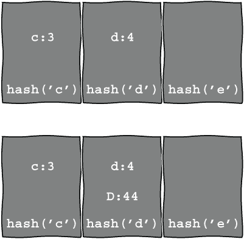
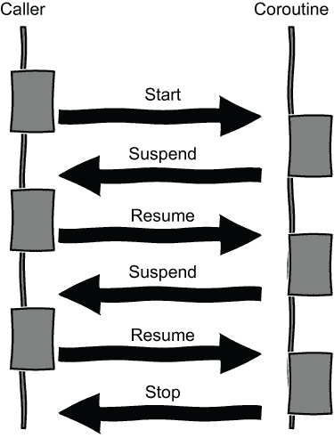

# 8 无序映射和协程

本章涵盖

+   无序映射

+   散列

+   协程

在本章中，我们将制作一个匹配便士游戏。这个游戏有两个玩家：我们和计算机。我们每人有一枚硬币，选择正面或反面。如果计算机匹配我们的选择，我们就会输。如果计算机的选择不同，我们就赢。我们可以使用随机分布来为计算机的猜测，因此我们不需要为第一场比赛编写很多代码。

一旦我们使初始的匹配便士游戏运行起来，我们将通过构建一个读心机来查看计算机是否能够预测我们的猜测。说实话，计算机实际上并不能真正地读取我们的思想。克劳德·E·香农在 1953 年写了一篇名为“读心机（？）”的短文（见[`mng.bz/vPDp`](http://mng.bz/vPDp)）。标题中的问号是故意的。这个游戏已被用于博弈论中的思想实验和心理学研究。读心者需要跟踪之前发生的事情，因此我们将使用`std::unordered_map`来跟踪状态。在第七章中，我们使用了`std::map`。在这一章中，我们将使用`std::unordered_map`进行进一步练习。正如我们在第七章中提到的，`std::map`需要为它的键定义一个`operator<`。`std::unordered_map`需要一个`hash`和一个等价运算符，因此我们还将了解`std::hash`。计算机将使用状态来预测我们的下一个选择。完成之后，我们将代码包裹在一个协程中以进行额外练习。

## 8.1 随机生成的匹配便士游戏

要开始，我们将使计算机随机生成一个`0`或`1`，代表正面或反面，使用`std::uniform_int_distribution`。我们还需要用户输入。在第三章中，我们读取数字进行猜数字游戏，因此我们需要与列表 3.4 中的函数类似的代码。该函数试图从一个流中提取一个数字，并返回一个`std::optional`。在这种情况下，我们只想接受`0`或`1`。任何其他输入都意味着玩家已经放弃。如果我们得到整个输入作为一个字符串，我们可以将输入与`"0"`或`"1"`进行比较，并返回适当的`optional<int>`。任何不是`0`或`1`的输入返回一个空的`optional`，表示玩家想要停止。

列表 8.1 读取`optional` `0`或`1`

```
#include <iostream>
#include <optional>
#include <string>
std::optional<int> read_number(std::istream& in)
{
    std::string line;
    std::getline(in, line);
    if (line == "0") {
        return { 0 };        ❶
    }
    else if (line == "1") {
        return { 1 };        ❷
    }
    return {};               ❸
}
```

❶ 0

❷ 1

❸ 空的`optional`表示停止

要构建我们的便士游戏，我们需要计算机随机选择`0`或`1`，因此我们需要一个生成器和分布：

```
std::mt19937 gen{ std::random_device{}() };
std::uniform_int_distribution dist(0, 1); 
```

要获取计算机的选择，我们调用`dist(gen)`。我们比较玩家和计算机的回合来决定谁赢了。如果我们跟踪玩家赢的次数和回合数，我们就可以在游戏停止后报告一些统计数据。将这些内容整合在一起，我们就得到了一个便士游戏。

列表 8.2 便士游戏

```
#include <random>
void pennies_game()
{
    int player_wins = 0;                                            ❶
    int turns = 0;                                                  ❶
    std::mt19937 gen{ std::random_device{}() };                     ❷
    std::uniform_int_distribution dist(0, 1);                       ❷

    std::cout << "Select 0 or 1 at random and press enter.\n";      ❷
    std::cout << "If the computer predicts your guess it wins.\n";  ❷
    while (true)                                                    ❷
    {                                                               ❷
        const int prediction = dist(gen);                           ❷

        auto input = read_number(std::cin);                         ❸
        if (!input)                                                 ❹
        {                                                           ❹
            break;                                                  ❹
        }
        const int player_choice = input.value();

        ++turns;                                                    ❺
        std::cout << "You pressed " << player_choice                ❺
                  << ", I guessed " << prediction << '\n';          ❺

        if (player_choice != prediction)                            ❺
        {                                                           ❺
            ++player_wins;                                          ❺
        }
    }
    std::cout << "you win " << player_wins << '\n'
        << "I win " << turns - player_wins << '\n';
}
```

❶ 跟踪统计数据

❷ 计算机回合

❸ 玩家回合

❹ 如果没有选择`0`或`1`则停止

❺ 更新统计数据

我们需要从`main`函数中调用`pennies_game`函数，然后我们可以玩游戏。计算机平均可能会赢一半的时间。就目前而言，这个游戏并不那么有趣。如果两个对手都是人类，他们将通过不可预测的行为来试图智胜对方。如果计算机追踪我们的选择，我们面临更大的挑战。让我们通过允许计算机思考来扩展游戏，或者至少基于之前的移动来做出预测。我们能否设法表现得随机并打败计算机？

## 8.2 使用 unordered_map 进行匹配硬币

香农追踪一个人与他机器对战时的状态。他不是追踪计算机和玩家的确切选择，而是追踪赢或输是否导致改变，以及这种改变是否导致随后的赢或输。例如，这个人可能会输，选择相同，然后再次输。这给出了八种可能的状态，如表 8.1 所示。

表 8.1 硬币游戏的八种可能状态

| 最后一次结果 | 选择 | 最后一次结果 | 结果 |
| --- | --- | --- | --- |
| 输 | 同 | 输 |
| 输 | 同 | 赢 |
| 输 | 变 | 输 |
| 输 | 变 | 赢 |
| 赢 | 同 | 输 |
| 赢 | 同 | 赢 |
| 赢 | 变 | 输 |
| 赢 | 变 | 赢 |

对于每种状态，香农追踪玩家所做的最后两个选择，注意他们是否改变了他们的回合或坚持了相同的选择。如果两个选择匹配，它们形成预测。如果不匹配，占卜者做出随机选择。我们可以从游戏开始时追踪每一个选择，但使用最后两个选择效果很好。让我们思考一下追踪每个状态的选择会发生什么。我们将构建一对针对状态的选择，并使用这些来做出预测，如果它们匹配的话。

假设我们总是选择正面，所以我们从不改变主意。香农的策略能否找出我们在做什么？随着时间的推移，无论我们赢还是输，桌子中间的选择总是“同”，所以只有四行被填充。因为我们总是玩正面，所以最后两个选择最终总是“同”，导致结果列如表 8.2 所示。

表 8.2 如果我们总是选择正面时的状态和对应结果

| 状态 | 预测基础 |
| --- | --- |
| 最后一次结果 | 选择 | 最后一次结果 | 结果 |
| 输 | 同 | 输 | 同，同 |
| 输 | 同 | 赢 | 同，同 |
| 输 | 变 | 输 |  |
| 输 | 变 | 赢 |  |
| 赢 | 同 | 输 | 同，同 |
| 赢 | 同 | 赢 | 同，同 |
| 赢 | 变 | 输 |  |
| 赢 | 变 | 赢 |  |

任何后续的回合都必须对应于四个被填充的行之一，因为选择永远不会改变。机器将找到两个匹配的“同”结果并预测玩家将选择相同，因此它似乎已经读懂了我们的心思。如果我们每次都改变选择，状态表的其余四行最终将被填充成一对“变”，机器再次正确预测。

填充状态表确实需要一些时间。最初，八个状态中没有任何条目，所以计算机随机选择。将这个与玩家的选择进行比较，我们可以知道结果是一个胜利还是一个失败。我们记住这个结果，因为它给出了对应于第一列值的第一个状态的部分。对于第二次出牌，我们仍然没有针对八个状态的条目来用于预测，所以计算机再次随机选择，玩家进行一轮。我们记住了倒数第二个结果，现在知道玩家是否改变了主意，然后赢了或输了。这一轮的额外信息对应于状态表中的最后两列：

```
{penultimate outcome, choice, last outcome}.
```

现在我们已经有一个完整的当前状态，我们准备在下一轮添加相应的第一个选择。同样，计算机随机出牌，但现在我们知道玩家是否坚持了同样的选择或改变了它。我们将这个记录为对前一个状态的第一种结果，然后更新为下一次准备的状态。理论上，状态可能和之前一样，所以在下一轮，我们可能有一对完整的条目在一行中；否则，我们可能在另一行中开始一对的选择。随着时间的推移，我们将开始填写选择对，这意味着计算机可能对状态有匹配的结果，并能够进行预测。读心者检查状态表中是否有与当前状态匹配的匹配对。如果有，预测就是该对中的值；否则，就随机选择。玩家也做出他们的选择，赢或输。然后可以更新状态，并将最新的选择存储在相应的值中。

我们注意到，始终切换或始终选择相同的结果会被机器检测到。使用不那么明显的策略，跟踪最后两个移动的八个状态太多，难以记住，所以很难弄清楚机器在做什么。要战胜读心者，最好的办法是跟踪状态，这样我们就能知道它会预测什么，然后做相反的事情。读心者并不是在读取玩家的思想，但跟踪它的行为很难，所以它可能会给人一种读心或任性的印象。像许多机器智能的表象一样，真正发生的是模式匹配或某种类型的统计分析。

而不是使用最后两个状态，我们可以保留每一个选择，并使用多数、移动平均或其他统计方法来进行预测。香农使用一对来保持他构建的电路既小又简单但有效。使用最后两个选择进行预测出奇地有效，所以让我们坚持香农的原始想法。

我们可以将八个状态存储在一个关联容器中，使用 `std::tuple` 作为三部分键，使用 `std::pair` 作为两个结果。元组需要一个赢或输，一个选择相同或改变，以及另一个赢或输。类枚举是表示这些的好方法。我们在第五章制作扑克牌游戏套装时遇到了范围枚举。枚举通常比魔法数字更清晰，因为我们可以使用一个名称来表示值，并且类枚举是强类型的，因此它不能错误地隐式转换为整数。选择和结果最初是未知的，因此我们可以使用 `Shrug` 和 `Unset` 来表示这些值。我们只需要在 `enum` 后面添加关键字 `class` 来创建范围枚举。

列表 8.3 三种可能的选择和结果

```
enum class Choice
{
    Same,
    Change,
    Shrug,
};
enum class Outcome
{
    Lose,
    Win,
    Unset,
};
```

我们状态的关键将是一个包含 `Outcome`、`Choice` 和另一个 `Outcome` 的元组，表示表 8.1 中的某一行，而值将是一个 `Choices` 对，因此我们需要包含 `utility` 和 `tuple` 头文件。我们可以为键和值使用 `typedef` 来节省每次使用时输入 `std::tuple<Outcome, Choice, Outcome>` 和 `std::pair<Choice, Choice>` 的麻烦。我们可以做得比 `typedef` 更好。C++11 引入了 *别名声明*，允许我们使用 `using` 来为现有类型引入别名。我们在第 4.2.2 节中看到了这一点，当时我们定义了世纪并说 `using centuries`。我们可以写

```
using state_t = std::tuple<Outcome, Choice, Outcome>;
using last_choices_t = std::pair<Choice, Choice>;
```

别名声明可以用于模板族，因此它比 `typedef` 更通用，但如果我们指定所有模板参数，它们是等价的。我们将在下一章进一步练习使用声明。现在，请记住优先使用 `using` 而不是 `typedef`。

我们已经有了状态的关键和值类型，但需要一个容器。我们在上一章学习了 `std::map` 并可以再次在这里使用它。然而，C++11 引入了 *无序* 容器，我们也可以用于查找表，所以让我们来看看这些容器是如何工作的。

### 8.2.1 无序容器和 std::hash

`std::map`、`std::multimap` 以及 `std::set` 和 `std::multiset` 是使用 `std::less` 作为排序默认比较的 *有序* 关联容器。正如我们在上一章所学，元素被排列在一个平衡的二叉树中，因此搜索是 `O(log(n))`。无序容器使用一个称为哈希表的不同数据结构，它将元素存储在槽或桶中。让我们花点时间来了解一下哈希表。

哈希表使用 `hash` 函数来计算元素的索引，指示它属于哪个桶。索引允许我们直接跳转到元素所属的桶，而无需在树的一部分中遍历，因此搜索哈希表可能比搜索 `std::map` 或其他基于树的结构的搜索更快。

现在，两个不同的元素可能具有相同的 `hash` 值，这被称为 *碰撞*，因此我们可能在特定的桶中有多个元素。搜索时需要检查桶中的每个元素以找到特定的元素，这会稍微减慢速度。对于一个好的哈希函数，我们不会得到很多冲突，通常可以直接访问只有一个元素的桶，但有时我们可能需要检查桶中的几个元素。在最坏的情况下，我们可能所有的元素都在一个桶中，因此我们的复杂度将是 `O(n)`。然而，对于一个不错的 `hash` 函数，我们期望每个桶中只有一个项目，因此搜索的平均复杂度是 `O(1)`。在正式术语中，我们说大-O 或复杂度是 *摊销常数时间*。有时，标准会告诉我们一个操作的最好情况复杂度，但有时它会告诉我们平均或摊销时间。

让我们通过将单个字符键映射到整数值来可视化哈希表。如果我们使用键的小写版本的 ASCII 值作为 `hash`，则相同字母的大小写版本将结束在同一个桶中。如果我们添加两个元素，键为 `'c'` 和 `'d'`，则没有冲突，所以我们最多只有一个元素。

在一个桶中存储元素。然而，如果我们随后添加一个键为 `'D'` 的元素，就会发生冲突，因为键为 `'d'` 和 `'D'` 的元素会存储在同一个桶中，如图 8.1 所示。



图 8.1 两个哈希表，一个没有冲突，另一个有冲突，意味着一个桶包含多个元素

要搜索键为 `'d'` 的元素，我们需要检查第二个表中的两个元素。现在，碰撞并不是灾难。我们仍然可以找到元素，但使用更好的 `hash` 函数可以获得更好的性能。

C++11 的 *unordered* 容器是使用 `std::hash` 的哈希表，定义在 `functional` 头文件中，作为 `hash` 函数。C++ 为各种类型提供了 `std::hash` 的特化，包括数值类型，以及 `std::string` 等（见 [`en.cppreference.com/w/cpp/utility/hash`](https://en.cppreference.com/w/cpp/utility/hash)）。如果我们想在无序容器中放置没有 `hash` 的类型，我们需要提供一个。该类型还必须在 `hash` 冲突的情况下支持相等性比较。

让我们使用 `unordered_map` 头文件中的 `std::unordered_map` 作为我们的状态表。与 `std::map` 一样，它需要一个 `key` 和 `value` 类型，但还需要一个 `Hash` 和 `KeyEqual` 类型。这些默认为 `std::hash` 和 `std::equal_to`，类似于

```
template<class Key, class Value, 
    class Hash = std::hash<Key>,
    class KeyEqual = std::equal_to<Key>
> class unordered_map;
```

我们的关键字是一个 `std::tuple`，它支持 `std::equal_to`。这是在 C++14 中引入的，默认为调用给定类型的 `operator==` 的函数对象。比较元组是即插即用的。给定两个元组

```
std::tuple t1 = {Outcome::Lose, Choice::Shrug, Outcome::Lose};
std::tuple t2 = {Outcome::Lose, Choice::Shrug, Outcome::Lose};
```

我们可以检查相等性：

```
bool match = t1 == t2;
```

这相当于

```
bool match = std::equal_to{}.operator(t1, t2);
```

首先，我们使用`{}`创建一个`std::equal_to`实例，然后`std::equal_to`的调用操作符默认调用`operator==`。因此，`unordered_map`类模板中的默认`KeyEqual`适用于我们的键。然而，`std::tuple`没有哈希实现，因此我们需要自己编写。我们可以特殊化`struct`

```
template<class Key>
struct hash;
```

对于我们的元组。本身，这个`struct`并没有做什么。然而，`functional`头文件中有几个特殊化提供了`operator()` `const`，它接受一个`Key`并返回一个`size_t`。许多操作符被标记为`noexcept`，因为它们不会抛出异常。我们将为`state_t`实现一个特殊化。CppReference 告诉我们，我们可以将自定义的`std::hash`特殊化注入到标准命名空间中（见[`en.cppreference.com/w/cpp/utility/hash`](https://en.cppreference.com/w/cpp/utility/hash)）。我们通常在我们的命名空间中添加代码，而不是在`namespace std`中，以避免与标准代码冲突。为特定类型定义`std::hash`是一个例外。这意味着`unordered_map`将找到我们键的`std::hash`特殊化。

要特殊化一个模板，我们声明我们要特殊化的类型。`hash`只接受一个类型，`template<class Key>`，所以我们只有一个类型要特殊化。我们从模板头部删除`class Key`，留下`template<>`，并在尖括号中指定类型，这给我们

```
template<>
struct std::hash<state_t>
```

我们的特殊化需要一个接受键并返回`size_t`的操作符。它需要是`const`的，并且我们可以将其标记为`noexcept`：

```
std::size_t operator()(state_t const& k) const noexcept
```

我们的元组有三个枚举类型，标准库为枚举类型提供了`std::hash`的特殊化。我们可以编写一个`hash`函数，结合各个元素的哈希值，为`std::hash<state_t>`提供特殊化。如果能找到一个方法来组合哈希值，以避免冲突会很好。对于

```
{Outcome::Lose, Choice::Shrug, Outcome::Win}
```

的哈希值之和会映射到与

```
{Outcome::Win, Choice::Shrug, Outcome::Lose}
```

相同的哈希值，从而造成冲突。如果我们能使用`operator<<`对每个元素的哈希值进行位移，就能做得更好。我们已经多次使用过流插入`operator<<`。内置的算术`operator<<`适用于数字而不是流，它将位向左移动（见[`mng.bz/n1D5`](http://mng.bz/n1D5)）。将二进制数`1,` `1` `<<` `1`位移一次得到二进制数`10`，因为`1`向左移动了。如果我们再位移一次，`2` `<<` `1`，我们得到二进制数`100`。通过不位移第一个元素，将第二个元素位移一位，将最后一个元素位移两位，然后对这三个位移后的哈希值求和，我们恰好避免了键的冲突。我们的方法在一般情况下并不好。我们尝试组合的元素越多，冲突的可能性就越大，位移越向左，最终得到零的可能性就越高。然而，对于我们的少量`Outcome`s 和`Choice`s，这种方法确实有效。

我们需要包含 `functional` 头文件以使用 `std::hash`。我们元组的特化工作如下。

列表 8.4 为我们的状态元组特化 `std::hash`

```
#include <functional>
template<>                                                            ❶
struct std::hash<state_t>                                             ❶
{
    std::size_t operator()(state_t const& state) const noexcept       ❷
    {
        std::size_t h1 = std::hash<Outcome>{}(std::get<0>(state));    ❸
        std::size_t h2 = std::hash<Choice>{}(std::get<1>(state));     ❸
        std::size_t h3 = std::hash<Outcome>{}(std::get<2>(state));    ❸
        return h1 + (h2 << 1) + (h3 << 2);                            ❹
    }
}; 
```

❶ 为 state_t 特化 std::hash

❷ 实现 operator()

❸ 获取每个元素的哈希

❹ 移位和求和

这将适用于我们的特定用例。WG21 讨论了哈希组合函数（见 [`mng.bz/orDZ`](http://mng.bz/orDZ)）并说实现一个好的 `hash` 函数并不简单。如果我们需要一个更通用的方法来组合字段以生成合适的哈希，Boost 库有一个 `hash_combine` 方法（见 [`mng.bz/6nre`](http://mng.bz/6nre)）。Boost 是一个历史悠久、免费且经过同行评审的 C++ 库。许多新的 C++ 功能最初都是在 Boost 中出现的，包括智能指针和 `optional`、`any` 以及 `variant` 类型。该库仍然包含许多 C++ 尚未支持但可能有一天会被采用的功能。它很大，但如果您以前从未见过它，那么值得一试。

拥有一个 `hash` 函数后，我们就可以在 `unordered_map` 中保存心灵感应机器的状态了。在包含 `unordered_map` 头文件后，我们可以编写一个返回初始状态的函数。表 8.1 中的八个键在 `state_t` 元组中表示。元组元素表示损失或胜利，然后是玩家选择“相同”或“交换”，结果是胜利或失败。相应的值是一个存储玩家在状态发生的前两次选择如何选择的对：

```
const auto unset = std::pair<Choice, Choice>{Choice::Shrug,Choice::Shrug};
```

我们可以使用初始化列表来初始化 `std::unordered_map`，就像我们在上一章中为 `std::map` 所做的那样。

列表 8.5 初始状态表

```
#include <unordered_map>
std::unordered_map<state_t, last_choices_t> initial_state()
{
    const auto unset = std::pair<Choice, Choice>{Choice::Shrug,
                                                 Choice::Shrug };
    return {
        { {Outcome::Lose, Choice::Same,   Outcome::Lose}, unset },
        { {Outcome::Lose, Choice::Same,   Outcome::Win},  unset },
        { {Outcome::Lose, Choice::Change, Outcome::Lose}, unset },
        { {Outcome::Lose, Choice::Change, Outcome::Win},  unset },
        { {Outcome::Win,  Choice::Same,   Outcome::Lose}, unset },
        { {Outcome::Win,  Choice::Same,   Outcome::Win},  unset },
        { {Outcome::Win,  Choice::Change, Outcome::Lose}, unset },
        { {Outcome::Win,  Choice::Change, Outcome::Win},  unset },
    };
}
```

我们试图确保不会出现 hash 冲突。对于我们的八个状态，冲突不会明显减慢游戏速度，但我们可以检查每个桶中最多只有一个元素。`std::unordered_map` 提供了一个 `bucket_count`，它告诉我们总共有多少个桶，以及一个 `bucket_size` 函数，它告诉我们特定桶中有多少个项。我们可以使用 `assert` 来编写一个 `check_properties` 函数，以验证我们没有任何冲突。

列表 8.6 检查是否存在 `hash` 冲突

```
#include <cassert>
void check_properties()
{
    std::unordered_map<
        state_t,
        last_choices_t
    > states = initial_state();

    for (size_t bucket = 0;
            bucket < states.bucket_count();
            bucket++)
    {
        assert(states.bucket_size(bucket) <= 1);    ❶
    }
}
```

❶ 每个桶最多一个项

测试通过了，但如果我们添加更多状态，我们手工制作的 `hash` 函数可能会出现问题。编写 `hash` 函数可能很困难。

现在，我们可以开始根据玩家的选择进行预测。将状态与心灵感应游戏分开意味着我们可以更容易地测试我们的代码。

### 8.2.2 使用 unordered_map 进行预测

心灵感应者要么根据状态表预测玩家的选择，要么随机选择。我们将保持状态表在一个类中，提供 `getter` 函数和 `update` 函数，以便在每个回合后使用。我们可以使用一个由列表 8.5 中的 `initial_state` 函数初始化的私有状态表。

列表 8.7 用于跟踪游戏状态的类

```
class State
{
    std::unordered_map<state_t,last_choices_t> state_lookup
                                             = initial_state();   ❶

public:
    last_choices_t choices(const state_t& key) const;             ❷
    void update(const state_t& key,
                const Choice& turn_changed);                      ❸
};
```

❶ 私有状态

❷ 为给定状态获取选择

❸ 在回合中更新值

我们有八个有效状态，但在我们有一个有效的 `state_t` 来查找之前需要一些预热。例如，我们将从没有回合开始，所以状态

```
{Outcome::Unset, Choice::Shrug, Outcome::Unset}
```

该状态不在表 8.1 中，所以我们将使 `choices` 函数在这种情况下返回一对 `Shrug`s。我们尝试在查找中找到一个键。如果找不到元素，`find` 方法返回 `unordered_map` 的 `end`，因此我们有一个无效状态。如果找到了，我们返回相应的值。

列表 8.8 查找选择或返回两个 `Shrug`s

```
last_choices_t choices(const state_t& key) const
{
    if (auto it = state_lookup.find(key);
            it!=state_lookup.end())                  ❶
    {                                                ❶
        return it->second;                           ❶
    }
    else
    {
        return { Choice::Shrug, Choice::Shrug };     ❷
    }
}
```

❶ 尝试找到键

❷ 在预热阶段，所以 Shrug

要更新状态，我们还需要注意初始的 `state_t` 不在我们的状态表中。再次尝试找到键：

```
if (auto it = state_lookup.find(key); it != state_lookup.end())
```

如果我们有一个有效状态，我们可以从迭代器中获取前两个选择：

```
const auto [prev2, prev1] = it->second;
```

我们可以更新键为新的一对：

```
last_choices_t value{ prev1, turn_changed };
it->second = value;
```

实际上，更新状态忽略了前几个回合中的无效状态，并且只更新有效状态。

列表 8.9 更新有效键的选择

```
void update(const state_t& key, const Choice& turn_changed)
{
    if (auto it = state_lookup.find(key);
            it != state_lookup.end())                  ❶
    {
        const auto [prev2, prev1] = it->second;        ❷
        last_choices_t value{ prev1, turn_changed };   ❷
        it->second = value;                            ❸
    }
}
```

❶ 检查键是否存在

❷ 形成新的选择对

❸ 更新查找

我们可以使用 `choices` 返回的 `last_choices_t` 来做出预测，即使对于初始无效状态也是如此。如果两个元素匹配，我们返回该值；否则，我们返回 `Choice::Shrug` 来表示我们无法做出预测。我们故意为无效状态返回了一对 `Shrug`s。因为它们匹配，所以对无效状态返回了 `Shrug`，这样心灵感应者就知道要随机选择。

列表 8.10 从状态中选择

```
Choice prediction_method(const last_choices_t& choices)
{
    if (choices.first == choices.second)    ❶
    {                                       ❶
        return choices.first;               ❶
    }
    else
    {
        return Choice::Shrug;               ❷
    }
}
```

❶ 匹配，因此返回任意值

❷ 不匹配，因此无法做出预测

现在我们已经准备好构建一个心灵感应者。它将使用我们的 `State` 类来进行预测。心灵感应者做出预测，玩家做出选择。然后我们更新状态表，准备进行新的预测。

### 8.2.3 心灵感应者游戏

我们可以使用列表 8.7 中创建的 `State` 类来创建一个 `mind` `reader` 类。对于某些状态，我们需要一个随机的翻转。我们已经使用生成器和分布使用随机数字几次了。我们可以创建一个模板类，接受这些类型，这样我们可以在测试中伪造它们。当我们测试列表 6.12 中的随机块时，我们使用了一个总是返回 `0` 的 lambda 作为生成器

```
[]() { return 0; }
```

并且可以在这里做同样的事情。对于实际游戏，我们使用一个合适的生成器和返回 `0` 或 `1` 的分布：

```
std::mt19937 gen{ std::random_device{}() };
std::uniform_int_distribution dist{ 0, 1 };
```

使用分布和生成器允许心灵感应者生成一个随机的 `0` 或 `1`：

```
int flip() { return dist(gen); }
```

我们可以使用该函数来初始化一个预测变量：

```
int prediction = flip();
```

玩家走一步后，心灵感应者的`prediction`将更新，使用当前状态，因此我们需要一个初始化为

```
{Outcome::Unset, Choice::Shrug, Outcome::Unset}    
```

我们很快将定义更新函数。如果它返回一个`bool`，表示翻转而不是预测，我们可以在玩游戏时跟踪心灵感应者做了多少次猜测。我们的心灵感应器类看起来像这样。

列表 8.11 一个心灵感应器类

```
template <std::invocable<> T, typename U>
class MindReader {
    State state_table;
    T generator;
    U distribution;
    int prediction = flip();               ❶
    state_t state{                         ❶
        Outcome::Unset,                    ❶
        Choice::Shrug,                     ❶
        Outcome::Unset                     ❶
    };                                     ❶❷
    int previous_go = -1;                  ❶❷
    int flip()                             ❶
    {                                      ❶
        return distribution(generator);    ❶
    }
public:
    MindReader(T gen, U dis)
        : generator(gen), distribution(dis)
    {
    }
    int get_prediction() const
    {
        return prediction;
    }
    bool update(int player_choice);
}; 
```

❶ 最初做出随机选择

❷ 存储状态和玩家的回合

当玩家走一步时，我们更新心灵感应者，让它知道玩家的选择。首先，玩家的选择要么改变了，要么没有改变，因此它可以用来使用列表 8.9 中显示的函数更新当前状态。我们计算出这一回合是否改变

```
const Choice turn_changed = player_choice == previous_go ?
                            Choice::Same : Choice::Change;
```

然后相应地更新状态表：

```
state_table.update(state, turn_changed);
```

我们可以将当前的`player_choice`存储在`previous_go`中，以便下次使用。

当前状态已经改变，可以做出新的预测，为下一回合做好准备。我们更新状态，将先前的输赢移到元组的开头，并注明这一回合是否改变以及是否获胜：

```
state = {std::get<2>(state), turn_changed, 
    (player_choice != prediction) ? Outcome::Win : Outcome::Lose};
```

我们在表中查找该状态，`state_table.choices(state)`，并使用列表 8.10 中的函数来决定一个预测方法。我们得到一个`Choice`。对于`Shrug`，我们抛硬币。对于`Change`，我们想要交换一个`0`和一个`1`或反之亦然，因此我们可以使用位运算符`^`，与`1`一起计算选择与`1`的异或，得到相反的结果。如果预测是 Same，我们知道玩家这次选择了什么，因此我们可以相应地更新我们的预测。我们可以在`MindReader`的新函数中这样做。

列表 8.12 更新预测

```
bool update_prediction(int player_choice)
{
    bool guessing = false;
    Choice option = prediction_method(state_table.choices(state));
    switch (option)
    {
    case Choice::Shrug:
        prediction = flip();
        guessing = true;
        break;
    case Choice::Change:
        prediction = player_choice ^ 1;
        break;
    case Choice::Same:
        prediction = player_choice;
        break;
    }
    return guessing;
}
```

`update`函数在更新状态表和当前状态后使用`update_prediction`。

列表 8.13 心灵感应者的`update`方法

```
bool update(int player_choice)
{
    const Choice turn_changed = player_choice == previous_go ?
                                Choice::Same : Choice::Change;
    state_table.update(state, turn_changed);        ❶

    previous_go = player_choice;
    state = {std::get<2>(state),
             turn_changed,
             (player_choice != prediction) ?
                Outcome::Win : Outcome::Lose};      ❷

    return update_prediction(player_choice);        ❸
}
```

❶ 更新状态表

❷ 更新状态

❸ 做出下一个预测

游戏本身现在非常像我们在列表 8.2 中开始的便士游戏。在主游戏循环中，我们不需要随机选择`0`或`1`，而是需要咨询心灵感应者进行预测。我们还将跟踪猜测次数，并在玩家停止时报告。

列表 8.14 一个心灵感应器游戏

```
void mind_reader()
{
    int turns = 0;
    int player_wins = 0;
    int guessing = 0;

    std::mt19937 gen{ std::random_device{}() };
    std::uniform_int_distribution dist{ 0, 1 };
    MindReader mr(gen, dist);

    std::cout << "Select 0 or 1 at random and press enter.\n";
    std::cout << "If the computer predicts your guess it wins\n";
    std::cout << "and it can now read your mind.\n";
    while (true)
    {
        const int prediction = mr.get_prediction();              ❶

        auto input = read_number(std::cin);
        if (!input)
        {
            break;
        }
        const int player_choice = input.value();

        ++turns;
        std::cout << "You pressed " << player_choice 
            << ", I guessed " << prediction << '\n';

        if (player_choice != prediction)
        {
            ++player_wins;
        }
        if (mr.update(player_choice))                            ❷
        {
            ++guessing;
        }
    }
    std::cout << "you win " << player_wins << '\n'
        << "machine guessed " << guessing << " times" << '\n'    ❸
        << "machine won " << (turns - player_wins) << '\n';
} 
```

❶ 咨询心灵感应者

❷ 更新心灵感应者

❸ 报告猜测

从`main`函数中调用此方法，看看你是否能比心灵感应者更聪明。如果你自己跟踪状态，你可以看到它会预测什么并赢得胜利，但没有纸笔，你很可能会忘记。结果证明，随机行为非常困难。

我们有一个心灵感应者，我们可以将其打包到协程中，以了解另一个新的 C++特性。

## 8.3 协程

协程是在 20 世纪 50 年代发明的，Melvin Conway 在 1958 年提出了这个术语。后来，在 1978 年，Tony Hoare 在 *Communications of the ACM* 的一篇论文中描述了一种名为 *communicating sequential processes*（CSP）的协程类型（参见 [`dl.acm.org/doi/10.1145/359576.359585`](https://dl.acm.org/doi/10.1145/359576.359585)），并在 1985 年撰写了同名的书籍。他开发了一种使用通过消息传递进行通信的顺序过程进行并发编程的语言。他的方法避免了并发代码中的一些常见问题，例如死锁。他的形式化语言允许进行数学证明，证明这些问题不会发生。在非常高的层面上，这些过程是具有输入和输出的函数。通过连接输入和输出，几个函数可以同时运行，而无需保护共享内存。

C++20 引入了协程（参见 [`mng.bz/5oEO`](http://mng.bz/5oEO)）。对协程的支持相对较低级，因此 C++ 协程通常需要相当多的样板代码。我们可以编写一个协程来产生玩家的选择和预测。这既不会改变游戏，也不会发挥异步代码的全部威力，但我们将发现构建协程和修改第六章中学习的零规则所需的内容。即使我们不使用协程的全部潜力，了解所需的构建块也是值得的。

协程强大且灵活。挂起和恢复工作，可能在不同的线程上，提供了一种并行性。Lewis Baker 写了一系列博客文章，深入探讨了众多细节（参见 [`mng.bz/mjda`](http://mng.bz/mjda)），互联网上关于 C++ 协程的讨论和博客文章也很多，因为它们是一个可以以多种方式使用的大新特性。让我们学习基础知识。

### 8.3.1 如何创建协程

协程是一个包含一个或多个三个关键字之一的函数：`co_yield`、`co_await` 或 `co_return`。*Yield* 返回一个值并*暂停*函数。协程的状态被封装起来，允许挂起的执行稍后继续。*await* 表达式调用异步操作，并在该操作完成时*恢复*。*return* 完成函数。与普通函数不同，协程的生命周期并不绑定到调用者。例如，恢复可以发生在不同的线程上。我们在这里不会使用该功能，而是学习将普通函数转换为协程所需的内容。协程函数返回一个提供所需样板的对象，允许编译器生成协程代码。

在大多数情况下，我们需要为返回的对象编写代码，尽管 C++23 引入了`std::generator`([`mng.bz/7vmv`](http://mng.bz/7vmv))，它提供了一个从简单的生成器协程返回的具体类型。CppReference 提供了从名为`letters`的协程输出字母表的示例代码。`letters`函数是一个协程，因为它使用了`co_yield`。该函数返回一个`std::generator`，它提供了初始化协程和处理`co_yield`所需的内容。该函数没有`co_return`，我们注意到它完成了协程，因此`letters`可能生成一个无限序列。我们可以多次调用它。例如，我们可以使用 range 的`views`通过`take`函数获取前 26 个字母。不幸的是，`std::generator`尚未得到广泛支持，但 Visual Studio 2022 在`experimental/generator`头文件中提供了一个`experimental`版本。

列表 8.15 使用`std::generator`

```
#include <experimental/generator>                                 ❶
#include <ranges>

std::experimental::generator<char> letters(char first)            ❷
{
    for (;; co_yield first++);                                    ❸
}

void generator_experiment()
{
    for (const char ch : letters('a') | std::views::take(26))     ❹
        std::cout << ch << ' ';
    std::cout << '\n';
} 
```

❶ 使用实验性头文件

❷ 协程返回生成器

❸ `co_yield`使这个函数成为协程。

❹ 按照我们想要的次数调用协程

随着时间的推移，我们可能会看到更多由标准支持的协程的具体返回对象。目前，我们通常不得不自己编写样板代码，除非我们选择的编译器支持`std::generator`并且适用于我们的用例。

我们将编写一个`co_yields`玩家输入和心灵感应者预测的协程。调用代码将获取并显示结果。我们的游戏不需要协程版本，但了解如何使用这个新的 C++特性将是有益的。我们将逐步构建协程所需的代码。到目前为止，我们发现协程

+   是一个包含`co_yield`、`co_await`或`co_return`的函数

+   返回一个提供所需样板代码的对象

列表 8.15 有一个`co_yield`，生成器提供了所需的样板代码。为了将我们的游戏转换为协程，我们将

+   编写一个包含`co_yield`和`co_return`的函数（第 8.3.2 节）

+   返回一个用户定义的名为`Task`的类，尽管可以使用任何其他名称（第 8.3.3 节）

+   实现一个`promise_type`，必须这样命名，因为编译器期望它（第 8.3.3 节）

`Task`和`promise_type`从协程函数中启动、停止并产生数据，因此我们将添加以下细节：

+   `Task`和`promise_type`的创建和销毁（第 8.3.4 节）

+   启动和停止协程以及如何`co_yield`数据或`co_return`（第 8.3.5 节）

+   允许调用代码在协程挂起后继续执行，直到游戏结束（第 8.3.6 节）

我们以调用代码使用`Task`结束，这为我们提供了一个游戏的新版本。

### 8.3.2 协程函数

在列表 8.14 中，我们编写了一个 `mind_reader` 函数，处理用户输入，获取预测并显示结果。我们将提取用户输入和预测以形成一个协程。我们需要包含 `coroutine` 头文件，并且我们的新函数将返回一个提供协程所需样板代码的对象。让我们称它为 `Task` 并在下一节中实现它。我们将从协程本身开始。

和之前一样，我们创建一个 `MindReader` 对象，并在用户想要玩游戏时循环。如果玩家放弃，我们的协程将使用 `co_return` 停止。否则，我们 `co_yield` 玩家的选择和心灵感应者的预测。将 `co_return` 或 `co_yield` 添加到函数并返回一个合适的对象，就可以创建一个协程。

列表 8.16 我们的第一个协程

```
#include <coroutine>
struct Task;                                                ❶
Task coroutine_game()                                       ❷
{
    std::mt19937 gen{ std::random_device{}() };
    std::uniform_int_distribution dist{ 0, 1 };
    MindReader mr(gen, dist);
    while (true)
    {
        auto input = read_number(std::cin);
        if (!input)
        {
            co_return;                                      ❸
        }
        int player_choice = input.value();
        co_yield{ player_choice , mr.get_prediction() };    ❹
        mr.update(player_choice);
    }
} 
```

❶ 前置声明我们将要实现的 Task

❷ 返回合适对象的协程函数

❸ 如果玩家放弃，则停止

❹ 产生玩家的回合和心灵感应者的预测

编译器使用返回的 `Task` 中的函数来连接所需的生成和返回，以及创建一个*协程帧*。这封装了函数，允许它在遇到 `co_XXX` 函数时挂起。当我们生成一个选择和一个预测时，协程将挂起直到恢复。协程然后从下一行开始，状态与它暂停时相同，更新心灵感应者。如果我们调试协程，当我们恢复时，我们似乎会瞬间出现在 `while` 循环的中间。

协程状态通常是动态分配的，因此它通常被描述为*无栈的*。实际上，协程是一个捆绑成动态对象的功能，以便它可以暂停（*挂起*）和*恢复*直到完成。协程甚至可以在不同的线程上恢复。控制权在调用者和协程之间传递，如图 8.2 所示。



图 8.2 协程可以根据需要暂停和恢复。

我们前置声明了一个 `Task` 以从我们的协程返回，所以让我们接下来实现它。

### 8.3.3 协程的返回对象

协程的返回对象通常被描述为承诺或任务，但我们有权使用我们喜欢的任何名称。我们需要为我们的协程添加几个函数才能使其工作。具体要求因协程而异，但我们总是看到两件事。首先是一个*承诺对象*，它用于将结果或异常报告给协程外的代码，其次是一个协程句柄，它用于协程内部在完成时恢复执行或销毁协程帧。

让我们逐步构建我们的 `Task`。编译器要求在 `Task` 内部有一个名为 `promise_type` 的东西。我们既可以单独定义一个类并将其添加到任务中的 `using` 声明中，也可以在 `Task` 中作为嵌套类内联定义一个类。我们将使用嵌套类，因此我们的协程返回的 `Task` 将像这样开始。

列表 8.17 连接协程的结构

```
#include <coroutine>
struct Task                ❶
{
    struct promise_type    ❷
    {
    };
};
```

❶ 列表 8.16 返回的任务

❷ 所需结构

编译器使用我们从列表 8.16 的 `coroutine_game` 返回的 `Task` 以及其 `promise_type` 来生成代码。我们需要在 `promise_type` 和 `Task` 中添加更多细节，以便我们的 `coroutine_game` 能够编译。我们可以为我们的返回类型使用任何名称，尽管 `Task` 是一个常用的名称；然而，我们必须有一个名为 `promise_type` 的相关类。`Task` 和 `promise_type` 允许协程开始、停止和产生数据。让我们填写这些细节。

### 8.3.4 RAII 和零规则

在列表 8.16 中，我们编写了一个返回我们刚刚开始创建的 `Task` 的协程。编译器为协程生成的代码通过调用一个 `get_return_object` 函数从 `promise_type` 获取一个 `Task`，这个函数的伪代码如下：

```
promise_type promise;
auto task = promise.get_return_object();
```

我们没有直接创建一个 `Task`。只有 `promise_type` 在 `get_return_object` 函数中这样做。目前，我们可以在 `promise_type` 中添加一个函数：

```
Task get_return_object() {  return Task{}; }
```

然而，我们仍然可以在任何地方创建 `Task`，这对除了编译器之外的其他东西没有多大用处。如果我们给 `Task` 一个私有构造函数，`promise_type` 可以创建一个任务，因为我们将其作为内部类创建，但其他任何东西都不能。

此外，我们还注意到承诺对象将结果或异常发送到协程外的代码，我们使用协程句柄来恢复执行或销毁协程帧。协程提供了一个 `from_promise` 方法来获取 `std::coroutine_handle`，因此如果我们把 `promise_type` 的指针存储在 `Task` 中

```
promise_type * promise;
```

我们可以在需要时使用以下方式包含句柄

```
auto handle = std::coroutine_handle<promise_type>::from_promise(*promise);
```

现在，原始指针通常很麻烦。我们不需要删除指针，因为编译器会为我们处理协程的生命周期，但当我们完成时应该调用 `destroy` 方法。如果我们给 `Task` 添加一个析构函数，我们可以使用 RAII 执行必要的清理。在析构函数中，我们可以从 `promise` 创建一个句柄并调用

```
handle.destroy()
```

然而，第六章告诉我们，添加我们自己的析构函数阻止了隐式移动，但保留了复制操作。复制 `Task` 可能会导致资源泄露。我们可以显式删除副本并使移动操作成为默认，或者使用智能指针来处理承诺指针。使用智能指针意味着我们不再需要一个析构函数来为我们清理。

在第六章中，我们遇到了 `std::unique_ptr`。我们当时接受默认的 `"delete"` 是因为我们想要删除原始指针。现在我们想要不同的行为。智能指针需要一个类型和一个删除器，默认情况下会调用 `delete`：

```
template<class T, class Deleter = std::default_delete<T>> class unique_ptr
```

我们的需要调用 `destroy` 方法来处理从 `from_promise` 获取的句柄，句柄与我们的 `promise_type` 指针相关。我们可以使用类模板编写一个更通用的函数，适用于任何 `promise` 类型。

列表 8.18 自定义 `"deleter"`

```
template<typename Promise>                               ❶
struct coro_deleter                                      ❶
{                                                        ❶
    void operator()(Promise* promise) const noexcept     ❶
    {
        auto handle =
            std::coroutine_handle<Promise>::from_promise(
                *promise
            );                                           ❷
        if (handle)                                      ❸
            handle.destroy();                            ❸
    }
};
```

❶ 任何 `promise` 类型的模板函数

❷ 从 `promise` 获取句柄

❸ 如果有句柄则调用 `destroy`

然后，我们可以使用我们之前遇到的 `using` 语句声明一个使用删除器的模板家族。我们使用任何类型 `T` 的 `std::unique_ptr`，带有 `coro_deleter<T>`：

```
template<typename T>
using promise_ptr = std::unique_ptr<T, coro_deleter<T>>;
```

现在，我们可以在 `Task` 中使用 `promise_ptr` 并依赖零规则。因为没有必要再定义析构函数，因为 `std::unique_ptr` 会为我们清理。

现在，我们可以在 `Task` 中填充更多函数。首先，我们添加一个接受 `promise_type` 指针的私有构造函数，并将其存储在 `promise_ptr` 中。然后，我们可以向 `promise_type` 添加一个返回 `Task` 的 `get_return_object` 函数。

列表 8.19 连接协程的结构

```
#include <coroutine>
#include <memory>
struct Task
{
    struct promise_type
    {
        Task get_return_object()              ❶
        {
            return Task(this);
        }
    };
private:
    promise_ptr<promise_type> promise;        ❷
    Task(promise_type* p) : promise(p) {}     ❸
};
```

❶ 只由 promise_type 创建 Task

❷ 用于 RAII 的智能指针

❸ 私有构造函数

我们已经编写了足够的代码来创建 `Task` 和在完成时销毁协程句柄。我们仍然需要添加一些更多函数来处理创建和销毁之间的操作。让我们填写细节，以便使列表 8.16 中使用的 `co_yield` 和 `co_return` 正常工作。

### 8.3.5 填充 `promise_type`

让我们从 `promise_type` 开始。编译器根据这个类中的函数注入代码。我们总是需要定义三个函数，说明以下情况会发生什么：

1.  当我们首次启动协程时

1.  如果抛出异常

1.  当协程停止时

协程体中任何未捕获的异常都会调用 `unhandled_exception` 方法。最简单的实现是不做任何事情：

```
void unhandled_exception() {}
```

或者，我们可以记录问题甚至调用终止。

我们还需要名为 `initial_suspend` 和 `final_suspend` 的方法来指示是否挂起。作为协程支持的一部分，C++20 引入了两个辅助类 `suspend_always` 和 `suspend_never`，分别用于挂起或不挂起。我们希望我们的协程能够获取用户输入和预测，以便调用代码使用，所以我们使用 `suspend_never` 来表示它应该最初运行：

```
std::suspend_never initial_suspend() noexcept { return {}; }
```

注意我们在 8.2.1 节中编写的 `hash` 函数时遇到的 `noexcept`。从不挂起有时被称为热启动，而最初暂停协程则称为冷启动。当我们完成时，我们总是挂起以标记我们已经完成：

```
std::suspend_always final_suspend() noexcept { return {}; }
```

这在协程句柄上设置了一个标志，这样 `Task` 就可以查看协程是否已完成。

我们已经处理了协程的开始和结束，但还没有提供处理 `co_await`、`co_yield` 或 `co_return` 的代码。列表 8.16 中的协程提供了玩家的选择和预测：

```
co_yield { player_choice , mr.get_prediction()};
```

因此，编译器会在我们的 `promise_type` 中寻找返回一对 `int` 的 `yield_value` 方法。如果我们没有使用 `co_yield`，我们就不需要这个方法。我们可以在承诺中存储 `std::pair` 的 `int`，这样 `Task` 就可以访问它们并将它们返回到协程外的代码。

在 `yield` 之后，我们挂起协程，并通过从 `yield_value` 方法返回 `suspend_always` 来表示这一点：

```
std::suspend_always yield_value(std::pair<int, int> got)
{
    choice_and_prediction = got;
    return {};
}
```

控制权返回到调用代码。

当玩家放弃时，我们调用`co_return`，因此我们需要向`promise_type`添加另一个函数。`co_return`可以是空的，或者后面跟着一个表达式来返回。我们的`co_return`是空的，所以我们需要一个`return_void`方法：

```
void return_void() {}
```

如果我们想要返回一个值，我们需要一个`return_value`函数而不是`co_return`。我们的完整承诺类型如下。

列表 8.20 完整的承诺类型

```
struct promise_type
{
    std::pair<int, int> choice_and_prediction;                  ❶

    Task get_return_object()                                    ❷
    {
        return Task(this);
    }
    std::suspend_never initial_suspend() noexcept               ❸
    { 
        return {};
    }   
    std::suspend_always final_suspend() noexcept                ❹
    {
        return {};
    }   
    void unhandled_exception() {}                               ❺
    std::suspend_always yield_value(std::pair<int, int> got)    ❻
    {
        choice_and_prediction = got;
        return {};
    }

    void return_void() { }                                      ❼
};
```

❶ 数据

❷ 创建任务

❸ 启动

❹ 停止

❺ 异常处理

❻ 由 Task 的 co_yield 调用

❼ 由 Task 的 co_return 调用

我们几乎完成了。`promise_type`现在拥有了协程所需的所有方法。协程返回的`Task`为我们提供了一个地方来指示承诺中的数据，并将协程恢复到完成。让我们填补这些缺失的部分。

### 8.3.6 填充`Task`类型

要从`Task`返回选择和预测，我们提供一个获取器函数，从`promise_ptr`获取数据的`std::pair`：

```
std::pair<int, int> choice_and_prediction() const
{
    return promise->choice_and_prediction;
}
```

我们可以通过调用句柄的`done`方法来检查协程是否完成。当`promise_type`的`final_suspend`方法被调用并返回`suspend_always`时，此标志被设置为 true。我们使用`from_promise`方法来获取句柄，然后查看我们是否完成：

```
bool done() const
{
    auto handle =
        std::coroutine_handle<promise_type>::from_promise(*promise);
    return handle.done();
}
```

当我们在列表 8.16 中使用`co_yield`时，协程暂停。然后调用代码使用玩家的选择和心灵感应者的预测做它想做的事情，但它需要一种方法来恢复协程以获取下一对。我们通过调用句柄的`operator()()`来恢复协程。我们可以在`Task`中添加一个名为`next`的函数，以恢复协程：

```
void next()
{ 
    auto handle =
         std::coroutine_handle<promise_type>::from_promise(*promise);
    handle();
}
```

当调用代码使用之前的选项和预测时，它可以调用`next`。将这些新方法添加到`Task`中，我们得到以下内容。

列表 8.21 协程的`Task`和`promise_type`

```
struct Task                                         ❶
{
    struct promise_type                             ❷
    {
    // ...
    };

    std::pair<int, int> choice_and_prediction()     ❸
    {
        return promise->choice_and_prediction;
    }
    bool done() const                               ❹
    {
        auto handle =
            std::coroutine_handle<promise_type>::from_promise(*promise);
        return handle.done();
    }
    void next()                                     ❺
    {
        auto handle =
            std::coroutine_handle<promise_type>::from_promise(*promise);
        return handle ();
    }
private:
    promise_ptr<promise_type> promise;              ❻
    Task(promise_type* p) : promise(p) {}           ❼
}; 
```

❶ 列表 8.16 中协程返回的任务

❷ 列表 8.20 中的 promise_type

❸ 让调用代码从承诺中获取数据

❹ 让调用代码知道我们是否完成

❺ 恢复协程

❻ RAII 的智能指针

❼ promise_type 可见的私有构造函数

我们的`Task`现在已经完成，我们可以使用协程。

### 8.3.7 一个协程心灵感应者

要使用我们的协程，我们可以使用类似于列表 8.14 中原始游戏的代码，但现在`MindReader`和用户输入现在都包含在`coroutine_game`中。我们通过调用以下内容来调用协程：

```
Task game = coroutine_game();
```

我们使用`Task`来控制协程。我们循环直到`done`，在每一轮获取玩家的选择和预测。这将在`co_yield`处暂停协程。然后我们的调用代码重新获得控制权并显示结果。通过在`Task`上调用`next`，控制权随后返回到协程，并从上次离开的地方继续。我们的调用代码如下所示。

列表 8.22 一个心灵感应者的协程版本

```
void coroutine_minder_reader()
{
    int turns = 0;
    int player_wins = 0;

    std::cout << "Select 0 or 1 at random and press enter.\n";
    std::cout << "If the computer predicts your guess it wins\n"
                         "and it can now read your mind.\n";

    Task game = coroutine_game();                     ❶

    while (!game.done())                              ❷
    {
        auto [player_choice, prediction] =
                    game.choice_and_prediction();     ❸
        ++turns;
        std::cout << "You pressed " << player_choice
                  << ", I guessed " << prediction << '\n';

        if (player_choice != prediction)
        {
            ++player_wins;
        }
        game.next();                                  ❹
    }
    std::cout << "you win " << player_wins << '\n'
        << "machine won " << (turns - player_wins) << '\n';
}
```

❶ 获取协程

❷ 检查用户是否停止

❸ 从协程中获取数据

❹ 允许协程恢复

使用协程对我们来说没有区别，但我们已经使用了 C++20 中经常讨论的一个特性。我们可以扩展这个特性，并编写另一个协程来 `co_await` 从 `std::cin` 输入，一个返回随机翻转的函数，甚至另一个心灵感应者。

协程可以在各种地方使用，包括等待输入或其他资源的异步操作。Andreas Fertig 的书 *Programming with C++20: Concepts, Coroutines, Ranges, and More* (Fertig Publications, 2021) 有一章专门介绍使用协程解析字节流。他在 2022 年在 Overload 上发表了概述（见 [`accu.org/journals/overload/30/168/fertig/`](https://accu.org/journals/overload/30/168/fertig/)）。Rayner Grimm 在他的博客上列出了几个可能的用例，包括事件驱动编程和协作多任务（见 [`mng.bz/qjPr`](http://mng.bz/qjPr)）。如果一个协程被挂起，那么程序的其他部分就可以运行，因此协程提供了一个受限的并发模型。

我们已经了解了许多 C++ 特性，我们几乎完成了。现在我们已经多次使用了模板参数包，但我们还没有探讨它们是如何工作的。让我们以最后一章进一步探索模板来结束我们的学习。

## 摘要

+   我们可以使用关键字 `using` 来给声明起别名，包括模板家族。

+   C++ 的无序容器使用哈希表。

+   哈希表将元素存储在桶中，并使用 `hash` 函数来定位桶。

+   `std::unordered_map` 默认使用 `std::hash` 和 `std::equal_to` 作为键。

+   我们可以将 `hash` 函数注入到 `namespace` `std` 中，以支持在 `std::unordered_map` 中的用户定义类型。

+   C++ 协程是一个包含一个或多个以下三个关键字之一的函数：`co_yield`、`co_await` 或 `co_return`。

+   协程可以被挂起和恢复。

+   协程的返回类型通常是用户定义的类型，包含启动和停止协程所需的函数，以及根据需要支持 `co_yield` 和 `co_await` 的函数。

+   C++23 引入了 `std::generator` 作为协程的返回类型，提供了一种可能无限长的序列，但对于其他用途，我们目前不得不自己编写承诺或任务，提供所需的样板代码。

+   我们为 `std::unique_ptr` 使用了 *自定义删除器*，以便我们可以使用零规则。
