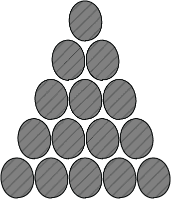
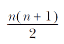
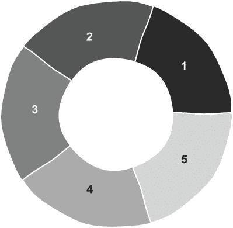
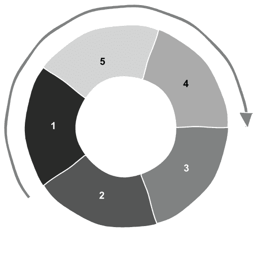
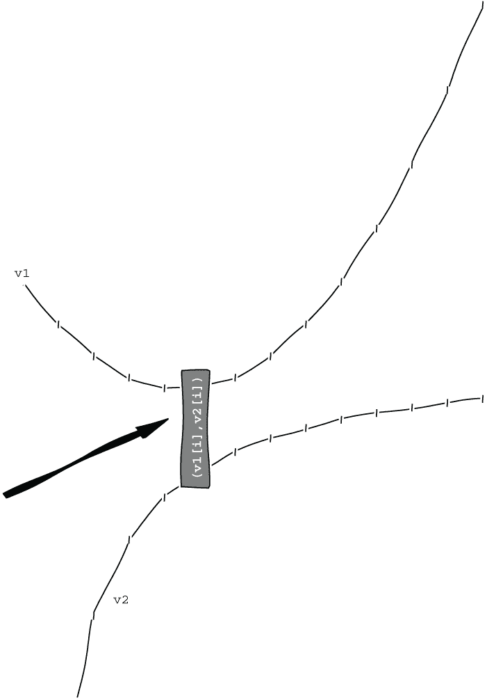

# 9 参数包和 std::visit

本章涵盖

+   使用算法和执行策略进行练习

+   模板参数包

+   `std::visit` 方法与 `Overload` 模式

+   可变 lambda

+   使用变体、`std::format` 和范围进行额外练习

我们已经多次使用参数包（模板中的三个点），但我们没有停下来理解它们是如何工作的。在最后一章中，我们将填补这些点，以及练习我们迄今为止学到的许多东西。我们将生成三角数，并简要考虑它们的某些属性。三角数出现在各种地方（例如，如果每个人在人群中握手，我们可以计算会有多少次握手）。因为我们从帕斯卡三角形开始，回到数字序列感觉像是一个很好的结束方式。

我们将发现我们可以通过几行代码使用数值算法来创建三角数，然后我们将使用前几个三角数构建一个老虎机。我们首先构建一个简单的机器，它只旋转滚筒。然后我们将改进游戏，允许暂停、推动或旋转。为了实现这些选项，我们将学习 `std::visit` 和 `Overload` 模式。我们将练习我们在前几章中学到的知识，这将帮助我们使用新特性编写更多的 C++ 代码，并自信地跟上任何未来的变化。

## 9.1 三角数

三角数是 1、3、6、10 等等，通过累加 1、1 + 2、1 + 2 + 3、1 + 2 + 3 + 4 等等得到。如果我们堆起这么多台球，我们就可以组成一个三角形。因此得名。为了在图 9.1 中显示的五个三角数上添加另一行，我们使用六个额外的台球。再下一行将增加七个，以此类推。



图 9.1 堆叠的台球，形成包含 15 = 1 + 2 + 3 + 4 + 5 个台球的三角形

我们将在本章中使用前几个三角数，因此让我们创建一个名为 `make_triangle_numbers` 的函数。我们将接受一个 `count` 参数并返回一个 `int` 类型的 `vector`。自 C++20 起支持 `constexpr` 的 `std::vector` 和 `std::string`（参见 [`mng.bz/wjDP`](http://mng.bz/wjDP)），因此我们可以将函数标记为 `constexpr`，这是我们首次在第三章中学习如何使用 `static_assert` 进行测试时看到的。我们也将能够在这里执行类似的检查。我们的新函数以以下签名开始：

```
constexpr std::vector<int> make_triangle_numbers(int count)
```

让我们添加细节。如果我们从数字 1、2、3 等开始，然后我们可以将这些数字相加以获得三角数。C++11 在 `numeric` 头文件中引入了 `iota` 函数，该函数使用递增的值填充容器，从选定的值开始。如果我们创建一个可以容纳 20 个数字的向量

```
std::vector<int> numbers(20);
```

然后，我们可以调用 `iota`，从值 1 开始，以创建 1、2、3 等数字：

```
std::iota(numbers.begin(),numbers.end(), 1);
```

或者，我们可以使用 C++23 中引入的范围版本：

```
std::ranges::iota(numbers, 1);
```

C++23 尚未得到广泛支持，所以你可能不得不等到你的编译器提供 ranges 版本。在任何情况下，这都将`vector`填充为从 1 开始，每次增加 1 的数字。这给我们 1, 2, 3,...20\. `iota`函数来自 APL 编程语言，并在 C++11 之前提出，但直到后来才被包含进来。这是一个小但有用的函数。

如果我们找到这些数字（1, 1 + 2, 等等）的部分和或累积和，我们得到三角形数。为此，我们可以使用`numeric`头文件中的`std::partial_sum`函数：

```
std::partial_sum(numbers.begin(),numbers.end(),numbers.begin());
```

然后，我们就得到了我们想要的三角形数（1, 3, 6, 10, 15,...210）。

列表 9.1 制作前几个三角形数

```
#include <numeric>
#include <vector>
constexpr std::vector<int> make_triangle_numbers(int count)
{
    std::vector<int> numbers(count);                                      ❶
    std::iota(numbers.begin(), numbers.end(), 1);                         ❷
    std::partial_sum(numbers.begin(), numbers.end(), numbers.begin());    ❸
    return numbers;
}
```

❶ 默认初始化整数的容器

❷ 填充 1, 2,...

❸ 求和 1, 1 + 2, 1 + 2 + 3,...

我们已经使用了一个较旧的 C++函数`std::partial_sum`以及来自`numeric`头文件的较新的`std::iota`函数。还有许多其他算法我们没有机会在这本书中使用。查看`algorithm`和`numeric`头文件，尝试一个你之前没有使用过的算法，或者甚至自己实现一个。这是保持练习的好方法。

### 9.1.1 使用算法测试我们的三角形数

我们应该测试我们的三角形数，并且可以使用一些额外的算法来做到这一点。我们可以使用`adjacent_difference`来撤销`partial_sum`，它给出了容器中相邻元素之间的差值。如果我们为这些差值创建一个`vector`，我们可以将这些差值与由`iota`创建的从 1 到 20 的整数进行比较，并且我们可以使用`assert`来验证它们是否匹配。

列表 9.2 测试我们的三角形数

```
#include <cassert>
void check_properties()
{
    const int count = 20;
    const auto triangle_numbers = make_triangle_numbers(count);
    std::vector<int> diffs(count);
    std::adjacent_difference(triangle_numbers.begin(),
                                        triangle_numbers.end(),
                                        diffs.begin());          ❶
    std::vector<int> numbers(count);
    std::iota(numbers.begin(), numbers.end(), 1);                ❷
    assert(numbers == diffs);                                    ❷
}
```

❶ 查找差值

❷ 与 1, 2,...比较

让我们花点时间在我们的测试函数中添加更多的`assert`。如果我们再次找到`adjacent_difference`，我们应该得到一个全为`1`的`vector`。我们可以使用带有 lambda 的`all_of`算法来检查这一点：

```
#include <algorithm>
std::adjacent_difference(diffs.begin(), diffs.end(), diffs.begin());
assert(std::all_of(diffs.begin(), diffs.end(),
                   [](int x) { return x == 1; }));
```

我们可以使用`std::coun`来计数，以检查我们是否得到了我们开始的数字：

```
assert(std::count(diffs.begin(), diffs.end(), 1) == count);
```

我们有一些小的测试，并将很快添加另一个。在我们这样做之前，值得补充一些更多的点。大多数算法都有各种重载。例如，`std::count`有三个版本（见[`en.cppreference.com/w/cpp/algorithm/count`](https://en.cppreference.com/w/cpp/algorithm/count)）。我们使用了第一个版本。第二个版本标记为`constexpr`，因此可以在编译时使用，第三个版本使用*执行策略*，允许算法的并行执行。

### 9.1.2 算法的执行策略

C++17 引入了几个存在于`execution`头文件中的执行类型策略。默认情况下，使用`sequenced_policy`，即`std::execution::seq`，这会导致算法按顺序操作，一次处理一个项目。我们也可以使用`std::execution::par`或`std::execution::par_unseq`以及 C++20 的`std::execution::unseq`。后三种允许并行执行，无序策略可能会以任何顺序执行。它们表明算法*可以*并行化，所以这是一个*许可*而不是*要求*。如果实现不能并行化，这些策略会回退到顺序策略，即使可以实现，代码也可能最终运行得更慢（参见 Bartlomiej Filipek 的博客[`mng.bz/JdGV`](http://mng.bz/JdGV)）。并行版本给我们提供了一个简单的方法来指示可以将工作分发到不同的线程，但它们并不保证加快代码的执行速度。它们可能会，但设置新线程上的工作可能会有开销。

如果我们将`std::execution::par`作为第一个参数添加，我们使用并行执行的覆盖：

```
#include <execution>
assert(std::count(std::execution::par, diffs.begin(), diffs.end(), 1)
                                       == count);
```

请求并行执行很简单，可能会加快你的代码执行速度。进行实验并测量以查看会发生什么。线程和并行执行是一个很大的话题。安东尼·威廉姆斯的书籍《C++并发实战》（Manning Publications，2019；见[`mng.bz/PR5n`](http://mng.bz/PR5n)）是一个极好的资源，你可以在互联网上找到他许多的演讲。

### 9.1.3 可变 lambda

我们到目前为止的测试是必要的，但并不充分。三角形数的封闭形式公式可以直接计算第 n 个数字，如下所示：



我们可以利用这种关系使我们的测试足够充分，至少对于前几个数字，通过检查每个值是否与方程的值相匹配。

列表 9.3 检查每个值

```
for (size_t i=0; i< triangle_numbers.size(); ++i)
{
    const int n = i + 1;
    assert(triangle_numbers[i] == n*(n+1)/2);
} 
```

我们已经看到，我们通常可以使用算法而不是`for`循环，并且因为我们想检查关系对所有数字都成立，所以`std::all_of`将起作用。然而，当我们切换到算法时，我们不再有变量`i`用于计算。我们可以在 lambda 的方括号`[]`中声明一个变量，并将 lambda 标记为`mutable`，这允许我们增加变量。如果没有`mutable`关键字，我们会得到编译器错误，告诉我们不能在不可变的 lambda 中修改按值捕获的变量。

此外，`mutable`允许 lambda 修改通过复制捕获的对象，并调用通过复制捕获的对象的非 const 成员函数。使用具有可变 lambda 的`std::all_of`而不是列表 9.3 中的`for`循环，我们可以得到以下代码。

列表 9.4 使用可变 lambda 检查每个值

```
assert(std::all_of(triangle_numbers.begin(), triangle_numbers.end(),
    n = 0 mutable                 ❶
    {                                      ❶
        ++n;                               ❶
        return x == n * (n + 1) / 2;
    }
));
```

❶ n 设置为 0 且为可变，因为 n 会增加

我们有三角形数和一些测试。如果我们停下来看看更多的属性，我们可以在算法上得到更多的练习。我们还将发现一个有用的属性，使三角形数适合用于我们的老虎机。

### 9.1.4 三角形数的更多属性

首先，让我们考虑三角形数是奇数还是偶数。然后，我们将找到另一个我们可以用于老虎机的模式。在调查过程中，我们还将对算法和`std::map`进行更多的练习。前两个三角形数，1 和 3，是奇数，然后我们得到两个偶数，6 和 10。这个模式会继续吗？我们将通过将我们的`vector`转换为标记奇数（点`'.'`）和偶数（星号`'*'`）来找出答案。

我们可以声明另一个`vector`来保存转换。我们在第七章中使用了`algorithm`头文件中的`std::transform`算法来将`std::string`中的字符转换为小写。有各种重载，但每个都应用于输入范围并存储结果。原始版本接受一对输入迭代器，第一个和最后一个，一个输出迭代器，和一个一元函数：一个接受一个输入的函数，就像我们的 lambda。C++20 引入了范围版本，它接受一个输入源，而不是一对迭代器，以及输出迭代器和一元函数。还有一个接受两个输入范围和用于创建输出的二元函数的版本，以及一个接受执行策略的版本。

让我们编写一个名为`demo_further_properties`的函数。我们将为每个数字使用一个字符，因此我们可以使用`char`的`vector`来存储结果：

```
std::vector<char> odd_or_even
```

我们可以编写一个转换函数的 lambda 表达式，它接受一个`int`并返回表示数字奇偶性的适当字符：

```
[](int i) { return i%2? '.':'*'; }
```

如果`i%2`不为零，我们有一个奇数，因此我们返回`'.'`；否则，我们返回`'*'`。我们在转换中使用这个，使用`back_inserter`按需增长输出：

```
std::vector<char> odd_or_even;
std::ranges::transform(triangle_numbers,
    std::back_inserter(odd_or_even),
    [](int i) { return i%2? '.':'*'; });
```

我们可以使用基于范围的`for`循环来显示数字的奇偶性，但在第二章中，我们提到我们可以使用`std::copy`或范围版本的函数将容器的内容插入到流中。第一个参数是容器，或其`begin`和`end`，第二个是一个使用流（在我们的情况下，`std::cout`）和分隔符（例如，空格）构造的`std::ostream_iterator`。一旦包含`iostream`头文件，我们就可以在单行代码中流式传输奇数或偶数标记：

```
std::ranges::copy(odd_or_even, std::ostream_iterator<char>(std::cout, " "));
```

我们的进一步属性函数看起来像这样。

列表 9.5 检查数字是否为奇数或偶数

```
#include <algorithm>
#include <iostream>
#include <iterator>

void demo_further_properties()
{
    const int count = 20;
    const auto triangle_numbers = make_triangle_numbers(count);
    std::vector<char> odd_or_even;                       ❶
    std::ranges::transform(triangle_numbers,
        std::back_inserter(odd_or_even),
        [](int i) { return i % 2 ? '.' : '*'; });        ❷
    std::ranges::copy(odd_or_even,
        std::ostream_iterator<char>(std::cout, " "));    ❸
    std::cout << '\n';
}
```

❶ 结果向量

❷ 检查奇偶性的 Lambda

❸ 复制到 cout

如果我们从`main`中调用它并查看输出，我们看到

```
. . * * . . * * . . * * . . * * . .
```

看起来我们确实得到了两个奇数后面跟着两个偶数，反复出现。Stack Exchange 的数学网站解释了为什么会这样（见[`mng.bz/1JBj`](http://mng.bz/1JBj)）。

我们发现了一个有趣的模式。为了构建老虎机，我们希望在某个卷轴上显示一些项目。如果某些项目匹配，老虎机将支付。三角数的最后一位数字有另一个模式。一些数字出现的频率比其他数字高，因此我们可以使用三角数的最后一位数字来构建老虎机。出现频率较低的数字将提供更高的支付。通过在 `std::map` 中保持计数并计算 `% 10` 而不是 `% 2`，我们将看到每个数字出现的频率。我们需要将最后一位数字（一个 `int`）映射到一个计数，因此包含 `map` 头文件后，我们可以使用

```
std::map<int, size_t> last_digits;
```

在我们的 `demo_further_properties` 函数中。我们可以根据数字的可能性来决定老虎机的支付。我们将使用原始循环来找到每个三角数的最后一位数字。我们需要使用 `operator[]` 来查找数字 `% 10`，并增加我们获得的价值。我们了解到，在第七章中构建答案砸游戏时，`operator[]` 将在键不存在时将键值对插入到映射中。相应的值是值的默认类型，在我们的情况下，是一个 `size_t` 的 0。这正是我们所需要的。我们创建最后一位数字的计数如下：

```
for (int number: triangle_numbers)
{
    ++last_digits[number % 10];
}
```

我们可以输出计数，以便我们知道哪些数字发生得最频繁：

```
for (const auto& [key, value] : last_digits)
{
     std::cout << key << " : " << value << '\n';
}
```

将其拉入函数中，我们得到以下内容。

列表 9.6 将数字的计数添加到更多属性中

```
#include <map>

void demo_further_properties()
{
    const int count = 20;
    const auto triangle_numbers = make_triangle_numbers(count);
    // ... as before
    std::map<int, size_t> last_digits;                  ❶
    for (int number: triangle_numbers)
    {
        ++last_digits[number % 10];                     ❷
    }
    std::cout << 
        "Tallies of the final digits of the first 20 triangle numbers\n";
    for (const auto& [key, value] : last_digits)        ❸
    {                                                   ❸
        std::cout << key << " : " << value << '\n';     ❸
    }
}
```

❶ 使用地图存储计数

❷ 计算最后一位数字

❸ 输出结果

从 `main` 中调用这个函数，我们看到

```
0 : 4
1 : 4
3 : 2
5 : 4
6 : 4
8 : 2
```

`8`s 和 `3`s 不太可能；`0`、`1`、`5` 和 `6` 的可能性是两倍。事实上，最后一位数字重复的模式

```
13605186556815063100
```

反复进行。如果我们选择任意三个三角数，我们不太可能得到三个 `3`s 或 `8`s 作为最后一位数字，所以这样的结果可能是一个游戏的奖金。

让我们使用三个三角数卷轴来构建一个老虎机。我们需要制作三个卷轴，将数字随机排列。我们还希望显示卷轴，并在每次转动时使它们旋转，决定是否支付。

## 9.2 一个简单的老虎机

我们需要三个数字卷轴来旋转。我们将展示当前行的数字，以及上方和下方行的数字。我们可以用这样的 `'-'` 符号来表示当前行：

```
   28  91 153
-  45 120  45-
   36   1   3
```

我们将首先在每次转动时旋转卷轴。如果两个最后一位数字匹配，我们将支付，如果三个都匹配，我们将支付更多。一旦我们有一个工作的游戏，我们将在 9.3 节中扩展它，如果得到三个 `3`s 或 `8`s，我们将颁发奖金。

### 9.2.1 constexpr 和 std::format 的修订

列表 9.1 生成三角数作为 `std::vector<int>`。如果我们利用上一章中遇到的 `using` 语句，我们就不必每次提到卷轴时都拼写 `std::vector<int>`：

```
using Reel = std::vector<int>;
```

这可以放在 `main.cpp` 文件的顶部附近。现在我们可以为老虎机制作三个卷轴，每个卷轴有 20 个数字，在一个名为 `make_reels` 的新函数中：

```
constexpr int numbers = 20;
constexpr size_t number_of_reels = 3u;
std::vector<Reel> reels(number_of_reels, make_triangle_numbers(numbers));
```

游戏中的数字应该是洗好的。我们可以直接在 `reel` 上使用 `std::shuffle`：

```
std::shuffle(reel.begin(),     
    reel.end(),std::mt19937(std::random_device{}()));
```

然而，我们知道测试具有随机行为的代码可能很困难。如果我们使用一个带有可调用函数的模板而不是随机数生成器，我们可以为测试替换生成器。可调用函数将两个迭代器放入 `Reel` 的 `vector` 中，因此我们使用

```
std::invocable<std::vector<Reel>::iterator,         
    std::vector<Reel>::iterator>
```

而不是模板头中的 `typename` 关键字：

```
template<std::invocable<std::vector<Reel>::iterator,
         std::vector<Reel>::iterator> T>    
```

我们将得到

```
template<typename T>    
```

但使用概念而不是原始类型名称意味着如果我们没有为 `T` 提供合适的类型，我们可能会得到更清晰的诊断信息。

我们需要包含 `concepts` 头文件，并且我们可以将函数标记为 `constexpr`。我们的 `make_reels` 函数看起来像这样。

列表 9.7 设置 `reels`

```
#include <concepts>
template<std::invocable<std::vector<Reel>::iterator,
         std::vector<Reel>::iterator> T>                       ❶
constexpr std::vector<Reel> make_reels(int numbers,            ❶
                                       int number_of_reels,    ❶
                                       T shuffle)              ❶
{
    std::vector<Reel> reels(number_of_reels,
                            make_triangle_numbers(numbers));   ❷

    for (auto& reel : reels)
    {
        shuffle(reel.begin(), reel.end());                     ❸
    }
    return reels;
}
```

❶ 传递洗牌以允许测试

❷ 创建 `reels`

❸ 洗牌 `reels`

我们可以通过两种方式调用此代码。要使用我们将在不久后创建的游戏中的函数，我们需要一个已播种的生成器

```
std::random_device rd;
std::mt19937 gen{ rd() };
```

通过 lambda 引用捕获此生成器：

```
auto shuffle = &gen 
               { std::shuffle(begin, end, gen); };
```

然后，我们可以使用我们的 lambda 调用 `make_reels`：

```
std::vector<Reel> reels = make_reels(numbers, number_of_reels, shuffle);
```

此外，由于函数是 `constexpr`，我们可以在第 9.2 列表中开始的 `check_properties` 函数中使用 `static_assert`，用无操作 lambda 模拟随机行为：

```
constexpr auto no_op = [](auto begin, auto end) { };
static_assert(make_reels(1, 1, no_op).size() == 1);
```

这并不测试很多，但表明了可能的情况。

拥有三组洗好的 `reels`，我们需要显示每组的数字。我们将显示上一行、当前行和下一行，用 `'-'` 标记当前行。我们在第二章中使用了 `std::format`，所以让我们再次使用它来练习。如果你的编译器不支持 `std::format`，请回顾第二章中关于使用 `fmt` 库的说明。数字最多三位，因此我们将它们右对齐到三个字符，并用空格填充。我们在冒号后放置一个格式说明符，使用 `>` 进行右对齐，使用 `3` 表示空格数，给出 `{:>3}`。我们传递 `reels` 和流，以便我们可以测试我们的代码。

列表 9.8 显示 `reels`

```
#include <format>
void show_reels(std::ostream& s, 
    const std::vector<int>& left,
    const std::vector<int>& middle,
    const std::vector<int>& right)
{
    s << std::format(" {:>3} {:>3} {:>3}\n", 
                left.back(), middle.back(), right.back());    ❶
    s << std::format("-{:>3} {:>3} {:>3}-\n",
                left[0], middle[0], right[0]);                ❷
    s << std::format(" {:>3} {:>3} {:>3}\n",
                left[1], middle[1], right[1]);                ❸
}
```

❶ 上一行

❷ 使用 `-` 标记当前行

❸ 下一行

我们已经设置了 `reels`，现在可以显示它们。为了制作游戏，我们需要决定当前行是否应获得某种类型的回报，然后我们需要旋转 `reels`。我们还想有一种停止游戏的方法。我们可以使用 `getline`，就像我们之前做的那样：

```
std::string response;
std::getline(std::cin, response);
```

如果 `response` 不是按下 Enter，我们将退出。让我们先旋转 `reels`，然后再构建游戏。

### 9.2.2 使用 std::rotate 旋转 `reels`

`algorithm` 头文件提供了一个 `std::rotate` 函数，我们可以用它来旋转。此函数对元素执行左旋转。给定一些元素

```
std::vector v{1, 2, 3, 4, 5}
```

我们可以将其可视化为一个可以旋转或旋转的 `reel`，如图 9.2 所示。



图 9.2 元素排列在一个可以旋转或旋转的 `reel` 上

我们可以通过指定开始、中间（比如说，从开始起的数字 4，即三个位置）和结束来对元素执行左旋转：

```
std::rotate(v.begin(), v.begin() + 3, v.end());
```

使用 `v.begin()` `+` `3` 作为中间位置将数字 4 移到前面，之前的元素移动到末尾，所以我们得到

```
4, 5, 1, 2, 3
```

就像数字盘旋转了一样。排列成盘状，数字会向左旋转，如图 9.3 所示。



图 9.3 向左旋转将选中的中间位置旋转到开始位置。

初始时，我们有 1, 2, 3, 4 和 5。我们选择 `begin` `+` `3` 的中间位置，将 4 移到前面。现在 1 在 `begin` `+` `2` 的位置，因此我们可以再次旋转，使用 1 的位置。

```
std::rotate(v.begin(), v.begin() + 2, v.end());
```

并且元素最终回到了它们开始的位置。

我们希望随机旋转老虎机的盘，改变使用的中间值。参数是迭代器，因此我们可以向盘的开始添加一个随机数来选择要使用的中间值。我们有一个随机数生成器，我们用它来进行初始洗牌。我们现在还需要一个分布。我们希望盘上的每个数字都是可能的，同时也希望盘可以移动，因此我们需要从第二个元素到最后一个元素。我们可以使用从 `1` 到包括盘大小 `− 1` 的分布来生成要添加到 `begin` 的偏移量：

```
std::uniform_int_distribution dist(1, numbers - 1);
```

如果我们允许 `0`，盘就不会移动。然后我们可以旋转所有三个盘：

```
for (auto& reel : reels)
{
    std::rotate(reel.begin(), reel.begin() + dist(gen), reel.end());
}
```

我们将在下一节简单老虎机函数中直接使用这个方法。

旋转函数在 C++ 中已经存在很长时间了。如果我们查看 CppReference ([`mng.bz/27E0`](http://mng.bz/27E0))，我们会注意到一个接受执行策略的版本，这是 C++17 中引入的，还有一个 `constexpr` 版本，这是 C++20 中引入的，以及一个指向 ranges 版本的链接。我们现在已经习惯了这些新特性，在查找算法时经常会看到它们。我们需要一个额外的函数来计算支付金额。然后我们可以创建我们的游戏。

### 9.2.3 简单老虎机

为了决定支付金额，我们需要检查最后几位数字是否匹配。所有三个匹配的比两个匹配的值得更多，而没有任何匹配则什么也得不到，所以现在我们将为三个匹配奖励 2，为两个匹配奖励 1。

列表 9.9 计算支付金额

```
int calculate_payout(int left, int middle, int right)
{
    int payout = 0;
    if (left == middle && middle == right)    ❶
    {
        payout = 2;
    }
    else if (left == middle 
            || middle == right
            || left == right)                 ❷
    {
        payout = 1;
    }
    return payout;
}
```

❶ 三个匹配

❷ 两个匹配

现在，如果我们想给 `3` 或 `8` 这样的数字更高的支付金额，这些数字出现的概率较低，我们可能会陷入 `if` 和 `else` 的混乱之中。我们将在添加更多游戏功能时再次讨论这个问题。现在，我们已经有了制作简单老虎机所需的所有部分。

我们设置盘，显示数字，如果一条线赢了就发放支付金额。玩家可以按 Enter 键继续或按其他任何键退出。如果他们继续，我们旋转盘并再次显示数字。

列表 9.10 简单老虎机

```
#include <iostream>
#include <random>
#include <string>
#include <vector>

void triangle_machine_spins_only()
{
    constexpr int numbers = 20;
    constexpr size_t number_of_reels = 3u;
    std::random_device rd;
    std::mt19937 gen{ rd() };
    auto shuffle = &gen 
                         { std::shuffle(begin, end, gen); };
    std::vector<Reel> reels = make_reels(numbers,
                                         number_of_reels,
                                         shuffle);            ❶

    std::uniform_int_distribution dist(1, numbers - 1);       ❷
    int credit = 1;                                           ❸
    while (true)
    {
        show_reels(std::cout, reels[0], reels[1], reels[2]);
        const int payout = calculate_payout(reels[0][0]%10,
                                         reels[1][0]%10,
                                         reels[2][0]%10);
        --credit;    
        credit += payout;    
        std::cout << "won " << payout
                  << " credit = " << credit << '\n';

        std::string response;                                 ❹
        std::getline(std::cin, response);                     ❹
        if (response != "")                                   ❹
        {                                                     ❹
            break;                                            ❹
        }
        for (auto& reel : reels)                              ❺
        {
            std::rotate(reel.begin(),
                       reel.begin() + dist(gen),              ❻
                       reel.end());
        }
    }
}
```

❶ 设置

❷ 随机整数旋转盘

❸ 跟踪信用值

❹ 允许玩家退出

❺ 旋转盘

❻ 随机整数旋转盘

如果我们从 `main` 中调用它，我们就可以玩游戏了。我们可能不会经常赢，所以看着我们的信用值慢慢减少。一个典型的输出可能看起来像这样：

```
  15   1  36
-136  78  91-
   6   3  15
won 0 credit = 0

 210   3  45
- 45   6  66-
  10 153 105
won 1 credit = 0

  36 210 171
-  1 171 153-
  15 190  28
won 1 credit = 0

   3   1 190
-210  78   6-
  45   3 171
won 0 credit = -1

  78  78 171
- 66   3 153-
  21   6  28
won 1 credit = -1
```

奖金并不非常公平，因为两个或三个匹配的最终数字不太可能。我们可以给出一个更公平的奖金。如果我们还允许滚筒被持有或轻推一个，我们就有更大的机会获胜。我们可以使用更多新的 C++特性，包括`std::visit`来实现这一点。让我们构建一个更好的老虎机。

## 9.3 更好的老虎机

我们将进行两项更改。首先，我们将提高奖金，然后我们将允许持有或轻推。让我们先处理奖金问题。奖金基于左、中、右数字的最后一位。我们知道`3`或`8`在最初的 20 个三角形数字中只出现两次，所以每个数字有 1/10 的机会出现。因此，得到三个`3`的概率是 1/10×1/10×1/10 = 1/1000，得到三个`8`的概率也是如此。其他数字出现的可能性更大。这次我们也将每次游戏收费两个信用点。在不进行全面分析的情况下，我们可以给得到三个`3`或`8`的玩家 250 个信用点，给其他任何三个匹配数字的玩家 15 个信用点。两个匹配数字出现的可能性更大，所以我们可以给两个`3`或两个`8`的玩家 15 个信用点，而其他情况只给 1 个信用点。

### 9.3.1 参数包和折叠表达式

在我们之前计算奖金时，我们没有使用加权，并指出如果我们添加更多条件，我们可能会需要几个`if`和`else`。让我们采取不同的方法。如果我们找到最终数字的频率，然后我们可以选择最频繁的数字来计算奖金。我们使用三个滚筒，所以我们需要一个接受三个数字并返回从数字到频率的`map`的函数：

```
#include <map>
std::map<int, size_t> counter = frequencies(left, middle, right);
```

而不是编写一个接受三个数字的函数，我们可以做更通用的事情。我们已经使用了 STL 中的几个类，这些类接受不同数量的参数，包括一个`variant`。在第五章中，我们提到了它的定义：

```
template <class... Types>
class variant;
```

对于一个`variant`，我们使用一个类型。我们还可以使用非类型模板参数。例如，我们在第四章中遇到了`std::ratio`，使用`int`来形成分数，如`std::ratio<3, 6>`。我们接受`variant`中的三个点或省略号表示一个参数包，允许我们声明我们想要的任何类型。我们可以在函数模板以及类中使用参数包，还可以使用非类型模板参数包。我们可以使用具有非类型模板参数包的函数来查找频率。我们需要解包参数来找到频率。

通常，一个*可变模板*是一个至少有一个参数包的模板。这些在 C++11 中被引入，但随着语言的发展，它们的使用变得更加容易。在 C++11 中，我们需要使用递归来解包参数，使用一个项目然后再次调用函数，使用剩余的项目。C++17 引入了*折叠表达式*（见[`en.cppreference.com/w/cpp/language/fold`](https://en.cppreference.com/w/cpp/language/fold)），避免了递归的需求。

让我们尝试一个例子。我们可以编写一个折叠表达式来求和一项或多项。之后，我们将能够使用变长模板来找到改进的老虎机收益所需的频率。我们需要注意三个地方参数包。首先，我们说`typename...` `Ts`来表示零个或多个参数：

```
template <typename... Ts>
```

在这里通常使用`Ts`而不是`T`来引起对可能存在多个`Ts`的注意。我们可以自由地使用我们想要的任何名称。我们可以使用`class`或`typename`，然后是省略号，然后是我们的名称`Ts`。接下来，函数的参数是一个类型为`Ts...`的`tail`。注意省略号现在出现在`Ts`之后了。最后，在实现中，我们再次使用三个点与`operator+`结合来找到和。返回类型取决于参数，因此我们可以使用`auto`，编译器会为我们计算出结果。

列表 9.11 折叠示例

```
template<typename... Ts>      ❶
auto add(const Ts&... tail)   ❷
{
    return (... + tail);      ❸
}
```

❶ 模板头中的点

❷ 函数签名中的点

❸ 在函数中解包点

`... +`解包了`tail`，被称为折叠表达式。这样的表达式告诉编译器对变长参数包中的每个元素重复操作符。我们可以使用`operator-`代替，或者任何适用于参数的其他操作符。我们还可以使用以下方式解包：

```
return (tail + ...);
```

我们可以检查几个数字的值：

```
assert(6==add(1, 2, 3));
```

参数`1`、`2`和`3`通过... `+ tail`被解包为一个左结合表达式：

```
((1 + 2) + 3)
```

如果我们在右边有省略号，我们将有一个右结合表达式：

```
(1 + (2 + 3))
```

对于数字的加法，边没有关系。减法会有所不同，因为

```
((1 - 2) - 3) = -1 -3 = -4
```

whereas

```
(1 - (2 - 3)) = 1 - (-1) = 2
```

我们也可以使用一个`单个`数字：

```
assert(1 == add(1));
```

如果没有数字，我们的函数无法编译。如果我们尝试

```
assert(0 == add());
```

我们被告知，在+上的一个*一元折叠表达式*必须有一个非空展开。一元折叠有一个包和操作符，要么是一个右折叠

```
tail operator ...
```

或者一个左折叠：

```
... operator tail
```

一元折叠对空包不起作用。我们可以使用二元折叠代替，提供一个初始值`init`，要么是一个右折叠，初始值在右边

```
tail operator ... operator init
```

或者一个左折叠，初始值在左边：

```
init operator ... operator tail
```

我们可以将返回语句更改为使用二元折叠，提供一个初始值为`0`：

```
return (0 + ... + tail);
```

然后，我们需要能够将尾部的值加到`0`上。

坚持使用一元折叠，我们还可以添加其他支持`operator+`的类型；例如，一些字符串：

```
using namespace std::literals;
assert(add("Hello"s, "again"s, "world"s)=="Helloagainworld"s);
```

注意，如果没有使用概念来约束模板，如果类型没有适当的`operator+`，我们将得到大量的编译器错误。此外，我们现在有三个`add`的实例化，因为我们有三个调用，一个使用一个`int`，一个使用三个`int`：

```
auto add<int>(int)
auto add<int, int, int>(int, int, int)
```

以及一个使用三个字符串作为参数的例子：

```
auto add<std::string, std::string, std::string>(std::string, std:: string, std:: string)
```

折叠表达式功能强大，我们只是触及了表面。对于更多示例，请参阅[`www.foonathan.net/2020/05/fold-tricks/`](https://www.foonathan.net/2020/05/fold-tricks/)。

### 9.3.2 使用参数包查找频率

回到我们的游戏。让我们编写一个函数来找出回报的数字频率，这样我们就可以找出当前行上哪个数字出现得最频繁。我们在 9.1.2 节中使用了`std::map<int, size_t>`来找出每个最后一位数字在三角数中出现的频率。现在我们可以使用另一个可变参数模板做类似的事情。在新函数中，我们不会计算最后一位数字，而是编写一个通用的频率函数。我们的游戏将发送最后一位数字，就像我们在列表 9.9 中调用之前的`calculate_payout`函数时做的那样。

我们需要一个可以接受可变数量数字的函数。我们只使用三个数字，但可以编写一个通用函数来练习。对于可变参数模板，我们注意到我们在`typename`之后放置三个点，然后在函数签名中的参数之前放置点：

```
template<typename... Ts>
std::map<int, size_t> frequencies(Ts... numbers)
```

我们可以调用函数，喜欢用多少数字就用多少，这意味着如果我们愿意，可以将我们的机器推广到拥有超过三个滚筒。回想一下，我们也可以使用`auto`而不是模板头：

```
std::map<int, size_t> frequencies(auto... numbers)
```

在实现函数之前，我们应该确保这些数字实际上是数字，使用一个概念。我们在`add`中没有这样做，因此我们可以专注于点，但注意如果没有概念，我们可能会得到很多编译器错误。我们正在做一个计数，所以我们需要一个整数或可以转换为整数的某种东西来计数，`std::convertible_to<int>`就做到了我们想要的事情。我们在`auto`之前添加要求如下：

```
#include <concepts>
std::map<int, size_t> frequencies(std::convertible_to<int> auto... numbers) 
```

现在我们可以实现这个函数。我们有一些数字，或者至少是可以通过`static_cast<int>`转换为`int`的元素。我们在上一节中使用了带点的运算符来解包参数。我们还可以将参数解包到一个初始化列表中：

```
{ static_cast<int>(numbers)... }
```

然后，我们可以使用初始化列表在基于范围的`for`循环中填充频率的`map`。

列表 9.12 使用参数包查找频率

```
#include <map>
std::map<int, size_t> frequencies(std::convertible_to<int> auto... numbers)
{
    std::map<int, size_t> counter{};
    for (int i : { static_cast<int>(numbers)... })    ❶
    {
        counter[i]++;                                 ❷
    }
    return counter;
}
```

❶ 将参数解包到初始化列表中

❷ 保持计数

我们可以使用频率函数处理不同数量的数字：

```
auto tally_of_3 = frequencies(1, 3, 5);
auto tally_of_4 = frequencies(1, 3, 5, 999);
```

我们得到一个显示每个数字出现频率的映射。

我们的老虎机将发送左、中、右的数字，就像我们在列表 9.9 中计算回报时做的那样。我们将编写一个新的函数来计算更公平的回报，该函数将像之前一样从每个滚筒中获取最后一位数字：

```
int calculate_payout(int left, int middle, int right)
```

然后，我们可以计算当前行中每个数字出现的频率

```
std::map<int, size_t> counter = frequencies(left, middle, right);
```

并使用这些计数来决定回报。我们可以根据每个结果的可能性给出一个更公平的回报，而不是我们之前的方法，即三个匹配得`2`分，两个匹配得`1`分。

### 9.3.3 更公平的回报

我们有三个滚筒，所以最终数字出现一次、两次或三次。如果我们找到出现频率最高的数字，我们可以用它来决定支付。算法头定义了`std::max_element`，它使用默认的`operator<`按顺序在一个范围内找到最大的元素。我们的频率包含键值对，我们想要具有最大值的元素。键是这对的第一个元素，值是第二个，因此我们在 lambda 中用第二个元素进行比较：

```
auto it = std::max_element(counter.begin(), counter.end(),
     [](auto it1, auto it2) { return it1.second < it2.second; });
```

假设计数器不为空，我们得到一个元素的迭代器，并颁发适当的支付。我们现在将每次旋转的费用定为 2 分。正如我们注意到的，`3`和`8`出现的可能性较小。奖金是三个匹配的`3`或`8`的最终数字，因此我们用 250 分来颁发这个奖金。三个其他匹配的最终数字得到 15 分。两个`3`或`8`可以得到 10 分，任何其他匹配的对得到 1 分。如果最终数字是`3`或`8`，我们可以使用一个`std::array`，在索引对应频率的位置上有正确的支付：

```
constexpr std::array value = {0, 0, 10, 250};
```

零或一个给出`0`，而两个给出 10 分的信用，三个给出 250 分的奖金。同样，对于更可能的数字，我们可以使用

```
constexpr std::array value = {0, 0, 1, 15};
```

以获得 1 或 15 的支付。

列表 9.13 更公平的支付

```
#include <array>
int calculate_payout(int left, int middle, int right)
{
    std::map<int, size_t> counter = frequencies(left,
                                        middle,
                                        right);
    auto it = std::max_element(counter.begin(),
             counter.end(),
             [](auto it1, auto it2) {
                return it1.second < it2.second;
             });
    if (it != counter.end())
    {
        int digit = it->first;
        size_t count = it->second;
        if (digit == 8 || digit == 3)
        {
            constexpr std::array value = { 0, 0, 10, 250 };
            return value[count];
        }
        else
        {
            constexpr std::array value = { 0, 0, 1, 15 };
            return value[count];
        }
    }
    return 0;
}
```

我们现在有一个更好的支付函数，并且已经学习了更多的 C++。如果我们给旋转的磁铁添加保持和推动，我们将有一个更好的游戏，并且可以使用另一个新的 C++特性。

### 9.3.4 允许保持、推动或旋转

我们最初的游戏只提供旋转。在我们的改进游戏中，我们将做两件事之一。如果玩家赢了，他们可以退出或让滚筒在下一轮旋转。否则，每个滚筒他们有三个选项。在简单老虎机的输出中，第一次旋转给出

```
 210   3  45
- 45   6  66-
  10 153 105
won 1 credit = 0
```

如果我们被允许保持`45`，旋转中间的滚筒，并推动右侧的滚筒以将`105`向上移动，我们将有两个以`5`结尾的数字，因此我们将获得一些信用。例如，我们可能最终得到

```
 210 210  66
- 45 171 105-
  10 190  15
```

中间的滚筒旋转了，所以它可以是任何东西，但我们注定要在左边有`45`，在右边有`105`，至少有两个匹配的最后数字。

我们可以使用空的`struct`来指示如何移动每个滚筒，并在`variant`中保持一个这样的实例。我们之前已经使用过`variant`，所以一些额外的练习是有用的。我们包含`variant`头文件，并使用`using`指令命名我们的`variant`。它可以是三个空`struct`之一。

列表 9.14 允许更多选项

```
#include <variant>
struct Hold {};
struct Nudge {};
struct Spin {};
using options = std::variant<Hold, Nudge, Spin>;
```

如果玩家上次赢了，他们可以退出或按 Enter 键旋转所有三个滚筒。我们可以用一个`options`的`vector`来表示这一点：

```
std::vector<options>{Spin{}, Spin{}, Spin{}}
```

我们可以使用`std::getline`，就像我们在列表 9.10 中的简单老虎机中做的那样，来填充一个`std::string`：

```
std::string response;
std::getline(std::cin, response); 
```

如果响应是 Enter，我们得到一个空字符串，然后游戏应该旋转所有三个滚筒。我们可以将解析放入一个函数中。`optional`是一个合适的返回类型。我们还可以将函数标记为`constexpr`，允许我们在`static_assert`中使用它。

列表 9.15 Enter 的三个旋转

```
#include <optional>
#include <string>
#include <vector>
constexpr std::optional<std::vector<options>> 
                parse_enter(const std::string& response)
{
    if(response.empty())                ❶
    {                                   ❶
        return std::vector<options>{    ❶
            Spin{},                     ❶
            Spin{},                     ❶
            Spin{}};                    ❶
    }
    else
    {
        return {};                      ❷
    }
}
```

❶ 按下了 Enter，因此返回三个旋转

❷ 按下了其他键，因此返回一个空的 `optional`

如果玩家输入了某些内容，我们应该检查他们是否真的想退出。我们将询问，并给他们按下 Enter 继续游戏的机会。

列表 9.16 检查是否按下 Enter

```
std::optional<std::vector<options>> get_enter()
{
    std::cout << "Enter to play\n";
    std::string response;
    std::getline(std::cin, response);
    auto got = parse_enter(response);                    ❶
    if (!got)                                            ❷
    {                                                    ❷
        std::cout << "Are you sure you want to quit? "   ❷
                     "Press Enter to keep playing\n";    ❷
        std::getline(std::cin, response);                ❷
        got = parse_enter(response);                     ❷
    }
    return got;
}
```

❶ Enter 按下时旋转三次

❷ 检查玩家是否真的想退出

如果玩家没有赢，他们可以保持、轻推或旋转每个滚筒。我们可以得到之前那样的响应，并逐个检查字符，看看玩家想对每个滚筒做什么。我们可以用 `'h'`、`'n'` 或 `'s'` 分别表示保持、轻推或旋转。按下 Enter 可以表示旋转所有三个滚筒，就像赢之后那样。其他任何操作都表示玩家希望停止。首先，我们想要将一个字符映射到我们的一种结构中，所以我们使用一个 `constexpr` 函数并返回一个 `optional`。

列表 9.17 将字符映射到动作

```
#include <optional>
constexpr std::optional<options> map_input(char c)
{
    switch (c)
    {
    case 'h':
        return Hold{};
        break;
    case 'n':
        return Nudge{};
        break;
    case 's':
        return Spin{};
        break;
    }
    return {};
}
```

我们决定接受 Enter 以进行三次旋转，以节省玩家一些按键。我们将每个字母映射，将相应的选项放入一个 `vector` 中。同样，我们使用 `constexpr` 并返回一个 `optional`。

列表 9.18 检查保持、轻推或旋转

```
constexpr std::optional<std::vector<options>> 
                parse_input(const std::string & response)
{
    std::vector<options> choice;
    for (char c : response)
    {
        auto first = map_input(c);
        if (first)
        {
            choice.push_back(first.value());
        }
        else
        {
            return {};
        }
    }
    return choice.empty() ? 
        std::vector<options>{Spin{}, Spin{}, Spin{}} : choice;
}
```

如果玩家在上一次尝试中没有赢，我们可以使用我们的解析函数来检查他们的选项。如果输入无效，即空或过长，我们将检查他们是否想退出。

列表 9.19 检查选项

```
std::optional<std::vector<options>> get_input(size_t expected_length)
{
    std::cout << "Hold (h), spin(s), nudge(n) or Enter for spins\n";
    std::string response;
    std::getline(std::cin, response;
    auto got = parse_input(response);                      ❶
    if (!got || response.length()>expected_length)         ❷
    {                                                      ❷
        std::cout << "Are you sure you want to quit?\n";   ❷
        std::getline(std::cin, response);                  ❷
        got = parse_input(response);                       ❷
    }
    return got;
}
```

❶ 解析输入

❷ 检查他们是否想退出

在我们原始的游戏列表 9.10 中，我们在主游戏中检查响应，以确定是旋转还是退出。这次，我们将根据玩家是否赢了来调用适当的函数：

```
std::optional<std::vector<options>> choice = won ?
                                             get_enter() : get_input();
```

现在，我们需要根据玩家的选择适当地移动滚筒。之前，我们使用了 `std::rotate` 来旋转所有三个滚筒。现在，我们需要根据玩家的选择采取适当的行动。使用 `variant` 作为 `options` 允许我们使用另一个有用的 C++ 功能，即幸运的选择。

### 9.3.5 使用 std::visit 和 std::views::zip 旋转滚筒

在第五章中，当我们想要在我们的牌组中添加王牌时，我们使用了 `std::variant`，并且我们还使用了 `std::holds_alternative` 来检测王牌。现在我们有了三种可能类型之一。`variant` 头文件包含一个名为 `std::visit` 的方法，它允许我们提供一个可调用对象，该对象接受变体中每个可能的类型（见 [`mng.bz/RmoK`](http://mng.bz/RmoK)）。我们可以使用大量的 `if` 和 `else` 语句自己构建一些东西，基于 `std::holds_alternative`，但很容易忘记为变体中的某个类型添加一个分支。使用 `std::visit` 而不是意味着如果我们遗漏了一个替代方案，我们会得到一个编译错误。该函数将一个可调用对象应用于一个或多个变体：

```
template <class R, class Visitor, class... Variants>
constexpr R visit( Visitor&& vis, Variants&&... vars );
```

返回值 `R` 可以是 `void`。变体 `vars` 是参数包中的一个或多个变体。访问者 `vis` 是任何可以调用变体类型的可调用对象。可调用对象可以是一个 `struct`，每个类型都有一个重载的 `operator()`。

列表 9.20 为 `std::visit` 提供可调用对象的一种方法

```
struct RollMethod
{
    void operator()(Hold)
    void operator()(Nudge)
    void operator()(Spin)
};
```

给定一个玩家的选项 `opt`，我们然后可以调用

```
std::visit(RollMethod{}, opt);
```

并且会调用适当的 `operator()`。这比构建一个长函数检查 `std::holds_alternative` 更干净，如果我们忘记了一个类型的重载，编译器会给出错误。

我们还可以结合另一个变长模板进行更多练习。Lambdas 是可调用的，因此有一个 `operator()`。通过创建一个从 lambda 派生的类模板，我们可以使用 `using` 语句暴露该 lambda 的 `operator()`。

列表 9.21 在类中将 operator() 引入作用域

```
template <typename T>
struct Overload : T {       ❶
    using T::operator();    ❶
};
```

❶ 从 T 派生并引入 operator() 到作用域

在 C++17 和 v17 之前的 Clang 版本中，我们需要提供一个 *模板推导指南*，告诉编译器如何推导模板参数。指南显示了如何将一组构造函数参数解释为类的模板参数，因此对于我们的类型 `T`，我们希望 `Overload(T)` 推导出 `Overload<T>`。因此，我们写下

```
template<typename T>
Overload(T) -> Overload<T>;
```

自 C++20 以来，我们不再需要额外的推导指南。`struct` 允许我们使用 lambda 创建一个 `Overload` 并调用该 lambda。例如，我们可以在 `check_properties` 函数中添加一个 `assert`：

```
auto overload = Overload{ []() { return 0; } };
assert(overload() == 0);
```

单独使用单个类型的重载并没有太大用处，因为我们只有一个函数。直接使用 lambda 更简单，但我们可以使用参数包来将几个 lambda 组合在一起。这将每个 lambda 的 `operator()` 引入作用域。再次提醒，我们可能需要推导指南，并且正如我们之前提到的，我们必须考虑参数包中的省略号，有三个地方需要考虑。

列表 9.22 `Overload` 模式

```
template <typename... Ts>              ❶
struct Overload : Ts... {              ❷
    using Ts::operator()...;           ❸
};
template<typename... Ts>
Overload(Ts...) -> Overload<Ts...>;    ❹
```

❶ 模板头中的点

❷ 结构基中的点

❸ 解包点以使用每个 operator()

❹ C++17 的推导指南（以及 v17 之前的 Clang）

我们可以创建一个滚方法，为每个滚筒执行正确的事情，使用列表 9.22 中的 `Overload` 和三个 lambda。保持（Hold）不做任何事情，微调（nudge）移动滚筒一个位置。旋转（Spin），就像之前一样，通过随机数量旋转，由 `random_fn` 函数提供。微调和旋转都需要通过引用捕获使用的滚筒。

列表 9.23 保持、微调或旋转 `Overload`

```
auto RollMethod = Overload{
    [](Hold) {
    },
    &reel {
        std::rotate(reel.begin(),
            reel.begin() + 1,
            reel.end()); 
    },
    &reel, &random_fn {
        std::rotate(reel.begin(),
        reel.begin() + random_fn(),
        reel.end());
    },
};
```

现在 `std::visit` 可以使用 `RollMethod` 中的适当函数。

列表 9.24 移动滚筒

```
template<typename T>
void move_reel(std::vector<int>& reel, options opt, T random_fn)
{
    auto RollMethod = Overload{
         [](Hold) {
         },
         &reel {
             std::rotate(reel.begin(),
                         reel.begin() + 1,
                         reel.end()); 
         },
         &reel, &random_fn {
             std::rotate(reel.begin(),
                  reel.begin() + random_fn(),
                     reel.end());
         },
    };
    std::visit(RollMethod, opt);
}
```

我们现在可以使用玩家的选项移动特定的滚筒。我们有三个滚筒，所以我们要将玩家的选择与滚筒配对。我们有一个滚筒的 `vector` 和另一个 `options` 的 `vector`。我们可以在 `for` 循环中使用索引，但我们可以使用最后一个新特性，即 ranges 的 zip 视图。`std::views::zip` 是在 C++23 中引入的，所以一些编译器可能还不支持它，但你可以使用 Range-v3 库代替（见 [`ericniebler.github.io/range-v3/`](https://ericniebler.github.io/range-v3/)）或使用 `for` 循环：

```
for (size_t i = 0; i < reels.size(); ++i)
{
    move_reel(reels[i], choice.value()[i], random_fn);
}
```

当我们在第二章首次使用 ranges 时，我们遇到了 ranges 的视图，`std::view`。我们使用了 `drop_while` 和 `filter` 来获取单个集合的视图。在包含 `ranges` 头文件后，我们可以使用以下方式将两个 `vector` 进行 `zip`：

```
std::views::zip(reels, choice.value())
```

组合视图给我们每个 `vector` 中的项目元组，而不进行复制。如果我们对两个容器进行 `zip` 并迭代，元组会在两个向量之间移动，给我们每个向量中的一个项目。向量没有被连接，而是迭代器在如图 9.4 所示的每个输入集合上移动。



图 9.4 迭代两个集合的 zip 视图显示了一对项目。

如果我们想的话，可以 `zip` 超过两个集合。迭代滚筒和选择的组合视图会给我们一个包含两个引用的元组，我们可以在循环中使用它来移动滚筒。我们可以使用结构化绑定来命名元组中的两个项目，并使用列表 9.24 中的 `move_reel` 方法适当地移动滚筒：

```
for (auto [reel, option] : std::views::zip(reels, choice.value()))
{
    move_reel(reel, option, random_fn);
}
```

将所有这些结合起来，就得到了我们的最终游戏。

列表 9.25 改进的三角形数字机

```
void triangle_machine()
{
    constexpr int numbers = 20;                                          ❶
    constexpr size_t number_of_reels = 3u;                               ❶
    std::random_device rd;                                               ❶
    std::mt19937 gen{ rd() };                                            ❶
    auto shuffle = &gen {                        ❶
                      std::shuffle(begin, end, gen);                     ❶
                   };                                                    ❶
    std::vector<Reel> reels = make_reels(numbers,                        ❶
                                 number_of_reels,                        ❶
                                 shuffle);                               ❶

    std::uniform_int_distribution dist(1, numbers - 1);
    auto random_fn = [&gen, &dist]() { return dist(gen); };
    int credit = 2;
    while (true)
    {
        show_reels(std::cout, reels[0], reels[1], reels[2]);             ❷
        const int won = calculate_payout(reels[0][0] % 10,
                                         reels[1][0] % 10,
                                         reels[2][0] % 10);              ❸
        credit -= 2;                                                     ❹
        credit += won;
        std::cout << "won " << won << " credit = " << credit << '\n';

        std::optional<std::vector<options>> choice = won ?
                           get_enter() : get_input(number_of_reels);     ❺
        if (!choice)                                                     ❺
        {                                                                ❺
            break;                                                       ❺
        }                                                                ❺

        for (auto [reel, option] :                                       ❺
                std::views::zip(reels, choice.value()))                  ❺
        {
            move_reel(reel, option, random_fn);                          ❻
        }
    }
}
```

❶ 如前所述设置

❷ 如前所述显示滚筒

❸ 改进的回报

❹ 为这款游戏收取更多费用

❺ 参与赢取；否则保持、轻推或旋转

❻ 适当地移动滚筒

我们从 `main` 中调用我们的新游戏，有更大的机会获得一些积分。一个示例游戏可能开始时没有匹配的行：

```
  28  21 171
-105   3  36-
 153 136  45
won 0 credit = 0
Hold (h), spin(s), nudge(n) or Enter for spins
```

如果我们保持 `105`，旋转中间滚筒，并轻推最后一个滚筒以将 `45` 向上移动，我们至少会有两个匹配的最后一位数字，所以我们可以至少赢得 1 个积分，尽管我们必须为这一轮支付 2 个积分：

```
hsn
  28  36  36
-105 120  45-
 153  45   1
won 1 credit = -1
Enter to play
```

然后，我们必须让所有滚筒旋转，因为我们刚刚赢得了一些东西：

```
  66 136 153
-  1  66  10-
   6 105  21
won 0 credit = -3
Hold (h), spin(s), nudge(n) or Enter for spins
```

我们的积分减少，但我们可以保持、旋转和轻推：

```
hsn
  66  21  10
-  1   3  21-
   6 136  91
won 1 credit = -4
Enter to play
```

我们有更大的赢面，所以游戏更有趣。我们还学习了更多的 C++。

我们还没有涵盖 C++ 中的每一个新特性，随着语言的不断发展，总有更多东西需要学习。从使用 `vector` 开始，并找到一些小游戏和项目，让我们有了大量的实践机会。现在，我们处于一个很好的位置来保持我们的技能更新。使用 CppReference，并通过添加你发现的缺失示例来帮助他人。尝试使用 Compiler Explorer 和 C++ Insights。关注 ISOCpp 网站以获取最新的新闻、文章和播客。持续学习和实践，最重要的是，享受乐趣！

## 摘要

+   使用 `std::iota` 以递增的方式填充容器，从选定的值开始。

+   许多算法支持执行策略，这为我们请求并行化提供了一个简单的方法。这是一个请求，可能无法实现，在这种情况下，执行将回退到顺序策略。

+   我们可以将 lambda 标记为 `mutable`，以允许它修改由 `copy` 捕获的对象，并调用它们的非 const 成员函数。

+   使用概念而不是模板中的原始类型名称意味着，如果我们使用模板时没有提供合适的类型，我们可能会得到更清晰的诊断信息。

+   从 C++20 开始，我们可以几乎使用`constexpr`来处理任何事情，包括`std::vector`和`std::string`。评估可能发生在编译时，但并不需要。我们可以使用`static_assert`来测试`constexpr`代码。

+   可变参数模板是一个至少有一个参数包的模板，由省略号表示。

+   我们再次使用省略号来解包参数包。在列表 9.11 中，我们使用了`(...` `+` `tail)`来解包尾部，我们也可以将一个参数包放入初始化列表中，就像我们在列表 9.12 中使用`{` `static_cast<int>(numbers)...` `}`所做的那样。

+   我们可以使用`std::visit`来为一个`std::variant`调用一个函数，这确保了我们为任何可能持有的类型都有一个合适的重载。

+   使用`std::visit`的一种方法是`Overload`模式，它使用参数包将`operator()`引入作用域，允许我们将每个类型的 lambda 打包到一个`std::variant`中。

+   最后，我们使用了来自`ranges`库的`std::views::zip`来配对两个集合。我们可以配对超过两个集合，然后可以遍历视图中的元素元组。

+   持续学习和实践，最重要的是，享受这个过程！
