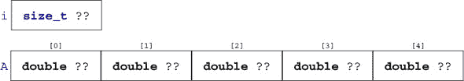
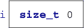
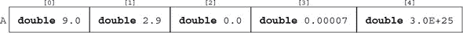
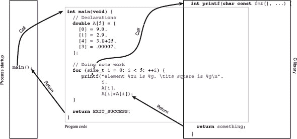

## Level 0\. 遭遇


> *这个级别的吉祥物是乌鸦，地球上最聪明的非人类物种之一。它们能够进行复杂的社会仪式和工具使用。*

这本书的第一级可能是你第一次接触编程语言 C。它为你提供了关于 C 程序、它们的目的、结构和如何使用它们的大致知识。它并不旨在提供一个完整的概述，它不能，甚至不试图这样做。相反，它旨在给你一个大致的概念，提出问题，促进思想和概念。这些将在更高层次中详细解释。

## Chapter 1\. 开始

本章涵盖

+   命令式编程简介

+   编译和运行代码

在本章中，我将向您介绍一个简单的程序，我们选择它是因为它包含了 C 语言中的许多构造。如果您已经有了编程经验，您可能会发现其中的一些部分感觉像是无用的重复。如果您缺乏这样的经验，您可能会被一连串的新术语和概念所淹没。

在任何情况下，都要有耐心。对于那些有编程经验的人来说，很可能存在一些您没有意识到的微妙细节，或者您对语言所做的假设可能并不正确，即使您以前已经编写过 C 程序。对于那些第一次接触编程的人来说，请放心，大约 10 页之后，您的理解将大大提高，您应该对编程代表什么有一个更清晰的认识。

对于一般编程，尤其是这本书来说，以下引用总结了道格拉斯·亚当斯的《银河系漫游指南》中的宝贵智慧[1986]：

| |
| --- |

##### Takeaway B

*别慌张。*

| |
| --- |

这不值得。文本中有很多交叉引用、链接和旁支信息，并且在最后有一个索引。如果你有问题，就按照那些线索去找。或者，只是休息一下。

在 C 语言中编程是让计算机完成一些特定的任务。一个 C 程序通过下达命令来完成这些任务，就像我们在许多人类语言中使用祈使语气表达这样的命令一样；因此，这种组织计算机程序的方式被称为*命令式编程*。为了开始并了解我们在说什么，考虑我们的第一个程序列表 1.1：

##### Listing 1.1\. C 程序的一个初步示例

```
 **1**   /* This may look like nonsense, but really is -*- mode: C -*- */
 **2**   #include <stdlib.h>
 **3**   #include <stdio.h>
 **4**
 **5**   /* The main thing that this program does. */
 **6**   int **main**(void) {
 **7**     // Declarations
 **8**     double A[5] = {
 **9**       [0] = 9.0,
**10**       [1] = 2.9,
**11**       [4] = 3.E+25,
**12**       [3] = .00007,
**13**     };
**14**
**15**     // Doing some work
**16**     for (**size_t** i = 0; i < 5; ++i) {
**17**         **printf**("element %zu is %g, \tits square is %g\n",
**18**                i,
**19**                A[i],
**20**                A[i]*A[i]);
**21**     }
**22**
**23**     return **EXIT_SUCCESS**;
**24**   }
```

### 1.1\. 命令式编程

你可能看到这是一种语言，包含一些奇怪的词，如**main**、**`include`**、**`for`**等等，它们以独特的方式排列和着色，并与大量奇怪的字符、数字和文本（“*做一些工作*”）混合在一起，看起来像普通的英语。它旨在在我们人类程序员和机器之间建立联系，告诉它该做什么：下达“命令”。

| |
| --- |

##### Takeaway 1.1

*C 是一种命令式编程语言*。

|  |
| --- |

在这本书中，我们不仅会遇到 C 编程语言，还会遇到一些来自英语方言的词汇，C *术语*，帮助我们*谈论 C*的语言。第一次出现时，不可能立即解释每个术语。但我会及时解释每个术语，并且它们都有索引，你可以轻松地作弊并*跳转*^C*到更详细的文本，风险自负.^([1])

> ¹
> 
> 如此特殊的 C 术语用*C*标记，如下所示。

如您可能从第一个例子中猜到的，这样的 C 程序有不同的组件，它们形成了一些混合层。让我们从内部开始尝试理解它。运行此程序的可视结果是输出您计算机命令行上的 5 行文本。在我的计算机上，使用此程序看起来像这样：

##### `终端`

```
**0**   > ./getting-started
**1**   element 0 is 9,         its square is 81
**2**   element 1 is 2.9,       its square is 8.41
**3**   element 2 is 0,         its square is 0
**4**   element 3 is 7e-05,     its square is 4.9e-09
**5**   element 4 is 3e+25,     its square is 9e+50
```

我们可以轻松地在我们程序中识别出程序输出的文本部分（在 C 术语中称为*打印*^C*）：第 17 行之间的引号部分。真正的动作发生在这一行和第 20 行之间。C 称这为*语句*^C*，这有点名不副实。其他语言会使用*指令*这个术语，它更好地描述了其目的。这个特定的语句是对名为**printf**的*函数*^C*的*调用*^C*：

##### `getting-started.c`

```
**17**    **printf**("element %zu is %g, \tits square is %g\n",
**18**           i,
**19**           A[i],
**20**           A[i]*A[i]);
```

在这里，**printf**函数接收四个*参数*^C*，用一对*括号*^C*括起来，`( ... )`：

+   看起来奇怪的文本（在引号之间）是一种所谓的*字符串字面量*^C*，它作为输出的*格式*^C*。在文本中有三个标记（*格式说明符*^C*），它们指示输出中插入数字的位置。这些标记以一个`%`字符开始。此格式还包含一些特殊的*转义字符*^C*，它们以反斜杠开始：`\`t 和`\`n。

+   在逗号字符之后，我们找到了单词 i。i 所代表的内容将打印在第一个格式说明符%zu 的位置上。

+   另一个逗号将下一个参数 A`[`i`]`分隔开来。这个参数所代表的内容将打印在第二个格式说明符，即第一个`%`g 的位置上。

+   最后，再次用逗号分隔，出现 A`[`i`]*`A`[`i`]`，对应于最后一个`%`g。

我们稍后会解释所有这些参数的含义。只需记住，我们已经确定了程序的主要目的（在终端上打印一些行）并且它“指示”**printf**函数来实现这个目的。其余的部分是一些*糖分*，用于指定要打印哪些数字以及打印多少个。

### 1.2\. 编译和运行

如前所述，程序文本表达了我们希望计算机执行的操作。因此，它只是我们写下来并存储在硬盘上的另一段文本，但程序文本本身不能被你的计算机理解。有一个特殊的程序，称为*编译器*，它将 C 文本翻译成你的机器可以理解的东西：*二进制代码**^C*或*可执行文件**^C*。这个翻译程序看起来是什么样子以及这种翻译是如何进行的，在这个阶段解释得太复杂了.^([2]) 即使整本书也无法解释大部分内容；那将是另一本书的主题。然而，目前我们不需要深入了解，因为我们有为我们做所有工作的工具。

> ²
> 
> 实际上，*翻译*本身是在几个步骤中完成的，从文本替换，经过适当的编译，到链接。尽管如此，将所有这些捆绑在一起的工具传统上被称为*编译器*，而不是*翻译器*，后者更准确。

| |
| --- |

##### 收获 1.2

*C 是一种编译型编程语言*。

| |
| --- |

编译器的名称及其命令行参数在很大程度上取决于你将在其上运行程序的*平台**^C*。这有一个简单的理由：目标二进制代码是*平台相关**^C*的：也就是说，其形式和细节取决于你想要在其上运行它的计算机。PC 和手机有不同的需求，你的冰箱和机顶盒使用的“语言”也不相同。事实上，这就是 C 存在的一个原因：C 为所有不同的机器特定语言提供了一种抽象级别（通常被称为*汇编器**^C*）。

| |
| --- |

##### 收获 1.3

*正确的 C 程序在不同平台上是可移植的*。

| |
| --- |

在这本书中，我们将投入大量精力向你展示如何编写“正确”的 C 程序，以确保其可移植性。不幸的是，有些平台声称自己是“C”平台，但实际上并不符合最新的标准；还有一些符合标准的平台接受不正确的程序，或者提供对 C 标准的扩展，这些扩展并不广泛可移植。因此，在一个平台上运行和测试程序并不总是能保证其可移植性。

编译器的任务是确保前面展示的小程序，一旦为适当的平台翻译，将在你的 PC、你的手机、你的机顶盒上正确运行，甚至可能在你冰箱上运行。

话虽如此，如果你有一个 POSIX 系统（如 Linux 或 macOS），那么一个名为`c99`的程序可能存在，并且实际上它是一个 C 编译器。你可以尝试使用以下命令编译示例程序：

##### `终端`

```
**0**   > c99 -Wall -o getting-started getting-started.c -lm
```

编译器应该无怨无悔地完成其工作，并在你的当前目录下输出一个名为`getting-started`的可执行文件.^([[[Exs 1]](#ch01fn-ex01)]) 在示例行中，

> ^([Exs 1])
> 
> 在你的终端中尝试编译命令。

+   `c99` 是编译程序。

+   `-Wall` 告诉它警告我们它发现的任何不寻常之处。

+   `-o getting-started` 告诉它将*编译器输出*存储在名为 `getting-started` 的文件中。

+   `getting-started.c` 命名了*源文件*，包含我们编写的 C 代码的文件。请注意，文件名末尾的 `.c` 扩展名指的是 C 编程语言。

+   `-lm` 告诉它在必要时添加一些标准数学函数；我们稍后会需要这些。

现在我们可以*执行*我们新创建的*可执行文件*。输入

##### `终端`

```
**0**   > ./getting-started
```

你应该看到与我之前展示的完全相同的输出。这就是*便携性*的含义：无论你在哪里运行那个程序，它的*行为*应该是相同的。

如果你运气不好，编译命令没有工作，你将不得不在你的系统文档中查找你的*编译器*的名称。你可能甚至需要安装一个编译器。3 编译器的名称各不相同。以下是一些可能有效的常见替代方案：

> ³
> 
> 这在特定情况下是必要的，尤其是如果你有一个使用微软操作系统的系统。微软的本地编译器尚未完全支持 C99，而且我们在这本书中讨论的许多功能可能无法工作。关于替代方案的讨论，你可能想看看 Chris Wellons 的博客条目“四种在 Windows 上编译 C 的方法”([`nullprogram.com/blog/2016/06/13/`](https://nullprogram.com/blog/2016/06/13/))。

##### `终端`

```
**0**   > clang -Wall -lm -o getting-started getting-started.c
**1**   > gcc -std=c99 -Wall -lm -o getting-started getting-started.c
**2**   > icc -std=c99 -Wall -lm -o getting-started getting-started.c
```

这些中的一些，即使它们存在于你的计算机上，也可能不会在没有抱怨的情况下编译程序。[[[Exs 2]](#ch01fn-ex02)]

> ^([Exs 2])
> 
> 使用这本书开始编写关于你测试的文本报告。记下哪些命令对你有效。

在 列表 1.1 中的程序中，我们展示了一个理想的世界：一个在所有平台上都能正常工作并产生相同结果的程序。不幸的是，当你自己编程时，你经常会遇到一个只部分工作且可能产生错误或不可靠结果的程序。因此，让我们看看 列表 1.2 中的程序。它看起来与上一个非常相似。

##### 列表 1.2\. 一个有缺陷的 C 程序示例

```
 **1**   /* This may look like nonsense, but really is -*- mode: C -*- */
 **2**
 **3**   /* The main thing that this program does. */
 **4**   void **main**() {
 **5**     // Declarations
 **6**     int i;
 **7**     double A[5] = {
 **8**       9.0,
 **9**       2.9,
**10**       3.E+25,
**11**       .00007,
**12**     };
**13**
**14**     // Doing some work
**15**     for (i = 0; i < 5; ++i) {
**16**        **printf**("element %d is %g, \tits square is %g\n",
**17**               i,
**18**               A[i],
**19**               A[i]*A[i]);
**20**     }
**21**
**22**     return 0;
**23**   }
```

如果你在这个程序上运行你的编译器，它应该给你一些类似的*诊断信息*：

##### `终端`

```
**0**   > c99 -Wall -o bad bad.c
**1**   bad.c:4:6: warning: return type of 'main' is not 'int' [-Wmain]
**2**   bad.c: In function 'main':
**3**   bad.c:16:6: warning: implicit declaration of function 'printf' [-Wimplicit-function...
**4**   bad.c:16:6: warning: incompatible implicit declaration of built-in function 'printf' ...
**5**   bad.c:22:3: warning: 'return' with a value, in function returning void [enabled by de...
```

这里有很多很长的“警告”行，甚至长到无法适应终端屏幕。最后，编译器生成了一个可执行文件。不幸的是，当我们运行程序时的输出是不同的。这是一个我们必须小心并注意细节的信号。

`clang` 比起 `gcc` 更加挑剔，并给出了更长的诊断行：

##### `终端`

```
 **0**   > clang -Wall -o getting-started-badly bad.c
 **1**   bad.c:4:1: warning: return type of 'main' is not 'int' [-Wmain-return-type]
 **2**   void main() {
 **3**   ^
 **4**   bad.c:16:6: warning: implicitly declaring library function 'printf' with type
 **5**         'int (const char *, ...)'
 **6**        printf("element %d is %g, \tits square is %g\n", /*@\label{printf-start-badly}*/
 **7**        ^
 **8**   bad.c:16:6: note: please include the header <stdio.h> or explicitly provide a declaration
 **9**         for 'printf'
**10**   bad.c:22:3: error: void function 'main' should not return a value [-Wreturn-type]
**11**     return 0;
**12**     ^      ~
**13**   2 warnings and 1 error generated.
```

这是一件好事！它的 *诊断输出**^C* 非常具有信息量。特别是，它给出了两个提示：它期望 **main** 函数有不同的返回类型，并且它期望我们有一个类似于 列表 1.1 中的第 3 行的行来指定 **printf** 函数的来源。注意 `clang` 与 `gcc` 不同，没有生成可执行文件。它认为第 22 行的问题具有致命性。把这看作是一个特性。

根据你的平台，你可以强制编译器拒绝产生此类诊断的程序。对于 `gcc`，这样的命令行选项将是 `-Werror`。

因此，我们已经看到了 列表 1.1 和 1.2 之间的两个不同点，这两个修改将一个良好、符合标准、可移植的程序变成了一个不好的程序。我们还看到编译器在那里帮助我们。它将问题锁定在程序中引起麻烦的行上，并且凭借一些经验，你将能够理解它在告诉你什么.^([[[Exs 3]](#ch01fn-ex03)]) ^([[[Exs 4]](#ch01fn-ex04)])

> ^([Exs 3])
> 
> 逐步纠正 列表 1.2。从第一条诊断行开始，修复那里提到的代码，重新编译，等等，直到你有一个无瑕疵的程序。
> 
> ^([Exs 4])
> 
> 这两个程序之间还有一个我们尚未提到的第三个区别。找到它。

| |
| --- |

##### 取得成果 1.4

*一个 C 程序应该无警告地干净编译。*

| |
| --- |

### 概述

+   C 是为了给计算机下命令而设计的。因此，它在程序员（我们）和计算机之间进行调解。

+   C 必须编译后才能执行。编译器提供了我们理解的语言（C）与特定平台特定需求之间的翻译。

+   C 提供了一个抽象级别，提供了可移植性。一个 C 程序可以在许多不同的计算机架构上使用。

+   C 编译器在那里帮助你。如果你在程序中警告你关于某事，要听从它。

## 第二章. 程序的主要结构

本章涵盖

+   C 语法

+   声明标识符

+   定义对象

+   使用语句指导编译器

与前一章中的小例子相比，真正的程序将更加复杂，并包含额外的结构，但它们的结构将非常相似。列表 1.1 已经包含了 C 程序的大部分结构元素。

在 C 程序中，有两个方面的考虑：语法方面（我们如何指定程序以便编译器理解它？）和语义方面（我们指定什么以便程序执行我们想要它执行的操作？）。在接下来的几节中，我们将介绍语法方面（语法）和三个不同的语义方面：声明部分（是什么事物），对象定义（事物在哪里），和语句（事物应该做什么）。

### 2.1. 语法

从其整体结构来看，我们可以看到 C 程序由不同类型的文本元素组成，这些元素按照某种语法组合在一起。这些元素包括：

+   ***特殊词汇：*** 在列表 1.1 中，我们使用了以下特殊词汇：**`#include`**、**`int`**、**`void`**、**`double`**、**`for`**和**`return`**。在这本书的程序文本中，它们通常会被加粗。这些特殊词汇代表 C 语言强加的概念和特性，这些特性不能更改。

    > ¹
    > 
    > 在 C 术语中，这些是*指令^C*、*关键字^C*和*保留^C*标识符。

+   ***标点符号^C：*** C 语言使用几种类型的标点符号来结构化程序文本。

    +   有五种括号类型：`{ ... }`、`( ... )`、`[ ... ]`、`/* ... */`和`< ... >`。括号用于将程序的某些部分组合在一起，并且应该始终成对出现。幸运的是，在 C 语言中`< ... >`括号很少见，并且仅在我们示例中所示，位于同一逻辑行文本上。其他四种括号不受单行限制；它们的内含可能跨越多行，就像我们之前使用**printf**时那样。

    +   有两种不同的分隔符或终止符：逗号和分号。当我们使用**printf**时，我们看到逗号用于分隔该函数的四个参数；在第 12 行我们也看到逗号也可以跟在元素列表的最后一个元素后面。

    ##### `getting-started.c`

    ```
    **12**       [3] = .00007,
    ```

    C 语言新手的困难之一是相同的标点符号用于表达不同的概念。例如，成对出现的`{}`和`[]`在列表 1.1 中各自用于三个不同的目的).^([[[Exs 1]](#ch02fn-ex01)])

    > ^([Exs 1])
    > 
    > 找出这些两种括号的不同用法。

    | |
    | --- |

    ##### Takeaway 2.1

    *标点符号可以具有多种不同的含义*。

    |  |
    | --- |

+   ***注释^C：*** 我们之前看到的`/* ... */`构造告诉编译器，它内部的所有内容都是*注释*；例如，查看第 5 行：

    ##### `getting-started.c`

    ```
    **5**   /* The main thing that this program does. */
    ```

    注释被编译器忽略。这是解释和记录代码的完美地方。这种内联文档可以（并且应该）极大地提高代码的可读性和可理解性。另一种形式的注释是所谓的 C++风格注释，如第 15 行所示。这些注释以`//`开始，延伸到行尾。

+   ***字面量^C：*** 我们程序包含几个引用固定值的项，这些值是程序的一部分：`0`、`1`、`3`、`4`、`5`、`9.0`、`2.9`、`3.E+25`、`.00007`和`"element %zu is %g, \tits square is %g\n"`。这些被称为*字面量^C*。

+   ***标识符^C：*** 这些是我们（或 C 标准）给程序中某些实体赋予的“名称”。在这里我们有 A、i、**main**、**printf**、**`size_t`**和**`EXIT_SUCCESS`**。标识符在程序中可以扮演不同的角色。在其他方面，它们可能指代

    +   **数据对象**^C*（如 A 和 i）。这些也被称为 **变量**^C*。

    +   **类型**^C* 别名，如 **`size_t`**，指定了新对象“种类”，这里是指 i。注意名称末尾的 **`_t`**。这种命名约定是 C 标准用来提醒你该标识符指的是一个类型的。

    +   函数，如 **main** 和 **printf**。

    +   常量，如 **`EXIT_SUCCESS`**。

+   ***函数^C：*** 两个标识符指的是函数：**main** 和 **printf**。正如我们之前所看到的，**printf** 是程序用来产生一些输出的。函数 **main** 由此被 **定义**^C*：也就是说，它的 **声明**^C* **`int`** **main**`(`**`void`**`)` 后面跟着一个 **块**^C*，用 `{ ... }` 包围，描述了这个函数应该做什么。在我们的例子中，这个函数 **定义**^C* 从第 6 行到第 24 行。**main** 在 C 程序中有一个特殊的作用，我们将会遇到：它必须始终存在，因为它是程序执行的开始点。

+   ***运算符^C：*** 在众多的 C 运算符中，我们的程序只使用了几个：

    +   `=` 用于 **初始化**^C* 和 **赋值**^C*，

    +   `<` 用于比较，

    +   `++` 用于 **递增** 一个变量（将其值增加 `1`），以及

    +   `*` 用于乘以两个值。

正如在自然语言中一样，我们在这里看到的 C 程序的词法元素和语法必须与这些构造的实际意义区分开来。然而，与自然语言不同的是，这种意义是严格指定的，通常没有歧义的空间。在接下来的几节中，我们将深入研究 C 区分的三个主要语义类别：声明、定义和语句。

### 2.2. 声明

在我们可以在程序中使用特定的标识符之前，我们必须向编译器提供一个 **声明**^C*，指定该标识符应该代表什么。这就是标识符与关键字的不同之处：关键字是由语言预定义的，不能声明或重新定义。

|  |
| --- |

##### Takeaway 2.2

**程序中的所有标识符都必须声明**。

|  |
| --- |

我们在程序中实际声明的三个标识符是：**main**、A 和 i。稍后，我们将看到其他标识符（**printf**、**`size_t`** 和 **`EXIT_SUCCESS`**）的来源。我们已经提到了 **main** 函数的声明。这三个声明，单独作为“仅声明”，看起来是这样的：

```
int **main**(void);
double A[5];
**size_t** i;
```

这三个标识符遵循一个模式。每个都有一个标识符（**main**、A 或 i）以及与该标识符相关联的某些属性：

+   i 的 **类型**^C* 是 **`size_t`**。

+   **main** 还额外跟随着括号，`( ... )`，因此声明了一个 **`int`** 类型的函数。

+   A 后跟方括号 `[ ... ]`，因此声明了一个 *数组**^C*。数组是相同类型几个项的聚合；这里由 `5` 个类型为 **`double`** 的项组成。这些 `5` 个项是有序的，可以通过数字（称为 *索引**^C*）从 `0` 到 `4` 来引用。

每个这些声明都以一个 *类型**^C* 开头，这里 **`int`**、**`double`** 和 **`size_t`**。我们稍后会看到这代表什么。目前，只需知道这指定了所有三个标识符在语句的上下文中将作为某种“数字”使用。

i 和 A 的声明声明了 *变量**^C*，它们是命名项，允许我们存储 *值**^C*。它们最好被想象成一种可能包含特定类型“某物”的盒子：



从概念上讲，区分盒子本身（*对象*）、规范（其 *类型*）、盒子内容（其 *值*）以及写在上面的名称或标签（*标识符*）是很重要的。在这些图中，如果我们不知道一个项的实际值，我们会放 `??`。

对于其他三个标识符，**printf**、**`size_t`** 和 **`EXIT_SUCCESS`**，我们没有看到任何声明。实际上，它们是预声明的标识符，但正如我们在尝试编译列表 1.2 时所看到的，这些标识符的信息并非凭空而来。我们必须告诉编译器它们可以从哪里获取这些信息。这是在程序的开始处，在第 2 行和第 3 行完成的：**printf** 由 `stdio.h` 提供，而 **`size_t`** 和 **`EXIT_SUCCESS`** 来自 `stdlib.h`。这些标识符的真实声明在计算机上的某个位置以这些名称指定的 `.h` 文件中指定。它们可能如下所示：

|  |
| --- |

`<stdio.h>`

`<stdlib.h>`

|  |
| --- |

```
int **printf**(char const format[static 1], ...);
typedef unsigned long **size_t**;
#define **EXIT_SUCCESS** 0
```

由于这些预声明特性的具体细节不太重要，这些信息通常在这些 *包含文件**^C* 或 *头文件**^C* 中对你隐藏。如果你需要了解它们的语义，通常在相应的文件中查找它们不是一个好主意，因为这些文件往往难以阅读。相反，你应该在你的平台提供的文档中进行搜索。对于勇敢的人，我总是推荐查看当前的 C 标准，因为所有这些标准都来源于此。对于不那么勇敢的人，以下命令可能会有所帮助：

##### `终端`

```
**0**   > apropos printf
**1**   > man printf
**2**   > man 3 printf
```

声明仅描述一个特性，但不会创建它，因此重复声明并不会造成太大伤害，但会增加冗余。

|  |
| --- |

##### 收获 2.3

*标识符可能有多个一致的声明*。

|  |
| --- |

显然，如果在程序的同一部分有多个针对同一标识符的矛盾声明，这将变得非常令人困惑（对我们或编译器来说），因此通常不允许这样做。C 对“程序的同一部分”的含义非常具体：*作用域**^C* 是一个标识符可见的程序的某个部分。

|  |
| --- |

##### 收获 2.4

*声明绑定到它们出现的作用域中*。

| |
| --- |

标识符的作用域由语法明确描述。在列表 1.1 中，我们有不同作用域中的声明：

+   A 在**main**函数的定义内部可见，从第 8 行的声明开始，到包含该声明的最内层`{ ... }`块的结束`}`，即第 24 行。

+   i 的可见性更受限制。它绑定到它声明的**`for`**结构中。它的可见性从第 16 行的声明开始，延伸到与第 21 行的**`for`**关联的`{ ... }`块的末尾。

+   **main**函数没有被包含在`{ ... }`块中，因此从它的声明开始直到文件结束都是可见的。

在术语的轻微滥用中，前两种作用域被称为*块作用域*，因为作用域受*块*的限制。第三种类型，用于**main**，它不在`{ ... }`对中，被称为*文件作用域*。文件作用域中的标识符通常被称为*全局变量*。

### 2.3. 定义

通常，声明只指定一个标识符所引用的对象类型，而不是标识符的具体值，也不是它所引用的对象可以在哪里找到。这个重要的角色由一个*定义*来填补。

| |
| --- |

##### 取得成果 2.5

*声明指定标识符，而定义指定对象*。

| |
| --- |

我们稍后将会看到，在现实生活中事情要复杂一些，但到目前为止，我们可以简化为：我们总是初始化我们的变量。*初始化*是一种语法结构，它增强声明并提供对象的初始值。例如，

```
**size_t** i = 0;
```

是一个声明，其中 i 的初始值为`0`。

在 C 语言中，这样的带有初始化器的声明也*定义*了具有相应名称的对象：也就是说，它指示编译器提供存储空间，以便变量的值可以存储在其中。

| |
| --- |

##### 取得成果 2.6

*对象在初始化的同时被定义*。

| |
| --- |

我们现在可以用一个值，在这个例子中是`0`，来完成我们的盒子可视化：



A 稍微复杂一些，因为它有几个组成部分：

##### `getting-started.c`

```
 **8**   double A[5] = {
 **9**     [0] = 9.0,
**10**     [1] = 2.9,
**11**     [4] = 3.E+25,
**12**     [3] = .00007,
**13**   };
```

这将 A 中的`5`个元素初始化为`9.0`、`2.9`、`0.0`、`0.00007`和`3.`0`E+25`，顺序如下：



我们在这里看到的初始化器的形式被称为*指定*：一对带有整数的方括号，该整数*指定*数组中的哪个元素用相应的值进行初始化。例如，`[4] = 3.`E`+25`将数组 A 的最后一个元素设置为`3.`E`+25`。作为一条特殊规则，初始化器中没有列出的任何位置都被设置为`0`。在我们的例子中，缺失的`[2]`被填充为`0.0`。^([2])

> ²
> 
> 我们稍后将会看到这些带有小数点（`.`）和指数（E`+25`）的数字字面量是如何工作的。

| |
| --- |

##### 取得成果 2.7

*初始化器中缺失的元素默认为 `0`。*

|  |
| --- |

你可能已经注意到，数组位置，*索引**^C*，对于第一个元素不是从 `1` 开始，而是从 `0` 开始。将数组位置想象成对应数组元素从数组开始处的距离。

|  |
| --- |

##### Takeaway 2.8

*对于具有 n 个元素的数组，第一个元素的索引为 0，最后一个元素的索引为 n-1。*

|  |
| --- |

对于一个函数，如果其声明后面跟着包含函数代码的花括号 `{ ... }`，则我们有一个定义（而不是只有声明）：

```
int **main**(void) {
  ...
}
```

在我们之前的例子中，我们已经看到了两个不同特征的名称：*对象**^C*，i 和 A，以及 *函数**^C*，**main** 和 **printf**。与对象或函数声明不同，对于相同的标识符允许有多个，对象或函数的定义必须是唯一的。也就是说，为了让 C 程序能够运行，任何使用到的对象或函数都必须有一个定义（否则执行将不知道在哪里查找它们），并且定义不能超过一个（否则执行可能会变得不一致）。

|  |
| --- |

##### Takeaway 2.9

*每个对象或函数必须有一个确切的定义。*

|  |
| --- |

### 2.4\. 语句

**main** 函数的第二部分主要由 *语句* 组成。语句是告诉编译器如何处理之前已声明的标识符的指令。我们有

##### `getting-started.c`

```
**16**   for (**size_t** i = 0; i < 5; ++i) {
**17**      **printf**("element %zu is %g, \tits square is %g\n",
**18**             i,
**19**             A[i],
**20**             A[i]*A[i]);
**21**   }
**22**
**23**   return **EXIT_SUCCESS**;
```

我们已经讨论了与 **printf** 调用对应的行。还有其他类型的语句：**`for`** 和 **`return`** 语句，以及一个增量操作，由 *运算符**^C* `++` 表示。在下一节中，我们将深入探讨三类语句的细节：*迭代*（多次执行某项操作）、*函数调用*（将执行委托到其他地方）和 *函数返回*（从函数被调用的位置恢复执行）。

#### 2.4.1\. 迭代

**`for`** 语句告诉编译器程序应该执行 **printf** 行多次。这是 C 提供的最简单的 *域迭代**^C* 形式。它有四个不同的部分。

要重复执行的代码称为 *循环体**^C*：它是跟随 **`for`** `( ... )` 的 `{ ... }` 块。其他三个部分是 `( ... )` 部分内的内容，由分号分隔：

1.  我们已经讨论过的 *循环变量**^C* i 的声明、定义和初始化。这个初始化是在整个 **`for`** 语句的其余部分执行之前只执行一次。

1.  *循环条件**^C*，i `< 5` 指定了 **`for`** 迭代应该持续多长时间。这告诉编译器只要 i 严格小于 `5` 就继续迭代。循环条件在每次执行循环体之前都会进行检查。

1.  另一个语句，`++`i，在每次迭代后执行。在这种情况下，它每次将 i 的值增加 `1`。

如果我们将所有这些放在一起，我们要求程序在块中执行五次部分，分别将 i 的值设置为 `0`、`1`、`2`、`3` 和 `4`，在每次迭代中。我们可以将每个迭代与 i 的特定值相对应的事实使得这是一个对 *域**^C* `0`、...、`4` 的迭代。在 C 中做这件事的方式不止一种，但 **`for`** 是完成这项任务最简单、最干净、最好的工具。

|  |
| --- |

##### Takeaway 2.10

*域迭代应该用* **`for`** *语句编码。*

|  |
| --- |

除了我们刚才看到的方式之外，**`for`** 语句还可以用几种其他方式来编写。通常，人们会在 **`for`** 之前或甚至重用相同的变量为几个循环定义循环变量的定义。不要这样做：为了帮助偶尔的读者和编译器理解你的代码，了解这个变量对于给定的那个 **`for`** 循环有迭代计数器的特殊意义是很重要的。

|  |
| --- |

##### Takeaway 2.11

*循环变量应该在* **`for`*** 的初始部分定义。*

|  |
| --- |

#### 2.4.2\. 函数调用

*函数调用* 是特殊的语句，它暂停当前函数（开始时通常是 **main**）的执行，然后将控制权交给命名的函数。在我们的例子中

##### `getting-started.c`

```
**17**      **printf**("element %zu is %g, \tits square is %g\n",
**18**             i,
**19**             A[i],
**20**             A[i]*A[i]);
```

被调用的函数是 **printf**。函数调用通常不仅提供函数的名称，还提供 *参数*。在这里，这些是长链字符，i、A`[`i`]` 和 A`[`i`]*`A`[`i`]`。这些参数的 *值* 被传递给函数。在这种情况下，这些值是 **printf** 打印的信息。这里的重点是“值”：尽管 i 是一个参数，但 **printf** 永远不能改变 i 本身。这种机制称为 *按值调用*。其他编程语言也有 *按引用调用*，这是一种调用函数可以改变变量值的机制。C 不实现按引用传递，但它有另一种机制将变量的控制权传递给另一个函数：通过取地址和传递指针。我们将在稍后看到这些机制。

#### 2.4.3\. 函数返回

**main** 中的最后一个语句是一个 **`return`**。它告诉 **main** 函数在完成后 *返回* 到它被调用的语句。在这里，由于 **main** 的声明中有 **`int`**，一个 **`return`** *必须* 向调用语句发送一个 **`int`** 类型的值。在这种情况下，那个值是 **`EXIT_SUCCESS`**。

尽管我们看不到它的定义，但 **printf** 函数必须包含一个类似的 **`return`** 语句。在我们在第 17 行调用函数的点，**main** 中的语句执行暂时暂停。执行在 **printf** 函数中继续，直到遇到一个 **`return`**。从 **printf** 返回后，**main** 中的语句从停止的地方继续执行。

图 2.1 展示了我们小程序的执行示意图：其*控制流程*。首先，由我们的平台提供的进程启动例程（在左侧）调用用户提供的函数**main**（中间）。然后，**main**函数反过来调用**printf**函数，这是一个属于*C 库*的函数（在右侧）。一旦遇到**`return`**，控制权返回到**main**；当我们到达**main**中的**`return`**时，它将控制权传递回启动例程。从程序员的角度来看，这种控制权的转移是程序执行的结束。

##### 图 2.1. 小程序的执行



### 摘要

+   C 语言区分了程序的词汇结构（标点符号、标识符和数字）、语法结构（语法）和语义（意义）。

+   所有标识符（名称）都必须声明，以便我们知道它们所代表的概念的特性。

+   所有对象（我们处理的事物）和函数（我们用来处理事物的方法）都必须定义；也就是说，我们必须指定它们是如何以及在哪里产生的。

+   语句指示了事情将如何进行：迭代（**`for`**）重复执行某些任务的变体，函数调用（**printf**`(...)**）将任务委托给一个函数，函数返回（**`return`** something`;`）返回到我们来的地方。
