## 第 1 级：熟悉


> *本级别的吉祥物，常见的乌鸦，是一种非常社交的鸱科动物，以其解决问题的能力而闻名。乌鸦会组成团队，甚至成年后也会进行游戏。*

本级别将使你熟悉 C 编程语言：也就是说，它将为你提供足够的知识来编写和使用好的 C 程序。“好”在这里指的是对语言的现代理解，避免了 C 早期方言的大部分陷阱，并为你提供一些之前不存在且在大多数现代计算机架构上可移植的结构，从你的手机到大型机。完成这些章节后，你应该能够编写满足日常需求的简短代码：不是非常复杂，但有用且可移植。

### 系好安全带

在许多方面，C 是一种宽容的语言；程序员可以选择自己射中脚或其他身体部位，而 C 将不会努力阻止他们。因此，暂时，我们将引入一些限制。我们将尝试在本级别中不发放枪支，并将枪柜的钥匙放在你够不到的地方，用大而显眼的感叹号标记其位置。

C 中最危险的构造是所谓的*类型转换**^C*，所以我们将在本级别跳过它们。然而，还有许多其他陷阱不容易避免。我们将以一种可能对你来说不熟悉的方式处理其中的一些，特别是如果你在上个千年学习 C 基础知识，或者如果你在一个多年未升级到当前 ISO C 的平台上学 C。

+   ***经验丰富的 C 程序员：*** 如果你已经有一些 C 编程经验，以下内容可能需要一些适应，甚至可能引起过敏反应。如果你在阅读这里的一些代码时突然出现皮疹，请深呼吸并尽量放松，但请*不要跳过*这些页面。

+   ***不熟悉的 C 程序员：*** 如果你不是经验丰富的 C 程序员，以下讨论的大部分内容可能对你来说有点难以理解：例如，我们可能会使用你尚未听说过的术语。如果是这样，这对你来说是一个旁白，你可以跳到第三章的开始部分，稍后再回来，当你觉得稍微舒服一些的时候。但请确保在本级别结束之前这样做。

在这个级别上，“适应”我们的方法可能涉及我们呈现材料的重点和顺序：

+   我们将主要关注整数类型的*无符号**^C*版本。

+   我们将分步骤介绍指针：首先，作为函数的参数（第 6.1.4 节），然后是它们的状态（有效或无效，第 6.2 节），然后在下一个级别（第十一章），使用它们的全部潜力。

+   我们将尽可能关注数组的用法。

你可能会对我们的某些风格考虑感到惊讶，我们将在以下要点中讨论。在下一级，我们将用整整一章（第九章）来讨论这些问题，所以请耐心等待，暂时接受它们。

1.  ***我们将类型修饰符和限定符绑定到左侧。*** 我们希望从视觉上区分标识符和它们的类型。因此，我们通常会这样写

    ```
    char* name;
    ```

    其中**`char*`**是类型，name 是标识符。我们还应用左结合规则到限定符上，并写成

    ```
    char const* const path_name;
    ```

    这里，第一个**`const`**限定符限定其左侧的**`char`**，`*`使其成为指针，第二个**`const`**再次限定其左侧的内容。

1.  ***我们不使用连续声明。*** 它们会模糊类型声明符的绑定。例如：

    ```
    unsigned const*const a, b;
    ```

    这里，b 的类型是**`unsigned const`**：也就是说，第一个**`const`**应用于类型，第二个**`const`**只应用于 a 的声明。这样的规则非常令人困惑，你有更重要的事情要学习。

1.  ***我们使用数组表示法来表示指针参数。*** 我们在指针不能为空的情况下这样做。例如：

    ```
    /* These emphasize that the arguments cannot be null. */
    **size_t** **strlen**(char const string[static 1]);
    int **main**(int argc, char* argv[argc+1]);
    /* Compatible declarations for the same functions. */
    **size_t** **strlen**(const char *string);
    int **main**(int argc, char **argv);
    ```

    第一个强调了**strlen**必须接收一个有效的（非空）指针，并将至少访问字符串中的一个元素。第二个总结了**main**接收一个指向**`char`**的指针数组的现实，即程序名称、`argc`-1 个程序参数和一个终止数组的空指针。请注意，前面的代码是有效的。第二组声明只为编译器已知的功能添加了额外的等效声明。

1.  ***我们使用函数表示法来表示函数指针参数。*** 同样地，我们知道函数指针不能为空时，我们会这样做：

    ```
    /* This emphasizes that the handler'' argument cannot be null. */
    int **atexit**(void handler(void));
    /* Compatible declaration for the same function.              */
    int **atexit**(void (*handler)(void));
    ```

    在这里，**atexit**的第一个声明强调了它在语义上接收一个名为 handler 的函数作为参数，并且不允许空函数指针。技术上，函数参数 handler 被“重写”为一个函数指针，就像数组参数被重写为对象指针一样，但对于功能描述来说这并不重要。请注意，前面的代码是有效的，第二个声明只是为**atexit**添加了一个等效的声明。

1.  ***我们尽可能地将变量定义在其首次使用的地方。*** 缺乏变量初始化，尤其是对于指针，是新手 C 程序员的主要陷阱之一。这就是为什么我们应该尽可能地将变量的声明与其首次赋值结合起来：C 为我们提供这种目的的工具是*定义*：一个声明与初始化的结合。这给一个值命名，并在它首次使用的地方引入这个名称。这对于**`for`**循环尤其方便。一个循环的迭代变量在语义上与另一个循环的迭代变量是不同的对象，因此我们在**`for`**循环内部声明变量，以确保它保持在循环的作用域内。

1.  ***我们使用前缀记法来表示代码块。*** 为了能够轻松地阅读代码块，重要的是要捕捉到关于它的两个信息：它的目的和它的范围。因此：

    +   所有**`{`**都与其引入它们的语句或声明在同一行上。

    +   代码内部缩进一级。

    +   结束的**`}`**与引入代码块的语句在同一级别上开始新的一行。

    +   在**`}`**之后继续的代码块语句在同一行上。示例：

    ```
    int **main**(int argc, char* argv[argc+1]) {
      **puts**("Hello world!");
      if (argc > 1) {
        while (**true**) {
          **puts**("some programs never stop");
        }
      } else {
        do {
          **puts**("but this one does");
        } while (**false**);
      }
      return **EXIT_SUCCESS**;
    }
    ```

## 第三章。一切都是关于控制

本章涵盖

+   使用**`if`**进行条件执行

+   遍历域

+   进行多选

在我们的入门示例中，列表 1.1，我们看到了两种不同的结构，允许我们控制程序执行的流程：函数和**`for`**迭代。函数是一种无条件转移控制的方式。调用无条件地将控制转移到函数，而**`return`**语句无条件地将控制转移回调用者。我们将在第七章中再次回到函数。

**`for`**语句与其它不同，因为它有一个控制条件（例如，示例中的`i < 5`），它决定了依赖的代码块或语句（`{` **printf**`(...) }`）何时以及是否执行。C 有五种条件*控制语句*：**`if`**、**`for`**、**`do`**、**`while`**和**`switch`**。我们将在本章中探讨这些语句：**`if`**根据布尔表达式引入*条件执行*；**`for`**、**`do`**和**`while`**是*迭代*的不同形式；而**`switch`**是基于整数值的*多选*。

C 还有一些其他条件语句，我们将在后面讨论：*三元运算符**^C***，表示为形式为 cond `?` A `:` B 的表达式（第 4.4 节），编译时预处理器条件语句**`#if`**`/#`**`ifdef`**`/#`**`ifndef`**`/#`**`elif`**`/#`**`else`**`/#`**`endif`**（第 8.1.5 节），以及用关键字**`_Generic`**表示的类型泛型表达式（第 16.6 节）。

### 3.1. 条件执行

我们将要查看的第一个结构是由关键字 **`if`** 指定的。它看起来是这样的：

```
   if (i > 25) {
     j = i - 25;
   }
```

在这里，我们将 i 与值 `25` 进行比较。如果它大于 25，则 j 被设置为 i `- 25` 的值。在这个例子中，i `> 25` 被称为 *控制表达式*^C*，而 `{ ... }` 部分被称为 *依赖块*^C*。

表面上，这种 **`if`** 语句的形式类似于我们之前遇到的 **`for`** 语句。但它的工作方式不同：括号内只有一个部分，它决定了依赖语句或块是否只运行一次或根本不运行。

**`if`** 构造的更一般形式如下：

```
   if (i > 25) {
     j = i - 25;
   } else {
     j = i;
   }
```

它还有一个依赖语句或块，如果控制条件不满足，则执行。在语法上，这是通过引入另一个关键字 **`else`** 来实现的，它将两个语句或块分开。

**`if`** `(...) ...` **`else`** `...` 是一个 *选择语句*^C*。它根据 `( ... )` 的内容选择两个可能 *代码路径*^C* 中的一个。其一般形式是

```
   if (condition) statement0-**or**-block0
   else statement1-**or**-block1
```

条件（控制表达式）的可能性有很多。它们可以从简单的比较开始，如本例所示，到非常复杂的嵌套表达式。我们将在 第 4.3.2 节 中介绍所有可以使用的原语。

在 **`if`** 语句中最简单的此类条件指定可以在以下示例中看到，这是 列表 1.1 中的 **`for`** 循环的一个变体：

```
   for (**size_t** i = 0; i < 5; ++i) {
     if (i) {
       **printf**("element %zu is %g, \tits square is %g\n",
              i,
              A[i],
              A[i]*A[i]);
     }
   }
```

在这里，决定是否执行 **printf** 的条件仅仅是 i：一个数值本身可以被视为一个条件。只有当 i 的值为非 `0` 时，文本才会被打印。^([[[例 1]](#ch03fn-ex01)])

> ^([例 1])
> 
> 将 **`if`** `(`i`)` 条件添加到程序中，并将输出与之前进行比较。

评估数值条件有两个简单的规则：

|  |
| --- |

##### 摘要 3.1

*`0` 的值代表逻辑假。*

|  |
| --- |
|  |

##### 摘要 3.2

*任何非 `0` 的值都代表逻辑真。*

|  |
| --- |

操作符 `==` 和 `!=` 允许我们测试相等性和不等性。a `==` b 当且仅当 a 的值等于 b 的值时为真，否则为假；a `!=` b 当 a 等于 b 时为假，否则为真。了解数值如何作为条件进行评估后，我们可以避免冗余。例如，我们可以重写

```
   if (i != 0) {
     ...
   }
```

如下：

```
   if (i) {
      ...
   }
```

哪个版本更易读是一个关于 *编码风格*^C* 的问题，可能会引起无果的争论。虽然第一个版本可能对偶尔阅读 C 代码的读者来说更容易阅读，但后者在假设对 C 的类型系统有一定了解的项目中通常更受欢迎。

|  |
| --- |

`<stdbool.h>`

|  |
| --- |

在 `stdbool.h` 中指定的类型 bool，是我们想要存储真值时应使用的类型。它的值是 **`false`** 和 **`true`**。技术上，**`false`** 只是 `0` 的另一个名称，**`true`** 是 `1`。使用 **`false`** 和 **`true`**（而不是数字）来强调一个值是要被解释为条件的。我们将在 第 5.7.4 节 中了解更多关于 bool 类型的内容。

重复的比较很快就会变得难以阅读，并使你的代码杂乱无章。如果你有一个依赖于真值的条件，直接使用那个真值作为条件。同样，我们可以通过重写类似的内容来避免重复

```
   bool b = ...;
   ...
   if ((b != **false**) == **true**) {
     ...
   }
```

as

```
   bool b = ...;
   ...
   if (b) {
     ...
   }
```

通常：

|  |
| --- |

##### 要点 3.3

*不要与 `0` 比较*，**`false`**，*或* **`true`**。

|  |
| --- |

直接使用真值可以使你的代码更清晰，并说明了 C 语言的一个基本概念：

|  |
| --- |

##### 要点 3.4

*所有标量都有真值。*

|  |
| --- |

这里，*标量*^C* 类型包括所有我们已遇到的数值类型，如 **`size_t`**、bool 和 **`int`**，以及 *指针*^C* 类型；参见 表 3.1 了解本书中常用类型。我们将在 第 6.2 节 回到这些类型。

##### 表 3.1\. 本书使用的标量类型

| 级别 | 名称 | 其他 | 类别 | 哪里 | **printf** |
| --- | --- | --- | --- | --- | --- |
| 0 | **size_t** |   | 无符号 | `<stddef.h>` | "%zu" "%zx" |
| 0 | **double** |   | 浮点 | 内置 | "%e" "%f" "%g" "%a" |
| 0 | **signed** | **int** | 有符号 | 内置 | "%d" |
| 0 | **unsigned** |   | 无符号 | 内置 | "%u" "%x" |
| 0 | bool | **_Bool** | 无符号 | `<stdbool.h>` | "%d" 作为 0 或 1 |
| 1 | **ptrdiff_t** |   | 有符号 | `<stddef.h>` | "%td" |
| 1 | **char const*** |   | 字符串 | 内置 | "%s" |
| 1 | **char** |   | 字符 | 内置 | "%c" |
| 1 | **void*** |   | 指针 | 内置 | "%p" |
| 2 | **unsigned char** |   | 无符号 | 内置 | "%hhu" "%02hhx" |

### 3.2\. 迭代

之前，我们遇到了用于遍历域的 **`for`** 语句；在我们的入门示例中，它声明了一个变量 i，其值设置为 `0`、`1`、`2`、`3` 和 `4`。这个语句的一般形式是

```
   for (clause1; condition2; expression3) statement-**or**-block
```

这个语句实际上非常通用。通常，clause1 是一个赋值表达式或变量定义。它用于声明迭代域的初始值。condition2 测试迭代是否应该继续。然后，expression3 更新 clause1 中使用的迭代变量。它在每个迭代的末尾执行。一些建议：

+   因为我们要在 **`for`** 循环的上下文中严格定义迭代变量（*cf.* 要点 2.11），所以 clause1 在大多数情况下应该是一个变量定义。

+   因为 **`for`** 语句有四个不同的部分，相对复杂，且不易于视觉上捕捉，所以 statement`-`**`or`**`-`block 通常应该是一个 `{ ... }` 块。

让我们看看更多的例子：

```
   for (**size_t** i = 10; i; --i) {
     something(i);
   }
   for (**size_t** i = 0, stop = upper_bound(); i < stop; ++i) {
     something_else(i);
   }
   for (**size_t** i = 9; i <= 9; --i) {
     something_else(i);
   }
```

第一个**`for`**循环将`i`从`10`递减到`1`（包含`1`）。条件再次只是变量`i`的评估；不需要对值`0`进行冗余测试。当`i`变为`0`时，它将评估为假，循环将停止。第二个**`for`**循环声明了两个变量，`i`和`stop`。与之前一样，`i`是循环变量，`stop`是我们比较的条件，当`i`大于或等于`stop`时，循环终止。

第三个**`for`**循环看起来似乎会无限进行下去，但实际上它是从`9`递减到`0`。实际上，在下一章中，我们将看到 C 语言中的“大小”（具有**`size_t`**类型的数字）永远不会是负数.^([[[Exs 2]](#ch03fn-ex02)])

> ^([Exs 2])
> 
> 尝试想象当`i`的值为`0`并且通过`--`运算符进行递减时会发生什么。

注意，所有三个**`for`**语句都声明了名为`i`的变量。只要它们的范围不重叠，这三个具有相同名称的变量就可以愉快地并排存在。

C 语言中还有两个迭代语句，**`while`**和**`do`**：

```
   while (condition) statement-**or**-block
   do statement-**or**-block while(condition);
```

以下示例展示了第一个的典型用法。它实现了所谓的*赫伦近似法*来计算数字*x*的乘法逆元 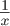。

```
   #include <tgmath.h>

   double const eps = 1E-9;            // Desired precision
   ...
   double const a = 34.0;
   double x = 0.5;
   while (**fabs**(1.0 - a*x) >= eps) {    // Iterates until close
     x *= (2.0 - a*x);                 // Heron approximation
   }
```

它会一直迭代，直到给定的条件评估为真。**`do`**循环与它非常相似，除了它在依赖块之后检查条件：

```
   do {                               // Iterates
     x *= (2.0 - a*x);                // Heron approximation
   } while (**fabs**(1.0 - a*x) >= eps);  // Iterates until close
```

这意味着如果条件评估为假，**`while`**循环将根本不会运行其依赖块，而**`do`**循环将在终止前运行一次。

与**`for`**语句一样，使用**`do`**和**`while`**时建议使用`{ ... }`块变体。这两个之间也存在微妙的语法差异：**`do`**总是需要在**`while`**（条件）之后有一个分号`;`来终止语句。稍后，我们将看到这是一个在多重嵌套语句的上下文中非常有用的语法特性；参见第 10.2.1 节。

所有三个迭代语句通过**`break`**和**`continue`**语句变得更加灵活。一个**`break`**语句会停止循环，而无需重新评估终止条件或执行**`break`**语句之后的依赖块：

```
while (**true**) {
  double prod = a*x;
  if (**fabs**(1.0 - prod) < eps) {      // Stops if close enough
    break;
  }
  x *= (2.0 - prod);                 // Heron approximation
}
```

这样，我们可以将乘积 a`*`x 的计算、停止条件的评估以及 x 的更新分开。因此，**`while`**的条件变得很简单。同样的事情也可以使用**`for`**循环来完成，C 程序员中有一种传统是将其写成以下形式：

```
for (;;) {
  double prod = a*x;
  if (**fabs**(1.0 - prod) < eps) {      // Stops if close enough
    break;
  }
  x *= (2.0 - prod);                 // Heron approximation
}
```

**`for`**`(;;)`在这里等同于**`while`**`(`**`true`**`)`。事实上，**`for`**循环的控制表达式（`;;`之间的中间部分）可以省略，并被解释为“总是**`true`**”，这只是 C 语言规则中的历史遗迹，没有其他特殊目的。

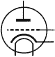

**`continue`** 语句使用得较少。像 **`break`** 一样，它跳过执行依赖块的其余部分，因此当前迭代中依赖块后的所有语句都不会执行。然而，然后它重新评估条件，如果条件为真，则从依赖块的开始继续：

```
for (**size_t** i =0; i < max_iterations; ++i) {
  if (x > 1.0) {   // Checks if we are on the correct side of 1
    x = 1.0/x;
    continue;
  }
  double prod = a*x;
  if (**fabs**(1.0 - prod) < eps) {     // Stops if close enough
    break;
  }
  x *= (2.0 - prod);                // Heron approximation
}
```

|  |
| --- |

`<tgmath.h>`

|  |
| --- |

在这些例子中，我们使用一个标准的宏 **`fabs`**，它包含在 `tgmath.h` 头文件中^([1]). 它计算 **`double`** 类型的绝对值。列表 3.1 是一个完整的程序，实现了相同的算法，其中 **`fabs`** 已被替换为对某些固定数字的几个显式比较：例如，eps1m24 定义为 1 – 2^(–24)，或 eps1p24 为 1 + 2^(–24)。我们将在稍后 (章节 5.3) 看到这些定义中使用的常数 `0`x1P`-24` 和类似的常数是如何工作的。

> ¹
> 
> “tgmath”代表 *类型通用的数学函数*。

在第一阶段，当前研究数字 a 与当前估计值 x 的乘积与 1.5 和 0.5 进行比较，然后 x 乘以 0.5 或 2，直到乘积接近 1。然后，在代码中显示的 Heron 近似在第二次迭代中使用，以接近并计算乘法逆的高精度值。

程序的整体任务是计算命令行上提供的所有数字的逆。一个程序执行的例子如下所示：

##### `终端`

```
**0**    > ./heron 0.07 5 6E+23
**1**    heron: a=7.00000e-02, x=1.42857e+01, a*x=0.999999999996
**2**    heron: a=5.00000e+00, x=2.00000e-01, a*x=0.999999999767
**3**    heron: a=6.00000e+23, x=1.66667e-24, a*x=0.999999997028
```

为了处理命令行上的数字，程序使用另一个库函数 `stdlib.h` 中的 **`strtod`**。^([[[Exs 3]](#ch03fn-ex03)])^([[[Exs 4]](#ch03fn-ex04)])^([[[Exs 5]](#ch03fn-ex05)])

> ^([Exs 3])
> 
> 通过添加对 x 的中间值的 **`printf`** 调用来分析 列表 3.1。
> 
> ^([Exs 4])
> 
> 描述 列表 3.1 中参数 argc 和 argv 的使用。
> 
> ^([Exs 5])
> 
> 打印出 eps1m01 的值，并观察当它们略有变化时的输出。

|  |
| --- |

`<stdlib.h>`

|  |
| --- |
|  |

**顺序排序算法**

你能做

1.  归并排序（带递归）

1.  快速排序（带递归）

在具有排序键如 **`double`** 或你喜欢的字符串的数组上？

如果不知道你的程序是否正确，那么你将一无所获。因此，你能提供一个简单的测试例程来检查结果数组是否真的已排序吗？

这个测试例程应该只扫描一次数组，并且应该比你的排序算法快得多。

|  |
| --- |

##### 列表 3.1\. 计算数字的乘法逆

```
 **1**   #include <stdlib.h>
 **2**   #include <stdio.h>
 **3**
 **4**   /* lower and upper iteration limits centered around 1.0 */
 **5**   static double const eps1m01 = 1.0 - 0x1P-01;
 **6**   static double const eps1p01 = 1.0 + 0x1P-01;
 **7**   static double const eps1m24 = 1.0 - 0x1P-24;
 **8**   static double const eps1p24 = 1.0 + 0x1P-24;
 **9**
**10**   int **main**(int argc, char* argv[argc+1]) {
**11**     for (int i = 1; i < argc; ++i) {        // process args
**12**       double const a = **strtod**(argv[i], 0);  // arg -> double
**13**       double x = 1.0;
**14**       for (;;) {                    // by powers of 2
**15**         double prod = a*x;
**16**         if (prod < eps1m01) {
**17**           x *= 2.0;
**18**         } else if (eps1p01 < prod) {
**19**           x *= 0.5;
**20**         } else {
**21**           break;
**22**         }
**23**       }
**24**       for (;;) {                    // Heron approximation
**25**         double prod = a*x;
**26**         if ((prod < eps1m24) || (eps1p24 < prod)) {
**27**           x *= (2.0 - prod);
**28**         } else {
**29**           break;
**30**         }
**31**       }
**32**       **printf**("heron: a=%.5e,\tx=%.5e,\ta*x=%.12f\n",
**33**              a, x, a*x);
**34**     }
**35**     return **EXIT_SUCCESS**;
**36**   }
```

### 3.3\. 多重选择

C 语言提供的最后一个控制语句是 **`switch`** 语句，它也是一种 *选择*^C* 语句。它主要用于当一系列 **`if-else`** 构造过于繁琐时：

```
   if (arg == 'm') {
     **puts**("this is a magpie");
   } else if (arg == 'r') {
     **puts**("this is a raven");
   } else if (arg == 'j') {
     **puts**("this is a jay");
   } else if (arg == 'c') {
     **puts**("this is a chough");
   } else {
     **puts**("this is an unknown corvid");
   }
```

在这种情况下，我们有一个比 **`false`**`-`**`true`** 决策更复杂的选项，并且可以有多个结果。我们可以将其简化如下：

```
   switch (arg) {
     case 'm': **puts**("this is a magpie");
               break;
     case 'r': **puts**("this is a raven");
                  break;
     case 'j': **puts**("this is a jay");
               break;
     case 'c': **puts**("this is a chough");
               break;
     default: **puts**("this is an unknown corvid");
   }
```

我们根据 arg 变量的值选择一个 **puts** 调用。像 **printf** 一样，函数 **puts** 由 `stdio.h` 提供。它输出一个包含作为参数传递的字符串的行。我们为字符 'm'、'r'、'j'、'c' 和一个 *后备**^C* 情况提供特定的案例，标记为 **`default`**。如果 arg 不匹配任何 **`case`** 值，则触发默认情况.^([[[Exs 6]](#ch03fn-ex06)])

> ^([Exs 6])
> 
> 在程序中测试示例 **`switch`** 语句。看看如果你省略了一些 **`break`** 语句会发生什么。

|  |
| --- |

`<stdio.h>`

|  |
| --- |

语法上，**`switch`** 如此简单：

```
   switch (expression) statement-**or**-block
```

它的语义相当简单：**`case`** 和 **`default`** 标签作为 *跳转目标**^C*。根据表达式的值，控制继续到相应标记的语句。如果我们遇到一个 **`break`** 语句，它所在的整个 **`switch`** 语句终止，并且控制转移到 **`switch`** 之后的下一个语句。

根据这个规范，**`switch`** 语句可以比迭代 **`if-else`** 结构更广泛地使用：

```
   switch (count) {
     default:**puts**("++++ ..... +++");
     case 4: **puts**("++++");
     case 3: **puts**("+++");
     case 2: **puts**("++");
     case 1: **puts**("+");
     case 0:;
   }
```

一旦我们跳入代码块，执行将继续，直到遇到一个 **`break`** 或块的末尾。在这种情况下，因为没有 **`break`** 语句，我们最终会运行所有后续的 **puts** 语句。例如，当 count 的值为 `3` 时，输出是一个由三条线组成的三角形：

##### `终端`

```
**0**    +++
**1**    ++
**2**    +
```

**`switch`** 语句的结构可能比 **`if-else`** 更灵活，但它也有另一种限制：

|  |
| --- |

##### Takeaway 3.5

**`case`** *值必须是整数常量表达式*。

|  |
| --- |

在 第 5.6.2 节 中，我们将详细看到这些表达式是什么。现在，只需知道这些必须是我们在源代码中直接提供的固定值就足够了，例如前一个例子中的 `4`、`3`、`2`、`1`、`0`。特别是，变量如 count 只允许在 **`switch`** 部分使用，不允许在单个 **`case`** 中使用。

随着 **`switch`** 语句的更大灵活性，也伴随着代价：它更容易出错。特别是，我们可能会不小心跳过变量定义：

|  |
| --- |

##### Takeaway 3.6

**`case`** *标签不能超出变量定义的范围*。

|  |
| --- |
|  |

**数值导数**

我们将大量处理的是数值算法的概念。为了亲自动手，看看你是否能实现一个函数 **`double`** F`(`**`double`** x`)` 的数值导数 **`double`** f`(`**`double`** x`)`。

使用一个示例函数 F 来实现这个练习，对于 F 的一个很好的选择是，你知道其导数的函数，例如 **`sin`**、**`cos`** 或 **`sqrt`**。这允许你检查你的结果是否正确。

|  |
| --- |
|  |

***π***

计算π的 *N* 位小数。

|  |
| --- |

### **总结**

+   数值可以直接用作**`if`**语句的条件；0 表示“假”，而所有其他值都是“真”。

+   有三种不同的迭代语句：**`for`**、**`do`**和**`while`**。**`for`**是领域迭代的首选工具。

+   **`switch`**语句执行多重选择。如果没有通过**`break`**终止，一个**`case`**会运行到下一个。

## 第四章。表达计算

本章涵盖

+   执行算术运算

+   修改对象

+   处理布尔值

+   使用三元运算符进行条件编译

+   设置评估顺序

我们已经使用了一些简单的**表达式**^C 的例子。这些是计算基于其他值的值的代码片段。最简单的这种表达式是算术表达式，它们与我们学校学过的类似。但还有其他一些，特别是比较运算符，如`==`和`!=`，我们之前已经看到过。

在本章中，我们将对这些值和对象进行计算，它们大多数将是**`size_t`**类型，我们已经遇到过。这样的值对应于“大小”，因此它们是不能为负数的数字。它们可能的值范围从`0`开始。我们想要表示的是所有非负整数，通常在数学中用 N、N[0]或“自然数”表示。不幸的是，计算机是有限的，所以我们不能直接表示所有自然数，但我们可以进行合理的近似。有一个很大的上限**`SIZE_MAX`**，它是我们在**`size_t`**中可以表示的上限。

| |
| --- |

##### 取得成果 4.1

*类型* **`size_t`** *表示的范围是* *`[0,`* **`SIZE_MAX`***`]`**。

| |
| --- |

**`SIZE_MAX`**的值相当大。根据平台的不同，它可能是以下之一

+   2¹⁶ – 1 = 65535

+   2³² – 1 = 4294967295

+   2⁶⁴ – 1 = 18446744073709551615

第一个值是一个最小要求；如今，这样的小值只会出现在一些嵌入式平台上。其他两个值在当今更为常见：第二个仍然在一些 PC 和笔记本电脑上使用，而大多数较新的平台都使用第三个。这样的值选择对于不太复杂的计算来说已经足够大了。标准头文件`stdint.h`提供了**`SIZE_MAX`**，这样你就不必自己找出那个值，也不必相应地专门化你的程序。

| |
| --- |

`<stdint.h>`

| |
| --- |

我们提到的“不能为负的数字”的概念，对应于 C 语言中的*无符号整数类型**^C*。像`+`和`!=`这样的符号和组合被称为*运算符**^C*，而它们所应用的对象被称为*操作数**^C*；因此，在类似`+` a b 的例子中，`+`是运算符，而 a 和 b 是其操作数。

想要了解所有 C 运算符的概述，请参阅以下表格：表 4.1 列出了操作值的运算符，表 4.2 列出了操作对象的运算符，表 4.3 列出了操作类型的运算符。在使用这些运算符时，您可能需要从一个表格跳转到另一个表格。例如，如果您想要计算一个表达式，如`a + 5`，其中`a`是类型为**`unsigned`**的某个变量，您首先需要查看表 4.2 的第三行，以了解`a`是如何被评估的。然后，您可以使用表 4.1 的第三行来推断出`a`和`5`的值在算术操作中被组合：`a +`。如果您对这些表格中的所有内容都不理解，请不要沮丧。许多提到的概念尚未介绍；它们被列在这里，作为整本书的参考。

##### 表 4.1\. 值运算符 *“形式”列给出了操作的语法形式，其中@代表运算符，a 和可能 b 表示作为操作数的值。对于算术和位操作，结果类型是 a 和 b 类型协调的类型。对于一些运算符，别名列给出了运算符的另一种形式，或列出具有特殊意义的运算符组合。大多数运算符和术语将在以后讨论。*

|   |   |   | 类型限制 |   |   |   |
| --- | --- | --- | --- | --- | --- | --- |
| 运算符 | 别名 | 形式 | a | b | 结果 |   |
| --- | --- | --- | --- | --- | --- | --- |
|   |   | a | 窄化 |   | 宽化 | 提升类型 |
| + - |   | a@b | 指针 | 整数 | 指针 | 算术 |
| + - * / |   | a@b | 算术 | 算术 | 算术 | 算术 |
| + - * / |   | @a | 算术 |   | 算术 | 算术 |
| % |   | a@b | 整数 | 整数 | 整数 | 算术 |
| ~ | **compl** | @a | 整数 |   | 整数 | 位操作 |
| & | **bitand** | a@b | 整数 | 整数 | 整数 | 位操作 |
| &#124; | **bitor** |   |   |   |   |   |
| ^ | **xor** |   |   |   |   |   |
| << >> |   | a@b | 整数 | 正数 | 整数 | 位操作 |
| == < > <= >= |   | a@b | 标量 | 标量 | 0,1 | 比较 |
| != | **not_eq** | a@b | 标量 | 标量 | 0,1 | 比较 |
|   | !!a | a | 标量 |   | 0,1 | 逻辑 |
| !a | **not** | @a | 标量 |   | 0,1 | 逻辑 |
| && &#124;&#124; | **and or** | a@b | 标量 | 标量 | 0,1 | 逻辑 |
| . |   | a@m | **结构** |   | 值 | 成员 |
| * |   | @a | 指针 |   | 对象 | 引用 |
| [] |   | a[b] | 指针 | 整数 | 对象 | 成员 |
| -> |   | a@m | **结构**指针 |   | 对象 | 成员 |
| () |   | a(b ...) | 函数指针 |   | 值 | 调用 |
| **sizeof** |   | @ a | 无 |   | **size_t** | 大小，ICE |
| **_Alignof** | **alignof** | @(a) | 无 |   | **size_t** | 对齐，ICE |

##### 表 4.2\. 对象运算符 *形式列给出了操作的语法形式，其中 @ 代表运算符，o 表示对象，a 表示作为操作数的适当附加 *值*（如果有）。类型列中的附加 *要求对象 o 可寻址。*

| 运算符 | 别名 | 形式 | 类型 | 结果 |   |
| --- | --- | --- | --- | --- | --- |
|   |   | o | 数组* | 指针 | 数组降级 |
|   |   | o | 函数 | 指针 | 函数降级 |
|   |   | o | 其他 | 值 | 评估 |
| = |   | o@a | 非数组 | 值 | 赋值 |
| += -= *= /= |   | o@a | 算术 | 值 | 算术 |
| += -= |   | o@a | 指针 | 值 | 算术 |
| %= |   | o@a | 整数 | 值 | 算术 |
| ++ -- |   | @o o@ | 算术或指针 | 值 | 算术 |
| &= | **and_eq** | o@a | 整数 | 值 | 位 |
| &#124;= | **or_eq** |   |   |   |   |
| ^= | **xor_eq** |   |   |   |   |
| <<= >>= |   | o@a | 整数 | 值 | 位 |
| . |   | o@m | **struct** | 对象 | 成员 |
| [] |   | o[a] | 数组 | 对象 | 成员 |
| & |   | @o | 任何* | 指针 | 地址 |
| **sizeof** |   | @ o | 数据对象，非 VLA | **size_t** | 大小，ICE |
| **sizeof** |   | @ o | VLA | **size_t** | 大小 |
| **_Alignof** | **alignof** | @(o) | 非函数 | **size_t** | 对齐，ICE |

##### 表 4.3\. 类型运算符 *这些运算符返回一个整数常量（ICE）类型为 **`size_t`**。它们具有类似函数的语法，操作数在括号中。*

| 运算符 | 别名 | 形式 | T 的类型 | 结果 |   |
| --- | --- | --- | --- | --- |
| **sizeof** |   | **sizeof**(T) | 任何 | 大小 |
| **_Alignof** | **alignof** | **_Alignof**(T) | 任何 | 对齐 |
|   | **offsetof** | **offsetof**(T,m) | **struct** | 成员偏移 |

### 4.1\. 算术

算术运算符是操作值的运算符 表 4.1 中的第一组。

#### 4.1.1\. +, -, 和 *

算术运算符 *`+`*、*`-`* 和 *`*`* 主要按我们预期的样子工作，分别计算两个值的和、差和积：

```
   **size_t** a = 45;
   **size_t** b = 7;
   **size_t** c = (a - b)*2;
   **size_t** d = a - b*2;
```

这里，c 必须等于 `76`，d 必须等于 `31`。正如您从这个小例子中可以看到的，子表达式可以通过括号分组，以强制执行运算符的优先绑定。 

此外，运算符 *`+`* 和 *`-`* 有单目变体。-b 给出 b 的相反数：一个值 a，使得 b `+` a 等于 `0`。+a 简单地提供 a 的值。以下也给出 `76`：

```
   **size_t** c = (+a + -b)*2;
```

即使我们在计算中使用无符号类型，通过运算符 `-` 的取反和差分也是 *明确定义的**^C*。也就是说，无论我们向这种减法中输入什么值，我们的计算总是会有一个有效的结果。事实上，`size_t` 的一个神奇属性是 `+-*` 算术总是在可能的地方工作。只要最终的数学结果在范围 `[0,` **`SIZE_MAX`**`]` 内，那么该结果将是表达式的值。

|  |
| --- |

##### 摘要 4.2

*无符号算术始终有明确定义。*

| |
| --- |
| |

##### 4.3 摘要

*`+`**、* *`-`**、和* *`*`* *在* **`size_t`** *上的运算如果可以表示为* **`size_t`** *，则提供数学上正确的结果。

| |
| --- |

当结果不在这个范围内，因此不能*表示*^C*为**`size_t`**值时，我们称之为算术*溢出*^C*。溢出可能发生在，例如，如果我们乘以两个值，它们的数学乘积大于**`SIZE_MAX`**。我们将在下一章中看看 C 如何处理溢出。

#### 4.1.2\. 除法和余数

运算符`/`和`%`稍微复杂一些，因为它们对应于整数除法和余数操作。你可能不像对其他三个算术运算符那样熟悉它们。`a`/`b`的结果是 b 可以放入 a 中的次数，而`a`%`b`是在从 a 中移除最大数量的 b 之后剩余的值。`/`和`%`是一对运算符：如果我们有 z `=` a `/` b，余数`a`%`b`可以计算为`a`- z`*`b:

| |
| --- |

##### 4.4 摘要

*对于无符号值，* *`a`* *`==`* *`(`**a`/`b`)``*`**`b`* *`+`* *`(`**a`%`**`b`*).

| |
| --- |

对于`%`运算符的一个熟悉例子是时钟上的小时。比如说我们有一个 12 小时制的时钟：8:00 后的 6 小时是 2:00。大多数人能够计算 12 小时或 24 小时制时钟上的时间差。这种计算对应于`% 12`：在我们的例子中，`(8 + 6) % 12 == 2`^([[[Exs 1]](#ch04fn01)])。`%`的另一个类似用途是计算小时中的分钟，形式为`a % 60`。

> ^([Exs 1])
> 
> 使用 24 小时制时钟进行一些计算，例如 10:00 后的 3 小时和 20:00 后的 8 小时。

对于这两个操作，只有一个值是不允许的：`0`。除以零是被禁止的。

| |
| --- |

##### 4.5 摘要

*无符号* *`/`* *和* *`%`* *只有在第二个操作数不是* *`0`***时才有定义。*

| |
| --- |

`%`运算符也可以更好地解释无符号类型上的加法和乘法算术。如前所述，当无符号类型被赋予其范围之外的值时，它被认为是*溢出*^C*。在这种情况下，结果会减少，就像使用了`%`运算符一样。结果值“环绕”类型的范围。对于**`size_t`**，范围是`0`到**`SIZE_MAX`**，因此

| |
| --- |

##### 4.6 摘要

*对* **`size_t`** *的算术运算隐式执行* *`%(`***`SIZE_MAX`***`+1)`**.*

| |
| --- |
| |

##### 4.7 摘要

*在溢出的情况下，无符号算术会环绕。*

| |
| --- |

这意味着对于**`size_t`**值，**`SIZE_MAX`** `+ 1`等于`0`，而`0 - 1`等于**`SIZE_MAX`**。

这种“环绕”是使`-`运算符对无符号类型起作用的魔法。例如，将值`-1`解释为**`size_t`**等于**`SIZE_MAX`**；因此，将`-1`加到一个值上就相当于一个`+` **`SIZE_MAX`**，这会环绕到

+   a `+` **`SIZE_MAX`** `- (`**`SIZE_MAX`**`+1) =` a `- 1`。

`/` 和 `%` 操作符有一个很好的特性，即它们的结果总是小于或等于它们的操作数：

|  |
| --- |

##### Takeaway 4.8

*无符号* *`/`* *和* *`%`* *的结果总是小于操作数。

|  |
| --- |

因此

|  |
| --- |

##### Takeaway 4.9

*无符号* *`/`* *和* *`%`* *不会溢出*。

|  |
| --- |

### 4.2\. 操作符修改对象

我们已经看到的一个重要操作是赋值：*`a`* *`= 42`*. 如你所见，这个操作符不是对称的：它在右边有一个值，在左边有一个对象。在一种奇怪的语言滥用中，C 语言术语通常将右边称为 *rvalue**^C*（右值）和左边称为 *lvalue**^C*（左值）。我们将尽可能避免这种词汇：提到值和对象就足够了。

C 语言还有其他赋值操作符。对于任何二元操作符 @，我们看到的五个操作符都具有以下语法

```
   an_object @= some_expression;
```

它们只是将算术操作符 @ 和赋值组合的方便缩写；见表 4.2。一个大致等价的形式是

```
   an_object = (an_object @ (some_expression));
```

换句话说，有操作符 *`+=`*，*`-=`*，*`*`**`=`*，*`/=`* 和 *`%=`*。例如，在一个 **`for`** 循环中，可以使用 `+=` 操作符：

```
   for (**size_t** i = 0; i < 25; i += 7) {
     ...
   }
```

这些操作符的语法有点挑剔。不允许在字符之间有空格：例如，i `+ = 7` 而不是 i `+= 7` 是一个语法错误。

|  |
| --- |

##### Takeaway 4.10

*操作符的所有字符必须直接相连*。

|  |
| --- |

我们已经看到了其他两个修改对象的操作符：*递增操作符**^C* *`++`* 和 *递减操作符**^C* *`--`*：

+   `++`i 等价于 i `+= 1`。

+   `--`i 等价于 i `-= 1`。

所有这些赋值操作符都是真正的操作符。它们返回一个值（但不是对象！）：修改后的对象值。如果你足够疯狂，可以写一些像

```
   a = b = c += ++d;
   a = (b = (c += (++d))); // Same
```

但一次性修改多个对象的组合通常是不受欢迎的。除非你想要使你的代码晦涩难懂，否则不要这样做。涉及表达式的对象的变化被称为 *副作用**^C*。

|  |
| --- |

##### Takeaway 4.11

*值表达式的副作用是邪恶的*。

|  |
| --- |
|  |

##### Takeaway 4.12

*在一个语句中不要修改超过一个对象*。

|  |
| --- |

对于递增和递减操作符，还有两种其他形式：*后缀递增**^C* 和 *后缀递减**^C*。它们与我们看到的操作符不同，在于它们提供给周围表达式的结果。这些操作符的前缀版本（`++`a 和 `-`-a）先执行操作然后返回结果，就像相应的赋值操作符（a`+=1` 和 a`-=1`）一样；后缀操作返回操作之前的值，然后执行对象的修改。对于任何它们，变量的效果都是相同的：递增或递减的值。

所有这些都表明，带有副作用的表达式求值可能难以跟踪。不要这样做。

### 4.3\. 布尔上下文

几个运算符根据某些条件是否得到验证返回 `0` 或 `1`，请参阅 表 4.1。它们可以分为两类：比较和逻辑评估。

#### 4.3.1\. 比较

在我们的例子中，我们已经看到了比较运算符 *`==`*、*`!=`*、*`<`* 和 *`>`*。而后两个运算符在其操作数之间执行严格的比较，而运算符 *`<=`* 和 *`>=`* 分别执行“小于等于”和“大于等于”比较。所有这些运算符都可以用于控制语句，正如我们之前看到的，但它们实际上比这更强大。

|  |
| --- |

##### 收获 4.13

*比较运算符返回值* **`false`** *或* **`true`***。

|  |
| --- |

记住，**`false`** 和 **`true`** 仅仅是 `0` 和 `1` 的花哨名称。因此，它们可以用于算术或数组索引。在下面的代码中，c 将始终是 `1`，如果 a 和 b 相等，则 d 将是 `1`，否则为 `0`：

```
   **size_t** c = (a < b) + (a == b) + (a > b);
   **size_t** d = (a <= b) + (a >= b) - 1;
```

在下一个例子中，数组元素 sig`n[`**`false`**`]` 将包含大于或等于 `1.0` 的 largeA 中的值的数量，而 sig`n[`**`true`**`]` 将包含严格小于的值：

```
   double largeA[N] = { 0 };
   ...
   /* Fill largeA somehow */

   **size_t** sign[2] = { 0, 0 };
   for (**size_t** i = 0; i < N; ++i) {
       sign[(largeA[i] < 1.0)] += 1;
   }
```

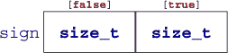

最后，还有一个标识符 **`not_eq`**，可以用作 `!=` 的替代。这个特性很少使用。它追溯到一些字符没有在所有计算机平台上正确出现的时候。要使用它，你必须包含文件 `iso646.h`。

|  |
| --- |

`<iso646.h>`

|  |
| --- |

#### 4.3.2\. 逻辑

逻辑运算符作用于已经表示 **`false`** 或 **`true`** 值的值。如果它们不是，则首先应用描述条件执行的规则（收获 3.1）。运算符 *`!`*（**`not`**）逻辑上否定其操作数，运算符 *`&&`*（**`and`**）是逻辑与，运算符 *`||`*（**`or`**）是逻辑或。这些运算符的结果总结在 表 4.4 中。

##### 表 4.4\. 逻辑运算符

| a | **not** a | a **and** b | **false** | **true** | a **or** b | **false** | **true** |
| --- | --- | --- | --- | --- | --- | --- | --- |
| **false** | **true** | **false** | **false** | **false** | **false** | **false** | **true** |
| **true** | **false** | **true** | **false** | **true** | **true** | **true** | **true** |

与比较运算符类似，

|  |
| --- |

##### 收获 4.14

*逻辑运算符返回值* **`false`** *或* **`true`***。

|  |
| --- |

再次提醒，这些值仅仅是 `0` 和 `1`，因此可以用作索引：

```
double largeA[N] = { 0 };
...
/* Fill largeA somehow */

**size_t** isset[2] = { 0, 0 };
for (**size_t** i = 0; i < N; ++i) {
  isset[!!largeA[i]] += 1;
}
```

在这里，表达式`!!`largeA`[`i`]`应用了`!`运算符两次，因此只是确保`largeA`[`i`]`被评估为真值（要点 3.4）。因此，数组元素`isset`[0]`和`isset`[1]`将分别保存等于`0.0`和不等值的数量。

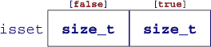

运算符`&&`和`||`有一个称为*短路评估**^C*的特殊属性。这个野蛮的术语表示第二个操作数的评估被省略，如果它对于操作的结果不是必需的：

```
// This never divides by 0.
if (b != 0 && ((a/b) > 1)) {
  ++x;
}
```

在这里，在执行过程中有条件地省略了 a/b 的评估，从而永远不会发生除以零的情况。等效的代码将是

```
if (b) {
  // This never divides by 0.
  if (a/b > 1) {
    ++x;
  }
}
```

### 4.4. 三元或条件运算符

*三元运算符*与**`if`**语句类似，但它是一个返回所选分支值的表达式：

```
   **size_t** size_min(**size_t** a, **size_t** b) {
     return (a < b) ? a : b;
   }
```

与运算符`&&`和`||`类似，第二个和第三个操作数只有在真正需要时才会被评估。`tgmath.h`中的宏**`sqrt`**计算非负值的平方根。用负值调用它将引发*域错误**^C*：

| |
| --- |

`<tgmath.h>`

| |
| --- |

```
#include <tgmath.h>

#ifdef **__STDC_NO_COMPLEX__**
# error "we need complex arithmetic"
#endif

double **complex** sqrt_real(double x) {
  return (x < 0) ? **CMPLX**(0, **sqrt**(-x)) : **CMPLX**(**sqrt**(x), 0);
}
```

在这个函数中，**`sqrt`**只调用一次，并且对该调用的参数永远不会是负数。因此，`sqrt_real`总是表现良好；永远不会传递任何坏值给**`sqrt`**。

复数运算及其使用的工具需要包含`complex.h`头文件，该文件由`tgmath.h`间接包含。它们将在第 5.7.7 节中介绍。

| |
| --- |

`<complex.h>`

`<tgmath.h>`

| |
| --- |

在前面的例子中，我们还看到了通过*预处理器指令**^C*实现的条件编译。**`#ifdef`**结构确保只有在宏**`__STDC_NO_COMPLEX__`**被定义的情况下才会遇到**`#error`**条件。

### 4.5. 评估顺序

在迄今为止的运算符中，我们已经看到`&&`、`||`和`?:`条件了它们的一些操作数的评估。这特别意味着对于这些运算符，它们的操作数有一个评估顺序：第一个操作数，因为它是对剩余操作数的条件，总是首先评估：

| |
| --- |

##### 要点 4.15

*`&&`**、* *`||`**、* *`?:`**和* *`,`* *首先评估它们的第一操作数。

| |
| --- |

逗号 (*`,`*) 是我们尚未介绍的唯一运算符。它按顺序评估其操作数，结果是右操作数的值。例如，`(`f`(`a`),` f`(`b`))`首先评估`f`(`a`)`，然后评估`f`(`b`)`；结果是`f`(`b`)`的值。请注意，逗号 *字符* 在 C 中扮演其他语法角色，这些角色不使用相同的评估约定。例如，分隔初始化的逗号不具有与分隔函数参数的逗号相同的属性。

逗号运算符在干净的代码中很少有用，并且是初学者的陷阱：`A`[`i`,` j`]`不是矩阵 A 的二维索引，而是结果为`A`[`j`]`。

| |
| --- |

##### 收获 4.16

*不要使用* *`,`* *运算符*。

|  |
| --- |

其他运算符没有评估限制。例如，在一个表达式如 f`(`a`)+`g`(`b`)`中，没有预先建立的顺序指定是先计算 f`(`a`)`还是 g`(`b`)`。如果函数 f 或 g 有副作用（例如，如果 f 在幕后修改了 b），则表达式的结果将取决于选择的顺序。

|  |
| --- |

##### 收获 4.17

*大多数运算符不会按顺序执行其操作数*。

|  |
| --- |

那个顺序可能取决于你的编译器，那个编译器的特定版本，编译时选项，或者仅仅是围绕表达式的代码。不要依赖于任何这样的特定顺序：它会让你吃苦头。

对于函数参数也是如此。在类似

```
**printf**("%g and %g\n", f(a), f(b));
```

我们不知道最后两个参数中哪一个先被评估。

|  |
| --- |

##### 收获 4.18

*函数调用不会按顺序执行其参数表达式*。

|  |
| --- |

唯一可靠的方法是不依赖于算术表达式的评估顺序，就是禁止副作用：

|  |
| --- |

##### 收获 4.19

*在表达式内部调用的函数不应有副作用*。

|  |
| --- |
|  |

**Union-Find**

Union-Find 问题处理基础集上的分区表示。我们将使用数字 0, 1, ... 来识别基础集的元素，并将分区表示为一个森林数据结构，其中每个元素都有一个“父节点”，它是同一分区内的另一个元素。这样的分区中的每个集合都由一个称为集合根的指定元素来识别。

我们想要执行两个主要操作：

+   一个 Find 操作接收基础集的一个元素，并返回相应集合的根。

+   一个 Union^([a]) 操作接收两个元素，并将这些元素所属的两个集合合并为一个。

    > ^a
    > 
    > C 还有一个称为 **`union`** 的概念，我们将在后面看到，它与当前讨论的操作完全不同。因为 **`union`** 是一个关键字，所以我们在这里使用大写字母来命名操作。

你能否在一个名为 **`size_t`** 的基础类型索引表中实现一个名为 parent 的森林数据结构？在这里，表中 **`SIZE_MAX`** 的值表示一个位置代表了一棵树的根；另一个数字表示对应树的父节点位置。开始实现的一个重要特性是一个初始化函数，它使 parent 成为单例分区：也就是说，每个元素都是其私有集合的根的分区。

使用这个索引表，你能实现一个 Find 函数，对于给定的索引，找到其树的根吗？

你能否实现一个 FindReplace 函数，将路径上（包括）所有 parent 条目更改为特定值？

你能否实现一个 FindCompress 函数，将所有找到的根的父节点条目更改为根？

你能实现一个联合函数，将两个给定元素的树合并成一个吗？使用 FindCompress 对一边，FindReplace 对另一边。

| |
| --- |

### 概述

+   算术运算符执行数学运算。它们作用于值。

+   赋值运算符修改对象。

+   比较运算符比较值并返回`0`或`1`。

+   函数调用和大多数运算符以非特定的顺序评估它们的操作数。只有`&&`、`||`和`?:`在评估它们的操作数时施加顺序。

## 第五章. 基本值和数据

本章涵盖

+   理解抽象状态机

+   与类型和值一起工作

+   初始化变量

+   使用命名常量

+   类型的二进制表示

我们现在将重点从“如何做事”（语句和表达式）转移到 C 程序操作的事物上：*值*^C 和*数据*^C。一个具体程序在某一时刻必须*表示*值。人类有类似的策略：如今我们使用十进制表示法，在纸上使用印度-阿拉伯数字系统来写数字。但我们还有其他系统来写数字：例如，罗马数字（i，ii，iii，iv，等等）或文本表示法。知道单词*十二*表示值 12 是一个非平凡的步骤，这提醒我们，欧洲语言不仅在十进制中，也在其他系统中表示数字。英语和德语混合了 12 进制，法语使用了 16 进制和 20 进制。对于像我这样的非母语法语使用者来说，可能很难自发地将*quatre vingt quinze*（四乘二十加十五）与值 95 联系起来。

类似地，计算机上值的表示可能因架构而异，或者是由程序员赋予值的类型决定的。“文化”上的差异。因此，如果我们想编写可移植的代码，我们应该主要对值进行推理，而不是对表示进行推理。

如果你已经在 C 语言和操作字节和位方面有一些经验，你将需要在这章的大部分内容中努力“忘记”你的知识。思考你计算机上值的具体表示会比你想象的更阻碍你。

| |
| --- |

##### 5.1 要点

*C 程序主要推理值而不是它们的表示*。

| |
| --- |

特定值的表示在大多数情况下不应是你的关注点；编译器在那里是为了在值和表示之间组织翻译。

在本章中，我们将看到这个翻译的不同部分应该如何工作。你通常在程序中“争论”的理想世界是 C 的*抽象状态机*(第 5.1 节)。它为你程序的执行提供了一个与程序运行平台基本独立的视角。这个机器的*状态*组成部分，即*对象*，都具有固定的解释（它们的*类型*）和随时间变化的价值。C 的基本类型在第 5.2 节中描述，随后是描述我们如何表达这些基本类型的特定值(第 5.3 节)，如何在表达式中组装类型(第 5.4 节)，如何确保我们的对象最初具有期望的值(第 5.5 节)，如何给重复出现的值命名(第 5.6 节)，以及这些值在抽象状态机中的表示(第 5.7 节)。

### 5.1. 抽象状态机

一个 C 程序可以看作是一种操纵值的机器：程序中变量在特定时间点的特定值，以及计算表达式产生的中间值。让我们考虑一个基本示例：

```
   double x = 5.0;
   double y = 3.0;
   ...
   x = (x * 1.5) - y;
   **printf**("x is \%g\n", x);
```

在这里，我们有两个变量，x 和 y，它们的初始值分别为`5.0`和`3.0`。第三行计算了一些表达式：一个子表达式

```
   x
```

评估 x 并提供`5.0`的值；

```
   (5.0 * 1.5)
```

结果为`7.5`；

```
   y
```

评估 y 并提供`3.0`的值；

```
   7.5 - 3.0
```

结果为`4.5`；

```
   x = 4.5
```

将 x 的值改为`4.5`；

```
   x
```

再次评估 x，但现在提供`4.5`的值；以及

```
   **printf**("x is \%g\n", 4.5)
```

将文本行输出到终端。

并非所有操作及其产生的值都可以从你的程序内部观察到。只有当它们存储在可寻址的内存中或写入输出设备时，才是可观察的。在示例中，在某种程度上，**printf**语句“观察”了上一行所执行的操作，通过评估变量 x 并将该值的字符串表示写入终端来实现。但其他子表达式及其结果（如乘法和减法）并不是以这种方式可观察的，因为我们从未定义一个变量来保存这些值。

你的 C 编译器在优化过程中可以跳过任何步骤，只要它确保实现最终结果。在这里，在我们的玩具示例中，基本上有两种可能性。第一种是变量 x 在程序后面的部分不再使用，它获得的价值只与我们的**printf**语句相关。在这种情况下，我们代码片段的唯一效果是输出到终端，编译器可能会（并且会！）用等效的

```
   **printf**("x is 4.5\n");
```

也就是说，它将在编译时完成所有计算，生成的可执行文件将只打印一个固定的字符串。所有剩余的代码甚至变量的定义都消失了。

另一种可能性是 x 可能在以后被使用。那么一个不错的编译器可能会做如下操作

```
   double x = 4.5;
   **printf**("x is 4.5\n");
```

或者可能是

```
   **printf**("x is 4.5\n");
   double x = 4.5;
```

因为要在以后某个时刻使用 x，它是否在**printf**之前或之后赋值并不重要。

为了优化是有效的，重要的是 C 编译器生成的可执行文件能够重现*可观察的状态**^C*。这些包括一些变量的内容（以及我们稍后将会看到的类似实体）以及它们在程序执行过程中的输出。这个整个变化机制被称为*抽象状态机**^C*。

为了解释抽象状态机，我们首先必须探讨*值*（我们处于什么状态）、*类型*（这个状态代表什么）和*表示*（如何区分状态）的概念。正如术语*抽象*所暗示的，C 的机制允许不同的平台根据它们的需求和能力以不同的方式实现给定程序的抽象状态机。这种宽容性是 C 优化潜力的关键之一。

#### 5.1.1\. 值

C 中的*值*是一个抽象实体，通常存在于你的程序之外，该程序的特定实现，以及程序特定运行期间值的表示。例如，`0`的值和概念应该在所有 C 平台上始终产生相同的效果：将此值添加到另一个值*x*将再次是*x*，并且在控制表达式中评估值`0`将始终触发控制语句的**`false`**分支。

到目前为止，我们大多数关于值的例子都是某种类型的数字。这不是偶然的，而是与 C 的一个主要概念相关。

| |
| --- |

##### 5.2 总结

*所有值都是数字或者可以转换为数字*。

| |
| --- |

这个属性实际上涉及到 C 程序中所有的值，无论是我们打印的字符或文本、真值、我们采取的度量，还是我们调查的关系。将这些数字视为独立于你的程序及其具体实现的数学实体。

程序执行的数据包括在给定时刻所有对象的汇编值。程序执行的状态由以下因素决定：

+   可执行文件

+   当前执行点

+   数据

+   除了干预，例如来自用户的 IO

如果我们从最后一点抽象出来，一个从相同执行点运行相同数据的可执行文件必须给出相同的结果。但是，由于 C 程序应在系统之间具有可移植性，我们想要的不仅仅是这样。我们不希望计算的結果依赖于可执行文件（这是平台特定的），而理想情况下，只依赖于程序规范本身。实现这种平台独立性的一个重要步骤是**类型**的概念^C*。

#### 5.1.2\. 类型

类型是 C 与值关联的附加属性。到目前为止，我们已经看到了几种这样的类型，最显著的是**`size_t`**，还有**`double`**和 bool。

|  |
| --- |

##### Takeaway 5.3

*所有值都有一个静态确定的类型*。

|  |
| --- |
|  |

##### Takeaway 5.4

*对值的可能操作由其类型决定*。

|  |
| --- |
|  |

##### Takeaway 5.5

*值的类型决定了所有操作的结果*。

|  |
| --- |

#### 5.1.3\. 二进制表示和抽象状态机

不幸的是，计算机平台的多样性并不允许 C 标准完全规定给定类型的操作结果。标准没有完全规定的事项，例如，有符号类型的符号表示（*符号表示*），以及**`double`**浮点操作执行的精度（*浮点表示*）.^([1]) C 只对表示施加属性，以便可以从两个不同的来源预先推断出操作的结果：

> ¹
> 
> 其他国际标准对这些表示更为严格。例如，POSIX [2009]标准强制执行特定的符号表示，而 ISO/IEC/IEEE 60559 [2011]标准化了浮点表示。

+   操作数的值

+   一些描述特定平台的特征值

例如，当检查**`SIZE_MAX`**的值以及操作数时，可以完全确定**`size_t`**类型的操作。我们称表示给定平台给定类型值的模型为该类型的*二进制表示**^C*。

|  |
| --- |

##### Takeaway 5.6

*类型的二进制表示决定了所有操作的结果*。

|  |
| --- |

通常，我们需要的所有信息来确定该模型都可通过任何 C 程序获得：C 库头文件通过命名值（如**`SIZE_MAX`**）、运算符和函数调用提供必要的信息。

|  |
| --- |

##### Takeaway 5.7

*类型的二进制表示是可观察的*。

|  |
| --- |

这种二进制表示仍然是一个模型，因此在某种意义上是一个*抽象表示*，因为它并不完全确定值在计算机内存中或磁盘或其他持久存储设备中的存储方式。这种表示是*对象表示*。与二进制表示不同，只要我们不打算在主内存中组合对象的值，或者不需要在不同平台模型之间进行通信，对象表示通常对我们来说并不重要。在稍后的第 12.1 节中，我们将看到，如果我们知道这样一个对象存储在内存中并且知道其地址，我们甚至可以观察到对象表示。

因此，所有计算都是通过程序中指定的值、类型及其二进制表示来固定的。程序文本描述了一个*抽象状态机**^C*，它规定了程序如何从一个状态切换到下一个状态。这些转换仅由值、类型和二进制表示决定。

|  |
| --- |

##### 摘要 5.8（as-if）

*程序执行* *就像* *遵循抽象状态机*。

|  |
| --- |

#### 5.1.4\. 优化

如何让具体的可执行程序遵循抽象状态机的描述，这取决于编译器创建者的自由裁量权。大多数现代 C 编译器生成的代码并不严格遵循精确的代码规定：它们在可能的情况下都会作弊，并且只尊重抽象状态机的可观察状态。例如，一系列使用常数值的加法操作

```
   x += 5;
   /* Do something else without x in the meantime. */
   x += 7;
```

在许多情况下可以像这样执行，即

```
   /* Do something without x. */
   x += 12;
```

或者

```
   x += 12;
   /* Do something without x. */
```

只要结果没有可观察的差异，编译器就可以对执行顺序进行这样的更改：例如，只要我们不打印 x 的中间值，并且只要我们不使用这个中间值进行其他计算。

但是，这种优化也可能被禁止，因为编译器无法证明某个操作不会导致程序终止。在我们的例子中，很多都取决于 x 的类型。如果 x 的当前值接近类型的上限，看起来无害的操作 x `+= 7`可能会产生溢出。根据类型的不同，这种溢出会被以不同的方式处理。正如我们所见，无符号类型的溢出不是问题，压缩操作的结果将始终与两个单独的操作一致。对于其他类型，例如有符号整数类型(**`signed`**)和浮点类型(**`double`**)，溢出可能会*引发异常*并终止程序。在这种情况下，优化不能执行。

正如我们之前提到的，这种在程序描述和抽象状态机之间的允许的灵活性是一个非常宝贵的特性，通常被称为优化。结合其语言描述的相对简单性，这实际上是 C 语言能够超越其他具有更多旋钮和哨声的编程语言的主要特性之一。这次讨论的重要后果可以总结如下：

|  |
| --- |

##### 5.9 要点

*类型决定了优化机会*。

|  |
| --- |

### 5.2\. 基本类型

C 语言有一系列基本类型，以及从它们构造 *派生类型**^C* 的方法，这些方法我们将在 第六章 中描述。

主要由于历史原因，基本类型系统有些复杂，指定这些类型的语法并不完全直接。存在一个一级的指定，完全使用语言的保留字完成，例如 **`signed`**、**`int`** 和 **`double`**。这一级主要根据 C 的内部结构组织。在其之上是一个二级的指定，通过头文件实现，我们已看到了一些例子：**`size_t`** 和 bool。这一级是根据类型语义组织的，指定特定类型为程序员带来的属性。

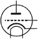

我们将从这类类型的一级指定开始。正如我们之前讨论的 (要点 5.2)，C 语言中的所有基本值都是数字，但存在不同种类的数字。作为一个主要区别，我们有两种不同的数字类别，每个类别有两个子类别：*无符号整数**^C*、*带符号整数**^C*、*实数浮点数**^C* 和 *复数浮点数**^C*。这四个类别中每个都包含几个类型。它们根据它们的 *精度**^C* 不同，这决定了特定类型允许的有效值范围。表 5.1 包含了 18 种基类型的概述。

> ²
> 
> 这里使用的 *精度* 一词在 C 标准的定义下具有限制性意义。它与浮点计算的 *精度* 不同。

##### 表 5.1\. 根据四种主要类型类别的基类型。*具有灰色背景的类型*不允许进行算术运算；在进行算术运算之前会被*提升*。类型* **`char`** *是特殊的，因为它可以是无符号的或带符号的，这取决于平台。*表中所有*类型都被视为不同的类型，即使它们具有相同的类别和精度。

| 类别 | 系统名称 | 其他名称 | 等级 |
| --- | --- | --- | --- |
| 整数 | 无符号 | **_Bool** | bool | 0 |
| **unsigned char** |  | 1 |
| **无符号短整型** |  | 2 |
| **无符号整型** | **unsigned** | 3 |
| **无符号长整型** |  | 4 |
| **无符号长整型** |   | 5 |
| [无]符号 | **char** |  | 1 |
|   | **有符号字符** |  | 1 |
|   | **有符号短整型** | **短整型** | 2 |
| 带符号 | **有符号整型** | **signed** 或 **int** | 3 |
|   | **signed long** | **long** | 4 |
|   | **signed long long** | **long long** | 5 |
| 浮点数 | 实数 | **float** |   |   |
| **double** |   |   |
| **long double** |   |   |
| Complex | **float _Complex** | **float** **complex** |
| **double _Complex** | **double** **complex** |
| **long double _Complex** | **long double** **complex** |

如您从表中可以看到，有六种类型我们无法直接用于算术运算，这些被称为**窄类型**^C*。在它们被用于算术表达式之前，这些类型会被**提升**^C*到更宽的类型之一。如今，在任何一个实际的平台上，这种提升将是一个与窄类型值相同的**`signed int`**，无论窄类型是有符号的还是无符号的。

|  |
| --- |

##### 取得要点 5.10

*在算术运算之前，窄整数类型会被提升到* **`signed int`***.*

|  |
| --- |

注意，在窄整数类型中，我们有两个突出的成员：**`char`**和 bool。第一个是 C 语言处理可打印字符的类型，第二个用于存储真值，**`false`**和**`true`**。正如我们之前所说的，对于 C 语言，即使是这些也只是某种数字。

剩下的 12 个未提升类型很好地分为四类。

|  |
| --- |

##### 取得要点 5.11

*基本类型中的每一类都有三种不同的未提升类型。*

|  |
| --- |

与许多人认为的相反，C 标准没有规定这 12 种类型的精度：它只是限制了它们。它们的值取决于许多*实现定义**^C*的因素。

标准规定了一件事，即有符号类型可能值的范围必须根据它们的**rank**相互包含：

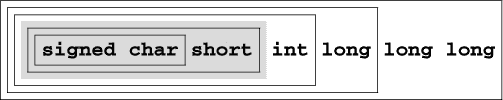

但这种包含关系不必是严格的。例如，在许多平台上，**`int`**和**`long`**的值集是相同的，尽管这些类型被认为是不同的。对于六个无符号类型也有类似的包含关系：

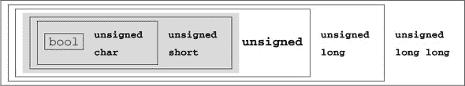

但请记住，对于任何算术或比较操作，窄无符号类型会被提升为**`signed int`**，而不是**`unsigned int`**，正如这张图可能暗示的那样。

有符号和无符号类型范围的比较更为复杂。显然，无符号类型永远不会包含有符号类型的负值。对于非负值，我们有以下类型值的包含关系：

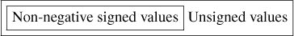

这意味着对于给定的 rank，有符号类型的非负值可以适合无符号类型。在任何现代平台上，这种包含关系是严格的：无符号类型有值不能适合有符号类型。例如，一个常见的最大值对是**`signed int`**的 2³¹–1 = 2 147 483 647 和**`unsigned int`**的 2³²–1 = 4 294 967 295。

由于整数类型之间的关系取决于平台，以可移植的方式为特定目的选择“最佳”类型可能是一项繁琐的任务。幸运的是，我们可以从编译器实现中获得一些帮助，它为我们提供了**`typedef`**，如**`size_t`**，这些代表某些特性。

|  |
| --- |

##### 5.12 摘要

*使用* **`size_t`** *表示大小、基数或序数。

|  |
| --- |

记住，无符号类型是最方便的类型，因为它们是唯一具有与数学属性一致定义的算术类型的类型：模运算。它们不能在溢出时发出信号，并且可以最好地优化。它们在 5.7.1 节中更详细地描述。

|  |
| --- |

##### 5.13 摘要

*使用* **`unsigned`** *表示不能为负的小量。

|  |
| --- |

如果你的程序确实需要可能为正也可能为负但没有分数的值，请使用有符号类型（参见 5.7.5 节）。

|  |
| --- |

##### 5.14 摘要

*使用* **`signed`** *表示带有符号的小量。

|  |
| --- |
|  |

##### 5.15 摘要

*使用* **`ptrdiff_t`** *表示带有符号的大差异。

|  |
| --- |

如果你想使用像`0.5`或`3.77189`E`+89`这样的值进行分数计算，请使用浮点类型（参见 5.7.7 节）。

|  |
| --- |

##### 5.16 摘要

*使用* **`double`** *进行浮点计算。

|  |
| --- |
|  |

##### 5.17 摘要

*使用* **`double`** **`complex`** *进行复杂数学运算。

|  |
| --- |

C 标准定义了许多其他类型，其中还包括其他用于特殊用例的算术类型。表 5.2 列出了一些。第二对表示平台支持的宽度最大的类型。这也是预处理器进行任何算术或比较的类型。

##### 表 5.2\. 一些用于特定用例的语义算术类型

| 类型 | 头文件 | 定义上下文 | 含义 |
| --- | --- | --- | --- |
| **size_t** | stddef.h |   | “大小”和基数类型 |
| **ptrdiff_t** | stddef.h |   | 大小差异的类型 |
| **uintmax_t** | stdint.h |   | 最大宽度的无符号整数，预处理器 |
| **intmax_t** | stdint.h |   | 最大宽度的有符号整数，预处理器 |
| **time_t** | time.h | **time**(0), **difftime**(t1, t0) | 自纪元以来的日历时间（秒） |
| **clock_t** | time.h | **clock**() | 处理器时间 |

两个类型**`time_t`**和**`clock_t`**用于处理时间。它们是语义类型，因为时间计算的精度可能因平台而异。要在算术中使用以秒为单位的时间，可以使用函数**difftime**：它计算两个时间戳的差异。**`clock_t`**值表示平台的处理器时钟周期模型，因此时间单位通常小于一秒；可以使用**`CLOCKS_PER_SEC`**将这些值转换为秒。

### 5.3\. 指定值


我们已经看到了几种指定数值常量（*字面量**^C*）的方法：

| 123 | *十进制整数常量**^C*. 对我们大多数人来说是最自然的选择。 |
| --- | --- |
| 077 | *八进制整数常量**^C*. 这是由一系列数字指定的，第一个数字是 0，后面的数字在 0 到 7 之间。例如，077 的值是 63。这种指定方式仅具有历史价值，现在很少使用。只有一种八进制字面量常用：0 本身。 |
| 0xFFFF | *十六进制整数常量**^C*. 这是由以 0x 开头，后跟 0 到 9 和 a 到 f 之间的数字序列指定的。例如，0xbeaf 的值是 48815。a 到 f 和 x 也可以写成大写，0XBEAF。 |
| 1.7E-13 | *十进制浮点常量**^C*. 与带有小数点的版本非常熟悉。但还有一种带有指数的“科学”表示法。在一般形式中，mEe 被解释为 *m* · 10*^e*. |
| 0x1.7aP-13 | *十六进制浮点常量**^C*. 通常用于描述易于指定具有精确表示的浮点值的形式。一般形式 0XhPe 被解释为 *h* · 2*^e*. 这里，*h* 被指定为十六进制分数。指数 *e* 仍然被指定为十进制数。 |
| 'a' | *整数字符常量**^C*. 这些是放在单引号之间的字符，例如 'a' 或 '?'. 它们的值仅由 C 标准隐式确定。例如，'a' 对应于拉丁字母中的字符 *a* 的整数代码。在字符常量中，反斜杠字符 \ 有特殊含义。例如，我们已经看到了用于换行符的 '\n'。 |
| "hello" | *字符串字面量**^C*. 它们指定文本，例如用于 **printf** 和 **puts** 函数的文本。同样，反斜杠字符 \ 与字符常量一样具有特殊含义.^([3]) |

> ³
> 
> 如果在 **printf** 函数的上下文中使用，另一个字符也变成了“特殊”字符：百分号字符。如果你想在 **printf** 中打印字面量 %，你必须重复它。

除了最后的之外，都是数值常量：它们指定数字.^([4]) 字符串字面量是一个例外，可以在编译时指定文本。如果我们不允许将字符串字面量分成块，将更大的文本集成到我们的代码中可能会很繁琐：

> ⁴
> 
> 你可能已经注意到复数不包含在这个列表中。我们将在 5.3.1 节 中看到如何指定它们。

```
**puts**("first line\n"
     "another line\n"
     "first and "
     "second part of the third line");
```

|  |
| --- |

##### Takeaway 5.18

*连续的字符串字面量会被连接起来。*

|  |
| --- |

数字规则要复杂一些。

|  |
| --- |

##### Takeaway 5.19

*数值字面量从不为负。*

|  |
| --- |

也就是说，如果我们写像 `-34` 或 `-1.5E-23` 这样的东西，前面的符号不是数字的一部分，而是应用于其后数字的*否定*运算符。我们很快就会看到这在哪里很重要。虽然这听起来可能很奇怪，但指数中的负号被认为是浮点字面量的一部分。

我们已经看到 (摘要 5.3)，所有的字面量不仅必须有值，还必须有类型。不要把常量具有正值的事实与它的类型混淆，它的类型可以是 **`signed`**。

|  |
| --- |

##### 摘要 5.20

*十进制整数常量是有符号的*。

|  |
| --- |

这是一个重要的特性：我们可能期望表达式 `-1` 是一个有符号的负值。

为了确定整数字面量的确切类型，我们始终有一个 *first fit* 规则。

|  |
| --- |

##### 摘要 5.21

*十进制整数常量具有适合它的三个有符号类型中的第一个类型*。

|  |
| --- |

这条规则可能会有意想不到的效果。假设在一个平台上，最小的 **`signed`** 值是 2¹⁵ = –32768，最大值是 2¹⁵ –1 = 32767\. 因此，常量 32768 不适合 **`signed`**，因此是 **`signed long`**。因此，表达式 `-32768` 的类型是 **`signed long`**。因此，该平台上 **`signed`** 类型的最小值不能写成字面量常量.^([[[Exs 1]](#ch05fn-ex01)])

> ^([Exs 1])
> 
> 证明如果 **`signed long long`** 的最小值和最大值具有类似特性，平台的最小整数值不能写成带负号的字面量组合。

|  |
| --- |

##### 摘要 5.22

*相同的值可以有不同的类型*。

|  |
| --- |

推断八进制或十六进制常量的类型要复杂一些。如果值不适合有符号类型，它们也可以是无符号类型。在早期示例中，十六进制常量 `0`x7FFF 的值是 32767，因此类型是 **`signed`**。除了十进制常量外，常量 `0`x8000（用十六进制表示的值为 32768）是一个**`unsigned`**，表达式 `-0`x8000 再次是 **`unsigned`**.^([[[Exs 2]](#ch05fn-ex02)])

> ^([Exs 2])
> 
> 证明如果最大的**`unsigned`**是 2¹⁶ –1，那么 `-`0x8000 也有值 32768。

|  |
| --- |

##### 摘要 5.23

*不要使用八进制或十六进制常量来表示负值*。

|  |
| --- |

因此，只剩下一种选择留给负值。

|  |
| --- |

##### 摘要 5.24

*使用十进制常量来表示负值*。

|  |
| --- |

整数常量可以强制转换为无符号类型或具有最小宽度的类型。这是通过在字面量后附加 *U*、*L* 或 *LL* 来实现的。例如，`1`U 的值是 1，类型是 **`unsigned`**，`1`L 是 **`signed long`**，而 `1`ULL 有相同的值 1 但类型是 **`unsigned long long`**.^([[[Exs 3]](#ch05fn-ex03)]) 注意，我们用打字机字体表示 C 常量，如 `1`ULL，并将它们与它们的数学值 1 区分开来，后者用正常字体表示。

> ^([Exs 3])
> 
> 证明表达式 `-1U`, `-1UL`, 和 `-1ULL` 分别具有三个非提升的无符号类型的最小值和类型。

一个常见的错误是尝试将十六进制常量赋给一个 **`signed`** 类型，并期望它将表示一个负值。考虑一个如 **`int`** x `= 0xFFFFFFFF` 的声明。这是在假设十六进制值与有符号值 -1 的 *二进制表示* 相同的情况下进行的。在大多数具有 32 位 **`signed`** 的架构上，这将是正确的（但并非所有架构都是这样）；但随后没有任何保证将有效值 +4294967295 转换为值 -1。 表 5.3 包含了一些有趣的常量、它们的值和它们的类型示例。

##### 表 5.3\. 常量及其类型的示例。这是在假设 **`signed`** 和 **`unsigned`** 使用常见的 32 位表示的情况下。

| 常量 *x* | 值 | 类型 | *–*x 的值 |
| --- | --- | --- | --- |
| 2147483647 | +2147483647 | **有符号** | *–*2147483647 |
| 2147483648 | +2147483648 | **signed long** | *–*2147483648 |
| 4294967295 | +4294967295 | **signed long** | *–*4294967295 |
| 0x7FFFFFFF | +2147483647 | **有符号** | *–*2147483647 |
| 0x80000000 | +2147483648 | **无符号** | +2147483648 |
| 0xFFFFFFFF | +4294967295 | **无符号** | +1 |
| 1 | +1 | **有符号** | *–*1 |
| 1U | +1 | **无符号** | +4294967295 |

记住值 0 非常重要。它如此重要，以至于有大量的等效表示法：`0`, `0`x0, 和 '\0' 都表示相同的值，一个 `0` 的类型为 **`signed int`**。0 没有十进制整数的表示法：`0.0` *是* 值 0 的十进制表示法，但它被视为类型为 **`double`** 的浮点值。

|  |
| --- |

##### Takeaway 5.25

*不同的字面量可以具有相同的值。*

|  |
| --- |

对于整数，这个规则看起来几乎是显而易见的，但对于浮点常量来说则不那么明显。浮点值只是它们所表示的值的近似，因为小数部分的二进制位可能被截断或四舍五入。

|  |
| --- |

##### Takeaway 5.26

*十进制浮点常量的有效值可能与字面值不同。*

|  |
| --- |

例如，在我的机器上，常量 `0.2` 的值为 0.2000000000000000111，因此常量 `0.2` 和 `0.2000000000000000111` 具有相同的值。

十六进制浮点常量已经被设计出来，因为它们更好地对应于浮点值的二进制表示。实际上，在大多数现代架构上，这样的常量（位数不是太多）将正好对应于字面量值。不幸的是，这些怪物对于普通人来说几乎不可读。例如，考虑两个常量 `0`x1`.99999`AP`-3` 和 `0`xC.CCCCCCCCCCCCCCDP`-6`。第一个对应于 1.60000002384 * 2^(–3)，第二个对应于 12.8000000000000000002 * 2^(–6)；因此，以十进制浮点数表示，它们的值分别约为 0.20000000298 和 0.200000000000000000003。所以这两个常量的值非常接近，而它们作为十六进制浮点常量的表示似乎把它们放在了很远的地方。

最后，浮点常量可以跟字母 f 或 F 一起使用来表示 **`float`**，或者跟 l 或 L 一起使用来表示 **`long double`**。否则，它们是 **`double`** 类型。请注意，不同类型的常量通常会导致相同的字面量有不同的值。以下是一个典型的例子：

|   | **float** | **double** | **long double** |
| --- | --- | --- | --- |
| 字面量 | 0.2F | 0.2 | 0.2L |
| 值 | 0x1.99999AP-3F | 0x1.999999999999AP-3 | 0xC.CCCCCCCCCCCCCCDP-6L |
|  |

##### 收获 5.27

*字面量具有值、类型和二进制表示。*

|  |
| --- |

#### 5.3.1. 复合常量

复合类型不一定被所有 C 平台支持。可以通过检查 **`__STDC_NO_COMPLEX__`** 来验证这一点。要完全支持复合类型，应包含头文件 `complex.h`。如果你使用 `tgmath.h` 进行数学函数，这已经隐式地完成了。

|  |
| --- |

`<complex.h>`

`<tgmath.h>`

|  |
| --- |

不幸的是，C 提供了没有字面量来指定复合类型常量的功能。它只有几个宏^([5])，这些宏可能有助于操作这些类型。

> ⁵
> 
> 我们将在 第 5.6.3 节 中看到宏到底是什么。现在，只需把它们当作编译器已经关联了一些特定属性的名称即可。

指定复数值的第一个可能性是宏 **`CMPLX`**，它包含一个复数值，其中包含实部和虚部。例如，**`CMPLX`**`(0.5, 0.5)` 是一个实部和虚部均为一半的 **`double`** **`complex`** 值。类似地，有 **`CMPLXF`** 用于 **`float`** **`complex`** 和 **`CMPLXL`** 用于 **`long double`** **`complex`**。

另一个更方便的可能性是由宏 I 提供的，它代表一个类型为 **`float`** **`complex`** 的常量值，使得 I`*`I 的值为 –1。在程序中，通常使用大写单字符宏名称来表示整个程序中固定的数字。单独来看，这并不是一个很棒的想法（单字符名称的供应有限），但你绝对应该让 I 保持原样。

|  |
| --- |

##### 收获 5.28

*`I`* *是虚数单位保留的。*

|  |
| --- |

我可以用类似于常规数学记法的复数类型常数来指定。例如，`0.5 + 0.5``*`I 将是**`double`** **`complex`**类型，而`0.`5F `+ 0.5`F`*`I 是**`float`** **`complex`**类型。如果我们将**`float`**和**`double`**常数混合用于实部和虚部，编译器会隐式地将结果转换为更宽的类型。

|  |
| --- |

**复数**

你能将导数(挑战 2)扩展到复数域：也就是说，接收和返回**`double`** **`complex`**值的函数吗？

|  |
| --- |

### 5.4. 隐式转换

正如我们在示例中所见，操作数的类型会影响操作表达式（如`-1`或`-`1U）的类型：第一个是**`signed int`**，第二个是**`unsigned int`**。后者对于初学者来说可能特别令人惊讶，因为**`unsigned int`**没有负值，所以`-`1U 的值是一个很大的正整数。

|  |
| --- |

##### Takeaway 5.29

*一元* *`-`* 和 *`+`* 的类型与其提升的参数相同。

|  |
| --- |

因此，这些运算符是类型通常不改变的例子。在它们改变的情况下，我们必须依赖 C 的隐式转换策略：也就是说，将具有特定类型的值移动到具有另一种、所需类型的值。考虑以下示例，再次假设-2147483648 和 2147483647 分别是**`signed int`**的最小值和最大值：

```
double          a = 1;             // Harmless; value fits type
signed short    b = -1;            // Harmless; value fits type
signed int      c = 0x80000000;    // Dangerous; value too big for type
signed int      d = -0x80000000;   // Dangerous; value too big for type
signed int      e = -2147483648;   // Harmless; value fits type
unsigned short  g = 0x80000000;    // Loses information; has value 0
```

在这里，a 和 b 的初始化是无害的。相应的值完全在所需类型的范围内，因此 C 编译器可以静默地转换它们。

c 和 d 的下一个转换有问题。正如我们所见，`0`x80000000 是**`unsigned int`**类型，不能放入**`signed int`**中。因此，c 接收到的值是实现定义的，我们必须知道我们的平台在这种情况下决定做什么。它可能只是重新使用右侧值的位模式，或者终止程序。至于所有实现定义的特性，所选择的解决方案应由您的平台文档化，但请注意，这可能会随着编译器新版本的出现而改变，或者可能由编译器参数切换。

对于 d 的情况，情况更加复杂：`0`x80000000 的值是 2147483648，我们可能会预期`-0`x80000000 只是-2147483648。但是，由于实际上`-`0x80000000 再次是 2147483648，因此出现了与 c 相同的问题。[^([Exs 4])(#ch05fn-ex04)]

> ^([Exs 4])
> 
> 假设**`unsigned int`**的最大值是 0xFFFFFFFF，证明`-0`x80000000 `== 0`x80000000。

然后，e 再次无害。这是因为我们使用了取反的十进制字面量`-2147483648`，它具有**`signed long`**类型，其值实际上是-2147483648（之前已显示）。由于这个值可以放入**`signed int`**中，转换可以无问题地进行。

g 的最后例子在后果上是不明确的。对于无符号类型来说，值太大时，会根据模数进行转换。这里特别地，如果我们假设**`unsigned short`**的最大值是 2¹⁶ –1，那么结果值是 0。是否这种“缩小”转换是期望的结果往往很难判断。

| |
| --- |

##### 收获 5.30

*避免缩小转换。*

| |
| --- |
| |

##### 收获 5.31

*不要在算术中使用窄类型。*

| |
| --- |

对于具有两个操作数的运算符，如加法和乘法，类型规则变得更加复杂，因为这些运算符可能具有不同的类型。以下是一些涉及浮点类型的操作示例：在这里，前两个例子是无害的：整数常量`1`很好地适合**`double`**或**`complex`** **`float`**类型。事实上，对于大多数这样的混合操作，只要一个类型的范围适合另一个类型的范围，结果就有更宽的范围的类型。

```
1       + 0.0  // Harmless; double
1       + I    // Harmless; complex float
**INT_MAX** + 0.0F // May lose precision; float
**INT_MAX** + I    // May lose precision; complex float
**INT_MAX** + 0.0  // Usually harmless; double
```

下两个例子有问题，因为**`INT_MAX`**，即**`signed int`**的最大值，通常不会适合**`float`**或**`complex`** **`float`**。例如，在我的机器上，**`INT_MAX`** `+ 0.0`F 与**`INT_MAX`** `+ 1.0`F 相同，其值为 2147483648。最后一行显示，对于**`double`**操作，这在大多数平台上都会正常工作。然而，在一个现有的或未来的平台中，如果**`int`**是 64 位，可能会出现类似的问题。

由于整数类型的值范围没有严格的包含关系，推导混合有符号和无符号值的操作类型可能会很棘手：

```
-1    < 0    // True, harmless, same signedness
-1L   < 0    // True, harmless, same signedness
-1U   < 0U   // False, harmless, same signedness
-1    < 0U   // False, dangerous, mixed signedness
-1U   < 0    // False, dangerous, mixed signedness
-1L   < 0U   // Depends, dangerous, same or mixed signedness
-1LL  < 0UL  // Depends, dangerous, same or mixed signedness
```

前三个比较是无害的，因为即使它们混合了不同类型的操作数，它们也没有混合符号。由于这些情况的可能值范围很好地包含彼此，C 语言简单地将其转换为更宽的类型并执行比较。

接下来的两个情况是明确的，但可能不是初学者程序员所期望的。实际上，对于这两个情况，所有操作数都被转换为**`unsigned int`**。因此，所有取反的值都被转换为大的无符号值，比较的结果是**`false`**。

最后两个比较甚至更加有问题。在**`UINT_MAX`** ≤ **`LONG_MAX`**的平台，`0`U 被转换为`0`L，因此第一个结果是**`true`**。在其他**`LONG_MAX`** < **`UINT_MAX`**的平台，`-1`L 被转换为`-1`U（即**`UINT_MAX`**），因此第一个比较是**`false`**。对于最后两个比较的第二个，也有类似的观察，但请注意，这两个结果可能并不相同。

最后两个比较的例子可能会引发关于有符号或无符号类型的无休止的辩论。但它们只表明了一件事：混合有符号和无符号操作数的语义并不总是清晰的。在某些情况下，隐式转换的任何一种选择都可能有问题。

|  |
| --- |

##### 取得成果 5.32

*避免使用不同符号位的操作数进行操作。*

|  |
| --- |
|  |

##### 取得成果 5.33

*尽可能使用无符号类型。*

|  |
| --- |
|  |

##### 取得成果 5.34

*选择算术类型，以确保隐式转换是无害的。*

|  |
| --- |

### 5.5\. 初始化器

我们已经看到（第 2.3 节），初始化器是对象定义的一个重要部分。初始化器帮助我们保证程序执行始终处于定义状态：即每次我们访问一个对象时，它都有一个已知的值，该值决定了抽象机的状态。

|  |
| --- |

##### 取得成果 5.35

*所有变量都应该初始化。*

|  |
| --- |

只有少数例外情况遵循这个规则：变长数组（VLA）；参见第 6.1.3 节，它不允许有初始化器，以及必须高度优化的代码。后者主要发生在使用指针的情况下，所以这目前对我们来说还不相关。对于到目前为止我们能写的绝大多数代码，现代编译器都能够追踪到一个值的来源，即它的最后赋值或初始化。多余的初始化或赋值将简单地被优化掉。

对于整数和浮点数这样的标量类型，初始化器只包含可以转换为该类型的表达式。我们已经看到了很多这样的例子。这样的初始化器表达式可以可选地被 `{}` 包围。以下是一些例子：

```
double a = 7.8;
double b = 2 * a;
double c = { 7.8 };
double d = { 0 };
```

其他类型的初始化器*必须*有这些 `{}`。例如，数组初始化器包含不同元素的初始化器，每个初始化器后面都跟着一个逗号：

```
double A[] = { 7.8, };
double B[3] = { 2 * A[0], 7, 33, };
double C[] = { [0] = 6, [3] = 1, };
```


正如我们所见，由于没有长度指定，具有*不完整类型**^C*的数组通过初始化器来完成，以完全指定长度。在这里，A 只有一个元素，而 C 有四个。对于前两个初始化器，应用于标量的初始化元素是从标量在列表中的位置推断出来的：例如，B`[1]`被初始化为`7`。对于 C 这样的指定初始化器来说，它们无疑是首选的，因为它们使代码对声明中的微小变化更具鲁棒性。

|  |
| --- |

##### 取得成果 5.36

*对于所有聚合数据类型，使用指定初始化器。*

|  |
| --- |

如果你不知道如何初始化类型为 T 的变量，则*默认初始化器**^C*T `a = {0}`几乎总是可以做到的。

> ⁶
> 
> 例外的是变长数组；参见第 6.1.3 节。

|  |
| --- |

##### 取得成果 5.37

*`{0}`* *是所有非 VLA 对象类型的有效初始化器。*

|  |
| --- |

几件事情确保了这一点。首先，如果我们省略了指定（对于 **`struct`** 的 `.membername` 参见 [第 6.3 节] 或数组的 `[`n`]` 参见 [第 6.1 节]），初始化就只是按照 *声明顺序* 完成^C：也就是说，默认初始化器中的 `0` 指的是声明的第一个成员，然后所有其他成员默认初始化为 `0`。然后，标量初始化器的 `{}` 形式确保 `{ 0 }` 对它们也是有效的。

可能你的编译器会警告你关于这一点：令人烦恼的是，一些编译器实现者不知道这个特殊规则。它是作为 C 标准中的通用初始化器而明确设计的，因此这是少数几个我会关闭编译器警告的情况之一。

在初始化器中，我们通常必须指定对程序有特定意义的值。

### 5.6. 命名常量

即使在小程序中，一个常见的问题是它们使用特殊值来完成某些目的，这些值在文本中被重复使用。如果由于某种原因这个值发生变化，程序就会崩溃。以下是一个人工设置的例子，其中我们有一些字符串数组，^([7])，我们想在它们上执行一些操作：

> ⁷
> 
> 这使用了一个 *指针*，类型 **`char const`**`*`**`const`**，来引用字符串。我们稍后会看到这种特定技术是如何工作的。

在这里，我们在几个地方使用了常量 `3`，并且具有三种不同的“意义”，这些意义之间关联性不大。例如，向我们的松鸦集合添加一个新成员将需要两次单独的代码更改。在实际设置中，代码中可能还有许多其他地方依赖于这个特定的值，在一个大型代码库中，这可能非常难以维护。

|  |
| --- |

##### 5.38 总结

*所有具有特定意义的常量都必须命名。*

|  |
| --- |

区分相等但相等只是巧合的常量同样重要。

|  |
| --- |

##### 5.39 总结

*所有具有不同意义的常量都必须区分开来。*

|  |
| --- |

C 语言在指定命名常量方面出奇地少，其术语甚至导致了对哪些构造有效导致编译时常量的很多混淆。因此，在我们深入研究 C 语言提供的唯一合适的命名常量：枚举常量（第 5.6.2 节）之前，我们首先必须弄清楚这些术语（第 5.6.1 节）。后者将帮助我们用更具有说明性的内容替换示例中 `3` 的不同版本。

```
char const*const bird[3] = {
  "raven",
  "magpie",
  "jay",
};
char const*const pronoun[3] = {
  "we",
  "you",
  "they",
};
char const*const ordinal[3] = {
  "first",
  "second",
  "third",
};
...
for (unsigned i = 0; i < 3; ++i)
    **printf**("Corvid %u is the %s\n", i, bird[i]);
...
for (unsigned i = 0; i < 3; ++i)
    **printf**("%s plural pronoun is %s\n", ordinal[i], pronoun[i]);
```

其次，通用的机制通过简单的文本替换：宏（第 5.6.3 节）来补充这个特性。如果它们的替换由基本类型的字面量组成，就像我们看到的，宏只会导致编译时常量。如果我们想为更复杂的数据类型提供类似于常量的概念，我们必须将它们作为临时对象提供（第 5.6.4 节）。

#### 5.6.1\. 只读对象

不要将术语*常量*与 C 语言中具有非常特定意义的对象混淆。例如，在之前的代码中，bird、pronoun 和 ordinal 根据我们的术语不是常量；它们是**`const`**-限定对象。这个*限定符**^C*指定我们没有权利更改此对象。对于 bird，数组的条目以及实际的字符串都不能修改，如果你尝试这样做，你的编译器应该会给出诊断：

| |
| --- |

##### 摘要 5.40

*具有**`const`***-限定类型的对象是只读的。*

| |
| --- |

这并不意味着编译器或运行时系统可能不会更改此类对象的值：程序的其他部分可能看到没有限定符的对象并更改它。你不能直接编写你的银行账户摘要（但只能读取它），并不意味着它将随着时间的推移保持不变。

另有一类只读对象，遗憾的是，它们的类型并不能保护它们不被修改：字符串字面量。


| |
| --- |

##### 摘要 5.41

*字符串字面量是只读的。*

| |
| --- |

如果今天引入，字符串字面量的类型肯定会是**`char const`**`[]`，一个**`const`**-限定字符数组。不幸的是，**`const`**关键字是在字符串字面量之后被引入到 C 语言的，因此为了向后兼容，它保持原样.^([8])

> ⁸
> 
> 存在第三类只读对象：临时对象。我们将在第 13.2.2 节中看到它们。

数组如 bird 也使用另一种技术来处理字符串字面量。它们使用一种*指针**^C*类型，**`char const`**`*`**`const`**，来“引用”字符串字面量。此类数组的可视化如下：

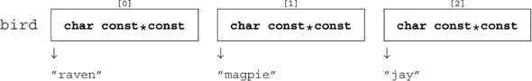

也就是说，字符串字面量本身并没有存储在数组 bird 中，而是在其他某个地方，而 bird 只是引用了那些地方。我们将在第 6.2 节和第十一章中更晚些时候看到这个机制是如何工作的。

#### 5.6.2\. 枚举

C 语言有一个简单的机制来命名我们需要的整数，称为*枚举**^C*：

```
enum corvid { magpie, raven, jay, corvid_num, };
char const*const bird[corvid_num] = {
  [raven]  = "raven",
  [magpie] = "magpie",
  [jay]    = "jay",
};
...
for (unsigned i = 0; i < corvid_num; ++i)
    **printf**("Corvid %u is the %s\n", i, bird[i]);
```

这声明了一个新的整数类型**`enum`** corvid，我们已知其四个不同的值。

| |
| --- |

##### 摘要 5.42

*枚举常量具有显式或位置值。*

| |
| --- |

正如你可能猜到的，位置值从`0`开始，因此在我们这个例子中，乌鸦的值为 0，喜鹊为 1，乌鸫为 2，corvid_num 为 3。这个最后的 3 显然是我们感兴趣的 3。

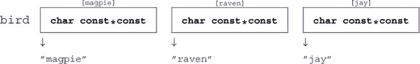

注意，这使用了与之前不同的数组条目顺序，这是使用枚举方法的一个优点：我们不需要手动跟踪数组中使用的顺序。枚举类型中固定的顺序会自动完成这项工作。

现在，如果我们想添加另一个 corvid，我们只需将其放入列表中，在任何地方在 corvid_num 之前：

##### 列表 5.1\. 枚举类型和相关字符串数组

```
enum corvid { magpie, raven, jay, chough, corvid_num, };
char const*const bird[corvid_num] = {
  [chough] = "chough",
  [raven]  = "raven",
  [magpie] = "magpie",
  [jay]    = "jay",
};
```

对于大多数其他窄类型，实际上对声明枚举类型的变量并不感兴趣；对于索引和算术运算，它们无论如何都会转换为更宽的整数。甚至枚举常量本身也不是枚举类型：

|  |
| --- |

##### 摘要 5.43

*枚举常量是* **`signed int`***.* 类型。

|  |
| --- |

因此，真正的兴趣在于常数，而不是新创建的类型。因此，我们可以为所需的任何**`signed int`**常量命名，甚至不需要为类型名提供*标签*^C：

```
   enum { p0 = 1, p1 = 2*p0, p2 = 2*p1, p3 = 2*p2, };
```

为了定义这些常数，我们可以使用*整数常量表达式（ICE）*^C (*ICE*). 这种 ICE 提供了一个编译时的整数值，并且受到很多限制。不仅其值必须在编译时确定（不允许函数调用），而且没有任何对象的评估必须作为值的一个操作数参与：

```
   signed const o42 = 42;
   enum {
     b42 = 42,       // Ok: 42 is a literal.
     c52 = o42 + 10, // Error: o42 is an object.
     b52 = b42 + 10, // Ok: b42 is not an object.
   };
```

这里，o42 是一个对象，**`const`**-修饰的，但仍然，所以 c52 的表达式不是一个“整数常量表达式。”

|  |
| --- |

##### 摘要 5.44

*整数常量表达式不评估任何对象*。

|  |
| --- |

因此，原则上，一个 ICE 可以由任何整数文字、枚举常量、**`_Alignof`**和**`offsetof`**子表达式以及最终的一些**`sizeof`**子表达式组成.^([9])

> ⁹
> 
> 我们将在第 12.7 节和第 12.1 节中处理这两个概念。

即使值是一个 ICE，为了能够用它来定义枚举常量，你必须确保该值适合于一个**`signed`**。

#### 5.6.3\. 宏定义

不幸的是，在 C 语言的严格意义上，没有其他机制可以声明除了**`signed int`**之外的其他类型的常数。相反，C 语言提出了另一种强大的机制，它引入了程序代码的文本替换：*宏*^C*. 宏是通过*预处理器*^C* **`#define`** 引入的：

```
# define M_PI 3.14159265358979323846
```

这个宏定义的效果是在以下程序代码中将标识符 M_PI 替换为**`double`**常量。这样的宏定义由五个不同的部分组成：

1.  行首的**`#`**字符，必须是行上的第一个非空白字符。

1.  关键字 **`define`**

1.  要声明的标识符，这里为 M_PI

1.  替换文本，这里为`3.14159265358979323846`

1.  一个终止的换行符

通过这个技巧，我们可以为**`unsigned`**、**`size_t`**和**`double`**的常量声明文本替换。实际上，**`size_t`**的实现限制**`SIZE_MAX`**被定义，以及其他我们已经看到的许多系统特性：**`EXIT_SUCCESS`**、**`false`**、**`true`**、**`not_eq`**、bool、**`complex`** 等。在本书的彩色电子版中，这些 C 标准宏都打印为**`暗红色`**。

这些例子来自 C 标准的拼写并不代表在大多数软件项目中普遍使用的约定。大多数项目都有相当严格的规则，使得宏在视觉上与其周围内容区分开来。

|  |
| --- |

##### 摘要 5.45

*宏名全部大写。*

|  |
| --- |

只有在你有充分的理由时才偏离该规则，特别是在达到第 3 级之前。

#### 5.6.4\. 复合字面量

对于没有描述其常量的类型，事情变得更加复杂。我们必须在宏的替换侧使用*复合字面量**^C*。这种复合字面量的形式是

```
   (T){ INIT }
```

即，一个类型，后面跟一个初始化器。以下是一个示例：

```
# define CORVID_NAME /**/        \
(char const*const[corvid_num]){  \
  [chough] = "chough",           \
  [raven] = "raven",             \
  [magpie] = "magpie",           \
  [jay] = "jay",                 \
}
```

有了这个，我们可以省略鸟数组并重写我们的**`for`**循环：

```
for (unsigned i = 0; i < corvid_num; ++i)
    **printf**("Corvid %u is the %s\n", i, CORVID_NAME[i]);
```

而在宏定义中的复合字面量可以帮助我们声明类似于所选类型常量的东西，但这并不是 C 的狭义意义上的常量。

|  |
| --- |

##### 摘要 5.46

*复合字面量定义了一个对象。*

|  |
| --- |

+   总体而言，这种形式的宏有一些陷阱：

+   复合字面量不适合用于 ICE。

+   在我们这里的目的，为了声明命名常量，类型 T 应该是**`const-`***限定**^C*。这确保了优化器有更多余地来生成这样的宏替换的良好二进制代码。

+   宏名和复合字面量的`()`之间必须有空格，这里用**`/`****`****`/`**注释表示。否则，这将被解释为*函数式宏*定义的开始。我们将在稍后看到这些。

+   行尾的退格字符`\`可以用来将宏定义延续到下一行。

+   宏定义的末尾绝对不能有`;`。记住，这只是一次文本替换。

|  |
| --- |

##### 摘要 5.47

*不要在宏内部隐藏一个终止的分号。*

|  |
| --- |

此外，为了宏的可读性，请同情一下你代码中偶尔的读者：

|  |
| --- |

##### 摘要 5.48

*宏的续行标记应右缩进到同一列。*

|  |
| --- |

正如你在示例中看到的，这有助于轻松可视化宏定义的整个范围。

### 5.7\. 二进制表示

一个类型的*二进制表示*是一个*模型*，它描述了该类型可能具有的值。它不同于描述给定类型值的内存*对象表示*。

|  |
| --- |

##### 摘要 5.49

*相同的值可能有不同的二进制表示。*

|  |
| --- |

#### 5.7.1\. 无符号整数

我们已经看到，无符号整数类型是那些具有标准算术运算的优美、封闭数学描述的算术类型。它们在算术运算下是封闭的：

|  |
| --- |

##### 摘要 5.50

*无符号算术运算可以很好地进行环绕。*

|  |
| --- |

在数学术语中，它们实现了一个 *环*，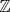*[N]*，即模某个数 *N* 的整数集。可表示的值是 0*, . . . , N* – 1\. 最大值 *N* – 1 完全决定了这样的无符号整数类型，并通过名称中带有终止符 **`_MAX`** 的宏提供。对于基本的无符号整数类型，这些是 **`UINT_MAX`**，**`ULONG_MAX`**，和 **`ULLONG_MAX`**，它们通过 `limits.h` 提供。正如我们所见，**`size_t`** 的值来自 `stdint.h` 的 **`SIZE_MAX`**。

| |
| --- |

`<limits.h>`

`<stdint.h>`

| |
| --- |

非负整数值的二进制表示总是如术语所示：这样的数由二进制位 *b*[0]*, b*[1]*. . . , b**[p–1]* 称为 *位**^C* 表示。每个位都有 0 或 1 的值。这样的数的值是通过以下方式计算的

##### 方程式 5.1\.

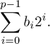

在那个二进制表示中，值 *p* 被称为基础类型的 *精度**^C*。位 *b*[0] 被称为 *最低有效位**^C*，即 *LSB*，*b**[p–1]* 是 *最高有效位**^C* (*MSB*).

在 *b**[i]* 位中，值为 1 的位中，具有最小索引 *i* 的位被称为 *最低有效位设置**^C*，而具有最高索引的位是 *最高有效位设置**^C*。例如，对于 *p* = 16 的无符号类型，值 `240` 将有 *b*[4] = 1，*b*[5] = 1，*b*[6] = 1，和 *b*[7] = 1\. 所有其他二进制表示的位都是 0，最低有效位设置 *i* 是 *b*[4]，最高有效位设置是 *b*[7]。从 (5.1) 我们可以立即看出，2*^p* 是第一个不能用该类型表示的值。因此 *N* = 2*^p* 和

| |
| --- |

##### 取得 5.51

*任何整数类型的最值形式为* 2*^p* – 1。

| |
| --- |

注意，对于非负值表示的讨论，我们没有争论类型的符号。这些规则同样适用于有符号和无符号类型。只有对于无符号类型，我们很幸运，我们之前所说的已经完全足够描述这样的无符号类型。

| |
| --- |

##### 取得 5.52

*无符号整数类型的算术运算由其精度决定*。

| |
| --- |

最后，表 5.4 展示了本书中一些常用标量的界限。

##### 表 5.4\. 本书使用的标量类型的界限

| 名称 | [最小值，最大值] | 位置 | 典型值 |
| --- | --- | --- | --- |
| **size_t** | [0, **SIZE_MAX**] | <stdint.h> | [0*,* 2*^w* –1], *w* = 32, 64 |
| **double** | [±**DBL_MIN**, ±**DBL_MAX**] | <**float**.h> | [±2*^(–w–2)**,*±2*^w*], *w* = 1024 |
| **signed** | [**INT_MIN**, **INT_MAX**] | <limits.h> | [–2*^w**,* 2*^w* –1], *w* = 31 |
| **unsigned** | [0, **UINT_MAX**] | <limits.h> | [0*,* 2*^w* –1], *w* = 32 |
| bool | [**false**, **true**] | <stdbool.h> | [0*,* 1] |
| **ptrdiff_t** | [**PTRDIFF_MIN**, **PTRDIFF_MAX**] | <stdint.h> | [–2*^w**,* 2*^w* –1], *w* = 31*,* 63 |
| **char** | [**CHAR_MIN**, **CHAR_MAX**] | <limits.h> | [0*,* 2*^w* –1], *w* = 7, 8 |
| **unsigned char** | [0, **UCHAR_MAX** ] | <limits.h> | [0, 255] |

#### 5.7.2\. 位集和位运算符

这种无符号类型的简单二进制表示使我们能够将其用于与算术无关的另一个目的：作为位集。位集是对无符号值的不同解释，我们假设它表示基础集 *V* = {0*, . . . , p*–1} 的子集，并且如果位 *b**[i]* 存在，则元素 *i* 是集合的成员。

有三个二元运算符作用于位集：*`|`*，*`&`* 和 *`^`*。它们分别代表 *集合并* *A* *∪* *B*，*集合交* *A* *∩* *B*，和 *对称差* *A*Δ*B*。

##### 表 5.5\. 位运算符的效果

| Bit op | Value | Hex | *b*[15] | ... | *b*[0] | Set op | Set |
| --- | --- | --- | --- | --- | --- | --- | --- |
| V | 65535 | 0xFFFF | 1111111111111111 |   | {0*,* 1*,* 2*,* 3*,* 4*,* 5*,* 6*,* 7*,* 8*,* 9*,* 10*,* 11*,* 12*,* 13*,* 14*,* 15} |
| A | 240 | 0x00F0 | 0000000011110000 |   | {4*,* 5*,* 6*,* 7} |
| ~A | 65295 | 0xFF0F | 1111111100001111 | *V* *\* *A* | {0*,* 1*,* 2*,* 3*,* 8*,* 9*,* 10*,* 11*,* 12*,* 13*,* 14*,* 15} |
| -A | 65296 | 0xFF10 | 1111111100010000 |   | {4*,* 8*,* 9*,* 10*,* 11*,* 12*,* 13*,* 14*,* 15} |
| B | 287 | 0x011F | 0000000100011111 |   | {0*,* 1*,* 2*,* 3*,* 4*,* 8} |
| A&#124;B | 511 | 0x01FF | 0000000111111111 | *A* *∪* *B* | {0*,* 1*,* 2*,* 3*,* 4*,* 5*,* 6*,* 7*,* 8} |
| A&B | 16 | 0x0010 | 0000000000010000 | *A* *∩* *B* | {4} |
| A^B | 495 | 0x01EF | 0000000111101111 | *A*Δ*B* | {0*,* 1*,* 2*,* 3*,* 5*,* 6*,* 7*,* 8} |

例如，让我们选择 *A* = 240，代表集合 {4, 5, 6, 7}，以及 *B* = 287，位集 {0, 1, 2, 3, 4, 8}；参见 表 5.5。对于这些操作的结果，基础集的总大小以及因此的精度 *p* 不需要。至于算术运算符，有相应的赋值运算符 *`&=`*，*`|=`* 和 *`^=`*。^([[[Exs 5]](#ch05fn-ex05)])^([[[Exs 6]](#ch05fn-ex06)])^([[[Exs 7]](#ch05fn-ex07)])^([[[Exs 8]](#ch05fn-ex08)])

> ^([Exs 5])
> 
> 证明 *A* *\* *B* 可以通过 A `-` (A&B`)` 来计算。
> 
> ^([Exs 6])
> 
> 证明 V `+ 1` 等于 0。
> 
> ^([Exs 7])
> 
> 证明 A`^`B 等价于 `(`A `- (`A`&`B`)) + (`B `- (`A`&`B`))` 和 A `+` B `- 2*(`A`&`B`)`.
> 
> ^([Exs 8])
> 
> 证明 A`|`B 等价于 A `+` B `- (`A`&`B`)`.

还有另一个操作符作用于值的位：补码操作符 *`~`*。补码 ~A 将具有值 65295，并对应于集合 {0, 1, 2, 3, 8, 9, 10, 11, 12, 13, 14, 15}。这个位补码始终取决于类型的精度 *p*。^([[[Exs 9]](#ch05fn-ex09)])^([[[Exs 10]](#ch05fn-ex10)])

> ^([Exs 9])
> 
> 证明 ~B 可以通过 V `-` B 来计算。
> 
> ^([Exs 10])
> 
> 证明 -B `=` ~B `+ 1`.

所有这些运算符都可以用标识符来写：**`bitor`**、**`bitand`**、**`xor`**、**`or_eq`**、**`and_eq`**、**`xor_eq`** 和 **`compl`**，如果你包含头文件 `iso646.h`。

| |
| --- |

`<iso646.h>`

| |
| --- |

位集的典型用法是用于 *标志*，这些变量控制程序的一些设置：

```
enum corvid { magpie, raven, jay, chough, corvid_num, };
#define FLOCK_MAGPIE  1U
#define FLOCK_RAVEN 2U
#define FLOCK_JAY     4U
#define FLOCK_CHOUGH  8U
#define FLOCK_EMPTY   0U
#define FLOCK_FULL   15U

int **main**(void) {
  unsigned flock = FLOCK_EMPTY;

  ... 

  if (something) flock |= FLOCK_JAY;
  ...

  if (flock&FLOCK_CHOUGH)
    do_something_chough_specific(flock);
}
```

在这里，每种乌鸦类型的常量都是 2 的幂，因此它们在二进制表示中恰好有一个位被设置。乌鸦群成员可以通过以下运算符处理：`|=` 向乌鸦群添加乌鸦，`&` 与其中一个常量一起使用来测试特定的乌鸦是否存在。

注意运算符 `&` 和 `&&` 或 `|` 和 `||` 之间的相似性：如果我们将 **`unsigned`** 的每个位 *b**[i]* 视为一个真值，`&` 同时执行其参数所有位的 *逻辑与*。这是一个很好的类比，应该有助于你记住这些运算符的特定拼写。另一方面，请记住，运算符 `||` 和 `&&` 有短路求值，所以一定要清楚地区分它们。

#### 5.7.3\. 位移运算符

下一个运算符集在无符号值的解释（作为数字和位集）之间建立了一座桥梁。左移操作 *`<<`* 对应于数值乘以相应的 2 的幂。例如，对于 *A* = 240，集合 {4, 5, 6, 7}，A `<< 2` 是 240 · 2² = 240 · 4 = 960，这代表集合 {6, 7, 8, 9}。结果中不适合该类型二进制表示的位被简单地省略。在我们的例子中，A `<< 9` 将对应于集合 {13, 14, 15, 16}（和值 122880），但由于没有位 16，结果集合是 {13, 14, 15}，值 57344。

因此，对于这种位移操作，精度 *p* 仍然很重要。不仅是不适合的位被丢弃，而且它还限制了右操作数的可能值：

| |
| --- |

##### Takeaway 5.53

*位移操作的第二操作数必须小于精度。*

| |
| --- |

存在一个类似的右移操作 *`>>`*，它将二进制表示向低有效位移动。类似地，这对应于除以 2 的幂的整数除法。对于小于或等于位移值的位，结果中省略这些位。注意，对于这个操作，类型的精度并不重要.^([[[Exs 11]](#ch05fn-ex11)])

> ^([Exs 11])
> 
> 证明在操作 `x>>n` 中“丢失”的位对应于余数 x `% (`1ULL `<<` n`)。

+   再次，也存在相应的赋值运算符 *`<<=`* 和 *`>>=`*。

+   左移运算符 `<<` 的主要用途是指定 2 的幂。在我们的例子中，我们现在可以替换掉 **`#define`**：

```
#define FLOCK_MAGPIE (1U << magpie)
#define FLOCK_RAVEN    (1U << raven)
#define FLOCK_JAY      (1U << jay)
#define FLOCK_CHOUGH   (1U << chough)
#define FLOCK_EMPTY     0U
#define FLOCK_FULL    ((1U << corvid_num)-1)
```

这使得示例对枚举的变化更加健壮。

#### 5.7.4\. 布尔值

C 中的布尔数据类型也被视为无符号类型。记住，它只有 0 和 1 两个值，所以没有负值。为了与古老的程序保持向后兼容，基本类型被称为**`_Bool`**。名称 bool 以及常量**`false`**和**`true`**只有通过包含`stdbool.h`才能使用。除非你真的需要维护一个非常旧的`<stdbool.h>`代码库，否则你应该使用后者。


|  |
| --- |

`stdbool.h`

|  |
| --- |

将布尔视为无符号类型是对概念的拉伸。将该类型的变量赋值不遵循要点 4.6 中的模数规则，而是遵循布尔值的特殊规则(要点 3.1)。

你可能很少需要布尔变量。它们只有在你想确保赋值后值总是减少到**`false`**或**`true`**时才有用。C 的早期版本没有布尔类型，许多经验丰富的 C 程序员仍然不使用它。

#### 5.7.5. 带符号整数

带符号类型比无符号类型要复杂一些。C 实现必须决定两个问题：

+   在算术溢出时会发生什么？

+   带符号类型的符号如何表示？

带符号和无符号类型根据它们的整数等级成对出现，有两个显著的例外来自表 5.1：**`char`** 和 bool。带符号类型的二进制表示受上面看到的包含图的约束。

|  |
| --- |

##### 要点 5.54

*正数与符号无关地表示。*

|  |
| --- |

或者，换句话说，正数在带符号类型中的表示与相应的无符号类型相同。这就是为什么任何整数类型的最大值都可以如此容易地表示出来（要点 5.51）：带符号类型也有一个精度，*p*，它决定了类型的最大值。

标准规定的下一件事是，带符号类型有一个额外的位，即 *符号位**^C*。如果是 0，则表示正数；如果是 1，则表示负数。不幸的是，关于如何使用这样的符号位来获得负数有不同的概念。C 允许三种不同的 *符号表示**^C*：

+   *符号和幅度**^C*

+   *一补码**^C*

+   *二进制补码**^C*

现在的前两种可能只有历史或异国情调的相关性：对于符号和幅度，幅度被视为正值，符号位简单地指定存在负号。一补码取相应的正值并对所有位进行补码。这两种表示都有缺点，即两个值评估为 0：有一个正 0 和一个负 0.^([10])

> ^{(10)}
> 
> 由于这两个概念在现代架构中已经完全废弃，因此正在努力在 C 标准的下一个修订版中将其删除。


在现代平台上常用的是二进制补码表示法。它执行与无符号类型相同的算术，但无符号值的上半部分（高位为 1 的值）被解释为负数。以下两个函数基本上是解释无符号值作为有符号值所需的所有内容：

```
bool is_negative(unsigned a) {
  unsigned const int_max = **UINT_MAX**/2;
  return a > int_max;
}
bool is_signed_less(unsigned a, unsigned b) {
  if (is_negative(b) && !is_negative(a)) return **false**;
  else return a < b;
}
```

表 5.6 展示了如何构建我们示例值 `240` 的负数。对于无符号类型，-A 可以计算为 ~A `+ 1`。^([[[Exs 12]](#ch05fn-ex12)])^([[[Exs 13]](#ch05fn-ex13)])^([[[Exs 14]](#ch05fn-ex14)]) 二进制补码表示法对有符号类型和无符号类型执行完全相同的位操作。它只 *解释* 高位为负的表示。

> ^([Exs 12])
> 
> 证明对于无符号算术，A `+` `~`A 是最大值。
> 
> ^([Exs 13])
> 
> 证明对于无符号算术，A `+` `~`A 是 -1.
> 
> ^([Exs 14])
> 
> 证明对于无符号算术，A `+ (~`A `+ 1) == 0`.

##### 表 5.6\. 16 位无符号整数类型的取反

| Op | Value | *b*[15] | ... | *b*[0] |
| --- | --- | --- | --- | --- |
| A | 240 | 0000000011110000 |
| ~A | 65295 | 1111111100001111 |
| +1 | 65295 | 0000000000000001 |
| -A | 65296 | 1111111100010000 |

以这种方式完成，有符号整数算术将再次表现得相当好。不幸的是，有一个陷阱使得有符号算术的结果难以预测：溢出。在无符号值被强制回绕的地方，有符号溢出的行为是 *未定义**^C*。以下两个循环看起来很相似：

```
   for (unsigned i = 1; i; ++i) do_something();
   for (  signed i = 1; i; ++i) do_something();
```

我们知道第一次循环会发生什么：计数器增加到**`UINT_MAX`**，然后回绕到 0。所有这些可能需要一些时间，但在**`UINT_MAX`**`-1`次迭代之后，循环停止，因为 i 将到达 0。

对于第二次循环，看起来很相似。但是，因为这里的溢出行为是未定义的，编译器被允许 *假装* 它永远不会发生。由于它也知道起始值是正的，它可能假设只要程序有定义的行为，i 就永远不会是负的或 0。*as-if* 规则 (取得成果 5.8) 允许它优化第二次循环为

```
   while (**true**) do_something();
```

那是对的，一个 *无限循环*。

|  |
| --- |

##### 取得成果 5.55

*一旦抽象状态机达到一个未定义的状态，就无法再对执行的延续做出任何假设。*

|  |
| --- |

不仅如此，编译器被允许对操作本身做它想做的事情（“*未定义？那我们就定义它*”），但它也可以假设它永远不会达到这样的状态，并据此得出结论。

通常，一个达到未定义状态的程序被称为“具有”或“显示” *未定义行为*。这种说法有点不幸；在许多这样的情况下，程序并不“显示”任何明显的异常迹象。相反，一些不好的事情正在发生，你可能很长时间都不会注意到。

|  |
| --- |

##### 取得要点 5.56

*避免所有操作未定义行为是你的责任*。

|  |
| --- |

使事情变得更糟的是，在某些 *平台* 上，使用某些 *标准编译器选项*，编译看起来似乎是正确的。由于行为是未定义的，在这样的平台上，有符号整数算术可能基本上与无符号整数相同。但是改变平台、编译器或某些选项可能会改变这一点。突然之间，你多年来一直运行的程序会突然崩溃。

基本上，我们到本章为止所讨论的内容总是具有明确的行为，因此抽象状态机总是处于一个明确的状态。有符号算术改变了这一点，所以除非你需要它，否则避免使用它。我们说，如果一个程序在其正常结束之前突然终止，那么它执行了一个 *trap*^C*（或者简称为 *traps*）。

|  |
| --- |

##### 取得要点 5.57

*有符号算术可能会产生严重的陷阱*。

|  |
| --- |

对于有符号类型，可能已经溢出的一个操作是取反。我们已经看到 **`INT_MAX`** 除了符号位外所有位都设置为 1。**`INT_MIN`** 然后具有“下一个”表示：符号位设置为 1，其他所有值设置为 0。相应的值不是 `-`**`INT_MAX`**.^([[[Exs 15]](#ch05fn-ex15)])

> ^([Exs 15])
> 
> 证明 **`INT_MIN`**`+`**`INT_MAX`** 等于 –1。

|  |
| --- |

##### 取得要点 5.58

*在二进制补码表示法中，* **`INT_MIN`** *`< -`***`INT_MAX`***.*

|  |
| --- |

或者，用另一种说法，在二进制补码表示法中，正值 `-`**`INT_MIN`** 超出了范围，因为操作的结果 *值* 大于 **`INT_MAX`**。

|  |
| --- |

##### 取得要点 5.59

*有符号算术的取反可能会溢出*。

|  |
| --- |

对于有符号类型，位操作与二进制表示一起工作。因此，位操作的结果特别依赖于符号表示。实际上，位操作甚至允许我们检测符号表示：

```
char const* sign_rep[4] =
  {
    [1] = "sign and magnitude",
    [2] = "ones' complement",
    [3] = "two's complement",
    [0] = "weird",
  };
enum { sign_magic = -1&3, };
...
**printf**("Sign representation: %s.\n", sign_rep[sign_magic]); 
```

那么位移操作就变得非常混乱。对于负值，这种操作的语义并不明确。

|  |
| --- |

##### 取得要点 5.60

*使用无符号类型进行位操作*。

|  |
| --- |

#### 5.7.6\. 固定宽度整数类型

我们迄今为止看到的整数类型的精度可以通过使用 `limits.h` 中的宏间接检查，例如 **`UINT_MAX`** 和 **`LONG_MIN`**。C 标准只为我们提供了它们的最小精度。对于无符号类型，这些是

|  |
| --- |

`<limits.h>`

|  |
| --- |
| 类型 | 最小精度 |
| --- | --- |
| bool | 1 |
| **无符号字符** | 8 |
| **无符号短整型** | 16 |
| **unsigned** | 16 |
| **无符号长整型** | 32 |
| **无符号长长整型** | 64 |

在通常情况下，这些保证应该给你足够的信息；但在某些技术约束下，这些保证可能不足，或者你可能想强调特定的精度。这可能是在你想使用无符号量来表示已知最大大小的位集合时的情况。如果你知道 32 位足以满足你的集合，根据你的平台，你可能想选择**`unsigned`**或**`unsigned long`**来表示它。

C 标准在`stdint.h`中为*精确宽度整数类型*提供了名称。正如名称所示，它们具有精确规定的“宽度”，对于提供的无符号类型，保证其与精度相同。

|  |
| --- |

`<stdint.h>`

|  |
| --- |
|  |

##### **要点 5.61**

*如果提供了类型* *`uintN_t`* *，它是一个具有精确* *N* *位宽度和精度的无符号整数类型*。

|  |
| --- |
|  |

##### **要点 5.62**

*如果提供了类型* *`intN_t`* *，它是有符号的，具有二进制补码表示，具有精确的* *N* *位宽度和*N* – 1 的精度*。

|  |
| --- |

这些类型中没有任何一个是保证存在的，但对于一组方便的 2 的幂，如果存在具有相应属性的类型，则必须提供**`typedef`**。

|  |
| --- |

##### **要点 5.63**

*如果存在具有所需属性的* *N* = 8，16，32*和* 64*的值的类型，则必须提供类型* *`uintN_t`* *和* *`intN_t`**。

|  |
| --- |

现在，平台通常提供**`uint8_t`**，**`uint16_t`**，**`uint32_t`**和**`uint64_t`**无符号类型以及**`int8_t`**，**`int16_t`**，**`int32_t`**和**`int64_t`**有符号类型。它们的存在和界限可以通过无符号类型的宏**`UINT8_MAX`**，...，**`UINT64_MAX`**和分别对应的有符号类型的宏**`INT8_MIN`**，**`INT8_MAX`**，...，**`INT64_MIN`**和**`INT64_MAX`**来测试.^([[[Exs 16]](#ch05fn-ex16)])

> ^([Exs 16])
> 
> 如果它们存在，所有这些宏的值都由类型的属性规定。将这些值视为*N*的封闭公式。

为了编码请求类型的文字，有宏**`UINT8_C`**，...，**`UINT64_C`**，和**`INT8_C`**，...，**`INT64_C`**，分别。例如，在**`uint64_t`**是**`unsigned long`**的平台，**`INT64_C`**`(1)`展开为 1UL。

|  |
| --- |

##### **要点 5.64**

*对于提供的任何固定宽度类型，还提供了* **`_MIN`** *(仅限有符号)，最大* **`_MAX`***，和文字* **`_C`** *宏*。

|  |
| --- |

由于我们无法知道此类固定宽度类型背后的类型，猜测用于**printf**和朋友的正确格式说明符将很困难。头文件`inttypes.h`为我们提供了相应的宏。例如，对于*N* = 64，我们提供了**`PRId64`**，**`PRIi64`**，**`PRIo64`**，**`PRIu64`**，**`PRIx64`**，和**`PRIX64`**，分别对应**printf**格式"%d"，"%i"，"%o"，"%u"，"%x"和"%X"：

|  |
| --- |

`<inttypes.h>`

|  |
| --- |

```
**uint32_t** n = 78;
**int64_t** max = (-**UINT64_C**(1))>>1;    // Same value as INT64_MAX 
**printf**("n is %" **PRIu32** ", and max is %" **PRId64** "\n", n, max);
```

如您所见，这些宏扩展为字符串字面量，这些字符串字面量与其他字符串字面量组合成格式字符串。这当然不是 C 编码之美竞赛的最佳候选人。

#### 5.7.7\. 浮点数据

而整数接近数学概念中的 （无符号）或 （有符号），浮点类型接近 （非复数）或 （复数）。它们与这些数学概念的不同之处有两点。首先，存在一个大小限制，即可以表示的内容。这与我们所看到的整数类型类似。例如，包含文件 `float.h` 有常数 **`DBL_MIN`** 和 **`DBL_MAX`**，为我们提供了 **`double`** 的最小值和最大值。但请注意，这里的 **`DBL_MIN`** 是严格大于 `0.0` 的最小数；最小的负 **`double`** 值是 `-`**`DBL_MAX`**。

| |
| --- |

`<float.h>`

| |
| --- |

但实数()在我们要在物理系统上表示它们时还有另一个困难：它们可以有无限扩展，例如值 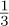，它在十进制表示中有无限重复的数字 3，或者π的值，它是“超越”的，因此在任何表示中都有无限扩展并且以任何方式都不重复。

C 和其他编程语言通过截断扩展来处理这些困难。扩展被截断的位置是“浮动”（因此得名）并且取决于所讨论的数字的大小。

在一种简化的观点中，浮点值是从以下值计算得出的：

| *s* | 符号（±1） |
| --- | --- |
| *e* | 指数，一个整数 |
| *f*[1]*, . . . ,* *f**[p]* | 值 0 或 1，尾数位 |

对于指数，我们有 *e**[min]* ≤ *e* ≤ *e**[max]*。*p*，尾数的位数，被称为*精度*。浮点值由以下公式给出：

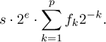

值 *p*、*emin* 和 *emax* 是类型相关的，因此在每个数字中并未明确表示。它们可以通过宏如 **`DBL_MANT_DIG`**（对于 *p*，通常是 53）**`DBL_MIN_EXP`**（*e**[min]*，-1021）和 **`DBL_MAX_EXP`**（*e**[max]*，1024）来获得。

例如，如果我们有一个数，其 *s* = –1，*e* = –2，*f*[1] = 1，*f*[2] = 0，和 *f*[2] = 1，其值是

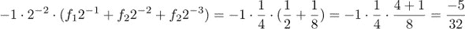

这对应于十进制值 `-0.15625`。从该计算中，我们还可以看到浮点值总是可以表示为一个分母中有某个 2 的幂次的分数。^([[[例 17]](#ch05fn-ex17)])

> ^([例 17])
> 
> 证明所有可表示的浮点值，其中 *e > p*，都是 2*^(e–p)* 的倍数。

在这样的浮点表示中要记住的一个重要事情是，值在中间计算过程中可能会被截断。

| |
| --- |

##### 摘要 5.65

*浮点运算既不是* 结合律 *，也不是* 交换律 *，也不是* 分配律 *。

| |
| --- |

因此，它们失去了我们在做纯数学时习惯的所有美好的代数属性。由此产生的问题，如果我们操作具有非常不同数量级的值时尤其明显。[[[例 18]](#ch05fn-ex18)]) 例如，将一个非常小的浮点值 *x* 与小于 – *p* 的指数相加到值 *y >* 1 上，只会再次返回 *y*。因此，在没有进一步调查的情况下，很难断言两个计算结果是否“相同”。这类调查通常是尖端研究问题，因此我们无法期望能够断言相等或不相等。我们只能告诉结果“接近”。

> ^([例 18])
> 
> 打印以下表达式的结果：`1.0`E`-13 + 1.0`E`-13` 和 `(1.0`E`-13 + (1.0`E`-13 + 1.0)) - 1.0`.

|  |
| --- |

##### Takeaway 5.66

*永远不要比较浮点数的相等性*。

|  |
| --- |
|  |

`<tgmath.h>`

|  |
| --- |

复数类型的表示简单且与相应实浮点类型的数组相同。要访问复数的实部和虚部，`tgmath.h`头文件中也提供了两个类型通用的宏：**`creal`** 和 **`cimag`**。对于三种复数类型中的任何一种类型 z，我们有 z `==` **`creal`**`(`z`) +` **`cimag`**`(`z`)*`I.^([11])

> ¹¹
> 
> 我们将在第 8.1.2 节中了解这样的函数式宏。

### 概述

+   C 程序在*抽象状态机*上运行，该状态机主要独立于启动它的特定计算机。

+   所有基本 C 类型都是数字类型，但并非所有这些类型都可以直接用于算术。

+   值具有类型和二进制表示。

+   当需要时，值类型会隐式转换为适合它们被使用的特定位置的需求。

+   变量在使用前必须显式初始化。

+   整数运算在没有溢出的情况下给出精确值。

+   浮点运算只给出近似结果，这些结果在一定的二进制位数后截断。

## 第六章\. 导出数据类型

本章涵盖

+   将对象分组到数组中

+   使用指针作为不透明类型

+   将对象组合到结构体中

+   使用**`typedef`**为类型赋予新名称

C 语言中的所有其他数据类型都源自我们已知的基类型。有四种推导数据类型的方法。其中两种被称为*聚合数据类型*，因为它们组合了一个或多个其他数据类型的多个实例：

+   ***数组：*** 这些组合了具有相同基本类型的项 (第 6.1 节)。

+   ***结构体：*** 这些组合了可能具有不同基本类型的项 (第 6.3 节)。

推导数据类型的两种其他策略更为复杂：

+   ***指针：*** 指向内存中对象的实体。指针是涉及最复杂的概念，我们将推迟对它们的全面讨论，直到 第十一章。在这里，在 第 6.2 节 中，我们只将它们作为不透明数据类型进行讨论，甚至不提及其真正履行的目的。

+   ***联合体：*** 这些在相同内存位置上覆盖不同基本类型的项。联合体需要更深入地理解 C 的内存模型，并且在程序员日常生活中的用途不大，因此它们只会在 第 12.2 节 中稍后介绍。

有一种第五种策略引入了类型的新名称：**`typedef`** (第 6.4 节)。与前面的四种不同，这并不在 C 的类型系统中创建一个新类型，而只是为现有类型创建一个新名称。因此，它类似于使用 **`#define`** 定义宏的定义；因此选择了这个关键字来表示这个特性。

### 6.1\. 数组

数组允许我们将相同类型的对象组合成一个封装的对象。我们将在 第十一章 中看到指针类型，但许多初来乍到的 C 语言程序员对数组和指针感到困惑。这是完全正常的：在 C 语言中，数组和指针密切相关，要解释它们，我们面临一个 *鸡生蛋还是蛋生鸡* 的问题：在许多情况下，数组 *看起来像* 指针，而指针指向数组对象。我们选择了可能不寻常的介绍顺序：我们将从数组开始，尽可能长时间地停留在数组上，然后再介绍指针。这可能会让一些人觉得“不对”，但请记住，这里所说的每一件事都必须基于 *as-if* 规则 (第 5.8 节的要点) 来理解：我们将首先以与 C 语言对抽象状态机的假设一致的方式描述数组。

|  |
| --- |

##### 6.1 节要点

*数组不是指针。*

|  |
| --- |

之后，我们将看到这两个概念是如何相互关联的，但此刻重要的是要无偏见地阅读本章关于数组的内容；否则，你将推迟你对 C 语言更好理解的提升。

#### 6.1.1\. 数组声明

我们已经看到了如何声明数组：通过在另一个声明后放置类似 *`[`**N`]`* 的内容。例如：

```
   double a[4];
   signed b[N];
```

在这里，a 包含 4 个类型为 **`double`** 的子对象，而 b 包含 N 个类型为 **`signed`** 的对象。我们用以下这样的图表来可视化数组，其中包含一系列其基本类型的框：

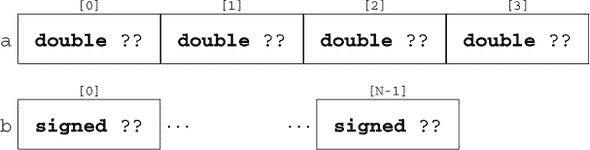

这里的点号 *…* 表示两个框之间可能存在未知数量的类似项。

组成数组的类型本身又可以是数组，形成 *多维数组**^C*。由于 `[]` 左结合，这些声明的可读性变得有点困难。以下两个声明声明了完全相同类型的变量：

```
   double C[M][N];
   double (D[M])[N];
```

C 和 D 都是数组类型的 M 对象**`double`**`[`N`]`。这意味着我们必须从内向外读取嵌套数组声明来描述其结构：

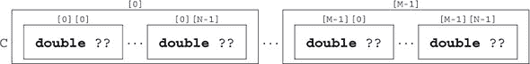

我们还看到了如何通过一对`[]`访问和初始化数组元素，在先前的例子中，`a[0]`是一个**`double`**类型的对象，可以在我们想要使用的地方使用，例如，一个简单的变量。正如我们所看到的，`C[0]`本身是一个数组，所以`C[0][0]`，它与`(C[0])[0]`相同，也是一个**`double`**类型的对象。

初始化器可以使用*指定初始化器*（也使用`[]`表示法）来选择初始化应用的具体位置。示例代码列表 5.1 中包含这样的初始化器。在开发过程中，指定初始化器有助于使我们的代码能够抵御数组大小或位置的小变化。

#### 6.1.2\. 数组操作

数组实际上只是与我们之前看到的类型不同的对象。

|  |
| --- |

##### Takeaway 6.2

*数组在条件中的评估结果为* **`true`***。

|  |
| --- |

这个事实来自于*数组降级*操作，我们将在后面看到。另一个重要的特性是我们不能像其他对象一样评估数组。

|  |
| --- |

##### Takeaway 6.3

*存在数组对象，但没有数组值。*

|  |
| --- |

所以数组不能作为表 4.1 中值运算符的操作数，也没有在数组（自身）上声明算术运算。

|  |
| --- |

##### Takeaway 6.4

*数组不能进行比较。*

|  |
| --- |

数组也不能出现在表 4.2 中对象运算符的值的一侧。大多数对象运算符同样被排除在外，不能将数组作为对象操作数，要么是因为它们假设了算术运算，要么是因为它们有第二个值操作数，这个操作数也必须是数组。

|  |
| --- |

##### Takeaway 6.5

*数组不能被赋值。*

|  |
| --- |

从表 4.2 中，我们还知道只剩下四个运算符可以作用于数组作为对象运算符。我们知道运算符`[]`。^([1]) 将在后面介绍*数组降级*操作、地址运算符`&`和**`sizeof`**运算符。

> ¹
> 
> 关于数组和`[]`的真正 C 语言术语故事要复杂一些。让我们将**as-if**规则(总结 5.8)应用到我们的解释中。所有 C 程序都表现得*好像*`[]`是直接应用于数组对象。

#### 6.1.3\. 数组长度

数组分为两类：*固定长度数组**^C*（FLAs）和*可变长度数组**^C*（VLAs）。前者是 C 语言从开始就存在的概念；这个特性与其他许多编程语言共享。后者是在 C99 中引入的，并且相对而言是 C 语言特有的，并且对其使用有一些限制。

|  |
| --- |

##### Takeaway 6.6

*VLAs 不能有初始化器。*

|  |
| --- |
|  |

##### Takeaway 6.7

*VLAs 不能在函数外部声明。*

|  |
| --- |

因此，让我们从另一端开始，看看哪些数组实际上是 FLA，这样它们就不会受到这些限制。

|  |
| --- |

##### Takeaway 6.8

*FLA 的长度由一个整数常量表达式 (ICE) 或初始化器确定。*

|  |
| --- |

对于这些选择中的第一个，长度在编译时通过 ICE（在 第 5.6.2 节 中介绍）是已知的。对于 ICE 没有类型限制：任何整数类型都可以。

|  |
| --- |

##### Takeaway 6.9

*数组长度指定必须是严格正数。*

|  |
| --- |

另一个重要的特殊情况会导致 FLA：当没有任何长度指定时。如果 `[]` 被留空，数组的长度将根据其初始化器（如果有）确定：

```
   double E[] = { [3] = 42.0,  [2] = 37.0, };
   double F[] = { 22.0,  17.0, 1, 0.5, };
```

在这里，E 和 F 都属于类型 **`double`**`[4]`。由于这种初始化器的结构可以在编译时确定，而不必知道项目值，因此数组仍然是 FLA。

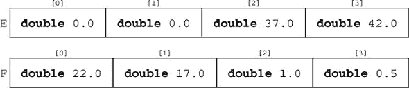

所有其他数组变量声明都会导致 VLAs。

|  |
| --- |

##### Takeaway 6.10

*长度不是整数常量表达式的数组是 VLA。*

|  |
| --- |

数组的长度可以使用 **`sizeof`** 运算符计算。该运算符提供了任何对象的大小，^([2]) 因此可以使用简单的除法计算数组的长度.^([3])

> ²
> 
> 之后，我们将看到这些大小的度量单位是什么。
> 
> ³
> 
> 注意，**`sizeof`** 运算符有两种不同的语法形式。如果应用于对象，如这里所示，它不需要括号，但如果我们将其应用于类型，则需要括号。

|  |
| --- |

##### Takeaway 6.11

*数组 *`A`* 的长度是 *`(`***`sizeof`** *`A)/(`***`sizeof`** *`A[0])`**.*

|  |
| --- |

即，它是数组对象的总大小除以数组元素的大小。

#### 6.1.4\. 数组作为参数

对于数组作为函数参数的情况，还有一个特殊情况。正如我们在 **printf** 原型中看到的那样，这些参数可能有空的 `[]`。由于此类参数不可能有初始化器，因此无法确定数组维度。

|  |
| --- |

##### Takeaway 6.12

*函数数组参数的内维丢失。*

|  |
| --- |
|  |

##### Takeaway 6.13

*不要在数组参数上使用* **`sizeof`** *运算符传递给函数。*

|  |
| --- |

数组参数甚至更加奇特，因为我们不能产生 *数组值* (总结 6.3)，数组参数不能按值传递，因此作为这样的数组参数就没有太多意义。

|  |
| --- |

##### Takeaway 6.14

*数组参数的行为*就像*数组是* *通过引用传递**^C**.*

|  |
| --- |

以 列表 6.1 中的示例为例。

##### 列表 6.1\. 带有数组参数的函数

```
#include <stdio.h>

void swap_double(double a[static 2]) {
  double tmp = a[0];
  a[0] = a[1];
  a[1] = tmp;
}
int **main**(void) {
  double A[2] = { 1.0, 2.0, };
  swap_double(A);
  **printf**("A[0] = %g, A[1] = %g\n", A[0], A[1]);
}
```

在这里，swap_double`(`A`)` 将直接作用于数组 A，而不是副本。因此，程序将交换 A 的两个元素的值。

|  |
| --- |

**线性代数**

数组用于解决的一些最重要的问题源于线性代数。

你现在能编写执行向量到向量或矩阵到向量乘积的函数吗？

关于高斯消元法或矩阵求逆的迭代算法呢？

|  |
| --- |

#### 6.1.5\. 字符串是特殊的

我们已经遇到过一种特殊的数组，它与其他数组不同，甚至有字面量：*字符串**^C*。

|  |
| --- |

##### 摘要 6.15

*字符串是一个* *`0`**-终止的 **`char`*** 数组。

|  |
| --- |

也就是说，像 "hello" 这样的字符串总是比可见的元素多一个，它包含值 0，所以这里的数组长度为 6。

像所有数组一样，字符串不能被赋值，但可以从字符串字面量初始化：

```
   char jay0[] = "jay";
   char jay1[] = { "jay" };
   char jay2[] = { 'j', 'a', 'y', 0, };
   char jay3[4] = { 'j', 'a', 'y', }; 
```

这些都是等效的声明。请注意，并非所有 **`char`** 数组都是字符串，例如

```
char jay4[3] = { 'j', 'a', 'y', };
char jay5[3] = "jay";
```

这两个都在 'y' 字符后截断，因此不是 `0`-终止的。

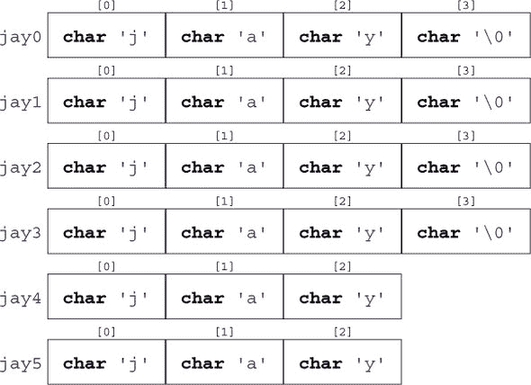

我们简要地看到了字符串在整数类型中的基本类型 **`char`**。它是一种窄整数类型，可以用来编码所有 *基本字符集**^C* 中的字符。这个字符集包含了拉丁字母、阿拉伯数字以及我们在 C 语言中使用的标点符号。它通常不包含特殊字符（例如，*ä*，*á*），以及来自完全不同的书写系统的字符）。

现在，绝大多数平台使用美国信息交换标准代码（ASCII）来编码 **`char`** 类型的字符。只要我们停留在基本字符集，我们就不必了解特定的编码方式：所有操作都在 C 语言及其标准库中完成，这些库透明地使用这种编码。

|  |
| --- |

`<string.h>`

|  |
| --- |

为了处理 **`char`** 数组和字符串，标准库中提供了一系列函数，这些函数包含在头文件 `string.h` 中。那些只需要数组参数的函数以 mem 开头命名，而那些除了需要数组参数外还需要参数是字符串的函数以 str 开头命名。列表 6.2 使用了一些接下来将要描述的函数。

##### 列表 6.2\. 使用一些字符串函数

```
 **1**    #include <string.h>
 **2**    #include <stdio.h>
 **3**    int **main**(int argc, char* argv[argc+1]) {
 **4**      **size_t** const len = **strlen**(argv[0]); // Computes the length 
 **5**      char name[len+1];                   // Creates a VLA 
 **6**                                          // Ensures a place for 0 
 **7**      **memcpy**(name, argv[0], len);         // Copies the name 
 **8**      name[len] = 0;                      // Ensures a 0 character 
 **9**      if (!**strcmp**(name, argv[0])) {
**10**       **printf**("program name \"%s\" successfully copied\n",
**11**              name);
**12**     } else {
**13**       **printf**("copying %s leads to different string %s\n",
**14**              argv[0], name);
**15**     }
**16**   }
```

操作 **`char`** 数组的函数如下：

+   **memcpy**`(`target, source, len) 可以用来将一个数组复制到另一个数组。这些数组必须是不同的数组。要复制的 **`char`** 字符数必须作为第三个参数 len 提供。

+   **memcmp**`(`s0, s1, len) 按字典顺序比较两个数组。也就是说，它首先扫描两个数组中恰好相等的初始段，然后返回两个不同第一个字符之间的差异。如果在 len 范围内没有找到不同的元素，则返回 `0`。

+   **memchr**(s, c, len) 在数组 s 中搜索字符 c 的出现。

接下来是字符串函数：

+   **strlen**`(`s`)` 返回字符串 s 的长度。这仅仅是第一个 `0` 字符的位置，而不是数组的长度。确保 s 确实是一个字符串：它是 `0`-终止的。

+   **strcpy**`(`target`,` source)` 与 **memcpy** 的工作方式类似。它只复制源字符串的长度，因此不需要 len 参数。再次强调，源必须以 `0` 结尾。此外，目标必须足够大，可以容纳复制的内容。

+   **strcmp**`(`s0`,` s1`)` 按字典顺序比较两个数组，类似于 **memcmp**，但可能不会考虑某些语言特性。比较在 s0 或 s1 中遇到的第一个 `0` 字符处停止。再次强调，两个参数都必须以 `0` 结尾。

+   **strcoll**`(`s0`,` s1`)` 按字典顺序比较两个数组，并尊重语言特定的环境设置。我们将在第 8.6 节中学习如何正确设置它 section 8.6。

+   **strchr**`(`s`,` c`)` 与 **memchr** 类似，只是字符串 s 必须以 `0` 结尾。

+   **strspn**`(`s0`,` s1`)` 返回 s0 中由 s1 中也出现的字符组成的初始段长度。

+   **strcspn**`(`s0`,` s1`)` 返回 s0 中由 s1 中不出现的字符组成的初始段长度。

|  |
| --- |

##### 取得成果 6.16

*使用非字符串的字符串函数会有未定义的行为.*

|  |
| --- |

在现实生活中，此类误用的常见症状可能包括：

+   由于 **strlen** 或类似扫描函数没有遇到 `0` 字符，所以运行时间较长

+   由于此类函数尝试访问数组对象边界之外的元素，会发生段错误

+   数据似乎随机损坏，因为函数在它们不应该写入数据的地方写入数据

换句话说，要小心谨慎，确保所有字符串确实都是字符串。如果你知道字符数组的长度，但不知道它是否以 0 结尾，可以使用 **memchr** 和指针算术（见第十一章）作为 **strlen** 的安全替代品。类似地，如果一个字符数组不是字符串，最好使用 **memcpy** 来复制它.^([[[Exs 1]](#ch06fn-ex01)])

> ^([Exs 1])
> 
> 使用 **memchr** 和 **memcmp** 来实现一个带有边界检查的 **strcmp** 版本。

在到目前为止的讨论中，我一直隐瞒了一个重要的细节：函数的原型。对于字符串函数，它们可以写成

```
**size_t** **strlen**(char const s[static 1]);
char* **strcpy**(char target[static 1], char const source[static 1]);
signed **strcmp**(char const s0[static 1], char const s1[static 1]);
signed **strcoll**(char const s0[static 1], char const s1[static 1]);
char* **strchr**(const char s[static 1], int c);
**size_t** **strspn**(const char s1[static 1], const char s2[static 1]);
**size_t** **strcspn**(const char s1[static 1], const char s2[static 1]);
```

除了 **strcpy** 和 **strchr** 的奇特返回类型外，这看起来是合理的。参数数组是未知长度的数组，所以 `[`**`static`** `1]`s 对应于至少包含一个 **`char`** 的数组。**strlen**、**strspn** 和 **strcspn** 将返回一个大小，而 **strcmp** 将根据参数的排序顺序返回负值、0 或正值。

当我们查看数组函数的声明时，画面变暗了：

```
void* **memcpy**(void* target, void const* source, **size_t** len);
signed **memcmp**(void const* s0, void const* s1, **size_t** len);
void* **memchr**(const void *s, int c, **size_t** n);
```

你缺少关于指定为**`void`**`*`的实体的知识。这些是指向未知类型对象的指针。只有在第 2 级、第十一章中，我们才会看到为什么以及如何出现这些关于指针和**`void`**类型的新概念。

| |
| --- |

**邻接矩阵**

图 *G* 的邻接矩阵是一个矩阵 A，它在元素 A`[`i`][`j`]`中持有值 **`true`** 或 **`false`**，如果从节点 i 到节点 j 有弧。

在这一点上，你能否使用邻接矩阵在图 *G* 中进行广度优先搜索？你能找到连通分量吗？你能找到生成树吗？

| |
| --- |
| |

**最短路径**

将图 *G* 的邻接矩阵的概念扩展到距离矩阵 D，该矩阵在从点 i 到点 j 的距离时持有。用非常大的值，例如**`SIZE_MAX`**标记直接弧的缺失。

你能否找到作为输入的两个节点 x 和 y 之间的最短路径？

| |
| --- |

### 6.2\. 指针作为不透明类型

我们现在已经看到指针的概念在几个地方出现，特别是在作为 **`void`**`*` 参数和返回类型，以及作为 **`char const`**`*`**`const`** 来操作字符串字面量的引用。它们的主要属性是它们不直接包含我们感兴趣的信息：相反，它们引用，或 *指向* 数据。C 语言中指针的语法总是具有奇特的 `*`：

```
   char const*const p2string = "some text";
```

它可以像这样可视化：

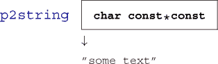

将此与之前包含我们想要表示的字符串所有字符的数组 jay0 进行比较：

```
   char const jay0 [] = "jay";
```

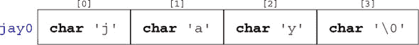

在这次探索中，我们只需要了解指针的一些简单属性。指针的二进制表示完全取决于平台，与我们无关。

| |
| --- |

##### 取得第 6.17 条经验教训

*指针是不透明的对象*。

| |
| --- |

这意味着我们只能通过 C 语言允许的操作来处理指针。正如我所说，大部分这些操作将在以后介绍；在我们的第一次尝试中，我们只需要初始化、赋值和评估。

指针的一个特定属性，使其与其他变量区分开来的是其状态。

| |
| --- |

##### 取得第 6.18 条经验教训

*指针是有效的、空或不确定的*。

| |
| --- |

例如，我们的变量 p2string 总是有效的，因为它指向字符串字面量 "some text"，并且由于第二个 **`const`**，这种关联永远不能改变。

任何指针类型的空状态对应于我们熟悉的老朋友 `0`，有时也被称为其别名 **`false`**。

| |
| --- |

##### 取得第 6.19 条经验教训

*使用 *`0`* 进行初始化或赋值使指针变为空*。

| |
| --- |

以以下内容为例：

```
   char const*const p2nothing = 0;
```

我们像这样可视化这种特殊情况：

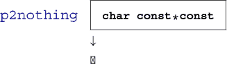

注意，这与指向空字符串不同：

```
   char const*const p2empty = "";
```

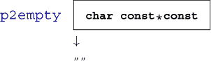

通常，我们将处于空状态的指针称为 *空指针**^C*。令人惊讶的是，处理空指针实际上是一个特性。

|  |
| --- |

##### 要点 6.20

*在逻辑表达式中，指针如果为 null，则评估为**`false`**。*

|  |
| --- |

注意，这样的测试无法区分有效的指针和不确定的指针。所以，指针的“真正”的“坏”状态是不确定的，因为这种状态是不可观察的。

|  |
| --- |

##### 要点 6.21

*不确定的指针会导致未定义的行为。*

|  |
| --- |

一个不确定指针的例子可能如下所示：

```
   char const*const p2invalid;
```

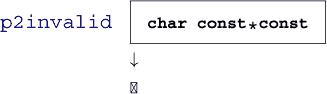

因为它未初始化，其状态是不确定的，任何使用它都会对你造成伤害，并使你的程序处于未定义状态（要点 5.55）。因此，如果我们不能确保指针是有效的，我们**必须**至少确保它被设置为 null。

|  |
| --- |

##### 要点 6.22

*始终初始化指针。*

|  |
| --- |

### 6.3. 结构体

正如我们所见，数组将相同基类型的多个对象组合成更大的对象。在我们想要组合具有第一、第二……元素概念的信息时，这完全合理。如果这不是情况，或者如果我们必须组合不同类型的对象，那么通过关键字**`struct`**引入的**结构体**就派上用场了。

作为第一个例子，让我们回顾一下第 5.6.2 节中的乌鸦。在那里，我们使用枚举类型的一个技巧来跟踪我们对数组名称各个元素的解释。C 结构体通过为聚合中的所谓**成员**（或**字段**）命名，提供了一种更系统的方法：

```
struct birdStruct {
  char const* jay;
  char const* magpie;
  char const* raven;
  char const* chough;
};
struct birdStruct const aName = {
  .chough = "Henry",
  .raven = "Lissy",
  .magpie = "Frau",
  .jay = "Joe",
};
```

即，从第 1 行到第 6 行，我们有新类型的声明，表示为**`struct`** birdStruct。这个结构体有四个**成员**，其声明看起来与正常的变量声明完全一样。所以，我们不是声明四个绑定在一起数组的元素，而是为不同的成员命名并声明它们的类型。这种结构体类型的声明只解释了类型；它还不是该类型对象的声明，更不是该对象的定义。

然后，从第 7 行开始，我们声明并定义了一个新类型的变量（称为 aName）。在初始化和后续使用中，使用带点的符号（`.`）指定各个成员。与第 5.6.1 节中的`bird[raven]`不同，对于数组，我们使用`aName.raven`来表示结构体：

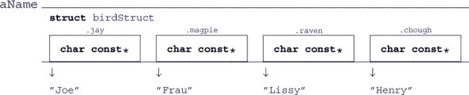

请注意，在这个例子中，各个成员再次只**引用**字符串。例如，成员`aName.magpie`引用一个位于盒子外部的实体“Frau”，并且不被认为是**`struct`**本身的一部分。

现在，作为第二个例子，让我们看看组织时间戳的方法。日历时间是一种复杂的计数方式，按年、月、日、分和秒计算；不同的时间段，如月份或年份，可以有不同长度，等等。组织此类数据的一种可能方式是数组：

```
typedef int calArray[9];
```

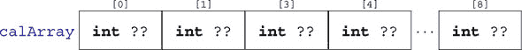

使用这种数组类型将是不明确的：我们会将年份存储在元素 `[0]` 还是 `[5]` 中？为了避免歧义，我们还可以再次使用我们的技巧，使用 **`enum`**。但 C 标准选择了不同的方法。在 `time.h` 中，它使用了一个看起来类似的 **`struct`**：

| |
| --- |

`<time.h>`

| |
| --- |

```
struct **tm** {
  int **tm_sec**;  // Seconds after the minute      [0, 60]
  int **tm_min**;  // Minutes after the hour        [0, 59]
  int **tm_hour**; // Hours since midnight          [0, 23]
  int **tm_mday**; // Day of the month              [1, 31]
  int **tm_mon**;  // Months since January          [0, 11]
  int **tm_year**; // Years since 1900
  int **tm_wday**; // Days since Sunday             [0, 6]
  int **tm_yday**; // Days since January            [0, 365]
  int **tm_isdst**;// Daylight Saving Time flag
};
```

这个 **`struct`** 有 *命名成员*，例如 **`tm_sec`** 用于秒和 **`tm_year`** 用于年。编码日期，例如本文写作的日期

##### `终端`

```
**0**        > LC_TIME=C date -u
**1**      Wed Apr  3 10:00:47 UTC 2019
```

这相对简单：

##### **`yday.c`**

```
**29**      struct **tm** today = {
**30**        .**tm_year** = 2019-1900,
**31**        .**tm_mon**  = 4-1,
**32**        .**tm_mday** = 3,
**33**        .**tm_hour** = 10,
**34**        .**tm_min**  = 0,
**35**        .**tm_sec**  = 47,
**36**      };
```

这创建了一个类型为 **`struct`** **`tm`** 的变量，并使用适当的值初始化其成员。结构体中成员的顺序或位置通常并不重要：使用带点`.`的前缀成员名称就足以指定相应数据应该放置的位置。

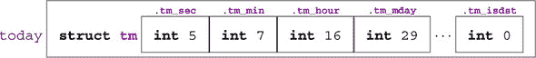

注意，与 calArray 相比，这种对今天的可视化有一个额外的“框”。实际上，一个合适的 **`struct`** 类型创建了一个额外的抽象级别。这个 **`struct`** **`tm`** 是 C 类型系统中的一个合适类型。

访问结构体的成员就像这样简单，并且具有类似的 *`.`* 语法：

##### **`yday.c`**

```
**37**      **printf**("this year is %d, next year will be %d\n",
**38**             today.**tm_year**+1900, today.**tm_year**+1900+1);
```

一个成员的引用，如 toda`y.`**`tm_year`**，可以出现在表达式中，就像任何相同基类型的变量一样。

在 **`struct`** **`tm`** 中还有三个我们甚至没有在初始化器列表中提到的成员：**`tm_wday`**、**`tm_yday`** 和 **`tm_isdst`**。由于我们没有提到它们，它们被自动设置为 `0`。

| |
| --- |

##### 要点 6.23

*省略* **`struct`** *初始化器将相应的成员强制设置为* *`0`**。

| |
| --- |

这种情况甚至可以极端到除了一个成员外，所有成员都被初始化。

| |
| --- |

##### 要点 6.24

*一个* **`struct`** *初始化器必须至少初始化一个成员*。

| |
| --- |

在之前（要点 5.37），我们看到了有一个默认初始化器适用于所有数据类型：`{0}`。

因此，当我们像这里一样初始化 **`struct`** **`tm`** 时，数据结构是不一致的；**`tm_wday`** 和 **`tm_yday`** 成员没有与剩余成员值相对应的值。一个将此成员设置为与其他成员值一致的函数可能如下所示

##### **`yday.c`**

```
**19**   struct **tm** time_set_yday(struct **tm** t) {
**20**     // tm_mdays starts at 1. 
**21**     t.**tm_yday** += DAYS_BEFORE[t.**tm_mon**] + t.**tm_mday** - 1;
**22**     // Takes care of leap years 
**23**     if ((t.**tm_mon** > 1) && leapyear(t.**tm_year**+1900))
**24**       ++t.**tm_yday**;
**25**     return t;
**26**   }
```

它使用当前月份之前的天数、`tm_mday` 成员以及闰年的校正来计算年份中的天数。这个函数有一个在我们当前水平上很重要的特性：它只修改函数参数 t 的成员，而不是原始对象。

| |
| --- |

##### 要点 6.25

**`struct`** 参数是通过值传递的。

| |
| --- |

为了跟踪变化，我们必须将函数的结果重新分配给原始变量：

##### **`yday.c`**

```
**39**      today = time_set_yday(today);
```

之后，我们将看到如何通过指针类型克服函数的这种限制，但我们还没有到达那里。这里我们看到，对于所有结构体类型，赋值运算符**`=`**是明确定义的。不幸的是，它的比较对应物并没有。

| |
| --- |

##### 取得成果 6.26

结构体可以用**`=`**赋值，但不能用**`==`**或**`!=`**比较。

| |
| --- |

代码清单 6.3 展示了使用**`struct`** **`tm`**的完整示例代码。它不包含历史性的**`struct`** **`tm`**的声明，因为这是通过标准头文件`time.h`提供的。如今，对于各个成员的类型可能的选择可能不同。但许多时候在 C 语言中，我们不得不坚持多年前做出的设计决策。


| |
| --- |

`<time.h>`

| |
| --- |

##### 代码清单 6.3\. 一个操作 struct **`tm`**的示例程序

```
 **1**   #include <**time**.h>
 **2**   #include <stdbool.h>
 **3**   #include <stdio.h>
 **4**
 **5**   bool leapyear(unsigned year) {
 **6**     /* All years that are divisible by 4 are leap years, 
 **7**        unless they start a new century, provided they 
 **8**        are not divisible by 400\. */ 
 **9**     return !(year % 4) && ((year % 100) || !(year % 400));
**10**   }
**11**
**12**   #define DAYS_BEFORE                             \
**13**   (int const[12]){                                \
**14**     [0] = 0, [1] = 31, [2] = 59, [3] = 90,        \
**15**     [4] = 120, [5] = 151, [6] = 181, [7] = 212,   \
**16**     [8] = 243, [9] = 273, [10] = 304, [11] = 334, \
**17**   }
**18**
**19**   struct **tm** time_set_yday(struct **tm** t) {
**20**     // tm_mdays starts at 1. 
**21**     t.**tm_yday** += DAYS_BEFORE[t.**tm_mon**] + t.**tm_mday** - 1;
**22**     // Takes care of leap years 
**23**     if ((t.**tm_mon** > 1) && leapyear(t.**tm_year**+1900))
**24**       ++t.**tm_yday**;
**25**     return t;
**26**   }
**27**
**28**   int **main**(void) {
**29**     struct **tm** today = {
**30**       .**tm_year** = 2019-1900,
**31**       .**tm_mon**  = 4-1,
**32**       .**tm_mday** = 3,
**33**       .**tm_hour** = 10,
**34**       .**tm_min**  = 0,
**35**       .**tm_sec**  = 47,
**36**     };
**37**     **printf**("this year is %d, next year will be %d\n",
**38**            today.**tm_year**+1900, today.**tm_year**+1900+1);
**39**     today = time_set_yday(today);
**40**     **printf**("day of the year is %d\n", today.**tm_yday**);
**41**   }
```

| |
| --- |

##### 取得成果 6.27

结构体布局是一个重要的设计决策。

| |
| --- |

几年后，当所有使用它的现有代码几乎不可能适应新情况时，你可能会后悔自己的设计。

**`struct`**的另一个用途是将不同类型的对象组合在一个更大的封装对象中。同样，对于以纳秒精度操作时间，C 标准已经做出了这样的选择：

```
struct **timespec** {
  **time_t** **tv_sec**; // Whole seconds ≥0
  long  **tv_nsec**; // Nanoseconds   [0, 999999999] 
};
```

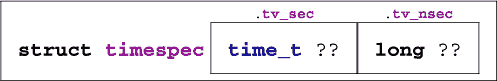

这里我们看到的是我们在表 5.2 中看到的用于秒的透明类型**`time_t`**，以及用于纳秒的**`long`**。^([4]) 再次，这种选择的原因是历史性的；如今，选择的数据类型可能略有不同。要计算两个**`struct`** **`timespec`**时间之间的差异，我们可以轻松定义一个函数。

> ⁴
> 
> 很不幸，即使是**`time_t`**的语义在这里也有所不同。特别是，**`tv_sec`**可以用于算术运算。


虽然**difftime**函数是 C 标准的一部分，但这里的这种功能非常简单，并不基于平台特定的属性。因此，任何需要它的人都可以轻松实现。^([[[Exs 2]](#ch06fn-ex02)])

> ^([Exs 2])
> 
> 编写一个名为 timespec_diff 的函数，用于计算两个**`timespec`**值之间的差异。

除了 VLA 之外，任何数据类型都可以作为结构体的成员。因此，结构体也可以嵌套，即一个**`struct`**的成员可以再次是（另一个）**`struct`**类型，较小的封装结构甚至可以在较大的结构体内部声明：

```
struct person {
  char name[256];
  struct stardate {
    struct**tm** date;
    struct**timespec** precision;
  } bdate;
};
```

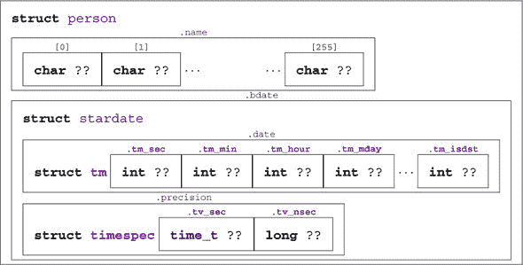

声明**`struct`** stardate 的可见性与**`struct`** person 相同。一个**`struct`**本身（这里，person）不会为在最外层**`struct`**声明的大括号`{}`内定义的**`struct`**（这里，stardate）定义新的作用域。这可能与其他编程语言的规则大不相同，例如 C++。

| |
| --- |

##### 取得成果 6.28

在嵌套声明中的所有**`struct`**声明具有相同的可见范围。

| |
| --- |

那就是，如果之前的嵌套 **`struct`** 声明在全局范围内出现，那么这两个 **`struct`** 都可以在整个 C 文件中可见。如果它们出现在函数内部，它们的可见性则绑定在它们所在的 `{}` 块中。

因此，一个更合适的版本如下：

```
struct stardate {
  struct **tm** date;
  struct **timespec** precision;
};
struct person {
  char name[256];
  struct stardate bdate;
};
```

这个版本将所有 **`struct`** 放在同一级别，因为它们最终都会在那里。

### 6.4\. 类型的新名称：类型别名


正如我们在上一章中看到的，结构体不仅提供了一种将不同信息聚合到一个单元中的方法，而且还引入了一个新的类型名称。由于历史原因（再次！），我们为结构体引入的名称总是必须以关键字 **`struct`** 开头，这使得其使用略显笨拙。此外，许多 C 语言初学者在忘记 **`struct`** 关键字时遇到困难，编译器会向他们抛出一个难以理解的错误。

有一个通用工具可以帮助我们避免这种情况，即通过给一个现有的类型赋予一个符号名称：**`typedef`**。使用它，一个类型可以有多个名称，我们甚至可以重用结构体声明中使用的 *标签名*：

```
   typedef struct birdStruct birdStructure;
   typedef struct birdStruct birdStruct;
```

然后，**`struct`** birdStruct、birdStruct 和 birdStructure 都可以互换使用。我最喜欢的这个特性的用法如下：

```
typedef struct birdStruct birdStruct;
struct birdStruct {
  ...
};
```

那就是，通过使用完全相同的名称在适当的 **`struct`** 声明之前使用 **`typedef`**。这之所以有效，是因为在 **`struct`** 与后续名称的组合中，*标签* 总是有效的，这是一个 *结构体的前置声明*。

| |
| --- |

##### Takeaway 6.29

*在 *`typedef`** 中使用与标签名相同的标识符来 *前置声明* 一个 **`struct`**。

| |
| --- |

默认情况下，C++ 采用类似的方法，因此这种策略会使来自那里的代码更容易阅读。

**`typedef`** 机制也可以用于结构体以外的类型。对于数组，这可能看起来像这样

```
typedef double vector[64];
typedef vector vecvec[16];
vecvec A;
typedef double matrix[16][64];
matrix B;
double C[16][64];
```

在这里，**`typedef`** 只引入了一个现有类型的新的名称，因此 A、B 和 C 具有完全相同的类型：**`double`**`[16][64]`。

| |
| --- |

##### Takeaway 6.30

*`typedef`** 只创建一个类型的别名，但永远不会创建一个新类型。

| |
| --- |

C 标准也大量使用 **`typedef`**。我们在 第 5.2 节 中看到的语义整数类型，如 **`size_t`**，就是用这种机制声明的。标准经常使用以 **`_t`** 结尾的名称来为 **`typedef`** 命名。这种命名约定确保在标准的升级版本中引入此类名称时不会与现有代码冲突。因此，你不需要在自己的代码中引入此类名称。

| |
| --- |

##### Takeaway 6.31

*以 *`_t`** 结尾的标识符名称是保留的*。

| |
| --- |

### 摘要

+   数组将相同基类型的多个值组合成一个对象。

+   指针指向其他对象，可以是空指针，也可以是不确定的。

+   结构体将不同基类型的值组合成一个对象。

+   **`typedef`** 为现有类型提供新的名称。

## 第七章\. 函数

本章涵盖了

+   简单函数的介绍

+   与 **main** 一起工作

+   理解递归

我们已经看到了 C 提供的不同方法来实现 *条件执行*：基于值的执行，选择程序的另一个分支而不是另一个分支以继续。潜在“跳转”到程序代码的另一部分（例如，到 **`else`** 分支）的原因是依赖于运行时数据的运行时决策。本章从讨论 *无条件* 的方法开始，将控制转移到代码的其他部分：它们本身不需要任何运行时数据来决定去哪里。

我们迄今为止看到的代码示例通常使用了 C 库中的函数，这些函数提供了我们不想（或无法）自己实现的特性，例如用于打印的 **printf** 和用于计算字符串长度的 **strlen**。这个函数概念背后的想法是，它们实现了一个特定的功能，一次性和永久性，然后我们可以依赖这个功能在其余代码中。

我们已经看到几个定义的函数是 **main**，它是程序执行的入口点。在本章中，我们将探讨如何编写我们自己可能提供与 C 库中函数类似功能的函数。

驱动函数概念的主要原因是 *模块化* 和 *代码分解*：

+   函数避免了代码重复。特别是它们避免了容易引入的复制粘贴错误，并在修改某个功能时节省了在多个地方编辑的努力。因此，函数增加了可读性和可维护性。

+   使用函数可以减少编译时间。给定的代码片段，当我们将其封装在函数中时，只会编译一次，而不是在每次使用时都编译。

+   函数简化了未来代码的重用。一旦我们将代码提取到提供特定功能的函数中，它就可以轻松地应用于我们甚至在实现函数时都没有想到的其他地方。

+   函数提供了清晰的接口。函数参数和返回类型清楚地指定了流入和流出计算的数据的来源和类型。此外，函数还允许我们指定计算的不可变条件：前置条件和后置条件。

+   函数提供了一种自然的方式来制定使用“堆栈”中间值的算法。

除了函数之外，C 还提供了其他无条件转移控制的方法，这些方法主要用于处理错误条件或其他形式的异常，从常规控制流中：

+   **exit**、**_Exit**、**quick_exit** 和 **abort** 终止程序执行（参见章节 8.7）。

+   **`goto`** 在函数体内转移控制（参见章节 13.2.2 和 14.5）。

+   **setjmp** 和 **longjmp** 可以无条件地返回到调用上下文（参见第 17.5 节）。

+   执行环境中的某些事件或对函数 **raise** 的调用可能会引发 *信号*，这些信号将控制权传递给一个专门的功能，一个 *信号处理程序*。

### 7.1. 简单函数

我们已经使用了很多函数，并看到了其中一些的声明（例如在第 6.1.5 节中）和定义（如列表 6.3）。在这些函数中，括号 *`()`* 扮演着重要的语法角色。它们用于函数的声明和定义，用于封装参数声明列表。对于函数调用，它们包含该具体调用的参数列表。这种语法角色与数组中的 `[]` 类似：在声明和定义中，它们包含相应维度的尺寸。在像 `A[i]` 这样的指定中，它们用于指示访问数组中元素的位罝。

我们迄今为止所看到的所有函数都有一个 *原型**^C*：它们的声明和定义，包括参数类型列表和返回类型。为了说明这一点，让我们回顾一下列表 6.3 中的 leapyear 函数：

##### **`yday.c`**

```
 **5**   bool leapyear(unsigned year) {
 **6**     /* All years that are divisible by 4 are leap years, 
 **7**        unless they start a new century, provided they 
 **8**        are not divisible by 400\. */ 
 **9**     return !(year % 4) && ((year % 100) || !(year % 400));
**10**   }
```

该函数的声明（不带定义）可能看起来如下：

```
bool leapyear(unsigned year);
```

或者，我们甚至可以省略参数名和/或添加 *存储指定符* **`extern`**:^([1])

> ¹
> 
> 关于关键字 **`extern`** 的更多细节将在第 13.2 节中提供。

```
extern bool leapyear(unsigned);
```

对于此类声明来说，重要的是编译器可以看到参数（的）类型和返回类型，因此这里函数的原型是“*接收一个* **`unsigned`** *并返回一个* *`bool`* 的函数。”

有两种特殊的约定使用关键字 **`void`**：

+   如果函数要无参数调用，则列表被关键字 **`void`** 替换，就像我们非常第一个例子中的 **main** (列表 1.1)。

+   如果函数不返回值，则返回类型为 **`void`**：例如，swap_double。

这样的原型有助于编译器在函数将要被调用的地方。它只需要知道函数期望的参数。看看以下内容：

```
   extern double fbar(double);

   ...
   double fbar2 = fbar(2)/2;
```

在这里，对 fbar`(2)` 的调用与函数 fbar 的预期不直接兼容：它需要一个 **`double`** 但接收一个 **`signed int`**。但由于调用代码知道这一点，它可以在调用函数之前将 **`signed int`** 参数 `2` 转换为 **`double`** 值 `2.0`。同样，对于在表达式中使用返回值的情况也适用：调用者知道返回类型是 **`double`**，因此对结果表达式应用了浮点除法。

C 语言有声明没有原型的函数的过时方式，但在这里你不会看到它们。你不应该使用它们；它们将在未来的版本中退役。

| |
| --- |

##### 第七点总结 7.1

*所有函数都必须有原型。*

| |
| --- |

一个值得注意的例外是能够接收可变数量参数的函数，例如 **printf**。它们使用一种称为 *可变参数* *列表*^(*C*) 的参数处理机制，该机制由头文件 `stdargs.h` 提供。

| |
| --- |

`<stdargs.h>`

| |
| --- |

我们将在后面（章节 16.5.2）看到这是如何工作的，但无论如何都要避免这个特性。从你对 **printf** 的使用经验中，你可以想象为什么这样的接口会带来困难。作为调用代码的程序员，你必须通过提供正确的 "%XX" 格式说明符来确保一致性。

在函数的实现中，我们必须注意为所有具有非**`void`**返回类型的函数提供返回值。一个函数中可以有多个**`return`**语句：

| |
| --- |

##### 第七点总结 7.2

*函数只有一个入口，但可以有多个* **`return`***。*

| |
| --- |

函数中的所有**`return`**语句必须与函数声明一致。对于期望返回值的函数，所有**`return`**语句都必须包含一个表达式；不期望返回值的函数，则不应包含表达式。

| |
| --- |

##### 第七点总结 7.3

*函数* **`return`** *必须与其类型一致。*

| |
| --- |

但对于调用方的参数，同样适用于返回值。在返回之前，具有可以转换为预期返回类型的类型的值将被转换。

如果函数的类型是 **`void`**，则可以省略**`return`**（无表达式）：

| |
| --- |

##### 第七点总结 7.4

*到达函数的* *`{}`* *块的末尾等同于一个没有表达式的* **`return`** *语句。*

| |
| --- |

因为否则，返回值的函数将有一个不确定的返回值，所以这种结构仅允许用于不返回值的函数：

| |
| --- |

##### 第七点总结 7.5

*到达函数的* *`{}`* *块的末尾仅允许在* **`void`** *函数中进行。*

| |
| --- |

### 7.2\. main 是特殊的

也许你已经注意到了关于 **main** 的某些特殊性。它作为程序入口点具有非常特殊的作用：其原型由 C 标准强制执行，但由程序员实现。作为运行时系统和应用程序之间的枢纽，**main** 必须遵守一些特殊规则。

首先，为了满足不同的需求，它有几个原型，其中必须实现一个。两个总是可能的：

```
int **main**(void);
int **main**(int argc, char* argv[argc+1]);
```

然后，任何 C 平台都可能提供其他接口。两种变体相对常见：

+   在一些嵌入式平台上，由于 **main** 不需要返回到运行时系统，返回类型可能是 **`void`**。

+   在许多平台上，第三个参数可以提供对“环境”的访问。

你不应该依赖于这种其他形式的存在。如果你想编写可移植的代码（你确实应该这样做），坚持使用两种“官方”形式。对于这些，**`int`**的返回值向运行时系统指示执行是否成功：**`EXIT_SUCCESS`**或**`EXIT_FAILURE`**的值表示从程序员的角度看执行的成功或失败。这是唯一两个在所有平台上都能保证工作的值。

| |
| --- |

##### 收获 7.6

*使用**`EXIT_SUCCESS`**和**`EXIT_FAILURE`**作为**main**的返回值*。

| |
| --- |

此外，对于**main**还有一个特殊的例外，因为它不需要显式的**`return`**语句：

| |
| --- |

##### 收获 7.7

*到达**main**的末尾等同于带有值**`EXIT_SUCCESS`**的**`return`**语句*。

| |
| --- |

个人来说，我不是特别喜欢这种没有实际收益的例外；它们只是让程序的论点更加复杂。

库函数**exit**与**main**有特殊的关系。正如其名所示，对**exit**的调用会终止程序。其原型如下：

```
_Noreturn void **exit**(int status);
```

这个函数会像从**main**返回一样精确地终止程序。状态参数具有**main**中返回表达式的角色。

| |
| --- |

##### 收获 7.8

调用**exit***`(`**`s`**`)`*等同于在**main**中评估**`return`**`s``*。

| |
| --- |

我们还看到，**exit**的原型是特殊的，因为它有一个**`void`**类型。就像一个**`return`**语句一样，**exit**永远不会失败。

| |
| --- |

##### 收获 7.9

**exit**永远不会失败，也不会返回到其调用者。

| |
| --- |

后者是特殊关键字**`_Noreturn`**的指示。这个关键字应该只用于这样的特殊函数。甚至还有一个相当打印的版本，宏**`noreturn`**，它包含在头文件`stdnoreturn.h`中。

| |
| --- |

`<stdnoreturn.h>`

| |
| --- |

在**main**的第二个原型中，还有一个特性：argv，命令行参数的向量。我们查看了一些例子，展示了我们如何使用这个向量将命令行中的值传递给程序。例如，在列表 3.1 中，这些命令行参数被解释为程序的**`double`**数据：

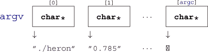

因此，对于每个 argv `[`i`]`，其中*i* = 0，...，argc，都是一个类似于我们之前遇到的指针。作为一个简单的初步近似，我们可以将它们看作是字符串。

| |
| --- |

##### 收获 7.10

*所有命令行参数都作为字符串传递*。

| |
| --- |

这取决于我们如何解释它们。在示例中，我们选择了函数**strtod**来解码存储在字符串中的双精度值。

在 argv 字符串中，有两个元素持有特殊值：

| |
| --- |

##### 收获 7.11

*在**main**的参数中，*`arg`**v[0]***包含程序调用的名称*。

| |
| --- |

关于程序名称没有严格的规则，但通常它是程序可执行文件的名字。

| |
| --- |

##### 收获 7.12

*main* 的参数 *`argv`**`[`**`argc`**`]`* 是 *`0`**。

|  |
| --- |

在 argv 数组中，最后一个参数可以通过这个属性来识别，但这个特性并不很有用：我们有 argc 来处理这个数组。

### 7.3\. 递归

函数的一个重要特性是封装：局部变量仅在离开函数时才可见和存活，无论是通过显式的 **`return`** 还是因为执行超出函数块的最后一个括号。它们的标识符（名称）不会与其他函数中的类似标识符冲突，并且一旦离开函数，我们留下的所有混乱都会被清理干净。

更好的是：每次我们调用一个函数，即使是之前调用过的，都会创建一个新的局部变量集（包括函数参数），并且这些变量会被重新初始化。即使我们在调用函数的层次结构中已经有一个调用仍然活跃，这也适用。直接或间接调用自身的函数被称为 *递归*，这个概念被称为 *递归*。

递归函数对于理解 C 函数至关重要：它们展示了并使用了函数调用模型的基本特性，并且只有具备这些特性才能完全工作。作为一个例子，我们将查看一个实现欧几里得算法的示例，用于计算两个数的 *最大公约数* (gcd)：

##### **`euclid.h`**

```
 **8**   size_t gcd2(size_t a, size_t b) {
 **9**     assert(a <= b);
**10**     if (!a) return b;
**11**     size_t rem = b % a;
**12**     return gcd2(rem, a);
**13**   }
```

如您所见，这个函数很短，看起来很漂亮。但要理解它是如何工作的，我们需要彻底理解函数是如何工作的，以及我们如何将数学语句转换为算法。

给定两个整数 *a, b >* 0，gcd 被定义为能够同时整除 *a* 和 *b* 的最大整数 *c >* 0。以下是公式：

+   gcd(*a, b*) = max{*c* ∈  | *c*|*a* and *c*|*b*}

如果我们再假设 *a < b*，我们就可以很容易地看出有两个 *递归* 公式成立：

##### 方程式 7.1\.

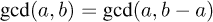

##### 方程式 7.2\.

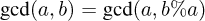

也就是说，gcd 在我们减去较小的整数或用另一个数的模数替换较大的数时不会改变。这些公式自古希腊数学时代以来就被用来计算 gcd。它们通常归功于欧几里得（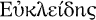，约公元前 300 年），但可能在他之前就已经为人所知。

我们的 C 函数 gcd2 使用方程 (7.2)。首先（第 9 行），它检查执行此函数的先决条件是否得到满足：第一个参数是否小于或等于第二个参数。它是通过使用 `assert.h` 中的 **`assert`** 宏来做到这一点的。如果函数被带有不满足该条件的参数调用，程序将终止并显示一条信息性消息（我们将在 第 8.7 节 中看到更多关于 **`assert`** 的解释）。

|  |
| --- |

`<assert.h>`

|  |
| --- |
|  |

##### 7.13 总结

*将函数的所有先决条件明确化*。

|  |
| --- |

然后，第 10 行检查 a 是否为 `0`，如果是，则返回 b。这是递归算法中的一个重要步骤：

| |
| --- |

##### 要点 7.14

*在递归函数中，首先检查终止条件*。

| |
| --- |

缺少终止检查会导致 *无限递归*；函数反复调用新的自身副本，直到所有系统资源耗尽，程序崩溃。在现代具有大量内存的系统上，这可能会花费一些时间，在此期间系统将完全无响应。你最好不要尝试。

否则，我们计算 b 模 a 的余数 rem（第 11 行）。然后，函数递归调用 rem 和 a，并直接返回该返回值。

图 7.1 展示了从初始调用 gcd2`(18, 30)` 发出的不同递归调用示例。这里，递归深度为四层。每一层实现其自己的 a、b 和 rem 变量的副本。

对于每次递归调用，模运算（要点 4.8）保证了先决条件总是自动满足。对于初始调用，我们必须自己确保这一点。这最好通过使用不同的函数，一个 *包装器**^C* 来完成：

##### **`euclid.h`**

```
**15**   size_t gcd(size_t a, size_t b) {
**16**     assert(a);
**17**     assert(b);
**18**     if (a < b)
**19**       return gcd2(a, b);
**20**     else
**21**       return gcd2(b, a);
**22**   }
```

| |
| --- |

##### 要点 7.15

*确保在包装函数中检查递归函数的先决条件*。

| |
| --- |

这样可以避免在每次递归调用时检查先决条件：**`assert`** 宏可以在最终的生产对象文件中禁用。

整数序列的递归定义的另一个著名例子是 *斐波那契数*，这是一种早在公元前 200 年就出现在印度文献中的数字序列。用现代术语来说，这个序列可以定义为

##### 图 7.1\. 递归调用 gcd2`(18, 30)`

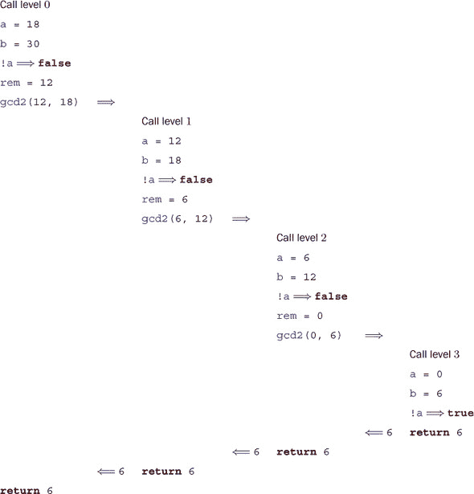

##### 方程 7.3。

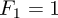

##### 方程 7.4。

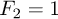

##### 方程 7.5。

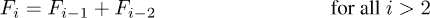

斐波那契数列增长迅速。其前几个元素是 1, 1, 2, 3, 5, 8, 13, 21, 34, 55, 89, 144, 377, 610, 987。

使用黄金比例

##### 方程 7.6。

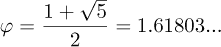

可以证明

##### 方程 7.7。

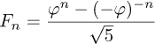

因此，从渐近的角度来看，我们有

##### 方程 7.8。

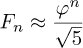

因此，*F**[n]* 的增长是指数级的。

递归数学定义可以简单地转换为 C 函数：

##### **`fibonacci.c`**

```
**4**   size_t fib(size_t n) {
**5**     **if** (n < 3)
**6**       return 1;
**7**     else
**8**       return fib(n-1) + fib(n-2);
**9**   }
```

在这里，我们首先检查终止条件：调用参数 n 是否小于 `3`。如果是，则返回值是 `1`；否则，我们返回参数值为 `n-1` 和 `n-2` 的调用之和。

图 7.2 展示了使用小参数值调用 fib 的一个示例。我们看到这导致了三个级别的相同函数的不同参数的堆叠调用。因为方程 (7.5) 使用了序列的两个不同值，所以递归调用的方案比 gcd2 的方案要复杂得多。特别是，有三个 *叶子调用*：满足终止条件的函数调用，因此它们本身不会进入递归.^([[[例 1]](#ch07fn-ex01)])

> ^([例 1])
> 
> 证明调用 fib`(`n`)`会引发 *F**[n]* 个叶子调用。

这样实现，斐波那契数的计算相当慢.^([[[例 2]](#ch07fn-ex02)]) 实际上，很容易看出该函数本身的递归公式也导致函数执行时间的类似公式：

> ^([例 2])
> 
> 使用不同的 *n* 值测量对 fib`(`n`)` 的调用时间。在 POSIX 系统上，您可以使用 `/bin/time` 来测量程序执行的时间。

##### 图 7.2\. 递归调用 fib`(4)`

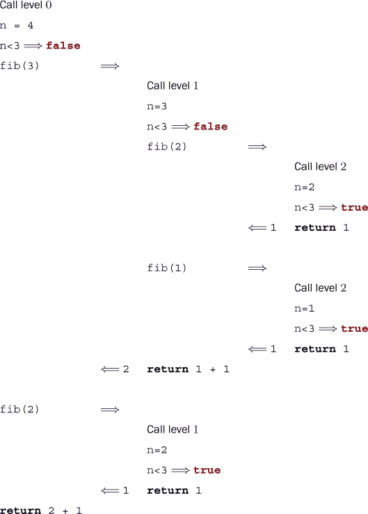

##### 方程式 7.9\.

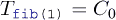

##### 方程式 7.10\.

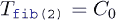

##### 方程式 7.11\.


其中 *C*[0] 和 *C*[1] 是依赖于平台的常数。

因此，无论平台如何以及我们的实现多么巧妙，函数的执行时间始终会是类似

##### 方程式 7.12\.

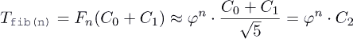

与另一个平台相关的常数 *C*[2]。因此，fib`(`n`)`的执行时间与*n*呈指数关系，这在实践中通常排除了使用此类函数。

| |
| --- |

##### 总结 7.16

*多重递归可能导致指数级的计算时间*。

| |
| --- |

如果我们查看 图 7.2 中的嵌套调用，我们会看到 fib`(2)` 被调用两次，因此计算 fib`(2)` 的所有努力都被重复了。下面的 fibCacheRec 函数避免了这种重复。它接收一个额外的参数，cache，它是一个数组，用于存储所有已计算过的值：

##### **`fibonacciCache.c`**

```
 **4**   /* Compute Fibonacci number n with the help of a cache that may
 **5**      hold previously computed values. */
 **6**   size_t fibCacheRec(size_t n, size_t cache[n]) {
 **7**     if (!cache[n-1]) {
 **8**       cache[n-1]
 **9**         = fibCacheRec(n-1, cache) + fibCacheRec(n-2, cache);
**10**     }
**11**     return cache[n-1];
**12**   }
**13**
**14**   size_t fibCache(size_t n) {
**15**     if (n+1 <= 3) return 1;
**16**     /* Set up a VLA to cache the values. */
**17**     size_t cache[n];
**18**     /* A VLA must be initialized by assignment. */
**19**     cache[0] = 1; cache[1] = 1;
**20**     for (size_t i = 2; i < n; ++i)
**21**       cache[i] = 0;
**22**     /* Call the recursive function. */
**23**     return fibCacheRec(n, cache);
**24**   }
```

通过以存储空间换取计算时间，只有当值尚未被计算时，递归调用才会受到影响。因此，`fibCache`(`i`)`的执行时间与*n*成线性关系

##### 方程式 7.13\.


对于一个平台相关的参数 *C*[3]。^([[[例 3]](#ch07fn-ex03)]) 只需改变实现我们的序列的算法，我们就能将执行时间从指数级降低到线性级！我们没有（也不会）讨论实现细节，也没有对执行时间进行具体测量.^([[[例 4]](#ch07fn-ex04)])

> ^([例 3])
> 
> 证明方程式 (7.13)。
> 
> ^([例 4])
> 
> 使用与 fib 相同的值测量 fibCache `(`n`)` 调用的时间。

| |
| --- |

##### 总结 7.17

*一个糟糕的算法永远不会导致性能良好的实现*。

| |
| --- |
| |

##### 总结 7.18

*改进算法可以显著提高性能*。

| |
| --- |

为了好玩，fib2Rec 展示了实现斐波那契序列的第三个算法。它使用固定长度数组（FLA）而不是可变长度数组（VLA）。

##### **`fibonacci2.c`**

```
 **4**   void fib2rec(size_t n, size_t buf[2]) {
 **5**     if (n > 2) {
 **6**       size_t res = buf[0] + buf[1];
 **7**       buf[1] = buf[0];
 **8**       buf[0] = res;
 **9**       fib2rec(n-1, buf);
**10**     }
**11**   }
**12**
**13**   size_t fib2(size_t n) {
**14**     size_t res[2] = { 1, 1, };
**15**     fib2rec(n, res);
**16**     return res[0];
**17**   }
```

证明这个版本仍然正确留作练习.^([[[Exs 5]](#ch07fn-ex05)]) 此外，到目前为止，我们只有一些基本的工具来评估这“更快”是否在任何我们想要赋予这个术语的意义上.^([[[Exs 6]](#ch07fn-ex06)])

> ^([Exs 5])
> 
> 使用迭代语句将 fib2rec 转换为非递归函数 fib2iter。
> 
> ^([Exs 6])
> 
> 使用与 fib 相同的值测量 fib2`(`n`)`调用的时间。

|  |
| --- |

**因式分解**

现在我们已经介绍了函数，看看你是否能实现一个名为`factor`的程序，该程序接收命令行上的一个数字 N，并打印出

```
    N: F0 F1 F2 ...
```

其中 F0 以及等等都是 N 的所有素因子。

你的实现的核心应该是一个函数，给定一个**`size_t`**类型的值，返回其最小的素因子。

|  |
| --- |

扩展此程序以接收此类数字的列表，并为每个数字输出此类行。

### 概述

+   函数有一个原型，它决定了它们如何被调用。

+   终止**main**和调用**exit**是相同的。

+   每个函数调用都有自己的局部变量副本，并且可以递归调用。

## 第八章。C 库函数

本章涵盖

+   进行数学运算、处理文件和字符串处理

+   操作时间

+   管理运行时环境

+   终止程序

C 标准提供的功能分为两大块。一块是正确的 C 语言，另一块是*C 库*。我们已经查看了一些随 C 库提供的函数，包括**printf**、**puts**和**strtod**，所以你应该有一个很好的预期：实现我们在日常编程中需要的特性的基本工具，并且我们需要清晰的接口和语义来确保可移植性。

在许多平台上，通过*应用程序编程接口*（*API*）的明确指定也允许我们将编译器实现与库实现分开。例如，在 Linux 系统中，我们有不同编译器的选择，最常见的是`gcc`和`clang`，以及不同的 C 库实现，如 GNU C 库（`glibc`）、`dietlibc`或`musl`；理论上，这些选择中的任何一个都可以用来生成可执行文件。

我们将首先讨论 C 库及其接口的一般特性和工具，然后描述一些函数组：数学（数值）函数、输入/输出函数、字符串处理、时间处理、对运行时环境的访问和程序终止。

### 8.1. C 库及其函数的一般特性

大概来说，库函数针对一个或两个目的：

+   ***平台抽象层：*** 抽象出平台特定属性和需求的函数。这些是需要特定平台位来实现基本操作（如 IO）的函数，没有对平台的深入了解就无法实现。例如，**puts**必须有一些关于“终端输出”以及如何访问它的概念。实现这些功能将超出大多数 C 程序员的认知，因为这需要操作系统或甚至处理器特定的魔法。庆幸的是，有些人已经为你做了这项工作。

+   ***基本工具：*** 实现常见任务（如**strtod**）的函数，这些任务在 C 语言编程中经常出现，并且接口的固定性非常重要。这些函数应该相对高效地实现，因为它们被大量使用，并且应该经过良好的测试，没有错误，这样我们才能安全地依赖它们。原则上，任何经过验证的 C 程序员都应该能够实现这样的函数。[[[例 1]](#ch08fn-ex01)])

    > ^([例 1])
    > 
    > 编写一个名为 my_strtod 的函数，实现**strtod**对十进制浮点常数的功能。

类似于**printf**的函数可以视为具有双重目的：它可以有效地分为一个格式化阶段，提供基本工具，以及一个特定平台的输出阶段。有一个名为**snprintf**的函数（将在 14.1 节中详细解释）提供了与**printf**相同的格式化功能，但将结果存储在一个字符串中。这个字符串然后可以用**puts**打印出来，以产生与**printf**整体相同的输出。

在接下来的章节中，我们将讨论声明 C 库接口的不同头文件（8.1.1 节）、它提供的不同类型的接口（8.1.2 节）、它应用的多种错误策略（8.1.3 节）、一系列可选的接口，旨在提高应用程序的安全性（8.1.4 节），以及我们可以在编译时用来断言平台特定属性的工具（8.1.5 节）。

#### 8.1.1\. 头文件

C 库有很多函数，远远超过我们在这本书中能处理的范围。一个*头文件*^C*捆绑了多个功能的接口描述，主要是函数。我们将在这里讨论的头文件提供了 C 库的功能，但稍后我们可以创建自己的接口并将它们收集在头文件中（第十章)。

在这个层面上，我们将讨论 C 库中必要的函数，这些函数对于使用我们迄今为止看到的语言元素进行基本编程是必需的。当我们在更高层次讨论一系列概念时，我们将完成这次讨论。表 8.1 概述了标准头文件。

#### 8.1.2\. 接口

C 库中的大多数接口都指定为函数，但实现者可以自由选择将它们实现为宏，如果这样做是合适的。与我们在第 5.6.3 节中看到的不同，这使用了类似函数的第二个宏形式，*函数式宏**^C*：

```
#define putchar(A) putc(A, stdout)
```

##### 表 8.1\. C 库头文件

| 名称 | 描述 | 章节 |
| --- | --- | --- |
| <assert.h> | 断言运行时条件 | 8.7 |
| <complex.h> | 复数 | 5.7.7 |
| <ctype.h> | 字符分类和转换 | 8.4 |
| <errno.h> | 错误代码 | 8.1.3 |
| <fenv.h> | 浮点环境 |  | |
| <float.h> | 浮点类型属性 | 5.7 |
| <inttypes.h> | 整数类型的格式化转换 | 5.7.6 |
| <iso646.h> | 运算符的备选拼写 | 4.1 |
| <limits.h> | 整数类型属性 | 5.1.3 |
| <locale.h> | 国际化 | 8.6 |
| <math.h> | 类型特定的数学函数 | 8.2 |
| <setjmp.h> | 非局部跳转 | 17.5 |
| <signal.h> | 信号处理函数 | 17.6 |
| <stdalign.h> | 对象对齐 | 12.7 |
| <stdarg.h> | 变量参数数量的函数 | 16.5.2 |
| <stdatomic.h> | 原子操作 | 17.6 |
| <stdbool.h> | 布尔值 | 3.1 |
| <stddef.h> | 基本类型和宏 | 5.2 |
| <stdint.h> | 精确宽度整数类型 | 5.7.6 |
| <stdio.h> | 输入和输出 | 8.3 |
| <stdlib.h> | 基本函数 | 2 |
| <stdnoreturn.h> | 不返回的函数 | 7 |
| <string.h> | 字符串处理 | 8.4 |
| <tgmath.h> | 类型通用的数学函数 | 8.2 |
| <threads.h> | 线程和控制结构 | 18 |
| <time.h> | 时间处理 | 8.5 |
| <uchar.h> | Unicode 字符 | 14.3 |
| <wchar.h> | 宽字符串 | 14.3 |
| <wctype.h> | 宽字符分类和转换 | 14.3 |

如前所述，这些只是文本替换，由于替换文本可能包含宏参数多次，因此将任何具有副作用的表达式传递给这样的宏或函数是不好的。希望我们之前关于副作用（要点 4.11）的讨论已经说服您不要这样做。

我们将要查看的一些接口具有指针作为参数或返回值。我们目前还不能完全处理这些，但在大多数情况下，我们可以通过传递已知的指针或为指针参数传递`0`来避免问题。作为返回值的指针只会在它们可以解释为错误条件的情况下出现。

#### 8.1.3\. 错误检查

C 库函数通常通过特殊的返回值来指示失败。指示失败的具体值可能不同，这取决于函数本身。通常，你必须查阅函数的手册页中的具体约定。表 8.2 给出了可能性的大致概述。有三个类别适用：指示错误的特殊值，指示成功的特殊值，以及那些在成功时返回某种正计数器，在失败时返回负值的函数。

##### 表 8.2\. *C 库函数的错误返回策略* 一些函数也可能通过**`errno`**宏的值来指示特定的错误条件。

| 失败返回 | 测试 | 典型情况 | 示例 |
| --- | --- | --- | --- |
| 0 | !value | 其他值有效 | **fopen** |
| 特殊错误代码 | value == code | 其他值有效 | **puts**，**clock**，**mktime**，**strtod**，**fclose** |
| 非零值 | value | 不需要的值 | **fgetpos**，**fsetpos** |
| 特殊成功代码 | value != code | 失败条件的区分 | **thrd_create** |
| 负值 | value < 0 | 正值是一个计数器 | **printf** |

典型的错误检查代码如下：

```
if (puts("hello world") == EOF) {
  perror("can't output to terminal:");
  exit(EXIT_FAILURE);
}
```

在这里，我们看到**puts**属于那些在出错时返回特殊值（**`EOF`**），即“文件结束”的函数类别。然后，`stdio.h`中的**perror**函数被用来提供依赖于特定错误的附加诊断。**exit**结束程序执行。不要把失败隐藏在地毯下。在编程中，

|  |
| --- |

`<stdio.h>`

|  |
| --- |
|  |

##### 收获 8.1

*失败总是一个选择。*

|  |
| --- |
|  |

##### 收获 8.2

*检查库函数的返回值以查找错误。*

|  |
| --- |

程序立即失败通常是确保在开发早期发现并修复错误的最佳方式。

|  |
| --- |

##### 收获 8.3

*快速失败，尽早失败，经常失败。*

|  |
| --- |

C 有一个主要的跟踪 C 库函数错误的状态变量：一个叫做**`errno`**的恐龙。**perror**函数在幕后使用这个状态，以提供其诊断。如果一个函数以允许我们恢复的方式失败，我们必须确保错误状态也被重置；否则，库函数或错误检查可能会困惑：


```
void puts_safe(char const s[static 1]) {
  static bool failed = false;
  if (!failed && puts(s) == EOF) {
    perror("can't output to terminal:");
    failed = true;
    errno = 0;
  }
}
```

#### 8.1.4\. 边界检查接口

许多 C 库函数在用不一致的参数集调用时容易受到**缓冲区溢出**的影响。这导致了（并且仍然导致）许多安全漏洞和利用，通常应该非常小心地处理。

C11 通过废弃或删除标准中的一些函数，并添加一系列可选的新接口来检查运行时参数的一致性来解决这类问题。这些是 C 标准附录 K 的*边界检查接口*。与大多数其他功能不同，它没有自己的头文件，而是向其他接口添加了接口。两个宏控制对这些接口的访问：**`__STDC_LIB_EXT1__`**指示是否支持此可选接口，**`__STDC_WANT_LIB_EXT1__`**将其打开。后者必须在包含任何头文件之前设置：

```
#if !__STDC_LIB_EXT1__
# error "This code needs bounds checking interface Annex K"
#endif
#define __STDC_WANT_LIB_EXT1__ 1

#include <stdio.h>

/* Use printf_s from here on. */
```

这种机制（现在仍然是）引起了大量争议，因此附录 K 是一个可选功能。许多现代平台有意识地选择不支持它。甚至有 O’Donell 和 Sebor [2015]进行的一项广泛研究，该研究得出结论，引入这些接口比解决的问题要多得多。在以下内容中，这样的可选功能将以灰色背景标记。

|  |
| --- |

**附录 K**

边界检查函数通常使用它们所替代的库函数名称上的后缀 _s，例如**printf_s**用于**printf**。因此，你不应该为你的代码使用该后缀。

|  |
| --- |

##### Takeaway 8.4

##### Takeaway 8.4

*以* *`_s`* *结尾的标识符名称是保留的*。

|  |
| --- |

如果这样的函数遇到不一致的情况，即*运行时约束违规**^C*，它通常应该在打印诊断信息后结束程序执行。

|  |
| --- |

#### 8.1.5\. 平台先决条件

使用像 C 这样的标准化语言进行编程的一个重要目标是可移植性。我们应该尽可能少地对执行平台做出假设，并将其留给 C 编译器和库来填补空白。不幸的是，这并不总是可行的选择，在这种情况下，我们应该清楚地识别代码先决条件。

|  |
| --- |

##### Takeaway 8.5

*对于执行平台的遗漏先决条件必须终止编译*。

|  |
| --- |

实现这一点的经典工具是*预处理器条件**^C*，正如我们之前看到的：

```
#if !__STDC_LIB_EXT1__
# error "This code needs bounds checking interface Annex K"
#endif
```

如你所见，这样的条件从一行上的**`# if`**标记序列开始，并以包含另一个序列**`# endif`**的行结束。中间的**`# error`**指令仅在条件（这里为`!`**`__STDC_LIB_EXT1__`**）为真时执行。它通过错误消息终止编译过程。我们可以放入此类构造的条件是有限的.^([[[Exs 2]](#ch08fn-ex02)])

> ^([Exs 2])
> 
> 编写一个前处理器条件，以测试**`int`**是否具有二进制补码表示。

|  |
| --- |

##### Takeaway 8.6

*仅在前处理器条件中评估宏和整数文字*。

|  |
| --- |

作为这些条件的一个额外功能，未知的标识符将评估为`0`。所以，在上一个例子中，即使**`__STDC_LIB_EXT1__`**在那个时刻是未知的，表达式也是有效的。

|  |
| --- |

##### Takeaway 8.7

*在预处理器条件中，未知标识符的值为* *`0`**.*

|  |
| --- |

如果我们要测试更复杂的条件，**`_Static_assert`**（一个关键字）和**`static_assert`**（来自头文件 `assert.h` 的宏）具有相似的效果，并且可供我们使用：

|  |
| --- |

`<assert.h>`

|  |
| --- |

```
#include <assert.h>
static_assert(sizeof(double) == sizeof(long double),
  "Extra precision needed for convergence.");
```

### 8.2\. 数学

数学 *函数* 随 `math.h` 头文件提供，但使用 `tgmath.h` 提供的类型通用宏要简单得多。基本上，对于所有函数，都有一个宏将调用例如 **`sin`**`(`x`)` 或 **`pow`**`(`x`,` n`)` 的函数分配给检查其参数类型并返回相同类型的函数。

|  |
| --- |

`<math.h>`

`<tgmath.h>`

|  |
| --- |

定义的类型通用的宏太多，无法在此详细描述。表 8.3 提供了提供的函数的概述。

##### 表 8.3\. *数学函数* 在本书的电子版中，类型通用的宏以红色显示，而普通函数以绿色显示。

| 函数 | 描述 |
| --- | --- |
| **abs**, **labs**, **llabs** | 整数的绝对值，&#124;*x*&#124; |
| **acosh** | 双曲余弦函数 |
| **acos** | 反余弦 |
| **asinh** | 双曲反正弦 |
| **asin** | 反正弦 |
| **atan2** | 反正切，两个参数 |
| **atanh** | 双曲反正切 |
| **atan** | 反正切 |
| **cbrt** | 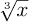 |
| **ceil** | ⌈*x*⌉ |
| **copysign** | 从 *y* 复制符号到 *x* |
| **cosh** | 双曲余弦 |
| **cos** | 余弦函数，cos *x* |
| **div**, **ldiv**, **lldiv** | 整数除法的商和余数 |
| **erfc** | 补余误差函数，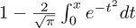 |
| **erf** | 误差函数，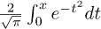 |
| **exp2** | 2*^x* |
| **expm1** | *e**^x* – 1 |
| **exp** | *e**^x* |
| **fabs** | 浮点数的绝对值，&#124;*x*&#124; |
| **fdim** | 正差 |
| **floor** | *⌊**x**⌋* |
| **fmax** | 浮点数最大值 |
| **fma** | *x* · *y* + *z* |
| **fmin** | 浮点数最小值 |
| **fmod** | 浮点数除法的余数 |
| **fpclassify** | 对浮点值进行分类 |
| **frexp** | 尾数和指数 |
| **hypot** | 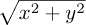 |
| **ilogb** | ⌊log[*FLT*_*RADIX*]^(*x*)*⌋* 作为整数 |
| **isfinite** | 检查是否为有限值 |
| **isinf** | 检查是否为无穷大 |
| **isnan** | 检查是否为 NaN |
| **isnormal** | 检查是否为正常值 |
| **ldexp** | *x* · 2*^y* |
| **lgamma** | log*[e]* Γ(*x*) |
| **log10** | log[10]*x* |
| **log1p** | log*[e]*(1 + *x*) |
| **log2** | log[2]*x* |
| **logb** | log[*FLT*_*RADIX*]^(*x*) 作为浮点数 |
| **log** | log*[e]* *x* |
| **modf**, **modff**, **modfl** | 整数部分和小数部分 |
| **nan**, **nanf**, **nanl** | 对应类型的非数字 (NaN) |
| **nearbyint** | 使用当前舍入模式找到最近的整数 |
| **nextafter**, **nexttoward** | 下一个可表示的浮点数值 |
| **pow** | *x**^y* |
| **remainder** | 除法的有符号余数 |
| **remquo** | 有符号余数和除法的最后几位 |
| **rint**, **lrint**, **llrint** | 使用当前舍入模式最近的整数 |
| **round**, **lround**, **llround** | sign(x) ·⌊&#124;*x*&#124; + 0.5⌋ |
| **scalbn**, **scalbln** | *x* · **FLT_RADIX***^y* |
| **signbit** | 检查是否为负 |
| **sinh** | 双曲正弦 |
| **sin** | 正弦函数，sin *x* |
| **sqrt** | 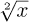 |
| **tanh** | 双曲正切 |
| **tan** | 正切函数，tan *x* |
| **tgamma** | Γ函数，Γ(*x*) |
| **trunc** | sign(x) ·⌊&#124;*x*&#124;⌋ |

现在，数值函数的实现应该是高质量的、高效的，并且具有良好的数值精度控制。尽管任何具有足够数值知识的程序员都可以实现这些函数，但你不应尝试替换或绕过它们。其中许多不仅作为 C 函数实现，还可以使用处理器特定的指令。例如，处理器可能具有**`sqrt`**和**`sin`**函数的快速近似，或者通过低级指令实现*浮点乘加**`fma`**。特别是，有很好的机会这些低级指令被用于检查或修改浮点内部的所有函数，例如**carg**、**`creal`**、**`fabs`**、**`frexp`**、**`ldexp`**、**`llround`**、**`lround`**、**`nearbyint`**、**`rint`**、**`round`**、**`scalbn`**和**`trunc`**。因此，替换它们或在手工编写的代码中重新实现它们通常是一个坏主意。

### 8.3. 输入、输出和文件操作

我们已经看到了一些与头文件`stdio.h`一起提供的 IO 函数：**puts**和**printf**。第二个函数允许你以方便的方式格式化输出，而第一个则更基本：它只是输出一个字符串（其参数）和一个换行符。

|  |
| --- |

`<stdio.h>`

|  |
| --- |

#### 8.3.1. 无格式文本输出

有一个比**puts**更基本的功能：**`putchar`**，它输出单个字符。这两个函数的接口如下：

```
int putchar(int c);
int puts(char const s[static 1]);
```

将**`int`**类型作为**`putchar`**的参数是一个历史事件，它不会对你造成太大的伤害。相比之下，返回类型为**`int`**是必要的，以便函数可以将其错误返回给调用者。特别是，如果成功，它返回参数 c，如果失败，则返回特定的负值**`EOF`**（*E*nd *O*f *F*ile），该值保证不会对应于任何字符。


使用此函数，我们实际上可以自己重新实现**puts**：

```
int puts_manually(char const s[static 1]) {
  for (size_t i = 0; s[i]; ++i) {
    if (putchar(s[i]) == EOF) return EOF;
  }
  if (putchar('\n') == EOF) return EOF;
  return 0;
}
```

这只是一个例子；它可能不如你的平台提供的**puts**高效。

到目前为止，我们只看到了如何输出到终端。通常，你可能会想将结果写入永久存储，而类型**`FILE`**`*`为*流**^C*提供了一个抽象。有两个函数，**fputs**和**fputc**，它们将无格式输出的概念推广到流中：

```
int fputc(int c, FILE* stream);
int fputs(char const s[static 1], FILE* stream);
```

在这里，**`FILE`** 类型中的 `*` 再次表示这是一个指针类型，我们不会深入细节。我们现在需要知道的是，指针可以被测试是否为空 (收获 6.20)，因此我们将能够测试流是否有效。

标识符 **`FILE`** 代表一个 *不透明类型*^C*，对于这个类型，我们只知道在本书中将要看到的函数接口所提供的信息。它被实现为一个宏，以及将`FILE`这个名字用于流的使用不当，都是提醒我们这是历史上预标准化之前的一个接口。


|  |
| --- |

##### 收获 8.8

*不透明类型通过函数接口指定*。

|  |
| --- |
|  |

##### 收获 8.9

*不要依赖于不透明类型的实现细节*。

|  |
| --- |

如果我们不进行任何特殊操作，将有两个输出流可用：**`stdout`** 和 **`stderr`**。我们已经在隐式地使用 **`stdout`**：这是 **`putchar`** 和 **puts** 在底层使用的，并且这个流通常连接到终端。**`stderr`** 类似，默认情况下也连接到终端，可能具有略微不同的属性。无论如何，这两个流是紧密相关的。拥有两个流的目的在于能够区分“常规”输出（**`stdout`**）和“紧急”输出（**`stderr`**）。

我们可以用更通用的函数重写之前的函数：

```
int putchar_manually(int c) {
  return fputc(c, stdout);
}
int puts_manually(char const s[static 1]) {
  if (fputs(s,    stdout) == EOF) return EOF;
  if (fputc('\n', stdout) == EOF) return EOF;
  return 0;
}
```

注意到 **fputs** 与 **puts** 的不同之处在于它不会在字符串中追加行结束字符。

|  |
| --- |

##### 收获 8.10

**puts** 和 **fputs** 在行结束处理方面有所不同。

|  |
| --- |

#### 8.3.2\. 文件和流

如果我们要将输出写入实际文件，我们必须通过函数 **fopen** 将文件附加到我们的程序执行中：

```
FILE* fopen(char const path[static 1], char const mode[static 1]);
FILE* freopen(char const path[static 1], char const mode[static 1],
              FILE *stream);
```

这可以像这里一样简单使用：

```
int main(int argc, char* argv[argc+1]) {
 FILE* logfile = fopen("mylog.txt", "a");
 if (!logfile) {
   perror("fopen failed");
   return EXIT_FAILURE;
 }
 fputs("feeling fine today\n", logfile);
 return EXIT_SUCCESS;
}
```

这将打开文件系统中的一个名为 "mylog.txt" 的文件，并通过变量 logfile 提供对其的访问。模式参数 "a" 用于追加文件：也就是说，如果文件存在，则保留其内容，并从该文件的当前末尾开始写入。

打开文件可能失败的原因有很多：例如，文件系统可能已满，或者进程可能没有权限在指定位置写入。我们检查这种错误条件 (收获 8.2) 并在必要时退出程序。

正如我们所见，**perror** 函数用于提供发生的错误诊断。它相当于以下内容：

```
fputs("fopen failed: some-diagnostic\n", stderr);
```

这个“some-diagnostic”可能（但不一定）包含更多帮助程序用户处理错误的信息。

|  |
| --- |

**附录 K**

此外，还有边界检查替换函数 **fopen_s** 和 **freopen_s**，它们确保传递的参数是有效的指针。在这里，**`errno_t`** 是 `stdlib.h` 中的一种类型，用于编码错误返回。新出现的 **`restrict`** 关键字仅适用于指针类型，目前不在我们的讨论范围内：

```
errno_t fopen_s(FILE* restrict streamptr[restrict],
                char const filename[restrict], char const mode[restrict
    ]);
errno_t freopen_s(FILE* restrict newstreamptr[restrict],
                  char const filename[restrict], char const mode[
    restrict],
                FILE* restrict stream);
```

|  |
| --- |

打开文件有不同的模式；“a”只是几种可能性之一。表 8.4 包含了可能出现在该字符串中的字符概述。三个基础模式控制如果存在预存文件时会发生什么，以及流的位置。此外，还可以将三个修饰符附加到它们上。表 8.5 列出了所有可能的组合。

##### 表 8.4\. **fopen** 和 **freopen** 的模式和修饰符 至少必须有一个基础模式开始模式字符串，可选地后跟一个或多个其他三个。有关所有有效组合，请参阅 表 8.5。

| 模式 | 备注 |   | **fopen** 后的文件状态 |
| --- | --- | --- | --- |
| 'a' | 追加 | w | 文件未修改；位置在末尾 |
| 'w' | 写入 | w | 如果有内容，则擦除文件内容 |
| 'r' | 读取 | r | 文件未修改；位置在起始处 |
| 修饰符 | 备注 |   | 额外属性 |
| '+' | 更新 | rw | 打开文件以供读写 |
| 'b' | 二进制 |   | 视为二进制文件；否则为文本文件 |
| 'x' | 独占 |   | 如果不存在，则创建一个用于写入的文件 |

##### 表 8.5\. **fopen** 和 **freopen** 的模式字符串 *这些是 表 8.4 中字符的有效组合。*

| "a" | 如果需要，创建一个空文本文件；在文件末尾打开以供写入 |
| --- | --- |
| "w" | 创建一个空文本文件或擦除内容；打开以供写入 |
| "r" | 打开一个现有的文本文件以供读取 |
| "a+" | 如果需要，创建一个空文本文件；在文件末尾打开以供读写 |
| "w+" | 创建一个空文本文件或擦除内容；打开以供读写 |
| "r+" | 在文件开头打开一个现有的文本文件以供读写 |

|

```
"ab" "rb" "wb"
"a+b"    "ab+"
"r+b"    "rb+"
"w+b" "wb+"
```

| 与上面相同，但用于二进制文件而不是文本文件 |
| --- |
| "wx" "w+x" "wbx" "w+bx" "wb+x" | 与上面相同，但如果在调用之前文件存在，则返回错误 |

这些表格显示，流不仅可以用于写入，还可以用于读取；我们很快就会看到如何做到这一点。要知道哪个基础模式用于读取或写入，只需运用你的常识即可。对于 'a' 和 'w'，如果文件位置在其末尾，则无法读取，因为没有内容；因此这些用于写入。对于 'r'，应避免意外覆盖保存在起始位置的文件内容，因此这用于读取。

在日常编码中，修饰符的使用较少。应谨慎使用带有 '+' 的“更新”模式。同时读写并不容易，需要特别注意。对于 'b'，我们将在第 14.4 节中更详细地讨论文本和二进制流之间的区别。

处理流的另外三个主要接口是 **freopen**、**fclose** 和 **fflush**：

```
int fclose(FILE* fp);
int fflush(FILE* stream);
```

**freopen** 和 **fclose** 的主要用途很简单：**freopen** 可以将给定的流关联到不同的文件，并最终更改模式。这特别有用，可以将标准流关联到文件。*例如*，我们上面的小程序可以重写为

```
int main(int argc, char* argv[argc+1]) {
 if (!freopen("mylog.txt", "a", stdout)) {
   perror("freopen failed");
   return EXIT_FAILURE;
 }
 puts("feeling fine today");
 return EXIT_SUCCESS;
}
```

#### 8.3.3\. 文本 IO

输出到文本流通常是*缓冲**^C*：也就是说，为了更有效地使用其资源，IO 系统可以延迟对流的物理写入。如果我们使用 **fclose** 关闭流，所有缓冲区都将保证被*刷新**^C*到它应该去的地方。在需要立即在终端看到输出或不想关闭文件但想确保所有已写入的内容都已正确到达目的地的地方，需要使用 **fflush** 函数。列表 8.1 展示了将 10 个点写入**`stdout`**的示例，所有写入之间的延迟大约为 1 秒.^([[[Exs 3]](#ch08fn-ex03)])

> ^([Exs 3])
> 
> 通过使用零、一个和两个命令行参数来运行程序，观察程序的行为。

##### 列表 8.1\. 清除缓冲输出

```
 **1**   #include <stdio.h>
 **2**
 **3**   /* delay execution with some crude code,
 **4**      should use thrd_sleep, once we have that*/
 **5**   void delay(double secs) {
 **6**     double const magic = 4E8;   // works just on my machine
 **7**     unsigned long long const nano = secs* magic;
 **8**     for (unsigned long volatile count = 0;
 **9**          count < nano;
**10**          ++count) {
**11**       /* nothing here */
**12**     }
**13**   }
**14**
**15**   int main(int argc, char* argv[argc+1]) {
**16**     fputs("waiting 10 seconds for you to stop me", stdout);
**17**     if (argc < 3) fflush(stdout);
**18**     for (unsigned i = 0; i < 10; ++i) {
**19**       fputc('.', stdout);
**20**       if (argc < 2) fflush(stdout);
**21**       delay(1.0);
**22**     }
**23**     fputs("\n", stdout);
**24**     fputs("You did ignore me, so bye bye\n", stdout);
**25**   }
```

对于文本文件，最常见的 IO 缓冲形式是*行缓冲**^C*。在这种模式下，只有在遇到文本行尾时才会进行物理写入。因此，通常使用 **puts** 写入的文本会立即出现在终端上；**fputs** 等待遇到输出中的 '\n'。关于文本流和文件，另一个有趣的事情是，程序中写入的字符与控制台设备或文件中到达的字节之间没有一一对应的关系。

| |
| --- |

##### 8.11 要点

*文本输入和输出转换数据*。

| |
| --- |

这是因为文本字符的内部和外部表示不一定相同。不幸的是，仍然有许多不同的字符编码；如果 C 库能够正确地进行转换，它负责进行转换。最臭名昭著的是，文件中的换行符编码是平台相关的：

| |
| --- |

##### 8.12 要点

*有三种常用的转换来编码换行符*。

| |
| --- |

C 语言为我们提供了一个非常适合的抽象，使用 '\n' 来实现这一点，无论平台如何。在进行文本 IO 时，你应该注意的另一个修改是，行尾前的空白可能会被抑制。因此，不能依赖于*尾随空白**^C*，如空格或制表符字符，应该避免使用：

| |
| --- |

##### 8.13 要点

*文本行不应包含尾随空白*。

| |
| --- |

C 库还提供了对文件系统内文件操作的支持，但非常有限：

```
int remove(char const pathname[static 1]);
int rename(char const oldpath[static 1], char const newpath[static 1]);
```

这些基本上就是它们名字所表示的意思。

##### 表 8.6\. **printf** 和类似函数的格式说明，具有一般语法 "%[FF][WW][.PP][LL]SS"，其中**`[]`**包围的字段表示它是可选的。

| FF | 标志 | 转换的特殊形式 |
| --- | --- | --- |
| WW | 字段宽度 | 最小宽度 |
| PP | 精度 |  |
| LL | 修饰符 | 选择类型宽度 |
| SS | 说明符 | 选择转换 |

#### 8.3.4\. 格式化输出

我们已经介绍了如何使用 **printf** 进行格式化输出。函数 **fprintf** 与之非常相似，但它有一个额外的参数，允许我们指定输出写入的流：

```
int printf(char const format[static 1], ...);
int fprintf(FILE* stream, char const format[static 1], ...);
```

使用三个点 `...` 的语法表示这些函数可以接收任意数量的要打印的项。一个重要的约束是，这个数字必须与 `%` 说明符完全对应；否则行为是未定义的：

|  |
| --- |

##### 收获 8.14

*printf* *的参数必须与格式说明符完全对应。*

|  |
| --- |

使用语法 `%[`FF`][`WW`][.`PP`][`LL`]`SS`，一个完整的格式说明可以由五个部分组成：标志、宽度、精度、修饰符和说明符。有关详细信息，请参阅表 8.6。

说明符不是可选的，它选择要执行的输出转换类型。有关概述，请参阅表 8.7。

如您所见，对于大多数类型的值，都有多种格式可供选择。您应该选择最适合输出要传达的值的*意义*的格式。对于所有数值*值*，这通常应该是十进制格式。

|  |
| --- |

##### 收获 8.15

*使用* *`"%d"`* *和* *`"%u"`* *格式来打印整数值。*

|  |
| --- |

另一方面，如果您对位模式感兴趣，请使用十六进制格式而不是八进制。它更好地符合现代具有 8 位字符类型的架构。

|  |
| --- |

##### 收获 8.16

*使用* *`"%x"`* *格式来打印位模式。*

|  |
| --- |

还要注意，此格式接收无符号值，这也是仅使用无符号类型进行位集的另一个动力。看到十六进制值并关联相应的位模式需要训练。表 8.8 概述了数字、它们的值以及它们所代表的位模式。

对于浮点数格式，还有更多的选择。如果您没有特定的需求，通用格式对于十进制输出来说最容易使用。

##### 表 8.7\. **printf** 和类似函数的格式说明符

| 'd' 或 'i' | 十进制 | 有符号整数 |
| --- | --- | --- |
| 'u' | 十进制 | 无符号整数 |
| 'o' | 八进制 | 无符号整数 |
| 'x' 或 'X' | 十六进制 | 无符号整数 |
| 'e' 或 'E' | [-]d.ddd e±dd，“科学” | 浮点数 |
| 'f' 或 'F' | [-]d.ddd | 浮点数 |
| 'g' 或 'G' | 通用 e 或 f | 浮点数 |
| 'a' 或 'A' | [-]0xh.hhhh p±d，十六进制 | 浮点数 |
| '%' | `%` 字符 | 不转换任何参数。 |
| 'c' | 字符 | 整数 |
| 's' | 字符串 | 字符串 |
| 'p' | 地址 | **void** 指针 |

##### 表 8.8\. 十六进制值和位模式

| 数字 | 值 | 模式 |
| --- | --- | --- |
| 0 | 0 | 0000 |
| 1 | 1 | 0001 |
| 2 | 2 | 0010 |
| 3 | 3 | 0011 |
| 4 | 4 | 0100 |
| 5 | 5 | 0101 |
| 6 | 6 | 0110 |
| 7 | 7 | 0111 |
| 8 | 8 | 1000 |
| 9 | 9 | 1001 |
| A | 10 | 1010 |
| B | 11 | 1011 |
| C | 12 | 1100 |
| D | 13 | 1101 |
| E | 14 | 1110 |
| F | 15 | 1111 |
|  |

##### 取得 8.17 要点

*使用* *`"%g"`* *格式来打印浮点数。*

|  |
| --- |

修饰符部分对于指定相应参数的确切类型非常重要。表 8.9 提供了我们迄今为止遇到的所有类型的代码。这个修饰符尤其重要，因为使用错误的修饰符解释值可能会导致严重损坏。**printf** 函数只通过格式说明符了解它们的参数，因此给函数错误的尺寸可能会导致它读取比参数提供的更多或更少的字节，或者解释错误的硬件寄存器。

|  |
| --- |

##### 取得 8.18 要点

*使用不适当的格式说明符或修饰符会使行为未定义。*

|  |
| --- |

一个好的编译器应该会警告关于错误格式的信息；请认真对待此类警告。注意，也存在针对三种语义类型的特殊修饰符。特别是，组合 "%zu" 非常方便，因为我们不必知道 **`size_t`** 对应的基类型。

##### 表 8.9\. **printf** 和类似函数的格式修饰符 **`float`** 参数首先转换为 **`double`**。

| 字符 | 类型 | 转换 |
| --- | --- | --- |
| "hh" | **char** 类型 | 整数 |
| "h" | **short** 类型 | 整数 |
| "" | **有符号**，**无符号** | 整数 |
| "l" | **长整数**类型 | 整数 |
| "ll" | **长长整数**类型 | 整数 |
| "j" | **intmax_t**，**uintmax_t** | 整数 |
| "z" | **size_t** | 整数 |
| "t" | **ptrdiff_t** | 整数 |
| "L" | **长双精度浮点数** | 浮点数 |

##### 表 8.10\. **printf** 和类似函数的格式标志

| 字符 | 含义 | 转换 |
| --- | --- | --- |
| "#" | 替代形式，例如前缀 0x | "aAeEfFgGoxX" |
| "0" | 填充零 | 数字 |
| "-" | 左对齐 | 任何 |
| " " | 正值用空格表示，负值用减号表示 | 有符号 |
| "+" | 正值用加号表示，负值用减号表示 | 有符号 |

宽度（WW）和精度（`.`PP）可以用来控制打印值的总体外观。例如，对于通用的浮点数格式 "%g"，精度控制有效数字的数量。格式 "%20.10g" 指定一个最多有 10 个有效数字的 20 字符输出字段。这些值如何具体解释因每个格式说明符而异。

标志可以更改输出变体，例如，使用符号前缀 ("%+d")，十六进制转换前缀 ("0x")，八进制 ("%#o")，用 `0` 填充，或者将输出在其字段内左对齐而不是右对齐。参见 表 8.10。记住，整数前面的零通常被解释为引入八进制数，而不是十进制数。因此，使用左对齐的零填充 "%-0" 不是好主意，因为它可能会让读者对应用的约定产生混淆。

如果我们知道我们写入的数字将被稍后从文件中读取回来，那么对于有符号类型，使用 "%+d"，对于无符号类型，使用 "%#X"，对于浮点数，使用 "%a" 是最合适的。它们保证了字符串到数字的转换将检测到正确的形式，并且存储在文件中的信息不会丢失。

| |
| --- |

##### 取舍 8.19

*使用* *`"%+d"`**,* *`"%#X"`** 和 *`"%a"`* *进行必须稍后读取的转换。*

| |
| --- |
| |

**附件 K**

可选接口 **printf_s** 和 **fprintf_s** 检查流、格式和任何字符串参数是否为有效指针。它们不检查列表中的表达式是否对应于正确的格式说明符：

```
int printf_s(char const format[restrict], ...);
int fprintf_s(FILE *restrict stream,
              char const format[restrict], ...);
```

| |
| --- |

这里是一个修改后的示例，用于重新打开 **`stdout`**：

```
int main(int argc, char* argv[argc+1]) {
  int ret = EXIT_FAILURE;
  fprintf_s(stderr, "freopen of %s:", argv[1]);
  if (freopen(argv[1], "a", stdout)) {
    ret = EXIT_SUCCESS;
    puts("feeling fine today");
  }
  perror(0);
  return ret;
}
```

通过将文件名添加到输出字符串中，这提高了诊断输出。**fprintf_s** 用于检查流的合法性、格式和参数字符串的有效性。如果这两个流都连接到相同的终端，该函数可能会混合两个流的输出。

#### 8.3.5\. 未格式化文本输入

未格式化输入最好使用 **fgetc** 读取单个字符，使用 **fgets** 读取字符串。**`stdin`** 标准流始终定义，通常连接到终端输入：

```
int fgetc(FILE* stream);
char* fgets(char s[restrict], int n, FILE* restrict stream);
int getchar(void);
```

| |
| --- |

**附件 K**

此外，还有 **getchar** 和 **gets_s**，它们从 **`stdin`** 读取，但并没有为更通用的接口增加多少：

```
char* gets_s(char s[static 1], rsize_t n);
```

| |
| --- |

从历史上看，在**puts**专门化**fputs**的同一精神下，C 标准的先前版本有一个 **`gets`** 接口。这已经被移除，因为它固有不安全。

| |
| --- |

##### 取舍 8.20

*不要使用* **`gets`***.*

| |
| --- |

以下列表显示了一个具有与 **fgets** 相等功能的功能。

##### 列表 8.2\. 基于 **fgetc** 实现 **fgets**

```
 **1**   char* fgets_manually(char s[restrict], int n,
 **2**                        FILE*restrict stream) {
 **3**     if (!stream) return 0;
 **4**     if (!n) return s;
 **5**     /* Reads at most n-1 characters */
 **6**     for (size_t pos = 0; pos < n-1; ++pos) {
 **7**        int val = fgetc(stream);
 **8**        switch (val) {
 **9**          /* EOF signals end-of-file or error */
**10**         case EOF: if (feof(stream)) {
**11**           s[i] = 0;
**12**           /* Has been a valid call */
**13**           return s;
**14**         } else {
**15**           /* Error */
**16**           return 0;
**17**         }
**18**         /* Stop at end-of-line. */
**19**         case '\n': s[i] = val; s[i+1] = 0; return s;
**20**         /* Otherwise just assign and continue. */
**21**         default: s[i] = val;
**22**       }
**23**    }
**24**    s[n-1] = 0;
**25**    return s;
**26**  }
```

再次强调，这样的示例代码并不是要替换该函数，而是要说明所讨论函数的性质：在这里，是错误处理策略。

| |
| --- |

##### 取舍 8.21

**fgetc** *返回* **`int`** *以能够编码一个特殊的错误状态，* **`EOF`***，除了所有有效字符。

| |
| --- |

此外，仅检测到 **`EOF`** 的返回并不足以得出已到达流末尾的结论。我们必须调用 **feof** 来测试流的位置是否已达到文件结束标记。

| |
| --- |

##### 取舍 8.22

*只有在* *“读取失败”* *之后才能检测到文件结束。*

| |
| --- |

列表 8.3 展示了使用输入和输出函数的示例。

##### 列表 8.3\. 一个将多个文本文件输出到**`stdout`**的程序

```
 **1**  #include <stdlib.h>
 **2**  #include <stdio.h>
 **3**  #include <errno.h>
 **4**  
 **5**  enum { buf_max = 32, };
 **6**  
 **7**  int main(int argc, char* argv[argc+1]) {
 **8**    int ret = EXIT_FAILURE;
 **9**    char buffer[buf_max] = { 0 };
**10**    for (int i = 1; i < argc; ++i) {        // Processes args
**11**      FILE* instream = fopen(argv[i], "r"); // as filenames
**12**    if (instream) {
**13**      while (fgets(buffer, buf_max, instream)) {
**14**        fputs(buffer, stdout);
**15**       }
**16**       fclose(instream);
**17**       ret = EXIT_SUCCESS;
**18**     } else {
**19**       /* Provides some error diagnostic. */
**20**       fprintf(stderr, "Could not open %s: ", argv[i]);
**21**       perror (0);
**22**       errno = 0;                       // Resets the error code
**23**     }
**24**   }
**25**   return ret;
**26** }
```

这是一个 cat 的小型实现，它读取命令行上给出的多个文件，并将内容输出到**`stdout`**.^([[[Exs 4]](#ch08fn-ex04)])^([[[Exs 5]](#ch08fn-ex05)])^([[[Exs 6]](#ch08fn-ex06)])^([[[Exs 7]](#ch08fn-ex07)])

> ^([Exs 4])
> 
> 在什么情况下，这个程序将以成功或失败返回代码结束？
> 
> ^([Exs 5])
> 
> 令人惊讶的是，这个程序甚至可以处理包含超过 31 个字符的行。为什么？
> 
> ^([Exs 6])
> 
> 如果没有给出命令行参数，则让程序从**`stdin`**读取。
> 
> ^([Exs 7])
> 
> 如果第一个命令行参数是"-n"，则让程序在所有输出行前加上行号。

### 8.4\. 字符串处理和转换

C 中的字符串处理必须处理源和执行环境可能具有不同编码的事实。因此，拥有独立于编码的接口至关重要。最重要的工具由语言本身提供：整数字符常量，如'a'和'\n'，以及字符串字面量，如"hello:\tx"，应该在您的平台上始终正确执行。您可能还记得，没有比**`int`**更窄的类型常量；并且，作为一个历史遗迹，整数字符常量如'a'的类型是**`int`**，而不是您可能期望的**`char`**。


如果必须处理字符类，处理这样的常数可能会变得繁琐。

因此，C 库通过头文件`ctype.h`提供了处理最常用类的函数和宏。它有分类器**isalnum**、**isalpha**、**isblank**、**iscntrl**、**isdigit**、**isgraph**、**islower**、**isprint**、**ispunct**、**isspace**、**isupper**和**isxdigit**，以及转换**toupper**和**tolower**。同样，由于历史原因，所有这些函数都接受**`int`**类型的参数，并返回**`int`**类型的值。参见表 8.11 以了解分类器的概述。函数**toupper**和**tolower**将字母字符转换为相应的字母大小写，并保留所有其他字符不变。

| |
| --- |

`<ctype.h>`

| |
| --- |

表格中有些特殊字符，如'\n'表示换行符，我们之前已经遇到过。所有特殊编码及其含义都在表 8.12 中给出。


整数字符常量也可以用数值编码：以八进制形式 '\037' 或十六进制形式 '\xFFFF' 表示。在第一种形式中，最多使用三个八进制数字来表示代码。在第二种形式中，x 后的任何可以解释为十六进制数字的字符序列都包含在代码中。在字符串中使用这些字符需要特别注意标记此类字符的结尾："\xdeBruyn" 与 "\xde" "Bruyn"^([1]) 不同，而是对应于 "\xdeB" "ruyn"，代码为 `3563` 的字符后面跟着四个字符 'r', 'u', 'y', 和 'n'。使用此功能在所有平台上编译是可移植的，只要存在代码为 `3563` 的字符。它是否存在以及实际是什么取决于平台和程序执行的特定设置。

> ¹
> 
> 但请记住，连续的字符串字面量会被连接 (takeaway 5.18)。

##### 表 8.11\. *字符分类器* 第三列指示 C 实现是否可以扩展这些类别以包含平台特定的字符，例如 'ä' 作为小写字母或 '€' 作为标点符号。

| 名称 | 含义 | C 位置 | 扩展 |
| --- | --- | --- | --- |
| **islower** | 小写字母 | 'a' *...* 'z' | 是 |
| **isupper** | 大写字母 | 'A' *...* 'Z' | 是 |
| **isblank** | 空白字符 | ' ', '\t' | 是 |
| **isspace** | 空格 | ' ', '\f', '\n', '\r', '\t', '\v' | 是 |
| **isdigit** | 十进制 | '0' *...* '9' | 否 |
| **isxdigit** | 十六进制 | '0' *...* '9', 'a' *...* 'f', 'A' *...* 'F' | 否 |
| **iscntrl** | 控制字符 | '\a', '\b', '\f', '\n', '\r', '\t', '\v' | 是 |
| **isalnum** | 字母数字 | **isalpha**(x)&#124;&#124;**isdigit**(x) | 是 |
| **isalpha** | 字母 | **islower**(x)&#124;&#124;**isupper**(x) | 是 |
| **isgraph** | 图形字符 | (!**iscntrl**(x)) && (x != ' ') | 是 |
| **isprint** | 可打印字符 | !**iscntrl**(x) | 是 |
| **ispunct** | 标点符号 | **isprint**(x)&&!(**isalnum**(x)&#124;&#124;**isspace**(x)) | 是 |

##### 表 8.12\. 字符和字符串字面量中的特殊字符

| '\'' | 引号 |
| --- | --- |
| '\"' | 双引号 |
| '\?' | 问号 |
| '\\' | 反斜杠 |
| '\a' | 警报 |
| '\b' | 退格 |
| '\f' | 进纸 |
| '\n' | 换行 |
| '\r' | 回车 |
| '\t' | 水平制表符 |
| '\v' | 垂直制表符 |
|  |

##### 摘要 8.23

*数值编码字符的解释取决于执行字符集。*

|  |
| --- |

因此，它们的使用并不完全可移植，应该避免使用。

以下函数 hexatridecimal 使用了一些这些函数来为所有字母数字字符提供 36 进制的数值。这与十六进制常量类似，只是所有其他字母在 36 进制中也有值：^([[[Exs 8]](#ch08fn-ex08)])^([[[Exs 9]](#ch08fn-ex09)])^([[[Exs 10]](#ch08fn-ex10)])

> ^([Exs 8])
> 
> hexatridecimal 的第二次 **`return`** 做了一个关于 a 和 'A' 之间关系的假设。那是什么？
> 
> ^([Exs 9])
> 
> 描述一个假设未满足的错误场景。
> 
> ^([Exs 10])
> 
> 修复这个错误：即重写此代码，使其不对 a 和'A'之间的关系做出假设：

##### `strtoul.c`

```
 **8**   /* Supposes that lowercase characters are contiguous. */
 **9**   static_assert('z'-'a' == 25,
**10**                  "alphabetic characters not contiguous");
**11**   #include <ctype.h>
**12**   /* Converts an alphanumeric digit to an unsigned */
**13**   /* '0' ...  '9'  =>  0 ..  9u  */
**14**   /* 'A' ...  'Z'  => 10 ..  35u */
**15**   /* 'a' ...  'z'  => 10 ..  35u */
**16**   /* Other values =>    Greater */
**17**   unsigned hexatridecimal(int a) {
**18**     if (isdigit(a)) {
**19**       /* This is guaranteed to work: decimal digits
**20**          are consecutive, and isdigit is not
**21**          locale dependent. */
**22**     return a -  '0';
**23**     } else {
**24**       /* Leaves a unchanged if it is not lowercase */
**25**       a = toupper(a);
**26**       /* Returns value >= 36 if not Latin uppercase*/
**27**       return (isupper(a)) ? 10 + (a - 'A') : -1;
**28**     }
**29**   }
```

除了**strtod**之外，C 库还有**strtoul**、**strtol**、**strtoumax**、**strtoimax**、**strtoull**、**strtoll**、**strtold**和**strtof**，可以将字符串转换为数值。

在这里，名称末尾的字符对应于类型：`u`表示**`unsigned`**，`l`（字母“el”）表示**`long`**，`d`表示**`double`**，`f`表示 float，而`[i|u]max`表示**`intmax_t`**和**`uintmax_t`**。

所有具有整数返回类型的接口都有三个参数，例如**strtoul**

```
unsigned long int strtoul(char const nptr[restrict],
                          char** restrict endptr,
                          int base);
```

它将字符串 nptr 解释为以 base 为基数的数字。对于 base 来说，有趣的值是`0`、`8`、`10`和`16`。最后三个分别对应于八进制、十进制和十六进制编码。第一个`0`是这三个的组合，其中基数根据将文本作为数字解释的常规规则来选择：“7”是十进制，“007”是八进制，“0x7”是十六进制。更准确地说，字符串被解释为可能由四个不同的部分组成：空白字符、符号、数字和一些剩余数据。

第二个参数可以用来获取剩余数据的位置，但这对于我们来说仍然过于复杂。目前，只需为该参数传递一个`0`即可确保一切正常工作。参数的一个方便的组合是**strtoul**`(`S`, 0, 0)`，它将尝试将 S 解释为一个数字，无论输入格式如何。提供浮点值的三种函数工作方式类似，只是函数参数的数量限制为两个。

接下来，我们将演示如何从更基本的原始函数实现这样的函数。让我们首先看看 Strtoul_inner。它是使用十六进制循环从字符串计算大整数的**strtoul**实现的核心：

##### `strtoul.c`

```
**31**   unsigned long Strtoul_inner(char const s[static 1],
**32**                               size_t i,
**33**                               unsigned base) {
**34**     unsigned long ret = 0;
**35**     while (s[i]) {
**36**       unsigned c = hexatridecimal(s[i]);
**37**       if (c >= base) break;
**38**       /* Maximal representable value for 64 bit is
**39**          3w5e11264sgsf in base 36 */
**40**       if (ULONG_MAX/base < ret) {
**41**         ret = ULONG_MAX;
**42**         errno = ERANGE;
**43**         break;
**44**      }
**45**      ret *= base;
**46**      ret += c;
**47**      ++i;
**48**     }
**49**     return ret;
**50**   }
```

如果字符串表示的数字太大，无法用**`unsigned long`**表示，则此函数返回**`ULONG_MAX`**并将**`errno`**设置为**`ERANGE`**。

现在，Strtoul 提供了**strtoul**的功能实现，只要不使用指针就可以做到这一点：

##### `strtoul.c`

```
**60**  unsigned long Strtoul(char const s[static 1], unsigned base) {
**61**    if (base > 36u) {             /* Tests if base          */
**62**      errno = EINVAL;             /* Extends the specification */
**63**      return ULONG_MAX;
**64**    }
**65**    size_t i = strspn(s, " \f\n\r\t\v"); /* Skips spaces      */
**66**    bool switchsign = false;      /* Looks for a sign         */
**67**    switch (s[i]) {
**68**    case '-' : switchsign = true;
**69**    case '+' : ++i;
**70**    }
**71**    if (!base || base == 16) {    /* Adjusts the base         */
**72**      size_t adj = find_prefix(s, i, "0x");
**73**      if (!base) base = (unsigned[]){ 10, 8, 16, }[adj];
**74**      i += adj;
**75**    }
**76**    /* Now, starts the real conversion*/
**77**    unsigned long ret = Strtoul_inner(s, i, base);
**78**    return (switchsign) ? -ret : ret;
**79**   }
```

它封装了 Strtoul_inner 并执行所需的先前调整：跳过空白字符，查找可选的符号，在基数参数为`0`的情况下调整基数，并跳过一个可能的`0`或 0x 前缀。还要注意，如果提供了负号，它将根据**`unsigned long`**算术正确地取反结果。^([[[Exs 11]](#ch08fn-ex11)])

> ^([Exs 11])
> 
> 实现 Strtoul 所需的 find_prefix 函数。

要跳过空格，Strtoul 使用**strspn**，这是`string.h`提供的字符串搜索函数之一。此函数返回第一个参数中完全由第二个参数中的任何字符组成的初始序列的长度。函数**strcspn**（“c”代表“补足”）以类似的方式工作，但它寻找第二个参数中不存在的初始字符序列。

| |
| --- |

`<string.h>`

| |
| --- |

此头文件提供了许多内存和字符串搜索函数：**memchr**、**strchr**、**strpbrk**、**strrchr**、**strstr**和**strtok**。但为了使用它们，我们需要指针，所以我们目前还不能处理它们。

### 8.5\. 时间

第一类时间可以被归类为日历时间，具有通常出现在人类日历中的粒度和范围，例如约会、生日等。以下是一些处理时间和由`time.h`头文件提供的功能接口：

| |
| --- |

`<time.h>`

| |
| --- |

```
time_t time(time_t *t);
double difftime(time_t time1, time_t time0);
time_t mktime(struct tm tm[1]);
size_t strftime(char s[static 1], size_t max,
                char const format[static 1],
                struct tm const tm[static 1]);
int timespec_get(struct timespec ts[static 1], int base);
```

第一个简单地为我们提供了当前时间的**`time_t`**类型的时间戳。最简单的形式使用**time**`(0)`的返回值。正如我们所见，在程序执行的不同时刻取出的两个这样的时间可以用来通过**difftime**表达时间差。

让我们从人类的角度来看一下这一切都在做什么。正如我们所知，**`struct`** **`tm`**结构主要按照您预期的日历时间进行。它具有层次日期成员，如**`tm_year`**表示年份，**`tm_mon`**表示月份，等等，直到秒的粒度。但它有一个陷阱：成员是如何计算的。除了一个之外，所有成员都是从`0`开始的：例如，**`tm_mon`**设置为`0`表示一月，而**`tm_wday`** `0`表示星期日。

不幸的是，存在例外：

+   **`tm_mday`**从 1 开始计算月份中的天数。

+   **`tm_year`**必须加 1900 才能得到格里高利日历中的年份。以这种方式表示的年份应在格里高利年份 0 到 9999 之间。

+   **`tm_sec`**的范围是从 0 到 60，包括 60，后者是用于罕见的闰秒情况。

有三个补充日期成员用于向**`struct`** **`tm`**中的时间值提供额外信息：

+   **`tm_wday`**表示星期几。

+   **`tm_yday`**表示一年中的某一天。

+   **`tm_isdst`**是一个标志，它告诉我们日期是否被认为是本地时区的夏令时。

所有这些成员的一致性可以通过函数**mktime**来强制执行。它分为三个步骤：

> **1**.  层次日期成员被归一化到各自的范围内。
> 
> **2**.  **`tm_wday`**和**`tm_yday`**被设置为相应的值。
> 
> **3**.  如果 tm_isday 具有负值，则如果日期属于本地平台的夏令时，此值将修改为 1，否则为`0`。

**mktime**还提供了一个额外的作用。它返回作为**`time_t`**的时间。**`time_t`**代表与**`struct`** **`tm`**相同的日历时间，但被定义为算术类型，更适合与这种类型进行计算。它在一个线性时间尺度上操作。**`time_t`**值`0`在**`time_t`**的开始被称为 C 术语中的*纪元*。通常这对应于 1970 年 1 月 1 日。

**`time_t`**的粒度通常到秒，但没有任何东西可以保证这一点。有时处理器硬件有特殊的时钟寄存器，它们遵循不同的粒度。**difftime**将两个**`time_t`**值之间的差异转换为以双精度值表示的秒。

|  |
| --- |

**附件 K**

其他在 C 中操作时间的传统函数有点危险，因为它们操作全局状态。我们在这里不会讨论它们，但这些接口的变体已在附件 K 中以 _s 形式进行了审查：

```
errno_t asctime_s(char s[static 1], rsize_t maxsize,
                  struct tm const timeptr[static 1]);
errno_t ctime_s(char s[static 1], **rsize_t** maxsize,
                const **time_t** timer[static 1]);
struct tm *gmtime_s(time_t const timer[restrict static 1],
                    struct tm result[restrict static 1]);
struct tm *localtime_s(time_t const timer[restrict static 1],
                       struct tm result[restrict static 1]);
```

|  |
| --- |

图 8.1 展示了所有这些函数是如何交互的：

##### 图 8.1\. 时间转换函数

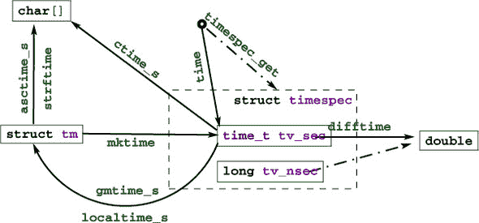

有两个函数用于从**`time_t`**到**`struct`** **`tm`**的逆向操作：

+   **localtime_s**存储分解后的本地时间。

+   **gmtime_s**存储分解的时间，以通用时间，UTC 表示。

如所示，它们在转换时假设的时间区域不同。在正常情况下，**localtime_s**和**mktime**应该是彼此的逆；**gmtime_s**在逆向方向上没有直接对应物。

日历时间的文本表示也可用。**asctime_s**以固定格式存储日期，独立于任何区域设置、语言（它使用英语缩写）或平台依赖性。格式是形如的字符串

```
"Www Mmm DD HH:MM:SS YYYY\n"
```

**strftime**更灵活，允许我们使用格式说明符组合文本表示。

它与**printf**家族类似，但具有用于日期和时间的特殊`%`-代码；参见表 8.13。在这里，区域列表明不同的环境设置，如首选语言或时区，可能会影响输出。如何访问和最终设置这些将在第 8.6 节中解释。**strftime**接收三个数组：一个要填充结果字符串的**`char`**`[`max`]`数组，另一个包含格式的字符串，以及一个包含要表示的时间的**`struct`** **`tm`** **`const`**`[1]`。传递时间数组的原因只有在了解更多关于指针之后才会变得明显。

##### 表 8.13\. ***strftime**格式说明符* 在区域列中选定的可能根据区域运行时设置动态变化；参见第 8.6 节。在 ISO 8601 列中选定的由该标准指定。

| Spec | Meaning | Locale | ISO 8601 |
| --- | --- | --- | --- |
| "%S" | 秒 ("00" 到 "60") |   |   |
| "%M" | 分钟 ("00" 到 "59") |   |   |
| "%H" | 小时 ("00" 到 "23")。 |   |   |
| "%I" | 小时 ("01" 到 "12")。 |   |   |
| "%e" | 月份中的日 (" 1" 到 "31") |   |   |
| "%d" | 月份中的日 ("01" 到 "31") |   |   |
| "%m" | 月份 ("01" 到 "12") |   |   |
| "%B" | 月份的全称 | X |   |
| "%b" | 缩写的月份名称 | X |   |
| "%h" | 等同于 "%b" | X |   |
| "%Y" | 年 |   |   |
| "%y" | 年 ("00" 到 "99") |   |   |
| "%C" | 世纪数（年/100） |   |   |
| "%G" | 基于周的年份；与 "%Y" 相同，除非 ISO 周数属于另一年 |   | X |
| "%g" | 与 "%G" 类似，("00" 到 "99") |   | X |
| "%u" | 星期几 ("1" 到 "7")，星期一为 "1" |   |   |
| "%w" | 星期几 ("0" 到 "6"，星期天为 "0") |   |   |
| "%A" | 星期几的全称 | X |   |
| "%a" | 缩写的工作日名称 | X |  |
| "%j" | 一年中的日 ("001" 到 "366") |   |   |
| "%U" | 一年中的周数 ("00" 到 "53")，从星期日开始 |   |   |
| "%W" | 一年中的周数 ("00" 到 "53")，从星期一开始 |   |   |
| "%V" | 一年中的周数 ("01" 到 "53")，从新年的前四天开始 |   | X |
| "%Z" | 时区名称 | X |   |
| "%z" | "+hhmm" 或 "-hhmm"，相对于 UTC 的小时和分钟偏移量 |   |   |
| "%n" | 换行符 |   |   |
| "%t" | 水平制表符 |   |   |
| "%%" | 文字 "%" |   |   |
| "%x" | 日期 | X |   |
| "%D" | 等同于 "%m/%d/%y" |   |   |
| "%F" | 等同于 "%Y-%m-%d" |   | X |
| "%X" | 时间 | X |   |
| "%p" | "AM" 或 "PM" 之一：中午是 "PM"，午夜是 "AM" | X |   |
| "%r" | 等同于 "%I:%M:%S %p" | X |   |
| "%R" | 等同于 "%H:%M" |   |   |
| "%T" | 等同于 "%H:%M:%S" |   | X |
| "%c" | 日期和时间的首选表示 | X |   |

不透明的类型 **`time_t`**（以及作为结果 **time** 本身）只有秒级的粒度。

如果我们需要比这更高的精度，可以使用 **`struct`** **`timespec`** 和 **`timespec_get`** 函数。这样，我们有一个额外的成员 **`tv_nsec`**，它提供了纳秒级的精度。第二个参数，base，由 C 标准定义了一个值：**`TIME_UTC`**。你应该期望使用该值的 **`timespec_get`** 调用与 **`time`** 调用保持一致。它们都指的是地球的参考时间。特定的平台可能为 base 提供额外的值，指定一个不同于墙上的时钟的时钟。这样的时钟可以是相对于你的计算机系统参与的行星或其他物理系统。^([2]) 通过使用只引用系统启动时间的 *单调时钟*，可以避免相对论和其他时间调整。CPU 时钟可以指程序执行被分配处理资源的时间。

> ²
> 
> 请注意，相对于地球快速移动的物体，如卫星和宇宙飞船，可能会相对于 UTC 感知到相对论时间变化。

对于后者，C 标准库提供了一个额外的接口：

```
**clock_t** **clock**(void);
```

由于历史原因，这引入了另一种类型，**`clock_t`**。它是以 **`CLOCKS_PER_SEC`** 单位每秒给出的处理器时间。

有三个不同的接口，**time**、**timespec_get** 和 **clock**，有点不幸。如果为其他形式的时钟提供预定义的常量，如 TIME_PROCESS_TIME 和 TIME_THREAD_TIME，将会很有益。


|  |
| --- |

**排序算法的性能比较**

你能比较你的排序程序（挑战 1）的时间效率与几个数量级的数据大小吗？

请注意，在数据的创建中要有一些随机性，并且数据大小不要超过你电脑的可用内存。

对于这两个算法，你应该大致观察到与 *N* log *N* 成正比的行为，其中 *N* 是排序的元素数量。

|  |
| --- |

### 8.6\. 运行时环境设置

C 程序可以访问一个 *环境列表**^C*：一个字符串的名称-值对列表（通常称为 *环境变量**^C*），它可以从运行时环境传输特定信息。有一个历史函数 **getenv** 来访问这个列表：

```
char* getenv(char const name[static 1]);
```

根据我们目前的知识，使用这个函数我们只能测试一个名称是否存在于环境列表中：

```
bool havenv(char const name[static 1]) {
  return getenv(name);
}
```

相反，我们使用安全的函数 **getenv_s**：

|  |
| --- |

**附录 K**

```
errno_t getenv_s(size_t * restrict len,
                 char value[restrict],
                 rsize_t maxsize,
                 char const name[restrict]);
```

此函数将对应于名称（如果有的话）的值从环境复制到 value，一个 **`char`**`[`maxsize`]`，前提是它适合。打印这样的值可能看起来像这样：

```
void printenv(char const name[static 1]) {
  if (getenv(name)) {
    char value[256] = { 0, };
    if (getenv_s(0, value, sizeof value, name)) {
      fprintf(stderr,
              "%s: value is longer than %zu\n",
              name, sizeof value);
    } else {
      printf("%s=%s\n", name, value);
    }
  } else {
    fprintf(stderr, "%s not in environment\n", name);
  }
}
```

如您所见，在检测到环境变量是否存在之后，可以将第一个参数设置为 `0` 来安全地调用 **getenv_s**。此外，可以保证只有当预期结果适合时，目标缓冲区才会被写入。可以使用 len 参数来检测所需的实际长度，并使用动态缓冲区分配来打印出更大的值。我们将等待更高层次来查看此类用法。

|  |
| --- |

可用的环境变量取决于操作系统。常见的环境变量包括 "HOME" 用于用户的家目录，"PATH" 用于可执行文件的集合标准路径，以及 "LANG" 或 "LC_ALL" 用于语言设置。

语言或 *locale**^C* 设置是程序执行继承的执行环境的重要组成部分。在启动时，C 将区域设置强制为规范化值，称为 "C" 区域。它基本上有美国英语的选择，用于数字或时间日期。

|  |
| --- |

`<locale.h>`

|  |
| --- |

可以使用 `locale.h` 中的 **setlocale** 函数来设置或检查当前值：

```
char* setlocale(int category, char const locale[static 1]);
```

除了"C"之外，C 标准还规定了另一个有效的 locale 值的存在：空字符串""。这可以用来将有效 locale 设置为系统默认值。分类参数可以用来处理语言环境的全部或部分。表 8.14 概述了可能的值以及它们影响的 C 库部分。可能还有其他平台相关的分类可用。

##### 表 8.14\. **setlocale**函数的分类

| **LC_COLLATE** | 通过**strcoll**和**strxfrm**进行字符串比较 |
| --- | --- |
| **LC_CTYPE** | 字符分类和处理函数；参见第 8.4 节。 |
| **LC_MONETARY** | 货币格式化信息，**localeconv** |
| **LC_NUMERIC** | 格式化 I/O 的十进制点字符，**localeconv** |
| **LC_TIME** | **strftime**；参见第 8.5 节 |
| **LC_ALL** | 所有上述内容 |

### 8.7\. 程序终止和断言

我们已经看到了终止程序最简单的方法：从**main**的常规返回。

|  |
| --- |

##### 摘要 8.24

*常规程序终止应使用从**main**返回的* **`return`** *。*

|  |
| --- |

使用**main**函数内的**exit**函数有点没有意义，因为它可以用**`return`**同样轻松地完成。

|  |
| --- |

##### 摘要 8.25

*在可能终止常规控制流的函数中使用* **exit** *。*

|  |
| --- |

C 库有三个其他函数可以终止程序执行，按严重程度排序：

```
_Noreturn void quick_exit(int status);
_Noreturn void _Exit(int status);
_Noreturn void abort(void);
```

现在，从**main**（或对**exit**的调用）返回**`return`**已经提供了指定程序执行是否被认为是成功的机会。使用返回值来指定；只要你没有其他需求或者你并不完全理解这些其他函数的作用，就不要使用它们。真的：不要使用。

|  |
| --- |

##### 摘要 8.26

*除非你不得不抑制库清理的执行，否则不要使用除了* **exit** *之外的函数来终止程序*。

|  |
| --- |

程序终止时的清理很重要。运行时系统可以刷新和关闭已写入的文件，释放程序占用的其他资源。这是一个特性，应该很少被绕过。

甚至有一个机制可以安装你自己的*处理程序**^C*，它们将在程序终止时执行。可以使用两个函数来完成这个任务：

```
int atexit(void func(void));
int at_quick_exit(void func(void));
```

这些有我们尚未见过的语法：*函数参数**^C*。例如，第一个读取为“返回**`int`**并接收一个函数参数 func 的**atexit**函数。”^([3])

> ³
> 
> 事实上，在 C 语言中，这种将函数参数 func 传递给函数**atexit**的概念与传递一个*函数指针**^C*是等价的。在描述此类函数时，你通常会看到指针变体。对我们来说，这种区别还不相关；将其视为通过引用传递函数会更简单。

我们在这里不会详细介绍。一个例子将展示如何使用它：

```
void sayGoodBye(void) {
  if (errno) perror("terminating with error condition");
  fputs("Good Bye\n", stderr);
}

int main(int argc, char* argv[argc+1]) {
  atexit(sayGoodBye);
  ...
}
```

这使用函数**atexit**来建立**exit**处理程序 sayGoodBye。在程序代码的正常终止后，此函数将被执行并给出执行状态。如果你需要一些尊重，这可能是一个很好的方式来给你的同事留下深刻印象。更严重的是，这是放置所有各种清理代码的理想位置，例如释放内存或将终止时间戳写入日志文件。请注意，调用语法为**atexit**`(`sayGoodBye`)`。sayGoodBye 本身没有`()`：在这里，sayGoodBye 在那个点没有被调用；只是将函数的引用传递给了**atexit**。

在罕见情况下，你可能想要绕过这些已建立的**atexit**处理程序。有一对其他函数，**quick_exit**和**at_quick_exit**，可以用来建立替代的终止处理程序列表。如果正常处理程序的执行过于耗时，这样的替代列表可能很有用。请谨慎使用。

下一个函数，**_Exit**，更为严重：它抑制了两种类型的应用特定处理程序的执行。唯一执行的是平台特定的清理操作，例如文件关闭。请更加谨慎地使用它。

最后一个函数，**abort**，更为侵入性。它不仅不会调用应用程序处理程序，还会抑制某些系统清理的执行。请极其谨慎地使用它。

在本章的开头，我们探讨了**`_Static_assert`**和**`static_assert`**，它们应该用于进行编译时断言。它们可以测试任何形式的编译时布尔表达式。另外两个标识符来自`assert.h`，可用于运行时断言：**`assert`**和**`NDEBUG`**。第一个可以用于测试必须在某个时刻成立的表达式。它可能包含任何布尔表达式，并且可能是动态的。如果在编译时没有定义**`NDEBUG`**宏，每次执行通过此宏的调用时，都会评估表达式。来自第 7.3 节的 gcd 和 gcd2 函数展示了**`assert`**的典型用法：一个在*每次*执行中都应成立的条件。

|  |
| --- |

`<assert.h>`

|  |
| --- |

如果条件不成立，则会打印诊断信息，并调用**abort**。因此，这些内容都不应该进入生产可执行文件。从之前的讨论中，我们知道**abort**的使用通常是有害的，并且错误信息如下

##### `终端`

```
**0**      assertion failed in file euclid.h, function gcd2(), line 6
```

对于你的客户来说并不很有帮助。在调试阶段，它可以帮助你找到对变量值做出错误假设的地方。

|  |
| --- |

##### 收获 8.27

*尽可能多地使用* **`assert`** 来确认运行时属性。

|  |
| --- |

如前所述，**`NDEBUG`**会抑制表达式的评估和**abort**的调用。请使用它来减少开销。

|  |
| --- |

##### 收获 8.28

*在生产编译中，使用* **`NDEBUG`** *来关闭所有* **`assert`***.*

| |
| --- |
| |

**图像分割**

除了 C 标准库之外，还有许多其他支持库，它们提供了非常不同的功能。其中有很多是某种形式的图像处理库。尝试找到一个合适的此类图像处理库，它是用 C 编写的或与 C 接口，并且允许你将灰度图像作为基类型为**`unsigned char`**的两维矩阵来处理。

这个挑战的目标是对这样的图像进行分割：将像素（矩阵的**`unsigned char`**元素）分组到一些“相似”的连接区域中。这种分割形成了一组像素的划分，就像我们在挑战 4 中看到的那样。因此，你应该使用并查集结构来表示区域，每个像素一个区域。

你能否实现一个统计函数，计算所有区域的统计量？这应该是一个数组（游戏中的第三个数组），对于每个根节点，它包含像素的数量和所有值的总和。

你能否实现一个区域合并标准？测试两个区域的平均值是否相差不远：比如说，不超过五个灰度值。

你能否实现一种逐行合并策略，对于图像中的一行上的每个像素，测试其区域是否应该合并到左侧和/或顶部？

你能否逐行迭代，直到没有更多变化：也就是说，结果区域/集合与各自的相邻区域都测试为负？

现在你已经有一个完整的图像分割函数，尝试将其应用于具有不同主题和大小的图像上，并且用不同的平均距离值来改变你的合并标准，而不是使用五个。

| |
| --- |

### 摘要

+   C 库通过一系列头文件进行接口。

+   数学函数最好通过`tgmath.h`中的类型通用宏来使用。

+   输入和输出（IO）通过`stdio.h`接口。有一些函数可以以文本或原始字节的形式进行 IO。文本 IO 可以是直接的或通过格式化来结构化。

+   字符串处理使用`ctype.h`中的函数进行字符分类，使用`stdlib`进行数值转换，使用`string.h`进行字符串操作。

+   `time.h`中的时间处理有*日历时间*，它是为人类解释而结构化的，以及*物理时间*，它是以秒和纳秒为单位的结构化。

+   标准 C 只有基本的接口来描述运行程序的执行环境；**getenv**提供了对环境变量的访问，而`locale.h`调节了人类语言的接口。
