## 第二级\. 认知


> *欧亚松鸡可能是独居的，或者成对出现。它以其模仿其他鸟鸣声、警觉性和散播种子以促进森林扩张而闻名。*

现在我们已经足够深入地了解了 C 的核心。完成这一级应该能够让你专业地编写 C 代码；因此，它从关于 C 程序的编写和组织的基本讨论开始。然后它填补了我们之前跳过的主要 C 构造的空白：它全面解释了指针，使你熟悉 C 的内存模型和动态内存分配，并让你理解 C 的大多数库接口。

## 第九章\. 风格

本章节涵盖

+   编写可读的代码

+   格式化代码

+   命名标识符

程序服务于双方：首先，正如我们之前所看到的，它们服务于向编译器和最终可执行文件发出指令。但同样重要的是，它们为必须与之打交道的人（用户、客户、维护者、律师等等）记录了系统的预期行为。

因此，我们有一个首要指令：

| |
| --- |

##### 摘要 C

*所有 C 代码都必须可读。*

| |
| --- |

那个指令的困难在于知道什么构成了“可读性”。并不是所有经验丰富的 C 程序员都同意，因此我们将从尝试建立一个最小必需列表开始。在讨论人类状况时，我们必须牢记的两个主要因素是：身体能力和文化负担。

| |
| --- |

##### 9.1 摘要

*短期记忆和视野范围都很小。*

| |
| --- |

Torvalds 等人 [1996]，Linux 内核的编码风格，是坚持这一方面并确实值得一看的例子，如果你还没有读过的话。其主要假设仍然有效：编程文本必须在一个相对较小的“窗口”（无论是控制台还是图形编辑器）中呈现，大约有 80 列的 30 行，形成一个 2,400 个字符的“表面”。所有不适合的内容都必须记住。例如，我们非常第一个程序在 列表 1.1 中符合这些限制。

通过对其幽默地引用 Kernighan 和 Ritchie [1978]，Linux 编码风格也指出了另一个基本事实：

| |
| --- |

##### 9.2 摘要

*编码风格不是品味问题，而是文化问题。*

| |
| --- |

忽略这一点很容易导致关于许多事情的无休止且毫无结果的争论。

| |
| --- |

##### 摘要 9.3

*当你进入一个成熟的项目时，你就进入了一个新的文化空间。*

| |
| --- |

尝试适应居民的习惯。当你创建自己的项目时，你有一点点自由来建立自己的规则。但如果你希望其他人遵守这些规则，你必须小心不要偏离在相应社区中占主导地位的常识。

### 9.1\. 格式化

C 语言本身对格式化问题相对宽容。在正常情况下，一个 C 编译器会愚蠢地解析一个整个程序，该程序写在单行上，最小化空白，并且所有标识符都由字母 l 和数字`1`组成。代码格式化的需求源于人类的无能。

| |
| --- |

##### 收获 9.4

*选择一个一致的策略来处理空白和其他文本格式。*

| |
| --- |

格式化问题包括缩进、括号和各种括号（`{}`, `[]`, 和 `()`）的位置、操作符前后空格、尾随空格以及多行换行。人眼和大脑在习惯上相当独特，为了确保它们能够正常高效地工作，一切必须保持同步。

在级别 1 的介绍中，你看到了许多应用于本书代码中的编码风格规则。把它们作为一种风格的例子；你可能会在继续的过程中遇到其他风格。让我们回顾一些规则，并介绍一些尚未介绍的其他规则：

+   我们使用前缀记法来表示代码块：也就是说，一个开括号 `{` 在一行的末尾。

+   我们将类型修饰符和限定符绑定到左边。我们将函数 `()` 绑定到左边，但条件中的 `()` 与其关键字（如**`if`**或**`for`**）之间用空格隔开。

+   三元表达式在`?`和`:`周围有空格。

+   标点符号（`:`, `;`, 和 `,`）前面没有空格，但后面有一个空格或一个新行。

如你所见，当写出来时，这些规则可能显得相当繁琐和任意。它们本身没有价值；它们是视觉辅助工具，帮助你和你合作者一眼就能理解新的代码。它们不是让你直接仔细输入的，但你应该掌握并学习可以帮助你的工具。

| |
| --- |

##### 收获 9.5

*让文本编辑器自动格式化你的代码。*

| |
| --- |

我个人使用 Emacs([`www.gnu.org/software/emacs/`](https://www.gnu.org/software/emacs/))来完成这项任务（是的，我真的很老）。对我来说，它是理想的，因为它可以自己理解 C 程序的结构。你的体验可能不同，但不要在日常生活中使用那些给你带来更少帮助的工具。文本编辑器、集成开发环境（IDE）和代码生成器都是为了我们而存在的，而不是相反。

在更大的项目中，你应该为所有流通和被他人阅读的代码强制执行这种格式化策略。否则，将难以追踪编程文本版本之间的差异。这可以通过命令行工具自动完成，这些工具会进行格式化。在这里，我长期偏好`astyle`（艺术风格[`sourceforge.net/projects/astyle/`](http://sourceforge.net/projects/astyle/)）。再次强调，你的体验可能不同；选择任何能确保任务完成的工具。

### 9.2\. 命名

在命名方面，这种自动格式化工具的局限性达到了极限。

|  |
| --- |

##### 取得成果 9.6

*为所有标识符选择一个一致的命名策略*。

|  |
| --- |

命名的两个方面：一方面是技术限制，另一方面是语义约定。不幸的是，它们经常被混淆，成为无休止的意识形态争论的主题。

对于 C，适用各种技术限制；它们旨在帮助你，所以要认真对待。首先，我们针对 *所有标识符*：类型（**`struct`** 或不是），**`struct`** 和 **`union`** 成员，变量，枚举，宏，函数，函数式宏。有如此多的 *命名空间**^C* 混乱，你必须小心。

特别是，头文件和宏定义之间的交互可能产生意想不到的效果。以下是一个看似无害的例子：

```
**1**   double memory_sum(size_t N, size_t I, double strip[N][I]);
```

+   N 是一个大写标识符，因此你的合作者可能会被诱惑定义一个宏 N 为一个大数字。

+   当有人包含 `complex.h` 时，I 被用作 -1 的根。

+   标识符 `strip` 可能会被 C 实现用于库函数或宏。

+   标识符 `memory_sum` 可能会被 C 标准用于未来的类型名称。

|  |
| --- |

`<complex.h>`

|  |
| --- |
|  |

##### 取得成果 9.7

*任何在头文件中可见的标识符都必须符合规范*。

|  |
| --- |

在这里，*符合性*是一个广泛的领域。在 C 术语中，如果标识符的意义由 C 标准固定，并且你无法重新定义它，则该标识符是 *保留**^C* 的：

+   以下划线和第二个下划线或大写字母开头的名称保留用于语言扩展和其他内部使用。

+   以下划线开头的名称保留用于文件作用域标识符以及 **`enum`**、**`struct`** 和 **`union`** 标签。

+   宏的名称全部为大写字母。

+   所有具有预定义意义的标识符都已被保留，不能在文件作用域中使用。这包括许多标识符，例如 C 库中的所有函数，所有以 str 开头的标识符（如我们之前的 strip），所有以 E 开头的标识符，所有以 **`_t`** 结尾的标识符，以及许多其他标识符。

这些规则相对困难的原因是，你可能多年都不会发现任何违规行为；然后，突然之间，在新客户端机器上，在引入下一个 C 标准、编译器或进行简单系统升级后，你的代码崩溃了。

一种降低命名冲突概率的简单策略是尽可能少地暴露名称。

|  |
| --- |

##### 取得成果 9.8

*不要污染标识符的全局空间*。

|  |
| --- |

仅将类型和函数作为接口暴露，这些接口是 *应用程序编程接口**^C* (*API**^C*) 的一部分：即那些预期将被你的代码的用户使用。

对于其他人或项目使用的库，一个好的策略是使用不太可能引起冲突的命名前缀。例如，POSIX 线程 API 中的许多函数和类型都以前缀 pthread_ 开头。对于我的工具箱 P99，我使用前缀 p99_ 和 P99_ 用于 API 接口，p00_ 和 P00_ 用于内部。

有两种名称可能会与另一个程序员编写的宏产生不良交互，而你可能不会立即想到：

+   **`struct`**和**`union`**的成员名称

+   函数接口中的参数名称。

第一点是为什么标准结构中的成员通常在其名称前有一个前缀的原因：**`struct`** **`timespec`**的成员名称是**`tv_sec`**，因为一个未受过教育的用户可能会声明一个宏 sec，当包含`time.h`时可能会以不可预测的方式干扰。对于第二点，我们之前已经看到了一个例子。在 P99 中，我会指定这样的函数如下：

|  |
| --- |

`<time.h>`

|  |
| --- |

```
**1**   double p99_memory_sum(size_t p00_n, size_t p00_i,
**2**                         double p00_strip[p00_n][p00_i]);
```

当我们也将程序内部暴露给公众时，这个问题变得更糟。这发生在两种情况下：

+   所说的**`inline`**函数，这些函数的定义（不仅是声明）在头文件中可见

+   函数宏

我们将在稍后讨论这些特性，参见第 15.1 节和第十六章。

既然我们已经明确了命名的技术要点，我们将看看语义方面。

|  |
| --- |

##### 取得成果 9.9

*名称必须是可识别的和快速可区分的*。

|  |
| --- |

这有两个部分：可区分的和快速。比较表 9.1 中的标识符。

根据你个人的口味，这张表右侧的答案可能不同。这反映了我的口味：这样的名称的隐含上下文是我个人期望的一部分。n 和 m 在一侧与 ffs 和 clz 在另一侧之间的差异是一种隐含的语义。

##### 表 9.1\. 一些易于和难以区分的标识符的例子

|   |   | 可识别的 | 可区分的 | 快速 |
| --- | --- | --- | --- | --- |
| lllll1llOll | llllll1l0ll | 否 | 否 | 否 |
| 我的行号 | 我的列号 | 是 | 是 | 否 |
| n | m | 是 | 是 | 是 |
| ffs | clz | 否 | 是 | 是 |
| lowBit | highBit | 是 | 是 | 是 |
| p00Orb | p00Urb | 否 | 是 | 否 |
| p00_orb | p00_urb | 是 | 是 | 是 |

对于我来说，因为我有深厚的数学背景，从 i 到 n 的单字母变量名，如 n 和 m，是整数变量。它们通常在非常有限的范围内出现，作为循环变量或类似的东西。单字母标识符是可以的（我们总是有声明在眼前），并且它们很容易区分。

函数名称 ffs 和 clz 是不同的，因为它们与其他所有可能用作函数名称的三字母缩写词竞争。顺便说一下，在这里，ffs 是 *find first (bit) set* 的缩写，但这对我来说并不立即明显。这意味着什么将更不清楚：哪个位是第一个，最显著的位还是最不显著的位？

有几种约定将多个单词组合在一个标识符中。其中最常用的有以下几种：

+   *驼峰命名法**^C**，使用内部大写字母来分隔单词。

+   *蛇形命名法**^C**，使用内部下划线来分隔单词。

+   *匈牙利命名法**^C**，在标识符的前缀中编码类型信息，例如 szName，其中 sz 代表 *字符串* 和 *以零结尾的*。

    > ¹
    > 
    > 由 Simonyi [1976] 发明，Simonyi Károly 的博士论文。

如你所想，这些都不理想。前两个往往模糊了我们的视线：它们很容易用难以阅读的表达式填满宝贵的编程文本的一整行：

```
**1**   return theVerySeldomlyUsedConstant*theVerySeldomlyUsedConstant/
        number_of_elements;
```

匈牙利命名法反过来又倾向于使用类型或概念的晦涩缩写，产生难以发音的标识符，并且在 API 更改时完全崩溃。

因此，在我看来，这些规则或策略都没有绝对的价值。我鼓励你对此问题采取实用主义的方法。

| |
| --- |

##### 取得 9.10

*命名是一种创造性行为*。

| |
| --- |

它不容易被简单的技术规则所包含。

显然，标识符使用得越广泛，良好的命名就越重要。因此，对于声明通常不在程序员视线范围内的标识符来说，这一点尤为重要：构成 API 的全局名称。

| |
| --- |

##### 取得 9.11

*文件作用域的标识符必须是全面的*。

| |
| --- |

这里所说的 *全面性* 应该从标识符的类型中得出。类型名称、常量、变量和函数通常服务于不同的目的，因此应用不同的策略。

| |
| --- |

##### 取得 9.12

*类型名称标识一个概念*。

| |
| --- |

这种概念的例子包括 *time* 用于 **`struct`** **`timespec`**，*size* 用于 **`size_t`**，一组乌鸦用于 **`enum`** 乌鸦，*person* 用于收集有关人们数据的结构，*list* 用于项目的链表，*dictionary* 用于查询数据结构，等等。如果你在为数据结构、枚举或算术类型构思概念时遇到困难，你可能需要重新审视你的设计。

| |
| --- |

##### 取得 9.13

*全局常量标识一个工件*。

| |
| --- |

即，一个常数 *因其某种原因而突出* 出于其他相同类型的可能常数：它具有特殊的意义。它可能具有这种意义是因为一些超出我们控制的外部原因（M_PI 对于 π），因为 C 标准这么说（**`false`**，**`true`**），因为执行平台的限制（**`SIZE_MAX`**），为了真实（corvid_num），因为文化上的原因（fortytwo），或者作为设计决策。

通常，我们很快就会看到，文件作用域变量（*全局变量*）是不被看好的。尽管如此，它们有时是不可避免的，因此我们必须有一个命名它们的概念。

|  |
| --- |

##### Takeaway 9.14

*全局变量标识状态*。

|  |
| --- |

这样的变量通常命名为 toto_initialized，以表示库 *toto* 已经被初始化，onError 用于文件作用域但内部变量，该变量在必须拆除的库中设置，visited_entries 用于收集共享数据的哈希表。

|  |
| --- |

##### Takeaway 9.15

*函数或功能宏标识一个动作*。

|  |
| --- |

并非所有，但许多 C 标准库中的函数都遵循该规则，并使用动词作为它们名称的组成部分。以下是一些示例：

+   一个比较两个字符串的标准函数是 **strcmp**。

+   一个查询属性的标准化宏是 **`isless`**。

+   访问数据成员的函数可以被称为 toto_getFlag。

+   设置此类成员的对应函数将是 toto_setFlag。

+   一个乘以两个矩阵的函数是 matrixMult。

### 摘要

+   编码风格是一个文化问题。要有耐心和宽容。

+   代码格式化是视觉习惯的问题。它应该由你的环境自动提供，这样你和你的同事就可以轻松地阅读和编写代码。

+   变量、函数和类型的命名是一门艺术，并在你代码的全面性中扮演着核心角色。

## 第十章\. 组织和文档

本章涵盖

+   如何记录接口

+   如何解释实现

作为一项重要的社会、文化和经济活动，编程需要一定的组织形式才能成功。就像编码风格一样，初学者往往低估了应该投入到代码、项目和文档中的努力：不幸的是，我们中的许多人不得不在写完代码一段时间后阅读自己的代码，却对它是什么毫无头绪。

记录或更普遍地说，解释程序代码不是一件容易的任务。我们必须在提供上下文和必要信息以及枯燥地陈述显而易见的事实之间找到正确的平衡。让我们看看以下两行：

```
**1**      u = fun4you(u, i, 33, 28);  // ;)
**2**      ++i;                        // incrementing i
```

第一行不太好，因为它使用了魔法常量，一个不说明正在发生什么的函数名，以及一个没有太多意义的变量名，至少对我来说是这样。笑脸注释表明程序员在编写这个时很开心，但这对于普通读者或维护者来说并不很有帮助。

在第二行，注释是多余的，它陈述了任何甚至不太有经验的程序员都知道的关于`++`操作符的知识。

将此与以下内容进行比较：

```
**1**   /* 33 and 28 are suitable because they are coprime. */
**2**   u = nextApprox(u, i, 33, 28);
**3**   /* Theorem 3 ensures that we may move to the next step. */
**4**   ++i;
```

在这里，我们可以推断出更多。我预计 u 是一个浮点值，可能是**`double`**：即，受近似过程的影响。这个过程分步骤进行，由 i 索引，并需要一些额外的参数，这些参数需要满足素性条件。

一般而言，我们按照重要性的顺序有*什么*、*为什么*、*如何*和*以何种方式*规则：

|  |
| --- |

##### 摘要 10.1（什么）

*函数接口描述*了*做了什么*。

|  |
| --- |
|  |

##### 摘要 10.2（为什么）

*接口注释记录了函数的目的*。

|  |
| --- |
|  |

##### 摘要 10.3（如何）

*函数代码说明*了函数是如何组织的。

|  |
| --- |
|  |

##### 摘要 10.4（以何种方式）

*代码注释解释了函数细节是如何实现的*。

|  |
| --- |

事实上，如果你考虑一个更大的库项目，该项目被其他人使用，你预计所有用户都会阅读接口规范（例如在`man`页面的概要部分），其中大多数人会阅读关于这些接口的解释（`man`页面的其余部分）。其中很少有人会查看源代码并了解*如何*或*以何种方式*一个特定的接口实现以这种方式做事。

这些规则的一个直接后果是代码结构和文档是相辅相成的。接口规范和实现之间的区别尤为重要。

|  |
| --- |

##### 摘要 10.5

*分离接口和实现*。

|  |
| --- |

这条规则体现在使用两种不同的 C 源文件：*头文件**^C*，通常以".h"结尾；和*翻译单元**^C*（*TU*），通常以".c"结尾。

语法注释在这两种源文件中有两个不同的角色，应该分开：

|  |
| --- |

##### 摘要 10.6

*记录接口—解释实现*。

|  |
| --- |

### 10.1\. 接口文档

与 Java 和 Perl 等更现代的语言相比，C 没有“内置”的文档标准。但近年来，一个跨平台的公共领域工具在许多项目中得到了广泛采用：doxygen ([`www.doxygen.nl/`](http://www.doxygen.nl/))。它可以用来自动生成网页、PDF 手册、依赖图等等。但即使你不使用 doxygen 或其他等效工具，你也应该使用它的语法来记录接口。

|  |
| --- |

##### 摘要 10.7

*彻底记录接口*。

|  |
| --- |

Doxygen 有很多类别可以帮助你做到这一点，但更深入的讨论超出了本书的范围。只需考虑以下示例：

##### `heron_k.h`

```
**116**   /**
**117**    ** @brief use the Heron process to approximate @a a to the
**118**    ** power of 1/k
**119**    **
**120**    ** Or in other words this computes the @f$k^{th}@f$ root of @a a.
**121**    ** As a special feature, if @a k is -1 it computes the
**122**    ** multiplicative inverse of @a a.
**123**    **
**124**    ** @param a must be greater than 0.0
**125**    ** @param k should not be 0 and otherwise be between
**126**    ** DBL_MIN_EXP*FLT_RDXRDX and
**127**    ** DBL_MAX_EXP*FLT_RDXRDX.
**128**    **
**129**    ** @see FLT_RDXRDX
**130**    **/
**131**   double heron(double a, signed k);
```

Doxygen 为该函数生成在线文档，其外观类似于图 10.1，并且能够生成我们可以包含在这本书中的格式化文本：

|  |
| --- |

`heron_k.h`

heron：使用 Heron 过程将*a*的`1`/k 次幂近似

或者换句话说，这是计算 *a* 的 *k* 次根。作为一个特殊功能，如果 *k* 是 `-1`，它将计算 *a* 的乘法逆。

**参数：**

| a | 必须大于 0.0 |
| --- | --- |
| k | 应该 | 不 | 是 | 0 | 并且 | 否则 | 应该 | 在 |
|   | **DBL_MIN_EXP***FLT_RDXRDX 和 **DBL_MAX_EXP***FLT_RDXRDX。 |

**另请参阅:** FLT_RDXRDX

```
double heron(double a, signed k);
```

|  |
| --- |
|  |

`heron_k.h`

FLT_RDXRDX: **`FLT_RADIX`** 的基数 2

这对于下面的一些代码在内部是必需的。

```
# define FLT_RDXRDX something
```

|  |
| --- |

##### 图 10.1\. doxygen 生成的文档

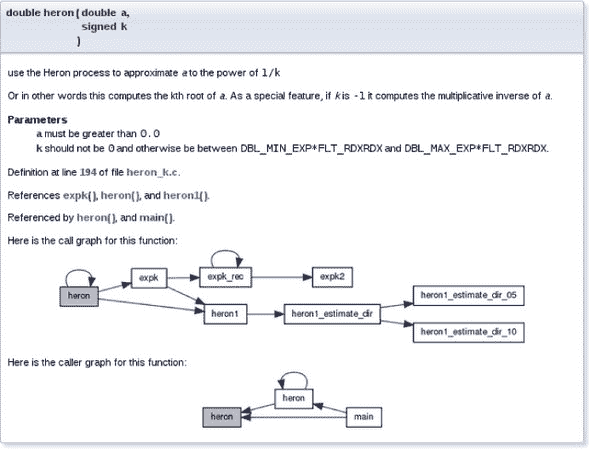

如你所猜测的，以 @ 开头的单词对 doxygen 有特殊意义：它们是其关键字的开始。这里我们有 @param、@a 和 @brief。第一个记录函数参数，第二个在文档的其余部分引用该参数，最后一个提供了函数的简要概述。

此外，我们注意到在注释中存在一些标记能力，并且 doxygen 能够识别翻译单元 "heron_k.c" 中定义函数及其涉及实现的不同函数的调用图。

为了提供良好的项目组织，重要的是用户能够轻松地找到相关的部分，而无需四处搜索。

|  |
| --- |

##### 收获 10.8

*将代码组织成具有强语义连接的单元。*

|  |
| --- |

最常见的方法是将处理特定数据类型的所有函数分组到一个头文件中。对于 **`struct`** brian 的典型头文件 "brian.h" 可能如下所示：

```
 **1**   #ifndef BRIAN_H
 **2**   #define BRIAN_H 1
 **3**   #include <time.h>
 **4**
 **5**   /** @file
 **6**    ** @brief Following Brian the Jay
 **7**    **/
 **8**
 **9**   typedef struct brian brian;
**10**   enum chap { sct, en, };
**11**   typedef enum chap chap;
**12**
**13**   struct brian {
**14**     struct timespec ts; /**< point in time */
**15**     unsigned counter;   /**< wealth        */
**16**      chap masterof;     /**< occupation    */
**17**   };
**18**
**19**   /**
**20**    ** @brief get the data for the next point in time
**21**    **/
**22**   brian brian_next(brian);
**23**
**24**   ...
**25**   #endif
```

该文件包含使用 **`struct`** 所必需的所有接口。它还包括可能需要编译这些接口并使用 *include guards**^C*（这里宏为 BRIAN_H）来防止多次包含的其他头文件。

### 10.2\. 实现

如果你阅读的是优秀程序员编写的代码（你应该经常这样做！），你会注意到它通常注释很少。然而，如果读者具备 C 语言的基本知识，它可能仍然很容易阅读。优秀的编程只需要解释那些不明显的想法和前提（困难的部分）。代码的结构显示了它做什么以及如何做。

|  |
| --- |

##### 收获 10.9

*直接实现。*

|  |
| --- |

C 程序是对要做什么的描述性文本。我们之前引入的实体命名规则对于使描述性文本可读和清晰起着至关重要的作用。另一个要求是，通过视觉上明显区分的 `{}` 块的结构，以及与之相关的综合控制语句，要有明显的控制流程。

|  |
| --- |

##### 收获 10.10

*控制流程必须明显。*

|  |
| --- |

有许多方法可以混淆控制流程。以下是最重要的几种：

+   *嵌套跳转:* – 隐藏在复杂的嵌套结构中的**`break`**、**`continue`**、**`return`**和**`goto`**^([1])语句，最终与循环结构结合。

    > ¹
    > 
    > 这些内容将在第 13.2.2 节和第 14.5 节中讨论。

+   *飞蛾扑火表达式:* – 控制表达式，以不寻常的方式组合大量运算符（例如，`!!++``*`p`--`或`--> 0`），以至于必须用放大镜检查才能理解控制流从这里开始。

在接下来的章节中，我们将关注两个对于 C 代码的可读性和性能至关重要的概念。一个*宏*可以是一个方便的工具，用于简写某个功能，但如果使用不当，也可能使使用它的代码变得晦涩，并触发微妙的错误(第 10.2.1 节)。正如我们之前所看到的，函数是 C 中模块化的主要选择。在这里，某些函数的特定属性特别重要：一个*纯*函数仅通过其接口与程序的其他部分交互。因此，纯函数对人类和编译器来说很容易理解，并且通常会导致相当高效的实现(第 10.2.2 节)。

#### 10.2.1\. 宏

我们已经知道一个可能被滥用的工具来混淆控制流：宏。正如你希望从第 5.6.3 节和第 8.1.2 节中回忆起来的那样，宏定义了可以包含几乎任何 C 文本的文本替换。由于我们将在这里展示的问题，许多项目完全禁止使用宏。尽管如此，C 标准的演变方向并不是这个。例如，正如我们所见，类型通用的宏是数学函数的*现代接口*（参见第 8.2 节）；宏应该用于初始化常量(第 5.6.3 节)或用于实现编译器魔法(**`errno`**，第 8.1.3 节)。

因此，我们不应该否认这一点，而应该尝试驯服这个野兽，并制定一些简单的规则来限制可能的损害。

|  |
| --- |

##### 取得成果 10.11

*宏不应该以令人惊讶的方式改变控制流。*

|  |
| --- |

在与初学者讨论时偶尔会出现的臭名昭著的例子包括这些：

```
 **1**   #define begin {
 **2**   #define end }
 **3**   #define forever for (;;)
 **4**   #define ERRORCHECK(CODE) if (CODE) return -1
 **5**
 **6**   forever
 **7**     begin
 **8**     // do something
 **9**     ERRORCHECK(x);
**10**     end
```

不要这样做。C 程序员的视觉习惯和我们的工具不太容易与这类东西配合，如果在复杂的代码中使用这类东西，它们几乎肯定会出错。

在这里，ERRORCHECK 宏尤其危险。其名称并不暗示其中可能隐藏着非局部跳转，例如**`return`**。其实现方式甚至更加危险。考虑以下两行：

```
**1**   if (a) ERRORCHECK(x);
**2**   else puts("a is 0!");
```

这些行被重写为

```
**1**   if (a) if (x) return -1;
**2**   else puts("a is 0!");
```

**`else`**-子句（所谓的*悬挂* **`else`**）附加在最内层的 **`if`** 上，我们看不到。所以这相当于

```
**1**   if (a) {
**2**     if (x) return -1;
**3**     else puts("a is 0!");
**4**   }
```

这可能对普通读者来说相当令人惊讶。

这并不意味着在宏中完全不应用控制结构。只是它们不应该被隐藏，并且不应该产生令人惊讶的效果。这个宏本身可能并不那么明显，但它的*使用*并没有令人惊讶：

```
**1**   #define ERROR_RETURN(CODE) \
**2**   do {                       \
**3**     if (CODE) return -1;     \
**4**   } while (false)
```

以下宏的名称明确表示可能存在一个**`return`**。悬而未决的**`else`**问题通过替换后的文本得到处理：

```
**1**   if (a) ERROR_RETURN(x);
**2**   else puts("a is 0!");
```

下一个示例按照预期结构化了代码，其中**`else`**与第一个**`if`**相关联：

```
**1**   if (a) do {
**2**     if (CODE) return -1;
**3**   } while (false);
**4**   else puts("a is 0!");
```

**`do`**`-`**`while`**`(`**`false`**`)`-技巧显然很丑陋，你不应该滥用它。但这是一个标准的技巧，用于在不改变肉眼可见的块结构的情况下，用 `{}` 块包围一个或多个语句。

|  |
| --- |

##### 取走 10.12

*函数式宏在语法上应该表现得像函数调用。*

|  |
| --- |

可能的陷阱包括：

+   ****if** *without* **else***:*** 已经演示过。

+   **尾随分号**：*这些可以以令人惊讶的方式终止外部控制结构。*

+   **逗号运算符**：*** 逗号在 C 语言中是一个模糊的角色。在大多数情况下，它被用作列表分隔符，例如用于函数调用、枚举声明或初始化器。在表达式的上下文中，它是一个控制运算符。避免使用它。

+   ***可续表达式：*** 当放入非平凡上下文中时，这些表达式将以意想不到的方式绑定到运算符上.^([[[Exs 1]](#ch10fn-ex01)]) 在替换文本中，将参数和表达式用括号括起来。

    > ^([Exs 1])
    > 
    > 考虑一个宏函数`su`m(`a`,` b`)`，它被实现为`a``+`b。`su`m(`5, 2`)``*``7`的结果是什么？

+   ***多重评估：*** 宏是文本替换。如果一个宏参数被使用两次（或更多），其效果会被执行两次.^([[[Exs 2]](#ch10fn-ex02)])

    > ^([例 2])
    > 
    > 让`max(a, b)`的实现为`((a) < (b) ? (b) : (a))`。对于`max(i++, 5)`会发生什么？

#### 10.2.2\. 纯函数

|  |
| --- |

##### Takeaway 10.13

*函数参数是通过值传递的*。

|  |
| --- |

也就是说，当我们调用一个函数时，所有参数都会被评估，并且参数（函数局部变量）会接收到这些值的初始化。然后函数执行它需要做的操作，并通过返回值发送计算结果。

目前，我们让两个函数操作同一*对象*的唯一可能性是声明一个对象，使得声明对两个函数都是可见的。这样的*全局变量**^C*有很多缺点：它们使代码缺乏灵活性（要操作的对象是固定的）、难以预测（修改的位置散布各处），并且难以维护。

|  |
| --- |

##### Takeaway 10.14

*全局变量是不受欢迎的。*

|  |
| --- |

具有以下两个特性的函数被称为*纯**^C*函数：

+   函数除了返回值外没有其他影响。

+   函数的返回值只取决于其参数。

对纯函数执行的唯一兴趣是其结果，而这个结果只取决于传递的参数。从优化的角度来看，纯函数可以被移动或甚至与其他任务并行执行。执行可以在参数可用时开始，必须在结果被使用之前完成。

会使函数失去纯性的影响包括所有那些除了提供返回值之外改变抽象状态机的操作。例如，

+   函数通过除其参数之外的其他方式读取程序的可变状态。

+   函数修改了一个全局对象。

+   函数在调用之间保持持久内部状态.^([2])

    > ²
    > 
    > 在对同一函数的多次调用之间，可以使用局部**`static`**变量来建立持久状态。我们将在第 13.2 节中看到这个概念。

+   函数执行 IO.^([3])

    > ³
    > 
    > 例如，通过使用**printf**可以发生这样的 IO。

纯函数是执行小任务的函数的一个非常好的模型，但一旦我们需要执行更复杂的任务，它们的局限性就变得相当明显。另一方面，优化器*喜欢*纯函数，因为它们对程序状态的影响可以简单地通过它们的参数和返回值来描述。纯函数对抽象状态机可能产生的影响非常局部且易于描述。

|  |
| --- |

##### Takeaway 10.15

*尽可能将小任务表示为纯函数。*

|  |
| --- |

对于纯函数，即使是在面向对象编程风格中，我们也可以走得很远，如果我们愿意在第一次尝试时接受一点数据复制的代价。考虑以下结构类型 rat，它被用来进行有理数运算：

##### `rationals.h`

```
 **8**   struct rat {
 **9**     bool sign;
**10**     size_t num;
**11**     size_t denom;
**12**   };
```

这是对这种类型的直接实现，而且你绝对不应该将其用作库，除非在这个学习经验的范围内。为了简单起见，它有一个与分子相同的类型(**`size_t`**)的分母，并通过成员.sign 跟踪数字的符号。第一个（纯）函数是 rat_get，它接受两个数字并返回一个表示它们商的有理数：

##### `rationals.c`

```
 **3**   rat rat_get(long long num, unsigned long long denom) {
 **4**     rat ret = {
 **5**       .sign = (num < 0),
 **6**       .num = (num < 0) ? -num : num,
 **7**       .denom = denom,
 **8**     };
 **9**     return ret;
**10**   }
```

如您所见，该函数相当简单。它只是使用正确的符号、分子和分母值初始化一个复合字面量。请注意，如果我们以这种方式定义一个有理数，几个表示将代表相同的有理数。例如，数字与相同。

为了处理这种表示中的等价性，我们需要维护函数。主要思想是这些有理数应该始终是归一化的：也就是说，使用分子和分母具有最少因子的表示。这不仅更容易为人类所理解，而且在执行算术运算时也可能避免溢出：

##### `rationals.c`

```
**12**   rat rat_get_normal(rat x) {
**13**     size_t c = gcd(x.num, x.denom);
**14**     x.num /= c;
**15**     x.denom /= c;
**16**     return x;
**17**   }
```

在这里，gcd 函数正如我们之前所描述的那样。

另一个函数执行归一化的逆操作；它通过一个冗余因子乘以分子和分母：

##### `rationals.c`

```
**19**   rat rat_get_extended(rat x, size_t f) {
**20**     x.num *= f;
**21**     x.denom *= f;
**22**     return x;
**23**   }
```

这样，我们可以定义其他人应该使用的函数：rat_get_prod 和 rat_get_sum。

看看 rat_get_prod：

##### `rationals.c`

```
**25**   rat rat_get_prod(rat x, rat y) {
**26**     rat ret = {
**27**       .sign = (x.sign != y.sign),
**28**       .num = x.num * y.num,
**29**       .denom = x.denom * y.denom,
**30**     };
**31**     return rat_get_normal(ret);
**32**   }
```

它首先以简单的方式计算结果的一种表示：通过分别相乘分子和分母。然后，得到的表示可能没有归一化，因此我们在返回结果时调用 rat_get_normal。

现在，rat_get_sum 要复杂一些。在我们可以计算结果的分子之前，我们必须找到公共分母：

##### `rationals.c`

```
**34**   rat rat_get_sum(rat x, rat y) {
**35**     size_t c = gcd(x.denom, y.denom);
**36**     size_t ax = y.denom/c;
**37**     size_t bx = x.denom/c;
**38**     x = rat_get_extended(x, ax);
**39**     y = rat_get_extended(y, bx);
**40**     assert(x.denom == y.denom);
**41**
**42**     if (x.sign == y.sign) {
**43**       x.num += y.num;
**44**     } else if (x.num > y.num) {
**45**       x.num -= y.num;
**46**     } else {
**47**       x.num = y.num - x.num;
**48**       x.sign = !x.sign;
**49**     }
**50**     return rat_get_normal(x);
**51**   }
```

此外，我们必须跟踪两个有理数的符号，以了解我们应该如何将分子相加。

如您所见，这些函数都是纯函数，这确保了它们可以很容易地使用，即使在我们的实现中也是如此。我们唯一需要关注的是始终将函数的返回值分配给一个变量，例如在第 38 行。否则，由于我们不操作对象 x，而只是操作它的值，函数中的更改将会丢失.^([[[Exs 3]](#ch10fn-ex03)]) ^([[[Exs 4]](#ch10fn-ex04)])

> ^([Exs 3])
> 
> 函数 rat_get_prod 可能会产生中间值，这可能导致它产生错误的结果，即使乘法的数学结果可以在 rat 中表示。这是怎么回事？
> 
> ^([Exs 4])
> 
> 重新实现 rat_get_prod 函数，使其每次数学结果值可以在 rat 中表示时都产生正确的结果。这可以通过两次调用 rat_get_normal 而不是一次来实现。

如前所述，由于重复复制，这可能会导致编译后的代码效率不如预期。但这根本不算什么：通过良好的编译器，复制操作的开销可以保持相对较低。当开启优化时，它们通常可以直接在结构体上操作，就像它从这样的函数返回一样。然后，这样的担忧可能完全过早，因为你的程序既短又简单，或者因为它的真正性能问题在于其他地方。通常，这对于我们迄今为止达到的编程技能水平来说应该完全足够。稍后，我们将学习如何通过使用 **`inline`** 函数 (第 15.1 节) 和许多现代工具链提供的 *链接时间优化* 来有效地使用这种策略。

列表 10.1 列出了我们迄今为止看到的 rat 类型的所有接口（第一组）。我们已经研究了其他函数的接口，这些函数在 *指针* 上工作。这些将在 第 11.2 节 中更详细地解释。

##### 列表 10.1\. 用于有理数计算的类型。

```
 **1**   #ifndef RATIONALS_H
 **2**   # define RATIONALS_H 1
 **3**   # include <stdbool.h>
 **4**   # include "euclid.h"
 **5**
 **6**   typedef struct rat rat;
 **7**
 **8**   struct rat {
 **9**     bool sign;
**10**     size_t num;
**11**     size_t denom;
**12**   };
**13**
**14**   /* Functions that return a value of type rat. */
**15**   rat rat_get(long long num, unsigned long long denom);
**16**   rat rat_get_normal(rat x);
**17**   rat rat_get_extended(rat x, size_t f);
**18**   rat rat_get_prod(rat x, rat y);
**19**   rat rat_get_sum(rat x, rat y);
**20**
**21**
**22**   /* Functions that operate on pointers to rat. */
**23**   void rat_destroy(rat* rp);
**24**   rat* rat_init(rat* rp,
**25**                 long long num,
**26**                 unsigned long long denom);
**27**   rat* rat_normalize(rat* rp);
**28**   rat* rat_extend(rat* rp, size_t f);
**29**   rat* rat_sumup(rat* rp, rat y);
**30**   rat* rat_rma(rat* rp, rat x, rat y);
**31**
**32**   /* Functions that are implemented as exercises. */
**33**   /** @brief Print @a x into @a tmp and return tmp. **/
**34**   char const* rat_print(size_t len, char tmp[len], rat const* x);
**35**   /** @brief Print @a x normalize and print. **/
**36**   char const* rat_normalize_print(size_t len, char tmp[len],
**37**                                   rat const* x);
**38**   rat* rat_dotproduct(rat rp[static 1], size_t n,
**39**                       rat const A[n], rat const B[n]);
**40**
**41**   #endif
```

### 摘要

+   对于程序的每一部分，我们必须区分对象（我们在做什么？）、目的（我们为什么要这样做？）、方法（我们如何做？）和实现（我们以何种方式做？）。

+   函数和类型接口是软件设计的精髓。更改它们是昂贵的。

+   实现应该尽可能直接，并且其控制流程应该明显。应避免复杂的推理，并在必要时明确表达。

## 第十一章\. 指针

本章涵盖

+   指针操作简介

+   使用指针与结构体、数组和函数

指针是深入理解 C 的第一个真正障碍。它们用于需要从代码的不同点访问对象或动态结构化数据的上下文中。

不经验丰富的程序员在指针和数组之间的混淆是出了名的，所以请小心，你可能会在正确使用这些术语时遇到困难。另一方面，指针是 C 最重要的特性之一。它们是一个很大的优势，可以帮助我们抽象出特定平台的位和奇偶性，并使我们能够编写可移植的代码。所以，当你处理本章内容时，请务必保持耐心，因为这对于理解本书的大部分内容至关重要。

术语 *指针**^C* 代表一种特殊的派生类型构造，它“指向”或“引用”某个东西。我们已经看到了这种构造的语法，即一个类型（*引用类型**^C*），后面跟着一个 `*` 字符。例如，p0 是一个指向 **`double`** 的指针：

```
double* p0;
```

理念是我们有一个变量（指针），它指向另一个对象的内存：

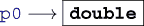

在本章中，我们需要区分指针（箭头左侧）和被指向的无名对象（箭头右侧）。

我们第一次使用指针将打破函数调用者的代码和函数内部代码之间的障碍，从而允许我们编写*非纯*函数。这个示例将是一个具有以下原型的函数：

```
void double_swap(double* p0, double* p1);
```

在这里，我们看到两个函数参数“指向”**`double`**类型的对象。在示例中，函数 double_swap 旨在交换（*交换*）这两个对象的内容。例如，当函数被调用时，p0 和 p1 可能分别指向由调用者定义的**`double`**变量 d0 和 d1，这些变量如下所示：

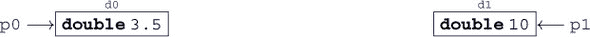

通过接收有关两个此类对象的信息，函数 double_swap 可以有效地更改两个**`double`**对象的内容，而不会更改指针本身：

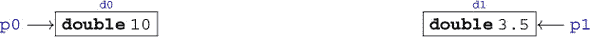

使用指针，函数将能够直接更改调用函数的变量；没有指针或数组的纯函数无法做到这一点。

在本章中，我们将详细介绍与指针相关的不同操作（第 11.1 节）以及指针具有特定属性的特定类型：结构体（第 11.2 节）、数组（第 11.3 节）和函数（第 11.4 节）。

### 11.1. 指针操作

指针是一个重要的概念，因此有几种专门针对它们的 C 语言操作和特性。最重要的是，特定的运算符允许我们处理指针与其所指向的对象之间的“指向”和“被指向”关系（第 11.1.1 节）。此外，指针被认为是*标量**^C*：为它们定义了算术运算，偏移量加法（第 11.1.2 节）和减法（第 11.1.3 节）；它们具有状态（第 11.1.4 节）；并且它们有一个专门的“空”状态（第 11.1.5 节）。

#### 11.1.1. 地址运算符和对象运算符

如果我们必须执行无法用纯函数表达的任务，事情会变得更加复杂。我们必须在不是函数变量的对象中“探索”。指针是进行这种抽象的合适工具。

因此，让我们使用之前提到的 double_swap 函数来交换两个**`double`**对象 d0 和 d1 的内容。对于调用，我们使用一元*地址运算符**^C*“**`&`**”。它允许我们通过其*地址**^C*来引用一个对象。对我们的函数的调用可能如下所示：

```
   double_swap(&d0, &d1);
```

地址运算符返回的类型是*指针类型**^C*，可以使用我们已看到的`*`符号指定。函数的一个实现可能如下所示：

```
void double_swap(double* p0, double* p1) {
  double tmp = *p0;
  *p0 = *p1;
  *p1 = tmp;
}
```

在函数内部，指针 p0 和 p1 持有函数应该操作的对象的地址：在我们的例子中，d0 和 d1 的地址。但函数对 d0 和 d1 这两个变量的名称一无所知；它只知道 p0 和 p1。

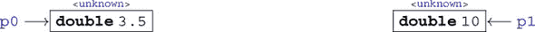

要访问它们，使用另一个与取地址运算符相反的构造：一元*对象*^C*运算符*“**`*`**”：`*`p0 对应于第一个参数的对象。在上一次调用中，那将是 d0，同样`*`p1 是对象 d1.^([[[Exs 1]](#ch11fn-ex01)])

> ^([Exs 1])
> 
> 编写一个函数，该函数接收指向三个对象的指针，并循环地移动这些对象的值。

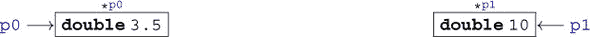

请注意，在`double_swap`的定义中，`*`字符扮演着两种不同的角色。在声明中，它创建了一个新类型（指针类型），而在表达式中，它*取消引用*^C 指向的对象，即指针*引用*^C 的对象。为了帮助区分这两个相同符号的用法，我们通常在它修改类型（如**`double`**`*`）时将`*`向左对齐且中间不留空格，如果它取消引用指针（`*`p0）时则向右对齐。

记住从第 6.2 节中提到的，除了持有有效的地址外，指针还可能是空或不确定的。

|  |
| --- |

##### 11.1 节要点

*使用不确定或空指针时会有未定义的行为。*

|  |
| --- |

然而，在实践中，这两种情况通常会表现出不同的行为。第一种可能会访问内存中的随机对象并修改它。这通常会导致难以追踪的 bug，因为它会进入它不应该进入的对象。第二种，如果指针为空，则会在开发早期就表现出来，并且会优雅地崩溃我们的程序。请将此视为一个特性。

#### 11.1.2\. 指针加法

我们已经看到，一个有效的指针持有其引用类型对象的地址，但实际上 C 语言假设的更多：

|  |
| --- |

##### 11.2 节要点

*有效的指针指向引用类型数组的第一个元素。*

|  |
| --- |

或者换句话说，指针不仅可以用来引用引用类型的单个实例，还可以用来引用长度为未知*n*的数组。

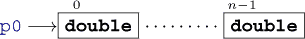

在语法上，指针和数组之间的这种纠缠关系又向前迈出了重要的一步。事实上，对于`double_swap`函数的指定，我们甚至可能不需要指针表示法。在我们已经使用的表示法中，它也可以写成

```
void double_swap(double p0[static 1], double p1[static 1]) {
  double tmp = p0[0];
  p0[0] = p1[0];
  p1[0] = tmp;
}
```

无论是使用数组表示法作为接口，还是使用`[0]`来访问第一个元素，都是简单的*重写操作*^C，这些操作都内置于 C 语言中。我们稍后会看到更多这方面的内容。

简单的加法运算允许我们访问数组的以下元素。此函数计算数组的所有元素之和：

```
double sum0(size_t len, double const* a) {
  double ret = 0.0;
  for (size_t i = 0; i < len; ++i) {
    ret += *(a + i);
  }
  return ret;
}
```

这里，表达式`a`+i 是一个指针，它指向数组的第*i*^(th)个元素：

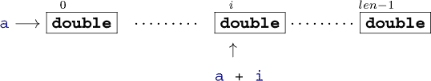

指针加法可以以不同的方式完成，所以以下函数以完全相同的顺序累加数组：

```
double sum1(size_t len, double const* a) {
  double ret = 0.0;
  for (double const* p = a; p < a+len; ++p) {
    ret += *p;
  }
  return ret;
}
```

```
double sum2(size_t len, double const* a) {
  double ret = 0.0;
  for (double const*const aStop = a+len; a < aStop; ++a) {
    ret += *a;
  }
  return ret;
}
```

在函数 sum1 的迭代 *i* 中，我们有以下情况：

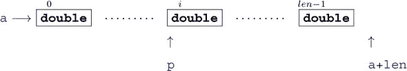

指针 p 遍历数组的元素，直到它大于或等于 a`+`len，这是第一个位于数组之外的指针值。

对于函数 sum2，我们有以下情况：

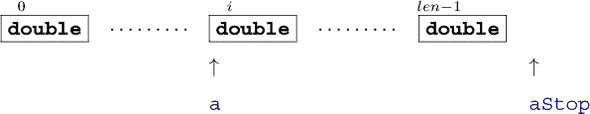

在这里，a 指向数组的 *i*^(th) 个元素。0^(th) 个元素在函数内部不再引用，但数组结束的信息保存在变量 aStop 中。

这些函数可以像以下这样调用：

```
double A[7] = { 0, 1, 2, 3, 4, 5, 6, };
double s0_7 = sum0(7, &A[0]);    // For the whole
double s1_6 = sum0(6, &A[1]);    // For the last 6
double s2_3 = sum0(3, &A[2]);    // For the 3 in the middle
```

不幸的是，没有方法知道隐藏在指针后面的数组长度，因此我们必须将长度作为参数传递给函数。我们在第 6.1.3 节中看到的**`sizeof`**技巧不起作用。

|  |
| --- |

##### 摘要 11.3

*数组对象的长度不能从指针中重建*。

|  |
| --- |

因此，这里我们看到与数组的一个主要区别。

|  |
| --- |

##### 摘要 11.4

*指针不是数组*。

|  |
| --- |

如果我们将数组通过指针传递给函数，保留数组的实际长度很重要。这就是为什么我们在这本书中更喜欢使用数组表示法作为指针接口：

```
double sum0(size_t len, double const a[len]);
double sum1(size_t len, double const a[len]);
double sum2(size_t len, double const a[len]);
```

这些指定了与之前显示的完全相同的接口，但它们向代码的普通读者阐明了 a 应该有 len 个元素。

#### 11.1.3\. 指针减法和差

我们之前讨论的指针算术主要涉及整数和指针的加法。还有一个相反的操作，可以从指针中减去一个整数。如果我们想向下遍历数组元素，我们可以使用这个：

```
double sum3(size_t len, double const* a) {
  double ret = 0.0;
  double const* p = a+len-1;
  do {
    ret += *p;
    --p;
  } while (p > a);
  return ret;
}
```

在这里，p 从 `a+(`len`-1)` 开始，在 *i*^(th) 次迭代中的情况如下：

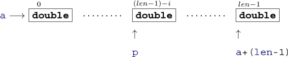

注意，这个函数中的求和顺序是反转的.^([1])

> ¹
> 
> 由于四舍五入的差异，结果可能略不同于本系列前三个函数。

还有一个操作，*指针差**^C*，它接受两个指针并计算它们之间元素数量的整数值。为了说明这一点，我们将 sum3 扩展到新版本，该版本检查错误条件（数组中的一个元素是无穷大）。在这种情况下，我们想要打印一个全面的错误信息并将罪魁祸首返回给调用者:^([2])

> ²
> 
> **`isinf`** 来自 `math.h` 头文件。

```
double sum4(size_t len, double const* a) {
  double ret = 0.0;
  double const* p = a+len-1;
  do {
    if (isinf(*p)) {
      fprintf(stderr,
             "element \%tu of array at \%p is infinite\n",
              p-a,           // Pointer difference!
              (void*)a);     // Prints the pointer value
      return *p;
    }
    ret += *p;
    --p;
  } while (p > a);
  return ret;
}
```

在这里，我们使用表达式 p`-`a 来计算数组中实际元素的位置。

这只允许两个指针指向同一数组对象的元素：

|  |
| --- |

##### 摘要 11.5

*只能从数组对象的元素中减去指针*。

|  |
| --- |

这种差值的值仅仅是相应数组元素的索引之差：

```
double A[4] = { 0.0, 1.0, 2.0, -3.0, };
double* p = &A[1];
double* q = &A[3];
assert(p-q == -2);
```

我们强调过，对于对象大小正确的类型是 **`size_t`**，这是一个无符号类型，在许多平台上与 **`unsigned`** 不同。这在指针差类型中也有对应：一般来说，我们不能假设一个简单的 **`int`** 就足够容纳所有可能的值。因此，标准头文件 `stddef.h` 为我们提供了另一个类型。在大多数架构上，它只是与 **`size_t`** 对应的有符号整数类型，但我们不必过于关心。

| |
| --- |

*所有指针差都有类型* **`ptrdiff_t`***.*

| 在早期（要点 11.1），我们看到了我们必须小心指针包含的地址（或没有包含的地址）。指针有一个值，即它们包含的地址，而这个值可能会改变。 |
| --- |
| 要点 11.8 |

##### 在大多数情况下，确保这一点最简单的方法是显式初始化指针变量（要点 6.22）。

|

| |
| --- |
| |

##### *使用* **`ptrdiff_t`** *来编码位置或大小的有符号差值。*

11.1.4\. 指针有效性

| |
| --- |

要点 11.7

| `<stddef.h>` |
| --- |

##### 函数 `sum4` 也展示了用于调试目的打印指针值的配方。我们使用格式字符 `%`p，并将指针参数通过 `(`**`void`**`*``)`a 转换为神秘的类型 **`void`**`*`。目前，将这个配方视为已知；我们还没有全部的负担来完全理解它（更多细节将在 第 12.4 节 中介绍）。

|

| |
| --- |

#### 要点 11.6

|

如果指针没有有效的地址，将其设置为 0 非常重要，不应被遗忘。这有助于检查和跟踪指针是否已被设置。

| *打印时，将指针值转换为* **`void`***`*`**，并使用格式* *`%`**`p`***。 |
| --- |

##### 我们看到了一些不同类型 *表示* 的例子：也就是说，平台在对象中存储特定类型值的方式。例如，类型 **`size_t`** 的表示可能对另一个类型，例如 **`double`**，完全无意义。只要我们只直接使用变量，C 的类型系统就会保护我们免受这些表示的任何混淆；一个 **`size_t`** 对象将始终按此类访问，永远不会被解释为（无意义的）**`double`**。

*尽快将指针变量设置为* *`0`* *。*

| |
| --- |

为了避免笨拙的比较（要点 3.3），在 C 程序中你经常会看到这样的代码：

```
char const* name = 0;

// Do something that eventually sets name

if (name) {
  printf("today's name is %s\n", name);
} else {
  printf("today we are anonymous\n");
}
```

因此，控制所有指针变量的状态非常重要。我们必须确保指针变量始终为空，除非它们指向我们想要操作的有效对象。

| 要点 11.10 |
| --- |

##### |

|

| |
| --- |

|

*指针有真值。*

如果我们不小心使用它们，指针可能会打破这个障碍，并导致我们尝试将**`size_t`**的表示解释为**`double`**。更普遍地说，C 甚至为当它们被解释为特定类型时没有意义的位模式创造了一个术语：该类型的*陷阱表示**^C*。这种用词（*trap*）是为了恐吓。

|  |
| --- |

##### Takeaway 11.11

*访问具有其类型陷阱表示的对象具有未定义的行为。*

|  |
| --- |

如果你这样做，会发生丑陋的事情，所以请不要尝试。

因此，不仅指针必须设置为一个对象（或空），而且这样的对象还必须具有正确的类型。

|  |
| --- |

##### Takeaway 11.12

*当解引用时，指向的对象必须是指定的类型。*

|  |
| --- |

作为直接后果，指向数组界限之外的指针不得被解引用：

```
double A[2] = { 0.0, 1.0, };
double* p = &A[0];
printf("element %g\n", *p); // Referencing object
++p;                        // Valid pointer
printf("element %g\n", *p); // Referencing object
++p;                        // Valid pointer, no object
printf("element %g\n", *p); // Referencing non-object
                            // Undefined behavior
```

在这里，在最后一行，p 的值超出了数组的界限。即使这可能是一个有效对象的地址，我们也不知道它指向的对象是什么。所以即使在这个点上 p 是有效的，将其内容作为**`double`**类型访问也没有意义，C 通常禁止这种访问。

在前面的例子中，指针加法本身是正确的，只要我们不访问最后一行的对象。指针的有效值是数组元素的地址*以及*数组之外的地址。否则，像例子中的那样使用指针加法的**`for`**循环将无法可靠地工作。

|  |
| --- |

##### Takeaway 11.13

*一个指针必须指向一个有效对象或一个有效对象之后的位置，或者为空。*

|  |
| --- |

因此，这个例子只工作到最后一行，因为最后的`++`p 将指针值留在了数组之后的一个元素。这个例子版本仍然遵循与之前类似的模式：

```
double A[2] = { 0.0, 1.0, };
double* p = &A[0];
printf("element %g\n", *p); // Referencing object
p += 2;                     // Valid pointer, no object
printf("element %g\n", *p); // Referencing non-object 
                           // Undefined behavior
```

而在这个最后的例子中，增量操作可能会导致崩溃：

```
double A[2] = { 0.0, 1.0, };
double* p = &A[0];
printf("element %g\n", *p); // Referencing object
p += 3;                     // Invalid pointer addition
                            // Undefined behavior
```

#### 11.1.5\. 空指针

你可能想知道，在所有关于指针的讨论中，为什么还没有使用宏**`NULL`**。原因是，不幸的是，“值为 0 的通用指针”这个简单概念并没有取得很好的成功。

C 有一个与任何指针类型的 0 值相对应的*空指针**^C*概念。在这里，

> ³
> 
> 注意*null*与**`NULL`**的不同大小写。

```
double const*const nix = 0;
double const*const nax = nix;
```

nix 和 nax 将是值为 0 的指针对象。但不幸的是，一个*空指针常数**^C*并不是你所期望的。

首先，这里的术语*constant*指的是编译时常数，而不是**`const`***-qualified*对象。因此，出于这个原因，指针对象*不是*空指针常数。其次，这些常数的允许类型受到限制：它可以是任何整数类型或**`void`**类型的常数表达式。不允许其他指针类型，我们将在第 12.4 节中了解那种“类型”的指针。

C 标准中对宏 **`NULL`** 的可能扩展定义相当宽松；它只需要是一个空指针常量。因此，C 编译器可以选择以下任何一个用于它：

| 扩展 | 类型 |
| --- | --- |
| 0U | **无符号** |
| 0 | **有符号** |
| '\0' |   |
| 值为 0 的枚举常量 |
| 0UL | **无符号长整型** |
| 0L | **有符号长整型** |
| 0ULL | **无符号长整型** |
| 0LL | **有符号长整型** |
| (**void***)0 | **void*** |

常用值是 `0`，`0`L，以及 `(`**`void`**`*``)0`。^([4])

> ⁴
> 
> 理论上，**`NULL`** 的可能扩展甚至更多，例如 `((`**`char`**`)+0)` 和 `((`**`short`**`)-0)`。

重要的是，**`NULL`** 后面的类型并没有由 C 标准规定。通常，人们用它来强调他们正在谈论的是一个指针常量，这在许多平台上并不是这样。在不完全掌握的情况下使用 **`NULL`** 甚至可能是危险的。这将在 第 16.5.2 节 中讨论的函数具有可变数量参数的上下文中出现。目前，我们将采取最简单的解决方案：

|  |
| --- |

##### 取得第 11.14 条经验

*不要使用**`NULL`***.*

|  |
| --- |

**`NULL`** 隐藏的比它阐明的多。要么使用 `0`，要么如果你真的想强调该值是一个指针，直接使用魔法令牌序列 `(`**`void`**`*``)0`。

### 11.2\. 指针和结构

结构类型的指针对于大多数 C 语言编程至关重要，因此已经制定了一些特定的规则和工具来简化这种典型用法。例如，让我们考虑一个任务，即规范化我们之前遇到的 **`struct`** **`timespec`**。在以下函数中使用指针参数允许我们直接操作对象：

##### `timespec.c`

```
**10**   /**
**11**    ** @brief compute a time difference
**12**    **
**13**    ** This uses a @c double to compute the time. If we want to
**14**    ** be able to track times without further loss of precision
**15**    ** and have @c double with 52 bit mantissa, this
**16**    ** corresponds to a maximal time difference of about 4.5E6
**17**    ** seconds, or 52 days.
**18**    **
**19**    **/
**20**   double timespec_diff(struct timespec const* later,
**21**                        struct timespec const* sooner){
**22**     /* Be careful: tv_sec could be an unsigned type */
**23**     if (later->tv_sec < sooner->tv_sec)
**24**       return -timespec_diff(sooner, later);
**25**     else
**26**       return
**27**          (later->tv_sec - sooner->tv_sec)
**28**          /* tv_nsec is known to be a signed type. */
**29**          + (later->tv_nsec - sooner->tv_nsec) * 1E-9;
**30**   }
```

为了方便，我们在这里使用一个新的运算符，`->`。其箭头符号旨在表示一个指针作为左操作数，指向底层 **`struct`** 的成员作为右操作数。它相当于 `*` 和 `..` 的组合。为了达到相同的效果，我们可能需要使用括号并写成 `(``*`a`).`**`tv_sec`** 而不是 `a->tv_sec`。这可能会很快变得有些笨拙，所以 `->` 运算符是大家普遍使用的。

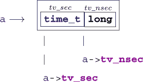

注意，像 `a->tv_nsec` 这样的结构不是指针，而是一个类型为 **`long`** 的对象，即这个数字本身。

作为另一个例子，让我们再次考虑我们在 第 10.2.2 节 中引入的有理数类型 rat。在 列表 10.1 中操作该类型指针的函数可以写成如下：

##### `rationals.c`

```
**95**   void rat_destroy(rat* rp) {
**96**     if (rp) *rp = (rat){ 0 };
**97**   }
```

函数 rat_destroy 确保对象中可能存在的所有数据都被擦除并设置为全零位 `0`：

##### `rationals.c`

```
 **99**   rat* rat_init(rat* rp,
**100**                 long long num,
**101**                 unsigned long long denom) {
**102**     if (rp) *rp = rat_get(num, denom);
**103**     return rp;
**104**   }
```

##### `rationals.c`

```
**106**   rat* rat_normalize(rat* rp) {
**107**     if (rp) *rp = rat_get_normal(*rp);
**108**     return rp;
**109**   }
```

##### `rationals.c`

```
**111**   rat* rat_extend(rat* rp, size_t f) {
**112**     if (rp) *rp = rat_get_extended(*rp, f);
**113**     return rp;
**114**   }
```

其他三个函数是围绕我们已知的纯函数的简单**包装器**。我们使用两个指针操作来测试有效性，然后，如果指针有效，就引用相关的对象。因此，即使指针参数为空，这些函数也可以安全使用。^([[[Exs 2]](#ch11fn-ex02)])^([[[Exs 3]](#ch11fn-ex03)])

> ^([Exs 2])
> 
> 实现函数 rat_print，如列表 10.1 中声明的那样。这个函数应该使用`->`来访问其 rat`*`参数的成员。打印输出应采用形式 –*nom*/*denum*。
> 
> ^([Exs 3])
> 
> 通过结合 rat_normalize 和 rat_print 实现 rat_print_normalized。

所有四个函数都会检查并返回它们的指针参数。这是一种方便的策略来组合这样的函数，正如我们可以在以下两个算术函数的定义中看到：

##### `rationals.c`

```
**135**   rat* rat_rma(rat* rp, rat x, rat y) {
**136**     return rat_sumup(rp, rat_get_prod(x, y));
**137**   }
```

函数 rat_rma（“有理数乘加”）全面展示了其目的：将两个其他函数参数的乘积加到 rp 所引用的对象上。它使用以下函数进行加法：

##### `rationals.c`

```
**116**   rat* rat_sumup(rat* rp, rat y) {
**117**     size_t c = gcd(rp->denom, y.denom);
**118**     size_t ax = y.denom/c;
**119**     size_t bx = rp->denom/c;
**120**     rat_extend(rp, ax);
**121**     y = rat_get_extended(y, bx);
**122**     assert(rp->denom == y.denom);
123
**124**     if (rp->sign == y.sign) {
**125**       rp->num += y.num;
**126**     } else if (rp->num > y.num) {
**127**       rp->num -= y.num;
**128**     } else {
**129**       rp->num = y.num - rp->num;
**130**       rp->sign = !rp->sign;
**131**     }
**132**     return rat_normalize(rp);
**133**   }
```

函数 rat_sumup 是一个更复杂的例子，其中我们应用了两个维护函数到指针参数上。^([[[Exs 4]](#ch11fn-ex04)])

> ^([Exs 4])
> 
> 实现函数 rat_dotproduct，使其从列表 10.1 计算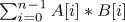，并将该值返回到`*`rp。

对于结构类型指针还有一个特殊的规则：即使结构类型本身是未知的，也可以使用它们。这种**不透明结构**^C*通常用于严格分离库的接口和实现。例如，一个虚构的类型 toto 可以在包含文件中如下表示：

```
/* forward declaration of struct toto */
struct toto;
struct toto* toto_get(void);
void toto_destroy(struct toto*);
void toto_doit(struct toto*, unsigned);
```

程序员和编译器都不需要更多东西来使用类型**`struct`** toto。函数 toto_get 可以用来获取类型**`struct`** toto 的对象指针，无论它在定义函数的编译单元中是如何定义的。编译器能够这样做是因为它知道所有结构指针都有相同的表示，无论底层类型的具体定义如何。

通常，这样的接口会使用 null 指针是特殊的事实。在之前的例子中，toto_doit`(0, 42)`可能是一个有效的用例。这就是为什么许多 C 程序员不喜欢将指针隐藏在**`typedef`**中：

```
/* forward declaration of struct toto_s and user type toto */
typedef struct toto_s* toto;
toto toto_get(void);
void toto_destroy(toto);
void toto_doit(toto, unsigned);
```

这段代码是有效的 C 代码，但它隐藏了`0`是一个特殊值，toto_doit 可能会接收到的这一事实。

|  |
| --- |

##### 取得 11.15

*不要将指针隐藏在**`typedef`**中*。

|  |
| --- |

这与我们之前所做的为**`struct`**引入一个**`typedef`**名称不同：

```
/* forward declaration of struct toto and typedef toto */
typedef struct toto toto;
toto* toto_get(void);
void toto_destroy(toto*);
void toto_doit(toto*, unsigned);
```

在这里，接口接收指针的事实仍然足够明显。

|  |
| --- |

**文本处理器**

对于一个文本处理器，你能使用双链表来存储文本吗？想法是通过一个包含字符串（用于文本）和指向先前和后续块的指针的**`struct`**来表示一个“文本块”。

你能构建一个函数，在给定点将文本块分成两部分吗？

一个将两个连续的文本块连接起来的？

一个将整个文本运行并通过每行一个文本块的形式呈现的？

你能创建一个函数来打印整个文本，或者打印直到文本因为屏幕大小而被截断吗？

| |
| --- |

### 11.3. 指针和数组

我们现在能够克服理解数组和指针之间关系的主要障碍：C 语言使用相同的语法进行指针和数组元素访问，并且它将函数的数组参数重写为指针。这两个特性为经验丰富的 C 程序员提供了方便的快捷方式，但对于新手来说可能有点难以消化。

#### 11.3.1. 数组和指针访问相同

以下语句无论 A 是数组还是指针都成立：

| |
| --- |

##### 11.16 节要点

*两个表达式* *A**`[`**`i`**]* *和* *`*`**`(`**`A`**`+`**`i`**`)`* *是等价的。*

| |
| --- |

如果它是一个指针，我们理解第二个表达式。这里，它只是说我们可以写出与 A`[`i`]`相同的表达式。将数组访问的概念应用到指针上应该可以提高你代码的可读性。等价性并不意味着突然在没有任何数组对象的地方出现了一个数组。如果 A 为空，A`[`i`]`应该优雅地崩溃，就像`*(`A`+`i`)`一样。

如果 A 是一个数组，`*(`A`+`i`)`展示了 C 语言中最重要规则之一的应用，称为*数组到指针退化*^C：

| |
| --- |

##### 11.17 节要点（数组退化）

*数组* *`A`* *的评估返回* *`&`**`A`**`[0]`**.*

| |
| --- |

事实上，这就是为什么没有“数组值”以及它们带来的所有困难（要点 6.3）。每当出现需要值的数组时，它都会退化成指针，我们就会失去所有额外的信息。

#### 11.3.2. 数组和指针参数相同

由于退化，数组不能作为函数参数。没有方法可以用数组参数调用这样的函数；在调用函数之前，我们传入的数组会退化成一个指针，因此参数类型不匹配。

但我们已经看到了具有数组参数的函数声明，那么它们是如何工作的呢？C 语言通过将数组参数重写为指针来规避这个问题。

| |
| --- |

##### 11.18 节要点

*在函数声明中，任何数组参数都会重写为一个指针。*

| |
| --- |

考虑这一点以及它对 C 语言编程的意义。理解这个“主要特性”（或性格缺陷）对于轻松编程至关重要。

回到我们第 6.1.5 节中的例子，使用数组参数编写的函数可以声明如下：

```
size_t strlen(char const* s);
char*  strcpy(char* target, char const* source);
signed strcmp(char const* s0, char const* s1);
```

这两种形式完全等价，任何 C 编译器都应该能够互换使用这两种形式。

使用哪种表示法是一个关于习惯、文化或其他社会背景的问题。在这本书中，我们遵循的规则是，如果我们认为数组表示法不能为空，就使用数组表示法；如果它对应于基类型的单个项，并且也可以为空以表示特殊条件，就使用指针表示法。

如果从语义上讲一个参数是一个数组，我们还注意如果可能的话，我们期望数组的大小是多少。为了使其成为可能，通常最好在数组/指针之前指定长度。一个如下的接口

```
double double_copy(size_t len,
                   double target[len],
                   double const source[len]);
```

这讲述了一个完整的故事。如果我们处理二维数组，这会变得更加有趣。一个典型的矩阵乘法可能看起来如下：

```
void matrix_mult(size_t n, size_t k, size_t m,
                 double C[n][m],
                 double A[n][k],
                 double B[k][m]) {
   for (size_t i = 0; i < n; ++i) {
     for (size_t j = 0; j < m; ++j) {
       C[i][j] = 0.0;
       for (size_t l = 0; l < k; ++l) {
         C[i][j] += A[i][l]*B[l][j];
       }
     }
   }
}
```

原型等同于不那么易读的，并注意一旦我们重写

```
void matrix_mult(size_t n, size_t k, size_t m,
                 double (C[n])[m],
                 double (A[n])[k],
                 double (B[k])[m]);
```

```
void matrix_mult(size_t n, size_t k, size_t m,
                 double (*C)[m],
                 double (*A)[k],
                 double (*B)[m]);
```

将最内层维度作为指针，参数类型不再是数组，而是一个*指向数组的指针*。因此，没有必要重写后续的维度。

|  |
| --- |

##### Takeaway 11.19

*只有数组参数的最内层维度会被重写。*

|  |
| --- |

最后，我们通过使用数组表示法获得了许多好处。我们无需任何麻烦就能将指向可变长度数组（VLA）的指针传递给函数。在函数内部，我们可以使用传统的索引来访问矩阵的元素。为了跟踪数组长度，不需要太多的技巧：

|  |
| --- |

##### Takeaway 11.20

*在数组参数之前声明长度参数。*

|  |
| --- |

它们必须在你首次使用它们的地方被知晓。

不幸的是，C 语言通常不保证具有数组长度参数的函数总是被正确调用。

|  |
| --- |

##### Takeaway 11.21

*函数的数组参数有效性必须由程序员保证。*

|  |
| --- |

如果数组长度在编译时已知，编译器可能能够发出警告。但是，当数组长度是动态的，你基本上只能靠自己：要小心。

### 11.4\. 函数指针

对于另一个可以使用取地址运算符`&`的结构，我们可以使用函数。我们在讨论**atexit**函数（第 8.7 节）时看到了这个概念的出现，这是一个接收函数参数的函数。规则与之前描述的数组衰减规则类似：

|  |
| --- |

##### Takeaway 11.22（函数衰减）

*一个没有后续开括号`(`的函数* f *衰减为其起始指针。*

|  |
| --- |

在类型声明和作为函数参数时，函数和函数指针在语法上与数组相似：

```
typedef void atexit_function(void);
// Two equivalent definitions of the same type, which hides a pointer
typedef atexit_function* atexit_function_pointer;
typedef void (*atexit_function_pointer)(void);
// Five equivalent declarations for the same function
void atexit(void f(void));
void atexit(void (*f)(void));
void atexit(atexit_function f);
void atexit(atexit_function* f);
void atexit(atexit_function_pointer f);
```

关于函数声明语义上等效的写法哪种更易读，这肯定是一个值得广泛讨论的话题。第二个版本，使用`(``*`f`)`括号，很快就会变得难以阅读；第五个版本则因为将指针隐藏在类型中而不被看好。在其他的写法中，我个人稍微更喜欢第四个版本，而不是第一个版本。

C 库有几个接收函数参数的函数。我们已经看到了**atexit**和**at_quick_exit**。`stdlib.h`中的另一对函数提供了搜索（**bsearch**）和排序（**qsort**）的通用接口：

| |
| --- |

`<stdlib.h>`

| |
| --- |

```
typedef int compare_function(void const*, void const*);

void* bsearch(void const* key, void const* base,
              size_t n, size_t size,
              compare_function* compar);

void qsort(void* base,
           size_t n, size_t size,
           compare_function* compar);
```

它们都接收一个数组基作为参数，并在其上执行任务。第一个元素的地址作为**`void`**指针传递，因此所有类型信息都丢失了。为了能够正确处理数组，函数必须知道单个元素的大小（size）和元素的数量（n）。

此外，它们接收一个比较函数作为参数，该参数提供了关于元素之间排序顺序的信息。通过使用这样的函数指针，**bsearch**和**qsort**函数非常通用，可以与任何允许对值进行排序的数据模型一起使用。基参数引用的元素可以是任何类型 T（**`int`**、**`double`**、字符串或应用定义），只要 size 参数正确描述了 T 的大小，并且只要指向 compar 的函数知道如何一致地比较类型 T 的值。

这种函数的一个简单版本看起来可能是这样的：

```
int compare_unsigned(void const* a, void const* b){
  unsigned const* A = a;
  unsigned const* B = b;
  if (*A < *B) return -1;
  else if (*A > *B) return +1;
  else return 0;
}
```

习惯上，两个参数指向要比较的元素，如果认为 a 小于 b，则返回值严格为负，如果它们相等，则返回`0`，否则严格为正。

返回类型为**`int`**似乎暗示着**`int`**的比较可以更简单地完成：

```
/* An invalid example for integer comparison */
int compare_int(void const* a, void const* b){
  int const* A = a;
  int const* B = b;
  return *A - *B;     // may overflow!
}
```

但这是不正确的。例如，如果`*`A 很大，比如说**`INT_MAX`**，而`*`B 是负数，那么差值的数学值可能大于**`INT_MAX`**。

由于存在**`void`**指针，使用这种机制时应该始终注意类型转换被封装，类似于以下内容：

```
/* A header that provides searching and sorting for unsigned. */

/* No use of inline here; we always use the function pointer. */
extern int compare_unsigned(void const*, void const*);

inline
unsigned const* bsearch_unsigned(unsigned const key[static 1],
                        size_t nmeb, unsigned const base[nmeb]) {
    return bsearch(key, base, nmeb, sizeof base[0], compare_unsigned);
}

inline
void qsort_unsigned(size_t nmeb, unsigned base[nmeb]) {
    qsort(base, nmeb, sizeof base[0], compare_unsigned);
}
```

在这里，**bsearch**（二分查找）搜索与 key`[0]`比较相等的元素并返回它，如果没有找到这样的元素，则返回一个空指针。它假设数组基础已经按照比较函数给出的顺序排序。这个假设有助于加快搜索速度。尽管这并没有在 C 标准中明确指定，但你可以预期对**bsearch**的调用不会超过*⌈*log2*⌉*次比较调用。

如果**bsearch**找到一个与`*`key 相等的数组元素，它将返回指向该元素的指针。请注意，这会在 C 的类型系统中钻一个洞，因为这将返回一个未限定的指向可能具有**`const`**限定符的元素的指针。请谨慎使用。在我们的例子中，我们简单地将返回值转换为**`unsigned const`**`*`，这样我们甚至不会在 bsearch_unsigned 的调用端看到未限定的指针。

**qsort**这个名字来源于**快速排序**算法。标准并没有强制选择排序算法，但预期的比较调用次数应该与*n* log2 的数量级相当，就像快速排序一样。没有对上限的保证；你可以假设其最坏情况复杂度至多为二次方，*O*(*n*²)。

虽然有一个通用的指针类型**`void`**`*`，可以用作对象类型的通用指针，但没有这样的通用类型或隐式转换存在于函数指针中。

| |
| --- |

##### **总结 11.23**

*函数指针必须使用其确切类型。*

| |
| --- |

这样的严格规则是必要的，因为具有不同原型函数的调用约定可能相当不同^([5])，而指针本身并不跟踪任何这些。

> ⁵
> 
> 例如，平台应用程序二进制接口（ABI）可能通过特殊硬件寄存器传递浮点数。

以下函数存在一个微妙的问题，因为参数的类型与我们期望的比较函数的类型不同：

```
/* Another invalid example for an int comparison function */
int compare_int(int const* a, int const* b){
  if (*a < *b) return -1;
  else if (*a > *b) return +1;
  else return 0;
}
```

当你尝试使用此函数与**qsort**一起时，你的编译器应该会抱怨该函数类型不正确。我们之前给出的使用中间**`void const`**`*`参数的变体应该几乎与这个无效示例一样高效，但它也可以保证在所有 C 平台上都是正确的。

*调用*函数和函数指针使用`(...)`运算符的规则与数组和指针以及`[...]`运算符的规则类似：

| |
| --- |

##### **总结 11.24**

*函数调用运算符* *`(...)`* *适用于函数指针。*

| |
| --- |

```
double f(double a);

// Equivalent calls to f, steps in the abstract state machine
f(3);        // Decay → call
(&f)(3);     // Address of → call
(*f)(3);     // Decay → dereference → decay → call
(*&f)(3);    // Address of → dereference → decay → call
(&*f)(3);    // Decay → dereference → address of → call
```

所以从技术上来说，在抽象状态机的术语中，指针退化总是执行的，并且通过函数指针调用函数。第一个，“自然”的调用有一个对 f 标识符的隐藏评估，这导致了函数指针。

考虑到所有这些，我们可以几乎像使用函数一样使用函数指针：

```
// In a header
typedef int logger_function(char const*, ...);
extern logger_function* logger;
enum logs { log_pri, log_ign, log_ver, log_num };
```

这声明了一个全局变量 logger，它将指向一个打印日志信息的函数。使用函数指针将允许此模块的用户动态地选择特定的函数：

```
// In a .c file (TU)
extern int logger_verbose(char const*, ...);
static
int logger_ignore(char const*, ...) {
  return 0;
}
logger_function* logger = logger_ignore;

static
logger_function* loggers = {
  [log_pri] = printf,
  [log_ign] = logger_ignore,
  [log_ver] = logger_verbose,
};
```

在这里，我们正在定义实现此方法的工具。特别是，函数指针可以用作数组（此处为 loggers）的基本类型。注意，我们使用两个外部函数（**printf**和 logger_verbose）和一个**`static`**函数（logger_ignore）来初始化数组：存储类不是函数接口的一部分。

logger 变量可以被分配，就像任何其他指针类型一样。在启动时，我们可能有

```
if (LOGGER < log_num) logger = loggers[LOGGER];
```

然后，这个函数指针可以在任何地方用来调用相应的函数：

```
logger("Do we ever see line \%lu of file \%s?", __LINE__+0UL, __FILE__);
```

这个调用使用了特殊的宏**`__LINE__`**和**`__FILE__`**来表示行号和源文件名。我们将在第 16.3 节中更详细地讨论这些内容。

当使用函数指针时，你应该始终意识到这样做会在函数调用中引入间接引用。编译器首先必须获取 logger 的内容，然后才能调用它在其中找到的地址。这有一定的开销，应该避免在时间敏感的代码中这样做。

|  |
| --- |

**通用导数**

你能将实数和复数导数（挑战 2 和 5）扩展，以便它们接收函数 F 和值 x 作为参数吗？

你能使用通用实数导数来实现牛顿法来寻找根吗？

你能找到多项式的实数零点吗？

你能找到多项式的复数零点吗？

|  |
| --- |
|  |

**通用排序**

你能将你的排序算法（挑战 1）扩展到其他排序键吗？

你能将针对不同排序键的函数压缩为与 **qsort** 具有相同签名的函数：即，接收数据、大小信息和比较函数作为参数的通用指针？

你能将你的排序算法的性能比较（挑战 10）扩展到 C 库函数 **qsort** 吗？

|  |
| --- |

### 摘要

+   指针可以指向对象和函数。

+   指针不是数组，但指向数组。

+   函数的数组参数自动重写为对象指针。

+   函数的函数参数自动重写为函数指针。

+   函数指针类型在赋值或调用时必须完全匹配。

## 第十二章。C 内存模型

本章涵盖

+   理解对象表示

+   使用无类型指针和类型转换操作

+   使用有效类型和对齐限制对象访问

指针为我们提供了一种对程序执行的环境和状态的抽象，即 *C 内存模型*。我们可以在（几乎）所有对象上应用一元运算符 `&` 来检索它们的地址，并使用它来检查和改变我们的执行状态。

> ¹
> 
> 只有使用关键字 **`register`** 声明的对象没有地址；参见 第 13.2.2 节 关于 第 2 层。

通过指针访问对象仍然是一种抽象，因为从 C 的角度来看，没有对对象的“真实”位置的区分。它可能位于你的计算机的 RAM 中，或者在一个磁盘文件中，或者对应于月球上温度传感器的 IO 端口；你不应该关心。C 应该做正确的事情，不管怎样。

事实上，在现代操作系统上，通过指针获得的所有内容都是所谓的 *虚拟内存*，基本上是一种虚构，它将你的进程的 *地址空间* 映射到机器的物理内存地址。所有这些都是为了确保你的程序执行的一定属性：

+   ***便携性：*** 你不需要关心特定机器上的物理内存地址。

+   ***安全：*** 读取或写入你进程不拥有的虚拟内存将不会影响你的操作系统或任何其他进程。

C 必须关注的唯一事情是指针指向的对象的 *类型*。每个指针类型都源自另一个类型，即其基类型，并且每种这样的派生类型都是一个新的独立类型。

##### 图 12.1. **int32_t** 的值-内存模型的不同级别。将此类型映射到具有二进制补码符号表示和小端对象表示的 32 位有符号整数的平台示例。

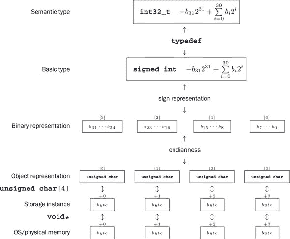

| |
| --- |

##### 摘要 12.1

*具有不同基类型的指针类型是不同的*。

| |
| --- |

除了提供物理内存的虚拟视图外，内存模型还简化了对象本身的视图。它假定每个对象是一系列字节，即 *对象表示* (章节 12.1)；^([2])参见 图 12.1 以了解示意图。检查这种对象表示的方便工具是 *联合* (章节 12.2)。直接访问对象表示 (章节 12.3) 允许我们做一些微调；但另一方面，这也打开了抽象机器状态的不希望或故意的操作之门：用于此的工具是无类型指针 (章节 12.4) 和类型转换 (章节 12.5)。有效的类型 (章节 12.6) 和对齐 (章节 12.7) 描述了此类操作的形式限制和平台约束。

> ²
> 
> 对象表示与我们在 章节 5.1.3 中看到的 *二进制表示* 相关，但不是同一件事。

### 12.1. 统一内存模型

尽管通常所有对象都有类型，但内存模型做了另一个简化：即所有对象都是 *字节**^C* 的集合。我们在数组上下文中引入的 **`sizeof`** 运算符用于衡量对象的大小，即它使用的字节数。有三种类型在定义上恰好使用一个字节的内存：字符类型 **`char`**、**`unsigned char`** 和 **`signed char`**。

| |
| --- |

##### 摘要 12.2

*`sizeof(char)`* *定义为* *`1`*。

| |
| --- |

不仅所有对象都可以在较低级别上按字符类型“计算”大小，它们甚至可以像这样的字符类型数组一样进行检查和操作。稍后我们将看到如何实现这一点，但此时我们只需注意以下内容：

| |
| --- |

##### 摘要 12.3

*每个对象* *`A`* *都可以被视为* **`unsigned char`***`[`***`sizeof`** *A**`]`*。

| |
| --- |
| |

##### 摘要 12.4

*字符类型的指针是特殊的*。

| |
| --- |

不幸的是，用于组成所有其他对象类型的类型都派生自 **`char`**，这是我们查看字符串字符的类型。这仅仅是一个历史事件，你不应该对此过分解读。特别是，你应该清楚地区分两种不同的使用场景。

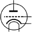

|  |
| --- |

##### 取得要点 12.5

*使用类型* **`char`** *用于字符和字符串数据。*

|  |
| --- |
|  |

##### 取得要点 12.6

*使用类型* **`unsigned char`** *作为所有对象类型的原子。*

|  |
| --- |

类型 **`signed char`** 比其他两种类型的重要性要小得多。

正如我们所见，**`sizeof`**运算符根据对象占用多少**`unsigned char`**来计算对象的大小。

|  |
| --- |

##### 取得要点 12.7

*`sizeof`* *运算符可以应用于对象和对象类型。*

|  |
| --- |

在之前的讨论中，我们还可以区分两种 **`sizeof`** 的语法变体：带括号和不带括号。虽然应用于对象的语法可以有两种形式，但类型的语法需要括号：

|  |
| --- |

##### 取得要点 12.8

*类型* *`T`* *的所有对象的大小由* **`sizeof`***`(`**`T`**`)`**.* *给出*。

|  |
| --- |

### 12.2\. 联合

让我们看看如何检查对象的单个字节。我们首选的工具是 **`union`**。这些在声明上与 **`struct`** 类似，但具有不同的语义：

##### `endianness.c`

```
**2**   #include <inttypes.h>
**3**
**4**   typedef union unsignedInspect unsignedInspect;
**5**   union unsignedInspect {
**6**     unsigned val;
**7**     unsigned char bytes[sizeof(unsigned)];
**8**   };
**9**   unsignedInspect twofold = { .val = 0xAABBCCDD, };
```

这里的区别是，这样的**`union`**不会将不同类型的对象收集到一个更大的对象中，而是*覆盖*具有不同类型解释的对象。这样，它就是检查另一种类型对象的单个字节的最佳工具。

让我们首先尝试弄清楚我们期望的各个字节的值。在轻微的语言滥用中，让我们将对应于字节的未签名字段称为*表示数字*。由于我们将字节视为**`unsigned char`**类型，它们的值可以是`0` . . . **`UCHAR_MAX`**，包括，因此我们将数字解释为以**`UCHAR_MAX`**`+1`为基数。在示例中，在我的机器上，类型**`unsigned`**的值可以用**`sizeof`**`(`**`unsigned`**`) == 4`这样的表示数字表示，我选择了最高到最低顺序的表示数字`0xAA`、`0xBB`、`0xCC`和`0xDD`。完整的**`unsigned`**值可以使用以下表达式计算，其中**`CHAR_BIT`**是字符类型中的位数：

```
**1**   ((0xAA << (CHAR_BIT*3))
**2**       |(0xBB << (CHAR_BIT*2))
**3**       |(0xCC << CHAR_BIT)
**4**       |0xDD)
```

使用之前定义的 **`union`**，我们可以从两个不同的角度观察同一个双向对象：双向.val 将其表示为**`unsigned`**，而双向.bytes 将其表示为一个**`unsigned char`**数组。由于我们选择了双向.bytes 的长度正好等于双向.val 的大小，它正好表示其字节，因此为我们提供了检查**`unsigned`**值**对象表示**的方法：所有其表示数字：

##### `endianness.c`

```
**12**      printf("value is 0x%.08X\n", twofold.val);
**13**      for (size_t i = 0; i < sizeof twofold.bytes; ++i)
**14**        printf("byte[%zu]: 0x%.02hhX\n", i, twofold.bytes[i]);
```

在我的计算机上，我得到的结果如下所示：^([3])

> ³
> 
> 在你自己的机器上测试代码。

##### `终端`

```
**0**      ~/build/modernC% code/endianness
**1**      value is 0xAABBCCDD
**2**      byte[0]: 0xDD
**3**      byte[1]: 0xCC
**4**      byte[2]: 0xBB
**5**      byte[3]: 0xAA
```

对于我的机器，我们看到输出首先打印整数的低位表示数字，然后是次低位数字，依此类推。最后，打印最高位数字。因此，在我的机器上，此类整数的内存表示中，低位表示数字位于高位表示数字之前。

这不是标准化的，而是实现定义的行为。

|  |
| --- |

##### 12.9 总结

*算术类型的表示数字的内存顺序是实现定义的*。

|  |
| --- |

也就是说，平台提供商可能会决定提供一个存储顺序，首先存储最高位数字，然后逐个打印低位数字。存储顺序，即 *字节序**^C*，如我的机器所示，称为 *小端序**^C*。一个首先存储高位表示数字的系统称为 *大端序**^C*。^([4]) 两种顺序在现代处理器类型中都很常见。一些处理器甚至能够在运行时在这两种顺序之间切换。

> ⁴
> 
> 这些名称来源于数字的大或小“端”首先存储的事实。

之前的输出还显示了另一个实现定义的行为：我使用了我的平台的一个特性，即一个表示数字可以通过使用两个十六进制数字来很好地打印。换句话说，我假设 **`UCHAR_MAX`**`+1` 是 `256`，并且一个 **`unsigned char`**，**`CHAR_BIT`** 的值位是 `8`。同样，这也是实现定义的行为：尽管大多数平台都有这些属性，^([5]) 但仍然有一些平台具有更宽的字类型。

> ⁵
> 
> 尤其是所有 POSIX 系统。

|  |
| --- |

##### 12.10 总结

*在大多数架构中，* **`CHAR_BIT`** *是* *`8`* *并且* **`UCHAR_MAX`** *是* *`255`**.*

|  |
| --- |

在示例中，我们研究了最简单的算术基类型，无符号整数的内存表示。其他基类型有更复杂的内存表示：有符号整数类型必须编码符号；浮点类型必须编码符号、尾数和指数；指针类型可能遵循适合底层架构的任何内部约定.^([[[Exs 1]](#ch12fn-ex01)])^([[[Exs 2]](#ch12fn-ex02)])^([[[Exs 3]](#ch12fn-ex03)])

> ^([Exs 1])
> 
> 设计一个类似的 **`union`** 类型来调查指针类型的字节，例如 **`double`**`*`。
> 
> ^([Exs 2])
> 
> 使用这样的 **`union`**，调查数组中连续两个元素的地址。
> 
> ^([Exs 3])
> 
> 比较不同执行中相同变量的地址。

### 12.3. 内存和状态

所有对象的价值构成了抽象状态机的状态，因此也是特定执行的状态。C 的内存模型通过`&`操作符为（几乎）所有对象提供了一个类似唯一的位置，并且可以通过指针从程序的不同部分访问和修改该位置。

这样做使得确定一个执行过程的抽象状态变得非常困难，在许多情况下甚至是不可能的：

在这里，我们（以及编译器）只看到了函数 blub 的声明，没有定义。因此，我们无法得出太多关于该函数对其参数指向的对象做了什么结论。特别是，我们不知道变量 d 是否被修改，因此 c `+` d 的值可以是任何值。程序实际上必须检查内存中的对象 d，以找出 blub 调用后的值。

现在，让我们看看这样一个接收两个指针参数的函数：

```
**1**   double blub(double const* a, double* b);
**2**
**3**   int main(void) {
**4**     double c = 35;
**5**     double d = 3.5;
**6**     printf("blub is %g\n", blub(&c, &d));
**7**     printf("after blub the sum is %g\n", c + d);
**8**   }
```

```
**1**   double blub(double const* a, double* b) {
**2**     double myA = *a;
**3**     *b = 2*myA;
**4**     return *a;      // May be myA or 2*myA
**5**   }
```

此类函数可以在两种不同的假设下运行。首先，如果用两个不同的地址作为参数调用，`*a`将保持不变，返回值将与 myA 相同。但如果两个参数都是相同的，例如如果调用是 blub(`&c`, `&c`)，对`*b`的赋值也会改变`*a`。

通过不同的指针访问相同对象的现象称为*别名**^C*；它是错过优化的常见原因。在这两种情况下，无论是两个指针始终别名还是它们永远不会别名，执行的抽象状态都会大大减少，优化器通常可以充分利用这一知识。因此，C 强制限制可能的别名仅为相同类型的指针。

| |
| --- |

##### 总结 12.11（别名）

*除了字符类型外，只有相同基类型的指针可以别名。*

| |
| --- |

要看到这条规则的实际效果，考虑对我们之前的例子进行轻微的修改：

```
**1**   size_t blob(size_t const* a, double* b) {
**2**     size_t myA = *a;
**3**     *b = 2*myA;
**4**     return *a;       // Must be myA
**5**   }
```

因为这里两个参数的类型不同，C *假设*它们不指向同一对象。实际上，将函数作为 blob(`&e`, `&e`)调用将是错误的，因为这永远不会匹配 blob 的原型。因此，在**`return`**语句中，我们可以确信对象`*a`没有改变，并且我们已经在变量 myA 中持有所需的价值。

有一些方法可以欺骗编译器，并用指向同一对象的指针调用此类函数。我们将在稍后看到一些这些技巧。不要这样做：这是一条通往许多痛苦和绝望的道路。*如果*这样做，程序的行为将是不确定的，因此你必须保证（证明！）没有别名发生。

相反，我们应该尝试编写我们的程序，以保护我们的变量免受别名的影响，并且有一个简单的方法可以实现这一点。

| |
| --- |

##### 总结 12.12

*避免使用* *`&`* *操作符。*

| |
| --- |

根据给定变量的属性，编译器可能会发现变量的地址永远不会被取用，因此变量根本不能别名。在第 13.2 节中，我们将看到哪些变量的属性或对象可能影响此类决策，以及**`register`**关键字如何保护我们免受意外取地址的影响。稍后，在第 15.2 节中，我们将看到**`restrict`**关键字如何允许我们指定指针参数的别名属性，即使它们具有相同的基类型。

### 12.4. 指向非特定对象的指针

正如我们所见，对象表示提供了将对象 X 视为一个**`unsigned char`**`[`**`sizeof`** X`]`数组的视图。该数组的起始地址（类型为**`unsigned char`**`*`）提供了访问去除原始类型信息的内存的途径。

C 语言发明了一种强大的工具来更通用地处理此类指针。这些是指向一种*非类型*，**`void`**的指针。

| |
| --- |

##### 摘要 12.13

*任何对象指针都可以转换为**`void`***`*`**并从其转换回来*。

| |
| --- |

注意，这仅涉及对象指针，而不是函数指针。想象一个**`void`**`*`指针，它持有现有对象的地址，就像一个指向*存储实例*的指针，该实例包含对象；参见图 12.1。作为此类层次结构的类比，你可以将电话簿中的条目想象成这样：一个人的名字对应于指向对象的标识符；他们与“手机”、“家庭”或“工作”条目的分类对应于类型；而他们的电话号码本身则是一种地址（其中，通常你对此不感兴趣）。但是，即使电话号码也抽象掉了其他电话具体位置的信息（这将是对象下面的存储实例），或者关于其他电话本身的特定信息，例如它是否是固定电话还是移动网络，以及网络需要做什么才能实际上将你连接到另一端的某人。

| |
| --- |

##### 摘要 12.14

*一个对象具有存储、类型和值*。

| |
| --- |

不仅转换为**`void`**`*`是明确定义的，而且它还保证了与指针值的行为良好。

| |
| --- |

##### 摘要 12.15

*将对象指针转换为**`void`***`*`**然后再转换回相同类型是恒等操作*。

| |
| --- |

因此，当我们转换为**`void`**`*`时，唯一失去的是类型信息；值保持不变。

| |
| --- |

##### 摘要 12.16 (a**void*²**)

*`void`***`*`.*

| |
| --- |

它完全移除了与地址相关联的任何类型信息。尽可能避免使用它。反过来，情况则不那么关键，特别是如果你有一个返回**`void`**`*`的 C 库调用。

**`void`**作为一个单独的类型不应用于变量声明，因为它不会导致我们可以对其执行任何操作的对象。

### 12.5. 显式转换

查看对象 X 的对象表示的一个方便方法是将指向 X 的指针以某种方式转换为**`unsigned char`**`*`类型的指针：

```
   double X;
   unsigned char* Xp = &X; // error: implicit conversion not allowed
```

幸运的是，不允许将**`double`**`*`隐式转换为**`unsigned char`**`*`。我们必须以某种方式明确地进行这种转换。

我们已经看到，在许多地方，某种类型的值会隐式转换为另一种类型的值（第 5.4 节），并且窄整数类型在执行任何操作之前首先转换为**`int`**。考虑到这一点，窄类型只在非常特殊的情况下才有意义：

+   你必须节省内存。你需要使用一个非常大的小值数组。这里的*非常大*意味着可能是数百万或数十亿。在这种情况下，存储这些值可能会给你带来一些好处。

+   你使用**`char`**来表示字符和字符串。但然后你不会对它们进行算术运算。

+   你使用**`unsigned char`**来检查对象的字节。但然后，再次，你不会对它们进行算术运算。

指针类型的转换更为微妙，因为它们可能会改变对象的类型解释。对于数据指针，只允许两种形式的隐式转换：从和到**`void`**`*`的转换，以及向目标类型添加限定符的转换。让我们看看一些例子：

```
**1**   float f = 37.0;        // Conversion: to float
**2**   double a = f;          // Conversion: back to double
**3**   float* pf = &f;        // Exact type
**4**   float const* pdc = &f; // Conversion: adding a qualifier
**5**   void* pv = &f;         // Conversion: pointer to void*
**6**   float* pfv = pv;       // Conversion: pointer from void*
**7**   float* pd = &a;        // Error: incompatible pointer type
**8**   double* pdv = pv;      // Undefined behavior if used
```

前两个使用**`void`**`*`（pv 和 pfv）的转换已经有点棘手了：我们来回转换指针，但我们要注意 pfv 的目标类型必须与 f 相同，这样一切才能顺利进行。

然后是错误的部分。在 pd 的初始化中，编译器可以保护我们免受严重错误的侵害：将指针赋给具有不同大小和解释的类型可以并且将会导致严重损坏。任何符合规范的编译器*必须*对这一行给出诊断。正如你现在已经很好地理解的那样，你的代码不应该产生编译器警告（要点 1.4），你知道你应该在修复这种错误之前继续下去。

最后一行更糟糕：它有一个错误，但这个错误在语法上是正确的。这个错误可能没有被察觉的原因是，我们为 pv 的第一次转换已经从指针中移除了所有类型信息。所以，一般来说，编译器无法知道指针后面的对象类型是什么。

除了我们之前看到的隐式转换之外，C 还允许我们使用*类型转换符*（*casts**^C*）显式转换。使用类型转换符，你是在告诉编译器你比它更了解情况，即指针后面的对象类型不是它所认为的那样，并且它应该闭嘴。在我遇到的大多数实际用例中，编译器是对的，程序员是错的：即使是经验丰富的程序员也倾向于滥用类型转换来隐藏有关类型的糟糕设计决策。

> ⁶
> 
> 表达式 X 转换为类型 T 的形式为 (`T`)X。把它想象成“*施法*”。

|  |
| --- |

##### 要点 12.17

*不要使用类型转换*。

|  |
| --- |

它们剥夺了你宝贵的信息，如果你仔细选择类型，你将只需要它们在非常特殊的情况下。

有一种情况是这样的，当你想检查对象的字节级内容时。正如我们在 第 12.2 节 中看到的，围绕一个对象构造一个 **`union`** 可能并不总是可能（或者可能过于复杂），因此这里我们可以选择进行类型转换：

##### `endianness.c`

```
**15**      unsigned val = 0xAABBCCDD;
**16**      unsigned char* valp = (unsigned char*)&val;
**17**      for (size_t i = 0; i < sizeof val; ++i)
**18**        printf("byte[%zu]: 0x%.02hhX\n", i, valp[i]);
```

在那个方向（从“对象指针”到“字符类型指针”），类型转换大多是无害的。

### 12.6. 有效类型

为了应对指针可能提供的相同对象的多种视图，C 语言引入了有效类型的概念。它极大地限制了对象可以如何被访问。

|  |
| --- |

##### 要点 12.18（有效类型）

*对象的有效成员类型可以在任何时候访问，只要字节表示是访问类型的有效值*。

|  |
| --- |

因为 **`union`** 变量的有效类型是 **`union`** 类型，而不是任何成员类型，所以 **`union`** 成员的规则可以放宽：

|  |
| --- |

##### 要点 12.19

*只要字节表示是访问类型的有效值，任何具有有效**`union`**类型的对象成员都可以在任何时候访问*。

|  |
| --- |

对于我们迄今为止看到的所有对象，确定有效类型很容易：

|  |
| --- |

##### 要点 12.20

*变量的有效类型是其声明的类型*。

|  |
| --- |

之后，我们将看到另一类稍微复杂一些的对象。

注意，这个规则没有例外，我们也不能改变这种变量或复合字面量的类型。

|  |
| --- |

##### 要点 12.21

*变量和复合字面量必须通过其声明的类型或通过字符类型的指针来访问*。

|  |
| --- |

还要注意所有这些字符类型中的不对称性。任何对象都可以被视为由 **`unsigned char`** 组成，但没有任何 **`unsigned char`** 数组可以通过其他类型来使用：

```
   unsigned char A[sizeof(unsigned)] = { 9 };
   // Valid but useless, as most casts are
   unsigned* p = (unsigned*)A;
   // Error: access with a type that is neither the effective type nor a
   // character type
   printf("value \%u\n", *p);
```

在这里，访问 `*p` 是一个错误，之后的程序状态是未定义的。这与我们之前对 **`union`** 的处理形成鲜明对比：参见 第 12.2 节，在那里我们实际上可以将字节序列视为一个 **`unsigned char`** 或 **`unsigned`** 的数组。

严格的规则有多个原因。在 C 标准中引入有效类型的最初动机是为了处理别名，正如我们在 第 12.3 节 中看到的。实际上，别名规则（要点 12.11）是从有效类型规则（要点 12.18）派生出来的。只要没有 **`union`** 参与，编译器就知道我们不能通过 **`size_t`** 访问 **`double`**，因此它可能会 *假设* 对象是不同的。

### 12.7. 对齐

指针转换的反向方向（从“字符类型指针”到“对象指针”）根本不是无害的，不仅仅是因为可能存在别名。这与 C 内存模型的另一个属性有关：*对齐**^C*。大多数非字符类型对象不能从任意字节位置开始；它们通常从*字边界**^C*开始。类型的对齐描述了该类型对象可以开始的可能的字节位置。

如果我们强制某些数据到错误的对齐，会发生真正糟糕的事情。为了看到这一点，请查看以下代码：

```
 **1**   #include <stdio.h>
 **2**   #include <inttypes.h>
 **3**   #include <complex.h>
 **4**   #include "crash.h"
 **5**
 **6**   void enable_alignment_check(void);
 **7**   typedef complex double cdbl;
 **8**
 **9**   int main(void) {
**10**     enable_alignment_check();
**11**     /* An overlay of complex values and bytes. */
**12**     union {
**13**       cdbl val[2];
**14**       unsigned char buf[sizeof(cdbl[2])];
**15**     } toocomplex = {
**16**       .val = { 0.5 + 0.5*I, 0.75 + 0.75*I, },
**17**     };
**18**     printf("size/alignment: %zu/%zu\n",
**19**            sizeof(cdbl), _Alignof(cdbl));
**20**     /* Run over all offsets, and crash on misalignment. */
**21**     for (size_t offset = sizeof(cdbl); offset; offset /=2) {
**22**       printf("offset\t%zu:\t", offset);
**23**       fflush(stdout);
**24**       cdbl* bp = (cdbl*)(&toocomplex.buf[offset]); // align!
**25**       printf("%g\t+%gI\t", creal(*bp), cimag(*bp));
**26**       fflush(stdout);
**27**       *bp *= *bp;
**28**       printf("%g\t+%gI", creal(*bp), cimag(*bp));
**29**       fputc('\n', stdout);
**30**     }
**31**   }
```

这是从一个类似于我们之前看到的**`union`**声明开始的。再次强调，我们有一个数据对象（在这种情况下是类型为**`complex`** **`double`**`[2]`的对象），我们用**`unsigned char`**数组覆盖它。除了这部分稍微复杂一些之外，乍一看并没有什么大问题。但是，如果我在我的机器上执行这个程序，我会得到

##### `Terminal`

```
**0**   ~/.../modernC/code (master % u=) 14:45 <516>$ ./crash
**1**   size/alignment: 16/8
**2**   offset 16: 0.75 +0.75I 0 +1.125I
**3**   offset 8: 0.5 +0I 0.25 +0I
**4**   offset 4: Bus error
```

程序崩溃，显示为*总线错误**^C*，这是“数据总线对齐错误”的快捷方式。真正的问题行是

##### `crash.c`

```
**23**       fflush(stdout);
**24**       cdbl* bp = (cdbl*)(&toocomplex.buf[offset]); // align!
```

在右侧，我们看到一个指针转换：将**`unsigned char`**`*`转换为**`complex`** **`double`**`*`。通过围绕它的**`for`**循环，这个转换从 toocomplex 的开始字节偏移量 offset 执行。这些是 2 的幂：`16`、`8`、`4`、`2`和`1`。如上输出所示，似乎**`complex`** **`double`**对于其大小的一半的对齐仍然表现良好，但是当对齐为四分之一时，程序崩溃。

一些架构对不匹配的容忍度比其他架构更高，我们可能需要强制系统在出现此类条件下出错。我们在开始时使用以下函数来强制崩溃：

|  |
| --- |

`crash.c`

enable_alignment_check: 为 i386 处理器启用对齐检查

英特尔 i386 处理器系列在接受数据不匹配方面相当宽容。这可能导致在其他不那么宽容的架构上移植时出现令人烦恼的 bug。

此函数还启用了对该系列或处理器的此类问题的检查，这样你可以确保及早发现此问题。

我在 Ygdrasil 的博客上找到了这段代码：`http://orchistro.tistory.com/206`

```
void enable_alignment_check(void);
```

|  |
| --- |

如果你对便携式代码感兴趣（而且如果你还在这里，你很可能感兴趣），在开发阶段的早期错误实际上是非常有帮助的.^([7]) 因此，考虑崩溃一个功能。参见`crash.h`中提到的博客条目，其中对这一主题进行了有趣的讨论。

> ⁷
> 
> 对于该函数内部使用的代码，请查阅`crash.h`的源代码以进行检查。

在前面的代码示例中，我们还看到了一个新的运算符，**`alignof`**（或者如果你没有包含`stdalign.h`，则为**`_Alignof`**），它为我们提供了特定类型的对齐。你很少会在实际代码中找到使用它的场合。

|  |
| --- |

`<stdalign.h>`

|  |
| --- |

另一个关键字可以用来强制在指定的对齐方式下进行分配：**`alignas`**（分别，**`_Alignas`**）。它的参数可以是类型或表达式。如果你知道你的平台可以在数据以某种方式对齐的情况下更有效地执行某些操作，这可能是有用的。

例如，为了强制将一个**`complex`**变量的对齐方式设置为与其大小一致，而不是之前看到的一半大小，你可以使用

```
alignas(sizeof(**complex** double)) complex double z;
```

或者如果你知道你的平台对**`float`**`[4]`数组有高效的向量指令：

```
alignas(sizeof(float[4])) float fvec[4];
```

这些运算符不能帮助克服有效类型规则（要点 12.18）。即使有

```
alignas(unsigned) unsigned char A[sizeof(unsigned)] = { 9 };
```

第 12.6 节末尾的例子仍然无效。

### 概述

+   内存和对象模型有多个抽象层：物理内存、虚拟内存、存储实例、对象表示和二进制表示。

+   每个对象都可以看作是一个**`unsigned char`**数组。

+   **`union`**用于在不同的对象表示上覆盖不同的对象类型。

+   根据特定数据类型的需要，内存可以对齐不同。特别是，并不是所有**`unsigned char`**数组都可以用来表示任何对象类型。

## 第十三章\. 存储

本章涵盖了

+   使用动态分配创建对象

+   存储和初始化的规则

+   理解对象的生命周期

+   处理自动存储

到目前为止，我们程序中处理的大多数对象都一直是**`变量`**：也就是说，在常规声明中声明的对象，具有特定的类型和一个指向该对象的标识符。有时它们在代码中的定义位置与声明位置不同，但即使是这样的定义也使用类型和标识符来引用它们。我们较少见到的另一类对象是使用类型指定但未使用标识符指定的：*复合字面量*，如在第 5.6.4 节中介绍。

所有这些对象，无论是变量还是复合字面量，都有一个**`lifetime`**^C，它取决于程序的语法结构。它们具有对象生命期和标识符可见性，要么跨越整个程序执行（全局变量、全局字面量和使用**`static`**声明的变量），要么绑定到函数内部的语句块中.^([1])

> ¹
> 
> 实际上，这有点简化；我们很快就会看到细节。

我们还看到，对于某些对象，区分不同的实例很重要：当我们在一个递归函数中声明一个变量时。递归调用层次结构中的每个调用都有自己的此类变量的实例。因此，区分另一个不是完全相同于对象的实体是有方便的，即存储实例。

在本章中，我们将处理另一种创建对象的机制，称为**动态分配**(章节 13.1)。实际上，这种机制创建的存储实例仅被视为字节数组，并且没有作为对象进行任何解释。只有当我们存储某些内容时，它们才会获得类型。

通过这些，我们几乎完全了解了不同的可能性，因此我们可以讨论存储**持续时间**、对象**生命周期**和标识符**可见性**的不同规则(章节 13.2)；我们还将深入探讨初始化的规则(章节 13.4)，因为这些规则对于不同创建的对象差异很大。

此外，我们提出两个旁白。第一个是对对象生命周期的更详细观察，这使我们能够在 C 代码的令人惊讶的点访问对象(章节 13.3)。第二个提供了对具体架构的内存模型实现的一瞥(章节 13.5)，特别是如何在你的特定机器上处理自动存储。

### 13.1\. malloc 和相关函数

对于必须处理数据集合不断增长的程序，我们迄今为止看到的对象类型过于受限。为了处理变化的用户输入、网络查询、大型交互图和其他不规则数据、大型矩阵和音频流，在需要时即时回收对象的存储实例并在不再需要时释放它们是方便的。这种方案称为**动态分配**^C，有时简称为**分配**。

|  |
| --- |

`<stdlib.h>`

|  |
| --- |

以下一组函数，通过`stdlib.h`提供，已被设计为提供对分配存储的接口：

|  |
| --- |

```
#include <stdlib.h>
void* malloc(**size_t** size);
void free(void* ptr);
void* calloc(**size_t** nmemb, **size_t** size);
void* realloc(void* ptr, **size_t** size);
void* aligned_alloc(**size_t** alignment, **size_t** size);
```

|  |
| --- |

前两个函数，**malloc**（内存分配）和**free**，迄今为止是最突出的。正如它们的名称所表明的，**malloc**会即时为我们创建一个存储实例，而**free**则会将其销毁。另外三个函数是**malloc**的专用版本：**calloc**（清除分配）将新存储的所有位都设置为`0`，**realloc**可以扩展或缩小存储空间，而**aligned_alloc**确保非默认对齐。

所有这些函数都使用**`void`**`*`：也就是说，对于没有已知类型信息的指针。能够为这一系列函数指定这种“非类型”可能是整个**`void`**`*`指针游戏的**目的**。使用它，它们可以普遍适用于所有类型。以下示例为**`double`**类型的向量分配大量存储空间，每个元素对应一个活着的人：^([[[Exs 1]](#ch13fn-ex01)])

> ^([Exs 1])
> 
> 不要尝试这种分配，但计算一下在你的平台上需要的空间大小。在你的平台上分配这样一个向量是否可行？

|  |
| --- |

```
**size_t** length = livingPeople();
double* largeVec = malloc(length * sizeof *largeVec);
for (**size_t** i = 0; i < length; ++i) {
  largeVec[i] = 0.0;
}
...

free(largeVec);
```

|  |
| --- |

因为 **malloc** 对将要存储的对象的后续使用或类型一无所知，存储的大小是以字节为单位的。在给定的惯用表达式中，我们只为 largeVec 的指针类型指定了一次类型信息。通过在 **malloc** 调用的参数中使用 **`sizeof`** `*`largeVec，我们确保将分配正确的字节数。即使我们后来将 largeVec 的类型更改为 **`size_t`**`*`，分配也会相应调整。

另一种我们经常会遇到的惯用表达方式严格地取我们想要创建的对象的类型的大小：一个长度为元素个数的 **`double`** 类型的数组：

|  |
| --- |

```
double* largeVec = malloc(sizeof(double[length]));
```

|  |
| --- |

我们已经被引入了类型转换所困扰，这些转换是显式的。重要的是要注意，对 **malloc** 的调用保持原样；从 **`void`**`*`（**malloc** 的返回类型）到目标类型的转换是自动的，不需要任何干预。

|  |
| --- |

##### Takeaway 13.1

*不要对* **malloc** *及其相关函数的返回值进行类型转换。*

|  |
| --- |

不仅这种类型转换是多余的，而且当我们忘记包含头文件 `stdlib.h` 时，进行显式转换甚至可能适得其反：

|  |
| --- |

`<stdlib.h>`

|  |
| --- |
|  |

```
/* If we forget to include stdlib.h, many compilers
   still assume: */
int malloc();          // Wrong function interface! 
...
double* largeVec = (void*)malloc(sizeof(double[length]));
                              |
                        int <--
                         |
                 void* <--
```

|  |
| --- |

较旧的 C 编译器会假设返回 **`int`** 并触发从 **`int`** 到指针类型的错误转换。我见过许多由这个错误引起的崩溃和微妙的错误，特别是在初学者的代码中，这些代码的作者一直遵循着不良的建议。

在之前的代码中，作为下一步，我们通过赋值初始化我们刚刚分配的存储：这里，所有 `0.0`。只有这些赋值使得 largeVec 的各个元素成为“对象”。这样的赋值提供了有效的类型和值。

|  |
| --- |

##### Takeaway 13.2

*通过* **malloc** *分配的存储是未初始化的，没有类型。*

|  |
| --- |

#### 13.1.1\. 具有可变数组大小的完整示例

让我们看看一个例子，使用通过 **malloc** 分配的动态数组比简单的数组变量提供了更多的灵活性。以下接口描述了一个名为 circular 的 **`double`** 类型的循环缓冲区：

|  |
| --- |

**`circular.h`**

circular: 用于 **`double`** 类型的循环缓冲区的不可见类型

这种数据结构允许在尾部添加 **`double`** 类型的值，并在前面取出。每个这样的结构都有一个最大元素数量，可以存储在其中。

```
typedef struct circular circular;
```

|  |
| --- |
|  |

**`circular.h`**

circular_append: 将具有值 *value* 的新元素追加到缓冲区 *c*。

**返回值**：如果新元素可以追加，则返回 c，否则返回 `0`。

```
circular* circular_append(circular* c, double value);
```

|  |
| --- |
|  |

**`circular.h`**

circular_pop: 从 *c* 中移除最旧的元素并返回其值。

**返回值**：如果存在，则返回移除的元素，否则返回 `0.0`。

```
double circular_pop(circular* c);
```

|  |
| --- |

理念是，从`0`个元素开始，只要存储的元素数量不超过某个限制，就可以将新元素追加到缓冲区或从前面删除。可以使用以下函数访问存储在缓冲区中的单个元素：

|  |
| --- |

**`circular.h`**

circular_element: 返回指向缓冲区*c*中位置*pos*的指针。

**返回值**：指向缓冲区中*pos*位置的指针，否则返回`0`。

```
double* circular_element(circular* c,  **size_t** pos);
```

|  |
| --- |

由于我们的类型 circular 将需要为循环缓冲区分配和释放空间，因此我们需要提供初始化和销毁此类类型实例的一致函数。这种功能由两对函数提供：

|  |
| --- |

**`circular.h`**

circular_init: 使用最多*max_len*个元素的*max_len*初始化循环缓冲区*c*。

仅在未初始化的缓冲区上使用此函数。

使用此函数初始化的每个缓冲区都必须通过调用 circular_destroy 销毁。

```
circular* circular_init(circular* c, **size_t** max_len);
```

|  |
| --- |
|  |

**`circular.h`**

circular_destroy: 销毁循环缓冲区*c*。

*c*必须通过调用 circular_init 初始化

```
void circular_destroy(circular* c);
```

|  |
| --- |
|  |

**`circular.h`**

circular_new: 分配并初始化一个最多有*len*个元素的循环缓冲区。

使用此函数分配的每个缓冲区都必须通过调用 circular_delete 删除。

```
circular* circular_new(**size_t** len);
```

|  |
| --- |
|  |

**`circular.h`**

circular_delete: 删除循环缓冲区*c*。

*c*必须通过调用 circular_new 分配

```
void circular_delete(circular* c);
```

|  |
| --- |

第一对应用于现有对象。它们接收指向此类对象的指针并确保为缓冲区分配或释放空间。第二对中的第一个创建对象并初始化它；最后一个销毁该对象然后释放内存空间。

如果我们使用常规数组变量，一旦创建了此类对象，我们可以在循环中存储的最大元素数量将是固定的。我们希望更加灵活，因此可以通过 circular_resize 函数提高或降低此限制，并且可以使用 circular_getlength 查询元素数量：

|  |
| --- |

**`circular.h`**

circular_resize: 调整到容量*max_len*。

```
circular* circular_resize(circular* c, **size_t** max_len);
```

|  |
| --- |
|  |

**`circular.h`**

circular_getlength: 返回存储的元素数量。

```
**size_t** circular_getlength(circular* c);
```

|  |
| --- |

然后，使用 circular_element 函数，它表现得像一个**`double`**数组：在当前长度内调用它，我们获得存储在该位置的元素的地址。

结构体的隐藏定义如下：

##### **`circular.c`**

```
 **5**   /** @brief the hidden implementation of the circular buffer type */
 **6**   struct circular {
 **7**     **size_t** start;    /**< Position of element 0 */ 
 **8**     **size_t** len;      /**< Number of elements stored */ 
 **9**     **size_t** max_len;  /**< Maximum capacity */ 
**10**     double* tab;     /**< Array holding the data */
**11**   };
```

理念是，指针成员 tab 将始终指向长度为 max_len 的数组对象。在某个时间点，缓冲区元素将从 start 开始，存储在缓冲区中的元素数量由成员 len 维护。在 tab 表中的位置是计算 max_len 的模。

以下表格表示这种循环数据结构的一个实例，其中 max_len=10，start`=2`，len`=4`。

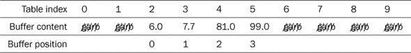

我们可以看到，缓冲区内容（四个数字`6.0`、`7.7`、`81.0`和`99.0`）连续放置在 tab 指向的数组对象中。

下面的方案表示了一个具有相同四个数字的循环缓冲区，但元素存储空间是环绕的。

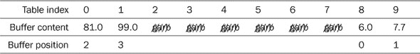

这种数据结构的初始化需要调用**malloc**为 tab 成员提供内存。除此之外

##### **`circular.c`**

```
**13**   circular* circular_init(circular* c, **size_t** max_len) {
**14**     if (c) {
**15**       if (max_len) {
**16**         *c = (circular){
**17**           .max_len = max_len,
**18**           .tab = malloc(sizeof(double[max_len])),
**19**         };
**20**           // Allocation failed.
**21**         if (!c->tab) c->max_len = 0;
**22**       } else {
**23**         *c = (circular){ 0 };
**24**       }
**25**     }
**26**     return c;
**27**   }
```

注意这个函数总是检查指针参数 c 的有效性。此外，它通过在条件语句的两个分支中赋值复合字面量，保证初始化所有其他成员为`0`。

库函数**malloc**可能会因为不同的原因失败。例如，内存系统可能因为之前的调用而耗尽，或者分配的回收大小可能太大。在一个通用系统（你很可能正在使用这样的系统来学习）中，这样的失败是罕见的（除非是故意引起的），但检查它仍然是一个好习惯。

|  |
| --- |

##### 要点 13.3

**malloc**通过返回一个空指针值来**指示失败**。

|  |
| --- |

这样的对象的销毁甚至更简单：我们只需检查指针，然后就可以无条件地**free**tab 成员。

##### **`circular.c`**

```
**29**   void circular_destroy(circular* c) {
**30**     if (c) {
**31**       free(c->tab);
**32**       circular_init(c, 0);
**33**     }
**34**   }
```

库函数**free**有一个友好的特性，即它接受一个空参数，并在该情况下不执行任何操作。

一些其他函数的实现使用一个内部函数来计算缓冲区的“循环”部分。它被声明为**`static`**，因此它只对那些函数可见，不会污染标识符命名空间（要点 9.8）。

##### **`circular.c`**

```
**50**   static **size_t** circular_getpos(circular* c, **size_t** pos) {
**51**     pos += c->start;
**52**     pos %= c->max_len;
**53**     return pos;
**54**   }
```

获取缓冲区元素的指针现在相当简单。

##### **`circular.c`**

```
**68**   double* circular_element(circular* c, **size_t** pos) {
**69**     double* ret = 0;
**70**     if (c) {
**71**       if (pos < c->max_len) {
**72**         pos = circular_getpos(c, pos);
**73**         ret = &c->tab[pos];
**74**       }
**75**     }
**76**   return ret;
**77**   }
```

在有了所有这些信息之后，你现在应该能够很好地实现除了一个之外的所有函数接口。更难的一个是 circular_resize。它从一些长度计算开始，然后处理请求会扩大或缩小表的情况。在这里，我们使用命名约定，用 o（旧）作为指向前变化特征的变量名的第一个字符，用 n（新）表示变化后的值。函数的末尾使用复合字面量，通过在情况分析期间找到的值来组合新的结构：

> ^([例 2])
> 
> 编写缺失函数的实现。

##### **circular.c**

```
 **92**   circular* circular_resize(circular* c, **size_t** nlen) {
 **93**     if (c) {
 **94**       **size_t** len = c->len;
 **95**       if (len > nlen) return 0;
 **96**       **size_t** olen = c->max_len;
 **97**       if (nlen != olen) {
 **98**         **size_t** ostart = circular_getpos(c, 0);
 **99**         **size_t** nstart = ostart;
**100**         double* otab = c->tab;
**101**         double* ntab;
**102**         if (nlen > olen) {
```

##### **`circular.c`**

```
**138**         }
**139**         *c = (circular){
**140**           .max_len = nlen,
**141**           .start = nstart,
**142**           .len = len,
**143**           .tab = ntab,
**144**         };
**145**       }
**146**     }
**147**     return c;
**148**   }
```

让我们现在尝试填补前面代码中的空白，并查看扩大对象的第一种情况。这其中的关键部分是对**realloc**的调用：

##### **`circular.c`**

```
**103**         ntab = realloc(c->tab, sizeof(double[nlen]));
**104**         if (!ntab) return 0;
```

对于这个调用，**realloc**接收现有对象的指针和重定位应具有的新大小。它返回指向新对象（具有所需大小）的指针或 null。在下一行，我们检查后一种情况，如果无法重定位对象，则终止函数。

函数**realloc**具有有趣的特性：

+   返回的指针可能与参数相同，也可能不同。是否可以在原地执行调整（例如，如果对象后面有空间，或者如果必须提供新对象）由运行时系统决定。但无论如何，即使返回的指针相同，对象也被视为新的（具有相同的数据）。这意味着特别是所有从原始对象派生的指针都无效。

+   如果参数指针和返回的指针不同（即对象已被复制），则不需要（甚至不应该）对之前的指针进行任何操作。旧对象将得到妥善处理。

+   尽可能地保留对象现有的内容：

    +   如果对象扩大，对象对应于之前大小的初始部分保持不变。

    +   如果对象缩小，重定位的对象内容与调用前的初始部分相对应。

+   如果返回`0`（即重定位请求无法由运行时系统满足），则旧对象保持不变。因此，没有丢失任何内容。

现在我们知道新接收的对象具有我们想要的大小，我们必须确保 tab 仍然代表一个环形缓冲区。如果之前的情况与第一个表相同，早期（对应于缓冲区元素的这部分是连续的），我们不需要做任何事情。所有数据都得到了妥善保存。

如果我们的环形缓冲区已绕过，我们必须做一些调整：

##### **`circular.c`**

```
**105**         // Two separate chunks 
**106**         if (ostart+len > olen) {
**107**           **size_t** ulen = olen - ostart;
**108**           **size_t** llen = len - ulen;
**109**           if (llen <= (nlen - olen)) {
**110**             /* Copy the lower one up after the old end. */ 
**111**             memcpy(ntab + olen, ntab,
**112**                    llen*sizeof(double));
**113**           } else {
**114**             /* Move the upper one up to the new end. */ 
**115**             nstart = nlen - ulen;
**116**             memmove(ntab + nstart, ntab + ostart,
**117**                     ulen*sizeof(double));
**118**           }
**119**         }
```

以下表格展示了第一个子案例在修改前后的内容差异：下部分在新增的部分内部找到了足够的空间：

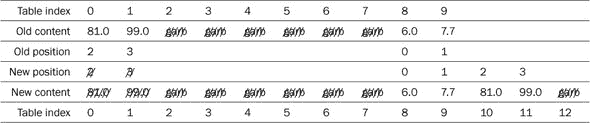

另一种情况，下部分无法适应新分配的部分，与这种情况类似。这次，缓冲区的上半部分被移向新表末尾：

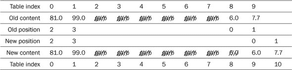

虽然两种情况的处理方式有所不同，但都显示了细微的差别。第一种情况使用**memcpy**处理；复制操作的数据源和目标元素不能重叠，因此在这里使用**memcpy**是安全的。对于另一种情况，正如示例所示，源和目标元素可能重叠，因此需要使用更宽松的**memmove**函数。^([[[Exs 3]](#ch13fn-ex03)])

> ^([Exs 3])
> 
> 实现表的缩小：在调用**realloc**之前重新组织表内容非常重要。

#### 13.1.2\. 确保动态分配的一致性

就像在我们的代码示例中一样，对分配函数（如 **malloc**、**realloc** 和 **free**）的调用应该始终成对出现。这不一定是在同一个函数内部，但在大多数情况下，简单地计数两者的发生次数应该给出相同的数字：

|  |
| --- |

##### 摘要 13.4

*对于每一次分配，都必须有一个* **释放**.*

|  |
| --- |

如果没有，这可能会表明 *内存泄漏**^C**：已分配对象的损失。这可能导致你的平台资源耗尽，表现为性能低下或随机崩溃。

|  |
| --- |

##### 摘要 13.5

*对于每一次* **释放**，都必须有一个* **malloc**、**calloc**、**aligned_alloc** 或 **realloc**.*

|  |
| --- |

但要注意，**realloc** 很容易模糊简单的分配计数：因为如果它用一个现有的对象被调用，它同时作为（旧对象的）释放和（新对象的）分配。

内存分配系统旨在简单，因此**free** 只允许用于用 **malloc** 分配的指针或空指针。

|  |
| --- |

##### 摘要 13.6

*只使用* **free** *指针，它们是* **malloc**、**calloc**、**aligned_alloc** 或 **realloc** 返回的。

|  |
| --- |

它们 *必须不*

+   指向由其他方式分配的对象（即变量或复合字面量）

+   还未被释放

+   只指向分配对象的一个更小的部分。

否则，你的程序将会崩溃。说真的，这将完全破坏你的程序执行内存，这是你可以遇到的最糟糕的崩溃之一。请小心。

### 13.2\. 存储持续时间、生命周期和可见性

我们在不同的地方看到，标识符的可见性和它所引用的对象的可访问性并不是同一件事。作为一个简单的例子，考虑列表 13.1 中的变量(s) x。

##### 列表 13.1\. 使用局部变量的遮蔽示例

```
 **1**     void squareIt(double* p) {
 **2**       *p *= *p;
 **3**     }
 **4**     int main(void) {
 **5**     double x = 35.0;
 **6**     double* xp = &x;
 **7**     {
 **8**       squareIt(&x);  /* Refers to double x */ 
 **9**       ...
**10**       int x = 0;     /* Shadow double x */ 
**11**       ...
**12**       squareIt(xp);  /* Valid use of double x */ 
**13**       ...
**14**     }
**15**     ...
**16**     squareIt(&x);    /* Refers to double x */ 
**17**     ...
**18**   }
```

在这里，第 5 行声明的标识符 x 的可见作用域从该行开始，延伸到函数 **main** 的末尾，但有一个明显的中断：从第 10 行到 14 行，这个可见性被另一个同名的变量，也命名为 x 的变量所 *遮蔽**^C*。

|  |
| --- |

##### 摘要 13.7

*标识符只在它们的声明范围内可见，从它们的声明开始。*

|  |
| --- |
|  |

##### 摘要 13.8

*标识符的可见性可以被从属作用域中同名的标识符所遮蔽。*

|  |
| --- |

我们还看到，标识符的可见性和它所代表的对象的可使用性并不是同一件事。首先，**`double`** x *对象* 被 squareIt 的所有调用使用，尽管标识符 x 在函数定义的点不可见。然后，在第 12 行，我们传递**`double`** x 变量的地址到函数 squareIt，尽管在那里标识符被遮蔽。

另一个例子涉及带有存储类别**`extern`**的声明。这些总是指定一个静态存储持续时间的对象，预期在文件作用域中定义；^([2])参见列表 13.2。

> ²
> 
> 实际上，这样的对象可以在另一个翻译单元的文件作用域中定义。

##### 列表 13.2\. 使用`extern`变量的阴影示例

```
 **1**   #include <stdio.h>
 **2**
 **3**   unsigned i = 1;
 **4**
 **5**   int main(void) {
 **6**     unsigned i = 2;        /* A new object */ 
 **7**     if (i) {
 **8**       extern unsigned i;   /* An existing object */ 
 **9**       printf("%u\n", i);
**10**     } else {
**11**       printf("%u\n", i);
**12**     }
**13**   }
```

这个程序有三个名为 i 的变量声明，但只有两个定义：第 6 行的声明和定义覆盖了第 3 行的声明。反过来，第 8 行的声明覆盖了第 6 行，但它引用的是第 3 行定义的对象。^([[[Exs 4]](#ch13fn-ex04)])

> ^([Exs 4])
> 
> 这个程序打印出哪个值？

|  |
| --- |

##### Takeaway 13.9

*每个变量的定义都创建了一个新的、独特的对象*。

|  |
| --- |

因此，在下面的例子中，**`char`**数组 A 和 B 标识不同的对象，具有不同的地址。表达式 A `==` B**必须**始终为假：

|  |
| --- |

```
 **1**   char const A[] = { 'e', 'n', 'd', '\0', };
 **2**   char const B[] = { 'e', 'n', 'd', '\0', };
 **3**   char const* c = "end";
 **4**   char const* d = "end";
 **5**   char const* e = "friend";
 **6**   char const* f = (char const[]){ 'e', 'n', 'd', '\0', };
 **7**   char const* g = (char const[]){ 'e', 'n', 'd', '\0', };
```

|  |
| --- |

但总共有多少个不同的数组对象？这取决于。编译器有很多选择：

|  |
| --- |

##### Takeaway 13.10

*只读对象字面量可能重叠*。

|  |
| --- |

在前面的例子中，我们有三个字符串字面量和两个复合字面量。这些都是对象字面量，它们是只读的：字符串字面量按定义是只读的，两个复合字面量是**`const`**修饰的。其中四个具有完全相同的基类型和内容('e'`,` 'n`',` 'd`',` '\0')，所以指针 c, d, f 和 g 都可能初始化到同一个**`char`**数组的地址。编译器甚至可能节省更多内存：这个地址可能是&`e[3]`，通过使用*end*出现在*friend*结尾的事实。

从这些例子中我们可以看到，一个对象的可访问性不仅是一个标识符或定义位置的词法属性（对于字面量），还取决于程序的执行状态。对象的**生命周期**有一个起点和一个终点：

|  |
| --- |

##### Takeaway 13.11

*对象在其生命周期之外无法访问*。

|  |
| --- |
|  |

##### Takeaway 13.12

*引用其生命周期之外的对象具有未定义的行为*。

|  |
| --- |

一个对象的开头和结尾点的定义取决于我们用来创建它的工具。在 C 语言中，我们区分四种不同的对象**存储持续时间**：**静态**^C*，当它在编译时确定；**自动**^C*，当它在运行时自动确定；**分配**^C*，当它通过函数调用**malloc**和类似函数显式确定；以及**线程**^C*，当它与某个执行线程绑定。

表 13.1 概述了声明与其**存储类别**、初始化、链接、**存储持续时间**和生命周期之间复杂的关系。目前不深入细节，它显示关键字的使用和底层术语相当令人困惑。

##### 表 13.1\. *标识符的存储类别、作用域、链接和关联对象的存储持续时间* *暂定* 表示如果没有其他带有初始化器的定义，则隐含定义。*诱导* 表示如果在该声明之前遇到了具有内部链接的另一个声明，则链接是内部的；否则，它是外部的。

| 类 | 范围 | 定义 | 链接 | 持续时间 | 生命周期 |
| --- | --- | --- | --- | --- | --- |
| 已初始化 | 文件 | 是 | 外部 | 静态 | 整个执行过程 |
| **extern**，已初始化 | 文件 | 是 | 外部 | 静态 | 整个执行过程 |
| 复合字面量 | 文件 | 是 | N/A | 静态 | 整个执行过程 |
| 字符串字面量 | 任何 | 是 | N/A | 静态 | 整个执行过程 |
| **静态**，已初始化 | 任何 | 是 | 内部 | 静态 | 整个执行过程 |
| 未初始化 | 文件 | 暂定 | 外部 | 静态 | 整个执行过程 |
| **extern**，未初始化 | 任何 | 否 | 诱导 | 静态 | 整个执行过程 |
| **静态**，未初始化 | 任何 | 暂定 | 内部 | 静态 | 整个执行过程 |
| **线程局部** | 文件 | 是 | 外部 | 线程 | 整个线程 |
| **extern** **线程局部** | 任何 | 否 | 外部 | 线程 | 整个线程 |
| **静态** **线程局部** | 任何 | 是 | 内部 | 线程 | 整个线程 |
| 复合字面量 |   |   | N/A |   |   |
| 非 VLA |   |   | 无 |   |   |
| 非 VLA，**auto** | 块 | 是 | 无 | 自动 | 定义块 |
| **寄存器** |   |   | 无 |   |   |
| 可变长度数组 (VLA) | 块 | 是 | 无 | 自动 | 块定义到结束 |
| 函数**返回**数组 | 块 | 是 | 无 | 自动 | 表达式结束处 |

首先，与名称所暗示的相反，*存储类别* **`extern`** 可能指代具有外部或内部 *链接* 的标识符.^([3]) 在这里，除了编译器之外，具有链接的标识符通常由另一个外部程序，即 *链接器**^C* 管理。这样的标识符在程序启动时初始化，甚至在进入 **main** 之前，链接器确保这一点。从不同对象文件访问的标识符需要 *外部* 链接，以便它们都能访问相同的对象或函数，这样链接器就能建立对应关系。

> ³
> 
> 注意，链接是标识符的属性，而不是它们所代表的对象。

我们已经看到的重要具有外部链接的标识符是 C 库中的函数。它们位于系统 *库**^C* 中，通常称为 `libc.so`，而不是你创建的对象文件中。否则，没有与其他对象文件连接的全局、文件作用域的对象或函数应该具有 *内部* 链接。所有其他标识符都没有 *链接*.^([4])

> ⁴
> 
> 对于 **`extern`** 关键字来说，可能更好的词是 **`linkage`**。

然后，静态存储期并不等同于声明一个具有**`storage class`** **`static`**的变量。后者仅仅强制一个变量或函数具有内部链接。这样的变量可以声明在文件作用域（全局）或块作用域（局部）。^([5])你可能还没有明确调用你平台的链接器。通常，它的执行被隐藏在你调用的编译器前端后面，动态链接器可能只有在程序启动时才会被注意到，而且可能不会被察觉。

> ⁵
> 
> 在这个上下文中，**`static`**可能是一个更好的关键字，即**`internal`**，理解任何形式的链接都意味着静态存储期。

对于前三种存储期类型，我们已经看到了很多例子。线程存储期（**`_Thread_local`**或**`thread_local`**）与 C 的线程 API 相关，我们将在第十八章中看到，届时我们将讨论。

分配的存储期是直接的：此类对象的生存期从创建它的对应调用**malloc**、**calloc**、**realloc**或**aligned_alloc**开始。它以调用**free**或**realloc**来销毁它结束，或者，如果没有发出此类调用，则以程序执行结束结束。

存储期的另外两种情况需要额外的解释，因此我们将在下一节中更详细地讨论它们。

#### 13.2.1\. 静态存储期

具有静态存储期的对象可以通过两种方式定义：

+   在文件作用域中**定义**的对象。变量和复合字面量可以具有这种属性。

+   在函数块内部声明的变量，并且具有存储类指定符**`static`**。

这些对象的生存期是整个程序执行期。因为它们在执行任何应用程序代码之前就被认为是活跃的，所以它们只能用编译时已知的表达式或可以被系统的进程启动程序解析的表达式来初始化。以下是一个例子：

|  |
| --- |

```
 **1**   double A = 37;
 **2**   double* p 
 **3**      = &(double){ 1.0, };
 **4**   int main(void) {
 **5**     static double B;
 **6**   }
```

|  |
| --- |

这定义了四个具有静态存储期的对象，即 A、p 和 B 以及第 3 行定义的复合字面量。其中三个具有**`double`**类型，一个具有**`double`**`*`类型。

所有四个对象都是从一开始就正确初始化的；其中三个是显式初始化的，B 则是通过`0`隐式初始化。

|  |
| --- |

##### 摘要 13.13

*具有静态存储期的对象始终会被初始化。*

|  |
| --- |

p 的初始化是一个需要比编译器本身能提供的更多魔法的例子。它使用了另一个对象的地址。这种地址通常只能在执行开始时计算。这就是为什么大多数 C 实现需要链接器概念，正如我们之前讨论的那样。

B 的例子表明，具有整个程序执行生存期的对象不一定在整个程序中都是可见的。**`extern`**例子也表明，在别处定义的具有静态存储期的对象可以在狭窄的作用域内变得可见。

#### 13.2.2\. 自动存储期

这是最复杂的情况：自动存储期的规则是隐式的，因此需要最多的解释。有几个对象可以显式或隐式地定义，并属于这一类别：

+   任何未声明为**`static`**的块作用域变量，声明为**`auto`**（默认）或**`register`**

+   块作用域复合字面量

+   函数调用返回的一些临时对象

自动对象的生存期最简单和最常见的情况是当对象不是可变长度数组（VLA）。

| |
| --- |

##### 摘要 13.14

*除非是 VLA 或临时对象，否则自动对象的生存期与其定义块的执行相对应。*

| |
| --- |

即，大多数局部变量是在程序执行进入它们定义的作用域时创建的，并在离开该作用域时被销毁。但是，由于递归，同一对象的几个*实例**^C*可能同时存在：

| |
| --- |

##### 摘要 13.15

*每次递归调用都会创建一个自动对象的新的局部实例。*

| |
| --- |

具有自动存储期的对象在优化方面有一个很大的优势：编译器通常可以看到此类变量的全部使用情况，并且利用这些信息，能够决定它是否可能产生别名。这就是**`auto`**和**`register`**变量之间的区别所在：

| |
| --- |

##### 摘要 13.16

*不允许对使用* **`register`** *声明的变量使用* *`&`* *运算符。*

| |
| --- |

因此，我们不会意外地取**`register`**变量的地址（摘要 12.12）。作为简单后果，我们得到：

| |
| --- |

##### 摘要 13.17

*使用* **`register`** *声明的变量不能产生别名。*

| |
| --- |

因此，使用**`register`**变量声明，编译器可以被迫告诉我们变量的地址在哪里，这样我们就可以识别可能具有某些优化潜力的地方。这对于所有不是数组且不包含数组的变量都适用。

| |
| --- |

##### 摘要 13.18

*在性能关键代码中将非数组局部变量声明为* **`register`***。

| |
| --- |

数组在这里扮演着特殊角色，因为它们在几乎所有上下文中都会退化到其第一个元素的地址。因此，对于数组，我们需要能够取地址。

| |
| --- |

##### 摘要 13.19

*具有存储类* **`register`** *的数组是无用的。*

| |
| --- |

还有一种情况需要特别处理数组的存在。一些函数的返回值确实可以是混合体：具有*临时生存期*的对象。正如你所知，函数通常返回值，而这些值是不可寻址的。但是，如果返回类型*包含*数组类型，我们必须能够隐式地取其地址，因此`[]`运算符是明确定义的。因此，以下函数返回的是一个临时对象，我们可以通过使用成员指定符`.or`y[0]`来隐式地取其地址：

| |
| --- |

```
 **1**   struct demo { unsigned ory[1]; };
 **2**   struct demo mem(void);
 **3**
 **4**   printf("mem().ory[0] is %u\n", mem().ory[0]);
```

| |
| --- |

C 语言中存在临时生存期的对象，唯一的原因是为了能够访问此类函数返回值的成员。不要将它们用于其他任何目的。

| |
| --- |

##### 要点 13.20

*临时生存期的对象是只读的*。

| |
| --- |
| |

##### 要点 13.21

*临时生存期在包含表达式的末尾结束*。

| |
| --- |

也就是说，它们的生命在它们所在的表达式的评估结束时结束。例如，在上一个示例中，临时对象在**printf**的参数构造完毕后即不再存在。将此与复合字面量的定义进行比较：复合字面量将一直存在，直到**printf**的包含范围终止。

### 13.3. 脱离主题：在定义之前使用对象

以下章节将更详细地介绍自动对象是如何产生生命（或不是）的。这有点难，所以如果你现在不想处理，你可以跳过它，稍后再回来。为了理解第 13.5 节关于具体机器模型的内容，这是必需的，但那一节也是一个脱离主题的部分。此外，它引入了新的特性**`goto`**和标签，我们稍后在第 14.5 节处理错误时需要它们。

让我们回到普通自动对象生存期的规则（要点 13.14）。如果你仔细想想，这个规则相当特别：此类对象的生存期从其定义范围开始，而不是像人们可能预期的那样，在其定义在执行过程中首次遇到时开始。

为了说明区别，让我们看看列表 13.3，这是 C 标准文档中可以找到的一个示例的变体。

##### 列表 13.3. 使用复合字面量的一个人为示例

```
 **3**   void **fgoto**(unsigned n) {
 **4**     unsigned j = 0;
 **5**     unsigned* p = 0;
 **6**     unsigned* q;
 **7**    **AGAIN**:
 **8**     if (p) printf("%u: p and q are %s, *p is %u\n",
 **9**                   j,
**10**                   (q == p) ? "equal" : "unequal",
**11**                   *p);
**12**     q = p;
**13**     p = &((unsigned){ j, });
**14**     ++j;
**15**     if (j <= n) goto **AGAIN**;
**16**   }
```

如果这个函数以 fgot`o(2)的形式被调用，我们将特别关注打印的行。在我的计算机上，输出看起来像这样：

##### `终端`

```
 **0**   1: p and q are unequal, *p is 0
 **1**   2: p and q are equal, *p is 1
```

虽然这段代码有点人为，它使用了我们尚未见过的构造**`goto`**。正如其名所示，这是一个*跳转语句**^C*。在这种情况下，它指示计算机在*标签**^C* **`AGAIN`**处继续执行。稍后，我们将看到使用**`goto`**更有意义的上下文。这里演示的目的只是跳过复合字面量的定义。

因此，让我们看看执行期间**printf**调用发生了什么。对于 n `== 2`，执行遇到相应的行三次；但由于 p 最初为`0`，在第一次通过时，**printf**调用本身被跳过。该行我们三个变量的值是

| j | p | q | **printf** |
| --- | --- | --- | --- |
| 0 | 0 | 未确定 | 跳过 |
| 1 | Addr of literal of *j* = 0 | 0 | printed |
| 2 | Addr of literal of *j* = 1 | Addr of literal of *j* = 0 | printed |

在这里，我们看到对于`j==2`的指针，p 和 q 持有在不同迭代中获得的地址。那么，为什么我的打印输出会说这两个地址都相等呢？这是巧合吗？还是因为我使用复合字面量在定义之前的地方，所以这是未定义的行为？

C 标准规定，这里显示的输出*必须*被生成。特别是，对于 j`==2`，p 和 q 的值相等且有效，它们所指向的对象的值为`1`。或者，换一种说法，在这个例子中，`*p`的使用是明确定义的，尽管在词法上`*p`的评估先于对象的定义。此外，恰好有一个这样的复合字面量，因此当 j`==2`时，地址是相等的。

|  |
| --- |

##### Takeaway 13.22

*对于不是 VLA 的对象，其生命周期从定义的作用域进入开始，到离开该作用域结束。*

|  |
| --- |
|  |

##### Takeaway 13.23

*自动变量和复合字面量的初始化器在每次遇到定义时都会被评估。*

|  |
| --- |

在这个例子中，复合字面量被访问了三次，并依次设置为`0`、`1`和`2`的值。

对于 VLA，其生命周期由不同的规则给出。

|  |
| --- |

##### Takeaway 13.24

*对于可变长度数组（VLA），其生命周期从遇到定义开始，到离开可见作用域结束。*

|  |
| --- |

因此，对于 VLA，我们使用**`goto`**的奇怪技巧是不合法的：我们不允许在定义之前的代码中使用 VLA 的指针，即使我们仍然在同一个块内。这种特殊处理 VLA 的原因是它们的大小是运行时属性，因此当进入声明块时，为其分配空间是不可能的。

### 13.4\. 初始化

在第 5.5 节中，我们讨论了初始化的重要性。确保程序从一个良好定义的状态开始，并在整个执行过程中保持这种状态是至关重要的。对象的存储持续时间决定了它是如何初始化的。

|  |
| --- |

##### Takeaway 13.25

*静态或线程存储持续期的对象默认进行初始化。*

|  |
| --- |

你可能还记得，这种默认初始化与通过`0`初始化对象的全部成员相同。特别是，对于可能有非平凡`0`值表示的基础类型，默认初始化效果很好：即指针和浮点类型。

对于其他对象，无论是自动的还是分配的，我们必须做些事情。

|  |
| --- |

##### Takeaway 13.26

*自动或分配存储期的对象必须显式初始化。*

|  |
| --- |

实现初始化的最简单方法是初始化器，它们将变量和复合字面量置于定义良好的状态，一旦它们变得可见。对于作为 VLA 或通过动态分配分配的数组，这是不可能的，因此我们必须通过赋值来提供初始化。原则上，我们可以在每次分配这样的对象时手动执行此操作，但这样的代码难以阅读和维护，因为初始化部分可能在视觉上分离定义和使用。避免这种情况的最简单方法是封装初始化到函数中：

|  |
| --- |

##### 取代 13.27

*系统地为你的每个数据类型提供一个初始化函数。*

|  |
| --- |

这里，重点是 *系统地*：你应该有一个一致的约定来规定这些初始化函数应该如何工作以及它们应该如何命名。为了说明这一点，让我们回到 `rat_init`，这是我们的 rat 数据类型的初始化函数。它实现了这样的函数的特定 API：

+   对于类型 `toto`，初始化函数命名为 `toto_init`。

+   这样的 `_init` 函数的第一个参数是要初始化的对象的指针。

+   如果该对象的指针为空，函数不执行任何操作。

+   可以提供其他参数来传递某些成员的初始值。

+   函数返回它接收到的对象的指针或 `0` 如果发生错误。

具有这些属性，这样的函数可以很容易地用于指针的初始化器：

```
rat const* myRat = rat_init(malloc(sizeof(rat)), 13, 7);
```

注意这有几个优点：

+   如果 **malloc** 调用失败并返回 `0`，唯一的影响是 myRat 被初始化为 `0`。因此 myRat 总是处于一个定义良好的状态。

+   如果我们不希望对象之后被修改，我们可以从开始就将指针目标指定为 **`const`**。所有对新对象的修改都发生在右侧初始化表达式中。

由于这样的初始化可以出现在许多地方，我们也可以将其封装到另一个函数中：

```
 **1**   rat* rat_new(long long numerator,
 **2**                unsigned long long denominator) {
 **3**     return rat_init(malloc(sizeof(rat)),
 **4**                     numerator,
 **5**                     denominator);
 **6**   }
```

使用该函数的初始化方式如下

```
rat const* myRat = rat_new(13, 7);
```

宏爱好者像我一样甚至可以轻松定义一个类型通用的宏，它可以一次性完成这样的封装：

```
#define P99_NEW(T, ...) T ## _init(malloc(sizeof(T)), **__VA_ARGS__**)
```

有了这个，我们就可以将之前的初始化写成

```
rat const* myRat = P99_NEW(rat, 13, 7);
```

这的好处是至少与 rat_new 变体一样可读，但它避免了为所有我们定义的类型额外声明这样的函数。

许多人都对这样的宏定义持批评态度，因此一些项目可能不会接受这作为一个通用的策略，但你应该至少知道这种可能性存在。它使用了我们尚未遇到的两个宏特性：

+   令牌的连接是通过 **`##`** 运算符实现的。在这里，T **`##`** _init 将 T 和 _init 合并成一个令牌：使用 rat，这会产生 rat_init；使用 toto，这会产生 toto_init。

+   构造 `...` 提供了一个可变长度的参数列表。在宏展开内部，传递给第一个参数之后的整个参数集都可以通过 **`__VA_ARGS__`** 访问。这样，我们可以根据对应 _init 函数的要求传递任意数量的参数给 P99_NEW。

如果我们必须通过一个 **`for`** 循环来初始化数组，事情会变得更糟。在这里，也很容易通过函数来封装：

```
 **1**   rat* rat_vinit(**size_t** n, rat p[n]) {
 **2**     if (p)
 **3**       for (**size_t** i = 0; i < n; ++i)
 **4**         rat_init(p+i, 0, 1);
 **5**     return p;
 **6**   }
```

使用这样的函数，初始化再次变得简单：

```
rat* myRatVec = rat_vinit(44, malloc(sizeof(rat[44])));
```

在这里，将封装到函数中确实更好，因为重复大小很容易引入错误：

```
 **1**   rat* rat_vnew(**size_t** size) {
 **2**     return rat_vinit(size, malloc(sizeof(rat[size])));
 **3**   }
```

### 13.5\. 旁白：机器模型

到目前为止，我们主要是在内部讨论 C 代码，使用语言的内部逻辑来描述正在发生的事情。本章是一个可选的旁白，与之前的讨论有所不同：它是对一个具体架构的机器模型的窥视。我们将更详细地看到，一个简单的函数是如何被转换成这个模型的，特别是自动存储持续时间是如何实现的。如果你现在实在无法忍受，你可以先跳过这一部分。否则，请记住不要慌张，深入其中。

传统上，计算机架构是用冯·诺伊曼模型描述的.^([6]) 在这个模型中，处理单元具有有限数量的硬件 *寄存器*，可以存储整数值，一个 *主存储器*，它存储程序以及数据，并且是线性可寻址的，以及一个有限的 *指令集*，它描述了可以使用这些组件执行的操作。

> ⁶
> 
> 大约在 1945 年由 J. Presper Eckert 和 John William Mauchly 为 ENIAC 项目发明；首先由现代科学的先驱之一 John von Neumann（1903 – 1957，也被称为 Neumann János Lajos 和 Johann Neumann von Margitta）描述，他在 von Neumann [1945]。

通常用来描述 CPU 理解的机器指令的中间编程语言被称为 *汇编器**^C*，它们仍然在很大程度上基于冯·诺伊曼模型。没有一种唯一的汇编器语言（如 C，适用于所有平台），而是一整套 *方言*，它们考虑了不同的特定性：CPU、编译器或操作系统。我们这里使用的汇编器是 `gcc` 编译器用于 `x86_64` 处理器架构的汇编器.^([[[Exs 5]](#ch13fn-ex05)]) 如果你不知道这是什么意思，不要担心；这只是一个此类架构的例子。

> ^([Exs 5])
> 
> 查找哪些编译器参数可以为你平台的平台生成汇编输出。

清单 13.4 展示了函数 fgoto 从 清单 13.3 的汇编打印输出。这样的汇编代码在硬件寄存器和内存位置上操作 *指令**^C*。例如，行 **`movl $`**`0, -16(`**`%`****`rbp`**`)` 将值 `0` 存储到内存中，该内存位置位于寄存器 **`%`****`rbp`** 指示的位置下方 `16` 个字节处。汇编程序还包含 *标签**^C*，用于标识程序中的某些点。例如，**`fgoto`** 是函数的 *入口点**^C*，而 **`.L_AGAIN`** 是汇编中对应于 C 中的 **`goto`** 标签 **`AGAIN`** 的对应物。

你可能已经猜到了，在 **`#`** 字符之后的文本是注释，试图将单个汇编指令与其 C 对应物联系起来。

##### 清单 13.4\. **`fgoto`** 函数的汇编版本

```
**10**           .type   fgoto, @function
**11**   fgoto:
**12**           pushq   %rbp               # Save base pointer 
**13**           movq    %rsp, %rbp         # Load stack pointer 
**14**           subq    $48, %rsp          # Adjust stack pointer 
**15**           movl    %edi, -36(%rbp)    # fgoto#0 => n 
**16**           movl    $0, -4(%rbp)       # init j 
**17**           movq    $0, -16(%rbp)      # init p 
**18**   .L_AGAIN:
**19**           cmpq    $0, -16(%rbp)      # if (p)
**20**           je       **.L_ELSE**
**21**           movq    -16(%rbp), %rax    #  p ==> **rax**
**22**           movl    (%rax), %edx       # *p ==> **edx**
**23**           movq    -24(%rbp), %rax    # (   == q)?
**24**           cmpq    -16(%rbp), %rax    # (p  ==  )?
**25**           jne      **.L_YES**
**26**           movl     $.L_STR_EQ, %eax  # Yes 
**27**           jmp     **.L_NO**
**28**   .L_YES:
**29**           movl    $.L_STR_NE, %eax   # No 
**30**   .L_NO:
**31**           movl    -4(%rbp), %esi     # j     ==> printf#1
**32**           movl    %edx, %ecx         # *p    ==> printf#3
**33**           movq    %rax, %rdx         # eq/ne ==> printf#2
**34**           movl    $.L_STR_FRMT, %edi # frmt  ==> printf#0
**35**           movl    $0, %eax           # clear **eax**
**36**           call    **printf**
**37**   .L_ELSE:
**38**           movq    -16(%rbp), %rax    # p ==|
**39**           movq    %rax, -24(%rbp)    #      ==> q 
**40**           movl    -4(%rbp), %eax     # j ==|
**41**           movl    %eax, -28(%rbp)    #      ==> cmp_lit 
**42**           leaq    -28(%rbp), %rax    # &cmp_lit ==|
**43**           movq    %rax, -16(%rbp)    #             ==> p 
**44**           addl    $1, -4(%rbp)       # ++j 
**45**           movl    -4(%rbp), %eax     # if (j 
**46**           cmpl    -36(%rbp), %eax    #       <= n)
**47**           jbe     .L_AGAIN           # goto **AGAIN**
**48**           leave                      # Rearange stack 
**49**           ret                        # return statement
```

这个汇编函数使用了硬件寄存器 **`%eax`**, **`%ecx`**, **`%edi`**, **`%edx`**, **`%esi`**, **`%rax`**, **`%rbp`**, **`%rcx`**, **`%rdx`** 和 **`%rsp`**。这比原始的冯·诺依曼机器要多得多，但主要思想仍然存在：我们有一些通用寄存器，用于表示程序执行状态的价值。另外两个寄存器有非常特殊的作用：**`%rbp`**（基指针）和**`%rsp`**（栈指针）。

函数处理内存中的一个预留区域，通常称为 *栈**^C*，该区域用于存储其局部变量和复合字面量。该区域的“上部”由 **`%rbp`** 寄存器指定，对象通过相对于该寄存器的负偏移来访问。例如，变量 n 可以从 **`%rbp`** 之前 `-36` 个位置找到，编码为 `-36(`**`%`****`rbp`**`)`。以下表格表示为函数 **`fgoto`** 预留的内存块布局以及在该函数执行的不同点存储的值。

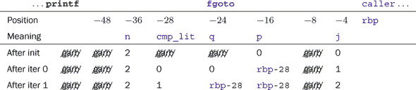

这个例子特别有趣，可以用来学习自动变量以及它们在执行进入函数时是如何设置的。在这个特定的机器上，当进入 **`fgoto`** 时，有三个寄存器持有关于这个调用的信息：**`%edi`** 持有函数参数 n；**`%`****`rbp`** 指向调用函数的基地址；**`%rsp`** 指向内存中这个对 **`fgoto`** 的调用可能存储数据的位置顶部。

现在，让我们考虑上述汇编代码 (清单 13.4) 如何设置这些内容。一开始，**`fgoto`** 执行三条指令来正确设置其“世界”。它保存 **`%rbp`** 因为它需要这个寄存器用于自己的目的，然后将 **`%rsp`** 的值移动到 **`%rbp`**，然后减少 **`%rsp`** 的 `48`。在这里，`48` 是编译器为 **`fgoto`** 需要的所有自动对象计算的字节数。由于这种简单的设置类型，该过程保留的空间未初始化，而是填充了垃圾数据。在接下来的三条指令中，三个自动对象（n、j 和 p）被初始化，但其他对象直到后来才初始化。

在此设置完成后，函数就绪可以运行。特别是，它可以轻松调用另一个函数：**`%`****`rsp`** 现在指向一个新内存区域的顶部，被调用的函数可以使用这个区域。这可以在标签 .L_NO 的中间部分看到。这部分实现了对 **printf** 的调用：它将函数应接收的四个参数按顺序存储在寄存器 **`%edi`**、**`%esi`**、**`%ecx`**、**`%`****`rdx`** 中；清除 **`%eax`**；然后调用该函数。

总结来说，为函数的自动对象（无 VLA）设置内存区域（无需 VLA）只需要几条指令，无论函数实际使用了多少自动对象。如果函数有更多，则需要将魔法数字 `48` 修改为新区域的大小。

由于这种方式，产生了以下后果，

+   自动对象通常从函数或作用域的开始就可用。

+   自动变量的初始化不是强制的。

这很好地映射了 C 中自动对象的生存期和初始化规则。

早期的汇编器输出只是故事的一半，最多。它是在没有优化的情况下产生的，只是为了展示可以为此类代码生成做出的基本假设。当使用优化时，as-if 规则 (takeaway 5.8) 允许我们大幅度地重新组织代码。在完全优化的情况下，我的编译器产生的代码类似于 清单 13.5。

##### 清单 13.5\. **`fgoto`** 函数的优化汇编版本

```
**12**           .type    **fgoto**, @function
**13**   **fgoto**:
**14**           pushq    **%rbp**              # Save base pointer 
**15**           pushq    **%rbx**              # Save **rbx** register
**16**           subq     $8, **%rsp**          # Adjust stack pointer 
**17**           movl    **%edi**, **%ebp**         # **fgoto**#0 => n 
**18**           movl     $1, **%ebx**          # init j, start with 1
**19**           xorl    **%ecx**, **%ecx**         # 0    ==> printf#3
**20**           movl    **$.L_STR_NE**, **%edx**   # "ne" ==> printf#2
**21**           testl    **%edi**, **%edi**        # if (n > 0)
**22**           jne    **.L_N_GT_0**
**23**           jmp    **.L_END**
**24**   **.L_AGAIN**:
**25**           movl    **%eax**, **%ebx**         # j+1  ==> j 
**26**   **.L_N_GT_0**:
**27**           movl    **%ebx**, **%esi**         # j    ==> printf#1
**28**           movl    **$.L_STR_FRMT**, **%edi** # frmt ==> printf#0
**29**           xorl    **%eax**, **%eax**         # Clear **eax**
**30**           call    **printf**
**31**           leal    1(%**rbx**), **%eax**      # j+1  ==> **eax**
**32**           movl    **$.L_STR_EQ**, **%edx**   # "eq" ==> printf#2
**33**           movl    **%ebx**, **%ecx**         # j    ==> printf#3
**34**           cmpl    **%ebp**, **%eax**         # if (j <= n)
**35**           jbe     **.L_AGAIN**           # goto **AGAIN**
**36**   **.L_END**:
**37**           addq    $8, **%rsp**           # Rewind stack 
**38**           popq    **%rbx**               # Restore **rbx**
**39**           popq    **%rbp**               # Restore **rbp**
**40**           ret                        # return statement
```

如你所见，编译器已经完全重构了代码。这段代码只是重现了原始代码的效果：其输出与之前相同。但它不使用内存中的对象，不比较指针是否相等，并且没有复合字面量的痕迹。例如，它根本不实现 `j=0` 的迭代。这个迭代没有效果，所以它被简单地省略了。然后，对于其他迭代，它区分了一个 `j=1` 的版本，其中 C 程序中的指针 p 和 q 被认为是不同的。然后，对于一般情况，需要增加 j 并相应地设置 **printf** 的参数.^([[[Exs 6]](#ch13fn-ex06)])^([[[Exs 7]](#ch13fn-ex07)])

> ^([Exs 6])
> 
> 利用 p 被反复赋以相同值的这一事实，编写一个 C 程序，使其更接近优化汇编版本的模样。
> 
> ^([Exs 7])
> 
> 即使是优化版本也还有改进的空间：循环的内部部分仍然可以缩短。编写一个 C 程序，在完全优化编译时探索这种潜力。

在这里我们所看到的代码都没有使用可变长度数组（VLA）。这些代码改变了情况，因为仅仅通过常数来修改**`%rsp`**的技巧在需要的内存不是固定大小时就不起作用了。对于 VLA，程序必须在执行期间从 VLA 边界的实际值计算大小，相应地调整**`%rsp`**，然后一旦执行离开 VLA 定义的作用域，就必须撤销对**`%rsp`**的修改。因此，这里**`%rsp`**调整的值不能在编译时计算，而必须在程序执行期间确定。

### 概述

+   对于大量对象或大尺寸对象的存储可以动态分配和释放。我们必须仔细跟踪这种存储。

+   标识符可见性和存储持续时间是不同的事情。

+   初始化必须对每种类型系统地使用一致的策略。

+   C 为局部变量分配的策略很好地映射到函数栈的低级处理。

## 第十四章. 更复杂的处理和 IO

本章涵盖

+   使用指针

+   格式化输入

+   处理扩展字符集

+   使用二进制流进行输入和输出

+   检查错误和清理

现在我们已经了解了指针及其工作原理，我们将对 C 库的一些特性进行新的探讨。C 的文本处理如果不使用指针就不完整，因此我们将从第 14.1 节的一个详细示例开始本章。然后我们将查看格式化输入的函数(第 14.1 节)；这些函数需要指针作为参数，因此我们不得不推迟它们的介绍直到现在。然后我们将介绍一系列新函数来处理扩展字符集(第 14.3 节)和二进制流(第 14.4 节)，最后我们通过讨论干净的错误处理(第 14.4 节)来结束本章和整个级别的讨论。

### 14.1. 文本处理

作为第一个例子，考虑以下程序，它从**`stdin`**读取一系列带有数字的行，并以逗号分隔的十六进制数的形式将这些相同的数字以规范化的方式写入**`stdout`**：

##### **`numberline.c`**

```
**246**   int **main**(void) {
**247**     char lbuf[256];
**248**     for (;;) {
**249**       if (fgetline(sizeof lbuf, lbuf, **stdin**)) {
**250**         **size_t** n;
**251**         **size_t*** nums = numberline(**strlen**(lbuf)+1, lbuf, &n, 0);
**252**         int ret = fprintnumbers(**stdout**, "%#zX", ",\t", n, nums);
**253**         if (ret < 0) return **EXIT_FAILURE**;
**254**         **free**(nums);
**255**       } else {
**256**         if (lbuf[0]) {  /* a partial line has been read */ 
**257**           for (;;) {
**258**             int c = **getc**(**stdin**);
**259**             if (c == **EOF**) return **EXIT_FAILURE**;
**260**             if (c == '\n') {
**261**               **fprintf**(**stderr**, "line too long: %s\n", lbuf);
**262**               break;
**263**             }
**264**           }
**265**         } else break;   /* regular end of input */ 
**266**       }
**267**     }
**268**   }
```

这个程序将任务分为三个不同的任务：

+   fgetline 读取一行文本

+   numberline 将此类行分割成一系列**`size_t`**类型的数字

+   fprintnumbers 来打印它们

核心是 numberline 函数。它将接收到的 lbuf 字符串分割成数字，分配一个数组来存储它们，并且如果提供了指针参数 np，还通过 np 返回这些数字的计数：

|  |
| --- |

**`numberline.c`**

numberline: 将字符串*lbuf*解释为用*base*表示的数字序列

**返回值**：一个新分配的包含在*lbuf*中找到的数字的数组

**参数**:

| lbuf | 应该是一个字符串 |
| --- | --- |
| np | 如果非空，则将数字的计数存储在*np | 中 |
| base | 从 0 到 36 的值，与**strtoul**相同的解释 |

**备注**：调用此函数的调用者负责**释放**返回的数组。

```
**size_t*** numberline(**size_t** size, char const lbuf[restrict size],
                   **size_t***restrict np, int base);
```

|  |
| --- |

该函数本身分为两部分，执行完全不同的任务。一个执行解析行的任务，即 numberline_inner。另一个，numberline 本身，只是第一个的包装，用于验证或确保第一个的前提条件。numberline_inner 函数将 C 库函数**strtoull**放入一个循环中，该循环收集数字并返回它们的计数。

现在我们来看**strtoull**函数第二个参数的用法。在这里，它是下一个变量的地址，而 next 用于跟踪数字结束的字符串中的位置。由于 next 是一个指向**`char`**的指针，因此**strtoull**的参数是一个指向指向**`char`**的指针的指针：

##### **`numberline.c`**

```
 **97**   static
 **98**   **size_t** numberline_inner(char const*restrict act,
 **99**                          **size_t** numb[restrict], int base){
**100**     **size_t** n = 0;
**101**     for (char* next = 0; act[0]; act = next) {
**102**       numb[n] = **strtoull**(act, &next, base);
**103**       if (act == next) break;
**104**       ++n;
**105**     }
**106**     return n;
**107**   }
```

假设**strtoull**被调用为**strtoull**("0789a", &next, base**)。根据参数 base 的值，该字符串被解释为不同。例如，如果 base 的值为`10`，则第一个非数字字符是字符串末尾的字符'a'：

| Base | 数字 | 数字 | *next |
| --- | --- | --- | --- |
| 8 | 2 | 7 | '8' |
| 10 | 4 | 789 | 'a' |
| 16 | 5 | 30874 | '\0' |
| 0 | 2 | 7 | '8' |

记住基数`0`的特殊规则。有效基数是从字符串中的第一个（或前两个）字符中推断出来的。在这里，第一个字符是'0'，因此字符串被解释为八进制，解析在第一个非数字字符处停止：'8'。

numberline_inner 接收到的行可能有两个条件会导致解析结束：

+   act 指向一个字符串终止符：一个`0`字符。

+   函数**strtoull**找不到数字，在这种情况下，next 被设置为 act 的值。

这两个条件作为**`for`**循环的控制表达式和内部**`if-break`**条件被发现。


注意，C 库函数**strtoull**有一个历史性的弱点：第一个参数的类型是**`char const`**`*`，而第二个参数的类型是**`char`**`**`，没有**`const`**修饰。这就是为什么我们必须将 next 类型指定为**`char`**`*`，而不能使用**`char const`**`*`。由于调用**strtoull**，我们可能会意外地修改只读字符串并导致程序崩溃。

|  |
| --- |

##### Takeaway 14.1

*`strt`**`o...`* *字符串转换函数不是* **`const`***-安全的。

|  |
| --- |

现在，numberline 函数本身提供了围绕 numberline_inner 的粘合剂：

+   如果 np 为空，则将其设置为指向一个辅助对象。

+   检查输入字符串的有效性。

+   一旦知道正确的长度，就会分配一个足够存储值的数组，并调整到适当的大小。

我们使用 C 库中的三个函数：**memchr**、**malloc** 和 **realloc**。与前面的例子一样，**malloc** 和 **realloc** 的组合确保我们有一个必要长度的数组：

##### **`numberline.c`**

```
**109**   **size_t*** numberline(**size_t** size, char const lbuf[restrict size],
**110**                      **size_t***restrict np, int base){
**111**     **size_t*** ret = 0;
**112**     **size_t** n = 0;
**113**     /* Check for validity of the string, first. */ 
**114**     if (**memchr**(lbuf, 0, size)) {
**115**       /* The maximum number of integers encoded. 
**116**          To see that this may be as much look at 
**117**          the sequence 08 08 08 08 ... and suppose 
**118**          that base is 0\. */ 
**119**       ret = **malloc**(sizeof(**size_t**[1+(2*size)/3]));
**120**
**121**       n = numberline_inner(lbuf, ret, base);
**122**
**123**       /* Supposes that shrinking realloc will always succeed. */ 
**124**       **size_t** len = n ? n : 1;
**125**       ret = **realloc**(ret, sizeof(**size_t**[len]));
**126**     }
**127**     if (np) *np = n;
**128**     return ret;
**129**   }
```

**memchr** 的调用返回第一个值为 `0` 的字节的地址，如果有的话，或者如果没有，则返回 `(`**`void`**`*``)0`。在这里，这只是为了检查在第一个大小字节内实际上是否存在一个 `0` 字符。这样，它保证了所有底层使用的字符串函数（特别是 **strtoull**）都操作在以 `0` 结尾的字符串上。

使用 **memchr**，我们遇到了另一个有问题的接口。它返回一个 **`void`**`*`，它可能指向一个只读对象。


|  |
| --- |

##### Takeaway 14.2

*memchr* 和 *strchr* 搜索函数不是 **`const`***-安全的。

|  |
| --- |

相比之下，返回字符串中索引位置的函数将是安全的。

|  |
| --- |

##### Takeaway 14.3

*strspn* 和 *strcspn* 搜索函数是 **`const`***-安全的。

|  |
| --- |

不幸的是，它们有一个缺点，即不能用来检查一个 **`char-`**数组实际上是否是一个字符串。因此，它们不能在这里使用。

现在，让我们看看我们示例中的第二个函数：

|  |
| --- |

**`numberline.c`**

fgetline: 读取最多`-1`字节大小的文本行。

将 `\n` 字符替换为 `0`。

**返回值:** 如果成功读取整个行，则返回`s`。否则，返回`0`，并且`s`包含可以读取的最大部分行。`*s*`以空字符结尾。

```
char* fgetline(**size_t** size, char s[restrict size],
               **FILE***restrict stream);
```

|  |
| --- |

这与 C 库函数 **fgets** 非常相似。第一个区别是接口：参数顺序不同，大小参数是 **`size_t`** 而不是 **`int`**。像 **fgets** 一样，如果从流中读取失败，它返回一个空指针。因此，在流上可以轻松检测文件结束条件。

更重要的是，fgetline 更优雅地处理另一个关键情况。它检测下一个输入行是否过长，或者流的最后一行是否没有以`\n`字符结束：

##### **`numberline.c`**

```
**131**   char* fgetline(**size_t** size, char s[restrict size],
**132**                  **FILE***restrict stream){
**133**     s[0] = 0;
**134**     char* ret = **fgets**(s, size, stream);
**135**     if (ret) {
**136**       /* s is writable so can be pos. */ 
**137**       char* pos = **strchr**(s, '\n');
**138**       if (pos) *pos = 0;
**139**       else ret = 0;
**140**     }
**141**     return ret;
**142**   }
```

函数的前两行保证 s 总是以空字符结尾：要么是通过 **fgets** 调用成功，要么是通过强制使其成为一个空字符串。然后，如果读取了某些内容，s 中可以找到的第一个 `\n` 字符将被替换为 `0`。如果没有找到，则读取了部分行。在这种情况下，调用者可以检测这种情况并再次调用 fgetline 来尝试读取剩余的行或检测文件结束条件.^([[[Exs 1]](#ch14fn-ex01)])

> ^([Exs 1])
> 
> 改进示例的 **main** 部分，使其能够处理任意长度的输入行。

除了 **fgets**，这个例子还使用了 C 库中的 **strchr**。这个函数缺乏 **`const`**-安全性在这里不是问题，因为 s 应该是可修改的。不幸的是，由于现有的接口，我们总是必须自己进行这种评估。

由于它涉及大量的详细错误处理，我们将详细介绍函数 fprintnumbers，它在 第 14.5 节 中。对于我们的目的，我们只限于讨论函数 sprintnumbers，它比它简单，因为它只写入字符串，而不是流，并且它只假设它接收到的缓冲区 buf 提供了足够的空间：

|  |
| --- |

**`numberline.c`**

sprintnumbers: 在 *buf* 中打印一系列数字 *nums*，使用 **printf** 格式 *form*，并用 *sep* 字符分隔，并以换行符结尾。

**返回值：** 打印到 *buf* 中的字符数。

这假设 *tot* 和 *buf* 足够大，并且 *form* 是一个适合打印 **`size_t`** 的格式。

```
int sprintnumbers(**size_t** tot, char buf[restrict tot],
                  char const form[restrict static 1],
                  char const sep[restrict static 1],
                  **size_t** len, **size_t** nums[restrict len]);
```

|  |
| --- |

函数 sprintnumbers 使用 C 库中的一个我们尚未遇到的功能：**sprintf**。它的格式化能力与 **printf** 和 **fprintf** 相同，只是它不打印到流，而是打印到 **`char`** 数组：

##### **`numberline.c`**

```
**149**   int sprintnumbers(**size_t** tot, char buf[restrict tot],
**150**                     char const form[restrict static 1],
**151**                     char const sep[restrict static 1],
**152**                     **size_t** len, **size_t** nums[restrict len]) {
**153**     char* p = buf;   /* next position in buf */ 
**154**     **size_t** const seplen = **strlen**(sep);
**155**     if (len) {
**156**       **size_t** i = 0;
**157**       for (;;) {
**158**         p += **sprintf**(p, form, nums[i]);
**159**         ++i;
**160**         if (i >= len) break;
**161**         **memcpy**(p, sep, seplen);
**162**         p += seplen;
**163**       }
**164**     }
**165**     **memcpy**(p, "\n", 2);
**166**     return (p-buf)+1;
**167**   }
```

函数 **sprintf** 总是确保在字符串末尾放置一个 `0` 字符。它还返回该字符串的长度，这是在 `0` 字符之前写入的字符数。这在示例中用于更新缓冲区当前位置的指针。**sprintf** 仍然有一个重要的漏洞：

|  |
| --- |

##### Takeaway 14.4

**sprintf** **没有提供防止缓冲区溢出的措施**。

|  |
| --- |

即，如果我们传递一个不充足的缓冲区作为第一个参数，会发生不好的事情。在这里，在 sprintnumbers 中，就像 **sprintf** 本身一样，我们 *假设* 缓冲区足够大，可以容纳结果。如果我们不确定缓冲区能否容纳结果，我们可以使用 C 库函数 **snprintf**，而不是：

```
**1**   int **snprintf**(char*restrict s, **size_t** n, char const*restrict form, ...);
```

这个函数还确保不会写入超过 n 个字节。如果返回值大于或等于 n，字符串将被截断以适应。特别是，如果 n 是 `0`，则不会写入 s。

|  |
| --- |

##### Takeaway 14.5

*使用* **snprintf** **来格式化未知长度的输出。*

|  |
| --- |

总结来说，**snprintf** 有很多不错的特性：

+   缓冲区 s 不会溢出。

+   在成功调用后，s 是一个字符串。

+   当 n 和 s 设置为 `0` 时，**snprintf** 只返回将要写入的字符串的长度。

通过使用它，一个简单的 **`for`** 循环来计算一行上打印的所有数字的长度如下所示：

##### **`numberline.c`**

```
**182**      /* Count the chars for the numbers. */ 
**183**      for (**size_t** i = 0; i < len; ++i)
**184**        tot += **snprintf**(0, 0, form, nums[i]);
```

我们将在后面看到如何在 fprintnumbers 的上下文中使用它。

|  |
| --- |

**字符串中的文本处理**

我们已经讨论了很多关于文本处理的内容，现在让我们看看我们是否真的能使用它。

你能否在字符串中搜索一个特定的单词？

你能否在字符串中替换一个单词，并返回包含新内容的副本？

你能否为字符串实现一些正则表达式匹配函数？例如，找到一个字符类如 `[A-Q]` 或 `[⁰-9]`，使用 `*`（表示“任何东西”）进行匹配，或使用 `?`（表示“任何字符”）进行匹配。

你能否实现一个用于 POSIX 字符类（如 `[[:alpha:]]`, `[[:digit:]]` 等）的正则表达式匹配函数？

你能否将这些功能组合起来，在字符串中搜索正则表达式？

你能否使用正则表达式对特定单词进行查询替换？

能否扩展正则表达式以实现分组？

能否扩展查询替换以实现分组？

|  |
| --- |

### 14.2. 格式化输入

与用于格式化输出的 **printf** 函数族类似，C 库有一系列用于格式化输入的函数：**fscanf** 用于从任意流中读取，**scanf** 用于 **`stdin`**，**sscanf** 用于字符串。例如，以下代码将从 **`stdin`** 读取一行包含三个 **`double`** 值：

```
**1**   double a[3];
**2**   /* Read and process an entire line with three double values. */ 
**3**   if (**scanf**(" %lg %lg %lg ", &a[0], &a[1], &a[2]) < 3) {
**4**      **printf**("not enough input values!\n");
**5**   }
```

表 14.1 到 14.3 提供了规范格式的概述。不幸的是，这些函数比 **printf** 更难使用，并且它们的约定在细微之处与 **printf** 有所不同。

##### 表 14.1. **scanf** 和类似函数的格式规范，其一般语法为 **`[XX][WW][LL]SS`**

| XX | * | 赋值抑制 |
| --- | --- | --- |
| WW | 字段宽度 | 最大输入字符数 |
| LL | 修饰符 | 选择目标类型的宽度 |
| SS | 规范符 | 选择转换 |

+   为了能够返回所有格式的值，参数是指向被扫描的类型指针。

+   空白处理很微妙，有时会出乎意料。在格式中，空格字符 ' ' 匹配任何空白序列：空格、制表符和换行符。这样的序列可能是空的，或者包含多个换行符。

+   字符串处理不同。因为 **scanf** 函数的参数本身就是指针，所以格式 "%c" 和 "%s" 都指向一个 **`char`**`*` 类型的参数。其中 "%c" 读取固定大小的字符数组（默认为 `1`），而 "%s" 匹配任何非空白字符序列，并添加一个终止的 `0` 字符。

+   格式中类型的规范与 **printf** 相比有细微的差别，特别是在浮点类型方面。为了保持两者的一致性，最好对 **`double`** 使用 "%lg" 或类似格式，对 **`long double`** 使用 "%Lg"，无论是 **printf** 还是 **scanf**。

+   有一个基本的工具可以识别字符类。例如，格式 "%[aeiouAEIOU]" 可以用来扫描拉丁字母中的元音。

##### 表 14.2\. *scanf 和类似函数的格式说明符* 使用'l'修饰符时，字符或字符集（'c', 's', '['）的说明符将输入的多字节字符序列转换为宽字符**`wchar_t`**参数；参见 14.3 节。

| SS | 转换 | 指针到 | 跳过空格 | 类似于函数 |
| --- | --- | --- | --- | --- |
| 'd' | 十进制 | 有符号类型 | 是 | **strtol**，基数 10 |
| 'i' | 十进制、八进制或十六进制 | 有符号类型 | 是 | **strtol**，基数 0 |
| 'u' | 十进制 | 无符号类型 | 是 | **strtoul**，基数 10 |
| 'o' | 八进制 | 无符号类型 | 是 | **strtoul**，基数 8 |
| 'x' | 十六进制 | 无符号类型 | 是 | **strtoul**，基数 16 |
| 'aefg' | 浮点数 | 浮点数 | 是 | **strtod** |
| '%' | '%'字符 | 无赋值 | 否 |   |
| 'c' | 字符 | **char** | 否 | **memcpy** |
| 's' | 非空白字符 | **字符** | 是 | **strcspn** 与 |
|   |   |   |   | " \f\n\r\t\v" |
| '[' | 扫描集 | 字符串 | 否 | **strspn**或**strcspn** |
| 'p' | 地址 | **void** | 是 |   |
| 'n' | 字符计数 | 有符号类型 | 否 |   |

+   在这样的字符类指定中，如果开头的反斜杠`^`出现在类中，它将否定该类。因此，"%[^\n]%*[\n]"扫描整个行（必须非空）然后丢弃行尾的换行符。

这些特性使得**scanf**函数族难以使用。例如，我们的看似简单的例子有一个缺陷（或特性），即它不仅限于读取单行输入，而且它还会愉快地接受分布在多行上的三个**`double`**值。（[[[Exs 2]](#ch14fn-ex02)]) 在大多数有规律输入模式的情况下，例如一系列数字，最好避免使用。

> ^([Exs 2])
> 
> 修改示例中的格式字符串，使其只接受一行上的三个数字，由空格分隔，并且跳过终止的换行符（可能前面有空白）。

### 14.3\. 扩展字符集

到目前为止，我们只使用了一组有限的字符来指定我们的程序或打印在控制台上的字符串字面量的内容：一组由拉丁字母、阿拉伯数字和一些标点符号字符组成。这种限制是一个历史事件，起源于美国计算机行业在早期市场的统治地位，另一方面，以及最初需要用非常有限的位数来编码字符的需求.^([1]) 正如我们在使用类型名**`char`**作为基本数据单元时所见，文本字符和不可分割的数据组件的概念在开始时并没有很好地分离。

> ¹
> 
> 用于基本字符集的占主导地位的字符编码被称为 ASCII：*A*merican *s*tandard *c*ode for *i*nformation *i*nterchange。

##### 表 14.3\. *scanf 和类似函数的格式修饰符* 注意，**`float`**`*` 和 **`double`**`*` 参数的显著性不同于 printf 格式。

| 字符 | 类型 |
| --- | --- |
| "hh" | **char** 类型 |
| "h" | **short** 类型 |
| "" | **signed**，**unsigned**，**float**，**char** 数组和字符串 |
| "l" | **long** 整数类型，**double**，**wchar_t** 字符和字符串 |
| "ll" | **long long** 整数类型 |
| "j" | **intmax_t**, **uintmax_t** |
| "z" | **size_t** |
| "t" | **ptrdiff_t** |
| "L" | **long double** |

拉丁语，我们从其中继承了我们的字符集，作为一种口语已经很久远了。它的字符集不足以编码其他语言的语音特性。在欧洲语言中，英语有一个特性，它用字母组合（如 *ai*，*ou*，和 *gh* (*fair enough*））来编码缺失的音素，而不是用重音符号、特殊字符或连字符（如 *fär ínó*），就像大多数它的表亲一样。所以对于使用拉丁字母的其他语言，可能性已经相当有限；但对于使用完全不同书写系统（希腊语、俄语）或甚至完全不同概念（日语、中文）的语言和文化，这个受限的美国字符集显然是不够的。

在全球市场扩张的前几年，不同的计算机制造商、国家和组织为其各自的社区提供本地语言支持，或多或少是随机进行的，并且没有协调地添加了对图形字符、数学排版、乐谱等特殊支持。这完全是一团糟。因此，在不同系统、国家和文化之间交换文本信息在许多情况下是困难的，甚至是不可能的；编写可在不同语言 *和* 不同计算平台上下文中使用的可移植代码就像黑魔法一样。

幸运的是，这些长达数年的困难现在已经被主要克服，在现代系统中，我们可以编写使用“扩展”字符的统一方式的可移植代码。以下代码片段展示了这是如何工作的：

##### **`mbstrings-main.c`**

```
**87**   **setlocale**(**LC_ALL**, "");
**88**   /* Multibyte character printing only works after the locale 
**89**     has been switched. */ 
**90**   draw_sep(TOPLEFT " © 2014 jεnz 'g℧ztεt ", TOPRIGHT);
```

即，在我们的程序接近开始的地方，我们切换到“本地”区域设置，然后我们可以使用和输出包含 *扩展字符* 的文本：这里，是语音学（所谓的 IPA）。输出看起来类似于


实现这一点的手段相当简单。我们有一些宏，带有用于垂直和水平线的魔法字符串字面量，以及左上角和右上角：

##### **`mbstrings-main.c`**

```
**43**   #define VBAR "\u2502"      /**< a vertical bar character   */
**44**   #define HBAR "\u2500"      /**< a horizontal bar character */
**45**   #define TOPLEFT "\u250c"   /**< topleft corner character   */
**46**   #define TOPRIGHT "\u2510"  /**< topright corner character  */
```

以及一个格式化输出行的专用函数：

|  |
| --- |

**`mbstrings-main.c`**

draw_sep: 使用水平线绘制由 *start* 和 *end* 分隔的多字节字符串。

```
  void draw_sep(char const start[static 1],
                char const end[static 1]) {
    **fputs**(start, **stdout**);
    **size_t** slen = mbsrlen(start, 0);
    **size_t** elen = 90 - mbsrlen(end, 0);
    for (**size_t** i = slen; i < elen; ++i) **fputs**(HBAR, **stdout**);
    **fputs**(end, **stdout**);
    **fputc**('\n', **stdout**);
  }
```

|  |
| --- |

这使用一个函数来计算多字节字符串（mbsrlen）中的打印字符数，以及我们的老朋友 **fputs** 和 **fputc** 用于文本输出。

所有这一切都是从调用**setlocale**开始的，这一点很重要。否则，如果您将扩展集中的字符输出到终端，可能会看到垃圾数据。但是一旦您调用了**setlocale**并且系统安装良好，这些字符放在多字节字符串中“fär ínó*`ff`*”应该不会出太大问题。

一个*多字节字符*是一系列字节，被解释为表示扩展字符集的单个字符，而一个*多字节字符串*是包含此类多字节字符的字符串。幸运的是，这些家伙与我们迄今为止处理的标准字符串兼容。

|  |
| --- |

##### 收获 14.6

*多字节字符不包含空字节*。

|  |
| --- |
|  |

##### 收获 14.7

*多字节字符串以空字符结尾*。

|  |
| --- |

因此，许多标准字符串函数，如**strcpy**，对于多字节字符串来说都是现成的。尽管如此，它们也引入了一个主要困难：打印字符的数量不能再直接从**`char`**数组元素的数量或通过函数**strlen**来推断。这就是为什么在前面的代码中，我们使用了（非标准的）函数 mbsrlen：

|  |
| --- |

**`mbstrings.h`**

mbsrlen：在*mbs*中解释 mb 字符串，并将其作为宽字符字符串返回其长度。

**返回值**：多字节字符串的长度，如果发生编码错误则返回`-1`。

只要向此函数传递一个与*mbs*中 mb 字符起始状态一致的*状态*参数，此函数就可以集成到对字符串的一系列搜索中。该状态本身不会被此函数修改。

**备注**：`0`的*状态*表示可以不考虑任何上下文扫描*mbs*。

```
**size_t** mbsrlen(char const*restrict mbs,
               **mbstate_t** const*restrict state);
```

|  |
| --- |

如您从描述中可以看到，解析多字节字符串以获取单个多字节字符可能要复杂一些。特别是，我们通常需要通过 C 标准在头文件`wchar.h`中提供的类型**`mbstate_t`**来保持解析状态。^([2]) 此头文件提供了多字节字符串和字符的实用工具，以及*宽字符*类型**`wchar_t`**。我们将在后面看到这一点。

> ²
> 
> 头文件`uchar.h`也提供了这种类型。

|  |
| --- |

`<wchar.h>`

|  |
| --- |

但首先，我们必须介绍另一个国际标准：ISO 10646，或称为*Unicode [2017]*。正如其命名所示，Unicode ([`www.joelonsoftware.com/articles/Unicode.html`](http://www.joelonsoftware.com/articles/Unicode.html))试图提供一个统一的字符码框架。它提供了一个巨大的表格^([3])，基本上包含了迄今为止人类所构想的所有字符*概念*。*概念*在这里非常重要：我们必须从特定类型中某个特定字符的打印形式或*符号*来理解，例如，“拉丁大写字母 A”可以在这个文本中以 A、*A*、A 或`A`的形式出现。其他类似的概念字符，如“希腊大写字母 Alpha”字符，甚至可能以相同的或相似的符号 A 打印。

> ³
> 
> 现在，Unicode 大约有 110,000 个码点。

Unicode 将每个字符概念，或称为*码点*，放入其自己的语言或技术上下文中。除了字符的定义外，Unicode 还对它进行分类，例如，将其归类为一个大写字母，并将其与其他码点相关联，例如，指出*A*是*a*的大写形式。

如果您需要特定语言的特殊字符，那么您很可能在键盘上就能找到它们，并且可以将它们输入到用于 C 语言编码的多字节字符串中，就像这样。也就是说，您的系统可能被配置为直接将整个字节序列（例如ä）插入到文本中，并为您完成所有必要的操作。如果您没有或者不想使用这种方法，您可以使用我们之前用于宏 HBAR 的技术。在那里，我们使用了 C11 中引入的新转义序列（[`dotslashzero.net/2014/05/21/the-interesting-state-of-unicode-in-c/`](http://dotslashzero.net/2014/05/21/the-interesting-state-of-unicode-in-c/)）：一个反斜杠后跟一个*u*和四个十六进制数字来编码一个 Unicode 码点。例如，“拉丁小写字母 a 带重音符号”的码点是 228 或 0xE4。在多字节字符串中，这读作"\u00E4"。由于四个十六进制数字只能表示 65,536 个码点，因此还有指定 8 个十六进制数字的选项，这是通过反斜杠和一个大写*U*引入的，但您只有在非常专业的环境中才会遇到这种情况。

在前面的例子中，我们使用这样的 Unicode 规范编码了四个图形字符，这些字符很可能不在任何键盘上。有几个在线网站允许您查找您需要的任何字符的码点。

如果我们想要使用多字节字符和字符串进行比简单的输入/输出更复杂的操作，事情就会变得稍微复杂一些。简单的字符计数已经不再是微不足道的：**strlen**不会给出正确答案，其他字符串函数如**strchr**、**strspn**和**strstr**也不会按预期工作。幸运的是，C 标准为我们提供了一组替换函数，通常以**`wcs`**而不是 str 作为前缀，这些函数将作用于*宽字符字符串*。我们之前介绍的 mbsrlen 函数可以编码为

##### **`mbstrings.c`**

```
**30**   **size_t** mbsrlen(char const*s, **mbstate_t** const*restrict state) {
**31**     if (!state) state = MBSTATE;
**32**     **mbstate_t** st = *state;
**33**     **size_t** **mblen** = **mbsrtowcs**(0, &s, 0, &st);
**34**     if (**mblen** == -1) **errno** = 0;
**35**     return **mblen**;
**36**   }
```

这个函数的核心是使用库函数**mbsrtowcs**（“*多字节字符串（mbs），可重置，到宽字符字符串（wcs）*”），它构成了 C 标准提供的用于处理多字节字符串的原始函数之一：

```
**1**   **size_t** **mbsrtowcs**(**wchar_t***restrict dst, char const**restrict src,
**2**                    **size_t** len, **mbstate_t***restrict ps);
```

因此，一旦我们解密了名称的缩写，我们就知道这个函数应该将 mbs，src，转换为 wcs，dst。在这里，*宽字符*（wc）类型**`wchar_t`**用于精确编码扩展字符集中的单个字符，这些宽字符以与**`char`**组成普通字符串相同的方式形成 wcs：它们是这种宽字符的空终止数组。

C 标准对**`wchar_t`**使用的编码限制不多，但任何合理的环境现在都应该使用 Unicode 作为其内部表示。你可以使用以下两个宏来检查这一点：

##### **`mbstrings.h`**

```
**24**   #ifndef **__STDC_ISO_10646__**
**25**   # error "wchar_t wide characters have to be Unicode code points" 
**26**   #endif
**27**   #ifdef **__STDC_MB_MIGHT_NEQ_WC__**
**28**   # error "basic character codes must agree on char and wchar_t" 
**29**   #endif
```

现代平台通常使用 16 位或 32 位整数类型来实现**`wchar_t`**。如果你只使用可以用四个十六进制数字表示的 Unicode 码点，那么通常你不必太关心这一点。那些使用 16 位有效编码的平台不能使用\UXXXXXXXX 表示法中的其他码点，但这不应该让你感到烦恼。

宽字符和宽字符字符串字面量遵循与**`char`**和字符串相同的规则。对于两者，L 前缀表示宽字符或字符串：例如，L'ä'和 L'\u00E4'是相同的字符，两者都是**`wchar_t`**类型，L"b\u00E4"是一个包含宽字符 L'b'、L'ä'和`0`的三个元素的数组。

宽字符的分类也以与简单**`char`**类似的方式进行。头文件`wctype.h`提供了必要的函数和宏。

|  |
| --- |

`<wctype.h>`

|  |
| --- |

回到**mbsrtowcs**，这个函数*解析*多字节字符串 src 到对应于*多字节字符*（mbc）的片段，并将相应的码点分配给 dst 中的宽字符。参数 len 描述了结果 wcs 可能的最大长度。参数 state 指向一个变量，该变量存储 mbs 的潜在*解析状态*；我们将在稍后简要讨论这个概念。

如您所见，函数 **mbsrtowcs** 有两个特殊性。首先，当使用空指针调用 dst 时，它不会存储 wcs，而只是返回这样一个 wcs 的大小。其次，如果 mbs 没有正确编码，它可能会产生 *编码错误*。在这种情况下，函数返回 `(`**`size_t`**`)-1` 并将 **`errno`** 设置为值 **`EILSEQ`**（见 `errno.h`）。mbsrlen 的部分代码实际上是对该错误策略的修复，通过将 **`errno`** 再次设置为 `0`。

|  |
| --- |

`<errno.h>`

|  |
| --- |

现在我们来看第二个函数，它将帮助我们处理 mbs：

|  |
| --- |

**`mbstrings.h`**

mbsrdup: 将 *s* 中的字节序列解释为 mb 字符串，并将其转换为宽字符字符串。

**返回值**：一个新分配的适当长度的宽字符字符串，如果发生编码错误则返回 `0`。

**备注**：此函数可以通过传递到该函数的与 *c* 中 mb 字符起始一致的 *state* 参数，集成到一系列对字符串的此类搜索中。该状态本身不会被此函数修改。

`0` 状态的 `state` 表示可以不考虑任何上下文扫描 `s`。

```
**wchar_t*** mbsrdup(char const*s, **mbstate_t** const*restrict state);
```

|  |
| --- |

此函数返回一个新分配的具有与输入的 mbs s 相同内容的 wcs。除了状态参数外，其实现很简单：

##### **`mbstrings.c`**

```
**38**   **wchar_t*** mbsrdup(char const*s, **mbstate_t** const*restrict state) {
**39**     **size_t** **mblen** = mbsrlen(s, state);
**40**     if (**mblen** == -1) return 0;
**41**     **mbstate_t** st = state ? *state : *MBSTATE;
**42**     **wchar_t*** S = **malloc**(sizeof(**wchar_t**[**mblen**+1]));
**43**     /* We know that s converts well, so no error check */ 
**44**     if (S) **mbsrtowcs**(S, &s, **mblen**+1, &st);
**45**     return S;
**46**   }
```

确定目标字符串的长度后，我们使用 **malloc** 分配空间，并使用 **mbsrtowcs** 复制数据。

为了更精细地控制 mbs 的解析，标准提供了函数 **mbrtowc**：

```
**1**   **size_t** **mbrtowc**(**wchar_t***restrict pwc,
**2**                  const char*restrict s, **size_t** len,
**3**                  **mbstate_t*** restrict ps);
```

在此接口中，参数 len 表示在 s 中扫描单个多字节字符的最大位置。由于通常我们不知道这种多字节编码在目标机器上的工作方式，我们必须做一些有助于我们确定 len 的猜测工作。为了封装这种启发式方法，我们制定了以下接口。它的语义类似于 **mbrtowc**，但避免了 len 的指定：

|  |
| --- |

**`mbstrings.h`**

mbrtow: 将 *c* 中的字节序列解释为 mb 字符，并通过 *C* 返回该宽字符。

**返回值**：mb 字符的长度，或者在发生编码错误时返回 `-1`。

此函数可以通过将相同的 *state* 参数传递给所有调用此或类似函数的调用集成到一系列对字符串的此类搜索中。

**备注**：`0` 状态的 `state` 表示可以不考虑任何上下文扫描 `c`。

```
**size_t** mbrtow(**wchar_t***restrict C, char const c[restrict static 1],
              **mbstate_t***restrict state);
```

|  |
| --- |

此函数返回字符串中第一个多字节字符识别的字节数，或者在出错时返回 `-1`。**mbrtowc** 还有一个可能的返回值 `-2`，用于 len 不够大的情况。实现使用该返回值来检测这种情况并调整 len，直到它适合：

##### **`mbstrings.c`**

```
**14**   **size_t** mbrtow(**wchar_t***restrict C, char const c[restrict static 1],
**15**                 **mbstate_t***restrict state) {
**16**     if (!state) state = MBSTATE;
**17**     **size_t** len = -2;
**18**     for (**size_t** maxlen = **MB_LEN_MAX**; len == -2; maxlen *= 2)
**19**       len = **mbrtowc**(C, c, maxlen, state);
**20**     if (len == -1) **errno** = 0;
**21**     return len;
**22**   }
```

在这里，**`MB_LEN_MAX`** 是一个标准值，在大多数情况下是 len 的良好上限。

让我们现在转到使用 mbrtow 的容量来识别 mbc 并使用它来搜索 mbs 的函数：

| |
| --- |

**`mbstrings.h`**

mbsrwc：将 *s* 中的字节序列解释为 mb 字符串，并搜索宽字符 *C*。

**返回**：*occurrence* 次出现在 *s* 中，该位置开始一个与 *C* 对应的 mb 序列，或者在发生编码错误时返回 `0`。

如果出现次数少于 *occurrence*，则返回最后一个此类位置。因此，特别是使用 **`SIZE_MAX`**（或 `-1`）将始终返回最后一个出现位置。

**备注**：此函数可以通过将相同的 *状态* 参数传递给对这一或类似函数的所有调用，并且只要搜索的延续从该函数返回的位置开始，就可以将其集成到一系列字符串搜索中。

*状态* `0` 表示在无需考虑任何上下文的情况下，可以扫描 *s*。

```
char const* mbsrwc(char const s[restrict static 1],
                   **mbstate_t***restrict state,
                   **wchar_t** C, **size_t** occurrence);
```

| |
| --- |

##### **`mbstrings.c`**

```
**68**   char const* mbsrwc(char const s[restrict static 1], **mbstate_t***restrict state
         ,
**69**                      **wchar_t** C, **size_t** occurrence) {
**70**     if (!C || C == **WEOF**) return 0;
**71**     if (!state) state = MBSTATE;
**72**     char const* ret = 0;
**73**
**74**     **mbstate_t** st = *state;
**75**     for (**size_t** len = 0; s[0]; s += len) {
**76**       **mbstate_t** backup = st;
**77**       **wchar_t** S = 0;
**78**       len = mbrtow(&S, s, &st);
**79**       if (!S) break;
**80**       if (C == S) {
**81**         *state = backup;
**82**         ret = s;
**83**         if (!occurrence) break;
**84**         --occurrence;
**85**       }
**86**     }
**87**     return ret;
**88**   }
```

正如我们所说，如果我们有一个一致的环境，所有这些多字节字符串和简单 IO 的编码都能正常工作：也就是说，如果它使用与源代码中相同的多字节编码，用于其他文本文件和终端。不幸的是，并非所有环境都使用相同的编码，因此在将文本文件（包括源文件）或可执行文件从一个环境传输到另一个环境时，您可能会遇到困难。除了大字符表的定义外，Unicode 还定义了三种现在广泛使用的编码，并希望最终取代所有其他编码：*UTF-8*、*UTF-16* 和 *UTF-32*，分别对应于 8 位、16 位和 32 位的 *U*nicode *T*ransformation *F*ormat。自 C11 以来，C 语言包括对这些编码的基本直接支持，而无需依赖于区域设置。具有这些编码的字符串字面量可以编码为 u8"text"，u"text" 和 U"text"，它们分别具有类型 **`char`**`[]`、**`char16_t`**`[]` 和 **`char32_t`**`[]`。

现代平台上的多字节编码很可能是 UTF-8，因此您不需要这些特殊字面量和类型。它们主要用于需要确保这些编码的上下文中，例如在网络通信中。在旧平台上的生活可能更困难；有关 Windows 平台的概述，请参阅 [`www.nubaria.com/en/blog/?p=289`](http://www.nubaria.com/en/blog/?p=289)。

### 14.4\. 二进制流

在 第 8.3 节 中，我们简要提到了与流输入和输出也可以在 *二进制* 模式下进行，这与我们迄今为止使用的通常的 *文本* 模式不同。要了解差异，请记住，文本模式 IO 不会将我们传递给 **printf** 或 **fputs** 的字节一对一地写入目标文件或设备：

+   根据目标平台，`\n` 字符可以编码为一个或多个字符。

+   可以抑制在换行符之前的空间。

+   多字节字符可以从执行字符集（程序的内部表示）转录到文件系统字符集。

对于从文本文件读取数据也有类似的观察。

如果我们操作的数据是有效的人类可读文本，所有这些都很好；我们可以认为自己很满意，因为 IO 函数与 **setlocale** 一起使这种机制尽可能透明。但如果我们对读取或写入与某些 C 对象中存在的二进制数据完全相同的数据感兴趣，这可能会相当麻烦，并导致严重困难。特别是，二进制数据可能会隐式映射到文件的换行符约定，因此写入此类数据可能会改变文件的内部结构。

如前所述，流可以以二进制模式打开。对于这种流，跳过了文件外部表示和内部表示之间的所有转换，并且这样的流中的每个字节都按原样写入或读取。从我们现在看到的接口来看，只有 **fgetc** 和 **fputc** 可以便携地处理二进制文件。所有其他函数可能依赖于某种形式的换行符转换。

为了更容易地读取和写入二进制流，C 库有一些更适合的接口：

```
**1**   **size_t** **fread**(void* restrict ptr, **size_t** size, **size_t** nmemb,
**2**                **FILE*** restrict stream);
**3**   **size_t** **fwrite**(void const*restrict ptr, **size_t** size, **size_t** nmemb,
**4**                 **FILE*** restrict stream);
**5**   int **fseek**(**FILE*** stream, long int offset, int whence);
**6**   long int **ftell**(**FILE*** stream);
```

**fread** 和 **fwrite** 的使用相对简单。每个流都有一个用于读取和写入的当前 *文件位置*。如果成功，这两个函数将从该位置开始读取或写入 size`*`nmemb 字节，然后更新文件位置为新值。这两个函数的返回值是已读取或写入的字节数，通常是 size`*`nmemb，因此如果返回值小于这个值，则表示发生了错误。

函数 **ftell** 和 **fseek** 可以用来操作文件位置：**ftell** 返回从文件开始到当前位置的字节数，而 **fseek** 根据偏移量和 whence 参数定位文件。在这里，whence 可以有以下这些值：**`SEEK_SET`** 指的是文件开始，而 **`SEEK_CUR`** 指的是调用之前的当前文件位置。⁴

> ⁴
> 
> 同样，也有 **`SEEK_END`** 用于文件末尾位置，但它可能存在平台定义的缺陷。

通过这四个函数，我们可以有效地在表示文件的流中前后移动，并读取或写入其任何字节。例如，这可以用来将大对象以内部表示形式写入文件，稍后用不同的程序读取，而不进行任何修改。

尽管这个接口有一些限制。为了便携性，流必须以二进制模式打开。在某些平台上，IO 总是二进制的，因为没有有效的转换要执行。所以，不幸的是，在这些平台上不使用二进制模式的程序可能运行可靠，但一旦移植到其他平台，就会失败。

|  |
| --- |

##### 摘要 14.8

*在二进制模式下使用 *fread* 或 *fwrite* 的打开流上。*

|  |
| --- |

由于这是与对象的内部表示一起工作的，因此它只能在具有相同表示（相同的字节序）的平台和程序执行之间移植：相同的端序。不同的平台、操作系统，甚至程序执行可以有不同的表示。

|  |
| --- |

##### Takeaway 14.9

*以二进制模式写入的文件在不同平台之间不可移植。*

|  |
| --- |

使用类型 **`long`** 表示文件位置限制了可以使用 **ftell** 和 **fseek** 容易处理的文件大小，限制为 **`LONG_MAX`** 字节。在大多数现代平台上，这相当于 2GiB.^([[[Exs 3]](#ch14fn-ex03)])

> ^([Exs 3])
> 
> 编写一个名为 fseekmax 的函数，它使用 **`intmax_t`** 而不是 **`long`**，并通过组合对 **fseek** 的调用来实现大范围的查找值。

|  |
| --- |

##### Takeaway 14.10

**fseek** 和 **ftell** 不适合用于非常大的文件偏移量。

|  |
| --- |

### 14.5. 错误检查和清理

C 程序可能会遇到许多错误条件。错误可能是编程错误、编译器或操作系统软件中的错误、硬件错误，在某些情况下是资源耗尽（例如内存不足），或者这些错误的任何恶意组合。为了使程序可靠，我们必须检测这些错误条件并以优雅的方式处理它们。

作为第一个例子，考虑以下函数 fprintnumbers 的描述，它继续了我们之前在 14.1 节中讨论的函数系列：

|  |
| --- |

**`numberline.c`**

fprintnumbers：在 *stream* 上打印一系列数字 *nums*，使用 **printf** 格式 *form*，由 *sep* 字符分隔，并以换行符结尾。

返回值：打印到 *stream* 的字符数，或者在出错时返回负的错误值。

如果 *len* 是 `0`，则打印一个空行并返回 `1`。

可能的错误返回值：

+   **`EOF`**（这是负值）如果 *stream* 没有准备好写入

+   `-`**`EOVERFLOW`** 如果需要写入超过 **`INT_MAX`** 个字符，包括 *len* 大于 **`INT_MAX`** 的情况。

+   `-`**`EFAULT`** 如果 *stream* 或 *numb* 是 `0`

+   `-`**`ENOMEM`** 如果发生内存错误

这个函数将 **`errno`** 留在进入时的相同值。

```
  int fprintnumbers(**FILE***restrict stream,
                    char const form[restrict static 1],
                    char const sep[restrict static 1],
                    **size_t** len, **size_t** numb[restrict len]);
```

|  |
| --- |

正如你所见，这个函数区分了四种不同的错误条件，这些条件通过返回负的常量值来指示。这些值的宏通常由平台在 `errno.h` 中提供，并且所有都以大写字母 E 开头。不幸的是，C 标准只提供了 **`EOF`**（这是负值）和 **`EDOM`**、**`EILSEQ`** 和 **`ERANGE`**，它们是正值。其他值可能提供也可能不提供。因此，在我们代码的初始部分，有一系列预处理语句为那些缺失的值提供了默认值：

|  |
| --- |

`<errno.h>`

|  |
| --- |

##### **`numberline.c`**

```
**36**   #include <limits.h>
**37**   #include <**errno**.h>
**38**   #ifndef **EFAULT**
**39**   # define **EFAULT EDOM**
**40**   #endif
**41**   #ifndef **EOVERFLOW**
**42**   # define **EOVERFLOW** (**EFAULT**-**EOF**)
**43**   # if **EOVERFLOW** > **INT_MAX**
**44**   #  error **EOVERFLOW** constant **is** too large
**45**   # endif
**46**   #endif
**47**   #ifndef **ENOMEM**
**48**   # define **ENOMEM** (**EOVERFLOW**+**EFAULT**-**EOF**)
**49**   # if **ENOMEM** > **INT_MAX**
**50**   #  error **ENOMEM** constant **is** too large
**51**   # endif
**52**   #endif
```

理想的情况是我们想要确保所有这些宏都有不同的值。现在函数的实现本身如下所示：

##### **`numberline.c`**

```
**169**   int fprintnumbers(**FILE***restrict stream,
**170**                     char const form[restrict static 1],
**171**                     char const sep[restrict static 1],
**172**                     **size_t** len, **size_t** nums[restrict len]) {
**173**     if (!stream)       return -**EFAULT**;
**174**     if (len && !nums)  return -**EFAULT**;
**175**     if (len > **INT_MAX**) return -**EOVERFLOW**;
**176**
**177**     **size_t** tot = (len ? len : 1)***strlen**(sep);
**178**     int err = **errno**;
**179**     char* buf = 0;
**180**
**181**     if (len) {
**182**       /* Count the chars for the numbers. */ 
**183**       for (**size_t** i = 0; i < len; ++i)
**184**         tot += **snprintf**(0, 0, form, nums[i]);
**185**       /* We return int so we have to constrain the max size. */ 
**186**       if (tot > **INT_MAX**) return error_cleanup(**EOVERFLOW**, err);
**187**     }
**188**
**189**     buf = **malloc**(tot+1);
**190**     if (!buf) return error_cleanup(**ENOMEM**, err);
**191**
**192**     sprintnumbers(tot, buf, form, sep, len, nums);
**193**     /* print whole line in one go */ 
**194**     if (**fputs**(buf, stream) == **EOF**) tot = **EOF**;
**195**     **free**(buf);
**196**     return tot;
**197**   }
```

错误处理几乎占用了整个函数的编码工作量。前三行处理函数进入时发生的错误，并反映了遗漏的先决条件，或者在附件 K 的语言中（见第 8.1.4 节），*运行时约束违规*^C*。

动态运行时错误处理稍微困难一些。特别是，C 库中的某些函数可能使用伪变量**`errno`**来传达错误条件。如果我们想捕获和修复所有错误，我们必须避免对执行的全局状态的任何更改，包括对**`errno`**的更改。这是通过在函数进入时保存当前值并在出错时通过调用小的函数 error_cleanup 来恢复它来实现的：

##### **`numberline.c`**

```
**144**   static inline int error_cleanup(int err, int prev) {
**145**     **errno** = prev;
**146**     return -err;
**147**   }
```

函数的核心计算在输入数组上的**`for`**循环中应该打印的总字节数。在循环体中，使用带有两个`0`参数的**snprintf**来计算每个数字的大小。然后，我们使用第 14.1 节中的函数 sprintnumbers 来生成一个长字符串，该字符串使用**fputs**打印。

注意，在成功调用**malloc**后没有错误退出。如果在调用**fputs**返回时检测到错误，信息将存储在变量 tot 中，但不会跳过对**free**的调用。因此，即使发生此类输出错误，也不会有分配的内存泄漏。在这里，处理可能的 IO 错误相对简单，因为**fputs**的调用接近**free**的调用。

函数 fprintnumbers_opt 需要更加小心：

##### **`numberline.c`**

```
**199**   int fprintnumbers_opt(**FILE***restrict stream,
**200**                     char const form[restrict static 1],
**201**                     char const sep[restrict static 1],
**202**                     **size_t** len, **size_t** nums[restrict len]) {
**203**     if (!stream)       return -**EFAULT**;
**204**     if (len && !nums)  return -**EFAULT**;
**205**     if (len > **INT_MAX**) return -**EOVERFLOW**;
**206**
**207**     int err = **errno**;
**208**     **size_t** const seplen = **strlen**(sep);
**209**
**210**     **size_t** tot = 0;
**211**     **size_t** mtot = len*(seplen+10);
**212**     char* buf = **malloc**(mtot);
**213**
**214**     if (!buf) return error_cleanup(**ENOMEM**, err);
**215**
**216**     for (**size_t** i = 0; i < len; ++i) {
**217**       tot += **sprintf**(&buf[tot], form, nums[i]);
**218**       ++i;
**219**       if (i >= len) break;
**220**       if (tot > mtot-20) {
**221**         mtot *= 2;
**222**         char* nbuf = **realloc**(buf, mtot);
**223**         if (buf) {
**224**           buf = nbuf;
**225**         } else {
**226**           tot = error_cleanup(**ENOMEM**, err);
**227**           goto **CLEANUP**;
**228**         }
**229**       }
**230**       **memcpy**(&buf[tot], sep, seplen);
**231**       tot += seplen;
**232**       if (tot > **INT_MAX**) {
**233**         tot = error_cleanup(**EOVERFLOW**, err);
**234**         goto **CLEANUP**;
**235**       }
**236**     }
**237**     buf[tot] = 0;
**238**
**239**     /* print whole line in one go */ 
**240**     if (**fputs**(buf, stream) == **EOF**) tot = **EOF**;
**241**    **CLEANUP**:
**242**     **free**(buf);
**243**     return tot;
**244**   }
```

它试图通过立即打印数字而不是先计算所需的字节数来进一步优化程序。这可能会遇到更多的错误条件，我们必须通过保证在最后发出对**free**的调用来处理它们。第一个这样的条件是我们最初分配的缓冲区太小。如果调用**realloc**来扩大它失败，我们必须谨慎撤退。同样，如果我们遇到不太可能的条件，即字符串的总长度超过**`INT_MAX`**，也是如此。

在这两种情况下，函数使用**`goto`**跳转到清理代码，然后调用**free**。在 C 语言中，这是一个成熟的技巧，确保清理发生，同时也避免了难以阅读的嵌套**`if`**`-`**`else`**条件。**`goto`**的规则相对简单：

|  |
| --- |

##### 摘要 14.11

*标签* **`goto`** *在整个包含它们的函数中都是可见的*。

|  |
| --- |
|  |

##### 摘要 14.12

**`goto`** *只能跳转到同一函数内的标签*。

|  |
| --- |
|  |

##### 摘要 14.13

**`goto`** *不应跳过变量初始化*。

|  |
| --- |

在编程语言中使用**`goto`**和类似跳转的方式一直备受争议，始于迪杰斯特拉的一篇文章[1968]。你仍然会找到一些人严重反对这里给出的代码，但让我们尽量务实：带或不带**`goto`**的代码可能都很丑陋且难以理解。主要思想是让函数的“正常”控制流主要不受干扰，并且用**`goto`**或**`return`**清楚地标记仅在异常情况下发生的控制流变化。稍后，在第 17.5 节中，我们将看到 C 语言中另一个允许对控制流进行更剧烈更改的工具：**setjmp**`/`**longjmp**，它使我们能够跳转到调用函数堆栈上的其他位置。

| |
| --- |

**流中的文本处理**

对于流中的文本处理，你能从**`stdin`**读取，将修改后的文本输出到**`stdout`**，并在**`stderr`**上报告诊断信息？计算单词列表的出现次数？计算正则表达式的出现次数？将一个单词的所有出现替换为另一个单词？

| |
| --- |
| |

**文本处理器复杂性**

你能扩展你的文本处理器(挑战 12)以使用多字节字符吗？

你也能扩展它以进行正则表达式处理，例如搜索一个单词，执行一个单词对另一个单词的简单查询替换，使用正则表达式对特定单词进行查询替换，以及应用正则表达式分组？

| |
| --- |

### 概述

+   C 库有多个用于文本处理的接口，但我们必须注意**`const`**-资格和缓冲区溢出。

+   使用**scanf**（和类似函数）进行格式化输入时，指针类型、字符串的空终止符、空白和换行分隔等问题可能很微妙。如果可能，你应该使用**fgets**与**strtod**或类似更专业的函数的组合。

+   扩展字符集最好通过使用多字节字符串来处理。在谨慎使用的情况下，它们可以像普通字符串一样用于输入和输出。

+   应使用**fwrite**和**fread**将二进制数据写入二进制文件。这些文件是平台相关的。

+   调用 C 库函数时应该检查错误返回值。

+   处理错误条件可能导致复杂的案例分析。可以通过特定函数的代码块来组织，我们通过**`goto`**语句跳转到该代码块。
