## 第 3 级\. 经验


> *高山乌鸦生活在高海拔的稀薄空气中，并在喜马拉雅山脉 8000 米以上被观察到*。

在这一级，我们将更深入地探讨特定主题的细节。第一个，性能，是选择 C 语言而不是其他编程语言的主要原因之一。因此，第十五章对所有 C 软件设计师来说是必读的。

第二个主题是 C 语言特有的一个特性：函数式宏。由于它们的复杂性和明显的丑陋，其他编程社区对此非常反感。尽管如此，在一定程度上掌握它们是很重要的，因为它们允许我们提供易于使用的接口：例如，用于泛型编程和更复杂的参数检查。

第十七章和第十八章展示了如何减弱通常的顺序程序执行假设，以允许异步问题处理（使用长跳转或信号处理程序）或线程的并行执行。这些带来了与保证数据一致性相关的问题，因此我们以第十九章结束，该章更深入地探讨了原子数据和同步的一般处理。

## 第十五章\. 性能

本章涵盖

+   编写内联函数

+   限制指针

+   测量和检查性能

一旦你在 C 语言编程中感到更加自在，你可能会被诱惑去做一些复杂的事情来“优化”你的代码。无论你认为你在优化什么，你很可能做错：过早优化可能会在可读性、稳定性、可维护性等方面造成很大的损害。Knuth [1974] 提出了以下应该成为你整个这一级水平的座右铭的短语：

|  |
| --- |

##### 吸收点 D

*过早优化是万恶之源*。

|  |
| --- |

它的良好性能经常被引用为 C 语言被广泛使用的主要原因之一。虽然许多 C 程序在类似复杂性的代码中确实优于其他编程语言，但这种 C 语言的特点可能伴随着相当大的代价，尤其是在安全性方面。这是因为 C 语言在很多地方并不强制执行规则，而是将验证它们的负担放在程序员身上。这类情况的重要例子包括

+   数组越界访问

+   访问未初始化的对象

+   在对象生命周期结束后访问对象

+   整数溢出

这些可能导致程序崩溃、数据丢失、结果不正确、敏感信息泄露，甚至金钱或生命的损失。

|  |
| --- |

##### 吸收点 15.1

*不要为了性能而牺牲安全*。

|  |
| --- |

近年来，C 编译器已经变得越来越好；基本上，它们会抱怨所有在编译时可以检测到的问题。但代码中的严重问题仍然可能在试图变得聪明的情况下未被检测到。许多这些问题可以通过非常简单的方法避免，或者至少可以检测到：

+   所有块作用域变量都应初始化，从而消除未初始化对象问题的一半。

+   在适合的地方，应使用**calloc**而不是**malloc**进行动态分配。这避免了未初始化对象问题的另一部分。

+   应为更复杂且动态分配的数据结构实现特定的初始化函数。这消除了未初始化对象问题的其余部分。

+   接收指针的函数应使用数组语法并区分不同的情况：

    +   *指向单个对象的指针* – 这些函数应使用**`static`** `1`表示法，从而表明它们期望一个非空指针：

        ```
        void func(double a[static 1]);
        ```

    +   *指向已知数量对象的集合的指针* – 这些函数应使用**`static`** N 表示法，从而表明它们期望一个指向至少该数量元素的指针：

        ```
        void func(double a[static 7]);
        ```

    +   *指向未知数量对象的集合的指针* – 这些函数应使用 VLA 表示法：

        ```
        void func(**size_t** n, double a[n]);
        ```

    +   *指向单个对象或空指针的指针* – 这样的函数必须保证即使在它接收到空指针时，执行仍然处于定义状态：

        ```
        void func(double * a);
        ```

        编译器构建者才开始实现对这些情况的检查，因此您的编译器可能还无法检测到这些错误。尽管如此，将这些错误记录下来并使它们对自己清晰，将有助于您避免越界错误。

+   如果可能，应避免获取块作用域（局部）变量的地址。因此，在复杂代码中标记所有变量为**`register`**是一个好习惯。

+   使用无符号整数类型作为循环索引，并显式处理溢出。例如，可以通过在增量操作之前将循环变量与类型的最大值进行比较来实现。

尽管一些城市传说可能暗示，但通常应用这些规则不会对您的代码性能产生负面影响。

| |
| --- |

##### 摘要 15.2

*优化器足够聪明，可以消除未使用的初始化。*

| |
| --- |
| |

##### 摘要 15.3

*函数指针参数的不同表示法会产生相同的二进制代码。*

| |
| --- |
| |

##### 摘要 15.4

*不获取局部变量的地址有助于优化器，因为它抑制了别名化。*

| |
| --- |

一旦我们应用了这些规则并确保了我们的实现是安全的，我们就可以看看程序的性能了。什么构成了良好的性能以及我们如何衡量它，本身就是一个难题。关于性能的第一个问题始终是相关性：例如，将交互式程序的运行时间从 1 *ms* 提高到 0.9 *ms* 通常毫无意义，而且花费在这种改进上的任何努力可能都更适合投资在其他地方。

为了让我们具备评估性能瓶颈所必需的工具，我们将讨论如何衡量性能 (第 15.3 节)。这次讨论位于本章的末尾，因为在我们完全理解衡量性能之前，我们必须更好地理解用于提高性能的工具。

有许多情况，我们可以帮助我们的编译器（及其未来的版本）更好地优化代码，因为我们能够指定代码的某些属性，这些属性它无法自动推导。C 为此引入了一些关键字，它们在意义上非常特殊，因为它们约束的不是编译器而是程序员。它们都具有这样的属性：*从有效代码中移除它们*，即使它们存在，也不应该改变语义。正因为这个属性，它们有时被呈现为无用的甚至过时的特性。当你遇到这样的声明时，要小心：提出这种主张的人往往对 C、其内存模型或其优化可能性缺乏深刻的理解。特别是，他们似乎对因果关系也没有深刻的理解。

引入这些优化机会的关键字是 **`register`**（C90）、**`inline`**、**`restrict`**（均来自 C99）和 **`alignas`**（分别对应 **`_Alignas`**，C11）。正如所示，它们都具有这样的属性：在有效的程序中，即使省略它们也不会改变其语义。

在 第 13.2 节 中，我们多少讨论了 **`register`**，所以我们将不会深入探讨。只需记住，它可以帮助避免在函数中局部定义的对象之间的别名。正如那里所述，我认为这是 C 社区中一个被大大低估的特性。我甚至向 C 委员会（Gustedt [2016]) 提出了关于如何使这个特性成为 C 未来改进核心的想法，这将包括任何对象类型的全局常量以及更多针对小型纯函数的优化机会。

在 第 12.7 节 中，我们也讨论了 C11 的 **`alignas`** 和相关的 **`alignof`**。它们可以帮助将对象定位在缓存边界上，从而提高内存访问。我们不会深入探讨这个专门特性。

剩下的两个特性，C99 的**`inline`** (第 15.1 节) 和 **`restrict`** (第 15.2 节)，具有非常不同的可用性。第一个相对容易使用，没有危险。这是一个相当广泛使用的工具，可以确保短函数的代码可以直接集成并在函数的调用方进行优化。

后者，**`restrict`**，放宽了基于类型的别名考虑，以允许更好的优化。因此，它的使用很微妙，如果使用不当可能会造成相当大的损害。它通常出现在库接口中，但在用户代码中则很少见。

本章的剩余部分（第 15.3 节）深入探讨了性能测量和代码检查，使我们能够单独评估性能以及导致性能好或坏的原因。

### 15.1. 内联函数

对于 C 程序来说，编写模块化代码的标准工具是函数。正如我们所见，它们有几个优点：

+   它们清楚地分离了接口和实现。因此，它们允许我们逐步改进代码，从修订到修订，或者如果认为有必要，从头开始重写功能。

+   如果我们避免通过全局变量与代码的其他部分进行通信，我们就能确保函数访问的状态是局部的。这样，状态就只存在于调用的参数和局部变量中。因此，可以更容易地检测到优化机会。

不幸的是，从性能的角度来看，函数也有一些缺点：

+   即使在现代平台上，函数调用也有一定的开销。通常，在调用函数时，会留出一些栈空间，并初始化或复制局部变量。控制流跳转到可执行文件中的不同点，这可能在或不在执行缓存中。

+   根据平台的调用约定，如果函数的返回值是一个**`struct`**，整个返回值可能必须复制到函数调用者期望结果的地方。

如果，出于巧合，调用者（例如，fcaller）和被调用者（例如，fsmall）的代码都位于同一个翻译单元（TU）内，一个好的编译器可以通过内联来避免这些缺点。在这里，编译器做的是用 fsmall 本身的代码替换对 fsmall 的调用。这样就没有调用，因此也就没有调用开销。

更好的是，由于 fsmall 的代码现在被内联了，fsmall 的所有指令都可以在这个新的上下文中看到。编译器可以检测到，例如，

+   永远不会执行的死分支

+   重复计算已知结果的表达式

+   函数（如调用）可能只能返回某种类型的值

|  |
| --- |

##### 15.5 节要点

*内联可以打开许多优化机会*。

|  |
| --- |

传统的 C 编译器只能内联它也了解定义的函数：只知道声明是不够的。因此，程序员和编译器构建者研究了通过使函数定义可见来增加内联的可能性。如果没有语言提供的额外支持，有两种策略可以实现这一点：

+   将一个项目的所有代码连接成一个单独的大文件，然后在一个巨大的 TU 中编译所有这些代码。系统地做这样的事情并不像听起来那么简单：我们必须确保源文件的连接顺序不会产生定义循环，并且我们不会遇到命名冲突（例如，两个 TU，每个都有一个**`static`**函数 init）。

+   应该内联的函数被放置在头文件中，然后由所有需要它们的 TU 包含。为了避免在每个 TU 中函数符号的多重定义，这些函数必须被声明为**`static`**。

当第一种方法对于大型项目不可行时，第二种方法相对容易实施。尽管如此，它也有缺点：

+   如果函数太大，编译器无法内联，它将在每个 TU 中单独实例化。也就是说，如此大的函数可能会有很多副本，从而增加最终可执行文件的大小。

+   获取此类函数的指针将给出当前 TU 中特定实例的地址。在不同 TU 中获得的此类指针的比较不会视为相等。

+   如果在头文件中声明的此类**`static`**函数在 TU 中没有使用，编译器通常会警告这种未使用的情况。因此，如果我们头文件中有许多这样的小函数，我们会看到很多警告，产生很多误报。

为了避免这些缺点，C99 引入了**`inline`**关键字。与名称可能暗示的相反，这并不强制函数内联，而只是提供了一种它*可能*内联的方式。

+   声明为**`inline`**的函数定义可以在多个 TU 中使用，而不会引起多重符号定义错误。

+   所有指向同一**`inline`**函数的指针都将视为相等，即使它们是在不同的 TU 中获得的。

+   在特定 TU 中未使用的**`inline`**函数将完全从该 TU 的二进制文件中消失，并且特别是不会对其大小做出贡献。

后者通常是一个优点，但它有一个简单的问题：即使对于可能需要此类符号的程序，也不会发出函数的任何符号。有几个常见的情况需要符号：

+   程序直接使用或存储函数的指针。

+   编译器决定该函数太大或太复杂，无法内联。这种情况因多种因素而异，具体如下：

    +   用于编译的优化级别

    +   调试选项是开启还是关闭

    +   函数本身使用某些 C 库函数

+   该函数是包含在库中的，该库与未知程序一起分发和链接。

为了提供这样的符号，C99 为**`inline`**函数引入了一条特殊的规则。

|  |
| --- |

##### Takeaway 15.6

*添加一个不带**`inline`***关键字的兼容声明确保了函数符号在当前 TU 中的发出。

|  |
| --- |

例如，假设我们在一个头文件中有一个**`inline`**函数，比如`say `toto.h`：

```
 **1**   // Inline definition in a header file.
 **2**   // Function argument names and local variables are visible
 **3**   // to the preprocessor and must be handled with care.
 **4**   inline 
 **5**   toto* toto_init(toto* toto_x) {
 **6**     if (toto_x) {
 **7**       *toto_x = (toto){ 0 };
 **8**     }
 **9**     return  toto_x;
**10**   }
```

这样的函数是内联的完美候选者。它真的非常小，任何类型为 toto 的变量的初始化可能最好是在原地完成。调用开销与函数的内部部分相同，在许多情况下，函数的调用者甚至可以省略对**`if`**的测试。

|  |
| --- |

##### Takeaway 15.7

**`inline`**函数定义在所有 TUs 中都是可见的。

|  |
| --- |

此函数*可能*会被编译器在内所有看到此代码的 TUs 中内联，但它们中没有一个会有效地发出 toto_init 符号。但我们可以（并且应该）通过添加如下一行代码，在其中一个 TU，例如`toto.c`中强制发出：

```
**1**   #include "toto.h"
**2**
**3**   // Instantiate in exactly one TU.
**4**   // The parameter name is omitted to avoid macro replacement.
**5**   toto* toto_init(toto*);
```

|  |
| --- |

##### Takeaway 15.8

**`inline`**定义*放在头文件中*。

|  |
| --- |
|  |

##### Takeaway 15.9

*额外的*声明*不包含**`inline`***的，将正好放入一个 TU 中。

|  |
| --- |

正如我们所言，**`inline`**函数的机制是为了帮助编译器做出决定是否有效地内联一个函数。在大多数情况下，编译器构建者为实现这一决定而实施的启发式方法是完全合适的，你无法做得更好。他们对你正在编译的平台了解得比你更好：也许当你编写代码时，这个平台甚至还不存在。因此，他们在比较不同可能性之间的权衡方面处于更好的位置。

一组可能从**`inline`**定义中受益的重要函数是*纯函数*，我们在第 10.2.2 节中遇到过。如果我们看一下鼠结构体的示例（列表 10.1），我们会看到所有这些函数隐式地复制函数参数和返回值。如果我们将这些函数作为**`inline`**在头文件中重写，所有这些复制都可以通过优化编译器避免。^([[[Exs 1]](#ch15fn-ex01)]) ^([[[Exs 2]](#ch15fn-ex02)])

> ^([Exs 1])
> 
> 将第 10.2.2 节的示例重写为**`inline`**。
> 
> ^([Exs 2])
> 
> 回顾第七部分中的函数示例，并为每个示例争论它们是否应该定义为**`inline`**。

因此，**`inline`**函数可以成为构建可移植代码的宝贵工具，该代码表现出良好的性能；我们只是帮助编译器（们）做出适当的决定。不幸的是，使用**`inline`**函数也有缺点，这些缺点应该在我们的设计中加以考虑。

首先，15.7 意味着你对**`inline`**函数所做的任何更改都将触发你的项目及其所有用户的完整重建。

|  |
| --- |

##### Takeaway 15.10

*Only expose functions as* **`inline`***if you consider them to be stable.*

|  |
| --- |

第二，函数定义的全局可见性也有这样的效果，即函数的局部标识符（参数或局部变量）可能受到我们甚至不知道的宏的宏展开的影响。在示例中，我们使用了 toto_ 前缀来保护函数参数免受其他包含文件中宏的展开。

|  |
| --- |

##### Takeaway 15.11

*All identifiers that are local to an* **`inline`***function should be protected by a convenient naming convention.*

|  |
| --- |

第三，除了传统的函数定义之外，**`inline`** 函数没有特定的 TU 与之关联。而一个传统的函数可以访问 TU 本地（**`static`** 变量和函数）的状态和函数，对于一个 **`inline`** 函数，则不清楚这些引用指的是哪个 TU 的哪个副本。

|  |
| --- |

##### Takeaway 15.12

**`inline`***functions can’t access* identifiers *of* **`static`***functions.*

|  |
| --- |
|  |

##### Takeaway 15.13

**`inline`***functions can’t define or access* identifiers *of modifiable* **`static`** *objects.*

|  |
| --- |

这里，重点是访问限制在 *标识符* 上，而不是对象或函数本身。将指向 **`static`** 对象的指针或函数传递给 **`inline`** 函数没有问题。

### 15.2\. 使用 restrict 指定符

我们已经看到了许多使用关键字 **`restrict`** 来指定指针的 C 库函数的例子，我们也为我们的函数使用了这种指定。**`restrict`** 的基本思想相对简单：它告诉编译器，所讨论的指针是它指向的对象的唯一访问方式。因此，编译器可以做出假设，对象的变化只能通过相同的指针发生，对象不能意外地改变。换句话说，使用 **`restrict`**，我们是在告诉编译器，该对象不与编译器在此代码部分处理的任何其他对象别名。

|  |
| --- |

##### Takeaway 15.14

*A* **`restrict`***-qualified pointer has to provide exclusive access.*

|  |
| --- |

在 C 中，这种情况很常见，这样的声明将验证此属性的负担放在了调用者身上。

|  |
| --- |

##### Takeaway 15.15

*A* **`restrict`***-qualification constrains the caller of a function.*

|  |
| --- |

例如，考虑 **memcpy** 和 **memmove** 之间的差异：

```
**1**   void* **memcpy**(void*restrict s1, void const*restrict s2,  **size_t** n);
**2**   void* **memmove**(void* s1, const void* s2, **size_t** n);
```

对于 **memcpy**，两个指针都是 **`restrict`**-qualified。因此，为了执行此函数，必须通过两个指针进行独占访问。不仅如此，s1 和 s2 必须有不同的值，并且它们都不能提供对另一个对象部分的访问。换句话说，通过两个指针 **memcpy** “看到”的两个对象不能重叠。假设这有助于优化函数。

相反，**memmove** 并不做出这样的假设。因此，s1 和 s2 可能相等，或者对象可能重叠。函数必须能够处理这种情况。因此，它可能效率较低，但更通用。

我们在 第 12.3 节 中看到，编译器决定两个指针是否实际上指向同一对象（关联）可能很重要。不同基类型的指针不应该关联，除非其中一个是字符类型。因此，**fputs** 的两个参数都声明为 **`restrict`**。

```
**1**   int **fputs**(const char *restrict s, **FILE** *restrict stream);
```

虽然看起来不太可能有人会使用相同的指针值调用 **fputs** 的两个参数。

这种规范对于像 **printf** 和朋友这样的函数更重要：

```
**1**   int **printf**(const char *restrict format, ...);
**2**   int **fprintf**(**FILE** *restrict stream, const char *restrict format, ...);
```

格式参数不应与传递给 `...` 部分的任何参数发生关联。例如，以下代码具有未定义的行为：

```
**1**   char const* format = "format printing itself: %s\n";
**2**   **printf**(format, format);   // Restrict violation
```

这个例子可能仍然会做你想象中的事情。如果你滥用流参数，你的程序可能会崩溃：

```
**1**   char const* format = "First two bytes in stdin object: %.2s\n";
**2**   char const* bytes = (char*)**stdin**; // Legal cast to char
**3**   **fprintf**(**stdin**, format, bytes); // Restrict violation
```

当然，这样的代码在现实生活中不太可能发生。但请记住，字符类型有关联的特殊规则，因此所有字符串处理函数都可能受到未优化的影响。你可以在许多涉及字符串参数的地方添加 **`restrict`**-限定符，并且你知道它们仅通过相关指针访问。

### 15.3. 测量和检查

我们多次讨论了程序的性能，但还没有讨论评估它的方法。确实，我们人类在预测代码性能方面臭名昭著。因此，关于性能的问题，我们的首要指令应该是：

| |
| --- |

##### 吸收点 E

*不要对代码的性能进行推测；要严格验证。*

| |
| --- |

当我们深入一个可能对性能至关重要的代码项目时，第一步始终是选择解决当前问题的最佳算法。这应该在编码开始之前完成，因此我们必须通过争论（但不是推测！）这种算法的行为来进行第一次复杂度评估。

| |
| --- |

##### 吸收点 15.16

*算法的复杂度评估需要证明。*

| |
| --- |

不幸的是，关于复杂度证明的讨论远远超出了本书的范围，所以我们无法深入探讨。但幸运的是，已经有许多其他书籍对此进行了讨论。感兴趣的读者可以参考 Cormen 等人的教科书 [2001] 或 Knuth 的宝藏。

| |
| --- |

##### 吸收点 15.17

*代码的性能评估需要测量。*

| |
| --- |

实验科学中的测量是一个困难的话题，显然我们在这里不能详细讨论。但我们应该首先意识到，测量的行为会改变被观察到的对象。这在物理学中成立，因为测量物体的质量必然会使物体移动；在生物学中成立，因为收集物种样本实际上会杀死动物或植物；在社会学中成立，因为在测试之前询问性别或移民背景会改变测试对象的行为。不出所料，在计算机科学中也是如此，特别是在时间测量方面，因为所有这些时间测量都需要时间来完成。

| |
| --- |

##### 取舍 15.18

*所有测量都会引入偏差*。

| |
| --- |

最坏的情况下，时间测量的影响可能超过进行测量的额外时间。首先，例如对**timespec_get**的调用是一个对函数的调用，如果没有测量，这个函数就不会存在。编译器在执行此类调用之前必须采取一些预防措施，特别是保存硬件寄存器，并且必须放弃一些关于执行状态的假设。因此，时间测量可能会抑制优化机会。此外，此类函数调用通常转换为*系统调用*（对操作系统的调用），这可能会影响程序执行的许多属性，例如进程或任务调度，或者使数据缓存失效。

| |
| --- |

##### 取舍 15.19

*仪器改变编译时间和运行时属性*。

| |
| --- |

实验科学的艺术在于解决这些问题，并确保测量引入的偏差很小，从而使实验结果可以定性评估。具体来说，在我们能够对我们感兴趣的代码进行任何时间测量之前，我们必须评估时间测量本身引入的偏差。减少测量偏差的一般策略是重复进行实验几次，并收集关于结果的数据统计。在此背景下最常用的统计数据很简单。它们涉及实验的数量和它们的*平均值*（或*平均数*），以及它们的方差和有时它们的偏度。

让我们看看以下*样本* *S*，它由 20 个时间测量组成，单位为秒 *s*：

+   `0.7`, `1.0`, `1.2`, `0.6`, `1.3`, `0.1`, `0.8`, `0.3`, `0.4`, `0.9`, `0.5`, `0.2`, `0.6`, `0.4`, `0.4`, `0.5`, `0.5`, `0.4`, `0.6`, `0.6`

见图 15.1 中的该样本的频率直方图。这些值显示出相当大的变化

##### 图 15.1\. 我们样本的频率直方图，显示了每个测量值被获得频率

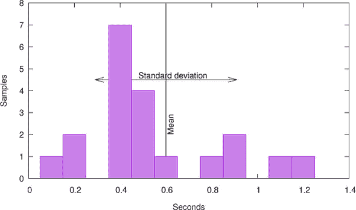

大约在`0.6`（μ(*S*), 平均值），从`0.1`（最小值）到`1.3`（最大值）。事实上，这种变化非常重要，以至于我个人不敢断言关于这样一个样本的相关性。这些虚构的测量是糟糕的，但它们有多糟糕？

*标准差* σ(*S*)衡量（再次，以秒为单位）观察到的样本与所有时间都恰好有相同结果的理想世界之间的偏差。标准差小表示我们观察到的现象很可能遵循那个理想。相反，如果标准差太高，现象可能不具有那个理想属性（有东西干扰了我们的计算），或者我们的测量可能不可靠（有东西干扰了我们的测量），或者两者兼而有之。

对于我们的例子，标准差是 `0.31`，与均值 `0.6` 相比是相当大的：这里的*相对标准差* σ(*S*)/μ(*S*) 是 `0.52`（或 `52%`）。只有低百分比范围内的值才能被认为是*好的*。

| |
| --- |

##### 取得成果 15.20

*运行时间的相对标准偏差必须在低百分比范围内。*

| |
| --- |

我们可能感兴趣的最后一个统计量是*偏度*（对于我们的样本 *S* 为 `0.79`）。它衡量样本的倾斜度（或不对称性）。一个围绕均值对称分布的样本将有一个偏度为 0，正值表示存在向右的“尾巴”。时间测量通常不是对称的。我们很容易在我们的样本中看到这一点：最大值 `1.3` 距离均值 `0.7`。因此，为了使样本围绕 `0.6` 的均值对称，我们需要一个 `-0.1` 的值，这是不可能的。

如果你对这些非常基本的统计概念不熟悉，你可能现在需要重新审视它们一下。在本章中，我们将看到所有这些我们感兴趣的统计量都可以用*原点矩*来计算：

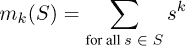

因此，零阶原点矩计算样本数量，第一阶是所有值的总和，第二阶是值的平方和，依此类推。

对于计算机科学，通过将待测量的代码放入**`for`**循环中，并在该循环前后放置测量，可以很容易地通过重复实验来自动化。因此，我们可以执行样本代码成千上万次，并计算循环迭代的平均时间。然后，我们希望时间测量可以忽略，因为实验的整体时间可能只有几秒钟，而时间测量本身可能只需要几毫秒。

在本章的示例代码中，我们将尝试评估对 timespec_get 的调用性能，以及收集测量统计信息的小工具的性能。列表 15.1 包含了我们想要调查的不同代码版本的几个 **`for`** 循环。时间测量收集在统计信息中，并使用从 **timespec_get** 获得的 **`tv_nsec`** 值。在这种方法中，我们引入的实验偏差是明显的：我们使用对 **timespec_get** 的调用来测量其自身的性能。但这种偏差很容易掌握：增加迭代次数可以减少偏差。我们在这里报告的实验是在迭代次数为 2²⁴ – 1 的值下进行的。

##### 列表 15.1\. 重复测量几个代码片段

```
**53**      **timespec_get**(&t[0], **TIME_UTC**);
**54**      /* Volatile for i ensures that the loop is effected */
**55**      for (**uint64_t** volatile i = 0; i < iterations; ++i) {
**56**        /* do nothing */
**57**      }
**58**      **timespec_get**(&t[1], **TIME_UTC**);
**59**      /* s must be volatile to ensure that the loop is effected */ 
**60**      for (**uint64_t** i = 0; i < iterations; ++i) {
**61**        s = i;
**62**      }
**63**      **timespec_get**(&t[2], **TIME_UTC**);
**64**      /* Opaque computation ensures that the loop is effected */
**65**      for (**uint64_t** i = 1; accu0 < upper; i += 2) {
**66**        accu0 += i;
**67**      }
**68**      **timespec_get**(&t[3], **TIME_UTC**);
**69**      /* A function call can usually not be optimized out. */
**70**      for (**uint64_t** i = 0; i < iterations; ++i) {
**71**        **timespec_get**(&tdummy, **TIME_UTC**);
**72**        accu1 += tdummy.**tv_nsec**;
**73**      }
**74**      **timespec_get**(&t[4], **TIME_UTC**);
**75**      /* A function call can usually not be optimized out, but
**76**         an inline function can. */
**77**      for (**uint64_t** i = 0; i < iterations; ++i) {
**78**        **timespec_get**(&tdummy, **TIME_UTC**);
**79**        stats_collect1(&sdummy[1], tdummy.**tv_nsec**);
**80**      }
**81**      **timespec_get**(&t[5], **TIME_UTC**);
**82**      for (**uint64_t** i = 0; i < iterations; ++i) {
**83**        **timespec_get**(&tdummy, **TIME_UTC**);
**84**        stats_collect2(&sdummy[2], tdummy.**tv_nsec**);
**85**      }
**86**      **timespec_get**(&t[6], **TIME_UTC**);
**87**      for (**uint64_t** i = 0; i < iterations; ++i) {
**88**        **timespec_get**(&tdummy, **TIME_UTC**);
**89**        stats_collect3(&sdummy[3], tdummy.**tv_nsec**);
**90**      }
**91**      **timespec_get**(&t[7], **TIME_UTC**);
```

但这个主要平凡的观察并不是目标；它只是作为我们想要测量的某些代码的例子。列表 15.1 中的 **`for`** 循环包含进行更复杂统计收集的代码。目标是能够逐步断言这种不断增加的复杂性如何影响计时。

##### `timespec.c`

```
struct **timespec** tdummy;
stats sdummy[4] = { 0 };
```

从第 70 行开始的循环只是累积值，因此我们可以确定它们的平均值。下一个循环（第 77 行）使用 stats_collect1 函数，该函数维护一个 *运行平均值*：即，它通过修改前一个平均值 δ(*x**[n],* *μ*[*n*–1]) 来计算一个新的平均值 *μ[n]*，其中 *x**[n]* 是新的测量值，*μ*[*n*–1] 是前一个平均值。其他两个循环（第 82 行和第 87 行）分别使用 stats_collect2 和 stats_collect3 函数，它们分别使用类似公式来计算 *第二* 和 *第三* 阶矩，从而计算方差和偏度。我们将在稍后讨论这些函数。

但首先，让我们看看我们用于代码仪表化的工具。

##### 列表 15.2\. 使用 timespec_diff 和 stats_collect2 收集时间统计信息

```
**102**      for (unsigned i = 0; i < loops; i++) {
**103**        double diff = timespec_diff(&t[i+1], &t[i]);
**104**         stats_collect2(&statistic[i], diff);
**105**      }
```

我们使用 第 11.2 节 中的 timespec_diff 来计算两次测量之间的时间差，并使用 stats_collect2 来汇总统计信息。然后，整个操作被另一个循环（未显示）包裹，该循环重复该实验 10 次。完成该循环后，我们使用 stats 类型的函数来打印结果。

##### 列表 15.3\. 使用 stats_mean 和 stats_rsdev_unbiased 打印时间统计信息

```
**109**     for (unsigned i = 0; i < loops; i++) {
**110**       double mean = stats_mean(&statistic[i]);
**111**       double rsdev  = stats_rsdev_unbiased(&statistic[i]);
**112**       **printf**("loop %u: E(t) (sec):\t%5.2e ± %4.02f%%,\tloop body %5.2e\n",
**113**              i, mean, 100.0*rsdev, mean/iterations);
**114**     }
```

显然，stats_mean 提供了对测量平均值访问的途径。函数 stats_rsdev_unbiased 返回 *无偏相对标准差*：即，一个无偏且与平均值归一化的标准差。

> ¹
> 
> 这样，它是对预期时间标准差的真正估计，而不仅仅是我们的任意样本。

在我的笔记本电脑上，典型的输出如下所示：

##### `终端`

```
**0**     loop 0: E(t) (sec): 3.31e-02 ± 7.30%,  loop body 1.97e-09
**1**     loop 1: E(t) (sec): 6.15e-03 ± 12.42%, loop body 3.66e-10
**2**     loop 2: E(t) (sec): 5.78e-03 ± 10.71%, loop body 3.45e-10
**3**     loop 3: E(t) (sec): 2.98e-01 ± 0.85%,  loop body 1.77e-08
**4**     loop 4: E(t) (sec): 4.40e-01 ± 0.15%,  loop body 2.62e-08
**5**     loop 5: E(t) (sec): 4.86e-01 ± 0.17%,  loop body 2.90e-08
**6**     loop 6: E(t) (sec): 5.32e-01 ± 0.13%,  loop body 3.17e-08
```

在这里，行 0、1 和 2 对应于我们尚未讨论的循环，而行 3 到 6 对应于我们已讨论的循环。它们的相对标准偏差小于 1%，因此我们可以断言我们有一个好的统计量，并且右侧的时间是每次迭代的成本的较好估计。例如，在我的 2.1 GHz 笔记本电脑上，这意味着循环 3、4、5 或 6 的一次迭代执行分别需要大约 36、55、61 和 67 个时钟周期。因此，将简单的求和替换为 stats_collect1 的额外成本是 19 个周期，从那里到 stats_collect2 是 6 个周期，如果我们使用 stats_collect3，还需要额外的 6 个周期。

为了证明这是合理的，让我们看看 stats 类型：

```
**1**   typedef struct stats stats;
**2**   struct stats {
**3**     double moment[4];
**4**   };
```

在这里，我们为所有统计 *矩* 预留一个 **`double`**。以下列表中的 stats_collect 函数展示了当我们收集一个新值并将其插入时，这些值是如何更新的。

##### 列表 15.4\. 收集到三阶矩的统计信息

```
**120**   /**
**121**    ** @brief Add value @a val to the statistic @a c.
**122**    **/
**123**   inline
**124**   void stats_collect(stats* c, double val, unsigned moments) {
**125**     double n  = stats_samples(c);
**126**     double n0 = n-1;
**127**     double n1 = n+1;
**128**     double delta0 = 1;
**129**     double delta  = val - stats_mean(c);
**130**     double delta1 = delta/n1;
**131**     double delta2 = delta1*delta*n;
**132**     switch (moments) {
**133**     default:
**134**       c->moment[3] += (delta2*n0 - 3*c->moment[2])*delta1;
**135**     case 2:
**136**       c->moment[2] += delta2;
**137**     case 1:
**138**       c->moment[1] += delta1;
**139**     case 0:
**140**       c->moment[0] += delta0;
**141**     }
**142**   }
```

如前所述，我们看到这是一个相对简单的算法，可以增量地更新矩。与原始方法相比，重要特性是我们通过使用当前均值估计的差异来避免数值不精确，并且可以不存储所有样本来完成此操作。这种方法最初由 Welford [1962] 描述，后来推广到更高阶矩；参见 Pébay [2008]。实际上，我们的 stats_collect1 等函数只是对该选择的矩数的一个实例化。

##### `stats.h`

```
**154**   inline
**155**   void stats_collect2(stats* c, double val) {
**156**      stats_collect(c, val, 2);
**157**   }
```

stats_collect2 的汇编列表显示，我们使用 25 个周期来执行此函数的发现似乎是合理的。它对应于一小部分算术指令、加载和存储操作.^([2])

> ²
> 
> 此汇编器显示了 `x86_64` 汇编器的一些我们尚未见过的特性：浮点硬件寄存器和指令，以及 *SSE* 寄存器和指令。在这里，内存位置 `(`**`%`****`rdi`**`)`、`8(`**`%`****`rdi`**`)` 和 `16(`**`%`****`rdi`**`)` 对应于 c->moment[`i`]，其中 *i* = 0、1、2，指令名称减去 v-前缀；sd-后缀显示执行的操作；**`vfmadd213sd`** 是一个浮点乘加指令。

##### 列表 15.5\. GCC 的 stats_collect2(c) 汇编器

```
      vmovsd 8(%**rdi**), %xmm1
      vmovsd (%**rdi**), %xmm2
      vaddsd .LC2(%**rip**), %xmm2, %xmm3
      vsubsd %xmm1, %xmm0, %xmm0
      vmovsd %xmm3, (%**rdi**) 
      vdivsd %xmm3, %xmm0, %xmm4
      vmulsd %xmm4, %xmm0, %xmm0
      vaddsd %xmm4, %xmm1, %xmm1
      vfmadd213sd 16(%**rdi**), %xmm2, %xmm0
      vmovsd %xmm1, 8(%**rdi**)
      vmovsd %xmm0, 16(%**rdi**)
```

现在，通过使用示例测量，我们仍然犯了一个系统性错误。我们将测量点放在 **`for`** 循环之外。这样做，我们的测量也形成了对应于循环本身的指令。列表 15.6 显示了我们之前讨论中跳过的三个循环。这些基本上是空的，试图测量这种循环的贡献。

##### 列表 15.6\. 使用 `struct` **`timespec`** 仪器化三个 `for` 循环

```
**53**      **timespec_get**(&t[0], **TIME_UTC**);
**54**      /* Volatile for i ensures that the loop is effected */
**55**      for (**uint64_t** volatile i = 0; i < iterations; ++i) {
**56**        /* do nothing */
**57**      }
**58**      **timespec_get**(&t[1], **TIME_UTC**);
**59**      /* s must be volatile to ensure that the loop is effected */
**60**      for (**uint64_t** i = 0; i < iterations; ++i) {
**61**        s = i;
**62**      }
**63**      **timespec_get**(&t[2], **TIME_UTC**);
**64**      /* Opaque computation ensures that the loop is effected */
**65**      for (**uint64_t** i = 1; accu0 < upper; i += 2) {
**66**        accu0 += i;
**67**      }
**68**      **timespec_get**(&t[3], **TIME_UTC**);
```

事实上，当我们试图测量没有内部语句的 **`for`** 循环时，我们面临一个严重的问题：一个没有效果的空循环可以在编译时被优化器消除。在正常的生产条件下，这是一件好事；但在这里，当我们想要测量时，这很烦人。因此，我们展示了三种不应该被优化掉的循环变体。第一个将循环变量声明为 **`volatile`**，这样所有对该变量的操作都必须由编译器发出。列表 15.7 和 15.8 展示了 GCC 和 Clang 的这个循环版本。我们看到，为了符合循环变量的 **`volatile`** 特性，两者都必须发出多个加载和存储指令。

##### 列表 15.7\. GCC 版本的 列表 15.6 中的第一个循环

```
.L510:
        movq 24(%**rsp**), %rax
        addq $1, %rax
        movq %rax, 24(%**rsp**)
        movq 24(%**rsp**), %rax
        cmpq %rax, %r12
        ja .L510
```

##### 列表 15.8\. Clang 版本的 列表 15.6 中的第一个循环

```
.LBB9_17:
        incq 24(%**rsp**)
        movq 24(%**rsp**), %rax
        cmpq %r14, %rax
        jb .LBB9_17
```

对于下一个循环，我们试图更加节省，只强制将一个 **`volatile`** 存储到一个辅助变量 s。正如我们在 列表 15.9 中可以看到的，结果是看起来相当高效的汇编代码：它由四个指令组成，一个加法、一个比较、一个跳转和一个存储。

##### 列表 15.9\. GCC 版本的 列表 15.6 中的第二个循环

```
.L509:
        movq %rax, s(%**rip**)
        addq $1, %rax
        cmpq %rax, %r12
        jne .L509
```

为了更接近真实测量的循环，在下一个循环中我们使用了一个技巧：我们执行索引计算和比较，其结果应该是对编译器透明的。列表 15.10 显示，这导致汇编代码类似于之前，但现在我们有一个额外的加法操作而不是存储操作。

##### 列表 15.10\. GCC 版本的 列表 15.6 中的第三个循环

```
.L500:
        addq %rax, %rbx
        addq $2, %rax
        cmpq %rbx, %r13
        ja .L500
```

表 15.1 总结了我们在本节收集的结果，并比较了各种测量的差异。正如我们所预期的，我们看到使用 **`volatile`** 存储的循环 1 比使用 **`volatile`** 循环计数器的循环快 80%。因此，使用 **`volatile`** 循环计数器不是一个好主意，因为它可能会降低测量的准确性。

另一方面，从循环 1 转到循环 2 的影响并不明显。我们看到的 6% 的提升小于测试的标准差，所以我们甚至不能确定是否有提升。如果我们真的想了解是否存在差异，我们就需要进行更多的测试，并希望标准差能够缩小。

但为了评估我们观察的时间影响，测量结果非常明确。**`for`** 循环的版本 1 和 2 的影响大约比调用 **timespec_get** 或 stats_collect 的影响低一到两个数量级。因此，我们可以假设对于循环 3 到 6 的值是测量函数预期时间的良好估计。

这些测量中存在一个强烈的平台依赖性成分：使用 **timespec_get** 进行时间测量。实际上，我们从这次经验中了解到，在我的机器上，时间测量和统计收集的成本具有相同的数量级。对我个人来说，这是一个令人惊讶的发现：当我写这一章时，我以为时间测量会花费更多。

> ³
> 
> 2016 年配备最新系统和现代编译器的普通 Linux 笔记本电脑。

我们还了解到，像标准差这样的简单统计很容易获得，并且可以帮助我们断言性能差异。

|  |
| --- |

##### 取走 15.21

*收集测量值的高阶矩以计算方差和偏度既简单又便宜。*

|  |
| --- |

因此，无论你将来在性能方面提出何种主张，或者看到他人提出此类主张，都要确保结果的可变性至少已经得到解决。

|  |
| --- |

##### 取走 15.22

*运行时测量必须用统计方法加固。*

|  |
| --- |

### 摘要

+   性能不应以正确性为代价。

+   **`inline`** 是优化小型、纯函数的合适工具。

    ##### 表 15.1\. 测量值比较

    | 循环 |   | 每次迭代的秒数 | 差异 | 增减 | 结论性 |
    | --- | --- | --- | --- | --- | --- |
    | 0 | **volatile** 循环 | 1.97 10^(–09) |   |   |   |
    | 1 | **volatile** 存储 | 3.66 10^(–10) | -1.60 10 ^(–09) | -81% | 是 |
    | 2 | 不透明加法 | 3.45 10^(–10) | -2.10 10^(–11) | -6% | 否 |
    | 3 | 加 **timespec_get** | 1.77 10^(–08) | 1.74 10^(–08) | +5043% | 是 |
    | 4 | 加均值 | 2.62 10^(–08) | 8.5 10^(–09) | +48% | 是 |
    | 5 | 加方差 | 2.90 10^(–08) | 2.8 10^(–09) | +11% | 是 |
    | 6 | 加偏度 | 3.17 10^(–08) | 2.7 10^(–09) | +9% | 是 |

+   **`restrict`** 有助于处理函数参数的别名属性。它必须谨慎使用，因为它对函数的调用方施加了可能在编译时无法强制执行的约束。

+   性能改进的主张必须伴随着彻底的测量和统计。

## 第十六章\. 函数式宏

本章涵盖

+   检查参数

+   访问调用上下文

+   与可变参数宏一起工作

+   类型通用编程

我们在 第 10.2.1 节 明确遇到了 *函数式* 宏，也隐式地遇到了。C 标准库中的某些接口通常通过使用它们来实现，例如 `tgmath.h` 中的类型通用接口。我们还看到，函数式宏可以轻易地使我们的代码变得晦涩，并需要一套特定的限制性规则。避免函数式宏带来的许多问题的最简单策略是仅在它们不可替代的地方使用它们，并在它们可替代的地方使用适当的手段。

|  |
| --- |

`<tgmath.h>`

|  |
| --- |
|  |

##### 取走 16.1

*尽可能，优先选择函数式宏而不是函数。*

|  |
| --- |

即，在具有已知类型的固定数量参数的情况下，我们应该以函数原型形式提供适当的安全类型接口。让我们假设我们有一个简单的具有副作用的功能：

```
unsigned count(void) {
  static counter = 0;
  ++counter;
  return counter;
}
```

现在考虑这个函数与宏一起使用来平方一个值：

```
#define square_macro(X) (X*X)   // Bad: do not use this.
...
  unsigned a = count();
  unsigned b = square_macro(count());
```

在这里，square_macro`(`count`())`的使用被替换为 count`()*`count`()`，两次执行 count:^([[[Exs 1]](#ch16fn-ex01)])。这可能是初学者在那个时刻所期望的。

> ^([Exs 1])
> 
> 证明 b `==` a`*`a `+ 3*`a `+ 2`。

为了达到与函数式宏相同的表现，在头文件中提供一个**`inline`**定义就完全足够了：

```
inline unsigned square_unsigned(unsigned x) {  // Good 
  return x*x;
}
...
  unsigned c = count();
  unsigned d = square_unsigned(count());
```

这里，square_unsigned`(`count`())`导致 count 只执行一次.^([[[Exs 2]](#ch16fn-ex02)])

> ^([Exs 2])
> 
> 证明 d `==` c`*`c `+ 2*`c `+ 1`。

但有许多情况下，函数式宏可以做得比函数更多。它们可以

+   强制类型映射和参数检查

+   跟踪执行

+   提供具有可变参数数量的接口

+   提供类型通用的接口

+   为函数提供默认参数

在本章中，我将尝试解释如何实现这些功能。我们还将讨论 C 的另外两个明显可区分的特性：一个是**`_Generic`**，因为它在宏中很有用，没有它们使用起来会非常繁琐；另一个是*可变参数函数*，因为它们现在大多已经过时，不应该在新代码中使用。

本章的一个警告是，宏*编程*很快就会变得丑陋且几乎无法阅读，所以你需要耐心和善意来理解这里的一些代码。让我们举一个例子：

```
#define MINSIZE(X, Y) (sizeof(X)<sizeof(Y) ? sizeof(X) :sizeof(Y))
```

右侧，替换字符串，相当复杂。它有四个**`sizeof`**评估和一些组合它们的运算符。但这个宏的*使用*不应该很难：它只是计算参数的最小大小。

|  |
| --- |

##### 16.2 节要点

*功能宏应提供一个简单的接口来执行复杂任务。*

|  |
| --- |

### 16.1\. 函数式宏的工作原理

为了提供我们列出的特性，C 选择了与其他流行编程语言截然不同的路径：文本替换。正如我们所见，宏在编译的早期阶段被替换，称为*预处理器处理*。这种替换遵循 C 标准中指定的一系列严格规则，并且所有编译器（在同一平台上）都应该将任何源代码预处理成完全相同的中间代码。

让我们将以下内容添加到我们的示例中：

```
#define BYTECOPY(T, S) **memcpy**(&(T), &(S), MINSIZE(T, S))
```

现在我们有两个宏定义：MINSIZE 和 BYTECOPY。第一个有一个*参数列表* `(`X`,` Y`)`，它定义了两个参数 X 和 Y，以及*替换文本*

```
(sizeof(X)<sizeof(Y) ? sizeof(X) : sizeof(X))
```

指向 X 和 Y。同样，BYTECOPY 也有两个参数 T 和 S，替换文本从**memcpy**开始。

这些宏满足了我们对函数式宏的要求：它们只对每个参数评估一次，^([[[Exs 3]](#ch16fn-ex03)]) 使用`()`括号包围所有参数，并且没有隐藏的影响，如意外的控制流。宏的参数必须是标识符。一个特殊的范围规则限制了这些标识符在替换文本中的有效性。

> ^([Exs 3])
> 
> 为什么会这样？

当编译器遇到一个函数宏的名称后跟一个闭括号对，例如在`BYTECOPY(`A`,` B`)`中，它认为这是一个*宏调用*，并根据以下规则进行文本替换：

1.  为了避免无限递归，宏的定义暂时被禁用。

1.  在`()`内的文本，即*参数列表*，会被扫描以查找括号和逗号。每个开括号`(`必须与一个闭括号`)`匹配。不在这样的额外`()`内的逗号用于将参数列表分隔成各个参数。对于这里处理的情形，参数的数量必须与宏定义中参数的数量相匹配。

1.  每个参数都会递归展开，以处理可能出现在其中的宏。在我们的例子中，A 可能又是另一个宏，展开为某个变量名，例如 redA。

1.  参数展开的结果文本片段被分配给参数。

1.  替换文本的副本被创建，并将所有参数替换为它们的相应定义。

1.  结果替换文本再次受到宏替换的影响。

1.  这个最终的替换文本被插入到源代码中，代替宏调用。

1.  宏的定义被重新启用。

这个过程乍一看可能有些复杂，但实际上很容易实现，并提供了一个可靠的替换序列。它保证了避免无限递归和复杂的局部变量赋值。在我们的例子中，`BYTECOPY(`A`,` B`)`的展开结果将是

```
**memcpy**(&(redA), &(B), (sizeof((redA))<sizeof((B))?sizeof((redA)):sizeof((B))
    ))
```

我们已经知道宏（函数式或非函数式）的标识符存在于它们自己的命名空间中。这是出于一个非常简单的理由：

| |
| --- |

##### 摘要 16.3

*宏替换在早期翻译阶段完成，在给组成程序的标记赋予任何其他解释之前。*

| |
| --- |

因此，预处理阶段对关键字、类型、变量或后续翻译阶段的其它构造一无所知。

由于宏展开显式禁用了递归，甚至可以有使用与函数式宏相同标识符的函数。例如，以下有效的 C 代码：

```
**1**   inline
**2**   char const* string_literal(char const str[static 1]){
**3**     return str;
**4**   }
**5**   #define string_literal(S) string_literal("" S "")
```

它定义了一个接收字符数组作为参数的函数 `string_literal`，以及一个同名的宏，该宏以奇怪的参数排列调用函数，其理由我们很快就会看到。有一个更专门的规则有助于处理我们有一个宏和一个同名函数的情况。它与函数衰减 (takeaway 11.22) 类似。

|  |
| --- |

##### Takeaway 16.4 (宏保留)

*如果一个功能宏后面没有跟* *`()`**，则不会展开。

|  |
| --- |

在前面的例子中，函数和宏的定义取决于它们出现的顺序。如果宏定义首先给出，它将立即展开成类似

```
 **1**   inline
 **2**   char const* string_literal("" char const str[static 1] ""){ // Error 
 **3**     return str;
 **4**   }
```

这是有误的。但如果我们将 `string_literal` 名称用括号括起来，它就不会展开，并保持为一个有效的定义。一个完整的例子可能如下所示：

```
 **1**   // header file 
 **2**   #define string_literal(S) string_literal("" S "")
  **3**   inline char const* (string_literal)(char const str[static 1]){
 **4**     return str;
 **5**   }
 **6**   extern char const* (*func)(char const str[static 1]);
 **7**   // One translation unit 
 **8**   char const* (string_literal)(char const str[static 1]);
 **9**   // Another translation unit 
**10**   char const* (*func)(char const str[static 1]) = string_literal;
```

即，函数的内联定义和实例化声明都受到周围括号的保护，并且不会展开功能宏。最后一行显示了该功能的另一种常见用法。这里 `string_literal` 后面没有跟 `()`, 因此应用了两个规则。首先，宏保留阻止了宏的展开，然后函数衰减 (takeaway 11.22) 将函数的使用评估为指向该函数的指针。

### 16.2\. 参数检查

如我们之前所述，在具有固定数量且类型由 C 的类型系统良好建模的参数的情况下，我们应该使用函数而不是函数式宏。不幸的是，C 的类型系统并没有涵盖我们可能想要区分的所有特殊情况。

一个有趣的例子是我们想要传递给可能危险的函数（如 **printf**）的字符串字面量。正如我们在 第 5.6.1 节 中看到的，字符串字面量是只读的，但甚至没有 **`const`** 修饰。此外，像之前的 *函数* `string_literal` 一样，具有 `[`**`static`** `1]` 的接口并没有被语言强制执行，因为没有 `[`**`static`** `1]` 的原型是等效的。在 C 中，没有方法可以规定函数接口的参数 `str` 应该满足以下约束：

+   是一个字符指针

+   必须非空

+   必须不可变^([1])

    > ¹
    > 
    > **`const`** 只约束被调用的函数，而不是调用者。

+   必须以 `0` 结尾

所有这些属性在编译时检查可能特别有用，但我们没有方法在函数接口中指定它们。

*宏* `string_literal` 填补了语言规范中的这一空白。在其展开中出现的奇怪空字符串字面量 `"" X ""` 确保字符串字面量只能用字符串字面量调用：

```
**1**   string_literal("hello");   // "" "hello" "" 
**2**   char word[25] = "hello";
**3**   ...
**4**   string_literal(word);      // "" word ""      // Error
```

宏和函数 `string_literal` 只是这种策略的一个简单例子。一个更有用的例子会是

##### **`macro_trace.h`**

```
**12**   /**
**13**    ** @brief A simple version of the macro that just does 
**14**    ** a @c fprintf or nothing 
**15**    **/ 
**16**   #if **NDEBUG**
**17**   # define TRACE_PRINT0(F, X) do { /* nothing */ } while (**false**)
**18**   #else
**19**   # define TRACE_PRINT0(F, X) **fprintf**(**stderr**, F, X)
**20**   #endif
```

一个可以在程序的调试构建上下文中使用的宏，用于插入调试输出：

##### **`macro_trace.c`**

```
**17**     TRACE_PRINT0("my favorite variable: %g\n", sum);
```

这看起来无害且高效，但它有一个陷阱：参数 F 可以是任何指向 **`char`** 的指针。特别是，它可能是一个位于可修改内存区域的格式字符串。这可能会导致错误或恶意的字符串修改导致格式无效，从而引发程序崩溃，或者可能泄露秘密。在 第 16.5 节 中，我们将更详细地了解为什么这对像 **fprintf** 这样的函数尤其危险。

在像示例中那样简单的代码中，我们向 **fprintf** 传递简单的字符串字面量，这些问题不应该发生。现代编译器实现能够追踪 **fprintf**（和类似函数）的参数，以检查格式说明符和其他参数是否匹配。

如果传递给 **fprintf** 的格式不是字符串字面量而是任何指向 **`char`** 的指针，则此检查将不起作用。为了抑制这种情况，我们可以强制在此处使用字符串字面量：

##### **`macro_trace.h`**

```
**22**   /**
**23**    ** @brief A simple version of the macro that ensures that the @c 
**24**    ** fprintf format is a string literal 
**25**    **
**26**    ** As an extra, it also adds a newline to the printout, so 
**27**    ** the user doesn't have to specify it each time. 
**28**    **/ 
**29**   #if **NDEBUG**
**30**   # define TRACE_PRINT1(F, X) do { /* nothing */ } while (**false**)
**31**   #else
**32**   # define TRACE_PRINT1(F, X) **fprintf**(**stderr**, "" F "\n", X)
**33**   #endif
```

现在，F 必须接收一个字符串字面量，然后编译器就可以进行工作并警告我们是否存在不匹配。

宏 TRACE_PRINT1 仍然存在弱点。如果它与 **`NDEBUG`** 设置一起使用，则参数将被忽略，因此不会检查一致性。这可能会导致长期效果，即不匹配在长时间内未被检测到，而在调试时突然出现。

因此，我们宏的下一个版本定义分为两个步骤。第一步使用类似的 **`#if`**`/#`**`else`** 概念来定义一个新的宏：TRACE_ON。

##### **`macro_trace.h`**

```
**35**   /**
**36**    ** @brief A macro that resolves to @c 0 or @c 1 according to @c 
**37**    ** NDEBUG being set 
**38**    **/ 
**39**   #ifdef **NDEBUG**
**40**   # define TRACE_ON 0
**41**   #else
**42**   # define TRACE_ON 1
**43**   #endif
```

与程序员可以将其设置为任何值的 **`NDEBUG`** 宏相反，这个新宏保证要么是 `1` 要么是 `0`。其次，TRACE_PRINT2 使用常规的 **`if`** 条件定义：

##### **`macro_trace.h`**

```
**45**   /**
**46**    ** @brief A simple version of the macro that ensures that the @c 
**47**    ** fprintf call is always evaluated 
**48**    **/ 
**49**   #define TRACE_PRINT2(F, X)                                       \
**50**   do { if (TRACE_ON) **fprintf**(**stderr**, "" F "\n", X); } while (**false**)
```

当其参数为 `0` 时，任何现代编译器都应该能够优化掉对 **fprintf** 的调用。它不应该省略对参数 F 和 X 的检查。因此，无论我们是在调试还是不是，宏的参数必须始终匹配，因为 **fprintf** 需要这样。

与之前使用空字符串字面量 "" 类似，还有其他技巧可以强制宏参数具有特定类型。其中一种技巧是添加适当的 `0`：`+0` 强制参数为任何算术类型（整数、浮点或指针）。类似 `+0.`0F 的东西提升为浮点类型。例如，如果我们只想为调试打印一个值，而不跟踪值的类型，这可能就足够了：

##### **`macro_trace.h`**

```
**52**   /**
**53**    ** @brief Traces a value without having to specify a format 
**54**    **/ 
**55**   #define TRACE_VALUE0(HEAD, X) TRACE_PRINT2(HEAD " %Lg", (X)+0.0L)
```

它适用于任何整数或浮点数 X。对于 **`long double`** 的格式 "%Lg" 确保任何值都以合适的方式呈现。显然，HEAD 参数现在不能包含任何 **fprintf** 格式，但编译器会告诉我们是否有不匹配。

然后，复合字面量可以是一种方便的方式来检查参数 X 的值是否可以赋值给类型 T。考虑以下尝试打印指针值的第一个尝试：

##### **`macro_trace.h`**

```
**57**   /**
**58**    ** @brief Traces a pointer without having to specify a format 
**59**    **
**60**    ** @warning Uses a cast of @a X to @c void*
**61**    **/ 
**62**   #define TRACE_PTR0(HEAD, X)  TRACE_PRINT2(HEAD " %p", (void*)(X))
```

它尝试使用 "%p" 格式打印指针值，该格式期望一个通用的 **`void`**`*` 类型指针。因此，宏使用 *类型转换* 将 X 的值和类型转换为 **`void`**`*`。像大多数类型转换一样，如果 X 不是一个指针，这里的类型转换可能会出错：因为类型转换告诉编译器我们知道我们在做什么，实际上所有的类型检查都被关闭了。

这可以通过首先将 X 赋值给 **`void`**`*` 类型的对象来避免。赋值只允许一组受限的 *隐式转换*，这里是将任何指针转换为 **`void`**`*` 的转换：

##### **`macro_trace.h`**

```
**64**   /**
**65**    ** @brief Traces a pointer without specifying a format 
**66**    **/
**67**   #define TRACE_PTR1(HEAD, X)                     \
**68**   TRACE_PRINT2(HEAD " %p", ((void*){ 0 } = (X)))
```

技巧是使用类似于 `((`T`){ 0 } = (`X`))` 的方法来检查 X 是否可以赋值给类型 T。在这里，复合字面量 `((`T`){ 0 }` 首先创建了一个类型 T 的临时对象，然后我们将 X 赋值给它。再次，现代优化编译器应该会优化掉临时对象的使用，并为我们进行类型检查。

### 16.3. 访问调用上下文

由于宏只是文本替换，它们可以与其调用者的上下文更紧密地交互。一般来说，对于常规功能，这不是所希望的，我们更希望调用者（函数参数的评估）和被调用者（函数参数的使用）之间的上下文有明确的分离。

然而，在调试的上下文中，我们通常希望打破这种严格的分离，以观察代码中特定点的部分状态。原则上，我们可以在宏内部访问任何变量，但通常我们想要有关调用环境的更多具体信息：特定调试输出来源的位置跟踪。

C 提供了几个用于此目的的构造。它有一个特殊的宏 **`__LINE__`**，它始终展开为源文件中实际行的十进制整数常量：

##### **`macro_trace.h`**

```
**70**   /**
**71**    ** @brief Adds the current line number to the trace 
**72**    **/ 
**73**   #define TRACE_PRINT3(F, X)                               \
**74**   do {                                                     \
**75**     if (TRACE_ON)                                          \
**76**       **fprintf**(**stderr**, "%lu: " F "\n", **__LINE__**+0UL, X);   \
**77**   } while (**false**)
```

同样，宏 **`__DATE__`**、**`__TIME__`** 和 **`__FILE__`** 包含包含编译日期和时间以及当前 TU 名称的字符串字面量。另一个构造，**`__func__`**，是一个包含当前函数名称的局部 **`static`** 变量：

##### **`macro_trace.h`**

```
**79**   /**
**80**    ** @brief Adds the name of the current function to the trace 
**81**    **/ 
**82**   #define TRACE_PRINT4(F, X)                      \
**83**   do {                                            \
**84**     if (TRACE_ON)                                 \
**85**      **fprintf**(**stderr**, "%s:%lu: " F "\n",          \
**86**              **__func__**, **__LINE__**+0UL, X);          \
**87**   } while (**false**)
```

如果以下调用

##### **`macro_trace.c`**

```
**24**      TRACE_PRINT4("my favorite variable: %g", sum);
```

在源文件的第 24 行，并且 **main** 是其周围函数，则相应的输出看起来类似于以下内容：

##### `终端`

```
**0**      main:24: my favorite variable: 889
```

如果我们像这个例子中那样自动使用 **fprintf**，我们应该注意的一个潜在陷阱是，其列表中的所有参数都必须与指定符中给出的类型正确匹配。对于 **`__func__`**，这没有问题：根据其定义，我们知道这是一个 **`char`** 数组，所以 "%s" 指定符是合适的。**`__LINE__`** 则不同。我们知道它是一个表示行号的十进制常量。因此，如果我们回顾 第 5.3 节 中十进制常量类型的规则，我们会看到类型取决于值。在嵌入式平台上，**`INT_MAX`** 可能小到 32767，而非常大的源代码（可能是自动生成的）可能有超过这个数量的行。一个好的编译器应该在出现这种情况时警告我们。

|  |
| --- |

##### Takeaway 16.5

*在* **`__LINE__`** *中的行号可能不适合放入一个* **`int`***.*

|  |
| --- |
|  |

##### Takeaway 16.6

*使用* **`__LINE__`** *固有的很危险。*

|  |
| --- |

在我们的宏中，我们通过将类型固定为 **`unsigned long`**^([2]) 或在编译期间将数字转换为字符串来避免这个问题。

> ²
> 
> 希望没有源代码会超过 40 亿行。

另一种来自调用上下文的信息类型对于跟踪通常非常有用：我们传递给宏作为参数的实际表达式。由于这通常用于调试目的，C 语言有一个特殊的操作符用于它：**`#`**。如果这样的 **`#`** 出现在宏参数的展开中，这个参数的实际参数将被 *字符串化*：也就是说，它的所有文本内容都被放入一个字符串字面量中。以下我们跟踪宏的变体有一个 **`#`**`X`

##### **`macro_trace.h`**

```
**91**   /**
**92**    ** @brief Adds a textual version of the expression that is evaluated 
**93**    **/ 
**94**   #define TRACE_PRINT5(F, X)                                      \
**95**   do {                                                            \
**96**    if (TRACE_ON)                                                  \
**97**     **fprintf**(**stderr**, "%s:" STRGY(**__LINE__**) ":(" #X "): " F "\n",   \
**98**             **__func__**, X);                                         \
**99**   } while (**false**)
```

在每次宏调用时，它被替换为第二个参数的文本。对于以下调用

##### **`macro_trace.c`**

```
**25**     TRACE_PRINT5("my favorite variable: %g", sum);
**26**     TRACE_PRINT5("a good expression: %g", sum*argc);
```

相应的输出看起来类似

##### `终端`

```
**0**     main:25:(sum): my favorite variable: 889
**1**     main:26:(sum*argc): a good expression: 1778
```

因为预处理阶段对这些参数的解释一无所知，这种替换完全是文本性的，并且应该像在源代码中一样出现，可能还有一些对空白的调整。

|  |
| --- |

##### Takeaway 16.7

*使用操作符* **`#`** *进行字符串化不会在其参数中展开宏。*

|  |
| --- |

由于前面提到的 **`__LINE__`** 可能存在的问题，我们还想直接将行号转换为字符串。这有两个优点：它避免了类型问题，并且字符串化完全在编译时完成。正如我们所说的，**`#`** 操作符仅适用于宏参数，所以像 **`#`** **`__LINE__`** 这样的简单使用不会产生预期的效果。现在考虑以下宏定义：

##### **`macro_trace.h`**

```
**89**   #define STRINGIFY(X) #X
```

字符串化在参数替换之前进行，`STRINGIFY`(`**__LINE__`**) 的结果是 "__LINE__"；宏 **`__LINE__`** 不会被展开。所以这个宏仍然不足以满足我们的需求。

现在，STRGY`(`**`__LINE__`**`)` 首先扩展为 STRINGIFY`(25)`（如果我们处于第 25 行）。然后它扩展为 "25"，即字符串化的行号：

##### **`macro_trace.h`**

```
**90**   #define STRGY(X) STRINGIFY(X)
```

为了完整性，我们还将提及另一个仅在预处理阶段有效的运算符：*`##`* 运算符。它用于更加专业的用途：它是一个 *标记连接运算符*。当编写整个宏库，并且需要自动生成类型或函数名称时，它可能很有用。

### 16.4\. 默认参数

C 库的一些函数有参数，这些参数大多数时候接收相同的无聊参数。对于 **strtoul** 和其相关函数来说就是这样。记住，这些函数接收三个参数：

```
**1**   unsigned long int **strtoul**(char const nptr[restrict],
**2**                             char** restrict endptr,
**3**                             int base);
```

第一个是我们要将其转换为 **`unsigned long`** 的字符串。endptr 将指向字符串中数字的末尾，base 是解释字符串的整数基数。有两个特殊约定适用：如果 endptr 可能是空指针，并且 base 是 `0`，则字符串被解释为十六进制（以 "0x" 开头）、八进制（以 "0" 开头）或十进制否则。

大多数时候，**strtoul** 都不带 endptr 功能，并且将符号基数设置为 `0`，例如在类似以下内容中

```
**1**   int **main**(int argc, char* argv[argc+1]) {
**2**     if (argc < 2) return **EXIT_FAILURE**;
**3**     **size_t** len = **strtoul**(argv[1], 0, 0);
**4**     ...
**5**   }
```

将程序的第一个命令行参数转换为长度值。为了避免这种重复，并让代码的读者专注于重要的事情，我们可以引入一个中间级别的宏，如果省略这些 `0` 参数，则提供这些参数：

##### **`generic.h`**

```
**114**
**115**   /**
**116**    ** @brief Calls a three-parameter function with default arguments 
**117**    ** set to 0 
**118**    **/ 
**119**   #define ZERO_DEFAULT3(...) ZERO_DEFAULT3_0(**__VA_ARGS__**, 0, 0, )
**120**   #define ZERO_DEFAULT3_0(FUNC, _0, _1, _2, ...) FUNC(_0, _1, _2)
**121**
**122**   #define **strtoul**(...) ZERO_DEFAULT3(**strtoul**, **__VA_ARGS__**)
**123**   #define **strtoull**(...) ZERO_DEFAULT3(**strtoull**, **__VA_ARGS__**)
**124**   #define **strtol**(...) ZERO_DEFAULT3(**strtol**, **__VA_ARGS__**)
```

在这里，宏 ZERO_DEFAULT3 通过后续添加和删除参数来工作。它应该接收一个函数名称和至少一个要传递给该函数的参数。首先，将两个零添加到参数列表中；然后，如果这导致超过三个组合参数，则省略多余的参数。因此，对于只有一个参数的调用，替换序列如下所示：

```
**strtoul**(argv[1])
//      ...
ZERO_DEFAULT3(**strtoul**, argv[1])
//            ... 
ZERO_DEFAULT3_0(**strtoul**, argv[1], 0, 0, )
//              FUNC   , _0     ,_1,_2,... 
**strtoul**(argv[1], 0, 0)
```

由于宏扩展中抑制递归的特殊规则，对 **strtoul** 的最终函数调用将不会进一步扩展，并将传递到下一个编译阶段。

如果我们用三个参数调用 **strtoul**

```
**strtoul**(argv[1], ptr, 10)
//      ...
ZERO_DEFAULT3(**strtoul**, argv[1], ptr, 10)
//            ...
ZERO_DEFAULT3_0(**strtoul**, argv[1], ptr, 10, 0, 0, )
//              FUNC   , _0     , _1 , _2, ... 
**strtoul**(argv[1], ptr, 10) 
```

替换序列实际上产生了与开始时完全相同的标记。

### 16.5\. 可变长度参数列表

我们已经研究了接受可变长度参数列表的函数：**printf**、**scanf**及其朋友。它们的声明在参数列表的末尾有`...`标记来指示这个特性：在已知参数的初始数量（例如**printf**的格式）之后，可以提供一个任意长度的额外参数列表。稍后，在第 16.5.2 节中，我们将简要讨论如何定义这样的函数。因为这个特性不安全，所以它是危险的，几乎已经过时，所以我们不会坚持这个特性。作为替代，我们将介绍一个类似的功能，即*可变参数宏*，这可以主要用于替换函数的特性。

#### 16.5.1\. 可变参数宏

可变长度参数宏，简称为*可变参数宏*，使用相同的标记*`...`*来指示这个特性。与函数一样，这个标记必须出现在参数列表的末尾：

##### **`macro_trace.h`**

```
**101**   /**
**102**    ** @brief Allows multiple arguments to be printed in the 
**103**    ** same trace 
**104**    **/ 
**105**   #define TRACE_PRINT6(F, ...)                            \
**106**   do {                                                    \
**107**     if (TRACE_ON)                                        \
**108**       **fprintf**(**stderr**, "%s:" STRGY(**__LINE__**) ": " F "\n",  \
**109**               **__func__**, **__VA_ARGS__**);                     \
**110**   } while (**false**) 
```

在这里，在 TRACE_PRINT6 中，这表示在格式参数 F 之后，可以提供一个非空的可选参数列表。这个展开的参数列表可以通过标识符**`__VA_ARGS__`**在展开中访问。因此，一个如下的调用

##### **`macro_trace.c`**

```
**27**     TRACE_PRINT6("a collection: %g, %i", sum, argc);
```

只是传递参数到**fprintf**并产生输出

##### `Terminal`

```
**0**   main:27: a collection: 889, 2
```

不幸的是，按照目前的写法，**`__VA_ARGS__`**中的列表不能为空或不存在。所以对于我们迄今为止所看到的，我们不得不为列表不存在的情况编写一个单独的宏：

##### `macro_trace.h`

```
**113**    ** @brief Only traces with a text message; no values printed 
**114**    **/
**115**   #define TRACE_PRINT7(...)                                     \
**116**   do {                                                          \
**117**    if (TRACE_ON)                                                \
**118**     **fprintf**(**stderr**, "%s:" STRGY(**__LINE__**) ": " **__VA_ARGS__** "\n",\
**119**             **__func__**);                                          \
**120**   } while (**false**)
```

但通过更多的努力，这两个功能可以被合并成一个宏：

##### `macro_trace.h`

```
**138**    ** @brief Traces with **or** without values 
**139**    **
**140**    ** This implementation has the particularity of adding a format 
**141**    ** @c "%.0d" **to** skip the last element of the list, which was 
**142**    ** artificially added. 
**143**    **/
**144**   #define TRACE_PRINT8(...)                        \
**145**   TRACE_PRINT6(TRACE_FIRST(**__VA_ARGS__**) "%.0d",    \
**146**                TRACE_LAST(**__VA_ARGS__**))
```

这里，TRACE_FIRST 和 TRACE_LAST 是宏，分别提供对列表中第一个和剩余参数的访问。它们相对简单。它们使用辅助宏，使我们能够区分第一个参数 _0 和其余的**`__VA_ARGS__`**。由于我们希望能够用一个或多个参数调用它们，它们向列表中添加了一个新的参数`0`。对于 TRACE_FIRST 来说，这很顺利。这个额外的`0`就像其余的参数一样被忽略：

##### **`macro_trace.h`**

```
**122**   /**
**123**    ** @brief Extracts the first argument from a list of arguments 
**124**    **/ 
**125**   #define TRACE_FIRST(...) TRACE_FIRST0(**__VA_ARGS__**, 0)
**126**   #define TRACE_FIRST0(_0, ...) _0
```

对于 TRACE_LAST 来说，这有点问题，因为它通过一个额外的值扩展了我们感兴趣的列表：

##### **`macro_trace.h`**

```
**128**   /**
**129**    ** @brief Removes the first argument from a list of arguments 
**130**    **
**131**    ** @remark This is only suitable in our context, 
**132**    ** since this adds an artificial last argument. 
**133**    **/ 
**134**   #define TRACE_LAST(...) TRACE_LAST0(**__VA_ARGS__**, 0)
**135**   #define TRACE_LAST0(_0, ...) **__VA_ARGS__** 
```

因此，TRACE_PRINT6 通过一个额外的格式说明符`%.0d`来补偿这一点，该说明符打印一个宽度为`0`的**`int`**：即，什么也不打印。测试它在两种不同的使用情况

##### **`macro_trace.c`**

```
**29**     TRACE_PRINT8("a collection: %g, %i", sum, argc);
**30**     TRACE_PRINT8("another string");
```

给我们我们想要的 exactly what we want:

##### `Terminal`

```
**0**   main:29: a collection: 889, 2
**1**   main:30: another string
```

参数列表中的**`__VA_ARGS__`**部分也可以像任何其他宏参数一样进行字符串化：

##### **`macro_trace.h`**

```
**148**   /**
**149**    ** @brief Traces by first giving a textual representation of the 
**150**    ** arguments 
**151**    **/ 
**152**   #define TRACE_PRINT9(F, ...)                            \
**153**   TRACE_PRINT6("(" #**__VA_ARGS__** ") " F, **__VA_ARGS__**)
```

参数的文本表示

##### **`macro_trace.c`**

```
**31**     TRACE_PRINT9("a collection: %g, %i", sum***acos**(0), argc);
```

被插入，包括分隔它们的逗号：

##### `Terminal`

```
**0**      main:31: (sum*acos(0), argc) a collection: 1396.44, 2
```

到目前为止，我们具有可变数量参数的迹宏变体也必须在格式参数 F 中接收正确的格式说明符。这可能会是一项繁琐的工作，因为它迫使我们始终跟踪要打印的列表中每个参数的类型。一个内联函数和宏的组合可以在这里帮助我们。首先让我们看看这个函数：

##### **`macro_trace.h`**

```
**166**   /**
**167**    ** @brief A function to print a list of values 
**168**    **
**169**    ** @remark Only call this through the macro ::TRACE_VALUES, 
**170**    ** which will provide the necessary contextual information. 
**171**    **/ 
**172**   inline
**173**   void trace_values(**FILE*** s,
**174**                     char const func[static 1],
**175**                     char const line[static 1],
**176**                     char const expr[static 1],
**177**                     char const head[static 1],
**178**                     **size_t** len, long double const arr[len]) {
**179**     **fprintf**(s, "%s:%s:(%s) %s %Lg", func, line,
**180**             trace_skip(expr), head, arr[0]);
**181**     for (**size_t** i = 1; i < len-1; ++i)
**182**       **fprintf**(s, ", %Lg", arr[i]);
**183**     **fputc**('\n', s);
**184**   }
```

它在前面加上相同的标题信息后打印一系列 **`long double`** 值，就像我们之前所做的那样。但这次，函数通过一个已知长度为 len 的 **`long double`** 数组接收值列表。由于我们将很快看到的原因，该函数实际上总是跳过数组的最后一个元素。使用 trace_skip 函数，它还跳过参数 expr 的初始部分。

将上下文信息传递给函数的宏有两个级别。第一个只是以不同的方式按摩参数列表：

##### **`macro_trace.h`**

```
**204**   /**
**205**    ** @brief Traces a list of arguments without having to specify 
**206**    ** the type of each argument 
**207**    **
**208**    ** @remark This constructs a temporary array with the arguments 
**209**    ** all converted to @c long double. Thereby implicit conversion 
**210**    ** to that type is always guaranteed. 
**211**    **/ 
**212**   #define TRACE_VALUES(...)                       \
**213**   TRACE_VALUES0(ALEN(**__VA_ARGS__**),                \
**214**                 #**__VA_ARGS__**,                     \
**215**                 **__VA_ARGS__**,                      \
**216**                 0                                 \
**217**                 )
```

首先，借助我们即将看到的 ALEN，它评估列表中的元素数量。然后它将列表字符串化，并最终将列表本身以及一个额外的 `0` 附加到列表上。所有这些都被输入到 TRACE_VALUES0：

##### **`macro_trace.h`**

```
**219**   #define TRACE_VALUES0(NARGS, EXPR, HEAD, ...)                    \
**220**   do {                                                             \
**221**     if (TRACE_ON) {                                                \
**222**       if (NARGS > 1)                                               \
**223**         trace_values(**stderr**, **__func__**, STRGY(**__LINE__**),            \
**224**                      "" EXPR "", "" HEAD "", NARGS,               \
**225**                      (long double const[NARGS]){ **__VA_ARGS__** });   \
**226**       else                                                         \
**227**         **fprintf**(**stderr**, "%s:" STRGY(**__LINE__**) ": %s\n",           \
**228**                 **__func__**, HEAD);                                   \
**229**     }                                                              \
```

这里，没有 HEAD 的列表用作类型为 **`long double const`**`[`NARG`]` 的复合字面量的初始化器。我们之前添加的 `0` 确保初始化器永远不会为空。有了关于参数列表长度的信息，我们也能够进行情况区分，如果唯一的参数只是格式字符串。

我们还需要展示 ALEN：

##### **`macro_trace.h`**

```
**186**   /**
**187**    ** @brief Returns the number of arguments in the ... list 
**188**    **
**189**    ** This version works for lists with up to 31 elements. 
**190**    **
**191**    ** @remark An empty argument list is taken as one (empty) argument. 
**192**    **/ 
**193**   #define ALEN(...) ALEN0(**__VA_ARGS__**,                    \
**194**     0x1E, 0x1F, 0x1D, 0x1C, 0x1B, 0x1A, 0x19, 0x18,       \
**195**     0x17, 0x16, 0x15, 0x14, 0x13, 0x12, 0x11, 0x10,       \
**196**     0x0E, 0x0F, 0x0D, 0x0C, 0x0B, 0x0A, 0x09, 0x08,       \
**197**     0x07, 0x06, 0x05, 0x04, 0x03, 0x02, 0x01, 0x00)
**198**
**199**   #define ALEN0(_00, _01, _02, _03, _04, _05, _06, _07,           \
**200**                 _08, _09, _0A, _0B, _0C, _0D, _0F, _0E,           \
**201**                 _10, _11, _12, _13, _14, _15, _16, _17,           \
**202**                 _18, _19, _1A, _1B, _1C, _1D, _1F, _1E, ...) _1E 
```

策略是取 **`__VA_ARGS__`** 列表并附加一个递减数字列表 `31`，`30`，...，`0`。然后，通过使用 ALEN0，我们返回该新列表的第 31 个元素。根据原始列表的长度，这个元素将是其中一个数字。实际上，很容易看出返回的数字正是原始列表的长度，前提是它至少包含一个元素。在我们的用例中，总是至少有一个格式字符串，因此空列表的边界情况不会发生。

#### 16.5.2\. 一个小插曲：可变参数函数

现在让我们简要地看看 *可变参数函数*：具有可变长度参数列表的函数。如前所述，这些函数通过在函数声明中使用 *`...`* 操作符来指定，例如

```
int **printf**(char const format[static 1], ...);
```

这样的函数在其接口定义中存在一个基本问题。与普通函数不同，在调用方面，不清楚应该将参数转换为哪种类型。例如，如果我们调用 **printf**`(`"%d"`, 0)`，编译器不会立即清楚调用函数期望哪种类型的 `0`。对于这种情况，C 语言有一套规则来确定参数转换的类型。这些规则几乎与算术规则相同：

|  |
| --- |

##### 取得 16.8 的要点

*当传递给可变参数时，所有算术类型都像算术运算一样进行转换，除了* **`float`** *参数，它们会被转换为**`double`***。

|  |
| --- |

所以特别地，当它们被传递给可变参数时，例如**`char`**和**`short`**这样的类型会被转换为更宽的类型，通常是**`int`**。

到目前为止，一切顺利：现在我们知道了如何调用这样的函数。但不幸的是，这些规则并没有告诉我们被调用函数应该期望接收哪种类型。

|  |
| --- |

##### 总结 16.9

*可变函数必须接收关于可变列表中每个参数类型的有效信息。*

|  |
| --- |

**printf**函数通过在格式参数内部指定类型来规避这个困难。让我们看看以下简短的代码片段：

```
**1**   unsigned char zChar = 0;
**2**   **printf**("%hhu", zChar);
```

这会导致 zChar 被评估，提升为**`int`**类型，并作为参数传递给**printf**，然后它读取这个**`int`**并将其重新解释为**`unsigned char`**。这种机制是

+   *复杂：* 因为函数的实现必须为所有基本类型提供专门的代码

+   *易出错：* 因为每个调用都依赖于参数类型被正确传递给函数

+   *紧迫：* 因为程序员必须检查每个参数的类型

尤其是后者可能导致严重的可移植性问题，因为常量在不同的平台上可能有不同的类型。例如，一个看似无害的调用

```
**printf**("%d: %s\n", 65536, "a small number"); // Not portable
```

在大多数平台上都能正常工作：那些具有超过 16 位**`int`**类型的平台。但在某些平台上，它可能在运行时失败，因为`65536`是**`long`**。这种潜在失败的最坏例子是宏**`NULL`**：

```
**printf**("%p: %s\n", **NULL**, "print of NULL"); // Not portable
```

正如我们在第 11.1.5 节中看到的，**`NULL`**仅保证是一个空指针常量。编译器实现者可以自由选择他们提供的变体：有些人选择`(`**`void`**`)0`，其类型为**`void`**`*`；大多数人选择`0`，其类型为**`int`**。在指针和**`int`**宽度不同的平台上，例如所有现代 64 位平台，这可能导致程序崩溃.^([3])

> ³
> 
> 这是我们不应该使用**`NULL`**的原因之一 (总结 11.14)。

|  |
| --- |

##### 总结 16.10

*使用可变函数不可移植，除非每个参数都被强制转换为特定类型。*

|  |
| --- |

这与我们之前在 TRACE_VALUES 示例中看到的可变宏的使用大不相同。在那里，我们将可变列表用作数组的初始化器，因此所有元素都会自动转换为正确的目标类型。

|  |
| --- |

##### 总结 16.11

*避免在新接口中使用可变函数。*

|  |
| --- |

这些函数根本不值得麻烦。但是如果你必须实现一个可变参数函数，你需要 C 库头文件 `stdarg.h`。它定义了一个类型，**`va_list`**，以及四个可以作为 **`va_list`** 后面不同参数使用的函数式宏。它们的伪接口看起来像这样：

|  |
| --- |

`<stdarg.h>`

|  |
| --- |

```
**1**   void **va_start**(**va_list** ap, parmN);
**2**   void **va_end**(**va_list** ap);
**3**   *type* **va_arg**(**va_list** ap, *type*);
**4**   void **va_copy**(**va_list** dest, **va_list** src);
```

第一个示例展示了如何实际上避免编写可变参数函数的核心部分。对于任何涉及格式化打印的事情，我们应该使用现有的函数：

##### **`va_arg.c`**

```
**20**   **FILE*** iodebug = 0;
**21**
**22**   /**
**23**    ** @brief Prints to the debug stream @c iodebug 
**24**    **/ 
**25**   #ifdef __GNUC__
**26**   __attribute__((format(**printf**, 1, 2)))
**27**   #endif
**28**   int printf_debug(const char *format, ...) {
**29**     int ret = 0;
**30**     if (iodebug) {
**31**       **va_list** va;
**32**       **va_start**(va, format);
**33**       ret = **vfprintf**(iodebug, format, va);
**34**       **va_end**(va);
**35**     }
**36**     return ret;
**37**   }
```

我们使用 **`va_start`** 和 **`va_end`** 做的唯一事情是创建一个 **`va_list`** 参数列表，并将此信息传递给 C 库函数 **`vfprintf`**。这完全免除了我们进行情况分析和跟踪参数的需要。条件 __attribute__ 是编译器特定的（这里，对于 `GCC` 和其同类）。这种附加功能在应用已知参数约定并且编译器可以进行一些良好的诊断以确保参数有效性的情况下可能非常有用。

现在，我们将查看一个接收 n 个 **`double`** 值并求和的可变参数函数：^([[[Exs 4]](#ch16fn-ex04)])

> ^([Exs 4])
> 
> 只接收所有参数都是同一类型的可变参数函数可以被一个可变参数宏和一个接受数组的 **`inline`** 函数所替代。这样做吧。

##### **`va_arg.c`**

```
 **6**   /**
 **7**    ** @brief A small, useless function to show how variadic 
 **8**    ** functions work 
 **9**    **/ 
**10**   double sumIt(**size_t** n, ...) {
**11**     double ret = 0.0;
**12**     **va_list** va;
**13**     **va_start**(va, n);
**14**     for (**size_t** i = 0; i < n; ++i)
**15**       ret += **va_arg**(va, double);
**16**     **va_end**(va);
**17**     return ret;
**18**   }
```

**`va_list`** 通过使用列表之前的最后一个参数进行初始化。注意，通过某种魔法，**va_start** 接收 va 如此，而不是使用地址运算符 `&`。然后，在循环内部，列表中的每个值都通过使用 **va_arg** 宏来接收，该宏需要对其 *类型* 参数进行显式指定（这里，**`double`**）。此外，我们必须自己维护列表的长度，这里是通过将长度作为参数传递给函数来实现的。参数类型的编码（这里，隐式）和列表末尾的检测留给函数的程序员。

|  |
| --- |

##### Takeaway 16.12

**`va_arg`** 机制不提供对 **`va_list`** 长度的访问。

|  |
| --- |
|  |

##### Takeaway 16.13

*可变参数函数需要一个特定的列表长度约定*。

|  |
| --- |

### 16.6\. 类型通用的编程

C11 对 C 语言的一个真正的贡献是直接语言支持类型通用的编程。C99 有 `tgmath.h`（见 第 8.2 节）用于类型通用的数学函数，但它没有提供很多来自己编写这样的接口。特定的附加功能是关键字 **`_Generic`**，它引入了以下形式的初等表达式：

|  |
| --- |

`<tgmath.h>`

|  |
| --- |

```
**1**   _Generic(*controlling expression*,
**2**     *type1*: *expression1*,
**3**     ... ,
**4**     *typeN*: *expressionN*)
```

这非常类似于一个 **`switch`** 语句。但是，*控制表达式*只取其类型（但请稍后查看），结果是 *expression1* . . . *expressionN* 中的一个表达式，这些表达式由相应的类型特定的 *type1* . . . *typeN* 选择，其中之一可能只是关键字 **`default`**。

最简单的用例之一，也是 C 委员会主要考虑的，是使用**`_Generic`**通过提供函数指针之间的选择来实现类型通用宏接口。一个基本例子是`tgmath.h`接口，如**`fabs`**。**`_Generic`**本身不是一个宏特性，但可以方便地在宏展开中使用。通过忽略复数浮点类型，这样的**`fabs`**宏可能看起来像这样：

```
**1**   #define **fabs**(X)        \
**2**   _Generic((X),          \
**3**     float: **fabsf**,        \
**4**     long double: **fabsl**,  \
**5**     default: **fabs**)(X)
```

这个宏区分了两种特定类型，**`float`**和**`long double`**，分别选择对应的函数**fabsf**和**fabsl**。如果参数 X 是任何其他类型，它将被映射到**`fabs`**的**`default`**情况。也就是说，其他算术类型，如**`double`**和整数类型，被映射到**`fabs`**.^([[[Exs 5]](#ch16fn-ex05)])^([[[Exs 6]](#ch16fn-ex06)])

> ^([Exs 5])
> 
> 找出两个原因，说明这个宏展开中**`fabs`**的出现本身没有被展开。
> 
> ^([Exs 6])
> 
> 将**`fabs`**宏扩展到涵盖复数浮点类型。

现在，一旦确定了结果函数指针，它就被应用于**`_Generic`**主要表达式后面的参数列表`(`X`)`。

下面是一个更完整的例子：

##### **`generic.h`**

```
 **7**   inline
 **8**   double min(double a, double b) {
 **9**     return a < b ? a : b;
**10**   }
**11**
**12**   inline
**13**   long double minl(long double a, long double b) {
**14**     return a < b ? a : b;
**15**   }
**16**
**17**   inline
**18**   float minf(float a, float b) {
**19**     return a < b ? a : b;
**20**   }
**21**
**22**   /**
**23**    ** @brief Type-generic minimum for floating-point values 
**24**    **/ 
**25**   #define min(A, B)                               \
**26**   _Generic((A)+(B),                               \
**27**            float: minf,                           \
**28**            long double: minl,                     \
**29**            default: min)((A), (B))
```

它实现了两个实数值最小值的类型通用接口。定义了三个针对三种浮点类型的**`inline`**函数，并按与**`fabs`**类似的方式使用。不同之处在于，这些函数需要两个参数，而不仅仅是其中一个，因此**`_Generic`**表达式必须决定两种类型的组合。这是通过使用两个参数之和作为*控制表达式*来实现的。因此，参数提升和转换作用于加法操作中的参数，因此**`_Generic`**表达式选择两种类型中较宽的函数，或者如果两个参数都是整数，则选择**`double`**。

与只有一个函数，比如**`long double`**相比，区别在于具体参数的类型信息没有丢失。

|  |
| --- |

##### 取得第 16.14 点

*`_Generic`**表达式的结果类型是所选表达式的类型*。

|  |
| --- |

这与例如三元运算符`a`?`b`:c 的情况形成对比。在这里，返回类型是通过结合类型 b 和 c 来计算的。对于三元运算符，必须这样做，因为 a 可能在不同的运行中不同，所以 b 或 c 可能被选中。由于**`_Generic`**根据类型做出选择，因此这个选择在编译时是固定的。因此，编译器可以提前知道选择的结果类型。

在我们的例子中，我们可以确信，所有使用我们的接口生成的代码永远不会使用比程序员预见的更宽的类型。特别是，我们的 min 宏应该始终导致编译器为相关类型内联适当的代码.^([[[Exs 7]](#ch16fn-ex07)])^([[[Exs 8]](#ch16fn-ex08)])

> ^([Exs 7])
> 
> 将 min 宏扩展以涵盖所有宽整数类型。
> 
> ^([Exs 8])
> 
> 将 min 扩展以涵盖指针类型，同样。

|  |
| --- |

##### 摘要 16.15

使用 **`_Generic`** 与 **`inline`** 函数一起使用增加了优化机会。

|  |
| --- |

对“控制表达式的类型”这一说法的解释有点模糊，因此 C17 与 C11 相比对此进行了澄清。事实上，正如前面的例子所暗示的，这种类型是如果将其传递给函数的表达式的类型。这意味着特别是：

+   如果有的话，类型限定符将从控制表达式的类型中删除。

+   数组类型被转换为基类型的指针类型。

+   函数类型被转换为函数指针。

|  |
| --- |

##### 摘要 16.16

在 **`_Generic`** 表达式中的类型表达式应该是无资格的类型：没有数组类型，也没有函数类型。

|  |
| --- |

这并不意味着类型表达式不能是指向这些之一：有资格类型的指针、数组的指针或函数的指针。但一般来说，这个规则使得编写类型通用的宏更容易，因为我们不需要考虑所有限定符的组合。有 3 个限定符（指针类型有 4 个），所以否则每个基类型都会有 8（甚至 16）个不同的类型表达式。以下示例 MAXVAL 已经相对较长：它为所有 15 个可排序类型都有一个特殊案例。如果我们还必须跟踪资格，我们就必须专门化 120 个案例！

##### `generic.h`

```
**31**   /**
**32**    ** @brief The maximum value for the type of @a X 
**33**    **/ 
**34**   #define MAXVAL(X)                                        \
**35**   _Generic((X),                                            \
**36**            bool: (bool)+1,                                 \
**37**            char: (char)+**CHAR_MAX**,                          \
**38**            signed char: (signed char)+**SCHAR_MAX**,           \
**39**            unsigned char: (unsigned char)+**UCHAR_MAX**,       \
**40**            signed short: (signed short)+**SHRT_MAX**,          \
**41**            unsigned short: (unsigned short)+**USHRT_MAX**,     \
**42**            signed: **INT_MAX**,                                \
**43**            unsigned: **UINT_MAX**,                             \
**44**            signed long: **LONG_MAX**,                          \
**45**            unsigned long: **ULONG_MAX**,                       \
**46**            signed long long: **LLONG_MAX**,                    \
**47**            unsigned long long: **ULLONG_MAX**,                 \
**48**            float: **FLT_MAX**,                                 \
**49**            double: **DBL_MAX**,                                \
**50**            long double: **LDBL_MAX**)
```

这是一个例子，其中 `_Generic` 表达式被用于与之前不同的方式，当时我们“只是”选择了一个函数指针然后调用该函数。这里的结果是一个整数常量表达式。这永远不能通过函数调用实现，而且仅用宏来实现会非常繁琐。^([[[Exs 9]](#ch16fn-ex09)]) 再次，通过转换技巧，我们可以消除我们可能不感兴趣的某些情况：

> ^([Exs 9])
> 
> 为最小值编写一个类似的宏。

##### **`generic.h`**

```
**52**   /**
**53**    ** @brief The maximum promoted value for @a XT, where XT 
**54**    ** can be an expression or a type name 
**55**    **
**56**    ** So this is the maximum value when fed to an arithmetic 
**57**    ** operation such as @c +. 
**58**    **
**59**    ** @remark Narrow types are promoted, usually to @c signed, 
**60**    ** or maybe to @c unsigned on rare architectures. 
**61**    **/ 
**62**   #define maxof(XT)                               \
**63**   _Generic(0+(XT)+0,                              \
**64**            signed: **INT_MAX**,                       \
**65**            unsigned: **UINT_MAX**,                    \
**66**            signed long: **LONG_MAX**,                 \
**67**            unsigned long: **ULONG_MAX**,              \
**68**            signed long long: **LLONG_MAX**,           \
**69**            unsigned long long: **ULLONG_MAX**,        \
**70**            float: **FLT_MAX**,                        \
**71**            double: **DBL_MAX**,                       \
**72**            long double: **LDBL_MAX**)
```

在这里，控制表达式的特殊形式添加了一个额外的功能。表达式 `0+`(标识符)+0 在标识符是变量或它是类型时是有效的。如果是变量，则使用变量的类型，并且它被解释得就像任何其他表达式一样。然后对其应用整数提升，并推导出结果类型。

如果它是一个类型，`(标识符)+0` 被读取为将 `+0` 转换为类型标识符的转换。从左侧添加 `0+` 仍然确保如果需要，执行整数提升，因此如果 XT 是类型 T 或类型 T 的表达式 X，结果相同。^([[[Exs 10]](#ch16fn-ex10)])^([[[Exs 11]](#ch16fn-ex11)])^([[[Exs 12]](#ch16fn-ex12)])

> ^([Exs 10])
> 
> 编写一个宏 PROMOTE`(XT, A)`，它返回 A 的类型为 XT 的值。例如，PROMOTE`(1`u`, 3)` 将是 `3`u。
> 
> ^([Exs 11])
> 
> 编写一个宏 SIGNEDNESS`(`XT`)`，根据 XT 类型的符号返回**`false`**或**`true`**。例如，SIGNEDNESS`(1`l`)`将是**`true`**。
> 
> ^([Exs 12])
> 
> 编写一个宏 mix`(`A`,` B`)`，计算 A 和 B 的最大值。如果两者具有相同的符号，则结果类型应该是两个中较宽的类型。如果两者具有不同的符号，则返回类型应该是一个可以容纳两种类型所有正值的无符号类型。

**`_Generic`**表达式中的类型表达式还有一个要求，即选择必须在编译时明确无误。

|  |
| --- |

##### 摘要 16.17

**`_Generic`**表达式中的类型表达式必须引用相互不兼容的类型。

|  |
| --- |
|  |

##### 摘要 16.18

**`_Generic`**表达式中的类型表达式不能是一个 VLA 的指针。

|  |
| --- |

与函数指针调用变体不同的模型可能更方便，但它也有一些陷阱。让我们尝试使用**`_Generic`**来实现两个宏 TRACE_FORMAT 和 TRACE_CONVERT，它们在以下内容中使用：

##### **`macro_trace.h`**

```
**278**   /**
**279**    ** @brief Traces a value without having to specify a format 
**280**    **
**281**    ** This variant works correctly with pointers. 
**282**    **
**283**    ** The formats are tunable by changing the specifiers in 
**284**    ** ::TRACE_FORMAT. 
**285**    **/
**286**   #define TRACE_VALUE1(F, X)                                          \
**287**     do {                                                              \
**288**       if (TRACE_ON)                                                   \
**289**         **fprintf**(**stderr**,                                               \
**290**                 TRACE_FORMAT("%s:" STRGY(**__LINE__**) ": " F, X),       \
**291**                 **__func__**, TRACE_CONVERT(X));                          \
**292**     } while (**false**) 
```

TRACE_FORMAT 很简单。我们区分了六个不同的情况：

##### **`macro_trace.h`**

```
**232**   /**
**233**    ** @brief Returns a format that is suitable for @c fprintf 
**234**    **
**235**    ** @return The argument @a F must be a string literal, 
**236**    ** so the return value will be. 
**237**    **
**238**    **/ 
**239**   #define TRACE_FORMAT(F, X)                      \
**240**   _Generic((X)+0LL,                               \
**241**            unsigned long long: "" F " %llu\n",    \
**242**            long long: "" F " %lld\n",             \
**243**            float: "" F " %.8f\n",                 \
**244**            double: "" F " %.12f\n",               \
**245**            long double: "" F " %.20Lf\n",         \
**246**            default: "" F " %p\n")
```

**`default`**情况，当没有匹配算术类型时，假设参数具有指针类型。在这种情况下，为了成为 fprintf 的正确参数，指针必须转换为**`void`**`*`。我们的目标是通过 TRACE_CONVERT 实现这种转换。

首次尝试可能看起来像以下这样：

```
**1**   #define TRACE_CONVERT_WRONG(X)             \
**2**   _Generic((X)+0LL,                          \
**3**            unsigned long long: (X)+0LL,      \
**4**            ...                            \
**5**            default: ((void*){ 0 } = (X)))
```

这与 TRACE_PTR1 的技巧相同，用于将指针转换为**`void`**`*`。不幸的是，这个实现是错误的。

|  |
| --- |

##### 摘要 16.19

**`_Generic`**中的所有选择表达式 1 *...* 表达式 N *必须有效*。

|  |
| --- |

例如，如果 X 是一个**`unsigned long long`**，比如 1LL，那么**`default`**情况下的代码将是

```
((void*){ 0 } = (1LL))
```

这将是将非零整数赋值给指针，这是错误的.^([4])

> ⁴
> 
> 记住，从非零整数到指针的转换必须通过强制类型转换来明确。

我们分两步解决这个问题。首先，我们有一个宏，它返回其参数、**`default`**或一个字面量零：

##### **`macro_trace.h`**

```
**248**   /**
**249**    ** @brief Returns a value that forcibly can be interpreted as 
**250**    ** pointer value 
**251**    **
**252**    ** That is, any pointer will be returned as such, but other 
**253**    ** arithmetic values will result in a @c 0. 
**254**    **/
**255**   #define TRACE_POINTER(X)                  \
**256**   _Generic((X)+0LL,                         \
**257**            unsigned long long: 0,           \
**258**            long long: 0,                    \
**259**            float: 0,                        \
**260**            double: 0,                       \
**261**            long double: 0,                  \
**262**            default: (X))
```

这有一个优点，即对 TRACE_POINTER`(`X`)`的调用始终可以赋值给**`void`**`*`。要么 X 本身是一个指针，可以赋值给**`void*`**，要么它是一种其他算术类型，宏调用的结果是`0`。综合起来，TRACE_CONVERT 看起来如下：

##### **`macro_trace.h`**

```
**264**   /**
**265**    ** @brief Returns a value that is promoted either to a wide 
**266**    ** integer, to a floating point, or to a @c void* if @a X is a 
**267**    ** pointer 
**268**    **/ 
**269**   #define TRACE_CONVERT(X)                                \
**270**   _Generic((X)+0LL,                                       \
**271**            unsigned long long: (X)+0LL,                   \
**272**            long long: (X)+0LL,                            \
**273**            float: (X)+0LL,                                \
**274**            double: (X)+0LL,                               \
**275**            long double: (X)+0LL,                          \
**276**            default: ((void*){ 0 } = TRACE_POINTER(X)))
```

### 概述

+   函数式宏比内联函数更灵活。

+   它们可以用来自动检查编译时参数，以补充函数接口，并从调用环境或默认参数提供信息。

+   它们允许我们使用可变参数列表实现类型安全的功能。

+   与**`_Generic`**结合使用，它们可以用来实现类型泛型接口。

## 第十七章\. 控制流的变化

本章涵盖

+   理解 C 中语句的正常顺序

+   通过代码进行短跳和长跳

+   函数控制流

+   处理信号

程序执行的 **`control flow`**（见图 2.1 [kindle_split_009.html#ch02fig01]）描述了程序代码中各个语句的 *顺序*：即，哪个语句在另一个语句之后执行。到目前为止，我们主要查看的是让我们可以从语法和控制表达式推导出这种控制流的代码。这样，每个函数都可以使用 *基本块* 的分层组合来描述。基本块是一系列语句的最大序列，一旦执行从这些语句中的第一个开始，就会无条件地继续到最后的语句，并且所有语句的执行都从第一个开始。

如果我们假设所有条件语句和循环语句都使用 `{}` 块，在简化的观点中，这样的基本块

+   开始于 `{}`-块的开始或一个**`case`**或跳转标签

+   结束于相应的 `{}` 块的末尾或下一个

    +   作为 **`case`** 或跳转标签目标的语句

    +   条件或循环语句的主体

    +   **`return`** 语句

    +   **`goto`** 语句

    +   调用具有特殊控制流的函数

注意，在这个定义中，没有对一般函数调用做出例外：这些函数被视为暂时挂起基本块的执行，但不会结束它。在那些具有特殊控制流并结束基本块的函数中，有一些是我们所熟知的：那些带有关键字 **`_Noreturn`** 的函数，例如 **exit** 和 **abort**。另一个这样的函数是 **setjmp**，它可能多次返回，如后文所述。

仅由通过 **`if`**`/`**`else`**^([1]) 或循环语句拼接的基本块组成的代码，具有双重优势：对我们人类来说易于阅读，并且为编译器提供了更好的优化机会。两者都可以直接推导出基本块中变量和复合字面量的生命周期和访问模式，然后捕捉这些是如何通过基本块的分层组合融入其函数中的。

> ¹
> 
> **`switch`**`/`**`case`** 语句稍微复杂了一些。

这种结构化方法的理论基础很早就由 Nishizeki 等人给出了，用于 Pascal 程序 [1977]，并由 Thorup [1995] 扩展到 C 和其他命令式语言。他们证明结构化程序（即，没有 **`goto`** 或其他任意跳转结构的程序）具有与程序语法的嵌套层次结构相匹配的控制流，可以从程序语法嵌套中推导出来。除非你不得不这样做，否则你应该坚持这种编程模型。


然而，一些特殊情况需要特殊措施。通常，程序控制流的更改可以来自

+   *条件语句:* **`if`**`/`**`else`**, **`switch`**`/`**`case`**

+   *循环语句:* **`do`**`{}`**`while`**`()`, **`while`**`()`, **`for`**`()`

+   *函数:* 函数调用，**`return`** 语句，或 **`_Noreturn`** 规范

+   *短跳转:* **`goto`** 和标签

+   *长跳转:* **setjmp**`/`**longjmp**, getcontex`t`/setcontext^([2])

    > ²
    > 
    > 定义在 POSIX 系统。

+   *中断:* 信号和**信号处理器**

+   *线程:* **thrd_create**, **thrd_exit**

这些控制流的变化可能会混淆编译器对执行抽象状态的了解。大致来说，一个人类或机械读者需要跟踪的知识复杂性从上到下增加。到目前为止，我们只看到了前四个结构。这些对应于 *语言* 功能，这些功能由语法（如关键字）或运算符（如函数调用的 `()`）确定。后三个是由 *C 库* 接口引入的。它们提供了可以跨越函数边界的程序控制流的变化（**longjmp**），可以由程序外的事件（中断）触发，甚至可以建立并发控制流，另一个 *执行线程*。

当对象受到意外控制流的影响时，可能会出现各种困难：

+   对象可能在其生命周期外被使用。

+   对象可能在使用前未被初始化。

+   对象的值可能被优化（**`volatile`**）错误解释。

+   对象可能被部分修改（**`sig_atomic_t`**, **`atomic_flag`**, 或 **`_Atomic`** 具有无锁属性和松散一致性）。

+   对象的更新可能意外地排序（所有 **`_Atomic`**）。

+   在 *关键部分*（**`mtx_t`**）内必须保证执行是独占的。

由于访问构成程序状态的那些对象的访问变得复杂，C 语言提供了帮助处理这些困难的功能。在这个列表中，它们在括号中注明，我们将在以下章节中详细讨论。

### 17.1. 一个复杂的例子

为了说明这些概念中的大多数，我们将讨论一些核心示例代码：一个名为 *basic_blocks* 的 *递归下降解析器*。以下列表展示了核心函数 descend。

##### 列表 17.1. 代码缩进的递归下降解析器

```
**60**   static
**61**   char const* descend(char const* act,
**62**                       unsigned dp[restrict static 1], // Bad
**63**                       size_t len, char buffer[len],
**64**                       jmp_buf jmpTarget) {
**65**     if (dp[0]+3 > sizeof head) longjmp(jmpTarget, tooDeep);
**66**     ++dp[0];
**67**    NEW_LINE:                             // Loops on output
**68**     while (!act || !act[0]) {            //  Loops for input
**69**       if (interrupt) longjmp(jmpTarget, interrupted);
**70**       act = skipspace(fgets(buffer, len, stdin));
**71**       if (!act) {                        // End of stream
**72**         if (dp[0] != 1) longjmp(jmpTarget, plusL);
**73**         else goto ASCEND;
**74**       }
**75**     }
**76**     fputs(&head[sizeof head - (dp[0] + 2)], stdout); // Header
**77**
**78**     for (; act && act[0]; ++act) { // Remainder of the line
**79**       switch (act[0]) {
**80**       case LEFT:                   // Descends on left brace
**81**         act = end_line(act+1, jmpTarget);
**82**         act = descend(act, dp, len, buffer, jmpTarget);
**83**         act = end_line(act+1, jmpTarget);
**84**         goto NEW_LINE;
**85**       case RIGHT:                  // Returns on right brace
**86**         if (dp[0] == 1) longjmp(jmpTarget, plusR);
**87**         else goto ASCEND;
**88**       default:                     // Prints char and goes on
**89**         putchar(act[0]);
**90**       }
**91**     }
**92**     goto NEW_LINE;
**93**    ASCEND:
**94**     --dp[0];
**95**     return act;
**96**   }
```

这段代码有几个用途。首先，它显然展示了我们稍后讨论的几个特性：递归，短跳转（**`goto`**），长跳转（**longjmp**），以及中断处理。

但至少同样重要的是，这可能是我们在这本书中处理过的最困难的代码，对于一些人来说，这甚至可能是你见过的最复杂的代码。然而，尽管它有 36 行，它仍然可以放在一屏上，这本身就是 C 代码可以非常紧凑和高效的证明。理解它可能需要几个小时，但请不要绝望；你可能还没有意识到，但如果你已经彻底阅读了这本书，你已经为这个做好了准备。

该函数实现了一个 *递归下降解析器*，它识别在 **`stdin`** 上给出的文本中的 `{}` 构造，并根据 `{}` 的嵌套在输出中缩进文本。更正式地说，用 *Backus-Nauer 形式*（BNF）编写，此函数检测文本如下递归定义

> ³
> 
> 这是计算机可读语言的规范化描述。在这里，*程序*递归定义为文本序列，可选地后跟另一个序列的程序，这些程序位于大括号内。

+   **程序** := some-text*[⋆]* [**`'{'`***程序***`'}'`**some-text*[⋆]*]*[⋆]*

并且通过改变行结构和缩进来方便地打印出这样的程序。

程序的操作描述是处理文本，特别是以特殊方式缩进 C 代码或类似代码。如果我们从 列表 3.1 中将 *文本* 输入到这个程序中，我们会看到以下输出：

##### `终端`

```
 **0**     > ./code/basic_blocks < code/heron.c
 **1**   | #include <stdlib.h>
 **2**   | #include <stdio.h>
 **3**   | /* lower and upper iteration limits centered around 1.0 */
 **4**   | static double const eps1m01 = 1.0 - 0x1P-01;
 **5**   | static double const eps1p01 = 1.0 + 0x1P-01;
 **6**   | static double const eps1m24 = 1.0 - 0x1P-24;
 **7**   | static double const eps1p24 = 1.0 + 0x1P-24;
 **8**   | int main(int argc, char* argv[argc+1])
 **9**   >| for (int i = 1; i < argc; ++i)
**10**   >>| // process args
**11**   >>| double const a = strtod(argv[i], 0); // arg -> double
**12**   >>| double x = 1.0;
**13**   >>| for (;;)
**14**   >>>| // by powers of 2
**15**   >>>| double prod = a*x;
**16**   >>>| if (prod < eps1m01)        x *= 2.0;
**17**   >>>| else if   (eps1p01 < prod) x *= 0.5;
**18**   >>>| else break;
**19**   >>>|
**20**   >>| for (;;)
**21**   >>>| // Heron approximation
**22**   >>>| double prod = a*x;
**23**   >>>| if ((prod < eps1m24) || (eps1p24 < prod))
**24**   >>>| x *= (2.0 - prod);
**25**   >>>| else break;
**26**   >>>|
**27**   >>| printf("heron: a=%.5e,\tx=%.5e,\ta*x=%.12f\n",
**28**   >>| a, x, a*x);
**29**   >>|
**30**   >| return EXIT_SUCCESS;
**31**   >|
```

因此 **`basic_blocks`** “吞噬”大括号 `{}` 并使用一系列 `>` 字符缩进代码：每个嵌套级别的大括号 `{}` 添加一个 `>`。

为了从高层次了解这个函数是如何实现这一点的，并且抽象掉你还不了解的所有函数和变量，请查看从第 79 行开始的 **`switch`** 语句以及围绕它的 **`for`** 循环。它根据当前字符进行切换。区分了三种不同的情况。最简单的是 **`default`** 情况：打印一个普通字符，字符前进，并开始下一次迭代。

另外两种情况处理 `{` 和 `}` 字符。如果我们遇到一个开括号，我们知道我们必须使用一个额外的 `>` 来缩进文本。因此，我们再次递归调用相同的函数 **`descend`**；见第 82 行。另一方面，如果遇到一个闭括号，我们转到 **`ASCEND`** 并终止这个递归级别。递归深度本身由变量 dp`[0]` 处理，它在进入时（第 66 行）增加，在退出时（第 94 行）减少。

如果你第一次尝试理解这个程序，其余的都是噪音。这些噪音有助于处理异常情况，例如行尾或左右括号的过剩。我们将在稍后更详细地看到这一切是如何工作的。

### 17.2. 排序

在我们能够查看程序控制流如何以意想不到的方式改变细节之前，我们必须更好地理解 C 语句的正常顺序保证了什么，以及它没有保证什么。我们在第 4.5 节中看到，C *表达式*的评估不一定遵循它们书写的字典顺序。例如，函数参数的评估可以按任何顺序发生。构成参数的不同表达式甚至可以根据编译器的自由裁量权或根据执行时的资源可用性交错。我们说函数参数表达式是*非序列化的*。

建立仅适用于评估的宽松规则有几个原因。其中之一是允许轻松实现优化编译器。与其它编程语言相比，编译代码的效率一直是 C 语言的一个强项。

但另一个原因是，C 语言在缺乏令人信服的数学或技术基础时不会添加任意限制。在数学上，`+`运算符中的两个操作数 a 和 b 是可以自由交换的。强加一个评估顺序将破坏这一规则，并且关于 C 程序的讨论将变得更加复杂。

在没有线程的情况下，C 语言对这一点的形式化大部分是通过*序列点*来完成的。这些是程序语法规范中的点，它们强加了执行的序列化。但我们也将在后面看到一些额外的规则，这些规则强制某些表达式评估之间的顺序，而这些表达式并不暗示序列点。

在高层次上，一个 C 程序可以看作是一系列一个接一个达到的序列点，而这样的序列点之间的代码可以按任何顺序执行，可以交错，或者遵守某些其他顺序约束。例如，在最简单的情况下，当两个语句由一个`;`分隔时，序列点之前的语句是*序列化的*，在序列点之后的语句之前。

但是，即使序列点的存在也可能不会在两个表达式之间强加特定的顺序：它只强加存在某种顺序。为了说明这一点，考虑以下代码，它是*定义良好的*：

##### `sequence_point.c`

```
 **3**   unsigned add(unsigned* x, unsigned const* y) {
 **4**     return *x += *y;
 **5**   }
 **6**   int main(void) {
 **7**     unsigned a = 3;
 **8**     unsigned b = 5;
 **9**     printf("a = %u, b = %u\n", add(&a, &b), add(&b, &a));
**10**   }
```

从第 4.5 节中记住，**printf**的两个参数可以按任何顺序评估，我们很快就会看到的序列点规则将告诉我们，对添加函数的调用强加序列点。因此，对于这段代码，我们有两种可能的输出。要么第一个加法操作完全执行，然后是第二个，要么反过来。对于第一种可能性，我们有

+   a 被改为`8`，并返回该值。

+   b 被改为`13`，并返回该值。

这样的执行输出是

##### `Terminal`

```
**0**      a = 8, b = 13
```

对于第二种，我们得到

+   b 被改为`8`，并返回该值。

+   a 被改为`11`，并返回该值。

输出如下

##### `终端`

```
**0**      a = 11, b = 8
```

即，尽管此程序的行为是定义的，但其结果并不完全由 C 标准确定。C 标准应用于此类情况的具体术语是这两个调用是*有序不确定的*。这不仅仅是一个理论讨论；两个常用的开源 C 编译器`GCC`和`Clang`在这个简单的代码上有所不同。让我再次强调：所有这些都是定义良好的行为。不要期望编译器会警告你这样的问题。

|  |
| --- |

##### Takeaway 17.1

*函数中的副作用可能导致不确定的结果*。

|  |
| --- |

这里是一个所有用 C 语法定义的序列点的列表：

+   语句的结束，无论是分号（`;`）还是闭合花括号（`}`）

+   在逗号运算符（`,`）之前的表达式结束^([4])

    > ⁴
    > 
    > 小心：分隔函数参数的逗号不属于此类。

+   声明的结束，无论是分号（`;`）还是逗号（`,`）^([5])

    > ⁵
    > 
    > 这也适用于结束枚举常量声明的逗号。

+   **`if`**、**`switch`**、**`for`**、**`while`**、条件评估（`?:`）和短路评估（`||`和`&&`）的控制表达式的结束

+   在评估函数标识符（通常是函数名）和函数调用的函数参数之后^([6])但在实际调用之前

    > ⁶
    > 
    > 这将函数标识符与函数参数放在同一级别。

+   **`return`**语句的结束

除了序列点隐含的顺序限制之外，还有其他顺序限制。前两个或多或少是明显的，但仍然应该声明：

|  |
| --- |

##### Takeaway 17.2

*任何操作符的具体操作是在其所有操作数评估之后有序的*。

|  |
| --- |
|  |

##### Takeaway 17.3

*使用任何赋值、增量或减量运算符更新对象的效果是在其操作数评估之后有序的*。

|  |
| --- |

对于函数调用，还有一个额外的规则，即函数的执行总是在任何其他表达式之前完成。

|  |
| --- |

##### Takeaway 17.4

*函数调用相对于调用者的所有评估是有序的*。

|  |
| --- |

正如我们所看到的，这可能是有序不确定的，但仍然是有序的。

另一个导致有序不确定表达式的原因来自初始化器。

|  |
| --- |

##### Takeaway 17.5

*数组或结构类型初始化列表表达式是有序不确定的*。

|  |
| --- |

最后但同样重要的是，一些序列点也适用于 C 库：

+   在 IO 函数的格式说明符动作之后

+   在任何 C 库函数返回之前^([7])

    > ⁷
    > 
    > 注意，作为宏实现的库函数可能不会定义一个序列点。

+   在调用用于搜索和排序的比较函数之前和之后

后两个代码片段为 C 库函数施加了类似于普通函数的规则。这是必要的，因为 C 库本身可能不一定是用 C 实现的。

### 17.3. 短跳转

我们已经看到了一个会中断 C 程序常见控制流特性的功能：**`goto`**。正如你希望从第 14.5 节中记得的那样，这是通过两个构造实现的：*labels*标记代码中的位置，**`goto`**语句*跳转到*这些标记的位置*在同一函数内*。

我们还看到，这样的跳转对局部对象的生存期和可见性有复杂的含义。特别是，在循环内部和由**`goto`**重复的一组语句内部定义的对象的生存期存在差异。考虑以下两个代码片段：

> ⁸
> 
> see ISO 9899:2011 6.5.2.5 p16

```
**1**   size_t* ip = 0
**2**   while(something)
**3**     ip = &(size_t){ fun() };        /* Life ends with while    */
**4**                                     /* Good: resource is freed */
**5**   printf("i is %d", *ip)            /* Bad: object is dead     */
```

与

```
**1**   size_t* ip = 0
**2**   RETRY:
**3**     ip = &(size_t){ fun() };        /* Life continues           */
**4**   if (condition) goto RETRY;
**5**                                     /* Bad: resource is blocked */
**6**   printf("i is %d", *ip)            /* Good: object is alive    */
```

两者都是通过使用复合字面量在循环中定义局部对象。复合字面量的地址被分配给指针，因此对象可以在循环外部保持可访问，例如，可以在**printf**语句中使用。

它们看起来在语义上是等价的，但实际上并非如此。对于第一种情况，与复合字面量对应的对象仅存在于**`while`**语句的作用域内。

| |
| --- |

##### 要點 17.6

*每次迭代都会定义局部对象的一个新实例*。

| |
| --- |

因此，对**`*ip`**表达式中的对象的访问是无效的。在示例中省略**printf**时，**`while`**循环的优势在于可以重用复合字面量占用的资源。

对于第二个示例，没有这样的限制：复合字面量定义的作用域是整个周围的块。因此，对象在离开该块之前是活跃的（要点 13.22）。这并不一定是好事：对象占用了本可以重新分配的资源。

在不需要**printf**语句（或类似访问）的情况下，第一个代码片段更清晰，并且有更好的优化机会。因此，在大多数情况下，它更可取。

| |
| --- |

##### 要点 17.7

**`goto`***应仅用于控制流的异常变化*。

| |
| --- |

在这里，*exceptional*通常意味着我们遇到了需要局部清理的过渡性错误条件，例如我们在第 14.5 节中展示的那样。但它也可能意味着特定的算法条件，正如我们在列表 17.1 中看到的那样。

在这里，两个标签**`NEW_LINE`**和**`ASCEND`**，以及两个宏**`LEFT`**和**`RIGHT`**反映了解析的实际状态。**`NEW_LINE`**是打印新行时的跳转目标，而**`ASCEND`**在遇到`}`或流结束时使用。**`LEFT`**和**`RIGHT`**在检测到左或右花括号时用作**`case`**标签。

在这里使用**`goto`**和标签的原因是，两种状态在函数中的两个不同位置被检测到，并且在不同级别的嵌套中。此外，标签的名称反映了它们的目的，从而提供了有关结构的信息。

### 17.4\. 函数

函数**`descend`**比扭曲的局部跳转结构更复杂：它也是递归的。正如我们所见，C 处理递归函数相当简单。

| |
| --- |

##### 17.8 小结

*每个函数调用定义了一个局部对象的实例。*

| |
| --- |

所以通常情况下，同时活跃的同函数的不同递归调用不会相互影响；每个人都拥有自己的程序状态副本。

##### 图 17.1\. 函数调用的控制流：`return`跳转到调用后的下一个指令。

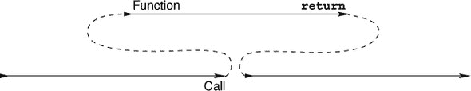

但在这里，由于指针的存在，这个原则被削弱了。buffer 和 dp 指向的数据被修改了。对于 buffer 来说，这可能是不可避免的：它将包含我们正在读取的数据。但 dp 可以（并且应该）被一个简单的**`unsigned`**参数替换.^([[[Exs 1]](#ch17fn-ex01)])我们的实现只有 dp 作为指针，因为我们想能够在发生错误时跟踪嵌套的深度。所以如果我们抽象出我们尚未解释的**longjmp**调用，使用这样的指针是糟糕的。程序的状态更难以跟踪，我们错过了优化机会.^([[[Exs 2]](#ch17fn-ex02)])

> ^([Exs 1])
> 
> 将**`descend`**修改为接收一个**`unsigned`**深度而不是指针。
> 
> ^([Exs 2])
> 
> 将初始版本的汇编输出与你的没有 dp 指针的版本进行比较。

在我们的特定例子中，因为 dp 是**`restrict`**修饰的，并且没有传递给 longjump 的调用（稍后讨论），它只在开始时增加，在结束时减少，所以 dp`[0]`在函数返回之前恢复到其原始值。因此，从外部看，似乎**`descend`**根本没有改变这个值。

如果**`descend`**的函数代码在调用侧可见，一个好的优化编译器可以推断出 dp`[0]`在调用过程中没有改变。如果**longjmp**不是特殊的，这将是一个很好的优化机会。我们很快就会看到**longjmp**的存在如何使这种优化无效，并导致一个微妙的错误。

### 17.5\. 长跳转

##### 图 17.2\. 使用**setjmp**和**longjmp**的控制流：**longjmp**跳转到由**setjmp**标记的位置。

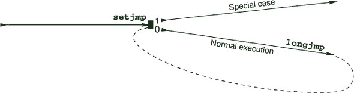

我们的函数**`descend`**也可能遇到无法修复的异常情况。我们使用枚举类型来命名它们。在这里，如果**`stdout`**无法写入，则达到**`eofOut`**；**`interrupted`**指的是程序运行时接收到的**异步信号**。我们将在后面讨论这个概念：

##### `basic_blocks.c`

```
**32**   /**
**33**    ** @brief Exceptional states of the parse algorithm
**34**    **/
**35**   enum state {
**36**     execution = 0,      //*< Normal execution
**37**     plusL,              //*< Too many left braces
**38**     plusR,              //*< Too many right braces
**39**     tooDeep,            //*< Nesting too deep to handle
**40**     eofOut,             //*< End of output
**41**     interrupted,        //*< Interrupted by a signal
**42**   };
```

我们使用函数 **longjmp** 来处理这些情况，并将相应的调用直接放在代码中我们认识到达到这种条件的地方：

+   **`tooDeep`** 在函数的开始很容易被识别。

+   **`plusL`** 在我们遇到输入流末尾而我们不在第一次递归级别时可以被检测到。

+   当我们在第一次递归级别遇到关闭的 `}` 时，会发生 **`plusR`**。

+   如果对 **`stdout`** 的写入返回了文件结束（**`EOF`**）条件，则会到达 **`eofOut`**。

+   在从 **`stdin`** 读取每一行新内容之前都会检查 **`interrupted`**。

由于 **`stdout`** 是按行缓冲的，所以我们只在写入 '\n' 字符时检查 **`eofOut`**。这发生在短函数 **`end_line`** 内部：

##### `basic_blocks.c`

```
**48**   char const* end_line(char const* s, jmp_buf jmpTarget) {
**49**     if (putchar('\n') == EOF) longjmp(jmpTarget, eofOut);
**50**     return skipspace(s);
**51**   }
```

函数 **longjmp** 伴随一个宏 **setjmp**，它用于建立 **longjmp** 调用可能引用的跳转目标。头文件 `setjmp.h` 提供以下原型：

|  |
| --- |

`<setjmp.h>`

|  |
| --- |

```
_Noreturn void longjmp(jmp_buf target, int condition);
int setjmp(jmp_buf target);    // Usually a macro, not a function
```

函数 **longjmp** 也有 **`_Noreturn`** 属性，因此我们可以确信，一旦我们检测到其中一个异常条件，当前对 **`descend`** 的调用将永远不会继续。

|  |
| --- |

##### 摘要 17.9

**longjmp** *永远不会返回到调用者*。

|  |
| --- |

这对优化器来说是非常有价值的信息。在 **`descend`** 中，**longjmp** 在五个不同的地方被调用，编译器可以大大简化分支的分析。例如，在 `!`act 测试之后，可以假设在进入 **`for`** 循环时 act 是非空的。

正常的语法标签仅在它们声明的函数内作为 **`goto`** 目标有效。相比之下，一个 **`jmp_buf`** 是一个不透明的对象，可以在任何地方声明，只要它存在且其内容有效，就可以使用。在 **`descend`** 中，我们只使用一个类型的 *跳转目标* **`jmp_buf`**，我们将其声明为一个局部变量。这个跳转目标是在作为 **`descend`** 接口的基函数 **`basic_blocks`** 中设置的；参见 列表 17.2。这个函数主要由一个处理所有不同条件的巨大 **`switch`** 语句组成。

##### 列表 17.2\. 递归下降解析器的用户界面

```
**100**   void basic_blocks(void) {
**101**     char buffer[maxline];
**102**     unsigned depth = 0;
**103**     char const* format =
**104**       "All %0.0d%c %c blocks have been closed correctly\n";
**105**     jmp_buf jmpTarget;
**106**     switch (setjmp(jmpTarget)) {
**107**     case 0:
**108**       descend(0, &depth, maxline, buffer, jmpTarget);
**109**       break;
**110**     case plusL:
**111**       format =
**112**         "Warning: %d %c %c blocks have not been closed properly\n";
**113**       break;
**114**     case plusR:
**115**       format =
**116**         "Error: closing too many (%d) %c %c blocks\n";
**117**       break;
**118**     case tooDeep:
**119**       format =
**120**         "Error: nesting (%d) of %c %c blocks is too deep\n";
**121**       break;
**122**     case eofOut:
**123**       format =
**124**         "Error: EOF for stdout at nesting (%d) of %c %c blocks\n";
**125**       break;
**126**     case interrupted:
**127**       format =
**128**         "Interrupted at level %d of %c %c block nesting\n";
**129**       break;
**130**     default:;
**131**       format =
**132**         "Error: unknown error within (%d) %c %c blocks\n";
**133**     }
**134**     fflush(stdout);
**135**     fprintf(stderr, format, depth, LEFT, RIGHT);
**136**     if (interrupt) {
**137**       SH_PRINT(stderr, interrupt,
**138**                "is somebody trying to kill us?");
**139**       raise(interrupt);
**140**     }
**141**   }
```

当我们通过正常控制流程来到这里时，会采取那个 **`switch`** 的 **`0`** 分支。这是 **setjmp** 的一个基本原理。

|  |
| --- |

##### 摘要 17.10

*当通过正常控制流程到达时，对 * **setjmp** * 的调用会将调用位置标记为跳转目标并返回 * **`0`** *。

|  |
| --- |

正如我们所说的，当调用**longjmp**时，jmpTarget 必须处于活动状态且有效。因此，对于**`auto`**变量，变量的声明范围不得被离开；否则它将是无效的。对于有效性，当我们调用**longjmp**时，**setjmp**的所有上下文都必须仍然处于活动状态。在这里，我们通过将 jmpTarget 声明在与**setjmp**调用相同的范围内来避免复杂性。

|  |
| --- |

##### 摘要 17.11

*离开对* **setjmp** *的调用范围会使跳转目标无效。*

|  |
| --- |

一旦我们进入**`case`** `0`并调用**`descend`**，我们可能会遇到一些异常条件，并调用**longjmp**来终止解析算法。这将控制权交回 jmpTarget 中标记的调用位置，就像我们从**setjmp**的调用中返回一样。唯一的可见差异是，现在返回值是我们传递给**longjmp**的第二个参数的条件。例如，如果我们在一个对**`descend`**的递归调用开始时遇到了**`tooDeep`**条件，并调用了**longjmp**(`jmpTarget`,` **`tooDeep`**`)，我们会跳回到**`switch`**的控制表达式，并接收**`tooDeep`**的返回值。然后执行将继续在相应的**`case`**标签处继续。

|  |
| --- |

##### 摘要 17.12

*对* **longjmp** *的调用会直接将控制权转移到由* **setjmp** *设置的**位置**，就像它返回了条件参数一样。*

|  |
| --- |

然而，请注意，已经采取了预防措施，以确保无法作弊并第二次重新采取正常路径。

|  |
| --- |

##### 摘要 17.13

*将* *`0`* *作为* *`condition`* *参数传递给* **longjmp** *会被替换为* *`1`**.*

|  |
| --- |

**setjmp**`/`**longjmp**机制非常强大，可以避免从函数调用中返回的整个级联。在我们的例子中，如果我们允许输入程序的嵌套深度最大为 30，那么当有 30 个对**`descend`**的活跃递归调用时，就会检测到**`tooDeep`**条件。常规的错误返回策略会**`return`**到这些调用中的每一个，并在每个级别上做一些工作。对**longjmp**的调用允许我们缩短所有这些返回，并直接在**`switch`**的**`basic_blocks`**中继续执行。

由于**setjmp**`/`**longjmp**允许做出一些简化的假设，这个机制出奇地高效。根据处理器架构的不同，它通常不需要超过 10 到 20 条汇编指令。库实现所遵循的策略通常很简单：**setjmp**将必要的硬件寄存器（包括栈和指令指针）保存在**`jmp_buf`**对象中，而**longjmp**则从那里恢复它们，并将控制权交回存储的指令指针.^([9])

> ⁹
> 
> 对于这个词汇，你可能需要阅读或重新阅读第 13.5 节。

**setjmp** 在其返回方面所做的简化之一是。它的规范说明它返回一个 **`int`** 值，但这个值不能在任意表达式中使用。

|  |
| --- |

##### Takeaway 17.14

**setjmp** 只能在条件表达式的简单比较中使用。

|  |
| --- |

因此，它可以直接用在 **`switch`** 语句中，就像我们的例子一样，并且可以测试其 `==`、`<` 等等，但 **setjmp** 的返回值不能用于赋值。这保证了 **setjmp** 的值只与一组已知的值进行比较，并且从 **longjmp** 返回时环境的变化可能只是一个控制条件效果的特定硬件寄存器。

正如我们所说的，**setjmp** 调用通过保存和恢复执行环境所做的保存是最小的。只保存和恢复了一组必要的硬件寄存器。没有采取预防措施来使局部优化保持一致，甚至没有考虑到调用位置可能被第二次访问。

|  |
| --- |

##### Takeaway 17.15

*优化与* **setjmp** *的调用相互作用不好*。

|  |
| --- |

如果你执行并测试示例中的代码，你会看到我们简单使用 **setjmp** 的确存在一个问题。如果我们通过提供一个缺少闭合 `}` 的部分程序来触发 **`plusL`** 条件，我们预计诊断信息将类似于

##### `终端`

```
**0**      Warning: 3 { } blocks have not been closed properly
```

根据你的编译优化级别，你可能会看到 `3`，而不是 `0`，无论输入程序如何。这是因为优化器基于假设 **`switch`** 情况是互斥的进行分析。它只期望深度值在执行通过 **`case`** `0` 和 **`descend`** 调用时发生变化。通过检查 **`descend`**（见第 17.4 节），我们知道深度值总是在返回之前恢复到其原始值，因此编译器可能假设该值不会通过此代码路径改变。然后，其他情况都不会改变深度，因此编译器可以假设深度对于 **fprintf** 调用始终是 `0`。

因此，优化不能对在 **setjmp** 的正常代码路径中更改并在其中一个异常路径中引用的对象做出正确的假设。对此只有一个对策。

|  |
| --- |

##### Takeaway 17.16

*在* **longjmp** *期间修改的对象必须是* **`volatile`***。

|  |
| --- |

语法上，**`volatile`** 修饰符的作用类似于我们遇到的其它修饰符 **`const`** 和 **`restrict`**。如果我们用那个修饰符声明深度

```
  unsigned volatile depth = 0;
```

并相应地修改 **`descend`** 的原型，所有对这个对象的访问都将使用存储在内存中的值。试图对其值做出假设的优化将被阻止。

|  |
| --- |

##### Takeaway 17.17

**`volatile`** 对象每次访问时都会从内存中重新加载。

|  |
| --- |
|  |

##### Takeaway 17.18

**`volatile`** 对象在每次修改时都会存储到内存中。

|  |
| --- |

因此，**`volatile`** 对象受到优化的保护，或者，如果我们从负面来看，它们会抑制优化。因此，只有在你确实需要它们时才应该将对象设置为 **`volatile`**.^([[[Exs 3]](#ch17fn-ex03)])

> ^([Exs 3])
> 
> 如果你的 **`descend`** 版本将深度作为值传递，并且遇到 **`plusL`** 条件，可能无法正确传播深度。确保它将该值复制到可以被 **`basic_blocks`** 中的 **fprintf** 调用使用的对象中。

最后，注意 **`jmp_buf`** 类型的某些细微差别。记住，它是一个不透明类型：你不应该对其结构或其单个字段做出任何假设。

|  |
| --- |

##### 17.19 总结

*`jmp_buf`* 的 **`typedef`** 隐藏了一个数组类型。

|  |
| --- |

由于它是一个不透明类型，我们不知道关于数组的基础类型，例如 jmp_buf_base。因此：

+   类型为 **`jmp_buf`** 的对象不能被赋值。

+   **`jmp_buf`** 函数参数被重写为指向 jmp_buf_base 的指针。

+   这样的函数总是引用原始对象，而不是副本。

在某种程度上，这模拟了一个按引用传递机制，对于像 C++ 这样的其他编程语言，有显式的语法。通常，使用这个技巧不是一个好主意：**`jmp_buf`** 变量的语义取决于它是局部声明的还是作为函数参数；例如，在 **`basic_blocks`** 中，该变量不可赋值，而在 **`descend`** 中，类似的功能参数是可修改的，因为它被重写为指针。此外，我们不能为函数参数使用现代 C 的更具体的声明，例如


```
  jmp_buf_base jmpTarget[restrict const static 1]
```

为了坚持指针在函数内部不应更改，它不能为 `0`，并且对其访问可以被认为是函数的唯一访问。截至今天，我们不会这样设计这个类型，你不应该尝试将这个技巧用于你自己的类型的定义。

### 17.6. 信号处理程序

正如我们所见，**setjmp**`/`**longjmp** 可以用来处理我们在代码执行过程中自己检测到的异常条件。一个 *信号处理程序* 是一种处理不同异常条件的工具：这些条件是由程序外部的事件触发的。技术上，这类外部事件有两种类型：*硬件中断*，也称为 *陷阱* 或 *同步信号*，以及 *软件中断* 或 *异步信号*。

第一种情况发生在处理设备遇到它无法处理的严重故障时：例如，除以零，访问不存在的内存区，或在操作更宽整数类型的指令中使用未对齐的地址。此类事件是与程序执行 *同步* 的。它直接由故障指令引起，因此可以始终知道中断是在哪个特定指令中引发的。

第二种情况发生在操作系统或运行时系统决定我们的程序应该终止，因为某个截止日期已过，用户已发出终止请求，或者我们所知的世界即将结束。此类事件是 *异步* 的，因为它可能发生在多阶段指令的中间，使执行环境处于中间状态。

大多数现代处理器都内置了一个处理硬件中断的功能：一个 *中断向量表*。该表由平台所知的不同硬件故障进行索引。其条目是指向过程，*中断处理程序* 的指针，当特定故障发生时执行。因此，如果处理器检测到此类故障，执行将自动从用户代码切换，并执行中断处理程序。这种机制是不可移植的，因为故障的名称和位置在不同平台之间是不同的。处理起来很繁琐，因为要编写一个简单的应用程序，我们必须为所有中断提供所有处理程序。

C 的信号处理程序为我们提供了一个抽象，以可移植的方式处理硬件和软件两种类型的中断。它们的工作方式与我们描述的硬件中断类似，但

+   （一些）故障的名称是标准化的。

+   所有故障都有一个默认处理程序（这通常是实现定义的）。

+   并且（大多数）处理程序可以专门化。

在该列表的每一项中，都有括号内的 *保留意见*，因为仔细观察后，似乎 C 的信号处理程序接口相当基础；所有平台都有自己的扩展和特殊规则。

|  |
| --- |

##### 取走 17.20

*C 的信号处理接口是最小的，并且仅应用于基本情况*。

|  |
| --- |

处理的信号的控制流在 图 17.3 中显示。正常控制流在应用程序不可预见的地方被中断，信号处理程序函数介入并执行一些任务，然后控制恢复到中断时的确切位置和状态。

##### 图 17.3\. 中断 `return` 跳转到的位置是中断发生的位置。

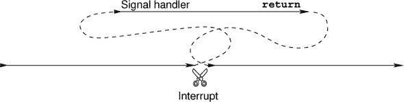

接口定义在头文件 `signal.h` 中。C 标准区分了六个不同的值，称为 *信号编号*。以下是在那里给出的确切定义。其中三个值通常由硬件中断^([10)] 引起：

> ¹⁰
> 
> 标准称为计算异常。

| |
| --- |

`<signal.h>`

| |
| --- |
| |

**`SIGFPE`** 错误的算术运算，例如零除或导致溢出的操作

**`SIGILL`** 检测到无效的功能映像，例如无效的指令

**`SIGSEGV`** 对存储的无效访问

| |
| --- |

其他三个通常由软件或用户触发：

| |
| --- |

**`SIGABRT`** 非正常终止，例如由`**abort**`函数发起

**`SIGINT`** 接收到交互式注意信号

**`SIGTERM`** 发送给程序的终止请求

| |
| --- |

具体的平台将会有其他的信号编号；标准为该目的保留了所有以**`SIG`**开头的标识符。它们的使用在 C 标准中是未定义的，但因此并没有什么不好。这里的**未定义**确实意味着它所说的那样：如果你使用它，它必须由 C 标准以外的其他权威机构定义，例如你的平台提供商。因此，你的代码的可移植性会降低。

处理信号有两种标准方式，这两种方式也由符号常量表示。**`SIG_DFL`** 恢复特定信号的平台的默认处理程序，而**`SIG_IGN`** 表示要忽略该信号。然后，程序员可以编写自己的信号处理程序。我们解析器的处理程序看起来相当简单：

##### `basic_blocks.c`

```
**143**   /**
**144**    ** @brief A minimal signal handler
**145**    **
**146**    ** After updating the signal count, for most signals this
**147**    ** simply stores the signal value in "interrupt" and returns.
**148**    **/
**149**   static void signal_handler(int sig) {
**150**     sh_count(sig);
**151**     switch (sig) {
**152**     case SIGTERM: quick_exit(EXIT_FAILURE);
**153**     case SIGABRT: _Exit(EXIT_FAILURE);
**154**   #ifdef SIGCONT
**155**       // continue normal operation
**156**     case SIGCONT: return;
**157**   #endif
**158**     default:
**159**       /* reset the handling to its default */
**160**       signal(sig, SIG_DFL);
**161**       interrupt = sig;
**162**       return;
**163**     }
**164**   }
```

如您所见，这样的信号处理程序接收信号编号 sig 作为参数，并根据该编号**switch**。这里我们为信号编号**`SIGTERM`**和**`SIGABRT`**提供了处理措施。所有其他信号都只是通过将那个编号的处理程序重置为其默认状态，将编号存储在我们的全局变量 interrupt 中，然后返回到中断发生的位置。

信号处理程序的类型必须与以下兼容：^([11])

> ¹¹
> 
> 尽管如此，标准并没有定义这样的**类型**。

##### `sighandler.h`

```
**71**   /**
**72**    ** @brief Prototype of signal handlers
**73**    **/
**74**   typedef void sh_handler(int);
```

也就是说，它接收一个信号编号作为参数，并且不返回任何内容。因此，这个接口相当有限，不允许我们传递足够的信息，特别是关于信号发生的位置和情况的信息。

信号处理程序是通过调用**signal**建立的，正如我们在函数**`signal_handler`**中看到的那样。在这里，它只是用来将信号处理程序的状态重置为默认状态。**signal**是`signal.h`提供的两个函数接口之一：

| |
| --- |

`<signal.h>`

| |
| --- |

```
sh_handler* signal(int, sh_handler*);
int raise(int);
```

**signal**的返回值是信号之前活动的处理程序，或者在发生错误时返回特殊值**`SIG_ERR`**。在信号处理程序内部，**signal**应该只用于更改接收到的相同信号编号的处理程序的状态。以下函数与**signal**具有相同的接口，但提供了关于调用成功程度的更多信息：

##### `sighandler.c`

```
 **92**   /**
 **93**    ** @ brief Enables a signal handler and catches the errors
 **94**    **/
 **95**   sh_handler* sh_enable(int sig, sh_handler* hnd) {
 **96**     sh_handler* ret = signal(sig, hnd);
 **97**     if (ret == SIG_ERR) {
 **98**       SH_PRINT(stderr, sig, "failed");
 **99**       errno = 0;
**100**     } else if (ret == SIG_IGN) {
**101**       SH_PRINT(stderr, sig, "previously ignored");
**102**     } else if (ret && ret != SIG_DFL) {
**103**       SH_PRINT(stderr, sig, "previously set otherwise");
**104**     } else {
**105**         SH_PRINT(stderr, sig, "ok");
**106**     }
**107**     return ret;
**108**   }
```

我们解析器的 **main** 函数使用这个循环来为它能够处理的全部信号号建立信号处理程序：

##### `basic_blocks.c`

```
**187**   // Establishes signal handlers
**188**   for (unsigned i = 1; i < sh_known; ++i)
**189**     sh_enable(i, signal_handler);
```

例如，在我的机器上，程序启动时提供以下信息：

##### `Terminal`

```
 **0**   sighandler.c:105: #1 (0 times),      unknown signal number, ok
 **1**   sighandler.c:105: SIGINT (0 times),  interactive attention signal, ok
 **2**   sighandler.c:105: SIGQUIT (0 times), keyboard quit, ok
 **3**   sighandler.c:105: SIGILL (0 times),  invalid instruction, ok
 **4**   sighandler.c:105: #5 (0 times),      unknown signal number, ok
 **5**   sighandler.c:105: SIGABRT (0 times), abnormal termination, ok
 **6**   sighandler.c:105: SIGBUS (0 times),  bad address, ok
 **7**   sighandler.c:105: SIGFPE (0 times),  erroneous arithmetic operation, ok
 **8**   sighandler.c:98: SIGKILL (0 times),  kill signal, failed: Invalid argument
 **9**   sighandler.c:105: #10 (0 times),     unknown signal number, ok
**10**   sighandler.c:105: SIGSEGV (0 times), invalid access to storage, ok
**11**   sighandler.c:105: #12 (0 times),     unknown signal number, ok
**12**   sighandler.c:105: #13 (0 times),     unknown signal number, ok
**13**   sighandler.c:105: #14 (0 times),     unknown signal number, ok
**14**   sighandler.c:105: SIGTERM (0 times), termination request, ok
**15**   sighandler.c:105: #16 (0 times),     unknown signal number, ok
**16**   sighandler.c:105: #17 (0 times),     unknown signal number, ok
**17**   sighandler.c:105: SIGCONT (0 times), continue if stopped, ok
**18**   sighandler.c:98: SIGSTOP (0 times),  stop process, failed: Invalid argument
```

第二个函数 **raise** 可以用来将指定的信号发送到当前执行。我们已经在 **`basic_blocks`** 的末尾使用过它，将我们捕获的信号发送到预安装的处理程序。

信号机制类似于 **setjmp**`/`**longjmp**：当前执行状态被记住，控制流传递给信号处理程序，从那里返回则恢复原始执行环境并继续执行。不同之处在于没有通过调用 **setjmp** 标记的特殊执行点。

|  |
| --- |

##### Takeaway 17.21

*信号处理程序可以在执行的任何点介入。*

|  |
| --- |

在我们这个例子中，有趣的信号号是软件中断 **`SIGABRT`**、**`SIGTERM`** 和 **`SIGINT`**，通常可以通过像 `Ctrl-C` 这样的魔法键组合发送给应用程序。前两个将调用 **_Exit** 和 **quick_exit**。因此，如果程序收到这些信号，执行将被终止：第一个不会调用任何清理处理程序；第二个将通过与 **at_quick_exit** 注册的清理处理程序列表进行。

**`SIGINT`** 将选择信号处理程序的 **`default`** 情况，因此最终将返回到中断点。

|  |
| --- |

##### Takeaway 17.22

*从信号处理程序返回后，执行将精确地恢复到中断点。*

|  |
| --- |

如果中断发生在函数 **`descend`** 中，它将首先继续执行，就像什么都没发生一样。只有当处理完当前输入行并需要新的一行时，才会检查变量中断并调用 **longjmp** 来降低执行。实际上，中断前后唯一的不同之处在于变量中断的值已改变。

我们还对 C 标准未描述的信号号进行了特殊处理，即 SIGCONT，但在我的操作系统`POSIX`中。为了保持可移植性，使用此信号号受到保护。此信号旨在继续执行之前已停止的程序：即执行已被挂起的情况。在这种情况下，唯一要做的就是返回。根据定义，我们不希望程序状态有任何修改。

因此，与**setjmp**`/`**longjmp**机制相比，另一个区别是对于它，**setjmp**的返回值改变了执行路径。另一方面，信号处理程序不应该改变执行状态。我们必须发明一个合适的约定来从信号处理程序传递信息到正常程序。至于**longjmp**，可能被信号处理程序更改的对象必须具有**`volatile`**属性：编译器无法知道中断处理程序可能在何处介入，因此它关于通过信号处理改变变量的所有假设都可能是不正确的。

但是信号处理程序还面临另一个困难：

|  |
| --- |

##### Takeaway 17.23

*C 语句可能对应于多个处理器指令。*

|  |
| --- |

例如，一个**`double`** x 可以存储在两个常规机器字中，将 x 写入内存的赋值可能需要两个单独的汇编语句来写入两个 halves。

当考虑我们迄今为止讨论的正常程序执行时，将 C 语句拆分成多个机器语句没有问题。这样的细微之处不能直接观察到.^([12]) 使用信号时，情况就不同了。如果这样的赋值在信号发生时被拆分在中间，那么只有 x 的一半被写入，信号处理程序将看到它的不一致版本。一半对应于之前的值，另一半对应于新的值。这种僵尸表示（一半在这里，一半在那里）甚至可能不是**`double`**的有效值。

> ¹²
> 
> 它们只能从程序外部观察到，因为这样的程序可能需要比预期更长的时间。

|  |
| --- |

##### Takeaway 17.24

*信号处理程序需要具有不可中断操作的类型。*

|  |
| --- |

在这里，术语*不可中断操作*指的是在信号处理程序上下文中始终看起来是*不可分割的*操作：要么看起来没有开始，要么看起来已经完成。这通常并不意味着它是不可分割的，只是我们无法观察到这样的分割。运行时系统可能需要在信号处理程序介入时强制该属性。

C 有三种不同类别的类型提供不可中断操作：

1.  类型**`sig_atomic_t`**，一个最小宽度为 8 位的整型

1.  类型**`atomic_flag`**

1.  所有其他具有无锁属性的原子类型

第一个是所有历史 C 平台都有的。将其用作存储信号编号，如我们示例中的变量中断，是合适的，但除此之外，其保证相当有限。只有内存加载（评估）和存储（赋值）操作被认为是不可中断的；其他操作不是，并且宽度可能相当有限。

|  |
| --- |

##### Takeaway 17.25

*类型为**`sig_atomic_t`**的对象不应用作计数器。*

|  |
| --- |

这是因为简单的 `++` 操作实际上可能被分成三个步骤（加载、增加和存储），并且它可能很容易溢出。后者可能会触发硬件中断，如果我们已经在信号处理程序内部，这将是真的非常糟糕。

后两类仅在 C11 中引入，以展望线程（见第十八部分），并且仅在平台未定义特征测试宏 **`__STDC_NO_ATOMICS__`** 并且已包含头文件 `stdatomic.h` 时存在。函数 **`sh_count`** 使用这些功能，我们将在稍后看到示例。

|  |
| --- |

`<stdatomic.h>`

|  |
| --- |

由于异步信号的信号处理程序不应以不受控制的方式访问或更改程序状态，因此它们不能调用会这样做其他函数。可以在这种环境中使用的函数被称为 *异步信号安全*。通常，从接口规范中很难知道一个函数是否具有此属性，而 C 标准只为少数几个函数保证了这一点：

+   终止程序的 **`_Noreturn`** 函数 **abort**、**_Exit** 和 **quick_exit**；

+   **signal** 对于调用信号处理程序的相同信号号

+   一些作用于原子对象的函数（将在稍后讨论）

|  |
| --- |

##### 吸收要点 17.26

*除非另有说明，否则 C 库函数不是异步信号安全*。

|  |
| --- |

因此，根据 C 标准本身，信号处理程序不能调用 **exit** 或执行任何形式的 I/O，但它可以使用 **quick_exit** 和 **at_quick_exit** 处理程序来执行一些清理代码。

如前所述，C 对信号处理程序的规范是最小的，并且通常特定平台会允许更多。因此，使用信号的便携式编程是繁琐的，并且通常应按级联方式处理特殊条件，就像我们在示例中看到的那样：

1.  可以在本地检测和处理特殊条件可以通过使用 **`goto`** 对有限数量的标签进行处理。

1.  当不需要或无法在本地处理特殊条件时，应从函数返回特殊值，例如返回空指针而不是对象的指针。

1.  当异常返回会非常昂贵或复杂时，可以使用 **setjmp**`/`**longjmp** 来处理改变全局程序状态的特殊条件。

1.  导致发出信号的异常条件可以由信号处理程序捕获，但应在处理程序的正常执行流程返回后处理。

由于 C 标准指定的信号列表本身是最小的，处理不同的可能条件变得复杂。以下显示了我们可以如何处理一组超出 C 标准指定的信号号的信号：

##### `sighandler.c`

```
 **7**   #define SH_PAIR(X, D) [X] = { .name = #X, .desc = "" D "", }
 **8**
 **9**   /**
**10**    ** @brief Array that holds names and descriptions of the
**11**    ** standard C signals
**12**    **
**13**    ** Conditionally, we also add some commonly used signals.
**14**    **/
**15**   sh_pair const sh_pairs[] = {
**16**     /* Execution errors */
**17**     SH_PAIR(SIGFPE, "erroneous arithmetic operation"),
**18**     SH_PAIR(SIGILL, "invalid instruction"),
**19**     SH_PAIR(SIGSEGV, "invalid access to storage"),
**20**   #ifdef SIGBUS
**21**     SH_PAIR(SIGBUS, "bad address"),
**22**   #endif
**23**     /* Job control */
**24**     SH_PAIR(SIGABRT, "abnormal termination"),
**25**     SH_PAIR(SIGINT, "interactive attention signal"),
**26**     SH_PAIR(SIGTERM, "termination request"),
**27**   #ifdef SIGKILL
**28**     SH_PAIR(SIGKILL, "kill signal"),
**29**   #endif
**30**   #ifdef SIGQUIT
**31**     SH_PAIR(SIGQUIT, "keyboard quit"),
**32**   #endif
**33**   #ifdef SIGSTOP
**34**     SH_PAIR(SIGSTOP, "stop process"),
**35**   #endif
**36**   #ifdef SIGCONT
**37**     SH_PAIR(SIGCONT, "continue if stopped"),
**38**   #endif
**39**   #ifdef SIGINFO
**40**     SH_PAIR(SIGINFO, "status information request"),
**41**   #endif
**42**   };
```

在这里，宏只是初始化了一个类型为 sh_pair 的对象：

##### `sighandler.h`

```
**10**   /**
**11**    ** @brief A pair of strings to hold signal information
**12**    **/
**13**   typedef struct sh_pair sh_pair;
**14**   struct sh_pair {
**15**     char const* name;
**16**     char const* desc;
**17**   };
```

使用 **`#ifdef`** 条件确保可以使用非标准的信号名称，并且 SH_PAIR 中的指定初始化器允许我们以任何顺序指定它们。然后可以使用数组的大小来计算 sh_known 已知的信号数量：

##### `sighandler.c`

```
**44**   size_t const sh_known = (sizeof sh_pairs/sizeof sh_pairs[0]);
```

如果平台对原子操作有足够的支持，此信息也可以用来定义一个原子计数器数组，以便我们可以跟踪特定信号被提升的次数：

##### `sighandler.h`

```
**31**   #if ATOMIC_LONG_LOCK_FREE > 1
**32**   /**
**33**    ** @brief Keep track of the number of calls into a
**34**    ** signal handler for each possible signal.
**35**    **
**36**    ** Don't use this array directly.
**37**    **
**38**    ** @see sh_count to update this information.
**39**    ** @see SH_PRINT to use that information.
**40**    **/
**41**   extern _Atomic(unsigned long) sh_counts[];
**42**
**43**   /**
**44**    ** @brief Use this in your signal handler to keep track of the
**45**    ** number of calls to the signal @a sig.
**46**    **
**47**    ** @see sh_counted to use that information.
**48**    **/
**49**   inline
**50**   void sh_count(int sig) {
**51**     if (sig < sh_known) ++sh_counts[sig];
**52**   }
**53**
**54**   inline
**55**   unsigned long sh_counted(int sig){
**56**     return (sig < sh_known) ? sh_counts[sig] : 0;
**57**   }
```

使用 **`_Atomic`** 指定的对象可以使用与具有相同基类型的其他对象相同的运算符，这里是指 `++` 运算符。通常，这样的对象可以保证避免与其他线程（稍后讨论）的竞争条件，并且如果类型具有 *lock-free* 属性，则不可中断。后者在这里通过特征测试宏 **`ATOMIC_LONG_LOCK_FREE`** 进行测试。

这里使用的用户界面是 **`sh_count`** 和 **`sh_counted`**。如果可用，它们将使用计数器数组，否则将用平凡函数替换：

##### `sighandler.h`

```
**59**   #else
**60**   inline
**61**   void sh_count(int sig) {
**62**     // empty
**63**   }
**64**
**65**   inline
**66**   unsigned long sh_counted(int sig){
**67**     return 0;
**68**   }
**69**   #endif
```

### 摘要

+   即使没有并行线程或异步信号，C 代码的执行也不总是线性序列的。因此，某些评估的结果可能取决于编译器的排序选择。

+   **setjmp**`/`**longjmp** 是处理一系列嵌套函数调用中异常条件的强大工具。它们可能与优化交互，并要求某些变量使用 **`volatile`** 修饰符进行保护。

+   C 处理同步和异步信号的方式是基本的。因此，信号处理器应该尽可能少做工作，只需在全局标志中标记中断条件类型。然后它们应该切换回中断上下文并处理中断条件。

+   信息只能通过使用 **`volatile`** **`sig_atomic_t`**、**`atomic_flag`** 或其他无锁原子数据类型传递到和从信号处理器。

## 第十八章。线程

本章涵盖

+   线程间控制

+   初始化和销毁线程

+   使用线程局部数据

+   关键数据和关键部分

+   通过条件变量进行通信

线程是控制流的一种变体，允许我们并发地执行多个 *任务*。在这里，一个任务是指程序要执行的工作的一部分，不同的任务之间可以没有或只有很少的交互。

我们的主要例子将是一个我们称之为`B9`的原始游戏，它是康威生命游戏的变体（参见 Gardner [1970]）。它模拟了一个原始“细胞”矩阵，这些细胞根据非常简单的规则出生、生活和死亡。我们将游戏分为四个不同的任务，每个任务都迭代进行。单元格通过*生命周期*计算所有单元格的出生或死亡事件。终端中的图形表示通过绘图周期进行，这些周期更新得尽可能快。在这些周期之间是用户不规则的按键，允许用户在选定的位置添加单元格。图 18.1 显示了 B9 这些任务的示意图。

四个任务包括：

+   ***绘制：*** 将细胞矩阵的图片绘制到终端；参见图 18.2。

+   ***输入：*** 捕获按键，更新光标位置，并创建单元格

+   ***更新：*** 将游戏的状态从生命周期更新到下一个生命周期

+   ***账户：*** 与*更新*任务紧密耦合，并计算每个单元格的活着的邻近单元格数量

##### 图 18.1\. `B9`五个线程的控制流程

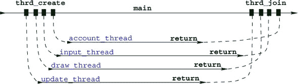

##### 图 18.2\. B9 的截图，显示了几个单元格和光标位置


每个这样的任务都是由一个*线程*执行的，该线程遵循自己的控制流程，就像它自己的一个简单程序。如果平台有多个处理器或核心，这些线程可以同时执行。即使平台没有这种能力，系统也会交错执行线程。整体执行对用户来说将*看起来*像是任务处理的事件是并发的。这对于我们的例子至关重要，因为我们希望游戏无论玩家是否按键盘上的键都能看起来持续进行。

在 C 中处理线程通过两个主要函数接口进行，可以用来启动一个新线程然后等待该线程的终止：这里**thrd_create**的第二个参数是类型为**`thrd_start_t`**的函数指针。这个函数被执行

```
#include <threads.h>
typedef int (***thrd_start_t**)(void*);
int **thrd_create**(**thrd_t***, **thrd_start_t**, void*);
int **thrd_join**(**thrd_t**, int *);
```

在新线程的开始时。正如我们从**`typedef`**中可以看到的，该函数接收一个**`void*`**指针并返回一个**`int`**。类型**`thrd_t`**是一个不透明类型，它将标识新创建的线程。

在我们的例子中，**main**中的四个**thrd_create**调用创建了四个线程，这些线程对应于不同的任务。这些线程与**main**的原始线程并发执行。最后，**main**等待四个线程终止；它*连接*它们。四个线程简单地通过从它们启动的初始函数返回来达到终止。因此，我们的四个函数被声明为

```
static int update_thread(void*);
static int draw_thread(void*);
static int input_thread(void*);
static int account_thread(void*);
```

这四个函数由我们的**主函数**分别以线程的形式启动，并且所有四个线程都接收一个指向类型为 life 的对象的指针，该对象持有游戏的状态：

##### `B9.c`

```
**201**   /* Create an object that holds the game's data. */
**202**   life L = LIFE_INITIALIZER;
**203**   life_init(&L, n0, n1, M);
**204**   /* Creates four threads that all operate on that same object
**205**      and collects their IDs in "thrd" */
**206**   **thrd_t** thrd[4];
**207**   **thrd_create**(&thrd[0], update_thread,  &L);
**208**   **thrd_create**(&thrd[1], draw_thread,    &L);
**209**   **thrd_create**(&thrd[2], input_thread,   &L);
**210**   **thrd_create**(&thrd[3], account_thread, &L);
**211**   /* Waits for the update thread to terminate */
**212**   **thrd_join**(thrd[0], 0);
**213**   /* Tells everybody that the game is over */
**214**   L.finished = **true**;
**215**   **ungetc**('q', **stdin**);
**216**   /* Waits for the other threads */
**217**   **thrd_join**(thrd[1], 0);
**218**   **thrd_join**(thrd[2], 0);
**219**   **thrd_join**(thrd[3], 0);
```

四个线程函数中最简单的是 account_thread。由于其接口只接收**`void*`**，它的第一个动作是将它重新解释为 life 指针，然后进入一个**`while`**循环，直到其工作完成：

##### `B9.c`

```
 **99**  int account_thread(void* Lv) {
**100**    life*restrict L = Lv;
**101**    while (!L->finished) {
**102**      // Blocks until there is work
```

##### `B9.c`

```
**117**   return 0;
**118** }
```

那个循环的核心调用一个特定的任务函数，life_account，然后检查从它的角度来看，游戏是否应该结束：

##### `B9.c`

```
**108**    life_account(L);
**109**    if ((L->last + repetition) < L->accounted) {
**110**      L->finished = **true**;
**111**    }
**112**    // ^^^^^^^^^^^^^^^^^^^^^^^^^^^^^^^^^^^^^^^^^^^^^^^^^
```

这里终止的条件是游戏是否之前进入了相同的重复游戏配置序列。

其他三个函数的实现类似。它们都将它们的参数重新解释为指向 life 的指针，并进入一个处理循环，直到它们检测到游戏已经结束。然后，在循环内部，它们有相对简单的逻辑来完成它们在这个特定迭代中的特定任务。例如，draw_thread 的内部部分看起来像这样：

##### `B9.c`

```
**79**     if (L->n0 <= 30) life_draw(L);
**80**     else life_draw4(L);
**81**     L->drawn++;
**82**     // ^^^^^^^^^^^^^^^^^^^^^^^^^^^^^^^^^^^^^^^^^^^^^^^^^
```

### 18.1. 简单的线程间控制

我们已经看到了两种不同的线程控制工具。首先，**thrd_join**允许一个线程等待另一个线程完成。我们在**main**线程连接到其他四个线程时看到了这一点。这确保了这个**main**线程只有在所有其他线程都完成时才会终止，因此程序执行保持活跃和一致，直到最后一个线程消失。

另一个工具是 life 的成员 finished。这个成员包含一个 bool 值，当任何一个线程检测到终止游戏的条件时，该值都为**`true`**。

与信号处理程序类似，几个线程对**共享**变量的同时冲突操作必须非常小心地处理。

|  |
| --- |

##### 取舍 18.1

*如果线程 T*[0] *写入一个同时被另一个线程 T*[1] *读取或写入的非原子对象，执行的行为将变得未定义。*

|  |
| --- |

通常情况下，当我们谈论不同的线程时，甚至很难确定**同时**意味着什么（如稍后所讨论的）。我们避免这种情况的唯一机会是排除所有**潜在的**冲突访问。如果存在这种潜在的并发未受保护访问，我们称之为**竞争条件**。

在我们的例子中，除非我们采取特定的预防措施，否则即使是更新一个如 finished 这样的 bool 值也可能在不同线程之间被分割。如果两个线程以交错的方式访问它，更新可能会搞混事情，导致程序状态未定义。编译器无法知道一个特定的对象是否可能受到竞争条件的影响，因此我们必须明确地告诉它。这样做最简单的方法是使用我们之前也看到过的信号处理工具：原子操作。在这里，我们的 life 结构有几个成员被指定为**`_Atomic`**：

##### `life.h`

```
**40**     // Parameters that will dynamically be changed by
**41**     // different threads
**42**     _Atomic(**size_t**) constellations; //< Constellations visited
**43**     _Atomic(**size_t**) x0;             //< Cursor position, row
**44**     _Atomic(**size_t**) x1;             //< Cursor position, column
**45**     _Atomic(**size_t**) frames;         //< FPS for display
**46**     _Atomic(bool)   finished;      //< This game is finished.
```

这些成员的访问保证是*原子的*。在这里，这是我们已经知道的成员 finished，以及一些我们用来在*输入*和*绘制*之间通信的其他成员，特别是光标的当前位置。

|  |
| --- |

##### Takeaway 18.2

*考虑到不同线程的执行，原子对象的标准操作是不可分割和可线性化的*。

|  |
| --- |

在这里，*线性化*确保我们还可以就两个不同线程中计算的顺序进行论证。对于我们的例子，如果一个线程看到 finished 被修改（设置为**`true`**），它就知道设置它的线程已经执行了它应该做的所有操作。从这个意义上说，线性化将序列的纯粹语法属性扩展到了线程。

因此，对原子对象的操作也有助于我们确定哪些线程的部分*不是*同时执行的，这样它们之间就不会发生竞争条件。稍后，在第 19.1 节中，我们将看到如何将这一点形式化为“发生之前”关系。

因为原子对象在语义上与普通对象不同，声明它们的语法主要是*原子指定符*：正如我们所看到的，关键字**`_Atomic`**后跟包含原子从中派生的类型的括号。还有一种使用**`_Atomic`**作为*原子修饰符*的语法，类似于其他修饰符**`const`**、**`volatile`**和**`restrict`**。在下面的规范中，A 和 B 的两种不同声明是等效的：

```
   extern _Atomic(double (*)[45]) A;
   extern double (*_Atomic A)[45];
   extern _Atomic(double) (*B)[45];
   extern double _Atomic  (*B)[45];
```

它们指的是相同的对象 A，一个指向`45`个**`double`**元素数组的原子指针，以及 B，一个指向`45`个原子**`double`**元素数组的指针。

修饰符记法有一个陷阱：它可能会暗示**`_Atomic`**修饰符与其他修饰符之间的相似性，但实际上它们并没有走得很远。考虑以下具有三个不同“修饰符”的例子：

```
   double var;
   // Valid: adding const qualification to the pointed-to type
   extern double    const* c = &var;
   // Valid: adding volatile qualification to the pointed-to type
   extern double volatile* v = &var;
   // Invalid: pointers to incompatible types
   extern double  _Atomic* a = &var;
```

因此，最好不要养成将原子视为修饰符的习惯。

|  |
| --- |

##### Takeaway 18.3

*使用指定符语法* **`_Atomic`***`(`**`T`**`)`* *进行原子声明*。

|  |
| --- |

对于**`_Atomic`**的另一个限制是它不能应用于数组类型：

```
   _Atomic(double[45]) C;   // Invalid: atomic cannot be applied to arrays.
   _Atomic(double) D[45];   // Valid: atomic can be applied to array base.
```

再次强调，这与类似“修饰”的类型不同：

```
   typedef double darray[45];
   // Invalid: atomic cannot be applied to arrays.
   darray _Atomic E;
   // Valid: const can be applied to arrays.
   darray const F = { 0 }; // Applies to base type
   double const F[45];     // Compatible declaration
```

|  |
| --- |

##### Takeaway 18.4

*没有原子数组类型*。

|  |
| --- |

在本章的后面部分，我们还将看到另一个确保线性化的工具：**`mtx_t`**。但原子对象迄今为止是最有效率和易于使用的。

|  |
| --- |

##### Takeaway 18.5

*原子对象是强制消除竞争条件的特权工具*。

|  |
| --- |

### 18.2\. 无竞争初始化和销毁

对于任何由线程共享的数据，在并发访问之前将其初始化到一个良好控制的状态非常重要，并且在最终销毁后永远不应访问。对于初始化，有几种可能性，按优先顺序在此列出：

1.  具有静态存储持续时间的共享对象在执行任何操作之前都会被初始化。

1.  具有自动或分配存储持续时间的共享对象可以由创建它们的线程在发生任何共享访问之前正确初始化。

1.  具有静态存储持续时间的共享对象，其中包含动态初始化的信息

    1.  在创建任何其他线程之前，应在启动时通过**main**初始化应可用的内容。

    1.  在启动时不可用*必须*使用**call_once**进行初始化。

因此，后者，**call_once**，仅在非常特殊的情况下才是必需的：

```
    void **call_once**(**once_flag*** flag, void cb(void));
```

与**atexit**类似，**call_once**注册了一个回调函数 cb，该函数应在执行中的确切一点被调用。以下是一个基本示例，说明如何使用它：

```
   /* Interface */
   extern **FILE*** errlog;
   **once_flag** errlog_flag;
   extern void errlog_fopen(void);

   /* Incomplete implementation; discussed shortly */
   **FILE*** errlog = 0;
   **once_flag** errlog_flag = **ONCE_FLAG_INIT**;
   void errlog_fopen(void) {
     **srand**(**time**());
     unsigned salt = **rand**();
     static char const format[] = "/tmp/error-\%#X.log"
     char fname[16 + sizeof format];
     **snprintf**(fname, sizeof fname, format, salt);
     errlog = **fopen**(fname, "w");
     if (errlog) {
       **setvbuf**(errlog, 0, **_IOLBF**, 0);    // Enables line buffering
     }
   }

   /* Usage */

   /* ... inside a function before any use ... */
   **call_once**(&errlog_flag, errlog_fopen);
   /* ... now use it ... */
   **fprintf**(errlog, "bad, we have weird value \%g!\n", weird);
```

在这里，我们有一个全局变量（errlog），它需要动态初始化（调用**time**、**srand**、**rand**、**snprintf**、**fopen**和**setvbuf**）以进行初始化。使用该变量的任何操作都应该以调用**call_once**开始，该调用使用相同的**`once_flag`**（在此处，errlog_flag）和相同的回调函数（在此处，errlog_fopen）。

因此，与**atexit**相反，回调是与特定对象一起注册的，即**`once_flag`**类型之一。这种不透明类型保证了足够的状态来

+   确定特定的**call_once**调用是否是所有线程中的第一个

+   只有那时才调用回调

+   永远不要再调用回调

+   等待所有其他线程，直到唯一的回调调用完成

因此，任何使用线程都可以确信对象已正确初始化，而不会覆盖其他线程可能已执行过的初始化。所有流函数（但**fopen**和**fclose**）都是无竞争的。

| |
| --- |

##### 摘要 18.6

*正确初始化的* **`FILE*`** 可以被多个线程无竞争地使用。

| |
| --- |

在这里，*无竞争*仅意味着你的程序将始终处于一个良好定义的状态；它并不意味着你的文件可能不包含来自不同线程的混乱输出行。为了避免这种情况，你必须确保**fprintf**或类似的调用始终打印整个行。

| |
| --- |

##### 摘要 18.7

*并发写操作应一次打印整个行。*

| |
| --- |

对象的无竞争销毁可能更难以组织，因为初始化和销毁数据访问并不对称。虽然通常在对象的生存期开始时很容易确定只有一个用户（以及何时只有一个用户），但如果我们没有跟踪它，那么检查是否有其他线程使用该对象就变得困难。

| |
| --- |

##### 摘要 18.8

*共享动态对象的销毁和分配需要很多注意。*

| |
| --- |

想象一下你宝贵的长达一小时的执行，就在结束时崩溃，试图将它的发现写入文件。

在我们的 B9 示例中，我们有一个简单的策略来确保变量 L 可以安全地被所有创建的线程使用。它在所有线程创建之前初始化，并且在所有创建的线程都连接后才会停止存在。

对于 **`once_flag`** 示例，变量 errlog，在从我们的线程之一关闭流时并不容易看到何时应该关闭。最简单的方法是等待我们确定没有其他线程存在，当我们退出整个程序执行时：

```
   /* Complete implementation */
   **FILE*** errlog = 0;
   static void errlog_fclose(void) {
     if (errlog) {
       **fputs**("*** closing log ***", errlog);
       **fclose**(errlog);
     }
   }

   **once_flag** errlog_flag = **ONCE_FLAG_INIT**;
   void errlog_fopen(void) {
     **atexit**(errlog_fclose);
     ...
```

这引入了另一个回调（errlog_fclose），确保在关闭文件之前打印最后一条消息。为了确保在初始化函数 errlog_fopen 进入时，该函数被注册到 **atexit**，以确保在程序退出时执行此函数。

### 18.3\. 线程局部数据

避免竞态条件的最简单方法是严格分离线程访问的数据。所有其他解决方案，例如我们之前看到的原子操作以及我们稍后将要看到的互斥锁和条件变量，都要复杂得多，成本也高得多。访问线程局部数据的最佳方式是使用局部变量：

| |
| --- |

##### Takeaway 18.9

*通过函数参数传递线程特定数据。*

| |
| --- |
| |

##### Takeaway 18.10

*将线程特定状态保存在局部变量中。*

| |
| --- |

如果这不可能实现（或者可能过于复杂），特殊的存储类和专用数据类型允许我们处理线程局部数据。**`_Thread_local`** 是一个存储类指定符，它强制为声明为该类的变量创建一个线程特定的副本。头文件 `threads.h` 也提供了一个宏 **`thread_local`**，它扩展为关键字。

| |
| --- |

`<threads.h>`

| |
| --- |
| |

##### Takeaway 18.11

*一个* **`thread_local`** *变量为每个线程都有一个单独的实例。*

| |
| --- |

即，**`thread_local`** 变量必须像具有静态存储期的变量一样声明：它们在文件作用域中声明，或者如果不这样做，它们还必须额外声明 **`static`**（参见 第 13.2 节，表 13.1）。因此，它们不能动态初始化。

| |
| --- |

##### Takeaway 18.12

*如果初始化可以在编译时确定，请使用 **`thread_local`**。*

| |
| --- |

如果存储类指定符不足以进行动态初始化和销毁，我们可以使用 *线程特定存储*，**`tss_t`**。它将线程特定数据的标识抽象为一个不透明的 ID，称为键，以及设置或获取数据的访问器函数：

```
void* **tss_get**(**tss_t** key);           // Returns a pointer to an object
int **tss_set**(**tss_t** key, void *val);  // Returns an error indication
```

在创建键时，指定在线程结束时调用以销毁线程特定数据的函数为类型 **`tss_dtor_t`** 的函数指针：

```
typedef void (***tss_dtor_t**)(void*);           // Pointer to a destructor
int **tss_create**(**tss_t*** key, **tss_dtor_t** dtor); // Returns an error indication
void **tss_delete**(**tss_t** key);
```

### 18.4\. 关键数据和关键部分

生命结构的其他部分不能轻易受到保护。它们对应于更大的数据，例如游戏的棋盘位置。你可能记得，数组不能使用**`_Atomic`**指定；即使我们能够使用一些技巧做到这一点，结果也不会很高效。因此，我们不仅声明了成员 Mv（用于游戏矩阵）和 visited（用于散列已访问的配置），还声明了一个特殊的成员 mtx：

##### `life.h`

```
**15**    **mtx_t** mtx;    //< Mutex that protects Mv
**16**    **cnd_t** draw;   //< cnd that controls drawing
**17**    **cnd_t** acco;   //< cnd that controls accounting
**18**    **cnd_t** upda;   //< cnd that controls updating
**19**
**20**    void*restrict Mv;            //< bool M[n0][n1];
**21**    bool (*visited)[life_maxit]; //< Hashing constellations
```

这个成员 mtx 具有特殊的类型**`mtx_t`**，一种*互斥锁*类型（用于*互斥排他*），它也包含在`threads.h`中。它的目的是保护*关键数据*：Mv，当它在代码的一个明确部分被访问时，一个*临界区*。

| |
| --- |

`<threads.h>`

| |
| --- |

这种互斥锁最简单的用法是在输入线程的中心，列表 18.1 第 145 行，其中两个调用，**mtx_lock**和**mtx_unlock**，保护了对生命数据结构 L 的访问。

##### 列表 18.1\. B9 的输入线程函数

```
**121**   int input_thread(void* Lv) {
**122**     termin_unbuffered();
**123**     life*restrict L = Lv;
**124**     enum { len = 32, };
**125**     char command[len];
**126**     do {
**127**       int c = **getchar**();
**128**       command[0] = c;
**129**       switch(c) {
**130**       case GO_LEFT : life_advance(L,  0, -1); break;
**131**       case GO_RIGHT: life_advance(L,  0, +1); break;
**132**       case GO_UP   : life_advance(L, -1,  0); break;
**133**       case GO_DOWN : life_advance(L, +1,  0); break;
**134**       case GO_HOME : L->x0 = 1; L->x1 = 1;    break;
**135**       case ESCAPE  :
**136**         **ungetc**(termin_translate(termin_read_esc(len, command)), **stdin**);
**137**         continue;
**138**       case '+':      if (L->frames < 128) L->frames++; continue;
**139**       case '-':      if (L->frames > 1)   L->frames--; continue;
**140**       case ' ':
**141**       case 'b':
**142**       case 'B':
**143**         **mtx_lock**(&L->mtx);
**144**         // VVVVVVVVVVVVVVVVVVVVVVVVVVVVVVVVVVVVVVVVVVVVVVVVV
**145**         life_birth9(L);
**146**         // ^^^^^^^^^^^^^^^^^^^^^^^^^^^^^^^^^^^^^^^^^^^^^^^^^
**147**         **cnd_signal**(&L->draw);
**148**         **mtx_unlock**(&L->mtx);
**149**         continue;
**150**       case 'q':
**151**       case 'Q':
**152**       case **EOF**:      goto FINISH;
**153**       }
**154**       **cnd_signal**(&L->draw);
**155**     } while (!(L->finished || **feof**(**stdin**)));
**156**    FINISH:
**157**     L->finished = **true**;
**158**     return 0;
**159**   }
```

这个例程主要由输入循环组成，它反过来包含一个大 switch，用于处理用户键入键盘的不同字符。只有两个**`case`**需要这种保护：'b'和'B'，它们触发在当前光标位置周围的 3 3 细胞群的强制“出生”。在所有其他情况下，我们只与原子对象交互，因此我们可以安全地修改这些。

锁定和解锁互斥锁的效果很简单。对**mtx_lock**的调用会阻塞调用线程的执行，直到可以保证没有其他线程处于由同一互斥锁保护的临界区中。我们说**mtx_lock***获取*互斥锁并*保持*它，然后**mtx_unlock***释放*它。使用 mtx 也提供了类似于使用原子对象的线性化，正如我们之前所看到的。一个获取了互斥锁 M 的线程可以依赖这样一个事实，即所有在其他线程释放相同的互斥锁 M 之前完成的操作都已经生效。

| |
| --- |

##### 摘要 18.13

*互斥锁操作提供线性化。*

| |
| --- |

C 语言的互斥锁接口定义如下：

```
int **mtx_lock**(**mtx_t***);
int **mtx_unlock**(**mtx_t***);
int **mtx_trylock**(**mtx_t***);
int **mtx_timedlock**(**mtx_t***restrict, const struct **timespec***restrict);
```

另外两个调用使我们能够测试（**mtx_trylock**）是否有其他线程已经持有锁（因此我们可以避免等待）或等待（**mtx_timedlock**）最长的时间（因此我们可以避免永远阻塞）。后者只有在互斥锁被初始化为**`mtx_timed`**“类型”时才允许，如稍后所述。

有两个其他用于动态初始化和销毁的调用：

```
int **mtx_init**(**mtx_t***, int);
void **mtx_destroy**(**mtx_t***);
```

除了更复杂的线程接口外，使用**mtx_init**是强制性的；没有为**`mtx_t`**定义静态初始化。

| |
| --- |

##### 摘要 18.14

*每个互斥锁都必须使用**mtx_init**进行初始化。*

| |
| --- |

**mtx_init**的第二个参数指定了互斥锁的“类型”。它必须是以下四个值之一：

+   **`mtx_plain`**

+   **`mtx_timed`**

+   **`mtx_plain`**`|`**`mtx_recursive`**

+   **`mtx_timed`**`|`**`mtx_recursive`**

如你所猜，使用**`mtx_plain`**与**`mtx_timed`**控制了使用**mtx_timedlock**的可能性。额外的属性**`mtx_recursive`**使我们能够对同一线程连续多次调用**mtx_lock**和类似函数，而无需事先解锁。

|  |
| --- |

##### 收获 18.15

*持有非递归互斥锁的线程不得调用任何针对该互斥锁的互斥锁函数。*

|  |
| --- |

名称**`mtx_recursive`**表明它主要用于在临界区入口调用**mtx_lock**并在退出时调用**mtx_unlock**的递归函数。

|  |
| --- |

##### 收获 18.16

*递归互斥锁仅在持有线程对* **mtx_unlock** *的调用次数与其获取的锁的数量相同时才会释放。*

|  |
| --- |
|  |

##### 收获 18.17

*在线程终止之前必须释放已锁定的互斥锁。*

|  |
| --- |
|  |

##### 收获 18.18

*线程必须只在其持有的互斥锁上调用* **mtx_unlock** *。*

|  |
| --- |

从所有这些中，我们可以得出一个简单的经验法则：

|  |
| --- |

##### 收获 18.19

*每个成功的互斥锁锁定对应于对* **mtx_unlock** *的精确一次调用。*

|  |
| --- |

根据平台的不同，互斥锁可能会绑定系统资源，每次调用**mtx_init**时都会分配该资源。这种资源可以是额外的内存（例如对**malloc**的调用）或某些特殊硬件。因此，一旦互斥锁达到其生命周期的末尾，释放这些资源就很重要。

|  |
| --- |

##### 收获 18.20

*互斥锁必须在其生命周期的末尾被销毁。*

|  |
| --- |

因此，特别是，必须调用**mtx_destroy**。

+   在具有自动存储期的互斥锁的作用域结束之前

+   在释放动态分配的互斥锁的内存之前

### 18.5. 通过条件变量进行通信

虽然我们已经看到输入不需要太多的保护来防止竞态条件，但对于会计任务来说情况相反（参见列表 18.2）。它的整个工作（通过调用 life_account 执行）是扫描整个位置矩阵，并为每个位置计算生命邻居的数量。

##### 列表 18.2. B9 的会计线程函数

```
 **99**   int account_thread(void* Lv) {
**100**     life*restrict L = Lv;
**101**     while (!L->finished) {
**102**       // Blocks until there is work
**103**       **mtx_lock**(&L->mtx);
**104**       while (!L->finished && (L->accounted == L->iteration))
**105**         life_wait(&L->acco, &L->mtx);
**106**
**107**       // VVVVVVVVVVVVVVVVVVVVVVVVVVVVVVVVVVVVVVVVVVVVVVVVV
**108**       life_account(L);
**109**       if ((L->last + repetition) < L->accounted) {
**110**         L->finished = **true**;
**111**       }
**112**       // ^^^^^^^^^^^^^^^^^^^^^^^^^^^^^^^^^^^^^^^^^^^^^^^^^
**113**
**114**       **cnd_signal**(&L->upda);
**115**       **mtx_unlock**(&L->mtx);
**116**     }
**117**     return 0;
**118**   }
```

同样，更新和绘图线程主要包含一个外层循环内的一个临界区：参见列表 18.3 和 18.4，它们执行操作。在那之后，我们还有一个调用 life_sleep 的调用，它暂停执行一段时间。这确保了这些线程只以与我们的图形帧率相对应的频率运行。

##### 列表 18.3. B9 的更新线程函数

```
**35**   int update_thread(void* Lv) {
**36**     life*restrict L = Lv;
**37**     **size_t** changed = 1;
**38**     **size_t** birth9 = 0;
**39**     while (!L->finished && changed) {
**40**       // Blocks until there is work
**41**       **mtx_lock**(&L->mtx);
**42**       while (!L->finished && (L->accounted < L->iteration))
**43**         life_wait(&L->upda, &L->mtx);
**44**
**45**       // VVVVVVVVVVVVVVVVVVVVVVVVVVVVVVVVVVVVVVVVVVVVVVVVV
**46**       if (birth9 != L->birth9) life_torus(L);
**47**       life_count(L);
**48**       changed = life_update(L);
**49**       life_torus(L);
**50**       birth9 = L->birth9;
**51**       L->iteration++;
**52**       // ^^^^^^^^^^^^^^^^^^^^^^^^^^^^^^^^^^^^^^^^^^^^^^^^^
**53**
**54**       **cnd_signal**(&L->acco);
**55**       **cnd_signal**(&L->draw);
**56**       **mtx_unlock**(&L->mtx);
**57**
**58**       life_sleep(1.0/L->frames);
**59**     }
**60**     return 0;
**61**   }
```

##### 列表 18.4. B9 的绘图线程函数

```
**64**   int draw_thread(void* Lv) {
**65**     life*restrict L = Lv;
**66**     **size_t** x0 = 0;
**67**     **size_t** x1 = 0;
**68**     **fputs**(ESC_CLEAR ESC_CLRSCR, **stdout**);
**69**     while (!L->finished) {
**70**       // Blocks until there is work
**71**       **mtx_lock**(&L->mtx);
**72**       while (!L->finished
**73**              && (L->iteration <= L->drawn)
**74**              && (x0 == L->x0)
**75**              && (x1 == L->x1)) {
**76**         life_wait(&L->draw, &L->mtx);
**77**       }
**78**       // VVVVVVVVVVVVVVVVVVVVVVVVVVVVVVVVVVVVVVVVVVVVVVVVV
**79**       if (L->n0 <= 30) life_draw(L);
**80**       else life_draw4(L);
**81**       L->drawn++;
**82**       // ^^^^^^^^^^^^^^^^^^^^^^^^^^^^^^^^^^^^^^^^^^^^^^^^^
**83**
**84**       **mtx_unlock**(&L->mtx);
**85**
**86**       x0 = L->x0;
**87**       x1 = L->x1;
**88**       // No need to draw too quickly
**89**       life_sleep(1.0/40);
**90**     }
**91**     return 0;
**92**   }
```

在所有三个线程中，临界区主要覆盖循环体。除了适当的计算外，在这些临界区中，线程实际上会暂停，直到需要新的计算。更确切地说，对于会计线程，有一个条件循环，只能在一次满足以下条件后离开：

+   游戏结束，或者

+   另一个线程已经增加了一个迭代计数

那个循环体的内容是对 life_wait 的调用，这是一个使调用线程暂停一秒钟或直到特定事件发生的函数：

##### `life.c`

```
**18**   int life_wait(**cnd_t*** cnd, **mtx_t*** mtx) {
**19**     struct **timespec** now;
**20**     **timespec_get**(&now, **TIME_UTC**);
**21**     now.**tv_sec** += 1;
**22**     return **cnd_timedwait**(cnd, mtx, &now);
**23**   }
```

它的主要成分是对 **cnd_timedwait** 的调用，该调用接受一个 *条件变量* 类型为 **`cnd_t`**、一个互斥锁和一个绝对时间限制。

这样的条件变量用于标识线程可能想要等待的条件。在这里，在我们的例子中，你看到了 life 的三个此类条件变量成员的声明：draw、acco 和 upda。这些中的每一个都对应于绘图、会计和更新在执行其适当任务之前需要的测试条件。正如我们所看到的，会计有

##### `B9.c`

```
**104**       while (!L->finished && (L->accounted == L->iteration))
**105**         life_wait(&L->acco, &L->mtx);
```

类似地，更新和绘制都有

##### `B9.c`

```
**42**       while (!L->finished && (L->accounted < L->iteration))
**43**         life_wait(&L->upda, &L->mtx);
```

和

##### `B9.c`

```
**72**       while (!L->finished
**73**              && (L->iteration <= L->drawn)
**74**              && (x0 == L->x0)
**75**              && (x1 == L->x1)) {
**76**         life_wait(&L->draw, &L->mtx);
**77**       }
```

这些循环中的条件反映了有工作要做的情况。最重要的是，我们必须确保不要混淆 *条件变量*，它作为条件的一种标识，以及 *条件表达式*。对 **`cnd_t`** 的等待函数的调用可能会返回，尽管与条件表达式无关的内容没有改变。

|  |
| --- |

##### 取得第 18.21 条经验

*从 *`cnd_t`* *等待返回后，必须再次检查该表达式。*

|  |
| --- |

因此，我们所有的 life_wait 调用都放在检查条件表达式的循环中。

在我们的例子中，这可能是显而易见的，因为我们底层使用的是 **cnd_timedwait**，返回可能只是因为调用超时。但即使我们使用无计时等待条件的接口，调用也可能提前返回。在我们的示例代码中，当游戏结束时，调用可能会最终返回，因此我们的条件表达式始终包含对 L`->`finished 的测试。

**`cnd_t`** 提供了四个主要控制接口：

```
int **cnd_wait**(**cnd_t***, **mtx_t***);
int **cnd_timedwait**(**cnd_t***restrict, **mtx_t***restrict, const struct **timespec** *
    restrict);
int **cnd_signal**(**cnd_t***);
int **cnd_broadcast**(**cnd_t***);
```

第一个与第二个类似，但没有超时，如果 **`cnd_t`** 参数从未被信号，线程可能永远不会从调用中返回。

**cnd_signal** 和 **cnd_broadcast** 在控制的另一端。我们在 input_thread 和 account_thread 中看到了第一个的应用。它们确保等待相应条件变量的线程（**cnd_signal**）或所有线程（**cnd_broadcast**）被唤醒并从 **cnd_wait** 或 **cnd_timedwait** 的调用中返回。例如，输入任务 *signal* 绘图任务，表明游戏配置中有变化，应该重新绘制棋盘：

##### `B9.c`

```
**155**      } while (!(L->finished || **feof**(**stdin**)));
```

等待条件函数的 **`mtx_t`** 参数在循环体中扮演着重要的角色。互斥锁必须由调用等待函数的线程持有。在等待期间，锁被临时释放，这样其他线程就可以执行它们的工作以断言条件表达式。在等待调用返回之前，锁被重新获取，这样就可以安全地访问关键数据，而不会发生竞争。

图 18.3 展示了输入线程和绘制线程、互斥锁以及相应的条件变量之间的典型交互。它显示在交互中涉及了六个函数调用：四个用于各自的临界区和互斥锁，两个用于条件变量。

##### 图 18.3. 由互斥锁 L->mtx 和条件变量 L->draw 管理的输入和绘制线程之间的控制流程。临界区用灰色阴影表示。条件变量与互斥锁关联，直到等待者重新获取互斥锁。

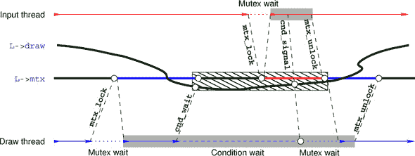

在等待调用中，条件变量与互斥锁之间的耦合应该小心处理。

|  |
| --- |

##### 总结 18.22

*条件变量只能与一个互斥锁同时使用*。

|  |
| --- |

但最好的做法可能是永远不要更改与条件变量一起使用的互斥锁。

我们的例子还表明，对于同一个互斥锁可以有多个条件变量：我们同时使用三个不同的条件变量与我们的互斥锁。这在许多应用中将是强制性的，因为线程将访问相同资源的条件表达式取决于它们各自的角色。

在多个线程等待同一个条件变量并被**cnd_broadcast**调用唤醒的情况下，它们不会同时醒来，而是一个接一个地，随着它们重新获取互斥锁。

与互斥锁类似，C 的条件变量可能会绑定宝贵的系统资源。因此，它们必须动态初始化，并在其生命周期结束时销毁。

|  |
| --- |

##### 总结 18.23

*`cnd_t`* 必须动态初始化。

|  |
| --- |
|  |

##### 总结 18.24

*`cnd_t`* 必须在其生命周期结束时销毁。

|  |
| --- |

这些接口很简单：

```
int **cnd_init**(**cnd_t** *cond);
void **cnd_destroy**(**cnd_t** *cond);
```

### 18.6. 更复杂的线程管理

在刚刚看到在**main**中创建和连接线程之后，我们可能会产生这样的印象，即线程以某种方式是有层次组织的。但实际上并非如此：仅仅知道线程的 ID，即其**`thrd_t`**，就足以处理它。只有一个线程具有一个特殊属性。

|  |
| --- |

##### 总结 18.25

*从* **main** *返回* 或 *调用* **exit** *将终止所有线程*。

|  |
| --- |

如果我们在创建其他线程之后想要终止**main**，我们必须采取一些预防措施，以确保我们不提前终止其他线程。以下是对 B9 的**main**修改后的示例，展示了这种策略：

##### `B9-detach.c`

```
**210**
**211**   void B9_atexit(void) {
**212**     /* Puts the board in a nice final picture */
**213**     L.iteration = L.last;
**214**     life_draw(&L);
**215**     life_destroy(&L);
**216**   }
**217**
**218**   int **main**(int argc, char* argv[argc+1]) {
**219**     /* Uses command-line arguments for the size of the board */
**220**     **size_t** n0 = 30;
**221**     **size_t** n1 = 80;
**222**     if (argc > 1) n0 = **strtoull**(argv[1], 0, 0);
**223**     if (argc > 2) n1 = **strtoull**(argv[2], 0, 0);
**224**     /* Create an object that holds the game's data. */
**225**     life_init(&L, n0, n1, M);
**226**     **atexit**(B9_atexit);
**227**     /* Creates four threads that operate on the same object and
**228**        discards their IDs */
**229**     **thrd_create**(&(**thrd_t**){0}, update_thread,  &L);
**230**     **thrd_create**(&(**thrd_t**){0}, draw_thread,    &L);
**231**     **thrd_create**(&(**thrd_t**){0}, input_thread,   &L);
**232**     /* Ends this thread nicely and lets the threads go on nicely */
**233**     **thrd_exit**(0);
**234**   }
```

首先，我们必须使用函数**thrd_exit**来终止**main**。除了**`return`**之外，这确保了相应的线程仅终止，而不会影响其他线程。然后，我们必须将 L 设为全局变量，因为我们不希望它的生命周期随着**main**的终止而结束。为了安排必要的清理，我们还安装了一个**atexit**处理程序。修改后的控制流程如图 18.4 所示。

##### 图 18.4\. `B9-detach` 的五个线程的控制流程。最后返回的线程执行 atexit 处理程序。

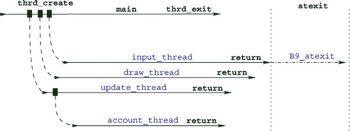

由于这种不同的管理方式，创建的四个线程实际上从未真正连接。每个已经死亡但从未连接的线程都会消耗一些资源，这些资源会保留到执行结束。因此，一个好的编码风格是告诉系统一个线程永远不会连接：我们说我们 *分离* 相应的线程。我们通过在线程函数的开始处插入对 **thrd_detach** 的调用来实现这一点。我们也在那里启动账户线程，而不是像以前那样从 **main** 中启动。

##### `B9-detach.c`

```
**38**      /* Nobody should ever wait for this thread. */
**39**      **thrd_detach**(**thrd_current**());
**40**      /* Delegates part of our job to an auxiliary thread */
**41**      **thrd_create**(&(**thrd_t**){0}, account_thread, Lv);
**42**      life*restrict L = Lv;
```

有六个更多函数可以用来管理线程，其中我们已经遇到了 **thrd_current**、**thrd_exit** 和 **thrd_detach**：

```
**thrd_t** **thrd_current**(void);
int **thrd_equal**(**thrd_t**, **thrd_t**);
_Noreturn void **thrd_exit**(int);

int **thrd_detach**(**thrd_t**);
int **thrd_sleep**(const struct **timespec***, struct **timespec***);
void **thrd_yield**(void);
```

一个正在运行的 C 程序可能拥有的线程比它可用的处理元素要多得多。尽管如此，运行时系统应该能够通过在处理器上分配时间片来平滑地调度线程。如果一个线程实际上没有工作要做，它不应该要求时间片，而应该将处理资源留给可能需要它们的其他线程。这是控制数据结构 **`mtx_t`** 和 **`cnd_t`** 的主要特性之一。

|  |
| --- |

##### 取走 18.26

*在阻塞于* **`mtx_t`** *或* **`cnd_t`*** 时，一个线程会释放处理资源。

|  |
| --- |

如果这还不够，还有两个其他函数可以挂起执行：

+   **thrd_sleep** 允许一个线程暂停其执行一段时间，这样平台的其他线程可以在其间使用硬件资源。

+   **thrd_yield** 只终止当前时间片并等待下一个处理机会。

|  |
| --- |

**使用线程进行并行排序**

你能否实现一个基于你的归并排序实现（挑战 1 和 14）的并行排序算法，使用两个线程？

也就是说，一个归并排序，它将输入数组分成两半，并在各自的线程中排序每一半，然后像以前一样按顺序合并这两个半部分。在每个线程内部使用不同的顺序排序算法作为基础。

你能否将这个并行排序推广到 *P* 线程，其中 *P* = 2^k，对于 *k* = 1, 2, 3, 4，其中 *k* 在命令行上给出？

你能否测量你并行化所获得的速度提升？它是否与你的测试平台的核心数相匹配？

|  |
| --- |

### 摘要

+   在并发访问之前确保共享数据被正确初始化是很重要的。这最好在编译时或在 **main** 中完成。作为最后的手段，可以使用 **call_once** 来触发初始化函数的执行，确保只执行一次。

+   线程应优先只操作本地数据，通过函数参数和自动变量。如果不可避免，也可以创建**`thread_local`**对象或通过**tss_create**来创建线程特定的数据。只有在需要变量的动态构建和销毁时才使用后者。

+   在线程之间共享的小关键数据应指定为**`_Atomic`**。

+   临界区（操作未受保护共享数据的代码路径）必须受到保护，通常是通过使用**`mtx_t`**互斥锁。

+   线程之间的条件处理依赖通过**`cnd_t`**条件变量进行建模。

+   没有能力依赖**main**进行事后清理的线程代码应使用**thrd_detach**，并将所有清理代码放在**atexit**和/或**at_quick_exit**处理程序中。

## 第十九章。原子访问和内存一致性

本章涵盖

+   理解“发生之前”关系

+   提供同步的 C 库调用

+   维护顺序一致性

+   与其他一致性模型一起工作

我们将通过描述构成 C 架构模型重要部分的概念来完成这一级，因此对于经验丰富的程序员来说是必须的。尝试理解最后一章，以增加你对事物工作方式的理解，而不仅仅是提高你的操作技能。即使我们不会深入所有辉煌的细节，^([1])事情可能会变得有点颠簸：请坐好并系好安全带。

> ¹
> 
> 我们将把**`memory_order_consume`**一致性以及依赖顺序关系放在一边。

如果你回顾我们在前几章中看到的控制流图，你会发现程序执行不同部分的交互可能会相当复杂。我们具有不同级别的数据并发访问：

+   简单直接的 C 代码表面上似乎是顺序的。变化的可见性仅在执行中的非常具体的点、序列点、直接数据依赖以及函数调用完成时得到保证。现代平台越来越多地利用提供的灵活性，在多个执行管道中混合或并行执行非顺序操作。

+   长跳转和信号处理程序是顺序执行的，但存储的效果可能会在途中丢失。

+   我们迄今为止看到的对原子对象的访问要求其变化在所有地方和始终可见。

+   线程并排同时运行，如果它们不调节对数据的共享访问，就会危及数据一致性。除了对原子对象的访问外，它们还可以通过调用函数（如**thrd_join**或**mtx_lock**）进行同步。

但程序所做的不仅仅是访问内存。事实上，程序执行的抽象状态由以下内容组成：

+   *执行点*（每个线程一个）

+   *中间值*（计算表达式或评估对象的值）

+   *存储值*

+   *隐藏状态*

对此状态的更改通常描述为

+   ***跳转：*** 改变执行点（短跳转、长跳转和函数调用）

+   ***值计算：*** 改变中间值

+   ***副作用：*** 存储值或进行 I/O 操作

或者它们可以影响隐藏状态，如 **`mtx_t`** 的锁状态或 **`once_flag`** 的初始化状态，或者对 **`atomic_flag`** 的设置或清除操作。

我们用 *效果* 这个术语来总结所有这些可能的抽象状态的改变。

| |
| --- |

##### 取得成果 19.1

*每次评估都有一个效果*。

| |
| --- |

这是因为任何评估都有一个概念，即在其之后将执行的下一次评估。即使是像

```
(void)0;
```

这样的表达式，丢弃了中间值，将执行点设置到下一个语句，因此抽象状态已经改变。

在复杂的环境中，将很难争论给定时刻执行的真正抽象状态。通常，整个程序执行的抽象状态甚至不可观察；在许多情况下，整体抽象状态的概念定义得并不好。这是因为我们实际上不知道在这个上下文中 *时刻* 的含义。在多个物理计算核心上执行的多线程执行中，它们之间没有真正的参考时间概念。因此，C 甚至不假设不同线程之间存在整体细粒度的时间概念。

作为一个类比，想象两个线程 A 和 B 是发生在两个不同行星上的事件，这两个行星以不同的速度围绕一颗恒星运行。这些行星（线程）上的时间（时间）是相对的，它们之间的同步只有在来自一个行星（线程）发出的信号到达另一个行星时才会发生。信号的传输本身就需要时间，当信号到达目的地时，其来源已经移动。因此，两个行星（线程）之间的相互知识总是部分的。

##### 图 19.1. 通过原子同步的两个线程。圆圈表示对象 x 的修改。线程下面的条形表示 *A* 的状态信息，上面的表示 *B* 的状态信息。

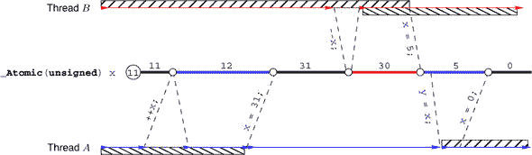

### 19.1. “发生之前”关系

如果我们要争论一个程序的执行（其正确性、性能等），我们需要足够了解所有线程的状态的*部分知识*，*并且*我们必须知道如何将这些部分知识拼接起来，以获得对整个程序的一致视图。

因此，我们将研究 Lamport [1978] 提出的一个关系。在 C 标准术语中，它是两个评估 *E* 和 *F* 之间的 *发生之前* 关系，表示为 *F → E*。这是我们观察到的 *事后* 事件之间的属性。完全展开，它可能更准确地被称为 *已知发生之前* 关系。

其中一部分包括同一线程中相关的评估，这些评估通过已经引入的 sequenced-before 关系相关联：

|  |
| --- |

##### 收获 19.2

*如果 F 在 E 之前进行排序，则 F → E*。

|  |
| --- |

为了说明这一点，让我们重新审视我们的输入线程中的 列表 18.1。在这里，对 `command[0]` 的赋值在 `switch` 语句之前进行排序。因此，我们可以确定 `switch` 语句中的所有情况都是在赋值之后执行的，或者至少它们会被 *感知* 为在之后发生。例如，当将命令传递给 **ungetc** 下的嵌套函数调用时，我们可以确定这将提供修改后的值。所有这些都可以从 C 的语法中推断出来。

在线程之间，事件的排序由 *同步* 提供。有两种类型的同步：第一种是由原子操作隐含的，第二种是由某些 C 库调用提供的。让我们首先看看原子的情况。如果一个线程写入一个值，另一个线程读取被写入的值，那么原子对象可以用来同步两个线程。

原子操作保证局部一致性；参见 图 19.1。

|  |
| --- |

##### 收获 19.3

*原子对象 *`X`* 的修改集 *`X`* 是按照处理 *`X`* 的任何线程的 sequenced-before 关系进行的，顺序是一致的。

|  |
| --- |

这个序列被称为 X 的 *修改顺序*。例如，对于图中的原子 x，我们有六个修改：初始化（值 `11`）、两次增加和三次赋值。C 标准保证两个线程 A 和 B 都以与这种修改顺序一致的方式感知 x 的所有更改。

在图例的例子中，我们只有两个同步点。首先，线程 B 在其 `-`-x 操作结束时与线程 A 同步，因为在这里它读取（并修改）了 A 写入的值 `31`。第二个同步发生在 A 读取 B 写入的值 `5`并将其存储到 y 中时。

作为另一个例子，让我们研究输入线程（列表 18.1）和账户线程（列表 18.2）之间的相互作用。它们在不同的地方读取和修改字段 finished。为了论证的简单性，让我们假设 finished 只在这两个函数中被修改，没有其他地方。

两个线程只有在其中之一修改它的情况下才会通过这个原子对象进行同步：也就是说，将值 **`true`** 写入其中。这可以在两种情况下发生：

+   输入线程遇到文件结束条件，无论是当 **feof**`(`**`stdin`**`)` 返回 **`true`**，还是遇到 **`EOF`** 情况。在这两种情况下，**`do`** 循环终止，并执行标签 FINISH 之后的代码。

+   账户线程检测到允许重复的次数超过限制，并将 finished 设置为 **`true`**。

这些事件不是互斥的，但使用原子对象可以保证两个线程中有一个会首先成功写入到已完成的变量。

+   如果输入线程先写入，账户线程可能会在其一个**`while`**循环的评估中读取已完成的修改值。这次读取是同步的：也就是说，输入线程中的写入事件已知在这次读取之前已经发生。输入线程在写入操作之前所做的任何修改现在都对账户线程可见。

+   如果账户线程先写入，输入线程可能会在其**`do`**循环的**`while`**中读取修改后的值。再次强调，这次读取与写入同步，并建立了一个“先发生”的关系，账户线程所做的所有修改都对输入线程可见。

注意，这些同步是有方向的：线程之间的每个同步都有一个“写入方”和“读取方”。我们将两个抽象属性附加到原子操作和某些称为释放语义（在写入方）、获取语义（在读取方）或获取-释放语义（在读取-写入方）的 C 库调用上。稍后我们将讨论具有这种同步属性的 C 库调用。

我们迄今为止看到的、修改对象的原子操作都必须具有释放语义，而所有读取操作都具有获取语义。稍后我们将看到具有放松属性的其它原子操作。

|  |
| --- |

##### Takeaway 19.4

*如果线程 T[E]中的获取操作 E 与另一个线程 T[F]中的释放操作 F 同步，那么如果 E 读取了 F 写入的值。*

|  |
| --- |

使用获取和释放语义的特殊构造的目的是强制这些操作之间的效应可见性。我们说，如果我们可以一致地用任何适当的读取操作或使用受效应 X 影响的状态的函数调用替换评估 E，那么效应 X 在评估 E 时是可见的。例如，在图 19.1 中，A 在 x `= 31`操作之前产生的效应用线程下方的横线表示。一旦 B 完成`-`x 操作，这些效应对 B 就是可见的。

|  |
| --- |

##### Takeaway 19.5

*如果 F 与 E 同步，那么在 E 之后发生的所有在 F 之前发生的效应 X 都必须在所有 G 评估中可见**.*

|  |
| --- |

正如我们在示例中看到的，有一些原子操作可以在一步中读取和写入。这些被称为**读取-修改-写入**操作：

+   对任何**`_Atomic`**对象的**atomic_exchange**和**atomic_compare_exchange_weak**调用

+   复合赋值或其功能等价物；任何算术类型**`_Atomic`**对象的递增和递减运算符

+   对**`atomic_flag`**的**atomic_flag_test_and_set**调用

这种操作可以在读取方面与一个线程同步，在写入方面与其它线程同步。我们迄今为止看到的所有这样的读取-修改-写入操作都具有获取和释放语义。

发生之前的关系通过传递性地关闭有序之前和同步于的关系。我们说*F*有意识地发生在*E*之前，如果存在*n*和*E*[0] = *F, E*[1]*, ..., E*[*n*–1], *E[n]* = *E*，其中*E[i]*是有序于*E[i]*[+1]或与其同步的，对于所有 0 *≤ i < n*。

| 19.2\. 提供同步的 C 库调用 |
| --- |

##### 具有同步特性的 C 库函数成对出现：释放方和获取方。它们总结在表 19.1 中。

19.6 要点

| 19.7 要点 |
| --- |

观察到这个发生之前的关系是不同概念的组合。有序之前的关系可以在许多地方从语法中推断出来，特别是如果两个语句是同一个基本块中的成员。同步不同：除了线程启动和结束的两个例外，它是通过特定对象（如原子或互斥量）的数据依赖来推断的。

**thrd_create**和**thrd_join**的这些同步特性使我们能够在图 18.1 中画出线条。在这里，我们不知道我们启动的线程之间事件的任何时间顺序，但在**main**中我们知道我们创建线程的顺序和我们将它们连接的顺序正好如图所示。我们还知道，在我们连接最后一个线程（账户线程）之后，任何这些线程对数据对象的影响都对**main**可见。所有这一切的预期结果是，一个线程中的效果在另一个线程中变得可见。

| 互斥量释放 | 互斥量获取 |
| --- | --- |

##### |  |

|  |

| |
| --- |

### |  |

| **thrd_create**(.., f, x) | f(x)的入口 |

表 19.1\. 形成同步对的 C 库函数

| 通过线程 id 的**thrd_exit**或从 f 的**return** | id 的**tss_t**析构函数的开始 |

##### | **call_once**(&obj, g), 首次调用 | **call_once**(&obj, h), 所有后续调用 |

| *如果评估 F 发生在 E 之前，那么已知在 F 之前发生的所有效果也都是在 E 之前发生的。* |
| --- |
| 如果我们断开线程并不用**thrd_join**同步，则同步只能在线程的结束和**atexit**或**at_quick_exit**处理器的开始之间发生。 |
| 释放 | 获取 |
| *我们只能得出一个评估发生在另一个评估之前的结论，如果我们有一个将它们链接起来的有序同步链。* |
| --- | --- |
| |
| id 的**tss_t**析构函数的结束 | **thrd_join**(id)或**atexit**/**at_quick_exit**处理器 |

注意，对于前三个条目，我们知道哪些事件与哪些事件同步，即同步主要限于线程 id 执行的效果。特别是，通过传递性，我们可以看到**thrd_exit**或**`return`**总是与对应线程 id 的**thrd_join**同步。

其他库函数稍微复杂一些。对于初始化实用工具**call_once**，第一次调用**call_once**`(&`obj`,` `g)`，成功调用其函数 g 的返回，是对所有后续调用相同对象 obj 的释放操作。这确保了在调用`g()`期间执行的所有写操作都发生在任何其他调用 obj 之前。因此，所有其他此类调用也知道写操作（初始化）已经执行。

对于我们的例子（第 18.2 节），这意味着函数 errlog_fopen 只执行一次，所有可能执行**call_once**行的其他线程都将与第一次调用同步。因此，当任何线程从调用返回时，它们知道调用已经执行（要么是自己执行的，要么是比它快的另一个线程执行的）并且所有效果，如计算文件名和打开流，现在都是可见的。因此，执行调用的所有线程都可以使用 errlog，并且可以确信它已正确初始化。

对于互斥锁，释放操作可以是调用互斥锁函数**mtx_unlock**，或者进入条件变量的等待函数**cnd_wait**和**cnd_timedwait**。互斥锁的获取操作是通过任何三个互斥锁调用**mtx_lock**、**mtx_trylock**和**mtx_timedlock**成功获取互斥锁，或者从等待函数**cnd_wait**或**cnd_timedwait**返回。

| |
| --- |

##### 收获 19.8

由相同互斥锁保护的关键节发生顺序。

| |
| --- |

我们的输入和会计线程（示例 18.1 和 18.2）访问相同的互斥锁`L-`>mtx。在前一个示例中，它用于保护当用户输入空格、'b'或'B'时新细胞组的出生。在第二个示例中，整个 while 循环的内部块由互斥锁保护。

图 19.2 概述了由互斥锁保护的三个关键节点的序列。解锁操作（释放）与锁定操作（获取）之间的同步同步了两个线程。这保证了在第一次调用 life_account 时，账户线程对`*`L 所做的更改在输入线程调用 life_birth9 时可见。同样，第二次调用 life_account 可以看到在调用 life_birth9 期间发生的所有对`*`L 的更改。

##### 图 19.2\. 两个线程通过互斥锁同步三个关键节点。圆圈表示对象 mtx 的修改。

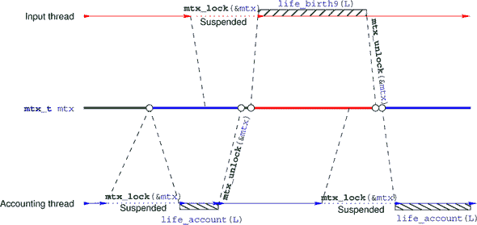

| |
| --- |

##### 收获 19.9

在由互斥锁**`mut`**保护的关键节中，所有由**`mut`**保护的前一个关键节的效果都是可见的。

| |
| --- |

这些已知效果之一是执行点的推进。特别是，在从**mtx_unlock**返回时，执行点位于临界区之外，并且这种效果为下一个新获取锁的线程所知。

条件变量的等待函数与获取-释放语义不同；实际上，它们正好相反。

| |
| --- |

##### 取得要点 19.10

**`cnd_wait`** *和* **cnd_timedwait** *对互斥锁具有释放-获取语义。*

| |
| --- |

即，在挂起调用线程之前，它们执行释放操作，然后，在返回时执行获取操作。另一个特殊性是同步是通过互斥锁进行的，**不是**通过条件变量本身。

| |
| --- |

##### 取得要点 19.11

*对* **cnd_signal** *和* **cnd_broadcast** *的调用通过互斥锁进行同步。

| |
| --- |

如果信号线程没有将**cnd_signal**或**cnd_broadcast**的调用放入由等待者相同的互斥锁保护的临界区，那么它不一定与等待线程同步。特别是，如果修改不是由互斥锁保护的，那么构成**条件表达式**的对象的非原子修改可能不会对被信号唤醒的线程可见。有一个简单的经验法则可以确保同步：

##### 图 19.3\. 三个不同原子对象的顺序一致性

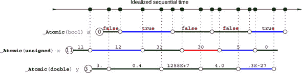

| |
| --- |

##### 取得要点 19.12

*对* **cnd_signal** *和* **cnd_broadcast** *的调用应该发生在由相同的互斥锁保护的临界区内部。

| |
| --- |

这就是我们大约在第 145 行看到的列表 18.1 中的内容。在这里，函数 life_birth 修改了`*`L 的较大、非原子部分，因此我们必须确保这些修改对所有其他与`*`L 一起工作的线程都是适当可见的。

第 154 行显示了**cnd_signal**的使用，它没有被互斥锁保护。这在这里是可能的，因为所有在其他**`switch`**情况中修改的数据都是原子的。因此，读取这些数据的其他线程，如`L-`>frames，可以通过这些原子来同步，而不依赖于获取互斥锁。如果你使用这样的条件变量，请小心。

### 19.3\. 顺序一致性

我们之前描述的原子对象的**一致性**，由**发生之前**关系保证，被称为**获取-释放一致性**。而我们所看到的 C 库调用总是与这种一致性同步，不多也不少，对原子对象的访问可以使用不同的一致性模型。

如你所记，所有原子对象都有一个与所有在相同对象上看到这些修改的**修改顺序**相一致的**顺序一致性**关系。**顺序一致性**的要求甚至比这更多；参见图 19.3。在这里，我们展示了所有顺序一致性操作的常见时间线。即使这些操作在不同的处理器上执行，原子对象在不同的内存银行中实现，平台也必须确保所有线程将这些操作视为与这个全局线性化一致。

| |
| --- |

##### Takeaway 19.13

*所有具有顺序一致性的原子操作都发生在单个全局修改顺序中，无论它们应用于哪个原子对象。*

| |
| --- |

因此，顺序一致性是一个非常严格的要求。不仅如此，它强制执行获取-释放语义（事件之间的因果部分排序），而且还把这个部分排序扩展到总排序。如果你对并行化程序的执行感兴趣，顺序一致性可能不是正确的选择，因为它可能会强制原子访问的顺序执行。

标准为原子类型提供了以下功能接口。它们应遵守其名称所给出的描述，并执行同步：

```
void **atomic_store**(A volatile* obj, C des);
C **atomic_load**(A volatile* obj);
C **atomic_exchange**(A volatile* obj, C des);
bool **atomic_compare_exchange_strong**(A volatile* obj, C *expe, C des);
bool **atomic_compare_exchange_weak**(A volatile* obj, C *expe, C des);
C **atomic_fetch_add**(A volatile* obj, M operand);
C **atomic_fetch_sub**(A volatile* obj, M operand);
C **atomic_fetch_and**(A volatile* obj, M operand);
C **atomic_fetch_or**(A volatile* obj, M operand);
C **atomic_fetch_xor**(A volatile* obj, M operand);
bool **atomic_flag_test_and_set**(**atomic_flag** volatile* obj);
void **atomic_flag_clear**(**atomic_flag** volatile* obj);
```

这里 C 是任何适当的数据类型，A 是对应的原子类型，M 是与 C 的算术兼容的类型。正如其名称所暗示的，对于获取和运算符接口，调用返回对象修改之前`*`obj 的值。因此，这些接口与相应的复合赋值运算符（`+=`）不等价，因为那会返回修改后的结果。

所有这些功能接口都提供**顺序一致性**。

| |
| --- |

##### Takeaway 19.14

*原子上的所有未指定其他操作的运算符和功能接口都具有顺序一致性。*

| |
| --- |

注意，功能接口与运算符形式不同，因为它们的参数被**`volatile`**修饰。

对于原子对象还有一个不暗示同步的函数调用：

```
void **atomic_init**(A volatile* obj, C des);
```

它的效果与调用**atomic_store**或赋值操作相同，但来自不同线程的并发调用可能会产生竞态条件。将**atomic_init**视为一种廉价的赋值形式。

### 19.4. 其他一致性模型

可以通过一组互补的功能接口请求不同的一致性模型。例如，可以通过以下方式指定与后缀`++`运算符等效的仅具有获取-释放一致性的操作：

```
   _Atomic(unsigned) at = 67;
   ...
   if (**atomic_fetch_add_explicit**(&at, 1, **memory_order_acq_rel**)) {
     ...
   }
```

| |
| --- |

##### Takeaway 19.15

*原子对象的同步功能接口具有附加**`_explicit`**的形式，允许我们指定它们的顺序一致性模型。*

| |
| --- |

这些接口接受形式为**`memory_order`**类型符号常量的额外参数，该参数指定了操作的内存语义：

+   **`memory_order_seq_cst`** 请求顺序一致性。使用此选项等同于没有 **`_explicit`** 的形式。

+   **`memory_order_acq_rel`** 用于具有获取-释放一致性的操作。对于一般的原子类型，你通常会在读-改-写操作中使用它，例如 **atomic_fetch_add** 或 **atomic_compare_exchange_weak**，或者对于 **`atomic_flag`** 与 **atomic_flag_test_and_set**。

+   **`memory_order_release`** 用于只有释放语义的操作。通常这会是 **atomic_store** 或 **atomic_flag_clear**。

+   **`memory_order_acquire`** 用于只有获取语义的操作。通常这会是 **atomic_load**。

+   **`memory_order_consume`** 用于具有比获取一致性更弱因果依赖性的操作。通常这也会是 **atomic_load**。

+   **`memory_order_relaxed`** 用于不添加任何同步要求的操作。此类操作的唯一保证是它是不可分割的。此类操作的典型用例是用于不同线程的性能计数器，但我们只对最终累计计数感兴趣。

可以根据它们对平台施加的限制来比较一致性模型。图 19.4 显示了 **`memory_order`** 模型的含义顺序。

##### 图 19.4\. 一致性模型层次结构，从最少约束到最多约束

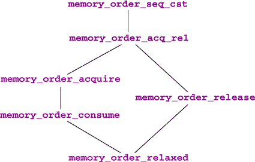

而 **`memory_order_seq_cst`** 和 **`memory_order_relaxed`** 对所有操作都是可接受的，但其他 **`memory_order`** 有一些限制。只能在同步的一侧发生的操作只能指定那一侧的顺序。因此，仅存储（**atomic_store** 或 **atomic_flag_clear**）的两个操作可能不会指定获取语义。只有三个操作只执行加载，可能不会指定释放或消费语义：除了 **atomic_load**，这些是失败情况下的 **atomic_compare_exchange_weak** 和 **atomic_compare_exchange_strong**。因此，后两个操作需要两个 **`memory_order`** 参数来指定它们的 **`_explicit`** 形式，以便它们可以区分成功和失败情况的要求：

```
bool
**atomic_compare_exchange_strong_explicit**(A volatile* obj, C *expe, C des,
                                        **memory_order** success,
                                        **memory_order** failure);
bool
**atomic_compare_exchange_weak_explicit**(A volatile* obj, C *expe, C des,
                                       **memory_order** success,
                                       **memory_order** failure);
```

在这里，成功一致性必须至少与失败一致性一样强；参见图 19.4。

到目前为止，我们隐含地假设同步的获取和释放方面是对称的，但实际上并非如此：虽然修改只有一个写者，但可以有多个读者。因为将新数据移动到多个处理器或核心是昂贵的，一些平台允许我们避免将原子操作之前发生的所有可见效果传播到所有读取新值的线程。C 语言的*消费一致性*就是为了映射这种行为设计的。我们不会深入探讨这个模型，你应该只在确定原子读取之前的一些效果不会影响读取线程时才使用它。

### 摘要

+   “发生之前”关系是推理不同线程之间时间顺序的唯一可能方式。它只能通过使用原子对象或非常具体的 C 库函数的同步来建立。

+   顺序一致性是原子的一致性模型默认值，但不是其他 C 库函数的默认值。它还假设所有相应的同步事件都是完全有序的。这是一个可能代价高昂的假设。

+   显式使用获取-释放一致性可能会导致更高效的代码，但需要对原子函数使用带有**`_explicit`**后缀的正确参数进行仔细设计。
