# 第一章《C 语言的基础知识》

C 是一种强大的语言。它是过程式的（意味着你大部分编码工作是通过过程完成的），并且是编译的（意味着你编写的代码必须通过编译器翻译才能被计算机使用）。你可以在任何能够编辑文本文件的地方编写你的过程，也可以将这些过程编译成可以运行在从超级计算机到最小的嵌入式控制器的任何设备上的代码。这是一门出色的、成熟的语言——我很高兴你正在学习它！

C 已经存在了相当长的时间：它是在 20 世纪 70 年代初由贝尔实验室的丹尼斯·里奇开发的。你可能听说过他，他是与布莱恩·克尼根（Pearson）合著的经典 C 编程书籍《C 程序设计语言》的作者之一。（如果在编程界看到或听到或阅读到“K&R”这个词组，那就是在提到这本书。）作为一种通用的过程式语言，C 旨在使程序员能够连接他们的程序将要运行的硬件，因此在贝尔实验室之外的学术和工业机构中流行起来，用于运行越来越多的计算机，并且仍然是一种可行的系统编程语言。

像所有语言一样，C 是不静态的。凭借将近 50 年的发展历程，C 经历了许多变化，并衍生出大量其他语言。你可以看到它在诸如 Java 和 Perl 等语言的语法中的影响。事实上，C 的一些元素如此普遍，以至于你会在旨在代表“任何”语言的伪代码示例中看到它的身影。

随着 C 的流行，有必要组织和标准化其语法和特性。本书的第一部分将关注由国际标准化组织（ISO）定义的[标准 C](https://oreil.ly/9MDKn)，我们编写的代码将可移植到任何平台上的任何 C 编译器。本书的后半部分将专注于将 C 与特定硬件（如 Arduino 微控制器）结合使用。

# 优缺点

当今，要用计算机解决实际问题，使用高级语言是必须的。C 在编译为实际硬件时，能够在代码可读性和性能之间取得良好平衡。C 具有直观的代码结构和丰富的有用运算符。（这些特性已经传播到许多后续语言中，并使其成为微控制器上精简代码的良好选择。）C 还允许你将问题分解为较小的子问题。你可以像人类一样推理代码（及其不可避免的错误），这非常方便。

C 也有其不足之处。例如，C 并不具备像 Java 那样的自动内存垃圾收集等一些现代语言中的花哨特性。许多现代语言为了降低程序员的编程负担，把大部分细节都隐藏起来，虽然会稍稍牺牲一些性能。C 要求你在分配和管理内存等资源时更加谨慎。有时这种要求会感觉很烦人。

C 语言还允许你编写一些相当引人注目的错误。它没有类型安全性，实际上没有任何安全检查。同样，作为程序员，这种无干扰的方法意味着你可以编写聪明高效的代码，非常适合硬件运行。但这也意味着，如果你出错了，你就需要找到并解决问题。（像 linter 和 debugger 这样的工具会有所帮助；我们在学习过程中一定会仔细研究它们。）

# 开始

那么我们如何开始呢？和任何编译语言一样，我们首先需要一个包含一些有效 C 指令的文件。然后，我们需要一个可以翻译这些指令的编译器。只要文件中有正确的内容，并且有适合你电脑硬件的编译器，你可以在几分钟内运行一个 C 程序。

如果你花了一些时间学习任何计算机语言，你可能熟悉“Hello, World”程序的概念。这是一个令人钦佩的简单想法：创建一个小程序，一举证明几件事情。它证明你可以用该语言编写有效的代码。它证明你的编译器或解释器有效。它还证明你可以生成可见的输出，这对人类来说非常方便。让我们开始吧！

## 所需工具

如今，人们使用计算机进行各种各样的任务。娱乐，比如游戏和流媒体视频，占用了与商业生产工作或甚至应用程序开发一样多（如果不是更多）的 CPU 周期。由于计算机用于消费和生产，几乎没有系统预装了用于应用程序开发等任务所需的工具。幸运的是，这些工具是免费提供的，但你必须亲自获取并设置它们以在你的系统上运行。

如我之前所提到的，本书专注于编写干净高效的 C 代码。在我们的示例中，我尽力避免使用过于巧妙的模式。我也努力确保示例不依赖于特定的编译器或特定的开发平台。为此，我将使用任何软件开发所需的最小配置：一个好的编辑器和一个好的编译器。¹

如果你习惯在网上寻找软件并且想要立即开始，我们将安装[Visual Studio Code](https://oreil.ly/kXf3h)（通常简称为“VS Code”）作为我们的编辑器，以及从 GNU 基金会获取的[GNU 开发者工具](https://oreil.ly/xclHh)来处理编译。更多链接和详细信息请参考，但安装完这些工具后，随时可以跳转到“创建一个 C 的‘Hello, World’”，无论是你自己安装还是已经有了自己喜欢使用的编辑器和编译器。

### Windows

Microsoft Windows 占据了桌面市场的大部分份额。如果您只为一个系统编写程序，Windows 能为您提供最大的效益。但这意味着您将在编写这些程序的软件中面临更多竞争。对于 Windows，有比任何其他平台都多的商业开发应用程序。幸运的是，这些应用程序中的许多都有免费或“社区”版本，足以满足我们的需求。（当我们在本书的第二部分讨论 Arduino 重点时，我们将查看一些包括编译器的 Arduino 特定工具。）

谈论 Windows 和软件开发时，不能不提微软的 Visual Studio 集成开发环境（IDE）。如果您想要为 Windows 本身构建应用程序，那么 Visual Studio 几乎无可匹敌。他们甚至为学生和个人开发者提供社区版本。虽然在本书的示例中我不会讨论任何版本，但 Visual Studio 对于 Windows 用户来说是一个很棒的 IDE，并且可以轻松处理我们的代码。（然而，在所有三个主要平台上，我将使用一个名为 Visual Studio Code 的近亲作为我们的编辑器。）

###### 注意

另一个流行的商业 IDE 是来自 Jetbrains 的[CLion](https://oreil.ly/E1Oxh)。CLion 也是跨平台的，因此您可以轻松地在不同操作系统之间切换，并保持高效。如果您有使用 Jetbrains 其他优质应用程序的经验，CLion 可以成为一个熟悉的开始编写和调试 C 代码的方式。

存在无数其他文本编辑器，每种都有其优缺点。甚至可以使用像内置的记事本应用这样的工具，尽管专门用于编程的编辑器将具有一些便捷功能，可以使阅读和调试代码变得更容易。

#### 在 Windows 上的 GNU 工具

在 Windows 上，安装 GNU 的 GCC 工具可能会有些繁琐。没有快捷友好的安装程序。² 您可以找到多种二进制包，提供我们所需的大部分内容，但仍需注意下载 GNU 编译器的子包，并配置您的 Windows 环境。

我们将安装 Cygwin 环境来获取我们的 Windows 版本的 GCC。Cygwin 是一个更大的工具和实用程序集合，为 Windows 用户提供了一个不错的 Unix shell 环境。但“不错”相当主观，如果您不了解 Unix 或其衍生产品，如 Linux 或现代 macOS，那么您可能不会使用该集合的其他功能。

获取[Cygwin 设置](https://oreil.ly/Loj7l)可执行文件。下载完成后，立即启动它。可能需要“允许此来自未知发布者的应用程序更改设备”。你可以尝试“从互联网安装”选项，但如果遇到问题，可以返回并使用“下载而不安装”选项。下载完成后，可以再次运行此安装程序，并选择“从本地目录安装”选项，并使用下载所有软件包的文件夹。

前往安装程序询问时接受任何默认选项。当到达镜像选择页面时，如果你能识别到你附近的大学或企业，请选择一个物理位置接近的镜像。否则，任何镜像都可以——但如果下载遇到问题，可以返回并选择另一个镜像。

在“选择包”屏幕上，你需要做一个额外的选择，因为`gcc`不是默认包含的。将视图下拉菜单切换到“完整”，然后输入`gcc`作为搜索词。你需要的是如图 1-1 所示高亮显示的“gcc-core”包。在撰写本文时，我们选择了最新的 gcc-core 版本，即 10.2.0-1。

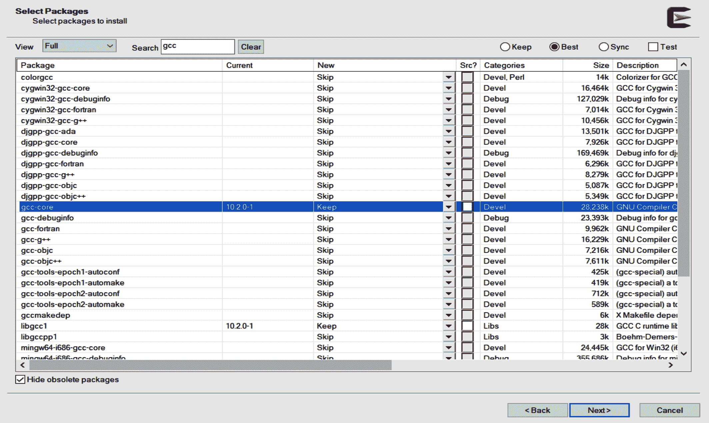

###### 图 1-1\. 选择 Cygwin GCC 包

在审核页面确认你的选择并开始下载！可能需要一些时间来下载和安装所有内容，但最终会出现完成屏幕。如果想玩一下类 Unix 命令提示符，可以添加桌面图标，但不是我们将要进行的工作所必需的。不过，必须执行的是额外的步骤，将 Cygwin 工具添加到 Microsoft 命令提示符中。

你可能希望在线搜索一个有关创建和编辑 Windows 环境变量的导览，但这里是基本内容。（如果你以前做过这种事情，可以直接跳到 Cygwin 文件夹选择并将其添加到你的路径中。）

从开始菜单搜索“env”，你应该很快看到一个选项，可以在顶部编辑系统环境变量，如图 1-2 所示。

应该打开系统属性对话框，然后点击右下角附近的“环境变量…”按钮，如图 1-3 所示。

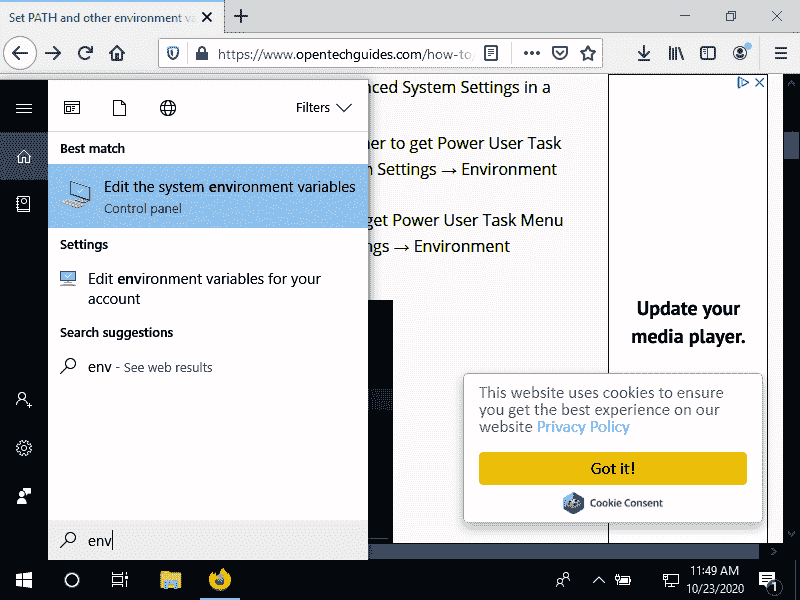

###### 图 1-2\. 在 Windows 中找到环境变量编辑器

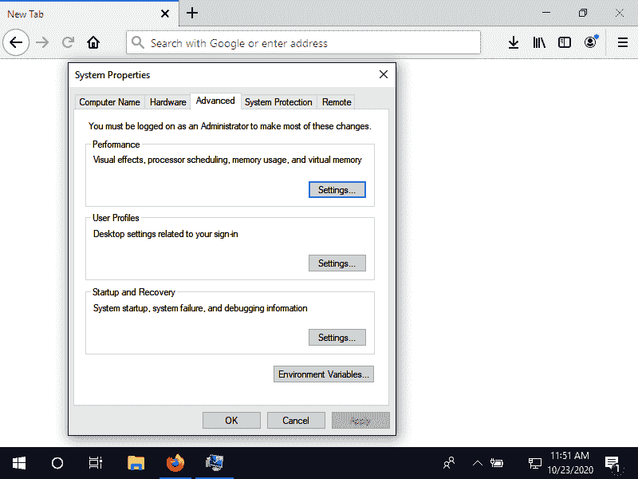

###### 图 1-3\. Windows 中的系统属性对话框

您可以仅设置您的路径或设置系统范围。突出显示要更新的 PATH 条目，然后单击编辑。接下来，单击“编辑环境变量”对话框上的“新建”按钮，然后单击“浏览”按钮以导航到 Cygwin 的*bin*文件夹，如图 1-4 所示。（当然，如果您记得您选择的用于将所有内容放入的 Cygwin 安装程序的根文件夹，您也可以直接键入。）

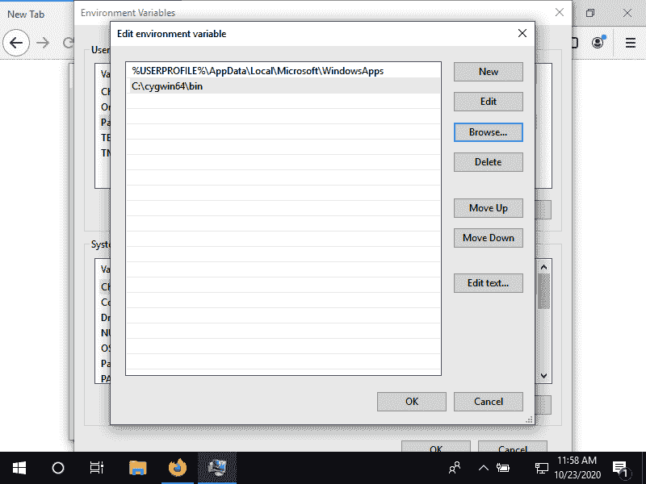

###### 图 1-4\. 将 Cygwin 的*bin*文件夹添加到 Path 环境变量中

选择“确定”按钮以关闭每个对话框，然后您就可以开始了！

对于编辑器，您可以在 Visual Studio 网站上找到[VS Code](https://oreil.ly/27eCl)。根据您的系统，您可能需要 64 位或 32 位用户安装程序版本。³

使用图 1-5 中显示的扩展视图来获取 C/C++扩展。您可以搜索简单的字母“c”，但您也可能立即在“热门”列表中看到该扩展。继续点击扩展的小绿色安装按钮。

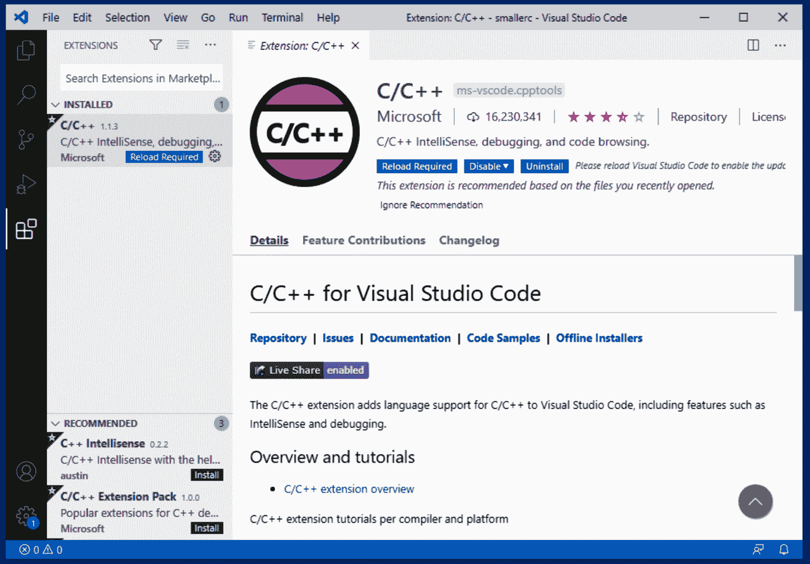

###### 图 1-5\. VS Code 中的 C 扩展

让我们从 Cygwin 工具中测试 GCC。 （您可能需要重新启动 Visual Studio Code 才能识别您的 Cygwin 工具。）从视图菜单中，选择终端选项。终端选项卡应在底部打开。您可能需要按 Enter 键获取提示符。在提示符处运行**`gcc --version`**。希望您能看到与图 1-6 类似的输出。

您应该看到与您安装 Cygwin 时选择的包版本匹配的版本号。如果是这样，太棒了！跳到“创建 C 的‘Hello, World’”并开始您的第一个 C 程序。如果您没有看到任何输出或出现“未识别”错误，请查看设置 Windows 环境变量的步骤。如常，在线搜索特定错误可以帮助您解决大多数安装和设置问题。

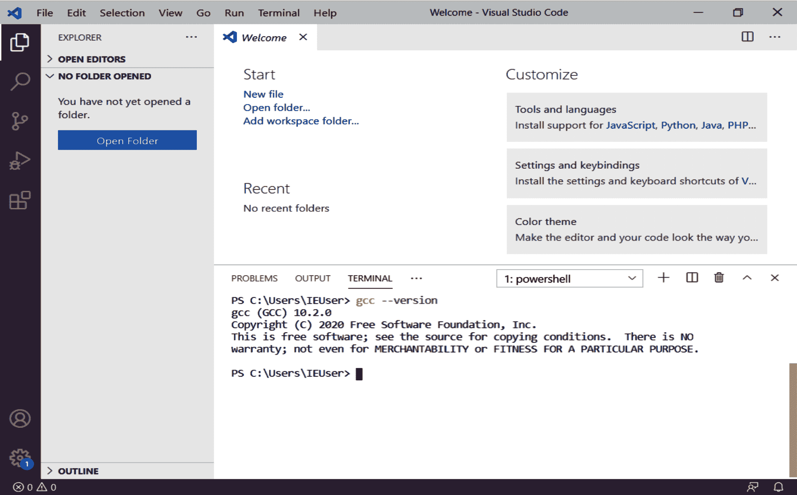

###### 图 1-6\. 在终端选项卡中测试 GCC

### macOS

如果您主要使用图形应用程序和工具，您可能不了解 macOS 的 Unix 基础知识。虽然您可以大部分时间忽略这些基础知识，但了解如何从命令提示符中浏览世界还是很有用的。我们将使用`Terminal`应用程序来下载和安装 GCC，但与 Windows 一样，值得注意的是苹果的官方开发工具 Xcode 可以用来编写和编译 C 代码。幸运的是，我们不需要全部安装 Xcode 才能开始使用 C，所以我们将坚持最少的安装。

应用程序→实用工具文件夹中有终端应用程序。继续启动它。你应该看到类似于图 1-7 的内容。

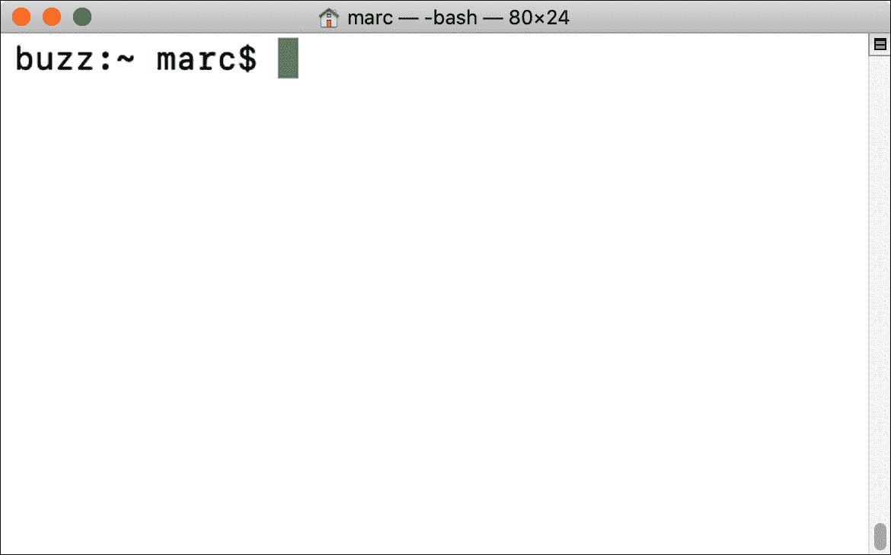

###### 图 1-7\. 基本的 macOS 终端窗口

如果您已经安装了苹果的主要编程应用程序 Xcode，您可以快速检查 GCC 是否也可用。尝试运行**`gcc -v`**：

```cpp
$ gcc -v
Configured with: --prefix=/Library/Developer/CommandLineTools/usr --with...
Apple clang version 11.0.3 (clang-1103.0.32.62)
Target: x86_64-apple-darwin19.6.0
Thread model: posix
InstalledDir: /Library/Developer/CommandLineTools/usr/bin
```

具体版本并不那么重要；我们只想确保 GCC 确实可用。如果没有，您需要安装`xcode-select`命令行工具，它将带来 GCC。键入**`xcode-select --install`**并按照提示操作。将显示一个对话框询问是否要安装命令行工具；选择是，然后开始操作。

安装完成后，请运行**`gcc -v`**命令以确保您已安装编译器。如果没有得到良好的响应，您可能需要访问[Apple 的开发者支持站点](https://oreil.ly/JyXV8)，并搜索“命令行工具”。

在 macOS 上安装 VS Code 要简单得多。访问 Visual Studio 网站上的相同[VS Code 下载](https://oreil.ly/kUgwI)页面。选择 macOS 下载。您应该会在标准下载文件夹中收到一个 ZIP 文件。双击该文件解压缩，然后将结果的*Visual Studio Code.app*文件拖到*应用程序*文件夹中。如果提示输入密码以将应用程序移动到*应用程序*，请立即提供。

安装完成后，请打开 VS Code。我们要添加 C/C++扩展并检查是否可以从终端选项卡访问 GCC。

通过点击图 1-8 中显示的“方块”图标，在 VS Code 中拉出扩展面板。您可以搜索简单的字母“C”，很可能会在结果顶部找到正确的扩展。

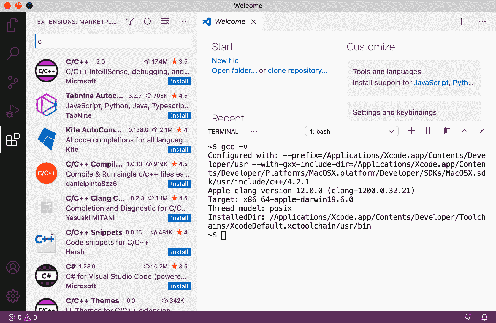

###### 图 1-8\. VS Code 扩展

要尝试终端选项卡，请从查看 → 终端菜单项中打开它。您应该会在编辑器空间底部看到一个新的部分。继续尝试在那个新区域运行我们的 GCC 检查命令（**`gcc -v`**）。您应该会看到类似于图 1-9 的结果。

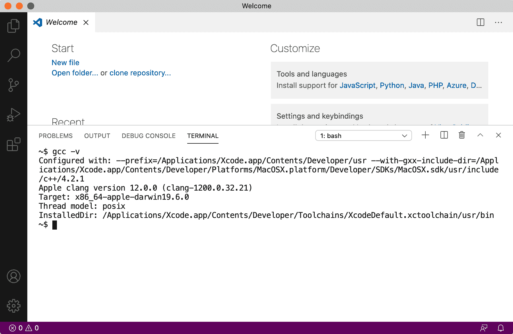

###### 图 1-9\. 在 macOS 上尝试 GCC

如果运行`gcc`命令未获得预期结果，请查看 Apple 的开发者网站。您也可以在网上找到几个视频教程，可能会帮助您完成特定设置。

### Linux

许多 Linux 系统适合喜欢折腾的人。您可能已经有了 GCC 可用。您可以通过启动`终端`应用程序并运行其他操作系统上使用的相同检查来快速检查。如果**`gcc -v`**返回一个答案——当然不是“命令未找到”——那么您可以安装 VS Code 了。如果需要安装 GCC，可以使用平台上的软件包管理器。您可能已经有一个漂亮的图形应用程序来做这些事情；搜索“开发者工具”或“软件开发”，然后阅读描述以查看是否包含 GCC 或 GNU 实用工具。

对于 Debian/Ubuntu 系统，你可以获取包含 GCC 和许多其他有用（或必需）库和工具的`build-essential`元包：

```cpp
$ sudo apt install build-essential
```

对于 Redhat/Fedora/CentOS 系统，可以使用 Dandified Yum (`dnf`) 工具。我们在本书中只需要 GCC：

```cpp
$ su -
# dnf install gcc
```

虽然如果你对软件开发有兴趣的话，你可能想获取“开发工具”组包，其中包括 GCC 以及许多其他有用的东西：

```cpp
$ su -
# dnf groupinstall "Development Tools"
```

Manjaro 是另一个基于 Arch Linux 的流行 Linux 发行版。你可以在这里使用`pacman`工具：

```cpp
$ su -
# pacman -S gcc
```

如果你使用的是不使用`apt`、`dnf`或`pacman`的其他 Linux 版本，可以轻松搜索“install gcc **my-linux**”，或使用系统的软件包管理器的搜索选项查找“gcc”或“gnu”。

作为 Linux 用户，你可能已经对用于编写 shell 脚本或其他语言的文本编辑器有些经验。如果你已经熟悉你的编辑器和终端，你可以跳过这部分。但如果你是编程新手或者没有喜欢的编辑器，可以安装 VS Code。访问与其他操作系统相同的[VS Code 下载](https://oreil.ly/ptJFA)页面。获取适合你系统的正确捆绑包。（如果你的 Linux 版本不使用 *.deb* 或 *.rpm* 文件，可以获取 *.tar.gz* 版本。）

双击下载的文件，应提示你进行标准安装。如果你要为所有用户安装 VS Code，则可能会要求输入管理密码。不同的发行版会将 VS Code 安装在不同的位置，不同的桌面有不同的应用启动器。你也可以使用`code`命令从命令行启动 VS Code。

与其他操作系统一样，我们希望添加 C/C++ 扩展，然后检查我们是否可以从终端选项卡访问 GCC。

通过点击 图 1-10 中显示的“boxes”图标，打开 VS Code 中的扩展面板。你可以搜索简单的字母“C”，很可能在搜索结果的顶部找到正确的扩展。

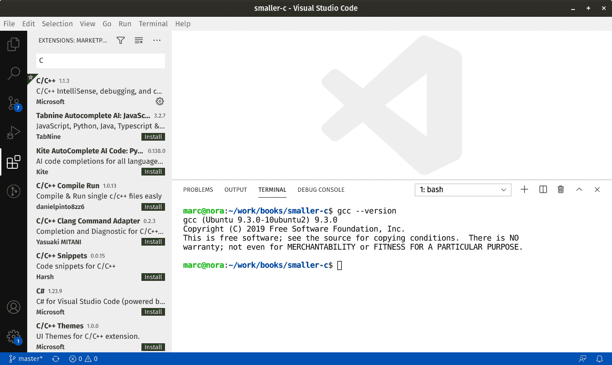

###### 图 1-10\. Linux 上的 VS Code 扩展

要尝试终端选项卡，请从“视图”→“终端”菜单项打开它。你应该在编辑器底部看到一个新的部分。尝试在那个新区域运行我们的 GCC 检查命令（**`gcc -v`**）。你应该看到类似 图 1-11 的详细且稍显混乱的结果。

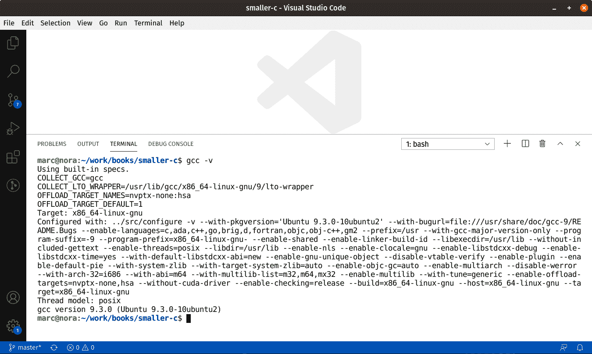

###### 图 1-11\. 在 Linux 上的 VS Code 中尝试 GCC

好极了，好极了。希望你已经有一个简单的 C 开发环境在运行中。让我们开始写一些代码吧！

## 创建一个 C 的“Hello, World”

在你的编辑器和编译器就绪后，我们可以尝试编写许多开发人员在任何新语言中都写的著名的第一个程序：“Hello, World” 程序。它旨在展示你可以在新语言中编写有效的代码，并能够输出信息。

C 作为一种语言，可以说是简洁的。我们将深入研究分号、花括号、反斜杠和其他奇怪的符号在这个第一个程序中的细节，但目前，完全复制这一小段代码即可。你可以在 VS Code 的资源管理器中右键点击创建新文件，或者使用文件 → 新建文件菜单项，或者按 Ctrl+N。

```cpp
#include <stdio.h>

int main() {
  printf("Hello, world\n");
}
```

现在保存文件并命名为*hello.c*。接着在 VS Code 中打开终端（View → Terminal 菜单项或 Ctrl+`）。你应该会看到类似于图 1-12 的内容。

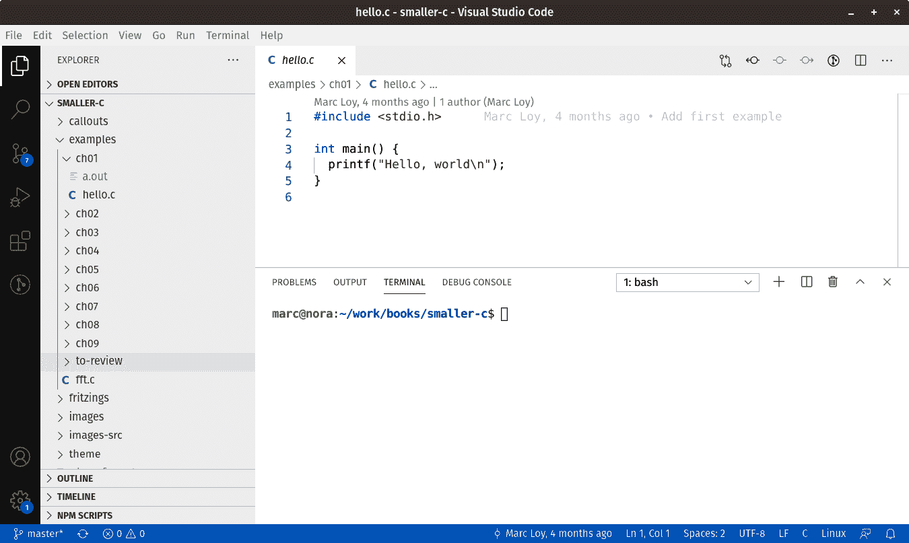

###### 图 1-12\. “Hello, World” 和我们的终端选项卡

如果你已经了解其他语言，你可能能猜到发生了什么。无论如何，让我们花一点时间来回顾每一行。但如果其中某些解释让你感到模糊，不要担心。学习编程需要大量的实践和耐心。后面的章节将帮助你巩固这两个技能。

```cpp
#include <stdio.h>
```

这行代码加载了“标准输入/输出”*库*的*头文件*。库（大致而言）是可以在运行`gcc`时附加到你自己的代码中的外部代码片段。头文件是对这些外部实体的简明描述。这是一个非常常见的行，用于非常普遍的一个非常常见的库的一部分。除了其他功能，这个头文件还包括了我们用来输出实际信息的`printf()`函数的定义。几乎每一个你写的 C 程序都会使用它。尽管我们将在第六章中看到，你通常会使用多个库，每个库都有自己的头文件`#include`行。

```cpp
int main() {

```

复杂的程序可能包含数十个（甚至数百或数千个）单独的 C 文件。将大问题分解为更小的部分是成为一名优秀程序员的基本技能之一。这些更小的“部分”更容易调试和维护。它们也有助于找到重复任务的时机，以便重复使用已编写的代码。但无论你有一个大型复杂的程序还是一个小而简单的程序，你都需要一个起点。这一行就是起点。`main()` 函数总是必需的，尽管它偶尔看起来有些不同。我们将在第二章详细讨论像在行首看到的`int`这样的*类型*，并且在第五章更仔细地查看函数。但请注意行尾的 `{` 符号。这个字符开启了一个*代码块*。

```cpp
  printf("Hello, world\n");
```

这个语句是我们程序的核心。不那么浪漫地说，它代表了我们 `main()` 函数块的 *主体*。块包含一个或多个代码行（在 C 中）由花括号界定，并且我们经常称任何块的内容为其主体。这个特定的主体只做一件事：使用 `printf()` 函数（再次在 *stdio.h* 中定义）生成一个友好的全局问候语。我们将在“printf() 和 scanf()”中详细讨论 `printf()` 和像 `"Hello, world\n"` 这样的片段。

我还想快速强调一下行尾的分号。这个标点符号告诉 C 编译器您何时完成了一条语句。在我们的代码块中只有一条语句时，这个标记意义不大，但当我们有更多语句和跨越多行的混乱语句时，它将在未来有所帮助。

最后但肯定不是最不重要的，这是“结束”花括号，与上面两行的“开始”花括号相匹配：

```cpp
}

```

每个块都会有这些开放/关闭花括号。编程中最常见的错误之一是有太多的开放或关闭花括号。幸运的是，大多数现代编辑器都有复杂的语法高亮，可以帮助您匹配任何一对花括号（因此识别出没有伴侣的任何花括号）。

## 编译您的代码

现在我们终于可以利用所有这些软件安装头痛的工作了！在终端选项卡中，运行以下命令：

```cpp
gcc hello.c
```

如果一切顺利，您将看不到任何输出，只会出现一个新的命令提示符。如果出现了问题，您将收到一个错误消息（或多个消息），希望能指出需要修正的问题。在我们遇到更多示例时，我们将看到调试技巧，但现在，请回顾您的代码和上面的示例，看看是否能发现任何差异。

###### 提示

如果您在处理第一个文件时仍然遇到问题，请不要放弃！查看附录 A，从 GitHub 下载本书的示例代码。您可以按原样编译和运行代码，或者以我们的示例作为您自己调整和修改的起点。

## 运行您的代码

成功编译我们的第一个 C 程序后，我们如何测试它？如果列出目录中的文件，您会注意到在 Linux 和 macOS 系统上出现了名为 *a.out* 的新文件，在 Windows 系统上出现了 *a.exe*。要运行它，只需键入其名称。在许多 Linux 和 macOS 系统上，您的可执行路径可能不包括您的工作目录。在这种情况下，请使用本地路径前缀“./”。（句点表示当前目录；斜杠只是标准路径分隔符字符。）图 1-13 显示了输出。

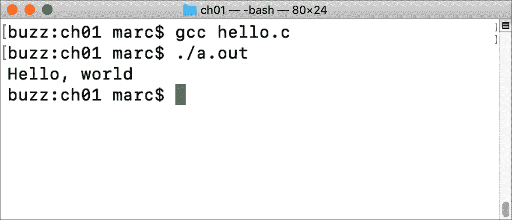

###### 图 1-13\. 在 macOS 和 Linux 上说“Hello”

图 1-14 显示了在 Windows 上的输出。

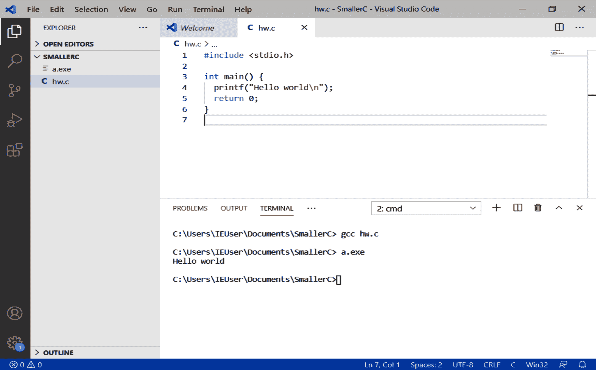

###### 图 1-14\. 在 Windows 上说“Hello”

###### 注意

在 Windows 上，*.exe*后缀表示文件可执行。但是在运行程序时不需要包含后缀。你只需输入**`a`**。根据使用的命令提示应用程序（例如`cmd`或`PowerShell`），你可能还需要使用类似于 macOS 或 Linux 的本地目录前缀（`.\`）。

但作为名称，“a”实在是太无聊了，而且绝对不能告诉我们程序做了什么。如果你愿意，可以使用`gcc`命令的`-o`（输出）选项来指定程序更好的名称。

在 Linux 和 macOS 上：

```cpp
$ gcc hello.c -o hello
```

在 Windows 上：

```cpp
C:\> gcc hello.c -o hello.exe
```

尝试该命令，然后查看文件夹中的文件。你应该有一个新创建的*hello*（或*hello.exe*）文件，可以运行它。非常好。

# 下一步

哇……让你的计算机说“嗨”真是需要很多努力！如果能帮到你，人类花了无数年时间才让第一台计算机做到了你刚才的事情。 :) 不过现在我们有了一个工作的开发环境，接下来的章节将探讨 C 语言的细节，并向你展示如何编写、调试和维护更有趣的程序。有了我们的微控制器，这些受欢迎的小型计算机通常用于专用任务，比如报告当前温度或计数等待在传送带上的箱子数量，我们将把这些有趣的程序变成有趣的物理创作！

¹ 嗯，“任何”确实太广泛了；如果你的语言是解释性语言，那么当然你需要一个好的解释器而不是一个好的编译器！

² 然而，J. M. Eubank 已经为单文件安装程序做了大量工作，如果一般的完整设置步骤看起来令人生畏，你可能想要查看一下：[tdm-gcc](https://oreil.ly/RWJcB)。

³ 如果你不确定你的 Windows 是 64 位还是 32 位版本，请查看[Microsoft FAQ](https://oreil.ly/kyR5d)。
