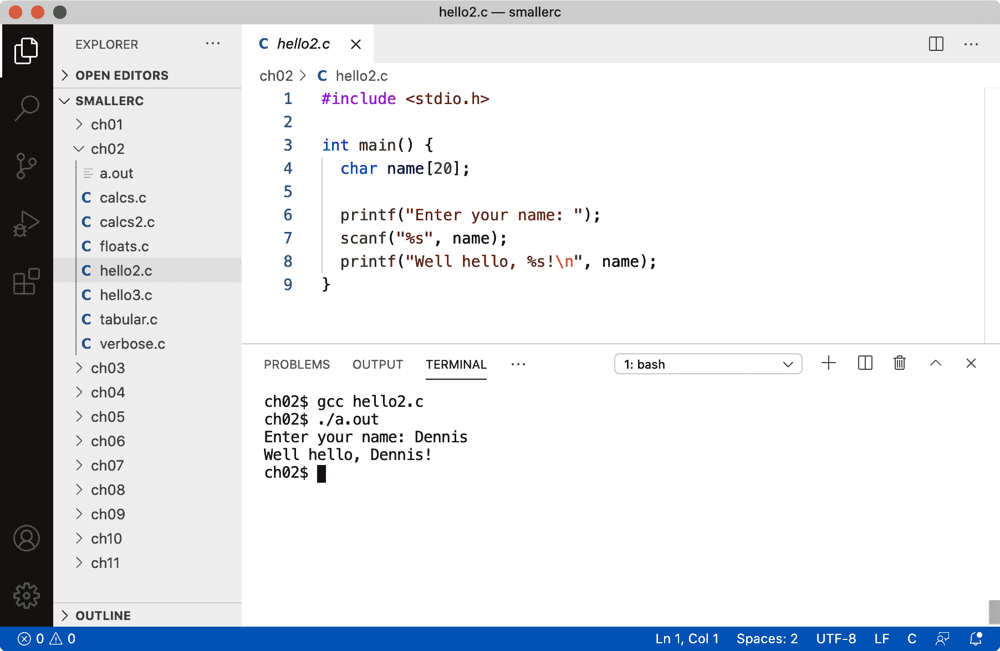
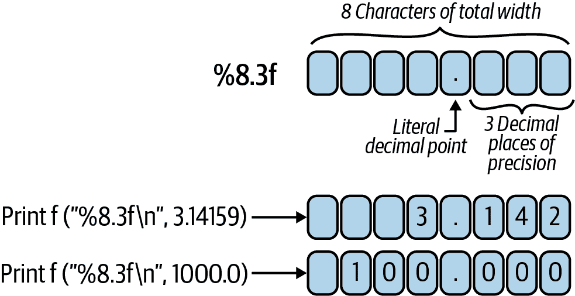
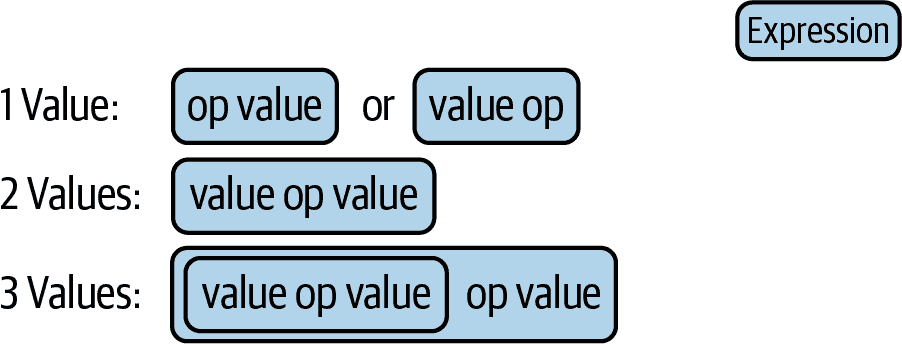
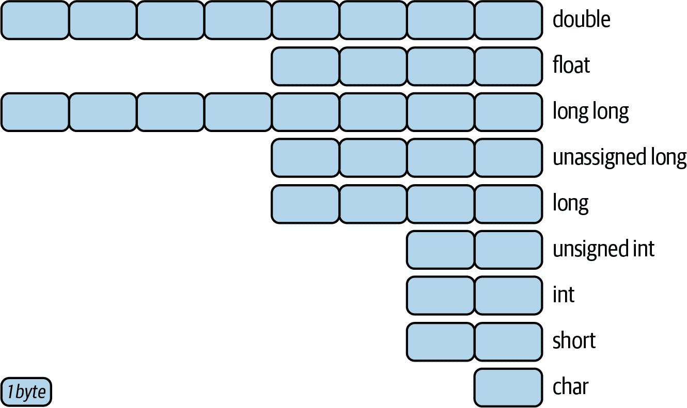

# 第二章：存储与状态

编程的本质是数据的操作。编程语言为人类提供了一个接口，告诉计算机这些数据是什么，以及你想对这些数据做什么。为强大的机器设计的语言可能会隐藏（或推断）关于存储数据的许多细节，但是在这方面，C 语言仍然相对简单。也许简单这个词不太恰当，但它在数据存储方面的处理方法是直接的，同时仍然允许复杂的操作。正如我们将在第六章中看到的，C 语言还为程序员提供了一个窗口，可以看到数据存储在计算机内存中的低级别方面。当我们在本书后半部分直接与微控制器工作时，这种访问将变得更加重要。

现在，我想先了解一些 C 语法的基础，这样我们就可以开始撰写原创程序，而不仅仅是从书本上复制代码行。本章包含大量这样的代码行，你在阅读时可以放心地复制它们！但希望到达这样一个阶段，你可以为自己的编程挑战创建新颖的答案。

###### 注意

如果你已经对从其他语言中的编程经验感到满意，可以跳过本章。你应该阅读“printf() and scanf()”关于`printf()`和`scanf()`函数的部分，但其他部分可能会比较熟悉。

# C 语言中的语句

编程中的另一个基本概念是*算法*的概念。算法是一组处理数据的指令，通常在计算机上完成任务。一个经典的算法类比是厨房食谱。给定一组原料，这里是你执行的每一个步骤，将这些原料转化为像蛋糕之类的东西。在编程中，这些“每一个步骤”就是语句。

在 C 语言中，语句有多种形式。在本章中，我将讨论声明语句、初始化语句、函数调用和注释。后续章节将涉及控制语句以及像创建自己的函数和预处理器命令等近似语句。

## 语句分隔符

语句之间使用分号分隔。在 C 语言中，分号的作用类似于英语中的句号。英语中的长句可能跨越多行，但你知道要一直读到句号为止。同样地，你可能会在同一行上有几个短句，但你可以根据这些句号轻松区分它们。很容易忘记语句末尾的分号。如果每个语句都放在自己的行上，你可能会假设编译器“看到”的结构与人类能够轻松理解的结构相同。不幸的是，编译器不能这样做。即使是我们的第一个非常简单的程序，来自“创建一个 C‘Hello, World’”，我们用来在终端窗口打印文本的语句也需要以分号结尾。如果你感兴趣，试着删除那个分号，保存你的文件，然后重新编译它。你会得到像这样的结果：

```cpp
$ gcc hello.c
hello.c:4:27: error: expected ';' after expression
  printf("Hello, world\n")
                          ^
                          ;
1 error generated.
```

哎呀，出错了。但至少错误消息很有用。它告诉我们两件关键的事情：出了什么问题（“expected ';' after expression”）和编译器在哪里遇到了问题（“hello.c:4:27”，或者*hello.c*文件，第 4 行，第 27 列）。我不想在你探索 C 语言的早期阶段就用一个错误消息吓到你，但你肯定会经常遇到它们。幸运的是，这意味着你需要更仔细地查看你的源代码，然后再试一次。

## 语句流程

分隔符告诉编译器语句在哪里结束和下一条语句从哪里开始。顺序也很重要。语句的流程是自上而下，如果多个语句在同一行上，则是从左到右。而且确实允许有多个语句！我们可以迅速将我们简单的“Hello, World”程序扩展得更加冗长。

###### 提示

当你有时间和精力时，我强烈建议手动转录源代码。这会让你对 C 语言的语法更加熟练。你经常会犯一两个错误。发现和修正这些错误是学习的一个很好方式！即使有时候这些错误可能会让人有点沮丧。

考虑下面的程序，[*ch02/verbose.c*](https://oreil.ly/wqnYC)：

```cpp
#include <stdio.h>

int main() {
  printf("Ahem!\n");                                 
  printf("May I have your attention, please?\n");    
  printf("I would like to extend the warmest of\n"); 
  printf("greetings to the world.\n");
  printf("Thank you.\n");
}
```


我们从与*hello.c*中使用的语句非常相似的语句开始。唯一真正的区别是我们打印的文本。请注意，我们用分号分隔符结束了这行。


我们有第二个`printf()`语句与第一个类似。它确实会第二次执行。


为了更加突出这一点，这第三个语句将在前两个之后被调用。最后两个调用将在此之后进行。

下面是我们简单多行升级的输出结果：

```cpp
$ gcc verbose.c
$ ./a.out
Ahem!
May I have your attention, please?
I would like to extend the warmest of
greetings to the world.
Thank you.
```

不错。你可以看到输出如何精确地按照程序中语句的顺序进行。尝试调换它们的顺序，并确认程序的流程是自上而下的。或者尝试在同一行上放置两个`printf()`调用。这不是要搞难题。我只是希望你尽可能经常地练习编写、运行和编译代码。你尝试的例子越多，你就越能避免简单的错误，也越容易跟上新代码示例的步伐。

# 变量和类型

当然，我们不仅可以打印文本，还可以在实施算法或执行任务时存储和操作数据。在 C 语言（以及大多数语言中），你将数据存储在*变量*中，这是解决问题的强大工具。这些变量有*类型*，它们决定你可以存储哪些类型的数据。这两个概念在我提到的声明和初始化语句中起着重要作用。

变量是值的占位符。变量可以保存简单的值，如数字（班级中有多少学生？我的购物车中物品的总成本是多少？）或更复杂的事物（这个特定学生的名字是什么？每个学生的成绩是什么？甚至像-1 的平方根这样的复杂值）。变量可以存储用户收到的数据，并允许你编写能够解决一般问题而不必重新编写程序本身的程序。

## 获取用户输入

我们很快将探讨定义和初始化变量的详细内容，但首先让我们运行一下这个想法：让用户输入一些内容，以便在不每次重新编译程序的情况下生成动态输出。我们将返回到我们的“Hello, World”程序，并稍作升级。我们可以要求用户告诉我们他们的名字，然后个性化地问候他们！

到目前为止，你已经看到了一个输出语句，即我们用来问候地球的`printf()`函数调用。还有一个对应的输入函数：`scanf()`。你可以使用打印/扫描配对来提示用户，然后等待他们输入答案。我们将把这个答案存储在一个变量中。如果你在其他语言中做过一些编程，下一个程序应该看起来很熟悉。如果你是编程和 C 语言的新手，这个列表可能有点密集或奇怪——没关系！输入这些程序并在修复任何拼写错误后使其运行，是学习的一种有效方式。

###### 提示

很多编程只是有思想的剽窃。这有点开玩笑，但也只是一点点。你开始的方式很像人类开始使用口语的方式：重复你看到（或听到）的东西，而不一定完全理解它的所有内容。如果你重复这种行为足够多次，你就会发现语言中固有的模式，并学会在哪里可以做出有用的更改。做出足够多的有用更改，你就会发现如何从头开始创建新的有意义的事物。这是我们的目标。

这个 [*ch02/hello2.c*](https://oreil.ly/OrUqu) 程序只是另一个代码片段，当你开始探索编程时可以复制：

```cpp
#include <stdio.h>

int main() {
  char name[20];

  printf("Enter your name: ");
  scanf("%s", name);
  printf("Well hello, %s!\n", name);
}
```

希望这个程序的结构看起来很熟悉。我们包括我们的标准 I/O 库，我们有一个 `main()` 函数，并且该函数有一个包含多个语句的主体，都在一对花括号内。不过，该主体包含几个新项目。让我们逐行看一下。

```cpp
  char name[20];
```

这是我们第一个变量声明的例子。变量的名字是，“name”。它的类型是 `char`，这是 C 用来指代单个（ASCII）字符的类型。¹ 它还是一个 *数组*，意味着它按顺序存储多个 `char` 值。在我们的情况下，可以存储 20 个这样的值。关于数组的更多信息，请参阅第四章。现在，只需注意这个变量可以保存一个人的名字，只要它少于 20 个字符。

```cpp
  printf("Enter your name: ");
```

这是一个相当标准的 `printf()` 调用，与我们在第一个程序中使用的非常相似，详见“创建 C‘Hello, World’”。唯一有意义的区别是双引号标记集合内的最后字符。如果你看一下 *hello.c* 或 *verbose.c*，你会注意到最后两个字符是反斜杠和字母“n”。这两个字符的组合（`\n`）表示一个单独的“换行”字符。如果在末尾添加 `\n`，则会打印一行，并且任何后续的 `printf()` 调用将在下一行进行。相反，如果省略 `\n`，终端中的光标将保持在当前行。如果你想要逐个单元格打印表格或者在我们的情况下，如果你想要提示用户输入一些内容，然后允许他们在同一行上输入响应，这将会很方便。

```cpp
  scanf("%s", name);
```

这是我在本节开头提到的新功能。`scanf()` 函数“扫描”字符并可以将它们转换为 C 数据类型，比如数字，或者在这种情况下，一组字符数组。一旦转换完成，`scanf()` 函数期望将每个“东西”存储在一个变量中。在这一行中，我们正在扫描一堆字符，并将它们存储在我们的 `name` 变量中。我们将查看括号内的内容的非常奇怪的语法，详见“printf() 和 scanf()”。

```cpp
  printf("Well hello, %s!\n", name);
```

最后，我们想要打印我们的问候语。同样，这看起来应该很熟悉，但现在我们有更多奇怪的语法。如果 `%s` 让你感觉到与 `scanf()` 调用中的同样奇怪的事物相同，恭喜你！你刚刚发现了一个非常有用的模式。这一对字符正是 C 在打印或扫描字符数组时使用的内容。字符数组在 C 中是如此常见的一种类型，以至于它有一个更简单的名称：字符串。因此，在这对字符中使用“s”。

那么`name`发生了什么？`scanf()`调用获取了你输入的任何名字（不包括你按下的回车键²）并将其存储在内存中。我们的`name`变量包含了那些字符的内存位置。当我们使用`printf()`调用时，我们的第一个参数（`"Well hello, %s!\n"`部分）包含了一些字面上的字符，比如“Well”中的那些字符，以及一个字符串的占位符（`%s`部分）。变量非常适合填充占位符。无论你输入了什么名字，现在都会显示回来给你看！

还要注意，我们在打印问候语时包含了特殊的`\n`换行符。这意味着我们将打印问候语，然后“按下回车键”，以便终端中显示的任何其他内容都将显示在下一行。

让我们继续运行程序，看看事情是如何运作的。你可以使用 VS Code 底部的终端选项卡，或者你平台的 Terminal 或 Command 应用程序。你需要先用`gcc`编译，然后运行`a.out`或者使用`-o`选项选择的任何名字。你应该会得到类似于 Figure 2-1 的结果。

注意，在你输入名字时，它会出现在要求你输入的提示的同一行。当我们省略换行符（`\n`）时，这正是我们想要的效果。但再试一次，输入一个不同的名字。你得到了期望的结果吗？再试第三次。这种对用户输入响应的动态行为使得变量在计算机编程中非常宝贵。同一个程序可以根据不同的输入产生不同的输出，而无需重新编译。这种能力反过来又帮助使计算机程序对我们日常生活变得非常宝贵。



###### 图 2-1\. 我们定制的 Hello World 输出

## 字符串和字符

让我们更仔细地看一看`char`类型以及它的近亲`char[]`——更为人所知的字符串。在 C 中声明变量时，你为它指定了名称和类型。最简单的声明看起来像这样：

```cpp
char response;
```

在这里，我们创建了一个名为`response`的变量，类型为`char`。`char`类型可以容纳一个字符。例如，我们可以存储一个“y”或“n”。第五章将详细介绍内存地址和引用细节，但现在，只需记住变量声明会在内存中留出足够空间来存储你指定类型的内容。如果我们有一系列问题要问，那么我们可以创建一系列变量：

```cpp
char response1;
char response2;
char finalanswer;
```

每一个变量都可以容纳一个字符。但是，当你使用变量时，你不需要预测或决定那个字符将在先。内容可以变化。（变化……变量……明白吗？ :)

C 编译器确定你的源字符使用哪种编码。旧的编译器使用旧的 ASCII³ 格式，而较新的编译器通常使用 UTF-8。这两种编码都包括大小写字母、数字和大多数键盘上看到的符号。要讨论特定的字符而不是 `char` 类型的变量，你可以使用单引号将其界定。例如，`'a'`，`'A'`，`'8'` 和 `'@'` 都是有效的。

### 特殊字符

字符也可以是特殊的。C 语言支持诸如制表符和换行符之类的东西。我们已经看到了换行符（`\n`），但还有其他几个特殊字符列在了表 2-1 中。这些特殊字符使用“转义序列”编码，反斜杠被称为“转义字符”。

表 2-1\. C 中的转义序列

| Char | ASCII | Name | Description |
| --- | --- | --- | --- |
| \a | 7 | BEL | 打印时使终端“响铃” |
| \n | 10 | LF | 换行符（在 Mac 和 Linux 上的标准行结束符） |
| \r | 13 | CR | 回车符（与 `\n` 一起使用时，在 Windows 上通常的行结束符） |
| \t | 15 | HT | (水平) 制表符 |
| \\ | 92 |  | 用于在字符串或字符中放置字面反斜杠 |
| \' | 39 |  | 用于在字符中放置字面单引号（在字符串中不需要转义） |
| \” | 34 |  | 用于在字符串中放置字面双引号（在字符中不需要转义） |
| *这不是详尽的列表，但涵盖了本书中将使用的字符。* |

这些命名的快捷方式只涵盖了最流行的字符。如果你必须使用其他特殊字符，比如来自调制解调器的传输结束（EOT，ASCII 值 4）信号，你可以用反斜杠加八进制的 ASCII 值表示该字符。因此我们的 EOT 字符将是 `'\4'`，有时你会看到三位数字表示：`'\004'`。（由于 ASCII 是一个 7 位编码，三位八进制数字涵盖了最高的 ASCII 字符。如果你好奇的话，删除符（DEL，ASCII 127）或 `'\177'` 作为八进制转义序列。有些人更喜欢总是看到三位数字的一致性。）

你可能不需要这些快捷方式，但由于 Windows 路径名使用反斜杠字符，重要的是要记住某些字符需要这种特殊前缀。当然，换行符将会继续出现在我们的许多打印语句中。正如你在八进制转义序列中所见，前缀反斜杠被包含在单引号内。因此制表符是 `'\t'`，反斜杠是 `'\\'`。

### 字符串

字符串是一系列的 `char`，但是非常正式的一系列。许多编程语言支持这样的系列，称为数组。第四章将更详细地介绍数组，但 `char[]` 类型的字符数组在 C 语法中非常常见，我想单独提一下。

我们在处理字符串时，并没有过多明确说明它们。在我们的第一个 hello 程序中，我们调用了 `printf()` 并传递了一个字符串参数。在 C 中，字符串是一个由零个或多个 `char` 组成的集合，最后以特殊的“空”字符 `\0` 结尾（ASCII 值为 0）。通常在双引号中包含代码中的字符，例如我们的 `"Hello, world!\n"` 参数。幸运的是，当你使用这些双引号时，你不必自己添加 `\0`。这在字符串字面量的定义中是隐含的。

声明字符串变量就像声明 `char` 变量一样简单：

```cpp
char firstname[20];
char lastname[20];
char jobtitle[50];
```

这些变量可以存储简单的东西，如姓名，或者更复杂的东西，如多部分标题，例如，“高级代码和美味派开发人员”。字符串也可以为空：“”。这看起来可能有点傻，但想想那些你输入姓名之类信息的表格。如果你碰巧是一个非常成功的流行歌星，只有一个名字，那么上面的 `lastname` 变量可以被赋予有效值 `""`（即只是终止符 `'\0'`），表明 Drake 和 Cher 也没有姓氏也没问题。

## 数字

毫不奇怪，C 也有可以存储数字值的类型。更准确地说，C 拥有用于存储比 `char` 类型变量能容纳的数字更大的类型。（尽管本章迄今的示例中使用 `char` 存储实际字符，但它仍然是数值类型，并且适合存储与字符编码无关的小数字。）C 将这些数值类型分为两个子类别：整数和浮点数（即小数）。

### 整数类型

整数类型存储简单的数字。主要类型称为 `int`，但有许多变体。这些变体的主要区别在于能够存储在给定类型变量中的最大数字的大小。表 2-2 总结了这些类型及其存储容量。

表 2-2\. 整数类型及其典型大小

| 类型 | 字节 | 范围 | 备注 |
| --- | --- | --- | --- |
| char | 1 | –127 到 +127 或 0 到 255 | 通常用于字母；也可以存储小数字 |
| short | 2 | –32,767 到 +32,767 |  |
| int | 2 或 4 | –32,767 到 +32,767 或 –2,147,483,647 到 +2,147,483,647 | 实现有所不同 |
| long | 4 | –2,147,483,647 到 +2,147,483,647 |  |
| long long | 8 | –9,223,372,036,854,775,807 到 +9,223,372,036,854,775,807 | C99 引入 |
| *虽然 `char` 被定义为一个字节，其他大小都是依赖于系统的。* |

大多数上述类型是*有符号*类型，⁴ 这意味着它们可以存储小于零的值。这五种类型还都有显式的*无符号*变体（例如，`unsigned int` 或 `unsigned char`），它们的位/字节大小相同，但不存储负值。它们的范围从零开始，大致到达有符号范围的两倍，如 表 2-3 所示。

表 2-3。无符号整数类型及其典型大小

| 类型 | 字节 | 范围 |
| --- | --- | --- |
| 无符号字符 | 1 | 0 到 255 |
| 无符号短整型 | 2 | 0 到 65535 |
| 无符号整型 | 2 或 4 | 0 到 65535 或 0 到 4,294,967,295 |
| 无符号长整型 | 4 | 0 到 4,294,967,295 |
| 无符号长长整型 | 8 | 0 到 18,446,744,073,709,551,615 |

这里是一些整数类型声明的示例。注意`x`和`y`变量的声明。你经常会在网格或图表上看到坐标“x 和 y”讨论。C 允许你使用逗号分隔的方式声明多个相同类型的变量名。这种格式没有什么特别之处，但如果你有一些简短相关的变量名，这可能是一个不错的选择。

```cpp
int studentcount;
long total;
int x, y;
short volume, chapter, page;
unsigned long long nationaldebt;
```

如果你要存储小值，比如“最多一打”或“前 100”，请记住可以使用`char`类型。它只有 1 字节长度，编译器不会在乎你是否将该值打印为实际字符还是简单数字。

### 浮点类型

如果你要存储分数或财务数字，可以使用`float`或`double`类型。这两种都是浮点类型，其中小数点不固定（可以浮动），能够存储像 999.9 或 3.14 这样的值。但因为我们在讨论以 1 和 0 编码的离散块思考的计算机，浮点类型存储的是值的近似值，就像`int`一样。`float`类型是一种 32 位编码，可以存储从非常小的分数到非常大的指数的各种值。但在大约-32k 到 32k 之间，小数点后的六个有效位数时，`float`是最准确的。

`double`类型比`float`类型精度“翻倍”。⁵ 这意味着大约可以精确表示 15 个十进制数字。我们将看到一些近似值可能会导致问题的地方，但对于像收据总额或从温度传感器读取的数据这样的一般用途来说，这些类型是足够的。

与其他类型一样，你需要在名字之前放置类型：

```cpp
float balance;
float average;
double microns;
```

###### 注意

因为普通的十进制数字也可以存储像 6 这样的整数值（如 6.0），所以可能会倾向于将`float`用作默认的数字类型。但在像 Arduino 这样的微型 CPU 上操作带有小数点的数字可能会很昂贵。即使在大芯片上，与简单整数相比，它仍然更昂贵。出于性能和精度的原因，大多数 C 程序员都坚持使用`int`，除非有明确的理由不使用。

## 变量名

无论变量是什么类型，它都有一个名字。大多数情况下，你可以自由选择任何你想要的名字，但是有一些规则你必须遵循。

在 C 语言中，变量名可以以任何字母或下划线字符（“_”）开头。在初始字符之后，名称可以有更多字母、下划线或数字。变量名区分大小写（`total`和`Total`不是同一个变量），通常长度限制为 31 个字符长，⁶ 虽然惯例上它们更短。

C 语言还有几个 *关键字* 是为 C 语言本身保留的。因为 表格 2-4 中的关键字已经对 C 有意义，所以它们不能用作变量名。某些实现可能会保留其他单词（例如`asm`，`typeof`和`inline`），但大多数备用关键字都以一个或两个下划线开头，以减少与您自己的变量名冲突的可能性。

表格 2-4\. C 关键字

| 保留字 |
| --- |
| _Bool | default | if | static |
| _Complex | do | int | struct |
| _Imaginary | double | long | switch |
| auto | else | register | typedef |
| break | enum | restrict | union |
| case | extern | return | unsigned |
| char | float | short | void |
| const | for | signed | volatile |
| continue | goto | sizeof | while |

如果在声明变量时遇到关键字冲突，你将会看到类似于使用无效变量名（例如以数字开头）时的错误：

```cpp
badname.c: In function ‘main’:
badname.c:4:9: error: expected identifier or ‘(’ before ‘do’
    4 |   float do;
      |         ^~
badname.c:5:7: error: expected identifier or ‘(’ before numeric constant
    5 |   int 5r;
      |       ^~
```

那个“expected identifier”短语是表明您的变量是错误原因的强烈指示器。编译器期望一个变量名，但找到一个关键字。

## 变量赋值

在我们的 *hello2.c* 示例中，我们依赖对`name`变量的相当隐式的赋值。作为`scanf()`函数的参数，用户输入的任何内容都存储在该变量中。但我们可以（而且经常）直接对变量进行赋值。您可以使用等号（“=”）来指示这样的赋值操作：

```cpp
int total;
total = 7;
```

恭喜！您已成功将值`7`存储在变量`total`中。

你也可以随时覆盖该值：

```cpp
int total;
total = 7;
total = 42;
```

尽管连续的赋值有点浪费，但这段 C 代码没有任何问题。变量`total`只会保留一个整数值，所以最近的赋值会胜出，在本例中是`42`。

通常看到变量定义并同时分配初始值（在程序员的说法中称为初始化）：

```cpp
int total = 7;
char answer = 'y';
```

现在`total`和`answer`都有可以使用的值，但都可以根据需要更改。这正是变量的作用。

### 字面值

我们在这些示例中插入变量的那些简单值称为 *字面值*。字面值只是一个不需要解释的值。数字、单引号内的字符或双引号内的字符串都算是字面值：

```cpp
int count = 12;
char suffix = 's';
char label[] = "Description";
```

希望这前两个变量定义看起来很熟悉。但请注意，当我们初始化名为`label`的字符串时，我们没有给数组指定长度。C 编译器会根据我们在初始化中使用的文字推断大小。在这种情况下，`label`有 12 个字符长；“Description”单词中的 11 个字母加上一个用于终止的`'\0'`。如果你知道以后在代码中会需要更多空间，可以给字符串变量更多空间，但不应指定太少的空间。

```cpp
char automatic[] = "A string variable with just the right length";
char jobtitle[50] = "Chief Acceptable Length Officer";
char warning[5] = "This is a bad idea.";
```

如果您试图为其`char[]`变量分配一个过长的字符串文字，您可能会从编译器看到一个警告：

```cpp
toolong.c: In function ‘main’:
toolong.c:6:21: warning: initializer-string for array of chars is too long
    6 |   char warning[5] = "This is a bad idea.";
      |                     ^~~~~~~~~~~~~~~~~~~~~
```

这是一个相当具体的错误，所以希望您会发现很容易修复。顺便说一句，你的程序仍然会运行。请注意，编译器给了你一个*警告*而不是我们在之前一些例子中看到的*错误*。警告通常意味着编译器认为您在犯错，但您得到了怀疑的好处。通常最好去处理警告，但这不是必需的。

# printf()和 scanf()

我们已经看到如何使用`printf()`打印信息，以及如何使用`scanf()`接受用户输入，但我忽略了这两个函数的许多细节。现在让我们来看看其中一些细节。

## printf()格式

`printf()`函数是 C 的主要输出函数。我们已经用它来打印简单的字符串，如`"Hello, world\n"`。我们还窥视了如何在[“获取用户输入”](https://oreil.ly/DcU5k)中打印变量。它可以打印所有变量类型，您只需要提供正确的*格式字符串*。

当我们调用`printf()`时，我们通常首先提供一个字符串文字。第一个参数称为格式字符串。您可以使用简单的字符串将其“原样”回显到终端，也可以打印（和格式化）变量的值。您使用格式字符串让`printf()`知道接下来会发生什么。您通过包括*格式说明符*，如我们从[*ch02/hello2.c*](https://oreil.ly/DcU5k)中的`%s`来做到这一点。让我们打印一些在讨论声明和赋值时创建的那些变量。考虑[*ch02/hello3.c*](https://oreil.ly/qhIIT)：

```cpp
#include <stdio.h>

int main() {
  int count = 12;
  int total = 7;
  char answer = 'y';
  char jobtitle[50] = "Chief Acceptable Length Officer";
  // char warning[5] = "This is a bad idea.";

  printf("You can have %d, you currently have %d.\n", count, total);
  printf("You answered: %c\n", answer);
  printf("Please welcome our newest %s!\n", jobtitle);
}
```

这就是结果：

```cpp
ch02$ gcc hello3.c
ch02$ ./a.out
You can have 12, you currently have 7.
You answered: y
Please welcome our newest Chief Acceptable Length Officer!
```

将输出与源代码进行比较。你可以看到，我们大多数打印出格式字符串中的字符。但是当我们遇到格式说明符时，我们会用跟随格式字符串的参数之一的值来替换它。仔细看看我们对`printf()`的第一次调用。我们的格式字符串中有两个格式说明符。在该字符串之后，我们提供了两个变量。这些变量按顺序填充格式说明符，从左到右。如果您检查输出，可以看到第一行输出确实首先包括`count`的值，然后是`total`的值。很整洁。我们还得到了`char`和字符串变量的输出。

如果您注意到每种类型使用了不同的说明符，恭喜您！您正在找出这些语句中的重要差异。（如果这一切看起来像胡言乱语，不要放弃！随着您的阅读和实践，模式以及与模式不符合的事物将开始显现。）事实上，`printf()` 拥有相当多的格式说明符，如 表 2-5 所示。一些说明符显而易见，并且明确与特定类型相关联。其他一些则有点玄学，但这就是书籍存在的意义。您会记住您经常使用的几个说明符，并且在需要时可以随时查找不那么常用的那些。

表 2-5\. `printf()` 的常见格式说明符类型

| 说明符 | 类型 | 描述 |
| --- | --- | --- |
| `%c` | `char` | 打印单个字符 |
| `%d` | `int, short, long` | 打印十进制整数值 |
| `%f` | `float, double` | 打印浮点数值 |
| `%i` | `int, short` | 打印十进制整数值 |
| `%li, %lli` | `long, long long` | 打印长整数值 |
| `%s` | `char[]`（字符串） | 打印字符数组作为文本 |

还有其他格式，但我会将它们留给以后需要打印出奇怪或特殊数据的场合。这些格式将涵盖您日常所需的绝大部分内容。附录 B 包括了本书中使用的所有格式的更详细讨论。

## 定制化输出

那么如何格式化这些值呢？毕竟，C 使用了“格式字符串”和“格式说明符”这些术语。您需要向格式说明符添加信息以达到这个目标。这其中最常见的一个例子就是打印像银行账户余额或模拟传感器读数之类的浮点数。让我们给自己一些有趣的小数并尝试打印它们出来。

```cpp
#include <stdio.h>

int main() {
  float one_half = 0.5;
  double two_thirds = 0.666666667;
  double pi = 3.1415926535897932384626433;

  printf("1/2: %f\n", one_half);
  printf("2/3: %f\n", two_thirds);
  printf("pi:  %f\n", pi);
}
```

我们声明了三个变量，一个是 `float` 类型，另外两个是 `double` 类型。我们在 `printf()` 语句中使用了 `%f` 格式说明符。太好了！在编译和运行程序后，我们得到了以下结果：

```cpp
1/2: 0.500000
2/3: 0.666667
pi:  3.141593
```

Hmm，它们都有六位小数，即使我们没有指定想要多少位数，我们的变量中也没有确切有六位小数。为了获得恰到好处的信息量，您需要给格式说明符提供一些额外的细节。所有的说明符都可以接受宽度和精度参数。这两者都是可选的，您可以提供其中一个或两个。额外的细节看起来像一个十进制数：*`宽度.精度`*，这些细节位于百分号和类型字符之间，如 图 2-2 所示。



###### 图 2-2\. 隐式类型转换层次

对于浮点数来说，同时使用这两个选项非常有意义。现在我们可以请求更多或更少的数字位数。尝试像这样更改 [*ch02/floats.c*](https://oreil.ly/Os37q) 中的三个 `printf()` 调用：

```cpp
  printf("1/2: |%5.2f|\n", one_half);
  printf("2/3: |%12f|\n", two_thirds);
  printf("pi:  |%12.10f|\n", pi);
```

我在扩展的格式说明符之前和之后添加了竖线或管道字符(`|`)，以便你看到宽度元素如何影响输出。看看新的结果：

```cpp
1/2: | 0.50|         
2/3: |    0.666667|  
pi:  |3.1415926536|  
```


我们的值`0.5`以五个字符的总字段宽度显示，精确到小数点后两位。因为我们不需要所有五个位置，所以在开头添加了一个空格字符。


较长的十进制数字被打印在 12 个位置内。请注意，我们得到的六位小数与未指定任何宽度或精度时相同。


更长的十进制数在 12 个位置内显示，但包括 10 位精度。请注意，这里的 12 是*总*宽度，包括小数点后的数字所占用的位置。

###### 注意

对于`printf()`，如果给定，你请求的精度和实际打印的值优先于宽度。你经常会看到像`“%0.2f”`或`“%.1f”`这样的浮点格式，它们在需要的确切位置内给出正确数量的小数位数。例如，将这两个示例格式应用于π，结果分别为`3.14`和`3.1`。

对于其他类型，如字符串或整数，宽度选项相对来说比较直接。例如，你可以像在[*ch02/tabular.c*](https://oreil.ly/nQC7x)中展示的那样，使用相同的宽度打印表格数据，而不管所打印的值是什么。

```cpp
float root2 = 1.4142;
float phi = 1.618034;
float pi = 3.1415926;
printf("     %10s%10s%10s\n", "Root 2", "phi", "pi");
printf(" 1x  %10.4f%10.4f%10.4f\n", root2, phi, pi);
printf(" 2x  %10.4f%10.4f%10.4f\n", 2 * root2, 2 * phi, 2 * pi);
```

带有精彩的列结果：

```cpp
         Root 2       phi        pi
 1x      1.4142    1.6180    3.1416
 2x      2.8284    3.2361    6.2832
```

很好。请注意我如何处理列标签。我使用了格式说明符和字符串字面量，而不是单个手动空格分隔的字符串。我这样做是为了突出输出宽度的使用，即使手动操作也不难。事实上，手动将标签居中于这几列将更容易。如果你愿意做个小练习，打开*tabular.c*文件，尝试调整第一个`printf()`，看看是否能使标签居中。

虽然对于所有类型来说，宽度选项都很直观，但对于非浮点格式，添加精度选项的影响可能不那么直观。对于字符串，指定精度会导致截断文本以适应给定的字段宽度。（对于`int`和`char`类型，通常没有影响，但你的编译器可能会警告你不要依赖这种“典型”行为。）

## 使用`scanf()`和解析输入

输出的另一面是输入。在本章开头，我们看了一眼如何使用`scanf()`函数来进行这样的操作“获取用户输入”。到现在你可能已经认识到我们在那个简单程序中使用的`%s`作为格式说明符。这种熟悉程度更深：你可以在`scanf()`中使用在表格 2-5 中列出的所有格式说明符来获取用户输入的这些类型的值。

有一点很重要，关于你在 `scanf()` 中使用的变量。在我们的第一个示例中，扫描字符串有点幸运。如果你还记得，C 中的字符串实际上只是 `char` 类型的数组。我们将在第四章和第六章看到更多关于这个主题的内容，但在这里，我只想指出数组在 C 中是指针的一种特殊情况。指针是特殊的值，指向内存中的地址（位置）。`scanf()` 函数使用变量的地址，而不是其值。实际上，`scanf()` 的目的是将一个值放入一个变量中。由于数组实际上是指针，你可以直接使用 `char` 数组变量。但是，要使用数字和单个 `char` 变量与 `scanf()` 一起使用，你必须在变量名上使用一个特殊的前缀，即和号（`&`）。

我将在第六章中更详细地讨论 `&` 前缀，但它告诉编译器使用变量的地址——非常适合 `scanf()`。看一下这个小片段：

```cpp
char name[20];
int  age;

printf("Please enter your first name and age, separated by a space: ");
scanf("%s %d", name, &age);
```

注意在 `scanf()` 行中使用 `name` 变量和使用 `&age` 变量的区别。这完全取决于 `name` 是一个数组，而 `age` 是一个简单的整数。这是一个容易忘记的事情。不过，幸运的是，这很容易修复，如果你忘记了，编译器会提醒你：

```cpp
warning: format '%d' expects argument of type 'int *',
         but argument 3 has type 'int' [-Wformat=]
   15 |   scanf("%s %d", name, age);
      |             ~^         ~~~
      |              |         |
      |              |         int
      |              int *
```

当你看到这个“期望类型”错误时，只需记住，`int`、`float`、`char` 和类似的非数组变量在与 `scanf()` 一起使用时总是需要 `&` 前缀。

# 运算符和表达式

现在，通过变量和 I/O 语句，我们在编程工具箱中有了一些非常强大的构建模块。但是，存储和打印值在编码中相当无聊。我们想要开始对这些变量的内容进行一些工作。在代码复杂性阶梯的第一个阶段，你可以计算新值。在 C（以及许多其他语言）中，你可以借助*运算符*执行计算，这些符号允许你执行诸如加法、减法、乘法或比较（即执行“操作”）等操作。

C 包含几个预定义的运算符，用于进行基本的数学和逻辑工作。（高级数学和逻辑可以通过编写自己的函数来完成，我们将在第五章中进行讨论。）除了一个特殊的三元运算符（`?:`，在“三元运算符和条件赋值”中讨论），C 的运算符可以使用一个或两个值。图 2-3 展示了这些一元和二元运算符如何与值和表达式配合使用。



###### 图 2-3。二元运算符语法

请注意，你可以在一个序列上使用多个值的操作符，但在底层，C 将会将该序列视为一系列的对。一般来说，操作符可以与*表达式*一起使用。术语“表达式”是相当广泛的。一个表达式可以很简单，比如一个字面值或一个单一变量。它也可以非常复杂，以至于需要多行代码来编写。当你看到有关表达式的讨论时，要记住的关键点是它们具有（或将产生）一个值。

## 算术操作符

在 C 语言中，也许最直观的操作符是用于数学计算的那些。表格 2-6 展示了内置于 C 语言中的操作符。

表格 2-6\. 算术操作符

| 操作符 | 操作 | 描述 |
| --- | --- | --- |
| `+` | 加法 | 将两个值相加 |
| `-` | 减法 | 从第一个值中减去第二个值 |
| `*` | 乘法 | 两个值相乘 |
| `/` | 除法 | 将第一个值除以第二个值 |
| `%` | 取余 | 求第一个（整数）值除以第二个值的余数 |

你可以对字面值、变量或表达式进行数学计算，或者它们的某种组合。让我们试一个简单的程序，要求用户输入两个整数，然后使用这些值进行一些计算。

```cpp
#include <stdio.h>

int main() {
  int num1, num2;
  printf("Please enter two numbers, separated by a space: ");
  scanf("%d %d", &num1, &num2);
  printf("%d + %d is %d\n", num1, num2, num1 + num2);
  printf("%d - %d is %d\n", num1, num2, num1 - num2);
  printf("%d * %d is %d\n", num1, num2, num1 * num2);
  printf("%d / %d is %d\n", num1, num2, num1 / num2);
  printf("%d %% %d is %d\n", num1, num2, num1 % num2);
}

```

请自己尝试运行这个简短的程序。你可以自己输入它，或者打开[*ch02/calcs.c*](https://oreil.ly/w13kJ) 文件。编译并运行，你应该会得到类似以下的输出：

```cpp
ch02$ gcc calcs.c
ch02$ ./a.out
Please enter two numbers, separated by a space: 233 17
233 + 17 is 250
233 - 17 is 216
233 * 17 is 3961
233 / 17 is 13
233 % 17 is 12
```

希望大部分答案都能让你感到合理并符合你的期望。有些看似奇怪的结果可能是我们尝试对两个数字进行除法的结果。与其说是得到了类似 8.33333 这样的浮点近似值，不如说我们直接得到了 8。请记住，`int` 类型不支持分数。如果你将两个 `int` 数相除，结果总是另一个 `int`，而任何小数部分都会被简单地舍弃。我说的是被舍弃，而不是四舍五入。例如，除法结果为 8.995 时，将会返回 8，而负数答案，比如–7.89，将会返回–7。

## 运算顺序

但是，如果我们使用两个（或更多）操作符创建一个更复杂的表达式会怎样？我们可以稍微升级我们的程序，让它接受三个整数，并以不同的方式组合它们。查看[*ch02/calcs2.c*](https://oreil.ly/wznGj)：

```cpp
#include <stdio.h>

int main() {
  int num1, num2, num3;
  printf("Please enter three numbers, separated by a space: ");
  scanf("%d %d %d", &num1, &num2, &num3);
  printf("%d + %d + %d is %d\n", num1, num2, num3, num1 + num2 + num3);
  printf("%d + %d - %d is %d\n", num1, num2, num3, num1 + num2 - num3);
  printf("%d * %d / %d is %d\n", num1, num2, num3, num1 * num2 / num3);
  printf("%d + %d / %d is %d\n", num1, num2, num3, num1 + num2 / num3);
  printf("%d * %d %% %d is %d\n", num1, num2, num3, num1 * num2 % num3);
}

```

如果你愿意，可以随意调整代码来尝试其他组合。如现在的情况，你可以编译并运行此程序以获得以下输出：

```cpp
ch02$ gcc calcs2.c
ch02$ ./a.out
Please enter three numbers, separated by a space: 36 19 7
36 + 19 + 7 is 62
36 + 19 - 7 is 48
36 * 19 / 7 is 97
36 + 19 / 7 is 38
36 * 19 % 7 is 5
```

这些答案是否符合你的预期？如果不符合，很可能是由于不同操作符的*优先级*。C 语言并不简单地按照从左到右的方式处理大表达式。一些操作符比其他操作符更重要——它们具有优先于较低级操作符的优先级。C 将首先执行最重要的操作，无论它们在表达式中的位置如何，然后再进行其余的操作。在讨论包含混合操作符的表达式时，你经常会看到“运算顺序”的术语被使用。

乘法、除法和取余(`*`, `/`, `%`)操作将在加法和减法(`+`, `-`)操作之前执行。当你有一系列相同或等效的操作符时，这些计算将从左向右进行。通常情况下这是没问题的，通过仔细安排表达式的部分我们可以得到需要的答案。当我们不能依赖简单的排列顺序时，我们可以使用括号创建特定的自定义操作顺序。考虑以下代码片段：

```cpp
int average1 = 14 + 20 / 2;    // or 14 + 10 which is 24
int average2 = 14 / 2 + 20;    // or  7 + 20 which is 27
int average3 = (14 + 20) / 2;  // or 34 /  2 which is 17, yay!
```

这里有三种排列方式，但只有最后一个`average3`是正确的。括号表达式`14 + 20`首先被计算。可以这样思考，括号比算术操作有更高的优先级。顺便说一句，你可以随意使用括号，即使它只是为了增加对本来就正确排序的表达式的视觉清晰度。

###### 小贴士

“视觉清晰度”的概念非常主观。如果括号在计算正确答案时是必需的，那么当然你需要使用它们。如果它们并不是绝对必需的，只要能帮助你更轻松地阅读表达式，你就可以随处使用。有时候括号太多反而会增加代码的阅读难度。最重要的是，在使用中保持一致性。

如果你有特别混乱的表达式，括号也可以嵌套，类似于其中的一些情况：

```cpp
int messy1 = 6 * 7 / ((4 + 5) / 2);
int messy2 = ((((1 + 2) * 3) + 4) / 5);
```

在这些表达式中，最内层的括号表达式`(1 + 2)`首先被计算，然后你逐步向外处理。

## 类型转换

我们在本章中已经讨论了变量类型，但表达式也有类型，有时这会给未经培训的人带来惊喜。考虑以下代码片段：

```cpp
double one_third = 1 / 3;
int x = 5;
int y = 12;
float average = (x + y) / 2;
```

你猜得出如果我们打印出`one_third`和`average`会显示什么吗？试着创建一个小的 C 程序来测试你的理论。你的结果应该像这样：

```cpp
One third: 0.000000
Average: 8.000000
```

但是“one third”应该是 0.333333，我们 12 和 5 的平均数应该是 8.5。发生了什么？嗯，编译器看到了一堆整数，并进行了整数运算。如果你回想起小学时学的长除法，你可能知道，“3 除以 1 得 0，余数是 3。”对于 C 语言来说，这意味着整数 1 除以整数 3 得到整数 0。（回忆一下，如果需要，`%`运算符会给出余数值。）

有没有办法获得我们想要的浮点数答案呢？是的！实际上，有许多方法可以得到正确的答案。也许在我们的虚构示例中最简单的方法是在初始化表达式中使用浮点字面量：

```cpp
double one_third = 1.0 / 3.0;
int x = 5;
int y = 12;
float average = (x + y) / 2.0;
```

尝试更改你的程序，希望你能得到新的正确输出：

```cpp
One third: 0.333333
Average: 8.500000
```

但是如果我们不使用字面量呢？如果我们在代码片段中改变平均计算以使用第三个`int`变量呢？

```cpp
int x = 5;
int y = 12;
int count = 2;
float average = x + y / count;
```

在这种情况下，我们如何使平均值正确出现？C 支持*类型转换*，允许你告诉编译器将一个值视为具有其他某种类型。对于这种情况非常方便。我们可以像这样将我们的`count`变量*转换*为`float`：

```cpp
float average = x + y / (float)count;
```

在想要转换为“更小”类型的值或表达式之前，你需要将所需类型放在括号中。现在我们的计算中有一个浮点数值，剩下的计算将会“升级”为浮点表达式，从而得到正确的答案。这种升级过程不仅仅是一种偶然。编译器是有意这样做的，这个过程甚至有一个名字，*隐式类型转换*。⁷ 图 2-4 展示了我们讨论过的许多数值类型的升级路径。

在任何涉及不同类型的表达式中，“最大”的类型将获胜，其他人将被提升为该类型。请注意，这样的转换有时会丢失一些重要信息。如果一个负数被提升为无符号类型，它将失去它的符号。或者，如果将一个长整数提升为`float`甚至`double`，可能会得到非常糟糕的近似值。



###### 图 2-4\. 隐式类型转换层级结构

就像括号可以增加清晰度而不改变计算一样，如果它有助于你理解表达式正在做什么，你总是可以使用显式转换。但请注意，操作顺序仍然有效。例如，以下语句*并不*都是相同的：

```cpp
float average1 = (x + y) / (float)count;
float average2 = (float)(x + y) / count;
float average3 = (float)((x + y)/ count);
```

如果你将这些行添加到你的测试程序中，然后打印出三个平均值，你会注意到前两个没问题，但第三个不行。你看出为什么了吗？第三个计算中的括号导致先进行了带有所有整数类型的原始错误平均值，然后才将这个错误答案提升为`float`类型。

###### 警告

我还应该指出，任何时候你想要向“更小”的类型转换，都必须使用显式转换。幸运的是，编译器通常可以捕捉到这些情况并警告你。

# 下一步

语句是任何计算机语言的核心，我们已经看到了 C 语言如何使用它们来赋值、执行计算和输出结果的基本语法。你可能需要习惯在语句末尾加上分号，但不久之后这将开始感觉自然。输入这些示例并运行它们是你获得这种愉悦感的最佳途径。

如果你尝试过任何计算演示程序，可能会诱惑你为其中一个除数输入零。（如果你没有尝试过，请现在尝试！）然而，C 语言无法除以零并放弃计算。你将收到像“Floating point exception (core dumped)”这样的错误，或者像“NaN”这样的结果，表示“非数值”。我们如何避免这样的崩溃？下一章将讨论比较操作和控制语句，使我们能够做到这一点。

¹ 虽然 C 语言在 1990 年代增加了对宽字符的某些支持，但通常不太适用于更流行的 UTF 字符编码，如 UTF-8、UTF-16 等。这些编码允许多字节字符，而 C 的`char`类型则设计为单字节。 （更多关于类型的信息请参见“字符串和字符”）。如果你处理国际化或本地化文本，你可能需要研究一些库来帮助。虽然我不会详细介绍本地化，但我在第七章中对库进行了更深入的探讨。

² 你可能仍然会在网上看到关于是否包含或排除“回车符”的讨论，这只是旧编码人员对行尾标记的俚语。这个术语继承自早期的打字机，其具有将纸张车辆返回到起始位置的字面机制，以便你可以开始下一行文字。

³ 美国信息交换标准代码（American Standard Code for Information Interchange），最初是为电传打字机而设计的 7 位编码。现在有 8 位变体，仍然基于英语。其他更具可扩展性的编码，如 Unicode 及其 UTF-8 选项，已成为常态。

⁴ `char` 类型实际上可以是有符号的或无符号的，这取决于你的编译器。

⁵ 这些格式由 IEEE（电气和电子工程师协会）规定。32 位版本称为“单精度”，64 位版本称为“双精度”。还存在更高精度，规范（[IEEE 754](https://oreil.ly/rxm00)）仍在发展中。

⁶ 例如，GNU C 编译器并没有强加任何限制。但为了兼容性和一致性，仍然建议保持远低于 31 个字符。

⁷ 有时您可能会听到“类型提升”或“自动类型转换”这样的术语。
