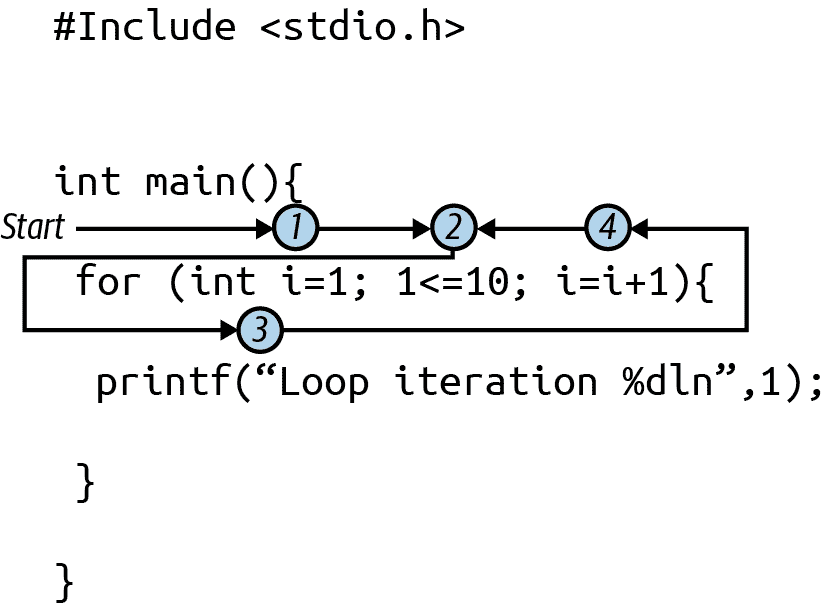

# 第三章：控制流

现在您已经看到了 C 语言语句的基本格式，是时候开始展开了……打趣一下。在代码中，做出决策然后选择要运行的特定代码而不是其他代码片段的概念通常称为*分支*或*条件分支*。而重复则经常以*循环*或*迭代*的术语来讨论。总体来说，分支和循环语句组成了语言中的*控制流*。

一些问题可以通过一系列简单的线性步骤来解决。许多自动化各种计算机任务的程序就是这样工作的，将一个繁琐的例行程序简化成你需要时可以运行的单个应用程序。但程序可以做的远不止处理一批命令。它们可以根据变量的值或传感器的状态做出决策。它们可以重复任务，例如打开一串灯中的每个 LED 或处理日志文件中的每一行。它们还可以以复杂、嵌套的方式结合决策和重复，使您作为程序员能够解决几乎任何可以想到的问题。在本章中，我们将探讨 C 语言如何实现这些概念。

# 布尔值

要在 C 语言中提出问题，通常需要比较两个（或更多）事物。C 语言有几个专门用于此任务的运算符。您可以检查两个事物是否相同。您可以检查两个事物是否不同。您可以查看某个值是否小于或大于另一个值。

当您像“x 是否与 y 相同”这样提出问题时，您会得到一个是或否、真或假的答案。在计算机科学中，这些称为布尔值，源自乔治·布尔（George Boole），他致力于形式化逻辑操作和结果的系统。一些语言具有布尔值和变量的实际类型，但 C 语言主要使用整数：0 表示假/否，1 表示真/是。¹

###### 注意

在 C 语言中，任何非 0 的值都表示为真。因此，1 是真，2 是真，-18 是真，等等。我会指出每当我执行依赖于这一事实的检查时。这可能很方便，在现实世界中您肯定会看到它被使用，但我会集中精力在尽可能进行显式比较上。

## 比较运算符

数学，当然，并不是计算机擅长的唯一领域。当我们开始编写更复杂的程序时，我们将需要能够对系统状态做出决策。我们需要比较变量与期望值，并防范错误条件。我们需要检测列表的末尾和其他数据结构。幸运的是，所有这些需求都可以通过 C 语言的比较运算符来实现。

C 定义了六个运算符（如表 3-1 所示），可用于比较值。我们使用这些运算符就像我们使用表 2-6 中的数学运算符一样。你在左边有一个变量、值或表达式，在右边有一个变量、值或表达式。这里的区别是使用比较运算符的结果始终是一个布尔`int`，意味着它总是`1`或`0`。

表 3-1\. 比较运算符

| 操作符 | 比较 |
| --- | --- |
| `==` | 等于 |
| `!=` | 不等于 |
| `<` | 小于 |
| `>` | 大于 |
| `<=` | 小于或等于 |
| `>=` | 大于或等于 |

在 C 语言中，比较运算符适用于字符、整数和浮点数。一些语言支持可以处理更复杂数据位如数组（我将在第四章中介绍），记录或对象的运算符，但是 C 语言使用函数（在第五章中介绍）来完成这类工作。

当比较两个相同类型的表达式时，你可以毫不费力地使用表 3-1 中的运算符（见表 3-1）。如果你比较不同类型的表达式，比如一个`float`变量和一个`int`值，那么隐式转换的概念（见图 2-4）将适用，并且较低的类型值在比较之前会被提升。

我们马上会在“分支”和“循环语句”中使用这些比较运算符，但是我们可以快速转到简单的打印语句，展示 0 或 1 的结果。考虑[*ch03/booleans.c*](https://oreil.ly/2dSZx)：

```cpp
#include <stdio.h>

int main() {
  printf(" 1 == 1  : %d\n", 1 == 1);
  printf(" 1 != 1  : %d\n", 1 != 1);
  printf(" 5 < 10  : %d\n", 5 < 10);
  printf(" 5 > 10  : %d\n", 5 > 10);
  printf("12 <= 10 : %d\n", 12 <= 10);
  printf("12 >= 10 : %d\n", 12 >= 10);
}
```

继续编译该文件并运行它。你应该看到类似于这样的输出：

```cpp
ch03$ gcc booleans.c
ch03$ ./a.out
 1 == 1  : 1
 1 != 1  : 0
 5 < 10  : 1
 5 > 10  : 0
12 <= 10 : 0
12 >= 10 : 1
```

当你看到“真”比较的结果为`1`时，如我之前所述。相反，“假”在幕后为`0`。

## 逻辑运算符

我们在代码中想要询问的一些问题不能简化为单个比较。一个非常常见的问题，例如，是询问一个变量是否在某些值的范围内。我们需要知道所讨论的变量是否*既*大于某个最小值*又*小于某个最大值。C 语言没有创建范围或测试成员资格的运算符。但是 C 支持逻辑运算符（有时你会听说布尔运算符），以帮助你构建相当复杂的逻辑表达式。

要开始，请查看表 3-2 中的运算符。

表 3-2\. 布尔运算符

| 操作符 | 操作 | 注释 |
| --- | --- | --- |
| ! | 非 | 产生其操作数的逻辑相反的一元运算符 |
| && | 与 | 连接；两个操作数必须都为真才返回真 |
| &#124;&#124; | 或 | 析取；如果至少一个操作数为真则为真 |

这些运算符可能看起来有点奇怪，你可能不熟悉逻辑运算，所以给自己一些时间来熟悉这些符号。如果现在还不太舒服也不要担心。布尔代数并不是一个常见的小学课题！但你肯定会在在线代码中遇到这些运算符，所以让我们确保你了解它们的工作原理。

###### 提示

在讨论编程语言时称之为“逻辑”或“布尔代数”是有用的，但你可能从人类语言（比如我这里使用的英语）中已经有了这些概念的经验：这些运算符形成*连词*。语法课上的经典“and”、“but”和“or”大致相当于 C 语言中的`&&`、`!`和`||`。将这些布尔表达式翻译成英语甚至可以帮助你理解它们的意图。考虑“x > 0 && x < 100”。试着大声朗读这个表达式：“x 大于零且 x 小于 100。”如果通过拼写这些表达式有助于理解，那么当遇到新代码时，这是一个简单的技巧。

在逻辑中，这些运算符的最佳描述是它们的结果。这些结果通常在*真值表*中显示，列举出所有可能的输入组合及其结果。幸运的是，只有两个可能的值，真和假，这些组合是可管理的。每个运算符都有自己的真值表。表 3-3 列出了`&&`运算符的输入和结果。让我们从这里开始。

表 3-3\. `&&` （与）运算符

| a | b | a && b |
| --- | --- | --- |
| true | true | true |
| true | false | false |
| false | true | false |
| false | false | false |

正如表格所示，这是一个相当严格的运算符。两个输入必须同时为真才能得到真。根据之前的提示，在英语连词方面可以很有用：“我们在 Reg 和 Kaori 都准备好之前不能去派对。”如果 Reg 没有准备好，我们必须等待。如果 Reg 准备好了，但 Kaori 没有准备好，我们也必须等待。当然，如果两者都没准备好，我们就得等。事实上，Reg 和 Kaori 都是相当守时的人，等待很少成为问题。;)

表 3-4 显示了使用`||`时相同输入组合的结果。

表 3-4\. `||` （或）运算符

| a | b | a &#124;&#124; b |
| --- | --- | --- |
| true | true | true |
| true | false | true |
| false | true | true |
| false | false | false |

这是一个更宽松的运算符。回到我们的聚会旅行隐喻，也许它在工作日晚上举行，我们不能指望我们的朋友们立刻放下一切加入。对于这种变体，如果*任何一个*Reg*或*Kaori 可以加入，那么我们将与一个好的晚餐伴侣共度美好时光。与`&&`运算符类似，如果两者都能加入，那太棒了！我们依然可以度过一个愉快的晚上。³ 然而，如果两个输入都为 false，总体答案仍然是 false，我们将独自一人。

最后一个运算符 C 用于构建逻辑表达式的支持是`!`。它是一个*一元*运算符，意味着它仅操作一个事物，而不是像数学或比较运算符需要的两个事物那样进行*二元*操作。这意味着它的表格，表 3-5，稍微简单一些。

表 3-5\. `!`（非）运算符

| a | !a |
| --- | --- |
| true | false |
| false | true |

在编码中，这个“非”操作经常用于在继续之前防止错误。我们最后的聚会例子：只要我们*不*遇到交通阻碍，我们将准时到达聚会。这个运算符创建了一个相反的结果。所以“交通很糟糕”与“没有交通很好”。将这个转换成英语并不是那么直接，但希望仍然能说明问题，即你可以谈论执行的逻辑。

# 分支

现在我们知道如何将逻辑问题翻译成有效的 C 语法，那么我们如何利用这些问题呢？我们将从条件语句或*分支*的概念开始。我们可以提出一个问题，然后根据答案执行一些语句组（或不执行）。

## if 语句

最简单的条件语句是 `if` 语句。它有三种形式，其中最简单的是“做或不做”的配置。这个语句的语法非常简单。你提供 `if` 关键字，括号内的测试，然后是一个语句或代码*块*（用大括号括起来的一个或多个语句的组合），如下所示：

```cpp
// For single statements, like a printf():
if (test)
  printf("Test returned true!\n");

// or for multiple statements:
if (test) {
  // body goes here
}
```

如果我们使用的布尔表达式为 true，则我们将执行`if`行后面的语句或块。如果表达式为 false，则我们将跳过该语句或块。

考虑一个简单的程序，询问用户一个数字输入。您可能希望在出现不常见的输入时通知用户，以防他们输入错误。例如，我们可以允许负数，但也许这不是通常的方式。我们仍然希望程序运行，但我们警告用户可能会得到意外的结果。[*ch03/warnings.c*](https://oreil.ly/sP2kJ) 中的程序是一个简单的示例：

```cpp
#include <stdio.h>

int main() {
  int units = 0;
  printf("Please enter the number of units found: ");
  scanf("%d", &units);
  if (units < 0) { // start of our "if" code block
    printf("  *** Warning: possible lost items ***\n");
  } // end of our "if" code block
  printf("%d units received.\n", units);
}

```

如果我们用几个不同的输入运行这个程序，你可以看到 `if` 语句的效果。只有最后一次运行显示了警告：

```cpp
ch03$ gcc warnings.c
ch03$ ./a.out
Please enter the number of units found: 12
12 units received.

ch03$ ./a.out
Please enter the number of units found: 7
7 units received.

ch03$ ./a.out
Please enter the number of units found: -4
  *** Warning: possible lost items ***
-4 units received.
```

尝试输入程序，然后自行编译和运行它。尝试更改测试以查找其他内容，如偶数或奇数，或在范围内或范围外的数字。

我们还可以使用`if`语句从布尔值中获得更人性化的响应。我们可以把测试放入`if`语句中，然后根据真实情况打印出任何真实响应。这里是我们更新的示例；我们将其称为[*ch03/booleans2.c*](https://oreil.ly/neHcZ)：

```cpp
#include <stdio.h>

int main() {
  if (1 == 1) {
    printf(" 1 == 1\n");
  }
  if (1 != 1) {
    printf(" 1 != 1\n");
  }
  if (5 < 10) {
    printf(" 5 < 10\n");
  }
  if (5 > 10) {
    printf(" 5 > 10\n");
  }
  if (12 <= 10) {
    printf("12 <= 10\n");
  }
  if (12 >= 10) {
    printf("12 >= 10\n");
  }
}
```

给这个新程序一个尝试，你应该会得到类似于这样的输出：

```cpp
ch03$ gcc booleans2.c
ch03$ ./a.out
 1 == 1
 5 < 10
12 >= 10
```

很棒！只有返回 true 的测试才会打印。这样更易读。这种带有`printf()`的`if`结合是一种常见的调试技巧。每当你遇到一个有趣（或令人担忧）的条件时，打印一个警告，并可能包含相关的变量以帮助你解决问题。

### 否则

使用简单的`if`，我们可以看到返回 true 的测试的漂亮输出。但是如果我们还想知道测试何时为 false 怎么办？这就是`if`语句的第二种形式的作用；它包括一个`else`子句。你总是和`if`一起使用`else`。（单独使用`else`是语法错误，程序无法编译。）`if/else`语句最终有两个分支：一个在测试为真时执行，另一个在测试为假时执行。让我们构建[*ch03/booleans3.c*](https://oreil.ly/neHcZ)，为每个测试得到一个大拇指或一个大拇指向下的答案：

```cpp
#include <stdio.h>

int main() {
  if (1 == 1) {
    printf(" 1 == 1\n");
  } else {
    printf(" *** Yikes! 1 == 1 returned false\n");
  }
  if (1 != 1) {
    printf(" *** Yikes! 1 != 1 returned true\n");
  } else {
    printf(" 1 != 1  is false\n");
  }
  if (5 < 10) {
    printf(" 5 < 10\n");
  } else {
    printf(" *** Yikes! 5 < 10 returned false\n");
  }
  if (5 > 10) {
    printf(" *** Yikes! 5 > 10 returned true\n");
  } else {
    printf(" 5 > 10  is false\n");
  }
  if (12 <= 10) {
    printf(" *** Yikes! 12 <= 10 returned false\n");
  } else {
    printf("12 <= 10 is false\n");
  }
  if (12 >= 10) {
    printf("12 >= 10\n");
  } else {
    printf(" *** Yikes! 12 >= 10 returned false\n");
  }
}
```

如果我们使用之前相同的输入运行它，我们将看到答案的令人满意的扩展：

```cpp
ch03$ gcc booleans3.c
ch03$ ./a.out
 1 == 1
 1 != 1  is false
 5 < 10
 5 > 10  is false
12 <= 10 is false
12 >= 10
```

完美。我们对每个测试都有可读的答案。现在我们不必担心测试是否运行失败或被跳过。每次都能得到有用的响应。试着升级*warnings.c*文件，以便在数字“异常”时仍然收到警告，同时向用户提供友好的消息，表明其输入处于预期范围内。

### else if 链

现在我们的工具包中有一些非常强大的决策语句。我们可以做某事或跳过它。我们可以做一件事或做另一种选择。如果我们需要在三个语句之间做出决定呢？或四个？或更多？这种情况的一种可能模式是第三种`if`的变体：`if/else if/else`组合。

C 语言允许你“链式”使用`if/else`来实现从多个选项中选择一个。考虑游戏得分根据表现分为一星、二星或三星的情况。使用`else if`块可以实现这种类型的答案。这里是[*ch03/stars.c*](https://oreil.ly/Fe8q9)的示例：

```cpp
#include <stdio.h>

int main() {
  int score = 0;
  printf("Enter your score (1 - 100): ");
  scanf("%d", &score);
  if (score > 100) {
    printf("Bad score, must be between 1 and 100.\n");
  } else if (score >= 85) {
    printf("Great! 3 stars!\n");
  } else if (score >= 50) {
    printf("Good score! 2 stars.\n");
  } else if (score >= 1) {
    printf("You completed the game. 1 star.\n");
  } else {
    // Only here because we have a negative score
    printf("Impossible score, must be positive.\n");
  }
}
```

这里是一些示例运行：

```cpp
ch03$ gcc stars.c
ch03$ ./a.out
Enter your score (1 - 100): 72
Good score! 2 stars.

ch03$ ./a.out
Enter your score (1 - 100): 99
Great! 3 stars!

ch03$ ./a.out
Enter your score (1 - 100): 4567
Bad score, must be between 1 and 100.

ch03$ ./a.out
Enter your score (1 - 100): 42
You completed the game. 1 star.

ch03$ ./a.out
Enter your score (1 - 100): -42
Impossible score, must be positive.
```

但也许我们的游戏很特别，有四星表现。（哇！）文件[*ch03/stars2.c*](https://oreil.ly/uXLDr)展示了如何使用额外的`else if`子句来实现更多选择！

```cpp
#include <stdio.h>

int main() {
  int score = 0;
  printf("Enter your score (1 - 100): ");
  scanf("%d", &score);
  if (score > 100) {
    printf("Bad score, must be between 1 and 100.\n");
  } else if (score == 100) {
    printf("Perfect score!! 4 stars!!\n");
  } else if (score >= 85) {
    printf("Great! 3 stars!\n");
  } else if (score >= 50) {
    printf("Good score! 2 stars.\n");
  } else if (score >= 1) {
    printf("You completed the game. 1 star.\n");
  } else {
    // Only here because we have a negative score
    printf("Impossible score, must be positive.\n");
  }
}
```

还有更多示例输出，以验证我们的新最高分运行正常：

```cpp
ch03$ gcc stars2.c
ch03$ ./a.out
Enter your score (1 - 100): 100
Perfect score!! 4 stars!!

ch03$ ./a.out
Enter your score (1 - 100): 64
Good score! 2 stars.

ch03$ ./a.out
Enter your score (1 - 100): 101
Bad score, must be between 1 and 100.
```

你可以无限继续这些链条。嗯，合理范围内的无限。最终你会受到内存限制，超过一些从句之后，跟随这样的链条流程就会变得困难。如果感觉你的`else/if`块太多了，也许花一点时间检查你的算法，看看是否有其他方法来分解你的测试会更值得。

### if gotchas

这些`else/if`链的语法提示了我之前简要提到的 C 语法细节。如果从句中确切地只有一个语句，`if`和`else`块就不需要花括号。例如，我们的*booleans3.c*可以像这样编写（[*ch03/booleans3_alt.c*](https://oreil.ly/FrXzk)）：

```cpp
#include <stdio.h>

int main() {
  if (1 == 1)
    printf(" 1 == 1\n");
  else
    printf(" *** Yikes! 1 == 1 returned false\n");
  if (1 != 1)
    printf(" *** Yikes! 1 != 1 returned true\n");
  else
    printf(" 1 != 1  is false\n");
  // ...
}
```

在线上你肯定会碰到类似这样的代码。这样做可以节省一点输入，并使测试和语句更加简洁。你*可以*使用花括号来创建一个只有一个语句的块，就像我们在原始的*booleans3.c*代码中所做的那样。这与在数学运算中使用额外的括号类似：虽然不是必需的，但对于可读性是有用的。当你只需执行一个操作时，这主要是一种风格问题。然而，如果要执行两个或更多操作，则始终需要使用花括号，因此我会坚持使用花括号来未来保护我们的代码。（并且在风格上，我更喜欢看到括号的一致性。）如果以后回来更新某些示例并需要添加另一个打印语句，比如说，我们就不必记住添加花括号；它们已经准备好等待使用了。

`if`语句中使用的测试也可能会带来问题，如果不小心就会出错。记住关于 C 语言将零视为假，而任何其他数字视为真的注释？一些程序员依赖于这一事实来编写非常紧凑的测试。考虑以下代码片段：

```cpp
int x;
printf("Please enter an integer: ");
scanf("%i", x);
if (x) {
  printf("Thanks, you gave us a great number!\n");
} else {
  printf("Oh. A zero. Well, thanks for \"nothing\"! ;)\n");
}
```

`if`从句将为任何正数或负数执行，就好像我们构建了一个真正的测试，比如`x != 0`或者甚至是一个更复杂的逻辑表达式，比如`(x < 0 || x > 0)`。这种模式被用作（有时是懒惰的）检查“这个变量是否有任何值”的捷径，其中零被假定为无效可能性。这是一个相当常见的模式，尽管我通常更喜欢编写明确的测试。

C 语言中另一个大问题是使用整数作为布尔值的代理：有一个非常微妙的拼写错误可能会导致真正的麻烦。看看下面的代码片段：

```cpp
int first_card = 10;
int second_card = 7;
int total = first_card + second_card;

if (total = 21) {
  printf("Blackjack! %d\n", total);
}
```

如果你感兴趣，请继续创建一个程序来尝试这个陷阱。当你运行它时，你会看到你总是得到“Blackjack！21”输出。发生了什么？仔细看看`if`语句中的测试条件。我们本意是写成`total == 21`，使用双等号比较运算符。但是我们使用了单等号，实际上在`if`测试条件中为我们的`total`变量赋值了 21！在 C 语言中，赋值也是表达式，就像我们的数学计算一样。赋值表达式的值与被赋的新值相同。总之，这个测试类似于`if (21) ...`，因为 21 不是 0，所以总是为真。这种情况非常容易出错。只要注意那些似乎无论你如何改变输入都会执行的`if`语句。这种行为提示你重新检查你正在使用的测试条件。

## `switch`语句

我在“else if 链”中指出，如果`if/else if`链中有太多的测试条件链接在一起，会变得难以跟踪。不过，有时确实需要检查一堆特定情况，比如基于你的尺码检查你喜爱的在线商店里有什么衬衫。如果这些情况都涉及同一个变量，并且所有情况都使用简单的等式（`==`）作为测试条件，那么在 C 语言中可以使用`switch`语句作为一个不错的选择。

`switch`语句接受一个表达式（控制表达式），通常是一个变量或简单计算，然后系统地将该表达式的值与一个或多个常量值使用`case`标签进行比较。如果控制表达式的值与某个`case`匹配，那么从该值后面的代码开始执行，并持续执行到`switch`语句的结束（总是一个大括号块）或程序遇到`break`命令为止。[*ch03/medals.c*](https://oreil.ly/LVkuZ)文件包含了一个简单的例子：

```cpp
#include <stdio.h>

int main() {
  int place;
  printf("Enter your place: ");
  scanf("%i", &place);
  switch (place) {
  case 1:
    printf("1st place! Gold!\n");
    break;
  case 2:
    printf("2nd place! Silver!\n");
    break;
  case 3:
    printf("3rd place! Bronze!\n");
    break;
  }
}
```

如果你编译并多次运行这个程序，每次使用三种可能的输入，你应该会看到像这样的结果：

```cpp
ch03$ gcc medals.c
ch03$ ./a.out
Enter your place: 2
2nd place! Silver!

ch03$ ./a.out
Enter your place: 1
1st place! Gold!

ch03$ ./a.out
Enter your place: 3
3rd place! Bronze!
```

太好了！正是我们预期的。但是如果我们将那些`break`行注释掉会怎么样？现在让我们试试，因为这展示了`switch`的一个关键怪癖，可能会让新程序员困惑。这是我们修改过的程序，[*ch03/medals2.c*](https://oreil.ly/MluI4)：

```cpp
#include <stdio.h>

int main() {
  int place;
  printf("Enter your place: ");
  scanf("%i", &place);
  switch (place) {
  case 1:
    printf("1st place! Gold!\n");
  case 2:
    printf("2nd place! Silver!\n");
  case 3:
    printf("3rd place! Bronze!\n");
  }
}
```

这是使用第一次使用的相同输入系列的新输出：

```cpp
ch03$ gcc medals2.c
ch03$ ./a.out
Enter your place: 2
2nd place! Silver!
3rd place! Bronze!

ch03$ ./a.out
Enter your place: 1
1st place! Gold!
2nd place! Silver!
3rd place! Bronze!

ch03$ ./a.out
Enter your place: 3
3rd place! Bronze!
```

哎呀，这真是太奇怪了。一旦开始运行，程序会继续执行`switch`语句中的语句，即使它们属于不同的`case`。虽然这看起来可能不是一个好主意，但这是`switch`的一个特性，而不是一个 bug。这种设计允许您为多个值执行相同的操作。考虑下面的片段，描述了 1 到 10 之间任意数字的偶数、奇数和质数情况：

```cpp
printf("Describing %d:\n", someNumber);
switch(someNumber) {
  case 2:
    printf("  only even prime\n");
    break;
  case 3:
  case 5:
  case 7:
    printf("  prime\n");
  case 1:
  case 9:
    // 1 isn't often described as prime, so we'll just let it be odd
    printf("  odd\n");
    break;
  case 4:
  case 6:
  case 8:
  case 10:
    printf("  even\n");
    break;
}
```

我们可以将案例安排得如此之巧，以至于流动到`break`开关特性正好给我们提供了完全正确的输出。尽管这种特性通常用于收集一系列相关但不同的值（比如我们的偶数），然后给它们相同的执行块，但打印“主要”限定词然后继续添加“奇数”标识的流程也是有效的，有时候也很方便。

### 处理默认值

`switch`中还有一个与`if`语句的`else`子句类似的特性。有时候，你希望你的`switch`语句处理每一个可能的输入。但列出几千个整数，甚至只是字母表中的每一个字母，无论如何都会非常乏味。通常情况下，您并不对所有这些成千上万个选项都有独特的动作。在这些情况下，您可以使用`default`标签作为最后的“case”，它将执行控制表达式值的任何情况。

###### 注意

从技术上讲，`default`可以出现在案例列表的任何位置，而不仅仅是作为最后一个选项。然而，由于在遇到时`default`情况总是运行，包括后续特定案例并没有意义。

例如，使用我们的*medals.c*程序，那些没有进入领奖台的参赛者怎么样？尝试再次运行它，使用一些大于三的数字。你得到了什么？什么也没有。没有错误，没有输出，什么都没有。让我们写一个[*ch03/medals3.c*](https://oreil.ly/l1AHK)，并使用`default`选项来打印一个消息，至少证明我们看到了输入：

```cpp
#include <stdio.h>

int main() {
  int place;
  printf("Enter your place: ");
  scanf("%i", &place);
  switch (place) {
  case 1:
    printf("1st place! Gold!\n");
    break;
  case 2:
    printf("2nd place! Silver!\n");
    break;
  case 3:
    printf("3rd place! Bronze!\n");
    break;
  default:
    printf("Sorry, you didn't make the podium.\n");
  }
}
```

编译并运行这个新程序，并尝试一些大于三的值：

```cpp
ch03$ gcc medals3.c
ch03$ ./a.out
Enter your place: 8
Sorry, you didn't make the podium.

ch03$ ./a.out
Enter your place: 88
Sorry, you didn't make the podium.

ch03$ ./a.out
Enter your place: 5792384
Sorry, you didn't make the podium.
```

很棒！无论我们输入什么大于三的数字，我们都会得到一些反馈，表明我们已经处理了该输入。正是我们想要的。并且我们甚至可以在包含多个案例每个块安排的`switch`语句中使用`default`。让我们为我们的奖牌描述程序添加一个“Top 10”级别，[*ch03/medals4.c*](https://oreil.ly/lS1tv)：

```cpp
#include <stdio.h>

int main() {
  int place;
  printf("Enter your place: ");
  scanf("%i", &place);
  switch (place) {
  case 1:
    printf("1st place! Gold!\n");
    break;
  case 2:
    printf("2nd place! Silver!\n");
    break;
  case 3:
    printf("3rd place! Bronze!\n");
    break;
  case 4:
  case 5:
  case 6:
  case 7:
  case 8:
  case 9:
  case 10:
    printf("Top 10! Congrats!\n");
    break;
  default:
    printf("Sorry, you didn't make the podium.\n");
  }
}
```

再编译一次，然后用几个输入运行它：

```cpp
ch03$ gcc medals4.c
ch03$ ./a.out
Enter your place: 4
Top 10! Congrats!

ch03$ ./a.out
Enter your place: 1
1st place! Gold!

ch03$ ./a.out
Enter your place: 20
Sorry, you didn't make the podium.

ch03$ ./a.out
Enter your place: 7
Top 10! Congrats!
```

很好。这里有一个快速的家庭作业给你。修改*medals4.c*，以便如果你获得第四或第五名，你会被标记为“亚军”。第 6 到 10 名仍然应列为前十名。（这是一个小改变。你可以查看你的答案和我的答案[*ch03/medals5.c*](https://oreil.ly/W7uci)来对比。）

# 三元运算符和条件赋值

Lean 代码中另一个经常使用的条件主题是条件赋值的概念。C 语言包含一个三元运算符，`?:`，它接受三个操作数。它允许您在非常紧凑的语法中使用两个值之一。这个三元表达式的结果确实是 C 语言中任何其他表达式一样的值，所以您可以在任何值合法的地方使用`?:`。

`?:`的语法使用布尔表达式作为第一个操作数，然后是问号，然后是要评估的表达式（如果布尔为真），然后是冒号，最后是另一个要评估的表达式（如果布尔为假）。

使用三元运算符的一个很好的例子是获取两个值中较小的一个。考虑一个简单的程序，处理两个对某些图形设计工作的竞标。预算遗憾地成为主导因素，所以你需要接受最低的竞标价。

```cpp
int winner = (bid1 < bid2) ? bid1 : bid2;
```

非常密集！即使只是阅读这些三元表达式也需要一些练习，但一旦掌握，我认为你会发现它是一个非常方便的运算符。另一种方法是相对冗长的`if/else`：

```cpp
int winner;
if (bid1 < bid2) {
  winner = bid1;
} else {
  winner = bid2;
}
```

当然，这并不是一个糟糕的替代方案，但它确实更冗长。而且在使用三元方法简化事情的时候确实有时候。还记得第一个布尔表达式程序，*booleans.c*，在“比较运算符”中吗？我们必须接受将 1 解释为“true”和 0 解释为“false”。最终我们在*booleans3.c*中打印了漂亮的陈述，但我们必须使用相当冗长的`if/else`模式。然而，使用`?:`，我们可以直接在`printf()`语句中生成友好的输出。尝试[*ch03/booleans4.c*](https://oreil.ly/Hnumr)，看看你的感觉：

```cpp
#include <stdio.h>

int main() {
  printf(" 1 == 1  : %s\n", 1 == 1 ? "true" : "false");
  printf(" 1 != 1  : %s\n", 1 != 1 ? "true" : "false");
  printf(" 5 < 10  : %s\n", 5 < 10 ? "true" : "false");
  printf(" 5 > 10  : %s\n", 5 > 10 ? "true" : "false");
  printf("12 <= 10 : %s\n", 12 <= 10 ? "true" : "false");
  printf("12 >= 10 : %s\n", 12 >= 10 ? "true" : "false");
}
```

这是我们更新后的输出：

```cpp
ch03$ gcc booleans4.c
ch03$ ./a.out
 1 == 1  : true
 1 != 1  : false
 5 < 10  : true
 5 > 10  : false
12 <= 10 : false
12 >= 10 : true
```

好多了。

###### 小贴士

在*booleans3.c*中将每个打印调用都包裹在`if/else`块中有些麻烦。不仅令人恼火，打印文本中的共享部分如果有任何更改可能会失去同步。例如，如果在一行的开头发现了一个拼写错误，你需要确保在`if`子句的`printf()`开头和`else`子句中再次修复它。很容易忘记其中之一。

每当可以通过使用不同的条件语句或操作符避免这种重复代码时，都值得考虑。但不要过于热衷；如果你的`if/else`链感觉可读且能产生正确的输出，那仍然是一个不错的选择。

# 循环语句

你可以只用变量和我们迄今为止涵盖的输入、输出和分支语句解决一些有趣的问题。但计算机真正擅长的一个领域是当你需要重复测试或一批语句时。为了执行重复操作，你可以使用 C 语言的一种*循环*语句。你的程序将执行所有（可选的）语句，并在这些语句结束时“循环”回到起点并再次执行它们。通常情况下，你不希望该循环永远运行，因此每个循环语句都有一个条件来检查并确定何时应该停止循环。

## `for`语句

编程中经常遇到的一种重复是为特定次数重复执行某个代码块。例如，每周做某件事情，或者处理输入的前 5 行，甚至只是简单地数到 10。事实上，让我们来看看计数到 10 的`for`循环，如图 3-1 所示，我在循环的各个部分做了标记。（随意输入或打开[*ch03/ten.c*](https://oreil.ly/qqDiQ)文件。）起初可能看起来有点凌乱，但随着时间的推移，它会变得更加熟悉。



###### 图 3-1\. 一个带注释的 `for` 循环

在我们查看循环的详细信息之前，这里是输出：

```cpp
ch03$ gcc ten.c
ch03$ ./a.out
Loop iteration: 1
Loop iteration: 2
Loop iteration: 3
Loop iteration: 4
Loop iteration: 5
Loop iteration: 6
Loop iteration: 7
Loop iteration: 8
Loop iteration: 9
Loop iteration: 10
```


(`int i = 1`) 这是我们的循环变量。我们使用与普通变量相同的声明和初始化语法。循环的这一部分总是首先执行，并且只在循环开始时执行一次。


(`i <= 10`) 这里是测试循环何时结束的条件。只要此测试返回 true，循环就会运行。如果此条件为 false —— 即使是在第一次检查时也是如此 —— 循环将结束。


接下来执行循环的主体，假设  中的测试返回 true。


(`i = i + 1`) 完成主体后，会评估这个调整表达式。这个表达式通常会增加或减少我们的循环变量一次。在这一步之后，控制会跳回到 ，以查看循环是否应该继续。

初始化、结束条件的检查和调整都非常灵活。你可以使用任何你喜欢的名称，并且可以以任意数量进行递增或递减。甚至可以使用 `char` 类型的变量，如果你有任何原因需要顺序字符。

让我们尝试一些更简单的 `for` 循环，来练习它的语法和流程。我们将初始化我们的循环变量，检查是否应该开始循环，执行主体中的语句，进行调整，然后检查是否应该继续。重复。我们将尝试一些带有不同调整的循环，包括一个可以用来向后计数的递减，[*ch03/more_for.c*](https://oreil.ly/jzGZe)：

```cpp
#include <stdio.h>

int main() {
  printf("Print only even values from 2 to 10:\n");
  for (int i = 2; i <= 10; i = i + 2) {
    printf("  %i\n", i);
  }
  printf("\nCount down from 5 to 1:\n");
  for (int j = 5; j > 0; j = j - 1) {
    printf("  %i\n", j);
  }
}
```

这是我们的输出：

```cpp
ch03$ gcc more_for.c
ch03$ ./a.out
Print only even values from 2 to 10:
  2
  4
  6
  8
  10

Count down from 5 to 1:
  5
  4
  3
  2
  1
```

尝试调整一些循环中的值并重新编译。你能逆向计数两个吗？你能从 1 数到 100 吗？你能从 1 数到 1,024 并且每次都加倍吗？

### 递增快捷方式

像我们在这些调整表达式中所做的那样对变量进行递增或递减是一个非常常见的任务（即使在循环之外也是如此），因此 C 支持多种用于这种类型变化的快捷方式。考虑以下形式的语句：

```cpp
var = var op value

// Examples
i = i + 1
y = y * 5
total = total - 1
```

其中 `var` 是某个变量，`op` 是来自 Table 2-6 的算术运算符之一。如果你在代码中使用了这种模式，可以使用复合赋值代替：

```cpp
var op= value

// Converted examples
i += 1
y *= 5
total -= 1
```

进一步说，每当你对变量加减 1 时，你可以使用更简洁的变体：

```cpp
var++ or var--

// Further converted examples
i++
total--
```

###### 注意

你可能会看到“前缀”版本的递增和递减快捷方式，例如 `++i` 或 `--total`。这些变体是合法的，并且在我们使用的 `for` 循环中有微妙的区别，不会起作用。

你不一定要使用这些简洁的选项，但它们很受欢迎，你在编码网站如 Stack Overflow 或 Arduino 示例中肯定会遇到它们。

### 用于捕捉疏忽的注意事项

在我们讨论 C 中的其他循环选项之前，我想指出关于`for`循环的一些细节可能会让你犯错。

`for`循环语法中可能最重要的元素是循环设置中间的条件。你需要确保条件允许循环*开始*以及更明显地需要循环停止的能力。考虑这个循环片段：

```cpp
  for (int x = 1; x == 11; x++) {
    // ....
  }
```

循环的明显目的是计数到 10——当`x`等于 11 时停止。但是条件必须为真才能运行循环，所以你不能只是等待结束。

你还需要确保你的条件和调整表达式是同步的。我最喜欢的错误之一是创建一个用于倒计数或逆向计数的循环，但我忘记使用递减操作：

```cpp
  for (int countdown = 10; countdown > 0; countdown++) {
    // ....
  }
```

显然，在这个设置的最后一部分我应该写`countdown--`，但递增是如此常见，几乎已成为肌肉记忆。看看这个循环。你能看出会发生什么吗？这个循环不会朝着停止条件前进，而是会继续前进相当长的时间。不幸的是，编译器无法真正帮助我们，因为这种语法是完全合法的。错误是一个逻辑错误，因此作为程序员，你需要捕捉它。

另一个容易犯的大错误与`for`循环设置的语法有关。请注意，表达式是由分号而不是逗号分隔的：

```cpp
  for (int bad = 1, bad < 10, bad++) {
    // ....
  }

  for (int good = 1; good < 10; good++) {
    // ....
  }
```

那个细节很容易被忽略，你可能会至少犯这个错误一次。在这里，编译器会捉住你，尽管：

```cpp
ch03$ gcc bad_ten.c
ten.c: In function ‘main’:
ten.c:4:23: error: expected ‘=’, ‘,’, ‘;’, ‘asm’ before ‘<=’ token
    4 |   for (int bad = 1, bad <= 10, bad++) {
      |                     ^~
ten.c:7:1: error: expected expression before ‘}’ token
    7 | }
      | ^
ten.c:7:1: error: expected expression before ‘}’ token
ten.c:7:1: error: expected expression before ‘}’ token
```

当然很容易修复，但在学习过程中要注意这一点。这些类型的错误在直接输入代码而不是从在线源粘贴时更容易遇到（然后修复！）。出于这个原因，我真的建议手动输入本书中的一些程序清单。

## while 语句

在计算机编程中，执行特定次数的迭代无疑是一个流行的任务。但是，循环直到满足某些更一般的条件同样常见。在 C 中，更通用的循环是`while`循环。它只有一个简单的条件作为其唯一的语法元素。如果条件为真，则执行循环体。跳回去检查条件……并重复。

这种类型的循环非常适合需要扫描多少信息不可预测的输入。让我们尝试一个简单的程序来计算一些数字的平均值。关键是，我们允许用户输入他们想要的任意数量（或任意少量）的数字。我们将要求他们输入一个*标志*值来指示他们已经完成了给我们新数字的输入。标志可以是任何与预期值不同的值。我们在我们的条件中使用它，所以我们知道何时停止。例如，让我们要求用户输入 1 到 100 之间的数字。然后我们可以使用 0 作为标志。这里是[*ch03/average.c*](https://oreil.ly/KmxH4)：

```cpp
#include <stdio.h>

int main() {
  int grade;
  float total = 0.0;
  int count = 0;
  printf("Please enter a grade between 1 and 100\. Enter 0 to quit: ");
  scanf("%i", &grade);
  while (grade != 0) {
    total += grade;
    count++;
    printf("Enter another grade (0 to quit): ");
    scanf("%i", &grade);
  }
  if (count > 0) {
    printf("\nThe final average is %.2f\n", total / count);
  } else {
    printf("\nNo grades were entered.\n");
  }
}
```

这里有两个不同输入的样本运行：

```cpp
ch03$ gcc average.c
ch03$ ./a.out
Please enter a grade between 1 and 100\. Enter 0 to quit: 82
Enter another grade (0 to quit): 91
Enter another grade (0 to quit): 77
Enter another grade (0 to quit): 43
Enter another grade (0 to quit): 14
Enter another grade (0 to quit): 97
Enter another grade (0 to quit): 0

The final average is 67.33

ch03$ ./a.out
Please enter a grade between 1 and 100\. Enter 0 to quit: 0

No grades were entered.
```

我们开始询问用户第一个数字。然后我们在`while`语句中使用这个响应。如果他们第一次输入了 0，我们就完成了。与`for`循环不同，`while`循环可能根本不执行是很常见的。有合理的情况，你可能需要迭代一个可选任务，比如关闭智能家居中的所有灯光。但是因为是可选的，有时这意味着你根本不执行；如果灯光已经关闭，那就什么也不需要做。

假设他们给了我们一个有效的数字，我们就开始循环。我们将他们的输入添加到一个单独的变量中，用于保存运行的总数（在编程中，这有时被称为*累加器*）。我们还递增第三个变量`count`，以跟踪用户给我们的数字数量。

我们提示用户输入下一个数字（或者输入 0 退出）。我们获取他们的输入，并且再次将该值用于`while`循环的条件。如果最近的成绩有效，将其添加到总数并重复。

一旦我们完成循环，我们就打印结果。我们使用`if/else`语句来将最终结果包装在一个友好的人类句子中。如果他们在开始时输入了 0，我们指出没有平均值可打印。否则（`else`），我们以两位小数的精度打印平均值。

## `do/while`变体

C 语言中最后一种循环语句是`do/while`（有时简称为`do`循环）。从名称就可以猜到，它与`while`循环类似，但有一个重要的不同。`do`循环自动保证至少执行一次循环体。它在执行循环体后而不是之前检查循环条件。这在你知道至少需要一次循环时非常有用。我们的成绩平均程序实际上是一个完美的例子。我们至少需要一次询问用户的成绩。如果他们一开始给了我们一个 0，我们就结束了，这是可以接受的。如果他们给了我们一个有效的数字，我们就累加总数并再次询问。使用`do`循环以及对我们计数的小调整，我们可以避免在[*ch03/average2.c*](https://oreil.ly/ILhdW)中重复调用`scanf()`：

```cpp
#include <stdio.h>

int main() {
  int grade;
  float total = 0.0;
  int count = 0;
  do {
    printf("Enter a grade between 1 and 100 (0 to quit): ");
    scanf("%i", &grade);
    total += grade;
    count++;
  } while (grade != 0);
  // We end up counting the sentinel as a grade, so undo that
  count--;

  if (count > 0) {
    printf("\nThe final average is %.2f\n", total / count);
  } else {
    printf("\nNo grades were entered.\n");
  }
}
```

输出基本上是一样的：

```cpp
ch03$ gcc average2.c
ch03$ ./a.out
Enter a grade between 1 and 100 (0 to quit): 82
Enter a grade between 1 and 100 (0 to quit): 91
Enter a grade between 1 and 100 (0 to quit): 77
Enter a grade between 1 and 100 (0 to quit): 43
Enter a grade between 1 and 100 (0 to quit): 14
Enter a grade between 1 and 100 (0 to quit): 97
Enter a grade between 1 and 100 (0 to quit): 0

The final average is 67.33
```

没有太大的区别——实际上结果没有任何区别——但是每当你可以删除不影响功能的代码行时，你就在减少出错的机会。这总是件好事！

# 嵌套

将循环和条件语句添加到你的工具箱中，极大地扩展了你能解决的问题范围。但更好的是：你可以在循环内部嵌套`if`语句以监视错误条件，在`if`内部放置`while`以等待传感器的信号，或者在一个`for`循环内部再次使用`for`循环以遍历表格数据。记住，所有这些控制语句仍然只是语句，它们可以在允许更简单的语句的任何地方使用。

让我们利用这种嵌套能力进一步改进我们的平均程序。我们知道零是“完成”值，但我们说我们希望值在 1 到 100 之间。如果用户给我们一个负数会发生什么？或者一个大于 100 的数字？如果你仔细看*average2.c*中的代码，你会发现我们对此没有做太多处理。我们不退出或丢弃它。如果我们在循环内部使用`if/else`语句，就像[*ch03/average3.c*](https://oreil.ly/alYI8)中那样，我们可以做得更好：

```cpp
#include <stdio.h>

int main() {
  int grade;
  float total = 0.0;
  int count = 0;
  do {
    printf("Enter a grade between 1 and 100 (0 to quit): ");
    scanf("%i", &grade);
    if (grade >= 1 && grade <= 100) {
      // Valid! Count it.
      total += grade;
      count++;
    } else if (grade != 0) {
      // Not valid, and not our sentinel, so print an error and continue.
      printf("   *** %d is not a valid grade. Skipping.\n", grade);
    }
  } while (grade != 0);

  if (count > 0) {
    printf("\nThe final average is %.2f\n", total / count);
  } else {
    printf("\nNo grades were entered.\n");
  }
}
```

很棒。我们甚至修复了*average2.c*中`count`变量的小问题，我们必须将`count`减 1，因为即使第一个条目为 0，我们也执行了整个`do/while`循环的主体。非常好的升级！

让我们用一些简单的输入测试这个程序，以便验证坏值没有包含在平均值中：

```cpp
ch03$ gcc average3.c
ch03$ ./a.out
Enter a grade between 1 and 100 (0 to quit): 82
Enter a grade between 1 and 100 (0 to quit): -82
   *** -82 is not a valid grade. Skipping.
Enter a grade between 1 and 100 (0 to quit): 43
Enter a grade between 1 and 100 (0 to quit): 14
Enter a grade between 1 and 100 (0 to quit): 9101
   *** 9101 is not a valid grade. Skipping.
Enter a grade between 1 and 100 (0 to quit): 97
Enter a grade between 1 and 100 (0 to quit): 0

The final average is 59.00
```

我们可以检查数学：82 + 43 + 14 + 97 = 236。236 ÷ 4 = 59。这与我们的结果相符，所以我们的嵌套`if/else`是有效的。万岁！

###### 提示

随着您使用嵌套控制语句构建更复杂的程序，您可能会遇到需要在循环通常完成之前退出循环的情况。令人高兴的是，您在`switch`语句讨论中看到的`break`命令可用于立即退出循环。一些程序员试图避免这种“作弊”，但有时我认为这实际上使代码更易读。

一个常见的用例是在循环中遇到来自用户输入的错误。与其尝试向循环条件添加额外的逻辑，不如使用`if`语句测试错误，如果确实出现错误，就`break`。

## 嵌套循环和表格

让我们尝试另一个例子。我提到使用嵌套的`for`循环处理表格数据。我们可以利用这个想法在[*ch03/multiplication.c*](https://oreil.ly/mQQbs)中生成小学经典的乘法表：

```cpp
#include <stdio.h>

int main() {
  int tableSize = 10;
  for (int row = 1; row <= tableSize; row++) {
    for (int col = 1; col <= tableSize; col++) {
      printf("%4d", row * col);
    }
    printf("\n"); // final newline to move to the next row
  }
}
```

这很小。这是程序可以非常高效解决的重复性任务。而且得到的表格如下：

```cpp
ch03$ gcc multiplication.c
ch03$ ./a.out
   1   2   3   4   5   6   7   8   9  10
   2   4   6   8  10  12  14  16  18  20
   3   6   9  12  15  18  21  24  27  30
   4   8  12  16  20  24  28  32  36  40
   5  10  15  20  25  30  35  40  45  50
   6  12  18  24  30  36  42  48  54  60
   7  14  21  28  35  42  49  56  63  70
   8  16  24  32  40  48  56  64  72  80
   9  18  27  36  45  54  63  72  81  90
  10  20  30  40  50  60  70  80  90 100
```

非常令人满意！而且你不仅限于只有两个循环。你可以使用三个循环处理三维数据，就像这个片段中所示：

```cpp
  for (int x = -5; x <= 5; x++) {
    for (int y = -5; y <= 5; y++) {
      for (int z = -5; z <= 5; z++) {
        // Do something with your 3D (x, y, z) coordinate
        // or use even more nested elements like checking for the origin
        if (x == 0 && y == 0 && z == 0) {
          printf("We found the origin!\n");
        }
      }
    }
  }
```

几乎没有结束你可以在代码中包装的复杂性，以解决即使是最棘手的问题。

## 变量作用域

在 C 语言中嵌套语句的一个重要事项是，语言在其块中强制执行*变量作用域*。例如，如果你创建一个用于`for`循环的变量，那么该变量在循环完成*后*就不能再使用。这对于在块内（例如，在一对花括号内）或在`for`循环的设置中声明的任何变量都是适用的。一旦块结束，变量就不再可访问。（有时你会听到程序员谈论变量的*可见性*，这是相同的概念。）

大多数时候，你不必过多考虑这个话题，因为你通常会自然地在声明变量的地方使用它们，这很好。但在复杂的代码结构中，你可能会忘记变量的声明位置，这可能会导致问题。

让我们升级我们的乘法表程序，询问用户想要生成多大的表格（合理范围内！）。我们将允许任何从 1 到 20 的表格大小。我们将用户的响应存储在一个变量中，可以供两个循环使用。尝试以下程序（[*ch03/multiplication2.c*](https://oreil.ly/0z424)），并注意突出显示一些潜在问题区域的评论，其中一个变量不可见。

```cpp
#include <stdio.h>

int main() {
  int tableSize;
  printf("Please enter a size for your table (1 - 20): ");
  scanf("%i", &tableSize);
  if (tableSize < 1 || tableSize > 20) {
    printf("We can't make a table that size. Sorry!\n");
    printf("We'll use the default size of 10 instead.\n");
    tableSize = 10;
  }
  for (int row = 1; row <= tableSize; row++) {      
    // row and tableSize are both in scope
    for (int col = 1; col <= tableSize; col++) {    
      // row, col, and tableSize are all in scope
      printf("%4d", row * col);                     
    }
    // col is now _out_ of scope 
    printf("\n"); // final newline to move to the next row
  }
  // row is out of scope now, too, but tableSize remains available }
```


你可以看到我们的`tableSize`变量在两个循环中都是可见的。


显然，在由`col`变量驱动的循环内部，`row`变量是可见的。


但是一旦内部的`for`循环完成了给定行的值的打印，`col`变量就会“超出范围”，不能再使用。

但是，如果你尝试访问已经超出范围的东西会发生什么呢？幸运的是，编译器通常会警告你。例如，如果我们尝试在当前打印换行符结束行时打印`col`的最终值，我们将会得到如下错误：

```cpp
ch03$ gcc multiplication2.c
multiplication2.c: In function ‘main’:
multiplication2.c:19:20: error: ‘col’ undeclared (first use in this function)
   19 |     printf("%d\n", col); // final newline to move to the next row
      |                    ^~~
```

犯这些错误从来不会致命。你只需阅读错误消息并找出导致问题的代码部分即可。如果你在循环或块结束后确实需要使用特定的变量，你必须在块之前定义该变量。例如，我们可以在与`tableSize`声明相同的位置声明我们的两个循环变量`row`和`col`，以便它们在`main()`函数的任何地方都可见。我们在`for`循环的初始化步骤中不会声明这些变量为`int`类型，而只是赋予起始值，就像在[*ch03/multiplication3.c*](https://oreil.ly/yTDBc)中一样。

```cpp
#include <stdio.h>

int main() {
  int tableSize, row, col;
  printf("Please enter a size for your table (1 - 20): ");
  scanf("%i", &tableSize);
  if (tableSize < 1 || tableSize > 20) {
    printf("We can't make a table that size. Sorry!\n");
    printf("We'll use the default size of 10 instead.\n");
    tableSize = 10;
  }
  // Notice that since we declared row and col above, we do not
  // include the "int" type declaration inside the for loops below
  for (row = 1; row <= tableSize; row++) {
    for (col = 1; col <= tableSize; col++) {
      printf("%4d", row * col);
    }
    printf("\n");
  }
  printf("\nFinal variable values:\n");
  printf("  row == %d\n col == %d\n tableSize == %d\n", row, col, tableSize);
}
```

如果我们以宽度为 5 运行我们的新版本，这是我们的输出：

```cpp
ch03$ gcc multiplication3.c
ch03$ ./a.out
Please enter a size for your table (1 - 20): 5
   1   2   3   4   5
   2   4   6   8  10
   3   6   9  12  15
   4   8  12  16  20
   5  10  15  20  25

Final variable values:
  row == 6
  col == 6
  tableSize == 5
```

因此，我们可以看到导致循环停止的`row`和`col`的最终值。看起来很整洁，但也容易引起问题。因为这些潜在问题，不建议使用具有广泛或全局范围的变量。如果你有充分理由并且需要在不同的块中使用特定的变量，那是可以的，只是确保你有意识地声明这些变量，而不是仅仅为了让程序编译通过。

# 练习

在本章中，我们已经看到了几种不同的控制流结构的结构。希望你在阅读过程中已经尝试并调整了这些示例。但没有什么比反复使用新语言或新语句更能帮助你熟悉它了。为此，在继续阅读之前，这里有一些练习供你尝试。

1.  打印出一个三角形模式。你可以硬编码尺寸或者询问用户，就像我们在乘法表中所做的那样。例如：

    ```cpp
    exercises$ ./a.out
    Please enter a size for your triangle (1 - 20): 5
    *
    **
    ***
    ****
    *****
    ```

1.  打印出一个金字塔模式的图案，其中星号的行是居中的，就像这样：

    ```cpp
    exercises$ ./a.out
    Please enter a size for your triangle (1 - 20): 5
        *
       * *
      * * *
     * * * *
    * * * * *
    ```

1.  将行和列标签添加到我们的乘法表中，如下所示：

    ```cpp
    exercises$ ./a.out
    Please enter a size for your table (1 - 20): 5
         1   2   3   4   5
     1   1   2   3   4   5
     2   2   4   6   8  10
     3   3   6   9  12  15
     4   4   8  12  16  20
     5   5  10  15  20  25
    ```

1.  编写一个猜数字游戏。目前，只需自己选择一个数字并将其存储在变量如`secret`中即可。（我们将在第七章中讨论让计算机为我们选择随机数字的方法。）告诉用户范围的界限，并在他们猜测时给予关于他们的猜测是低于还是高于秘密数字的线索。玩游戏可能看起来像这样：

    ```cpp
    exercises$ ./a.out
    Guess a number between 1 and 50: 25
    Too low! Try again.
    Guess a number between 1 and 50: 38
    Too low! Try again.
    Guess a number between 1 and 50: 44
    Too high! Try again.
    Guess a number between 1 and 50: 42
    *** Congratulations! You got it right! ***
    ```

1.  尝试实现欧几里德算法，用于找出两个数的最大公约数。在*伪代码*（英语语句排列如代码，并偶尔使用像“=”这样的操作符；它意味着描述某个程序步骤的一种方式，而不需要真正的代码）中，该算法如下所示：

    ```cpp
    Start with two positive numbers, a and b
    While b is not zero:
      Is a greather than b?
        Yes: a = a - b
        No: b = b - a
    Print a
    ```

你可以在程序中设置这两个值，或者要求用户输入它们。要检查你的程序，比如 3,456 和 1,234 的最大公约数是 2，而 432 和 729 的最大公约数是 27。

如果你想看看我是如何解决这些问题的，你可以查看[*ch03/exercises*](https://oreil.ly/BDw5K)文件夹中的各种答案。但我鼓励你在查看我的解决方案之前尝试自己解决它们。每个练习都有许多种解决方法，比较你自己的方法和我的方法可以帮助巩固我们所学过的语句的语法和用途。

# 接下来的步骤

这一章涵盖的分支和重复语句是计算机程序解决问题能力的核心。它们使得将现实世界的算法转换为代码成为可能。了解 C 语言的控制语句还带来一个额外的好处，即为其他编程语言做好准备，这些语言通常借用了 C 语言的一些语法。

当然，还有更多的语法需要覆盖。在下一章中，我们将看看 C 语言如何处理存储大量东西的最流行工具之一：数组。并且，我们将了解 C 如何用于操作计算机中最小的东西：位。

¹ C99 引入了一个新类型，`_Bool`，但在我们的精简代码中我们不会使用它。如果你在自己的编码中遇到布尔逻辑，请务必查看*stdbool.h*头文件。你可以在 Prinz 和 Crawford 的[*C in a Nutshell*](https://www.oreilly.com/library/view/c-in-a/0596006977/)（O’Reilly）中找到关于 C 的更多细节。

² 许多语言，包括 C 语言，都足够聪明，意识到如果 Reg 尚未准备好，我们甚至无需打扰 Kaori。这种行为通常称为“短路评估”。当涉及的测试计算昂贵时，短路比较非常有用。

³ 就像`&&`运算符一样，C 编译器通过优化 Reg 可以连接的情况，根本不询问 Kaori。

⁴ 你知道吗，许多洗发水瓶子都带有一个洗头发的算法？但不要太过拘泥于算法：很多时候指令真的就是那么简单的“涂抹、冲洗、重复”，这是一个无限循环！没有检查何时重复次数足够的内容。

⁵ 如果你好奇的话，有一个快速的技术细节。*前缀*运算符出现在它们所操作的值或表达式之前。`i--`表达式包含了一个*后缀*运算符的示例—后缀运算符出现在值或表达式之后。在 C 语言中，所有的二元运算符如+、*或==都是*中缀*运算符，出现在操作数“之间”。
