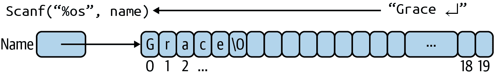
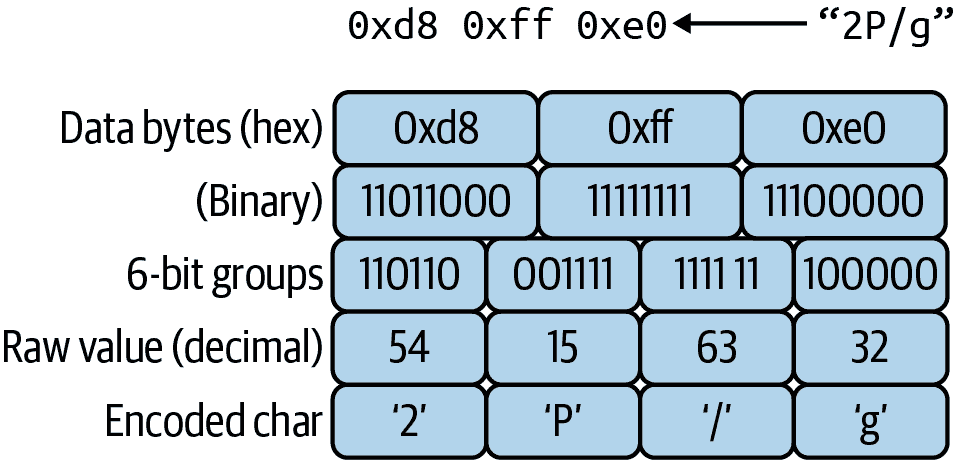

# 第四章\. 位与（大量的）字节

在我们开始使用像函数这样的更复杂程序之前，例如第五章，我们应该涵盖 C 语言中另外两种有用的存储类型：数组和单个位。这些不像`int`或`double`那样是真正的独立类型，但在处理微小事物或大量事物时非常有用。事实上，*数组*的概念，即项目的顺序列表，非常有用，我们在“获取用户输入”时不得不有所作弊，没有进行详细解释即使用它来存储字符串形式的用户输入。

我们还讨论了布尔值的概念，即是或否，真或假，1 或 0。特别是在处理微控制器时，您将定期使用一小组传感器或开关提供的开/关值。使用 C 的正常存储选项意味着将整个`char`（8 位）或`int`（16 位）用于跟踪这些微小值。这感觉有点浪费，确实如此。C 有一些技巧可以更有效地存储这类信息。在本章中，我们将通过声明数组来处理大事物，并访问和操作其内容，以及如何处理最小的位（咳咳）。 （我保证不再开更多位字谐音笑话。大部分时间。）

# 使用数组存储多个项

几乎不可能找到一个不使用数组解决真实世界问题的 C 程序。如果您必须处理任何类型的任何值的集合，这些值几乎肯定会最终进入数组中。成绩列表，学生列表，美国州缩写列表等等。即使是我们的微小机器也可以使用数组来跟踪 LED 条上的颜色。可以毫不夸张地说，数组在 C 中是无处不在的，因此让我们更仔细地看看如何使用它们。

## 创建和操作数组

正如我之前提到的，我们在第二章（在“获取用户输入”中）使用了数组以允许用户输入。让我们重新审视那段代码（[*ch04/hello2.c*](https://oreil.ly/HnAfB)）并更加关注字符数组：

```cpp
#include <stdio.h>

int main() {
  char name[20];

  printf("Enter your name: ");
  scanf("%s", name);
  printf("Well hello, %s!\n", name);
}
```

那么，`char name[20]`声明究竟做了什么呢？它创建了一个名为“name”的变量，基本类型为`char`，但它是一个数组，因此您可以获得存储多个`char`的空间。在这种情况下，我们请求了 20 个字节，如图 4-1 所示。


###### 图 4-1\. 名为`name`的`char`类型空数组

当我们运行程序时，这个数组变量会发生什么情况？当你在键盘上输入一个名称并按回车键时，你输入的字符会被放置在数组中。由于我们使用了`scanf()`及其字符串(`%s`)格式字段，我们将自动获得一个标记字符串结尾的尾随空字符(`'\0'`或有时`'\000'`)。在内存中，`name`变量现在看起来像图 4-2。



###### 图 4-2\. 带有字符串的 char 数组

###### 注意

数组末尾的空字符是字符串的一个特殊之处；这并不是其他类型数组的管理方式。字符串通常存储在在字符串长度之前未知的数组中，并使用这个`'\0'`哨兵，就像我们在“while 语句”中标记有用输入的结尾一样。C 中的所有字符串处理函数都希望看到这个终止字符，并且在你自己处理字符串时可以依赖它的存在。

现在当我们在后续的`printf()`调用中再次使用`name`变量时，我们可以回显存储的所有字母，空字符告诉`printf()`何时停止，即使名称没有占据整个数组。相反，打印没有终止字符的字符串将导致`printf()`在数组结束后继续进行，并可能导致崩溃。

### 长度与容量

我们难道不是分配了 20 个字符的空间吗？如果我们的名称（如“Grace”）没有占据所有空间，它们会做什么？幸运的是，最后的空字符相当巧妙地解决了这个问题。确实，我们确实有足够的空间来存储更长的名称，如“Alexander”或者甚至“Grace Hopper”；无论数组有多大，空字符始终标志着字符串的结尾。

###### 警告

如果你之前没有在 C 或其他语言中使用过字符，那么空字符的概念可能会让人感到困惑。它是具有数字值 0（零）的字符。这与空格字符（ASCII 32）或数字 0（ASCII 48）或换行(`'\n'` ASCII 10)不同。通常情况下，你不必担心手动添加或放置这些空字符，但重要的是要记住它们出现在字符串的末尾，即使它们从不被打印。

但是如果名称对分配的数组来说太长怎么办？让我们找出来！再次运行程序并输入一个较长的名称：

```cpp
ch04$ ./a.out
Enter your name: @AdmiralGraceMurrayHopper
Well hello, @AdmiralGraceMurrayHopper!
*** stack smashing detected ***: terminated
Aborted (core dumped)
```

有趣。因此，我们声明的容量是一个相当严格的限制——如果我们溢出数组，事情就会出错。¹ 好好知道！在使用之前，我们总是需要保留足够的空间。²

如果我们不知道数组中有多少个槽位会怎样？C 的 `sizeof` 运算符可以帮助解决这个问题。它可以告诉你（以字节为单位）变量或类型的大小。对于简单类型，这是 `int`、`char` 或 `double` 的长度。对于数组，它是分配的总内存。这意味着只要知道其基本类型，我们就可以知道数组中有多少个槽位。让我们尝试创建一个 `double` 值数组，比如说，用于会计分类账。我们假装不知道能存储多少个值，并使用 `sizeof` 找出来。看一下 [*ch04/capacity.c*](https://oreil.ly/O3DfB)：

```cpp
#include <stdio.h>

int main() {
  double ledger[100];
  printf("Size of a double: %li\n", sizeof (double));
  printf("Size of ledger: %li\n", sizeof ledger);
  printf("Calculated ledger capacity: %li\n", sizeof ledger / (sizeof (double)));
}
```

注意，在询问类型的大小时，需要括号。编译器需要这额外的上下文来将关键字视为表达式。对于像 `ledger` 这样已经符合表达式定义的变量，我们可以省略它们。让我们运行我们的小程序。这是输出：

```cpp
ch04$ gcc capacity.c
ch04$ ./a.out
Size of a double: 8
Size of ledger: 800
Calculated ledger capacity: 100
```

不错。因为我们确实知道我们的数组有多大，所以我们可以直接将选择的大小与我们计算的结果进行比较。它们匹配。（哎呀！）但是有些情况下，你从独立的源获取信息，不会总是知道数组的大小。请记住像 `sizeof` 这样的工具存在并且可以帮助你理解这些信息。

### 初始化数组

到目前为止，我们已经创建了空数组或在运行时从用户输入中加载了 `char` 数组。与更简单的变量类型一样，C 允许在定义它们时初始化数组。

对于任何数组，你可以在一对花括号内提供一个由逗号分隔的值列表。以下是一些例子：

```cpp
int days_in_month[12] = { 31, 28, 31, 30, 31, 30, 31, 31, 30, 31, 30, 31 };
char vowels[6] = { 'a', 'e', 'i', 'o', 'u', 'y' };
float readings[7] = { 8.9, 8.6, 8.5, 8.7, 8.9, 8.8, 8.5 };
```

注意声明的数组大小与初始化数组时提供的值的数量匹配。在这种情况下，C 允许一个好用的简写：你可以在方括号之间省略显式大小。编译器将分配正确数量的内存以完全适应初始化列表。这意味着我们可以像这样重新编写我们之前的片段：

```cpp
int days_in_month[] = { 31, 28, 31, 30, 31, 30, 31, 31, 30, 31, 30, 31 };
char vowels[] = { 'a', 'e', 'i', 'o', 'u', 'y' };
float readings[] = { 8.9, 8.6, 8.5, 8.7, 8.9, 8.8, 8.5 };
```

字符串是一个特殊情况。C 支持 *字符串字面量* 的概念。这意味着你可以将双引号之间的字符序列作为值使用。你可以使用字符串字面量来初始化一个 `char[]` 变量。你几乎可以在任何允许使用字符串变量的地方使用它。（我们在 “三元操作符和条件赋值” 中看到了这一点，我们使用了三元操作符 (`?:`) 将 true 和 false 值打印为单词，而不是作为 1 或 0。）

```cpp
// Special initialization of a char array with a string literal
char secret[] = "password1";

// The printf() format string is usually a string literal
printf("Hello, world!\n");

// And we can print literals, too
printf("The value stored in %s is '%s'\n", "secret", secret);
```

你也可以通过在花括号内提供单个字符来初始化字符串，但这通常更难阅读。你必须记得包括终止的空字符，而这种冗长的选项并没有提供其他真正的优势，超过了使用字符串字面量。

### 访问数组元素

一旦您创建了一个数组，您可以使用方括号访问数组内部的单个元素。在方括号内给出一个索引数字，其中第一个元素的索引值为 0。例如，要打印出先前数组中的第二个元音字母或七月份的天数：

```cpp
  printf("The second vowel is: %c\n", vowels[1]);
  printf("July has %d days.\n", days_in_month[6]);
```

如果将这些语句捆绑到一个完整的程序中，它们将产生以下输出：

```cpp
The second vowel is: e
July has 31 days.
```

但我们在方括号内提供的值不需要是一个固定的数字。它可以是任何导致整数的表达式（如果内存足够，它可以是一个`long`或其他更大的整数类型）。这意味着您可以将计算或变量用作您的索引。例如，如果我们将“当前月份”存储在一个变量中，并使用月份的典型值——1 表示一月，2 表示二月，依此类推——那么我们可以使用以下代码打印出七月的天数：

```cpp
  int month = 7;
  printf("July (month %d) has %d days.", month, days_in_month[month - 1]);
```

访问这些成员的便利性和灵活性是数组如此受欢迎的一部分。经过一些实践，您会发现它们是不可或缺的！

###### 警告

方括号内的值需要“在边界内”，否则您将在运行时收到错误消息。例如，如果您尝试打印第 15 个月的天数，就像我们尝试七月那样，您会看到类似“无效（第 15 个月）有-1574633234 天”的消息。C 不会阻止您——请注意我们没有导致崩溃——但我们也没有得到可用的值。而*赋值*无效数组中的值（接下来我们将讨论的内容）是如何导致*缓冲区溢出*的。这种经典的安全漏洞因数组作为存储缓冲区的概念而得名。您“溢出”它正是通过给数组分配超出实际数组范围之外的值。如果您运气好（或非常狡猾），您可以编写可执行代码，并欺骗计算机运行您的命令而不是预期的程序。

### 更改数组元素

您还可以使用方括号表示法更改给定数组位置的值。例如，我们可以改变二月的天数以适应闰年：

```cpp
if (year % 4 == 0) {
  // Forgive the naive leap year calculation :)
  days_in_month[1] = 29;
}
```

当您有更加动态的数据时，这种后声明的赋值非常方便（甚至经常是必需的）。例如，对于稍后要讨论的 Arduino 项目，您可能希望保留最近的 10 次传感器读数。当您声明数组时，并没有这些读数。因此，您可以设置 10 个槽位，并稍后填入：

```cpp
float readings[10];
// ... interesting stuff goes here to set up the sensor and read it
readings[7] = latest_reading;
```

只需确保您提供与数组相同类型的值（或至少是兼容的）。例如，我们的`readings`数组期望浮点数。如果我们将字符分配给其中一个槽位，它将“适合”在该槽位中，但会产生一个奇怪的答案。例如，将字母`*x*`分配给`readings[8]`将会将小写 x 的 ASCII 值（120）作为 120.0 的`float`值放入槽位中。

### 通过数组迭代

使用变量作为索引的能力使得处理整个数组成为一个简单的循环任务。例如，我们可以使用`for`循环打印出所有`days_in_month`的计数：

```cpp
for (int m = 0; m < 12; m++) {
  // remember the array starts at 0, but humans start at 1
  printf("Days in month %d is %d.\n", m + 1, days_in_month[m]);
}
```

这个代码片段产生了以下输出。我们可以感受到数组和循环组合的强大潜力。仅仅几行代码，我们就得到了一些相当有趣的输出：

```cpp
Days in month 1 is 31.
Days in month 2 is 28.
Days in month 3 is 31.
Days in month 4 is 30.
Days in month 5 is 31.
Days in month 6 is 30.
Days in month 7 is 31.
Days in month 8 is 31.
Days in month 9 is 30.
Days in month 10 is 31.
Days in month 11 is 30.
Days in month 12 is 31.
```

你可以自由地使用数组的元素，以任何你需要的方式。你并不仅仅局限于打印它们出来。例如，我们可以计算我们的`readings`数组的平均阅读值，如下所示：

```cpp
float readings[] = { 8.9, 8.6, 8.5, 8.7, 8.9, 8.8, 8.5 };

// Use our sizeof trick to get the number of elements
int count = sizeof readings / sizeof (float);
float total = 0.0;
float average;
for (int r = 0; r < count; r++) {
  total += readings[r];
}
average = total / count;
printf("The average reading is %0.2f\n", average);
```

此示例突显了你在几章中学到的 C 语言有多少！如果你想要更多的练习，将这个代码片段构建成一个完整的程序。编译并运行它以确保它能正常工作。（顺便说一句，平均值应为 8.70。）然后添加更多的变量来捕获最高和最低的读数。你将需要一些`if`语句来帮助你。你可以在本章的示例*arrays.c*中看到一个可能的解决方案。

## 字符串回顾

我已经指出字符串实际上只是一些由语言本身支持的额外特性组成的`char`类型的数组，例如字面量。但由于字符串代表了与用户交流的最简单方式，我想更强调在 C 语言中你可以用字符串做些什么。

### 初始化字符串

我们已经看到如何声明和初始化字符串。如果你事先知道字符串的值，你可以使用字面量。如果你不知道值，你仍然可以声明变量，然后使用`scanf()`询问用户要存储的文本是什么。但如果你两者都想做怎么办？分配一个初始默认值，然后让用户提供一个可选的新值来覆盖默认值？

幸运的是，你可以做到，但你确实需要提前计划一下。当你首次声明变量时，可能会诱人地使用默认值，然后在运行时让用户提供不同的值。这样做是有效的，但它需要向用户提出额外的问题（“您想更改背景颜色吗，是或否？”），并且还假设用户将提供一个有效的替代值。在学习新语言时，这种假设通常是安全的，因为在那时你可能是唯一的用户。但在与他人共享的程序中，最好不要假设用户会做什么。

字符串字面量也让人很容易认为你可以像对`int`或`float`变量那样简单地覆盖现有的字符串。但字符串实际上只是一个`char[]`，而数组在声明时以外的情况下是不可分配的。

所有这些限制都可以通过使用诸如函数之类的东西来克服，我们将在第五章中探讨这些内容。事实上，使运行时操作字符串成为可能的函数的需求如此之大，它们已经被打包成了它们自己的库，我在“stdlib.h”中介绍了这一点。

现在，我希望你记住，字符串文字可以使字符数组的初始化简单和易读，但在其核心，C 中的字符串与数字和个别字符不同。

### 访问个别字符

但我确实想再次强调，字符串只是数组。你可以使用与访问任何其他数组成员相同的语法访问字符串中的个别字符。例如，我们可以通过查看短语中的每个字符来找出给定短语是否包含逗号。这里是[*ch04/comma.c*](https://oreil.ly/UWgY6)：

```cpp
#include <stdio.h>

int main() {
  char phrase[] = "Hello, world!";
  int i = 0;
  // keep looping until the end of the string
  while (phrase[i] != '\0') {
    if (phrase[i] == ',') {
      printf("Found a comma at position %d.\n", i);
      break;
    }
    // try the next character
    i++;
  }
  if (phrase[i] == '\0') {
    // Rats. Made it to the end of the string without a match.
    printf("No comma found in %s\n", phrase);
  }
}
```

该程序实际上多次使用了字符串的数组性质。我们的循环条件取决于访问字符串中的单个字符，就像帮助回答我们最初问题的`if`条件一样。最后，我们测试单个字符以查看是否找到了某些内容。在第七章中，我们将查看几个与字符串相关的函数，但希望您能看到如何使用循环和方括号一次处理一个字符来完成诸如复制或比较字符串之类的任务。

## 多维数组

由于字符串已经是数组，可能并不明显，但你可以在 C 中存储字符串数组。但是因为在声明这种数组时没有“字符串类型”可供使用，你该如何做呢？事实证明，C 支持*多维数组*的概念，因此你可以创建一个`char[]`数组，就像创建其他数组一样：

```cpp
char month_names[][];
```

看起来很公平。但在声明中不明显的是方括号对是指什么。在声明这样一个二维数组时，第一个方括号对可以被理解为行索引，第二个是列。另一种思考方式是，第一个索引告诉你*有多少*个字符数组我们将存储，第二个索引告诉你每个数组*可以有多长*。

我们知道有多少个月份，并且一些研究告诉我们，最长的名称是九个字母的“九月”。再加上一个终止的空字符，我们可以像这样精确地定义我们的`month_names`数组：

```cpp
char month_names[12][11];
```

由于我们知道月份的名称并且不需要用户输入，您也可以初始化这个二维数组：

```cpp
char month_names[12][11] = {
  "January", "February", "March", "April", "May", "June", "July",
  "August", "September", "October", "November", "December"
};
```

但在初始化时，我使用了字符串文字，所以`month_names`数组的第二维度不太明显。第一维是月份，第二个（隐藏的）维度是构成月份名称的个别字符。如果你使用其他没有这种字符串文字快捷方式的数据类型，可以像这样使用嵌套的花括号列表：

```cpp
int multiplication[5][5] = {
  { 0, 0, 0,  0,  0 },
  { 0, 1, 2,  3,  4 },
  { 0, 2, 4,  6,  8 },
  { 0, 3, 6,  9, 12 },
  { 0, 4, 8, 12, 16 }
};
```

或许你会认为编译器可以确定多维结构的大小，但遗憾的是，你必须为除第一维以外的每个维度提供容量。例如，对于我们的月份名称，我们可以开始时没有“12”表示名称数量，但不能没有“11”表示任何单个名称的最大长度：

```cpp
// This shortcut is ok
char month_names[][11] = { "January", "February" /* ... */ };

// This shortcut is NOT
char month_names[][] = { "January", "February" /* ... */ };
```

你最终会内化这些规则，但编译器（以及许多编辑器）将始终在那里捕捉你如果你犯了一个小错误。

## 访问多维数组中的元素

对于我们的月份名称数组，获取任何特定月份的访问是直接的。它看起来就像访问任何其他一维数组的元素一样：

```cpp
printf("The name of the first month is: %s\n", month_names[0]);

// Output: The name of the first month is: January
```

但是我们如何访问`multiplication`二维数组中的元素呢？我们使用两个索引：

```cpp
printf("Looking up 3 x 4: %d\n", multiplication[3][4]);

// Output: Looking up 3 x 4: 12
```

注意，在这个乘法表中，将零作为第一个索引值的潜在奇怪用法实际上是一个有用的元素。索引“0”给我们一个有效的乘法答案行或列。

而使用两个索引，如果你想打印出所有数据，你将需要两个循环。我们可以利用我们在“嵌套循环和表格”中所做的工作，用它来访问我们存储的值，而不是直接生成数字。这是来自[*ch04/print2d.c*](https://oreil.ly/3gr8L)的打印片段：

```cpp
  for (int row = 0; row < 5; row++) {
    for (int col = 0; col < 5; col++) {
      printf("%3d", multiplication[row][col]);
    }
    printf("\n");
  }
```

这是我们精美格式化的表格：

```cpp
ch04$ gcc print2d.c
ch04$ ./a.out
  0  0  0  0  0
  0  1  2  3  4
  0  2  4  6  8
  0  3  6  9 12
  0  4  8 12 16
```

我们将在第六章中看到一些其他选项，用于更加定制的多维存储。在短期内，只需记住你可以用更多的方括号对创建更多维度。虽然你大部分时间可能会使用一维数组，但表格是足够常见的，空间数据通常适合三维“立方体”。很少有程序员会需要它，尤其是那些专注于微控制器的人，但 C 语言支持更高阶的数组。

# 存储位

数组使我们能够相对轻松地存储大量数据。在另一端，C 语言有几个运算符可以用来操作非常少量的数据。事实上，你可以处理绝对最小的数据单元：个别位。

当 C 语言在 20 世纪 70 年代开发时，每个字节的内存都很昂贵，因此宝贵。正如我在本章开头提到的，如果你有一个特定的变量存储布尔答案，使用 16 位的`int`或甚至只有 8 位的`char`会有点浪费。如果你有一个这样的变量数组，那就会变得非常浪费。现在的台式电脑可以轻松处理这种浪费，但我们的微控制器通常需要尽可能节约存储空间。

## 二进制、八进制、十六进制

在我们讨论 C 语言中访问和操作位的操作符之前，让我们回顾一些讨论二进制值的符号。如果我们有一个单独的位，0 或 1 足以，这很简单。然而，如果我们想在一个`int`变量中存储十二个位，我们需要一种描述该`int`值的方法。技术上，`int`将具有十进制（十进制）表示，但十进制不能清晰地映射到单独的位。为此，八进制和十六进制表示法要清晰得多。（二进制，或者二进制 2 进制，表示法显然最清晰，但是大数在二进制中变得非常长。八进制和十六进制——通常只是“hex”——是一个很好的折衷方案。）

当我们谈论数字时，我们经常隐含地使用十进制，这要归功于我们手上的数字（哦，明白了吗？）。计算机没有手（当然不包括机器人），不使用十进制计数。它们使用二进制。两个数字，0 和 1，构成了它们整个世界的基础。如果将三个二进制数字分组，可以表示从 0 到 7 的十进制数，总共八个数字，因此这是八进制，或八进制。添加第四位，可以表示 0 到 15，这覆盖了十六进制中的单个“数字”。表 4-1 显示了这些四个基数中的前 16 个值。

表 4-1\. 十进制、二进制、八进制和十六进制的数字

| 十进制 | 二进制 | 八进制 | 十六进制 |  | 十进制 | 二进制 | 八进制 | 十六进制 |
| --- | --- | --- | --- | --- | --- | --- | --- | --- |
| ` 0` | `0000 0000` | `000` | `0x00` |  | ` 8` | `0000 1000` | `010` | `0x08` |
| ` 1` | `0000 0001` | `001` | `0x01` |  | ` 9` | `0000 1001` | `011` | `0x09` |
| ` 2` | `0000 0010` | `002` | `0x02` |  | `10` | `0000 1010` | `012` | `0x0A / 0x0a` |
| ` 3` | `0000 0011` | `003` | `0x03` |  | `11` | `0000 1011` | `013` | `0x0B / 0x0b` |
| ` 4` | `0000 0100` | `004` | `0x04` |  | `12` | `0000 1100` | `014` | `0x0C / 0x0c` |
| ` 5` | `0000 0101` | `005` | `0x05` |  | `13` | `0000 1101` | `015` | `0x0D / 0x0d` |
| ` 6` | `0000 0110` | `006` | `0x06` |  | `14` | `0000 1110` | `016` | `0x0E / 0x0e` |
| ` 7` | `0000 0111` | `007` | `0x07` |  | `15` | `0000 1111` | `017` | `0x0F / 0x0f` |

你可能注意到，我总是在二进制列中显示八个数字，八进制列中显示三个数字，十六进制列中显示两个数字。字节（8 位）是在 C 语言中常用的单位。二进制数字通常以四个一组显示，组数取决于所讨论的最大数。因此，对于完整的 8 位字节，可以存储 0 到 255 的任何值，例如，您会看到一个二进制值，其中包含两组四位数字。同样，三位数的八进制值可以显示任何字节的值，十六进制数需要两位数。还要注意，十六进制文字不区分大小写。（十六进制前缀中的“x”也不区分大小写，但大写的“X”可能较难辨认。）

在本书后半部分与微控制器一起工作时，我们会偶尔使用二进制表示法，但如果你写过任何 HTML、CSS 或类似的标记语言中的样式文本，你可能已经遇到过十六进制数。这些文档中的颜色通常用十六进制的字节值表示红色、绿色、蓝色以及偶尔的 alpha 通道（透明度）。因此，一个忽略 alpha 通道的全红色将是`FF0000`。现在你知道两个十六进制数字可以表示一个字节，读取这样的颜色值可能会更容易。

为了帮助你适应这些不同的进制，试着填写表 4-2 中缺失的数值。（你可以通过章节末的表 4-4 表来检查你的答案。顺便说一句，这些数字并没有特定的顺序，我想让你保持警觉！）

表 4-2\. 各进制间的转换

| 十进制 | 二进制 | 八进制 | 十六进制 |
| --- | --- | --- | --- |
| `14` |  | `016` |  |
|  | `0010` `0000` |  |  |
|  |  | `021` | `11` |
| `50` |  |  | `32` |
|  |  | `052` |  |
|  |  |  | `13` |
| `167` |  |  |  |
|  | `1111 1001` |  |  |

现代浏览器可以在搜索栏中为您转换进制，因此您可能不需要记住字节中可能的 256 个值的全部内容。但是，如果您可以估算十六进制值的大小或确定八进制 ASCII 码可能是字母还是数字，这仍然会很有用。

## C 语言中的八进制和十六进制文字

C 语言有特殊选项用于表示八进制和十六进制的数值文字。八进制文字以简单的 0 作为前缀开始，尽管如果你保持所有值的宽度相同，你可以有多个零，就像我们在基础表中所做的那样。对于十六进制值，你使用前缀`0x`或`0X`。通常情况下，你匹配‘X’字符的大小写与十六进制值中的任何`A-F`数字的大小写相匹配，但这只是一种约定。

这是一个演示如何使用一些这些前缀的片段：

```cpp
int line_feed = 012;
int carriage_return = 015;
int red = 0xff;
int blue = 0x7f;
```

一些编译器支持用于表示二进制文字的非标准前缀或后缀，但正如“非标准”修饰符所示，它们不是官方 C 语言的一部分。

## 八进制和十六进制值的输入输出

`printf()`函数具有内置的格式说明符，帮助你生成八进制或十六进制输出。八进制值可以用`%o`说明符打印，十六进制可以用`%x`或`%X`显示，取决于你想要小写还是大写输出。这些说明符可以与任何整数类型的变量或表达式一起使用，在任何基数中，这使得`printf()`成为从十进制到八进制或十六进制的一种相当简单的转换方式。我们可以很容易地通过循环和单个`printf()`生成类似于表 4-1（没有二进制列）的表格。我们可以利用格式说明符的宽度和填充选项来获取我们想要的三个八进制数字和两个十六进制数字。看看[*ch04/dec_oct_hex.c*](https://oreil.ly/59f56)：

```cpp
#include <stdio.h>

int main() {
  printf(" Dec  Oct  Hex\n");
  for (int i = 0; i < 16; i++) {
    printf(" %3d  %03o  0x%02X\n", i, i, i);
  }
}
```

请注意，我们在每个三列中都重复使用了完全相同的变量。还请注意，在打印十六进制版本时，我手动添加了“0x”前缀——它不包括在`%x`或`%X`格式中。这里有几行的第一行和最后一行：

```cpp
ch04$ gcc dec_oct_hex.c
ch04$ ./a.out
 Dec  Oct  Hex
   0  000  0x00
   1  001  0x01
   2  002  0x02
   3  003  0x03
 ...
  13  015  0x0D
  14  016  0x0E
  15  017  0x0F
```

不错。正是我们想要的输出。在输入方面，使用`scanf()`，格式说明符以有趣的方式工作。它们仍然用于从用户那里获取数字输入。现在不同的说明符将在你输入的数字上执行基数转换。如果指定了十进制输入（`%d`），则不能使用十六进制值。相反，如果指定了十六进制输入（`%x`或`%X`），并且只输入数字（即，不使用任何`A-F`数字），该数字仍将从十六进制转换。

###### 注意

说明符`%d`和`%i`通常是可以互换的。在`printf()`调用中，它们将产生相同的输出。但是，在`scanf()`调用中，`%d`选项要求你输入一个简单的十进制数。`%i`说明符允许你使用各种 C 文字前缀来输入不同基数的值，例如`0x`来输入十六进制数。

我们可以通过一个简单的转换程序来说明这一点，[*ch04/rosetta.c*](https://oreil.ly/NU9Wc)，它将不同的输入转换为所有三个输出基。我们可以在程序中设置我们期望的输入类型，但是使用`if/else if/else`块使其易于调整。（尽管仍然需要重新编译。）

```cpp
#include <stdio.h>

int main() {
  char base;
  int input;

  printf("Convert from? (d)ecimal, (o)ctal, he(x): ");
  scanf("%c", &base);

  if (base == 'o') {
    // Get octal input
    printf("Please enter a number in octal: ");
    scanf("%o", &input);
  } else if (base == 'x') {
    // Get hex input
    printf("Please enter a number in hexadecimal: ");
    scanf("%x", &input);
  } else {
    // assume decimal input
    printf("Please enter a number in decimal: ");
    scanf("%d", &input);
  }
  printf("Dec: %d,  Oct: %o,  Hex: %x\n", input, input, input);
}

```

这里有几个示例运行：

```cpp
ch04$ gcc rosetta.c

ch04$ ./a.out
Convert from? (d)ecimal, (o)ctal, he(x): d
Please enter a number in decimal: 55
Dec: 55,  Oct: 67,  Hex: 37

ch04$ ./a.out
Convert from? (d)ecimal, (o)ctal, he(x): x
Please enter a number in hexadecimal: 37
Dec: 55,  Oct: 67,  Hex: 37

ch04$ ./a.out
Convert from? (d)ecimal, (o)ctal, he(x): d
Please enter a number in decimal: 0x37
Dec: 0,  Oct: 0,  Hex: 0
```

有趣。前两次运行按计划进行了。第三次运行没有出现错误，但实际上也没有真正工作。这里发生的是`scanf()`的一种“特性”。它非常努力地尝试引入一个十进制数。它在我们的输入中找到了字符*0*，这是一个有效的十进制数字，因此它开始解析该字符。但接下来它遇到了*x*字符，这对于十进制数不是有效的。所以这就是解析的结束，我们的程序将值 0 转换为这三个基数。

尝试自己运行这个程序，然后几次切换模式。你得到了你期望的行为吗？你能引发任何错误吗？

知道了 `%i` 与 `scanf()` 中其他数值规范之间的差异，你能看到如何简化这个程序吗？可以接受任何三种输入基数而不需要大量的 `if` 语句。我把这个问题留给你做为练习，但是你可以在本章的代码示例中的 *rosetta2.c* 文件中找到一个可能的解决方案。

## 位操作符

在像 C 语言这样的有限硬件上开始工作意味着偶尔需要在位级别上处理数据，与打印或读取二进制数据完全不同。C 语言通过*位操作符*支持此类工作。这些操作符允许你在 `int` 变量（当然也包括 `char` 或 `long`）内部调整单个位。我们将在第十章中看到这些特性在 Arduino 微控制器中的一些有趣用途。

表格 4-3 描述了这些操作符，并展示了使用以下两个变量的一些示例：

```cpp
char a = 0xD; // 1101 in binary
char b = 0x7; // 0111 in binary
```

表格 4-3\. C 语言中的位操作符

| 操作符 | 名称 | 描述 | 示例 |
| --- | --- | --- | --- |
| & | 按位与 | 两个位都必须为 1 才能返回 1 | a & b == 0101 |
| &#124; | 按位或 | 任一位可以为 1 以返回 1 | a &#124; b == 1111 |
| ! | 按位非 | 返回输入位的相反值 | ~a == 0010 |
| ^ | 按位异或 | 异或，不匹配的位返回 1 | a ^ b == 1010 |
| << | 左移 | 将位向左移动若干位 | a << 3 == 0110 1000 |
| >> | 右移 | 将位向右移动若干位 | b >> 2 == 0001 |

技术上，你可以对任何变量类型应用位操作符以调整特定位。尽管如此，它们很少用于浮点类型。通常选择一个足够大的整数类型来保存所需的每个单独位。因为它们在给定变量的位上“编辑”，所以你经常会看到它们与复合赋值操作符 (`op=`) 一起使用。例如，如果你有五个 LED 灯，你可以用单个 `char` 类型变量来跟踪它们的开关状态，就像这个片段中一样：

```cpp
char leds = 0;  // Start with everyone off, 0000 0000

leds |= 8;    // Turn on the 4th led from the right, 0000 1000
leds ^= 0x1f; // Toggle all lights, 0001 0111
leds &= 0x0f; // Turn off 5th led, leave others as is, 0000 0111
```

即使在只有一两千字节内存的微控制器上运行或存储程序时，五个 `int` 或 `char` 值可能不会影响到你，但是这些小的存储需求确实会累积起来。如果你正在跟踪拥有数百或数千个灯的面板的状态，那么你存储它们的状态有多紧密就很重要了。一个尺寸很少适合所有情况，所以请记住你的选择，并选择一个在使用便捷性和任何资源限制之间取得平衡的选项。

# 混合位和字节

现在我们已经掌握了足够多的 C 语言元素，可以开始编写一些非常有趣的代码了。我们可以结合之前讨论过的位、数组、类型、循环和分支来处理一种流行的将二进制数据编码为文本的方式。一种通过设备网络传输二进制数据并且资源可能有限的格式是将其转换为简单的文本行。这被称为“base64”编码，仍然被用于诸如内联电子邮件附件中的图像等情况。64 表示此编码使用 6 位块，2 的 6 次方等于 64。我们使用了数字、小写字母、大写字母和其他字符，通常是加号（`+`）和正斜杠（`/`）。³

对于这种编码，值从 0 到 25 是大写字母 A 到 Z。值从 26 到 51 是小写字母 a 到 z。值从 52 到 61 是数字 0 到 9，最后，值 62 是加号，值 63 是正斜杠。

但是字节不是 8 位长吗？是的，它们是。这正是我们最近所有主题的应用之处！我们可以利用这些新知识将这些 8 位块转换为 6 位块。

图 4-3 展示了将三个字节转换为 base64 文本字符串的简单示例。这些恰好是有效 JPEG 文件的前几个字节，但你可以使用任何源来进行工作。当然，这只是一个相对简单的二进制数据示例，但它将验证我们的算法。



###### 图 4-3\. 将 8 位转换为 6 位块进行编码

在我们的示例中，总共有九个字节需要编码，但实际上我们只需每次处理三个字节，就像插图中所示，并重复此过程。听起来像是循环的工作！我们可以使用任何循环结构，但我们将使用 `for` 循环，因为我们知道从哪里开始和结束，并且可以每次增加三个字节。我们将从源数组中取出三个字节到三个变量中，这只是为了讨论方便。

```cpp
unsigned char source[9] = { 0xd8,0xff,0xe0,0xff,0x10,0x00,0x46,0x4a,0x46 };
char buffer[4] = { 0, 0, 0, 0 };

for (int i = 0; i < 9; i += 3) {
  unsigned char byte1 = source[i];
  unsigned char byte2 = source[i + 1];
  unsigned char byte3 = source[i + 2];
  // ...
}
```

下一个重要步骤是将四个 6 位块放入我们的 `buffer` 中。我们可以使用位操作符来获取我们需要的内容。回顾一下 表 4-3。`byte1` 的最左边的六位组成了我们的第一个 6 位块。在这种情况下，我们可以将这六位向右移动两个空位：

```cpp
  buffer[0] = byte1 >> 2;
```

不错！一个完成，还剩三个。然而，第二个 6 位块有点混乱，因为它使用了 `byte1` 的剩余两位和 `byte2` 的四位。有几种方法可以解决这个问题，但我们将按顺序处理位，并将分配到`buffer`的下一个插槽分为两个步骤：

```cpp
  buffer[1] = (byte1 & 0x03) << 4;   
  buffer[1] |= (byte2 & 0xf0) >> 4;  
```


首先，从 `byte1` 中取出右两位，并向左移动四个空位，为我们的 6 位块腾出空间。


现在，从`byte2`的左四位取出，将其右移四个空间，并将其放入`buffer[1]`中，而不干扰该变量的上半部分。

过半啦！我们可以对第三个 6 位块做类似的事情：

```cpp
  buffer[2] = (byte2 & 0x0f) << 2;
  buffer[2] |= (byte3 & 0xc0) >> 6;
```

在这种情况下，我们取出并将`byte2`的右四位向右移动两个槽位，以为`byte3`的左两位空出空间。但与之前一样，我们首先必须将这两位向右移动到最右边。我们的最后一个 6 位块又是一个简单的情况。我们只需要`byte4`的右六位，无需移动：

```cpp
  buffer[3] = byte3 & 0x3f;
```

欢呼！我们成功完成了 3x8 位到 4x6 位的转换！现在我们只需要打印出我们`buffer`数组中的每个值。听起来又像是一个循环。如果你还记得我们有五个基于 64 进制的“数字”范围，那就需要某种条件判断。我们可以在`switch`语句中列出所有 64 种情况，但那感觉很乏味。（至少它会很自我说明。）一个`if/else if`链应该很好用。在任何特定分支内部，我们将进行一些字符数学运算以获得正确的值。在阅读下面的片段时，看看你能否弄清楚这些字符数学是如何发挥魔力的：

```cpp
  for (int b = 0; b < 4; b++) {
    if (buffer[b] < 26) {
      // value 0 - 25, so uppercase letter
      printf("%c", 'A' + buffer[b]);
    } else if (buffer[b] < 52) {
      // value 26 - 51, so lowercase letter
      printf("%c", 'a' + (buffer[b] - 26));
    } else if (buffer[b] < 62) {
      // value 52 - 61, so a digit
      printf("%c", '0' + (buffer[b] - 52));
    } else if (buffer[b] == 62) {
      // our "+" case, no need for math, just print it
      printf("+");
    } else if (buffer[b] == 63) {
      // our "/" case, no need for math, just print it
      printf("/");
    } else {
      // Yikes! Error. We should never get here.
      printf("\n\n Error! Bad 6-bit value: %c\n", buffer[b]);
    }
  }
```

字符数学有意义吗？由于`char`是一种整数类型，你可以对字符“加法”。如果我们对字符*A*加一，我们得到*B*。对*A*加二，我们得到*C*，依此类推。对于小写字母和数字，我们首先必须重新调整我们缓冲的值，使其处于从零开始的范围内。最后两种情况很简单，因为我们有一个值直接映射到一个字符。希望我们永远不会触发我们的`else`子句，但这些子句确实是为了处理这种情况的。如果我们做错了什么，打印一个警告！

哇！这些都是一些令人印象深刻的动作部件。如果你想要制造与其他微小设备或云端通信的微小设备，比如一台小型安全摄像头将图片发送到你的手机，这些正是你将会遇到的动作部件。

让我们把它们汇集在一个列表中（[*ch04/encode64.c*](https://oreil.ly/Ibp52)），与我们需要的其他 C 程序位一起：

```cpp
#include <stdio.h>

int main() {
  // Manually specify a few bytes to encode for now
  unsigned char source[9] = { 0xd8,0xff,0xe0,0xff,0x10,0x00,0x46,0x4a,0x46 };
  char buffer[4] = { 0, 0, 0, 0 };

  // sizeof(char) == 1 byte, so the array's size in bytes is also its length
  int source_length = sizeof(source);
  for (int i = 0; i < source_length; i++) {
    printf("0x%02x ", source[i]);
  }
  printf("==> ");
  for (int i = 0; i < source_length; i += 3) {
    unsigned char byte1 = source[i];
    unsigned char byte2 = source[i + 1];
    unsigned char byte3 = source[i + 2];

    // Now move the appropriate bits into our buffer
    buffer[0] = byte1 >> 2;
    buffer[1] = (byte1 & 0x03) << 4;
    buffer[1] |= (byte2 & 0xf0) >> 4;
    buffer[2] = (byte2 & 0x0f) << 2;
    buffer[2] |= (byte3 & 0xc0) >> 6;
    buffer[3] = byte3 & 0x3f;

    for (int b = 0; b < 4; b++) {
      if (buffer[b] < 26) {
        // value 0 - 25, so uppercase letter
        printf("%c", 'A' + buffer[b]);
      } else if (buffer[b] < 52) {
        // value 26 - 51, so lowercase letter
        printf("%c", 'a' + (buffer[b] - 26));
      } else if (buffer[b] < 62) {
        // value 52 - 61, so a digit
        printf("%c", '0' + (buffer[b] - 52));
      } else if (buffer[b] == 62) {
        // our "+" case, no need for math, just print it
        printf("+");
      } else if (buffer[b] == 63) {
        // our "/" case, no need for math, just print it
        printf("/");
      } else {
        // Yikes! Error. We should never get here.
        printf("\n\n Error! Bad 6-bit value: %c\n", buffer[b]);
      }
    }
  }
  printf("\n");
}
```

正如我一直鼓励的那样，你可以自己输入程序，做任何你想要的调整或添加任何注释以帮助你记住你学到的东西。你也可以编译*encode64.c*文件，然后运行它。这里是输出：

```cpp
ch04$ gcc encode64.c
ch04$ ./a.out
0xd8 0xff 0xe0 0xff 0x10 0x00 0x46 0x4a 0x46  ==> 2P/g/xAARkpG
```

非常、非常酷。顺便说一句，恭喜！那是一小段不平凡的代码。你应该感到自豪。但是如果你想真正测试一下自己的技能，请尝试编写自己的解码器来反转这个过程。如果你从上面的输出开始，你能得到原始的九个字节吗？（你可以将你的答案与我的对比：[*ch04/decode64.c*](https://oreil.ly/exGqM)。）

# 转换答案

无论你是否尝试解码 base64 编码的字符串，希望你尝试自己转换 Table 4-2 中的值。你可以在这里比较你的答案。或者使用*rosetta.c*程序！

表 4-4\. 基数转换答案

| Decimal | Binary | Octal | Hexadecimal |
| --- | --- | --- | --- |
| 14 | 0000 1110 | 016 | 0E |
| 32 | 0010 0000 | 040 | 20 |
| 17 | 0001 0001 | 021 | 11 |
| 50 | 0011 0010 | 062 | 32 |
| 42 | 0010 1010 | 052 | 2A |
| 35 | 0001 0011 | 023 | 13 |
| 167 | 1010 0111 | 247 | A7 |
| 249 | 1111 1001 | 371 | F9 |

# 下一步

C 语言对简单数组的支持为几乎任何类型的数据提供了广泛的存储和检索选项。但是你必须注意你希望使用的元素数量，但在这些边界内，C 语言的数组非常高效。如果你只存储小的、是或否、开或关类型的值，C 语言有几个操作符使得可能将这些值挤入像`int`这样的大数据类型的各个位中。现代桌面计算机很少需要那么详细的关注，但我们在本书后半部分的一些 Arduino 选项非常重视这些细节！

那接下来呢？嗯，我们的程序变得足够有趣，我们将希望开始将逻辑分解成可管理的片段。举个例子，想想这本书。它不是由一个过长的跑题句组成的。它被分成章节。这些章节又分成小节。小节被分成段落。通常来说，讨论一个单独的段落比讨论整本书更容易。C 语言允许你对自己的逻辑进行这种类型的分解。一旦你把逻辑分解成易消化的块，你就可以像我们一直在用`printf()`和`scanf()`函数一样使用这些块。让我们深入吧！

¹ 究竟如何出错可能各不相同。你的操作系统或版本、编译器版本，甚至是运行时系统的条件都会影响输出。关键是要小心不要溢出你的数组。

² `gcc`的`stack-protector`选项可以用于检测一些缓冲区溢出，并在溢出被恶意使用之前终止程序。这是一个默认关闭的编译时标志。

³ 作为额外字符对的一个示例，*base64url* 变体使用减号（“-”）和下划线（“_”）。
