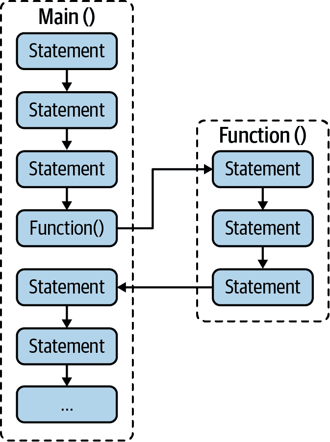
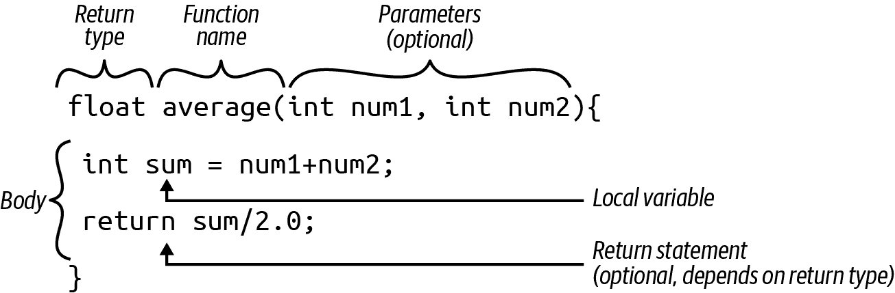
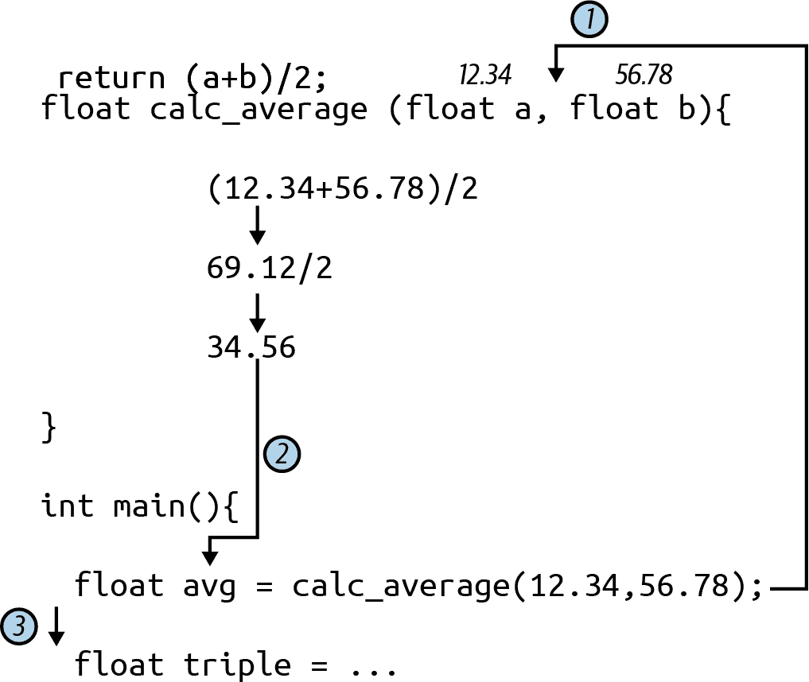
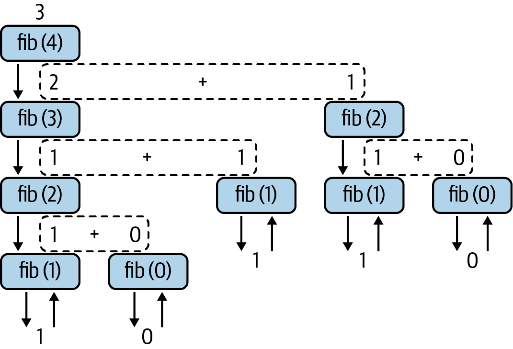

# 第五章：函数

通过我们迄今为止看到的各种赋值语句和控制流选项，您现在已经准备好解决几乎任何计算机问题了。但解决问题只是问题的一半。无论您是为工作还是为娱乐编码，您都不可避免地需要回到您已经编写的代码。您可能正在修复一个小错误或添加一个缺失的功能。您可能正在使用以前的项目作为新项目的起点。在所有这些时刻，代码的可维护性几乎与最初努力使代码工作一样重要。在解决问题时将问题分解以使其易于管理可能对您最终编写的代码产生有益影响——这也对其可读性和可维护性产生有益影响。

这个想法的核心是在解决整个问题的过程中解决较小的问题，这就是使用*函数*或*过程*。函数帮助您封装逻辑——您正在学习编码的语句和控制结构。在 C 中，您可以编写和调用您需要的任意多个函数。¹ C 实际上并不区分“函数”和“过程”这两个词，尽管有些语言区分。在这些语言中，区别通常在于一段代码是否返回一个值或仅执行一组语句。我将主要使用术语*函数*，但如果您在这里或在任何其他阅读中看到有关过程（或*例程*，同样的概念）的讨论，它仍然指的是一块代码，您可以从其他代码块中调用。

# 熟悉的函数

实际上，我们一直在使用函数。`main()`代码块就是一个函数。在我们的第一个“Hello, World”程序中，我们使用`printf()`函数生成一些输出。我们使用`scanf()`函数从用户那里获取输入。这两个函数都来自我们在程序中包含的`stdio.h`库。

# 函数流程

这些函数内部发生了什么？“调用”它们意味着什么？函数和过程是另一种流程控制形式。它们允许您以有序的方式在代码块之间跳转，并在完成后返回到您来自的位置。图 5-1 更正式地说明了这种流程。



###### 图 5-1。跟随函数的控制流

这种流程就是我所说的*调用*函数。您从当前语句到函数的第一条语句。您按照函数的方式工作（顺便说一句，函数可以包含对其他函数的调用），然后返回。在返回的过程中，您可以带上一个结果，但这是可选的。例如，我们不使用`printf()`和`scanf()`调用的任何返回值（虽然有一个，但我们可以安全地忽略它）。但是，我们确实依赖许多函数的返回值，例如判断两个字符串是否匹配，或者字符是否为数字，或者某个数字的平方根是多少。

我们将研究构成 C“标准库”的许多函数，在第七章中。但我们也不必仅依赖于标准函数。C 允许我们创建自己的函数。图 5-2 显示了函数的基本结构。



###### 图 5-2\. C 函数的基本部分

在本章中，我们将详细讨论函数这些关键部分的各种变化。

# 简单函数

C 函数的最简单形式是我们只跳转到函数，执行其语句，然后跳回。我们不传递任何信息，也不期望任何信息返回。这听起来可能有点无聊甚至浪费，但它可以非常有用，用于将大型程序分解为可管理的部分。它还可以使得重复使用常见代码块成为可能。例如，您的程序可能带有一些有用的说明。无论用户遇到问题时，您都可以将这些打印到屏幕上以帮助他们解决问题。您可以将这些说明放入一个函数中：

```cpp
void print_help() {
  printf("This program prints a friendly greeting.\n");
  printf("When prompted, you can type in a name \n");
  printf("and hit the return key. Max length is 24.\n");
}
```

注意我们函数的类型；它是一个新类型。这种*void*类型告诉编译器此函数没有返回值。C 的默认行为是返回一个像我们的`main()`函数一样的`int`，但函数可以返回 C 支持的任何类型的值，包括我们在这里做的无值返回。

C 中的函数名遵循与变量名相同的规则。必须以字母或下划线开头，然后可以有任意数量的字母、数字或下划线。与变量一样，也不能使用来自表 2-4 的任何保留字。

然后，我们可以在需要时调用此函数，来提醒用户或在他们请求帮助时。以下是程序的其余部分，[*ch05/help_demo.c*](https://oreil.ly/LilAh)。当程序启动时，我们将打印帮助信息，如果用户仅按下 Return 键时要求输入名称，我们将再次打印帮助信息。

```cpp
#include <stdio.h>

void print_help() {
  printf("This program prints a friendly greeting.\n");
  printf("When prompted, you can type in a name \n");
  printf("and hit the return key. Max length is 24.\n");
}

int main() {
  char name[25];

  do {
    // Call our newly minted help function!
    print_help();

    // Now prompt the user, but if they enter an 'h',
    // start over with the help message
    printf("Please enter a name: ");
    scanf("%s", name);
  } while (name[0] == 'h' && name[1] == '\0');

  // Ok, we must have a name to greet!
  printf("Hello, %s!\n", name);
}
```

这里是输出：

```cpp
ch05$ gcc help_demo.c
ch05$ ./a.out
This program prints a friendly greeting.
When prompted, you can type in a name
and hit the return key. Max length is 24.
Please enter a name: h
This program prints a friendly greeting.
When prompted, you can type in a name
and hit the return key. Max length is 24.
Please enter a name: joe
Hello, joe!
```

注意，在重用我们的简单`print_help()`函数时，我们在代码行数方面并没有节省太多。有时，使用函数更多是为了保持一致性，而不是减少空间或复杂性。如果我们最终改变了程序的工作方式，比如说，询问用户他们的姓名和地址，我们只需更新这一个函数，所有使用它的地方将自动受益于新内容。

# 向函数发送信息

尽管我们的`print_help()`之类的简单函数有意外地多次变得有用，但更常见的情况是，您需要传递一些信息给函数，以便它完成其工作。回顾一下我们对用户说 hello 的第二次迭代。我们提示他们输入他们的名字，然后打印个性化的问候语。我们可以创建一个具有相同定制能力的函数。为此，我们将指定一个函数*参数*。

参数放在括号内，看起来很像变量声明。从实质上讲，它们确实是变量声明。但参数和变量之间有一些关键的区别。首先，你必须为每个参数提供一个类型。即使第二个类型相同，也不能“依赖”另一个参数的类型。其次，你不能初始化参数。参数的初始值来自于你调用函数时提供的*参数*。以下是一些有效和无效的例子：

```cpp
// Correct and valid parameter declarations:
void average(double v1, double v2, double v3) { ...
void plot(int x, int y) { ...
void printUser(char *name, long id) { ...

// Incorrect declarations:
void bad_average(double v1, v2, v3) { // every parameter needs a type
void bad_plot(int x; int y) { // separate parameters with commas
void bad_print(char *name, long id = 0) { // do not initialize a parameter

```

名称“参数”和“参数”只是程序员的术语，用来表示变量和值。但在与其他开发人员讨论程序结构时，具有明确的名称是有用的。当你说“参数”时，其他程序员知道你在讨论定义函数及其输入。相比之下，当你谈论参数时，清楚地表明你指的是传递给已定义函数的值。了解这个术语也可以帮助你在搜索在线帮助时提出更好的问题。

## 传递简单类型

让我们尝试向函数传递一些东西并使用它们。带有参数的经典函数是计算数字平均值的函数。我们可以定义一个接受两个浮点数并打印平均值的函数，就像这样：

```cpp
void print_average(float a, float b) {
  float average = (a + b) / 2;
  printf("The average of %.2f and %.2f is %.2f\n", a, b, average);
}
```

现在我们可以从程序的其他部分像这样调用`print_average()`：

```cpp
  float num1, num2;
  printf("Please enter two numbers separated by a space: ");
  scanf("%f %f", &num1, &num2);
  print_average(num1, num2);
```

注意，我们的参数`a`和`b`与我们用作参数的变量`num1`和`num2`的名称不同。将参数与参数绑定的不是它们的名称，而是它们的位置。第一个参数，无论是文字值、变量，甚至是表达式，必须与第一个参数的类型相匹配，并用于给该第一个参数提供其起始值。第二个参数与第二个参数配对，依此类推。所有以下对`print_average()`的调用都是有效的：

```cpp
  float x = 17.17;
  float y = 6.2;
  print_average(3.1415, 2.71828);
  print_average(x, y);
  print_average(x * x, y * y);
  print_average(x, 3.1415);
```

将参数传递给函数是 C 编程的基础。我们不会在这里详细讨论输出结果，但可以查看[*ch05/averages.c*](https://oreil.ly/v9VLq)。运行它，看看是否得到预期的输出。尝试添加一些自己的变量或使用`scanf()`来获取更多输入，然后再打印一些平均值。这确实是一个练习会带来回报的案例！

## 将字符串传递给函数

但是我们的个性化问候函数呢？我们可以像传递其他类型一样传递字符串（实际上只是`char`数组）。与其他参数一样，我们不给数组参数一个初始值，所以方括号总是空的：

```cpp
void greet(char name[]) {
  printf("Hello, %s\n", name);
}
```

当我们调用`greet()`时，我们将整个数组作为参数，类似于将字符串变量传递给`scanf()`函数的方式。我们重新使用变量`name`是因为它对我们的程序和我们的`greet()`函数有意义。参数和参数匹配并非必须如此。事实上，这样的对齐是罕见的。我们将在“变量作用域”中查看函数参数与传递给它的参数之间的区别。

###### 注意

您经常会看到使用“*”前缀而不是“[]”后缀来声明数组参数（例如`void greet(char *name)`）。这是关于指针使用的有效表示法。我们将在第六章中处理指针，讨论数组变量的工作原理更详细，包括它们的内存分配以及在函数中的使用方式。

这里有一个完整的程序，[*ch05/greeting.c*](https://oreil.ly/FTudJ)，定义并使用了`greet()`：

```cpp
#include <stdio.h>

void print_help() {
  printf("This program prints a friendly greeting.\n");
  printf("When prompted, you can type in a name \n");
  printf("and hit the return key. Max length is 24.\n");
}

void greet(char name[]) {
  printf("Hello, %s\n", name);
}

int main() {
  char name[25];

  // First, tell them how to use the program
  print_help();

  // Now, prompt them for a name (just the once)
  printf("Please enter your name: ");
  scanf("%s", name);

  // Finally, call our new greeting function with our name argument
  greet(name);
}
```

这里是几次运行的输出结果：

```cpp
ch05$ gcc greeting.c
ch05$ ./a.out
This program prints a friendly greeting.
When prompted, you can type in a name
and hit the return key. Max length is 24.
Please enter your name: Brian
Hello, Brian
ch05$ ./a.out
This program prints a friendly greeting.
When prompted, you can type in a name
and hit the return key. Max length is 24.
Please enter your name: Vivienne
Hello, Vivienne
```

希望这里没有什么令人惊讶的地方。如上所述，我们将在第六章重新讨论将数组作为参数传递的问题。在这个例子中，我们指定`char[]`参数的方式并没有问题，但并非唯一的方法。

## 多种类型

这可能很明显，但我想指出函数定义中的参数列表可以混合不同类型。您不限于一种类型。例如，我们可以编写一个`repeat()`函数，该函数接受要打印的字符串和要打印该字符串的次数`count`：

```cpp
void repeat(char thing[], int count) {
  for (int i = 0; i < count; i++) {
    printf("%d: %s\n", i, thing);
  }
}
```

很棒！如果我们用单词“Dennis”和数字 5 调用`repeat()`，我们将得到以下输出：

```cpp
// repeat("Dennis", 5);
0: Dennis
1: Dennis
2: Dennis
3: Dennis
4: Dennis
```

###### 提示

嗯，这个小测验的答案是一个提示，至少是这样。 :) 您能想到一种方法，使上述输出中的索引号从 1 开始，而不是当前不太友好的从 0 到 4 吗？

## 退出函数

每个程序员都面临的一个常见问题是确保函数的输入合适。例如，对于我们精妙的`repeat()`函数，我们希望`count`是一个正数，这样我们才能得到一些输出。如果我们得到一个不良数字，而且不想完成函数的其余部分，我们该怎么办呢？幸运的是，C 提供了一个在任何时候退出函数的方法：`return`语句。

我们可以升级`repeat()`来在尝试运行打印循环之前检查一个良好的`count`：

```cpp
void repeat(char thing[], int count) {
  if (count < 1) {
    printf("Invalid count: %d. Skipping.\n", count);
    return;
  }
  for (int i = 0; i < count; i++) {
    printf("%d: %s\n", i, thing);
  }
}
```

更好了。第一个版本的`repeat()`如果提供了负数计数，不会崩溃或者发生任何问题，但是用户将看不到任何输出，也不知道原因。测试合法或者预期值通常是个好主意——尤其是当你写的代码可能被其他人使用时。

# 返回信息

函数也可以返回信息。你在定义时指定一个数据类型，比如`int`或者`float`，然后使用`return`语句发送一个实际的值回去。当你调用这样的函数时，你可以把返回的值存储在一个变量中，或者在任何允许值或表达式的地方使用它。

例如，我们可以把`print_average()`改成一个计算平均值并简单返回它的函数，而不是打印任何内容。这样你可以自由地用自定义消息打印平均值。或者你可以在某些其他计算中使用这个平均值。

下面是这样一个函数的简单版本：

```cpp
float calc_average(float a, float b) {
  float average = (a + b) / 2;
  return average;
}
```

现在不是用`void`而是用了`float`作为类型。因此我们的`return`语句应该包含一个 float 值、变量或者表达式。在这个例子中，我们计算平均值并将其存储在一个名为`average`的临时变量中，然后使用`return`返回它。重要的是要注意返回的是一个*值*。`average`变量在函数结束时消失，但它的最终值被发送了回去。

由于我们返回一个值，像`calc_average()`这样的函数通常会跳过临时变量。你可以像这样直接使用`return`进行简单的计算：

```cpp
float calc_average(float a, float b) {
  return (a + b) / 2;
}
```

在这里你不会失去任何可读性，但这可能是因为这是一个如此直接的计算。对于更大或更复杂的函数，随意使用更舒适或者看起来更易维护的方法。

## 使用返回的值

要捕获那个平均值，我们把对`calc_average()`函数的调用放在我们通常会看到文字或表达式的地方。我们可以把它赋给一个变量。我们可以在`printf()`语句中使用它。我们可以把它包含在一个更大的计算中。它的类型是`float`，所以任何地方你能用浮点值或变量，你都可以调用`calc_average()`。

这里有几个来自[*ch05/averages2.c*](https://oreil.ly/ALwA3)的例子：

```cpp
float avg = calc_average(12.34, 56.78);
float triple = 3 * calc_average(3.14, 1.414);
printf("The first average is %.2f\n", avg);
printf("Our tripled average is %.2f\n", triple);
printf("A direct average: %.2f\n", calc_average(8, 12));
```

在这些语句中的每一个中，您可以看到`calc_average()`如何在`float`值的位置使用。第 5-3 图说明了第一次赋值语句的流程。



###### 第 5-3 图。调用`calc_average()`的流程


调用`calc_average()`将控制权转移到函数；其参数从参数中初始化。


函数完成其工作后，返回`avg`中存储的结果，并将控制权返回到主函数。


恢复处理原始函数中的语句。

如果您使用`calc_average()`函数和上述片段构建自己的程序，您应该看到如下输出：

```cpp
ch05$ gcc averages2.c
ch05$ ./a.out
The first average is 34.56
Our tripled average is 6.83
A direct average: 10.00
```

如果您想尝试这些示例，可以创建自己的文件，或者编译和运行*averages2.c*。作为练习，您如何扩展`calc_average()`函数以产生三个输入的平均值？

## 忽略返回值

如果在 C 中返回值没有用处，您无需使用。我在介绍`printf()`函数时没有提到这一点，但它实际上返回一个`int`：写出的字节数计数。不相信？试试看！如果您不想自己编写，我将此片段放在[*ch05/printf_bytes.c*](https://oreil.ly/rDKBc)中：

```cpp
printf("This is a typical print statement.\n");
int total_bytes = printf("This is also a print statement.\n");
printf("The previous printf displayed %d bytes.\n", total_bytes);
```

这个片段会产生以下输出：

```cpp
ch05$ gcc printf_bytes.c
ch05$ ./a.out
This is a typical print statement.
This is also a print statement.
The previous printf displayed 32 bytes.
```

所有这三次对`printf()`的调用 C 都很高兴。第一次和第三次调用也返回一个计数，但我们忽略了它（没有不良影响）。我们从第二次调用中获取计数，只是为了表明`printf()`确实返回一个值。通常，您调用返回值的函数是因为您想要那个返回的值。然而，一些函数的副作用才是真正的目标，而不是返回的值。`printf()`就是这样一个函数。偶尔跟踪程序写了多少字节可能是有用的（例如，将传感器读数报告给云服务的微控制器可能有每日或每月的限制，不能超过）。但您可能使用`printf()`只是因为您想在屏幕上显示一些文本。

# 嵌套调用和递归

如果您查看本章的任何完整程序文件，如[*ch05/greeting.c*](https://oreil.ly/fBCrG)或[*ch05/averages2.c*](https://oreil.ly/BPwIl)，您可能会注意到我们遵循了一个简单的模式：定义一个函数，定义`main()`函数，并从`main()`内部调用我们的第一个函数。但这并不是唯一有效的安排方式。正如我将在第十一章中向您展示的那样，只需稍作调整，您就可以交换`main()`和`calc_average()`的位置。

我们也有自由从其他函数内部调用我们的函数。我们可以创建一个新程序，用`averages2.c`中的`calc_average()`函数来获取实际的平均值，以复制与*averages.c*中原始`print_average()`函数完全相同的输出。

这是完整的[*ch05/averages3.c*](https://oreil.ly/c3Ssi)，这样你就可以看到我们放置不同函数的位置以及这些函数的调用：

```cpp
#include <stdio.h>

float calc_average(float a, float b) {
  return (a + b) / 2;
}

void print_average(float a, float b) {
  float average = calc_average(a, b);
  printf("The average of %.2f and %.2f is %.2f\n", a, b, average);
}

int main() {
  float num1, num2;
  printf("Please enter two numbers separated by a space: ");
  scanf("%f %f", &num1, &num2);
  print_average(num1, num2);

  float x = 17.17;
  float y = 6.2;
  print_average(3.1415, 2.71828);
  print_average(x, y);
  print_average(x * x, y * y);
  print_average(x, 3.1415);
}

```

如果你运行它，输出将类似于“传递简单类型”中的第一个示例：

```cpp
ch05$ gcc averages3.c
ch05$ ./a.out
Please enter two numbers separated by a space: 12.34 56.78
The average of 12.34 and 56.78 is 34.56
The average of 3.14 and 2.72 is 2.93
The average of 17.17 and 6.20 is 11.68
The average of 294.81 and 38.44 is 166.62
The average of 17.17 and 3.14 is 10.16
```

聪明。实际上，我们一直依赖这个功能。在我们的第一个“Hello, World”程序中，我们调用`printf()`函数——这确实是一个真正的函数，只是由内置的标准 I/O 库定义——在我们的`main()`函数内部。

所有解决真实世界问题的 C 程序都将使用这种基本模式。函数被编写来解决更大问题的某一小部分。其他函数调用这些函数将小答案组装成一个更大的整体。有些问题如此复杂，以至于你将有几层函数相互调用。但我们预先了解。我们将继续练习更简单的函数。当你习惯于定义和调用它们时，你自然会在解决更复杂的问题时开始构建更复杂的层次结构。

## 递归函数

除非你已经使用过其他语言，否则可能不明显，但 C 函数也允许调用自身。这称为*递归*，这样一个自我调用的函数称为*递归*函数。如果你在程序员周围花费了一些时间，也许你已经听过关于递归定义的惊人准确的笑话：“我在字典中查找递归。它说：‘参见递归。’”谁说书呆子没有幽默感？ ;-)

但是笑话的定义确实暗示了如何在 C 语言中编写递归函数。只有一个重要的警告：你需要有一种方法来停止递归。如果笑话中的主题是计算机，它将处于一个无限循环的状态，不断查找这个词只是被告知再次查找这个词，依此类推，无穷无尽。如果你在 C 中编写这样的函数，最终程序将消耗掉计算机中的所有内存并崩溃。

为了避免这种崩溃，递归函数至少有两个分支。其中一个分支是*基本情况*，终止。它产生一个具体的值并完成。另一个分支进行某种计算并递归。这种“某种计算”最终必须导致基本情况。如果这听起来有点混乱，不要惊慌！² 我们可以通过实际代码更好地说明这个过程。

或许最著名的递归算法之一是计算斐波那契数的算法。你可能还记得这些来自高中数学。以一位 13 世纪的意大利数学家命名，它们是从一个简单的起点两个数字构建起来的序列的一部分，要么是零和一个，要么是两个一。你将这两个数字相加以产生第三个数字。你将第二个和第三个相加以产生第四个数字，依此类推。因此第 n 个斐波那契数是前一个数和前前一个数的和。更正式地说，可以这样说：

```cpp
F(n) = F(n - 1) + F(n - 2)
```

在这里，函数*F()*是以函数*F()*的形式定义的。啊哈！递归！那么在 C 语言中是什么样子呢？让我们来看看。

我们将从定义一个以一个`int`为参数并返回一个`int`的函数开始。如果传递给我们的值是零或一个，我们将分别作为序列的一部分返回零或一个。这听起来相当简单：

```cpp
int fibonacci(int n) {
  // Base case 0
  // We'll cheat and return zero for negative numbers as well
  if (n <= 0) {
    return 0;
  }
  // Base case 1
  if (n == 1) {
    return 1;
  }
  // recursive call will go here
}
```

我们有关键部分：基本情况（或像我们的 0 和 1 这样的情况）有一个明确的答案。如果我们得到大于 1 的整数，我们将陷入递归调用中。那看起来是什么样子呢？就像任何其他函数调用一样。使它特别的是我们调用正在定义中的函数，即我们的情况下的`fibonacci()`。我们在介绍递归时提到的“某种计算”是来自我们正式定义中的`n - 1`和`n - 2`元素：

```cpp
  // recursive call
  return fibonacci(n - 1) + fibonacci(n - 2);
```

让我们把所有这些放在一个完整的程序中（[*ch05/fib.c*](https://oreil.ly/8xBXV)），该程序打印出几个示例斐波那契数：

```cpp
#include <stdio.h>

int fibonacci(int n) {
  // Base case 0
  // We'll lazily return zero for negative numbers as well
  if (n <= 0) {
    return 0;
  }
  // Base case 1
  if (n == 1) {
    return 1;
  }

  // recurring call
  return (fibonacci(n-1) + fibonacci(n-2));
}

int main() {
  printf("The 6th Fibonnaci number is: %d\n", fibonacci(6));
  printf("The 42nd Fibonnaci number is: %d\n", fibonacci(42));
  printf("The first 10 Fibonacci numbers are:\n");
  for (int f = 0; f < 10; f++) {
    printf("  %d", fibonacci(f));
  }
  printf("\n");
}
```

如果我们运行它，我们将得到以下输出：

```cpp
ch05$ gcc fib.c
ch05$ ./a.out
The 6th Fibonnaci number is: 8
The 42nd Fibonnaci number is: 267914296
The first 10 Fibonacci numbers are:
  0  1  1  2  3  5  8  13  21  34
```

非常酷。但它是如何工作的呢？看起来好像不可能将来自需要同一个函数来计算值的函数的值分配过去！[图 5-4](https://oreil.ly/8xBXV)展示了在`fibonacci()`中使用 4 的小值时发生的情况。



###### 图 5-4。递归调用栈

如果这个过程看起来还有些复杂，给它一些时间。随着你更多地使用函数，一般来说，阅读（和创建！）像我们的递归斐波那契例子那样更有趣的函数将变得更容易。

但是对计算机来说*确实*有些复杂。递归可能会太深，导致计算机内存耗尽。即使你的递归代码没有那么深，处理起来仍可能需要相当长的时间。试着修改程序，让它显示第 50 个斐波那契数而不是第 42 个。注意到它在那一步暂停了吗？如果没有，恭喜你拥有强大的系统！试着提高到 60 或 70。你最终会调得足够高，以至于大量的函数调用将使你的 CPU 负载。只要记住递归适度使用。

###### 注意

还值得指出的是，大多数递归算法都有使用更普通的技巧如循环的对应算法。但有时使用循环比递归选项更复杂。在适当的情况下，递归通过将问题分解成较小的问题，使得解决某些问题更简单。例如，广泛用于处理音频和视频流的快速傅立叶变换（FFT）是一个相当复杂的算法，它有一个递归解法更易于理解和实现。

# 变量作用域

我没有明确强调我们计算平均值的函数中的这个细节，但你可以在函数内部声明任何类型的变量。这些通常被称为*局部*变量，因为它们位于函数内部，在函数结束时被移除。让我们重新访问我们在“传递简单类型”中编写的那个`print_average()`函数：

```cpp
void print_average(float a, float b) {
  float average = (a + b) / 2;
  printf("The average of %.2f and %.2f is %.2f\n", a, b, average);
}
```

在这里，变量`a`和`b`是函数的参数，`average`是一个局部变量。局部变量并没有什么特别之处，但由于它们被保留在定义它们的函数内部，你可以在不同的函数之间重复使用名称。考虑两个函数，分别计算两个和三个参数的平均值：

```cpp
void print_average_2(float a, float b) {
  float average = (a + b) / 2;
  printf("The two numbers average out to %.2f\n", average);
}

void print_average_3(float a, float b, float c) {
  float average = (a + b + c) / 3;
  printf("The three numbers average out to %.2f\n", average);
}
```

这两个函数都声明了一个名为`average`的局部变量，但它们是两个完全独立的变量。即使它们共享一个名称，编译器也不会混淆它们。事实上，即使调用函数也有一个`average`变量，它们也不会混淆。每个局部变量完全包含在其函数内部：

```cpp
float calc_average_2(float a, float b) {
  float average = (a + b) / 2;
  return average;
}

int main() {
  float avg1 = calc_average_2(18.5, 21.1);
  float avg2 = calc_average_2(16.3, 19.4);
  float average = calc_average_2(avg1, avg2);
  printf("The average of the two averages is: %.2f\n", average);
}
```

很好。这意味着我们可以专注于在给定函数中使用适当的名称来进行工作。我们不必记住其他函数或者甚至`main()`中使用过的变量。这让我们作为程序员的工作变得更加容易。

## 全局变量

作为一个程序员，你肯定会遇到*全局*变量以及局部变量。全局变量有点像局部变量的反面。局部变量被包含在函数或循环块内部，全局变量则在任何地方可见。局部变量在循环或函数结束时消失，而全局变量则会持久存在。

这种可见性和持久性使得全局变量对于在多个函数中共享或重复使用的任何值非常有吸引力。但正因为任何函数都可以看到全局变量并对其进行修改，这很容易导致全局变量的破坏。这里有一个示例（[*ch05/globals.c*](https://oreil.ly/5tgaO)），其中使用了一个全局变量，我们在一个函数内部和`main()`内部使用它：

```cpp
#include <stdio.h>

char buffer[30];

void all_caps() {
  char diff = 'a' - 'A';
  for (int b = 0; b < 30 && buffer[b] != 0; b++) {
    if (buffer[b] >= 'a' && buffer[b] <= 'z') {
      // We have a lowercase letter, so change this slot
      // in the char array to its uppercase cousin
      buffer[b] -= diff;
    }
  }
}

int main() {
  printf("Please enter a name or phrase: ");
  scanf("%[^\n]s", buffer);
  printf("Before all_caps(): %s\n", buffer);
  all_caps();
  printf("After all_caps(): %s\n", buffer);
}
```

下面是运行程序的输出：

```cpp
ch05$ gcc globals.c
ch05$ ./a.out
Please enter a name or phrase: This is a test.
Before all_caps(): This is a test.
After all_caps(): THIS IS A TEST.
```

注意，我们从未改变`main()`中变量的值，但我们看到（并可以打印）在`all_caps()`函数内部进行的更改。

###### 提示

我在*globals.c*中使用的格式化字符串可能看起来有些奇怪。单独使用`scanf("%s", buffer)`会在第一个空格处停止扫描字符串。在样本输出中，这意味着只有单词“This”会被捕获到`buffer`中。`[^\n]`限定符借用了一些来自[正则表达式](https://oreil.ly/3A61l)世界的语法，表示“除了换行符之外的任何字符”。这使我们可以输入带有空格的短语，并捕获直到换行符的每个单词作为单个字符串。

有时候，使用全局变量确实是有用的。特别是在像 Arduino 这样的小系统上，这种安排偶尔可以节省一些字节。但你真的必须小心。如果太多函数使用和改变一个全局变量，当出现问题时调试变得非常混乱。如果没有强烈的理由使用全局变量，我建议将共享值作为参数传递给任何需要它们的函数。

### 遮蔽全局变量

关于全局变量的另一个重要注意事项是，你仍然可以在函数内部声明与全局变量同名的局部变量。这样的局部变量被称为*遮蔽*全局变量。在函数内部进行的任何打印、计算或操作只会影响*局部*变量。如果你还需要访问全局变量，那就没戏了。看看[*ch05/globals2.c*](https://oreil.ly/KO8Fe)：

```cpp
#include <stdio.h>

char buffer[30];

void all_caps() {
  char buffer[30] = "This is a local buffer!";
  char diff = 'a' - 'A';
  for (int b = 0; b < 30 && buffer[b] != 0; b++) {
    if (buffer[b] >= 'a' && buffer[b] <= 'z') {
      // We have a lowercase letter, so change this slot
      // in the char array to its uppercase cousin
      buffer[b] -= diff;
    }
  }
  printf("Inside all_caps(): %s\n", buffer);
}

int main() {
  printf("Please enter a name or phrase: ");
  scanf("%[^\n]s", buffer);
  printf("Before all_caps(): %s\n", buffer);
  all_caps();
  printf("After all_caps(): %s\n", buffer);
}
```

并比较前一个*globals.c*的输出与此输出：

```cpp
ch05$ gcc globals2.c
ch05$ ./a.out
Please enter a name or phrase: A second global test.
Before all_caps(): A second global test.
Inside all_caps(): THIS IS A LOCAL BUFFER!
After all_caps(): A second global test.
```

你可以在这里看到，在`main()`方法中，全局变量`buffer`没有被更新，尽管这可能是我们想要的。再次强调，除非必要，否则我不建议使用全局变量。有时它们的方便性可能会让你心动，这没问题。只是要保持警惕和深思熟虑。

# main()函数

我们在本章中多次提到了`main()`函数，随着我们对 C 函数的知识的扩展，我们已经了解到`main()`确实是一个真正的、常规的 C 函数，它有一个主要（哈！）区别，即它是一个执行 C 程序的函数。因为它只是一个函数，我们能从它返回一个值吗？我们能传递参数给它吗？如果可以，那么用来填充这些参数的参数从哪里来？你确实可以返回值并声明参数。如果你感兴足，最后一节将更详细地介绍`main()`。幸运的是，我们迄今为止使用的简单`main()`将继续适用于我们的精简示例。

## 返回值和 main()

但我们还没有真正深入到我们的`main()`声明的细节中来。你可能已经想知道为什么我们给`main()`函数一个类型（`int`），尽管我们从未在该函数中写过`return`语句。但事实证明我们是可以的！

大多数操作系统都使用某种机制来确定您运行的程序是否成功完成或因某些原因失败。Unix 及其衍生版本以及 MS DOS 使用数值来完成此目的。返回值为零通常被认为是成功的，而其他任何值则表示失败。“其他任何值”范围广泛，某些程序确实使用它们。如果您编写 shell 脚本或 DOS 批处理文件，您可能已经使用这些返回值来确定特定命令失败的确切原因，并尽可能解决问题。

到目前为止，在我们的所有示例中，我都没有在 `main()` 函数中包含 `return`。所以到底发生了什么？编译器简单地构建了一个程序，隐式地提供 `0` 作为 `int` 返回值。让我们通过检查我们的第一个程序 *hello.c* 的退出状态来看一下。

首先，让我们编译并运行程序。现在，我们可以跟进并询问操作系统关于返回值的情况。在 Unix/Linux 和 macOS 系统上，您可以检查`$?`特殊变量：

```cpp
ch01$ gcc -o hello hello.c
ch01$ ./hello
Hello, world
ch01$ echo $?
0
```

在 Windows 系统上，您可以检查 `%ERRORLEVEL%` 变量：

```cpp
C:\Users\marc\Documents\smallerc> gcc -o hello.exe hello.c

C:\Users\marc\Documents\smallerc> hello
Hello world

C:\Users\marc\Documents\smallerc>echo %ERRORLEVEL%
0
```

但是“0”可能感觉有点令人不信服，因为这是未定义或未初始化变量的常见值。让我们编写一个新程序，[*ch05/exitcode.c*](https://oreil.ly/vHOfd)，返回一个明确的非零值以证明正在返回某些内容。

我们将提示用户，看看他们是否希望成功或失败。这是一个愚蠢的提示，但它允许您尝试两个选项而无需重新编译：

```cpp
#include <stdio.h>

int main() {
  char answer;
  printf("Would you like to succeed (s) or fail (f)? ");
  scanf("%c", &answer);
  if (answer == 's') {
    return 0;
  } else if (answer == 'f') {
    return 1;
  } else {
    printf("You supplied an unsupported answer: %c\n", answer);
    return 2;
  }
}

```

让我们编译并运行此程序，并尝试几个不同的答案，以查看在通过操作系统检查退出代码时会得到什么结果。（出于简洁起见，我只展示 Linux 输出，但 macOS 和 Windows 类似。）

```cpp
ch05$ gcc exitcode.c
ch05$ ./a.out
Would you like to succeed (s) or fail (f)? s
ch05$ echo $?
0
ch05$ ./a.out
Would you like to succeed (s) or fail (f)? f
ch05$ echo $?
1
ch05$ ./a.out
Would you like to succeed (s) or fail (f)? invalid
You supplied an unsupported answer: i
ch05$ echo $?
2
```

这个简单的程序暗示了更复杂的程序可能如何使用这些退出代码来提供关于发生了什么的更多细节。请注意，尽管最终程序退出了，但这些值是可选的，但如果您计划编写最终会出现在脚本中的实用程序，则可能会很有用。

## 命令行参数和 `main()` 函数

那么如何将参数传递给 `main()`？幸运的是，您可以使用命令行以及一个定义 `main` 的第二个选项来帮助完成这个任务。这个备选版本看起来像这样：

```cpp
int main(int argc, char *argv[]) { // ...

```

`argc` 参数是“参数计数”，`argv` 字符串数组是“参数值”列表。`argv` 类型中的星号可能有点令人惊讶。`argv` 变量确实是字符数组的数组，类似于“多维数组”中的二维 `char` 数组，但这是一个更灵活的版本。它是字符串的数组。（由那个星号表示的）我们将在第六章中详细讨论指针。现在，将 `argv` 视为字符串数组。

当你启动程序时，从命令行中将`argv`数组进行填充。所有内容都作为字符串输入，但如果你需要的话，可以将它们转换成其他类型（如数字或字符）。这里有一个简短的程序，[*ch05/argv.c*](https://oreil.ly/1SiYk)，用来演示如何访问参数，并常见地检查“帮助标志”。如果第一个命令行参数是`-h`，我们将打印一个帮助消息并忽略其余的参数。否则，我们将逐行列出所有参数：

```cpp
#include <stdio.h>

void print_help(char *program_name) {
  printf("You can enter several command-line arguments like this:\n");
  printf("%s this is four words\n", program_name);
}

int main(int argc, char *argv[]) {
  if (argc == 1) {
    printf("Only the name of the program '%s' was given.\n", argv[0]);
  } else if (argc == 2) {
    // Might be a request for help
    int len = sizeof(argv[1]);
    if (len >= 2 && argv[1][0] == '-' && argv[1][1] == 'h') {
      print_help(argv[0]);
    } else {
      printf("Found one, non-help argument: %s\n", argv[1]);
    }
  } else {
    printf("Found %c command-line arguments:\n", argc);
    for (int i = 0; i < argc; i++) {
      printf("  %s\n", argv[i]);
    }
  }
}
```

当你用几个随机词运行*argv.c*时，你应该能看到它们逐行列出：

```cpp
ch05$ gcc argv.c
ch05$ ./a.out this is a test!
Found  command-line arguments:
  ./a.out
  this
  is
  a
  test!
```

但如果你只使用特殊的`-h`参数，你应该会得到我们的帮助信息：

```cpp
ch05$ ./a.out -h
You can enter several command-line arguments like this:
./a.out this is four words
ch05$ gcc -o argv argv.c
ch05$ ./argv -h
You can enter several command-line arguments like this:
./argv this is four words
```

尝试多次运行它。如果你想尝试一个相当高级的练习，可以创建一个函数，将一个数字字符串转换为整数。然后使用该函数来将传递给命令行的所有数字相加。这里是预期输出的示例：

```cpp
./sum 22 154 6 73
The sum of these 4 numbers is 255
```

如果你想查看我是如何处理的，可以在*sum.c*文件中检查我的解决方案。

###### 注意

你可能会认为将字符串转换为数字是一个常见的任务，而 C 语言应该已经有了相应的函数，这种想法大部分是正确的。标准库中有一个叫做`atoi()`（ascii 到整数）的函数，它已经包含在*stdlib.h*中。我们将在第七章中讨论库，但这个小小的补充可以节省大量的手动工作。如果你还想尝试一个快速的练习，可以尝试包含`stdlib.h`头文件，并使用`atoi()`函数来完成一个替代版本。或者，随意查看我在*sum2.c*中的解决方案。

# 下一步

现在我们已经搞定了所有的基本构建块。你可以开始使用前几章节中介绍的各种控制结构和我们在这里讲解的函数来构建一些真正有趣的程序，以解决现实世界中的问题。但是 C 语言可以做得更多，当我们开始准备在微控制器上工作时，“更多”的一些内容将变得至关重要。

在接下来的两章中，我们将学习指针和使用库来完善我们的 C 语言技能。然后我们可以深入 Arduino 的世界，玩得开心！

¹ 当然，也要在合理范围内考虑。或者说，要在计算机资源限制内进行。现在的桌面系统有很多内存，写太多函数确实有些困难。但是在我们的微控制器上，我们必须更加小心。

² 如果你想体验一下极客幽默的巅峰，不妨看看 Douglas Adams 的*银河系漫游指南*。里面大大的友好字体写着“别慌”。
