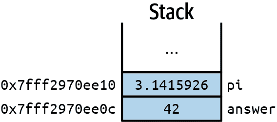
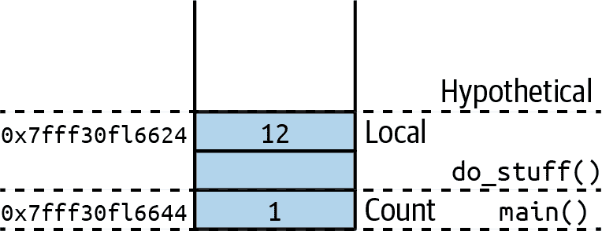
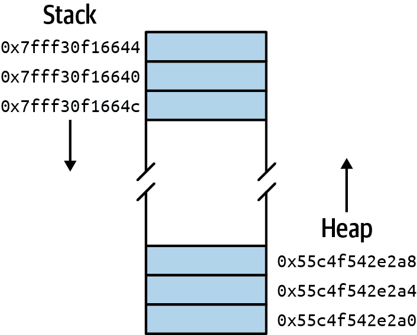

# 第六章. 指针与引用

对内存的合理直接访问是 C 语言的一个最大特点，适合那些处理低级问题如设备驱动或嵌入式系统的开发者。C 语言为你提供了微管理字节的工具。当你需要关注每一位可用内存时，这可以是一个真正的好处，但当你需要关注你使用的每一位内存时，也可能是一个真正的麻烦。然而，当你需要这种控制时，拥有这样的选项是很棒的。本章将涵盖如何找出事物在内存中的位置（它们的*地址*），以及如何使用和存储这些位置的*指针*，即存储其他变量地址的变量。

# C 语言中的地址

当我们讨论使用`scanf()`读取基本类型如整数和浮点数与读取字符串作为字符数组时，我们已经涉及了指针的概念。你可能还记得对于数字，我提到了所需的`&`前缀。这个前缀可以被认为是一个“地址”的运算符或函数。它返回一个数字值，告诉你`&`后面的变量在内存中的位置。我们实际上可以打印出那个位置。看看 [*ch06/address.c*](https://oreil.ly/z9TrR)：

```cpp
#include <stdio.h>

int main() {
  int answer = 42;
  double pi = 3.1415926;
  printf("answer's value: %d\n", answer);
  printf("answer's address: %p\n", &answer);
  printf("pi's value: %0.4f\n", pi);
  printf("pi's address: %p\n", &pi);
}
```

在这个简单的程序中，我们创建了两个变量并对它们进行初始化。我们使用了一些`printf()`语句来显示它们的值和在内存中的位置。如果我们编译并运行这个例子，以下是我们将看到的内容：

```cpp
ch06$ gcc address.c
ch06$ ./a.out
answer's value: 42
answer's address: 0x7fff2970ee0c
pi's value: 3.1416
pi's address: 0x7fff2970ee10
```

###### 注意

我在这里要说的是*大致*的内容；你的设置可能会与你的不同，因此地址可能不会完全匹配。实际上，仅仅连续运行这个程序几乎肯定会得到不同的地址。程序加载到内存中的位置取决于无数因素。如果这些因素不同，地址很可能也会不同。

在接   在接下来的所有例子中，关注哪些地址与其他地址接近会更加有用。具体的数值并不重要。

获取存储在`answer`或`pi`中的值是很直接的，这也是我们从第 2 章开始一直在做的事情。但操作变量的地址是新的。我们甚至需要一个新的`printf()`格式说明符，`%p`，来打印它们！该格式说明符的助记符是“pointer”，这与“address”紧密相关。通常，*指针*指的是存储地址的变量，尽管你会看到人们谈论特定的值作为指针。你也会遇到术语*引用*，它与指针同义，但在谈论函数参数时更常用。例如，网上的教程会说诸如“当你传递一个引用给这个函数……。”他们的意思是你将变量的地址传递给函数，而不是变量的值。

但是回到我们的例子。那些打印出来的指针值看起来确实像是很大的数！这种情况并不总是出现，但是在使用逻辑地址来帮助分离和管理多个程序的拥有几十亿甚至几万亿字节 RAM 的系统上，这并不罕见。这些值代表什么？它们是我们进程内存中变量值的存放位置。图 6-1 展示了我们简单示例中内存的基本设置。

即使不计算地址的确切十进制值，你也可以看到它们很接近。事实上，`pi`的地址比`answer`的地址大四个字节。在我的机器上，一个`int`是四个字节，所以希望你能看到这种联系。在我的系统上，`double`占据八个字节。如果我们向我们的示例中添加第三个变量，你能猜到它的地址吗？



###### 图 6-1\. 变量值和地址

让我们一起尝试一下。程序[*ch06/address2.c*](https://oreil.ly/6gdjU)添加了另一个`int`变量，然后打印其值和地址：

```cpp
#include <stdio.h>

int main() {
  int answer = 42;
  double pi = 3.1415926;
  int extra = 1234;
  printf("answer's value: %d\n", answer);
  printf("answer's address: %p\n", &answer);
  printf("pi's value: %0.4f\n", pi);
  printf("pi's address: %p\n", &pi);
  printf("extra's value: %d\n", extra);
  printf("extra's address: %p\n", &extra);
}
```

这是我们三变量版本的输出：

```cpp
ch06$ gcc address2.c
ch06$ ./a.out
answer's value: 42
answer's address: 0x7fff9c827498
pi's value: 3.1416
pi's address: 0x7fff9c8274a0
extra's value: 1234
extra's address: 0x7fff9c82749c
```

Hmm，实际上，变量并不按照我们声明的顺序存储。多么奇怪！仔细观察，你会发现`answer`仍然被首先存储（地址 0x…498），然后是`extra`四个字节之后（0x…49c），再之后是`pi`又四个字节（0x…4a0）。编译器通常会以一种它认为高效的方式排列事物——而这种高效的顺序并不总是与我们的源代码一致。所以，尽管顺序有些令人意外，我们仍然可以看到变量都按照它们的类型规定的空间堆叠在一起。

## NULL 值和指针错误

*stdio.h*头文件包含一个方便的值，`NULL`，每当我们需要谈论“空”或未初始化的指针时，我们可以使用它。你可以将`NULL`赋给一个指针变量或在比较中使用它，以查看特定指针是否有效。如果你喜欢在声明变量时始终赋予一个初始值，`NULL`就是与指针一起使用的值。例如，我们可以声明两个变量，一个是`double`，另一个是指向`double`的指针。我们将它们初始化为“无”，然后稍后再填充它们：

```cpp
double pi = 0.0;
double *pi_ptr = NULL;
// ...
pi = 3.14156;
pi_ptr = &pi;
```

任何时候不能确定指针的来源时，都应检查`NULL`指针。例如，在传递给你的函数内部：

```cpp
double messyAreaCalculator(double radius, double *pi_ptr) {
  if (pi_ptr == NULL) {
    printf("Could not calculate area with a reference to pi!\n");
    return 0.0;
  }
  return radius * radius * (*pi_ptr);
}
```

当然，这并不是计算圆形面积的最简单方法，但是开始的`if`语句是一个常见的模式。这是一个简单的保证，确保你有东西可以处理。如果你忘记检查你的指针并尝试解引用它，你的程序通常会停止，并且你可能会看到这样的错误：

```cpp
Segmentation fault (core dumped)
```

即使你无法处理空指针，如果在使用之前检查它，你可以给用户一个更友好的错误消息并避免崩溃。

## 数组

数组和字符串又是怎么样的呢？它们会像简单类型一样放在栈上吗？它们在内存的同一一般部分会有地址吗？让我们创建一些数组变量，看看它们会落在哪里，占用多少空间。[*ch06/address3.c*](https://oreil.ly/UA5ZK) 就有我们的数组。我添加了一个大小的打印输出，这样我们可以轻松验证分配了多少空间：

```cpp
#include <stdio.h>

int main() {
  char title[30] = "Address Example 3";
  int page_counts[5] = { 14, 78, 49, 18, 50 };
  printf("title's value: %s\n", title);
  printf("title's address: %p\n", &title);
  printf("title's size: %lu\n", sizeof(title));
  printf("page_counts' value: {");
  for (int p = 0; p < 5; p++) {
    printf(" %d", page_counts[p]);
  }
  printf(" }\n");
  printf("page_counts's address: %p\n", &page_counts);
  printf("page_counts's size: %lu\n", sizeof(page_counts));
}
```

这是我们的输出：

```cpp
title's value: Address Example 3
title's address: 0x7ffe971a5dc0
title's size: 30
page_counts' value: { 14 78 49 18 50 }
page_counts's address: 0x7ffe971a5da0
page_counts's size: 20
```

编译器再次重新排列了我们的变量，但我们可以看到`page_counts`数组占用了 20 字节（每个`int` 5 x 4 字节），而`title`在`page_counts`之后 32 字节的位置。（你可以忽略地址的共同部分并做一些简单的数学运算：0xc0 – 0xa0 == 0x20 == 32。）那多出来的 12 字节是什么？这是数组的一些开销，编译器已经为它留出了空间。令人高兴的是，我们（作为程序员或用户）不必担心这种额外开销。作为程序员，我们可以看到编译器确实为数组本身预留了足够的空间。

## 局部变量和栈

那么这个“空间”到底是在哪里设置的呢？在最广义的术语中，这个空间是从计算机的内存（RAM）中分配的。对于在函数中定义的变量（还记得从“主函数（main()）”中了解到`main()`是一个函数），这些空间是在*栈*上分配的。这是内存中的一个术语，用于创建和保存所有局部变量，当您进行各种函数调用时。组织和维护这些内存分配是操作系统的主要工作之一。

考虑下一个小程序，[*ch06/do_stuff.c*](https://oreil.ly/C5xCP)。我们有通常的`main()`函数，还有另一个函数`do_stuff()`，它做一些事情。不是花哨的事情，但它仍然创建并打印了一个`int`变量的详细信息。即使是无聊的函数也会使用栈，并帮助说明函数调用在内存中如何组合在一起！

```cpp
#include <stdio.h>

void do_stuff() {
  int local = 12;
  printf("Our local variable has a value of %d\n", local);
  printf("local's address: %p\n", &local);
}

int main() {
  int count = 1;
  printf("Starting count at %d\n", count);
  printf("count's address: %p\n", &count);
  do_stuff();
}
```

这里是输出：

```cpp
ch06$ gcc do_stuff.c
ch06$ ./a.out
Starting count at 1
count's address: 0x7fff30f1b644
Our local variable has a value of 12
local's address: 0x7fff30f1b624
```

您可以看到`main()`中`count`的地址和`do_stuff()`中`local`的地址是相邻的。它们都在栈上。图 6-2 显示了栈及其一些更多的上下文。



###### 图 6-2\. 栈上的局部变量

这就是“栈”这个名字的来源：函数调用会堆叠起来。如果`do_stuff()`调用了其他函数，那么该函数的变量会叠加在`local`之上。当任何函数完成时，其变量将从栈上弹出。这种堆叠可以进行很长时间，但不是永远。如果你没有为递归函数提供适当的基本情况，比如在“递归函数”中所述的那些情况下，这种失控的栈分配最终会导致程序崩溃。

您可能注意到图 6-2 中的地址实际上是递减的。栈的开始可以是程序分配的内存的开始，地址将递增，或者是分配空间的结尾，地址将递减。您所看到的版本取决于体系结构和操作系统。但栈及其增长的概念保持不变。

栈还存储传递给函数的任何参数，以及稍后在函数中声明的任何循环或其他变量。考虑以下片段：

```cpp
float average(float a, float b) {
  float sum = a + b;
  if (sum < 0) {
    for (int i = 0; i < 5; i++) {
      printf("Warning!\n");
    }
    printf("Negative average. Be careful!\n");
  }
  return sum / 2;
}
```

在这段代码中，栈将包括以下元素的空间：

+   `average()` 函数本身的 `float` 返回值

+   `float` 类型的参数 `a`

+   `float` 类型的参数 `b`

+   `float` 类型的局部变量 `sum`

+   用于循环的 `int` 变量 `i`（仅在 `sum < 0` 时）

栈非常灵活！几乎与特定函数有关的任何事情都会从栈中获取其内存。

## 全局变量和堆

那么不与任何特定函数相关联的全局变量如何处理？它们会分配在称为*堆*的内存的单独部分。如果“堆”听起来有点混乱，那是因为确实如此。您的程序需要的任何内存片段，如果不是栈的一部分，就会在堆中。图 6-3 说明了如何思考栈和堆。



###### 图 6-3\. 栈与堆内存

栈和堆共享一个逻辑上分配给您的程序的内存块。随着函数调用的增多，栈会增长（从“顶部”向下）。当函数完成调用时，栈会收缩。全局变量使堆增长（从“底部”向上）。大型数组或其他结构也可能在堆中分配。本章中的“使用数组管理内存”将介绍如何在这个空间中手动使用内存。您可以释放堆中的部分空间以使其收缩，但全局变量在程序执行期间保持不变。

我们将更详细地研究这两种内存如何交互在“栈与堆”。随着栈和堆的增长，中间的空闲空间变得越来越小。如果它们相遇，那就麻烦了。如果栈不能再增长，您将无法调用更多函数。如果您尝试调用函数，可能会导致程序崩溃。同样，如果堆没有剩余空间可供增长，但您尝试请求空间，计算机将不得不终止您的程序。

作为程序员，避免这些麻烦是你的工作。C 语言不会阻止你犯错，但反过来，它给了你在特定情况下非常聪明的发挥空间。第十章 将探讨微控制器上的几种情况，并讨论一些应对方法。

# 指针算术

无论变量存储其内容的位置如何，C 语言允许您以一种强大（但潜在危险的）方式直接处理地址。我们不仅限于简单检查变量的地址。我们可以将其存储在另一个变量中。然后，我们可以使用该其他变量来访问相同的数据位并对其进行操作。

查看[*ch06/pointer.c*](https://oreil.ly/ONjNE)示例，了解使用指向另一个变量的变量的示例。我在处理指针时指出了一些关键概念：

```cpp
#include <stdio.h>

int main() {
  double total = 500.0;                
  int count = 34;
  double average = total / count;
  printf("The average of %d units totaling %.1f is %.2f\n",
     count, total, average);

  // Now let's reproduce some of that work with pointers
  double *total_ptr = &total;          
  int *count_ptr = &count;
  printf("total_ptr is the same as the address of total:\n");
  printf(" total_ptr %p == %p &total\n", total_ptr, &total);

  // We can manipulate the value at the end of a pointer
  // with the '*' prefix (dereferencing)
  printf("The current total is: %.1f\n", *total_ptr);
  // Let's pretend we forgot two units and correct our count:
  *count_ptr += 2;                     
  average = *total_ptr / *count_ptr;
  printf("The corrected average of %d units totaling %.1f is %.2f\n",
     count, total, average);           
}
```


我们从一组普通变量开始执行简单的计算。


接下来，我们创建了具有相应指针类型的新变量。例如，我们创建了`total_ptr`，类型为`double *`，作为指向类型为`double`的`total`变量的指针。


您可以取消引用指针以使用或更改它们指向的内容。


最后，我们证明了通过我们对其指针对应物进行的工作而实际更改了原始的非指针变量。

这是输出：

```cpp
ch06$ gcc pointer.c
ch06$ ./a.out
The average of 34 units totaling 500.0 is 14.71
total_ptr is the same as the address of total:
  total_ptr 0x7ffdfdc079c8 == 0x7ffdfdc079c8 &total
The current total is: 500.0
The corrected average of 36 units totaling 500.0 is 13.89
```

这个输出并不是很令人兴奋，但再次证明我们能够通过`count_ptr`指针编辑像`count`这样的变量的值。通过指针操作数据是相当高级的事情。如果这个话题让你感到有些不知所措，请不要担心。继续尝试示例，您将更加熟悉语法，这反过来将帮助您考虑如何在您自己的未来项目中使用指针。

# 数组指针

实际上，我们已经使用过指针，尽管它被巧妙地伪装成数组。回想一下我们在“scanf() and Parsing Inputs”中对`scanf()`函数的扩展使用。当我们想要扫描一个数字时，我们必须在数字变量的名称前使用`&`。但扫描字符串不需要那种语法——我们只需给出数组的名称。这是因为在 C 语言中，数组已经是指针，只是具有期望的结构，以便更容易读取和写入数组元素。

原来，您可以在*不*使用方括号的情况下处理数组的内容。您可以使用我们刚才在上一个示例中看到的完全相同的取消引用。通过取消引用，您可以添加和减去简单的整数来访问该数组变量中的单个元素。但最好在代码中详细讨论这类事情。请查看[*ch06/direct_edit.c*](https://oreil.ly/GPhxA)：

```cpp
#include <stdio.h>

int main() {
  char name[] = "a.c. Programmer";             
  printf("Before manipulation: %s\n", name);
  *name = 'A';                                 
  *(name + 2) = 'C';                           
  printf("After manipulation: %s\n", name);    
}
```


我们像往常一样声明和初始化我们的字符串（`char`数组）。


我们可以取消引用数组变量以读取或更改第一个字符。这相当于`name[0] = *A*`。


我们还可以解引用涉及我们的数组变量的表达式。我们可以添加或减去 `int` 值，这相当于在数组中向前或向后移动一个元素。在我们的代码中，这行代码等同于 `name[2] = *C*`。


而且您可以看到数组变量本身是“未受影响”的，尽管我们成功地编辑了字符串。

继续编译和运行程序。这是输出：

```cpp
ch06$ gcc direct_edit.c
ch06$ ./a.out
Before manipulation: a.c. Programmer
After manipulation: A.C. Programmer
```

这种数学和解引用方法也适用于其他类型的数组。例如，在处理数组的循环中可能会看到指针算术，其中增加数组指针相当于移动到数组中的下一个元素。这种指针的使用可以非常高效。但是虽然在 *direct_edit.c* 中的简单操作在历史上可能更快，现代的 C 编译器非常（非常！）擅长优化您的代码。

###### 提示

我建议在担心性能之前，集中精力获得您想要的答案。第十章 探讨了在 Arduino 平台上内存和其他资源的情况，这种担忧更加合理。即使在那里，优化也不是您的首要关注点。

# 函数和指针

当您将指针附加到函数的参数或返回值时，指针真正开始在程序员日常生活中产生差异。这个特性允许您创建一个可共享的内存块而不使其成为全局的。考虑以下来自 [*ch06/increment.c*](https://oreil.ly/JJLV4) 的函数：

```cpp
void increment_me(int me, int amount) {
  // increment "me" by the "amount"
  me += amount;
  printf("  Inside increment_me: %d\n", me);
}

void increment_me_too(int *me, int amount) {
  // increment the variable pointed to by "me" by the "amount"
  *me += amount;
  printf("  Inside increment_me_too: %d\n", *me);
}
```

第一个函数 `increment_me()` 应该感觉很熟悉。我们之前已经将值传递给函数。在 `increment_me()` 内部，我们可以将 `amount` 添加到 `me` 上并得到正确的答案。然而，我们确实只从 `main()` 方法传递了 `count` 的 *值*。这意味着原始的 `count` 变量将保持不变。

但 `increment_me_too()` 使用了一个指针。现在我们可以传递给 `count` 的是一个 *引用* 而不是简单的值。采用这种方法，我们应该发现一旦返回到 `main()`，`count` 已经被更新了。让我们测试一下这个期望。这是一个尝试两个函数的简单的 `main()` 方法：

```cpp
int main() {
  int count = 1;
  printf("Initial count: %d\n", count);
  increment_me(count, 5);
  printf("Count after increment_me: %d\n", count);
  increment_me_too(&count, 5);
  printf("Count after increment_me_too: %d\n", count);
}
```

下面是我们得到的输出：

```cpp
ch06$ gcc increment.c
ch06$ ./a.out
Initial count: 1
  Inside increment_me: 6
Count after increment_me: 1
  Inside increment_me_too: 6
Count after increment_me_too: 6
```

很好。我们得到了我们想要的行为。`increment_me()` 函数不会影响从 `main()` 传入的 `count` 的值，但 `increment_me_too()` 会影响它。您经常会看到术语“传值”和“传引用”，用来区分函数处理传递给它的参数的方式。请注意，在 `increment_me_too()` 的情况下，我们有一个引用参数和一个值参数。混合类型没有限制。作为程序员，您只需确保正确使用您的函数。

函数也可以返回它们在堆中创建的东西的指针。这是外部库中常见的技巧，我们将在第 9 和第十一章中看到。

# 使用数组管理内存

如果您事先知道需要大块内存，比如用于存储图像或音频数据，可以分配自己的数组（和结构体；参见“定义结构体”）。分配的结果是一个指针，您可以将其传递给可能需要处理您数据的任何函数。这样做不会复制任何存储空间，而且您可以在必须使用它之前检查确保获得了所需的所有内存。当处理来自未知来源的内容时，这是一个明显的优势。如果没有足够的内存可用，可以提供一个礼貌的错误消息，并要求用户再试一次，而不是不加说明地崩溃。

## 使用 malloc()分配内存

虽然我们通常将堆工作保留给较大的数组，但您可以在那里分配任何您想要的内容。为此，您可以使用`malloc()`函数，并提供所需的字节数量。`malloc()`函数在另一个头文件`stdlib.h`中定义，因此我们必须包含该头文件，类似于我们包含`stdio.h`的方式。我们将在`stdio.h`中看到`stdlib.h`提供的更多函数，但目前，只需在顶部添加以下行，就在我们通常的`include`下面：

```cpp
#include <stdio.h>
#include <stdlib.h>

// ...
```

包含了这个头文件后，我们可以创建一个简单的程序，演示全局变量和局部变量的内存分配，以及我们自己在堆中的自定义内存。请看[*ch06/memory.c*](https://oreil.ly/zAK5y)：

```cpp
#include <stdio.h>
#include <stdlib.h>

int result_code = 404;
char result_msg[20] = "File Not Found";

int main() {
  char temp[20] = "Loading ...";
  int success = 200;

  char *buffer = (char *)malloc(20 * sizeof (char));

  // We won't do anything with these various variables,
  // but we can print out their addresses
  printf("Address of result_code:   %p\n", &result_code);
  printf("Address of result_msg:    %p\n", &result_msg);
  printf("Address of temp:          %p\n", &temp);
  printf("Address of success:       %p\n", &success);
  printf("Address of buffer (heap): %p\n", buffer);
}
```

全局声明的`result_code`和`result_msg`以及局部变量`temp`和`success`应该是熟悉的。但请看我们如何声明`buffer`。您可以看到`malloc()`在一个真实程序中的使用。我们请求了 20 个字符的空间。如果您愿意，可以指定一个简单的字节数，但通常更安全（确实经常需要）使用`sizeof`，就像这个例子中显示的那样。不同的系统将有不同的类型大小和内存分配规则，`sizeof`提供了对无意中的错误的简单防范。

让我们来看一下输出中变量的地址：

```cpp
ch06$ gcc memory.c
ch06$ ./a.out
Address of result_code:   0x55c4f49c8010
Address of result_msg:    0x55c4f49c8020
Address of temp:          0x7fffc84f1840
Address of success:       0x7fffc84f1834
Address of buffer (heap): 0x55c4f542e2a0
```

再次，不用担心这些地址的确切值。我们在这里寻找的是它们的大致位置。希望您能看到全局变量和我们使用`malloc()`手动在堆中创建的`buffer`指针大致处于相同的位置。同样，`main()`中的两个局部变量也类似地分组在一个单独的位置。

因此，`malloc()`在堆中为你的数据提供了空间。我们将在“指向结构体的指针”中利用这个分配的空间，但首先我们需要看看一个密切相关的函数`free()`。当你使用`malloc()`分配内存时，你有责任在完成后返回该空间。

## 使用`free()`进行释放

正如你在图 6-3 的讨论中可能记得的那样，如果堆栈或堆使用过多——或者两者都使用了足够多——你将会耗尽内存并导致程序崩溃。使用堆的好处之一是你可以控制何时以及如何从堆中分配和返回内存。当然，正如我刚才提到的，这个好处的另一面是你必须记得自己做“归还”部分。许多较新的语言试图减轻程序员的这一负担，因为很容易忘记在自己完成后清理。也许你甚至听说过这个问题的准官方术语：内存泄漏。

为了在 C 语言中返回内存并避免这种泄漏，你可以使用`free()`函数（也来自*stdlib.h*）。使用起来非常简单——你只需传递从相应的`malloc()`调用返回的指针。例如，当你完成使用`buffer`后释放它：

```cpp
  free(buffer);
```

简单！但是，要记得使用`free()`才是难点。这可能看起来并不是什么大问题，但是当你开始使用函数来创建和删除数据片段时，情况就会变得越来越复杂。你调用创建函数的次数有多少次？每次都调用了对应的删除函数吗？如果尝试删除从未分配的内容会怎样？所有这些问题使得追踪内存使用既困难又重要。

# C 语言的结构体

随着你解决更加有趣的问题，你的数据存储需求将变得更加复杂。例如，如果你正在处理 LCD 显示器，你将会处理需要颜色和位置的像素。这个位置本身将由*x*和*y*坐标组成。虽然你可以创建三个单独的数组（一个用于所有颜色，一个用于所有*x*坐标，最后一个用于所有*y*坐标），但这样的集合会很难传递给和从函数中传递，并且容易引入多种错误——比如添加了颜色却忘记了其中一个坐标。幸运的是，C 语言包含了`struct`机制来为你的新数据需求创建更好的容器。

引用 K&R 的话说：“*结构体*是一个或多个可能是不同类型的变量的集合，它们被组合在一起，以便于方便处理。”¹ 他们继续指出，其他语言支持这个想法作为*记录*。今天在网上搜索你也会遇到术语*复合类型*。不管你如何称呼它，这种变量组合特性非常强大。让我们看看它是如何工作的。

## 定义结构体

要创建自己的结构，你使用 `struct` 关键字和名称，后面跟着大括号内部的变量列表。然后，你可以像访问数组的元素一样通过名称访问这些变量。下面是一个我们可以在银行账户程序中使用的快速示例：

```cpp
struct transaction {
  double amount;
  int day, month, year;
};
```

现在我们有了一个新的“类型”，我们可以在变量中使用它。不再使用 `int` 或 `char[]`，我们有了 `struct transaction`：

```cpp
int main() {
  int count;
  char message[] = "Your money is safe with us!";
  struct transaction bill, deposit;
  // ...
}
```

`count` 和 `message` 的声明应该很熟悉。接下来的一行声明了另外两个变量 `bill` 和 `deposit`，它们共享新的 `struct transaction` 类型。你可以在任何使用 `int` 等原生类型的地方使用这种新类型。你可以创建局部或全局变量使用 `struct` 类型。你可以将结构体传递给函数或从函数返回。在处理结构和函数时更倾向于使用指针，但我们将在“函数和结构”中详细讨论这些细节。

你的结构定义可以非常复杂。它们可以包含多少个变量几乎没有真正的限制。一个结构体甚至可以包含嵌套的 `struct` 定义！当然，你不想过度使用，但你确实可以自由地创建几乎任何类型的记录。

## 分配和访问结构成员

一旦定义了你的结构类型，你就可以使用类似处理数组的语法声明和初始化该类型的变量。例如，如果你提前知道结构的值，你可以使用花括号初始化你的变量：

```cpp
  struct transaction deposit = { 200.00, 6, 20, 2021 };
```

大括号内的值的顺序需要与你在 `struct` 定义中列出的变量顺序相匹配。但是你也可以创建一个结构变量，并在事后填充它。要指示你要分配的字段，你使用“点”运算符。你给出结构变量的名称（在我们当前的例子中是 `bill` 或 `deposit`），一个句点，然后你感兴趣的结构成员，比如 `day` 或 `amount`。使用这种方法，你可以按任何顺序进行分配：

```cpp
  bill.day = 15;
  bill.month = 7;
  bill.year = 2021;
  bill.amount = 56.75;
```

无论如何填充结构，你都可以使用相同的点表示法随时访问结构的内容。例如，要打印交易的任何细节，我们指定交易变量（在我们的例子中是 `bill` 或 `deposit`），点号，以及我们想要的字段，就像这样：

```cpp
  printf("Your deposit of $%0.2f was accepted.\n", deposit.amount);
  printf("Your bill is due on %d/%02d\n", bill.month, bill.day);
```

我们可以将这些内部元素打印到屏幕上。我们可以为它们分配新值。我们可以在计算中使用它们。你可以用结构中的内部元素做任何其他变量可以做的事情。结构的目的只是为了更轻松地将相关数据片段放在一起。但是这些结构也保持数据*独立*。考虑在我们的`bill`和`deposit`中分配`amount`变量：

```cpp
  deposit.amount = 200.00;
  bill.amount = 56.75;
```

在这两个赋值中我们使用了 `amount` 这个名字，但是我们从来不会混淆你指的是哪个 `amount`。例如，如果我们在设定了我们的 `bill` 后给它加一些税，那并不会影响我们在 `deposit` 中包含的金额：

```cpp
  bill.amount = bill.amount + bill.amount * 0.05;

  printf("Our final bill: $%0.2f\n", bill.amount); // $59.59
  printf("Our deposit: $%0.2f\n", )                // $200.00
```

希望这种分离有意义。使用结构体，您可以将账单和存款作为独立的实体来讨论，同时理解任何单个账单或存款的详细信息仍然是独特的。

## 结构体指针

如果您构建了一个良好的组合类型，它封装了恰到好处的数据，您很可能会开始在越来越多的地方使用这些类型。您可以将它们用作全局和局部变量，或作为参数类型甚至函数返回类型。然而，在实际应用中，您更常见的是程序员使用结构体指针而不是结构体本身。

要创建（或销毁）结构体指针，您可以使用与简单类型相同的操作符和函数。例如，如果您已经有一个 `struct` 变量，您可以使用 `&` 操作符获取它的地址。如果您使用 `malloc()` 创建了结构体的实例，您可以使用 `free()` 将该内存返回到堆中。以下是几个使用这些特性和函数的示例，我们的类型是 `struct transaction`：

```cpp
struct transaction tmp = { 68.91, 8, 1, 2020 };
struct transaction *payment;
struct transaction *withdrawal;

payment = &tmp;
withdrawal = malloc(sizeof(struct transaction));

```

在这里，`tmp` 是一个普通的 `struct transaction` 变量，我们使用花括号初始化它。`payment` 和 `withdrawal` 都声明为指针。我们可以像对待 `payment` 那样，将一个 `struct transaction` 变量的地址赋给它，或者像对待 `withdrawal` 那样，在堆上分配内存（以便稍后填写）。

然而，当我们填写 `withdrawal` 时，我们必须记住我们有一个指针，因此在应用点之前我们需要解引用 `withdrawal`。不仅如此，点操作符的优先级比解引用操作符高，因此您必须使用括号正确应用操作符。这可能有点繁琐，因此我们经常使用一种替代符号来访问结构体指针的成员。箭头操作符 `->` 允许我们在不解引用的情况下使用结构体指针。您将箭头放置在结构体变量名称和预期成员名称之间，就像使用点操作符一样：

```cpp
// With dereferencing:
(*withdrawal).amount = -20.0;

// With the arrow operator:
withdrawal->day = 3;
withdrawal->month = 8;
withdrawal->year = 2021;
```

这种差异可能有点令人沮丧，但最终您会习惯的。结构体指针提供了一种有效的方式，在程序的不同部分之间共享相关信息。它们最大的优势是指针没有移动或复制其结构体内部所有部分的开销。当您开始将结构体与函数一起使用时，这种优势就会显现出来。

## 函数和结构体

考虑编写一个函数，以漂亮的格式打印交易内容。我们可以将结构体作为参数传递给函数。我们在参数列表中使用`struct transaction`类型，然后在调用时传递一个普通变量：

```cpp
void printTransaction1(struct transaction tx) {
  printf("%2d/%02d/%4d: %10.2f\n", tx.month, tx.day, tx.year, tx.amount);
}
// ...
printTransaction1(bill);
printTransaction1(deposit);
```

非常简单，但请回顾我们关于函数调用与堆栈的讨论。在这个例子中，当我们调用`printTransaction1()`时，`bill`或`deposit`的所有字段都必须放在堆栈上。这会消耗额外的时间和空间。事实上，在 C 的最早版本中，这甚至是不允许的！现在显然不再如此，但是通过指针传递和从函数返回指针仍然更快。以下是我们`printTransaction1()`函数的指针版本：

```cpp
void printTransaction2(struct transaction *ptr) {
  printf("%2d/%02d/%4d: %10.2f\n",
      ptr->month, ptr->day, ptr->year, ptr->amount);
}
// ...
printTransaction2(&tmp);
printTransaction2(payment)
printTransaction2(withdrawal);
```

唯一需要放在堆栈上的是一个`struct transaction`对象的地址。更加清晰。

通过这种方式传递指针具有一个有趣且预期的特性：我们可以在函数中更改结构体的内容。回忆一下 “传递简单类型”，没有指针时，我们通过堆栈传递初始化函数参数的值。我们在函数内对这些参数所做的任何操作都不会影响从函数被调用的地方传递的原始参数。

然而，如果我们传递一个指针，我们可以使用该指针来更改结构体的内部。这些更改是持久的，因为我们正在处理实际的结构体，而不是其值的副本。例如，我们可以创建一个函数来给任何交易添加税：

```cpp
void addTax(struct transaction *ptr, double rate) {
  double tax = ptr->amount * rate;
  ptr->amount += tax;
}

// ... back in main
  printf("Our bill amount before tax: $%.2f\n", bill.amount);
  addTax(&bill, 0.05);
  printf("Our bill amount after tax: $%.2f\n", bill.amount);
// ...
```

注意，在`main()`函数中我们没有改变`bill.amount`。我们只是将其地址与税率一起传递给`addTax()`函数。以下是那些`printf()`语句的输出：

```cpp
Our bill amount before tax: $56.75
Our bill amount after tax: $59.59
```

正是我们所期望的。由于其功能强大，通过引用传递结构体在大型程序中非常常见。并非所有内容都需要放在结构体中，也不是每个结构体都必须通过引用传递，但是组织和效率确实非常吸引人。

###### 警告

使用指针改变结构体内容的能力通常是可取的。但如果出于某些原因，你*不想*在使用指针时改变某个成员，确保不对该成员赋值。当然，你可以先将该成员的值复制到一个临时变量中，然后再处理该临时变量。

# 指针语法回顾

在本章中，我介绍了足够多新奇且有些难懂的 C 语法，因此我想在这里做个简要回顾：

+   我们使用`struct`关键字定义新的数据类型。

+   我们使用“点”操作符（`.`）来访问结构体的内容。

+   我们使用“箭头”操作符（`->`）来通过指针访问结构体的内容。

+   我们使用`malloc()`为数据分配了自己的空间。

+   我们使用`&`（“取地址”）和`*`（“解引用”）操作符处理该空间。

+   当我们处理完数据后，可以使用`free()`释放其空间。

让我们看看这些新概念和定义在实际中的应用。考虑以下程序，[*ch06/structure.c*](https://oreil.ly/xeqqL)。在这个稍长的清单中，我添加了几条内联注释来突出关键点，而不是在这里使用调用注释。这样你可以快速查找书中的细节，或者在你自己的代码编辑器中查找：

```cpp
// Include the usual stdio, but also stdlib for access
// to the malloc() and free() functions, and NULL
#include <stdio.h>
#include <stdlib.h>

// We can use the struct keyword to define new, composite types
struct transaction {
  double amount;
  int month, day, year;
};

// That new type can be used with function parameters
void printTransaction1(struct transaction tx) {
  printf("%2d/%02d/%4d: %10.2f\n", tx.month, tx.day, tx.year, tx.amount);
}

// We can also use a pointer to that type with parameters
void printTransaction2(struct transaction *ptr) {
  // Check to make sure our pointer isn't empty
  if (ptr == NULL) {
    printf("Invalid transaction.\n");
  } else {
    // Yay! We have a transaction, print out its details with ->
    printf("%2d/%02d/%4d: %10.2f\n", ptr->month, ptr->day, ptr->year,
        ptr->amount);
  }
}

// Passing a structure pointer to a function means we can alter
// the contents of the structure if necessary
void addTax(struct transaction *ptr, double rate) {
  double tax = ptr->amount * rate;
  ptr->amount += tax;
}

int main() {
  // We can declare local (or global) variables with our new type
  struct transaction bill;

  // We can assign initial values inside curly braces
  struct transaction deposit = { 200.00, 6, 20, 2021 };

  // Or we can assign values at any time after with the dot operator
  bill.amount = 56.75;
  bill.month = 7;
  bill.day = 15;
  bill.year = 2021;

  // We can pass structure variables to functions just like other variables
  printTransaction1(deposit);
  printTransaction1(bill);

  // We can also create pointers to structures and use them with malloc()
  struct transaction tmp = { 68.91, 8, 1, 2020 };
  struct transaction *payment = NULL;
  struct transaction *withdrawal;
  payment = &tmp;
  withdrawal = malloc(sizeof(struct transaction));

  // With a pointer, we either have to carefully dereference it
  (*withdrawal).amount = -20.0;
  // Or use the arrow operator
  withdrawal->day = 3;
  withdrawal->month = 8;
  withdrawal->year = 2021;

  // And we are free to pass structure pointers to functions
  printTransaction2(payment);
  printTransaction2(withdrawal);

  // Add tax to our bill using a function and a pointer
  printf("Our bill amount before tax: $%.2f\n", bill.amount);
  addTax(&bill, 0.05);
  printf("Our bill amount after tax: $%.2f\n", bill.amount);

  // Before we go, release the memory we allocated to withdrawal:
  free(withdrawal);
}
```

就像大多数新概念和语法片段一样，你在自己的程序中越多地使用指针和`malloc()`，就会越熟悉它们。从头开始创建一个解决你感兴趣的问题的程序总是有助于巩固你对新主题的理解。我正式允许你去玩弄指针！

# 下一步

在这一章中，我们涵盖了一些相当高级的内容。我们探讨了在程序运行时数据存储在内存中的位置，以及帮助你处理这些数据地址的运算符（`&`、`*`、`.` 和 `->`）和函数（`malloc()` 和 `free()`）。许多中级和高级编程书籍会花费多章节来讲解这些概念，所以如果你需要多次阅读这些材料，不要感到泄气。像往常一样，运行代码并进行一些自己的修改是练习理解的好方法。

现在我们的 C 工具包中有了许多强大的工具！我们可以开始解决复杂的问题，并且有很大的机会解决它们。但在许多情况下，我们的问题实际上并不是新问题。事实上，许多问题（或者至少我们将真实任务分解为可管理的子任务时遇到的许多子问题）已经被其他程序员遇到并解决了。下一章将探讨如何利用这些外部解决方案。

¹ 那种方便的处理方式确实非常便利。Kernighan 和 Ritchie 在《C 程序设计语言》中专门为这个主题撰写了一整章。显然，他们在这里的详细内容比我能提供的要多，所以我再次推荐你阅读这个经典著作。
