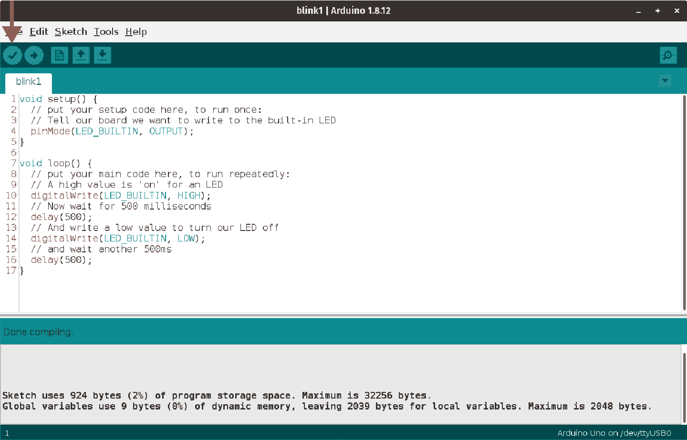
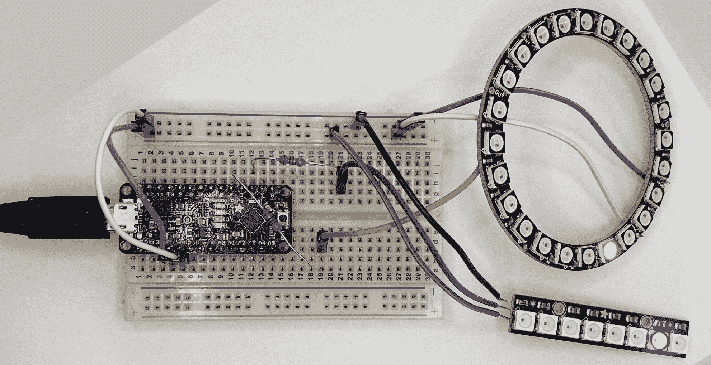

# 第八章：与 Arduino 一起的真实世界 C 语言

我们的 C 语言技能从编译简单语句的短列表到传递指向带有嵌套控制流的函数指针都有所成长。但到目前为止，我们一直在终端窗口中打印结果。这对于验证我们的逻辑是否正确以及我们的程序是否按预期运行非常好，但最终我们会希望代码能在除终端外的其他地方运行，以利用所有出色的硬件。在本书的其余部分，我们将编写针对微控制器的代码。而选择与 Arduino 一起开始再好不过了。

Arduino 家族的微控制器已经存在 15 多年了。从专门设计用于学习和创新的[8 位 Atmel AVR](https://oreil.ly/EH7un)控制器开始，这些设备已经大受欢迎。如今，您可以找到预装各种传感器和连接的开发板。WiFi、GPS、蓝牙，甚至是无线电选项都可以轻松添加。输入、输出和容器的生态系统确实令人惊叹。对我们来说，这使得这个平台成为一个完美的目标。您可以购买一个廉价的控制器和 LED 灯开始，然后扩展到机器人技术、气象站、无线电控制或其他任何您感兴趣的电子领域。¹

“获取硬件：Adafruit”包含了本书其余部分将要使用的所有微控制器和外设的信息。但任何兼容 Arduino 的微控制器都可以与我们大多数示例兼容。

# Arduino 集成开发环境（Win，Mac，Linux）

在“编译您的代码”一章中，我们学习了如何将 C 源代码编译成在我们的操作系统上运行的可执行文件。尽管可能可以在 Arduino 控制器上运行 C 编译器，但我们可以使用*交叉编译器*的概念，让我们的笔记本电脑和台式电脑来完成编译的繁重工作，同时生成适用于 Arduino 的二进制文件。

您可以像我们使用`gcc`一样从命令行运行`gcc-avr`等工具，但幸运的是有一个方便的 IDE 可以实现其上标注的功能。Arduino IDE 是一个集成开发环境，您可以在其中编辑源代码、编译、加载到微控制器，并观察串行控制台以帮助调试。在控制台看到错误？修复源代码，重新编译和加载。而且它在所有三个主要平台上都可以运行。

无论您使用的是哪个平台，请访问[Arduino 软件](https://oreil.ly/jMXH0)页面（参见图 8-1），并下载适当版本。如果您想了解 IDE 的功能特点，可以在线查阅[IDE 环境指南](https://oreil.ly/FKreY)。


###### 图 8-1。Arduino IDE 下载站点

让我们看看 Windows、macOS 和 Linux 的安装详细信息。尽管 Arudino IDE 大多数时候是一个成熟的工具，具有典型的安装程序，但我想指出一些特定于平台的步骤和要点。

## 在 Windows 上安装

从下载页面，请确保获取来自 arduino.cc 直接提供的下载之一，可以是 ZIP 文件或 Windows 7 及更高版本的安装程序。

###### 警告

如果您使用 Microsoft Store 下载应用程序，可能会注意到其中也有 Arduino IDE。遗憾的是，有许多关于使用该版本 IDE 的困难报告。它是较老的版本，并且商店中的列表似乎没有得到很好的维护。尽管下载页面提供了商店的链接，我们建议避免使用这个版本。

[在线指南](https://oreil.ly/Fa8kZ) 提供了通过您下载的 *.exe* 文件安装 Arduino IDE 的详细说明。这是一个相当标准的 Windows 安装程序；我们唯一的建议是在提示时安装所有可用的组件。（如果您不想要桌面或开始菜单上的快捷方式，当然可以取消勾选。）您可能还会提示安装一些端口和驱动程序，我们建议您也安装这些。如果一切顺利，您可以启动 IDE 并看到一个空文档，如 图 8-2 所示。


###### 图 8-2\. Arduino IDE 在 Windows 10 上的运行状态

一旦您的 IDE 启动，请尝试 “您的第一个 Arduino 项目” 中的第一个项目。

## 在 macOS 上安装

macOS 版本的 Arduino IDE 以一个简单的 *.zip* 文件形式提供。许多浏览器会自动解压下载，但您也可以自己双击文件解压。*.zip* 文件中唯一的内容就是 macOS 应用程序。请将该应用程序拖到您的 *应用程序* 文件夹中。（这可能需要您输入管理员密码。）就是这样！如果成功了，您应该能够看到标准的启动界面，如 图 8-3 所示。


###### 图 8-3\. Arduino IDE 在 macOS 上的运行状态

一旦您的 IDE 启动，请尝试 “您的第一个 Arduino 项目” 中的第一个项目。

## 在 Linux 上安装

对于 Linux，您还可以将应用程序作为一个简单的存档文件，*.tar.xz*。大多数发行版都有一个存档管理器应用程序，可以通过双击愉快地解压您的下载。如果您还没有这样的方便的应用程序，可以尝试使用您的 `tar` 版本，因为它可以自动解压大多数类型的存档文件：

```cpp
$ tar xf arduino-1.8.13-linux64.tar.xz
```

（当然，根据您的平台和当前发布版本的应用程序本身，您的文件名可能会有所不同。）

将解压后的文件夹（名为 *arduino-1.8.13*，根据你下载的版本不同而异）放在你想要的任何位置保存该应用程序。这可能是一个共享位置，也可能只是你自己的用户目录中的某个位置。一旦把它放在你喜欢的地方，切换到那个 *arduino-1.8.13* 文件夹并运行 **`./install.sh`**。该脚本会尽力将快捷方式添加到你的启动菜单和桌面。继续启动应用程序，确保安装成功。你应该会看到类似 图 8-4 的界面，与其他操作系统类似。


###### 图 8-4\. 运行在 Linux 上的 Arduino IDE（带有 Gnome）

万岁！让我们在我们的微控制器上运行第一个程序。

# 你的第一个 Arduino 项目

当然，对于像 Arduino 这样的微控制器，IDE 只是问题的一半。你需要一个真正的 Arduino 控制器！或者至少是它的许多衍生产品之一。你可以从各种卖家和制造商那里获得这些板子。我要为 [Adafruit](https://adafruit.com) 隆重推荐一下，因为他们有非常出色的各种板子和外围设备，还有所有用于构建实际电子项目的其他配件。他们的 Trinkets 和 Feathers 以及超小巧的 QT Py 为一些小型设备提供了很多出色的功能。

## 选择你的板子

无论你选择哪种微控制器，你都需要在 Arduino IDE 中指定它。在工具菜单下找到“板子：”选项。然后会列出大量支持的板子供你使用，如 图 8-5 所示。你可以看到我选择了“Adafruit ESP32 Feather”板子。那只是我最近处理的一个项目——一个 ESP32 WiFi 可控 LED 项目。现在微控制器能做到的真是令人惊讶！如果你在列表中找不到匹配的板子，可以返回顶部找“板子管理器…”选项。该选项打开一个对话框，你可以浏览其他支持的板子。


###### 图 8-5\. 支持的开发板

在本书的大多数示例中，我将使用来自 Adafruit 的 [Metro Mini](https://oreil.ly/6oe6O)，如 图 8-6 所示。它配备了一个 16MHz 的 ATmega328P 芯片，拥有 2K 的 RAM 和 32K 的 Flash 存储器。具有大量的 I/O 引脚，我们可以自由地处理从传感器和开关获取的输入，并通过 LED、LCD 和伺服电机提供输出。


###### 图 8-6\. Adafruit 公司的 Metro Mini 微控制器

Metro Mini 与 Arduino UNO 兼容引脚，因此让我们选择它作为我们的开发板选项。图 8-7 再次显示了我们选择 UNO 的开发板列表。顺便说一句，“引脚”是你称呼从微控制器伸出并插入到面包板（工程术语，用于连接元件的方便、穿孔基座）的东西。即使你使用鳄鱼夹或直接焊接导线连接 Arduino， “引脚”仍然是指连接到微控制器的具名或编号连接。 “引脚布局图”是一种匹配这些名称和数字到设备实际连接点的备忘单。


###### 图 8-7 选择 UNO 开发板

###### 提示

很可能你会有一个不同的微控制器。对于制造商和其他电子爱好者来说，有很多精彩的选择。希望你在列表中能找到你的开发板，并像我们选用 UNO 一样简单地选择它。遗憾的是，我们无法涵盖每一个选项，甚至无法预测最流行的选项。[Arduino 帮助中心](https://oreil.ly/bgyMM)提供了一些出色的文档和常见问题解答。他们的社区也是一流的。

## 你好，LED！

在 Arduinoland，让 LED 闪烁相当于我们“Hello, World”程序的电子版，详见“创建 C 'Hello, World'”。我们将尽力描述我们构建的电路和连接，但你需要根据自己的控制器和组件进行必要的调整。

许多开发板上都集成了一个 LED 和适当的电阻器。我们将从我们的 Metro Mini 开始让 LED 闪烁，以确保我们的 C 代码可以上传并在我们的微控制器上运行。回到 Arduino IDE，选择 文件 → 新建 选项。现在应该有一个新的*草图*标签。“草图”是指用于在微控制器上执行的编译包。 （更多关于草图的信息请见“C++对象和变量”。）你会看到两个空函数，`setup()`和`loop()`。这两个函数是微控制器版本的我们桌面 C 程序的`main()`函数。

`setup()`函数是我们代码的入口点，通常在首次给板子供电或用户按下复位按钮时运行（如果板子有这样的按钮）。在这里，我们设置任何需要的全局信息或运行硬件初始化，例如重置舵机位置或指定如何使用 I/O 引脚。

然后`loop()`函数接管并无限重复您的程序。微控制器通常用于一遍又一遍地执行一个任务（或者可能是少量任务），只要它们有电源。它们可以持续读取传感器。它们可以驱动 LED 动画。它们可以读取传感器并使用该值来改变 LED 动画。它们可以推动时钟手指向前。但它们都会重复某些流程，直到您切断电源，因此`loop()`是一个恰当命名的函数。

虽然幕后发生了更多事情，但是可以合理地想象 Arduino 项目的标准`main()`函数定义如下：

```cpp
int main() {
  setup();
  while (1) {
    loop();
  }
}
```

注意我们的`while`循环“条件”仅为值 1。请记住在这些布尔上下文中，“非零”被视为真。因此这个`while`循环将永远运行。这正是 Arduino 所需要的。

对于我们的闪烁 hello 程序，我们将使用`setup()`告诉板子我们要使用内置 LED 作为输出（这意味着我们将在与 LED 相关联的引脚上“写入”开和关的值）。然后我们将使用`loop()`进行该写入，并加入一些小延迟，以便让闪烁对人类更加可见。这是我们在[Arduino 文档](https://oreil.ly/Qt6DM)中描述的常量的第一次迭代：

```cpp
void setup() {
  // put your setup code here, to run once:
  // Tell our board we want to write to the built-in LED
  pinMode(LED_BUILTIN, OUTPUT);
}

void loop() {
  // put your main code here, to run repeatedly:
  // A high value is 'on' for an LED
  digitalWrite(LED_BUILTIN, HIGH);
  // Now wait for 500 milliseconds
  delay(500);
  // And write a low value to turn our LED off
  digitalWrite(LED_BUILTIN, LOW);
  // and wait another 500ms
  delay(500);
}
```

###### 注意

像`LED_BUILTIN`和`HIGH`这样的全大写名称是在 Arduino IDE 自动包含的头文件中定义的。它们在技术上是预处理器宏，我们将在“预处理指令”中更详细地讨论它们。它们非常方便，在您自己的代码中非常容易使用：`#define PIN 5`定义了`PIN`为值 5。这有点像变量或常量。不同之处在于预处理器将在编译器之前（因此有“预-”前缀）通过您的代码，并且在找到每个`PIN`的地方替换为字面数字`5`。典型的变量或常量将在内存中保留一个槽，并且可以在运行时初始化，也许在您从用户那里收集了一些必要信息之后。

接着，输入这个简单的程序。您还可以直接在 IDE 中打开[*ch08/blink1/blink1.ino*](https://oreil.ly/p6eGd)项目。

在将其尝试在您的板子上运行之前，您可以使用 IDE 的验证按钮（如图 8-8 所示）来确保代码编译通过。验证您的代码还会检查您的最终程序是否适合您选择的控制器。如果您使用了太多变量或仅仅有太多逻辑，您将在底部状态区看到警告和错误。尝试在某些语句上留下一个分号，就像我们在“C 语言语句”中所做的那样。再次点击验证，您可以看到您在未来编写自己代码时可能会遇到的消息类型。



###### 图 8-8。上传前验证您的草图

在确认您的代码没有问题后，您可以使用上传快捷按钮将其发送到微控制器，该按钮位于验证旁边，或从 Sketch 菜单中选择适当的项目。上传将编译代码（即使您最近已验证过），然后将其写入您的板子。Arduino IDE 在这一步与 Metro Mini 配合得很好——这一切都是令人愉快的自动化。某些开发板需要手动配置上传。再次提醒，[Arduino 帮助中心](https://oreil.ly/csLX6) 在这里是您的朋友。

一旦上传完成，您应该看到您的 LED 以半秒间隔开始闪烁。虽然在纸上印刷时不那么显眼，但 Figure 8-9 显示了我们时髦 LED 的开关状态。


###### 图 8-9\. 我们的“Hello, World” LED 闪烁

## 外部 LED 升级

我们专注于 Arduino 项目的软件部分，但使用 Arduino 而不使用 *一些* 外部组件是不可能的。让我们将我们简单的闪烁器升级为使用外部 LED。

Figure 8-10 显示了我们使用的简单电路。我们有我们的控制器、一个 LED 和一个电阻。对于这个设置，我们可以依赖 USB 提供的电力。


###### 图 8-10\. 外部 LED 的简单电路

我们可以选择一个引脚，并通过阅读我们微控制器规格的电压来学习更多信息。在我们的 Metro Mini 的情况下，我们查看了 Adafruit 网站上的 [Pinouts 页面](https://oreil.ly/H2wNN)。详细信息告诉我们，板子上的哪些引脚映射到 UNO 的引脚。在板的“顶部”（芯片上的微小文字是正向的）有几个数字 I/O 引脚，特别是引脚 2 到 12 正是我们需要的。我们将从 2 开始，因为这个数字很好。不同的板子可能有不同的配置，但对于我们的板子，引脚 0 到 13 直接映射到数字引脚 0 到 13。因此，我们可以使用自己的 `#define` 并附加一个好名字（耶！）或者只是在我们的 `pinMode()` 和 `digitalWrite()` 调用中使用值 `2`。

Metro Mini 在其数字引脚上提供 5V。根据 LED 制造商提供的规格，我们知道我们的蓝色 LED 具有 2.5V 的正向电压降。如果我们想要提供 30mA 的电流以获得明亮的光，[欧姆定律](https://oreil.ly/6ihdc) 告诉我们，100Ω 电阻器效果很好。一切都连接好后，我们可以制作一个新的草图（或者只是微调第一个）。这里是 [*ch08/blink2/blink2.ino*](https://oreil.ly/xpo2a) 的当前状态：

```cpp
#define D2 2

void setup() {
  // put your setup code here, to run once:
  // Tell our board we want to write to digital pin 2
  pinMode(D2, OUTPUT);
}

void loop() {
  digitalWrite(D2, HIGH);
  delay(2000);
  digitalWrite(D2, LOW);
  delay(1000);
}
```

请注意，我使用预处理器 `#define` 功能来指定我们与 LED (`D2`) 使用的数字引脚。您可以在 Figure 8-11 中看到这个简单的配置运行。太棒了！


###### 图 8-11\. 我们的外部 LED 闪烁

在这些小型物理项目中有一种额外的满足感。这些“Hello, World”程序的设计目的是证明您的开发环境正常工作，并且您可以产生一些输出。这就是我们在这里做的一切，但是看到 LED 灯亮起真是太有趣了。每当我在一个新项目上投入开关时，就感觉有点像弗兰肯斯坦博士在实验室里尖叫，“它活了！” :-)

# Arduino 库

尽管您可以立即使用这些微控制器做大量工作，但通常情况下，您将会构建一些带有一些有趣附件的项目，如多色 LED、LCD 屏幕、电子墨水、传感器、舵机、键盘甚至游戏控制器。这些组件中的许多都已经写好了一些代码块。这些代码块被收集到一个库中，您可以将其添加到 Arduino IDE 中。其中一些库是“官方”的，来自组件制造商；其他则是由同好制作的。不管来源如何，库都可以加快项目的开发速度。

让我们来看看如何通过 IDE 查找和管理库。正确地做这件事将有助于确保您的草图不包含任何未使用的库。

## 管理库

Arduino IDE 的“工具”菜单中有一个“管理库…”的入口，打开对话框以搜索和安装库。我们将添加一个 Adafruit 库，并尝试点亮其中一个他们的神奇 NeoPixel——单独可寻址的三色 LED，可用于各种各样的形态。它们甚至可以串联在一起以构建更复杂的装置。不过，在这个例子中，我们将继续使用其中一个最简单的形态因子：[Flora](https://oreil.ly/JEuFF)。

在库管理器对话框中，在顶部的搜索框中输入“neopixel”。您应该会得到几个结果；我们需要简单的“Adafruit NeoPixel”条目。点击安装按钮（或者如果您已经安装了较旧版本的此库，如我们在 Figure 8-12 中所示，请点击更新），就这样！IDE 将下载库并在幕后进行适当的工作以使其可用。


###### 图 8-12\. 寻找 NeoPixel 库

使用 NeoPixels 的物理电路类似于我们用于简单 LED 的电路，但它们有三根导线而不是两根。您有标准的`V`+和`Ground`连接器用于基本电源需求，第三根线提供给像素或条的“数据”。数据在特定方向流动，因此，如果您决定尝试此电路，请注意连接数据输入的位置。与我们的简单 LED 一样，数据信号到达 NeoPixel 之前我们也需要一个小电阻器（在我们的情况下是 470Ω）。您可以在 Figure 8-13 中看到完整的设置。


###### 图 8-13\. 简单的 NeoPixel 设置

###### 注意

你可以顺便学习一下这个项目，而不用 NeoPixels。你可以使用任何其他可寻址的 LED。如果你有自己的 WS281x 或 APA102 或其他灯光，它们很可能可以与优秀的[FastLED](http://fastled.io)库一起使用。你需要做一些更多的独立阅读，但所有的概念都是相同的。FastLED 在 GitHub 上有很好的文档。例如，我们将在下一节中使用 NeoPixels 进行的工作在 FastLED 的[Basic Usage](https://oreil.ly/eupDp)页面中有详细介绍。

## 使用 Arduino 库

那么我们如何将 Arduino 库引入我们的 sketch 中呢？我们使用熟悉的`#include`预处理命令，就像我们在前几章中使用 C 标准库的各种头文件一样。对于 NeoPixels，我们的包含看起来像这样：

```cpp
#include <Adafruit_NeoPixel.h>
```

IDE 甚至会通过加粗和着色头文件的名称来确认你已安装好库。看一下图 8-14 中的比较，我们在拼写 NeoPixel 时使用了小写的“p”。漂亮的、粗体的颜色消失了。所以，如果你的库安装正确并且名称在包含行中突出显示，你就准备好了！


###### 图 8-14\. 注意库名称的错误

###### 注意

你可以在任何一个 sketch 中使用多个库。像 LEDs 的库以及伺服马达或 LCD 屏幕的库都是完全合理的。唯一的真正限制是内存——在使用微控制器时是一个无处不在的关注点。

当你验证一个 sketch 时，检查 IDE 下部分的消息。你将得到有关已使用内存以及剩余内存的报告（假设你选择了正确的开发板）。幸运的是，大多数为 Arduino 编写库的人和公司都非常清楚内存有多有限。例如，添加这个 NeoPixel 库使我们的闪烁 sketch 从接近 1K（964 字节）增加到大约 2.5K（2636 字节）。虽然可以说是需要存储的 Flash 量增加了三倍，但为了在少于 2K 的情况下获得库的所有好处似乎是一个公平的交换！

# Arduino Sketches 和 C++

要使用这个 NeoPixel 库，我们需要稍微涉足一下 C++，这是 C 的后继版本，具有面向对象的特性（与 C 的过程化特性相比）。Sketches 实际上是 C++项目。幸运的是，由于 C++起源于 C，C 代码也是合法的 C++代码。作为程序员，如果不想学习太多 C++也是可以的。

但请注意上文中的“much”修饰语。许多库——包括我们的 NeoPixel 库——都是用 C++类写成的（*class* 是面向对象语言中的组织单元）。这些库经常利用 C++的一些巧妙特性。特别是，你会发现构造函数和方法在各处被广泛应用。构造函数是初始化一个*对象*的函数。而对象本身则封装了数据和用于访问和操作该数据的函数。那些为对象定义的函数被称为对象的方法。

要查看构造函数和方法在 Arduino 库中的显示位置，请继续完成我们闪烁灯光的下一个迭代。回顾图 8-13 中显示的设置。我们可以编写一个名为 *blink3* 的新程序，通过其主要颜色：红色、绿色和蓝色，循环 NeoPixel。以下是完整代码，包括（无意打趣！）适当的`#include`行，[*ch08/blink3/blink3.ino*](https://oreil.ly/Ughez)：

```cpp
#include <Adafruit_NeoPixel.h>

#define PIXEL_PIN   4
#define PIXEL_COUNT 1

// Declare our NeoPixel strip object per documentation from Adafruit // https://learn.adafruit.com/adafruit-neopixel-uberguide/arduino-library-use 
Adafruit_NeoPixel strip(PIXEL_COUNT, PIXEL_PIN);            

void setup() {
  strip.begin();            // Get things ready 
  strip.setBrightness(128); // Set a comfortable brightness 
  strip.show();             // Start with all pixels off 
}

void loop() {
  // Show red for 1 second on the first pixel (start counting at 0)
  strip.setPixelColor(0, 255, 0, 0); 
  strip.show();                      
  delay(1000);
  // Show green for 1 second
  strip.setPixelColor(0, 0, 255, 0);
  strip.show();
  delay(1000);
  // Show blue for 1 second
  strip.setPixelColor(0, 0, 0, 255);
  strip.show();
  delay(1000);
}
```


我们创建的变量是`strip`。它的类（粗略地类似于类型）是`Adafruit_NeoPixel`。这里的名称`strip`很常见，但对于我们的单个 Flora 来说有点不太合适。但从技术上讲，我们正在分配一个长度仅为一个像素的条。


一个方法的示例：`begin()`是一个应用于`strip`的函数。`begin()`方法通过填充默认值和执行其他杂项启动任务，使我们的灯带准备就绪。


`setBrightness()` 方法控制`strip`上的预乘最大亮度。


另一个方法的示例。`show()`会使存储在内存中的当前颜色显示在`strip`的实际 LED 上。


`setPixelColor()` 方法接受四个参数：要设置的`strip`上的哪个像素（从 0 开始），以及要应用的红色、绿色和蓝色值。颜色值从 0（关闭）到 255（全亮度），尽管最终值会受到我们在`setup()`中调用的`setBrightness()`的影响。


要查看我们在`strip`上的新像素颜色，我们重复调用`show()`。

尝试使用连接了 NeoPixel 的设备上传这个程序。希望你能看到它以红色、绿色和蓝色依次运行，就像图 8-15 中展示的那样。


###### 图 8-15\. 我们闪烁的 NeoPixel

很棒！随意尝试改变颜色或闪烁模式。调整到恰到好处的色调可以令人惊喜。这确实是魔法。现在，你也知道了正确的咒语！

## C++对象和变量

当您创建一个对象变量时，声明和初始化看起来有点奇怪。在 C 中，我们可以创建一个变量并为其赋予一些初始值，如下所示：

```cpp
int counter = 1;
```

如果我们有一个名为`Integer`的 C++类，尝试相同类型的设置可能会像这样：

```cpp
Integer counter(1);
```

括号给了你一个线索，说明正在调用一个函数。那就是构造函数。如果你决定继续学习 C++，你会学到构造函数中可以完成的所有聪明技巧。不过现在，我们只是希望你了解语法，以便能够轻松创建引用对象的变量。

我们称之为`strip.begin()`和`strip.setPixelColor()`的行是调用对象函数的示例（再次说明，面向对象的语言使用术语“方法”）。这个想法是`strip`是我们要操作的对象，而`begin()`或`setPixelColor()`代表要完成的工作。

关于这种语法的一种思考方式是，它是一种转换的方式。在纯 C 中，我们可以想象为`begin()`和`setPixelColor()`编写普通函数。但是我们必须告诉这些函数我们想要设置或更改哪个 NeoPixels 带。所以我们需要额外的参数来传递对正确带的引用，如下所示：

```cpp
void setup() {
  begin(&strip);
  // ...
}

void loop() {
  // ...
  setPixelColor(&strip, 0, 255, 0, 0);
}
```

但是在本书的工作中，你大多数时候只需要熟悉从库中创建新对象的语句，然后记住使用对象的方法遵循`object.method()`的模式。

## 更多关于对象的实践

在我们继续为微控制器编码的其他方面之前，让我们再做一个眨眼应用程序，着重加强对象语法。我们将尝试使用一些实际的 LED 带，这些带上不止一个 LED。特别是，我们将使用一个包含 8 个 NeoPixels 的小[条](https://oreil.ly/yeieS)和一个包含 24 个 NeoPixels 的[环](https://oreil.ly/1CTcw)。为了让事情更有趣，我们将同时使用它们！

为了保持代码简洁，我们将制作一个眨眼程序，每次在每条带上显示一个像素。这样做还能降低功率需求，以便我们可以继续使用从 USB 连接获取的电力。（如果您熟悉更大的 LED 设置，并且已经知道如何添加外部电源，请随意创建您自己的安排。）图 8-16 展示了我们的新设置。我们移除了蓝色 LED 和之前的“条”孤独 NeoPixel Flora。



###### 图 8-16\. 一个更有趣的 NeoPixel 设置

我们将重复使用相同的输出引脚作为数据线。在这个布置中，条使用引脚 2，环使用引脚 4。

不多说了，这里是我们两条带眨眼盛会*blink4*的代码。我们将在片段后深入讨论这些步骤，确保我们在这里采取的步骤是有意义的。在阅读这些调用之前，尝试去[*ch08/blink4/blink4.ino*](https://oreil.ly/19dUL)并看看您能否猜到对象的工作原理。

```cpp
#include <Adafruit_NeoPixel.h>

#define STICK_PIN   2
#define STICK_COUNT 8
#define RING_PIN    4
#define RING_COUNT 24

// Declare our NeoPixel strip object per documentation from Adafruit // https://learn.adafruit.com/adafruit-neopixel-uberguide/arduino-library-use 
Adafruit_NeoPixel stick(STICK_COUNT, STICK_PIN);        
Adafruit_NeoPixel ring(RING_COUNT, RING_PIN, NEO_GRBW); 

void setup() {
  stick.begin();            // Initialize our stick 
  stick.setBrightness(128);
  stick.show();
  ring.begin();             // Initialize our ring 
  ring.setBrightness(128);
  ring.show();
}

void loop() {
  // our stick and ring have different LED counts, so we have
  // to be a little clever with our loop. There are several
  // ways to do this. We'll use modulus (remainder) math, but
  // can you think of other solutions that would achieve
  // the same pattern?
  for (int p = 0; p < RING_COUNT; p++) {
    stick.clear();
    stick.setPixelColor(p % STICK_COUNT, 0, 0, 255);    
    ring.clear();
    ring.setPixelColor(p, 0, 255, 0, 0);                
    stick.show();                                       
    ring.show();
  }
}
```


在这里，我们创建了一个名为`stick`的 Adafruit_NeoPixel 对象，类似于我们在“Arduino Sketches and C++”中创建`strip`的方式。


现在我们创建一个名为`ring`的第二个独立对象。（该环采用更复杂的 LED 配置，带有白色元件，因此我们在构造函数中添加了第三个参数。你可以在 NeoPixel 文档中找到这个值。）


我们像之前使用`strip`一样初始化了我们的`stick`。


我们还初始化了我们的`ring`；请注意，我们在两个对象上都使用了`begin()`方法。


现在我们设置了我们`stick`上一个像素的颜色。


我们使用了类似的方法，并通过第五个参数设置了我们的`ring`的颜色。（这里的参数是像素位置、红色、绿色、蓝色和白色。环将闪烁为绿色。）


最后但同样重要，展示两个变化。

希望看到并行使用两个对象有助于说明面向对象的语法是如何工作的。再次强调，我们的`for`循环纯粹是 C。我们根据需要使用 C++语法。

## C++注意事项

在 Arduino 开发中，面向对象编程在对象数量众多的物理对象环境中非常自然。C++还提供了几个功能，非常适合用来打包代码与他人分享。如果你主要通过 Arduino IDE 与你的微控制器交互，花一些时间研究 C++是值得的。

深入学习 C++将教会你关于类、成员和方法。你将创建构造函数和析构函数。随着你对对象的理解加深，你可能会开始按照对象的方式而不是功能的方式来分解你的项目。你肯定会发现 C++中有一些你喜欢的东西，也可能会有一些你不喜欢的东西。如果你理解了 C++，使用一些库会更容易，但即使你从未打开过正式的 C++书籍，也不会遇到完全无法解决的问题。

在 Arduino 编程中，C 语言本身仍然是一个强大的核心，我将继续把剩余的章节重点放在使用函数和其他基本的 C 特性来编写我们的项目上。在使用任何第三方库来处理特定外设时，我会尽量减少对象表示法的使用。我也会尝试突出显示 C++语法显著的地方。

为了重申在接下来的章节中你将看到的最常见的面向对象模式，这里是我们在“Arduino Sketches and C++”中 NeoPixel 示例的总结：

```cpp
// Using a library written in C++ still requires the same C "#include"
// directive to bring in the associated header file.
#include <Adafruit_NeoPixel.h>

#define PIXEL_PIN   4
#define PIXEL_COUNT 1

// Common example of a C++ constructor call that creates an object.
// Our NeoPixel "strip" is the created object in this case.
Adafruit_NeoPixel strip(PIXEL_COUNT, PIXEL_PIN);

void setup() {
  // Common example of using the method "begin()" from our object "strip".
  strip.begin();

// ...
```

希望您对这些小小的 C++ 尝试更加自如。我也希望这种舒适感能引发您对 C++ 更多的好奇心！但如果您真的不感兴趣，或者甚至不感到舒适，也不用担心。我编写微控制器代码最喜欢的一点是，少量的代码也能大有作为。即使我的项目简要概述显示，大多数时间我都使用 C，尽管这些项目中每一个都使用了用 C++ 编写的库。

## 对象作业

如果您想要更多练习我们已经见过并且在接下来的章节中偶尔会遇到的对象表示法，请尝试创建以下一些想法：

+   交替闪烁棒子上的每一个像素，使偶数像素亮起，然后是奇数像素，来回交替。

+   对于每个棒子上的像素，像计数器一样在环上闪烁一次。 （即，保持棒子上的一个像素显示，然后绕环行进。然后移到棒子上的下一个像素，再次绕环行进。重复！）

+   仅使用棒子，尝试从左到右“填充”它。然后清除所有像素，再次填充它。

+   查看 [NeoPixels](https://oreil.ly/GxxxI)（或 [FastLED](https://oreil.ly/9Ln6A)，或者您使用的任何库）的文档，看看是否有任何方法可以一次调用将整个条带变成一种颜色。 使用这种方法将整个棒子变成红色，然后绿色，然后蓝色，类似于我们使用单个 Flora 的 *blink3* 程序。

# 接下来的步骤

我们现在已经完成了 Arduino 项目的基础工作。我们使用了 Arduino IDE，并且看到了 C++ 在我们的代码中的应用。把这些结合起来，我们成功地点亮了一个 LED！虽然这很令人兴奋，但还有更多有趣的东西等着我们。

在下一章中，我们将探索许多可用于与微控制器配合使用的输入和输出。 我们当然无法涵盖每个传感器、按钮、扬声器或显示器，但我们可以（而且将会！）看几个这些外围设备的好例子。 我们将集中精力使这些不同的小工具能够一起工作，这样您就可以在未来处理自己的项目时有一个可靠的基础。

¹ 欲了解更多关于 Arduino 的细节信息，请参阅 J. M. Hughes（O’Reilly）的 [*Arduino: A Technical Reference*](https://learning.oreilly.com/library/view/arduino-a-technical/9781491934319/)。
