# 第九章. 较小系统

现在我们已经准备好使用 Arduino IDE，我们可以进入写 C 代码来控制各种设备的令人满足的世界了！LED 设备。传感器设备。按钮设备。太多设备了！我们还将涉足物联网（IoT），详见“物联网和 Arduino”。

在本章中，我将讨论几个 Arduino 的特殊之处（大多数是有帮助的，但有些让人沮丧），并构建一些小而完整的项目，你可以自己尝试。“获取硬件：Adafruit”包含了我使用的各种组件和微控制器的链接，以便你精确复制任何项目。

# Arduino 环境

我相信你注意到了，在第八章中，我们没有编写“完整”的 C 程序。我们没有`main()`函数，而在早期的示例中，我们甚至没有导入通常的头文件。然而，我们显然可以访问新的函数和像`HIGH`和`LOW`这样的值，用来闪烁我们的第一个 LED。

那些额外的东西是从哪里来的？有时候感觉就像是 IDE 提供了一些魔法。当然，实际上并非如此，但在幕后它确实做了大量工作，希望能让你更高效。我想指出其中一些隐藏的工作，以便你更好地理解 C 语言本身与 Arduino IDE 提供的支持元素之间的区别。随着你构建更多自己的项目，你必然会上网搜索新主题的示例。了解语言和工具之间的区别可以使这些搜索更加富有成效。

Arduino IDE 悄悄地为你包含了几个头文件，这些文件可以说是构成“Arduino 语言”的一部分。它并不像 Python 那样是一种独立的语言，但它确实感觉上不仅仅是 C 语言加上头文件和库文件。Arduino 语言更像是一组有用的部件（数值和函数），使得微控制器的编程更加容易。我将向你展示一些最有用的部分，但你可以在网上找到完整的列表。Arduino 网站上的[语言参考](https://oreil.ly/wlwhf)包含了一个简单的索引和详细示例的链接。

## 特殊数值

我们依赖了一些这些“语言”扩展，只是为了让我们的第一个 LED 闪烁。让我们回顾一下那段代码，但更多地讨论命名值（Arduino 语言参考称这些为*常量*），这些值是特定于 Arduino 环境的。¹

```cpp
void setup() {
  // put your setup code here, to run once:
  // Tell our board we want to write to the built-in LED
  pinMode(LED_BUILTIN, OUTPUT);           
}

void loop() {
  // put your main code here, to run repeatedly:
  // A high value is 'on' for an LED
  digitalWrite(LED_BUILTIN, HIGH);       
  // Now wait for 500 milliseconds
  delay(500);
  // And write a low value to turn our LED off
  digitalWrite(LED_BUILTIN, LOW);        
  // and wait another 500ms
  delay(500);
}
```


`LED_BUILTIN` 常量代表连接在大多数开发板上的 LED 的引脚号。对于每个控制器来说，这个数字不一定相同，但 IDE 根据你选择的开发板自动获取正确的值。


`OUTPUT`是我们用来指示我们将向诸如 LED 或电机之类的设备发送信息的值。当我们处理传感器和按钮时，我们将看到类似的`INPUT`和`INPUT_PULLUP`常量。


`HIGH`是增加电压的参考，用于“打开”连接到引脚的设备。什么是“打开”取决于该设备。对于 LED 来说，这相当容易理解。:)


`LOW`是`HIGH`的降低电压对应物，关闭 LED。

这些命名值不是变量。它们在技术上是*预处理器宏*。预处理器是您的代码在编译之前经历的一步²。您可以使用`define`指令创建这些实体。（前缀可能看起来与`#include`相似，并且应该是。这两个“命令”都由预处理器处理。）我们将在“预处理器指令”中更深入地讨论此指令，但其语法很简单：

```cpp
#define LED_BUILTIN 13
#define HIGH 1
#define LOW  0
```

C 预处理器简单地捕捉您代码中宏名称的每个实例，并用定义的值替换该名称。例如，如果我们有一个新的控制器，它的引脚更少，我们可以将我们的`#define`更改为`8`。然后，我们无需更改任何其他部分的程序，其中我们打开或关闭板载 LED。

并且要明确，`#define` *是* C 的一部分（通过预处理器）。无论您是为微控制器还是桌面编写代码，您都可以在自己的代码中使用它。像`OUTPUT`这样的特定常量是 Arduino 设置的一部分。表 9-1 显示了我们项目中将使用的一些常量。

表 9-1\. 为 Arduino 定义的有用常量

| 名称 | 描述 |
| --- | --- |
| `LED_BUILTIN` | 如果选定的板上有内置 LED，则表示该 LED 的引脚号码 |
| `INPUT` | 用于既可以执行输入又可以执行输出的引脚，预期输入 |
| `INPUT_PULLUP` | 与 INPUT 类似，但使用内部上拉电阻报告`HIGH`，例如未按下的按钮，并且在按下时为`LOW` |
| `OUTPUT` | 用于既可以执行输入又可以执行输出的引脚，预期输出 |
| `HIGH` | 1 的友好名称，用于数字读写 |
| `LOW` | 0 的友好名称，用于数字读写 |

您可以在官方[Arduino 参考](https://oreil.ly/pS11s)页面上获取有关这些常量的更多详细信息。

## 特殊类型

除了这些常量之外，加载到您的 Arduino 草图中的标题还包括一些其他数据类型，我想强调一下，因为您可能会发现它们很有用。这些不是真正的新类型，甚至不限于在 Arduino 中使用，但再次，您的草图可以访问这些类型，并且您可能会在在线示例中看到它们的使用。

表格 9-2 列出了几种类型及其大小和简要描述。

表格 9-2\. Arduino 中定义的有用常量

| 类型 | 描述 |
| --- | --- |
| `bool` | 布尔类型；`bool` 变量可以赋值为 `true` 或 `false` |
| `byte` | 无符号 8 位整数类型 |
| `size_t` | 对应于所选板上对象的最大大小（以字节为单位）的整数类型。例如，从 `sizeof` 得到的值就是 `size_t` 类型。 |
| `String` | 以面向对象的方式处理字符串（注意类型中的大写“S”），提供几个便利函数 |
| `int8_t`, `int16_t`, `int32_t` | 具有显式大小的有符号整数类型（分别为 8、16 和 32 位） |
| `uint8_t`, `uint16_t`, `uint32_t` | 具有显式大小的无符号整数类型（分别为 8、16 和 32 位） |

除了 `String` 外，这些类型实际上都是其他类型的 *别名*。这是通过 C 的 `typedef` 实现的，非常简单。例如，`byte` 类型是 `unsigned char` 的别名，可以这样定义：

```cpp
typedef unsigned char byte;
```

我们将在 “预处理器宏” 中更详细地介绍 `typedef`，但其中几种类型确实非常方便。在我自己的许多项目中，特别是使用 `byte` 更合理（并且键入更少）比 `unsigned char`，但这只是个人喜好。这两种类型都定义了一个能够存储从 0 到 255 的 8 位槽。

## “内建”函数

Arduino 环境包括几个头文件，使一些流行的功能可供使用。您可以在不需要在草稿中显式 `#include` 的情况下使用 表格 9-3 中显示的函数。

表格 9-3\. Arduino 中可用的函数

| 函数 | 描述 |
| --- | --- |
| *输入/输出* |
| `void pinMode(pin, mode)` | 将指定引脚设置为输入或输出模式 |
| `int digitalRead(pin)` | 返回值为 HIGH 或 LOW |
| `void digitalWrite(pin, value)` | 值应为 HIGH 或 LOW |
| `int analogRead(pin)` | 返回 0–1023（某些板提供 0–4095） |
| `void analogWrite(pin, value)` | 值为 0–255，必须使用支持 PWM 的引脚 |
| *时间* |
| `void delay(ms)` | 暂停指定毫秒数的执行 |
| `void delayMicroseconds(micros)` | 暂停指定微秒数的执行 |
| `unsigned long micros()` | 返回程序启动以来的微秒数 |
| `unsigned long millis()` | 返回程序启动以来的毫秒数 |
| *数学（未列出的返回类型取决于参数类型）* |
| `abs(x)` | 返回 x 的绝对值（整数或浮点数） |
| `constrain(x, min, max)` | 返回 x，但限制在 min 和 max 范围内 |
| `map(x, fromLow, fromHigh, toLow, toHigh)` | 将 x 从“from”范围转换到“to”范围 |
| `max(x, y)` | 返回 x 和 y 中较大的值 |
| `min(x, y)` | 返回 x 和 y 中较小的值 |
| `double pow(base, exp)` | 返回 base 的 exp 次幂 |
| `double sq(x)` | 返回 x 的平方 |
| `double sqrt(x)` | 返回 x 的平方根 |
| `double cos(rad)` | 返回给定弧度的余弦值 |
| `double sin(rad)` | 返回给定弧度的正弦值 |
| `double tan(rad)` | 返回给定弧度的正切值 |
| *随机数* |
| `void randomSeed(seed)` | 初始化生成器；seed 是一个无符号长整型数 |
| `long random(max)` | 返回 0 到 max - 1 之间的随机长整型数 |
| `long random(min, max)` | 返回 min 到 max - 1 之间的随机长整型数 |

*ctype.h* 中的许多字符测试函数，如 `isdigit()` 或 `isupper()`，也可以自动使用。³ 请参阅 Table 7-4 获取完整列表。

## 尝试 Arduino 的 “Stuff”

让我们把所有这些新想法融入一个项目中，看看它们是如何工作的（以及它们如何一起工作）。为此，我们将创建一个更有趣的 LED 草图。我们将使用 `analogWrite()` 函数和一点数学让 LED “呼吸”起来。

###### 注意

所讨论的 LED 实际上不是模拟设备。它仍然只有开和关的状态。但许多输出设备如 LED 可以通过一种称为 *脉宽调制*（PWM）的技术来模拟 “亮度”。这个想法是您可以以一种使 LED 看起来更暗的方式快速地开关 LED。（或者与像电机这样的设备一起工作，它可能看起来转得更慢。）

需要注意，并非所有控制器上的所有引脚都支持 PWM 输出。您需要查阅您控制器的数据表或引脚定义图。⁴ 例如，在我迄今为止使用的 Metro Mini 上，只有引脚 3、5、6、9、10 和 11 支持 PWM 输出。

这次我们将使用不同的 RGB LED。它有四个引脚：一个地线，分别为红色、绿色和蓝色通道的一个引脚。每种颜色都需要连接到控制器，因此我们将为这些引脚定义一些常量。我们还将为呼吸率和最大弧度数（2 * π）定义一些值。Figure 9-1 显示了我在此示例中使用的接线图。请注意，使用 `analogWrite()` 需要注意连接到哪些引脚。（对于这个项目，我不会为其添加图片；快乐的在运行中自行查看亮度变化吧！）

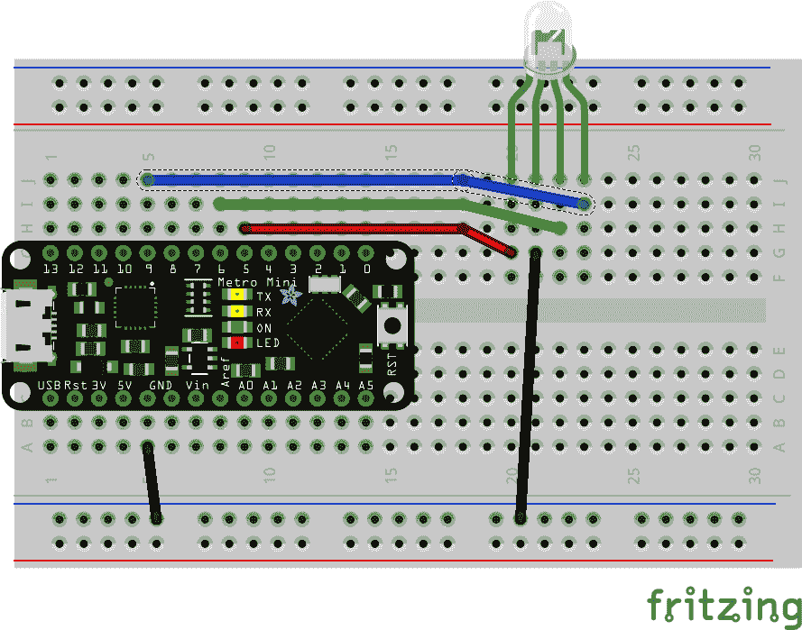

###### Figure 9-1\. 我们呼吸 LED 示例的接线图

现在我们可以开始编码了！像往常一样，我鼓励您开始一个新的草图，并自己输入代码，但您也可以打开 *breathe.ino* 并跟着做。

对于我们的 `setup()`，我们将设置颜色引脚模式为 `OUTPUT`，并为 LED 选择一个随机颜色。在开始动画之前，我们将在 LED 上显示该颜色几秒钟。

我们的`loop()`函数将驱动动画。我们可以使用`millis()`函数获取一个不断增加的数值。我们将使用我们的呼吸速率和最大弧度值将这些毫秒转换为弧度。有了弧度，我们将使用`sin()`函数获得一个漂亮的分数亮度，这种亮度会增加和衰减。最后，我们将这种亮度应用于 LED，并在动画下一步之前暂停几毫秒。这是[*ch09/breathe/breathe.ino*](https://oreil.ly/FHdP8)的完整清单：

```cpp
// Output pins, have to make sure they support PWM
#define RED    5
#define GREEN  6
#define BLUE   9

// Some helper values
#define RATE 5000
#define PI_2 6.283185

// Color channel values for our LED
byte red;
byte green;
byte blue;

void setup() {
  // Set our output pins
  pinMode(RED, OUTPUT);
  pinMode(GREEN, OUTPUT);
  pinMode(BLUE, OUTPUT);

  // Start the LED "off"
  digitalWrite(RED, 0);
  digitalWrite(GREEN, 0);
  digitalWrite(BLUE, 0);

  // Get our PRNG ready, then pick our random colors
  randomSeed(analogRead(0));

  // And pick our random color, but make sure it's relatively bright
  red = random(128,255);
  green = random(128,255);
  blue = random(128,255);

  // Finally show the LED for a few seconds before starting the animation
  analogWrite(RED, red);
  analogWrite(GREEN, green);
  analogWrite(BLUE, blue);
  delay(RATE);
}

void loop() {
  double ms_in_radians = (millis() % RATE) * PI_2 / RATE;
  double breath = (sin(ms_in_radians) + 1.0) / 2.0;
  analogWrite(RED, red * breath);
  analogWrite(GREEN, green * breath);
  analogWrite(BLUE, blue * breath);
  delay(10);
}
```

###### 注意

如果您没有 RGB LED，不用担心！您可以使用普通的 LED，只需写入 LED 的一个引脚，而不是写入三个单独的颜色引脚。您也不需要选择一个随机值；只需使用 255（全亮度）。即使您有多彩 LED，也可以尝试将示例改为单色 LED 作为练习。

您可以看到，尽管我们使用了几个不属于 C 本身的函数，但我们不需要手动`#include`任何东西。这全靠 Arduino IDE 的魔力。它确实简化了这些小板的开发。

# 微控制器 I/O

还有哪些其他额外功能我们的 IDE 提供的？很多！让我们从 LED 扩展到尝试一些输入和其他类型的输出。

## 传感器和模拟输入

从迄今为止构建的简单草图中轻松迈出的一步是添加传感器。传感器有各种类型：光、声音、温度、空气质量、湿度等等。它们通常价格不贵（尽管更复杂的传感器可能带有更昂贵的价格标签）。例如，[TMP36 模拟温度传感器](https://oreil.ly/Bczhb)在 Adafruit 只需$1.50。让我们将该传感器放入一个简单的电路中，就像图 9-2 中所示的那样，看看接线是如何工作的。

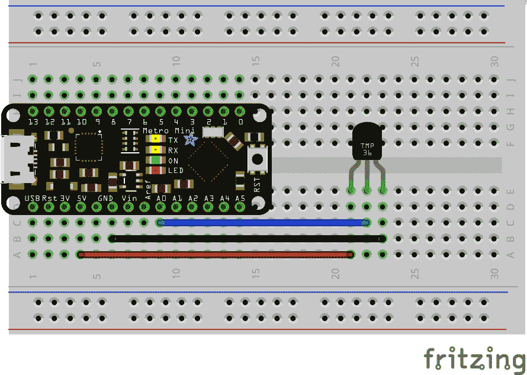

###### 图 9-2\. 我们温度示例的接线图

相当简单！这是一个相当常见的配置。传感器需要电源。它们可以有一个单独的电源引脚，例如我们的 TMP36，或者许多传感器可以直接从您连接的数据引脚中绘制足够的电流（例如光敏电阻）。我们使用`analogRead()`函数来获取传感器的当前值。不同的开发板和传感器支持不同的范围，但是 10 位（0-1023）范围是常见的。当然，这些值的确切含义取决于传感器。例如，我们的 TMP36 范围从-50°C（读数为 0）到 125°C（读数为 1023）。

## 串行监视器

虽然您可能不会长时间将您的 Arduino 项目连接到主计算机，但是在连接时，我们可以利用大多数微控制器非常方便的一个特性：串行端口。Arduino IDE 有一个可以启动的串行端口监视器，如图 9-3 所示。在开发过程中，这是一个非常好的调试工具，通常用来查看事物的运行情况。

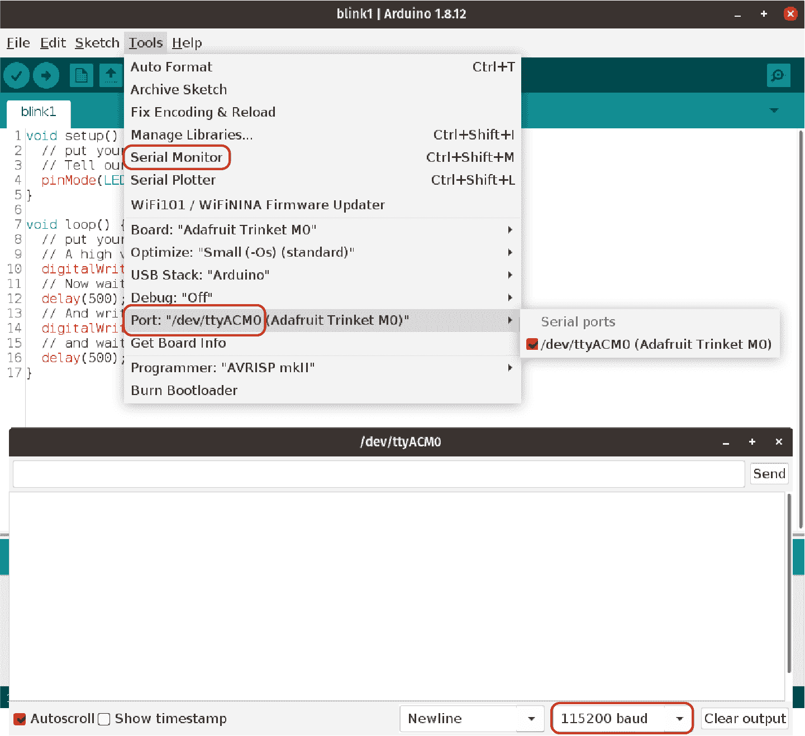

###### 图 9-3\. 访问 Arduino IDE 串行监视器

端口（通过工具菜单选择，也显示在图 9-3 中）和速度设置（在监视器窗口底部选择）会根据多个因素而变化，包括你的操作系统、其他可能连接的设备以及你使用的具体 Arduino 板。例如，我的 Metro Mini 在 Linux 桌面上以 115200 波特率（串行通信速率的经典单位；还记得调制解调器吗？）在端口*/dev/ttyUSB0*（“设备”连接的文件系统路径）上进行通信，但一个漂亮的[Trinket M0](https://oreil.ly/eSsOI)微控制器使用端口*/dev/ttyACM0*。同样的 Trinket 在我有的旧 Windows 系统上仍然使用 COM 端口。

## 这里是不是很热？

让我们把这两个新主题用于一个项目中。我们将使用图 9-2 中显示的电路。你可以开始一个新的草图或者打开[*ch09/temp_serial/temp_serial.ino*](https://oreil.ly/cal6o)并跟着做。代码相当简单。我们设置一个输入引脚。然后我们在一个循环中读取该引脚的数据并在串行监视器中打印结果。让我们看看代码：

```cpp
// TMP36 is a 10-bit (0 - 1023) analog sensor
// 10mV / C with 500mV offset for temps below 0
#define TMP36_PIN 0

void setup() {
  Serial.begin(115200);
}

void loop() {
  int raw = analogRead(TMP36_PIN);
  float asVolts = raw * 5.0 / 1024;  // Connected to 5V
  float asC = (asVolts - 0.5) * 100;
  Serial.print(asC);
  Serial.println(" degrees C");
  float asF = (asC * 1.8) + 32;
  Serial.print(asF);
  Serial.println(" degrees F");
  delay(5000);
}
```

看起来相当不错！读数的跳动性质并不罕见。如果我们需要更稳定的读数，比如为了防止误报警响，我们可以采用一些电子选项，比如添加电阻和电容。我们还可以多次读取传感器的数据并取平均值。或者我们可以更进一步，使用统计学方法排除任何真正的异常值，然后取平均值。但我们大多数时候只是想证明传感器能工作，并且我们可以在串行监视器中看到读数。如果你想确保传感器工作正常，试着轻轻用手指触摸它——你的手指应该比室温更暖，你应该看到读数趋势上升。

###### 提示

为了一点乐趣，试着从工具菜单中打开“串行绘图仪”（就在串行监视器下面）。它可以跟踪通过`Serial.println()`打印的简单值作为图表。它甚至可以将多个值作为单独的线路跟踪；只需在同一行中的值之间打印一个空格。

但正如我所说的，你可能不会一直将你的 Arduino 插入 USB 端口。让我们探讨一个更好的输出选项。

## 分段显示

LCD 和分段 LED 显示器有丰富的尺寸和价格选择。您可以获得邮票大小的高分辨率 LCD，类似于手机的触摸屏，或用于文本或数字输出的分段 LED 显示器。我买了一个简单的 4 位数 LED 显示器（Velleman VMA425，显示在图 9-4 中），带有内置的驱动芯片（因此您无需为每个单独的段连接引脚），在当地的 Micro Center 不到 7 美元。我们可以使用这样的显示器显示我们的 TMP36 读数（经过适当转换为华氏或摄氏度），而不必使用串行监视器。

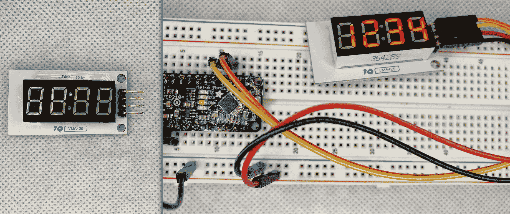

###### 图 9-4。一个 4 位数的 7 段显示器组件示例

不幸的是，这些外设通常需要一些帮助才能运行。幸运的是，这种帮助几乎总是以库的形式随时可得。我们将在第十一章中更详细地讨论库，但现在我们可以稍作停顿，获取我们 4 位数 LED 显示器所需的内容。

我提到的驱动芯片是我的特定显示器上配备的 TM1637。找到这个名字并非偶然——它标注在包装上，更明显地标在芯片本身上。使用 Arduino IDE 库管理器，我输入“TM1637”作为搜索词。⁵ 返回了几个结果，我选择了一个看起来简单而稳定的库（由 Avishay Orpaz 编写）。点击安装按钮后，我只需包含库的唯一头文件，就可以立即开始显示数字了！⁶

```cpp
#include <TM1637Display.h>
```

没有比这更容易的了。您经常会按照这个过程添加新的外设，包括传感器和其他输出。您也可能会认为现有的东西都不太合适，然后自己编写代码。同样，我们将在第十一章中探讨创建自己的库的机制。

安装完库后，我不能立即开始工作。我确实需要连接显示器。图 9-5 展示了所需的连接。我还需要阅读库的文档，我是通过点击库管理器列表中的“更多信息”链接找到的。

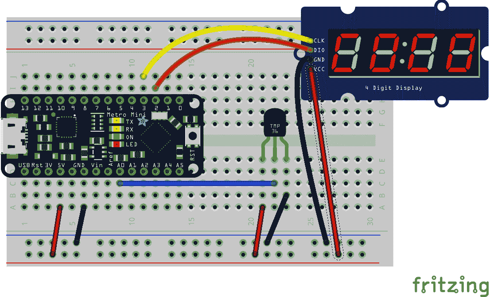

###### 图 9-5。LED 显示屏上的温度接线

暂时忽略 TMP36 传感器，[*ch09/display_test/display_test.ino*](https://oreil.ly/jzXm9)是对 4 位数显示器的简单测试。我们将显示“1234”，以证明我们的连接正常工作，并且我们理解了文档中的库函数。

```cpp
// Our 4-digit display uses a TM1637 chip and I2C #include <TM1637Display.h> 

// Name our pins #define CLK       2 
#define DIO       3

// Create our 4-segment display object TM1637Display display(CLK, DIO);            

void setup() {
  // Get our display ready and set a medium brightness
  display.clear();                          
  display.setBrightness(0x0f);
  display.showNumberDec(1234);
}

void loop() {                               
}
```


我选择的库只有一个头文件，所以包含它就可以开始了。


显示器除了电源和接地外，还需要两个引脚，因此为了方便使用，请为其命名。


创建一个全局的`display`变量，类似我们创建 NeoPixel 对象的方式。


使用我们的`display`对象和文档中描述的函数初始化我们的显示器，并在这种情况下显示一个简单的测试数字 1234。


什么也不变，显示器将保持上次发送的任何数字，所以我们可以将`loop()`函数保留为空。

太棒了！如果一切顺利，你会看到类似图 9-4 的东西。如果你选择了不同的显示器或库，但并未看到你希望看到的东西，请看看是否可以找到其他在线使用硬件或库的示例。通常有人会发布有用的、简洁的代码示例，你可以轻松复制并自己尝试。

## 按钮和数字输入

但是我们还没有完成！我们可以添加另一个外围设备，以增加我们温度显示草图的功能，同时扩展我们的编程技能。让我们附加一个非常常见的输入：按键。我们将使用它来在华氏度和摄氏度之间切换显示输出。

我从 Adafruit 抓取了一个[Tactile Button](http://adafru.it/367)，它简单且适合面包板。图 9-6 显示了 TMP36 传感器、4 位数字显示器和我们新添加的按钮的最终连接。对按钮的对角连接是故意的。任何对角线都可以；如果你查看按钮的规格，还有其他安排可能，但这个选择保证了我们获得所需的功能。

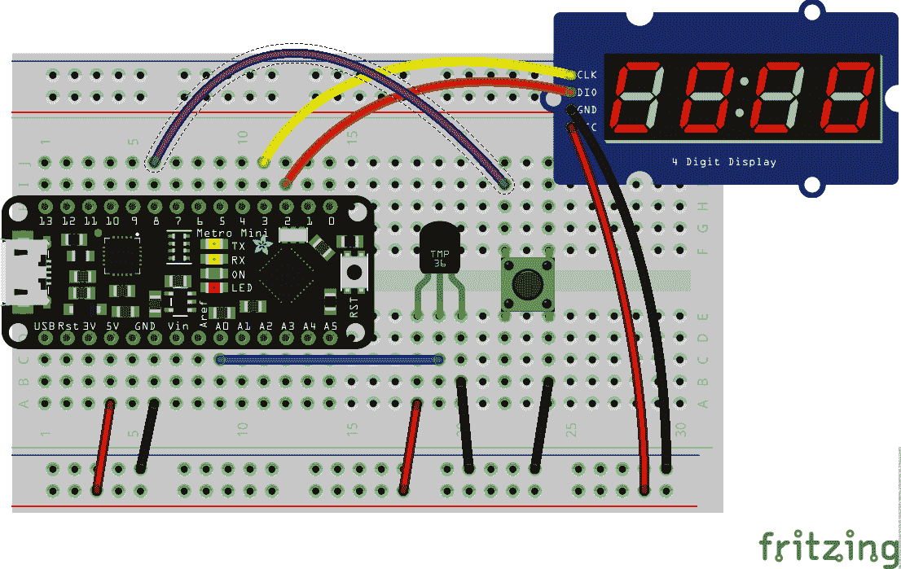

###### 图 9-6\. 我们传感器、显示器和按钮的接线

要使用按钮，我们需要将一个引脚设置为输入，然后在该引脚上使用`digitalRead()`函数。特别是，此按钮将使用`INPUT_PULLUP`常量。这种常见的方法会导致引脚的默认状态（当按钮未按下时）返回`HIGH`。当按下按钮时，引脚将读取`LOW`。我们可以监视该`LOW`值并使用它来触发更改，比如我们的华氏度/摄氏度选择。

但要小心！仅仅因为我们使用了`digitalRead()`函数并不意味着按钮是数字的。需要时间才能完全按下物理机制。完全释放也需要一点时间。总之，人类按下按钮所需时间比 Arduino 注册变化所需时间长得多。考虑这个简单的读取和更改循环片段：

```cpp
bool useC = false; // display temp in Celsius?

void loop() {
  // ...
  int toggle = digitalRead(BUTTON);
  if (toggle == LOW) {
    useC = !useC;
  }
  // ...
}
```

在最快的按压期间，引脚将低电平读取数十毫秒。我们的微控制器可以读取引脚并更改显示速度比我们放开按钮快得多，导致显示器在我们的 F 和 C 温度之间快速跳动。我们想要停止这种闪烁，因此在我们的代码中需要更聪明一些。我们需要*去抖动*按钮。去抖动的概念在很多用户界面工作中已经得到了推广——通常意味着确保在太短的时间内不报告多次按下（或点击或轻拍或其他什么）。

我将向您展示一些方法，可以用来实现去抖动行为。通常涉及保留一些额外的状态信息。对于第一种去抖动技术，我只需保持一个跟踪按钮状态第一次变化的`bool`标志。如果该标志为`true`，我们只需暂停一秒钟。（实际上，在“究竟有多热？”中，我们确实暂停了一秒钟，但您当然可以选择不同的延迟。）之后，我们可以再次读取另一个变化。

## 究竟有多热？

现在，让我们把所有这些新主题联系起来，为我们在图 9-6 中连接的组件创建代码。我们将在设置中初始化我们的显示器。在循环中，我们将读取温度，在串行监视器中打印一些调试语句，将温度以正确的单位显示在显示器上，然后观察按钮，看看我们是否需要更改这些单位。您可以打开[*ch09/temp_display/temp_display.ino*](https://oreil.ly/flVsn)或键入以下代码：

```cpp
// TMP36 is a 10-bit (0 - 1023) analog sensor
// 10mV / C with 500mV offset for temps below 0
// Our 4-digit display uses a TM1637 chip and I2C
#include <TM1637Display.h>

// Name our pins
#define TMP36_PIN 0
#define CLK       2
#define DIO       3
#define BUTTON    8

// Create our 4-segment display object
TM1637Display display(CLK, DIO);

// Build the letters "F" and "C"
// Segment bits run clockwise from top (bit 1) to center (64)
uint8_t segmentF[] = { 1 | 32 | 64 | 16 };
uint8_t segmentC[] = { 1 | 32 | 16 | 8 };

// Keep track of scale
bool useC = false;

// Manage button at human time
bool debounce = false;

void setup() {
  Serial.begin(115200);
  display.clear();
  display.setBrightness(0x0f);
  pinMode(BUTTON, INPUT_PULLUP);
}

void loop() {
  int raw = analogRead(TMP36_PIN);
  float asVolts = raw * 5.0 / 1024;  // Connected to 5V
  float asC = (asVolts - 0.5) * 100;
  int wholeC = (int)(asC + 0.5);
  int wholeF = (int)((asC * 1.8) + 32 + 0.5);
  Serial.print(raw);
  Serial.print(" ");
  Serial.println(asC);
  if (useC) {
    display.showNumberDec(wholeC, false, 3, 0);
    display.setSegments(segmentC, 1, 3);
  } else {
    display.showNumberDec(wholeF, false, 3, 0);
    display.setSegments(segmentF, 1, 3);
  }
  if (debounce) {
    debounce = false;
    delay(1000);
  } else {
    for (int i =0; i < 1000; i += 10) {
      int toggle = digitalRead(BUTTON);
      if (toggle == LOW) {
        useC = !useC;
        debounce = true;
        break;
      }
      delay(10);
    }
  }
}
```

注意我使用了 TM1637 库中的新函数：`setSegments()`。该函数允许您打开任何模式的 LED 段。您可以制作可爱的动画或呈现任何英文字母的粗略版本。您可以在图 9-7 中看到我的结果。

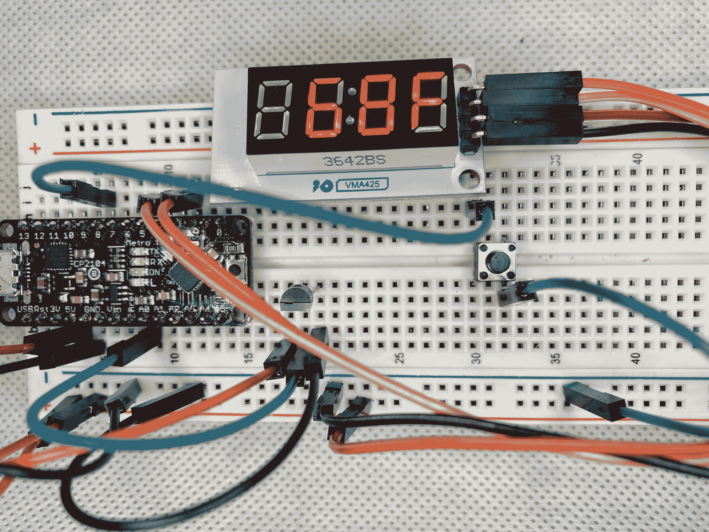

###### 图 9-7。我们 LED 显示器上的温度读数

给这个更大的示例尝试一下，使用你自己的设置。该项目位于*ch09*文件夹中，名为*temp_display*。你可以调整去抖动暂停时间，或尝试将“C”模式做成小写版本。调整现有项目是建立对新概念理解的好方法！说到新概念，有两个我想在 Arduino 平台上介绍的重要内容：内存管理和中断。

# Arduino 上的内存管理

在小型设备上，内存管理更加重要，因此我想重点介绍 Arduino 这样的微控制器上的内存工作原理。Arduino 有三种类型的内存。*Flash* 内存是存储程序的地方。*SRAM* 是 Arduino 有电源时程序运行的地方。最后，*EEPROM* 允许您在电源循环之间读写少量数据。让我们更详细地查看每种类型的内存，并看看如何在我们的代码中使用它们。

## Flash（PROGMEM）

如果“闪存”一词听起来很熟悉，那可能是因为确实如此。这与闪存（或拇指）驱动器中找到的存储器类型相同。它比像 RAM 这样的存储器速度慢得多，但通常与硬盘等存储器速度相当。它也是持久性的，不需要电源来保持其信息。这使其非常适合存储我们编译的草图。

在微控制器术语中，您可能还会听到一个不太熟悉的术语：*PROGMEM*或“程序存储器”。它是同一段存储器，但后一个术语告诉您更多关于我们如何使用该存储器的信息。

尽管这种闪存技术与你在拇指驱动器中找到的技术相同，但在我们的程序运行时，我们没有对这段内存的写访问权限。写入操作保留在 IDE 中的“上传”步骤中。芯片被置于修改模式，然后加载新程序。上传完成后，芯片重新启动，从闪存中读取新程序，然后开始运行。不过，我们确实有读取访问权限。

大多数 Arduino 芯片的闪存存储比编译程序所需的要多。您可以利用剩余空间来减少运行程序所需的 RAM 量。由于 RAM 几乎总是更有限的，这个功能可以带来真正的好处。您可以存储数组、字符串或单个值。在程序运行时，您可以使用特殊函数来获取这些存储的值。

### 在闪存中存储值

要将特定值放入闪存以供代码使用，可以在声明和初始化变量时使用特殊的`PROGMEM`修饰符。例如，我们可以存储适用于 RGBW NeoPixel 环的 32 位颜色数组，这些信息来自“C++ Considerations”：

```cpp
const PROGMEM uint32_t colors[] = {
  0xCC000000, 0x00CC0000, 0x0000CC00, 0x000000CC,
  0xCC336699, 0xCC663399, 0xCC339966, 0xCC996633
};
```

此时，`colors`数组不再是 32 位值的简单列表。它现在包含这些值在闪存中的位置。您需要一个特殊函数来访问此数组的内容。

### 从闪存中读取值

这些特殊函数在[*pgmspace.h*头文件](https://oreil.ly/nIk62)中定义。在 Arduino IDE 的最新版本中，该头文件是自动处理的“幕后”元素之一。有几个函数可用于读取 Arduino 支持的每种数据类型。Table 9-4 列出了我们项目中将使用的几个函数。

Table 9-4\. 程序存储器（闪存）读取函数

| 名称 | 描述 |
| --- | --- |
| `pgm_read_byte()` | 读取一个字节 |
| `pgm_read_word()` | 读取一个字（两个字节，类似于许多微控制器上的`int`） |
| `pgm_read_dword()` | 读取一个双字（四个字节，类似于`long`） |
| `pgm_read_float()` | 读取四个字节作为`float`或`double` |

如果我们想要从我们的`colors`数组中获取第一个条目以进行实际使用，我们可以使用`pgm_read_dword()`函数，如下所示：

```cpp
uint32_t firstColor = pgm_read_dword(&colors[0]);
```

这显然有点复杂。然而，当你的 RAM 不足时，复杂往往是一个公平的权衡。对于八种颜色的 32 字节来说并不多，但对于 256 色调色板呢？每种颜色占用四个字节，总共是一整个千字节。像我们的 Metro Mini 这样的一些微控制器只有微小的 2K 操作内存，因此将这样的调色板移到闪存中是一个很大的优势。

### 从闪存中读取字符串

将信息打印到串行监视器是调试程序的好方法，甚至只是作为一种廉价的状态指示器观察正在进行的操作。然而，你打印的每一个字符串都会消耗一些宝贵的运行时内存。将这些字符串移到闪存中是回收一些空间的好方法。你只需在需要的时候从闪存中提取你需要的字符串。如果将它放入一个通用的、可重复使用的缓冲区中，那么在运行时我们只需要为该缓冲区腾出内存。

这是一种非常常见的节省内存的技术，Arduino 环境中包含一个特殊的宏来简化这个回路：`F()`。 （关于宏和`#define`更多信息请见“预处理器宏”。）`F()`的使用非常简单，并且能够立即节省空间。假设我们有一些像这样的调试语句：

```cpp
setup() {
  Serial.begin(115200);
  Serial.println("Initializing...");
  // ...
  Serial.println("Setting pin modes...");
  // ...
  Serial.println("Ready");
}
```

在你的程序中可能还有其他变量等。在 Arduino IDE 中验证你的代码可能会产生类似于这样的输出：

```cpp
Sketch uses 4548 bytes (14%) of program storage space. Maximum is 32256 bytes.
Global variables use 275 bytes (13%) of dynamic memory,
leaving 1773 bytes for local variables. Maximum is 2048 bytes.
```

很好。目前我们有足够的空间，但 1773 字节并不多！现在让我们使用`F()`宏将这些字符串移到闪存中：

```cpp
setup() {
  Serial.begin(115200);
  Serial.println(F("Initializing..."));
  // ...
  Serial.println(F("Setting pin modes..."));
  // ...
  Serial.println(F("Ready"));
}
```

非常简单地整合进去，对吧？现在如果我们验证我们的程序，我们可以看到一个小但有利的变化：

```cpp
Sketch uses 4608 bytes (14%) of program storage space. Maximum is 32256 bytes.
Global variables use 225 bytes (10%) of dynamic memory,
leaving 1823 bytes for local variables. Maximum is 2048 bytes.
```

我们的新草图在闪存中占用了更多的空间，但在运行时占用的空间少了一些。这正是我们所追求的。显然，完全删除这些调试语句可以节省两种内存中的空间，但肯定有时你会拥有像迷你 LCD 显示器这样的漂亮外设。使用`F()`可以让你更轻松地获得更多的可操作空间。

## SRAM

我已经在“在运行时”和“操作内存”等术语中徘徊，还有其他一些术语。这些术语指的是一种叫做*SRAM*的内存类型。静态随机访问存储器是 Arduino 中等效于通常应用于更大系统的泛用 RAM 术语。⁷ Flash 是我们程序存储的地方，SRAM 是我们程序运行的地方。在你的程序运行时，堆栈和堆如图 6-3 所示都在 SRAM 中。你的程序的运行大小由你拥有的 SRAM 量限制。让我们来看看这个限制的一些影响。

### 堆栈和堆

回想一下关于全局变量和堆的讨论来自“本地变量和堆”。我提到如果你有太多变量或进行了太多嵌套函数调用，你可能会因此耗尽内存。如果你有像现代桌面系统那样的几千兆字节甚至几千兆字节内存，这是一个很大程度上的理论讨论。但 2K 呢？我们的 Metro Mini 和它微薄的 2K SRAM 怎么办？堆和栈——在运行时活跃，所以不是闪存的一部分——必须适应这个有限的空间，当我们运行我们的 Arduino 草图时。

想象一下重做来自图 6-3 的地址，以适应 2K 的情况。中间部分现在小得多了。现在很容易想象太多函数调用或太多全局变量或`malloc()`分配。如果你每行写出 32 字节（64 个十六进制字符），只需 64 行即可表示某些微控制器上 SRAM 的全部内容。这就是来自高中笔记本的一张双面纸！这意味着一个粗心的循环或大数组可能会超出我们的 SRAM，并导致程序崩溃。

例如，我们的递归斐波那契计算函数在几十次调用后就可以轻松填满可用内存——特别是因为我们仍然需要内存来控制 LED、传感器库等。在与微控制器一起工作时使用递归并不是被禁止的，但确实需要你在细节上多加注意。

### Arduino 中的全局变量

与桌面应用程序不同，其中全局变量（分配在堆上）几乎总是可选的（如果方便的话），Arduino 环境则经常使用它们。Arduino IDE 在我们创建一个可行的可执行程序时为我们做了很多工作。例如，请记住我们不需要编写自己的`main()`函数。因此，如果我们需要在`setup()`函数中初始化一个变量，然后在`loop()`函数中引用该变量，我们必须使用一个全局声明的变量。

这个事实并不是非常有争议。许多在线示例，当然还有这本书，都依赖于全局变量。但考虑到我们有限的空间，确实需要更多的细节注意力。例如，我经常使用`int`来表示任何我知道不会存储十亿数量级数字的数值变量。像`int count = 0;`这样的输入几乎已经成了肌肉记忆。好吧，如果我要计数连续的按钮按下，以便我可以区分单击、双击（甚至三击），这个计数很容易适合一个`byte`中。记住使用最小适当的数据类型是一个很好的习惯。

实际上，如果内存真的不够用，记住我们在“位操作符”中讨论过的操作符，你可以读取和操作单个位。如果你有两个按钮并且需要追踪可能的三次点击，这些计数可以都存储在一个`byte`变量中。事实上，你甚至可以在这个变量中存储四个按钮的计数。这肯定有点极端，但当你需要时，每个字节都很重要。我们不再处于桌面环境了，托托。

## EEPROM

如果你是从桌面计算机的领域转到 Arduino 的，你可能也注意到缺少文件系统的讨论。你可能不会对你的微控制器没有连接物理的 3.5 英寸硬盘感到惊讶，但长期读写存储的缺失可能让你措手不及。重启你的 Arduino，每个变量都会重新从头开始。许多令人满意的项目根本不需要这样的存储，但有些项目需要。幸运的是，许多控制器具有一定（有限）的电子可擦写程序只读存储器（EEPROM）存储值的能力。

并非每个微控制器都包含 EEPROM。事实上，有足够多的微控制器不包含 EEPROM，以至于 IDE 并不期望你使用这种类型的存储器。你必须手动包含*EEPROM.h*头文件来从这个区域存储和检索值。我们只需要这个库中的两个函数：`get()`和`put()`，但你可以在[EEPROM 库文档](https://oreil.ly/Hbgqn)中看到其他可用的函数。

这两个函数都接受两个参数：EEPROM 中的偏移量（文档中的“地址”）和一些“数据”，可以是`get()`的变量或结构体，或者是`put()`的文字值。例如，放入和取出一个`float`看起来可能像这样：

```cpp
#include <EEPROM.h>

float temperature;

void setup() {
  EEPROM.get(0, temperature);
  // ... other initialization stuff
}

void loop() {
  // ... things happen, temperature changes
  EEPROM.put(0, temperature);
  // things continue to happen ...
}
```

请注意，与我们用来接受用户输入的`scanf()`函数不同的是，在调用`get()`时，我没有在`temperature`变量前使用`&`。这个库会为你将值分配到正确的位置。通常在`setup()`期间从 EEPROM 读取，所以希望能小心一点并记住使用简单的变量而不是它们的地址。在上面的代码段中，`EEPROM.get()`会像我们期望的那样将 EEPROM 中存储的值填充到我们的`temperature`变量中。

使用`get()`和`put()`，并记住你在 EEPROM 中存储持久值的确切字节偏移量可能看起来很繁琐，我同意这一点。然而，作为回报，你完全控制了存入什么和如何检索它。只需确保正确管理地址。如果你要存储两个`float`数和一个`byte`，按顺序，你需要确保第二个`float`存储在地址 4，而`byte`存储在地址 8。或者更好的办法是使用`sizeof`来确保一个运行位置变量按照恰当的数量增加。

重要的是要知道，读写 EEPROM 是“昂贵”的，因为它不是一个快速的操作。EEPROM 还有读写次数的限制。你不太可能达到这些读写限制，而且速度对于初始化我们的小型项目来说是可以接受的，但 EEPROM 绝对不是 SRAM 的简单扩展。

## 记住选择

所有这些内存相关的东西确实很深奥。我觉得是时候再来一个厨房水槽示例了！让我们重新接线那个漂亮的 LED 环并添加一个触觉按钮来改变其颜色。我们还会将选择的颜色存储在 EEPROM 中，以便如果我们关闭 Arduino 并稍后重新打开它，环将以我们最近的选择点亮。这个项目只使用环和按钮，如图 9-8 所示。

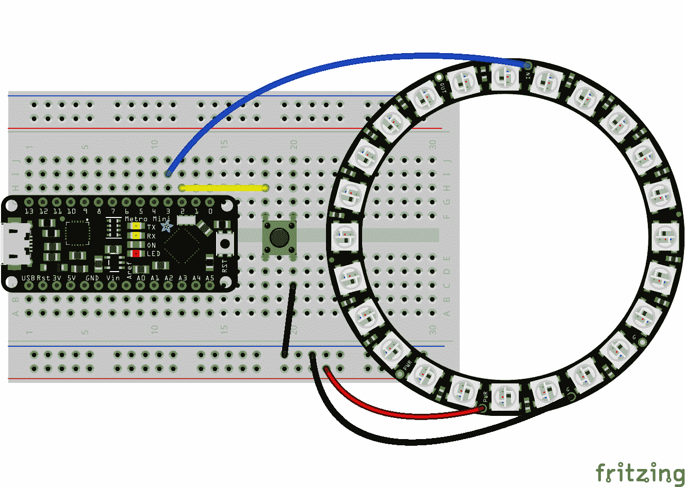

###### 图 9-8。我们 EEPROM 演示的布线，包括 LED 环和按钮

在此过程中，我们可以使用一种新的技术来去抖动按钮，甚至借用去抖动概念来减少对 EEPROM 的写入次数。当用户改变事物时，他们通常会接受你的提议并频繁更改它们。如果他们按下按钮更改颜色，我们将等待几秒钟再将该更改提交到 EEPROM，以防他们只是快速循环查看颜色选项。

如果你愿意接受挑战，在查看这里的代码之前，请尝试自己草绘（get it？）一个解决方案。但这是一个相当艰巨的挑战。如果你宁愿只是享受更改 LED 颜色的乐趣，请随意输入此代码或编译并上传[*ch09/ring_eeprom/ring_eeprom.ino*](https://oreil.ly/yir2G)。

```cpp
#include <Adafruit_NeoPixel.h>
#include <EEPROM.h>

#define RING_PIN    3
#define RING_COUNT 24
#define BUTTON_PIN  2

int previousState = HIGH;
int pause = 250;
int countdown = -1;

const PROGMEM uint32_t colors[] = {
  0xCC000000, 0x00CC0000, 0x0000CC00, 0x000000CC,
  0xCC336699, 0xCC663399, 0xCC339966, 0xCC996633
};
const byte colorCount = 8;
byte colorIndex;

Adafruit_NeoPixel ring(RING_COUNT, RING_PIN, NEO_GRBW);

void setup() {
  Serial.begin(115200);
  pinMode(BUTTON_PIN, INPUT_PULLUP);
  retrieveIndex();
  ring.begin();             // Initialize our ring
  ring.setBrightness(128);  // Set a comfortable mid-level brightness
  ring.fill(pgm_read_dword(&colors[colorIndex]));
  ring.show();
}

void loop() {
  int toggle = digitalRead(BUTTON_PIN);
  if (toggle != previousState) {
    if (toggle == LOW) {
      // "falling" state, so do our work
      previousState = LOW;
      colorIndex++;
      if (colorIndex >= colorCount) {
        colorIndex = 0;
      }
      ring.fill(pgm_read_dword(&colors[colorIndex]));
      ring.show();
      countdown = 10;
    } else {
      // "rising", just record the new state
      previousState = HIGH;
    }
  }
  if (countdown > 0) {
    countdown--;
  } else if (countdown == 0) {
    // Time's up! Record the current color index to EEPROM
    countdown = -1; // stop counting down
    storeIndex();
  }
  delay(100);
}

void retrieveIndex() {
  Serial.print(F("RETRIEVE ... "));
  EEPROM.get(0, colorIndex);
  if (colorIndex >= colorCount) {
    Serial.println(F("ERROR, using default"));
    // Got a bad value from EEPROM, use default of 0
    colorIndex = 0;
    // And try to store this good value
    storeIndex();
  } else {
    Serial.print(colorIndex);
    Serial.println(F(" OK"));
  }
}

void storeIndex() {
  Serial.print(F("STORE ... "));
  Serial.print(colorIndex);
  EEPROM.put(0, colorIndex);
  Serial.println(F(" OK"));
}
```

这个程序有三个部分我特别想强调。第一个是使用`previousState`变量来跟踪我们按钮的状态。我不使用布尔值来知道我们是否处于去抖动周期中，而是仅在我注意到它从`HIGH`状态变为`LOW`状态时才执行按钮按下操作。工作量大致相同，但我想向你展示一个替代方法。

另外两个有趣的部分是底部的函数`retrieveIndex()`和`storeIndex()`。在这里你可以看到 EEPROM 函数的使用。存储索引很简单，但我在读取索引时添加了一个安全检查，以确保它是一个有效的值。

# 中断

还有一个很酷的功能可以简化处理像我们的触觉按钮输入的代码。虽然不是 Arduino 特有的，但*中断*的使用对许多桌面或 Web 开发者来说不再陌生。中断是硬件信号，可以触发软件响应。中断可以让你知道某些网络数据已到达，或者 USB 设备已连接，或者可能有键被按下。它们得名于它们“中断”了程序的正常流程并将控制传输到其他地方的有利事实。

我说有利，因为中断可以显著简化担心异步、不可靠事件的过程。想想在键盘上打字。您的操作系统可以通过运行一个大循环并逐个检查每个键来“监听”是否有键被按下。多么乏味的任务。即使我们稍微抽象一下，让操作系统询问是否有*任何*键被按下，我们也需要询问每个输入设备。每个硬盘驱动器，每个闪存驱动器，鼠标，麦克风，每个 USB 端口等等。这种轮询的方式并不是我们想担心的事情。中断消除了这种担忧。当按下键时，会发送一个信号告知您的计算机去检查键盘。这是一个按需系统。

当出现这种需求时，计算机通常会调用您提供的函数，以处理相关的中断。您注册一个处理程序，操作系统管理停止任何其他正在进行的操作，并切换到该处理程序。

在 Arduino 项目中，您可以为各种输入设备（如我们的触摸按钮）使用中断。与以往的一些项目中轮询按钮不同，我们可以注册一个函数来处理按钮按下事件。我们的循环中不再提及按钮。没有轮询，没有去抖动标志或计时器，什么都没有。微控制器正在进行内部工作，监视其每个引脚，当其中一个引脚发生变化时（例如连接到我们的按钮的引脚），触发中断并跳转到我们注册的函数。

## 中断服务程序

中断服务程序（ISR）实际上只是一个函数。但是您确实希望遵守一些规则和准则：

+   ISR 不能有任何参数（规则）

+   ISR 不应返回任何值（准则）

+   像`delay()`和`millis()`这样的定时函数本身使用中断，因此您不能在 ISR 内部使用它们（规则）⁸

+   因为您在 ISR 内部“阻塞了线路”，所以这些函数应尽可能快地运行（准则）

要在 Arduino 中注册中断服务程序（ISR），您需要使用`attachInterrupt()`函数。该函数接受三个参数：

+   要监听的中断：使用函数`digitalPinToInterrupt(pin)`作为此参数

+   ISR：只需提供您想使用的函数名称

+   模式之一：

    +   `LOW`：在引脚为 LOW 时触发

    +   `CHANGE`：在引脚值发生任何变化时触发

    +   `RISING`：在引脚从`LOW`到`HIGH`时触发

    +   `FALLING`：在引脚从`HIGH`到`LOW`时触发

    +   `HIGH`：一些——但不是所有——板支持在引脚为`HIGH`时触发中断

如果不再需要处理中断，可以使用`detachInterrupt()`。该函数接受一个参数，即与`attachInterrupt()`的第一个参数相同的`digitalPinToInterrupt(pin)`。（这个辅助函数正确地将您的引脚号转换为必要的中断号。不建议直接提供中断号。）

## 中断驱动编程

让我们再深入一个项目，尝试利用中断。我们将拿出 LED 环，并依次点亮一个 LED，形成循环动画。我们将使用一个按钮来改变循环速度。我们确实可以编写这种类型的程序而不使用中断，但我认为您会喜欢这个项目比我们轮询按钮改变 LED 环颜色的示例要干净得多。实际上，我们将使用与该项目相同的硬件设置。如果需要重新创建，可以回顾图 9-8。

如往常一样，随意获取这个示例（[*ch09/ring_interrupt/ring_interrupt.ino*](https://oreil.ly/iZ5JJ)），或者自己输入。本项目唯一的接线是将 NeoPixel 环的电源和地线连接到微控制器上的适当引脚以及数据线。您需要查看您的开发板文档，了解支持中断的引脚。对于我们的 Metro Mini（兼容 Arduino Uno），我们可以使用引脚 2 或引脚 3：

```cpp
#include <Adafruit_NeoPixel.h>

#define RING_PIN    3
#define RING_COUNT 24
#define BUTTON_PIN  2

int pause = 1000;                                            

Adafruit_NeoPixel ring(RING_COUNT, RING_PIN, NEO_GRBW);

void nextPause() {                                           
  if (pause == 250) {
    pause = 1000;
  } else {
    pause /= 2;
  }
}

void setup() {
  pinMode(BUTTON_PIN, INPUT_PULLUP);                         
  attachInterrupt(digitalPinToInterrupt(BUTTON_PIN),         
      nextPause, FALLING);
  ring.begin();             // Initialize our ring 
  ring.setBrightness(128);  // Set a comfortable brightness
  ring.show();              // Start with all pixels off }

void loop() {
  for (int p = 0; p < RING_COUNT; p++) {                     
    ring.clear();
    ring.setPixelColor(p, 0, 255, 0, 0);
    ring.show();
    delay(pause);
  }
}
```


为我们的环形动画设置初始暂停持续时间为 1 秒。


创建一个简洁的函数来响应按钮按下事件，通过不同的暂停持续时间进行循环。


将我们的按钮引脚设置为`INPUT_PULLUP`，就像以前一样。


配置`nextPause()`以处理按钮按下的事件。


像以前一样设置我们的 LED 环。


我们的动画循环不必包含任何按钮轮询逻辑（万岁！）。

希望这比我们包含按钮的其他项目更简单。我们的`loop()`函数专门用于驱动动画像素绕环运动。尽管我使用`FALLING`模式触发中断，但对于这个例子，我们同样可以轻松使用`RISING`。如果你对效果感到好奇，改变这种模式是一个很好的调整。

# 练习

现在我们已经看到几个 Sketch 在 Arduino 环境中运行，并利用了一些有趣的外设，这里有几个小项目可以测试您的新技能。我包含了我的设置的接线图，但您当然可以根据需要安排组件，并使用适合您微控制器的引脚。解决方案在[*ch09/exercises*](https://oreil.ly/ezhYB)文件夹中。

1.  *自动夜灯*。使用光敏电阻和 LED（参见图 9-9），创建一个根据光线减少增加 LED 亮度的夜灯。尝试使用`map()`函数将传感器读数转换为适当的 LED 值。（可以使用 NeoPixel 或带有 PWM 的常规 LED。）

    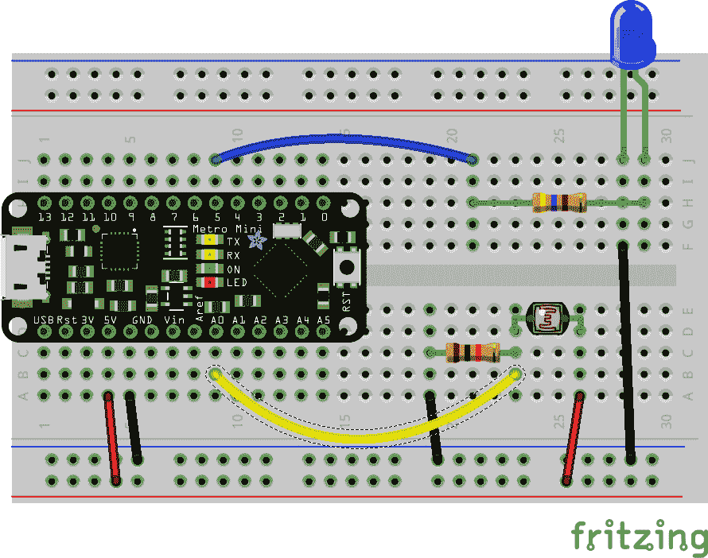

    ###### 图 9-9\. 自动夜灯的接线图

1.  *秒表*。使用我们的 4 位数显示器和一个按钮（参见图 9-10），创建一个秒表。第一次按下按钮时，秒表开始并跟踪经过的秒数（最多 99:99 秒）。再次按下按钮将停止计数。第三次按下将秒表重置为 0:00。

    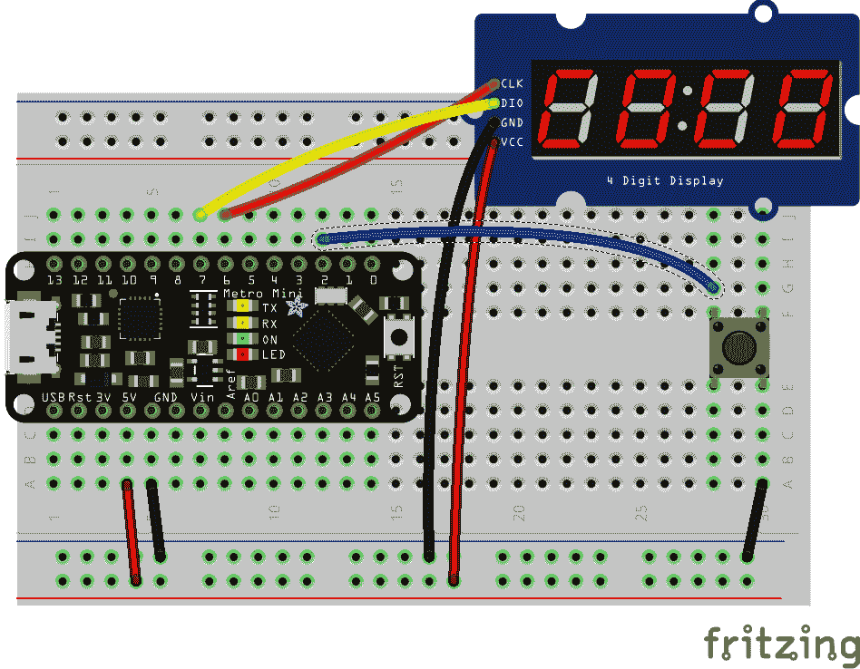

    ###### 图 9-10\. 简易秒表的接线图

1.  *计分板*。使用四个按钮和一个 4 位数显示器（参见图 9-11），为两支队伍运行一个小型计分板。显示器的左两位数字为队伍 1 的得分，右两位数字为队伍 2 的得分。每支队伍使用两个按钮：一个增加得分，一个减少得分。从小处着手，逐步构建。先让一个按钮起作用。然后让一个队伍运作。最后让两支队伍都能运行。您可能需要查阅分段显示库的文档，以确保您可以更新一支队伍的分数而不干扰另一支队伍的分数。

    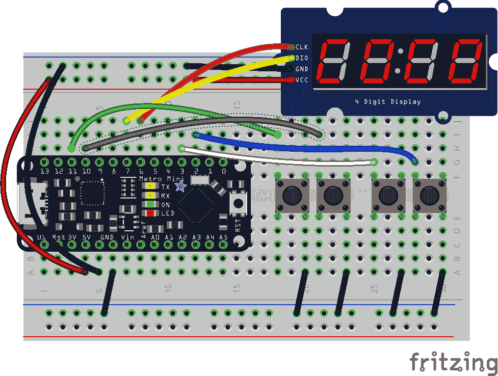

    ###### 图 9-11\. 计分板的接线图

# 下一步

天哪，那真是一大堆代码。但我真诚地希望您喜欢我们在 Arduino 编程可用功能和特性之旅中的表演。我们尝试了几个新的外设，并介绍了 Arduino 程序员如何处理有限内存的方法。我们还介绍了[中断](https://oreil.ly/z4YpN)的主题。您完全可以感到不知所措！但希望不要灰心。如果有任何示例不清楚，请让它们静置一两天，然后再试一次。

下一章不会像这一章那样紧张。在讨论内存时，我们看到在处理微控制器时有时候需要有些技巧。我们将通过一个简单的例子来看看如何集中精力优化一些常见的 Arduino 编程模式。这些优化在台式机上当然也是有效的，只是可能影响不会那么大。但现在，我们仍然专注于 Arduino，所以继续阅读，看看几个小改变可以产生多大的影响！

¹ 通用 C 语言称这些命名值为*符号常量*。我将使用未限定的“常量”来与 Arduino 文档匹配。

² 对于 GCC 而言是正确的，但某些编译器使用完全分开的可执行文件进行预处理和编译。

³ Arduino 语言为这些函数提供了一些具有稍微不同大小写的替代名称，可能更易读，例如`isDigit()`和`isUpperCase()`。

⁴ 在典型的引脚布局图上，可以进行 PWM 的数字引脚通常有一个~前缀或其他明显标记。

⁵ 其他流行的驱动芯片，如 MAX7219，会有类似的搜索结果。

⁶ 如果你正在使用类似的显示器，它在[GitHub](https://oreil.ly/RVv2F)上有一个很好文档化的存储库。

⁷ 动态随机存取存储器，或称*DRAM*，是你可以购买并物理插入老旧的 Windows 7 机箱以延长一年寿命的内存类型。“动态”一词表明此 RAM 需要定期刷新一小段电源来维持—与不需要的 SRAM 相对。然而，两种类型都需要*一些*电源，因此被称为*挥发性*，因为在电源循环期间它们的内容将被重置。

⁸ `micros()`函数可以工作，但只能持续一两毫秒。`delayMicroseconds()`使用了不同的机制来暂停，所以实际上可以使用。但如果可能的话，你真的不想在 ISR 内部延迟。
