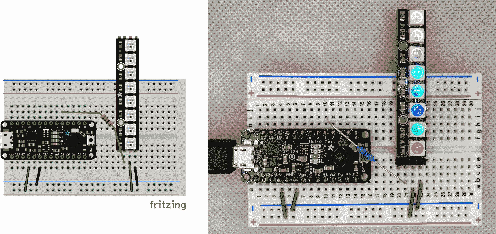

# 第十章 快速代码

我在第一章的一开始就提到，C 语言是为了那些有限资源的机器设计的——至少按照今天的标准来看是这样。微控制器也有许多相同的限制，这使得 C 语言成为一个相当自然的开发语言选择。事实上，如果你想从一个微小的芯片中获得最大可能的性能，C 语言直接操作内存地址的能力，正如我们在“C 中的地址”中所看到的那样，是无与伦比的，尽管有些乏味。¹

我很高兴地告诉你，即使没有深入研究数据表（由组件和微控制器制造商编制的严肃技术规格书），你也可以采用几个简单的技巧来加速你的代码。但请记住，有时候“足够好”就已经足够了！首先尝试使用你知道的模式来使你的代码运行。你的程序是否运行？它是否做你需要的事情？如果是，我在本章中强调的有趣的选项，如使用整数而不是浮点数或展开循环，仅仅是有趣的。它们并不一定“更好”，当然也不是必需的。通常情况下。Arduino 及其同类产品显然比桌面电脑更有限。有时你的程序可能无法运行或没有完全按照你的需求工作。在这些情况下，考虑采用以下优化方法。

# 设置

我不打算向你介绍一堆新的小工具、配置和接线图，而是会专注于类似我们在第八章中进行的首个 Arduino 项目的硬件设置。我们将使用一个 NeoPixel 条。图 10-1 展示了通常的接线图和我连接（和供电）好的 Metro Mini。



###### 图 10-1 我们简单的 LED 设置

接下来，我们将从“尝试 Arduino 的‘东西’”中借鉴“呼吸”逻辑，并将其应用到条中的每个像素。与其从随机颜色开始，我们将简单地分配一些漂亮的彩虹色。顺便说一句，随意调整颜色。选择一个你喜欢盯着看的调色板；我们将使用这个草图作为本章中每个优化的基础。

打开[*ch10/optimize/optimize.ino*](https://oreil.ly/UHE04)，并在你自己的设置上试一试。如有需要，请调整`LED_PIN`和`LED_COUNT`的值。

```cpp
#include <Adafruit_NeoPixel.h>

#define LED_PIN     4
#define LED_COUNT   8
#define RATE     5000
#define PI_2 6.283185

Adafruit_NeoPixel stick(LED_COUNT, LED_PIN, NEO_GRB);
uint32_t colors[] = {
  0xFF0000, 0x00FF00, 0x0000FF, 0x3377FF,
  0x00FFFF, 0xFF00FF, 0xFFFF00, 0xFF7733
};

void setup() {
  Serial.begin(115200);
  stick.begin();             // Initialize our LEDs
  stick.setBrightness(128);  // Set a comfortable brightness
  // Show our colors for a few seconds before animating
  for (byte p = 0; p < LED_COUNT; p++) {
    stick.setPixelColor(p, colors[p]);
  }
  stick.show();
  delay(RATE);
}

void loop() {
  double ms_in_radians = (millis() % RATE) * PI_2 / RATE;
  double breath = (sin(ms_in_radians) + 1.0) / 2.0;
  for (byte p = 0; p < LED_COUNT; p++) {
    byte red   = (colors[p] & 0xFF0000) >> 16;
    byte green = (colors[p] & 0x00FF00) >> 8;
    byte blue  = colors[p] & 0x0000FF;
    red = (byte)(red * breath);
    green = (byte)(green * breath);
    blue = (byte)(blue * breath);
    stick.setPixelColor(p, red, green, blue);
  }
  stick.show();
  delay(10);
}
```

有了这个最小的示例，我们可以看看一些提升性能的流行技术。其中许多技术都位于权衡的领域。许多技术会在 flash 存储器或 SRAM 中占用一些额外的存储空间，以换取在`loop()`函数中所需执行工作的加速。然而，有些则是涉及到作为程序员的你的时间和精力的权衡。但再次强调，如果你的程序已经按照你的要求正常运行，后续的调整并没有什么特别优越之处。 :)

# 浮点数与整数运算

当今，很多计算机硬件媒体都在讨论各种厂商提供的越来越强大的 GPU（图形处理单元，专注于显示和操作图形的令人印象深刻的芯片）。但不久之前，你也可以谈论单独的 FPU，即浮点运算单元（专注于执行和加速浮点运算）。² 浮点数计算需要强大的处理能力，而电脑的普遍性能足够强大，才能集成这样的精细计算。

令人高兴的是，我们的计算机在性能上取得了长足的进步（同时体积也在缩小），Arduino 项目确实可以访问良好的浮点支持和使用浮点数学如三角函数的更高级功能。但进行这样的数学计算仍然需要比纯整数计算更多的处理能力。如果你经常浏览[Arduino 论坛](https://oreil.ly/xT1E6)，你会看到关于浮点数计算所需时间是整数操作数计算两倍甚至更多的轶事。

###### 注意

值得指出的是，在微控制器上，`float`和`double`并不总是像在台式机上那样的 4 字节和 8 字节类型。例如，在 Metro Mini 上（使用 16MHz 的 ATmega328P 芯片），这两种类型都是 4 字节。这个事实可能不会造成太多麻烦，但万一你需要真正高精度的浮点数，可能需要找一个库来帮助解决。

## 浮点数计算替代方案

许多时候，程序员在使用浮点数时并没有真正考虑到成本。十进制数和分数无处不在：汽车油表，油价，税率，小费百分比等等。在某些情况下使用它们是有意义的，特别是在输出供人类阅读的信息时。（例如，我们将 TMP36 传感器的原始电压读数从“分段显示”转换为浮点度数。）

但是，如果我们只是在内部进行一些工作，而不向用户展示这些结果，有时候我们可以用整数来得到相同的结果。考虑这两个计算：

```cpp
int dozen = 12;
int six = dozen * 0.5;
int half_a_dozen = dozen / 2;
```

`six`和`half_a_dozen`都包含整数值 6，但乘以 0.5 会更耗费计算资源。这个例子显然是虚构的，但只是略有变通。让我们来看看我们的`breath`计算，并考虑我们到底想做什么：

```cpp
  double ms_in_radians = (millis() % RATE) * PI_2 / RATE;
  double breath = (sin(ms_in_radians) + 1.0) / 2.0;
  // ...
  red = (byte)(red * breath);
```

我们正在将一个不断增长的计数转换为介于 0.0 和 1.0 之间的值。然后我们将这个值乘以来给我们的各种颜色一个“部分”。然而，最终结果仍然是一个`byte`值。我们从不使用 140.7 个单位的红色，我们只使用 140。我们真正想做的是将一个值从范围（0 到`RATE`）转换为范围（0 到 255）中的值，沿着波浪形曲线。

恰好这项任务在 LED 应用中非常常见——正如我们所见，它可用于漂亮的淡入淡出动画。NeoPixel 库中有一个非常漂亮的 `sine8()` 函数，它使用 `uint8_t` 值作为输入和输出，近似计算正弦函数。 `sine8()` 将输入范围（0 到 255）视为经典弧度范围（0 到 2π），然后将其输出值视为正弦波的经典（-1 到 1）范围内的值，介于 0 和 255 之间。

那听起来可能有点数学化，但关键是我们可以通过将（递增的）毫秒限制在（0 到 255）范围内，并使用 `sine8()` 函数来获取在 0 到 255 之间循环的值来实现亮度动画。然后，我们可以将 `breath / 255` 视为一个带有所有整数部分的分数。这使我们能够应用我们的 `half_a_dozen` 技巧。与其乘以 0.0 到 1.0 之间的浮点值，不如乘以 `breath`，然后除以 255：

```cpp
  uint8_t ms = (millis() % RATE) / 20; // close enough :)
  uint8_t breath = stick.sine8(ms);
  // ...
  red = red * breath / 255;
```

棒极了！但要小心不要在我们的“分数” `breath / 255` 周围使用括号。虽然这可能读起来更好，并突出显示我们所追求的比例值，在整数运算中，将一个较小的数（介于 0 和 255 之间的值）除以一个较大的数（始终为 255）将只会得到 0，除了 255/255 的最后一种情况，这将确实得到 1。

## 整数运算与非数学运算

你知道什么比整数运算更好吗？根本不需要数学！有时候，一点点规划可以产生很大的差别。看看我们如何使用 `colors` 数组。我们在 `setup()` 中仅使用实际的完整 32 位值一次。然而，在 `loop()` 中，我们将这些颜色分解为它们各自的红色、绿色和蓝色部分。而我们每 10 毫秒都这样做。天哪！所以，与其存储单个 32 位值，为什么不从一开始就存储单独的字节？如果我们想的话，我们可以使用一个二维 `byte` 数组：

```cpp
---
byte colors[8][3] = {
  { 0xFF, 0x00, 0x00 }, { 0x00, 0xFF, 0x00 },
  { 0x00, 0x00, 0xFF }, { 0x33, 0x77, 0xFF },
  { 0x00, 0xFF, 0xFF }, { 0xFF, 0x00, 0xFF },
  { 0xFF, 0xFF, 0x00 }, { 0xFF, 0x77, 0x33 }
};
---
```

我们也可以将它们存储在一个简单的单一数组中，并根据需要执行少量的数学运算来获取绿色和蓝色索引值：

```cpp
---
byte colors[] = {
  0xFF, 0x00, 0x00,   0x00, 0xFF, 0x00,
  0x00, 0x00, 0xFF,   0x33, 0x77, 0xFF,
  0x00, 0xFF, 0xFF,   0xFF, 0x00, 0xFF,
  0xFF, 0xFF, 0x00,   0xFF, 0x77, 0x33
};
---
```

而且，这两种选项都节省了八个字节的存储空间！由于这两个选项都要求使用第二个索引或对单个索引进行一些数学处理，所以你可以选择哪种更容易。以下是我们如何在 `setup()` 中修改初始显示和在 `loop()` 中更有趣的用法，采用二维方法：

```cpp
void setup() {
  // ...
  for (byte p = 0; p < LED_COUNT; p++) {
    stick.setPixelColor(p, colors[p][0], colors[p][1], colors[p][2]);
  }
  // ...
}

void loop() {
  // ...
  for (byte p = 0; p < LED_COUNT; p++) {
    byte red   = (byte)(colors[p][0] * breath);
    byte green = (byte)(colors[p][1] * breath);
    byte blue  = (byte)(colors[p][2] * breath);
    stick.setPixelColor(p, red, green, blue);
  }
  // ...
}
```

这绝对感觉更简单。虽然这并不总是正确的，但我喜欢 C 语言的一点是看起来很少欺骗人。C 语言确实能在小设备上发挥奇迹，但这种奇迹通常是公开的。因此，编写干净、简单的代码通常会提高可读性 *和* 性能。

## 查找表

尽管不及无数学计算好，但仅执行一次常见计算，然后存储答案以便重复使用，几乎可以媲美。如果我们查看`loop()`函数内执行的计算，基本上有两个：一个是将当前的`millis()`值转换为分数，然后是将该函数应用于我们的颜色通道（虽然对于每个通道是分开的）。摆脱这些计算将是极好的。

当存储空间比处理能力多时（另一种权衡），一个流行的技巧是使用*查找表*。您可以提前运行您需要的每个计算，并将答案存储在数组中。然后，当您需要其中一个答案时，只需从数组中取出正确的条目即可。

取决于您想存储的计算的费用如何，创建查找表有两种选择。如果不太昂贵，您可以在需要之前在运行时构建表格。（例如，在 Arduino 项目中，我们可以使用`setup()`函数来完成此工作。然后在`loop()`函数中从数组中读取。）如果计算实在太昂贵，您可以在“离线”完成所有工作，然后只需将结果转录到您的程序中，并在声明时使用大量的文字值初始化数组。

对于有限的内存，这种优化并不总是有意义。填充一个大型全局数组可能会对您的程序的其余部分造成太大的压力。但是如果计算足够昂贵，甚至从稍慢的闪存中读取也变得可行，您可以将查找表存储在那里。在后一种情况下，当然，您必须在声明时进行离线计算并在`PROGMEM`中初始化数组。

## 到目前为止的项目

让我们把我们的查找表（我们将在`setup()`中构建）和我们的简单数学方法投入使用。当您开始优化项目时，最好逐步尝试您的想法。这种渐进式方法使您不太可能破坏任何东西。但是，如果确实出现了问题，渐进式方法应该会使修复或者重新开始变得更容易。这里是[*ch10/optimize2/optimize2.ino*](https://oreil.ly/eDKmd)：

```cpp
#include <Adafruit_NeoPixel.h>

#define LED_PIN     4
#define LED_COUNT   8
#define RATE     5000

Adafruit_NeoPixel stick(LED_COUNT, LED_PIN, NEO_GRB);
byte colors[8][3] = {                                    
  { 0xFF, 0x00, 0x00 }, { 0x00, 0xFF, 0x00 },
  { 0x00, 0x00, 0xFF }, { 0x33, 0x77, 0xFF },
  { 0x00, 0xFF, 0xFF }, { 0xFF, 0x00, 0xFF },
  { 0xFF, 0xFF, 0x00 }, { 0xFF, 0x77, 0x33 }
};

uint8_t breaths[256];                                    

void setup() {
  Serial.begin(115200);
  stick.begin();            // Initialize our LEDs
  stick.setBrightness(80);  // Set a comfortable brightness
  // Show our colors for a few seconds before animating
  for (byte p = 0; p < LED_COUNT; p++) {
    stick.setPixelColor(p,                               
        colors[p][0], colors[p][1], colors[p][2]);
  }
  stick.show();
  // Now initialize our sine lookup table
  for (int s = 0; s <= 255; s++) {                       
    breaths[s] = stick.sine8(s);
  }
  delay(2000);
}

void loop() {
  uint8_t ms = (millis() % RATE) / 20;                   
  uint8_t breath = breaths[ms];                          
  for (byte p = 0; p < LED_COUNT; p++) {
    byte red   = colors[p][0] * breath / 255;
    byte green = colors[p][1] * breath / 255;
    byte blue  = colors[p][2] * breath / 255;
    stick.setPixelColor(p, red, green, blue);
  }
  stick.show();
  delay(10);
}
```


将我们的像素颜色分解成二维数组（以便在`loop()`中更容易进行计算）。


创建一个全局变量用于我们的查找表，这样我们可以在`setup()`中初始化它并在`loop()`中引用它。


使用一个替代函数设置像素颜色，该函数接受单独的红色、绿色和蓝色值。


使用 NeoPixel 库中方便（且快速）的`sine8()`函数填充我们的正弦值查找表。


简化我们从毫秒到查找索引的转换。


现在把我们的查找表值用于计算当前亮度。

您肯定可以在您的控制器上尝试一下，但希望您的 LED 灯带的行为是相同的。我们在处理更多调整之前，确保您理解我们所做的更改的意图。

###### 警告

注意，我在`breaths`数组初始化时使用了一个`int`变量。由于我们需要到达`byte`可以存储的边缘（即，我们需要使用 255），我们不能使用字节大小的变量作为索引值。在增加`s`时，调整步骤将在`s`等于 255 时多执行一次，将其推到 256。但是对于`byte`变量，这种推动会强制变量回滚到 0。回滚后，我们检查循环条件。由于 0 小于或等于 255，我们继续进行。第一次编写初始化循环时，我犯了这个错误。花了我几分钟的时间弄清楚为什么`setup()`函数永远不会结束！

# 2 的力量

在你的技巧包中保留一个与数学相关的优化：使用位操作而不是乘法和除法。乘法不便宜。除法非常昂贵。在微控制器上，这些操作可能非常昂贵，除非你乘以或除以 2 或 2 的幂次方（即 4、8、1024 等）。余数运算（`%`）实际上也是一种除法运算，因此也很昂贵，除非可以使用 2 的幂次方。

我们已经从我们的呼吸循环中删除了许多昂贵的步骤，但我们仍然有一些余数和除法操作。让我们看看 2 的幂次方如何在这些计算中起作用。

当我们将颜色乘以我们的`breath`变量并除以 255 来获取正确的颜色深度时，我们试图确保该颜色深度在 0 到 255 的范围内。我们创建的这个分数的分母与 2 的幂非常接近，即 255 几乎等于 256。例如，考虑我们最亮的红色。理想情况下，我们希望在 LED 上显示值 255。我们目前使用的计算如下所示：

```cpp
  red = red * breath / 255;
  //  = 255 *   255  / 255;
  //  = 65025 / 255;
  //  = 255
```

这个计算结果是 255，这正是我们想要的。但我说过，通过 256 进行除法会加快速度。我很快会向您展示，但首先让我们探讨一个重要的问题：通过 256 而不是 255 进行除法是否可以接受？好吧，65025 / 256 约等于 254.004。对于 LED 来说，这绝对足够接近。那么，通过 256 进行除法比通过 255 进行除法更快的原因是什么呢？

结果表明，对于具有二进制智能的计算机来说，除以 2 的幂次方等同于使用右移运算符`>>`。与除法相比，这速度非常快。因此，我们的`red`近似可以这样计算：

```cpp
  red = (red * breath) >> 8;
```

你只需按照你的 2 的幂次数进行移位；例如，除以 2（2¹）意味着向右移动 1 位。除以 256（2⁸）意味着向右移动 8 位。同样，乘以 2 的幂次数也是一样的；你只需左移。需要将一个值乘以四倍？将其左移 2 位（2² == 4）。棒极了！而且更重要的是，速度快。计算机只需移动一些位，这种工作与乘除算法相比非常简单，尽管结果相同。

那么余数呢？它们和除法一样昂贵，因为你在找到剩余量时执行了除法。但如果你使用`%`和二的幂次，那可以用按位`&`操作和正确的*掩码*来表示。你经常会听说比特“掩码”，它们只是保留某些比特位但隐藏（或掩盖）其他位的数字。要找到除以 64（2⁶）的余数，比如说，你创建一个 6 位的掩码：0x3f。（结果为 63，或者 64-1。）如果我们将我们的呼吸速率调整为约四秒（4096 毫秒，或 2¹²，更精确一些），我们可以像这样重新编写我们的毫秒转换：

```cpp
  uint8_t ms = (millis() & 0x0fff) / 20;  // Bit mask with 12 bits
```

而且因为我们真的希望`ms`值位于 0 到 255 的范围内，这样才能作为我们查找表的适当索引，我们可以将该除法转换为另一个带有对除数的小调整的移位操作（5000 / 20 约等于 4095 / 16）：

```cpp
  uint8_t ms = (millis() & 0x0fff) >> 4;
```

不错。一点也不错。不过，我们确实需要调整我们的呼吸速率。记住本章开头的警告：如果能运行，那就是好的！如果你能得到一个满意的动画，包括所有浮点数运算和像 5 秒这样的整数时间，那么你的项目就是成功的。但如果你没有得到想要的结果，考虑调整以利用这些优化技巧。

# 循环优化

我们还可以对我们的呼吸 LED 草图进行一些聪明的改动，让它运行得更快。循环部分通常为了可读性和可重用性而牺牲了一些性能。当性能是最重要的目标时，你可以通过减少可重用性来夺回一点速度。

## 为了乐趣和利润展开

这种优化的动机在于管理循环需要一点时间。在我们的`loop()`函数中，我们有一个`for`循环，为我们的小棒上的每个 LED 设置颜色。更新一个 LED 后，我们必须增加`p`变量，然后测试是否还有更多 LED 需要处理。这些步骤虽小，但并非无关紧要。如果你在计算微秒，这些时间可能就不能轻易浪费了。

为了节省这些微秒，你可以*展开*或*解开*你的循环。基本上，你将循环体简单地复制一次，每次需要迭代，然后硬编码控制变量（在我们的例子中是`p`）。我希望你尝试一些这样的优化作为良好的实践，所以我不会完全展开`for`循环。我们还可以使用`>>`技巧来替换计算红/蓝/绿值时所需的除法。更新前几个 LED 将会像这样：

```cpp
void loop() {
  uint8_t ms = (millis() & 0x0fff) >> 4;
  uint8_t breath = breaths[ms];

  byte red, green, blue;

  // Pixel 0
  red   = (colors[0][0] * breath) >> 8;
  green = (colors[0][1] * breath) >> 8;
  blue  = (colors[0][2] * breath) >> 8;
  stick.setPixelColor(0, red, green, blue);

  // Pixel 1
  red   = (colors[1][0] * breath) >> 8;
  green = (colors[1][1] * breath) >> 8;
  blue  = (colors[1][2] * breath) >> 8;
  stick.setPixelColor(1, red, green, blue);

  // Pixel 2
  // ...

  stick.show();
  delay(10);
}
```

和其他优化一样，这里也存在一个折衷：我们将用未展开的循环消耗更多的程序空间。但是，我们的目标是性能——只要我们有空间。确保在展开循环之前正确地使循环工作。隐藏在未展开循环中的任何错误都将需要繁琐的复制和粘贴来修复每个扩展块。

## 递归与迭代

还有另一种循环选项，这不完全是一种优化，但值得一提。在内存有限的设备上，递归算法很快就会失控。幸运的是，每个递归算法也可以用迭代的方式编写。有时循环方法并不直观，或者看起来笨拙，但它确实有效。如果你担心代码中的递归调用，考虑将它们转换为带有额外变量的循环来帮助解决问题。

作为一个快速演示，让我们来看看找到第 n 个斐波那契数的循环方法（以替换我们之前在“递归函数”中编码的递归算法）。我们可以使用一个`for`循环和三个变量：

```cpp
int find = 8; // we want the 8th Fibonacci number in this example
int antepenultimate = 0; // F(n - 2)
int penultimate = 0;     // F(n - 1)
int ultimate = 1;        // F(n)

for (int f = 1; f < find; f++) {
  antepenultimate = penultimate;
  penultimate = ultimate;
  ultimate = penultimate + antepenultimate;
}
// After the loop completes, ultimate contains the answer, 21
```

你可能还记得，递归算法在处理较大数字时会变得很慢。这种情况在这里不会发生。数字最终会变得非常大，所以你可能需要类似`long long`来存储结果，但算法将继续快速运行。那么为什么我们不总是使用迭代选项呢？对于斐波那契数列来说，这并不明显，但有时递归算法只是简单（有时*非常*简单），更容易理解并转化为代码。

再次面临一个折衷：复杂性与性能。不过，在这种情况下，这个折衷可能是显而易见的。如果你无法完成计算，使用一个可能更复杂的算法，*能够*完成计算，会更好。

# String 与 char[]

你可以在 Arduino IDE 中使用的`String`类来存储和处理文本，这也是另一个可以进行优化的候选方案。我们的简单 LED 项目并没有真正使用任何文本，但如果你处理任何需要文本输出的项目，比如在迷你 LCD 屏幕上或通过 WiFi 连接，你可能会考虑使用`String`，因为它有一些方便的特性。不过，如果空间不够，请考虑使用（和重复使用）老式的`char[]`变量。

在线上你会发现许多例子都使用`String`，因为它们具有方便的附加功能，比如将数字转换为给定基数的文本，或者像`toLowerCase()`这样的函数，或者使用`+`操作符将`String`对象连接在一起（你可以在[String 文档](https://oreil.ly/8SZ50)中了解所有这些额外功能）。使用`String`的例子阅读起来很顺畅，而涉及的文本通常与项目无关。

但是，如果你在处理诸如驱动 LED 或 LCD 显示器或将 JSON 块发送到 Web 服务之类的文本方面做更严肃的事情（我们将在["IoT and Arduino"](https://oreil.ly/J8Myy#smallerc-CHP-12-SECT-1.1)中做类似的事情），那么`String`对象的方便性可能会开始消耗你的 SRAM。使用你控制的字符数组可以将内存消耗降至最低。至少，你会准确地知道完成目标所需的空间。

不要忘记，你可以像我们在["Flash (PROGMEM)"](https://oreil.ly/J8Myy#smallerc-CHP-9-SECT-3.1)中看到的那样将文本存储在闪存中以供按需使用。有时候，`F()`宏就足够了。但依赖闪存会使你的程序稍微慢一点，并且你无法以编程方式修改存储在闪存中的这些消息。使用`char[]`可以在各方面都是一个胜利；在这里的权衡是你的时间和精力。

# 我们的最终提议

即使对于这样一个简单的项目，也有令人惊讶的优化方式可用。这是我们项目的最终版本，[*ch10/optimize3/optimize3.ino*](https://oreil.ly/J8Myy)：

```cpp
#include <Adafruit_NeoPixel.h>

#define LED_PIN     4
#define LED_COUNT   8

Adafruit_NeoPixel stick(LED_COUNT, LED_PIN, NEO_GRB);
byte colors[8][3] = {
  { 0xFF, 0x00, 0x00 }, { 0x00, 0xFF, 0x00 },
  { 0x00, 0x00, 0xFF }, { 0x33, 0x77, 0xFF },
  { 0x00, 0xFF, 0xFF }, { 0xFF, 0x00, 0xFF },
  { 0xFF, 0xFF, 0x00 }, { 0xFF, 0x77, 0x33 }
};

uint8_t breaths[256];

void setup() {
  Serial.begin(115200);
  stick.begin();            // Initialize our LEDs
  stick.setBrightness(80);  // Set a comfortable brightness
  // Show our colors for a few seconds before animating
  for (byte p = 0; p < LED_COUNT; p++) {
    stick.setPixelColor(p, colors[p][0], colors[p][1], colors[p][2]);
  }
  stick.show();
  // Now initialize our sine lookup table
  for (int s = 0; s <= 255; s++) {
    breaths[s] = stick.sine8(s);
  }
  delay(2000);
}

void loop() {
  uint8_t ms = (millis() & 0x0fff) >> 4;
  uint8_t breath = breaths[ms];
  for (byte p = 0; p < LED_COUNT; p++) {
    byte red   = (colors[p][0] * breath) >> 8;
    byte green = (colors[p][1] * breath) >> 8;
    byte blue  = (colors[p][2] * breath) >> 8;
    stick.setPixelColor(p, red, green, blue);
  }
  stick.show();
  delay(10);
}
```

与我们之前版本唯一的改变是在我们的`loop()`函数中使用整数数学和位操作。我们将当前毫秒计数转换为我们可以与正弦查找表一起使用的索引，并简化我们红色、绿色和蓝色值的当前阴影计算。总的来说，这是一系列改进！额外的效率留出空间做其他事情。现在我们可以处理更多的 LED 或者制作更复杂的动画。或者我们可以包含一些传感器并将它们的读数整合到我们的输出中。所有这些在 2K RAM 中完成。你的程序员祖先会感到骄傲的。 :)

但是我不应该忘记我提到的实践。如果你想尝试自己的优化，可以像我们在["Unrolling for Fun and Profit"](https://oreil.ly/8SZ50#smallerc-CHP-10-SECT-5.1)中开始的那样展开`for`循环，并确保项目仍然如预期般运行。

# 下一步

在本章中，我们看到了许多优化技巧。还有其他更加深奥的技巧，但它们需要更多了解你计划使用的具体硬件的知识。这次我没有具体的练习，但希望你在启动自己的 Arduino 项目后能再次回顾这一章。

如果你最终得到了任何优化并调整得完美无缺的有用函数，你可以将它们放入一个自定义库中，以便将来的项目中重复使用。你甚至可以发布它们供他人使用！无论如何，在 Arduino 上制作库相对容易。我们将在下一章看看它是如何做到的。

¹ 要利用这一功能，需要理解芯片的真正低级细节。这种理解有一个非常陡峭的学习曲线，远远超出了本书的目标范围。即使是像 Adafruit 的 Trinket M0 这样的微控制器的核心 SAM D21，也有一本 1000 多页的数据手册供您阅读！

² 我有幸将我的 8086 CPU 升级为一个*令人惊叹的*8087 FPU 协处理器。我留给你，亲爱的读者，来查找这段美好怀旧的时间吧。

³ [NeoPixel 文档](https://oreil.ly/hMmZw)使用的是`uint8_t`类型而不是`byte`，所以我将照此来做临时变量。

⁴ “跑得更快”的一个重要副作用是，你可以在同样的时间内运行更多的计算，或者运行更复杂的计算。因此，我们可以支持更长的 LED 条或者具有不止红色、绿色和蓝色通道的 LED，而不会损失性能。
