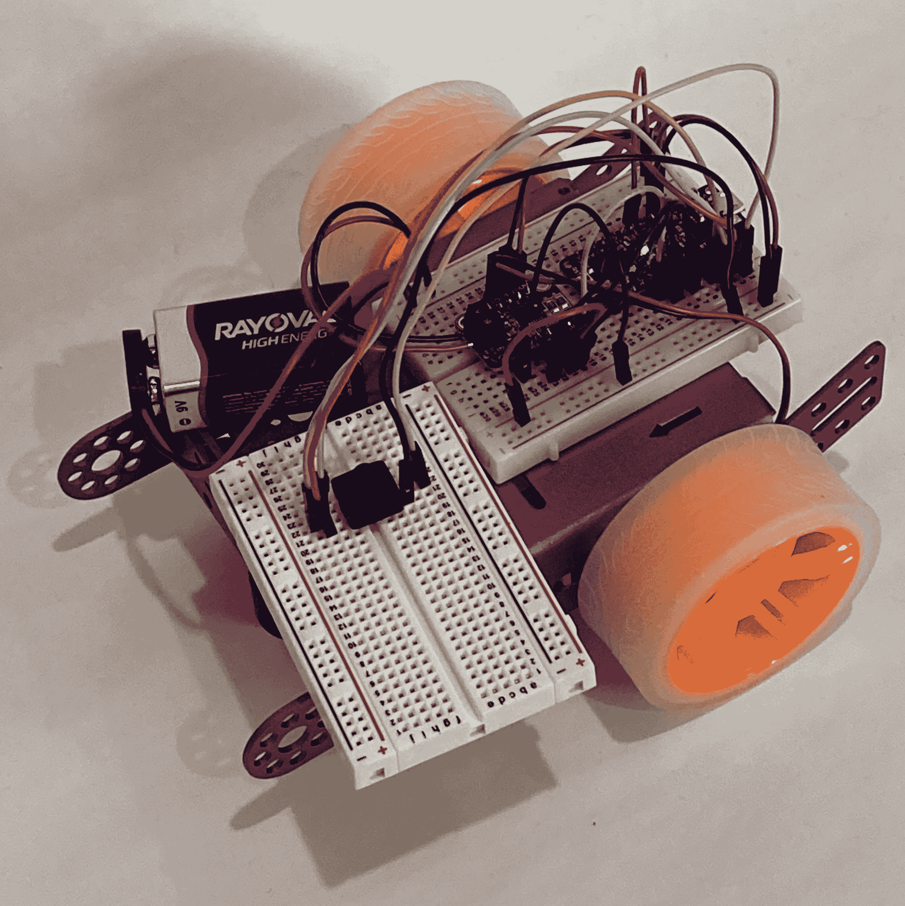
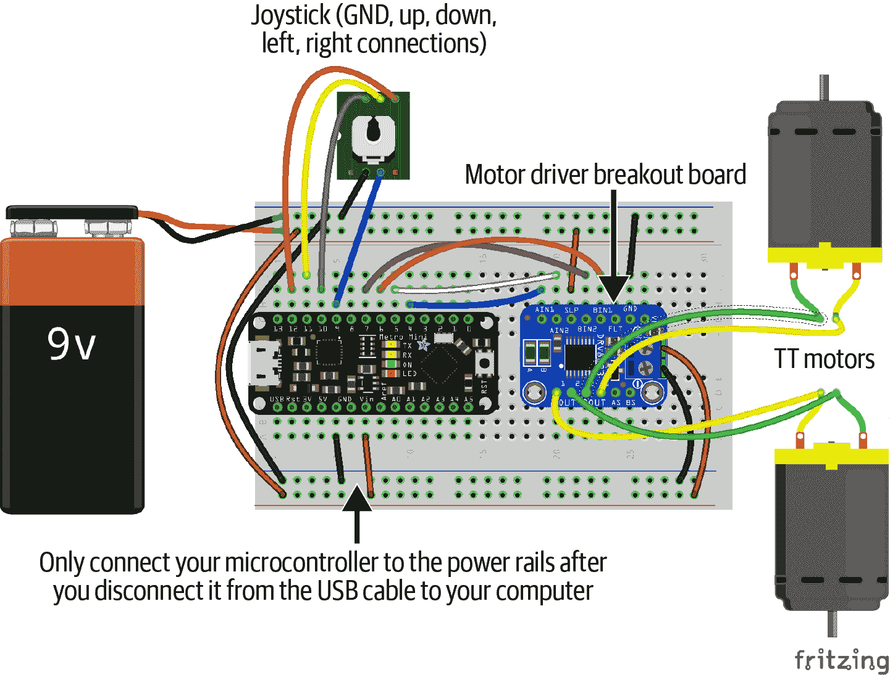
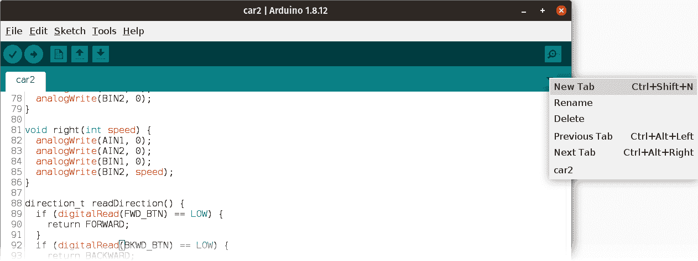
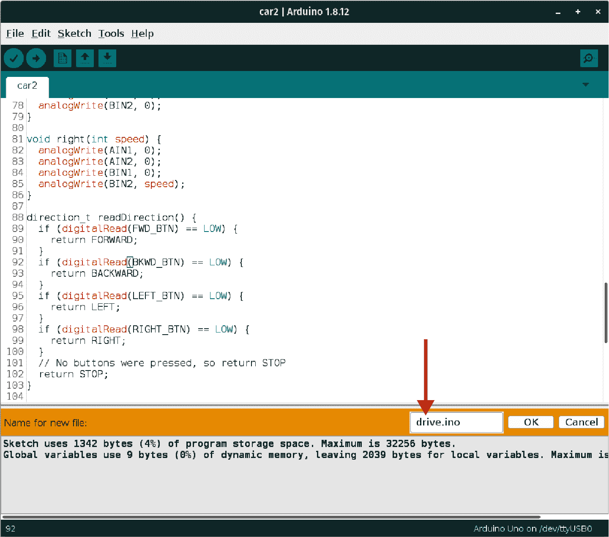
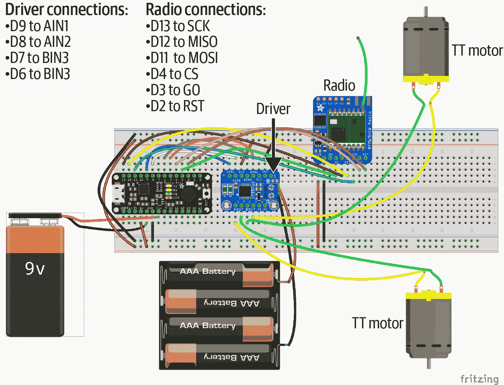
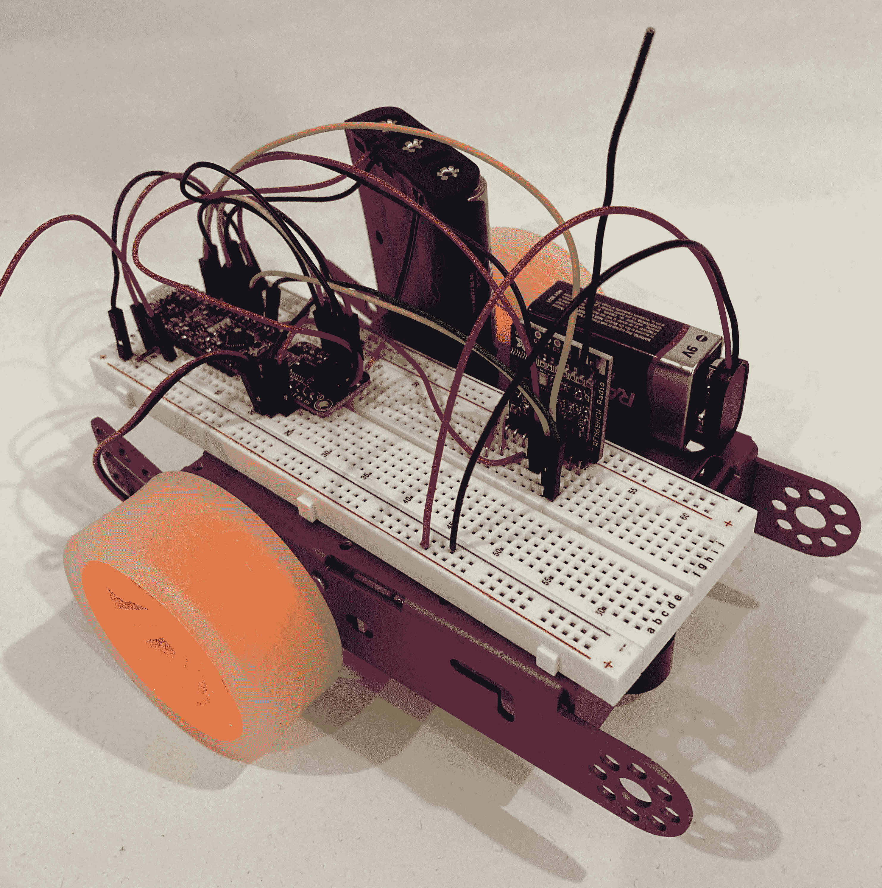
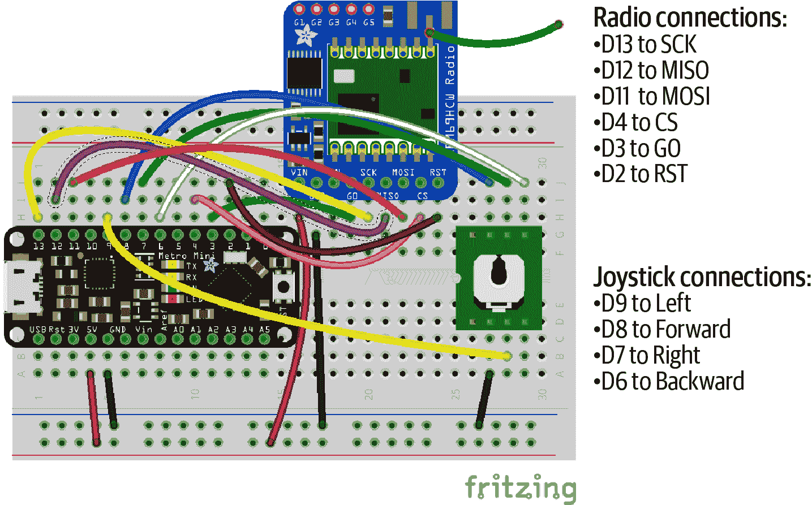
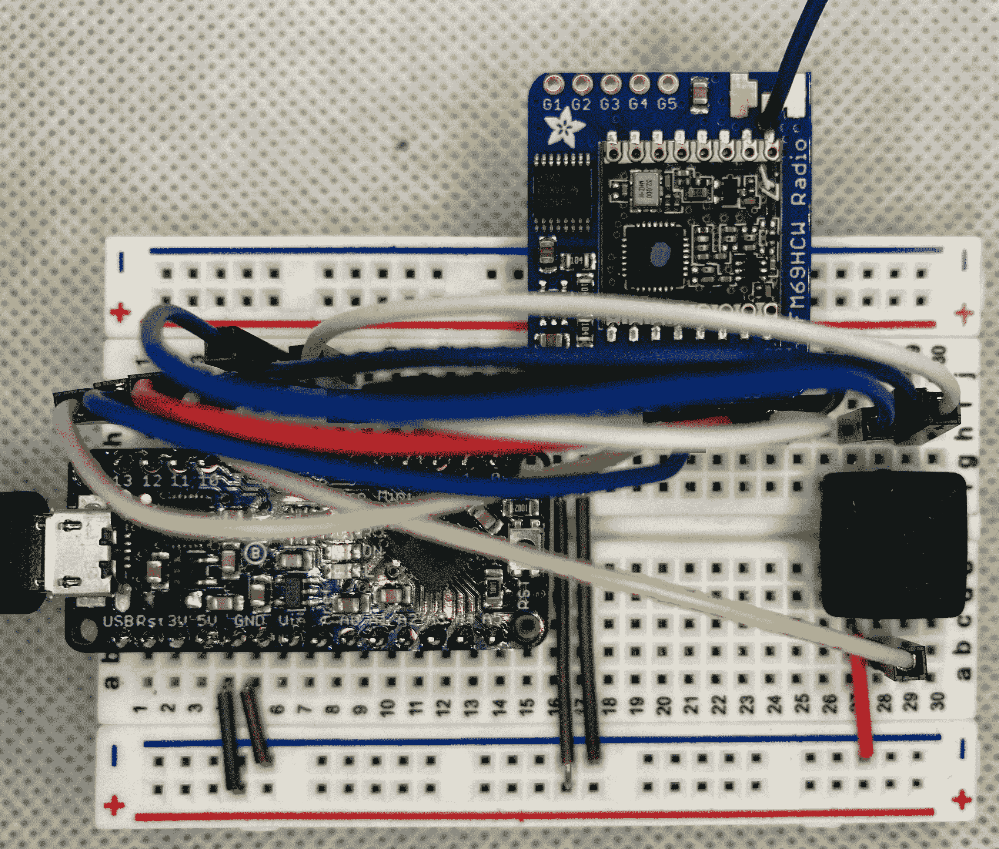
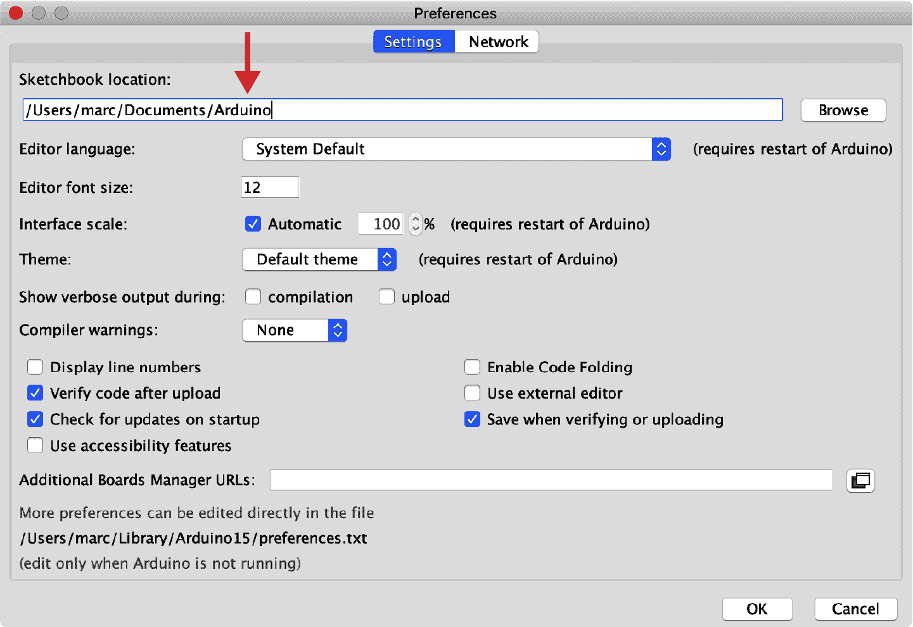

# 第十一章 自定义库

我们已经看到如何包含 Arduino IDE 自带的有用库的头文件，以及如何为一些更有趣的外设和传感器添加第三方库。但是在构建您的微控制器项目目录时，您可能会创建一些重复使用的代码。我经常使用的格言是宇宙中只有三个数字：0、1 和许多。如果您发现一段代码您第二次使用，您就属于“许多”类别，现在可能是时候考虑制作自己的库了。

这种说法可能听起来有些夸张。它确实听起来很宏伟。幸运的是，这是一个相当简单的过程，确实可以使未来的重复使用变得轻而易举。

我确实想承认，本章项目在各个方面都比我们以往的项目都大。如果遥控机器人车不引起您的兴趣，可以放心地跳过本章大部分内容。我仍然建议阅读“多文件项目” 和“创建库” 了解在 Arduino IDE 中为自己使用编写库的步骤。您可以安全地跳过本章，转而探索第十二章 中的物联网项目。

# 创建您自己的库

要开始创建自定义库，您需要一些可重用的代码。找到可重用代码的最佳方法是首先创建一些可用的代码。我们可以启动一个普通项目，然后提取那些看似在其他项目中可能效果良好的部分。

对于这个项目，我们将创建一个可以用简单的前进、后退、左右按钮驱动的电动车。一旦一切正常运行，我们可以将各种“驱动”功能拆分到一个单独的文件中，以突显 Arduino IDE 如何处理多个文件。最后，通过一点多文件的经验，我们将迈向无线电控制，并看看如何将该通信封装在一个库中，以便我们的车辆和单独的导航项目共享使用。

图 11-1 展示了我们将要使用的设置。我从 Adafruit 购买了这些零件，但您也可以轻松地从其他零件组装类似的小车。（见附录 B 获取我使用的确切零件号码。）物理小车相当简单，但确实需要一些组装。我不得不去本地五金店买一些小机械螺丝，但 Adafruit 的预制底盘确实简化了事情。底盘有完美的孔和插座，可引导后部电机和前部活动轮的固定。我只是把面包板和电池放在顶部，但有足够的地方可以用夹子、螺丝或拉链带固定它们。



###### 图 11-1 我们的机器人小车

图 11-2 显示了我们微控制器、导航摇杆和 DRV8833 电机驱动板的接线。在这个项目中还有更多的连接，但希望没有太多让你感到不知所措的地方。



###### 图 11-2\. 机器人车的接线图

机器人技术总体上是我非常感兴趣的一个领域，但其中的机械元素（远远）超出了我的专业领域。第一次尝试这个项目时需要额外的学习，这既是挑战，也是乐趣——至少比沮丧更有趣。我以前从未与电机打过交道，因此将它们安装、供电和正确连接以便通过软件控制它们，当然需要一些试验和不少的沮丧的叹息。但如果这个特定项目对你不太感兴趣，随时可以跟随我们的代码拆解，并看看如何将这些部分组合成一个库。但我可以说，第一次通过按下按钮让轮子旋转时，你会觉得自己可以征服世界。 :)

###### 提示

如果看到 图 11-2 的图表让你感到不安，你可以寻找配备所有必要零件以及详细组装说明书的机器人车套件。这些套件通常也有它们自己的编码说明。随意先让套件“原样”运行，并先熟悉电子设备。然后再回到这里，通过我的代码示例并应用它们（可能需要一些加强我们这里工作的修改）到你的完全运行的车辆上。

## 预处理指令

我们已经看到了几个预处理指令：`#include` 和 `#define` 都由预处理器处理。而“预处理器”这个名称可能已经让你对其在编译代码中的作用有了一些了解。这些指令在编译你的代码之前被处理。

`#include` 指令用于引入定义在另一个文件中的代码。引入后，编译器会将其视为你在自己的代码中键入了该外部文件的内容。

正如我们一直使用的那样，`#define` 指令将一个友好的名称放在某个字面值上。然后我们可以在我们的代码中使用这个名称，而不是每次记住正确的字面值。而且，如果我们需要更改这个值，比如将 LED 连接移动到控制器上的其他引脚，我们只需要更改一次。与`#include` 一样，预处理器将每个 `#define` 名称的实例替换为其字面值，就像你直接键入字面值一样。

对于我们的车辆，让我们像我们连接的其他外设一样使用 `#define` 来定义导航摇杆上的引脚：

```cpp
#define LEFT_BTN  12
#define RIGHT_BTN  9
#define FWD_BTN   10
#define BKWD_BTN  11
```

我应该指出，你可以使用`#define`来定义除了数字以外的其他值。也许你有一个标准的错误消息或文本响应。这些也可以定义：

```cpp
#define GOOD_STATUS  "OK"
#define BAD_STATUS   "ERROR"
#define NO_STATUS    "UNKNOWN"
```

知道`#define`如何与预处理器一起工作也解释了为什么我们不在末尾放置分号。毕竟，我们不希望分号出现在我们的代码中。

## 预处理器宏

你甚至可以进一步使用`#define`。它不仅可以处理字符串，还可以处理小段逻辑，几乎像一个函数一样。这些片段通常被称为*宏*，以区别于实际的函数。宏（或宏指令）将一些输入转换为相应的输出，通常通过替换实现。宏不是函数调用。宏不会被压入或弹出堆栈。

宏在你有一段重复的代码，但不需要定义一个函数的情况下非常有用。当你希望代码片段保持数据类型无关时，宏也很棒。例如，考虑一个简单的宏来确定两个值的最小值。这里是定义和如何使用的示例：

```cpp
#define MIN (x,y) x < y ? x : y

int main() {
  int smaller1 = MIN(9, 5);
  float smaller2 = MIN(1.414, 3.1415);
  // ...
}
```

要创建宏，我们使用`#define`和一个名称，就像之前一样，然后在括号中提供一个（或多个）变量。你传递给宏的任何参数都会替换宏片段中的变量。然后，该片段替换调用它的位置。就好像你键入了以下内容：

```cpp
int main() {
  int smaller1 = 9 < 5 ? 9 : 5;
  float smaller2 = 1.414 < 3.1415 ? 1.414 : 3.1415;
}
```

这种简单的替换过程非常强大。但要小心。由于替换过程非常简单，如果将复杂表达式传递给宏，可能会出现问题。例如，如果你的表达式使用的运算符优先级低于宏中使用的运算符，那么预期的结果可能是错误的，甚至无法编译。通过合理使用括号可以避免其中一些问题，像这样：

```cpp
#define MIN (x,y) (x) < (y) ? (x) : (y)
```

即便如此，通过传递适当的（嗯，错误的）表达式，你仍然可以生成一些奇怪的代码。GNU 关于 C 和 C 预处理器的文档甚至专门有一个章节讨论[宏的陷阱](https://oreil.ly/aKdZT)。

目前我们还不需要任何宏，但它们很常见，如果你在其他地方找到它们，我希望你能识别出来。事实上，C 预处理器本身非常有趣。在完成本书后，它是独立研究的一个很好的目标！

## 自定义类型定义

除了常量和宏之外，库通常还利用 C 的另一个特性：`typedef`操作符。你可以使用`typedef`为某种其他类型分配一个别名。这听起来可能是不必要的，而且从技术上讲确实如此，但在某些情况下非常方便，可以导致更易读、易于维护的代码。

我们在第十章中看到了一些`typedef`别名的使用。`byte`、`uint8_t`和`uint32_t`的指定类型都是通过`typedef`创建的。如果 Arduino 环境没有为你提供这些类型，你也可以像这样自己创建：

```cpp
typedef unsigned char byte;
typedef unsigned char uint8_t;
typedef unsigned long int uint32_t;
```

###### 注意

"_t"后缀对这些别名非常流行。这是突出显示名称是使用`typedef`构建的别名的简单方式。

你也可以在`struct`关键字中使用`typedef`来为你的自定义丰富数据类型取一个更易读的名称。例如，在“定义结构”中我们可以使用`typedef`定义我们的事务如下：

```cpp
typedef struct transaction {
  double amount;
  int day, month, year;
} transaction_t;

// Transaction variables can now be declared like this:
transaction_t bill;
transaction_t deposit;
```

这个特性对于我们简单的库并不是必需的，但许多库确实使用`typedef`来为在库上下文中更合理的名称提供类型。让我们继续定义一个类型，该类型可以存储我们的方向常量之一的变量：

```cpp
typedef signed char direction_t;
```

我们将继续使用`char`的有符号版本，因为将来可能会用到负值。例如，如果你只期望正数，负数可以作为很好的错误代码。现在让我们使用我们的新类型创建一些类型化常量：

```cpp
const direction_t STOP     = 0;
const direction_t LEFT     = 1;
const direction_t RIGHT    = 2;
const direction_t FORWARD  = 3;
const direction_t BACKWARD = 4;
```

回想一下在“常量：const versus #define”中`const`与`#define`的讨论。这是一个我们并没有真正需要选择其一的地方，但`const`方法确实为我们的代码添加了一些固有的文档说明，对其他读者可能会有用。我应该说，90%的情况下，看你的代码的第一个“其他读者”是你自己，但那是在几周或几个月之后。像`direction_t`类型这样关于你意图的提示在唤醒你自己的记忆时非常有用。

## 我们的汽车项目

准备好了吗！这将是我们的“第一个版本”项目，有些额外的抽象应该有助于我们将这个项目拆分为可重复使用的部分。（如果你想从一个简单的功能验证开始，可以查看[版本 0](https://oreil.ly/Mr2ED)。）当你处理自己的项目时，可能会发现自己的电机布线与我的不完全相同。你的导航输入（按钮或摇杆）可能连接方式稍有不同。测试一下你的设置，不要害怕在各种驾驶函数中更改设置为`HIGH`或`LOW`的引脚。幸运的是，所有这些都可以在软件中调整。最终目标只是在你推动摇杆向上时让你的车向前滚动。

这是我们的汽车构建的第一版。如往常一样，你可以自己输入这些内容，或者直接打开[*ch11/car1/car1.ino*](https://oreil.ly/8kqQL)：

```cpp
// Define the pins we're using for the joystick and the motor
#define LEFT_BTN  12
#define RIGHT_BTN  9
#define FWD_BTN   10
#define BKWD_BTN  11

#define AIN1 4
#define AIN2 5
#define BIN1 6
#define BIN2 7

// Define our direction type
typedef char direction_t;

// Define our direction constants
const direction_t STOP     = 0;
const direction_t LEFT     = 1;
const direction_t RIGHT    = 2;
const direction_t FORWARD  = 3;
const direction_t BACKWARD = 4;

void setup() {
  // Tell our board we want to write to the built-in LED
  pinMode(LED_BUILTIN, OUTPUT);

  // Accept input from the joystick pins
  pinMode(LEFT_BTN, INPUT_PULLUP);
  pinMode(RIGHT_BTN, INPUT_PULLUP);
  pinMode(FWD_BTN, INPUT_PULLUP);
  pinMode(BKWD_BTN, INPUT_PULLUP);

  // Send output to the motor pins
  pinMode(AIN1, OUTPUT);
  pinMode(AIN2, OUTPUT);
  pinMode(BIN1, OUTPUT);
  pinMode(BIN2, OUTPUT);

  // And make sure our LED is off
  digitalWrite(LED_BUILTIN, LOW);
}

void allstop() {
  digitalWrite(AIN1, LOW);
  digitalWrite(AIN2, LOW);
  digitalWrite(BIN1, LOW);
  digitalWrite(BIN2, LOW);
}

void forward() {
  digitalWrite(AIN1, LOW);
  digitalWrite(AIN2, HIGH);
  digitalWrite(BIN1, HIGH);
  digitalWrite(BIN2, LOW);
}

void backward() {
  digitalWrite(AIN1, HIGH);
  digitalWrite(AIN2, LOW);
  digitalWrite(BIN1, LOW);
  digitalWrite(BIN2, HIGH);
}

void left() {
  digitalWrite(AIN1, HIGH);
  digitalWrite(AIN2, LOW);
  digitalWrite(BIN1, LOW);
  digitalWrite(BIN2, LOW);
}

void right() {
  digitalWrite(AIN1, LOW);
  digitalWrite(AIN2, LOW);
  digitalWrite(BIN1, LOW);
  digitalWrite(BIN2, HIGH);
}

direction_t readDirection() {
  if (digitalRead(FWD_BTN) == LOW) {
    return FORWARD;
  }
  if (digitalRead(BKWD_BTN) == LOW) {
    return BACKWARD;
  }
  if (digitalRead(LEFT_BTN) == LOW) {
    return LEFT;
  }
  if (digitalRead(RIGHT_BTN) == LOW) {
    return RIGHT;
  }
  // No buttons were pressed, so return STOP
  return STOP;
}

void loop() {
  direction_t dir = readDirection();
  if (dir > 0) { // Driving!
    digitalWrite(LED_BUILTIN, HIGH);
    switch (dir) {
      case FORWARD:
        forward();
        break;
      case BACKWARD:
        backward();
        break;
      case LEFT:
        left();
        break;
      case RIGHT:
        right();
        break;
    }
  } else {
    // Stopping, or eventually we could handle errors, too
    digitalWrite(LED_BUILTIN, LOW);
    allstop();
  }
}
```

在这一点上，随时从书本中休息一下，放松一下吧。 :) 你可以前后驾驶吗？当你把摇杆向左或向右移动时，车会按照你的意愿转弯吗？你能在两个填充动物障碍物之间平行停放吗？用绳子连接的摇杆跟随你的车可能会感觉有点尴尬，但我们很快就会解决这个问题。

# 多文件项目

欢迎回来！希望你成功地将新跑车平行停放好。有了一个工作程序作为我们的基线，让我们把它拆分成一些可重复使用的部分。

作为一种语言，C 并不关心代码的存放位置。只要*gcc*能找到您代码中提到的所有源文件、头文件和库，它就会生成可用的输出。但在 Arduino IDE 中创建多文件项目略有不同。IDE 管理一些整合步骤，这些步骤通常由桌面版您自行处理。由于我们目前专注于微控制器，因此我们将专注于 Arduino IDE 中的操作。如果您对在 Arduino 以外构建更大项目感兴趣，我会再次推荐普林兹和克劳福德的[*C in a Nutshell*](https://www.oreilly.com/library/view/c-in-a/0596006977/)。

我们将从将当前项目转换为具有相同功能的多文件项目开始。然后，我们将扩展我们的机器人车以支持远程无线电控制，并看看共享代码的强大之处。

在我们的小车示例中，我们有几个函数专门用于让汽车运动。这些相关函数非常适合分离到自己的文件中。它们都为相似的目的服务。尽管将相关功能放在单独的文件中并非必需，但这是组织更大项目片段的流行方式。少量文件，每个文件中有少量函数，可能比一个包含大量函数的巨大文件更易于维护和调试。但如果随意拆分函数，将很难记住哪些文件包含哪些函数。

Arduino IDE 为我们提供了几种选项来分解项目：我们可以添加新的*.ino*文件，可以包含自定义头文件，或者可以创建并导入自定义库。本章的其余部分将讨论这三种机制。

## 代码（.ino）文件

首先，让我们将此项目另存为新名称，以便在出现问题并希望查看工作正常的项目时备用。在 Arduino IDE 的“文件”菜单中，选择“另存为…”选项。我选择了极具创意和原创性的名称*car2*。如果灵感来临，您可以更加创意无限。

现在让我们将我们所有五个驾驶函数移动到它们自己的文件中。要添加新文件，请使用右侧顶部附近的向下箭头按钮。该按钮将打开一个小菜单，如图 11-3 所示。从该菜单中选择“新建标签”。



###### 图 11-3\. 在 Arduino IDE 中创建新标签

接下来，将提示您命名标签，如图 11-4 所示。在字段中输入名称**`drive.ino`**，然后单击“确定”按钮。



###### 图 11-4\. 给我们的新文件命名

现在你应该有一个名为“drive”的新选项卡（没有显示后缀）。继续从“car2”选项卡中剪切五个驾驶函数（包括`allstop()`），然后粘贴到我们的新“drive”选项卡中。该选项卡最终将具有以下代码（[*ch11/car2/drive.ino*](https://oreil.ly/pRodD)）：

```cpp
void allstop() {
  digitalWrite(AIN1, LOW);
  digitalWrite(AIN2, LOW);
  digitalWrite(BIN1, LOW);
  digitalWrite(BIN2, LOW);
}

void forward() {
  digitalWrite(AIN1, LOW);
  digitalWrite(AIN2, HIGH);
  digitalWrite(BIN1, HIGH);
  digitalWrite(BIN2, LOW);
}

void backward() {
  digitalWrite(AIN1, HIGH);
  digitalWrite(AIN2, LOW);
  digitalWrite(BIN1, LOW);
  digitalWrite(BIN2, HIGH);
}

void left() {
  digitalWrite(AIN1, LOW);
  digitalWrite(AIN2, HIGH);
  digitalWrite(BIN1, LOW);
  digitalWrite(BIN2, LOW);
}

void right() {
  digitalWrite(AIN1, LOW);
  digitalWrite(AIN2, LOW);
  digitalWrite(BIN1, HIGH);
  digitalWrite(BIN2, LOW);
}
```

这实际上是分离这些代码片段所需的所有工作！现在你有了你的第一个多文件 Arduino 项目。点击验证（对号）按钮，确保你的项目在新的两个文件配置中仍然能够编译通过。一切应该还能正常工作。你甚至可以将其上传到你的控制器并继续驾驶你的车。

如果项目无法验证或上传，请检查确保你没有丢掉花括号或者可能从原始文件中多拿了一行。您还应该确保您为新分离的文件选择的名称以 *.ino* 扩展名结尾。

Arduino IDE 在 *.ino* 文件中为我们执行了一点魔法。首先准备我们的主项目文件（在本例中是 *car2.ino* 在 *car2* 文件夹中）。然后按字母顺序包含任何其他 *.ino* 文件。您可能已经注意到我们的 *drive.ino* 文件没有 `#include` 语句。然而，我们明显使用了在主文件中定义的引脚常量。对于编译器而言，只有一个大的 *.ino* 文件需要编译，因此后续的 *.ino* 文件可以看到前面文件中的所有函数、`#defines` 和全局变量。目前还没有办法改变单独的 *.ino* 文件的顺序；它们总是按字母顺序合并。

## 头文件

那么所有这些单独的文件是如何如此无缝地共同工作的呢？在加载这些单独文件之前，IDE 添加了一个魔法步骤。它创建了一个带有*前向声明*的头文件，其中包括你 *.ino* 文件中所有函数和全局变量的简要描述。前向声明是关于你的函数命名、参数和返回值类型的简短描述。它们允许单独的文件在没有完整实现的情况下使用函数。每个头文件依次自动包含在你的主项目文件中。

您可以在我们简单的两个选项卡项目中看到这一效果。*drive.ino* 文件不需要包含任何额外的信息来使用我们的 `#define` 引脚条目。而且在我们的主 *car2.ino* 文件中的代码可以调用 *drive.ino* 中定义的函数，而无需担心函数的顺序或特定位置。最终，这两个文件完美地结合在一起完成了我们的项目。

您还可以创建自己的头文件。这对于整理很有用。例如，如果有许多`#define`语句，您可以将它们放在自己的头文件中。或者，如果您希望以低技术手段在项目之间共享一些指令，您可以复制一个头文件并将其放在另一个项目中。对于您自己的项目来说，最合理的方法很大程度上取决于您自己。许多成功的制作者有数十甚至数百个项目，每个项目只有一个单独的*.ino*文件。我只是想确保您知道，如果那一个大文件开始让您不知所措，如何将其分割成更易管理的部分。

为了实现这个目标，让我们再次稍微拆分我们的主项目。让我们尝试将一些`#define`指令放入它们自己的头文件中。我们将移动这八个引脚常量。像以前一样创建一个新的标签，并在提示时将其命名为**`pins.h`**。新的标签应显示文件的完整名称*pins.h*，以帮助区分它与隐藏扩展名的*.ino*文件。

从*car2*中剪切八个`#define`行和相关的注释，并将它们粘贴到*pins.h*中。结果应如[*ch11/car2/pins.h*](https://oreil.ly/pwQM6)所示：

```cpp
// Define the pins we're using for the joystick and the motor

#ifndef PINS_H
#define PINS_H

#define LEFT_BTN  12
#define RIGHT_BTN  9
#define FWD_BTN   10
#define BKWD_BTN  11

#define AIN1 4
#define AIN2 5
#define BIN1 6
#define BIN2 7

#endif /* PINS_H */
```

现在，我们只需在我们的文件顶部的*car2*标签中添加一个包含语句：

```cpp
#include "pins.h"
```

您可以根据我的[版本 2](https://oreil.ly/EWAV9)检查您的工作。您的项目应该像以前一样进行验证（和上传）。请随意尝试，并确保您仍然可以驾驶您的汽车。

###### 警告

请注意我们*pins.h*头文件名周围的双引号。先前的`#include`语句使用的是尖括号（<>：小于、大于）。这种区别是有意的。尖括号告诉编译器在标准包含路径中查找头文件。通常情况下，这意味着您正在从已知库中引入一个头文件。

引号告诉编译器，要包含的文件与包含它的文件位于同一文件夹中。通常情况下，这意味着你在为这个项目专门编写的头文件。

再次强调，将项目分割并非强制要求，也不是在处理大文件时总是要做的事情，但这样做可能很有帮助。这样可以让你集中精力在代码的一部分上，避免意外改变另一部分。如果与其他程序员合作，使用单独的文件也可以更轻松地在最后将你们的工作结合起来。但最终，这完全取决于你自己和你感觉舒适的方式。

# 导入自定义库

除了多个*.ino*和*.h*文件外，您还可以构建自己的 Arduino IDE 库。如果您有代码想要在多个项目中使用，或者通过 GitHub 等公共代码站点与他人共享，库是一个很好的选择。

令人高兴的是，创建自定义库并不需要太多的工作量。您至少需要一个*.cpp*文件和一个匹配的头文件（*.h*）。如果需要的话，您还可以拥有更多文件，以及我们将在下一节讨论的一些细微之处。

## 促进沟通

我们的机器人车看起来很棒，但是用有线操纵杆跟在后面有点笨重。使用*无线电控制*的机器人车会更加酷！我们可以做到这一点，使用一个库来管理无线电通信是确保我们不会发生信号冲突的好方法——从字面上来说。我们可以使用库来确保多方可以访问共同的定义（比如“向前驾驶”的值）。我们还可以把协议的规则放入库的函数中。这有点像确保每个人都在说同一种语言。

库可以提供的不仅仅是这种假设语言的词汇表。它们还可以强制执行对话的规则。谁先说话？接下来谁说？需要回复吗？可以有多个听众吗？通过你在库中编写的函数来回答这些问题。只要两个（或更多）项目使用同一个库，你在库函数中编码的细节将确保所有人都和谐相处。

让我们创建一个库来发送和接收无线电信号。我们将创建两个分开的项目，两者都使用这个库。我们将首先用一个无线电元件替换当前连接到我们车上的操纵杆。然后，我们将创建一个控制器项目，将我们新获得的操纵杆与类似的无线电配对。顺便说一句，这意味着我们需要两个微控制器。我将使用另一个 Metro Mini，但它们不必完全相同。如果你有其他与我们的无线电兼容并可以使用我们的库的控制器闲置，任何控制器组合都应该可以工作。

## 我们的车改装计划

让我们把操纵杆换成无线电收发器。我正在使用 Adafruit 提供的精美包装的[RFM69HCW](https://oreil.ly/JhUn8)高功率断口。它售价约为 10 美元，连接起来相对简单。此外，它还具有一些不错的功能，比如只有使用相同加密密钥的类似芯片才能解密的加密传输。图 11-5 显示了我们的微控制器、电机驱动器和无线电的布线图。由于 RFM69HCW 需要在我们的 Metro Mini 微控制器上使用特定引脚，我不得不重新定位几个 DRV8833 的连接（在“我们的无线电控制库标头”中有更多信息）。



###### 图 11-5\. 带有无线电收发器的机器人车的布线图

当然，电源和地线引脚也应该连接好。我为微控制器使用了 9V 电源（该电源又供电给无线电），并为 DRV8833 使用了独立的电源。连接到 RFM69HCW 顶部的那根绿色孤单电线只是一个三英寸长的简单天线的一部分。¹

图 11-6 展示了装配好的组件，已经准备好滚动，没有任何连接线！



###### 图 11-6\. 我们的无线无线电小车

好吧，没有连接到操纵杆的电线。面包板上有很多电线。这个项目比我们迄今为止处理的项目要大。如果无线电控制的小车不是您的菜，可以跳到下一章。但在您离开之前，请查看“创建库”关于创建库代码及其头文件的部分。

我使用两个单独的电源供应来保持电机与微控制器和无线电分开。如果您有更多经验用 Arduino 项目供电并想使用不同的配置，那就尽管去做！重要的是我们的无线电已准备好接收驾驶指令。

## 创建一个控制器

我们还需要一个新项目来接收来自我们操纵杆的输入并将该信息发送到无线电上。图 11-7 显示了接线情况。控制器只需要一个电池；无线电可以安全地从我们的微控制器的 5V 引脚供电。



###### 图 11-7\. 无线电控制器的接线

我用 USB 电源包将控制器连接到了 Metro Mini。图 11-8 展示了最终结果。



###### 图 11-8\. 我们的无线控制器

不是最引人注目的小工具，但它确实发送无线电信号！至少，一旦我们添加一点代码，它就会发送。

## 创建库

我们的小车和控制器的代码都需要我们的无线电库，所以让我们从这里开始。我们将创建一个头文件和一个*.cpp*文件，以适应 Arduino IDE 的 C++中心性质。实际代码仍将是（大部分）纯 C，只是需要放在具有*.cpp*扩展名的文件中。

如何编写这段代码完全取决于您。您可以在一个文件中编写所有内容，然后将要放入头文件的部分分离出来（就像我们在本章前面所做的那样）。您还可以将头文件用作大纲或计划。填写头文件中的常量和函数名称，然后创建*.cpp*文件来实现这些函数。无论哪种路径听起来更好，我们都需要将文件放在特定位置，以便 IDE 能够识别它们。

### 库文件夹

我们将库中的所有文件放在一个文件夹中，该文件夹位于您的 Arduino 草图所在的*libraries*文件夹中。在我的 Linux 系统中，这是我主目录中的*Arduino*文件夹。如果您不确定系统中该文件夹的位置，可以在 Arduino IDE 的首选项中查看。从“文件”菜单中，选择“首选项”选项。您应该看到类似于图 11-9 的对话框。注意顶部的“草图位置”。*libraries*文件夹需要放在那里。如果那里还没有这样的文件夹，请立即创建。



###### 图 11-9\. Sketchbook 位置首选项设置

现在看这个文件夹实际上很有用，因为我们需要手动安装我们的无线电模块库。它将放在同一个文件夹中。我使用由 Adafruit 团队编写的[无线电库](https://oreil.ly/YLphd)。²从绿色的“代码”下拉按钮下载 ZIP 存档。解压文件并将生成的文件夹重命名为**`RadioHead`**。将此*RadioHead*文件夹放入*libraries*文件夹中，就完成了。

嗯，这就是关于无线电库的全部内容。我们仍然需要为我们尚未编写的库创建一个文件夹。在*libraries*文件夹内，创建一个新文件夹并为您的自定义库选择一个名称。由于这是一个用于*r*obot *c*ar 的*r*adio *c*ontrol 库，并且本书的标题以这两个字母结尾，我选择将其命名为*SmalleRC*。顺便说一句，您无需压力使用这样的有趣、书呆子风格的名称来命名您的库。这就是“自定义”形容词的作用。按照您的喜好自定义您的库！

### 我们的无线电控制库标头

在你的新库文件夹里，让我们创建我们的文件。我会采用第二种方法，从头文件[*SmalleRC.h*](https://oreil.ly/koHtr)开始。

我们将加载我们在无线电工作中需要的标头，以及*Arduino.h*标头，以防我们的库代码依赖于任何 Arduino 特定的函数。我们将定义几个常量，然后提供一些函数原型：

```cpp
#ifndef SMALLERC_H 
#define SMALLERC_H

#include "Arduino.h" 
#include <SPI.h> 
#include <RH_RF69.h> 

#define RF69_FREQ 915.0 
#define RFM69_CS      4
#define RFM69_INT     3
#define RFM69_RST     2
#define LED          13

#define rc_INIT_SUCCESS  1 
#define rc_INIT_FAILED  -1
#define rc_FREQ_FAILED  -2

// Define our direction type typedef signed char direction_t;      

// Define our directions const direction_t rc_STOP     = 0;
const direction_t rc_LEFT     = 1;
const direction_t rc_RIGHT    = 2;
const direction_t rc_FORWARD  = 3;
const direction_t rc_BACKWARD = 4;

char rc_start();                      
void rc_send(int d);
int  rc_receive();

#endif /* SMALLERC_H */
```


我们将像*pins.h*一样使用一个头文件保护。


我们的库代码可能需要一些 Arduino 特定的类型或函数，因此我们包含了这个标头。这个标头由 IDE 自动包含在我们的主项目中，这就是为什么我们之前没有看到这个`#include`。


SPI（[串行外围接口](https://oreil.ly/eZmyO)）标头允许我们使用只有几根线的外设执行复杂通信（即不是`HIGH`和`LOW`或单个值）。我们将使用这种类型的连接与我们的无线电模块板。我们的微控制器有非常特定的 SPI 引脚，因此我们不必指定要使用哪些引脚。图 11-7 展示了正确的连接方式。


我们需要刚刚安装的 RH_RF69 库来与无线电通信。


虽然 SPI 处理了大多数通信需求，但这些`define`条目填补了 RH_RF69 库操作我们的无线电所需的一些细节，包括要使用的频率（`RF69_FREQ`；在欧洲使用 433 MHz，在美洲使用 868 或 915 MHz）以及处理中断和复位的引脚。


我们将定义一些自己的常量来帮助协调我们的无线电的初始化。我们将以一种可以帮助我们调试任何问题的方式区分故障。


我们可以在这里放置我们的`typedef`，以便每个导入这个库的人都可以访问`direction_t`类型别名。我们还将包含我们的方向。


这些是我们库的前向声明（也称为函数原型）。我们需要在我们的*.cpp*文件中编写完整的函数，并且这些函数将与此处声明的名称和参数相同。

一个头文件中包含了相当多的细节！但这就是头文件的作用。在没有任何其他文档的情况下，阅读头文件应该告诉您几乎所有您需要知道的东西来使用库。

###### 警告

对于这个头文件，我稍微作弊了。对于打算与他人分享的 Arduino 库，您通常不会指定连接外围设备的引脚。我们有能力使这个头文件与我们的物理项目匹配，但其他用户可能没有相同的控制器或相同的空闲引脚。查看“在线分享”以获取一些有关深入了解可共享库创建的提示。不过，对于专门用于自己项目的库，您可以允许几个捷径。

### 我们的无线电控制库代码

要完成我们的库，我们需要编写一些代码并实现在我们的头文件中声明的函数。这些代码并不是非常复杂，但它确实有几个与启用和与我们的无线电通信相关的新颖部分。您可以自己键入它，也可以在您的编辑器中打开[*SmalleRC.cpp*](https://oreil.ly/pc5v4)：

```cpp
#include "SmalleRC.h" 

RH_RF69 rf69(RFM69_CS, RFM69_INT);                    

char rc_start() {                                     
  pinMode(LED, OUTPUT);
  pinMode(RFM69_RST, OUTPUT);
  digitalWrite(RFM69_RST, LOW);

  // manual reset
  digitalWrite(RFM69_RST, HIGH);
  delay(10);
  digitalWrite(RFM69_RST, LOW);
  delay(10);

  if (!rf69.init()) {
    return rc_INIT_FAILED;
  }

  if (!rf69.setFrequency(RF69_FREQ)) {
    return rc_FREQ_FAILED;
  }

  // range from 14-20 for power
  // 2nd arg must be true for 69HCW
  rf69.setTxPower(17, true);

  // The encryption key is up to you, but must be
  // the same for both the car and the controller
  uint8_t key[] = {                                   
    0x01, 0x02, 0x03, 0x04, 0x05, 0x06, 0x07, 0x08,
    0x01, 0x02, 0x03, 0x04, 0x05, 0x06, 0x07, 0x08
  };
  rf69.setEncryptionKey(key);

  pinMode(LED, OUTPUT);
  return rc_INIT_SUCCESS;
}

void rc_send(direction_t d) {                         
  uint8_t packet[1] = { d };
  rf69.send(packet, 1);
  rf69.waitPacketSent();
}

direction_t rc_receive() {                            
  uint8_t buf[RH_RF69_MAX_MESSAGE_LEN];
  uint8_t len = sizeof(buf);
  if (rf69.recv(buf, &len)) {
    if (len == 0) {
      return -1;
    }
    buf[len] = 0;
    return (direction_t)buf[0];
  }
  return STOP;
}
```


包含我们最近构建的包含所有引脚、方向和无线电配置信息的头文件。


创建一个类似于前期项目中的 NeoPixel 对象的无线电控制对象。


初始化无线电。此代码基于我们安装的库中包含的示例。查看“在线分享”以获取有关示例和其他库文档的更多详细信息。


无线电初始化的一部分是设置一个加密密钥，确保只有使用相同密钥的其他无线电设备可以与我们通信。这些值正是示例中的那些。如果愿意，可以随意更改它们，只需确保密钥为 16 字节。


一个简单的函数来广播一个方向。无线电库期望一个`uint8_t`值的数据包，因此我们创建一个单元素数组来匹配。当然，该库可以发送更长的消息，但我们只需要发送这一个单值。


接收函数用于读取从控制器传来的任何方向指令。同样，无线电库可以处理更长的消息，但我们只需要第一个字节，它应该包含我们的方向。如果根本没有消息，返回`-1`以告知调用者没有准备好的消息。否则，返回我们收到的方向，或者默认返回`STOP`。

有了我们的自定义库，我们可以开始编写汽车和控制器的实际项目。但我们确实在这段代码中快速穿过了！如果您对无线电通信感兴趣，我建议您[尝试一些例子](https://oreil.ly/7YRVZ)来更好地了解可能性和限制。

## 更新汽车项目

现在我们需要编写汽车的代码。（随意查看汽车的物理设置和“改装我们的汽车”中的打破点。）基本上，我们将用一个从无线电接收数据的调用来替换轮询操纵杆的逻辑。我们会暂停几毫秒，以避免电机快速启停。否则，我们将运行一个相当紧密的循环，使汽车对我们的遥控器反应灵敏。

我基于*car2*项目创建了这个版本（[*car3*](https://oreil.ly/Dk0JC)），该项目有单独的*pins.h*和*drive.ino*文件。在这个项目中，我们不再需要操纵杆的引脚，所以头文件变得稍微短一些：

```cpp
#ifndef PINS_H
#define PINS_H

#define AIN1 9
#define AIN2 8
#define BIN1 6
#define BIN2 7

#endif /* PINS_H */
```

驾驶功能完全没有改变，所以我将它们略过，但如果您愿意，您可以查看代码（“代码（.ino）文件”）。主要的[*car3.ino*](https://oreil.ly/JcLJl)文件的代码应该感觉很熟悉，但显然我们需要包括我们新的无线电库的头文件：

```cpp
#include "pins.h"
#include "SmalleRC.h"

void setup() {
  Serial.begin(115200);
  // Send output to the motor pins
  pinMode(AIN1, OUTPUT);
  pinMode(AIN2, OUTPUT);
  pinMode(BIN1, OUTPUT);
  pinMode(BIN2, OUTPUT);

  if (rc_start() != rc_INIT_SUCCESS) {
    Serial.println("Failed to initialize radio.");
  }
}

void loop() {
  direction_t dir = rc_receive();
  if (dir > 0) { // Driving!
    switch (dir) {
      case rc_FORWARD:
        forward();
        break;
      case rc_BACKWARD:
        backward();
        break;
      case rc_LEFT:
        left();
        break;
      case rc_RIGHT:
        right();
        break;
    }
    delay(20);
  } else {
    // Stopping, or eventually we could handle errors, too
    allstop();
  }
}
```

注意，我正在使用*SmalleRC.h*文件中定义的新导航常量（如`rc_LEFT`）。但这就是我们现在驾驶汽车所需的所有代码！这是通过分离共享代码块的众多好处之一。通过在这些共享代码基础上构建，您可以更快地创建一些非常有趣的项目。

目前还没有很好的方法来测试这个新的*car3*项目，但请继续将其上传到您的微控制器上。如果没有其他问题，您可以使用串行监视器工具确保无线电启动没有错误。对于`setup()`函数中的错误，我采取了“没有消息就是好消息”的方法，但如果您愿意，可以稍微修改以生成成功消息。

###### 提示

现在 Arduino IDE 已经知道我们的*SmalleRC*库，您实际上可以直接在该库的源文件上进行编辑，然后重新验证或重新上传项目。例如，如果您在启动无线电时遇到问题，请在*SmalleRC.cpp*中添加一些调试调用到`Serial.println()`。一旦您已经找到并解决了问题，您可以删除调试语句并重新上传一次。

## 把控制权在手中

接下来要做的是编程控制器。（如果你还需要构建物理遥控器，请回顾一下“创建控制器”。）在这里，我们对摇杆轮询进行了处理，而不是将结果发送给电机，而是通过无线电广播任何方向信息。多亏了这个库，这是一个相当小的项目，所以我把它放在了一个单独的 [*ch11/controller/controller.ino*](https://oreil.ly/rSPTh) 文件中：

```cpp
#include "SmalleRC.h"

#define LEFT_BTN  9
#define RIGHT_BTN 7
#define FWD_BTN   8
#define BKWD_BTN  6

void setup() {
  Serial.begin(115200);
  // Accept input from the joystick pins
  pinMode(LEFT_BTN, INPUT_PULLUP);
  pinMode(RIGHT_BTN, INPUT_PULLUP);
  pinMode(FWD_BTN, INPUT_PULLUP);
  pinMode(BKWD_BTN, INPUT_PULLUP);

  if (rc_start() != rc_INIT_SUCCESS) {
    Serial.println("Failed to initialize radio.");
  }
}

direction_t readDirection() {
  if (digitalRead(FWD_BTN) == LOW) {
    return rc_FORWARD;
  }
  if (digitalRead(BKWD_BTN) == LOW) {
    return rc_BACKWARD;
  }
  if (digitalRead(LEFT_BTN) == LOW) {
    return rc_LEFT;
  }
  if (digitalRead(RIGHT_BTN) == LOW) {
    return rc_RIGHT;
  }
  // No buttons were pressed, so return STOP
  return rc_STOP;
}

void loop() {
  direction_t dir = readDirection();
  rc_send(dir);
  delay(10);
}
```

我们本可以把 `readDirection()` 函数的逻辑直接放在我们的 `loop()` 函数中，但我喜欢这种用小抽象使 `loop()` 函数变得简洁的方式。

尝试验证这个新项目，如果遇到任何问题，添加几个 `Serial.println()` 语句。并记住，如果需要的话，你也可以将它们添加到你的库代码中。

###### 小贴士

对于像这样大量使用库的项目（不仅仅是我们的自定义库，还有像 `RF_RH69` 这样的库），`println()` 调用可能并不能帮助解决每一个问题。下载的库中确实会出现 bug，但这种情况相当罕见。我发现许多问题是由于我错接了一些线路引起的。所以，如果事情仍然没有解决，请尝试再次检查你的微控制器与各种外围设备之间的连接。

## 开车吧！

没有代码。没有图表。没有指导。在这一章中，我完全鼓励你去玩耍。 :) 尝试同时启动两个项目，看看当你移动摇杆时会发生什么。肯定会出现一些问题！例如，如果接线不太对，车可能会移动，但不是你想要的方向。（例如，当我把项目移到全尺寸面包板时，我意外地交换了右侧电机输入引脚。右轮转动了，但方向错了。）或者如果我们连接摇杆的引脚错了，可能会完全没有发送任何信号。

如果汽车一动不动，又到了展示你调试技能的时候了。顺便提一下，你可以同时连接两个项目到你的电脑上。它们只是连接到不同的串行端口上。 （记住，在 Arduino IDE 的工具菜单中可以设置你的微控制器使用哪个端口。）你可以使用 `Serial.println()` 语句来确保你的输入、发送、接收和驱动都按照你的预期工作。只需关注成功！当你把事情搞定时，很容易就能把你的车开到桌子上，留下一串电子设备悬挂在 USB 线上。或者，你懂的，就是这样告诉我的。

## 文档和分发

一旦你的库可以工作了，并且你已经在房间里充分享受了足够的乐趣，那么是时候考虑为你的项目添加一些文档了。文档非常重要。不仅仅是为了其他可能会使用你的库的程序员。即使你离开一个项目只有几天，你写的任何文档也会出人意料地对帮助你自己快速理清思路很有用。

### 关键词

您可以添加到用于 Arduino IDE 的非常简单的文档之一是称为*keywords.txt*的单个文本文件。对于自定义库，它应该包含两列，用制表符分隔。第一列包含库中定义的函数、常量和数据类型。第二列应包含表 11-1 中的一个条目，指示第一列中名称的类别。

表 11-1\. 用于文档化 Arduino 库的关键字类别

| 类别名称 | 目的 | 外观 |
| --- | --- | --- |
| KEYWORD1 | 数据类型 | 橙色, 粗体 |
| KEYWORD2 | 函数 | 橙色, 普通 |
| LITERAL1 | 常量 | 蓝色, 普通 |

尽管有限，这几个类别仍然可以帮助依赖 IDE 提示的程序员，比如他们是否正确拼写了函数名。

因此，对于我们的库，我们可以在我们自己的[*keywords.txt*](https://oreil.ly/o3KjH)文件中创建以下条目（再次用制表符分隔）：

```cpp
rc_INIT_SUCCESS LITERAL1
rc_INIT_FAILED  LITERAL1
rc_FREQ_FAILED  LITERAL1

direction_t KEYWORD1

rc_STOP LITERAL1
rc_LEFT LITERAL1
rc_RIGHT    LITERAL1
rc_FORWARD  LITERAL1
rc_BACKWARD LITERAL1

rc_start    KEYWORD2
rc_send KEYWORD2
rc_receive  KEYWORD2
```

基本上，该列表包含了我们在*SmalleRC.h*文件中定义的所有内容，减去仅由无线电库使用的少量常量。如果您此时重新启动您的 IDE，文件中列出的函数和其他名称将与核心语言使用的语法高亮显示相同！非常酷。

###### 警告

请确保在*keywords.txt*中使用真正的制表符来分隔列。空格是不起作用的。许多编辑器（例如 VS Code）有一个合理的设置，当保存文件时，将所有制表符转换为适当数量的空格。在源文件中，这种静默更改可能有很多有用的原因，但在这里我们不想要它。

如果您无法在您选择的编辑器中暂时禁用此功能，*keywords.txt*确实只是一个文本文件。您可以使用任何文本编辑器创建或编辑它，包括像 Windows 10 中的记事本或 macOS 中的 TextEdit 这样非常简单的编辑器。

### 包括示例

包括几个示例项目与您的库一起是另一个很好的补充，而且不需要太多的工作。您只需在包含库代码和*keywords.txt*文件的文件夹中创建一个名为*examples*的文件夹。然后，在*examples*文件夹中，您可以放置几个项目文件夹（使用整个文件夹，而不仅仅是内部的*.ino*文件）。

示例项目应该简短而精炼。如果可能的话，不要包含不使用该库的不必要功能。您希望新用户能看到库的重要部分以及它们在草图中的使用方式。如果您的库相当丰富，不要害怕提供几个小示例，每个示例都侧重于库的特定方面。

当然，你会在野外发现那种“更小、更专注”的反面。有时一个单一的示例包含了库中每一个特性的演示。虽然这些广泛的示例确实突出了库的使用，但对于外部人员来提取详细信息可能会更加困难。如果你只是想了解库中的一个或两个功能，那么大型示例可能会令人不知所措。

但任何例子总比没有例子好！如果你只有精力进行单一全面的方法，那就包括它。如果你将它托管在像 GitHub 这样的公共位置，甚至可以邀请其他用户从他们自己的项目中贡献一些专注的示例。

### 在线分享

如果你真的打算分享你的代码，你可能需要查阅官方的[库指南](https://oreil.ly/hB0rX)，以及优秀的[库规范](https://oreil.ly/uifGf)文档。如果你希望使你的库更加完善，可以向库文件夹中添加一些内容。你甚至可以让你的库在 IDE 中的库管理器中工作起来。不过，请注意：这些文档（合理地）使用 C++。C++有许多更多的设施可以用来分享代码的适当部分，同时隐藏实现细节。肯定会有一些语法细节对你来说是新的，但希望不会太难以理解。

作为发布库的第一步，请查看来自 Arduino 团队的[常见问题解答](https://oreil.ly/3y4IT)。

# 下一步

即使你从未发布过库，我们也看到如何通过包括预处理器宏、类型别名以及在 Arduino IDE 中使用多个选项卡等多种技巧来管理更大的项目。我们还介绍了创建简单库的方法，这些库可以手动安装在系统上，以便在自己的项目之间共享。

需要记住的是，选项卡和库文件这些东西是 Arduino IDE 特有的。其他 IDE 或环境可能有它们自己的怪癖，但通常情况下，你可以找到使用多个文件的方法。主要目标是让你能够在选择的任何工具上保持高效率。

我提到如果你要发布任何库，可能需要了解一些 C++。总体来说，C++是一个在阅读本书后探索的极好主题。在下一章中，我们将看到一个更高级的项目，作为进入更广阔世界的一个台阶。我还会建议你继续扩展你的 C 和 Arduino 技能时考虑的一些其他主题。

¹ 如果你倾向于或者需要在更长的距离上进行通信，肯定有更多的[高级选项](https://oreil.ly/AEvxE)可供选择。

² *分叉* 比 *编写* 更合适。Adafruit 库基于 Mike McCauley 编写的[AirSpayce RadioHead](https://oreil.ly/nP82M)库。
