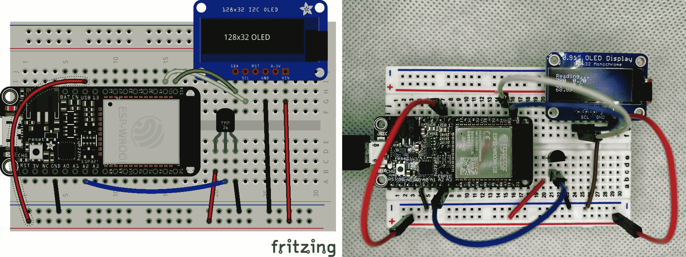

# 第十二章。接下来的步骤

首先，恭喜你走到了这一步！我们已经游览了 C 编程语言和 Arduino 微控制器生态系统的广阔领域。还记得那个第一个“Hello, World”程序或者第一个闪烁的 LED 吗？现在你对这两个世界的了解更加深入了，我希望你渴望继续扩展你的技能。

在这最后一章中，我们将看看最后一个项目，将你的 Arduino 技能与物联网连接起来。物联网的世界每天都在增长，将提供丰富的机会让你尝试新事物，但我们也将涵盖一些你可能感兴趣的其他话题。

# 中级和高级话题

从这里开始，你可以选择很多不同的路径。如今可用的传感器和显示设备的种类真是令人惊讶。去探索吧！你会发现自己的灵感和要完成的项目，这将带来更多的探索和灵感。我最享受的冒险来自于特定的项目想法。我想要一个在万圣节服装中使用的动态 LED 沙漏，所以我找到了一个适合的可穿戴微控制器和一些密集的 LED 条[¹]。我在那个项目中与 LED 玩得很开心，所以我决定为我的后院创造一些防水照明。由于像我们这样预算有限的制造商可以使用 WiFi，我甚至可以让客人选择颜色和其他效果。WiFi 功能的成功反过来推动我创建了一个迷你气象站来满足我内心的气象学家。

所有这些项目成功的关键是选择一个相对集中的目标。例如，在下一节中，我们将通过一个简单的项目进入物联网的世界，从我们已经使用过的 TMP36 组件获取温度读数，并通过 WiFi 报告到云服务。如果你真的想通过本书中的项目和示例所获得的新知识和技能，来巩固你的学习成果，那就选择自己的小项目，并将其变为现实！

## 物联网和 Arduino

如果没有代码就不算是一章，所以让我们来看看最后一个项目，介绍一些非常有趣的路径，你可以探索一下，然后开始制作自己的小工具。物联网正在蓬勃发展，而 Arduino 正好适合在这个领域中发挥作用。让我们来看看我的简化版气象站项目。我们将使用一个支持 WiFi 的微控制器来向云端 API 报告传感器数据。

此项目的电路非常简单。我们需要一个支持 WiFi 的微控制器或 WiFi 断开连接器，您可以像我们在“导入自定义库”中使用 RF 断开连接器一样将其连接到控制器。我选择了来自 Adafruit 的[HUZZAH32 Feather](https://oreil.ly/aySPa)。除了集成的 WiFi 支持外，它还具有一些令人印象深刻的规格，如超过 500KB 的 SRAM 和 4MB 的闪存。传感器与我们在“传感器和模拟输入”中使用的 TMP36 相同。我还添加了一个 OLED 显示屏，这样我就可以在不被绑定到计算机访问串行监视器的情况下观看输出，但这个显示屏绝对是可选的。图 12-1 显示了接线图和我的实际“站点”在面包板上运行的情况。



###### 图 12-1\. 连接 HUZZAH32、TMP36 和 OLED

OLED 使用 Adafruit 提供的库，您可以通过 IDE 的“管理库”对话框导入。在搜索字段中输入**`SSD1306`**，然后查找“Adafruit SSD1306”库。它应该在列表的靠前位置。

我们还需要选择一个云服务提供商并找到与他们通信的库。我在这类项目中使用[Adafruit.io](https://io.adafruit.com)，但任何物联网云服务都可能适用。例如，AWS、Google 和 Azure 都有物联网解决方案。

对于 Adafruit.io，我们可以使用库管理器找到我们的通信库。搜索“adafruit io arduino”，然后向下滚动一点找到名为“Adafruit IO Arduino”的实际库。安装此库需要安装一些依赖项，如 HTTP 和消息队列库，但库管理器会自动处理并提示您安装这些依赖项。您可能已经安装了列出的某些依赖项，例如 NeoPixel 库，但库管理器还不够智能，无法仅显示缺少的依赖项。但是，当您安装依赖项时，只会添加缺少的部分。

我不会详细介绍注册的细节，但是一旦您在所选提供商那里有了帐户，几乎肯定需要一些凭据来配置库。例如，Adafruit.io 需要一个唯一的用户名和访问密钥。让我们将这些云服务信息放在一个单独的[*config.h*](https://oreil.ly/t6UO6)文件中，我们还可以在其中包含我们的 WiFi 详细信息：

```cpp
#include "AdafruitIO_WiFi.h"

#define IO_USERNAME  "userNameGoesHere"
#define IO_KEY       "ioKeyGoesHere"
#define WIFI_SSID    "HomeWifi"
#define WIFI_PASS    "password"
```

幸运的是，该库还包含一个更通用的 WiFi 库作为依赖项。对我们来说，这种双重用途非常好—我们不必分开配置 WiFi 和云访问。但我们仍然需要做一些设置工作，以确保可以与云进行通信。我们将在`setup()`函数中添加该代码，以及用于使用我们的精美 OLED 显示器所需的内容。像往常一样，随意自己输入此内容，或者获取[*ch12/temp_web/temp_web.ino*](https://oreil.ly/muYAu)。

```cpp
#include <SPI.h> 
#include <Wire.h>
#include <Adafruit_GFX.h>
#include <Adafruit_SSD1306.h>

// Use credentials from config.h to set up our feed #include "config.h" 
AdafruitIO_WiFi io(IO_USERNAME, IO_KEY, WIFI_SSID, WIFI_PASS);
AdafruitIO_Feed *smallerc = io.feed("smallerc");

// Set up our OLED #define SCREEN_WIDTH 128 // OLED width, in pixels #define SCREEN_HEIGHT 32 // OLED height, in pixels #define OLED_RESET     4 // Reset pin # #define SCREEN_ADDRESS 0x3C // 128x32 screen Adafruit_SSD1306 display(SCREEN_WIDTH, SCREEN_HEIGHT,  
    &Wire, OLED_RESET);
char statusline[22] = "Starting...";

// A few things for keeping an average temperature reading #define ADJUST 3.33 /* my office reads about 3 degrees C cold */
float total = 0.0;
int   count = 0;

void setup() {
  Serial.begin(115200);
  // SSD1306_SWITCHCAPVCC = generate voltage from 3.3V internally
  if(!display.begin(SSD1306_SWITCHCAPVCC, SCREEN_ADDRESS)) {
    Serial.println(F("SSD1306 allocation failed"));    
    for(;;); // Don't proceed, loop forever
  }

  // Show Adafruit splash screen initialized by the display library
  display.display();

  // Now set up the connection to adafruit.io
  Serial.print("Connecting to Adafruit IO");
  io.connect();                                        
  // wait for a connection
  while(io.status() < AIO_CONNECTED) {
    Serial.print(".");
    delay(500);
  }

  // we are connected
  Serial.println();
  Serial.println(io.statusText());

  // Set up our display for simple (if small) text
  display.clearDisplay();
  display.setTextSize(1);      // Normal 1:1 pixel scale
  display.setTextColor(SSD1306_WHITE); // Draw white text
  display.setCursor(0, 0);     // Start at top-left corner
  display.cp437(true);         // Use 'Code Page 437' font
  display.println(statusline); // Show our starting status
  display.display();           // Update the actual display }

void loop() {
  // put your main code here, to run repeatedly:
  int reading = analogRead(A2);                        
  float voltage = reading / 1024.0;
  if (count == 0) {
    total = voltage;
  } else {
    total += voltage;
  }
  count++;
  float avg = total / count;
  float tempC = (avg - 0.5) * 100;
  float tempF = tempC * 1.8 + 32;
  if (count % 100 == 0) {
    // Update our display every 10 seconds 
    display.clearDisplay();
    display.setCursor(0, 0);
    display.println(statusline);
    display.print(reading);
    display.print("  ");
    display.println(voltage);
    display.print(tempC);
    display.println("\370 C");
    display.print(tempF);
    display.println("\370 F");
    display.display();
    strcpy(statusline, "Reading...");
  }
  if (count % 600 == 0) {
    // Update our IoT feed every minute
    smallerc->save(tempF);                             
    strcpy(statusline, "Feed updated");
  }
  delay(100);
}
```


包括与我们的 OLED 通信所需的各种头文件。


使用*config.h*中的凭据创建一个 I/O 对象(`io`)，并建立到 Adafruit IO 服务的连接，然后指定我们将更新的 feed。


使用常量和引用`Wire`库来实例化我们的`display`对象。


尝试连接显示器。如果连接失败，请打印错误消息并停止执行。如果在此处卡住，可能是电路连接问题。请再次检查连接，并确保显示器有电源。


确保我们可以使用的 feed。等待（可能永远）直到准备就绪。如果无法连接，可以尝试在浏览器中使用您的凭据来验证用户和密钥的组合是否有效。您也可以使用单独的项目测试 WiFi 连接。在 IDE 的文件菜单下，查找示例子菜单，找到您的板子，并选择像*HTTPClient*这样简单的示例。


从 TMP36 传感器读取当前的模拟值，并更新平均运行温度。


使用与我们用于`Serial`的函数类似的 API，在我们的显示器上更新一些关于温度和当前云状态的好文本。


每隔一分钟，向我们的 feed 报告华氏温度。通过`loop()`的下一次，我们将在我们的 OLED 状态行中注意到更新。

您当然可以将像 HUZZAH32 这样的控制器变成自己的 Web 服务器，并直接在浏览器中获取读数，但 Adafuit.io 等服务使得获取更复杂的报告变得简单，例如在几分钟内显示的温度小图表（见图 12-2）。


###### 图 12-2\. 我们报告的温度图表

这个小项目只是对物联网的极简介绍。说实话，仅仅通过 IFTTT 可能就可以填写一本书了。物联网书籍和博客文章随处可见，涵盖了从小设备用户界面设计到企业网格配置的所有内容。这是一个有趣、充满活力的领域，如果你对更多了解感兴趣，你当然有能力深入研究。

## Arduino 源代码

在这里有许多精彩的 Arduino 项目，它们的作者们大多出于创造的乐趣在进行。他们将硬件规格和源代码放在网上，并积极参与[Arduino 论坛](https://forum.arduino.cc)。我真诚地鼓励你阅读其中一些源代码。你现在有能力理解这些项目中的代码，看看其他程序员是如何解决问题的，这可以帮助你学到新的技巧。

你还可以访问 Arduino IDE 支持的许多板子的[源代码](https://oreil.ly/ekC2v)。各种 ArduinoCore 软件包涵盖了我们在“Arduino 环境”中讨论的涉及 C 和 C++内容的内容。确实，这将是密集的阅读，但你可能会惊讶地发现你可以学到多少基础知识。

# 其他单片机

当然，Arduino 并不是唯一的单片机游戏。Mitchel Davis 在 YouTube 上有一个非常[有趣的系列](https://oreil.ly/iN1Fj)，记录了他从 Arduino 编程到像 STM8 这样的更受限制的控制器的旅程。他的示例通常是用 C 语言编写的，你可以看到我们讨论过的像位操作符这样更为难懂的主题。

向更强大的控制器方向发展，Raspberry Pi 平台也值得一提。这些小型计算机是完整的桌面系统，能够运行完整的 Linux 发行版，包括运行所有的开发者工具，如*gcc*。更重要的是，Pi 具有与我们在本书中使用的微控制器相同类型的通用 I/O 连接（GPIO）。你可以使用相同类型的传感器和输出，并编写 C 程序来驱动它们。而且你可以直接在连接外设的硬件上编译这些程序！你可以实现一些非常聪明的项目，比如[魔镜](https://oreil.ly/p4emq)，并添加运动检测器，这样只有有人靠近时镜子才会点亮，使其变得更加神奇。

如果没有别的，我希望这本书能让你有信心去尝试处理这些类型的项目。这是一个令人满足的世界，适合精通自己的技能。与遍布全球的企业工程项目不同，你可以专注于从我们众多的示例中真正学习诸如 Metro Mini 控制器之类的细节。你不需要八种不同的工具链来让 LED 闪烁。你也不需要十几名程序员来调试光敏电阻夜灯。正如本书的一位评论者 Alex Faber 所说，没有多余的东西妨碍你的技艺。我完全同意他的观点。

# 工业中的 C/C++

你也不仅仅在家里摆弄 C 语言。亚瑟·C·克拉克的许多未来（《2001：太空奥德赛》，《2010：奥德赛二》）现在已经成为我们的过去，但计算机和人工智能在我们的现实中占据了重要位置。如果你有兴趣将 C 编程作为职业发展，搜索任何技术职位网站，你会发现从初级职位到资深架构师的数百个 C 程序员职位。你可以在 Linux 内核组实习，或者帮助程序嵌入式控制器。你可以在制造全球最大工厂的传感器程序中找到一份工作。

维护遗留代码仍然需要优秀的 C 程序员，并且这些程序员能够通过这项工作为他们的后代创造出丰厚的财富。游戏系统需要非常快速的代码，无论是游戏引擎还是运行在上面的主机。

超级计算机和微控制器在各种环境中都使用 C 语言。虽然微控制器需要高效的代码更加明显，但大型超级计算机希望每一个 CPU（或者现在的 GPU）的周期都能用来完成它们的计算任务。C 语言在提供这种级别的控制方面表现突出，公司知道他们需要擅长让昂贵的机器快速运行的程序员。如今几乎所有领域都是计算机化的，无论是在推动硬件极限的领域（最小的、最深的、最冷的、最快的等），你都可以找到 C 程序员帮助推动这些界限。

# 回到未来

自从上世纪 70 年代 C 语言首次开发以来，许多语言已经出现。未来的年代必然会出现更多的语言。C 语言之所以依然重要，正是因为它提供了额外的控制和速度。像 Java 这样的“先进”语言也能够加载像我们为 Arduino 编写的相同类型的 C 编写的本地库。Go 语言也可以调用 C 函数。在使用 Rust 处理嵌入式系统时，如果只有一个组件支持 C，Rust 也可以引入 C。

当今计算机编程领域无处不在的 C 语言，从其无处不在的控制语句到通过本地库的集成，了解 C 语言将使您与这个世界的更多内容联系起来，这可能超出了您的想象。在结束时，我只能说希望您继续想象。想象新的项目。想象新的库。然后将那种想象力应用到硬件上。C 语言是实现这些数字梦想的强大工具。希望通过这本书的学习，您能自信地使用它。

¹ 再次来自 Adafruit，我使用了[Gemma M0](https://oreil.ly/ZQ5JB)并切割了他们的[每米 144 个 LED](https://oreil.ly/HlJGk) RGBW 灯条之一，将沙漏缝在衬衫上。我用[USB 电池包](https://oreil.ly/2fpE0)为整个装置供电，在连续运行四个多小时后，电量几乎没怎么用。
