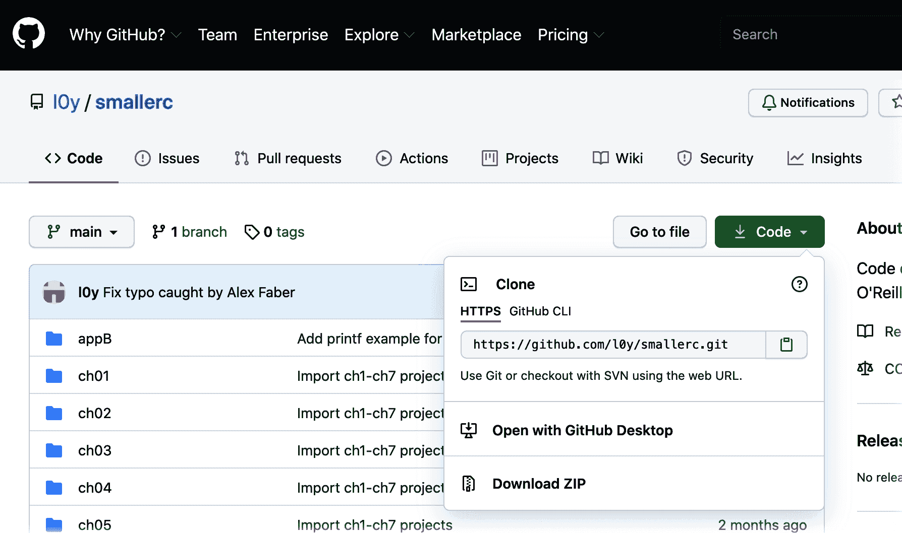

# 附录 A. 硬件和软件

我尝试指出我首次使用任何特定的硬件部件或软件包，但我也想给你一个快速的各种组件列表，以便参考。我没有因提到任何产品而得到报酬，各个所有者和制造商也不认可我的书。这里我表达的赞赏意见完全是我自己的。 :)

# 获取代码

C 示例和 Arduino 示例都可以在[*https://github.com/l0y/smallerc*](https://github.com/l0y/smallerc)上找到。 大多数示例都有链接到其特定文件，但您也可以使用 Figure A-1 中显示的下拉菜单下载存档。

对于 C 示例，实际上没有其他事情要做。 您可以在所选编辑器中打开任何示例。 您可以进行更改并保存更改，然后在同一文件夹中立即编译示例。

对于各种示意图，您可能希望在工作时将每个示意图文件夹拖到 Arduino Sketchbook 位置。 （此位置设置在 Arduino IDE 首选项中，如来自“The libraries folder”的 Figure 11-9 所示。）这将确保您可以访问安装的任何库。 这也意味着您完成书后可以在“通常的位置”查看这些项目。

###### 图 A-1\. 从 GitHub 下载示例存档

# 获取硬件：Adafruit

我在本书中的许多示例中使用的大部分实体设备来自 Adafruit。 他们拥有令人惊叹的控制器和组件选择，以及一些在网上可以找到的最有趣、最全面和最“书呆子”的教程。 我大部分时间都在[他们的网站](https://adafruit.com)直接购物，但您也可以通过[Amazon](https://oreil.ly/CyB1X)和[Digi-Key](https://digikey.com)找到他们的许多零件。 Table A-1 列出了我在许多 Arduino 项目中使用的微控制器。 Table A-2 列出了按章节使用的外围设备和组件。 如果我在多个项目中使用一个组件，我会在每个出现的章节中列出它。

表 A-1\. 微控制器和原型

| 微控制器 | 规格 |
| --- | --- |
| [Metro Mini](https://oreil.ly/KxFf0) (2x) | ATmega328，32KB 闪存，2KB SRAM |
| [Trinket M0](https://oreil.ly/R2fui) | 32 位 ATSAMD21E18，256KB 闪存，32KB SRAM |
| [HUZZAH32 Feather](https://oreil.ly/p5Ldy) | Tensilica LX6，WROOM32，HT40 WiFi，4MB 闪存，520KB SRAM，蓝牙 |
| 原型设备 |
| [全尺寸面包板](https://oreil.ly/sZo2h) | 带电源轨的标准面包板 |
| [半尺寸面包板](https://oreil.ly/bfpYJ) | 带电源轨的紧凑面包板 |
| [连接线](https://oreil.ly/RoHW1) | 包含各种长度和 Molex 插头的捆绑线 |

表 A-2\. 外围设备和组件

| 组件 | 规格 |
| --- | --- |
| 第八章 |
| [100Ω电阻](https://oreil.ly/YOgc7) | 碳纤维穿孔 |
| [470Ω电阻](https://oreil.ly/wwVrn) | 碳纤维穿孔 |
| [蓝色 LED](https://oreil.ly/xJqOL) | 直径 3mm，前向电压约 3.0V |
| [NeoPixel Flora](https://oreil.ly/dyCpE) | 单个 RGB NeoPixel LED |
| [NeoPixel 棒](https://oreil.ly/8zpaZ) | 8 RGB NeoPixel LEDs，棒状安装 |
| [NeoPixel 环](https://oreil.ly/Mwoph) | 24 RGB NeoPixel LEDs，环形安装 |
| 第九章 |
| [RGB LED](https://oreil.ly/e0TBv) | 5mm，公共阴极 |
| [470Ω电阻](https://oreil.ly/8jyjo) | 碳纤维穿孔 |
| [TMP36 温度传感器](https://oreil.ly/JQFud) | 模拟，范围-50 到 125 摄氏度 |
| [四位数码显示器](https://oreil.ly/RO5P5) | 红色，MAX7219 驱动器（VMA425 的替代品） |
| [触摸按钮](http://adafru.it/367) | 简单按键 |
| [NeoPixel 环](https://oreil.ly/8GOWh) | 24 RGB NeoPixel LEDs，环形安装 |
| 第十章 |
| [NeoPixel 棒](https://oreil.ly/mPpVW) | 8 RGB NeoPixel LEDs，棒状安装 |
| 第十一章 |
| [RFM69HCW 收发器](https://adafru.it/3070) (2x) | 900MHz（美洲地区） |
| [导航开关](https://adafru.it/504) | 穿孔式，5 向 |
| [橡胶小钮帽](https://adafru.it/4697) | 适合导航摇杆 |
| [TT 电机轮](https://adafru.it/3766) (2x) | 橙色辐条，透明轮胎 |
| [TT 电机齿轮箱](https://adafru.it/3777) (2x) | 200 RPM，3 - 6VDC |
| [电机驱动板](https://adafru.it/3297) | DRV8833 芯片 |
| [TT 电机底盘](https://adafru.it/3796) | 铝制，紫色 |
| 第十二章 |
| [OLED 显示器](https://adafru.it/4440) | 0.91 英寸，128x32 像素，I2C |
| [TMP36 温度传感器](https://adafru.it/165) | 模拟，范围-50 到 125 摄氏度 |

总的来说，我尽量坚持使用容易设置和修改的面包板项目。如果你建造了稳定的东西，并想通过摆脱面包板来体现这种稳定性，我强烈推荐[Adafruit 卓越焊接指南](https://oreil.ly/vytmN)。他们提供了一些关于硬件和技术的极好建议，专业的业余爱好者用来创建更加持久的项目。我会在他们出色指南中增加一点强调：在焊接铁章节中，“最佳铁”确实是最好的。它们确实更昂贵，所以不适合每个人，但如果你能负担得起，像[Hakko FX-888D](https://adafru.it/1204)这样的铁将焊接引脱颖而出，使之成为一种冥想艺术。

# VS Code

我的非 Arduino 编码是使用来自 Microsoft 的 [Visual Studio Code](https://oreil.ly/C6v3D) 进行的。虽然它由 Microsoft 编写，但 VS Code 也适用于 Linux 和 macOS。它高度可配置，并且有一个充满活力的扩展生态系统，几乎覆盖了所有可能的编程语言和 Web 开发框架。如果什么都不是的话，“C/C++”扩展非常适合处理 C 语言。

# Arduino IDE

在整本书中，我依赖 [Arduino IDE](https://oreil.ly/7vXun) 来编译和上传微控制器项目。Arduino IDE 跨平台，并且对来自许多不同供应商的广泛微控制器有出色的支持。

Arduino 网站还有一个有用的 [Language Reference](https://oreil.ly/VH8RZ) 和几个 [tutorials](https://oreil.ly/OWYJy)，涵盖从简单的“入门”主题到更高级的深入研究 Arduino 平台的技术。

###### 注意

对于真正喜欢 VS Code 环境的人来说，需要指出，对于 [PlatformIO](https://platformio.org) 的热情正在增长。根据他们的关于页面：“PlatformIO 是一款跨平台、跨架构、支持多框架的专业工具，面向嵌入式系统工程师和为嵌入式产品编写应用程序的软件开发者。”

它有独立选项，但也有成熟的 VS Code 扩展。你可以在他们的 [VS Code Integration](https://oreil.ly/3ZH3G) 页面找到更多详细信息。

# Fritzing

你可能已经注意到我们的布线图中用可爱的电路图案来代替字体的“fritzing”这个词。如果你建立了任何项目并决定与他人分享，你可以自己创建这些类型的图表。 [Fritzing](https://fritzing.org) 的好人们创建了我使用的软件。这款设计应用程序跨平台，并且许多第三方为控制器和组件库创建了非常可观的视觉贡献。特别是如果你有使用其他设计和布局工具（如 [OmniGraffle](https://oreil.ly/zODll) 或 [Inkscape](https://inkscape.org)）的经验，它也非常直观。他们要求（非常！）适度的费用，如果你有能力支付，我觉得非常值得。

你也可以在线找到丰富的与 Fritzing 兼容的组件。他们的论坛包含了一些出色的高质量贡献，例如由 Desnot4000 贡献的用于 Figure 9-5 的 4 位数 7 段显示器。如果需要，你还可以导入 SVG 文件创建自定义组件。

如果你真的开始进行自己的电子项目，Fritzing 的软件也可以用来制作定制电路板。你的业余爱好从未显得如此专业！致力于使硬件开放和更多人可访问，我对这个团队及其更广泛的用户社区印象深刻。

# GNU 编译器集合

最后但绝对不是最不重要的，我使用了来自极为实用的[GNU 编译器套件](https://gcc.gnu.org)，即 GNU C 编译器（Arduino IDE 也使用它）。正如你可能在“所需工具”中注意到的那样，在某些平台上安装这些工具可能需要一些努力，但是这些编译器的广度和质量是无与伦比的。再加上它们的开源精神，GNU 软件确实难以在任何可用的地方被超越。
