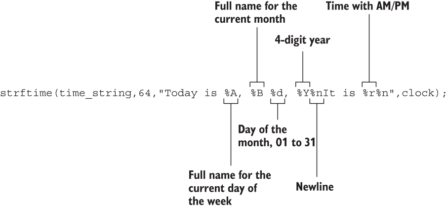
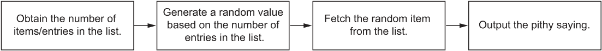
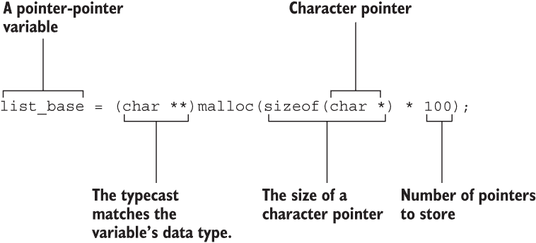
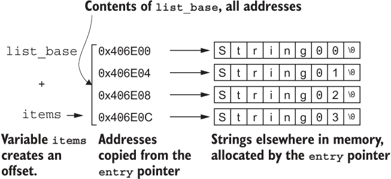

# 2 每日问候

你的电脑一天从你登录开始。原始术语是登录，但由于树木如此稀少，标志如此众多，这个术语在 2007 年被布什政府所改变。不管这种令人讨厌的联邦过度干预，你可以在登录或打开终端窗口后，通过一个小小的 C 程序定制一个愉快的问候。为了实现这一点，你需要：

+   回顾 Linux 启动过程。

+   发现在哪里添加你的问候信息。

+   编写一个简单的问候程序。

+   修改你的问候程序以添加时间。

+   更新时间戳以显示当前月相。

+   用一句俏皮话增强你的问候信息。

本章创建和扩展的程序特定于 Linux、macOS 和 Windows Subsystem for Linux (WSL)，在这些系统中，启动脚本可用于配置终端窗口。稍后的部分将解释哪些启动脚本适用于更流行的 shell。本章不会涉及在 GUI shell 启动时创建每日问候信息。

我猜你可以在 Windows 终端屏幕、命令提示符中添加一条启动信息。这是可能的，但这个过程让我感到无聊，而且只有那些狂热的 Windows 极客才会关心，所以我就不具体说明了。如果你有这个愿望，问候程序仍然会在 Windows 命令提示符中运行。否则，你可以直接向我个人提出投诉；我的电子邮件地址可以在本书的引言中找到。我保证不会回复任何抱怨的 Windows 用户发来的邮件。

## 2.1 shell 启动

Linux 的启动过程漫长、复杂且非常激动人心。我确信你急于阅读所有这些细节。但本书是关于 C 编程的。你必须寻找一本关于 Linux 的书籍，以了解唤醒 Linux 计算机所涉及的完整、热烈的步骤。与创建每日问候相关的激动人心的事情发生在操作系统完成早晨例程之后，当 shell 开始运行时。

### 2.1.1 理解 shell 的位置

Linux 系统上的每个用户账户都被分配了一个默认 shell。这个 shell 曾经是 Linux 的唯一接口。我记得在 1990 年代早期启动了一个 Red Hat Linux 的早期版本，我看到的第一个——也是唯一一件事——就是一个文本模式的屏幕。今天事情都是图形化的，shell 被移到了一个终端窗口中。在这里它仍然很重要，这对于 C 编程来说是个好消息。

默认 shell 是由某个东西配置的。我太懒了，不想在这里写关于它的事情。再次强调，这不是一本关于 Linux 的书。简单地说，你的账户很可能使用的是 *bash* shell——这是“Bourne again shell”这个词的碰撞，所以我的“*bash* shell”写作是多余的（就像 ATM 机一样），但如果不这样写看起来又很别扭。

要确定默认 shell，启动一个终端窗口。在提示符下，输入命令 **echo $SHELL**：

```
$ echo $SHELL
/bin/bash
```

这里，输出确认分配给用户的 shell 是 *bash*。$SHELL 参数代表分配给启动 shell 的环境变量，在这里是 /bin/bash。此输出可能不反映当前 shell——例如，如果您随后运行了 *sh* 或 *zsh* 或类似命令以启动另一个 shell。

要确定当前 shell，请输入命令 **ps -p $$**：

```
$ ps -p $$
  PID TTY          TIME CMD
    7 tty1     00:00:00 bash
```

此输出显示 shell 命令是 bash，这意味着无论 $SHELL 变量的分配如何，当前 shell 都是 *bash*。

要更改 shell，请使用 *chsh* 命令。命令后跟新的 shell 名称。更改 shell 只会影响您的账户，并适用于您在发出命令后打开的任何新终端窗口。今天关于 Linux 的内容就到这里。

### 2.1.2 探索各种 shell 启动脚本

当 shell 启动时，它会处理位于各种启动脚本中的命令。其中一些脚本可能是全局的，位于系统目录中。其他脚本可能特定于您的账户，位于您的主目录中。

启动脚本配置终端。它们允许您自定义令人讨厌的纯文本体验，例如添加颜色、创建快捷方式以及执行您可能需要每次打开终端窗口时手动执行的各种任务。位于您主目录中的任何启动脚本文件都是您可以配置的。

综上所述，一般建议不要干涉启动 shell 脚本。为了强调这一点，shell 脚本文件隐藏在您的 home 目录中。文件名以单个点开头。点前缀隐藏文件，使其不会出现在标准目录列表中。这种隐蔽性使得文件便于使用，同时又能防止普通用户尝试干涉它们。

因为您想干涉 shell 启动脚本，特别是要添加个性化的问候语，所以有必要知道脚本名称。这些名称可能因 shell 而异，尽管在表 2.1 中显示的启动脚本通常是首选的。

表 2.1 关于 Linux shell 脚本的枯燥信息

| Shell | 名称 | 命令 | 启动文件名 |
| --- | --- | --- | --- |
| Bash | Bash，“Bourne again shell” | */bin/bash* | .bash_profile |
| Tsch | Tee C shell | */bin/tsch* | .tcshrc |
| Csh | C shell | */bin/csh* | .cshrc |
| Ksh | Korn shell | */bin/ksh* | .profile |
| Sh | Bourne shell | */bin/sh* | .profile |
| Zsh | Z shell | */bin/zsh* | .zshrc |

例如，对于 *bash* shell，我建议编辑启动脚本 .bash_profile 以添加您的问候语。其他启动脚本可能在 shell 启动时运行，但这是您可以修改的脚本。

要查看您的 shell 启动脚本，请在终端窗口中使用 *cat* 命令。在命令后跟 shell 的启动文件名。例如：

```
$ cat ~/.bash_profile
```

~/ 路径名是您主目录的快捷方式。在您发出前面的命令后，shell 启动脚本的内容会散布在文本屏幕上。如果不是这样，文件可能不存在，您需要创建它。

当你看到文件内容时，你可以在混乱中单独放置你的问候程序。脚本的其他部分不应该被篡改——除非你擅长用脚本语言编码并制作出色的启动脚本，这你可能不是。

### 2.1.3 编辑 shell 启动脚本

Shell 启动脚本是纯文本文件。它们由 shell 命令、程序名称和各种指令组成，这使得脚本像编程语言一样工作。脚本像任何文本文件一样进行编辑。

我可以就 shell 脚本写几页精彩的文字，但我有一个小时后要去看牙医，这本书是关于 C 编程的。尽管如此，你应该注意启动 shell 脚本的两个相关方面：第一行和文件的权限。

为了解释启动脚本中的文本行，文件的第一行指示 shell 使用一个特定的程序来处理文件中剩余的行。传统上，Unix shell 脚本的第一行是：

```
#!/bin/sh
```

这一行以#开头，这使得它成为一条注释。感叹号，酷孩子们告诉我读作“bang”，指示 shell 使用/bin/sh 程序（原始 Bourne shell）来处理文件中剩余的文本行。命令可以是任何东西，从 bash 这样的 shell 到*expect*这样的实用程序。

所有 shell 脚本都设置了可执行权限位。如果文件存在，这个设置已经完成。否则，如果你正在创建 shell 脚本，必须在文件创建后赋予它可执行位。使用 chmod 命令并带上+x 开关，然后跟脚本文件名：

```
chmod +x .bash_profile
```

发出此命令仅在你最初创建脚本时需要。

在启动脚本中，我的建议是将你的问候程序单独放在脚本末尾的一行上。你甚至可以在该行之前加上注释，以#字符开始。酷孩子们告诉我#读作“hash”。

为了练习，编辑终端窗口的启动脚本：打开一个终端窗口，并使用你喜欢的文本编辑器打开 shell 的启动脚本，如表 2.1 中所述。例如，在我的 Linux 系统中，我输入：

```
vim ~/.bash_profile
```

在脚本底部添加以下两行，在所有看起来令人印象深刻和诱人的内容之后：

```
# startup greetings
echo "Hello" $LOGNAME
```

第一行以#开头。（我希望你在心里说的是“hash”。）这个标签将这一行标记为注释。

第二行输出文本“Hello”，后跟环境变量$LOGNAME 的内容。这个变量代表你的登录账户名。

这里是示例输出：

```
Hello dang
```

我的账户登录名是*dang*，如所示。当终端窗口首次打开时，这一行文本是 shell 启动脚本生成的最终输出。本章剩余部分生成的 C 程序将替换这一行，输出它们愉快和有趣的消息。

当将你的问候语程序添加到启动脚本中时，指定其路径名非常重要，以免 shell 脚本解释器崩溃。路径可以是完整的，如下所示：

```
/home/dang/cprog/greetings
```

或者可以使用 ~/ 主目录快捷方式：

```
~/cprog/greetings
```

在这两种情况下，程序名为 greetings，它位于 cprog 目录中。

## 2.2 简单问候

所有主要的编程项目最初都很简单，并且倾向于发展成为复杂、丑陋的怪物。我确信 Excel 是作为一个快速而粗糙的文本模式计算器开始的——现在看看它。无论如何，良好的编程实践不是一开始就编写所有你需要的东西。不，最好的做法是从简单而愚蠢的东西开始，这正是本节的目的。

### 2.2.1 编写问候语

你能制作的最基本的问候语程序是对每个自摩西以来每本 C 语言入门书籍中出现的愚蠢 *Hello World* 程序的简单重复。列表 2.1 展示了你可以为你的问候语程序编写的版本。

列表 2.1 greet01.c 的源代码

```
#include <stdio.h>

int main()
{
    printf("Hello, Dan!\n");

    return(0);
}
```

不要构建。不要运行。如果你这样做，请使用以下命令构建一个名为 greetings 的程序：

```
clang -Wall greet01.c -o greetings
```

你可以用你喜欢的但性能稍逊的编译器替换 *clang*。成功后，生成的程序命名为 greetings。将此程序添加到你的 shell 启动脚本中，添加最后一行，如下所示：

```
greetings
```

确保在程序名称前加上路径名——无论是完整的路径名，如下所示：

```
/home/dang/bin/greetings
```

或者是一个相对路径名：

```
~/bin/greetings
```

启动脚本不能神奇地定位程序文件，除非你指定路径，例如示例中显示的我的个人 ~/bin 目录。（我还使用我的 shell 启动脚本将我的个人 ~/bin 目录添加到搜索路径——这是在另一本书中找到的另一个 Linux 技巧。）

启动脚本更新后，你打开的下一个终端窗口将运行一个启动脚本，输出以下行，让你的日子更加愉快：

```
Hello, Dan!
```

如果你的名字不是 Dan，那么问候语比愉快更让人困惑。

### 2.2.2 添加名称作为参数

问候语程序的初始版本不够灵活。这可能是你没有编写它，而是急于对其进行一些定制修改的原因。

考虑列表 2.2 中提供的适度改进。此代码更新允许你向程序提供一个参数，使其更加灵活。

列表 2.2 greet02.c 的源代码

```
#include <stdio.h>

int main(int argc, char *argv[])
{
    if( argc<2)                              ❶
        puts("Hello, you handsome beast!");
    else
        printf("Hello, %s!\n",argv[1]);      ❷

    return(0);
}
```

❶ 程序名称的参数计数始终为 1；如果是这样，则输出默认消息。

❷ 程序名称后面的第一个单词表示为 argv[1]，并在此输出。

将此代码构建成一个程序，并将其按照古老卷轴中以及上一节中所述的方式放入你的 shell 启动脚本中。

```
greetings Danny
```

当你打开一个新的终端窗口时，程序现在输出以下消息：

```
Hello, Danny!
```

这条新消息比原始消息更加愉快，但仍需一些改进。

## 2.3 问候时间

我为我的旧 DOS 计算机编写的第一个程序是在每次开机时向我问候。这个程序与上一节中创建的程序类似，这意味着它很无聊。为了增加趣味性，并受我在现实生活中与人类互动的启发，我添加了代码，使问候语反映一天中的时间。你也可以这样做，并且可以以不同的精度实现。

### 2.3.1 获取当前时间

真的有谁知道现在是什么时间吗？计算机可以猜测。它通过每隔一段时间与互联网时间服务器接触来保持半准确的时间。否则，计算机的时钟每天都会偏差几分钟。相信我，计算机是糟糕的时钟，但这并不意味着你不能从其内部提取当前时间。

C 库中充满了时间函数，所有这些函数都在 time.h 头文件中定义。*time_t* 数据类型也在该头文件中定义。这个正整数值（*long* 数据类型，*printf()* 占位符 %ld）存储了 Unix 纪元，即自 1970 年 1 月 1 日午夜以来的滴答声秒数。

Unix 纪元是在你的问候程序中可以使用的一个很好的值。例如，想象一下，每天当你启动终端时，看到以下愉快的消息：

```
Hello, Danny, it's 1624424373
```

尽量抑制任何情绪。

当然，必须将 *time_t* 值转换为更有用的东西。列表 2.3 展示了一些示例代码。请注意，许多时间函数，如 time01.c 代码中使用的 *time()* 和 *ctime()*，需要 *time_t* 变量的地址。是的，它们是指针。

列表 2.3 time01.c 的源代码

```
#include <stdio.h>
#include <time.h>                                   ❶

int main()
{
    time_t now;

    time(&now);                                     ❷
    printf("The computer thinks it's %ld\n",now);
    printf("%s",ctime(&now));                       ❸

    return(0);
}
```

❶ 需要 time.h 头文件，否则编译器会对你不满。

❷ *time()* 函数需要 *time_t* 变量的地址，这里用 & 地址运算符作为前缀。

❸ *ctime()* 函数需要一个指针参数，并返回一个附加了换行符的字符串。

下面是程序输出的示例：

```
The computer thinks it's 1624424373
Tue Jun 22 21:59:33 2021
```

输出显示了自 1970 年以来的滴答声秒数。这个相同的值被 *ctime()* 函数吞没，以输出格式化的时间字符串。这个结果在你的问候程序中可能是可以接受的，但时间数据可以进一步定制。解锁特定时间细节的关键在于 *localtime()* 函数，正如列表 2.4 中的代码所展示的。

列表 2.4 time02.c 的源代码

```
#include <stdio.h>
#include <time.h>

int main()
{
    time_t now;
    struct tm *clock;                                         ❶

    time(&now);
    clock = localtime(&now);
    puts("Time details:");
    printf(" Day of the year: %d\n",clock->tm_yday);
    printf(" Day of the week: %d\n",clock->tm_wday);          ❷
    printf("            Year: %d\n",clock->tm_year+1900);     ❸
    printf("           Month: %d\n",clock->tm_mon+1);         ❹
    printf("Day of the month: %d\n",clock->tm_mday);
    printf("            Hour: %d\n",clock->tm_hour);
    printf("          Minute: %d\n",clock->tm_min);
    printf("          Second: %d\n",clock->tm_sec);

    return(0);
}
```

❶ 因为 *localtime()* 返回一个指针，所以最好将结构声明为指针。

❷ 一周的第一天是周日，值为 0。

❸ 你必须将 1900 加到 tm_year 成员上以获取当前年份；你会忘记这一点。

❹ tm_mon 成员的范围是 0 到 11。

我用大量的空格格式化了列表 2.4 中的代码，这样你可以轻松地识别 tm 结构的成员。这些变量代表了 *localtime()* 函数从一个 time_t 值中提取的时间片段。确保你记得根据列表 2.4 调整一些值：年值 tm_year 必须加 1900 以反映当前的有效年份；月份值 tm_mon 从零开始，而不是从一。

输出很简单，所以我无需展示——除非你给我一张 5 美元的支票。然而，代码的目的是展示你可以如何获取有用的时间信息，以便在终端问候中适当地点缀。

### 2.3.2 混合一天中的通用时间

我多年前为我的 DOS 计算机编写的程序叫做 GREET.COM。它是我的计算机 AUTOEXEC.BAT 程序的一部分，每次我启动我那可靠的旧 IBM PC 时都会运行。因为我喜欢怀旧，所以我保留了这个程序的副本。用 x86 汇编编写的它仍然可以在 DOSBox 下运行。啊，数字过去的甜美香气。闻起来像臭氧。

可惜，我不再拥有 GREET.COM 程序的源代码。根据记忆（和反汇编），我看到代码获取了当前的小时数，并输出相应的时间问候：早上好，下午好，或晚上好。你可以用同样的技巧编码——尽管是在为你的当前计算机编写的 C 语言中，而不是在古老的 IBM PC 的 x86 汇编语言中。

从本章的第一部分汇集资源，列表 2.5 展示了我旧问候程序的当前版本。

列表 2.5 greet03.c 的源代码

```
#include <stdio.h>
#include <time.h>

int main(int argc, char *argv[])
{
    time_t now;
    struct tm *clock;
    int hour;

    time(&now);
    clock = localtime(&now);
    hour = clock->tm_hour;     ❶

    printf("Good ");
    if( hour < 12 )            ❷
        printf("morning");
    else if( hour < 17 )       ❸
        printf("afternoon");
    else                       ❹
        printf("evening");

    if( argc>1 )               ❺
        printf(", %s",argv[1]);

    putchar('\n');

    return(0);
}
```

❶ 这个语句是为了方便，避免反复使用 clock->tm_hour。

❷ 在中午之前，说“早上好”。

❸ 从中午到下午 5:00，说“下午好”。

❹ 否则，就是晚上。

❺ 检查并输出第一个命令行参数。

假设编译好的程序名为 greetings，用户输入 **Danny** 作为命令行参数，并且现在是下午 4 点，以下是代码的输出：

```
Good afternoon, Danny
```

这段代码有效地复制了我几十年前编写的 GREET.COM 程序的内容。输出的是一个与当前时间相符的愉快问候。

为了增加幽默感，你可以添加对早间时间的测试，比如午夜到凌晨 4:00。输出一些俏皮的文字，比如“工作到很晚吗？”或“你还在吗？”哦，多么的幽默！我希望你的肚子不会疼。

### 2.3.3 添加特定时间信息

当你打开终端窗口时，另一种款待自己的方式是输出一个详细的时间字符串。完成这个任务的简单方法是输出问候语，然后是 *ctime()* 函数生成的时间字符串。以下是相关的两行代码：

```
printf(“Good day, %s\n”,argv[1]);
printf(“It’s %s”,ctime(&now));
```

这两个语句反映了本章前面展示的代码，所以你能够理解。尽管如此，程序还是有点懒散。最好结合使用 *strftime()* 函数，该函数根据您的指定格式化时间戳字符串。

*strftime()*函数的工作方式类似于*printf()*，它使用一个特殊的字符串来格式化时间信息。函数的输出被保存在一个缓冲区中，你的代码可以在以后使用。示例代码 2.6 展示了这一点。

列表 2.6 greet04.c 的源代码

```
#include <stdio.h>
#include <time.h>

int main(int argc, char *argv[])
{
    time_t now;
    struct tm *clock;
    char time_string[64];        ❶

    time(&now);
    clock = localtime(&now);     ❷

    strftime(time_string,64,"Today is %A, %B %d, %Y%nIt is %r%n",clock);

    printf("Greetings");
    if( argc>1 )
        printf(", %s",argv[1]);
    printf("!\n%s",time_string);

    return(0);
}
```

❶ 由*strftime()*函数填充的字符串存储

❷ 你必须填充一个 localtime() tm 结构，才能使 strftime()函数正常工作。

你可以查看*strftime()*的*man*页面，以发现所有有趣的占位符及其功能。就像*printf()*函数一样，占位符以%字符为前缀。格式化字符串中的任何其他文本都按原样输出。以下是示例代码 2.6 中*strftime()*语句的亮点：



输出反映了生成并存储在 time_string[]缓冲区中的时间字符串。时间字符串在前面章节中提到的通用问候语之后出现：

```
Greetings, Danny!
Today is Wednesday, June 23, 2021
It is 04:24:47 PM
```

到目前为止，一些“宅男”可能会说，所有这些输出都可以通过使用 shell 脚本语言轻松完成，因为 shell 启动和配置文件的母语就是 shell 脚本语言。是的，这样的人存在。然而，作为一个 C 程序员，你的任务是向问候语提供更多的洞察力和功能。使用悲伤的小 shell 脚本语言时，这些添加是不可能的。所以就这样。

## 2.4 当前月相

我的直觉是大多数程序员在夜间工作效率最高。那么，当你可以只是伸出头来窗外仰望时，为什么还要费心编写一个月相问候呢？

你是对的：这种努力太麻烦了，尤其是当你可以编写一个 C 程序来在室内安全地获得月相的良好近似值时。你甚至可以在每次打开终端窗口时，用这个有趣的片段取悦自己。外面？那只是过誉了。

### 2.4.1 观察月相

古代玛雅人编写了第一个月相算法，可能是在 COBOL 语言中。我本想在这里打印一段代码，但直接表达象形文字更简单：它是一个小个子蹲在石头上，伸出长长的舌头，戴着节日帽，脸上表情愤怒。程序员们对此姿势很熟悉。

月球在绕地球运行时经过不同的相位。这些相位是基于从地球看到的月亮暴露在阳光下的程度。图 2.1 展示了月球的轨道。阳光的一面总是朝向太阳，尽管从地球上看，我们看到月亮的不同部分被照亮。这些就是月亮的相位。


图 2.1 月球轨道影响从地球看到的照明侧面可见的部分。

从地球人的视角看，月相被命名并如图 2.2 所示。在 28 天的旅程中，月亮的相位从新月（无照明）变为满月，然后再回到新月。此外，一半的时间，月亮在白天可见（通常几乎看不见）。


图 2.2 从地球看到的月相

图 2.2 中显示的相位遵循月亮从新月到满月再回到新月的进程。后者衰减的相位发生在早晨，这也是为什么它们只受到名叫韦恩的男性的欢迎。

### 2.4.2 编写月相算法

现在不向外看，你能说出月相吗？

是的，我假设你现在在晚上读这本书。程序员是可以预测的。如果你在白天读这本书——甚至在户外——那就恭喜你了。不管时间如何，月亮都有一个当前的相位。不是情绪化的青少年相位，而是前面章节中提到的月亮多少被照亮的状态。

要确定月相而无需向外看或查阅参考，你可以使用一个算法。这些算法在互联网上很常见，也刻在玛雅的石板上。关键是月亮的可预测周期，它可以映射到日、月和年。算法的精确度取决于许多因素，例如你的位置和一天中的时间。如果你想非常精确，你必须使用复杂的几何和混乱的东西，即使半闭一只眼我也不想看。

列表 2.7 展示了 moon_phase() 函数。它包含了我多年前找到的算法，可能是在旧的 ARPANET 上。我的观点是：我不知道它从哪里来。它大部分是准确的，这是我典型的月相算法的特点，这些算法不使用复杂和令人恐惧的数学函数。

列表 2.7：*moon_phase()* 函数

```
int moon_phase(int year,int month,int day)
{
    int d,g,e;

    d = day;
    if(month == 2)
        d += 31;
    else if(month > 2)
        d += 59+(month-3)*30.6+0.5;
    g = (year-1900)%19;
    e = (11*g + 29) % 30;
    if(e == 25 || e == 24)
        ++e;
    return ((((e + d)*6+5)%177)/22 & 7);
}
```

列表 2.7 中提出的算法需要三个参数：整数 year（年）、month（月）和 day（日）。这些与 *localtime()* tm 结构的成员中的值相同：tm_year+1900 表示年，tm_mon 表示月（从 1 月开始为 0），tm_day 表示月份中的日，从 1 开始。

这就是我将要解释算法如何工作的方法：我不会。说真的，我对此一无所知。我只是从某处抄下了公式，而且——天哪——它大部分是有效的。大部分。

将列表 2.7 中的代码插入到你的首选问候程序中。如果你在 *main()* 函数上方粘贴它，它就不需要原型。否则，将其原型化如下：

```
int moon_phase(int year,int month,int day);
```

函数返回一个范围在 0 到 7 之间的整数，代表前面图 2.2 中显示的八个月相，并按此顺序。一个表示这些相位的字符串数组，与 *moon_phase()* 函数返回的值相匹配，如下所示：

```
char *phase[8] = {
        "waxing crescent", "at first quarter",
        "waxing gibbous", "full", "waning gibbous",
        "at last quarter", "waning crescent", "new"
};
```

你可以自己编写剩余的代码。我在本书的代码仓库中包含了它，作为 moon.c，如引言中所述，但你还没有阅读过。

拥有这些知识，你可以轻松地将月相作为输出添加到你的终端程序初始问候中。然而，有一件事你不想做，那就是使用这个月相算法来准确预测月相。说真的，这只是一种娱乐。不要用这个算法发射载人火箭到月球。我在看着你，意大利。

### 2.4.3 将月相添加到你的问候中

您可以将*moon_phase()*函数添加到本章中列出的问候系列程序中的任何源代码示例中。您需要获取基于时间的数据，这是*moon_phase()*函数进行计算所需的。您还需要一个字符串数组，根据函数返回的值输出当前的月相文本。

列表 2.6 显示了 greet04.c 的源代码，是修改的最佳候选。进行以下更改：

在 main()函数中声明一个整数变量 mp，用于存储从*moon_phase()*函数返回的值：

```
int mp;
```

在现有代码中的最后一个*printf()*语句之后，在*return*之前添加以下两个语句：

```
mp = moon_phase(clock->tm_year+1900,clock->tm_mon,clock->tm_mday);
printf("The moon is %s\n",phase[mp]);
```

您可以将这些语句合并为一个单独的*printf()*语句，从而消除对 mp 变量的需求：将*moon_phase()*函数调用（第一行）插入到*printf()*语句中的括号内。结果是代码行非常长，这就是为什么我将其拆分的原因。我宁愿选择可读性，也不愿选择长代码行。

您可以在本书的 GitHub 存储库中找到 greet05.c 的最终副本。以下是示例输出：

```
$ greetings Danny
Greetings, Danny!
Today is Thursday, June 24, 2021
It is 10:02:33 PM
The moon is full
```

想象一下您的用户在终端窗口开始时看到这样丰富信息的喜悦。他们会靠在椅背上微笑，当他们说“我欣赏这些闪光的细节，我的程序员朋友。很高兴今晚不用外出。谢谢。”时，会点头表示感谢。

## 2.5 一句箴言

幸运程序自早期以来一直是 shell 启动脚本的一部分，那时一些 Unix 终端还是脚踏式供电的。它今天仍然可用，可以从您发行版的包管理器中轻松安装；搜索“fortune”。

“幸运”这个名字来自幸运饼干。想法是生成一句箴言，或*巧言妙语*，您可以用它作为新鲜的动力开始您的一天。这些灵感来自一些中国餐馆提供的甜点，它们的作用是固定纸条，而不是提供任何营养价值。

这里是一个数字幸运饼干的例子，来自幸运程序：

```
$ fortune
There is no logic in the computer industry.
               --Dan Gookin
```

如果您有一个箴言数据库和一个渴望随机抽取一个的程序，您就可以复制幸运程序输出。

### 2.5.1 创建箴言存储库

幸运程序附带一个或多个格言数据库。幸运饼干的信息就是从这里检索并输出到屏幕上的。您可以借鉴这个列表，但这是一种作弊行为。这也很愚蠢，因为幸运程序已经编写好了。您将一无所学。真丢脸！

您的目标是编写您自己的箴言数据库版本。它不必是引言或幽默，也可以包含有关使用计算机的建议、关于 IT 安全的提醒以及其他重要信息，如当前的流行发型。

我可以想象几种配置列表的方法。这种规划对于编写好的代码至关重要：一个组织良好的列表意味着你需要的编码工作更少。目标是随机从存储库中抽取一个短语，这意味着一个组织良好的文件是必须的。图 2.3 概述了编写代码从列表或数据库中随机抽取简短短语的过程。



图 2.3 从文件中读取随机简短引言的过程

我可以想象几种格式化文件的方法，如表 2.2 所述。

表 2.2 存储短语以方便访问的方法

| 文件格式/数据 | 优点 | 缺点 |
| --- | --- | --- |
| 基本文本文件 | 使用现有工具简单维护 | 每次程序运行时都必须读取和索引文件。 |
| 带有初始项目计数的格式化文件 | 项目计数可以立即读取 | 随着列表的修改，项目计数必须更新。 |
| 带索引条目的散列表 | 读取和访问每个记录都很容易 | 你可能需要一个单独的程序来维护列表，这将需要更多的编码工作。 |

我更喜欢使用基本文本文件来创建我的列表，这意味着需要更多的开销来获取一个随机条目。这也意味着我不需要编写列表维护程序。另一个好处是任何人都可以编辑短语文件，随意添加和删除条目。

不考虑其他所有选项，我的方法是逐行读取文件，将每一行存储和索引在内存中。使用这种方法，文件只需要读取一次，所以我选择这样做。缺点？我必须管理内存位置，也就是所说的*指针*。

不要担心，亲爱的读者。

我的方法（暂时忘记指针）的好处是你可以使用任何文本文件来创建你的列表。短行文本的文件效果最佳；否则，你必须在终端屏幕上换行，这会更多的工作。pithy.txt 文件可以在本书的 GitHub 仓库中找到。

### 2.5.2 随机读取简短短语

我的短语问候程序从存储库文件中读取文本行，为每个读取的字符串分配存储空间。随着文本行的读取和存储，创建了一个索引。这个索引是一个指针数组，但它是通过在读取文件时动态分配存储空间创建的。这种方法很复杂，因为它涉及到那些令人恐惧的指针-指针东西（双星号表示）和大量使用 *malloc*() 和 *realloc()* 函数。我发现这样的活动很有趣，但我同样喜欢纳豆。就是这样。

就像编程中的任何复杂主题一样，处理项目的最佳方式是逐步编码。第一步是读取文本文件并输出其内容。列表 2.8 中的代码通过从 pithy.txt 文件中读取文本行来完成这个第一个任务。记住，这只是一个开始。指针疯狂是在之后添加的。

列表 2.8 pithy01.c 的源代码

```
#include <stdio.h>
#include <stdlib.h>

#define BSIZE 256

int main()
{
    const char filename[] = "pithy.txt";   ❶
    FILE *fp;
    char buffer[BSIZE];                    ❷
    char *r;

    fp = fopen(filename,"r");
    if( fp==NULL )
    {
        fprintf(stderr,"Unable to open file %s\n",filename);
        exit(1);
    }

    while( !feof(fp) )                     ❸
    {
        r = fgets(buffer,BSIZE,fp);        ❹
        if( r==NULL )
            break;
        printf("%s",buffer);               ❺
    }

    fclose(fp);

    return(0);
}
```

❶ 假设文件 pithy.txt 与程序位于同一目录下。

❷ 缓冲区用于从文件中读取文本；大小是一个猜测，设置为定义的常量`BSIZE`（第 4 行）。

❸ 循环直到文件不为空

❹ 变量`r`确保`*fgets()*`不会搞乱并读取到文件末尾；如果是这样，循环停止。

❺ 输出文件中的所有行

pithy01.c 的目的是从文件中读取所有行。仅此而已。每行存储在字符数组`buffer[]`中，然后输出。相同的缓冲区被反复使用。

程序的输出是文件`pithy.txt`的内容转储。对于一个发布程序，你的代码必须确保确认并使`pithy.txt`（或你选择的任何文件）的正确路径可用。

编译并运行以证明其工作。修复任何问题。当一切就绪时，继续下一步：使用指针并分配内存以存储读取的字符串。记住，最终的程序将所有文件中的字符串存储在内存中。因为字符串的数量是未知的，这种分配方法比猜测数组大小更有效。

要进行下一个改进，引入一个新的变量`entry`。它是一个字符指针，必须根据从文件中读取的行的大小进行分配。一旦分配，`buffer[]`的内容就复制到由指针`entry`引用的内存块中。输出的是这个字符串，而不是`buffer[]`的内容。

另一个改进是计算从文件中读取的项目数量。为此任务，在`*while*`循环中添加、初始化并递增`*int*`变量`items`。

这里是代码的更新：添加一行以包含`string.h`头文件，这是`*strcpy()*`函数所需的：

```
#include <string.h>
```

在代码的变量声明部分，添加`*char*`指针`entry`和`*int*`变量`items`：

```
char *r,*entry;
int items;
```

在`*while*`循环之前，将变量`items`初始化为零：

```
items = 0;
```

在`*while*`循环内部，为变量`entry`分配内存。必须测试指针以确保内存可用。然后将`buffer[]`的内容复制到`entry`中，输出`entry`的内容，并将`items`变量递增。以下是替换原始程序中现有的`*printf()*`语句的代码段：

```
entry = (char *)malloc(sizeof(char) * strlen(buffer)+1);     ❶
if( entry==NULL )
{
    fprintf(stderr,"Unable to allocate memory\n");
    exit(1);
}
strcpy(entry,buffer);
printf("%d: %s",items,entry);
items++;
```

❶ 为字符串预留足够的存储空间，再加一个用于空字符

这些更新可以在在线存储库中的`pithy02.c`中找到，它们只通过在每个读取的行前加上其项目编号来更改输出，从文件中读取的第一行开始编号为零。虽然这个更新看起来很小，但对于继续下一步，即动态地将从文件中读取的所有字符串存储到内存中，是必要的。

现在程序的状态是，它分配一系列缓冲区以存储读取的字符串。然而，这些缓冲区的地址在内存中丢失。为了解决这个问题，需要一个指针指针。指针指针，或指针的地址，跟踪所有字符串的内存位置。这种改进是代码获得 NC-17 评级的地方。

为了跟踪存储在内存中的字符串，对 pithy02.c 进行以下改进，现在它变成了 pithy03.c：

添加一个第二个 *int* 变量 x，它将在后面的 *for* 循环中使用。还要添加指针-指针变量 list_base：

```
int items,x;
char **list_base;
```

list_base 变量跟踪代码中稍后分配的 entry 指针。但首先，list_base 指针本身必须被分配。在文件打开后和 *while* 循环之前插入此代码：

```
list_base = (char **)malloc(sizeof(char *) * 100);
if( list_base==NULL )
{
    fprintf(stderr,"Unable to allocate memory\n");
    exit(1);
}
```

图 2.4 说明了第一个语句分配变量 list_base 时发生的情况。它是一个指向指针的指针，需要使用 ** 符号。它引用的是字符指针。列表的大小为 100 个条目，这对于现在来说已经足够了。



图 2.4 指针-指针缓冲区的分配方式

在 *while* 循环中，删除 *printf()* 语句。输出语句发生在循环之外。在 *strcpy()* 语句下面添加此语句：

```
*(list_base+items) = entry;
```

使用 items 计数提供的偏移量，此语句将存储在指针变量 entry 中的地址复制到位于 list_base 位置的列表中。只复制地址，而不是整个字符串。这个语句代表了疯狂的指针操作——但它确实有效。图 2.5 展示了疯狂的工具箱看起来是什么样子。



图 2.5 list_base 和 items 变量帮助存储由 entry 指针分配的字符串。

最后，在关闭文件后，使用这个 *for* 循环输出所有项目：

```
for( x=0; x<items; x++ )
    printf("%s",*(list_base+x));
```

在这个循环中，变量 x 设置列表中的偏移量：*(list_base+x) 引用从文件中读取并现在存储在内存中的每一行文本。

到目前为止，程序有效地从文件中读取所有文本，将文本存储在内存中，并跟踪每个字符串。在从文件中随机抽取字符串之前，必须注意当从文件中读取超过 100 行时的情况。

当为 list_base 变量分配内存时，只能在该内存块中存储 100 个指针。如果变量 items 的值超过 100，就会发生内存溢出。为了防止这种灾难，代码必须重新分配 list_base 的内存。这样，如果读取的文件包含超过 100 行的文本，它们可以在内存中存储，而不会让程序自己出问题。

要重新分配内存或增加已创建缓冲区的大小，请使用 *realloc()* 函数。它的参数是现有缓冲区的指针和新缓冲区的大小。如果成功，旧缓冲区的内容将被复制到新的更大的缓冲区中。为了增加 list_base 的大小，它必须重新分配到另一个 100 个 char 指针大小的块。

只需对代码进行一次修改即可更新。以下行被插入到 *while* 循环的末尾，就在 items 变量增加之后：

```
if( items%100==0 )                                                         ❶
{
    list_base = (char **)realloc(list_base,sizeof(char *)*(items+100));    ❷
    if( list_base==NULL )
    {
        fprintf(stderr,"Unable to reallocate memory\n");
        exit(1);
    }
}
```

❶ 每当 items 能被 100 整除时……

❷ . . . 现有存储通过 100 个指针大小的块增加。

这次更新被保存为 pithy04.c。代码运行与从 pithy03.c 生成的程序相同，尽管如果读取的文件包含超过 100 行的文本，每一行都会被正确地分配、存储和引用，而不会出现灾难。

程序现在已准备好执行其任务：从文件中选择并输出一个随机项。最后一步是移除代码末尾的*for*循环；它不再需要，因为程序只需要从文件中输出一行随机文本。

首先包括 time.h 头文件：

```
#include <time.h>
```

将其*int*变量 x 的声明替换为对新变量的声明：

```
int items,saying;
```

在代码末尾添加了三行，位于*return*语句之上：

```
srand( (unsigned)time(NULL) );
saying = rand() % (items-1);
printf("%s",*(list_base+saying));
```

这是代码的最终更新，可在在线存储库中作为 pithy05.c 找到。运行时，程序从文件中提取一行随机文本，并输出其内容。

正如我在这部分之前所写的，这种方法只是解决问题的一种方式。它快速且有效，这对于在 shell 启动脚本中添加一句精炼的格言来说已经足够好了。

最后一点：程序不会直接释放任何内存。通常，函数的末尾会有*free()*语句，每个分配的内存块一个。因为整个代码都位于*main()*函数中，所以释放内存不是必要的。分配的内存会在程序退出时释放。然而，如果分配发生在函数中，则必须释放分配，否则可能会丢失内存块并可能导致内存溢出。

### 2.5.3 将短语添加到问候代码中

如果你的目标是修改一个用于 shell 启动脚本的单一问候程序，你的下一个任务就是将精简系列程序中的代码添加到你的问候程序中。这样的任务将使所有努力都集中在单个程序中，并且所有输出都将在 shell 启动脚本的单行中。

因为*pithy*程序有点有趣，所以我不会将其整合到之前的问候程序代码中。相反，我将将其作为 shell 启动脚本中的一行单独留下。这样，我也可以在需要轻松或需要轻松时刻时从命令提示符运行程序。你可以自己尝试将*pithy*程序整合到你的问候程序中。
