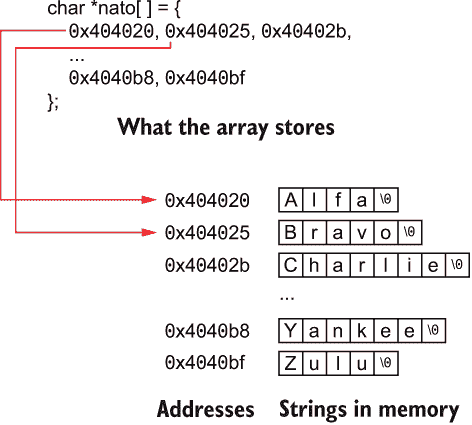

# 3 北约输出

如果你从未在电话中拼过你的名字，那你就很幸运了。或者也许你的名字叫玛丽·史密斯，但你住在必须不断大声拼读的街道或城市。如果是这样，你就求助于你自己的拼写字母表，比如，“N，就像 Nancy”或“K，就像刀子。”作为一个程序员，你可以通过阅读本章来减轻这种挫败感，其中你

+   理解北约音标字母表以及他们为什么要这样做。

+   将单词翻译成拼写字母表。

+   读取文件将单词翻译成音标字母表。

+   向后翻译北约字母表成单词。

+   读取文件以翻译北约字母表。

+   学习到在日语中纳豆是一种美味的发酵大豆酱。

最后一个要点在本章中没有涉及。我只是喜欢吃纳豆，现在我可以把它作为业务费用报销。

总之。

所有这些混乱的辉煌结论是不仅学习一些新的编程技巧，而且可以自豪地大声拼读单词，用“November”而不是“Nancy”。

## 3.1 北约字母表

不仅是任何名叫纳撒尼尔的人的好听的昵称，北约还代表北大西洋公约组织。它是一群国家组成的相互防御联盟。

在二战后建立，等等。我可以继续说，但重点是北约要求其成员国之间有一些共同点。你知道，这样当汉斯弹药不足时，皮埃尔可以给他子弹，而且子弹可以装进枪里。诸如此类的东西。

北约国家之间共享的一个共同点是有一个大声拼读单词的方法。这样，汉斯就不需要说，“子弹！B，就像香肠；U，就像超级；L，就像皮短裤……”。以此类推。相反，汉斯会说，“Bravo，Uniform，Lima，Lima，Echo，Tango。”这样，皮埃尔就能理解汉斯，即使是在周围的枪声中。

表 3.1 列出了北约音标字母表，描述了每个字母对应的单词。这些单词被选择为独特且不易误解。其中有两个单词（Alfa 和 Juliett）故意拼写错误，以避免混淆——并且为了混淆。

表 3.1 北约音标字母表。

| 信件 | 北约 | 信件 | 北约 |
| --- | --- | --- | --- |
| A | 阿尔法 | N | 诺瓦 |
| B | 布拉沃 | O | 奥斯卡 |
| C | 查理 | P | 爸爸 |
| D | 德尔塔 | Q | 魁北克 |
| E | 雷声 | R | 罗密欧 |
| F | 狐狸 | S | 西班牙 |
| G | 高尔夫 | T | 塔戈 |
| H | 酒店 | U | 制服 |
| I | 印度 | V | 维克托 |
| J | 朱丽叶 | W | 威士忌 |
| K | 基洛 | X | X 射线 |
| L | 利马 | Y | 美国佬 |
| M | 米克 | Z | 朱鲁 |

北约不是唯一的音标字母表，但它可能是最常用的。关键是统一性。作为程序员，你不需要记住这些单词，尽管作为一个极客，你可能会的。不过，程序可以输出北约代码——或者根据你如何编写 C 代码将其翻译回单词。奥斯卡基洛。

## 3.2 北约翻译程序

你编写的任何北约翻译程序都必须有一个字符串数组，就像下面展示的那样：

```
const char *nato[] = {
    "Alfa", "Bravo", "Charlie", "Delta", "Echo", "Foxtrot",
    "Golf", "Hotel", "India", "Juliett", "Kilo", "Lima",
    "Mike", "November", "Oscar", "Papa", "Quebec", "Romeo",
    "Sierra", "Tango", "Uniform", "Victor", "Whiskey",
    "Xray", "Yankee", "Zulu"
};
```

数组的表示法*nato[]*意味着一个指针数组，这是编译器如何在内存中构建这种结构的方式。数组的数据类型是*char*，因此指针引用存储在内存中的字符数组——字符串。它被归类为常量，因为创建一个字符串指针数组并随后修改它们是不明智的。nato[]数组填充了字符串的内存位置，如图 3.1 所示。



图 3.1 如何通过数组指针引用内存中的字符串

例如，在图中，字符串*Alfa*（以空字符终止，\0）存储在地址 0x404020。这个内存位置存储在 nato[]数组中，而不是字符串本身。是的，字符串出现在数组的声明中，但在运行时它存储在内存的另一个地方。对于数组中的所有元素，这种结构都是相同的：每个元素对应一个字符串的内存位置，从 Alfa 到 Zulu。

NATO 数组的美妙之处在于其内容是顺序排列的，当你从'A'的值中减去时，它们与 ASCII 值'A'到'Z'相匹配。（有关此操作的更多详细信息，请参阅第四章。）这种巧合使得提取对应 NATO 单词的字符变得非常容易。

### 3.2.1 编写 NATO 翻译器

一个简单的 NATO 翻译器在列表 3.1 中展示。它使用*fgets()*函数从标准输入中收集一个单词。一个*while*循环逐个字符地遍历单词。在这个过程中，任何字母字符都会被*isalpha()*函数检测到。如果找到，该字母就被用作 nato[]数组的参考。结果是输出 NATO 音标字母术语。

列表 3.1 nato01.c 的源代码

```
#include <stdio.h>
#include <ctype.h>

int main()
{
    const char *nato[] = {
        "Alfa", "Bravo", "Charlie", "Delta", "Echo", "Foxtrot",
        "Golf", "Hotel", "India", "Juliett", "Kilo", "Lima",
        "Mike", "November", "Oscar", "Papa", "Quebec", "Romeo",
        "Sierra", "Tango", "Uniform", "Victor", "Whiskey",
        "Xray", "Yankee", "Zulu"
    };
    char phrase[64];
    char ch;
    int i;

    printf("Enter a word or phrase: ");
    fgets(phrase,64,stdin);                ❶

    i = 0;
    while(phrase[i])                       ❷
    {
        ch = toupper(phrase[i]);           ❸
        if(isalpha(ch))                    ❹
            printf("%s ",nato[ch-'A']);    ❺
        i++;
        if( i==64 )                        ❻
            break;
    }
    putchar('\n');

    return(0);
}
```

❶ 将从 stdin，标准输入存储到位置 phrase 的 63 个字符（加上空字符）

❷ 循环直到在字符串中找到空字符

❸ 将字符 ch 转换为大写

❹ 当字符 ch 是字母时为真

❺ ch-'A'将字母转换为 0 到 25 的值，与相应的数组元素匹配。

❻ 如果长字符串没有空字符，那么当达到缓冲区大小时就退出。

构建并运行程序后，程序会提示输入。无论输入什么文本（最多 63 个字符），都会将其翻译并输出为音标字母。例如，“Howdy”会变成：

```
Hotel Oscar Whiskey Delta Yankee
```

输入一个较长的短语，例如“Hello, World!”，会得到：

```
Hotel Echo Lima Lima Oscar Whiskey Oscar Romeo Lima Delta
```

因为代码中忽略了非字母字符，所以不会为它们生成输出。

使用此代码将翻译成另一个音标字母非常容易。你所要做的就是用你自己的音标字母替换 nato[]数组。例如，以下是你可以用于执法音标字母的数组：

```
const char *fuzz[] = {
    "Adam", "Boy", "Charles", "David", "Edward", "Frank",
    "George", "Henry", "Ida", "John", "King", "Lincoln",
    "Mary", "Nora", "Ocean", "Paul", "Queen", "Robert",
    "Sam", "Tom", "Union", "Victor", "William",
    "X-ray", "Young", "Zebra"
};
```

### 3.2.2 读取和转换文件

我不确定将文件中的所有文本翻译成北约语音字母表的需要。这是一个你可以承担的 C 项目，主要是为了练习，但从实际的角度来看，这几乎没有意义。我的意思是，听到三个小时的全是北约字母表的 *安东尼与克莉奥帕特拉* 会很无聊，尽管如果你是戏剧/IT 双专业，可以试一试。不过，这是一本书，而我是一个书呆子，所以这个话题将为了你们的提高而被探讨。

列表 3.2 展示了消耗文件并将每个字符转换为北约语音字母表对应项的代码。文件名在命令提示符中提供。如果没有提供，程序将显示适当的错误消息并退出。否则，与 nato01.c 中的代码类似，该代码逐个字符地处理文件，输出匹配的北约单词。

列表 3.2 nato02.c 的源代码

```
#include <stdio.h>
#include <stdlib.h>
#include <ctype.h>

int main(int argc, char *argv[])
{
    const char *nato[] = {
        "Alfa", "Bravo", "Charlie", "Delta", "Echo", "Foxtrot",
        "Golf", "Hotel", "India", "Juliett", "Kilo", "Lima",
        "Mike", "November", "Oscar", "Papa", "Quebec", "Romeo",
        "Sierra", "Tango", "Uniform", "Victor", "Whiskey",
        "Xray", "Yankee", "Zulu"
    };
    FILE *n;
    int ch;

    if( argc<2 )                                       ❶
    {
        fprintf(stderr,"Please supply a text file argument\n");
        exit(1);
    }

    n = fopen(argv[1],"r");                            ❷
    if( n==NULL )
    {
        fprintf(stderr,"Unable to open '%s'\n",argv[1]);
        exit(1);
    }

    while( (ch=fgetc(n))!=EOF )                        ❸
    {
        if(isalpha(ch))                                ❹
            printf("%s ",nato[toupper(ch)-'A']);       ❺
    }
    putchar('\n');

    fclose(n);

    return(0);
}
```

❶ 如果参数少于两个，则缺少文件名选项。

❷ 打开在命令提示符中提供的文件名，引用为 argv[1]

❸ 逐个字符从文件中读取，将其存储在变量 ch 中。EOF 标记文件末尾

❹ 仅处理文本字符

❺ 使用字符的大写版本，减去 'A' 的值来索引 nato[] 数组

记住处理来自文件的文本时使用整数变量。标记文件末尾的 EOF 标志是一个 *int* 值，而不是 *char* 值。代码中的 *while* 语句小心地从文件中提取一个字符，并评估该字符以确定何时结束操作。

要运行程序，请在程序名称后输入文件名参数。文本文件是首选。输出显示为单行文本，反映了文件中每个字符的语音字母表单词。

在 Macintosh 上，为了增加乐趣，可以将程序的输出通过 say 命令进行管道传输：

```
nato02 antony_and_cleopatra.txt | say
```

这样，文件提供的语音字母表内容就会被 Mac 从头到尾朗读出来。坐下来享受吧。

## 3.3 从北约到英语

语音字母表的翻译应该在您的脑海中完成。有人拼写他们的家乡：印度，西拉，西拉，阿尔法，魁北克，尤尼弗莫，阿尔法，酒店。听众知道如何写下这个单词，正确地拼写它。这个单词是 *Issaquah*，这是我曾经居住过的一个城市。我不得不经常拼写这个名字。这个操作的美丽之处在于，即使不知道北约字母表的人也能理解正在拼写的内容，多亏了首字母。

然而，编写代码以扫描语音字母表单词并将它们翻译成正确的单个字符则更困难。这个过程涉及解析输入并逐词检查是否有单词与词典中找到的术语匹配。

### 3.3.1 将北约输入转换为字符输出

要确定音标字母术语是否出现在文本块中，你必须解析文本。字符串被分隔成单词块。只有在你提取出单词后，你才能将它们与音标字母术语进行比较。

要进行繁重的工作，使用 *strtok()* 函数解析文本流中的单词。我假设函数名翻译为“字符串标记器”或“字符串到千克”，这毫无意义。

*strtok()* 函数根据一个或多个分隔符字符将字符串解析成块。定义在 string.h 头文件中，手册页的格式是：

```
char *strtok(char *str, const char *delim);
```

第一个参数，str，是要扫描的字符串。第二个参数，delim，是包含可以分隔或*限定*你想要解析的字符块的单独字符的字符串。返回值是一个 *char* 指针，它引用找到的字符块。例如：

```
match = strtok(string," ");
```

此语句扫描缓冲字符串中持有的字符，直到遇到空格字符停止。是的，第二个参数是一个完整的字符串，即使只需要单个字符。*char* 指针匹配持有找到的单词（或文本块）的地址，在空格或另一个分隔符本应出现的地方终止。当没有找到任何内容时，返回 NULL 常量。

要继续扫描相同的字符串，第一个参数被替换为 NULL 常量：

```
match = strtok(NULL," ");
```

NULL 参数通知函数使用之前传递的字符串并继续标记化操作。下一列表中的代码展示了如何使用 *strtok()* 函数。

列表 3.3 word_parse01.c 的源代码

```
#include <stdio.h>
#include <string.h>

int main()
{
    char sometext[64];
    char *match;

    printf("Type some text: ");
    fgets(sometext,64,stdin);

    match = strtok(sometext," ");     ❶
    while(match)                      ❷
    {
        printf("%s\n",match);
        match = strtok(NULL," ");     ❸
    }

    return(0);
}
```

❶ 初始调用 *strtok()*, 传入要搜索的字符串。

❷ 当返回值不是 NULL 时循环。

❸ 在第二次调用 *strtok()* 时，使用 NULL 以继续搜索相同的字符串。

在此代码中，用户被提示输入一个字符串。*strtok()* 函数使用单个空格作为分隔符从字符串中提取单词。以下是一个示例运行：

```
Type some text: This is some text
This
is
some
text
```

当字符串中出现除空格之外的分隔符时，它们会被包含在字符块匹配中：

```
Type some text: Hello, World!
Hello,
World!
```

要避免捕获标点符号字符，你可以设置此分隔符字符串：

```
match = strtok(sometext," ,.!?:;\"'");
```

在这里，第二个参数列出了常见的标点符号字符，包括双引号字符，它必须被转义（\"). 结果是分隔的单词被截断，如下所示：

```
Type some text: Hello, World!
Hello
World
```

你可能会在程序的输出中找到一些尾随的空白行。这些额外的换行符对于匹配文本是好的，因为空白行无论如何都不会匹配任何内容。

要创建一个音标字母输入转换器，你需要修改此代码以执行与北约音标字母术语数组的字符串比较。*strcmp()* 函数处理这个任务，但你必须考虑两个因素。

首先，*strcmp()* 是大小写敏感的。一些 C 库具有一个 *strcasecmp()* 函数，它执行不区分大小写的比较，尽管这个函数不是 C 标准的一部分。其次，字符串长度可能不同。例如，如果您选择不在 *strtok()* 函数中计算标点符号字符（" ,.!?:;\"'”）——或者当出现未预期的标点符号字符时——比较将失败。

在这两种情况下，我认为最好创建一个独特的字符串比较函数，一个专门设计用来检查解析的单词是否与音标字母表术语匹配的函数。这个函数，*isterm()*，将在下面展示。

列表 3.4 *isterm()* 函数

```
char isterm(char *term)
{
    const char *nato[] = {
        "Alfa", "Bravo", "Charlie", "Delta", "Echo", "Foxtrot",
        "Golf", "Hotel", "India", "Juliett", "Kilo", "Lima",
        "Mike", "November", "Oscar", "Papa", "Quebec", "Romeo",
        "Sierra", "Tango", "Uniform", "Victor", "Whiskey",
        "Xray", "Yankee", "Zulu"
    };
    int x;
    char *n,*t;

    for( x=0; x<26; x++)
    {
        n = nato[x];                      ❶
        t = term;                         ❷
        while( *n!='\0' )                 ❸
        {
            if( (*n|0x20)!=(*t|0x20) )    ❹
                break;                    ❺
            n++;                          ❻
            t++;                          ❻
        }
        if( *n=='\0' )                    ❼
            return( *nato[x] );           ❽
    }
    return('\0');
}
```

❶ 将指针 n 设置为当前北约单词

❷ 指针 t 指向传递的术语。

❸ 循环直到北约术语结束

❹ 逻辑地将每个字母转换为大写并比较；有关此和其他 ASCII 技巧的更多信息，请参阅第五章。

❺ 对于没有匹配的情况，循环中断，并比较 nato[] 中的下一个术语。

❻ 遍历每个字母

❼ 当指针 n 是空字符时，术语已匹配。

❽ 返回北约术语的第一个字母

*isterm()* 函数接受一个单词作为其参数。如果单词与北约音标字母表术语匹配，则返回值是单个字符；否则，返回空字符。

要创建一个新的北约翻译程序，将 *isterm()* 函数添加到您的源代码文件中，在现有代码的下方。您必须包含 stdio.h 和 string.h 头文件。然后添加以下 main() 函数来构建一个新的程序，nato03.c，如下所示。

列表 3.5 nato03.c 中的 *main()* 函数

```
int main()
{
    char phrase[64];
    char *match;
    char ch;
    printf("NATO word or phrase: ");
    fgets(phrase,64,stdin);

    match = strtok(phrase," ");
    while(match)
    {
        if( (ch=isterm(match))!='\0' )
            putchar(ch);
        match = strtok(NULL," ");
    }
    putchar('\n');

    return(0);
}
```

代码扫描输入行中的任何匹配的音标字母表术语。*isterm()* 函数处理这项工作。匹配的字符被返回并输出。以下是一个示例运行：

```
NATO word or phrase: india tango whiskey oscar romeo kilo sierra
ITWORKS
```

如果没有匹配的字符，输入的句子将输出一个空行。混合字符的输出如下：

```
NATO word or phrase: Also starring Zulu as Kono
Z
```

如果您想在代码中添加翻译特殊字符的功能，您可以自行完成。请注意，北约音标字母表缺少带有标点的术语，尽管如果您正在创建自己的文本翻译程序，检查特殊字符可能是有必要的。

### 3.3.2 从文件中读取北约输入

读取输入以检测和翻译字母语言是愚蠢的，但这是一个很好的练习。读取整个文件以检测字母语言甚至更愚蠢。我尽量不把它看作是必需的，而更看作是编程实践：你能扫描文件以查找特定单词，然后报告它们的存在吗？采用这个概念来证明完成这样一个程序是合理的。

与读取一行文本一样，为了在文件中处理文本以寻找北约字母表单词，你需要 isterm() 函数。文件逐行读取，并且每行的内容都类似于在 nato03.c 中展示的代码。将 nato02.c 中的文件命令混合在一起，我创建了一个子程序，nato04.c。它位于本书的 GitHub 仓库中。以类似弗兰肯斯坦的方式组装这样的程序对我来说很有吸引力。这是 Stack Overflow 成功的哲学。

nato04.c 的核心通过使用两个 while 循环处理打开的文件，如下一列表所示。如果你一直跟随本章中北约程序系列，许多语句对你来说都很熟悉。

列表 3.6 使用嵌套循环处理文件中的单词

```
while( !feof(n) )                                 ❶
{
    fgets(phrase,64,n);                           ❷
    match = strtok(phrase," ,.!?=()[]{}'\"");     ❸
    while(match)                                  ❹
    {
        if( (ch=isterm(match))!='\0' )            ❺
            putchar(ch);
        match = strtok(NULL," ,.!?=()[]{}'\"");
    }
}
putchar('\n');
```

❶ 循环直到打开的文件处理器 n 的末尾

❷ 读取最多 63 个字符的文本行

❸ 过滤掉很多字符

❹ 循环直到读取行中的所有单词

❺ 将匹配的单词发送到 *isterm()* 函数

所有这些拼凑的代码的结果是，从文件中提取任何匹配的北约音标字母表术语，并为每个术语弹出相应的字母。正如你可能猜到的，很少有文件中隐藏着北约术语，所以输出通常是空的。尽管如此，我还是使用了 nato04.c 源代码文件作为输入来运行代码：

```
$ nato04 nato04.c
ABCDEFGHIJKLMNOPQRSTUVWXYZ
```

让程序很高兴的是，它找到了 nato[] 数组的文本，并按顺序吞噬了所有字母表术语，然后吐出了字母表本身。太棒了。

nato04.c 中的代码有一个问题，那就是 *fgets()* 函数每次只读取每行的字符片段。在源代码中，如果文件中的一行文本短于指定的字符数（63 个字符加上一个空字符），则文本行将读取到并包括换行符。如果文件中的一行文本长于 *fgets()* 函数指定的数量，则文本将被截断。当你寻找单词时截断文本是件坏事，尽管这比截断一头大象要好一些。

为了更好地处理文件，并确保单词不会被苛刻的 *fgets()* 函数分割，我已经重新调整了代码，使其逐个字符读取文件。在这种方法中，代码更像是一个程序过滤器。（过滤器在第四章中有介绍。）随着每个字符的消化，文件中的单词被组装起来。

列表 3.7 展示了处理打开文件（由 *FILE* 处理器 n 表示）的 *while* 循环。字符存储在 int 变量 ch 中，通过使用 *fgetc()* 函数逐个读取。整数变量 offset 跟踪存储在 word[] 缓冲区中的读取字符。这个缓冲区长 64 个字符。如果发生缓冲区溢出，程序将终止。我的意思是，给我一个超过 64 个字符的单词。如果你能合法地找到一个，请增加缓冲区大小。

列表 3.7 逐个处理文件中的单词

```
offset = 0;
while( (ch=fgetc(n))!=EOF )             ❶
{
    if( isalpha(ch)  )                  ❷
    {
        word[offset] = ch;              ❸
        offset++;
        if( offset>=64 )                ❹
        {
            fprintf(stderr,"Buffer overflow\n");
            return(1);
        }
    }
    else                                ❺
    {
        if( offset > 0 )                ❻
        {
            word[offset] = '\0';        ❼
            putchar( isterm(word) );    ❽
            offset=0;                   ❾
        }
    }
}
putchar('\n');
```

❶ 循环直到文件有可读字节

❷ 单词以字母表中的一个字母开头。

❸ 存储字符以构建单词

❹ 检查溢出；如果发生溢出则退出

❺ 找到非字母字符，意味着单词的结束。

❻ 确认 word[]缓冲区中有些文本

❼ 限制字符串长度！

❽ 处理单词，返回有效字符或空字符（不打印）

❾ 重置偏移量以存储下一个单词

列表 3.7 中显示的代码是 nato05.c 源代码文件的一部分，可在本书的 GitHub 仓库中找到。该程序的工作方式与 nato04.c 类似，尽管从文件中读取的长行文本没有被分割——这可能会分割一个有效的单词。通过逐字符处理文件的文本，这种分割就不会发生（除非单词非常长）。

程序的输出与处理源代码文件文本时的 nato04.c 完全相同：

```
$ nato05 nato05.c
ABCDEFGHIJKLMNOPQRSTUVWXYZ
```

任何程序，nato05.c 的代码都可以进行改进。按照目前的编写方式，代码依赖于非字母字符来终止一个单词：当检查的字符（*int*值）在'A'到'Z'或'a'到'z'的范围内时，*isalpha()*函数返回 TRUE。这个规则消除了缩写（*don’t*，*o’clock*），尽管这种缩写很少会包含在音标字母表中。

除了查看文件中的北约音标字母表术语外，该代码还提供了一个如何扫描任何文件以查找特定单词的实际示例。将其视为您可能创建的其他程序的灵感来源。或者，只需享受您对北约音标字母表的新知识，这样当别人打电话要求您拼写城市名称时，您就可以自豪地展示出来。
