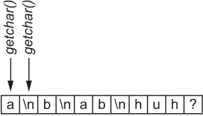
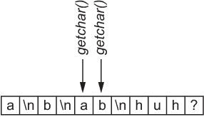
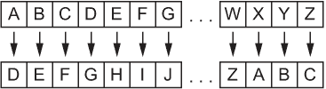
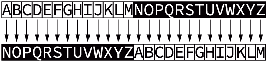
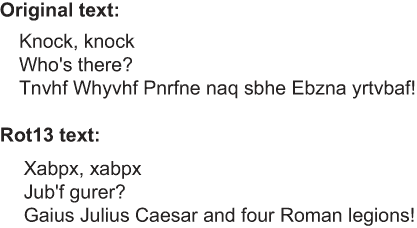
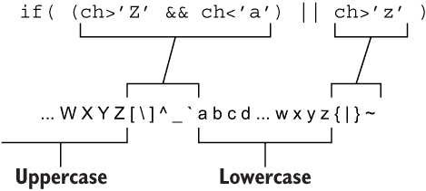

# 4 凯撒密码

凯撒写道，“Gallia est omnis divisa in partes tres。”如果他想要这条信息保密，他会写成，“Tnyyvn rfg bzavf qvivfn va cnegrf gerf。”这种微妙的加密很容易构思，但即使是有文化的间谍，如果没有密钥，也无法翻译这种混乱的拉丁文。在接收端，当解密方法已知时，信息会迅速解码，……可怜的高卢人。这种编码方法今天被称为凯撒密码。

凯撒密码绝对不安全，但它是一个有趣的编程练习。它还打开了 C 语言中过滤器和过滤器编程的概念之门。本章涵盖了过滤器的概念，包括如下内容：

+   处理流输入和输出

+   编程一个简单的输入/输出（I/O）过滤器

+   旋转字符 13 个位置

+   在特定增量中移动字符

+   编写一个十六进制输入过滤器

+   创建一个北约音标字母过滤器

+   编写一个查找单词的过滤器

过滤器存在于命令提示符的领域。使用特殊的命令字符在提示符处应用过滤器，将输入和输出从标准 I/O 设备中重定向。因此，我强烈建议你在这个章节中放弃你钟爱的 IDE，一头扎入命令行编程的领域。这样做让你几乎成为超级极客，而且在你受邀参加的少数几次聚会上，你可以吹嘘自己的成就。

## 4.1 I/O 过滤器

你还记得在计算机营里唱关于 I/O 的歌吗？这样欢乐的原因是为了强调计算机蜂巢的存在是为了吸收输入并创建修改后的输出。关键是 I 和 O 之间发生了什么，而不仅仅是斜杠字符。不，重要的是修改输入以生成某种有用输出的机制。

I/O 过滤器是一个消耗标准输入的程序，对其进行一些操作，然后输出修改后的结果。它不是一个交互式程序：输入像一股温柔的溪流流入过滤器。过滤器做一些神奇的事情，比如去除所有的虫子和污垢，然后生成输出：纯净、干净的水（尽管所有这些动作都在数字级别上发生，即使是虫子）。

### 4.1.1 理解流 I/O

要最好地实现一个过滤器，你必须接受流 I/O 的概念，这对许多 C 程序员来说很难理解。那是因为你与计算机程序的经验是在交互层面上的。然而，在 C 语言中，输入和输出是在流级别上工作的。

*流 I/O*意味着所有 I/O 都在程序中连续流动，没有停顿，就像花园水管中的水一样。代码不知道你何时暂停或停止输入。它只识别到文件结束（EOF）字符时流结束。

多亏了行缓冲，代码可能只是随意关注换行字符（\n，当你按下 Enter 键时）的出现。一旦遇到，换行符可能会刷新输出缓冲区，但否则流 I/O 不会炫耀输入了什么文本或它是如何生成的；所有处理的是流，你可以想象它就像一个长长的字符游行，如图 4.1 所示。


图 4.1 一串文本——不像游行那样欢快，但你能理解这个概念。

流 I/O 可能会让你感到沮丧，但它有自己的位置。为了帮助你接受它，理解输入可能并不总是来自标准输入设备（键盘）。同样，输出可能并不总是发送到标准输出设备（显示器）。标准输入设备 stdin 只是几个输入源之一。例如，输入也可以来自文件、另一个程序或特定的设备，如调制解调器。

列表 4.1 中的代码演示了许多 C 语言初学者如何构建一个假想交互式程序。假设输入是交互式的。相反，输入是从流中读取的（参见图 4.1）。尽管代码可能会提示输入单个字母，但它实际上是在读取输入流中的下一个字符。其他事情无关紧要——没有考虑其他因素。

列表 4.1 stream_demo.c

```
#include <stdio.h>

int main()
{
    int a,b;

    printf("Type a letter:");
    a = getchar();                  ❶
    printf("Type a letter:");
    b = getchar();                  ❷

    printf("a='%c', b='%c'\n",a,b);

    return(0);
}
```

❶ 从标准输入读取单个字符

❷ 从标准输入读取下一个单个字符

程序员的愿望是读取两个字符，每个字符都在自己的提示符下输入。但实际情况是，*getchar()* 函数从输入流中取出每个字符，这包括第一个输入的字母*加上*Enter 键的按下（换行符）。以下是一个示例运行：

```
Type a letter:a
Type a letter:a='a', b='
'
```

第一个字符由 *getchar()* 读取，即字母 a。然后用户按下 Enter 键，这成为第二个 *getchar()* 语句读取的下一个字符。你可以在输出中的 b 处看到这个字符（分为两行）。看看图 4.2，它说明了用户输入的输入流以及代码是如何读取它的。



图 4.2 输入流包含两个由两个 *getchar()* 函数读取的字符。

如果你在第一个提示符中输入**ab**，你会看到以下输出：

```
Type a letter:ab
Type a letter:a='a', b='b'
```

两个 *getchar()* 函数依次从流中读取字符。如果用户输入**a**和**b**，这些字符会从流中取出，无论屏幕上的提示如何，如图 4.3 所示。图中的换行符（在输入流中显示）不会被代码读取，但用于刷新缓冲区。它允许代码在用户无需等待 EOF 的情况下处理输入。



图 4.3 从输入流中读取了另外两个字符。

理解流 I/O 有助于你正确编写 C 程序，并欣赏 I/O 过滤器是如何工作的。即便如此，你可能仍然对如何构建交互程序感到好奇。秘密在于避免流 I/O 并直接访问终端。Ncurses 库是你可以使用的一个工具，可以使程序完全交互。这个库是 vi、top 和其他全屏文本模式程序的基础。如果你想为 Linux 编写交互式全屏文本模式程序，请查看 Ncurses。当然，我为此主题写了一本书，你可以在亚马逊上订购：*Dan Gookin 的 Ncurses 编程指南*。

*自我推销够了。——编辑*

流 I/O 的另一个方面是缓冲。当你按下 Enter 键处理 stream_demo.c 这样的拟交互程序输入时，你会看到一些这样的缓冲。事实上，当程序首次提示输出时，I/O 缓冲的一个方面就存在了：

```
Type a letter:
```

这段文本出现并且输出停止是因为缓冲。在 C 语言中，输出到标准输出设备（stdout）是*按行缓冲*的。这种配置意味着流输出存储在缓冲区中，直到缓冲区满了或者流中遇到换行符，之后文本才会输出。正是换行符的存在使得在 stream_demo.c 程序中输出停止。

另一种类型的缓冲是*块缓冲*。当此模式激活时，输出不会出现直到缓冲区满了或者程序结束。即使流中出现换行符，块缓冲也会将字符存储在流中，la-di-da。

使用定义在 stdio.h 头文件中的*setbuf()*函数设置 I/O 设备的缓冲。此函数覆盖了终端的默认行缓冲，并使用特定的内存块建立块缓冲。实际上，它禁用了给定文件句柄（或标准 I/O 设备）的行缓冲，并激活了块缓冲。

下一个列表中的代码使用*setbuf()*函数将输出从行缓冲更改为块缓冲。*setbuf()*语句有助于展示输出流（stdout）是如何受到影响的。

列表 4.2 buffering.c

```
#include <stdio.h>

int main()
{
    char buffer[BUFSIZ];       ❶
    int a,b;

    setbuf(stdout,buffer);     ❷

    printf("Type a letter:");
    a = getchar();
    printf("Type a letter:");
    b = getchar();

    printf("a='%c', b='%c'\n",a,b);

    return(0);
}
```

❶ 标准输出的一个存储库；BUFSIZ 在 stdio.h 中定义。

❷ 将标准输出提交到块缓冲

如果你构建并运行 buffering.c，你将看不到输出。相反，*getchar()*函数提示输入，因此程序等待。输出被保留，存储在字符数组缓冲区中，等待文本填满缓冲区或程序结束。

这里是代码的一个示例运行，其中没有出现提示。然而，用户似乎足够有先见之明，在闪烁的光标处输入 ab。只有在按下 Enter 键后，程序才会结束，缓冲区才会刷新，从而揭示标准输出：

```
ab
Type a letter:Type a letter:a='a', b='b'
```

顺便说一下，一些 C 程序员使用 *fflush()* 函数强制输出或清除输入流。这个函数在 stdio.h 头文件中定义，将名为文件句柄的流（如 stdin 或 stdout）清空。我发现它不可靠，并且强制流 I/O 以某种方式模拟交互式 C 程序的方法很笨拙。使用这种技术（我承认我在其他一些书中推荐过）被称为 *kludge*。这个术语意味着使用 *fflush()* 清空输入或输出缓冲区可能是一个可行的解决方案，但不是最好的。

### 4.1.2 编写简单的过滤器

过滤器修改流输入并生成流输出。它们在字符级别操作流：一个微小的字符进入，以某种方式被处理，然后另一个字符出来，或者什么也不出来。执行过滤器魔法的两个最常用的函数是 *getchar()* 和 *putchar()*，这两个函数都在 stdio.h 头文件中定义。

*getchar()* 函数从标准输入读取单个字符。对于大多数编译器，*getchar()* 是一个宏，等同于 *fgetc()* 函数：

```
c = fgetc(stdin);
```

*fgetc()* 函数从一个打开的文件句柄中读取单个字符（字节）。在上行中，stdin 被用作标准输入设备。返回的整数值存储在 int 变量 c 中。这个变量 *必须* 声明为整数数据类型，而不是字符。原因是重要的值，特别是文件结束（EOF）标记，是整数值。将函数的返回值赋给 *char* 变量意味着 EOF 不会被正确解释。

*putchar()* 函数将单个字符发送到标准输出。与 *getchar()* 类似，*putchar()* 通常定义为展开为 *fputc()* 函数的宏：

```
r = fputc(c,stdout);
```

*fputc()* 函数将整数值 c 发送到由 stdout 表示的打开文件句柄，即标准输出设备。返回值 r 是写入的字符或错误时的 EOF。与 *fgetc()* 类似，变量 r 和 c 必须是整数。

列表 4.3 中提供了一个什么也不做的过滤器。它使用 *while* 循环处理输入，直到遇到 EOF（文件结束）标记。在这个配置中，从标准输入读取一个字符并存储在 *int* 变量 ch 中。然后比较这个字符的值与定义的 EOF 常量。只要读取的字符不是 EOF，循环就会继续。这种循环可以用其他方式构建，但使用这种方法可以确保不会意外地输出 EOF。

列表 4.3 io_filter.c

```
#include <stdio.h>

int main()
{
    int ch;                            ❶

    while( (ch = getchar()) != EOF)    ❷
        putchar(ch);                   ❸

    return(0);
}
```

❶ I/O 处理整数，而不是字符。

❷ 读取输入直到遇到文件结束；EOF 是一个整数值。

❸ 输出

io_filter.c 程序的结果是不做任何事情。它的工作方式就像管道：水进去，水出来。字符没有经过修改；*putchar()* 函数输出输入的字符 ch。即便如此，该程序展示了创建一个执行有用操作的过滤器的基本结构。

如果你单独运行过滤器程序，你会看到输入被回显到输出：按下 Enter 清空输出缓冲区，导致回显文本出现：

```
hello
hello
```

按下 EOF 键来停止程序。在 Linux 中，EOF 键是 Ctrl+D。在 Windows 中，按 Ctrl+Z 作为 EOF。

要让过滤器执行某些操作，请在 io_filter.c 源代码中构建 *while* 循环。目标是修改字符输入，在发送到输出之前。否则：膨胀。

例如，你可以修改输入，以便检测并替换所有元音字母为星号字符。这种修改在 while 循环中进行，因为它处理输入流。以下是完成此任务的一种方法：

```
while( (ch = getchar()) != EOF)
{
    switch(ch)
    {
        case 'a':
        case 'A':
        case 'e':
        case 'E':
        case 'i':
        case 'I':
        case 'o':
        case 'O':
        case 'u':
        case 'U':
            putchar('*');
            break;
        default:
            putchar(ch);
    }
}
```

此修改的完整源代码可在本书的 GitHub 仓库中找到，名为 censored.c。以下是一个示例运行：

```
hello
h*ll*
```

练习 4.1

现在你已经有了 io_filter.c 中的基本过滤器框架，你可以进行自己的修改，测试你的过滤器编程技能。这里有一个你可以自己编写的挑战：编写一个将小写字符转换为大写的过滤器。这种过滤器的效果是生成全大写输出。这个练习的解决方案可以在本书的 GitHub 仓库中找到，名为 allcaps.c。

练习 4.2

编写一个过滤器，随机化字符文本，修改标准输入以生成大写或小写输出，而不考虑原始字符的大小写。我已经将这个练习的潜在解决方案包含在这本书的 GitHub 仓库中，名为 ransom.c。

### 4.1.3 在命令提示符下使用过滤器

你不能在 IDE 中测试过滤器，所以如果你还没有这样做，请转到命令提示符。你需要使用的 I/O 重定向工具如表 4.1 所示。这些单字符命令修改流，改变输入或输出的流程——或者两者都改变！

表 4.1 I/O 重定向字符及其功能

| 字符 | 名称 | 功能 |
| --- | --- | --- |
| > | 大于 | 重定向输出（实际上不用于过滤器） |
| < | 小于 | 重定向输入 |
| &#124; | 管道 | 通过另一个程序发送输出 |

假设你已经完成了练习 4.2，其中你创建了一个随机化字符文本的过滤器。这个过滤器程序名为 hostage。要使用这个过滤器，你必须指定程序的完整路径名。对于以下命令，假设过滤器存储在输入命令的同一目录中；./ 前缀指示操作系统在当前目录中查找程序：

```
echo "Give me all your money" | ./hostage
```

*echo* 命令将一串文本发送到标准输出。然而，管道字符拦截了标准输出，将其从标准输出设备（终端窗口）发送出去。相反，*echo* 命令的输出被提供给名为 ransom 的程序作为输入。结果是，过滤器将文本字符串作为其输入进行处理：

```
gIvE ME AlL yoUR mONey
```

另一种将文本通过过滤器的方式是使用输入重定向。在这个配置中，过滤器程序名称首先出现。然后是输入重定向字符 <（小于），以及输入源，例如一个文本文件：

```
./hostage < file.txt
```

在上面，file.txt 的内容被重定向为人质程序的输入，该程序使用随机的大写和小写字母输出文件的文本。

输出重定向字符在过滤器中实际上不起作用。相反，它将程序的输出发送到文件或设备：程序（或构造）的输出为文件提供文本。如果文件存在，它将被覆盖。否则，将创建一个新文件：

```
echo “Give me all your money” | ./hostage > ransom_note.txt
```

在上面，*echo* 命令的文本通过人质过滤器进行处理。输出通常会发送到标准输出设备，但相反，它被重定向并保存到 ransom_note.txt 文件中。

请记住，输出重定向不会为过滤器提供输入。请使用管道将一个程序（或某些其他来源）的输出发送到过滤器。

## 4.2 与凯撒并肩作战前线

朱利叶斯·凯撒并没有发明以他的名字命名的密码。这项技术虽然古老但有效，尤其是在一个大部分文盲的人群中：凯撒可以发送一个加密的信件，如果它落入敌人手中，坏蛋们将毫无头绪。愚蠢的比利时人。然而，一旦被正确的人收到，文本立即被解密，可怜的高卢人再次受到同情。

图 4.4 展示了密码的工作原理，它是一种简单的字母移位。它基于一个起始对，如图中所示，例如 A 到 D。这种关系在整个字母表中继续，根据起始对来移位字母：A 到 D，B 到 E，C 到 F，以此类推。



图 4.4 凯撒密码基于字母移位。

当你知道密码的起始对时，信息很容易被解码。实际上，如果你曾经获得过一个秘密解码环，你可能已经使用过这种类型的密码：起始对是给出的，然后整个信息逐字进行编码或解码：

*EH VXUH WR GULQN BRXU RYDOWLQH.*

惊讶的是，凯撒密码，也称为替换密码，至今仍在使用。诚然，它很脆弱，但请不要告诉邻居。*rot13* 过滤器可能是最常见的，你可以在下一节中了解到它。然而，编写这样的过滤器很有趣，它在加密技术领域也有其位置。

### 4.2.1 旋转 13 个字符

Unix 高手们所熟知的最常见的凯撒密码是 *rot13* 过滤器。请说“rote 13”，而不是“rot 13”。谢谢。

*rot13* 程序作为一个过滤器工作。如果它没有包含在你的 Linux 发行版中，请使用你的包管理器找到它以及其他古老而巧妙的命令行工具。

*rot13* 这个名字来源于字符替换模式：拉丁字母（和 ASCII）有 26 个字符，从 A 到 Z。如果你执行 A 到 N 的字符替换，字母表的上半部分与下半部分互换，如图 4.5 所示。程序“旋转 13”个字符。这种翻译的美丽之处在于，运行两次*rot13*过滤器可以将文本恢复到原始状态。这样，相同的过滤器既可以加密也可以解密消息。



图 4.5 *rot13*过滤器将字母表的上半部分与下半部分互换，有效地将字符“旋转”了 13 个位置。

在旧 ARPANET 以及早期的互联网上，*rot13* 被用作消息服务中的过滤器，以隐藏剧透、笑点和其他人们可能不想立即阅读的信息。图 4.6 展示了消息上*rot13*过滤器的运行情况。在原始文本中，笑话以标准文本形式出现，笑点被隐藏。应用*rot13*过滤器后，笑话文本被隐藏，但笑点被揭示，让人忍俊不禁。



图 4.6 应用*rot13*过滤器到文本的效果，乱序和还原

这种类型的凯撒密码很容易编写，因为你要么从给定字符的 ASCII 值中加上或减去 13，这取决于字符在字母表中的位置：上半部分或下半部分。加法或减法运算适用于大写和小写字母。

在列表 4.4 中，caesar01.c 的代码使用 isalpha()函数来排除字母表中的字母。*toupper()*函数将字母转换为大写，以便测试从 A 到 M 范围内的字符。如果是这样，这些字符将向上位移 13 个位置：ch+= 13。否则，else 语句会捕获字母表中的高字母，将它们向下位移。

列表 4.4 caesar01.c

```
#include <stdio.h>
#include <ctype.h>

int main()
{
    int ch;

    while( (ch = getchar()) != EOF)
    {
        if( isalpha(ch))                                 ❶
        {
            if( toupper(ch)>='A' && toupper(ch)<='M')    ❷
                ch+= 13;                                 ❸
            else
                ch-= 13;                                 ❹
        }
        putchar(ch);
    }

    return(0);
}
```

❶ 只处理字母字符

❷ 搜索“A”到“M”或“A”到“m”

❸ 对字母表下半部分向上旋转（位移）

❹ 否则，向下旋转（位移）

与所有过滤器一样，你可以使用 I/O 重定向命令（字符）在命令提示符下看到它的实际效果。具体细节请参阅 4.1.3 节。如果 caesar01.c 源代码的程序命名为 caesar01，以下是一个示例运行：

```
$ echo "Hail, Caesar!" | ./caesar01
Unvy, Pnrfne!
```

当程序直接运行时，它处理你输入的文本作为标准输入：

```
$ ./caesar01
Unvy, Pnrfne!
Hail, Caesar!
```

由于*rot13*过滤器对相同的文本进行解码和编码，你可以通过将文本通过它运行两次来测试程序。在下面的命令行构造中，文本通过程序运行一次，然后再次运行。由于*rot13*过程的神奇之处，结果是原始文本：

```
$ echo "Hail, Caesar!" | ./caesar01 | ./caesar01
Hail, Caesar!
```

记住，*rot13* 过滤器并不是为了完全保护信息安全而设计的。尽管如此，它提供了一个方便且常见的方法来隐藏某些内容，但不一定是加密到无法触及：

*凯撒为什么越过鲁比孔河？*

*Gb trg gb gur bgure fvqr.*

### 4.2.2 设计更复杂的凯撒密码

凯撒没有使用 *rot13* 过滤器来加密他的信息，主要是因为他从可靠的 Commodore 64 系统升级到 Linux 的过程中从未升级过。不，他更喜欢 A 到 D 的移位。有时它只是一个 A 到 B 的移位。无论如何，编写这样的程序比 *rot13* 过滤器方便的 13 个字符移位要复杂得多。

根据除 13 之外的其他值正确转换字母意味着字母会回绕。例如，A 到 D 的转换意味着 Z 会回绕到 ASCII 表中 Z+3 的某个字符。因此，为了使转换继续进行，字母移位必须从 Z 回绕到 C（参见图 4.4）。你必须在代码中考虑这种回绕，确保字符包含在字母表的 26 个字母变化中——包括大写和小写。

为了处理这种回绕，特别是对于 A 到 D 的转换，你的代码必须构建一个复杂的 *if* 条件，使用逻辑比较来处理超出范围的字符。图 4.7 展示了这种表达式是如何工作的。它测试值大于 'Z' 且小于 'a'，但也大于 'z'。这种排列是由于字符按照 ASCII 标准进行编码。（有关 ASCII 的更多详细信息，请参阅第五章。）



图 4.7 在执行 A 到 D 移位时检测溢出字符

当 *if* 语句检测到字符超出范围时，其值必须减少 26，将其回绕到 'A' 或 'a'，具体取决于字母的原始大小写。

由于大写字母 'Z' 与小写字母 'a' 的接近，这个 *if* 语句测试之所以有效，是因为这种特定的移位只有三个字符。从图 4.7 中，你可以看到 ASCII 表只在大写字母 'Z' 和小写字母 'a' 之间设置了六个字符。对于更大的字符移位，必须进行更复杂的测试。

列表 4.5 展示了如何编码 A 到 D 字符移位密码，包括将溢出字符回绕的复杂 *if* 语句。否则，字符将根据变量 shift 的值进行移位，该值计算为 'D' - 'A'。这种移位以反向表达，以便正确计算为三。因此，代码中的每个字母字符都加三——除非字符超出范围。

列表 4.5 caesar02.c

```
#include <stdio.h>
#include <ctype.h>

int main()
{
    int shift,ch;

    shift = 'D' - 'A';                           ❶

    while( (ch = getchar()) != EOF)
    {
        if( isalpha(ch))                         ❷
        {
            ch+=shift;                           ❸
            if( (ch>'Z' && ch<'a') || ch>'z')    ❹
                 ch-= 26;                        ❺
        }
        putchar(ch);
    }

    return(0);
}
```

❶ 从 A 移动到 D，这里之所以反向操作，是因为数学

❷ 特殊处理字母

❸ 移动字母

❹ 确定新字符是否超出范围

❺ 如果是这样，则调整其值回到范围内

这里是一个示例运行：

```
Now is the time for all good men...
Qrz lv wkh wlph iru doo jrrg phq...
```

与 *rot13* 过滤器不同，你不能运行相同的程序两次来解码 A 到 D 的移位。相反，为了解码信息，你必须从 D 移回到 A。为此需要两个更改。在列表 4.5 中显示的代码中，首先更改移位计算：

```
shift = 'A' - 'D';
```

第二，越界测试必须检查字母表的底部，看看字符的值是否已经低于 'A' 或 'a'：

```
if( ch<'A' || (ch>'Z' && ch<'a'))
    ch+= 26;
```

如果字符在字母表的底部回绕，其值将增加 26，这样它就会回绕到 Z 的末尾，纠正溢出。

最终程序作为 caesar03.c 存储在这个书的 GitHub 仓库中。以下是一个示例运行：

```
Now is the time for all good men
Klt fp qeb qfjb clo xii dlla jbk
Qrz lv wkh wlph iru doo jrrg phq...
Now is the time for all good men...
```

前两行显示了 D 到 A 的转换，即过滤器如何编码纯文本。接下来的两行显示了 D 到 A 的转换如何解密 caesar02.c 代码的原始 A 到 D 转换。（参考之前显示的输出。）

与任何过滤器一样，您可以将输出通过两个过滤器来恢复原始文本：

```
$ echo "Hail, Caesar!" | ./caesar02 | ./caesar03
Hail, Caesar!
```

当然，编写更凯撒密码的最佳方式是让用户确定要转换的字母。为了让这个过滤器工作，需要命令行参数；过滤器不是交互式的，所以用户没有机会提供其他输入。

命令行参数提供了转换的两个字母，从参数 1 到参数 2。然后代码计算出这个过程，对投入标准输入的任何文本执行转换。

让用户决定选项总是好的。提供这个功能意味着大部分代码都用于解释命令行选项：你必须检查选项是否存在，然后确认这两个选项都是字母表中的字母。这样的代码可以在 GitHub 仓库中的 caesar04.c 文件中找到。在这个源代码文件中检查两个命令行参数的额外步骤消耗了 16 行代码。

一旦设置了两个转换字符，它们就被保存在*char*变量 a 和 b 中。然后一个*while*循环根据提供的两个字符的转换值处理文本。因为转换可以是向上或向下，为了最好地检查范围外的值，循环必须分别处理大写和小写字符。这种方法最好用于检测转换溢出并正确处理它。程序的核心*while*循环和 caesar04.c 程序中的各种测试在下一列表中显示。

列表 4.6 caesar04.c 中的*while*循环执行字符转换

```
while( (ch = getchar()) != EOF)
{
    if( isupper(ch) )            ❶
    {
        ch+= shift;
        if( ch>'Z' ) ch-=26;     ❷
        if( ch<'A' ) ch+=26;     ❷
        putchar(ch);
    }
    else if( islower(ch) )
    {
        ch+= shift;
        if( ch>'z' ) ch-=26;     ❷
        if( ch<'a' ) ch+=26;     ❷
        putchar(ch);
    }
    else
    {
        putchar(ch);
    }
}
```

❶ 大小写字符必须以不同的方式处理。

❷ 适当调整双向溢出

这里是*caesar04*程序的一个 A 到 R 转换的示例运行：

```
$ ./caesar04 A R
This is a test
Kyzj zj r kvjk
```

要反转，R 到 A 的转换由命令行参数指定：

```
$ ./caesar04 R A
Kyzj zj r kvjk
This is a test
```

作为改进，可能更好的是有一个单独的参数来指定字符转换，比如**RA**而不是像刚才那样分开的 R 和 A。然而，就像大多数程序员一样，修改代码是一个永恒的过程。我把这个任务留给你。

## 4.3 深入过滤器疯狂

在我的编程生涯中，我创建了许多过滤器。想到你可以完成的一些有趣的事情，真是令人惊讶。嗯，对那些书呆子来说很有趣。非书呆子现在正在读一本浪漫小说。让我来破坏一下：他的工作对他来说比她更重要。就这样。帮你省下了 180 页无聊的内容。

无论过滤器做什么，编写过滤器的方法总是相同的：读取标准输入，修改它，然后生成标准输出。

在本章结束之前（我必须快点，因为我的工作很重要），我提供了一些不同的过滤器想法，以帮助激发你的创造力。可能性是无限的。

### 4.3.1 构建十六进制输出过滤器

就算一个字符流入过滤器，并不意味着另一个字符必须始终流出。一些过滤器可能对每个输入字符输出多个字符。其他过滤器可能不会输出任何文本修改，例如 *more* 过滤器。

*more* 过滤器是一个方便的文本阅读工具。它用于分页输出。将输出通过 *more* 过滤器后，每满一屏文本会提示输入：

```
cat long.txt | more
```

如上所示，文件 long.txt 的内容通过 *cat* 命令输出。*more* 过滤器在每满一屏文本后暂停显示。这个过滤器在 Unix 中足够流行，以至于微软“借用”它并将其包含在其文本模式操作系统 MS-DOS 中。

对于生成比输入更多输出的过滤器，考虑以下列表。该代码接受标准输入，并输出每个字符的十六进制值。*printf()* 语句生成两位十六进制值。

列表 4.7 hexfilter01.c

```
#include <stdio.h>

int main()
{
    int ch;

    while( (ch=getchar()) != EOF )
    {
        printf("%02X ",ch);    ❶
    }

    return(0);
}
```

❶ 以两位十六进制字节输出字符，带前导零

hexfilter01.c 的代码运行良好，但它输出时确实存在一个问题：两位字符格式显示为长字符串文本。通常文本值会分布在两行之间。更好的方法是监控输出，以避免在行尾分割十六进制值。

练习 4.3

假设终端屏幕宽度为 80 个字符，修改 hexfilter01.c 代码，使输出不会在两行之间分割十六进制值。此外，当遇到换行符时，输出行应以换行符结束。这个练习的解决方案可以在 GitHub 仓库中找到，作为 hexfilter02.c。请在查看我的解决方案之前自己尝试这个练习。

### 4.3.2 创建北约过滤器

第三章介绍了北约音标字母表，它——惊喜——也可以用作过滤器。例如，过滤器读取标准输入，提取所有字母字符。对于每一个，过滤器输出相应的北约术语。这个程序是另一个过滤器，它不仅仅进行单字符交换的例子。

要进行音标字母表的翻译，代码必须借用第三章中提到的 nato[] 术语数组。该数组在列表 4.8 中显示。它与标准 I/O 过滤器 *while* 循环结合使用。在循环中，*isalpha()* 函数检测字母字符。进行一些数学运算以获得数组中正确的术语偏移量，从而输出每个处理的字母的正确术语。

列表 4.8 nato01.c

```
#include <stdio.h>
#include <ctype.h>

int main()
{
    char *nato[] = {
        "Alfa", "Bravo", "Charlie", "Delta", "Echo", "Foxtrot",
        "Golf", "Hotel", "India", "Juliett", "Kilo", "Lima",
        "Mike", "November", "Oscar", "Papa", "Quebec", "Romeo",
        "Sierra", "Tango", "Uniform", "Victor", "Whiskey",
        "Xray", "Yankee", "Zulu"
    };
    char ch;

    while( (ch=getchar()) != EOF)
    {
        if(isalpha(ch))
            printf("%s ",nato[toupper(ch)-'A']);   ❶
        if( ch=='\n' )                             ❷
            putchar(ch);
    }
    putchar('\n');

    return(0);
}
```

❶ 将字符转换为 nato[] 数组中的偏移量

❷ 遇到时输出换行符以保持输出整洁

这里是一个示例运行：

```
$ ./nato
hello
Hotel Echo Lima Lima Oscar
```

重要的是要知道，此过滤器会忽略任何非字母字符（除换行符外）。在过滤器中忽略输入是合法的；过滤器不需要根据输入生成一对一的输出。

### 4.3.3 过滤单词

过滤器在字符输入/输出上操作，但这种限制并不阻止过滤器影响单词、句子或其他文本块。关键是存储到达的输入。一旦适当的文本块（如单词或句子）被组装好，过滤器就可以对其进行处理。

例如，为了按单词切割标准输入，你编写一个过滤器，收集字符直到遇到单词边界——例如空格、逗号、制表符或句号。输入必须被存储，因此必须进行进一步的测试以确保存储不会溢出。一旦缓冲区包含一个单词（或你需要的任何大小的文本块），它就可以发送到标准输出或以过滤器需要的方式处理数据。

在列表 4.9 中，一个 64 字符的缓冲区 word[]存储单词。*while*循环被分成*if-else*条件。*if*测试标记单词的结束，使用空字符首字母大写 word[]缓冲区，确认一个完整的单词准备输出，然后输出单词。*else*测试构建单词，确保缓冲区不会溢出。结果是提取单词并将每个单词单独放在一行上的过滤器。

列表 4.9 word_filter.c

```
#include <stdio.h>
#include <ctype.h>

#define WORDSIZE 64                        ❶

int main()
{
    char word[WORDSIZE];
    int ch,offset;

    offset = 0;                            ❷
    while( (ch = getchar()) != EOF)
    {
        if( isspace(ch) )                  ❸
        {
            word[offset] = '\0';           ❹
            if( offset>0 )                 ❺
                printf("%s\n",word);       ❻
            offset = 0;                    ❼
        }
        else                               ❽
        {
            word[offset] = ch;             ❾
            offset++;                      ❿
            if( offset==WORDSIZE-1 )       ⓫
            {
                word[offset] = '\0';       ⓬
                printf("%s\n",word);       ⓭
                offset = 0;                ⓮
            }
        }
    }

    return(0);
}
```

❶ 单词大小在这里设置；这样，你可以在一个地方更新缓冲区大小，并且代码的其他部分也会更新以反映这一变化。

❷ 初始化偏移量值

❸ *isspace()*函数对空白字符返回 TRUE，标记单词的结束。

❹ 总是首字母大写你的字符串！

❺ 确保缓冲区中有文本可以打印

❻ 将缓冲区的内容（一个单词，希望如此）单独输出到一行

❼ 重置偏移量

❽ 处理可打印字符，填充缓冲区。

❾ 存储字符

❿ 增加偏移量

⓫ 检查潜在的溢出，缓冲区已满

⓬ 首字母大写字符串！

⓭ 输出单词，清空缓冲区

⓮ 重置偏移量

要构建单词，word_filter.c 中的代码依赖于 ctype.h 头文件中定义的*isspace()*函数。当输入遇到空白字符时，该函数返回 TRUE。这些字符包括空格、制表符和换行符。这些空白字符触发单词边界，尽管代码可以被修改以考虑其他字符。

这里是一个示例运行：

```
$ ./word_filter
Is this still the Caesarean Cipher chapter?
Is
this
still
the
Caesarean
Cipher
chapter?
```

在代码中两次看到使用空字符首字母大写 word[]缓冲区的语句：

```
word[offset] = '\0';
```

在 C 语言中，所有字符串都必须以空字符结尾，即\0。特别是当你构建自己的字符串时，就像在 word_filter.c 代码中所做的那样，确认创建的字符串已首字母大写。如果没有，你会得到溢出和各种丑陋的输出——以及可能发生的不良后果。
