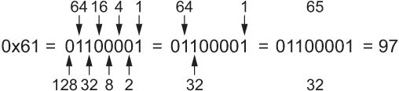
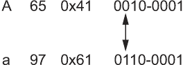
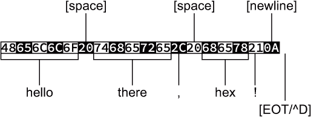

# 5 编码和解码

容易将编码和解码的主题与加密混淆。这些是类似的过程，但加密的目的是隐藏和保护信息。编码是为了传输可能对介质过于复杂的信息，或在不同系统之间进行转换，或其他无害的目的。无论如何，编码和解码的过程具有充满动作和神秘性的潜力。

嗯，也许不是。

然而，在计算机电信的早期，编码和解码是常规操作。我记得通过调制解调器传输我的第一个程序：16 千字节，传输耗时 16 分钟。该程序由二进制数据组成，但它以纯文本的形式传输。它需要在发送端进行编码，在接收端进行解码。今天仍然会发生这样的魔法，尽管可能要快得多。

要探索编码和解码的概念，无论其刺激和危险，你必须：

+   欣赏字符在计算机上的表示

+   学习各种 ASCII 编码技巧

+   玩弄字符表示

+   将纯文本转换为十六进制字节进行数据传输

+   将十六进制字节反向翻译回文本（或数据）

+   通过添加校验和来改进编码技术

+   探索 URL 编码方法

这些项目都不枯燥，不像那本关于用熨斗可以做的 100 个有趣且合法的家庭项目的书。但如果你想了解更多关于加密的信息，请参阅第四章。

## 5.1 纯文本的概念

计算机不知道文本。*char*数据类型仅仅是一个很小的整数，其值从 0 到 255（*无符号*）或-128 到 127（*有符号*）。只有*char*数据类型的表示才使其看起来像字符。

在 C 语言中，*putchar()*函数将一个值作为字符输出。该函数的*man*页面声明该函数的参数为一个整数，尽管它作为字符出现在标准输出设备上。

*printf()*函数对字符的理解更深入一些。它将*char*数据类型作为字符输出，但仅当在格式字符串中使用%c 占位符时。如果你用%d 替换，即十进制整数输出占位符，数据将作为数字输出。

但输出的是什么东西？计算机如何知道将特定的值与给定的字符匹配？答案是古老的数字缩写词 ASCII。

### 5.1.1 理解 ASCII

重要的是要注意 ASCII 的发音是“ass-key”。没错：ass 和 key。尽管你可以嘲笑，但如果你说“ask two”，每个人都会知道你是个傻瓜。

不必注意，ASCII 代表美国信息交换标准代码。是的，这是一个由整天坐着创造标准的人制定的标准。尽管该标准在 20 世纪 60 年代初开发，但直到 20 世纪 80 年代中期，几乎地球上的每台计算机才开始一致使用 ASCII 代码。

通过采用 ASCII 标准为字符分配代码，计算机可以在无需任何翻译的情况下交换基本信息。在 1970 年代末得到广泛采用之前，计算机必须运行翻译程序，才能从一个系统正确地读取甚至一个文本文件到下一个系统。但如今，你那昂贵的 Macintosh 上的文本文件在我的便宜 Linux 盒子上也能轻松阅读，我的朋友 Don 在他的商店后面用 499 美元组装了这个盒子。

ASCII 的工作方式是为常见的字符和符号分配代码，即整数值。这种翻译起源于电报时代，当时代码必须一致，以便消息能够被翻译——编码和解码——否则“洞口帮”会再次抢劫 12:10，因为老 Hamer McCleary 在 Belle Fourche 车站打瞌睡。

ASCII 代码的设计巧妙，这对任何一组人类来说都是惊人的。这种模式允许发生各种有趣和创造性的事情，如第 5.1.4 节所述。图 5.1 列出了 ASCII 代码表，以常见的四“棒”形式展示。看看你是否能发现任何模式。


图 5.1 显示十进制、八进制、十六进制和字符值的 ASCII 表

从图 5.1 中，你可以看到 ASCII 代码的范围是从 0 到 127。这些是二进制值 000-0000 到 111-1111。对于 C 语言的*char*数据类型，这些值都是正数，无论变量是*signed*还是*unsigned*。

ASCII 表中的四列，或“棒”，代表不同类型的字符类别。再次强调，代码是有组织的，这可能是由于早期那些令人厌恶的计算机字符代码的一些教育，这些代码后来被扔进垃圾桶，并用喷气发动机烧毁。

第一根棒包含非打印控制代码，这就是为什么它在图 5.1 中的输出看起来如此单调。关于控制代码的更多信息，请参阅第 5.1.2 节。

ASCII 表第二根棒中的字符是为了排序目的而选择的。前几个字符与电传打字机上的字符相同，即转换后的数字键。这些在今天的大部分情况下仍然适用：Shift+1 是感叹号(!)，Shift+3 是井号(#)，等等。

第三根棒包含大写字母，还有一些符号。

第四根棒包含小写字母，以及剩余的符号。

关于 ASCII 表和这些代码周围的奇迹和魔法将在接下来的几节中介绍。

练习 5.1

拥有一个 ASCII 表对任何程序员来说都是至关重要的。与其在 Etsy 上卖我那漂亮的 ASCII 墙图，我决定你必须自己编写 ASCII 表。让输出看起来与图 5.1 中所示完全一致——这恰好是我自己的 ASCII 程序输出的结果，看起来就像墙图。我经常运行我的 ASCII 程序作为参考，因为这样的信息很有用，而程序是一种快速保存这些信息的方法，尽管我在 Etsy 上没有赚钱。

我对这个练习的解决方案的源代码可以在本书的在线仓库中找到，文件名为 asciitable01.c。但在你盲目模仿我所做的一切之前，请先尝试自己创建一个。

### 5.1.2 探索控制码

我发现 ASCII 码的第一组是最有趣的，从历史和幽默的角度来看都是如此。控制码的名字真是可爱！“文本结束”？试着在会议上用这个，但最好说“控制 C”，这样一些人可能就会明白了。

“文本结束”是 Ctrl+C 控制码的官方名称，ASCII 码 3。表 5.1 列出了详细信息。其中一些代码或它们的键盘等效可能对你来说很熟悉。

表 5.1 ASCII 控制码

| 十进制 | 八进制 | 十六进制 | 名称 | Ctrl | Esc | 定义 |
| --- | --- | --- | --- | --- | --- | --- |
| 0 | 0 | 00 | NULL | ^@ | \0 | 空字符 |
| 1 | 1 | 01 | SOH | ^A |  | 文件头开始 |
| 2 | 2 | 02 | STX | ^B |  | 文本开始 |
| 3 | 3 | 03 | ETX | ^C |  | 文本结束 |
| 4 | 4 | 04 | EOT | ^D |  | 传输结束 |
| 5 | 5 | 05 | ENQ | ^E |  | 询问，“谁？” |
| 6 | 6 | 06 | ACK | ^F |  | 确认 |
| 7 | 7 | 07 | BEL | ^G | \a | 铃 |
| 8 | 10 | 08 | BS | ^H | \b | 退格 |
| 9 | 11 | 09 | HT | ^I | \t | 水平制表符 |
| 10 | 12 | 0A | LF | ^J | \n | 换行 |
| 11 | 13 | 0B | VT | ^K | \v | 垂直制表符 |
| 12 | 14 | 0C | FF | ^L | \f | 表格馈送 |
| 13 | 15 | 0D | CR | ^M | \r | 回车 |
| 14 | 16 | 0E | SO | ^N |  | 位移输出 |
| 15 | 17 | 0F | SI | ^O |  | 位移输入 |
| 16 | 20 | 10 | DLE | ^P |  | 数据链路转义 |
| 17 | 21 | 11 | DC1 | ^Q |  | 设备控制一，XON |
| 18 | 22 | 12 | DC2 | ^R |  | 设备控制二 |
| 19 | 23 | 13 | DC3 | ^S |  | 设备控制三，XOFF |
| 20 | 24 | 14 | DC4 | ^T |  | 设备控制四 |
| 21 | 25 | 15 | NAK | ^U |  | 负确认 |
| 22 | 26 | 16 | SYN | ^V |  | 同步空闲 |
| 23 | 27 | 17 | ETB | ^W |  | 传输块结束 |
| 24 | 30 | 18 | CAN | ^X |  | 取消 |
| 25 | 31 | 19 | EM | ^Y |  | 媒体结束 |
| 26 | 32 | 1A | SUB | ^Z |  | 替换 |
| 27 | 33 | 1B | ESC | ^[ | \e | 转义 |
| 28 | 34 | 1C | FS | ^\ |  | 文件分隔符 |
| 29 | 35 | 1D | GS | ^] |  | 组分隔符 |
| 30 | 36 | 1E | RS | ^^ |  | 记录分隔符 |
| 31 | 37 | 1F | US | ^_ |  | 单位分隔符 |

表 5.1 列出了每个 ASCII 码的十进制、八进制（基 8）和十六进制值。名称列显示了古老的电传打字机名称，以及代码的原始和被遗忘的用途。尽管如此，一些控制码至今仍在使用：计算机的蜂鸣声仍然是控制码 7，即“铃”，键盘等效 Ctrl+G 和转义序列\a（用于警报或警报）。

Ctrl 列显示了在终端窗口中使用的控制键组合。现代描述使用单词*Ctrl*来表示控制，尽管过去的灰白头发、穿着凉鞋的 Unix 程序员更喜欢使用撇号字符，^。这个表达式解释了为什么按 Ctrl+D 作为 Linux 的 EOF 字符会在终端窗口中输出^D，这个字符的原始名称是“传输结束”，这是有道理的。（不要只是为了看到^D 字符而按 Ctrl+D；这样做会关闭终端窗口。）

一些控制键快捷方式直接映射到键盘上的其他键，主要用于终端窗口。例如，Ctrl+M 是回车/换行键：按下 Ctrl+M 与按下回车键相同。其他映射的控制键包括：

+   Ctrl+I 到制表键

+   Ctrl+H 到退格键

+   Ctrl+[到 Esc

这些快捷方式可能并不适用于所有情况，但表 5.1 展示了它们是如何映射的。

表 5.1 中的 Esc 列列出了某些常见控制代码的 C 转义字符等效。记住，如果你使用格式\xnn（其中*nn*是字符的十六进制 ASCII 码），任何代码都可以在 C 中被指定为转义字符序列。

许多控制键在现代计算机中已经失去了它们的作用。回顾电传打字机时代——Linux 当前终端窗口的根源所在——它们曾经是重要的。事实上，Ctrl+S/Ctrl+Q（XON, XOFF）键仍然可以用来暂停和恢复文本的滚动显示。只是现代终端显示文本的速度如此之快，以至于现在使用这些键已经没有意义了。

*小心*在代码中输出控制字符。其中一些具有可预测的功能，特别是表 5.1 中的 Esc 列中的那些。这些转义序列在 C 中很有用。但向标准输出发送奇怪的控制代码可能会损坏显示。例如，在某些终端上，输出^L（代码 12，换页）会清除显示。当发送到打印机——即使是现代打印机——^L 会弹出一张纸。

作为提示——因为我知道有一天你会故意或可能意外地尝试输出一个控制代码——如果一个控制代码弄乱了终端显示，发出*reset*命令。输入**reset**并按 Enter 键，终端会尝试从你弄乱的地方恢复过来。

最后一个控制代码没有出现在 ASCII 表的最后一栏中（参见表 5.1）。这是字符代码 127，通常称为 Del（删除）或 Rub Out。像代码 0 到 31 一样，它是不可打印的，但它的输出不会弄乱显示。这个字符是电传打字机时代的遗留物，当时它被用作备份和删除字符；退格代码（8 或^H）只是移动光标，是一种非破坏性的备份。

字节中的其他 128 个字符代码是什么？

即使在微型计算机时代，一个字节数据由 256 个可能的码组成，从 0 到 255。ASCII 字符定义了 0 到 127 的码的标准。其他码是非标准的——虽然 ASCII 没有定义，但许多早期的计算机用户会错误地将它们标记为这样的码。

在 IBM PC 上，128 到 255 的码被称为扩展 ASCII。这些码为所有 PC 兼容机（或多或少）输出一致的字符，但不适用于 Apple II、Commodore 64 或其他那个时代的流行和脆弱的系统。即使那时，通过在 PC 上更换新的代码页，也可以更改扩展 ASCII 码。这种字符的多样性导致了巨大的混乱。幸运的是，当时的计算机行业状态是一致的混乱，所以很少有人注意到。

今天，任何大于 127 的字符码都按照 Unicode 进行了标准化。这些码定义了你从未见过或听说的几乎所有字符。有关更多和令人兴奋的细节，请参阅第八章。

### 5.1.3 生成非字符输出

当作为字符输出时，*char*变量显示为字符。谢天谢地：计算机显示原始数据的时代已经过去了——除了电影，在那里计算机仍然有闪烁的灯光和输出一行又一行的数字的显示器。然后，电影中的显示器在显示文本时会发出噪音，而“黑客”在应该使用鼠标的电脑上无休止地打字。愚蠢的好莱坞。

使用除%c 之外的转换字符，你可以编写输出*char*数据为十进制或十六进制值的代码——甚至可以使用相同的变量：

```
printf("%c = %d = %x\n",ch,ch,ch);
```

在这个声明中，变量 ch 被输出三次：一次作为其字符值，一次作为十进制整数，再次作为十六进制整数。如果你对八进制感兴趣，可以使用%o 来输出以 8 为基数的值。实际上，如果你为练习 5.1 编写了代码，你可能使用了类似这样的*printf()*语句。

但二进制怎么办？

标准 C 库缺少二进制输出函数。因此，这是你的工作，编写一个。或者，你也可以依赖我使用的，我的*binString()*函数。

列表 5.1 显示了*binString()*函数的 8 位版本，该函数是为了输出存储在*char*数据类型中的值。该函数使用位与(&)运算符来确定字符字节中左边的位是否开启（1）。如果是，字符'1'将被放置到 b[]缓冲区中；否则，设置为'0'。然后变量 a 中的值向左移动一个位位置，操作重复进行。在检查位时，字符串 b[]被填充为一和零。这个字符串被声明为*静态的*，因此其值可以被返回，并且二进制字符串可以被调用*binString()*函数的任何语句使用。

列表 5.1 8 位*binString()*函数

```
char *binString(char a)
{
    static char b[9];                ❶
    int i;
    i = 0;                           ❷
    while( i<8 )                     ❸
    {
        b[i] = a&0x80 ? '1' : '0';   ❹
        a <<= 1;                     ❺
        i++;
    }
    b[i] = '\0';                     ❻

    return(b);
}
```

❶ 字符串是*静态的*，因此其值被保留；九个字符允许一个 8 位字节，加上一个用于终止空字符的额外元素。

❷ 初始化索引变量

❸ 对 8 位字节中的每个位进行循环

❹ 三元运算符根据变量 a 最左边的位值将 1 或 0 设置到字符串中。

❺ 变量 a 的值向左移动一个位位置。

❻ 此时，i 等于 8，因此字符串被截断。

8 位*binString()*函数可以被编织到代码中，以二进制形式输出 ASCII 表中的值，这是生成非字符输出的另一种方式——比单调的十进制、性感的十六进制或过时的八进制更有趣。

要查看*binString()*函数的实际效果，请参考本书在线仓库中包含的源代码文件 binascii01.c。其程序输出带有二进制数据的 ASCII 表。

作为一名书呆子，我喜欢由二进制值创造的图案以及它们与十六进制的关系。事实上，我发现将十六进制和二进制之间转换很容易，我经常在脑海中这样做。这种关系在表 5.2 中得到了说明，这使得理解下一节中揭示的一些常见 ASCII 转换技巧变得容易。

表 5.2 二进制到十六进制的转换

| 二进制 | 十六进制 | 二进制 | 十六进制 |
| --- | --- | --- | --- |
| 0000 | 0 | 1000 | 8 |
| 0001 | 1 | 1001 | 9 |
| 0010 | 2 | 1010 | A |
| 0011 | 3 | 1011 | B |
| 0100 | 4 | 1100 | C |
| 0101 | 5 | 1101 | D |
| 0110 | 6 | 1110 | E |
| 0111 | 7 | 1111 | F |

图 5.2 说明了二进制位位置，这有助于继续我对二进制-十六进制关系的书呆子般的热爱。例如，注意偶数以 0 作为第一个二进制位。 (像十进制一样，二进制位从右到左、从低到高排序。)奇数在第一个位置有 1 位。



图 5.2 字节中的位位置及其如何分解为值

我觉得其他一些事情也很酷：二进制 1010 是十六进制 A，也就是十进制的 10。双“10”数字是一个很好的线索。二进制 1011 是十六进制 B，或者十进制的 11。如果你查看表 5.2 和图 5.2，会发现其他模式也很明显——但要注意，如果你过于享受这类事物，也可能变成一个书呆子。

### 5.1.4 玩转 ASCII 转换技巧

设计 ASCII 表的那些人，为字符分配代码，对人类来说很聪明。要么他们是协调值和字符时欣赏知识的杰出天才，要么他们只是中了幸运大奖。我两种情况都不在乎。但我将利用这种偶然性。

哦，我讨厌这个词*serendipity*。

我利用的一个技巧是将数字 0 到 9 映射到十六进制值 0x30 到 0x39。这种安排使得对字符值进行简单数学运算以将它们转换为数值变得容易。例如：

```
printf("%d\n",'9' - '0');
```

这个*printf()*语句从'9'减去'0'，看起来像字符值，但被编译器视为 0x39 - 0x30。结果是作为十进制值九输出，这正是'9'所代表的。

如果*char*变量 a 包含一个数字字符，你可以使用以下方法提取其整数值：

```
b = a - '0';
```

你可以用类似的方法用字母表中的字母来获取它们在 0 到 25 的范围内，尽管 A 或 a 的十六进制值并不那么吸引人。例如，假设一个大写字母在 *char* 变量 ch 中：

```
offset = ch - 'A';
```

在这里，偏移量的值等于字符 ch 中大写字母的数量，从 A 到 Z 的 0 到 25。这个操作的例子在第三章中可以看到，其中使用字母表中的一个字母来引用 nato[] 数组。请参阅本书在线仓库中的 nato01.c 和 nato02.c，以了解第三章的内容。

ASCII 表的列一和三（参考表 5.1）显示了不同数字序列中的相同字符。第一列的控制代码使用字符 ^@ 通过 ^_（下划线）和第三列使用字符 @ 通过 _（下划线）。因此，表示控制代码的一种方法是将字符值加上十六进制值 0x40。在下面的 *printf()* 语句中，*char* 变量 cc 持有控制代码值（0x00 到 0x1F），以 ^@ 通过 ^_ 的形式输出：

```
printf("Control code: ^%c\n",cc+0x40);
```

以下语句反映了表达相同输出的另一种方式：

```
printf("Control code: ^%c\n",cc+'@');
```

如果你比较 ASCII 表的第三和第四列（再次参考图 5.1），你会看到大写和小写字符之间的差异正好是 32 或 0x20。这种安排允许进行一些有趣的字符操作，以在大小写字母之间切换：

+   要将大写字母转换为小写，你需要将字节的第六位重置。

+   要将小写字母转换为大写，你需要将字节的第六位设置。

图 5.3 通过字母 A 和 a 说明了位设置和重置的过程。对于拉丁字母表中的所有字母，这种关系都成立：设置或重置第六位会改变字符的大小写。



图 5.3 字节的第六位如何影响字母的大小写

要神奇地操作字节的第六位，你使用位运算符，&（与）或 |（或）。你很可能在学习 C 语言时跳过了这些运算符。真遗憾。

要将大写转换为小写，你必须设置第六位。这个操作由字节第六位的 |（或）运算符处理。表达式是：

```
c = c | 0x20;
```

上面的代码中，*char* 变量 c 中的大写字母被转换为其小写等价物。代码也可以简写为：

```
c |= 0x20;
```

要将小写字母转换为大写，你必须重置（改变为零）字节的第六位。为了处理这个操作，使用 & 位运算符，它屏蔽了位：

```
c = c & 0xdf;
```

此外：

```
c &= 0xdf;
```

0x20 的二进制表示为 01000000。0xdf 的二进制表示为 10111111。

列表中展示的源代码演示了这些技术。sentence[] 中的样本字符串被处理了两次。第一次，一个 *while* 循环从字符串中提取大写字符，通过位运算 | 0x20 将它们转换为小写。第二次 *while* 循环针对小写字母，通过 & 0xdf 操作将它们转换为大写。指针 s 用于逐个字符地遍历 sentence[] 数组。

列表 5.2 casetricks01.c 的源代码

```
#include <stdio.h>

int main()
{
    char sentence[] = "ASCII makes my heart beat faster\n";
    char *s;

    s = sentence;
    while(*s)
    {
        if( *s>='A' && *s<='Z' )      ❶
            putchar( *s | 0x20 );     ❷
        else
            putchar(*s);
        s++;
    }

    s = sentence;
    while(*s)
    {
        if( *s>='a' && *s<='z' )      ❸
            putchar( *s & 0xdf );     ❹
        else
            putchar(*s);
        s++;
    }

    return(0);
}
```

❶ 过滤掉大写文本

❷ 输出小写字符

❸ 过滤掉小写文本

❹ 输出大写字符

这里是样本输出：

```
ascii makes my heart beat faster
ASCII MAKES MY HEART BEAT FASTER
```

在我的代码中，我经常回退到使用 ctype 函数 *tolower()* 或 *toupper()* 来进行转换。但位运算也能同样完成这个任务，而且它们还能让你的代码看起来超级神秘。

## 5.2 十六进制编码器/解码器

我的第一次电信文件传输耗时 16 分钟。这是在一位朋友的 TRS-80 计算机和我的计算机之间进行的，使用标准电话线路上的模拟调制解调器。如果你想要装出一副震惊的表情，传输速度是 300 BPS。

传输的数据是纯文本。它可以是二进制，因为坦白说，电话线路并不关心字节中哪些位代表字符。然而，我还是坐了 15 分钟，看着乱七八糟的信息流过我的屏幕，神奇地变成了一个程序：原始二进制被编码为两位十六进制值，然后传输，然后我的计算机上的另一个程序消化了这些十六进制字节，将它们转换回二进制数据。

这种十六进制编码的另一个例子可以在那个时代的计算机杂志中找到。文章展示了你可以键入的惊人程序；十六进制字节列在页面上。爱好者们急切地将一个字节接一个字节地输入到他们的键盘上，一个十六进制解码程序吞噬了所有数字，创建了一个二进制程序—— fingers crossed——第一次运行并执行了一些奇妙任务。那些都是好日子。

顺便说一下，十六进制编码既不是加密也不是压缩。它只是以可打印的方式表达二进制数据的一种方法。

### 5.2.1 编写简单的十六进制编码器/解码器

将 ASCII 和二进制转换为十六进制最重要的部分是确保以可靠的方式转换回原始格式。毕竟，需要某种类型的验证来确保数据成功从编码中提取出来。

将任何信息转换为十六进制的一种方法就是编写一个过滤器，例如下一个列表中展示的过滤器。（如果你需要复习过滤器，请参考第四章。）该过滤器处理每个输入的字节 (*int* ch)。*printf()* 语句的转换字符 %02X 将字节输出为带前导零的两位十六进制值。代码只有在处理完所有输入后才输出换行符，这意味着转换是一个长的十六进制字节字符串。

列表 5.3 hexenfilter01.c 的源代码

```
#include <stdio.h>

int main()
{
    int ch;

    while( (ch=getchar()) != EOF )
    {
        printf("%02X",ch);
    }
    putchar('\n');

    return(0);
}
```

下面是一个在命令提示符下使用标准输入（键盘）的示例运行，假设程序名称为 *hexe* 并且它位于当前目录中：

```
$ ./hexe
Hello there, hex!
48656C6C6F2074686572652C20686578210A
```

图 5.4 说明了输出过程中发生了什么，每个输入字符是如何被转换成十六进制字节的。



图 5.4 简单十六进制编码器的输出情况

此过滤器可以处理不仅仅是纯文本。你可以从任何文件类型重定向输入，包括二进制可执行文件：

```
$ ./hexe < hexe
```

这种串行十六进制数字方法的问题在于，输出结果仅对解码程序有用。我不期望用户输入一长串十六进制数字。这样的任务将是一场噩梦。

要解码长字符串文本的十六进制过滤器，你必须编写一个程序，将两位十六进制值正确地转换为它们的字节值等效。此类程序所做出的假设是它接收到的信息类型与编码器生成的是完全相同的——这是一个巨大的假设，我绝不会在任何计划发布的实用工具程序中做出这样的假设。

翻译工作的一大部分是识别并将十六进制数字转换为它们的整数值。为了完成这个任务，我展示了 *tohex()* 函数，如下所示。它查找 ASCII 字符 0 到 9 和 A 到 F，并将它们转换为它们的整数等效值。超出范围的任何内容都会生成返回值-1。 （该函数不转换小写十六进制数字，在这个例子中解码并不需要。）

列表 5.4 *tohex()* 函数。

```
int tohex(c)
{
    if( c>='0' && c<='9' )    ❶
        return(c-'0');        ❷
    if( c>='A' && c<='F' )    ❸
        return(c-'A'+0xA);    ❹
    return(-1);               ❺
}
```

❶ 移除数字 0 到 9

❷ 返回数字的整数值

❸ 移除字母 *A* 到 *F*

❹ 返回字符的十六进制值：‘A’==0x0A

❺ 所有其他字符返回-1。

*tohex()* 函数只解决了战斗的一部分。其余的工作是读取标准输入，将每两个十六进制数字组装成一个字节。为了完成这个任务，我编写了一个无限 *while* 循环，如下所示。它获取两个字符，将它们组合在一起，然后输出结果值，该值可以是二进制或纯文本。

列表 5.5 解码十六进制过滤器的无限行

```
while(1)                     ❶
{
    ch = getchar();          ❷
    if( ch==EOF ) break;     ❸
    a = tohex(ch);           ❹
    if( a<0 ) break;         ❺
    a<<=4;                   ❻
    ch = getchar();          ❼
    if( ch==EOF ) break;
    b = tohex(ch);
    if( b<0) break;
    putchar(a+b);            ❽
}
```

❶ 无限循环依赖于 EOF 的存在来终止。

❷ 读取一个字符并立即 . . .

❸ . . . 检查 EOF，如果找到则退出循环

❹ 将字符转换为十六进制值

❺ 如果字符不是十六进制则退出

❻ 将值左移四位以表示字节值的高位

❼ 对下一个字符重复此过程，但不进行移位

❽ 输出结果字节

整个代码块都可以在这个书的在线仓库中找到，作为 hexdefilter01.c。如果你知道一些要输入的十六进制值，可以直接运行：

```
$ ./hexd
48656C6C6F2C20776F726C64210A
Hello, world!
```

The program stops when it encounters a nonhex digit or when the EOF is encountered, which helps match it up perfectly with the output from the hexenfilter01.c program. In fact—the true test of encoding and decoding—you can pump output through both filters and end up with the original data:

```
$ echo "This proves whether it works!" | ./hexe | ./hexd
This proves whether it works!
```

Text is echoed to standard input but first piped through the hexe (hexenfilter01.c) program, assumed to be in the current directory. This encoded output is then piped through the *hexd* (hexdefilter01.c) program. The output is the original text.

These simple filters process information, whipping it into one long string of hexadecimal characters. This type of hex encoding may work for transferring a silly game on a 300 BPS modem in the last century, but good luck getting a user to type in all those bytes without crossing their eyes. No, additional formatting is necessary for a better hex encoder/decoder.

### 5.2.2 编码更好的十六进制编码器/解码器

I prefer a hex encoding method that shows its details in a neat, orderly manner. Especially back in the old days, if you were typing in row upon row of hex bytes published in a computer magazine to input a program, you didn’t need to see the Great Wall of Hex.

A good approach to hex-encoding data, especially if the information is to be presented both for a human and a decoding program, is to format the output in neat rows and columns. For example:

```
HEX ENCODE v1.0                                           ❶
 54 68 69 73 20 69 73 20 61 6E 20 65 78 61 6D 70 6C 65    ❷
 20 6F 66 20 68 65 78 20 65 6E 63 6F 64 69 6E 67 20 69    ❷
 6E 20 61 20 66 6F 72 6D 61 74 74 65 64 20 6D 61 6E 6E    ❷
 65 72 2E 20 49 20 61 70 70 6C 61 75 64 20 79 6F 75 20    ❷
 66 6F 72 20 62 65 69 6E 67 20 61 20 6E 65 72 64 20 61    ❷
 6E 64 20 64 65 63 6F 64 69 6E 67 20 74 68 69 73 20 65    ❷
 78 61 6D 70 6C 65 2E 0A
HEX ENCODE END                                            ❸
```

❶ Title text with version number

❷ 清晰且一致地输出十六进制值行

❸ 终止行

This output is from a filter, though it’s formatted to be more presentable and predictable. It still has its flaws, which I’ll get into eventually, but it’s a better encoder despite the data output being a series of hexadecimal digits, just like that of the filter presented in the preceding section.

列表 5.6 展示了 *Hex Encode 1.0* 程序的源代码。它基于典型的 I/O 过滤器，尽管它根据代码中定义的常量 BYTES_PER_LINE 格式化输出。变量 bytes 跟踪输出的数字，确保十六进制数字对逐行保持一致。当输出的数字数量等于定义的常量 BYTES_PER_LINE 时，此值将被重置，并输出一行新的十六进制数字。输出的最后一行标记了编码的结束。

列表 5.6 hexencode01.c 的源代码

```
#include <stdio.h>

#define BYTES_PER_LINE 18                 ❶

int main()
{
    int ch,bytes;

    bytes = 0;                            ❷
    printf("HEX ENCODE v1.0\n");          ❸
    while( (ch=getchar()) != EOF )
    {
        printf(" %02X",ch);
        bytes++;
        if( bytes == BYTES_PER_LINE)      ❹
        {
            putchar('\n');                ❺
            bytes = 0;                    ❻
        }
    }
    printf("\nHEX ENCODE END\n");         ❼

    return(0);
}
```

❶ Set this value as a defined constant so that it can be updated easily.

❷ 初始化字节计数器

❸ Outputs the header line before processing standard input

❹ Checks for the end of the line

❺ If so, outputs a newline . . .

❻ . . . 并重置字节计数器

❽ 在处理完标准输入（包括 EOF）后，输出尾行

The hex-encoding code works like any filter, waiting for the EOF or, when using standard input, a press of the Ctrl+D key to terminate. Here is sample output:

```
$ echo "Hello, World!" | ./hexencode
HEX ENCODE v1.0
 48 65 6C 6C 6F 2C 20 57 6F 72 6C 64 21 0A
HEX ENCODE END
```

编写编码程序是容易的部分。更难的是解码，你必须正确解释格式，将十六进制数字转换回字节。就像任何复杂的编码装置一样，我一步一步地完成这样的任务。

编写十六进制解码器的第一步是编写一个一次处理一行输入的过滤器。这个原型程序在下一列表中显示。在解码方面，它是不完整的。它从标准输入中提取一行文本并存储在 line[] 缓冲区中。缓冲区填满后输出，这很无聊。然而，程序的将来版本将使用 line[] 缓冲区来处理编码值。

列表 5.7 hexdecode01.c 的源代码

```
#include <stdio.h>

#define BYTES_PER_LINE 18
#define LENGTH (BYTES_PER_LINE*3+1)      ❶

int main()
{
    char line[LENGTH];
    int x,ch;

    x = 0;
    while( (ch=getchar()) != EOF )
    {
        line[x] = ch;                    ❷
        x++;                             ❸
        if( ch=='\n' || x==LENGTH)       ❹
        {
            if( line[x-1]=='\n')         ❺
                line[x-1] = '\0';
            else
                line[x] = '\0';

            printf("%s\n",line);         ❻
            x = 0;
        }
    }

    return(0);
}
```

❶ 计算缓冲区大小，为字节数乘以使用的空格数，再加一个空字符

❷ 将传入的字符存储在缓冲区中

❸ 增加偏移量

❹ 检查换行符（因为解码文件是格式化的）或缓冲区已满

❺ 将换行符替换为空字符；否则，截断字符串

❻ 输出未修改的行

如其所述，hexdecode01.c 的源代码逐行处理任何输入。这些行在 LENGTH 个字符处被截断，其计算方式是前面显示的 *hexencode* 程序输出的行的确切长度。对传入的数据没有进行其他处理，因此程序的输出看起来与输入的完全一样。在这里，您可以看到由 *hexencode* 程序创建的文件 sample.txt，它被 *hexdecode* 程序原样输出：

```
$ ./hexdecode < sample.txt
HEX ENCODE v1.0
 54 68 69 73 20 69 73 20 61 6E 20 65 78 61 6D 70 6C 65
 20 6F 66 20 68 65 78 20 65 6E 63 6F 64 69 6E 67 20 69
 6E 20 61 20 66 6F 72 6D 61 74 74 65 64 20 6D 61 6E 6E
 65 72 2E 20 49 20 61 70 70 6C 61 75 64 20 79 6F 75 20
 66 6F 72 20 62 65 69 6E 67 20 61 20 6E 65 72 64 20 61
 6E 64 20 64 65 63 6F 64 69 6E 67 20 74 68 69 73 20 65
 78 61 6D 70 6C 65 2E 0A
HEX ENCODE END
```

程序运行正常，所以代码完成了过程中的第一步。为了改进代码，接下来的更改确认输入数据格式正确。毕竟，这是一个特定编码数据格式的解码程序。这种改进利用了 *hexencode* 程序的第一行和最后一行输出（如示例输出所示）：初始行 HEX ENCODE 1.0 必须被检测到，否则文件格式不正确，不需要进一步处理。同样，最后的行 HEX ENCODE END 被测试以确定行处理何时结束。

必须向 hexdecode01.c 添加几个小的代码块来做出这些改进。首先，新代码使用了 *exit()* 和 *strncmp()* 函数，这需要包含两个头文件：

```
#include <stdlib.h>
#include <string.h>
```

需要一个新的变量声明，指针 r。这个指针持有 *fgets()* 函数的返回值，该函数用于确定输入是否有效：

```
char *r
```

变量声明之后是一段代码，用于读取初始文本行。*fgets()* 函数从标准输入（stdin）读取行，然后使用 *if* 语句进行测试。如果 *fgets()* 的返回值为 NULL 或字符串不与所需的十六进制编码头匹配，则输出错误消息并终止程序：

```
r = fgets(line,LENGTH,stdin);                        ❶
if( r==NULL || strncmp(line,"HEX ENCODE",10)!=0 )    ❷
{
    f>printf(stderr,"Invalid HEX ENCODE data\n");     ❸
    exit(1);
}
```

❶ 吞吐输入的第一行。

❷ 在无效输入时，*fgets()* 返回 NULL；否则，*strncmp()* 函数对文本的第一行与所需文本进行精确比较。

❸ 将错误信息发送到标准错误设备，以避免输出混淆。

我省略了文本第一行的版本测试，我将它留到稍后改进代码时使用，这部分内容将在下一节中介绍。

最后一段文本添加在 *while* 循环中，就在输出 line[] 值的 *printf()* 语句之前。这些语句检查格式化十六进制编码中的终止行。如果找到，循环将中断而不会输出最后一行：

```
if( strncmp(line,"HEX ENCODE END",13)==0 )
    break;
```

所有这些修改都包含在源代码文件 hexdecode02.c 中，该文件可在本书的在线仓库中找到。

编译并运行后，输出与早期程序类似，但可以立即识别出格式不正确的十六进制编码文件。因此，如果你在自己的源代码文件上运行程序，你会看到以下输出：

```
$ ./hexdecode < hexdecode02.c
Invalid HEX ENCODE data
```

否则，输出看起来与第一个版本相同。读取并输出十六进制字节行，无需进一步处理：

```
$ ./hexdecode < sample.txt
 54 68 69 73 20 69 73 20 61 6E 20 65 78 61 6D 70 6C 65
 20 6F 66 20 68 65 78 20 65 6E 63 6F 64 69 6E 67 20 69
 6E 20 61 20 66 6F 72 6D 61 74 74 65 64 20 6D 61 6E 6E
 65 72 2E 20 49 20 61 70 70 6C 61 75 64 20 79 6F 75 20
 66 6F 72 20 62 65 69 6E 67 20 61 20 6E 65 72 64 20 61
 6E 64 20 64 65 63 6F 64 69 6E 67 20 74 68 69 73 20 65
 78 61 6D 70 6C 65 2E 0A
```

最后的改进是处理十六进制数字，将它们转换为值。这个更改只需要一个新变量和一个额外的语句块。新变量是整数 hex，可以添加到现有的 int 变量声明中：

```
int x,ch,hex;
```

为了将十六进制字符对转换为字节，将 *while* 循环的 *printf()* 语句替换为嵌套的 *while* 循环。这个内部循环处理 line[] 缓冲区，解析出十六进制数字对。我使用 *strtok()* 函数来处理解析或“标记化”，如果 *tok* 就代表这个意思。使用这个函数可以节省很多开销，减少了几个语句。

在嵌套的 *while* 循环中，一个 *sscanf()* 函数将解析出的十六进制数字，现在被视为一个 2 个字符的字符串，转换为整数值。生成的值被发送到标准输出。这个过程会一直重复，直到整行被处理，这正是 *strtok()* 函数的美丽之处：

```
r = strtok(line," ");           ❶
while(r)                        ❷
{
    sscanf(r,"%02X",&hex);      ❸
    printf("%c",hex);           ❹
    r = strtok(NULL," ");       ❺
}
```

❶ 解析字符串（文本输入行），通过空格分隔其内容

❷ 只要 *strtok()* 函数返回非 NULL 值，循环

❸ 将 2 个字符的十六进制字符串转换为整数值

❹ 输出整数值（可能不是 ASCII）

❺ 继续扫描相同的字符串

代码的最后一次修改可在仓库中找到，文件名为 hexdecode03.c。它完成了项目。我将其命名为 *hexdecode* 的程序可以正确解码由 *hexencode* 程序编码的数据。

为了测试程序，我首先对程序文件进行了编码，然后进行了解码。第一步是编码程序文件，将输出保存以供以后使用：

```
$ ./hexencode < hexdecode > hexdecode.hex
```

此命令处理*hexdecode*程序文件中的二进制数据。输出被重定向到一个名为 hexdecode.hex 的新文件。此文件是纯文本，但格式如本节所示：带有标题、十六进制数字行和尾部。

要解码文件并将其转换回二进制数据，请使用以下命令：

```
cat hexdecode.hex | ./hexdecode > hexdecode.bin
```

*cat*命令输出了之前创建的编码文件，hexdecode.hex。这个输出（它是纯文本）通过*hexdecode*程序。结果是现在为二进制数据，因此标准输出看起来很丑陋，被重定向到一个新文件，hexdecode.bin。

为了确保原始的 hexdecode 程序文件和编码/解码数据文件 hexdecode.bin 是相同的，我使用了*diff*命令：

```
diff hexdecode hexdecode.bin
```

因为*diff*程序不生成输出，所以可以确认原始二进制文件被编码成十六进制字符对的文本文件，并且成功解码回其原始二进制格式。*hexencode/hexdecode*过滤器工作正常。然后，如果它们不起作用，我就不会写所有这些内容。没有剧透。

### 5.2.3 添加一点错误检查

我对我的 hexencode/hexdecode 系列过滤器最初的努力感到非常满意。然而，当我开始查看编码信息并试图弄清楚它可能被破坏的方式时，我的心情发生了变化。毕竟，在成功创建任何程序之后，作为一个 C 语言程序员，你必须立即想出如何破坏它。

假设你是一个拥有电脑（当然，没有社交生活）的青少年，你渴望输入从*Compute!*杂志上新鲜出炉的*Laser Blaster*游戏。你一行行地输入，一个十六进制数字接一个十六进制数字。你出错了吗？如果是，错误发生在哪个点？

为了帮助跟踪输入错误，早期的杂志中的十六进制转储在每一行的末尾提供了一个校验和数字。这个校验和仅仅是该行中所有字节的值的总和，有时取模 0x100 以使其看起来像另一个两位十六进制值。当用户输入代码时，他们可以运行校验和（或者他们的十六进制解码程序会）来确定是否出错，以及哪一行需要重新读取，以及是否整个操作需要从头开始。是的，这就是 Jolt Cola 以 12 瓶装出现的原因。

checksum01.c 的源代码在下一列表中展示。它演示了如何执行一种简单的校验和。从数组 hexbytes[]中连续的每个值都累积在*int*变量 checksum 中。这个结果以模 0x100 输出，以保持其字节大小的一致性。

列表 5.8 checksum01.c 的源代码

```
#include <stdio.h>

int main()
{
    int hexbytes[] = {
        0x41, 0x42, 0x43, 0x44, 0x45,              ❶
        0x46, 0x47, 0x48, 0x49, 0x4A               ❶
    };
    int x,checksum;

    checksum = 0;                                  ❷
    for( x=0; x<10; x++ )
    {
        checksum += hexbytes[x];                   ❸
        printf(" %02X",hexbytes[x]);
    }
    printf("\nChecksum = %02X\n",checksum%0x100);  ❹

    return(0);
}
```

❶ 只是一些随机的十六进制值；总共 10 个

❷ 在这里初始化校验和变量

❸ 累积总和

❹ 输出校验和，但限制为字符大小值

编写像 checksum01.c 这样的程序是我解决更大编程项目时经常采取的方法。每当我向任何程序添加一个新功能时，我都想确保它能正常工作。如果我把这个功能添加到现有代码中，这个过程可能会引入其他问题，从而复杂化错误追踪。

下面是 checksum01.c 程序的示例输出：

```
41 42 43 44 45 46 47 48 49 4A
Checksum = B7
```

存在着更复杂的方法来计算校验和，包括一些聪明的变体，甚至可以告诉你哪个具体值是错误的。但不要在意！

在 *hexencode/hexdecode* 程序中添加校验和需要修改两个源代码文件。是的，现在是 2.0 版本，现在具有（适度）的错误检查功能。因此，不仅两个程序必须计算和输出校验和字节，版本号也必须更新并验证。如果你想更进一步，可以让 *hexdecode* 程序仍然解码 1.0 版本的文件而不应用校验和。还有更多的工作要做！

练习 5.2

将源代码更新到 hexencode01.c，以添加一个校验和十六进制值，并将其输出到每行的末尾。别忘了最后一行的校验和（提示，提示）。哦，别忘了更新版本号到 2.0。我的解决方案可以在本书的在线仓库中找到，名为 hexencode02.c。

你对练习 5.2 的解决方案的代码可能看起来并不完全像我的一样，但输出应该类似于以下内容：

```
HEX ENCODE v2.0
 54 68 69 73 20 69 73 20 61 6E 20 65 78 61 6D 70 6C 65 8F
 20 6F 66 20 68 65 78 20 65 6E 63 6F 64 69 6E 67 20 69 4A
 6E 20 61 20 66 6F 72 6D 61 74 74 65 64 20 6D 61 6E 6E 9F
 65 72 2E 20 49 20 61 70 70 6C 61 75 64 20 79 6F 75 20 12
 66 6F 72 20 62 65 69 6E 67 20 61 20 6E 65 72 64 20 61 37
 6E 64 20 64 65 63 6F 64 69 6E 67 20 74 68 69 73 20 65 8C
 78 61 6D 70 6C 65 2E 0A BF
HEX ENCODE END
```

这个输出类似于程序的第一版（1.0）输出，但每行的末尾都出现了一个额外的十六进制值。这个值是校验和。

解码这些数据，将其转换回二进制，显然需要更新 *hexdecode* 程序：首先，它必须检查版本号。如果编码数据显示“v2.0”，解码器必须检查字节值并确认该行是否已正确解码。如果没有，解码将停止，并将信息标记为无效。是的，我让你自己进行这个更改作为下一个练习。

练习 5.3

将 hexdecode03.c 的源代码转换为处理由 hexencode01.c（练习 5.2）创建的程序设置的额外校验和字节。你必须正确地考虑并使用校验和字节，以确保正确读取编码文本文件的每一行。我的解决方案命名为 hexdecode04.c，可在在线仓库中找到。请在作弊之前自己尝试这个练习，看看我是如何做到的。我的代码中的注释解释了正在发生的事情——以及一个甚至让我都感到惊讶的幸运转折。

很遗憾，我的解决方案并不完美，正如你可以在我的代码注释中读到的那样。进一步的修改可能有助于将代码引向正确的方向。这是一个我可能在未来的博客中探讨的话题，尤其是在我吃过很多蛋糕之后。

## 5.3 URL 编码

另一种文本编码类型，你可能以前见过并感到害怕，就是 URL 编码。也称为百分号编码，这种编码格式通过使用可打印字符和一些百分号来保留网页地址和在线表单内容。这种编码避免了某些字符出现在 URL 中可能会冒犯我们的网络霸主。

具体来说，对于网页地址，当引用可能被 Web 服务器错误解释的内容时，会使用 URL 编码，例如二进制值、嵌入的网页、空格或其他隐蔽数据。URL 编码允许这些信息以纯文本形式发送，并在稍后正确解码。

与任何其他编码一样，你可以用 C 编写 URL 编码转换程序。你需要知道的是所有的 URL 编码规则。

### 5.3.1 了解所有 URL 编码规则

为了帮助你将你所看到的内容与 URL 编码的外观联系起来，这里有一个例子：

```
https%3A%2F%2Fc-for-dummies.com%2Fblog%2F
```

所有编码都是纯文本；URL 编码是可读的。尽管每个字符都可以进行编码，但只有特殊字符以两位十六进制值的形式呈现，前面加上百分号——例如，%24 表示美元符号字符，ASCII 码 0x24。

尽管存在关于这种编码方法的规则，但 HTML 5 标准如下定义：

+   字母数字字符不进行翻译（0 到 9，A 到 Z，大小写）。

+   字符 -（破折号）、.（点）、_（下划线）和*（星号）被保留。

+   空格被转换为+（加号）字符，尽管也使用了%20 代码。

+   所有其他字符都表示为它们的十六进制 ASCII 值，前面加上百分号。

+   如果要编码的数据宽度超过一个字节，例如 Unicode 字符，它将被分成字节大小的值，每个值都是一个两位十六进制数，前面加上百分号。这一点可能对所有宽字符值并不一致。

这些规则存在细微的变体，但你应该能理解其大意。这些信息足以让你体验编写自己的 URL 编码和解码程序的乐趣。

### 5.3.2 编写 URL 编码器

编写 URL 编码程序的关键，在这个版本中是一个过滤器，是首先捕获异常。对于不需要翻译的字符，直接按照原样输出。一旦这些项目被消除，程序输出的所有其他字符都必须遵循百分号十六进制编码方法。

urlencoder01.c 的源代码如下所示。它是一个标准的过滤器，逐个字符处理输入。首先处理四个 URL 编码异常（- . _ *），然后是空格。*isalnum()*函数排除所有字母数字字符。剩余的内容使用%-十六进制格式输出，如代码中的*printf()*语句所示。

列表 5.9 urlencoder01.c 的源代码

```
#include <stdio.h>
#include <ctype.h>

int main()
{
    int ch;

    while( (ch=getchar()) != EOF )
    {
        if( ch=='-' || ch=='.' || ch=='_' || ch=='*' )   ❶
            putchar(ch);
        else if( ch==' ')                                ❷
            putchar('+');
        else if( isalnum(ch) )                           ❸
            putchar(ch);
        else
            printf("%%%02X",ch);                         ❹
    }

    return(0);
}
```

❶ 这些字符是可以的；直接输出。

❷ 空格输出为+字符。

❸ 以原样输出字母数字字符。

❹ 需要使用%%来输出百分号，后跟一个两位十六进制值，如果需要，前面有一个前导零。

下面是程序的示例运行，我将其命名为*urlencoder*：

```
$ ./urlencoder
https:/ /c-for-dummies.com/blog/
https%3A%2F%2Fc-for-dummies.com%2Fblog%2F%0A*^D*$
```

在这里，过滤器在提示符下运行，因此所有键盘输入都显示在输出中。这种方法解释了为什么你会看到末行结尾的换行符%0A，然后是 Ctrl+D 键(^D)来终止输入。命令提示符$紧接着出现。

如果你习惯了看到 URL 编码，并且理解了 URL 的基本组成部分，你可能认识一些常见的代码：

+   %3A 代表冒号，:

+   %2F 代表正斜杠，/

我经常看到的其他代码有：

+   %3F 代表问号，?

+   %26 代表和号，&

当然，除了是一个书呆子之外，你不需要记住这些常见的 URL 编码。相反，你可以编写自己的 URL 解码器，这也是一个书呆子的标志，但有可能带来收入。

### 5.3.3 创建 URL 解码器

我希望你会发现创建 URL 解码器并不太难。与编码器不同，过滤器唯一关心的输入字符是百分号。哦，当然，你可以测试“非法”字符，如超出范围的字符；我将额外的编码留给你自己。

去除十六进制数字的关键是扫描%字符。一旦遇到，可以使用类似于 tohex()的函数，如 5.2.1 节中所述，来翻译接下来的两个十六进制数字。再次强调，可以进行更多测试以确定字符是否为合法的十六进制数字——但你应该明白了。

在下一列表中展示的是我对 URL 解码器的快速且简单的解决方案。它使用了一个修改过的*tohex()*函数，这个函数也检查小写十六进制数字。否则，此代码扫描的唯一“坏”输入字符是 EOF。

列表 5.10 urldecoder01.c 的源代码

```
#include <stdio.h>

int tohex(int c)
{
    if( c>='0' && c<='9' )
        return(c-'0');
    if( c>='A' && c<='F' )
        return(c-'A'+0xA);
    if( c>='a' && c<='f' )            ❶
        return(c-'a'+0xA);
    return(-1);
}

int main()
{
    int ch,a,b;

    while( (ch=getchar()) != EOF )
    {
        if( ch=='%' )                 ❷
        {
            ch = getchar();
            if( ch==EOF ) break;      ❸
            a = tohex(ch);            ❹
            ch = getchar();           ❺
            if( ch==EOF ) break;
            b = tohex(ch);
            putchar( (a<<4)+b );      ❻
        }
        else
            putchar(ch);
    }

    return(0);
}
```

❶ 修改以添加小写

❷ 检查%符号并获取下一个两个字符

❸ 在 EOF 时退出

❹ 将十六进制数字转换为整数

❺ 获取下一个字符

❻ 输出正确的字符值

从 url_decoder01.c 源代码创建的程序将 URL 编码转换为，处理遇到的%值。然而，它的问题在于不知道如何处理格式不正确的 URL 编码文本。需要进行一些错误检查……但我已经达到了本章分配的页数——而且快到午夜了，我也没有 Ritalin 了。

练习 5.4

你的任务是改进 5.10 列表中显示的 URL 解码器。为此，确保不要过滤掉不需要的字符。当发生此类违规行为时，使用适当的错误消息退出程序。此外，检查 tohex()函数的返回值，以确保它正确读取十六进制值。

您可以在本书的在线源代码仓库中找到我的解决方案。文件名为 urldecoder02.c。请亲自尝试这个练习。不要作弊。您知道该怎么做。
