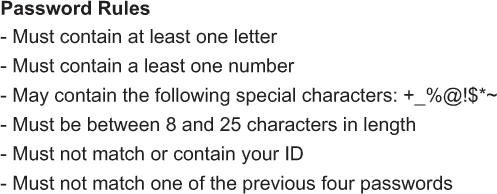

# 6 个密码生成器

你厌倦了这些提示吗？你知道当某些网站要求你为你的账户应用密码时吗？“确保它至少有一个大写字母、一个数字、一个符号和一些象形文字。”或者，“这里有一个你无法输入、更不用说记住的推荐密码。”这真是令人沮丧。

我希望你能认识到将密码应用于数字账户的重要性。我相信你已经熟悉了常见的规则：不要使用容易被猜到的密码。不要使用任何与你容易关联的单词或术语。不要为每个账户设置相同的密码。这些告诫虽然繁琐但很重要。

设置一个稳固的密码是当今的必需品。作为一名 C 语言程序员，你可以通过以下方式增强你疲惫的密码库：

+   理解密码策略

+   创建基本、混乱的密码

+   确保密码具有所需的字符

+   在 Mad Libs 的世界中绕道而行

+   使用随机词汇构建密码

当然，从本质上讲，密码不过是一串字符。身份验证是对输入密码与存储在加密数据库中的密码逐字符、区分大小写的比较。是的，这个过程比这更复杂；我假设在某个时候，这个过程涉及到一只在跑步机上跑步的松鼠。尽管如此，一旦解密，就是那古老的比较打开了数字之门。设置好密码的目的是创造一个无人知晓或能猜到的密钥。

## 6.1 密码策略

Unix 系统始终对账户有密码要求。我的意思是，看看 Unix 精英们！你们信任他们吗？更好的问题是：他们彼此信任吗？可能不是，因为 Unix 登录一直要求输入用户名和密码。

尽管几十年来都知道计算机安全，但微软直到 1996 年 Windows 95 从实验室城堡中逃出时才要求 Windows 有密码。即使那时，我收到用户最常见的问题之一就是如何避免输入 Windows 密码。与 Unix 和其他多用户系统不同，PC 用户不习惯于安全。他们无知的一个证明是 1990 年代的病毒泛滥，但我跑题了。Windows 用户只是想访问电脑。其中许多人故意避免使用密码。

进入互联网。

随着我们生活中的更多部分被数字领域所吸收，创建和使用密码——严肃的密码——变得必不可少。是的，起初，这些只是为了满足最低要求而设置的愚蠢密码。但随着坏人的日益复杂化，密码需要更多的复杂性。

### 6.1.1 避免基本和无用的密码

懒惰的 Windows 95 用户可能仍然在我们中间。无能的密码每天都在使用。愚蠢的人类。你将在表 6.1 中找到一个最常见的 10 个密码列表。这些甚至不是愚蠢或脆弱的密码——只是最常见的。稍作思考。

表 6.1 愚蠢的密码

| 排名 | 密码 | 评论 |
| --- | --- | --- |
| 1. | 123456 | 对于“必须六位长”的密码来说是最基本的。 |
| 2. | 123456789 | 一个“超过六位长”的密码。 |
| 3. | qwerty | 键盘，顶部行，左边。 |
| 4. | password | 一个永恒的经典。没有人会猜到！ |
| 5. | 12345 | 有些人就是太懒了。 |
| 6. | qwert123 | 必须包含字母和数字。 |
| 7. | 1q2w3e | 键盘，数字和字符，顶部左方。 |
| 8. | 12345678 | 更不聪明的数字。 |
| 9. | 111111 | 重复且不聪明的数字。 |
| 10. | 1234567890 | 很可能是在使用数字键盘输入这个数字。 |

使用这些密码无用的原因是每个坏蛋都知道并首先尝试它们。而且你知道吗？有时候它们是有效的！每天都有很多案例记录下来，一些高官的在线安全被破坏，因为那个笨蛋太懒，使用了方便的密码。似乎这样的人应该被黑客攻击。

未列在表 6.1 中，但仍然非常愚蠢的是，以下个人信息片段被愚蠢地用作密码：

+   你的出生年份

+   当前年份

+   你的名字

+   你最喜欢的运动队的名字

+   一个诅咒词

+   单词 sex

+   你的城市或街道名称或街道号码

列表还在继续。这些项目需要避免——这就是为什么社交媒体上的那些测验会问你这样的愚蠢问题。相信我——承认你在高中的最好朋友是谁，并不比掷骰子告诉你你是哪个*星球大战*角色更有用。坏蛋们很聪明。人类很愚蠢。人们提供的常见答案后来被用来破解他们的密码。

在设计更好的密码时，了解这些技巧很重要。毕竟，有人尝试猜测你的密码比尝试字母、数字和符号的组合来猜测密码要容易得多。要聪明。

练习 6.1

编写一个程序，暴力猜测密码*password*。让代码遍历所有字母组合*aaaaaaaa*到*zzzzzzzz*，直到匹配密码。当然，最终它会匹配，但这个练习的目的是看看这个过程需要多长时间。我编写的解决方案在我的最快电脑上破解密码大约需要 8 分钟（没有生成输出）。

我的解决方案命名为 brutepass01.c，并且可以在本书的在线仓库中找到。它使用递归遍历字母表，就像里程表上的里程一样旋转。代码中的注释解释了我的疯狂。

### 6.1.2 增加密码复杂性

为了帮助你聪明地处理密码，你善良而体贴的系统管理员制定了一些规则。这些规则最初很简单：

*请设置一个密码。*

然后增加了复杂性：

*你的密码必须包含字母和数字。*

随着坏蛋们越来越擅长猜测密码或应用暴力破解方法，更多的细节被添加：

*你的密码必须至少包含一个大写字母。*

*你的密码必须至少有八个（或更多）字符长。*

*您的密码必须包含一个符号。*

这些建议增加了复杂性，使得猜测或暴力破解密码变得困难。即便如此，一些网站甚至提供了更多令人烦恼的具体规则。例如，图 6.1 显示了在我银行创建新密码的规则。这些规则几乎是最复杂的。



图 6.1 银行密码限制几乎是最令人讨厌的。

为了增加更多的安全性，许多服务采用双因素认证。这项技术涉及将确认码发送到您的手机或由应用程序或专用设备生成的代码值。这一额外的安全级别确保即使您的密码被泄露，第二因素的安全密钥也能保护您的信息安全。

### 6.1.3 应用单词策略

研究表明，您典型的混乱密码在阻止坏人方面并不比由几个单词随意组合并使用数字或符号分隔的密码更有效。例如，这个密码：

```
fbjKehL@g4jm7Vy$Glup
```

与此相比，没有提供额外的安全性：

```
Bob3monkeys*spittoon
```

第二个密码的优点是更容易记住和输入。然而，在测试中，密码破解软件破解第二个、更易读的密码所需的时间与破解无用的混乱密码所需的时间相同，甚至更长。

这种更好的密码创建方法是我所说的*单词策略*：将三个或更多单词连在一起，混合使用大小写字母，添加数字和符号。实际上，图 6.1 中显示的密码要求允许本节中显示的两种密码类型，但单词策略更好。

单词策略还有哈希的优势。例如，您可以将特定的密码与您常访问的网站和服务关联起来。如果密码被泄露，您会立即识别出源头。这种情况就发生在我身上，当我收到一封邮件说“我知道你的密码。”坏人列出了密码——这是我曾经使用过的。我认出这是我的旧 Yahoo!密码，在我更换密码后，黑客盗取了 Yahoo!用户数据库。我知道密码已被泄露，并且根据密码中使用的单词，我知道了源头。我对这个发现并不感到惊讶或担忧。

## 6.2 复杂密码的混乱

您可能认为编写输出典型混乱文本密码的代码相对容易。确实如此。您可能在您的数字青年时期编写过这样的程序：一个愚蠢的随机字符生成器。但就像所有容易的事情一样，这并不是编写密码程序的好方法。不要让这个练习的愚蠢性使您气馁。

### 6.2.1 构建一个愚蠢的随机密码程序

列表 6.1 展示了我的随机密码生成器，一个愚蠢的版本，标题为 randomp01.c，因为我的电脑上已经有一个 silly.c 的文件名。它从感叹号到波浪号切断了可打印字符的 ASCII 谱，编码为 33 到 126。 （有关 ASCII 的有趣细节，请参阅第五章。）这个值设置了随机数的范围。输出的字符值加上感叹号字符，使其回到可打印范围内。

列表 6.1 randomp01.c 的源代码

```
#include <stdio.h>
#include <stdlib.h>
#include <time.h>

int main()
{
    int x;
    char ch;
    const int length = 10;                ❶

    srand( (unsigned)time(NULL) );

    for( x=0; x<length; x++ )
    {
        ch = rand() % ('~' - '!' + 1);    ❷
        putchar( ch+'!' );                ❸
    }
    putchar('\n');

    return(0);
}
```

❶ 将密码长度设置为 10 个字符

❷ 设置随机值的范围到可打印字符

❸ 输出可打印的字符

程序的输出是令人愉快的随机，但作为密码实际上毫无用处：

```
aVd["o_rG2
```

首先，祝你好运记住它。其次，打字时好运。第三，希望网站允许所有字符的输出；双引号可疑。显然，必须应用一些条件到输出上。

### 6.2.2 向密码程序添加条件

网上大多数随机密码生成程序产生的是字母、数字和符号的混乱组合，就像一个荒谬的节日沙拉，但——就像真正的沙拉一样——据说对你有好处。显然，正在进行某种智能编程，这与前一部分中展示的愚蠢的随机字符生成形成对比。

生成的密码字符仍然可以是随机的，但它们必须是以下类型：大写字母、小写字母、数字、符号。每种类型的数量取决于密码长度，并且字符类型的比例会有所不同。

为了改进这个愚蠢的密码程序并使其更智能，考虑将密码的内容限制如下：

+   一个大写字母

+   六个小写字母

+   一个数字

+   两个符号

总字符数为 10，这对于密码来说是个不错的选择。

随机字母和数字很容易生成，但为了避免违反任何字符限制，我会提供以下符号是安全的，尽管你可以自由地创建自己的列表：

```
! @ # $ % * _ -
```

现在的任务是限制密码到给定的限制。

练习 6.2

编写代码生成一个限制在本节列出的字符（总共 10 个）的随机密码。将代码命名为 randomp02.c。在解决方案中包含这四个函数：*uppercase()*, *lowercase()*, *number()*, 和 *symbol()*. *uppercase()* 函数返回 A 到 Z 范围内的随机字符。*lowercase()* 函数返回小写字母，A 到 Z。*number()* 函数返回 0 到 9 的字符。*symbol()* 函数从一个安全符号数组中随机抽取一个字符并返回它。密码在 *main()* 函数中输出，使用以下模式：一个大写字母，六个小写字母，一个数字，两个符号。

作为一个小贴士，我使用定义的常量来创建模式：

```
#define UPPER 1
#define LOWER 6
#define NUM 1
#define SYM 2
```

这些定义的常量在代码更新时可以节省时间。

### 6.2.3 改进密码

我对练习 6.2 的解决方案生成的输出如下：

```
Tmxlqeg8#@
Gdnqgrs2@%
Whizxxb9-*
```

这些生成随机、混乱密码的勇敢尝试是成功的，但缺乏灵感。此外，它们可能很容易被破解，因为它们的模式是可预测的：它们都以一个大写字母开头，接着是六个小写字母，一个数字，最后是两个符号。知道这个模式后，编写密码破解程序会更容易。

输出随机字符的更好方法是将其打乱。为此改进，密码必须存储在数组中，而不是直接输出（这是我解决 6.2 练习时所做的）。因此，将 randomp02.c 转换为 randomp03.c 的第一步是存储生成的密码——仍然使用之前相同的函数和模式。

列表 6.2 展示了来自我更新的代码 randomp03.c 中的 *main()* 函数。password[] 缓冲区被创建，等于存储的字符数——所有之前在代码中定义的常量——加上一个用于终止的空字符。我将 randomp02.c 版本中的 *for* 循环替换为 while 循环，用必要的字符填充数组。字符串被终止并输出。

列表 6.2 对 randomp03.c 的 *main()* 函数的改进

```
int main()
{
    char password[ UPPER+LOWER+NUM+SYM+1 ];  ❶
    int x;

    srand( (unsigned)time(NULL) );           ❷

    x = 0;                                   ❸
    while( x<UPPER )                         ❹
        password[x++] = uppercase();
    while( x<UPPER+LOWER )                   ❺
        password[x++] = lowercase();
    while( x<UPPER+LOWER+NUM )               ❻
        password[x++] = number();
    while( x<UPPER+LOWER+NUM+SYM )           ❼
        password[x++] = symbol();
    password[x] = '\0';                      ❽

    printf("%s\n",password);                 ❾

    return(0);
} 
```

❶ 密码所需的存储空间，加上一个空字符

❷ 初始化随机数生成器

❸ 初始化索引变量 x

❹ 获取大写字母并将它们放入 password[] 数组

❺ 获取小写字母

❻ 获取数字

❼ 获取符号

❽ 使用空字符终止字符串

❾ 输出密码

程序的输出没有改变，但这个增量步骤存储了密码。将密码存储在缓冲区中后，它可以传递给一个新的函数，*scramble()*，该函数随机化缓冲区中的字符。

我的 *scramble()* 函数在列表 6.3 中展示。它使用一个临时缓冲区 key[] 来确定哪些字符需要随机化。此数组以空字符初始化。一个 *while* 循环旋转，生成 0 到 9 范围内的随机值——与传递数组 p[] 和局部数组 key[] 中的元素数量相同。如果一个随机元素包含空字符，则从传递数组中存储一个字符在该位置。*while* 循环重复，直到传递数组中的所有字符都被复制。一个最终的 *for* 循环更新传递的数组。

列表 6.3 用于随机化数组字符的 *scramble()* 函数

```
void scramble(char p[])
{
    const int size = UPPER+LOWER+NUM+SYM+1;   ❶
    char key[size];
    int x,r;

    for( x=0; x<size; x++ )                   ❷
        key[x] = '\0';

    x = 0;                                    ❸
    while(x<size-1)                           ❹
    {
        r = rand() % (size-1);                ❺
        if( !key[r] )                         ❻
        {
            key[r] = p[x];                    ❼
            x++;                              ❽
        }
    }

    for( x=0; x<size; x++ )                   ❾
        p[x] = key[x];
}
```

❶ 计算缓冲区大小

❷ 使用空字符初始化数组

❸ 传递数组的索引

❹ 循环直到传递的数组被完全处理（减去一个空字符）

❺ 生成一个随机值，从 0 到缓冲区大小（减去一个空字符）

❻ 如果元素 r 中的随机值是空字符...

❼ ... 它将原始字符复制到其新的随机位置。

❽ 更新索引

❾ 将随机化后的数组复制到传递的数组

调用 *scramble()* 函数时，需要从 randomp03.c 文件中更新代码。首先，在 *main()* 函数之前某个位置添加 *scramble()* 函数。这个位置消除了在源代码文件中更早地原型化函数的需要。然后，在 *main()* 函数中的 *printf()* 语句之前插入以下行：

```
scramble(password);
```

完整的源代码作为 randomp04.c 在书籍的在线存储库中可用。以下是示例输出：

```
z%Wea#zhuX
```

哈哈！这仍然是一个难以记忆或输入的糟糕密码，但它幸运地是随机的。

可以进一步修改代码以调整密码长度和不同类型字符的具体数量。我最初想过提供命令行开关来设置选项数量和整体密码长度。例如：

```
pass_random -u1 -l6 -n1 -s2
```

这些参数设置了一个大写字母，六个小写字母，一个数字和两个符号。这些选项在创建密码时提供了更多的灵活性。你可以进一步扩展这个想法，并指定要包含在随机密码中的符号。哦！我可以疯狂地编写这个程序，但就我个人而言，我更喜欢在密码中使用单词，所以我将进入下一部分。

## 6.3 密码中的单词

我多年前就放弃了混乱的密码。我更喜欢的方法是将几个随机单词连在一起，加上必要的首字母和符号，以及所需的长度。这种方法更容易记忆和输入。事实上，我仍然记得我旧的计算器服务密码，它只是由两个单词和一个数字分隔。

### 6.3.1 以 Mad Libs 风格生成随机单词

要构建一个随机单词密码生成器，你需要一个输出随机单词的程序。如果它们要成为合法的单词，你很可能需要某种类型的列表来从中提取单词。编写一个单词生成函数是一个好方法，同时这也给你一个机会创建一个你喜欢的单词列表，愚蠢的单词，或者你在沃尔玛经常说的单词。

列表 6.4 突出了在源代码文件 randwords01.c 中出现的 *add_word()* 函数。该函数包含数组 vocabulary[] 中的十二个单词（实际上是字符串指针）。变量 r 在 0 到数组元素数量之间的随机值范围内：sizeof(vocabulary) 返回数组占用的字节数。这个值除以 sizeof(char *)，即数组中每个元素的大小——一个 *char* 指针。结果是 12，这意味着 r 包含一个从 0 到 11 的随机数。这个表达式确保无论数组中有多少单词，计算出的随机数都在正确的范围内。该函数返回随机数组元素，一个指向字符串的指针。

列表 6.4 randwords01.c 中的 *add_word()* 函数

```
#include <stdio.h>
#include <stdlib.h>
#include <time.h>

#define repeat(a) for(int x=0;x<a;x++)                  ❶
const char *add_word(void)
{
    const char *vocabulary[] = {
        "orange", "grape", "apple", "banana",
        "coffee", "tea", "juice", "beverage",
        "happy", "grumpy", "bashful", "sleepy"
    };
    int r;

    r = rand() % (sizeof(vocabulary)/sizeof(char *));   ❷
    return( vocabulary[r] );                            ❸
}

int main()
{
    srand( (unsigned)time(NULL) );

    repeat(3)                                           ❹
        printf("%s ", add_word() );
    putchar('\n');

    return(0);
}
```

❶ 这个宏使得 *main()* 函数中的 *for* 循环更易于阅读。

❷ 生成一个随机值，从零到数组中元素的数量（减一）

❸ 返回随机元素——单词

❹ 输出三个随机单词

代码三次调用 *add_word()* 函数，尽管没有提供防止相同单词重复的保证，如下所示：

```
banana grape grape
```

作为一名 C 语言程序员，你可以添加代码以防止输出中出现重复的单词，但我认为重复的单词也是随机的。尽管如此，这段代码只是更长过程的一步。

在编写 randwords01.c 代码后，我受到了模仿著名 Mad Libs 字词游戏的启发。Mad Libs 是企鹅兰登书屋 LLC 的注册商标，在此仅用于教育目的。请不要起诉我。

编写 Mad Libs 程序的第一步，同时避免诉讼，是制作几个类似于 randwords01.c 代码中使用的 *add_word()* 函数。你必须为 Mad Libs 中发现的每个单词类别编写一个函数，例如：*add_noun()*, *add_verb()*, 和 *add_adjective()*。每个函数都包含自己的词汇数组，填充了相应的单词类型：名词、动词和形容词。*main()* 函数根据需要调用每个函数，以填充类似 Mad Libs 的句子中的空白，并精心制作以避免法律风险，如这里故意制作得弱智且不幽默的示例。

列表 6.5 来自 madlib01.c 的 *main()* 函数

```
int main()
{
    srand( (unsigned)time(NULL) );              ❶

    printf("Will you please take the %s %s ",   ❷
            add_adjective(),                    ❸
            add_noun()                          ❹
          );
    printf("and %s the %s?\n",                  ❺
            add_verb(),                         ❻
            add_noun()                          ❼
          );

    return(0);
}
```

❶ 为随机数生成器设置种子

❷ 输出句子的第一部分

❸ 填充形容词空白

❹ 填充一个名词空白

❺ 输出句子的最后一部分

❻ 填充动词空白

❼ 填充另一个名词空白

是的，我的 Mad Libs 原型很尴尬。如果你真的想享受一次好的 Mad Libs，可以获取 Leonard Stern 和 Roger Price 的书籍，因为他们不会让他们的律师来找我。尽管如此，代码是有效的，从每个函数中随机获取一个单词。输出并不好笑，就像任何 Mad Libs 游戏，取决于好的单词选择：

```
Will you please take the ripe dog and slice the necklace?
```

为了给各种函数添加更丰富的词汇多样性，可以将代码进一步扩展，并从词汇文本文件中读取单词。例如，noun.txt 文件包含数十个或数百个名词，每个名词单独一行。这种格式使列表易于访问、查看和编辑。可以创建类似文件用于其他单词类型：verb.txt、adjective.txt 等。

为了读取文件并从中随机抽取单词，你可以借鉴第二章中介绍的技术：“pithy saying” 系列程序以读取文本文件的代码结束，存储了文件的所有行，然后随机选择一行文本进行输出。这种方法可以用于更新 Mad Libs 程序，其中扫描三个单独的文件以获取随机单词。第二章的代码被整合到我的更新版 Mad Libs 程序中的 *build_vocabulary()* 函数中。

在下一个列表中，您可以看到我的更新版 Mad Libs 程序 madlib02.c 中的*main()*函数。为了处理众多问题，并将大量工作有效地转移到*build_vocabulary()*函数，我选择使用结构来保存有关各种类型单词的信息。遗憾的是，输出与 madlib01.c 程序生成的可悲文本相同。

列表 6.6 madlib02.c 中的*main()*函数

```
int main()
{

    struct term noun = {"noun.txt",NULL,0,NULL};   ❶
    struct term verb = {"verb.txt",NULL,0, NULL};
    struct term adjective = {"adjective.txt",NULL,0, NULL};

    build_vocabulary(&noun);                       ❷
    build_vocabulary(&verb);
    build_vocabulary(&adjective);

    srand( (unsigned)time(NULL) );

    printf("Will you please take the %s %s ",
            add_word(adjective),                   ❸
            add_word(noun)
          );
    printf("and %s the %s?\n",
            add_word(verb),
            add_word(noun)
          );

    return(0);
}
```

❶ 声明和定义结构，节省了大量代码。

❷ *build_vocabulary()*函数从文件中读取单词并创建一个内存中的列表，每个单词都有一个索引。这些信息保存在针对每种单词类型的特定术语结构中。

❸ *add_word()*函数的英文读起来很好，使代码易于理解。

*main()*函数首先定义三个术语结构来保存和引用要填充 Mad Libs 的单词类型。结构中的每个成员都被定义，两个指针项设置为 NULL 常量。

这里是无聊的输出：

```
Will you please take the pretty car and yell the motorcycle?
```

您可以查看本书在线仓库中找到的整个源代码文件。它命名为 madlib02.c。如果您在编辑器中可以看到此代码，那么在接下来的几页中讨论细节时会很有帮助。

madlib02.c 代码中的工作马是*build_vocabulary()*函数。它依赖于术语结构，该结构在外部定义，以便在源代码文件中的所有函数中可见：

```
struct term {
    char filename[16];    ❶
    FILE *fp;             ❷
    int items;            ❸
    char **list_base;     ❹
};
```

❶ 表示要打开的文件名的字符串

❷ 指向在 filename 成员中列出的打开文件的 FILE 指针

❸ 从文件中提取的单词总数

❹ 包含指向从文件中提取的每个单词的指针的内存块

通过将这些项放入一个结构中，每次调用*build_vocabulary()*函数只需要一个参数。*build_vocabulary()*函数基于 pithy05.c 的源代码（在第二章中介绍）。对代码进行了大量重整，以使用传递的结构成员而不是局部变量，但大部分代码保持不变。以下是原型：

```
void build_vocabulary(struct term *t);
```

结构作为指针传递，struct term *t，这允许函数修改结构成员并保留更新后的数据。否则，当结构直接传递（而不是作为指针）时，任何更改都会在函数结束时丢失。因为传递了一个指针，所以在函数内部使用结构指针表示法（->）。

*build_vocabulary()*函数执行以下任务：

1.  打开 t->filename 成员，在成功的情况下将 FILE 指针保存在变量 t->fp 中。

1.  为 t->list_base 成员分配存储空间，该成员最终引用从文件中读取的所有字符串。

一个*while*循环从文件中读取每个字符串（单词）。它执行以下任务：

1.  获取字符串并双检查以确认没有遇到文件结束符 EOF。

1.  为字符串分配内存。

1.  将字符串复制到分配的内存中。

1.  从字符串中删除换行符(\n)。这一步在原始的 pithy05.c 代码中没有找到。这是确保返回的单词不包含换行符所必需的。

1.  确认 t->list_base 缓冲区没有满。如果是这样，则将缓冲区重新分配到更大的大小。

    最后一步发生在*while*循环完成后：

1.  关闭打开的文件。

函数结束时，结构体的 items 成员包含从文件中读取的所有单词的计数。list_base 成员包含存储在内存中每个字符串的地址。

列表 6.6 中的*main()*函数也引用了*add_word()*函数。这个函数不需要作为参数传递指针，因为它不会修改结构体的内容。以下是 add_word()函数：

```
 char *add_word(struct term t)        ❶
{
    int word;

    word = rand() % t.items;          ❷
    return( *(t.list_base+word) );    ❸
}
```

❶ 函数返回一个*char*指针，即一个字符串。

❷ 生成一个介于零和项目数量之间的随机值

❸ 引用存储在 t.list_base 中的随机单词，并返回其地址

大部分 add_word()函数存在于原始的 pithy05.c 代码中。它被设置为函数，因为它是用不同的结构体调用的，每个结构体代表一个语法单词类别。

这些程序可以在任何需要程序运行时从文件中检索并引用存储的单词的应用中使用。通过在内存中保留单词，可以在不重新读取文件的情况下多次访问列表。

### 6.3.2 构建随机单词密码生成器

您可以根据前述部分中显示的两个 Mad Libs 程序的版本制作两种不同类型的随机单词密码程序。第一个程序(madlib01.c)使用数组存储一系列随机单词。然而，为了增加多样性，您还可以使用第二个(madlib02.c)代码来利用存储您最喜欢的密码单词的文件。

随机单词密码生成器的简单版本与早期的*randomp*系列程序类似，特别是来自 randomp04.c 的源代码。目标是创建返回特定密码片段的函数：一个随机单词、一个随机数字和一个随机符号。单词应该已经是混合大小写。我的版本命名为 passwords01.c，可以在本书的在线存储库中找到。在编辑器窗口中打开它，以便在文本中跟随。

*number()*和*symbol()*函数是从早期代码中保留下来的，尽管现在每个函数都返回一个字符串而不是单个字符。一个*static char*数组用于存储要返回的两个字符字符串：随机字符存储在数组的第一个元素中，而空字符存储在第二个元素中，使数组成为一个字符串。以下是这两个函数：

```
char *number(void)
{
    static char n[2];            ❶

    n[0] = rand() % 10 + '0';    ❷
    n[1] = '\0';                 ❸

    return(n);
}

char *symbol(void)
{
    char sym[8] = "!@#$%*_-";
    static char s[2];            ❶

    s[0] = sym[rand() % 8];      ❹
    s[1] = '\0';                 ❸

    return( s );
}
```

❶ 当函数结束时，保留*static*数组的所有内容。

❷ 生成一个随机字符，0 到 9 之间，将其存储为数组 n[]的第一个元素

❸ 在字符串末尾添加一个空字符

❹ 从 sym[]数组中抽取一个随机字符，并将其设置为数组 n[]的第一个元素

为了生成密码的单词，我从 madlib01.c 中借用了 *add_noun()* 函数，并将其修改为反映一系列带有几个大写字母的随机单词：

```
char *add_word(void)
{
    char *vocabulary[] = {
        "Orange", "Grape", "Apple", "Banana",
        "coffee", "tea", "juice", "beverage",
        "happY", "grumpY", "bashfuL", "sleepY"
    };
    int r;

    r = rand() % 12;
    return( vocabulary[r] );
}
```

我不需要从 randomp04.c 代码中提取 *scramble()*, *uppercase()*, 和 *lowercase()* 函数。这里显示的 *main()* 函数将所有内容组装成最终的密码字符串。

列表 6.7 passwords01.c 的 *main()* 函数

```
int main()
{
    char password[32];              ❶

    srand( (unsigned)time(NULL) );

    password[0] = '\0';             ❷

    strcpy(password,add_word());    ❸
    strcat(password,number());      ❹
    strcat(password,add_word());    ❺
    strcat(password,symbol());      ❻
    strcat(password,add_word());    ❼

    printf("%s\n",password);

    return(0);
}
```

❶ 存储密码的地方

❷ 初始化字符串，以便 *strcpy()* 函数不会崩溃

❸ 将生成的第一个单词复制到 password[] 数组中

❹ 添加一个数字

❺ 添加第二个单词

❻ 添加一个符号

❼ 添加最后一个单词

这里是一个示例运行：

```
juice9grumpY%Grape
```

代码中没有做任何操作来防止单词重复，输出可能缺少一个大写字母。但如果你不喜欢这些单词，可以在 *add_word()* 函数中扩展 vocabulary[] 数组来添加更多单词。或者，更好的是，设计一个系统，其中包含包含你想要在密码中使用的单词的文件，就像第二个 Mad Libs 程序那样工作。实际上，你可以使用相同的单词文件，noun.txt、verb.txt 和 adjective.txt。

我为 passwords02.c 的源代码从 passwords01.c 和 madlib02.c 中提取了元素——特别是从文件中读取单词并将其存储在内存中的 *build_vocabulary()* 函数。

您可以通过查看以下列表中 passwords02.c 的 *main()* 函数来了解两个源代码文件是如何合并的。是的，我在这段代码上偷懒了，其中 *main()* 函数的前半部分是从 *Mad Libs* 程序中拉取的，后半部分是从 passwords02.c 中来的。输出是一个包含三个随机单词、一个随机数字和一个随机符号的字符串。

列表 6.8 passwords02.c 的 *main()* 函数

```
int main()
{
    char password[32];                               ❶
    struct term noun = {"noun.txt",NULL,0,NULL};     ❷
    struct term verb = {"verb.txt",NULL,0,NULL};
    struct term adjective = {"adjective.txt",NULL,0,NULL};

    build_vocabulary(&noun);
    build_vocabulary(&verb);
    build_vocabulary(&adjective);

    srand( (unsigned)time(NULL) );

    password[0] = '\0';                              ❸
    strcpy(password,add_word(noun));
    strcat(password,number());
    strcat(password,add_word(verb));
    strcat(password,symbol());
    strcat(password,add_word(adjective));

    printf("%s\n",password);

    return(0);
}
```

❶ 从第一个 *passwords* 代码中窃取

❷ 从 madlib02.c 中窃取

❸ 建立字符串时总是大写！

这里是一个示例运行，它与 passwords01.c 代码的程序输出没有区别：

```
eyeball9yell!ripe
```

顺便说一句，这个密码输出比我的任何 Mad Libs 程序的输出都要有趣得多。然而，它仍然存在密码问题：大写字母在哪里？

练习 6.3

将 passwords02.c 中的另一个函数添加到源代码中，以创建一个新的源代码文件 passwords03.c。这个新函数，*check_caps()*，检查一个字符串中是否有大写字母。如果没有找到大写字母，该函数将字符串中的某个随机位置的小写字母转换为大写字母。我的解决方案作为 passwords03.c 在线提供，但在你偷偷溜去看我是如何做到的之前，请先自己尝试这个练习。
