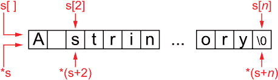
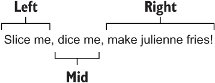
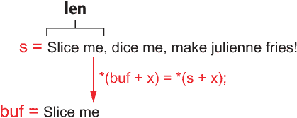
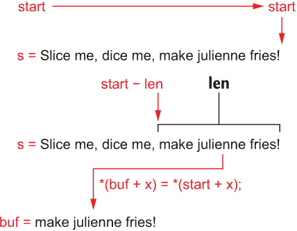
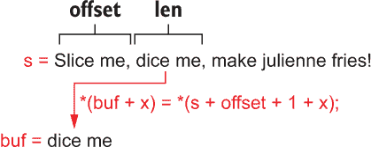
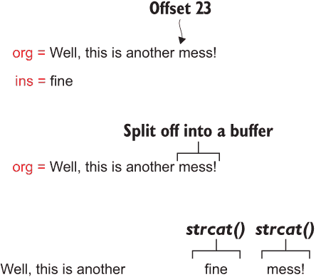
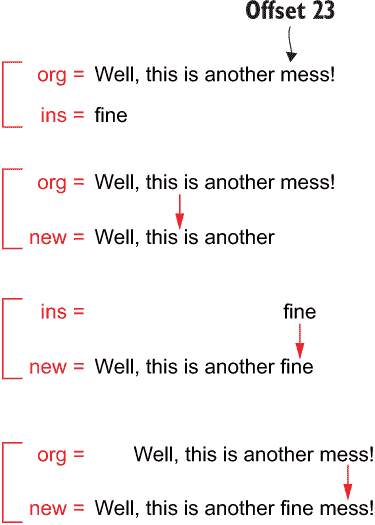
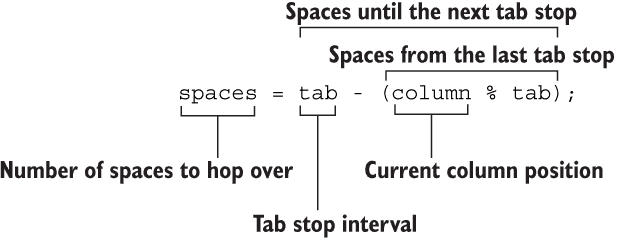

# 7 字符串工具

人们常说，而且有充分的理由，C 编程语言缺少字符串数据类型。这样的功能会很不错。这将更容易保证程序中的每个字符串都是真实的，并且所有字符串函数都能干净利落且无缺陷地工作。但这样的说法是不真实的。在 C 语言中，字符串是一个字符数组，弱类型，任何 C 程序员都容易出错。

是的，C 语言中存在实用的字符串函数。一个巧妙的程序员可以轻松地拼凑出任何字符串函数，模仿在其他一些更高层次的编程语言中可用的功能，但在 C 语言中却缺乏。然而，任何处理 C 语言中缺失字符串函数的创造性方法都必须处理语言对字符串概念的狭隘认识。因此，需要一些额外的训练，包括：

+   审视 C 语言中字符串的糟糕之处

+   理解字符串长度是如何测量的

+   创建有趣且有用的字符串函数

+   构建自己的字符串函数库

+   探索虚构的面向对象编程

尽管您可以在 C 语言中使用字符串，但抱怨和轻蔑仍然存在——这是合理的。C 字符串是柔软的东西。在创建或操作字符串时，即使是经验丰富的程序员也容易出错。然而，字符串作为有效的数据形式存在，并且对于通信是必要的。因此，准备好增强您的字符串知识并建立您的编程武器库。

## 7.1 C 语言中的字符串

您所称之为字符串的东西在 C 语言中并不存在，就像 *int* 或 *double* 这样的数据类型一样。没有程序员会担心整数变形或不正确地编码实数的二进制格式。这些数据类型——*int*、*double*，甚至 *char*——是原子。字符串是一个分子。它必须专门构建。

从技术上讲，字符串是一种特殊的字符数组类型。它有一个起始字符，位于内存中的某个地址。内存中的每个后续字符都是字符串的一部分，直到遇到空字符 \0 为止。这种临时结构在 C 语言中被用作字符串——尽管它仍然很柔软。如果您需要进一步了解柔软的概念，表 7.1 提供了比较性综述。

表 7.1 柔软的东西

| 事物 | 为什么它会变得柔软 |
| --- | --- |
| 街道交叉口限制线 | 因为很少有汽车停在限制线上。大多数只是滚过去。 |
| 爷爷说“不” | 给它点时间。做个可爱的表情有帮助。 |
| 建筑许可证 | 根据您与市长的关系友好程度，等待时间不同。 |
| 食物 | 在飞机上并不意味着同一件事。 |
| 性格 | 对自己来说很好；对相亲来说却不好。 |
| 肥胖 | 自 1940 年以来，精算表尚未更新。 |
| 社交媒体上的名声 | 等待几个小时。 |
| 海绵蛋糕 | 设计使然。 |

### 7.1.1 理解字符串

将您认为的字符串与字符数组区分开来很重要。尽管所有字符串都是字符数组，但并非所有字符数组都是字符串。例如：

```
char a[3] = { 'c', 'a', 't' };
```

这个语句创建了一个 *char* 数组 a[]。它包含三个字符：c-a-t。这个数组不是字符串。然而，下面的 *char* 数组是一个字符串：

```
char b[4] = { 'c', 'a', 't', '\0'};
```

数组 b[] 包含四个字符：c-a-t 加上空字符。这个终止的空字符使数组成为字符串。它可以由任何 C 语言字符串函数处理或作为字符串输出。

为了节省你的时间，并且让键盘的单引号键不会磨损，C 编译器允许你通过将字符放在双引号中来构建字符串：

```
char c[4] = "cat";
```

数组 c[] 是一个字符串。它由四个字符组成，c-a-t，加上编译器自动添加的空字符。尽管这个字符没有出现在声明中，但你必须在为字符串分配存储空间时考虑到它——总是！如果你这样声明字符串：

```
char d[3] = "cat";
```

编译器为 c-a-t 分配了三个字符，但没有为空字符分配。这个声明可能会被编译器标记——或者可能不会。无论如何，字符串是不规则的，并且，如果没有终止的空字符，操作或输出字符串会产生不可预测的甚至可能荒谬的结果。

因为编译器会自动为字符串分配存储空间，所以以下声明格式最常使用：

```
char e[] = "cat";
```

使用空括号时，编译器会计算字符串的存储空间，并为数组分配适当数量的元素，包括空字符。

尤其是在构建自己的字符串时，你必须注意考虑到终止的空字符：必须为它分配存储空间，并且你的代码必须确保字符串中的最后一个字符是 \0。

这里有一些字符串注意事项：

+   在分配字符串存储空间时，始终为空字符添加一个。字符串可以直接作为 *char* 数组声明分配，或者通过如 *malloc()* 这样的内存分配函数。

+   在使用字符串存储时，请记住，存储空间中的最后一个字符必须是空字符，无论缓冲区是否已满。

+   *fgets()* 函数通常用于读取字符串输入，它在其第二个参数大小中自动考虑了空字符。因此，如果你在 *fgets()* 语句中将值 32 作为大小参数使用，该函数在自动添加空字符以终止输入字符串之前存储最多 31 个字符。

+   没有终止的空字符，字符串函数会继续处理字节，直到遇到下一个随机的空字符。结果可能是垃圾输出——更糟糕的是，可能会引发段错误。

+   忘记空字符的一个问题是，通常内存中已经充满了空字符。缓冲区可能会溢出，但内存中已经存在的随机空字符可以防止输出看起来糟糕——以及你的错误被检测到。永远不要依赖于内存中静止的空字符。

+   空字符是终止字符串所必需的，但不是必须检查的。编译器不会检查它——它怎么能呢？这种缺乏确认、字符串包含的缺失，使得 C 语言中的字符串变得灵活。

### 7.1.2 测量字符串

这个部分的标题对我奶奶来说有完全不同的定义。不，她不编程，但她编织。在编织中，字符串更长，但在编程中，你不会使用 skein 这个词。相反，你会在字符计数上纠结。

在内存中存储的字符串比其文本多一个字符，这个额外的字符是终止字符串的空字符。它是字符串的一部分，但不在字符串“内部”。

根据 strlen()函数，字符串的长度仅为其字符数减去一个非打印的空字符。

那么，字符串有多长？

strlen()的 man 页面描述了其目的：

```
The strlen() function calculates the length of the string . . .
excluding the terminating null byte ('\0').
```

strlen()计算字符串中的字符数，转义字符被计为一个字符。例如，换行符\n 是一个字符，尽管它占据了两个字符位置。制表符\t 也是一个字符，尽管终端在输出时可能将其转换为多个空格。

不论我挑剔什么，strlen()返回的值可以在代码的其他地方使用，以操作字符串中的所有字符，而不会违反终止空字符或重复计算转义字符。如果你想将空字符包含在字符串的大小中，可以使用 sizeof 运算符，但请注意，这个技巧只适用于静态分配的字符串（否则，返回指针大小）。

在以下列表中，我们比较了 strlen()和 sizeof 返回的值。在代码的第 6 行声明了一个字符串 s[]，它包含 10 个字符。第 8 行的 printf()语句输出字符串的 strlen()值。第 9 行的 printf()语句输出字符串的 sizeof 值。

列表 7.1 string_size.c 的源代码

```
#include <stdio.h>
#include <string.h>

int main()
{
    char s[] = "0123456789";     ❶

    printf("%s is %lu characters long\n",s,strlen(s));
    printf("%s occupies %zu bytes of storage\n",s,sizeof(s));

    return(0);
}
```

❶ 10 个字符

这里是输出：

```
0123456789 is 10 characters long
0123456789 occupies 11 bytes of storage
```

strlen()函数返回字符串中的字符数；sizeof 返回字符串占用的存储量——本质上相当于 strlen()+1，但如果字符串小于其分配的缓冲区大小，sizeof 返回缓冲区大小而不是 strlen()+1。如果你将此更改应用到代码的第 6 行：

```
char s[20] = "0123456789";     ❶
```

❶ 现在 20 个字符的存储

这里是更新后的输出：

```
0123456789 is 10 characters long
0123456789 occupies 20 bytes of storage
```

尽管缓冲区的大小增加了，但空字符仍然位于 s[]数组中的第 10 个元素（第 11 个字符）。缓冲区的其余部分被认为是垃圾，但仍然被 sizeof 运算符报告为字符串的“大小”。

测量字符串也与关于空字符串和空字符串是什么的伟大哲学辩论有关。这种差异在其他编程语言中也很相关，在这些语言中，字符串可以明确地定义为 null 或空。在 C 中，由于其弱数据类型和松散的字符串，这种差异不太明显。考虑以下情况：

```
char a[5] = { '\0' };
char b[5];
```

在这两个数组 a[]和 b[]中，哪个是空字符串，哪个是空字符串？

你可能认为 C 不关心哪个字符串是哪个。显然，数组 a[]已初始化，而 b[]未初始化。其余的讨论是语义问题，但根据计算机科学，a[]是空字符串，b[]是空字符串。

在下一个列表中，我执行了一个测试，比较了两个字符串，空数组 a[]和空数组 b[]，以查看编译器是否注意到空字符串或空字符串之间的差异。使用*strcmp()*函数，当两个字符串相同时会返回零。

列表 7.2 empty-null.c 的源代码

```
#include <stdio.h>
#include <string.h>

int main()
{
    char a[5] = { '\0' };                                                ❶
    char b[5];                                                           ❷

    if( strcmp(a,b)==0 )                                                 ❸
        puts("Strings are the same");
    else
        puts("Strings are not the same");
    printf("Length: a=%lu b=%lu\n",strlen(a),<linearrow />strlen(b));    ❹
    printf("Storage: a=%zu b=%zu\n",sizeof(a), ),<linearrow /sizeof(b)); ❺

    return(0);
}
```

❶ 空字符串

❷ 空字符串（未初始化）

❸ 如果两个字符串相同

❹ 根据 strlen()的大小

❺ 根据 sizeof 的大小

程序的输出描述了字符串在内部是如何被看到的：

```
Strings are not the same
Length: a=0 b=4
Storage: a=5 b=5
```

当然，总有可能字符串 b[]在内存中的垃圾数据与字符串 a[]的内容匹配。因此，即使这个输出也不能真正被信任。我的意思是，为什么 strlen(b)返回值是 4？

就 C 语言中的字符串而言，我更喜欢将空字符串视为未初始化的。空字符串是一个更容易理解的概念。毕竟，在 C 中，有一个只包含终止空字符的字符串是完全合法的：这样的字符串长度为零。它可以被所有字符串函数操作。然而，除了这些好奇之处，你可以将“空字符串”和“空字符串”的争论留给其他更时尚编程语言的伟大维齐尔。

### 7.1.3 C 字符串函数回顾

许多 C 语言函数理解和处理字符串。假设字符串是一个*char*数组，并且正确终止。这种格式是诸如*printf()*, *puts()*, *fgets()*, 等函数处理字符串的方式。

字符串函数在 string.h 头文件中声明。标准 C 库字符串操作函数列在表 7.2 中。

表 7.2 常见 C 库字符串函数

| 函数 | 描述 |
| --- | --- |
| *strcat**()* | 将一个字符串附加到另一个字符串上，将两者连接起来 |
| *strncat**()* | 将两个字符串连接起来，但限于一定数量的字符 |
| *strchr**()* | 返回指向字符串中特定字符位置的指针 |
| *strcmp**()* | 比较两个字符串，匹配时返回零 |
| *strncmp**()* | 比较两个字符串，直到给定长度 |
| *strcoll**()* | 使用区域信息比较两个字符串 |
| *strcpy**()* | 将一个字符串中的字符复制到另一个字符串或缓冲区中 |
| *strncpy**()* | 从一个字符串复制指定数量的字符到另一个字符串 |
| *strlen**()* | 返回字符串中的字符数 |
| *strpbrk()* | 定位一个字符串中在另一个字符串中找到的第一个字符实例 |
| *strrchr()* | 返回指向字符串中字符的指针，从字符串的末尾开始测量 |
| *strspn()* | 返回指定字符在字符串中的位置，这些字符在另一个字符串中找到 |
| *strcspn()* | 返回指定字符在字符串中的位置，这些字符在另一个字符串中未找到 |
| *strstr()* | 返回一个字符串在另一个字符串中的位置 |
| *strtok()* | 根据分隔符字符解析字符串（反复调用） |
| *strxfrm()* | 根据区域信息将一个字符串转换为另一个字符串 |

许多字符串函数都有一个“n”伴随函数，例如 *strcat()* 和 *strncat()*。n 表示函数计算字符或通过设置字符串大小值来尝试避免溢出。

尽管表 7.2 只列出了常见的 C 库字符串函数，但你的编译器的库可能还有更多。例如，*strcasecmp()* 函数与 *strcmp()* 函数类似，但在比较时忽略字母的大小写。（见第十一章。）此外，*strfry()* 函数专门在 GNU C 库中可用。它随机交换字符串中的字符，类似于第六章中讨论的 *scramble()* 函数。

为了确保你总是感到警觉或困惑，一些编译器可能还会提供 strings.h 头文件。此头文件定义了一些额外的字符串函数，例如 strcasecmp()，与某些 C 库一起使用。我在本章中不涵盖这些函数。

### 7.1.4 返回与直接修改

在 C 中操作字符串的函数有两种方式可以使其更改。第一种是返回字符串的修改版本。第二种是直接操作传递的字符串。选择方法实际上取决于函数的目的。

例如，*strcat()* 函数将一个字符串追加到另一个字符串。以下是手册页格式：

```
char *strcat(char *dest, const char *src);
```

字符串 src（源）被追加到字符串 dest（目标）的末尾。该函数假定 dest 缓冲区有足够的空间来成功追加字符串。成功后，字符串 dest 包含 dest 和 src。该函数返回对 dest 的指针。*strcat()* 函数是直接操作传递的字符串的示例。

在下一个列表中，*main()* 函数中有两个字符串，s1[] 和 s2[]。*strappend()* 函数的任务是将这两个字符串粘合在一起，并返回对新、更长字符串的指针。秘密在于 *strappend()* 函数内部有 *strcat()* 函数，并且返回值（dest 的地址）。

列表 7.3 strcat.c 的源代码

```
#include <stdio.h>
#include <stdlib.h>
#include <string.h>

char *strappend(char *dest, char *src)
{
    return( strcat(dest,src) );          ❶
}

int main()
{
    char s1[32] = "This is another ";    ❷
    char s2[] = "fine mess!";
    char *s3;

    s3 = strappend(s1,s2);
    printf("%s\n",s3);

    return(0);
}
```

❶ *strcat()* 函数返回指针 dest，即新组合的字符串。

❷ 数组 s1[] 包含足够的空间来存储两个字符串。

程序的输出显示了连接后的字符串：

```
This is another fine mess!
```

在这个例子中，函数并没有真正创建一个新的字符串。它只是返回指向第一个传入的字符串的指针，现在它包含了两个字符串。

练习 7.1

修改 strcat.c 的源代码。从代码中移除 *strcat()* 函数，用你自己的代码替换它，将参数 src 的内容粘接到参数 dest 的末尾。不要使用 *strcat()* 函数来完成这个任务！相反，确定结果字符串的大小，并为它分配存储空间。*strappend()* 函数返回创建的字符串的地址。

你可以进一步修改代码，使得字符串 s1[] 只包含显示的文本；它不需要为新字符串分配存储空间。正确的分配是在 *strappend()* 函数中完成的。

我对这个练习的解决方案可以在在线存储库中找到，名为 strappend.c。代码中的注释解释了我的方法。记住，这段代码演示了字符串函数如何创建一个新的字符串，而不是修改作为参数传递的字符串。

## 7.2 字符串函数众多

C 语言有大量的字符串函数，但显然对于那些其他编程语言的“大人物”来说还不够。他们贬低 C 语言在字符串操作方面的能力。当然，任何你觉得 C 库中缺失的函数——那些在其他一些更时髦的编程语言中快乐地居住的函数——都可以轻松编写。你只需要记住包含那个至关重要的终止空字符，然后在 C 语言中就可以实现任何与字符串相关的事情。

在本节中，我介绍了一些字符串函数，其中一些在其他编程语言中存在，而另一些则是由于一些个人脑部缺陷而不得不创建的。无论如何，这些函数证明了在那些新出现的编程语言中你可以用字符串做的任何事情，在 C 语言中同样可以做到。

哦！有一点需要说明：在其他语言中找到的函数有时被称为 *方法*，因为它们与面向对象编程相关。嗯，*la-di-da*。我可以把我的车叫做蝙蝠车，但它仍然是一辆现代汽车。

### 7.2.1 改变大小写

在其他语言中，字符串中的文本大小写转换函数很常见。在 C 语言中，ctype 函数 *toupper()* 和 *tolower()* 分别将单个字符、字母转换为大写或小写。这些函数可以轻松地应用于整个字符串。你所需要做的就是编写一个处理这个任务的函数。

以下列表展示了 strupper.c 的源代码，该代码将字符串的小写字母转换为大写。字符串在函数内部被修改，其中 *while* 循环处理每个字符。如果字符在 'a' 到 'z' 的范围内，其第六位被重置（变为零），从而将其转换为小写。（这种位操作在第五章中有讨论。）*strupper()* 函数避免使用任何 ctype 函数。

列表 7.4 strupper.c 的源代码

```
#include <stdio.h>

void strupper(char *s)
{
    while(*s)                        ❶
    {
        if( *s>='a' && *s<='z' )     ❷
        {
            *s &= 0xdf;              ❸
        }
        s++;
    }
}

int main()
{
    char string[] = "Random STRING sample 123@#$";

    printf("Original string: %s\n",string);
    strupper(string);
    printf("Uppercase string: %s\n",string);

    return(0);
}
```

❶ 循环直到 *s 指向空字符（字符串的结尾）

❷ 仅更改小写字母

❸ 将第六位重置以转换为大写

这是程序的输出：

```
Original string: Random STRING sample 123@#$
Uppercase string: RANDOM STRING SAMPLE 123@#$
```

`*strupper()*`函数也可以通过执行基本数学运算将字符转换为大写。由于 ASCII 表的布局，以下语句也有效：

```
*s -= 32;
```

从每个字符的 ASCII 值中减去 32 也将它转换为小写。

修改`*strupper()*`函数以创建一个将字符转换为小写的函数很容易。以下是一个`*strlower()*`函数可能的样子：

```
void strlower(char *s)
{
    while(*s)
    {
        if( *s>='A' && *s<='Z' )     ❶
        {
            *s += 32;                ❷
        }
        s++;
    }
}
```

❶ 仅转换大写字母

❷ 加 32 以进行转换

显示`*strlower()*`函数完整源代码的在线仓库位于本书的在线资源库中，名为`strlower.c`。

练习 7.2

编写一个名为`*strcaps()*`的函数，该函数将字符串中每个单词的首字母大写。处理文本“这是一个示例字符串”或类似的字符串，其中包含多个用小写写的单词，包括至少一个单字母单词。该函数直接修改字符串，而不是生成一个新的字符串。

我的解决方案可以在在线仓库中找到，名为`strcaps.c`。它包含解释我的方法的注释。

### 7.2.2 反转字符串

改变字符串中字符顺序的关键是知道字符串的长度——它的起始位置和结束位置。

对于字符串的起始位置，使用字符串的变量名，它持有基本地址。字符串的结束地址没有存储在任何地方；代码必须找到字符串的终止空字符，然后使用数学方法计算字符串的大小。在其他编程语言中不需要这种数学计算，因为字符串的每个方面都是完全已知的。此外，在 C 语言中，字符串可能是不规则的，这会使这个过程变得不可能。

图 7.1 说明了字符串在内存中的样子，数组表示法和指针表示法指出了它的一些部分。终止的空字符标志着字符串的结束，无论其位置如何，都从字符串的起始位置测量为偏移量 n。



图 7.1 内存中字符串的测量

定位字符串的末尾最简单的方法是使用`*strlen()*`函数。将函数的返回值加到字符串在内存中的起始位置，以找到字符串的末尾。

对于 DIY 爱好者，你可以自己编写字符串结束函数或循环来定位字符串的末尾。假设字符指针`s`引用字符串的起始位置，而`*int`变量`len`被初始化为零。如果是这样，这个`*while*`循环将定位字符串的末尾，即空字符所在的位置：

```
while(*s++)
    len++;
```

在这个循环完成后，指针`s`引用字符串的终止空字符，而`len`的值等于字符串的长度（减去空字符）。以下是循环的更易读版本：

```
while( *s != '\0' )
{
    len++;
    s++;
}
```

找到字符串末尾最愚蠢的方法是使用 *sizeof* 操作符。操作符并不愚蠢，但当它用于 *char* 指针参数时，*sizeof* 返回指针（内存地址变量）占用的字节数，而不是指针引用的缓冲区的大小。例如，在我的计算机上，指针宽度为 4 字节，因此无论 *s* 指向的缓冲区大小如何，sizeof(s) 总是返回 4。

在获得字符串长度后，反转过程在字符串的背景中工作，将每个字符复制到另一个缓冲区中，从前往后。结果是包含原始字符串反向字符顺序的新字符串。

下一个列表中所示的 *strrev()* 函数创建了一个新的反转字符串。首先，一个 *while* 循环计算字符串的大小（参数 *s*）。其次，根据原始字符串的大小分配新字符串的存储空间。我不需要在 *malloc()* 语句中 +1 来为空字符腾出空间，因为变量 len 已经引用了空字符的偏移量。最后，一个 *while* 循环在填充字符串 reversed 时以反向顺序处理字符串 s。

列表 7.5 *strrev()* 函数

```
char *strrev(char *s)
{
    int len,i;
    char *reversed;

    len = 0;                                     ❶
    while( *s )                                  ❷
    {
        len++;
        s++;
    }

    reversed = malloc( sizeof(char) * len );     ❸
    if( reversed==NULL )
    {
        fprintf(stderr,"Unable to allocate memory\n");
        exit(1);
    }

    s--;                                         ❹
    i = 0;                                       ❺
    while(len)                                   ❻
    {
        *(reversed+i) = *s;                      ❼
        i++;                                     ❽
        len--;                                   ❾
        s--;                                     ❿
    }
    *(reversed+i) = '\0';                        ⓫

    return(reversed);                            ⓬
}
```

❶ 变量 len 包含了空字符的偏移量以及字符串的长度。

❷ 循环直到 *s 指向传递的字符串终止的空字符

❸ 为反转字符串分配存储空间；与传递的字符串长度相同

❹ 将 s 回退到终止的空字符；现在它指向传递的字符串中的最后一个字符

❺ 在新字符串中索引，并反转

❻ 复制原始字符串中的字符数

❼ 复制字符

❽ 增加反转字符串的偏移量

❾ 减少原始字符串的偏移量

❿ 回退指针

⓫ 总是使用空字符为新构造的字符串加顶！

⓬ 在这里不要释放指针！其数据必须保留。

此函数包含在 strrev.c 的源代码中，可在本书的在线仓库中找到。在 *main()* 函数中，输出一个示例字符串，然后输出反转后的字符串以进行比较。以下是一个示例运行：

```
Before: A string dwelling in memory
After: yromem ni gnillewd gnirts A
```

此代码仅展示了创建字符串反转函数的一种方法，尽管对于所有变体，通用方法都是相同的：反向处理原始字符串以创建新字符串。

### 7.2.3 字符串修剪

字符串截断函数在其他编程语言中很受欢迎。例如，我记得我在 BASIC 编程时代使用的 LEFT$、RIGHT$ 和 MID$ 命令。C 语言中没有类似的功能，但它们很容易创建。图 7.2 展示了每个命令的作用。



图 7.2 提取字符串的部分：左、中、右

每个函数至少需要两个参数：要切片的字符串和字符计数。中间提取函数还需要一个偏移量。对于我的方法，我决定返回一个包含所需块的新字符串，这样就不会破坏原始字符串。

下一个列表展示了我对 *left()* 函数的创造，它从传入的字符串 s 中提取 len 个字符。与每个修剪函数一样，为新字符串分配了存储空间。*left()* 函数是最容易编码的，因为它将传入字符串 s 的前 len 个字符复制到目标字符串 buf 中。buf 的地址被返回。

列表 7.6 *left()* 函数

```
char *left(char *s,int len)
{
    char *buf;                            ❶
    int x;

    buf = malloc(sizeof(char)*len+1);     ❷
    if( buf==NULL )
    {
        fprintf(stderr,"Memory allocation error\n");
        exit(1);
    }

    for(x=0;x<len;x++)                    ❸
    {
        if( *(s+x)=='\0' )                ❹
            break;
        *(buf+x) = *(s+x);                ❺
    }
    *(buf+x) = '\0';                      ❻

    return(buf);
}
```

❶ 用于新字符串的存储空间

❷ 为新字符串分配存储空间，加上一个空字符

❸ 复制 len 个字符

❹ 检查是否存在意外的空字符，并在找到时终止循环

❺ 复制字符

❻ 为新创建的字符串添加结束符

图 7.3 展示了 left() 函数的内部结构。



图 7.3 *left()* 函数切割字符串的方式

与 *left()* 函数不同，切割字符串的右侧需要程序知道字符串的结束位置。从前面章节中，你可能会记得 C 语言不跟踪字符串的尾部。你的代码必须找到那个终止的空字符。对于 *right()* 函数，我从一个空字符开始向后计数，以截断字符串的右侧。

我的 *right()* 函数如下所示。它从列表 7.6 中显示的 *left()* 函数借用了其分配例程。在创建缓冲区之后，代码寻找字符串的末尾，将指针起始位置移动到该位置。然后从 start 减去 len 的值，将指针重新定位到所需的右端字符串块的开头。然后，将 len 个字符复制到新字符串中。

列表 7.7 *right()* 函数

```
char *right(char *s,int len)
{
    char *buf;
    char *start;
    int x;

    buf = (char *)malloc(sizeof(char)*len+1);
    if( buf==NULL )
    {
        fprintf(stderr,"Memory allocation error\n");
        exit(1);
    }

    start = s;                ❶
    while(*start!='\0')       ❷
       start++;
    start -= len;             ❸
    if( start < s )           ❹
        exit(1);

    for(x=0;x<len;x++)        ❺
        *(buf+x) = *(start+x);
    *(buf+x) = '\0';          ❻

    return(buf);
}
```

❶ 使用指针 start 作为偏移量，保留变量 s 中的地址以供以后使用

❷ 搜索字符串的末尾

❸ 调整指针起始位置以引用字符串右端开始的位置

❹ 检查下溢并退出，如果为真

❺ 将字符串的最右侧部分复制到新缓冲区中

❻ 为新创建的字符串添加结束符

*right()* 函数的操作在图 7.4 中展示。



图 7.4 展示了提取字符串右侧的计算

最后一个字符串修剪函数实际上是唯一需要的：当给定适当的参数时，mid() 函数可以轻松地替代 *left()* 或 *right()* 函数。实际上，这两个函数可以基于 *mid()* 定义为宏。我将在接下来的几段中详细讨论这个话题。

我的 *mid()* 函数有三个参数：

```
char *mid(char *s, int offset, int len);
```

指针 s 引用要切割的字符串。整数偏移量是提取开始的字符位置。整数 len 是要提取的字符数。

完整的 *mid()* 函数在列表 7.8 中展示。它从传入的字符串 s 直接逐字符复制到新的字符串缓冲区 buf。然而，关键在于在传递字符时添加偏移量值：

```
*(buf+x) = *(s+offset-1+x)
```

偏移值必须减 1，以考虑到字符串中的字符从偏移 0 开始，而不是偏移 1。如果我要为该函数编写文档，我需要解释有效偏移量参数的范围是 1 到字符串长度。与 C 编码不同，你不想从零开始——尽管你可以。再次强调，在函数的文档中说明这一点。

列表 7.8 *mid()* 函数

```
char *mid(char *s, int offset, int len)
{
    char *buf;
    int x;

    buf = (char *)malloc(sizeof(char)*len+1);
    if( buf==NULL )
    {
        fprintf(stderr,"Memory allocation error\n");
        exit(1);
    }

    for(x=0;x<len;x++)                 ❶
    {
        *(buf+x) = *(s+offset-1+x);    ❷
        if( *(buf+x)=='\0')            ❸
            break;
    }
    *(buf+x) = '\0';                   ❹

    return(buf);
}
```

❶ 复制 len 个字符

❷ 偏移量值减 1，因为第一个字符的偏移是 0，而不是偏移 1。

❸ 捕获任何溢出并停止

❹ 总是给你自己创建的字符串加上标题。

图 7.5 展示了 *mid()* 函数的工作方式。



图 7.5 *mid()* 函数的操作

如我之前所写，通过使用 *mid()* 函数的特定格式，可以轻松地复制 *left()* 和 *right()* 函数。如果你要为 *left()* 函数编写宏，可以使用此格式：

```
#define left(s,n) mid(s,1,n)
```

当偏移量为 1 时，此 mid() 函数返回字符串 s 的最左侧 len 个字符。（记住，在 *mid()* 函数中，偏移值会减 1。）

要创建与 *mid()* 等效的 *right()* 函数，需要在调用中获取字符串的长度：

```
#define right(s,n) mid(s,strlen(s)-n,n)
```

第二个参数是字符串的长度（由 *strlen()* 函数获得），减去所需的字符数。我在宏中调用 *strlen()* 函数让我感到烦恼，但我的观点更多的是要展示字符串切片的真正强大函数是 *mid()* 函数。

你可以在本书在线仓库中找到所有这些字符串修剪函数——*left()*, *right()*, 和 *mid()*——位于 trimming.c 源代码文件中。

### 7.2.4 分割字符串

我编写我的字符串分割函数是出于愤怒。另一位程序员，一位那些花哨新语言的信徒嘲笑说：“你甚至不能用少于 20 行代码在 C 中分割字符串。”

接受挑战。

虽然我可以轻松地用少于 20 行代码在 C 中编写字符串分割函数，但我必须承认的一个观点是，这样的函数至少需要四个参数：

```
int strsplit(char *org,int offset,char **s1,char **s2)
```

指针 org 引用要分割的字符串。整数偏移量是分割的位置。最后两个指针，s1 和 s2，包含分割的两部分。这些指针通过引用传递，允许函数访问和修改其内容。

下一个列表显示了 my *strsplit()* 函数，它有 15 行简洁的代码——没有任何混淆。我使用了通常使用的空白和缩进。获取原始字符串的大小并用于为 s1 和 s2 分配存储空间。然后，*strncpy()* 函数将原始字符串的各个部分复制到单独的字符串中。函数在成功时返回 1，在出错时返回 0。

列表 7.9 *strsplit()* 函数

```
int strsplit(char *org,int offset,char **s1,char **s2)
{
    int len;

    len = strlen(org);                              ❶
    if(offset > len)                                ❷
        return(0);
    *s1 = malloc(sizeof(char) * offset+1);          ❸
    *s2 = malloc(sizeof(char) * len-offset+1);      ❹
    if( s1==NULL || s2==NULL )                      ❺
        return(0);
    strncpy(*s1,org,offset);                        ❻
    strncpy(*s2,org+offset,len-offset);             ❻
    return(1);
}
```

❶ 获取原始字符串的长度

❷ 如果偏移量参数超出范围，则返回零——错误。

❸ 为拆分字符串 1 分配存储空间，参数 s1 取反

❹ 为拆分字符串 2 分配存储空间，计算适当的大小

❺ 如果任一分配失败，则返回错误

❻ 将适当数量的字符复制到新字符串中

列表 7.9 中所示的 *strsplit()* 函数是我的第一个版本，我的目标是看看我能用多少行代码实现。它调用 C 库字符串函数执行一些基本操作，这意味着这个版本的 *strsplit()* 函数依赖于 string.h 头文件。我编写了另一个版本，避免了使用字符串库函数，尽管其代码显然更长。

列表 7.9 中所示的 *strsplit()* 函数可以在在线存储库中的 strsplit.c 源代码文件中找到。

### 7.2.5 在另一个字符串中插入一个字符串

当我最初考虑编写字符串插入函数时，我想我会使用两个 C 库字符串函数来完成这项任务：*strcpy()* 和 *strcat()*. 这些函数可以一步一步地构建字符串：*strcpy()* 函数将一个字符串复制到另一个，在另一个数组或内存块中复制一个字符串。*strcat()* 函数将一个字符串附加到另一个字符串的末尾，创建一个更大的字符串。插入的字符串被拼接起来：原始字符串，加上插入的文本，再加上原始字符串的其余部分。

函数将具有以下声明：

```
int strinsert(char *org, char *ins, int offset);
```

指针 org 是原始字符串，它必须足够大以容纳要插入的文本。指针 ins 是要插入的字符串；整数偏移量是字符串 ins 插入到字符串 org 中的位置（从 1 开始）。

我的 *strinsert()* 函数在成功时返回 1，在错误时返回 0。

这没有奏效。

使用 *strcpy()* 和 *strcat()* 的问题是我必须拆分原始字符串，保存剩余部分，然后构建最终字符串。这一步需要一个临时缓冲区来存储字符串 org 在偏移量位置上的剩余部分，如图 7.6 所示。然后，将字符串 ins 连接到字符串 org 的新末尾，然后将原始字符串 org 的末尾连接到结果。很混乱。



图 7.6 使用字符串库函数的过程使得插入字符串过于复杂。

此外，如图 7.6 所示，希望用户已经为原始字符串 org 分配了足够的存储空间以容纳要插入的文本。对我来说，这个希望太冒险了，所以我改变了我的方法。以下是函数更新的声明：

```
char *strinsert(char *org, char *ins, int offset);
```

函数的返回值是一个新创建的字符串，这避免了字符串 org 需要足够大以容纳插入字符串 ins 的必要性。返回字符串，即在函数内创建它，也避免了需要临时存储字符串 org 的剩余部分以供稍后连接。

在这种新的方法中，我逐个字符地构建新的字符串，在构建新字符串时在偏移量字符处插入字符串 ins。图 7.7 阐述了函数改进版本的运行方式。



图 7.7 将一个字符串插入另一个字符串的改进技术

而不是使用 *strcat*() 和 *strcpy()* 函数，我改进的 *strinsert()* 函数将字符顺序地从字符串 org 复制到一个新创建的缓冲区 new 中。一旦字符计数等于偏移量，就从字符串 ins 复制字符到新创建的缓冲区。之后，计数从字符串 org 继续进行。

你可以在本书在线仓库中找到完整的 *strinsert()* 函数，它从参数 org 和 ins 构建字符串 new，使用 C 库的 *strlen()* 函数；否则，字符串使用函数内的语句构建。

列表 7.10 *strinsert()* 函数

```
char *strinsert(char *org, char *ins, int offset)
{
    char *new;
    int size,index,append;

    size = strlen(org)+strlen(ins);         ❶
    if( offset<0 )                          ❷
        return(NULL);

    new = malloc(sizeof(char) * size+1);    ❸
    if( new==NULL )
    {
        fprintf(stderr,"Memory allocation error\n");
        exit(1);
    }

    offset -= 1;                            ❹
    index = 0;                              ❺
    append = 0;                             ❻
    while( *org )                           ❼
    {
        if( index==offset )                 ❽
        {
            while( *ins )                   ❾
            {
                *(new+index) = *ins;
                index++;
                ins++;
            }
            append = 1;                     ❿
        }
        *(new+index) = *org;                ⓫
        index++;
        org++;
    }
    if( !append )                           ⓬
    {
        while( *ins )
        {
            *(new+index) = *ins;
            index++;
            ins++;
        }
    }
    *(new+index) = '\0';                    ⓭

    return(new);
}
```

❶ 获取新字符串的大小

❷ 如果偏移量是一个愚蠢的值，则返回空字符串

❸ 为新字符串分配存储空间

❹ 减少偏移量值以考虑字符串从 0 开始而不是 1

❺ 跟踪通过新字符串的进度

❻ 状态变量用于跟踪 ins 字符串是否已被插入

❼ 遍历原始字符串

❽ 立即检查偏移量值以处理 offset = 0 的情况

❾ 插入 ins 字符串，将其添加到字符串 new 中

❿ 标记字符串已被插入

⓫ 从原始字符串继续构建新字符串

⓬ 确认已插入字符串；如果没有，则将字符串 ins 追加

⓭ 总是首字母大写你自己创建的字符串！

在函数中，我尝试处理偏移量参数大于字符串 org 长度的情况。我无法让它正常工作，所以我决定将超出范围的值作为一个特性：如果偏移量的值大于字符串 org，则无论偏移量值如何，都将字符串 ins 追加到字符串 org。

你可以在本书在线仓库的源代码文件 strinsert.c 中找到 *strinsert()* 函数。以下是程序的输出，其中字符串“fine”（加上一个空格）被插入到字符串“Well, this is another mess!”的偏移量 23 处：

```
Before: Well, this is another mess!
After: Well, this is another fine mess!
```

### 7.2.6 在字符串中计数单词

要解决在字符串中计数单词的难题，你必须编写能够识别单词开始位置的代码。如果你完成了练习 7.2，你已经编写了这样的代码，它将字符串中单词的第一个字符转换为大写。可以将 *strcaps()* 函数修改为计数单词而不是将字符转换为大写。

下一个列表展示了针对练习 7.2 的解决方案的更新（你后悔按顺序阅读这一章了吗？），其中 *strwords()* 函数按顺序逐个消费字符串的字符。变量 inword 决定当前字符是否在单词内部。每次新单词开始时，变量 count 就会增加。

列表 7.11 源代码文件 strwords.c 中的 *strwords()* 函数

```
#include <stdio.h>
#include <ctype.h>

int strwords(char *s)
{
    enum { FALSE, TRUE };         ❶
    int inword = FALSE;           ❷
    int count;

    count = 0;                    ❸
    while(*s)                     ❹
    {
        if( isalpha(*s) )         ❺
        {
            if( !inword )         ❻
            {
                count++;          ❼
                inword = TRUE;    ❽
            }
        }
        else
        {
            inword = FALSE;       ❾
        }
        s++;
    }

    return(count);
}

int main()
{
    char string[] = "This is a sample string";

    printf("The string '%s' contains %d words\n",
            string,
            strwords(string)
          );

    return(0);
}
```

❶ 创建常量 FALSE=0 和 TRUE=1

❷ 假设代码没有在单词内部读取

❸ 初始化单词计数

❹ 遍历字符串 s

❺ 当前字母是否为字母？

❻ 确认正在处理的不是一个单词

❼ 在单词内部增加计数

❽ 重置 inword 变量

❾ 对于非字母字符，inword 是 FALSE

这里是 strwords.c 程序的一个示例运行：

```
The string 'This is a sample string' contains 5 words
```

如果你将字符串中的 word 改为 isn’t，这里是将修改后的输出：

```
The string 'This isn't a sample string' contains 6 words
```

嗯嗯。

练习 7.3

修改列表 7.11 中所示的 *strwords()* 函数，使其能够处理缩写。这个任务有一个简单的解决方案，它是在第一本 C 语言编程书籍《C 程序设计语言》中提出的，由 Brian Kernighan 和 Dennis Ritchie 编写（Pearson，1988 年）。不作弊，看看你是否能完成同样的任务。

我的解决方案名为 strwords2.c，并且可以在本书的在线仓库中找到。

### 7.2.7 将制表符转换为空格

在 Linux 中使用的终端足够智能，能够输出制表符到显示器的下一个虚拟制表位。这些制表位默认设置为 8 个字符。一些 shell，如 *bash* 和 *zsh*，具有 *tabs* 命令，可以将制表位设置为不同的字符间隔：例如，tabs 4 设置一个宽度为 4 个字符的终端制表位。

以下 *printf()* 语句输出包含两个制表符的字符串：

```
printf("Hello\tHi\tHowdy\n");
```

这里是输出：

```
Hello   Hi      Howdy
```

制表符没有扩展为固定数量的字符。相反，它被 shell 解释，并在显示器的 8 个字符间隔的下一个虚拟制表位处扩展。这种效果确保了使用制表符对齐文本或创建表格时，列能够完美对齐。

显然，你不需要将制表符转换为空格来在终端上输出。但你可以编写一个函数，该函数可以在程序输出中设置可变宽度的制表位。这些制表位的宽度是通过输出空格来创建的；本书不涉及终端硬件编程。

要设置制表位，你必须知道文本输出在屏幕上的位置——当前列值。这个值与所需的制表位宽度进行比较，使用以下公式：

```
spaces = tab - (column % tab)
```

这里是这个语句是如何工作的：



(column % tab) 表达式返回自上次制表位间隔（tab）以来基于光标当前列偏移量（column）的空格数。为了获得到下一个制表位的空格数，从这个值中减去制表位宽度。结果是输出下一个字符与制表位对齐所需的空格数。

制表位计算公式作为 *strtabs()* 函数中的一个语句存在，该函数在下一列表中显示。该函数输出一个字符串，仔细检查每个字符是否有制表符，\t。当遇到时，计算下一个制表位偏移量，并输出给定数量的空格。

列表 7.12 源代码文件 strtabs.c 中的 *strtabs()* 函数

```
#include <stdio.h>

void strtabs(const char *s, int tab)
{
    int column,x,spaces;

    column = 0;                               ❶
    while(*s)                                 ❷
    {
        if( *s == '\t')                       ❸
        {
            spaces = tab - (column % tab);    ❹
            for( x=0; x<spaces; x++ )         ❺
                putchar(' ');
            column += spaces;                 ❻
        }
        else                                  ❼
        {
            putchar(*s);
            if( *s=='\n' )                    ❽
                column = 0;
            else
                column++;
        }
        s++;
    }
}

/* calculate and display a tab */
int main()
{
    const char *text[3] = {
      "Hello\tHi\tHowdy\n",
      "\tLa\tLa\n",
      "Constantinople\tConstantinople\n"
    };
    int x,y;

    for(y=4;y<32;y*=2)                        ❾
    {
        printf("Tab width: %d\n",y);
        for(x=0;x<3;x++)
        {
            strtabs(text[x],y);
        }
    }

    return(0);
}
```

❶ 列变量跟踪当前列位置。

❷ 遍历字符串

❸ 捕获制表符

❹ 计算输出到下一个制表位所需的空格数

❺ 输出所需空格

❻ 更新列偏移量

❼ 在此处处理其他字符

❽ 如果输出换行符，则重置列值

❾ 嵌套循环以在三个不同的制表符位置输出三个示例字符串：4、8 和 16 个空格

程序的输出生成三个字符串，使用三个不同的制表符设置的不同制表符模式。以下是输出：

```
Tab width: 4
Hello   Hi  Howdy
    La  La
Constantinople  Constantinople
Tab width: 8
Hello   Hi      Howdy
        La      La
Constantinople  Constantinople
Tab width: 16
Hello           Hi              Howdy
                La              La
Constantinople  Constantinople
```

当终端窗口遇到制表符时，它不会像 strtabs.c 程序那样将制表符转换为多个空格。对于终端窗口，光标本身在屏幕上移动所需的字符位置；不会输出空格。为了证明这一点，可以查看生成制表符的某些程序的输出，并查看原始数据。你会看到制表符字符（ASCII 9），而不是一系列空格。

## 7.3 字符串库

将所有字符串操作函数投入使用或处理任何特定的函数集合的最好方法之一是创建自己的自定义库。这是一种与他人共享函数或以实用方式为自己准备函数的方法。

你可能已经了解其他库并可能使用过它们，例如数学库。创建这些工具并不困难，了解如何创建它们也不是秘密：如果你知道如何编译代码，你就可以创建一个库。

所有的 C 库都是由某人创建的——一些聪明的程序员将函数和其他必需元素拼凑在一起，以便让你分享他们的天才。即使是 C 标准库也是由 C 程序员编写的，他们是编程领域的最高统治者。

使用你的字符串库就像使用其他库一样简单；你的字符串库在构建时被链接到目标代码文件中。函数由自定义头文件原型化和支持。对于你的库，一切工作方式与其他库相同。

对于字符串库，我将包括本章中展示的许多函数。如果你有额外的、喜欢的字符串函数，也请随意添加。本节中的说明解释了细节，并提供了创建你自己的自定义库的技巧。

### 7.3.1 编写库源文件和头文件

创建库从源代码编辑器开始。你的目标是至少创建两个文件：

+   源代码文件

+   包含函数原型的头文件

源代码是一个或多个文件（取决于你的工作方式），包含库中所有函数——仅仅是函数。你不需要`main()`函数，因为你正在构建一个库，而不是一个程序。这个文件就像任何其他源代码文件一样编译，但它不会被链接。你只需要目标代码文件（.o），就可以创建库。

库还需要一个头文件，该头文件包含函数原型的定义常量、必要的包含文件以及其他有助于函数的元素。例如，如果一个函数使用一个结构体，那么它必须在源代码文件和头文件中声明。使用你的库的程序员需要结构定义来使函数工作。头文件是放置这些元素的地方，也是程序员使用你的库时引用这些元素的地方。

在图 7.13 中，你可以看到 mystring.c 源代码文件的第一部分，其中包含了许多在本章中演示的字符串函数。该文件包含描述性注释，这些注释可以扩展以显示版本历史、提供提示和示例。源代码文件中的#include 指令对于函数是必需的，就像在任何源代码文件中一样。此外，看看我如何无力地尝试为每个函数编写文档，显示参数和返回值？是的，这些信息可以进一步扩展；文档是好的。

列表 7.13 mystring.c 库源代码文件的第一部分

```
/* mystring library */                   ❶
/* 10 September 2021 */                  ❶
/* Dan Gookin, dan@gookin.com */         ❶

#include <stdio.h>                       ❷
#include <stdlib.h>                      ❷
#include <string.h>                      ❷
#include <ctype.h>                       ❷

/* Return the left portion of a string   ❸
   s = string                            ❸
   len = length to cut from the left     ❸
   return value: new string              ❸
 */  
char *left(char *s,int len)              ❹
{
```

❶ 介绍库文件的注释

❷ 本文件中函数所需的头文件

❸ 介绍和描述每个函数的注释

❹ 函数本身（继续）

源代码文件中函数的顺序并不重要——除非一个函数引用了另一个函数。在这种情况下，确保被引用的函数出现在引用它的函数之前（上方）。

你的库的伴随头文件没有在库的源代码文件中列出（参见图 7.13）。头文件对于为使用你的库的程序员提供支持是必要的；只有当头文件中的项目（例如定义的常量）在代码中被引用时，你才需要在源代码文件中包含库的头文件。头文件的关键是函数原型、结构体、全局/外部变量定义、宏和定义的常量。

就像库的源代码文件一样，我建议注释头文件以记录其各个部分。这对你的程序员朋友们会有帮助。此外，我在头文件中添加了定义的版本号常量，如下所示。

列表 7.14 支持 mystring 库的 mystring.h 头文件

```
/* mystring library header file */                       ❶
/* 10 September 2021 */                                  ❶
/* Dan Gookin, dan@gookin.com */                         ❶

#define mystring_version "1.0"                           ❷
#define mystring_version_major 1                         ❷
#define mystring_version_minor 0                         ❷

char *left(char *s,int len);                             ❸
char *mid(char *s, int offset, int len);                 ❸
char *right(char *s,int len);                            ❸
void strcaps(char *s);                                   ❸
char *strinsert(char *org, char *ins, int offset);       ❸
void strlower(char *s);                                  ❸
char *strrev(char *s);                                   ❸
int strsplit(char *org,int offset,char **s1,char **s2);  ❸
void strtabs(const char *s, int tab);                    ❸
void strupper(char *s);                                  ❸
int strwords(char *s);                                   ❸
```

❶ 在注释中介绍你的库头文件

❷ 版本号定义的常量

❸ 函数原型

源代码文件和头文件都是使用库所必需的。

### 7.3.2 创建库

库是从目标代码文件创建的。*ar*（归档）实用程序是将目标代码文件转换为库的工具。因此，创建库的第一步是编译——但不链接——你的库的源代码文件。一旦你有编译后的目标代码，你使用*ar*实用程序来创建库。

对于这个示例，我使用的是 mystring.c 源代码文件，该文件可以从本书的在线代码仓库中获取。要将源代码编译成对象代码，指定 -c 开关。此开关对所有 C 编译器都可用。以下是 *clang* 的命令格式：

```
clang -Wall -c mystring.c
```

-c 开关指示 *clang* “仅编译”。源代码文件被编译成对象代码 mystring.o，但不会链接以创建程序。这一步骤会为所有源代码文件重复进行，尽管你可以在一个命令中指定所有这些：

```
clang -Wall -c first.c second.c third.c
```

对于这个命令，创建了三个对象代码文件：first.o、second.o 和 third.o。

下一步是使用归档工具 *ar* 来构建库。此命令后跟三个参数：命令开关、库文件名，以及最后构建库所需的对象代码文件。例如：

```
ar -rcs libmystring.a mystring.o
```

这里是开关的功能：

+   -c——创建归档

+   -s——索引归档

+   -r——将文件（们）插入到归档中

你可以指定它们为 *-rcs* 或 *-r* *-c* *-s*——两种方式都可以。

库文件名将是 libmystring.a。*ar* 工具使用对象代码文件 mystring.o 来创建库。如果需要多个对象代码文件，请在 mystring.o 之后指定它们。

成功后，*ar* 工具会创建名为 libmystring.a 的库。这种命名格式遵循 Linux 中的约定：libname.a。库以 lib 开头，然后是 name，即库的名称。文件扩展名是点-a。

.a 扩展名以及本节中概述的创建库的过程是为静态库设计的，而不是动态库。静态模型最适合此类库，此类库仅由命令行程序使用，并且不需要动态库的功能。我在本书中不涉及动态库。

### 7.3.3 使用字符串库

要使用除标准 C 库之外的库，必须在构建时指定其名称。-l（小写的 L）开关紧随库名称之后。名称是库文件名中使用的唯一部分，不是前三个字母（lib）或 .a 扩展名。

如果你已经将库复制到了 /usr/local/lib 文件夹中，链接器会在这里搜索它。否则，-L（大写的 L）开关会指示链接器在特定目录中查找库文件。对于与你的程序在同一文件夹中创建的库，例如在本书的示例中工作，指定 -L（破折号-大写的 L-点）开关以指示链接器在当前目录中查找。例如：

```
clang -Wall -L. libsample.c -lmystring
```

当*clang*将 libsample.c 源代码构建成程序时，它将链接器指向当前目录（-L.）以查找库文件 libmystring.h（-lmystring）。此命令的格式很重要；必须指定-l 开关最后，否则你会看到链接器错误。（一些编译器可能足够智能，能够将库开关识别为任何命令行参数，尽管我的经验让我建议将-l 开关放在最后。）

下一个列表显示了在本书的在线仓库中可找到的 libsample.c 源代码。第 8 行的*strcaps()*函数是 mystring 库的一部分。其原型可以在 mystring.h 头文件中找到（也包含在仓库中），尽管包含该函数代码的是库。第 2 行显示了双引号中的头文件，这指示编译器在当前目录中查找它。

列表 7.15 libsample.c 的源代码

```
#include <stdio.h>
#include "mystring.h"      ❶

int main()
{
    char string[] = "the great american novel";

    strcaps(string);       ❷
    printf("%s\n",string);

    return(0);
}
```

❶ 在当前目录中查找包含*strcaps()*函数原型的这个头文件

❷ 此函数位于 libmystring.a 库中，在构建时链接。

下面是使用前面显示的命令构建和链接程序时的输出：

```
The Great American Novel
```

就像你可以将个人库的副本放在/usr/local/lib 文件夹中一样，你可以在/usr/local/include 文件夹中放置库的头文件副本。这一步避免了使用双引号来设置头文件的位置；与/usr/local/lib 一样，编译器会扫描/usr/local/include 文件夹以查找头文件。

## 7.4 一种类似 OOP 的方法

C 是一种过程式编程语言。不优雅地说，这个描述意味着 C 代码从上到下运行，一件事情接着另一件事情发生。像 C 这样的旧编程语言也是过程式的。这个列表包括 BASIC、Fortran、COBOL 和其他遗迹。但不要让它们的古老性欺骗了你！在 Y2K 危机期间，COBOL 程序员赚了大钱。

较新的编程语言是面向对象的。它们以不同的方式处理编程任务，你可以在关于这些流行和趋势的数字方言的精彩书籍中了解到这一点。不要深入细节，保持这个讨论模糊以避免吹毛求疵，面向对象编程（OOP）涉及方法而不是函数。"方法"像函数一样工作，尽管它们通常是它们所操作的数据类型的一部分。

例如，如果你想在 Java 编程语言中获取字符串的长度，你使用这个构造：

```
Len = Str.length()
```

字符串变量命名为 Str。点操作符访问附加到所有字符串对象上的*length()*方法。（明白了吗？）返回的结果是字符串 Str 中的字符数。等效的 C 语言语句是：

```
len = strlen(str);
```

点操作符也在 C 中使用，特别是在结构体中。字符串的一个成员可以是……一个函数。惊喜。

### 7.4.1 向结构体添加函数

结构体包含特定数据类型的成员：*int*，*float*，*char*，等等。结果证明，函数也是一种数据类型，它可以作为结构体的成员。

作为比较，如果你在 C 语言中已经有一段时间了，你知道许多函数可以接受另一个函数作为参数；*qsort()* 函数使用另一个函数（其名称作为地址）作为其参数之一。与作为参数的函数一样，指定函数作为结构体成员需要使用特定的格式：

```
type (*name)(arguments)
```

类型是一个数据类型，函数返回的值或 *void* 表示没有返回值。

名称是函数的名称，这实际上是一个指针。在这个格式中，函数的名称后面不跟括号。相反，参数项列表出了传递给函数的任何参数。

为了形成一个清晰的画面，这里是一个结构定义，其中包含一个函数作为其成员之一：

```
struct str {
    char *string;
    unsigned long (*length)(const char *);
};
```

str 结构体的函数成员被引用为 length。它接受一个 *const char* 指针——一个字符串——作为其参数。它返回一个 *unsigned long* 值。这个声明仅仅创建了一个作为 str 结构体成员的函数，该结构体还包含一个字符串成员。为了使函数成员工作，它必须被分配给一个特定的函数。在这种情况下，我心中的函数是 *strlen()*，它接受一个 *const char* 指针作为参数并返回一个 *unsigned long* 值。

创建一个结构体仅仅定义了其成员。要使用结构体，必须创建一个该结构体类型的变量。在这里，创建了结构体 str 变量 str1：

```
struct str str1;
```

并且其成员必须被赋予值。以下是长度成员的赋值方式：

```
str1.length = &strlen;
```

长度成员的函数是 *strlen()*。它指定时没有括号，前缀是和符号以获得其地址。一旦分配，函数成员就可以像任何函数一样被调用。例如：

```
len = str1.length(str1.string);
```

成员 str1.length 是一个函数（秘密中是 *strlen()*）。它操作的是同一结构体中的字符串成员，str1.string。返回的值，即字符串的长度，存储在变量 len 中。

下面的列表展示了 struct_funct.c 源代码中所有这些疯狂的步骤。此文件可在本书的在线仓库中找到。

列表 7.16 struct_funct.c 的源代码

```
#include <stdio.h>
#include <string.h>                                ❶

int main()
{
    struct str {
        char *string;
        unsigned long (*length)(const char *);     ❷
    };
    struct str str1;                               ❸
    char s[] = "Heresy";

    str1.string = s;                               ❹
    str1.length = &strlen;                         ❺

    printf("The string '%s' is %lu characters long\n",
            str1.string,
            str1.length(str1.string)               ❻
          );

    return(0);
}
```

❶ 必须包含 string.h 头文件以定义 strlen() 函数

❷ 结构体 str 的函数成员

❸ 创建了一个 str 结构体类型的变量 str1。

❹ 字符串成员被分配。

❺ 函数被分配，没有括号，并且前缀是地址运算符。

❻ 函数在 *printf()* 语句中被调用。

这是程序的输出：

```
The string 'Heresy' is 6 characters long
```

我必须承认，表达式 str1.length(str1.string) 并不能神奇地将 C 语言转变为面向对象编程语言。然而，对于那些努力使 C 语言更接近 OOP 的勇敢程序员来说，这是他们采取的方法。他们甚至可能拼凑宏来使这个装置看起来更整洁，例如 str.length()，这正是我所期望的。尽管如此，C 语言并不是为了提供这样的结构而创建的。大多数想要使用 OOP 的程序员会转向 C++、C# 和 Python 等语言。

### 7.4.2 创建字符串“对象”

我冒着在 C 编程世界中受到异端指控并被放逐的风险，但可以进一步扩展使 C 语言更接近 OOP 的想法。考虑一下，你可以创建一个字符串结构“对象”。C 语言的问题是实现必须通过函数来完成。

例如，你可以编写一个函数来创建伪字符串对象。这个函数需要一个字符串结构作为参数。这样的结构可能看起来像这样：

```
struct string {
  char *value;
  int length;
};
```

这个例子很简单。你可以添加其他字符串描述符作为结构成员，也许还可以添加一些函数。但是，对于一个伪字符串对象的演示，这个结构已经足够了。

要创建这个假字符串对象，需要一个 *string_create()* 函数。这个函数接收一个指向字符串结构的指针以及字符串的内容（文本）：

```
int string_create(struct string *s, char *v)
```

指针是必要的，以便函数可以直接修改结构。如果没有指针，函数中对传递的结构所做的任何更改都将被丢弃。传递的字符串 v 最终将与其他信息一起纳入结构中。

下一个列表展示了 *string_create()* 函数。它根据对象是否成功创建返回 TRUE 或 FALSE 值：获取并存储字符串的长度在结构的长度成员中。这个值用于为字符串分配存储空间。我认为为字符串分配特定的存储空间比复制传递的字符串指针更好，因为指针可能会在未来发生变化。

列表 7.17 *string_create()* 函数

```
int string_create(struct string *s, char *v)
{
    if( s==NULL )                                        ❶
        return(FALSE);

    s->length = strlen(v);                               ❷

    s->value = malloc( sizeof(char) * s->length +1 );    ❸
    if( s->value==NULL )
        return(FALSE);

    strcpy(s->value,v);                                  ❹

    return(TRUE);                                        ❺
}
```

❶ 确认字符串可用；如果不可用，则返回 FALSE

❷ 赋予字符串的长度

❸ 为字符串分配存储空间

❹ 将原始字符串复制到新分配的存储空间

❺ 成功时返回 TRUE

正如创建对象一样，必须存在一个伴随的 *string_destroy()* 函数。这个函数移除对象，这意味着释放字符串的存储空间，并将任何其他结构成员设置为 0。

下一个列表展示了 *string_destroy()* 函数，它使用唯一的参数作为要清除的字符串结构。该函数执行三项操作：释放分配的内存，将值指针赋值为 NULL（这确认了内存已被释放），并将字符串的长度设置为 0。这个函数不会像面向对象的语言那样销毁结构变量。

列表 7.18 *string_destroy()* 函数

```
void string_destroy(struct string *s)
{
    free(s->value);      ❶
    s->value = NULL;     ❷
    s->length = 0;       ❸
}
```

❶ 释放字符串存储内存

❷ 将指针赋值为 NULL，这可以在以后用来测试字符串结构的有效性

❸ 将字符串长度重置为零

当然，在销毁字符串结构变量之后，它可以被重新使用或重新分配。关键是对于“对象”，要有创建函数和销毁函数，这模仿了一些面向对象编程语言处理对象的方式。

该书在线仓库中可用的源代码文件 string_object.c 展示了这两个函数。在代码中，你可以看到字符串结构是在外部声明的，这使得所有函数都可以访问其定义。

有可能扩展字符串结构，添加更多描述字符串的成员——包括函数成员。我将这个话题留给你进一步探索，但请记住，面向对象编程语言可供你学习和玩耍。强迫 C 语言适应这种模式是一个考虑因素，但我更建议关注语言的优势，而不是假装它是其他东西。
